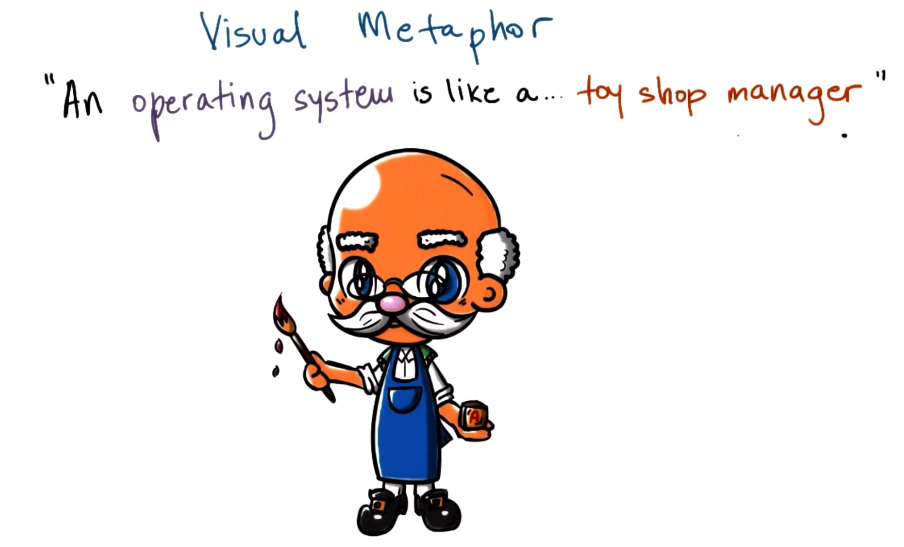

# P1L2: Introduction to Operating Systems

## 1. Preview

This introductory level provides a high-level overview of operating systems, e.g.,:
  * What is an **operating system**, and what role does it play in computer systems?
  * What are key **components** of an operating system?
  * Design and implementation considerations of operating systems

### Simple OS Definition

In simple terms, an **operating system** is a piece of software that ***abstracts*** and ***arbitrates*** the use of the underlying computer/hardware system.
  * An **abstraction** provides a simplified "look" of the underlying entity (i.e., hardware)
  * **Arbitration** involves the management and oversight of the hardware

This course will highlight several abstraction and arbitration mechanisms for the various types of hardware components in computer systems.

## 2. Visual Metaphor

An operating system is like a *toy shop manager*:

| Characteristic | Toy Shop Manager Metaphor | Operating System |
| :--: | :--: | :--: |
| Directing operational resources | control use of employee time, parts, tools, etc. | control use of CPU, memory, peripheral devices, etc. and deciding their use by applications |
| Enforcing working policies | fairness, safety, clean-up, etc. | fair access to shared resources, limits to resource usage (e.g., number of files opened per process, established threshold to initiate memory-managing daemons, etc.), etc. |
| Mitigating difficulty of complex tasks | simplifies operation and optimizes performance | abstracts hardware details to running applications via **system calls** |

## 3. What Is an Operating Systems?

