# P1L2: Introduction to Operating Systems

## 1. Preview

This introductory lesson provides a high-level overview of operating systems, e.g.,:
  * What is an **operating system**, and what role does it play in computer systems?
  * What are key **components** of an operating system?
  * Design and implementation considerations of operating systems

### Simple OS Definition

In simple terms, an **operating system** is a piece of software that ***abstracts*** and ***arbitrates*** the use of the underlying computer/hardware system.
  * An **abstraction** provides a simplified "look" of the underlying entity (i.e., hardware)
  * **Arbitration** involves the management and oversight of the hardware

This course will highlight several abstraction and arbitration mechanisms for the various types of hardware components in computer systems.

## 2. Visual Metaphor

An operating system is like a *toy shop manager*:

| Characteristic | Toy Shop Manager Metaphor | Operating System |
| :--: | :--: | :--: |
| Directing operational resources | control use of employee time, parts, tools, etc. | control use of CPU, memory, peripheral devices, etc. and deciding their use by applications |
| Enforcing working policies | fairness, safety, clean-up, etc. | fair access to shared resources, limits to resource usage (e.g., number of files opened per process, established threshold to initiate memory-managing daemons, etc.), etc. |
| Mitigating difficulty of complex tasks | simplifies operation and optimizes performance | abstracts hardware details to running applications via **system calls** |

## 3. What Is an Operating Systems?

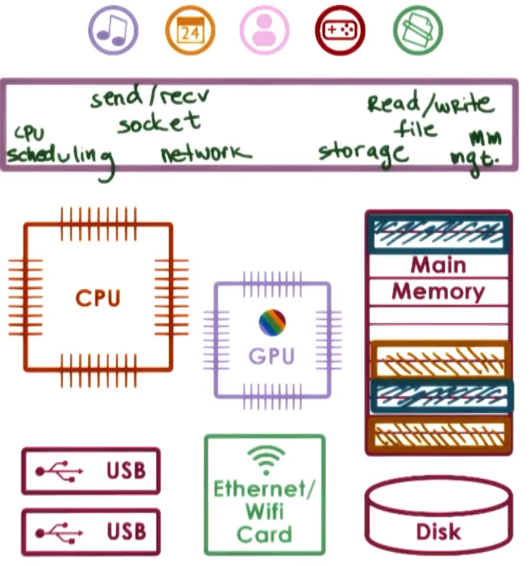

A **computing system** is comprised of several hardware **components**:
  * One or more **processors** (or **CPUS**)
    * Modern processors additionally consist of multiple **cores** in a single CPU chip
  * **Main memory**
  * **Network devices** (e.g., Ethernet/WiFi card)
  * **Graphics processors** (or **GPUs**)
  * **Storage devices** (e.g., hard-disk drives/HDDs, flash drives, solid-state drives/SSDs, etc.)

With the exception of specific environments (e.g., embedded platforms, sensors, etc.), all of these hardware components will be used by multiple **applications** in general, for example:
  * A laptop running a browser, text editor, Skype, etc.
  * A data center running a Web server, a database, a computationally intensive simulation, etc.

The **operating system** is therefore the layer of software sitting between the complex hardware and the applications. While there is no universal definition of an operating system, it is useful to consider the role that it serves and the functionality that it provides to build a better understanding of what it is.

The operating system:
  * hides the complexity of the underlying hardware, both from the applications and the applications developers
    * it abstracts the underlying **storage** devices with the concept of a **file**, which can be read from / written to by the application 
    * it abstracts the underlying **networking** infrastructure (e.g., bits, packets, etc.) by providing a higher level abstraction called a **socket** which can be sent and received
  * manages **resources** (i.e., the underlying hardware) on behalf of the executing applications
    * it decides how many and which of the hardware components will be used by the application (e.g., via memory allocation and CPU scheduling for its execution)
  * provides isolation and protection
    * this is important when multiple applications are running concurrently on the same hardware, to ensure that they can progress adequately without harming one another (e.g., allocating applications to different parts of the main memory to prevent mutual access, as depicted in the figure above)
    * these types of mechanisms are also important in environments traditionally considered embedded platforms (e.g., mobile phones, which previously only ran one application at a time)

## 4. Operating System Definition

In summary, an **operating system** is a layer of systems software that...
  * directly has ***privileged access*** to the underlying hardware (unlike application software, which does not)
  * hides the hardware complexity
  * manages hardware on behalf of one of more applications according to some predefined **policies**
  * in addition, it ensures that applications are isolated and protected from one another

## 5. Operating System Components Quiz and Answers

Which of the following are likely components of an operating system? Check all that apply.
  * file editor
    * `NO` - not involved in directly managing hardware
  * file system
    * `YES` - directly hides hardware complexity and provides a "file" abstraction (i.e., rather than directly using a block of disk storage)
  * device driver
    * `YES` - makes decisions regarding the usage of the corresponding hardware device
  * cache memory
    * `NO` - while the operating system and application software utilize cache memory for performance, the operating system does not directly manage the cache (but rather, this is managed by the hardware itself)
  * Web browser
    * `NO` - this is application software, which does not have direct access to the underlying hardware
  * scheduler
    * `YES` - responsible for distributing access to the processor/CPU among all of the applications sharing that platform

## 6. Abstraction or Arbitration Quiz and Answers

For the following options, indicate if they are examples of *abstraction* (B) or *arbitration* (R).
  * distributing memory between multiple processes
    * `R` - this is memory management by the operating system
  * supporting different types of speakers
    * `B` - the operating system provides the abstraction to be compatible with many different speakers (which may additionally require corresponding drivers)
  * interchangeable access of hard disk or SSD
    * `B` - the operating system provides the storage abstraction to be compatible with many different memory devices

## 7. Operating Systems Examples

To understand what an operating system is, consider some examples of actual operating systems. These examples depend on the specific environment they are targeting, e.g.,:
  * desktop
  * server
  * embedded
  * ultra high-end mainframes

Since desktop and embedded systems are the most commonly used and use the most recent operating systems technology, they wil be the focus of discussion.
  * desktop
    * Microsoft Windows
    * UNIX-based
      * macOS (which extends the BSD kernel)
      * Linux (many versions, e.g., Ubuntu, centOS, etc.)
  * embedded
    * Android
    * Apple iOS
    * Symbian

In each of these operating systems, there are many choices made in their design and implementation. This course and its examples will focus primarily on **Linux**.

## 8. OS Elements

To achieve its goals, an operating system supports a number of higher level **abstractions**, and key **mechanisms** operating on these asbractions.

For example:

| Abstractions | Mechanisms |
| :--: | :--: |
| processes and threads | create and launch and application to start it, and schedule to run it on the CPU |
| file, socket, and memory page | open (e.g., a particular device or hardware component), write (e.g., update state), and allocate memory from an application to a hardware resource |

Operating systems may also integrate specific **policies** to determine how these mechanisms will be used to manage the underlying hardware, e.g.,:
  * the maximum number of sockets accessible by a process
  * which data will be removed from physical memory using a particular algorithm (e.g., **least-recently used** [**LRU**], **earliest deadline first** [**EDF**], etc.)

## 9. OS Elements: Memory Management Example

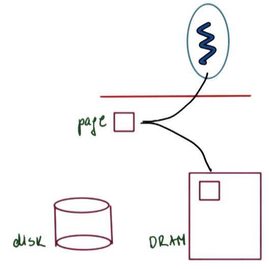

***Abstractions***:
  * **memory page**, corresponding to some addressable region of memory of fixed size (e.g., 4KB)

***Mechanisms***:
  * allocate the page in **DRAM**
  * map the page into the address space of a **process**, allowing the process to access the physical memory corresponding to the contents of the page
    * over time, the page may be moved to different locations of the DRAM or even stored on **disk**

***Policies***:
  * since it is faster to access data from memory/DRAM than from the disk, it must have some policies to decide whether the page contents will be stored in DRAM or copied over to disk
    * **least recently used** (**LRU**) is a commonly used policy, whereby the pages that have been least recently used over a time period (i.e., accessed the longest time ago) are the ones that are transferred from DRAM to disk (which is also called **swapping**)
      * the rationale for this is that least recently used pages are either least important and/or least likely to be used in the near future, whereas the opposite is true for pages being used more recently and more frequently

## 10. OS Design Principles

Consider some guiding principles when designing an operating system as follows:
  * separation of mechanism and policy
    * implement ***flexible*** mechanisms to support many policies (e.g., LRU, LFU, random, etc.)
      * in different settings, different policies can make more sense than others
  * optimize for the **common case**
    * there are several relevant questions to determine this, e.g.,:
      * where will the operating system be used?
      * what will the user want to execute on that machine?
      * what are the workload requirements?
    * once the common case is understood, select a specific policy that is most sensible for that common case and which can be supported by the underlying mechanisms and abstractions supported by the operating system

## 11. User/Kernel Protection Boundary

To achieve its role of controlling and managing hardware resources on behalf of applications, the operating system must have ***special privileges*** to have direct access to the hardware.

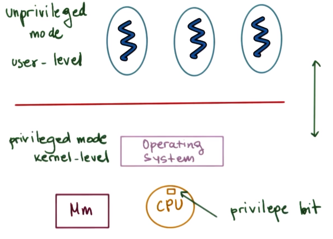

(***N.B.*** in the figure `Mm` denotes ***main memory*** and `CPU` denotes the ***processor***. This convention will be used throughout the course.)

Computer platforms distinguish between at least two modes:
  * **user-level** (unprivileged)
    * applications operate in unpriviliged user mode
  * **kernel-level** (privileged)
    * because an operating system must have direct hardware access, it must operate in privileged kernel mode
    * therefore, hardware access can only be performed by the operating system kernel (i.e., in privileged mode)

**Switching** between the user and kernel modes is supported by hardware on most modern platforms.
  * **trap instructions**
    * In kernel mode, a special bit (called the **privilege bit**) is set in the CPU, which allows any instruction that directly manipulates the hardware to execute.
    * In user mode, when the bit is *not* set, attempts to perform privileged instructions are forbidden; instead, this will result in a **trap instruction**, whereby the application is interrupted and the hardware switches control back to the operating system at a specific location. At that point, the operating system can analyze the trap and determine whether the process should be granted access or terminated.
  * **system calls**
    * The operating system exports a **system call interface**, a set of operations that the applications can explicitly invoke in order to request the operating system to perform a service which requires privileged access on their behalf.
      * Examples include: `open` (file access), `send` (socket access), `malloc` (memory access)
  * **signals**
    * A **signal** is a mechanism whereby the operating system can pass messages to the application. This will be discussed in a later lesson.

## 12. System Call Flowchart

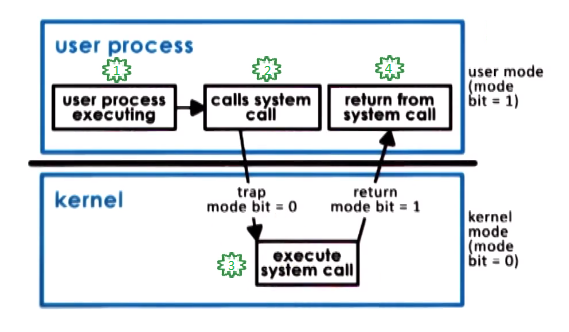

During a **system call**, data and control are exchanged between the user process and the operating system kernel.
  1. Starting in a currently executing user process.
  2. The user process requires system hardware access, so it makes a system call.
  3. On system call, control is passed to the operating system (in privileged mode).
      * Executing a system call involves switching the **context** from the user process to the operating system kernel, passing any arguments (if applicable), and then processing the instruction sequence in kernel memory.
      * With the system call, the operating system operates in privileged mode, and is allowed to perform whatever operation was specified in the system call.
  4. Once the operating system performs the system call, it returns the result and control back to the user process.
      * This involves changing the execution context back from kernel mode to user mode, passing any arguments back into the user process's address space (if applicable), and returning to the memory location of the user process immediately prior to executing the system call.

To make a system call, an application must...
  * write arguments
  * save relevant data at a well-defined location, which allows the operating system kernel to determine which and how many arguments to retrieve, as well as where they are located.
  * make the system call (i.e., using the specific system call number)

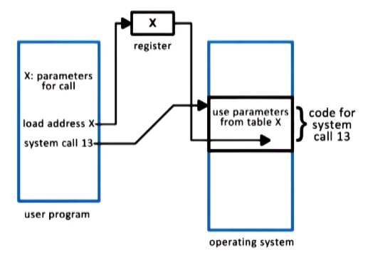

The **arguments** can be passed either directly between the user program and the operating system, or they can be passed indirectly via **registers** per specified address.

In **synchronous mode**, the process waits until the system call is completed.
  * Asynchronous call will be discussed later.

## 13. Crossing the User/Kernel Protection Boundary

In summary, user/kernel transitions are a necessary step during application execution.
  * Applications may need to perform access to certain types of hardware, or may need to request certain changes in the allocations of hardware resources that have been made to them; only the operating system kernel is permitted to perform such operations.
  * The hardware provides support for performing user/kernel transitions (e.g., traps on illegal instructions or memory accesses requiring special privilege).

Performing such transitions requires several instructions (e.g., 50-100 ns/transition on a 2 GHz machine running Linux).

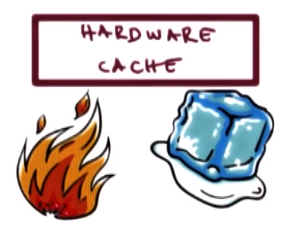

Furthermore, this switches the **locality**, which affects hardware cache usage.
  * The application's performance depends upon being able to use the hardware's **cache** effectively, as accessing cache (a few cycles) is much faster than accessing main memory (hundreds of cycles). Performing a system call (or crossing into the operating system in general), while executing, the operating system will likely bring in required content into the cache, which may replace some of the application content that was present prior to this. Therefore, upon return to the application, it will have to re-fetch the "lost" cache data from main memory.
    * ***N.B.*** Because context switches will swap the data/addresses currently in cache, the performance of applications can benefit or suffer based on how a context switch changes what is in cache at the time they are accessing it. A cache is considered **hot** if an application is accessing the cache when it contains the data/addresses it needs, otherwise a cache is considered **cold** if an application is accessing the cache when it does not contain the data/addresses it needs (thereby forcing it to retrieve the data/addresses from main memory instead).

Therefore, user/kernel transitions are ***not cheap***!

## 14. Basic OS Services

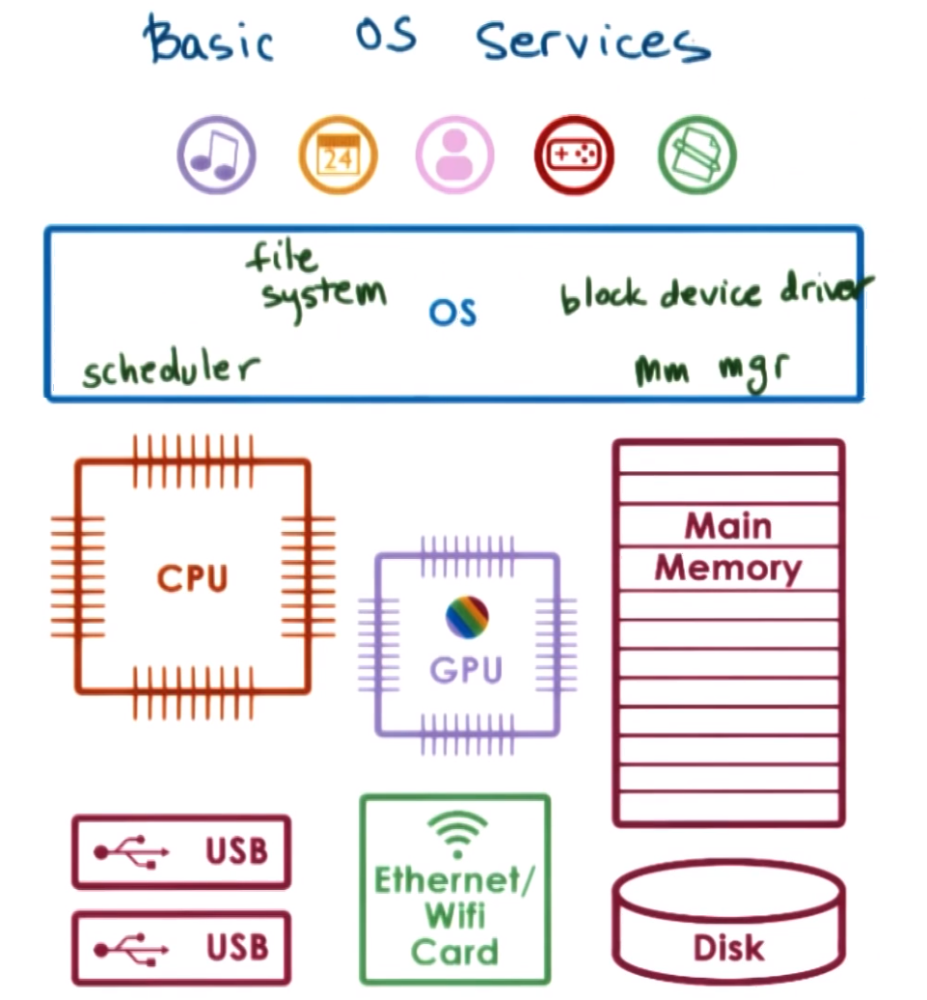

An operating system provides applications with access to the underlying hardware. It does so by exporting a number of **services**. 

At the most basic level, these services are directly linked to some of the hardware components, for example:
  * the **scheduler** controls access to the CPU(s)
  * the **memory manager** is responsible for allocating the underlying physical memory (i.e., main memory) to one or more co-running applications, and ensure that multiple applications do not overwrite each others' access to main memory
  * the **block device driver** is responsible for controlling access to a block device (e.g., disk)

Additionally, the operating system exports higher level services that are linked with higher level abstractions (i.e., as opposed to abstractions mapping directly to the hardware), for example:
  * a **file** is supported by virtually all operating systems, and in principle these operating systems integrate **file systems** as a service in turn

In summary, an operating system must incorporate a number of services in order to provide applications and application developers with a number of useful types of functionality, e.g.,:
  * process management
  * file management
  * device management
  * memory management
  * storage management
  * security
  * etc.

### System Calls

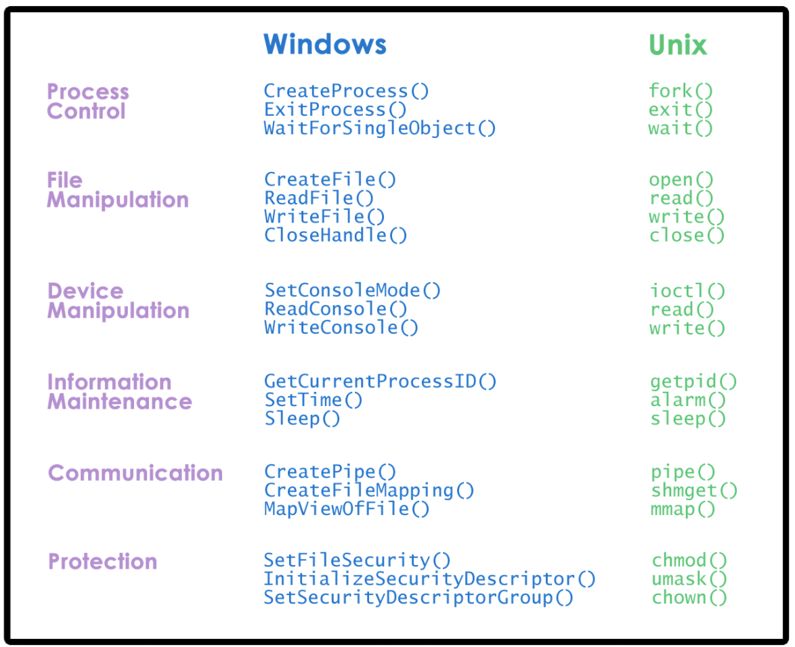

Operating systems make these services available via system calls. The figure above shows examples of system calls in two popular operating systems, Windows and Unix. Notice that despite being two different operating systems, the types of system calls and the abstractions around them are remarkably similar between the two.

## 15. System Calls Quiz and Answers

On a 64-bit Linux-based OS, which system call is used to...
  * Send a signal to a process?
    * `kill`
  * Set the group identity of a process?
    * `setgid` (***N.B.*** on non-64 bit system, there are corresponding variants `setgid16` and `setgid32`)
  * Mount a file system?
    * `mount`
  * Read/write system parameters?
    * `sysctl`

## 16. Monolithic OS

We've seen so far some rough indications of how the operating system is laid out. Let's now consider more explicitly the different types of operating-system organizational schemes.

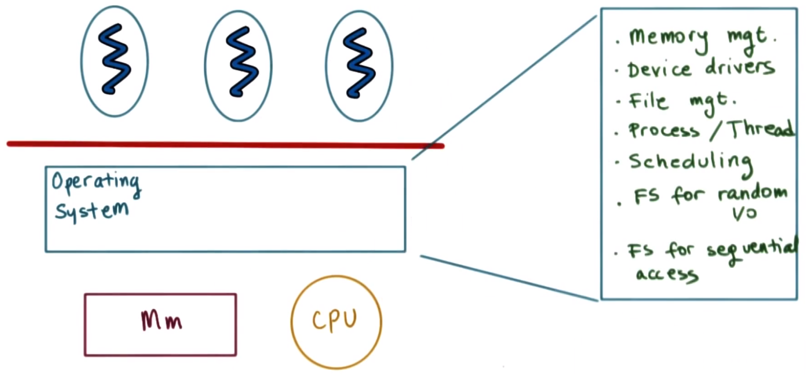

Historically, the operating system has had a **monolithic operating system** design, whereby every possible service that any one of the applications can require or that any type of hardware will demand is already part of the operating system.
  * For example, such a monolithic operating system may include several possible file systems wherein one is specialized for sequential workloads (e.g., sequentially accessing files when reading/reading them) and another is optimized for randomized I/O access (e.g., databases)

The **benefits** of a monolithic operating system are:
  * everything is included (e.g., abstractions, services, etc.)
  * because everything is packaged together, there are more possibilities for compile-time optimizations (e.g., inlining)

Conversely, the **drawbacks** are:
  * poor customization, portability, manageability/debugging, etc.
  * large memory footprint, which in turn can impact application performance

## 17. Modular OS

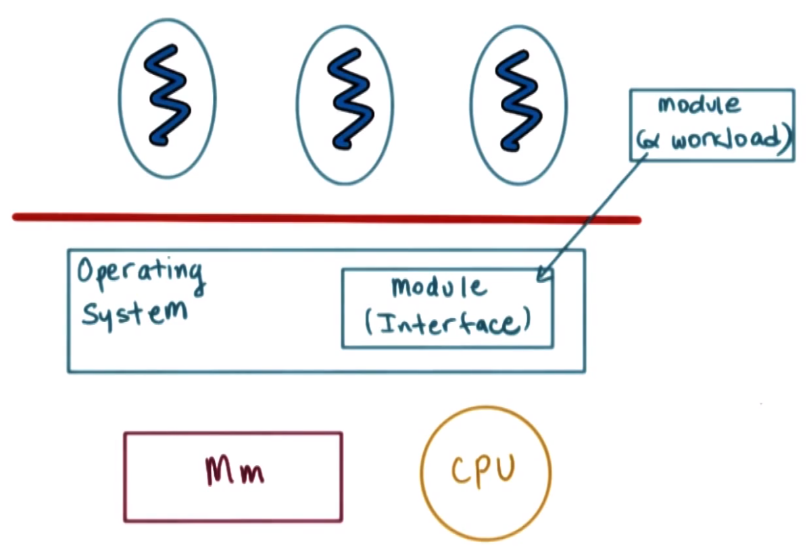

A more common approach today is a **modular operating system** (e.g., Linux).
  * In this design, the standard operating system has a set of basic services and APIs already part of it, but more importantly (as the name suggests) everything else can be added in as a **module**, allowing for greater flexibility and customization. This is possible because the operating system specifies certain **interfaces** that any given module must implement in order to be part of the operating system.
  * Depending on the workload, a module implementing the interface(s) can be dynamically installed in a way that is sensible for the workload itself (e.g., running the file access system that is optimized for databases when running a database application).

The **benefits** of a modular operating system are:
  * good maintainability and smaller code base
  * smaller memory footprint, leaving more available memory for applications
  * lower resource needs

Conversely, the **drawbacks** are:
  * indirection (i.e., via intermediate interfaces) can impact performance (e.g., reduced compiler optimization opportunities)
  * maintenance can still be an issue, given that modules can originate from completely disparate code bases

Overall, the modular design delivers significant improvements over the monolithic design, and is consequently more commonly used today.

## 18. Microkernel

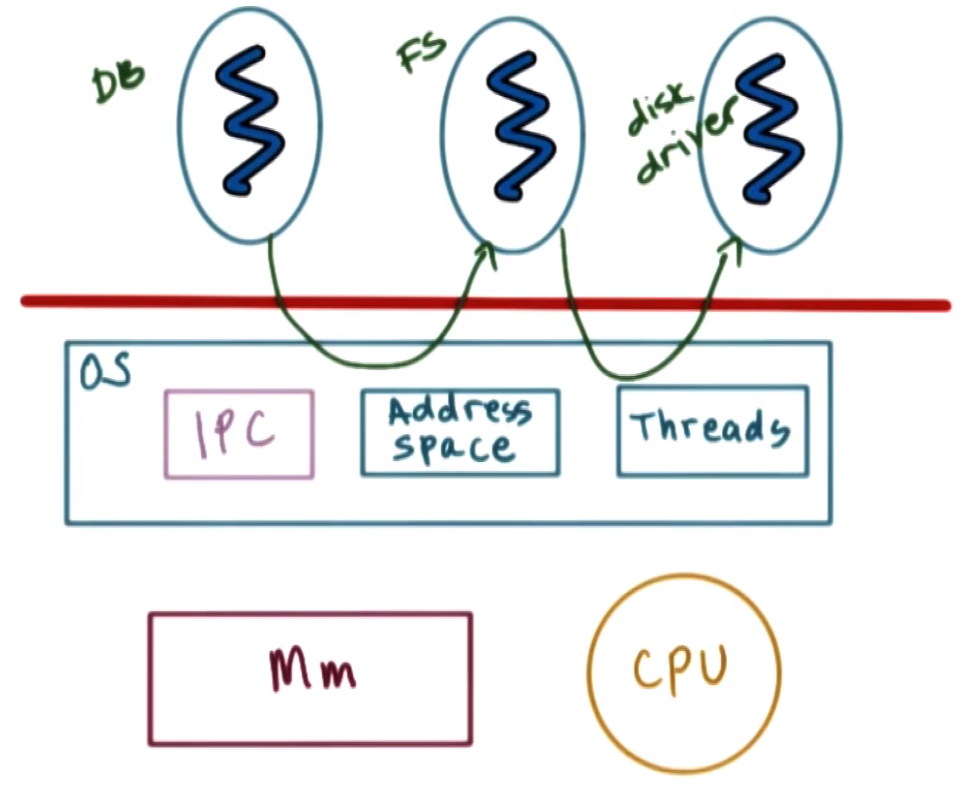

Another example of operating system design is the **microkernel**. Microkernels require only the most basic primitives at the operating system level (e.g., representing an executing application's **address space** and its execution context [i.e., **threads**]), while all other software components (e.g., database, file system, disk driver, etc.) runs outside of the operating system's kernel at the (unprivileged) user level.

For this reason, the microkernel-based operating system requires many interprocess interactions, therefore, the microkernel itself will typically support **interprocess communications** (**IPCs**) as one of its core abstractions and mechanisms (along with address spaces and threads).

The **benefits** of a microkernel are:
  * small size, lending to lower overhead and better performance
  * good verifiability/testability, which is especially important in environments where correct operating system behavior is critical (e.g., embedded devices, control systems, etc.)

Conversely, the **drawbacks** are:
  * relatively poor portability, due to relative lack of compatible application software
  * high complexity of software development
  * frequent user/kernel switching adds a performance penalty

## 19. Linux and macOS Architectures

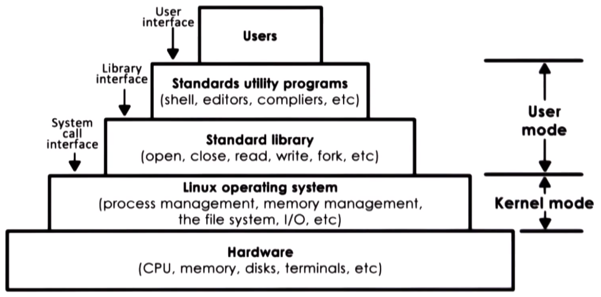

The **Linux** operating system environment is shown above.
  * the Linux **kernel** abstracts and manages the underlying hardware by supporting a number of abstractions and their associated mechanisms
  * **standard libraries** are provided, including those that implement system call interfaces
  * **utility programs** facilitate interaction with the operating system by users and developers

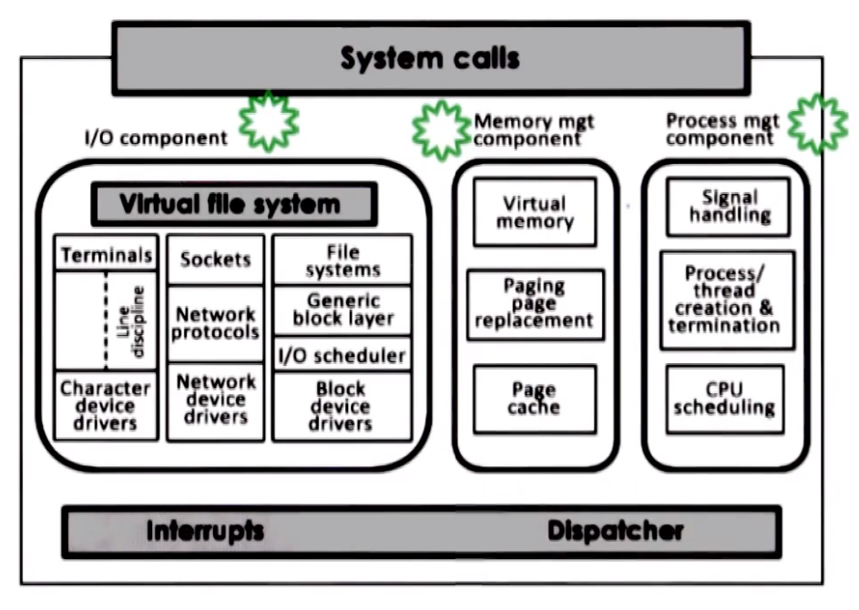

The Linux **kernel** itself consists of several logical components (e.g., I/O management, memory management, process management, etc.), all of which have well defined functionality and interfaces.
  * Each individual component can be independently modified or replaced, making the modular approach possible in Linux.

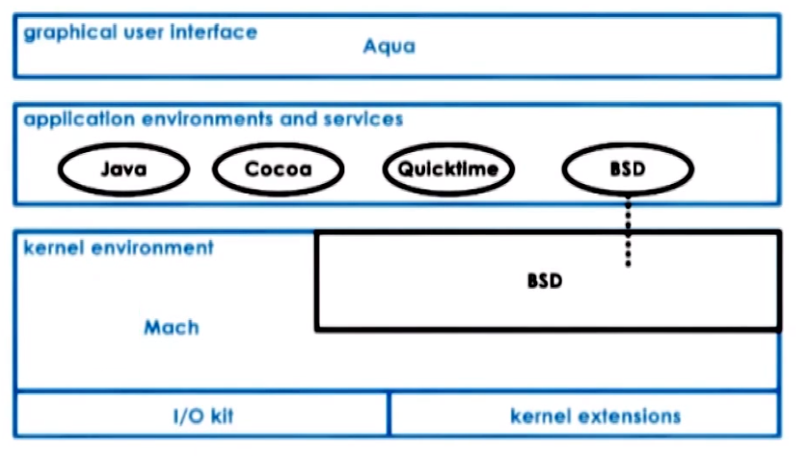

The **Apple macOS** operating system architecture is shown above.
  * the **Mach** microkernel implements key primitives (e.g., memory management, thread scheduling, interprocess mechanisms [including RPC], etc.)
    * **BSD** provides Unix interoperatibility via BSD command-line interface, POSIX API support, and network I/O
    * the bottom two modules (see figure) are dedicated to development of drivers and kernel extension modules that can be dynamically loaded into the kernel
  * all **application environements** sit above the kernel layer

## 20. Lesson Summary

This lesson answers the question *"What is an operating system?"*

An operating system is important because it abstracts and arbitrates the use of the underlying hardware system. To achieve this, the operating system relies on various operating system elements (e.g., **abstractions**, **mechanisms**, and **policies**)

Communication between applications and the operating systems is performed via **system calls**.

There are various alternatives to operating system organizational schemes, each with their respective advantages and disadvantages.
  * Representative examples: Linux and macOS
