# P2L1: Processes and Process Management

## 1. Preview

A key abstraction supported by operating systems is that of a **process**. This lecture explains:
  * What is a **process**?
  * How are processes *represented* by operating systems?
  * How are multiple **concurrent** processes managed by operating systems? (i.e., when processes share a single physical platform)

Before proceeding, consider a simple definition of a **process**:
  * ***instance*** of an executing program
  * sometimes synonymously/interchangeably called a **task** or **job**

## 2. Visual Metaphor

Continuing with the visual metaphor of a toy shop (cf. P1L2), a **process** is like an order of toys, which is characterized by the following:

| Characteristic | Toy Shop Metaphor | Operating System |
| :--: | :--: | :--: |
| state of execution | completed toys, and those waiting to be built | program counter, stack pointer|
| parts and temporary holding area | plastic pieces, containers, etc.| data, register state occupies state in memory | 
| may require special hardware | sewing machine, glue gun, etc. | I/O devices (e.g., disks, networking devices, etc.) |

## 3. What Is a Process?

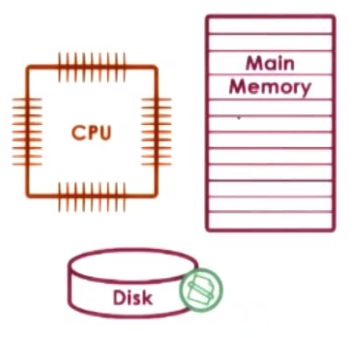

Recall that one of the roles of the operating system is to manage hardware on behalf of applications.
  * An **application** is a program on disk, flash memory, etc., which is a ***static entity*** (i.e., it is *not* executing)

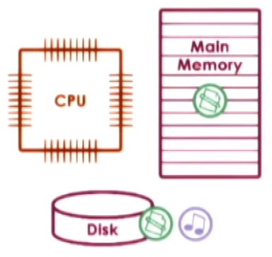

A **process** is therefore the state of a program when loaded in memory and executing (i.e., an ***active entity***)

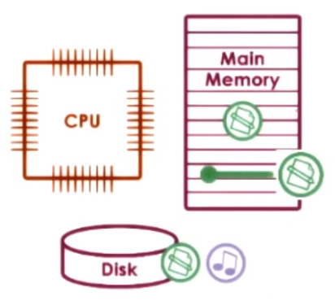

If the same program is launched more than once, then correspondingly ***multiple*** processes are active (i.e., executing the *same* program, but in general with each process being in a different **state** at any given time).

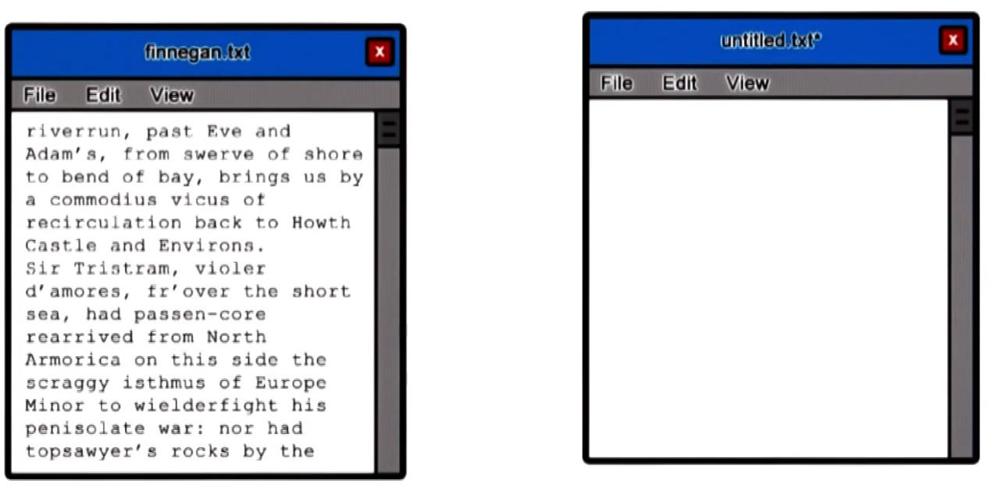

Therefore, a process represents the **execution state** of an *active* application. It does not necessarily mean that the application is currently running (e.g., may be *waiting* on user input, may be *waiting* on another currently running process in a one-CPU system, etc.)

## 4. What Does a Process Look Like?

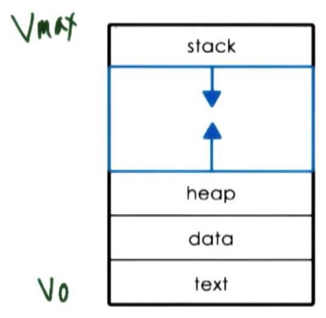

A process encapsulates the ***entire state*** of a running application, including the code, data, all variables allocated by the application, etc.

Every element of the process state must be ***uniquely idenfied*** by its **address**. Therefore, an **address space** is an abstraction provided by the operating system used to encapsulate the process's state. The address state is defined over a range `V``0` to `V``max`, with different parts of the process state occurring in correspondingly different parts of this range.

The different types of state include:
  * **text** and **data**
    * static state, initialized and subsequently available when the process first loads
  * **heap**
    * dynamically created/allocated during process execution
  * **stack**
    * grows and shrinks during process execution
    * implemented as a **LIFO (last-in, first-out) queue**

N.B. In general, the address space between the heap and the stack is not strictly contiguous; there may be "holes" in the address space, which is not accessed by the running process itself.

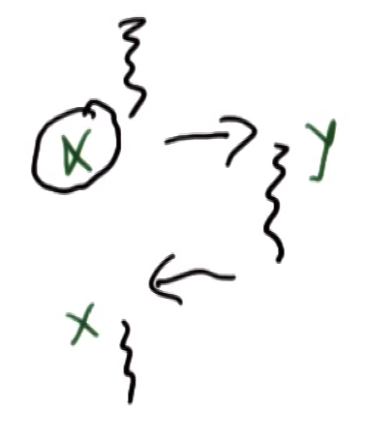

If a procedure (e.g., `Y`) is called in the stack during process execution, the caller's (e.g., `X`) state must first be saved prior to calling the procedure. Correspondingly, upon completion of the procedure call, the caller's state must be restored. This type of transfer back and forth is managed on the stack.

## 5. Process Address Space

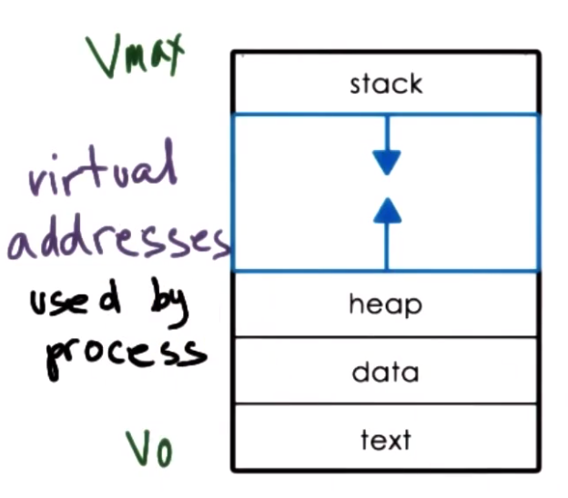

Collectively, this "in memory" representation of a process is called an **address space**, wherein the potential range of addresses (i.e., `V``0` to `V``max`) constitute the **virtual addresses** used by the process to reference the relevant parts of its state.

The term "virtual" in this context is in contrast to **physical addresses**, which are *actual* locations in physical memory (i.e., DRAM).

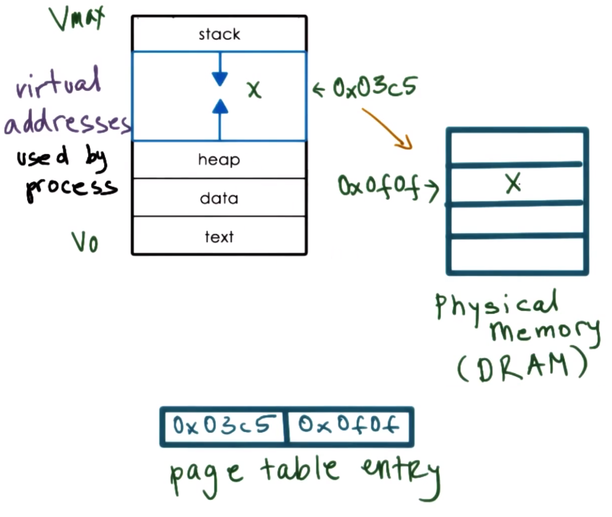

In the case of a process, the memory management hardware and the operating system components responsible for memory management (e.g., **page tables**) maintain a mapping between the virtual addresses and the physical addresses. This decouples the layout of the data in the virtual address space (which may be complex and dependent on application specifics, build tools, etc.) from the layout in physical memory.
  * For example, per the figure, mapping variable `x` from virtual `0x03c5` to physical `0x0f0f`

## 6. Address Space and Memory Management

Recall that not all addresses require the *entire* virtual address space; there may be portions which are ***not*** allocated. Furthermore, there may be insufficient physical memory available to store the entire virtual address space that is occupied/allocated (e.g., a virtual address space comprised of 32-bit addresses can occupy up to 232 or over 4 GB of physical memory *per process*).

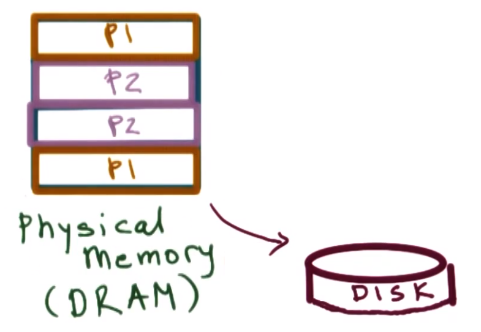

To deal with this, the operating system dynamically decides which portion of which executing processes' (e.g., `P1` and `P2` in the figure above) respective virtual address spaces will be present at a particular location in physical memory. Furthermore, one (or more) of the processes may have some portion of their address space not present in memory/DRAM, but rather temporarily **swapped** to the disk, the latter being restored to memory/DRAM when it is needed.

Therefore, the operating system must track the address space across virtual memory, physical memory, and disk throughout the execution of all of the processes. Furthermore, the operating system must also ensure that the processes' access to these various memory locations is valid/permissible.

## 7. Virtual Addresses Quiz and Answers

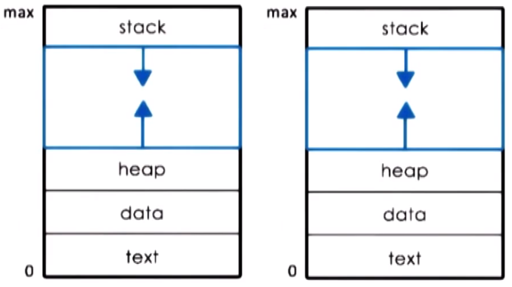

If two processes `P1` and `P2` are running at the same time, what are the ***virtual address space*** ranges that they will have? (Select one choice.)

Choice | `P1` | `P2` |
| :--: | :--: | :--: |
| `A` | 0-32,000 | 32,000-64,000 |
| `B` | 0-64,000 | 0-64,000 |
| `C` | 32,000-64,000 | 32,000-64,000 |

The correct choice is `B`. The operating system will map these virtual addresses to the physical address space. This allows each process (i.e., from its "own perspective") to have the same range of virtual addresses; in the corresponding overlapping to physical memory, they will *not* overlap/overwrite each other, however.

## 8. Process Execution State: How Does the OS Know What a Process Is Doing?

For an operating system to manage processes, it must have some understanding of what the processes are doing (e.g., if the operating system stops a processes, it must know the process's state immediately prior to stopping it in order to restore that exact same process state later).

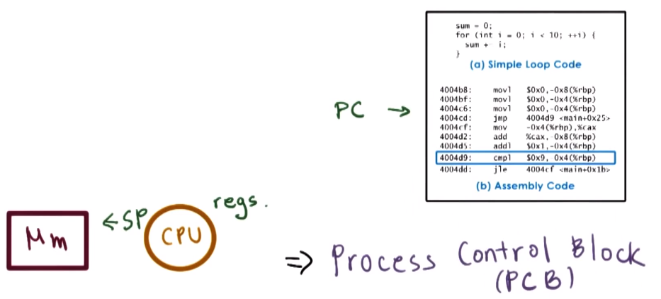

Consider how a CPU executes an application:
  * Prior to executing, the application's source code must be compiled, resulting in a **binary file** (a sequence of instructions, which are not necessarily executed sequentially)
  * At any given time, the **CPU** must know where in the sequence the process currently is; this is tracked via the **program counter (PC)**
    * The program counter is maintained on the CPU in a **register** while the process is executing; furthermore, other registers are also maintained on the CPU, which hold values required for execution (e.g., addresses for data, status information, etc.)
  * The process's **stack** is denoted by the **stack pointer (SP)**, which points to the ***top*** of the stack (i.e., its lowest address in the virtual address space) thereby conferring on it its characteristic last-in, first-out (LIFO) behavior
  * Other information is also maintained to facilitate the operating system's "understanding" of what a process's state is at any given time

To maintain all of this useful information for every single process, the operating system maintains a **process control block (PCB)** (discussed next).

## 9. What Is a Process Control Block (PCB)?

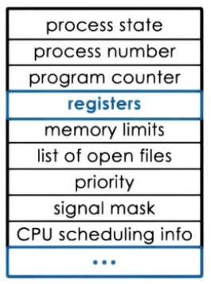

A **process control block (PCB)** is a data structure that the operating system maintains for *each* process that it manages. It consists of the information shown in the figure above.

The process control block is created when the process is created, and also initialized with the appropriate values at that time (e.g., program counter points to the first instruction of the process).

Certain fields of the process control block are updated when the process state changes (e.g., when the process requests more memory, the operating system will allocate more memory and establish new valid virtual-to-physical memory mappings).

Other fields change too frequently to manage via the process control block (e.g., the program counter changes after each instruction, which is instead handled by the CPU itself via a dedicated register); however, in such cases, it is still responsible for collecting and saving all information that the CPU maintains for a process, and to store it in the process control block structure whenever that particular process is no longer running on the CPU.

## 10. How Is a PCB Used?

Let's assume that the operating system manages two processes `P1` and `P2`, which have already been created along with their respective process control blocks stored in main memory.

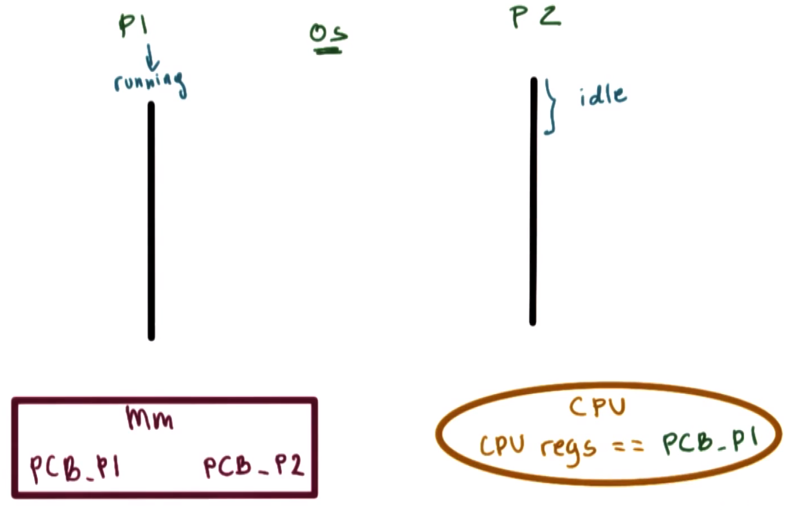

With `P1` currently running and `P2` idle, the CPU's registers currently hold `PCB_P1` (i.e., the state of process `P1`), which must ultimately be transferred to/stored in the process control block for `P1`.

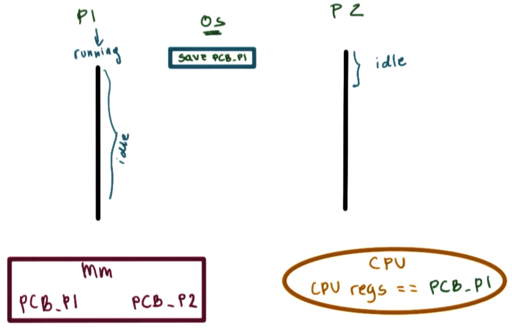

Subsequently, the operating system must interrupt `P1`, making it idle. To do this, the operating system must save the state information of process `P1` immediately prior to the interrupt (including the CPU registers) into the process control block for `P1`.

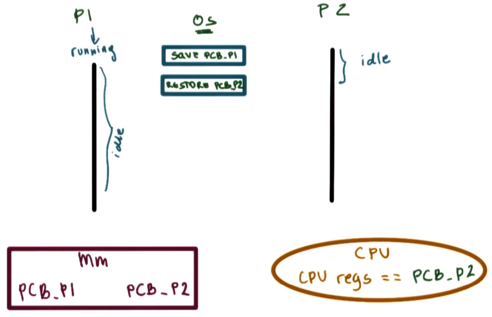

Next, the operating system must restore the state of process `P2` via its corresponding process control block, which also includes updating the CPU registers with the corresponding information.

If at some point process `P2` requires more physical memory, it will make a request (e.g., via call to function `malloc()`), and then the operating system will allocate the memory, establish a new virtual-physical address map, and make the corresponding update to the process control block for process `P2`.

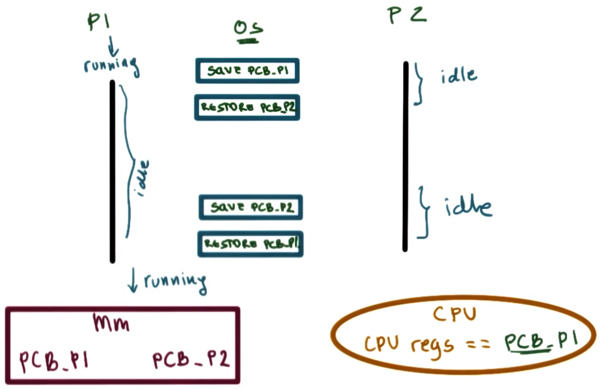

When process `P2` completes execution or when the operating system decides to interrupt `P2`, the operating system will save all of the state information regarding process `P2` in the corresponding process control block for process `P2`, and then it will restore the process control block for process `P1`.

Process `P1` will now be running, and the CPU registers will reflect the state of process `P1` accordingly. Given that the values in the process control block for process `P1` correspond *exactly* to the values it had immediately prior to the previous interrupt, this means that process `P1` will resume its execution here in exactly the same state as in that in which it was immediately prior to being interrupted by the operating system.

Each time the operating system performs such a ***swap*** between two processes, this is called a **context switch**.

## 11. What Is a Context Switch?

Recall the previous discussion regarding how an operating system swaps between two processes `P1` and `P2` in order for them to share the CPU, whereby the process control blocks reside in main memory and the values of the CPU change depending on which process is currently executing.

A **context switch** can now be defined more formally as the mechanism used by the operating system to switch the CPU from the context of one running process to the context of another.

These context switch operations are ***expensive***
  * **direct costs**: the number of cycles that must be executed in order to load and store all of the instructions (i.e., values from the corresponding process control block) to/from memory
  * **indirect costs**: cold cache and cache misses
    * described in the following two figures below

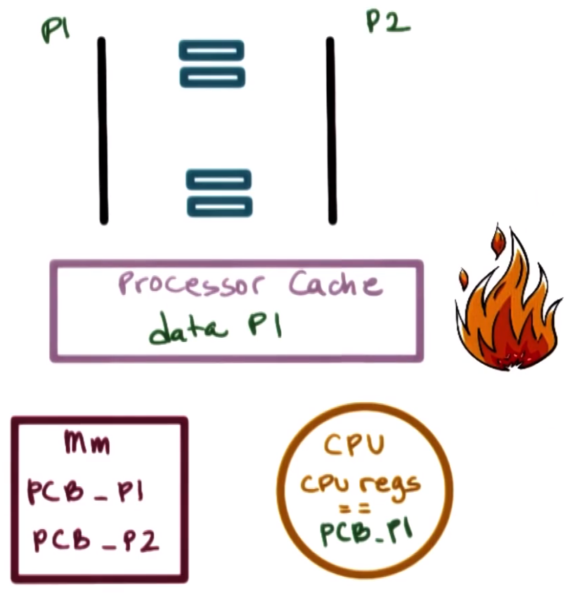

When process `P1` is running on the CPU, a lot of its data will be stored in the CPU cache. As long as process `P1` is executing, a lot of its data will likely be present in the processor cache hierarchy (i.e., L1-L3) already, which can be accessed much faster (on the order of cycles) by the processor than access via main memory (on the order of hundreds of cycles). Such a cache (i.e., already containing pertinent process data) is called a **hot cache**.

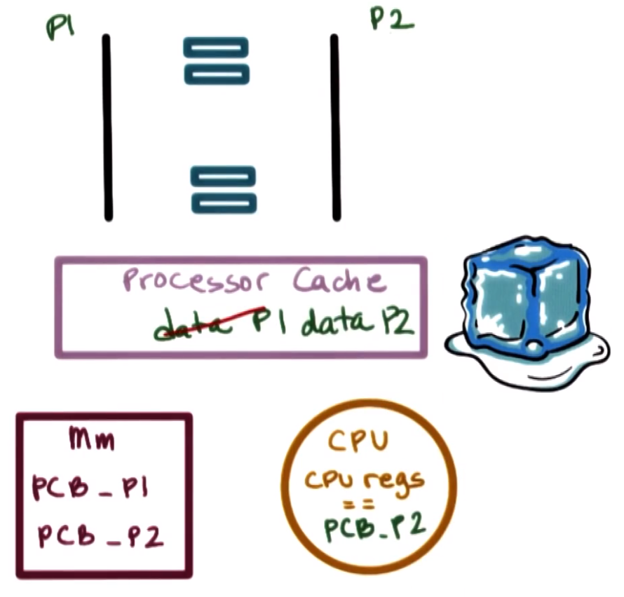

Conversely, when a context switch to process `P2` occurs, some or all of the data in the cache belonging to process `P1` will be replaced to make room for the data required by process `P2`. Therefore, next time process `P1` is scheduled to execute, its data will not be present in the cache, but rather more time will be expended to read its data from main memory, thereby incurring **cache misses**. Such a cache (i.e., not having the pertinent process data available, but rather requiring to retrieve it from main memory) is called a **cold cache**.

Therefore, it is ***desirable*** to ***limit*** how frequently context switching is performed.

## 12. Hot Cache Quiz and Answers

For the following sentence, check all options that correctly complete it.

"When a cache is hot..."
  * it can malfunction, so we must context switch to another process
    * `DOES NOT APPLY` - here, "hot" is *not* referring to physical "overheating" of the CPU
  * most process data is in the cache, so the process performance will be at its best
    * `APPLIES` - this is the most correct/applicable option, as this is *the* characteristic behavior of a hot cache
  * sometimes we must context switch
    * `APPLIES` - this is also correct, and can affect performance if switch away from such a process running on a hot cache (e.g.,context switching to a process with higher priority, context switching as a result of a time sharing policy dictating the current process's time has expired, etc.)

# 13. Process Life Cycle: States
