# P2L1: Processes and Process Management

## 1. Preview

A key abstraction supported by operating systems is that of a **process**. This lecture explains:
  * What is a **process**?
  * How are processes *represented* by operating systems?
  * How are multiple **concurrent** processes managed by operating systems? (i.e., when processes share a single physical platform)

Before proceeding, consider a simple definition of a **process**:
  * ***instance*** of an executing program
  * sometimes synonymously/interchangeably called a **task** or **job**

## 2. Visual Metaphor

Continuing with the visual metaphor of a toy shop (cf. P1L2), a **process** is like an order of toys, which is characterized by the following:

| Characteristic | Toy Shop Metaphor | Operating System |
| :--: | :--: | :--: |
| state of execution | completed toys, and those waiting to be built | program counter, stack pointer|
| parts and temporary holding area | plastic pieces, containers, etc.| data, register state occupies state in memory | 
| may require special hardware | sewing machine, glue gun, etc. | I/O devices (e.g., disks, networking devices, etc.) |

## 3. What Is a Process?

Recall that one of the roles of the operating system is to manage hardware on behalf of applications.
  * An **application** is a program on disk, flash memory, etc., which is a ***static entity*** (i.e., it is *not* executing)

A **process** is therefore the state of a program when loaded in memory and executing (i.e., an ***active entity***)

If the same program is launched more than once, then correspondingly ***multiple*** processes are active (i.e., executing the *same* program, but in general with each process being in a different **state** at any given time).

Therefore, a process represents the **execution state** of an *active* application. It does not necessarily mean that the application is currently running (e.g., may be *waiting* on user input, may be *waiting* on another currently running process in a one-CPU system, etc.)

## 4. What Does a Process Look Like?

A process encapsulates the ***entire state*** of a running application, including the code, data, all variables allocated by the application, etc.

Every element of the process state must be ***uniquely idenfied*** by its **address**. Therefore, an **address space** is an abstraction provided by the operating system used to encapsulate the process's state. The address state is defined over a range `V``0` to `V``max`, with different parts of the process state occurring in correspondingly different parts of this range.

The different types of state include:
  * **text** and **data**
    * static state, initialized and subsequently available when the process first loads
  * **heap**
    * dynamically created/allocated during process execution
  * **stack**
    * grows and shrinks during process execution
    * implemented as a **LIFO (last-in, first-out) queue**

N.B. In general, the address space between the heap and the stack is not strictly contiguous; there may be "holes" in the address space, which is not accessed by the running process itself.

If a procedure (e.g., `Y`) is called in the stack during process execution, the caller's (e.g., `X`) state must first be saved prior to calling the procedure. Correspondingly, upon completion of the procedure call, the caller's state must be restored. This type of transfer back and forth is managed on the stack.

## 5. Process Address Space

Collectively, this "in memory" representation of a process is called an **address space**, wherein the potential range of addresses (i.e., `V``0` to `V``max`) constitute the **virtual addresses** used by the process to reference the relevant parts of its state.

The term "virtual" in this context is in contrast to **physical addresses**, which are *actual* locations in physical memory (i.e., DRAM).

In the case of a process, the memory management hardware and the operating system components responsible for memory management (e.g., **page tables**) maintain a mapping between the virtual addresses and the physical addresses. This decouples the layout of the data in the virtual address space (which may be complex and dependent on application specifics, build tools, etc.) from the layout in physical memory.
  * For example, per the figure, mapping variable `x` from virtual `0x03c5` to physical `0x0f0f`

## 6. Address Space and Memory Management

Recall that not all addresses require the *entire* virtual address space; there may be portions which are ***not*** allocated. Furthermore, there may be insufficient physical memory available to store the entire virtual address space that is occupied/allocated (e.g., a virtual address space comprised of 32-bit addresses can occupy up to 232 or over 4 GB of physical memory *per process*).

To deal with this, the operating system dynamically decides which portion of which executing processes' (e.g., `P1` and `P2` in the figure above) respective virtual address spaces will be present at a particular location in physical memory. Furthermore, one (or more) of the processes may have some portion of their address space not present in memory/DRAM, but rather temporarily **swapped** to the disk, the latter being restored to memory/DRAM when it is needed.

Therefore, the operating system must track the address space across virtual memory, physical memory, and disk throughout the execution of all of the processes. Furthermore, the operating system must also ensure that the processes' access to these various memory locations is valid/permissible.

## 7. Virtual Addresses Quiz and Answers

If two processes `P1` and `P2` are running at the same time, what are the ***virtual address space*** ranges that they will have? (Select one choice.)

Choice | `P1` | `P2` |
| :--: | :--: | :--: |
| `A` | 0-32,000 | 32,000-64,000 |
| `B` | 0-64,000 | 0-64,000 |
| `C` | 32,000-64,000 | 32,000-64,000 |

The correct choice is `B`. The operating system will map these virtual addresses to the physical address space. This allows each process (i.e., from its "own perspective") to have the same range of virtual addresses; in the corresponding overlapping to physical memory, they will *not* overlap/overwrite each other, however.

## 8. Process Execution State: How Does the OS Know What a Process Is Doing?

For an operating system to manage processes, it must have some understanding of what the processes are doing (e.g., if the operating system stops a processes, it must know the process's state immediately prior to stopping it in order to restore that exact same process state later).

Consider how a CPU executes an application:
  * Prior to executing, the application's source code must be compiled, resulting in a **binary file** (a sequence of instructions, which are not necessarily executed sequentially)
  * At any given time, the **CPU** must know where in the sequence the process currently is; this is tracked via the **program counter (PC)**
    * The program counter is maintained on the CPU in a **register** while the process is executing; furthermore, other registers are also maintained on the CPU, which hold values required for execution (e.g., addresses for data, status information, etc.)
  * The process's **stack** is denoted by the **stack pointer (SP)**, which points to the ***top*** of the stack (i.e., its lowest address in the virtual address space) thereby conferring on it its characteristic last-in, first-out (LIFO) behavior
  * Other information is also maintained to facilitate the operating system's "understanding" of what a process's state is at any given time

To maintain all of this useful information for every single process, the operating system maintains a **process control block (PCB)** (discussed next).

## 9. What Is a Process Control Block (PCB)?

A **process control block (PCB)** is a data structure that the operating system maintains for *each* process that it manages. It consists of the information shown in the figure above.

The process control block is created when the process is created, and also initialized with the appropriate values at that time (e.g., program counter points to the first instruction of the process).

Certain fields of the process control block are updated when the process state changes (e.g., when the process requests more memory, the operating system will allocate more memory and establish new valid virtual-to-physical memory mappings).

Other fields change too frequently to manage via the process control block (e.g., the program counter changes after each instruction, which is instead handled by the CPU itself via a dedicated register); however, in such cases, it is still responsible for collecting and saving all information that the CPU maintains for a process, and to store it in the process control block structure whenever that particular process is no longer running on the CPU.

## 10. How Is a PCB Used?

Let's assume that the operating system manages two processes `P1` and `P2`, which have already been created along with their respective process control blocks stored in main memory.

With `P1` currently running and `P2` idle, the CPU's registers currently hold `PCB_P1` (i.e., the state of process `P1`), which must ultimately be transferred to/stored in the process control block for `P1`.

Subsequently, the operating system must interrupt `P1`, making it idle. To do this, the operating system must save the state information of process `P1` immediately prior to the interrupt (including the CPU registers) into the process control block for `P1`.

Next, the operating system must restore the state of process `P2` via its corresponding process control block, which also includes updating the CPU registers with the corresponding information.

If at some point process `P2` requires more physical memory, it will make a request (e.g., via call to function `malloc()`), and then the operating system will allocate the memory, establish a new virtual-physical address map, and make the corresponding update to the process control block for process `P2`.

When process `P2` completes execution or when the operating system decides to interrupt `P2`, the operating system will save all of the state information regarding process `P2` in the corresponding process control block for process `P2`, and then it will restore the process control block for process `P1`.

Process `P1` will now be running, and the CPU registers will reflect the state of process `P1` accordingly. Given that the values in the process control block for process `P1` correspond *exactly* to the values it had immediately prior to the previous interrupt, this means that process `P1` will resume its execution here in exactly the same state as in that in which it was immediately prior to being interrupted by the operating system.

Each time the operating system performs such a ***swap*** between two processes, this is called a **context switch**.

## 11. What Is a Context Switch?

Recall the previous discussion regarding how an operating system swaps between two processes `P1` and `P2` in order for them to share the CPU, whereby the process control blocks reside in main memory and the values of the CPU change depending on which process is currently executing.

A **context switch** can now be defined more formally as the mechanism used by the operating system to switch the CPU from the context of one running process to the context of another.

These context switch operations are ***expensive***
  * **direct costs**: the number of cycles that must be executed in order to load and store all of the instructions (i.e., values from the corresponding process control block) to/from memory
  * **indirect costs**: cold cache and cache misses
    * described in the following two figures below

When process `P1` is running on the CPU, a lot of its data will be stored in the CPU cache. As long as process `P1` is executing, a lot of its data will likely be present in the processor cache hierarchy (i.e., L1-L3) already, which can be accessed much faster (on the order of cycles) by the processor than access via main memory (on the order of hundreds of cycles). Such a cache (i.e., already containing pertinent process data) is called a **hot cache**.

Conversely, when a context switch to process `P2` occurs, some or all of the data in the cache belonging to process `P1` will be replaced to make room for the data required by process `P2`. Therefore, next time process `P1` is scheduled to execute, its data will not be present in the cache, but rather more time will be expended to read its data from main memory, thereby incurring **cache misses**. Such a cache (i.e., not having the pertinent process data available, but rather requiring to retrieve it from main memory) is called a **cold cache**.

Therefore, it is ***desirable*** to ***limit*** how frequently context switching is performed.

## 12. Hot Cache Quiz and Answers

For the following sentence, check all options that correctly complete it.

"When a cache is hot..."
  * it can malfunction, so we must context switch to another process
    * `DOES NOT APPLY` - here, "hot" is *not* referring to physical "overheating" of the CPU
  * most process data is in the cache, so the process performance will be at its best
    * `APPLIES` - this is the most correct/applicable option, as this is *the* characteristic behavior of a hot cache
  * sometimes we must context switch
    * `APPLIES` - this is also correct, and can affect performance if switch away from such a process running on a hot cache (e.g.,context switching to a process with higher priority, context switching as a result of a time sharing policy dictating the current process's time has expired, etc.)

## 13. Process Life Cycle: Process States

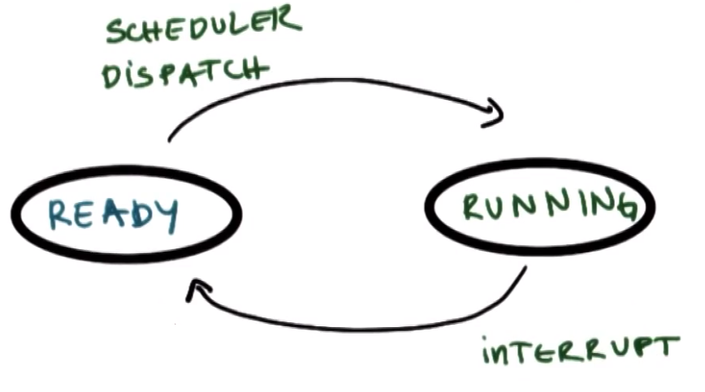

Recall that during context switching, processes can be either **running** or **idle**.
  * When a process is running, it can be **interrupted** and context switched, at which point the process is idle but in a **ready state** (i.e., is ready to execute, but is not the currently running process).
  * At some later point, the **scheduler** can schedule the process again, thereby moving the process back to executing on the CPU, and therefore back to the **running state**.

With respect to process states:
  * What other states can a process be in?
  * How is that determined?

The various **process states** that a process undergoes throughout its life cycle will now be discussed via the following figures below.

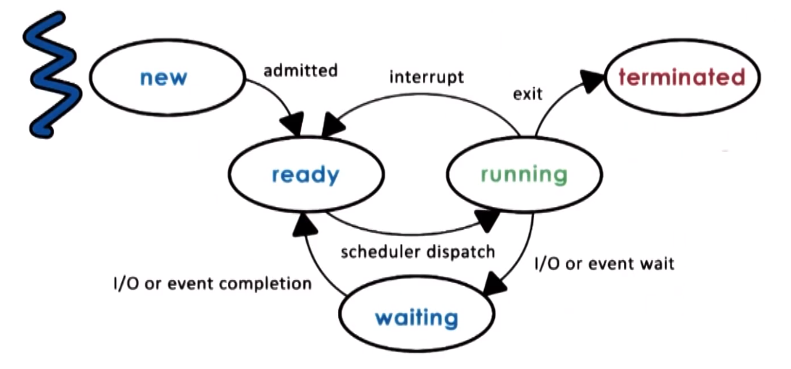

Initially, when a process is created, it enters the **new state**. At this point, the operating system performs admission control, and if the operating system determines that the process is admissible, then the operating system will allocate and initiate a process control block and some initial resources for the process.

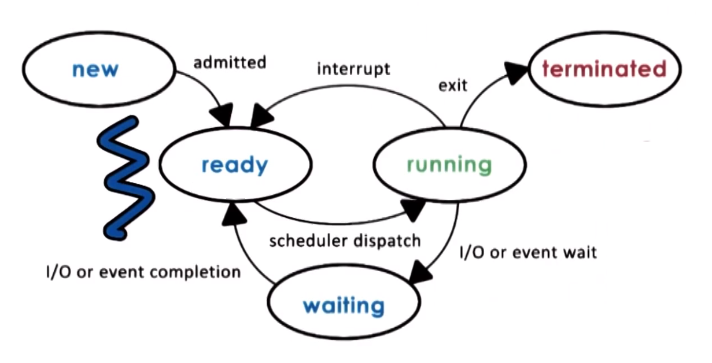

Provided that there are some minimum available resources, the process is **admitted**, and at that point the process is ready to begin execution. However, the process is still not executing on the CPU here; in this **ready state**, the process must wait until the scheduler is ready to move it into a **running state** upon scheduling the process to run on the CPU.

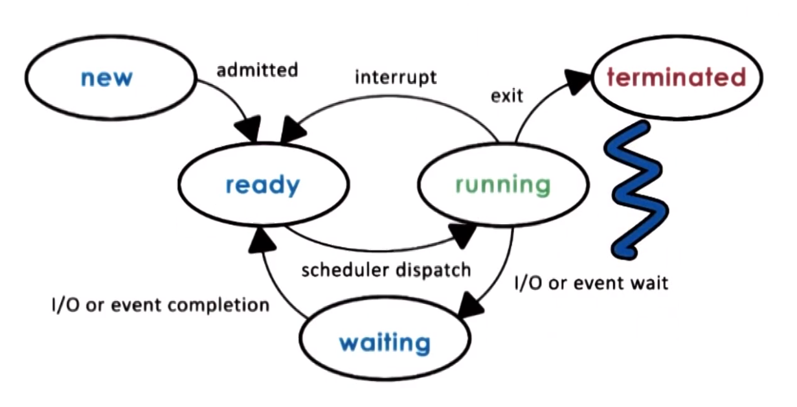

Once the scheduler assigns the ready-state process to the CPU, that process is now in the **running state**. From here, several transitions can occur:
  * The running process can be **interrupted**, resulting in a context switch which moves the process back into a ready state.
  * The running process may need to initiate a longer operation (e.g., reading data from disk, wait on a timer event or user input event, etc.), at which point the process enters a **waiting state**. When the corresponding event or I/O operation completes, the process will subsequently return to the ready state. 
  * Once the running process finishes all operations in the program, or if it encounters some type of error, the process will **exit**, return the appropriate **exit code** (indicating `success` or `error`), and enter a **terminated state**.

## 14. Process State Quiz and Answers

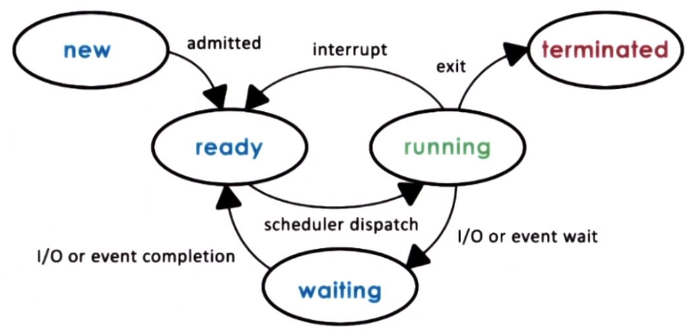

Per the process life cycle diagram, the CPU is able to execute a process when the process is in which state(s)? (Select all choices that apply.)
  * Running
    * `APPLIES` - a running process is already executing, so this is "true by default"
  * Ready
    * `APPLIES` - a process in ready state is currently available to be run dispatched by the operating system's scheduler to run on the CPU
      * the process will begin from wherever the program counter last pointed to; this will be the first instruction if the process has just entered the ready state from the new state, otherwise if the process is re-entering the ready state, then this instruction will be at some intermediate point in the process's execution (i.e., immediately prior to the most recent interrupt or wait)
  * Waiting
    * `DOES NOT APPLY`
  * New
    * `DOES NOT APPLY`

## 15. Process Life Cycle: Process Creation

It is reasonable to ask at this point: how is a process created in the first place?

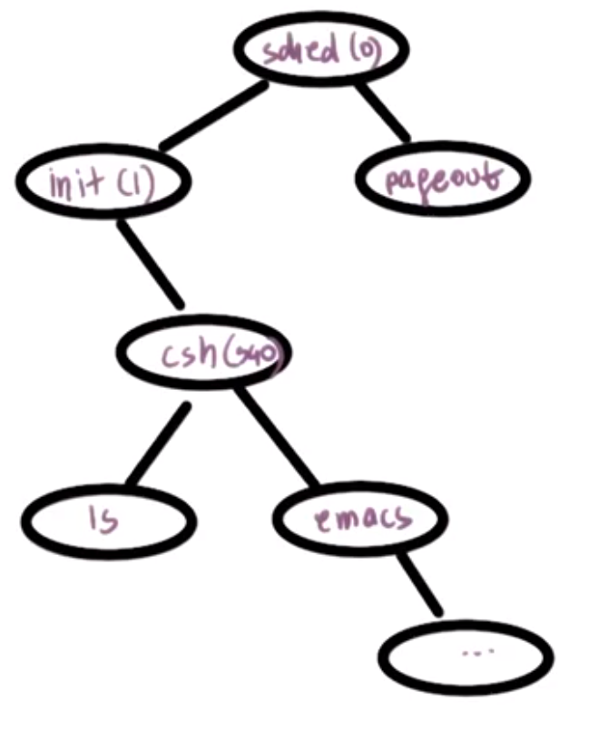

In an operating system, a given process can create **child processes**. As shown in the figure above, all processes originate from a single root process, having various relationships to one another (e.g., the creating process is the **parent process**).

Certain of these processes are **privileged processes** (or **root processes**). In fact, this is how most operating systems work: once the initial boot process is completed and the operating system is loaded onto the machine hardware, it will create these initial processes.

Subsequently, when a user logs into the system, a user shell process is created (e.g., `csh`), and then subsequent commands entered by the user (e.g., `ls`, `emacs`, etc.) spawn new child processes, and so on. Therefore, ultimately the relationship between the various processes forms a ***tree structure***.

 Most operating systems support at least two basic ***mechanisms*** for **process creation**, either of which can be used by a process to create a child process
  * **`fork`**
    * copies the parent process control block into the new child's process control block
    * subsequently, both the parent and the child continue execution at the instruction immediately following the `fork` operation (due to the common values in their respective process control blocks, including the program counter)
  * **`exec`**
    * replaces the child image, thereby loading a new program (i.e., overwriting the child's origin process control block) and making the child process start from the (new) first instruction per the (new) program counter

## 16. Parent Process Quiz and Answers

On UNIX-based operating systems, which process is often regarded as the "parent process of all processes"?
  * `init`

Extra credit: On the Android operating system, which process is regarded as the "parent of all app processes"?
  * `ZYGOTE`

## 17. What Is the Role of the CPU Scheduler?

Now, consider **process scheduling**.

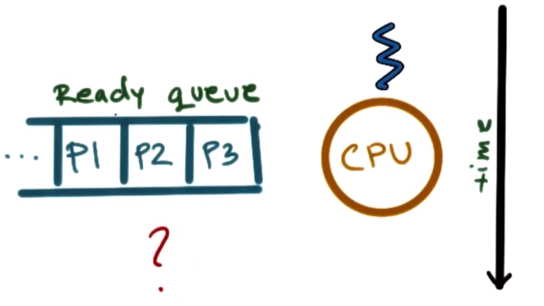

In order for the CPU to begin executing a process, the process must first be in the ready state. However, in general, several processes may be in the ready state at any given time; such processes "on standby" wait in the **ready queue**.

In order to determine which process to run onto the CPU next, the **CPU scheduler** (an operating system component) determines which one of the currently ready processes will be dispatched to the CPU in order to start running, and how long it should run for.

The operating system must...
  * **preempt** - interrupt and save the current context
  * **schedule** - run the scheduler to choose the next process (i.e., via corresponding **scheduling algorithm**)
  * **dispatch** - dispatch a process onto the CPU and switch into the process's context so that the process can begin executing

Given that the CPU's resources are scarce, the operating system must be ***efficient*** with respect to managing these process-oriented resources (i.e., it should minimize the time to perform the aforementioned preempt, schedule, and dispatch tasks). This entails both efficient designs and efficient implementations (i.e., algorithms) for these tasks, as well as efficient data structures to represent the constituent components (e.g., the ready queue, prioritization, process history, etc.).

## 18. Length of a Process

Another **issue** to consider is how ***often*** to run the scheduler: The more frequently the scheduler is run, the more CPU time that is expended to run the scheduler as opposed to running application processes.

Equivalently:
  * How long should a process run for?
  * How frequently should we run the scheduler?

As these questions imply, the longer a process runs, the less frequently the scheduler is invoked to execute.

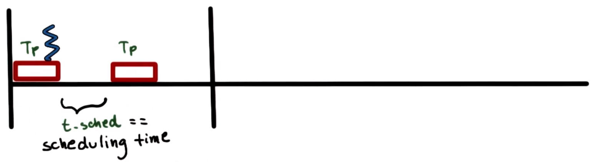

Consider the scenario in the figure shown above, wherein a process runs for an elapsed time of *`T`*`p`, and the scheduler spends time *`t`*`sched` to execute.

To quantify how well the CPU is utilized, this can be computed as follows:

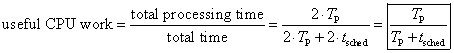

Therefore, if *`T`*`P` `=` *`t`*`sched`, only 50% of the CPU time is spent on useful work.

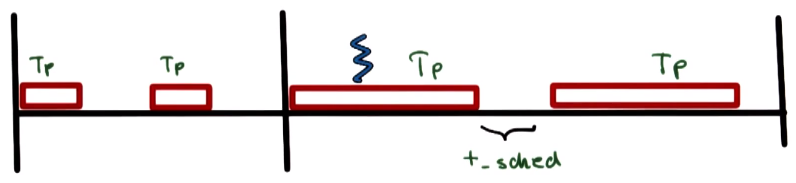

Now consider the case where *`T`*`P` `>>` *`t`*`sched` (e.g., *`T`*`P` `=` `10`*`t`*`sched`). In this case, the useful CPU work is much higher (e.g., `91%` when *`T`*`P` `=` `10`*`t`*`sched`).

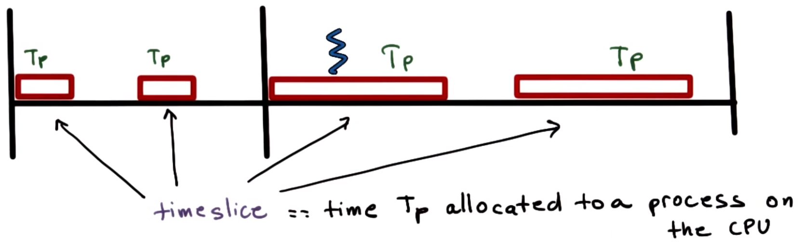

In these examples, time *`T`*`P` (the **timeslice**) refers to the time allocated to a process on the CPU.

As is apparent from these examples, there are many **tradeoffs** in making **design decisions** for scheduling, e.g.,:
  * What are the appropriate timeslice values?
  * What are useful metrics to use in order to choose the next process to run?

## 19. What about I/O?

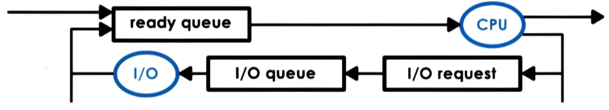

Before proceeding further, consider how **I/O operations** affect scheduling. So far, it is apparent that the operating system manages how processes access resources on the hardware platform (which, in addition to the CPU and memory, includes I/O devices and peripherals e.g., keyboards, networking cards, disks, etc.).

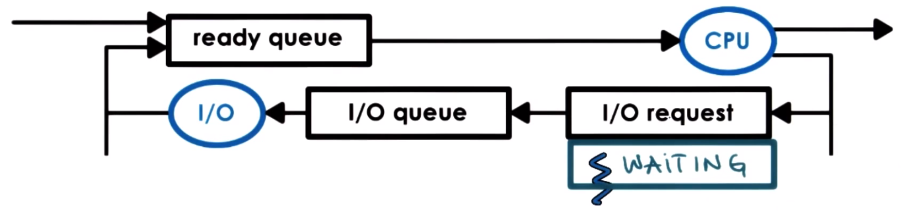

Now, consider a process that has made an I/O request (e.g., request to read from disk), which is consequently delivered by the operating system.

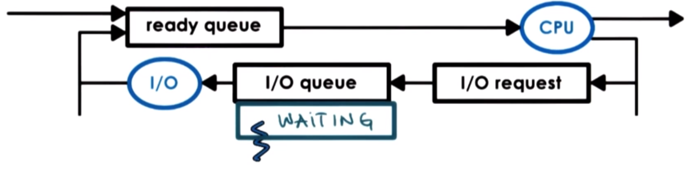

The operating system then moves the process to the **I/O queue** (e.g., that associated with the particular disk device for which the I/O request was generated), where the process is now in a **waiting state**.

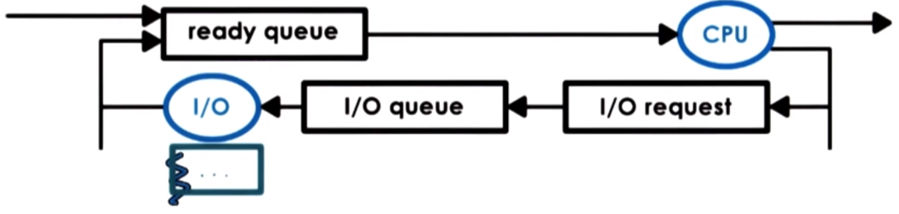

The process remains in the waiting queue until the device completes the requested I/O operations (i.e., until the I/O event completes) and responds to that particular request. 

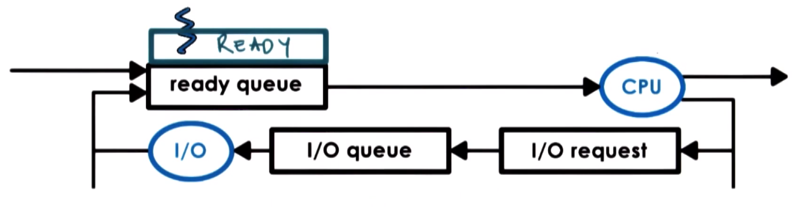

Once the I/O request is met, the process is again in the **ready state** and ready to run again on the CPU. Depending on the current workload of the CPU, the process may be scheduled directly to the CPU, or it may be placed in the **ready queue**.

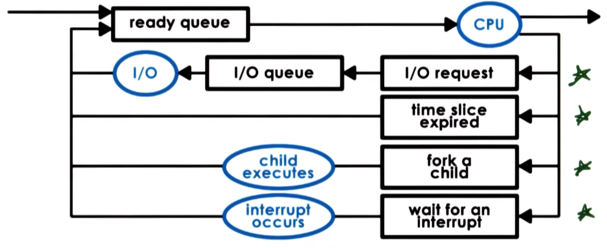

To summarize, a process can enter the ready queue in a variety of ways, including:
  * a process which was waiting on an **I/O event**
  * a process which was running on the CPU but its timeslice **expired**
  * a process which was created as a **child process** via `fork`
  * a process which was waiting for an **interrupt** that subsequently occurred

## 20. Scheduler Responsibility Quiz and Answers

Which of the following are ***not*** a responsibility of the CPU scheduler? (Select all choices that apply.)
  * maintaining the I/O queue
    * `APPLIES` - the scheduler has *no* control over I/O operations in general 
      * a key ***exception*** to this is **timer interrupts**, which is decided by the scheduling algorithm
  * maintaining the ready queue
    * `DOES NOT APPLY` - this *is* a role of the scheduler, which determines which process to run on the CPU next
  * deciding when to context switch
    * `DOES NOT APPLY` - this *is* a role of the scheduler, whose scheduling algorithm decides when to context switch
  * deciding when to generate an event that a process is waiting on
    * `APPLIES` - the scheduler has *no* control over external events that are generated

## 21. Interprocess Communication (IPC)

Another naturally arising question is: Can processes ***interact***? The simple answer is ***yes***. However, in order to accomplish this, the operating system must provide **mechanisms** to allow processes to interact with one another. In the modern landscape, increasingly more applications are in fact structured in such a manner, having multiple interacting processes.

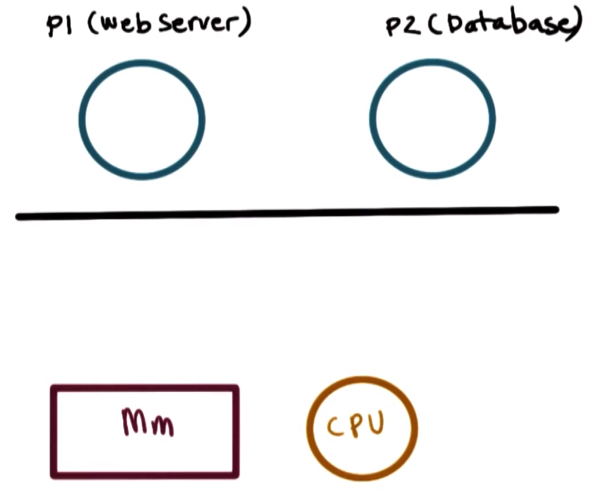

For example, consider a **Web application** consisting of two processes on the *same* machine: a Web server (`P1`) and a database (`P2`).

How can processes `P1` and `P2` interact? Before answering this question, recall that operating systems expend considerable effort to isolate processes from one another (e.g., separate address spaces for each process, controlling CPU utilization by each process, memory allocation to each process, etc.). Therefore, these communication mechanisms must be built around these inherent protections performed by the operating system.

Such mechanisms are called **Interprocess Communication (IPC)** mechanisms, which:
  * transfer data and information between address spaces
  * maintain protection and isolation
  * provide flexibility and performance
    * different types of interactions between processes may exhibit different properties (e.g., periodic data exchanges vs. continuous data streams, coordinating with a shared single piece of information, etc.)

### Message Passing IPC

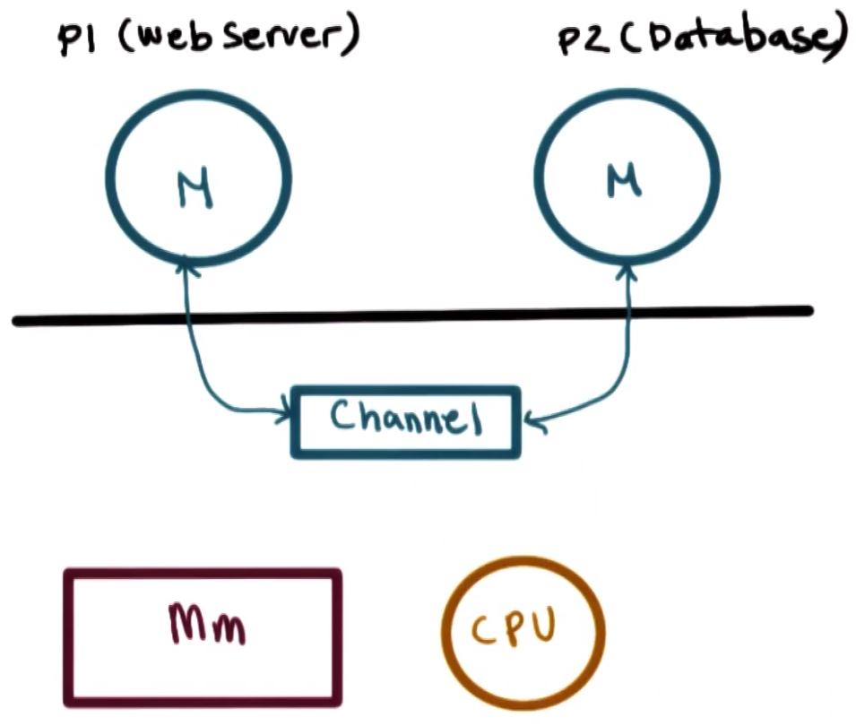

One mechanism that interprocess communication systems support is **message passing**, in which:
  * the operating system provides a **communication channel** (e.g., shared buffer)
  * processes write (`send`) and read (`recv`) messages to and from (respectively) the channel

With this mechanism, each process must place shared information explicitly in the message `M` and then subsequently send `M` to the dedicated communication channel between the two processes.

The **benefit** of this approach is that the operating system manages the channel and provides a uniform API (i.e., system calls) to perform the necessary write/read operations.

Conversely, the **drawback** of this approach is that there is incurred ***overhead***, inasmuch as every piece of information passed between the two processes must be first copied from the user space of the first process into the channel (which is in the operating system's kernel memory) and then copied back into the user space of the second process.

### Shared Memory IPC

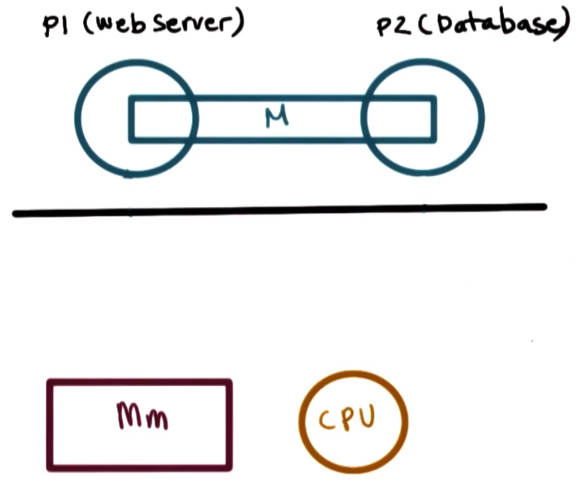

Another mechanism that interprocess communication systems support is **shared memory**, in which:
  * the operating system establishes a **shared channel** and maps it into each process's respective address space
  * the processes directly read/write from this **shared memory**, as it would with any other memory location in its own virtual address space
  * the operating system is completely "out of the way"

Indeed, the main **benefit** of this approach is the reduced overhead due to the lack of necessary intervention by the operating system (i.e., the operating system does not bottleneck the communication path).

Conversely, the main **disadvantage** of this approach is a lack of uniform APIs to share information between the processes, thereby potentially requiring additional (re)implementation of the respective processes' code and therefore being more error-prone.

## 22. Shared Memory Quiz and Answers

Assess the following statement: Shared-memory-based communication performs better than message-passing communication. (Select the correct choice.)
  * True
  * False
  * It depends
    * `CORRECT` - with shared-memory-based communication, the individual data exchange is relatively cheap due to low overhead with respect to the operating system kernel, however, the actual operation of **mapping** memory between the two processes is itself an ***expensive*** operation (therefore, shared-memory-based communication is only "better performing" if this mapping-operation cost can be amortized across a sufficiently large number of comparative messages)

## 23. Lesson Summary
