# P2L2: Threads and Concurrency

## 1. Preview

The previous lecture described processes and process management. Recall that a process is represented by its **address space** and its **execution context** (via corresponding **process control block**, or **PCB**).

### What if Multiple CPUs?

<center>

</center>

However, when represented this way, such a process can only execute at one CPU at any given point in time.

<center>

</center>

Conversely, in order for the process to execute on multiple CPUs simultaneously (i.e., taking advantage of modern multi-CPU/multi-core systems), such a process requires ***multiple*** execution contexts; such multiple execution contexts within a single process are called **threads**.

This lesson will therefore address the following:
  * What are **threads**?
  * How are **threads** different from **processes**?
  * What **data structures** and mechanisms are used to implement and manage **threads**?

This lesson will reference "*An Introduction to Programming with Threads*" (Birrell, 1989) to explain the concept of threads, a paper which describes:
  * threads and concurrency
  * basic mechanisms for multithreaded systems
  * synchronization

N.B. A later lesson will discuss a concrete multithreading system called **Pthreads** (**POSIX threads**).

## 2. Visual Metaphor

<center>

</center>

This lesson will discuss threads and concurrency. As an analogy, a **thread** is like a worker in a toy shop, which has the following characteristics:

| Characteristic | Toy Shop Worker | Thread |
| :--: | :--: | :--: |
| is an active entity | executing a unit of work required for a toy order | executing a unit of work on behalf of a process |
| works simultaneously with others | many workers completing toy orders | many threads executing (i.e., **concurrency**, which can occur on multicore systems in which multiple threads execute at the exact same time) |
| requires coordination  | sharing of tools, parts, workstations, etc. (particularly when multiple workers are working simultaneously, and perhaps even contributing to the *same* toy order) | sharing of I/O devices, CPUs/cores, memory, etc. (i.e., coordinating ***access*** to the underlying platform resources, which is carefully controlled and scheduled by the operating system) |

This begs the question: How to determine which thread gets access to the underlying platform resources?
  * As this lesson will discuss, this is a very important design decision made by both operating systems and software developers in general.

## 3. Process vs. Thread

<center>
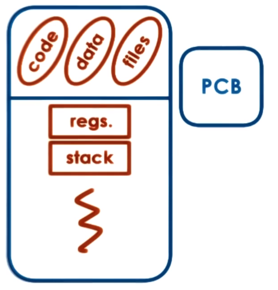
</center>

Recall from the previous lesson that a **single-threaded process** is represented by:
  * its **address space**, which consists of all of the virtual-to-physical address mappings (e.g., code, data, files, etc.)
  * its **execution context** (containing information about the registers' values, the stack pointer, the program counter, etc.)

The operating system contains all of this information in a **process control block (PCB)**

<center>
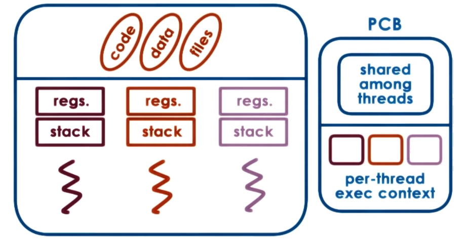
</center>

Conversely, **threads** represent multiple independent execution contexts, which:
  * are part of the *same* virtual address space, thereby sharing the same virtual-to-physical address mappings (i.e., code, data, and files)
  * in general execute *different* instructions, access different portions of the address space, operate on different potions of the input, and differ in other ways as well
    * therefore, each thread must have its own *distinct* program counter, stack pointer (and corresponding stack), and thread-specific registers, which accordingly requires different/distinct **data structures** to represent this thread-specific information

The operating system representation of such a **multithreaded process** will therefore be a more complex **process control block (PCB)** structure than the single-threaded counterpart, which contains:
  * all of the information that is ***shared*** among the threads (e.g., virtual address mappings, description of the code and data, etc.)
  * ***separate*** information about each thread-specific execution context that is part of the process

## 4. Benefits of Multithreading: Why Are Threads Useful?

Consider a **multi-processor** (or **multi-core**) system as a representative example. At any given time, when running a given process, there may be multiple threads (`T1`, `T2`, `T3`, `T4`) belonging to the process running concurrently on a different processor.

<center>
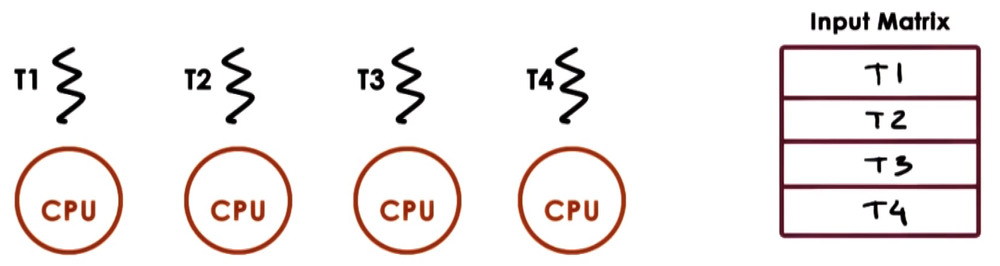
</center>

One possibility is that each thread executes the ***same*** code, but for a different subset of the input (e.g., a different portion of an input array or an input matrix).
  * While all of the threads execute the exact same code, however, they are not necessarily executing the exact same instruction at a given point in time. Therefore, each thread will require its own private copy of the stack, program counter, registers, etc.

**Parallelization** of the program in this manner achieves **speedup**: the input can be processed much faster than via the corresponding counterpart of a single thread running on a single CPU.

<center>
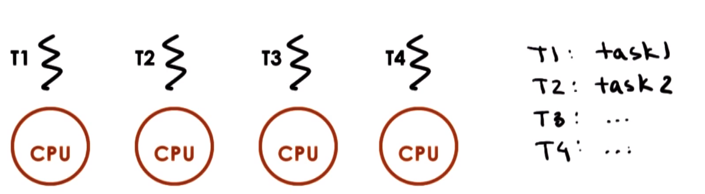
</center>

Additionally, threads can also execute completely ***different*** portions of the program.
  * Certain threads can be designated to specific I/O tasks (e.g., input processing, display rendering, etc.)

Another option is to have different threads operate on different portions of the code corresponding to specific functions or **tasks** (e.g., a large Web service application can have different threads to handle different types of customer requests).

This type of **specialization** (whereby different threads run different tasks or run different portions of the program) allows to differentiate how the threads are managed.
  * For example, higher priority can be given to those threads which handle more important tasks, more important customers, etc.

<center>
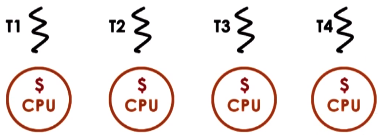
</center>

Another important benefit of partitioning the exact operations performed by each thread on each CPU derives from the fact that performance is dependent on how much state information can be stored/present in the **hardware cache**.
  * Since each thread running on a separate CPU core has access to its own processor cache (denote `$` in the figure above). Therefore, if the thread repeatedly executes a smaller portion of the code (e.g., one task), more of the relevant program state and information will be present in the corresponding cache, thereby improving the operation of each thread on a **hot cache**.

<center>
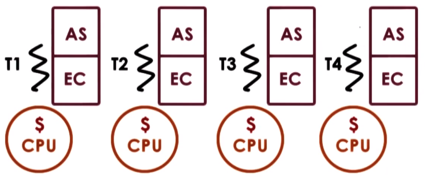
</center>

While the natural conclusion may be to write a **multiprocess** application wherein every CPU core runs a separate process, since the processes do not share an address space, each context must be allocated a ***separate*** address space and execution context. Therefore, such a multiprocess implementation would require separate allocations of address spaces and execution contexts.

<center>
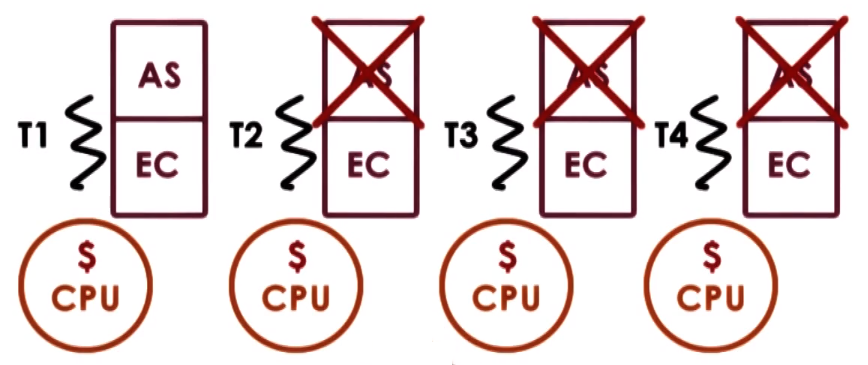
</center>

Conversely, a **multithreaded** implementation consists of threads ***sharing*** an address space (thereby obviating the requirement to allocate the address space to *each* execution context), which is much more memory-efficient than its multiprocess counterpart. Consequently, such a multithreaded application is more likely to fit in memory and not require as many swaps with the disk compared to the multiprocess alternative.

Another **issue** to consider is that communicating/passing data or synchronizing among processes requires interprocess communication mechanisms that are more costly.
  * As will be discussed later in this lesson, communication and synchronization among threads in a single process is performed via shared variables within the process's address space, which obviates the requirement for this costly interprocess communication.

In summary, multithreaded applications are more efficient in their resource requirements and incur lower overhead for their interprocess communication (i.e., between threads) than corresponding multiprocess applications.

## 5. Benefits of Multithreading: Are Threads Useful on a *Single* CPU?

Are threads useful on a single CPU? Or, more generally, are threads useful when `# Threads > # CPUs`?

<center>
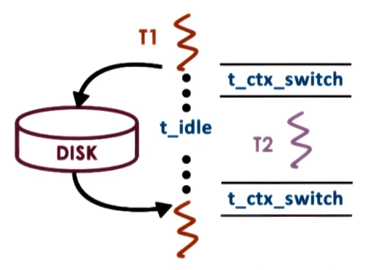
</center>

Consider the scenario of a single thread `T1` making a disk request.
  * Upon receiving the request, the disk requires time `t`<sub>`idle`</sub> to fulfill the request (i.e., time required to move the disk spindle, access the appropriate data, and then respond to the request).
  * During `t`<sub>`idle`</sub>, thread `T1` cannot perform any useful work and instead must wait for the response (i.e., the CPU is **idle** during this time).

If `t`<sub>`idle`</sub> is longer than the time required to perform a context switch, then it may be sensible to perform a context switch to another thread (e.g., `T2`) during this time instead. In particular, `t`<sub>`idle`</sub> `>` `2t`<sub>`ctx_switch`</sub> is the critical point at which context switching can "hide" idling time.
  * This applies to both processes and threads, however, recall that one of the most costly steps during a context switch is the time required to create the new virtual-to-physical memory mapping of the address space for the new process that will be scheduled. However, given that threads ***share*** an address space, when context switching among ***threads*** it is ***not*** necessary to recreate ***new*** virtual-to-physical memory mapping.
  * Therefore, because this costly step is avoided, in general `t`<sub>`ctx_switch`</sub> is less among threads than among processes. Correspondingly, it is much more likely the critical point will be reached when using threads, and so threads can be effectively used in this manner to **hide latency** (i.e., by being productive during idling time), even on a ***single*** CPU.

## 6. Benefits of Multithreading: Applications and Operating Systems Code

<center>
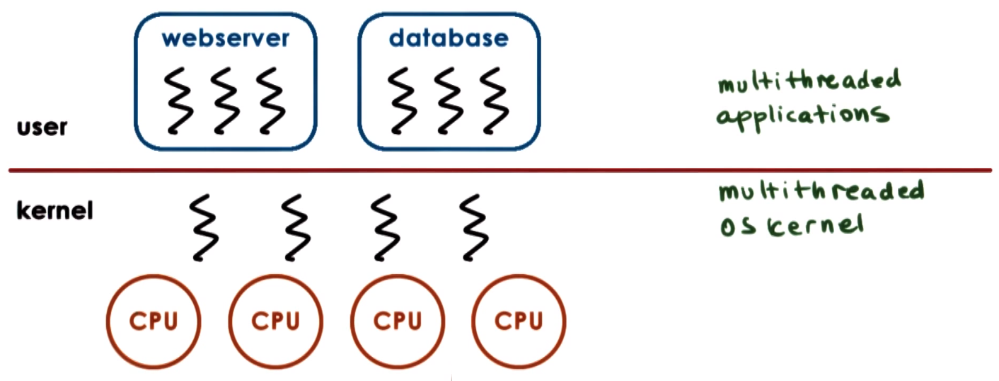
</center>

There are benefits from multithreading both to applications and to the operating system itself.

By multithreading the **operating system kernel**, this allows the operating system to support multiple execution contexts (which is particularly useful when there are multiple CPU cores present, allowing for concurrent execution of the operating system contexts on the different CPUs of a multiprocessor/multicore platform)
  * The operating system's threads may run on behalf of multiple **applications**
  * The operating system's threads may also run on behalf of OS-level **services** (e.g., daemons, device drivers, etc.)

## 7. Process vs. Threads Quiz and Answers

Do the following statements apply to processes (`P`), threads (`T`), or both (`B`)?
  * can share a virtual address space
    * `T` 
  * take longer to context switch
    * `P` - by sharing a virtual address space, threads are able to perform context switches faster
  * have an execution context
    * `B` - in each case, the execution context is described by the stack and registers
  * usually result in hotter caches when multiple exist
    * `T` - because threads share the virtual address space, it is more likely that concurrently executing threads will result in hot caches on the respective CPU cores; conversely, such sharing is not possible among processes
  * make use of some communication mechanisms
    * `B` - for processes, the operating system supports interprocess communication (IPC) mechanisms; there are also corresponding mechanisms for coordinating among threads (as will be seen later in this lesson)

## 8. Basic Thread Mechanisms: What Do We Need to Support Threads?

To support threads, the following are required:
  * a distinct thread **data structure** to distinguish it from a process
    * identify threads, keep track of resource usage, etc.
  * mechanisms to ***create*** and ***manage*** threads
  * mechanisms to safely ***coordinate*** among the threads running **concurrently** in the *same* address space (particularly when there are ***dependencies*** between their execution)
    * for example, it must be ensured that concurrently executing threads do not overwrite each others' inputs or results
    * for example, there must be mechanisms in place to allow one thread to wait on results produced by another thread

### Threads and Concurrency

When considering the type of coordination required between threads, we first must consider the **issues** inherent to concurrent execution.

<center>
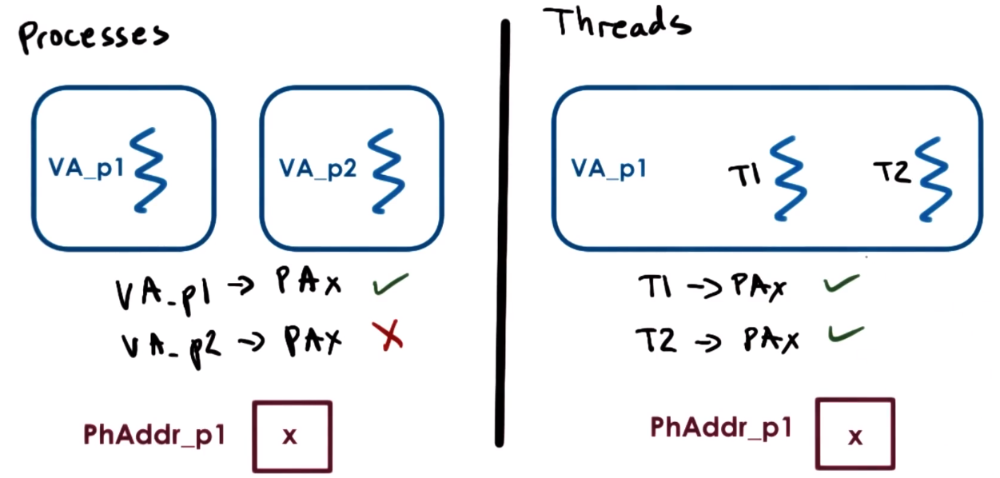
</center>

When **processes** run concurrently, each process operates within its *own* address space. The operating system together with the underlying hardware ensure that ***no*** access from one address space to another occurs.
  * For example, in the figure above, the mapping of `VA_p1` (virtual address of process `p1`) to `PAx` (physical address `x`) will be valid for process `p1` but invalid for process `p2` (i.e., process `p2` will not be able to perform a valid access operation on physical address `x`).

Conversely, **threads** share the ***same*** virtual-to-physical address mappings.
  * For example, in the figure above, both threads `T1` and `T2` (both concurrently running on the *same* virtual address space) can both access the *same* physical address `x`.

<center>
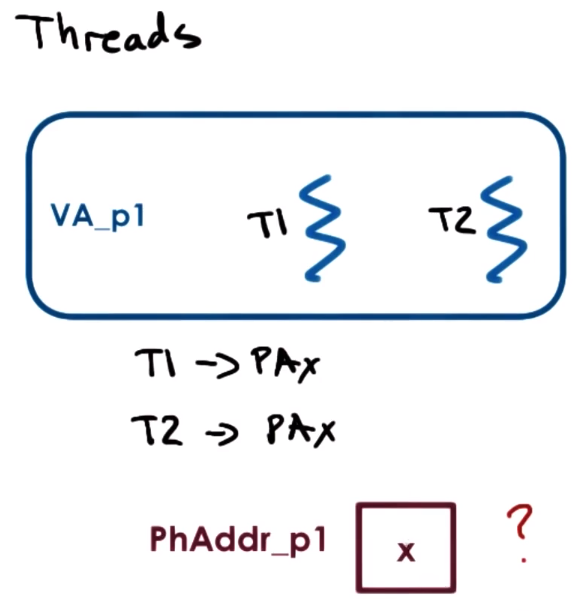
</center>

Consequently, this introduces some **problems**. If threads `T1` and `T2` are both allowed to access and to modify the same data simultaneously, this can yield several **inconsistencies**, e.g.,:
  * one thread may attempt to read the data while another is modifying it
  * two (or more) threads attempt to modify the data simultaneously, resulting in a **data race**
  * etc.

  ### Concurrency Control and Coordination

<center>

</center>

To deal with these concurrency issues, mechanisms are required to enforce execution of threads in an ***exclusive*** manner; such mechanisms are called **mutual exclusion**.
  * In mutual exclusion, exclusive access is granted to only one thread at a time to perform any given operation; the remaining threads must wait their turn to perform this same operation.
  * Such **operations** performed under mutual exclusion include: update to state, general access to a data structure that is shared among the threads, etc.
  * To achieve this, Birrell's and other threading systems use what are called **mutexes**.

<center>

</center>

Additionally, it is also useful for concurrently executing threads to have a mechanism to **wait** on one another, and to exactly specify the necessary **condition** required before proceeding.
  * For example, a thread dealing with shipment processing must wait on all of the items in the shipping order to be processed before the order can be shipped.
  * Birrell discusses the use of **condition variables** to handle this kind of inter-thread coordination.

Both mutual exclusion and waiting are referred to as **synchronization mechanisms**.
  * Additionally, Birrell describes another such mechanism involving waking up other threads from a **wait state**. (This will be discussed more in a later lesson.)

## 9. Threads and Thread Creation

Consider now:
  * how threads should be represented by an operating system or by a system library that provides multithreading support
  * what is necessary to perform **thread creation**

N.B. During this lesson, discussion will be based on the **primitives** described and used in Birrell's paper, which do not necessarily correspond to certain interfaces provided by real threading systems or programming languages. Furthermore, the next lesson will discuss **Pthreads (POSIX threads)**, a threading interface supported by most modern operating systems, to serve as a more concrete example.

<center>
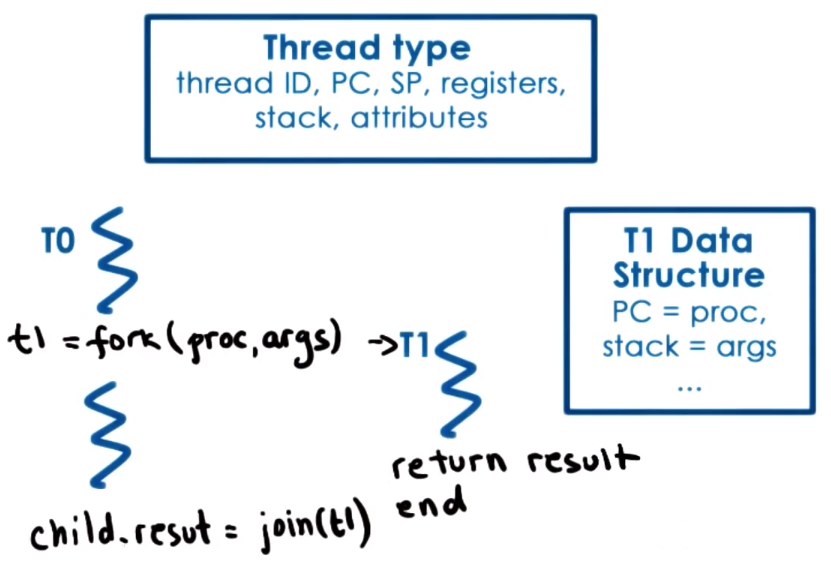
</center>

The **thread type** (a thread data structure proposed by Birrell) contains all of the information that is specific to the thread, e.g.:
  * thread identifier
  * registers
  * program counter
  * stack pointer
  * the stack
  * any other attributes and/or data used by the thread (e.g., used by the thread management systems to determine how to schedule threads, how to debug threads, etc.) 

For new **thread creation**, Birrell proposes the function `Fork(proc, args)`, where `proc` is the procedure that the created thread will begin executing and `args` provides the corresponding arguments to the procedure
  * Per the figure above, when thread `T0` calls `Fork()`, a new thread `T1` is created, along with a corresponding new thread data structure, whose constituent values are initialized accordingly (e.g., its program counter `PC` points to `proc` with `args` available on its own stack).
  * After the `Fork()` operation completes, the overall process is now running via two threads `T0` (parent thread) and `T1` (child thread), with both executing concurrently.
    * `T0` proceeds to the subsequent operation immediately following the call to `Fork()`
    * `T1` commences execution of `proc(args)`

  N.B. Birrell's `Fork()` should *not* be confused with the UNIX system call `fork()` discussed previously, which creates a new process as an exact copy of the calling process

Once `T1` completes execution of `proc(args)` (i.e., and correspondingly returning a result or some other status regarding the computation), it must communicate this information back to the process.
  * One programming practice is to store the result of the computation in some well-defined location in the mutually accessible address space (i.e., among all of the threads), with a corresponding mechanism to notify either the parent or some other thread that the result is now available.
  * More generally, however, some **mechanism** is required to determine that the thread has completed execution, and (if necessary) to retrieve its result or to determine the corresponding status of the computation (e.g., success or error).

<center>

</center>

To deal with this issue, Birrell proposes the function `Join(thread)` to terminate a thread
  * When the parent thread calls `Join()` (e.g., `child_result = Join(T1)` in the figure above), it will be **blocked** until the child thread completes. `Join()` will then return the result of the child thread's computation to the parent thread, at which point the child thread exits the system and its allocated data structure (i.e., state and resources) will be freed and the child thread is consequently terminated.

Observe that other than this mechanism whereby the parent thread is the one `Join()`ing the child, in all other aspects both the parent and child thread are completely equivalent, with both being able to access and share all resources (e.g., hardware, CPU, memory, etc.) and state available to the process as a whole. 

## 10. Thread Creation Example

The following code snippet illustrates **thread creation**:

```c
Thread thread1;
Shared_list list;
thread1 = Fork(safe_insert, 4);
safe_insert(6);
Join(thread1); // optional
```

Two threads are involved in this system:
  1. the parent thread which executes the code
  2. the child thread `thread1` created via call to `Fork()`

<center>

</center>

Both threads perform the operation `safe_insert()` on `list` (of type `Shared_list`), which is initially empty.

<center>
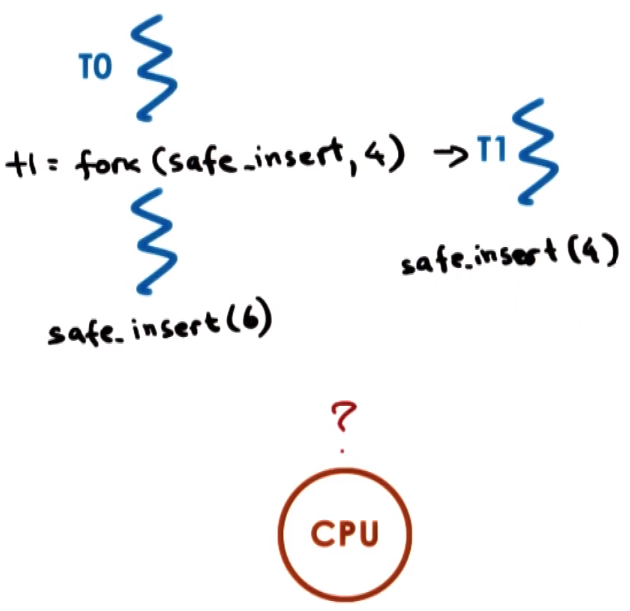
</center>

Assume initially that the process begins with one parent thread `T0`, which subsequently calls `Fork()`, resulting in the creation of child thread `T1` (which in turn calls `safe_insert(4)`).

<center>

</center>

`T0` subsequently calls `safe_insert(6)`, however, since both threads execute concurrently (with corresponding context switches on the CPU), the order in which these `safe_insert()` operations are called is ambiguous (i.e., the insertion order into the list is non-deterministic).

<center>
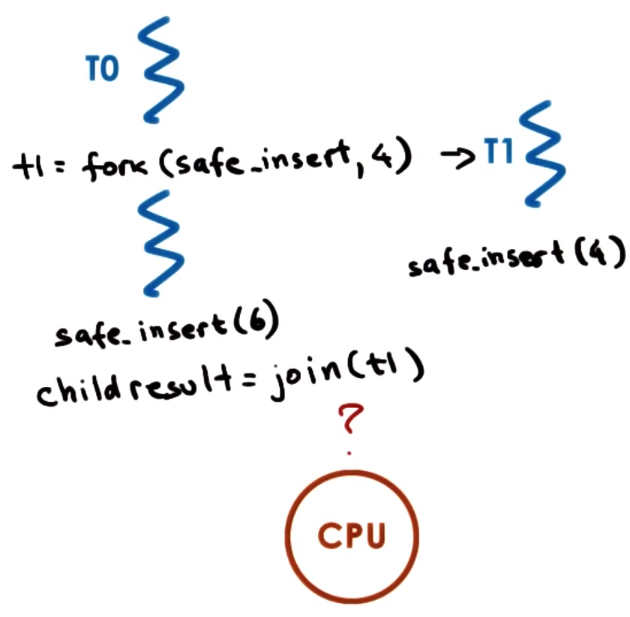
</center>

Therefore, when performing the final `Join()` operation:
  * if `Join(thread1)` is called when child thread `T1` has already completed, then it will return immediately
  * if `Join(thread1)` is called when child thread `T1` is still executing, then parent thread `T0` will be ***blocked*** until child thread `T1` completes execution

N.B. In this particular example, the results of the child thread's processing are available via `list`, therefore the `Join()` operation is not strictly necessary here (i.e., the result of the child thread `T1`'s operation is available irrespectively of the call to `Join()`).

## 11-13. Mutexes

### 11. Example Revisited

So, then, how is `list` supposed to be updated?

<center>

</center>

An example naive implementation (corresponding to the figure shown above) is as follows:

```
create new list element e
set e.value = X
read list and list.p_next
set e.p_next = list.p_next
set list.p_next = e
```

Here, each list element has two fields:
  1. `value`
  2. `p_next`, which points to the next element in the list

<center>
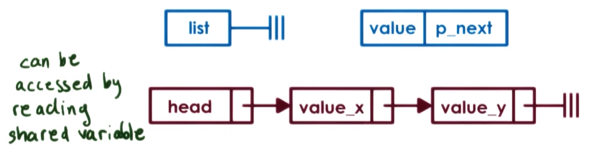
</center>

The first list element `list.head` can be accessed by reading the value of the shared variable `list`. Each thread that needs to insert a new element into the list will do the following (as per the figure shown above):
  1. create the new element `e` and set its value `e.value` (e.g., `value_x`)
  2. read the list (i.e., `list.head`) and its value `list.p_next` (e.g., pointer to element containing `value_y`)
  3. set `e.p_next` to `list.p_next`
  4. set `list.p_next` to `e`

Therefore, with this process, new elements are inserted at the head of the list.

<center>

</center>

Clearly, there is a **problem** if two threads running concurrently on two separate CPU cores attempt to update `list.p_next` simultaneously; the resulting behavior is non-deterministic.

<center>

</center>

Another **problem** occurs if two threads are running on the CPU simultaneously because their operations are randomly interleaved. For example, both may read the value of `list` and `list.p_next` (e.g., with `list.p_next` having value `NULL` per the figure shown above).

<center>

</center>

In this case, both may set `e.p_next` to `NULL`, and then subsequently take turns setting `list.p_next` to `e`, with only one of them actually being inserted into the list (e.g., the element with value `value_x` in the figure shown above) while the other is not and is consequently simply "lost." 

### 12. Mutual Exclusion

In the previous example, there is a **danger** present wherein the parent and the child thread may attempt to update the shared `list` simultaneously, thereby potentially overwriting the list elements. This illustrates a key **challenge** in multithreading: There is a need for a ***mechanism*** to perform **mutual exclusion** among the execution of concurrent threads.

<center>
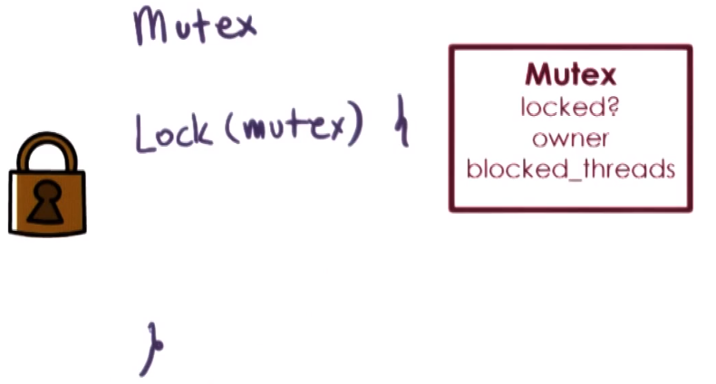
</center>

To perform such mutual exclusion, operating systems and threading libraries in general support a construct called a **mutex**, which is like a "lock" that is used whenever accessing data or state that is shared among threads.

When a thread **locks** a mutex, it has ***exclusive access*** to the shared resource; other threads attempting to lock the same mutex will be unsuccessful in doing so.
  * N.B. This operation alternatively called **acquisition** (i.e., "*acquiring* the lock" or "*acquiring* the mutex")

Such threads making unsuccessful attempts to lock the mutex are called **blocked** threads, meaning they will be suspended at this attempt (i.e., rather than proceeding) until the **owner** (the lock holder) releases it.

Therefore, as a **data structure**, at a minimum the mutex should hold at least the following **information**:
  * its status (i.e., whether or not it is currently locked)
  * a list (not necessarily ordered) containing all of the threads currently blocked on the mutex waiting to be freed
  * information on its owner, who currently has the lock

<center>
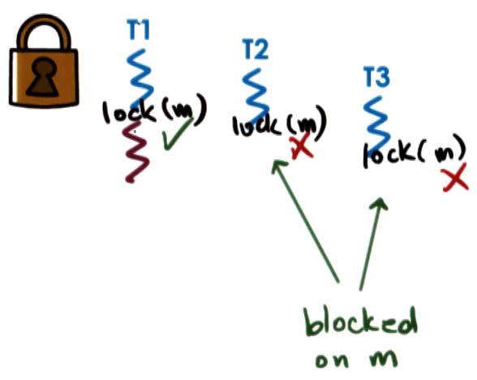
</center>

A thread that has successfully locked the mutex (e.g., `T1` in the figure shown above) has exclusive access to it and can proceed with its execution. Conversely, all other threads (e.g., `T2` and `T3`) attempting to lock the mutex at this time will be unsuccessful in doing so, but rather they will be blocked and will have to wait until the mutex is released.

<center>
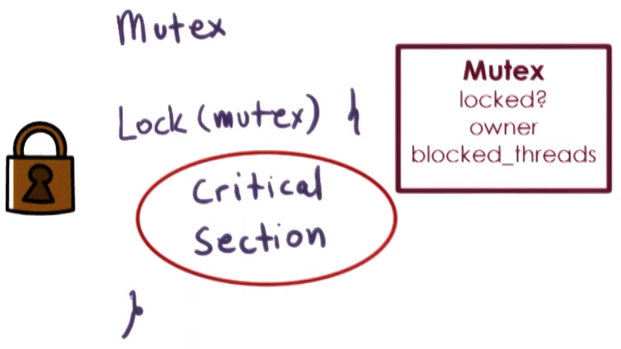
</center>

The portion of the code protected by the mutex is called the **critical section**.
  * In Birrell's paper, this corresponds to any code within `{ ... }` inside of the proposed operation `Lock()`
  * The critical-section code should correspond to any kind of operation requiring that only one thread at a time perform the operation (e.g., update to a shared variable [e.g., `list` in the previous example], incrementing/decrementing a counter, etc.).

<center>
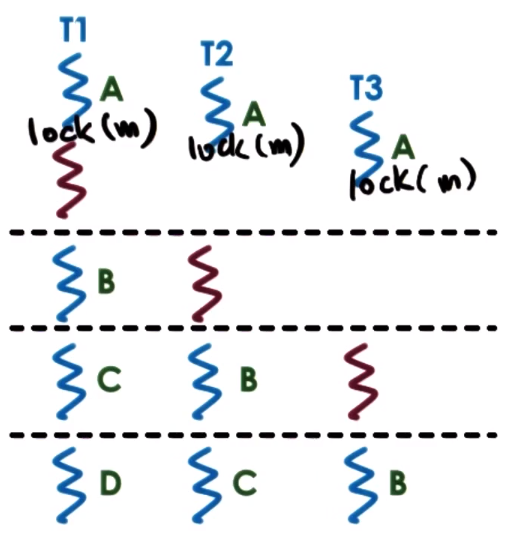
</center>

Other than the critical-section code (which can only be executed by one thread at a time), for the other code in the program (i.e., as denoted with letters `A`, `B`, `C` in the figure shown above),  the threads may execute concurrently without issue.
  * Therefore, the threads are mutually exclusive with one another with respect to the execution of the critical-section code.

<center>
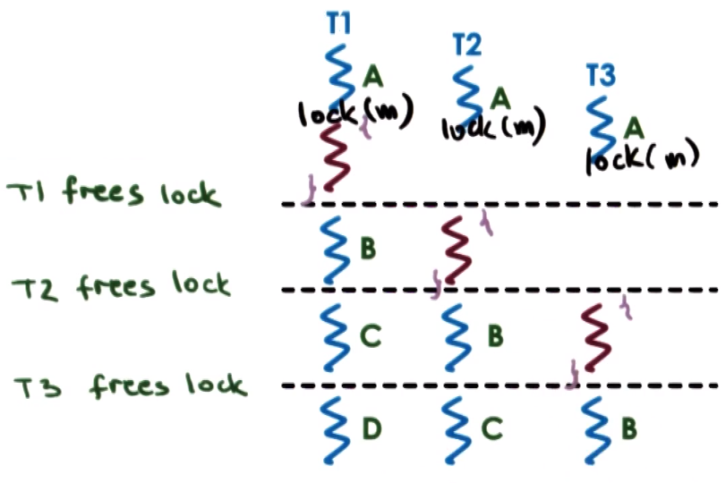
</center>

In the `Lock()` construct proposed by Birrell, the semantics are such that:
  * upon first acquiring a mutex, a thread first enters the `Lock()` code block `{ ... }`
  * upon subsequently exiting the block, the owner of the block releases the mutex (i.e., frees the lock)

When a lock is freed, any of the threads waiting on the lock (or a brand new thread just reaching the lock) can begin executing the `Lock()` operation.

<center>
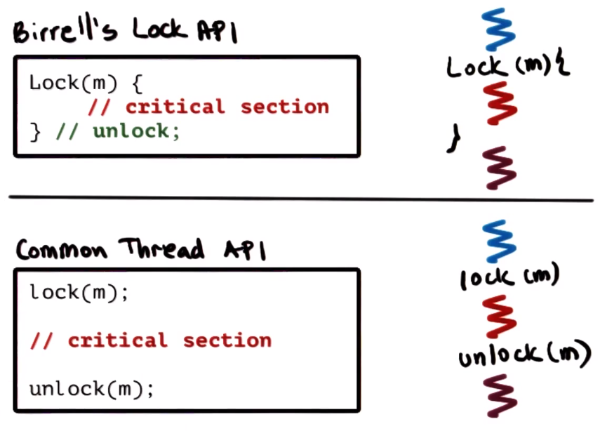
</center>

Birrell's `Lock()` construct (as shown in the figure above) will be used throughout the lecture, however, be advised that many common APIs provide a set of complementary operations `Lock(m)`/`Unlock(m)` (i.e., *without* an "implicit unlock" at that provided by Birrell's construct)

### 13. Mutex Example

Returning to the previous example, consider how the operation `safe_insert()` can be made "safe" via a mutex. The corresponding code is as follows:

```cpp
list<int> my_list;
Mutex m;
void safe_insert(int i) {
  Lock(m) {
    my_list.insert(i);
  } // unlock
}
```

<center>

</center>

As before (i.e., the thread creation code), threads `T0` and `T1` both attempt to perform the operation `safe_insert()`. Assume in this scenario that upon creating the child thread `T1`, subsequently the parent thread `T0` is the *first* to perform its `safe_insert()` operation (i.e., `safe_insert(6)`).

<center>

</center>

In this case, parent thread `T0` acquires the lock first and consequently adds the element (having value `6`) to `list`. Furthermore, any attempt by child thread `T1` to execute `safe_insert()` will be blocked during this time.

<center>

</center>

At some later point, parent thread `T0` will release the lock and then child thread `T1` will acquire the lock and perform its `safe_insert()` operation (i.e., `safe_insert(4)`).

<center>

</center>

Therefore, in this sequence, the final state of `list` will be as shown in the figure above.

## 14. Mutex Quiz and Answers

<center>
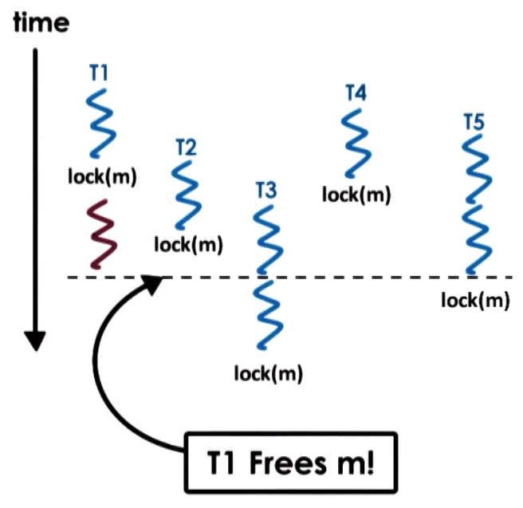
</center>

In the diagram shown above, threads `T1` to `T5` are contending for a mutex `m`. `T1` is the first to obtain the mutex. Which thread will get access to `m` after `T1` releases it? (Select all that apply.)
  * `T2`
    * `APPLIES`
  * `T3`
    * `DOES NOT APPLY`
  * `T4`
    * `APPLIES`
  * `T5`
    * `APPLIES`

***Explanation***:
  * Both `T2` and `T4` attempt to lock the mutex while `T1` performs the critical-section code (i.e., *before* `T1` releases the mutex), therefore their requests will be queued in the mutex's pending requests; furthermore, there is no guarantee in the order in which these requests will be fullfilled subsequently to the mutex being freed.
  * `T3` does not attempt to lock the mutex until `T1` frees it, therefore, it will not be among the first to gain access to the mutex (i.e., will not be ahead of `T2` or `T4`, which are already pending).
  * `T5` locks the mutex simultaneously as `T1` releases it, therefore `T5` is a viable contender for the mutex (i.e., possibly ahead of `T2` and `T4`, or alternatively added to the queue).

## 15. Producer and Consumer Example

For threads, the first construct suggested by Birrell is mutual exclusion, a binary operation (i.e., a resource is either free and accessible, or it is locked and access to it is restricted until released).

However, what if the processing you wish to perform with mutual exclusion needs to occur only under certain **conditions**?

<center>
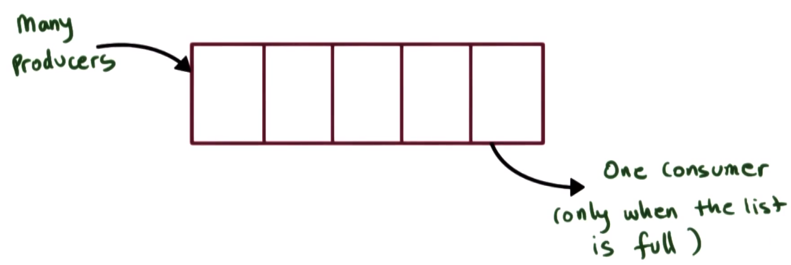
</center>

For example, consider the scenario where a number of threads (called **producers**) insert data into a list, while another special thread (called the **consumer**) prints out and then clears the content of the list once it reaches a predefined limit (i.e., is considered "full"). It is desired to ensure that the consumer thread only performs its operation under the condition in which the list is full.

Consider the following pseudocode for the **producer-consumer** problem just described:

```
// main
for i=0..10
  producers[i] = fork(safe_insert, NULL) // creat producers
consumer = fork(print_and_clear, my_list) // create consumer

// producers: safe_insert
Lock(m) {
  list->insert(my_thread_id)
} // unlock

// consumer: print_and_clear
Lock(m) {
  if my_list.full() -> print; clear up to limit of elements of list
  else -> release lock and try again (later)
} // unlock
```

Here, many producer threads are created which perform the operation `safe_insert()`, while the single consumer thread is created and performs the operation `print_and_clear()` (which only occurs if the list `my_list` is full).
  * The consumer thread waits until the lock is free, and then checks if the list `my_list` is full.

Operating this way is clearly ***wasteful***, inasmuch as the consumer thread must continuously check the status of the mutex. A better approach would be to simply dispatch the consumer thread only when the list is full.

## 16. Condition Variables

Birrell identifies this "wasteful" condition in multithreaded environments, and consequently proposes a new construct called a **condition variable** to address this, which is used in conjunction with the mutex to control the behavior of concurrent threads.

Consider the following modified pseudocode, which includes a condition variable `list_full`:

```
// producers: safe_insert
Lock(m) {
  my_list.insert(my_thread_id)
  if my_list.full()
    SIgnal(list_full)
} // unlock

// consumer: print_and_clear
Lock(m) {
  while (my_list.not_full())
    Wait(m, list_full)
  my_list.print_and_remove_all()
} // unlock
```

The consumer thread checks if the list `my_list` is full, and if it is not full then the consumer thread suspends itself via operation `Wait()` until the list is full.

The producer threads perform `safe_insert()` operations and check if the most recent such operation results in the list becoming full, in which case they call the operation `Signal()` to indicate to the consumer thread that the list is full.
  * The semantics of the operation `Wait()` are such that the acquired mutex `m` must be automatically released by the consumer thread upon the call to `Wait()`, and then subsequently the mutex `m` must be automatically re-acquired by the consumer thread once the list is full (e.g., the call to `Signal()` by the producer must signal to reacquire the mutex by the consumer when the list becomes full from the most recent insertion operation).

## 17. Condition Variable API

<center>

</center>

To summarize, a common **condition variable API** will be characterized by the following:
  * the **condition** type/variable is stored in a data structure (as shown in the figure above)
    * this data structure at a minimum contains the list of waiting threads (which are notified in the even that condition `cond == true` is met), as well as a reference to the mutex associated with the condition `cond` (i.e., in order to implement the operation `Wait()` correctly)
  * the construct `Wait(mutex, cond)`, wherein `mutex` is automatically released and re-acquired on wait for the condition `cond == true` to occur
  * the operation `Signal(cond)` notifies the waiting threads only *one at a time* on condition `cond == true` occurring
    * this is consistent with the operation `Signal()` described by Birrell
  * additionally, the operation `Broadcast(cond)` may be provided to notify *all* waiting threads when condition `cond == true` has occurred
    * this additional operation `Broadcast()` is also described by Birrell

For reference, the operation `Wait()` can be implemented in an operating system or a threading library as follows:

```c
Wait(mutex, cond) {
  // atomically release the mutex
  // and proceed to the wait queue

  // ... wait ... wait ... wait ...

  // remove from the wait queue
  // re-acquire the mutex
  // exit the operation Wait()
}
```

Note that on removal from the wait queue (e.g., via `Signal()` or `Broadcast()`), the immediately subsequent task performed by the thread is to re-acquire the mutex. Therefore, on `Broadcast()`, while all threads are woken up, only one thread will re-acquire the mutex and consequently exit the operation `Wait()`; this suggests for a tenuous use of the operation `Broadcast()` in the multithreading situations where this can occur.

## 18. Condition Variable Quiz and Answers

Recall the consumer code from the previous example for condition variables, repeated here as follows:

```c
Lock(m) {
  while(my_list.not_full())
    Wait(m, list_full);
  my_list.print_and_remove_all();
} // unlock
```

Instead of using `while`, why did we not simply use `if`? (Select the correct choice.)
  * `while` can support multiple consumer threads
  * access to `m` cannot be guaranteed once the condition is signaled
  * the list `my_list` can change before the consumer is granted access again
  * all of the above
    * `CORRECT`

***Explanation***: When there are multiple consumer threads waiting, one consumer thread that is waiting wakes up via call `Wait(m, list_full)`, however, before processing `my_list`, newly arriving consumer threads are also able to (re-)acquire the mutex and then perform the action `my_list.print_and_remove_all()`. Therefore, the state of the mutex may have already changed, and it is not guaranteed that the awakened thread will be able to acquire the mutex at that point. Consequently, the value/state of the list `my_list` is therefore also not guaranteed at any given time when the next consumer thread (re-)acquires the mutex.

## 19. The Readers/Writer Problem

Consider now how mutexes and condition variables can be combined for use in a common scenario in multithreaded systems, multithreaded applications, and operating systems called **the readers/writer problem**. In this scenario, there are multiple threads, each belonging to one of two subsets:
  1. **readers**, which perform a read operation to access the shared state
  2. **writers**, which access the shared state to modify it

<center>
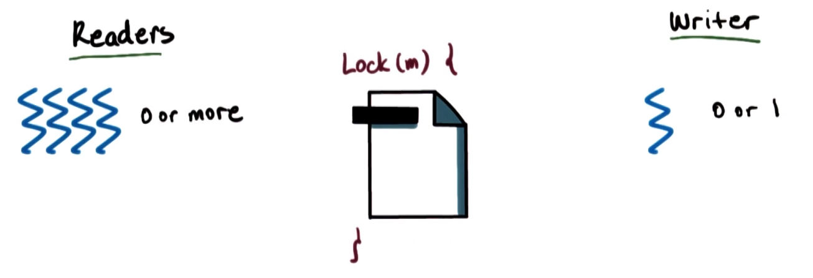
</center>

In the readers/writers problem, at any given time, 0 or more of the readers threads can access the resource, but only 0 or 1 writer thread can access the resource concurrently with the readers (however a writer *and* a reader thread cannot access the shared resource simultaneously, only one or the other at any given time).

One naive approach to solving this problem is to protect the entire resource (e.g., a file) with a mutex having a corresponding `Lock()`/`Unlock()` operation (as in the figure shown above). However, this approach is too restrictive for the readers/writer problem, because a mutex allows only *one* thread to access the critical section at any given time (these semantics are appropriate for the writer, however, not for the readers, which should be able to perform the read operation simultaneously at any given time).

Consider enumerating various situations of accessing the resource, as follows:

| condition | read operation | write operation |
| :--: | :--: | :--: |
| `if((read_counter == 0) and (write_counter == 0))` | permissible | permissible |
| `if (read_counter > 0)` | permissible | not permissible |
| `if (writer_count == 1)` | not permissible | not permissible |

Therefore, given these situations, the **state** of the shared resource (e.g., file) can be described as follows:
  * **free**: `resource_counter = 0`
  * **reading**: `resource_counter > 0` (i.e., `resource_counter` is the number of reader threads reading the file in this state)
  * **writing**: `resource_counter = -1` (i.e., the writer thread is accessing the resource in this state)

  In this manner, the state of the resource is tracked by proxy (i.e., ***indirectly***) via the variable `resource_counter`, rather than tracking directly with the resource itself. Furthermore, a mutex can be used to update the state of `resource_counter` to manage the corresponding behavior of the threads (i.e., readers and writer).

## 20-22. Readers/Writer Example

Consider the following readers/writer problem example:

```c
/* --- STATE VARIABLES --- */
Mutex: counter_mutex;
Condition: read_phase, write_phase;
int resource_counter = 0; // initial value


/* --- READERS --- */
Lock(counter_mutex) {
  while (resource_counter == -1)
    Wait(counter_mutex, read_phase);
  resource_counter++;
} // unlock

// ... read data ...

Lock(counter_mutex) {
  resource_counter--;
  if (resource_counter == 0)
    Signal(write_phase);
} // unlock


/* --- WRITERS --- */
Lock(counter_mutex) {
  while (resource_counter != 0)
    Wait(counter_mutex, write_phase);
  resource_counter = -1;
} // unlock

// ... write data ...

Lock(counter_mutex) {
  resource_counter = 0;
  Broadcast(read_phase);
  Signal(write_phase);
}
```

The access to the shared resource (e.g., file) is performed via the `read data` and `write data` operations, which occur *outside of* the `Lock()` constructs in both the readers and the writer (i.e., access to the resource itself is *not* directly controlled). Correspondingly, the helper variable `resource_counter` (initialized to `0`) is used to perform a controlled operation (via corresponding `Lock()`s) in which `resource_counter` is first updated.

Once use of the shared resource is completed (i.e., via corresponding operations `read data` or `write data`), the `Lock()` constructs are again used to update `resource_counter` to reflect that the resource is now free for subsequent use.

This process is managed via the state variables `counter_mutex` (the mutex) and `read_phase`/`write_phase` (the conditions), which coordinates access by the reader(s) and the writer at any given time.

As the readers finish the `read data` operation, they proceed to the subsequent `Lock()` operation, wherein the mutex `counter_mutex` is locked (N.B. at this point, it is imperative that the writer thread had called the `Wait()` operation to unlock the mutex in its first call to `Lock()`, in order to allow the reader threads to access the resource). In this `Lock()` operation, the check `if (resource_counter == 0)` determines if there are any other readers currently accessing the resource; if there are not (i.e., the condition is `true`), then this signals a potential writer thread via the call `Signal(write_phase)`.
  * N.B. Since only one writer thread can operate at at time, it is not sensible to use a `Broadcast()` operation here; rather, `Signal()` is more appropriate.

A writer thread that has previously called `Wait()` will now be awakened and will set `resource_counter = -1` after checking if `resource_counter != 0` (i.e., there are no other reader threads or another writer thread currently accessing the resource). This writer thread can then unlock the mutex and proceed with the operation `write data`.

Upon completing the operation `write data`, the writer thread performs the second `Lock()` operation. It first resets `resource_counter = 0` (i.e., there can only be one writer thread at any given time, so `resource_counter--` is not sensible here). Additionally, the writer thread calls `Broadcast(read_phase)` (wakes up all reader threads that are currently waiting) and `Signal(write_phase)` (wakes up another writer thread that is waiting, with only *one* writer thread being able to proceed at any given time).
  * N.B. The calling order of `Broadcast(read_phase); Signal(write_phase);` vs. `Signal(write_phase); Broadcast(read_phase);` here is arbitrary, inasmuch as the corresponding thread behavior will be dictated by the action of the scheduler.

Subsequently to `Broadcast(read_phase)` from the writer thread, the waiting reader threads will awaken one at time (cf. first readers `Lock()` operation), check for `resource_counter == 1`, increment via `resource_counter++`, and then unlock the mutex and proceed with the operation `read data`. Therefore, in general, there may be multiple reader threads accessing the resource via `read data` at any given time.

## 23. Critical Section Structure

<center>
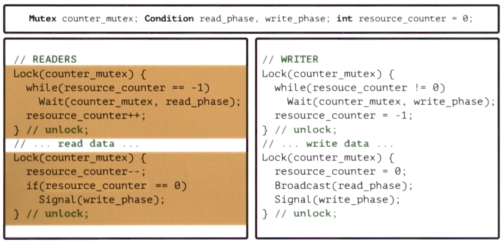
</center>

Consider the shaded coded segments in the figure shown above, corresponding to "*enter the critical section*" and "*exit the critical section*" (respectively), where the operation `read data` is the **critical section** in question (i.e., the intent here is to protect the resource).

Examining these shaded code segments further, they reveal the following **general form** (i.e., for a typical critical section):

```
Lock(mutex) {
  while (!predicate_indicating_access_ok)
    wait(mutex, cond_var)
  update state => update predicate
  signal and/or broadcast(cond_var_with_correct_waiting_threads)
} // unlock
```

<center>
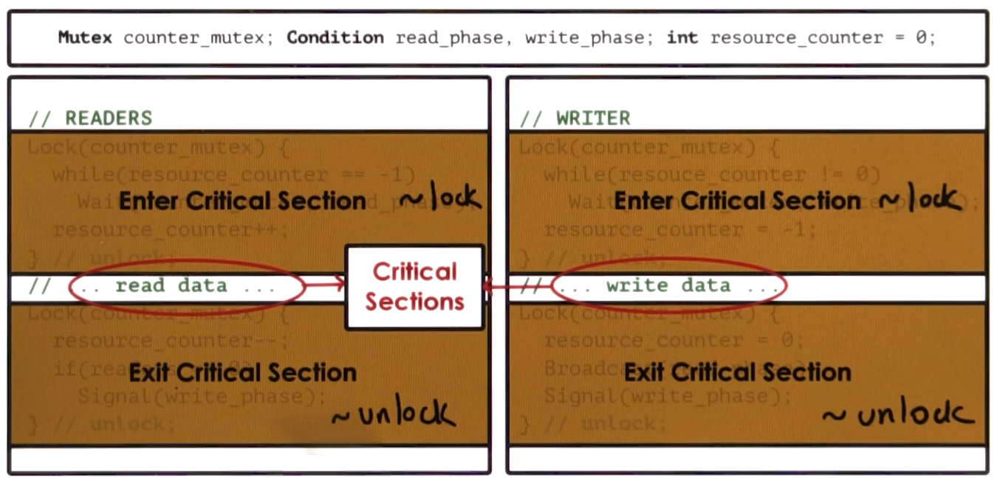
</center>

Returning to the readers/writer problem, the main critical section (i.e., the one to be controlled and protected) is the operations `read data` (readers) and `write data` (writer). Therefore, the code blocks which precede and follow this critical section are correspondingly called the **enter critical section** and **exit critical section** blocks (respectively). Each of these blocks shares the same mutex (e.g., `counter_mutex`), therefore, only one thread at a time will be able to execute within these blocks, which only manipulate the variable `resource_counter`. Furthermore, observe that the `Enter/Exit Critical Section` pairs constitute a corresponding `Lock()`/`Unlock()` pair with respect to the shared resource, whereby `Unlock()` of the readers complements to the `Lock()` of the writer and vice versa.

## 24. Critical Section Structure with Proxy Variable

The readers/writer problem is therefore typified by the following common blocks:

```
// ENTER CRITICAL SECTION
perform critical operation (e.g., read/write shared file)
// EXIT CRITICAL SECTION
```

where:

```
// ENTER CRITICAL SECTION
Lock(mutex) {
  while(!predicate_for_access)
    wait(mutex, cond_var)
  update predicate
} // unlock
```

and

```
// EXIT CRITICAL SECTION
Lock(mutex) {
  update predicate
  signal/broadcast(cond_var)
} // unlock
```

The mutex is only held in `ENTER CRITICAL SECTION` and `EXIT CRITICAL SECTION`, which allows for control of the **proxy variable** while still allowing more than one thread to be performing the critical operation at any given time. Therefore, this scheme (i.e., mutex with a proxy variable) resolves the main limitation of the mutex, which otherwise only allows access to the resource by one thread at a time, thereby allowing for the implementation of more complex sharing scenarios (e.g., multiple readers or one writer can access the resource at any given time).

## 25. Avoiding Common Pitfalls

When writing multithreaded applications, be aware of the following:
  * Keep track of the mutex and condition variable(s) used with a resource
    * e.g., `mutex_type m1; // mutex for file1`
  * Check that you are always (and correctly) using the operations `Lock()` and `Unlock()`
    * e.g., Did you forget to `Lock()` and/or `Unlock()`?
    * Compilers may warn about these types of mistakes, however, they should be avoided whenever possible nevertheless
  * Use a *single* mutex to access a *single* resource
    * e.g., the following should be avoided:
    ```
    /*
      since `m1` and `m2` are different mutexes, read and write 
      operations can occur concurrently
    */
    Lock(m1) {
      // read file1
    } // unlock

    Lock(m2) {
      // write file1
    } // unlock
    ```
  * Check that you are signaling (or broadcasting) the correct condition, i.e., to ensure that the correct thread(s) is/are notified
  * Check that you are not using `Signal()` when `Broadcast()` is needed instead
    * N.B. The opposite is generally *safe* (i.e., the program will behave correctly), however, this can adversely impact performance
    * Recall that with `Signal()` only 1 thread will proceed, while the remaining threads will continue to wait (possibly ***indefinitely***!)
  * Ask yourself: Do you need priority guarantees?
    * Recall that thread execution order is not directly controlled by the order of signals to condition variables, but rather by the scheduler
  * **Spurious wake-ups** and **deadlocks** are two conditions to be mindful as well; these will be discussed next in this lesson

## 26. Spurious Wake-Ups

One pitfall that does not necessarily affect *correctness* but may impact ***performance*** is called **spurious (or unnecessary) wake-ups**.

Consider the following example:

```c
// WRITER
Lock(counter_mutex) {
  resource_counter = 0;
  Broadcast(read_phase);
  Signal(write_phase);
} // unlock

// READERS
// elsewhere in the code ...
Wait(counter_mutex, write/read_phase);
```

<center>
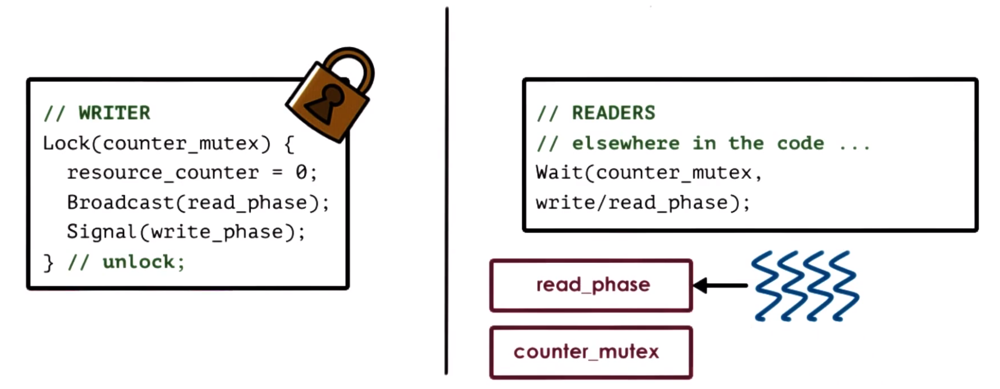
</center>

Now, consider the current state of the program shown above, wherein the writer thread has locked the mutex `counter_mutex` to perform the `write` operation, while several reader threads are in the wait queue waiting on the condition `read_phase`. When the writer thread issues the `Broadcast()` operation, this commences removal of reader threads from the wait queue (perhaps on another core), which can occur prior to the writer thread completing the remaining operations inside of the `Lock()` construct (e.g., `Signal(write_phase)`).

<center>
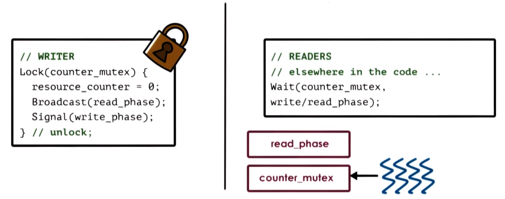
</center>

Because the writer thread still holds the mutex, however, the reader threads will not be able to proceed, and will therefore be placed on the waiting queue associated with `counter_mutex`, as in the figure shown above. This scenario is called a **spurious wake-up**, because the threads were awakened, however, this was unnecessary inasamuch as the threads must wait again until the mutex is released. This will not affect the correctness of the program, however, performance is affected to the extent that cycles are expended on unnecessary context switching.

Observe that if an unlock is performed after `Broadcast()`/`Signal()`, then no other thread can access the lock, thereby resulting in a spurious wake-up. The ability of the reader threads to perform the action will therefore depend on the order of the operations.

A natural follow-up question therefore is: Can we unlock the mutex *before* `Broadcast()`/`Signal()`?

Consider the following modification to the writer thread:

```c
// OLD WRITER
Lock(counter_mutex) {
  resource_counter = 0;
  Broadcast(read_phase);
  Signal(write_phase);
} // unlock

// NEW WRITER
Lock(counter_mutex) {
  resource_counter = 0;
} // unlock
Broadcast(read_phase);
Signal(write_phase);
```

This modification will indeed behave correctly, and will also avoid the issue of spurious wake-ups.

However, recall the code for the readers threads:

```c
Lock(counter_mutex) {
  resource_counter--;
  if (counter_resource == 0)
    Signal(write_phase);
} // unlock
```

Because the `if` clause depends on ` counter_resource`, it is *not* permissible to modify this code such that the unlocking is performed *before* commencing with the `Signal()` operation, otherwise the ***correctness*** of the program will be adversely impacted.

## 27. Deadlocks Introduction

A particular issue to multithreading is called **deadlocks**, defined informally as: Two or more competing threads are waiting on each other to complete, but none of them ever do. Therefore, the overall execution of the process is "stuck" (i.e., "deadlocked").

<center>
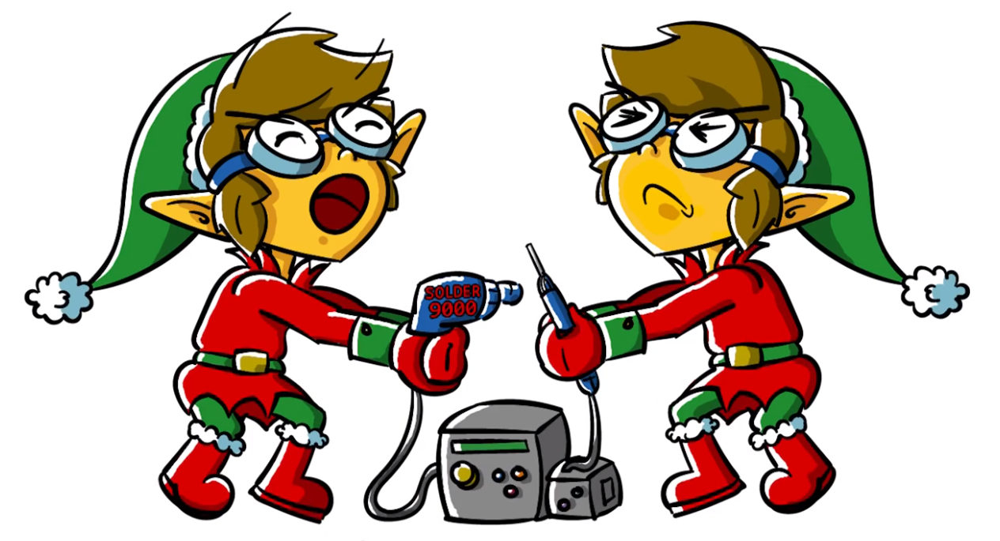
</center>

Returning to the toyshop analogy, consider the scenario wherein two workers are finishing toy orders involving a train, and each worker requires a soldering iron and solder wire to finish the toy orders. The **problem** that arises in this scenario is that there is only *one* soldering iron and *one* solder wire. If one worker grabs the soldering iron while the other worker grabs the solder wire, with each worker being too stubborn to relinquish their respective instruments, then none of the toy orders can be finished; therefore, the toy building process is **deadlocked**.

## 28. Deadlocks

<center>
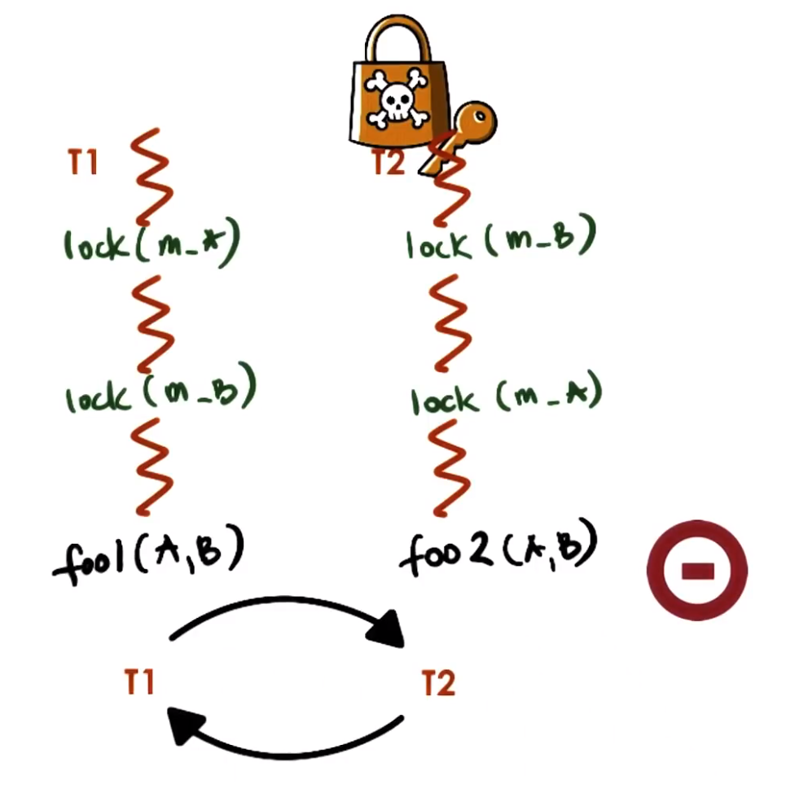
</center>

In practice, deadlocks can be explained as per the figure shown above. Here, two threads `T1` and `T2` must perform operations `foo1()` and `foo2()` (i.e., these can be the same or even different operations) involving variables `A` and `B`. Before performing these operations, the respective threads must `lock()` the shared variables `A` and `B` via corresponding mutexes `m_A` and `m_B` (respectively).

In this scenario, assume that thread `T1` locks the mutexes in the order `m_A` then `m_B`, while thread `T2` locks the mutexes in the order `m_B` then `m_A`. Consequently, threads `T1` and `T2` will be locked in a cycle, wherein neither thread is able to proceed to their respective operations (i.e., `foo1()` and `foo2()`) due to the inability to proceed to their respective second `lock()` operations, thereby resulting in a **deadlock**.

<center>
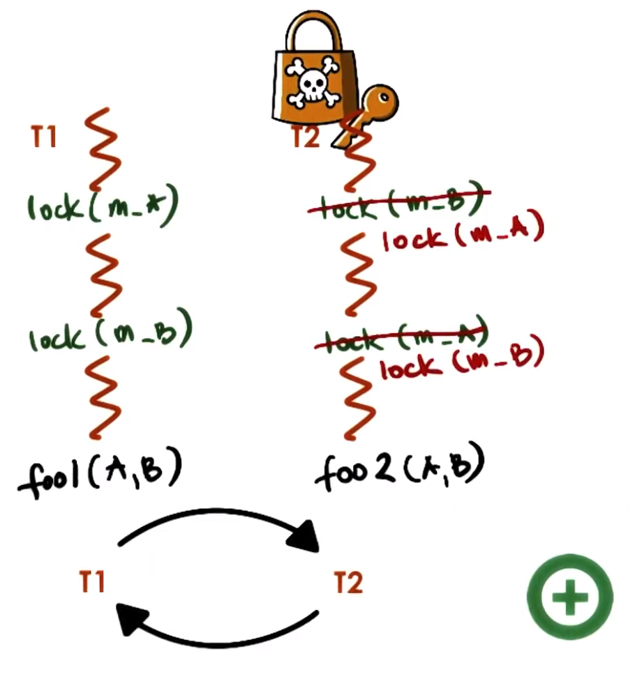
</center>

So, then, how can this situation be **avoided**?
  * Unlock `A` before locking `B`, called **fine-grained locking**
    * However, in this scenario, this solution will not work, because both threads `T1` and `T2` require *both* `A` *and* `B` for their respective operations `foo1()` and `foo2()`
  * Get all locks upfront, and then release at the end
  * Use *one* "mega" lock
    * This solution may be adequate for certain applications, however, it is ***restrictive*** due to its limiting of parallelism
  * Maintain a **lock order** (e.g., first `m_A` then `m_B`, enforced for each thread), as in the figure shown above
    * This is the most ***common solution*** to the deadlock problem (i.e., by resolving cycles/dependencies in the wait graph), which essentially guarantees correct behavior
    * One potential **challenge** with this approach, however, is that a complex program involving many shared variables and/or many  synchronization variables (i.e., many mutexes) may involve non-trivial implementation/design to enforce the lock ordering correctly

## 29. Deadlocks Summary

There is more that goes into dealing with deadlocks than what has been presented thus far (e.g., deadlock detection, avoidance, recovery, etc.), however, for purposes of this course, be aware that maintaining a lock order will generally yield a deadlock-proof solution.

<center>

</center>

In summary:
  * A **cycle** in the **wait graph** is both ***necessary*** *and* ***sufficient*** for a deadlock to occur
    * This wait graph consists of **edges** from the thread waiting on a resource to the thread owning the same resource
  * What can we do about it?
    * deadlock **prevention** (e.g., every time a thread is about to issue a request for a lock, it first must be determined whether the operation will generate a cycle in the wait graph, in which case the operation must be delayed [e.g., releasing the resource first prior to performing the `Lock()` operation])'
      * this can be ***expensive***
    * deadlock **detection** and **recovery** (e.g., via analysis of the wait graph, in order to determine whether any cycles will be generated at some point in time)
      * this is less expensive than analyzing each `Lock()` operation, however, there is still overhead/expense associated with providing **rollback mechanisms** (e.g., via corresponding state management) to recover execution whenever a deadlock is detected/encountered, which may be further complicated or otherwise become impossible to implement (e.g., if state has external, non-deterministic dependencies)
    * apply the **Ostrich Algorithm**, which is simply a euphemism for "do nothing" (as in the figure shown above)
      * if all else fails with this approach, then "just *reboot*" is the consequent contingency
      * while this may seem rather trite, in practice sophisticated mechanisms such as the aforementioned prevention and rollback are difficult to implement and are typically reserved for performance-critical systems (i.e., at which point such expenditures are necessary by design/requirements)

## 30. Critical Section Quiz and Answers

A toy shop has the following critical section entry code for new orders:

```
// toy_shop_entry_for_new_orders
lock(orders_mutex) {
  // [INSERT CHECK HERE]
    wait(orders_mutex, new_cond)
  new_order++
}
```

In this toy shop, there are new toys orders arriving, as well as orders for repairs of toys that have already been processed. Only a certain number of toy shop workers (i.e., threads) will be available in the toy shop at any given time, therefore, the mutex `orders_mutex` controls which workers have access to the toy shop at any given time (i.e., which orders can be processed).

Furthermore, the toy shop has the following **policy**. At any given time:
  * there can be a maximum of up to 3 new orders processed
  * if only 1 new order is being processed, then any number of old orders can be processed

Which of the following conditions satisfies this policy? (Select all applicable options.)
  * `while ((new_order == 3) OR (new_order == 1 AND old_order > 0))`
    * `APPLIES` - this aligns exactly/explicitly with the policy
      * N.B. `new_order > 3` is not a reachable condition here, since `new_order` is not updated until exiting from the `wait()` operation
  * `if ((new_order == 3) OR (new_order == 1 AND old_order > 0))`
    * `DOES NOT APPLY` - using `if` here creates the problem encountered previously, wherein another thread may update `new_order` (i.e., via `new_order++`), thereby changing the value of the latter predicate (and consequently violating the policy); conversely, the corresponding `while` loop (i.e., in the previous choice) re-checks the predicate prior to proceeding
  * `while ((new_order >= 3) OR (new_order == 1 AND old_order >= 0))`
    * `DOES NOT APPLY` - checking `old_order >= 0` will block a new incoming order if there is already a new order in the system (i.e., `new_order == 1 AND old_order == 0` is true), which is inconsistent with the policy
  * `while ((new_order >= 3) OR (new_order == 1 AND old_order >= 1))`
    * `APPLIES` - this is equivalent to the first choice, however, in practice the condition `new_order > 3` will not be reached

## 31. Kernel- vs. User-Level Threads

<center>

</center>

Recall, as was discussed previously in this lesson, that threads can exist both at the user level as well as at the kernel level. Now, consider further the distinction between these two.
  * **kernel-level threads** imply that the operating system itself is multithreaded, whereby the kernel-level threads are visible to the kernel and are correspondingly managed by kernel-level components (e.g., the scheduler)
    * therefore, it is the operating system scheduler that decides how the kernel-level threads will be mapped onto the underlying physical CPU cores, and which one(s) will execute at any given time
    * some kernel-level threads may also directly support the applications processes (e.g., directly executing some of the user-level threads), while other kernel-level threads may execute other services (e.g., daemons) 
  * **user-level threads** correspond to multithreaded processes (i.e., applications)
    * for a user-level thread to actually execute, it first must be associated with a kernel-level thread, and then the operating system scheduler must schedule that kernel-level thread onto a CPU core

A natural follow-up question is therefore: What is the **relationship** between the user-level and kernel-level threads? This will be discussed next via the corresponding **multithreading models**.

## 32. Multithreading Models

### One-to-One Model

<center>
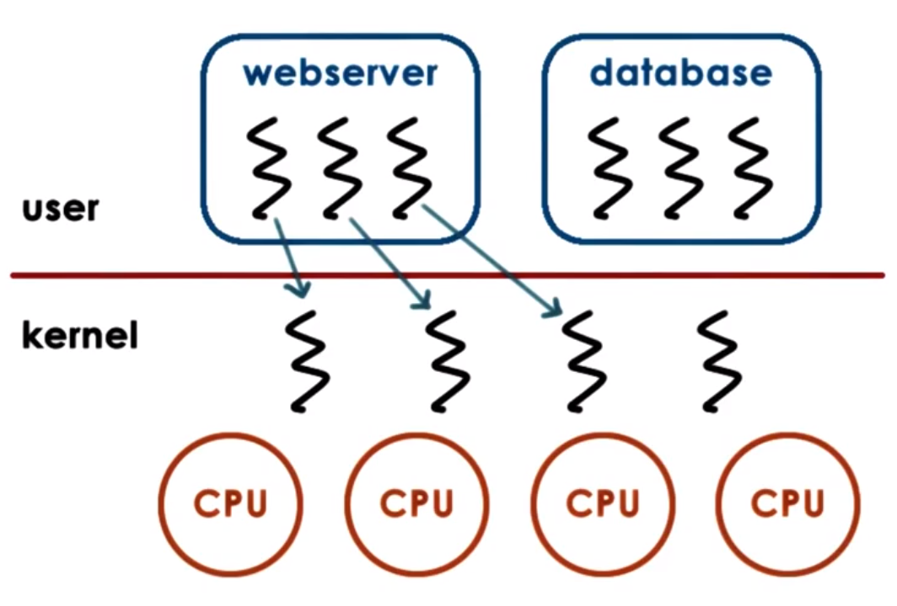
</center>

In the **one-to-one model**, each user-level thread has an associated kernel-level thread. When the user process creates a new user-level thread, there is a kernel-level thread that is either created or otherwise made available for association with the user-level thread.

The **benefit** of this model is that the operating system sees all of the user-level threads, and accordingly understands what this multithreaded user process's threads need (e.g., synchronization, scheduling, blocking, etc.).
  * Since the operating system already supports these mechanisms in order to manage its own kernel-level threads, then the user-level processes can in turn benefit directly from the multithreading support already being provided by the operating system kernel

However, the **drawbacks** of this model are as follows:
  * it is necessary to go to the operating system for *all* operations, which may be ***expensive***
  * the operating system may have limits on policies, number of available threads, etc.
  * portability of the user processes can be an issue (i.e., to a non-multithreaded operating system kernel)

### Many-to-One Model

<center>
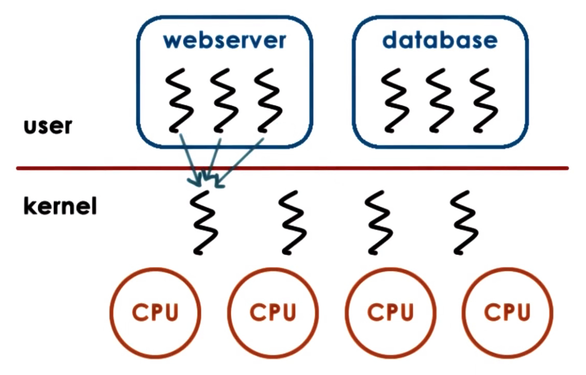
</center>

In the **many-to-one model**, all of the user-level threads for a given user process are mapped to a *single* kernel-level thread. At the user level, there is a **thread-management library** that decides which of the user-level threads will be mapped onto the kernel-level thread at any given time. Correspondingly, this selected user-level thread will only be run once the corresponding kernel-level thread is scheduled by the operating system scheduler to run on the CPU core.

The **benefit** of this model is that it is totally ***portable***, inasmuch as the user process is not dependent on the operating system's limits and policies.
  * Furthermore, since all of the thread management is performed at the user level (i.e., via the thread-management library), there is no reliance upon system calls or user-kernel transitions to make decisions regarding scheduling, synchronization, blocking, etc.

However, the **drawbacks** of this model are as follows:
  * the operating system has no insights into the user application's needs (i.e., it is otherwise unaware that the corresponding user process is multithreaded)
  * the operating system may block the *entire* process if *one* user-level thread blocks on I/O, thereby preventing any of the other user-level threads from performing useful work while the I/O thread is blocked and correspondingly adversely impacting performance

### Many-to-Many Model

<center>
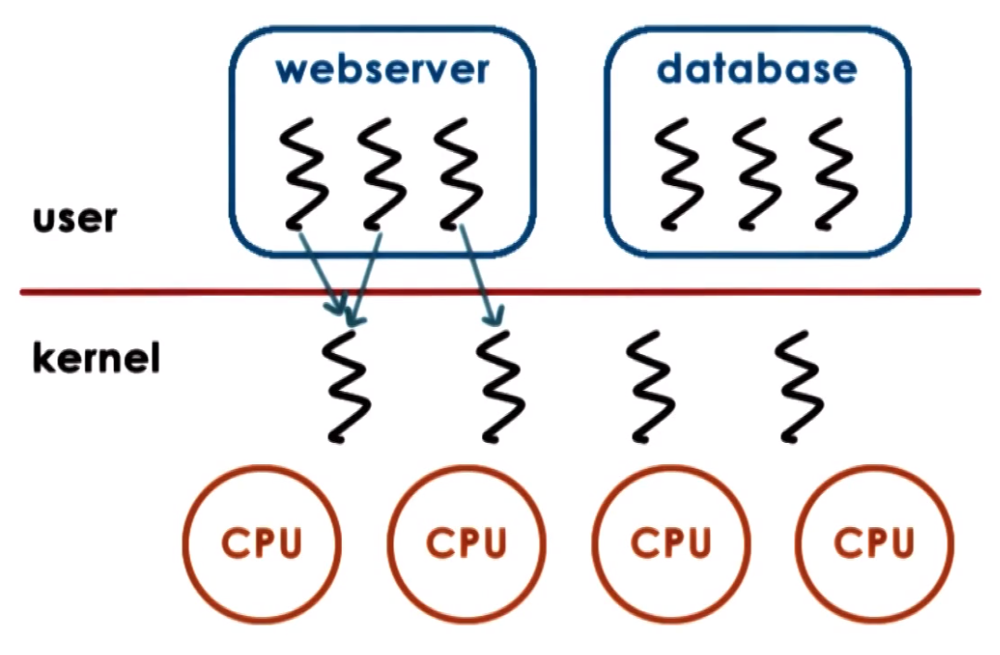
</center>

The **many-to-many model** is essentially a hybrid of the two aforementioned models. It allows some user-level threads to be associated with one kernel-level thread, wile other user-level threads may have a one-to-one mapping with a corresponding kernel-level thread.

The **benefits** of this model are as follows:
  * it can provide "the best of both worlds" (e.g., the operating system kernel is aware that the user process is multithreaded due to the assignment to multiple user-level threads, and any blocking operations will not block the entire process)
  * the user-level threads can be **bound** (a user-level thread is mapped to a dedicated kernel-level thread) or **unbound** (user-level threads are assigned to the corresponding kernel-level threads on an ad hoc basis as the latter become available)
    * in this manner, bound threads can be treated specially (e.g., higher priority, better responsiveness to certain events, etc.)

However, the main **drawback** of this model are is that it requires coordination between the uer- and kernel-level thread managers, mostly to optimize performance
  * in the one-to-one model, thread management is generally handled by the operating system kernel's thread manager
  * in the many-to-one model, thread management is generally handled by the user process's thread manager (e.g., thread management library)

## 33. Scope of Multithreading

The implications of implementation around interactions between the user-level threads and the kernel-level threads will be discussed later, however, for present purposes, it is important to understand that multithreading is supported to varying degrees (i.e., either over the entire system or only within a process), and that  each level affects the **scope** of the thread management system accordingly.

### System Scope

At the operating system kernel level, there is **system scope**, which is ***system-wide*** thread management performed by operating-system-level thread managers (e.g., the CPU scheduler). This means that the operating system kernel's thread managers will assess the *entire* platform when making decisions regarding how to allocate resources to the threads.

### Process Scope

On the other end, at the user level, there is **process scope**, in which a user-level library manages threads within a *single* process (i.e., the management scope is ***process-wide*** only). Therefore, different processes will be managed by different instances of the same library, or different processes may even use entirely *different* user-level libraries to manage their constituent user-level threads.

### Examples

<center>
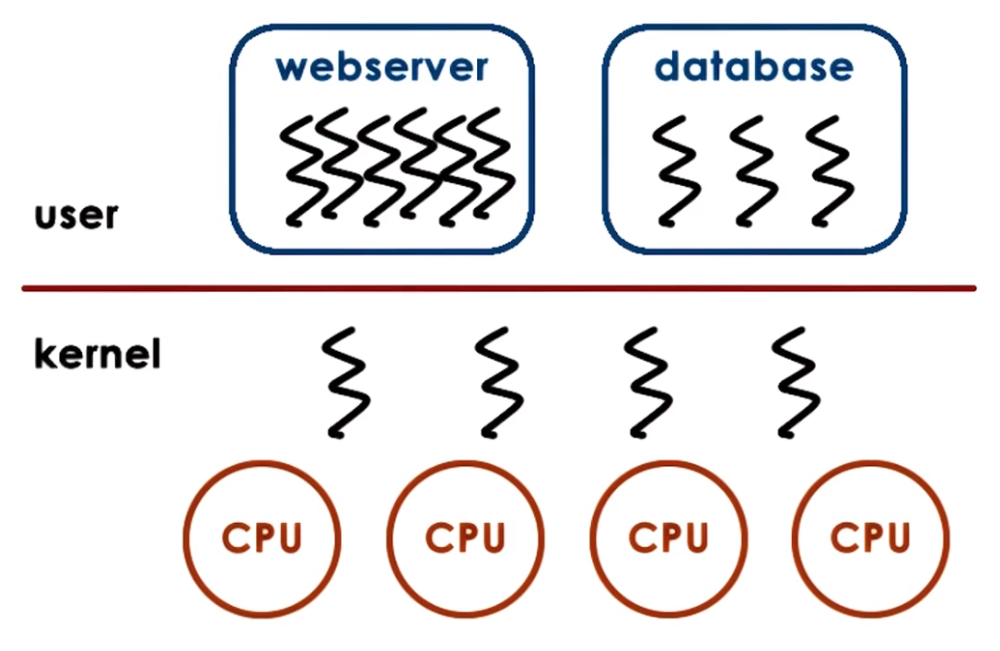
</center>

Consider a process wherein the webserver process has twice as many threads as the database process, as in the figure shown above. If the user-level threads have a ***process scope***, these user-level threads are *not* visible to the operating system. Therefore, at the operating system level, the available resources (e.g., kernel-level threads and CPU cores) will be managed accordingly, e.g., 50%-50% split between the webserver and database processes. With such a 50%-50% split, the webserver process will effectively have only half of the CPU cycles that are available to the database process.

<center>
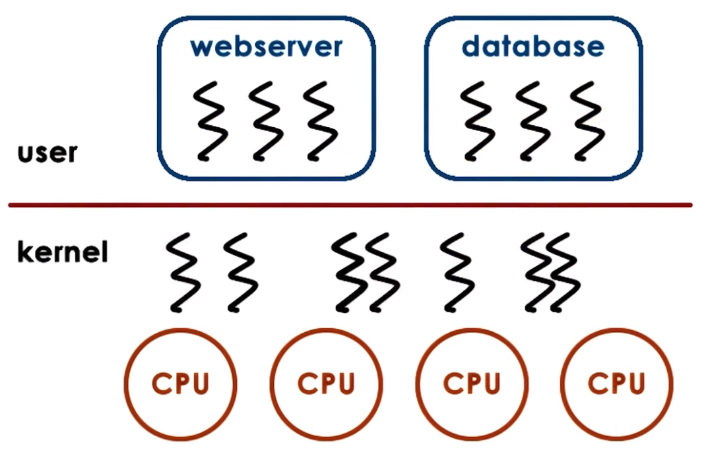
</center>

Now consider a scenario having ***system scope***, as in the figure shown above. Here, all of the user-level threads (i.e., in both the webserver and database processes) will be visible to the kernel level, therefore, the kernel will allocate to each of its kernel-level threads (and correspondingly to each of the user-level threads across the two processes), as well as division of the available CPU cores (i.e., based on the policy implemented by the kernel, e.g., 50%-50%).

<center>
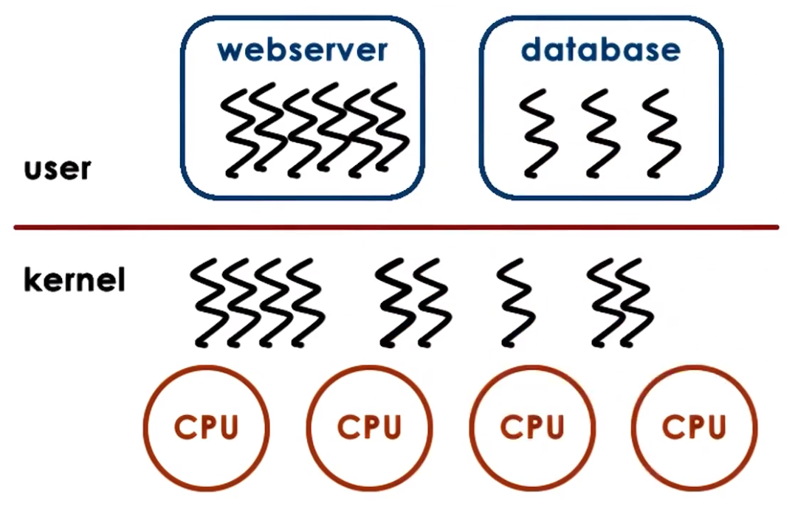
</center>

Consequently, if the webserver process involves relatively more user-level threads than the database process, as in the figure shown above, then the former will receive a larger proportion of the resources (e.g., available kernel-level threads and CPU cores) accordingly.

## 34. Multithreading Patterns

<center>

</center>

Before concluding this lesson, we will discuss the following useful **multithreading patterns** for structuring applications that use threads:
  * boss/workers
  * pipeline
  * layered

### Example: Toy Shop Application

<center>

</center>

Before proceeding with discussion, let's examine these patterns in the context of the toy shop application. Here, for each wooden toy order, we...
  1. accept the order
  2. parse the order
  3. cut wooden parts
  4. paint and add decorations
  5. assemble the wooden toys
  6. ship the order

Depending on the multithreading pattern used, these steps will be assigned *differently* to the workers in the toy shop.

## 35. Boss/Workers Pattern

<center>
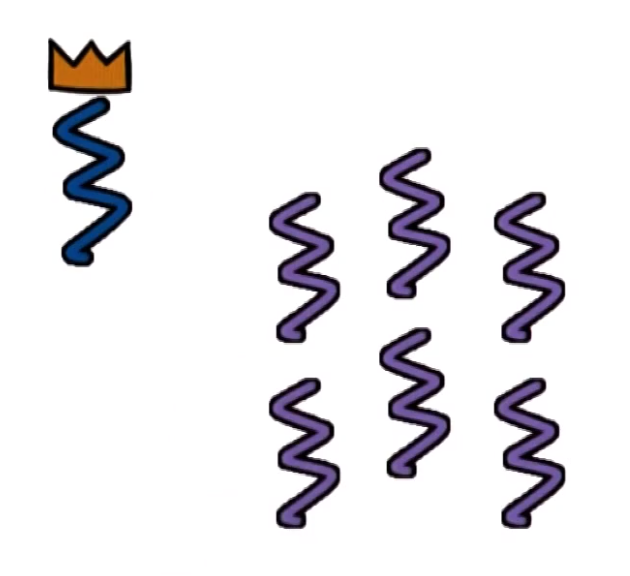
</center>

The **boss/workers pattern** is a popular pattern characterized by *one* **boss thread** and several **worker threads**.
  * the **boss thread** assigns work to the worker threads
  * the **worker thread** performs an entire **task**

<center>
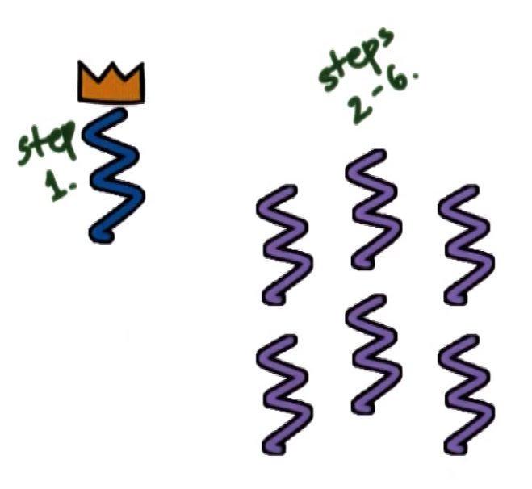
</center>

With respect to the toy shop example, the corresponding ***steps*** are as labeled in the figure shown above.
  * in step 1, the boss thread accepts the order, and then immediately passes it onto the worker threads
  * each of the worker threads will subsequently perform steps 2-6 

The **throughput** of the system is limited by the boss thread, therefore, the boss thread must be kept as ***efficient*** as possible (e.g., the boss thread must execute on every newly arriving order). The throughout is therefore characterized as follows:
<center>

</center>

The boss thread can assign work to the worker threads by:
  * directly signaling a *specific* worker thread among the currently available worker threads, requiring more work per order performed by the boss thread (i.e., keeping track of the available workers and waiting for the selected worker thread to accept the order [e.g., via handshake])
    * the **benefit** of this approach is that the worker threads do not need to synchronize among themselves, as the work is delegated by the boss thread
    * the **drawback** of this approach is that the boss thread must track what each worker thread is doing, thereby reducing the overall throughput of the system

    <center>
    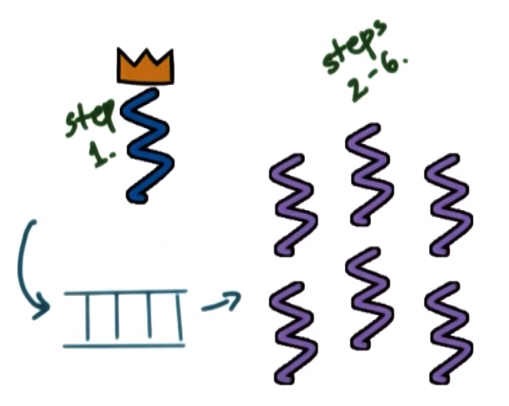
    </center>

  * placing the work in a **producer/consumer queue** (as in the figure shown above), wherein the boss thread (producer) places the work requests (e.g., toy orders) into the queue, and then the worker threads (consumers) dequeue the corresponding work orders
    * the **benefit** of this approach is that the boss thread does not need to know the details about the worker threads, nor must the boss thread wait for an explicit acceptance (e.g., a handshake) of the work order by the next-available worker threads
    * the **drawback** of this approach is that the boss thread and the worker threads are now responsible for **queue synchronization** (i.e., shared access to the queue)

Overall, the producer/consumer queue approach is a net reduction in the throughput, and is therefore a commonly used pattern in multithreaded applications accordingly.

## 36. How Many Workers?

When using the producer/consumer queue structure, the overall performance of the system will depend on whether or not the boss thread must wait when inserting new work requests (e.g., toy orders) into the queue
  * if the queue is full, the boss thread must wait, thereby increasing the overall time per order and decreasing the throughput correspondingly

In general, if there are more worker threads available, then the likelihood of a full queue decreases; however, arbitrarily increasing the number of worker threads will also add additional overhead to the system.

So, then, how many worker threads is "*enough*"? Possible approaches to determine this include:
  * on demand (i.e., adding worker threads dynamically), which may be inefficient if the arrival time of a new worker thread is long
  * a more common approach is to use a **pool of worker threads** (called a **thread pool**)
    * additionally, the size of the pool can be predetermined ***statically***, or (more commonly) set ***dynamically*** over time (i.e., where in general, each dynamic increase will increase the thread pool by several worker threads, rather than just one additional worker thread)

In summary, the boss/workers pattern is characterized by:
  * a boss thread which assigns work to the worker threads
  * a worker thread which performs an entire task
  * communication between the boss thread and the worker threads occurs via the producer/consumer queue
  * a worker threads pool is used to manage the number of worker threads, which can be set statically or (more commonly) dynamically

The **benefit** of this approach is ***simplicity***: *one* boss thread manages *all* of the worker threads, which in turn perform the *same* task.

The **drawbacks** of this approach include:
  * the required **thread-pool management**, which adds overhead to the process (e.g., synchronization of the shared buffer/queue)
  * it ignores **locality**, inasmuch as the boss thread does not keep track of the most recently performed task of the worker threads (i.e., rather than specializing at a particular step, the worker threads perform the entire task instead, with a corresponding loss of efficiency [e.g., hot cache])

## 37. Boss/Worker Pattern Variants

An alternative to having *all* worker threads in the system perform the exact *same* task is to have worker threads which are ***specialized*** for certain tasks (e.g., workers specialized to a particular toy, workers specialized to new vs. repair orders, etc.). An added **stipulation** in this case is that the boss thread occurs some overhead on a per-work-order basis, inasmuch as the boss thread must assess the work order to determine to which worker thread should the task be delegated. However, this overhead is offset by the added efficiency of the specialization in the worker threads, and therefore the net effect will generally ***improve*** overall throughput.

The **benefits** of this approach include:
  * improved locality via specialized worker threads (which in general must only access a subset of the overall process state, thereby improving cache performance)
  * improved **quality of service (QoS)** management (e.g., assigning more worker threads to particularly demanding customers)

The main **drawback** of this approach is the challenge of **load balancing**, which is much more complicated here (e.g., how many worker threads to assign to each task)

## 38. Pipeline Pattern

<center>
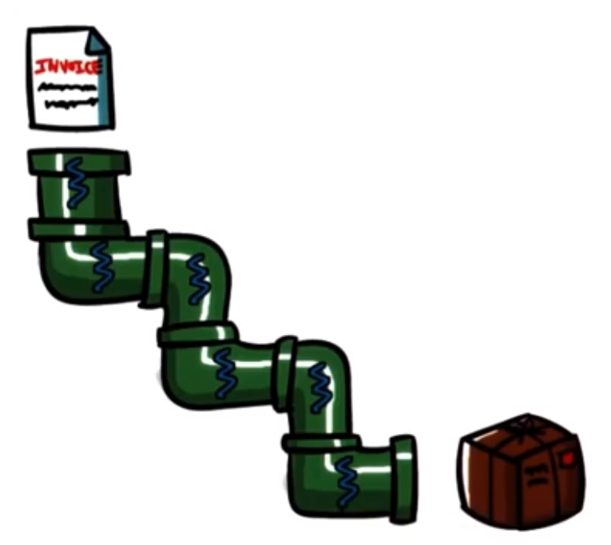
</center>

A different way to assign work to threads in a multithreaded system is to use the **pipeline pattern**, wherein the overall task (e.g., the processing in the toy shop) is divided into **subtasks**, with each subtask performed by a separate thread. Therefore, the *entire* **task** is correspondingly composed of this **pipeline** of sub-task threads.

For example, in the toy shop, this would correspond to having a different worker assigned to each of the six steps.

With this approach, at any given time, there can be multiple tasks (e.g., multiple toy shop orders) occurring ***concurrently*** in the system, occurring in different pipeline stages at any given time.

Therefore, the overall **throughput** of a pipelined process is the **weakest link** (i.e., the longest-duration subtask in the pipeline).
  * ideally, each subtask takes the *same* amount of time to complete (with this uniform time constituting the throughput), however, in practice this is seldom the case

<center>
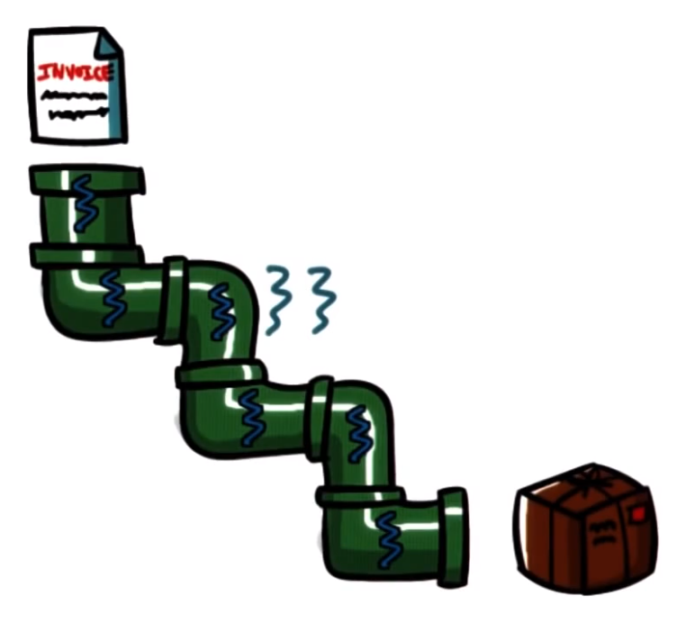
</center>

To resolve a potential "*bottlenecking*" subtask, the previously seen **thread pool** technique can be applied here as well, whereby the rate-limiting subtask is allocated additional threads (as in the figure shown above).

<center>
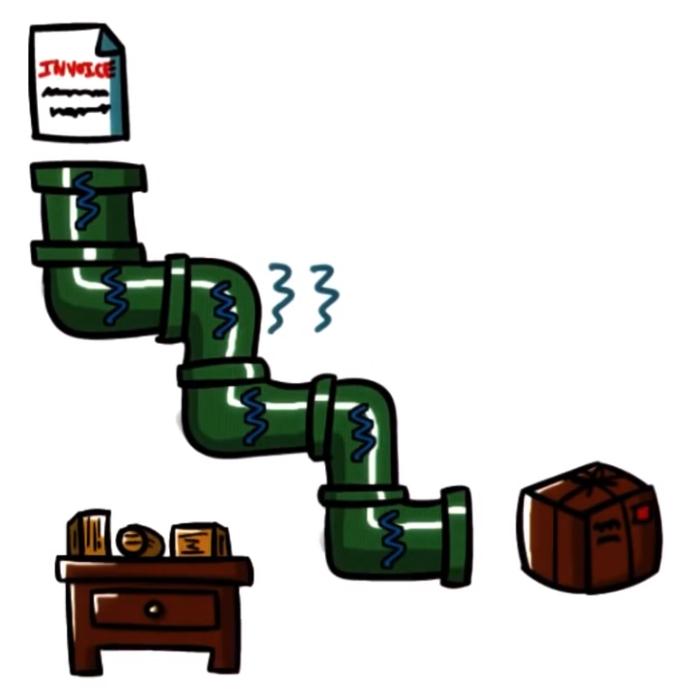
</center>

The best way to pass work among the pipeline stages is to use a **shared-buffer mechanism** between the stages (e.g., leaving the built pieces from a given stage on the table for the subsequent stage's worker(s) to retrieve/use in the subsequent stage, as in the figure shown above), similarly to producer/consumers queue.
  * Alternatively, some explicit communication mechanism could be used between stages, however, this would mean that a given thread may have to wait until a thread in the subsequent stage is available. These imbalances are therefore accounted for using the buffer-based approach.

In summary, a pipeline is a sequence of stages where each stage constitutes a subtask (with each stage/subtask performed by an individual thread(s)). To keep the pipeline *balanced*, a given stage can be executed by more than one thread, which in turn can be managed via a thread pool. Furthermore, passing of partial-work product down the pipeline is achieved via buffer-based communication (e.g., inter-stage queues), which provides some elasticity in the implementation and prevents stalls due to transient pipeline-stage imbalances.

A key **benefit** of this approach is that it promotes high specialization and corresponding improved locality.

A **drawback** of this approach is that there is ***overhead*** associated with both the inter-stage balancing and end-to-end synchronization, particularly if the incoming workload balance changes over time, thread performance diminishes at a given stage(s), etc. 

## 39. Layered Pattern

<center>

</center>

Another multithreading pattern is called the **layered pattern**. For example, the overall steps can be organized into associated tasks (e.g., as in the figure shown above, pertaining to the toy shop example). Therefore, in a layered pattern, each **layer** groups related subtasks together, with any group-associated threads performing any of the corresponding group-associated subtasks for that particular group. On an end-to-end basis, however, each task must pass up and down through *all* of the layers.

The **benefits** of this pattern are as follows:
  * specialization and locality, similarly to the pipeline pattern
  * less fine-grained than the pipeline pattern (i.e., distribution of threads among layers is more straightforward than distribution among pipeline stages)

The **drawbacks** of this pattern are as follows:
  * not suitable for all applications (e.g., it may not be sensible to group subtasks into layers in this manner for a particular application)
  * the required synchronization is more complex, inasmuch as each layer must coordinate with its surrounding layers

## 40. Multithreading Patterns Quiz and Answers

For the six-step toy orders application, we have designed two solutions as follows:
  1. a boss/workers solution
  2. a pipeline solution

Both solutions have six threads. Furthermore, the following are assumed:
  * in the boss/workers solution, a worker processes a toy order in `120 ms`
  * in the pipeline solution, each of the six stages/steps take `20 ms`

How long will it take for each respective solution to complete `10` toy orders? (Ignore any time required for the shared queues in both solutions, and assume infinite process resources are available, e.g., tools, work areas, etc.)
  * boss/workers - `240 ms`
  * pipeline - `300 ms`

What about if there are `11` toy orders?
  * boss/workers - `360 ms`
  * pipeline - `320 ms`

**N.B.** The corresponding formulas are as follows:
  * boss/workers (where *`n`*<sub>`concurrent threads`</sub> *excludes* the boss thread, e.g., only counts the `5` worker threads in this example)
  <center>
  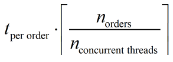
  </center>

  * pipeline (e.g., where *`t`*<sub>`first order`</sub> `=` `6 * 20 ms` in this example)
  <center>
  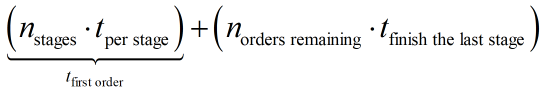
  </center>

As this example demonstrates, the relative efficiency of each pattern will depend on the specific inputs (e.g., in this example, boss/workers is faster for `10` orders but slower for `11` orders). Furthermore, accounting for overhead would require more precise measurement and analysis (this example uses over-simplifying assumptions to make "back-of-the-envelope" calculations).

## 41. Lesson Summary

This lesson covered the following topics:
  * What are **threads**, and how/why do we use them?
    * How do operating systems represent threads, and how do they differ from **processes**?
  * Thread mechanisms
    * e.g., mutexes and condition variables for synchronization
  * Using threads
    * problems, solutions, and design approaches
