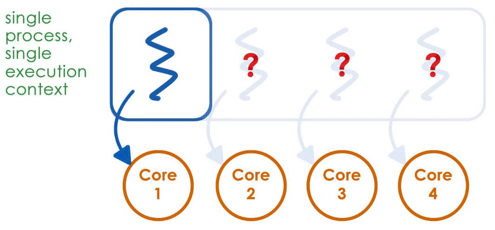
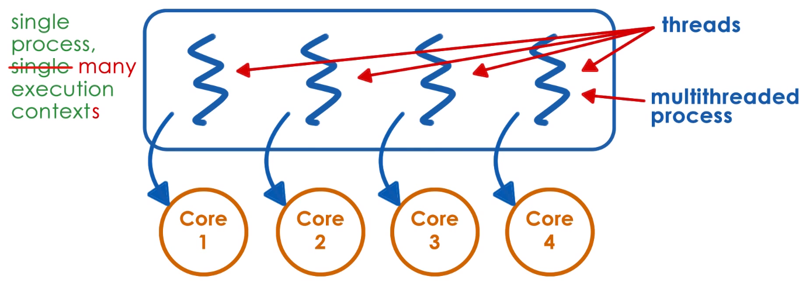

# P2L2: Threads and Concurrency

## 1. Preview

The previous lecture described processes and process management. Recall that a process is represented by its **address space** and its **execution context** (via corresponding **process control block**, or **PCB**).

### What if multiple CPUs?

However, when represented this way, such a process can only execute at one CPU at any given point in time.

Conversely, in order for the process to execute on multiple CPUs simultaneously (i.e., taking advantage of modern multi-CPU/multi-core systems), such a process requires ***multiple*** execution contexts; such multiple execution contexts within a single process are called **threads**.

This lesson will therefore address the following:
  * What are **threads**?
  * How are **threads** different from **processes**?
  * What **data structures** and mechanisms are used to implement and manage **threads**?

This lesson will reference "*An Introduction to Programming with Threads*" (Birrell, 1989) to explain the concept of threads, a seminal paper which describes:
  * threads and concurrency
  * basic mechanisms for multithreaded systems
  * synchronization

N.B. A later lesson will discuss a concrete multithreading system called **Pthreads** (**POSIX threads**).

## 2. Visual Metaphor

