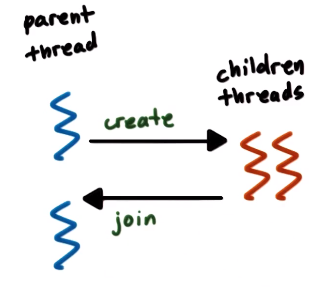
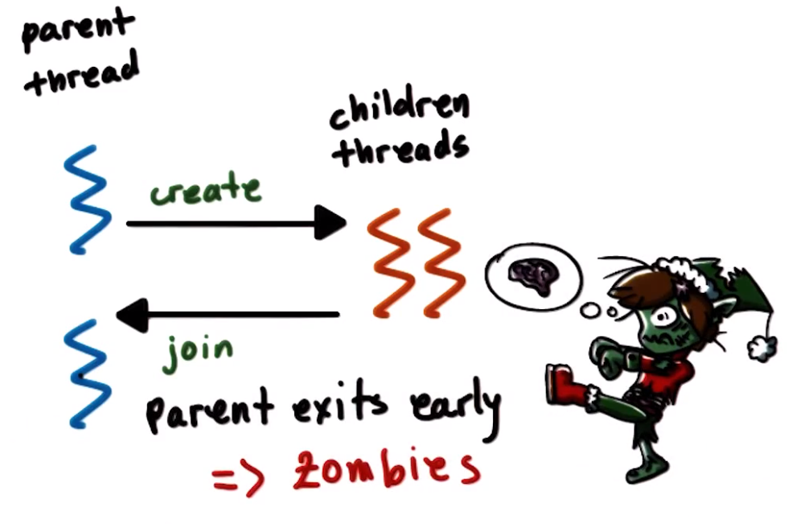
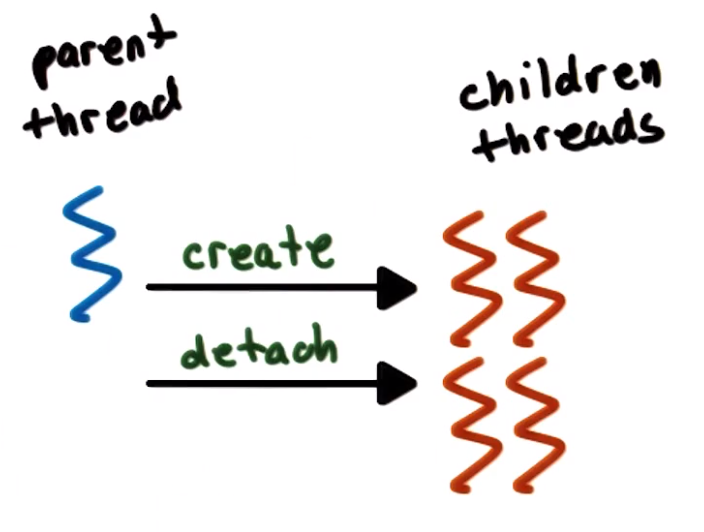
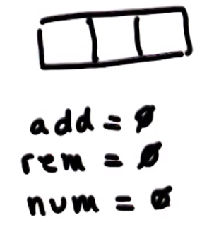
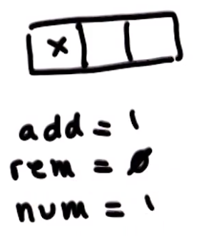
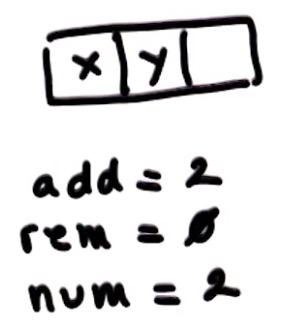
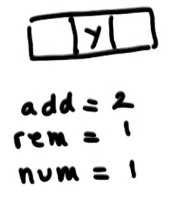

# P2L3: Threads Case Study: PThreads

## 1. Preview

Recall that Birrell's paper "*An Introduction to Programming with Threads*" (1989) describes multithreading, concurrency, and synchronization in *generic* terms. This lecture will cover ***PThreads***, which are a ***concrete*** multithreading system, which is the de facto standard in UNIX systems (e.g., Linux).

"PThreads" denotes **POSIX Threads**, wherein **POSIX (Portable Operating System Interface)** describes the system call interface to be supported by operating systems. POSIX is intended to improve portability among different operating systems. Within POSIX, **PThreads** describes the threading-related API that must be supported by the operating systems in order to perform creation, usage, management, etc. of threads, which encompasses the threads themselves as well as the synchronization and concurrency-related constructs (e.g., mutexes and condition variables).
  * ***N.B.*** The complete POSIX standard is specified by [IEEE P1003.1](https://standards.ieee.org/project/1003_1.html) and [ISO/IEC/IEEE 9945](https://www.iso.org/standard/50516.html).

## 2. PThread Creation

First, let's examine the **PThread** thread abstraction and the thread-creation mechanism that corresponds to the mechanisms proposed by Birrell, as follows:

| Birrell's Mechanisms | PThreads |
| :-- | :-- |
| `Thread` | `pthread_t aThread`, a type of thread |
| `Fork(proc, args)` for thread creation | `int pthread_create(`<br/>&nbsp;&nbsp;&nbsp;&nbsp;`pthread_t *thread,`<br/>&nbsp;&nbsp;&nbsp;&nbsp;`const pthread_attr_t *attr,`<br/>&nbsp;&nbsp;&nbsp;&nbsp;`void *(*start_routine)(void *),`<br/>&nbsp;&nbsp;&nbsp;&nbsp;`void *arg`<br/>`)` |
| `Join(thread)` | `int pthread_join(`<br/>&nbsp;&nbsp;&nbsp;&nbsp;`pthread_t thread,`<br/>&nbsp;&nbsp;&nbsp;&nbsp;`void **status`<br/>`)` |

The data type `pthread_t` represents a **thread**, which uniquely identifies the thread with an identifier and describes the thread (i.e., a PThread thread), e.g., id, execution state, other relevant information, etc.
  * Most of this information is not used by the developer, but rather by the PThread library itself.

The function `pthread_create()` is used for **thread creation**
  * the parameters `start_routine` (a function pointer) and `arg` correspond to `proc` and `args` (respectively) in Birrell's model
  * the function creates a new data structure of type `pthread_t` (passed in as the first argument), populating it with the corresponding information required for the thread to begin execution
  * the parameter `attr` (of type `pthread_attr_t`) is a data structure that can be used to specify certain things about the thread that can be subsequently used by the PThread library to manage the thread instance
  * the function also returns status information regarding whether creation of the thread was a success or failure

The function `pthread_join()` has two parameters, `thread` (the thread instance to be joined) and `status` (which captures all relevant return information as well as the results returned from the thread). This function also returns a status indicating whether the join operation was a success or failure.

As is evident, these PThread operations are fairly analogous to the corresponding operations proposed by Birrell.

### PThread Attributes

Within the function `pthread_create()`, the type `pthread_attr_t` (via corresponding parameter `attr`), denoting **PThread attributes**, defines the features of the newly created thread, e.g.,:
  * stack size
  * scheduling policy
  * priority
  * scope (e.g., system vs. process scope)
  * inheritance of attributes from the calling thread (e.g., whether or not it is joinable)

Passing `NULL` to `pthread_create()`'s parameter `attr` yields the ***default behavior***. 

Several functions support PThread attributes, e.g.,:
  * `int pthread_attr_init(pthread_attr_t *attr)` to create and initialize the attributes data structure
  * `int pthread_attr_destroy(pthread_attr_t *attr)` to destroy and free (i.e., from memory) the attributes data structure
  * various `int pthread_attr_{set/get}([const] pthread_attr_t *attr, ...)` functions allow to set or read a given value from the attributes data structure
    * one of these requiring particular attention is the attribute regarding ***joinability***; to understand this, however, first some additional mechanisms not originally considered by Birrell must be described (see the next subsection)

### Detaching PThreads

A key mechanism not originally described by Birrell is  **detachable threads**.

<center>

</center>

In PThreads, the the default behavior of thread creation is just as Birrell described, i.e., the threads are ***joinable***. With joinable threads, the parent thread creates children threads, which can then be subsequently joined at a later time. Furthermore, the parent thread should *not* terminate until *all* children threads have completed their respective operations have been subsequently joined back to the parent thread.

<center>

</center>

However, if the parent thread terminates prematurely, then consequently the children threads may become **zombies** (those children which have completed their respective operations, but have not been joined back, or "*reaped*," to the parent yet).

<center>

</center>

Therefore, with PThreads there is the additional ability to **detach** the children threads from the parent thread. Once detached, the children threads cannot be subsequently joined back to the parent thread; if the parent terminates/exits, the children can subsequently proceed with execution as normal, thereby making the parent and children threads equivalent to each other (with the exception that the parent thread has some additional information on the children threads it has created).

The PThread library provides the function `int pthread_detach(pthread_t thread)` for this purpose.

Furthermore, PThread threads can also be created as detached children threads as follows via `attr`:
```c
pthread_attr_setdetachstate(attr, PTHREAD_CREATE_DETACHED);

// ...

pthread_create(..., attr, ...);
```

With detached threads, since the parent thread is not required to wait to join all children prior to termination/exit, it can simply exit via `void pthread_exit()`.

### Example

The following is an example of using PThread attributes:

`pthread-creation.c`
```c
#include <stdio.h>
#include <pthread.h>

/* thread main */
void *foo(void *arg) {
  printf("Foobar!\n");
  pthread_exit(NULL);
}

int main(void) {
  int i;
  pthread_t tid;

  pthread_attr_t attr;
  pthread_attr_init(&attr); // required!!!
  pthread_attr_setdetachstate(&attr, PTHREAD_CREATE_DETACHED);
  pthread_attr_setscope(&attr, PTHREAD_SCOPE_SYSTEM);
  pthread_create(&tid, &attr, foo, NULL);

  return 0;
}
```

`attr` is first created and initialized via `pthread_attr_init()`, which creates the attributes data structure with sufficient memory, and then is subsequently set with corresponding attributes (i.e., overriding the defaults) via `pthread_attr_setdetachstate()` and `pthread_attr_setscope()`.

The resulting data structure `attr` is then passed to `pthread_create()`, which runs the procedure `foo()` via the resulting child thread.

## 3. Compiling PThreads

Before examining some examples, there are a few things to consider when compiling PThread threads:
  1. `#include <pthread.h>` in the main file is required
  2. Compile the source with flags `-lpthread` or `-pthread` (preferred on certain platforms) to instruct the compiler to link the PThreads library and to configure the compilation for threads, e.g.,:
  ```
  $ gcc -o main main.c -lpthread
  $ gcc -o main main.c -pthread
  ```
  3. Check the return values of common functions (e.g., creating threads, creating variables, initializing certain data structures, etc.), which is a good programming practice in general, as well as in particular when dealing with multithreaded programs

## 4. PThread Creation Example 1

The following is a simple example of creating threads with the PThreads library:

`pthread-creation-quiz-1.c`
```c
#include <stdio.h>
#include <pthread.h>
#define NUM_THREADS 4

/* thread main */
void *hello (void *arg) {
  printf("Hello Thread\n");
  return 0;
}

int main (void) {
  int i;
  pthread_t tid[NUM_THREADS];

  /* create/fork threads */
  for (i = 0; i < NUM_THREADS; i++) {
    pthread_create(&tid[i], NULL, hello, NULL);
  }

  /* wait/join threads */
  for (i = 0; i < NUM_THREADS; i++) {
    pthread_join(tid[i], NULL);
  }

  return 0;
}
```

The `main()` function initially creates `4` threads, each of which executes the function `hello()`; the last argument `NULL` in `pthread_create()` indicates that no arguments are passed (i.e., to the function `hello()`). Furthermore, the second argument `NULL` in `pthread_create()` indicates that the default attributes will be used when creating the threads (e.g., in particular, the threads will be ***joinable***, as per default).

Subsequently, `pthread_join()` is called to join the child threads to commence subsequent execution of the parent thread.

## 5. PThread Creation Quiz 1 and Answers

What is the output of the program in the previous section? Assume that all programs fully execute and exit.

```
Hello Thread
Hello Thread
Hello Thread
Hello Thread
```

## 6. PThread Creation Example 2

The following is another example of creating threads with the PThreads library, with some slight variations:

`pthread-creation-quiz-2.c`
```c
#include <stdio.h>
#include <pthread.h>
#define NUM_THREADS 4

/* thread main */
void *threadFunc(void *pArg) { 
  int *p = (int*)pArg;
  int myNum = *p;
  printf("Thread number %d\n", myNum);
  return 0;
}

int main(void) {
  int i;
  pthread_t tid[NUM_THREADS];

  /* create/fork threads */
  for(i = 0; i < NUM_THREADS; i++) {
    pthread_create(&tid[i], NULL, threadFunc, &i);
  }

  /* wait/join threads */
  for(i = 0; i < NUM_THREADS; i++) {
    pthread_join(tid[i], NULL);
  }

  return 0;
}
```

This example is a variation on the previous one. Here, the threads execute the function `threadFunc()`, which additionally receives the argument `&i` via call to `pthread_create()`. 

Inside of `threadFunc()`, the variables `p` and `myNum` are private with respect to each given thread (i.e., their scope is limited to that particular thread), which in general will be set to different values.

## 7. PThread Creation Quiz 2 and Answers

What is the output of the program in the previous section? Assume that all programs fully execute and exit. (Select all that apply.)
  * Output A
    ```
    Thread number 0
    Thread number 1
    Thread number 2
    Thread number 3
    ```
  * Output B
    ```
    Thread number 0
    Thread number 2
    Thread number 1
    Thread number 3
    ```
  * Output C
    ```
    Thread number 0
    Thread number 2
    Thread number 2
    Thread number 3
    ```

*All* of these options are possible. Both Outputs A and B are permutations of each other; the thread creation order is non-deterministic due to the actual scheduling order of the threads, which in general will vary from run to run of the program. Furthermore, Output C is *also* possible; this apparent "anomaly" will be discussed in the next section.

## 8. PThread Creation Example 3

The following is another example of creating threads with the PThreads library, with some slight variations:

```c
#include <stdio.h>
#include <pthread.h>
#define NUM_THREADS 4

/* thread main */
void *threadFunc(void *pArg) {
  int *p = (int*)pArg;
  int myNum = *p;
  printf("Thread number %d\n", myNum);
  return 0;
}

int main(void) {
  int i;
  int tid[NUM_THREADS];

  /* create/fork threads */
  for(i = 0; i < NUM_THREADS; i++) {
    pthread_create(&tid[i], NULL, threadFunc, &tNum[i]);
  }

  for(i = 0; i < NUM_THREADS; i++) { /* wait/join threads */
    pthread_join(tid[i], NULL);
  }

  return 0;
}
```

This example is another variation on the previous ones. As a follow-up to the previous section/quiz (cf. Output C), the issue encountered there is that `i` is defined in `main()`, and is therefore a ***globally visible*** variable; therefore, when its value changes in one thread, all other threads see the new value as well. Therefore, the statement `int *p = (int*)pArg;` inside of function `threadFunc()` may be referencing corresponding value `&i` from the `for` loop of `main()` *after* it has already changed (but *before* `p` has been assigned in the new child thread).

Such a scenario is called a **data race** or **race condition**, i.e., whereby a thread attempts to read a value while another thread modifies it.

Therefore, to correct this issue, the code can be modified as follows:

`pthread-creation-quiz-3.c`
```c
#include <stdio.h>
#include <pthread.h>
#define NUM_THREADS 4

/* thread main */
void *threadFunc(void *pArg) {
  int myNum = *((int*)pArg);
  printf("Thread number %d\n", myNum);
  return 0;
}

int main(void) {
  int i;
  pthread_t tid[NUM_THREADS]; 
  int tNum[NUM_THREADS];// store data in an array `tNum`

  /* create/fork threads */
  for(i = 0; i < NUM_THREADS; i++) {
    tNum[i] = i; // use array `tNum` as local/"private" storage for each thread
    pthread_create(&tid[i], NULL, threadFunc, &tNum[i]);
  }

  for(i = 0; i < NUM_THREADS; i++) { /* wait/join threads */
    pthread_join(tid[i], NULL);
  }

  return 0;
}
```

With this approach, there is no execution-order dependency among the threads, because the data is stored in array `tNum` and is specific to each thread.

## 9. PThread Creation Quiz 3 and Answers

What is the output of the program in the previous section? Assume that all programs fully execute and exit. (Select all that apply.)
  * Output A
    ```
    Thread number 0
    Thread number 0
    Thread number 2
    Thread number 3
    ```
  * Output B
    ```
    Thread number 0
    Thread number 2
    Thread number 1
    Thread number 3
    ```
  * Output C
    ```
    Thread number 3
    Thread number 2
    Thread number 1
    Thread number 0
    ```

The correct choices are Outputs B and C. With the race condition fixed, Output A (or similar) is no longer possible. However, as before, the execution order is still non-deterministic (i.e., it depends on how scheduler actually processes the threads at run-time), therefore, Outputs B and C (among other permutations) are the expected outputs.

## 10. PThread Mutexes

To deal with the **mutual exclusion problem**, the PThreads library supports **mutexes**. As explained previously in the context of Birrell's paper (cf. P2L2), the purpose of mutexes is "to solve mutual exclusion problems among concurrent threads."
  * The mechanism of mutual exclusion ensures that threads access shared state in a *controlled* manner, so that only one thread at a time can perform modifications (or otherwise access) the shared state.

The corresponding **mechanisms** provided by the PThreads library are as follows:

| Birrell's Mechanisms | PThreads Library |
| :-- | :-- |
| `mutex` | `pthread_mutex_t aMutex; // a mutex type` |
| `Lock(mutex) {`<br/>&nbsp;&nbsp;&nbsp;&nbsp;`// ... critical section ...`<br/>`} // (implicit) unlock` | `int pthread_mutex_lock(pthread_mutex_t *mutex); // an explicit lock`<br/>`// ... critical section ...`<br/>`int pthread_mutex_unlock(pthread_mutex_t *mutex); // an explicit unlock`  |

With PThreads, any code appearing between the calls to `pthread_mutex_lock()` and to `pthread_mutex_unlock()` constitutes the **critical section** (i.e., an *explicit* lock is required when using PThreads, in contrast to the *implicit* unlock provided by Birrell's `Lock()` construct).

Recall the following example using Birrell's constructs (cf. P2L2):

```cpp
list<int> my_list;
Mutex m;
void safe_insert(int i) {
  Lock(m) {
    my_list.insert(i);
  } // unlock
}
```

The corresponding operation using the PThreads library is as follows:

```cpp
list<int> my_list;
pthread_mutex_t m;
void safe_insert(int i) {
  pthread_mutex_lock(m);
  my_list.insert(i);
  pthread_mutex_unlock(m);
}
```

### Other Mutex Operations

The PThreads library additionally supports other **mutex operations** (i.e., beyond those described by Birrell). The following highlights a (non-exhaustive) selection of these. (Refer to the corresponding PThreads library documentation for more information.)

#### `pthread_mutex_init()`

```c
int pthread_mutex_init(pthread_mutex_t *mutex, const pthread_mutexattr_t *attr)
```

In the PThreads library, mutexes must be explicitly initialized via function `pthread_mutex_init()`. This operation allocates a mutex structure and specifies its behavior (i.e., when the mutex is shared among processes) via the parameter `attr`. If passing `NULL` as the second argument, this specifies default behavior.

#### `pthread_mutex_trylock()`

```c
int pthread_mutex_trylock(pthread_mutex_t *mutex)
```

Unlike the operation `pthread_mutex_lock()`, which blocks the calling thread if the mutex is in use, `pthread_mutex_trylock()` instead first *checks* the mutex, and if the mutex in use, then the function call will return immediately *without* blocking the calling thread and will notify the calling thread that the mutex is unavailable, otherwise if the mutex is free/available, then the mutex will be successfully locked by the calling thread.

#### `pthread_mutex_destroy()`

```c
int pthread_mutex_destroy(pthread_mutex_t *mutex)
```

Once no longer in use, any PThread mutex data structures should be freed from memory via `pthread_mutex_destroy()`.

### Mutex Safety Tips

<center>

</center>

When writing multithreaded programs using the PThreads library involving mutexes, be advised of the following:
  * shared data should always be accessed via a *single* mutex
  * mutex scope must be visible to *all* threads
    * a mutex *cannot* be defined as a private variable to a single thread (e.g., `main()`), but rather all mutexes must be defined as ***global variables***
  * order locks *globally* to prevent deadlocks
    * once an order is established for all of the threads, lock the mutexes in the corresponding order
  * always *unlock* a mutex, and in particular the *correct*/*intended* mutex
    * compilers will not generally be able to correctly/reliably detect semantic ordering of `lock`/`unlock` operations

## 11. PThread Condition Variables

As described by Birrell, **condition variables** are synchronization constructs which allow blocked threads to be notified once a specified ***condition*** occurs.

The PThreads library provides the following corresponding **mechanisms**:

| Birrell's Mechanisms | PThreads Library |
| :-- | :-- |
| `Condition` | `pthread_cond_t aCond; // a type of cond variable` |
| `Wait()` | `int pthread_cond_wait(pthread_cond_t *cond, pthread_mutex_t *mutex);`  |
| `Signal()` | `int pthread_cond_signal(pthread_cond_t *cond);` |
| `Broadcast()` | `int pthread_cond_broadcast(pthread_cond_t *cond);` |

The semantics of `pthread_cond_wait()` correspond directly to those of `Wait()`, i.e., a thread entering this operation will automatically release mutex `mutex` and place itself on the wait queue associated with condition `cond`, and then once the thread is awakened it will reacquire `mutex` prior to exiting the wait operation.

Similarly, `pthread_cond_signal()` and `pthread_cond_broacast()` correspond directly to Birrell's `Signal()` and `Broadcast()` (respectively), whereby one or all (respectively) waiting thread(s) is/are notified via the condition `cond`.

### Other Condition Variable Operations

The PThreads library additionally supports other **condition variable operations** (i.e., beyond those described by Birrell). The following highlights a (non-exhaustive) selection of these. (Refer to the corresponding PThreads library documentation for more information.)

#### `pthread_cond_init()`

```c
int pthread_cond_init(pthread_cond_t *cond, const pthread_condattr_t *attr);
```

The operation `pthread_cond_init()` is used to allocate the data structure for the condition `cond` and initialize its attributes `attr` (e.g., whether or not it is shared across processes). Providing `NULL` as the second argument will initialize the attributes to their default values (e.g., the condition is private to / unshared by the process).

#### `pthread_cond_destroy()`

```c
int pthread_cond_destroy(pthread_cond_t *cond);
```

The operation `pthread_cond_destroy()` is used to explicitly free the memory associated with the PThread condition variable `cond`.

### Condition Variable Safety Tips

<center>

</center>

When writing multithreaded programs using the PThreads library involving condition variables, be advised of the following:
  * do not forget to *notify* the waiting threads
    * whenever any aspect of the **predicate** that the threads are waiting on ***changes***, correspondingly signal/broadcast the *correct* condition variable(s) that the threads are waiting on
  * when in doubt, broadcast
    * however, this will generally incur a ***performance penalty*** (i.e., relative to a signal); therefore, be sure to use the correct/intended notification mechanism (i.e., signal vs. broadcast) to awaken threads from a condition variable
  * recall (cf. P2L2) that a mutex is *not* required to perform a signal or broadcast
    * therefore, it may be appropriate to remove the signal/broadcast operation until *after* the mutex is unlocked

## 12-14. Producer/Consumers Example

Consider the following example of the classic producers/consumers problem, implemented using the PThreads library:

`producer-consumer.c`
```c
#include <stdio.h>
#include <stdlib.h>
#include <pthread.h>

#define BUF_SIZE 3     // Size of shared buffer

/* --- GLOBAL SCOPE DECLARATIONS --- */
int buffer[BUF_SIZE];  // shared buffer
int add = 0;           // place to add next element
int rem = 0;           // place to remove next element
int num = 0;           // number elements in buffer

pthread_mutex_t m = PTHREAD_MUTEX_INITIALIZER;    // mutex lock for buffer
pthread_cond_t c_cons = PTHREAD_COND_INITIALIZER; // consumer waits on this cond var
pthread_cond_t c_prod = PTHREAD_COND_INITIALIZER; // producer waits on this cond var

/* --- FUNCTION DECLARATIONS --- */
void *producer (void *param);
void *consumer (void *param);

int main(int argc, char *argv[]) {
  pthread_t tid1, tid2; // thread identifiers
  int i;

  /* create the threads; may be any number, in general */
  if (pthread_create(&tid1, NULL, producer, NULL) != 0) {
    fprintf(stderr, "Unable to create producer thread\n");
    exit(1);
  }

  if (pthread_create(&tid2, NULL, consumer, NULL) != 0) {
    fprintf(stderr, "Unable to create consumer thread\n");
    exit(1);
  }

  /* wait for created thread to exit */
  pthread_join(tid1, NULL);
  pthread_join(tid2, NULL);
  printf("Parent quitting\n");

  return 0;
}

/* Produce value(s) */
void *producer(void *param) {
  int i;

  for (i=1; i<=20; i++) {
    /* Insert into buffer */
    pthread_mutex_lock (&m);

    /* --- BEGIN CRITICAL SECTION --- */

    /* buffer overflow error check */
    if (num > BUF_SIZE) {
      exit(1);
    }

    /* block if buffer is full */
    while (num == BUF_SIZE) {
      pthread_cond_wait(&c_prod, &m);
    }

    /* if executing here, buffer not full so add element */
    buffer[add] = i;
    add = (add+1) % BUF_SIZE; // "wraparound" the buffer array via operator %
    num++;

    /* --- END CRITICAL SECTION --- */

    pthread_mutex_unlock(&m);

    pthread_cond_signal(&c_cons);

    /* additional output for monitoring/debugging */
    printf("producer: inserted %d\n", i);
    fflush(stdout);
  }

  /* additional output for monitoring/debugging */
  printf("producer quitting\n");
  fflush(stdout);

  return 0;
}

/* Consume value(s); Note the consumer never terminates */
void *consumer(void *param) {
  int i;

  /* N.B. while(1) { ... } here prevents the consumer from ever terminating */
  while (1) {
    pthread_mutex_lock(&m);

    /* --- BEGIN CRITICAL SECTION --- */

    /* buffer underflow error check */
    if (num < 0) {
      exit(1);
    }

    /* block if buffer empty */
    while (num == 0) {
      pthread_cond_wait(&c_cons, &m);
    }

    /* if executing here, buffer not empty so remove element */
    i = buffer[rem];
    rem = (rem+1) % BUF_SIZE; // "wraparound" the buffer array via `%`
    num--;

    /* --- END CRITICAL SECTION --- */

    pthread_mutex_unlock(&m);

    pthread_cond_signal(&c_prod);

    /* additional output for monitoring/debugging */
    printf("Consume value %d\n", i);
    fflush(stdout);
  }

  return 0;
}
```

Examining the section denoted "`GLOBAL SCOPE DECLARATIONS`"
  * `buffer` is a shared buffer of size `BUF_SIZE` (i.e., `3`)
  * `add`, `rem`, and `num` are shared variables which track `buffer`, e.g., as in the following sequence:

    <center>
      
      
      
      
    </center>
  * mutex `m` is automatically initialized via macro `PTHREAD_MUTEX_INITIALIZER`
  * condition variables `c_cons` and `c_prod` are used by the consumers and the producers (respectively)

Furthermore, the operations `producer()` and `consumer()` are performed by the producer and consumer threads (respectively).

The function `main()` creates two threads `tid1` (executes `producer()`) and `tid2` (executes `consumer()`). Since the default behavior (e.g., non-detaching threads) is used when creating the corresponding threads (i.e., via second argument `NULL` to function `pthread_create()`), the threads must be subsequently joined via `pthread_join()`. Furthermore, neither `producer()` nor `consumer()` require arguments, therefore the corresponding calls to `pthread_create()` are given `NULL` as the last argument accordingly. Additionally, basic error checking of the return value from `pthread_create()` is performed to facilitate debugging.

The function `producer()` executes a loop twenty times, wherein it attempts to produce an element for the shared buffer `buffer`, updating the shared variables `add` and `num` in the process. The critical-section code is therefore flanked by calls to `pthread_mutex_lock()` and `pthread_mutex_unlock()` accordingly.
  * If the buffer is full via the `while` loop, `pthread_cond_wait()` is called with corresponding condition `c_prod` and mutex `m`
  * Once the producer leaves the wait operation (i.e., exits the `while` loop) when the buffer is no longer full (i.e., a consumer has consumed an element from the buffer), the producer subsequently adds an element to the buffer and increments `num` accordingly
  * Furthermore, if the buffer is empty while performing the insert operation within the critical section, `pthread_cond_signal()` is subsequently called to signal the (next-available) consumer thread that an element is available in the buffer
    * Here, since only one element is added at a time, it is more sensible to signal than to broadcast

The function `consumer()` is executed by the consumer threads. In a continuous loop, the threads attempt to remove elements from the shared buffer `buffer`. In each pass through the `while` loop, the consumer thread attempts to remove an element from the buffer, and correspondingly update the shared variables `rem` and `num`.
  * Analogously to `producer()`, the buffer is checked to determine whether it is empty, and if so, the consumer thread calls `pthread_cond_wait()` with corresponding condition `c_cons` and mutex `m`
  * Once the buffer receives a new element (i.e., as signaled/notified by the producer), the consumer thread is awakened (i.e., exits the inner `while` loop) and proceeds to remove an element from the buffer and decrements `num` accordingly
  * Furthermore, upon removing an element from the shared buffer and leaving the critical section, the consumer thread signals the producer thread via `pthread_cond_signal()` to notify that an element has been removed from the buffer
    * Here, since only one element is removed at a time, it is more sensible to signal than to broadcast
    * Observe that since `pthread_cond_signal()` is called after `pthread_mutex_unlock()` (i.e., outside of the critical section), and therefore not dependent on any specific values of the shared data structure (e.g., `num`, `rem`, or `add`), the mutex `m` can be released and the corresponding signal can be sent, thereby avoiding a spurious wake-up

## 15. Lesson Summary

This lesson took an in-depth look into the PThread library, particularly in comparison/contrast to the model described by Birrell
  * threads, mutexes, and condition variables

This lesson also considered best practices and safety tips when using the PThread library

Lastly, this lesson provided compilation tips when using the PThread library, as well as representative example programs
