# P2L4: Thread Design Considerations

## 1. Preview

Recall (cf. P2L2) that threads can be implemented at the kernel level, the user level, or both. This lesson will revisit this notion and explore what is necessary (e.g., data structures and operating-system mechanisms) in order to be able to implement threads both at the user level and at the kernel level.

This lesson will also discuss two **notification** mechanisms that are supported by operating systems:
  1. **interrupts**
  2. **signals**

To make discussion in this lesson more concrete, two papers will be referenced:
  1. Eykholt et al. "*Beyond Multiprocessing: Multithreading the Sun OS Kernel.*"
  2. Stein and Shah. "*Implementing Lightweight Threads*."

These are historic papers which give insight into how threading systems have evolved over time.

This lesson will conclude with a brief summary of the current threading model in the Linux operating system.

## 2. Kernel- vs. User-Level Threads

Recall the following illustration (cf. P2L2):

<center>
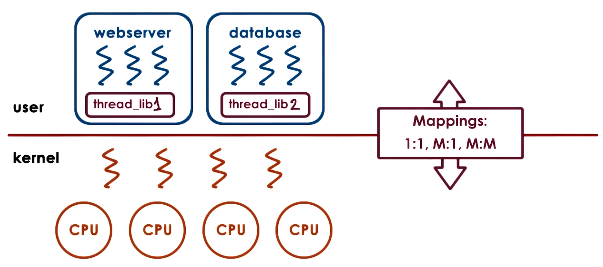
</center>

Supporting threads at the **kernel level** means that the operating system kernel itself is multithreaded. To achieve this, the operating system kernel maintains:
  * a thread abstraction (e.g., via data structure)
  * coordinating mechanisms for resource management among the threads (e.g., scheduling, synchronization, etc.)

Supporting threads at the **user level** means that there is a user-level library (e.g., `thread_lib`) linked to the application, which analogously provides all of the management and run-time support for threads, e.g.,:
  * a thread abstraction (e.g., via data structure)
  * coordinating mechanisms for resource management among the threads (e.g., scheduling, synchronization, etc.)

Furthermore, different processes may use entirely different user-level libraries (e.g., `thread_lib 1` vs. `thread_lib 2`), which provide these support mechanisms in different ways.

Recall (cf. P2L2) that different mechanisms/models are available for **mapping** of user-level threads to kernel-level threads (e.g., 1:1, M:1, and M:M).

The lesson will now consider a more detailed look into what exactly is required to describe user-level vs. kernel-level threads, as well as how to support these different mapping models.

## 3. Thread-Related Data Structures: Single CPU

<center>
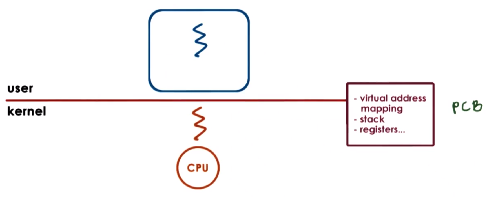
</center>

Consider what occurs in a single-threaded process. The process is described by all of the process-related **state** (e.g., address space via virtual-to-physical address mapping, stack, registers, etc.), as contained in the **process control block (PCB)**.

When the process makes a system call, it traps into the kernel, and then executes in the context of a kernel thread.

<center>
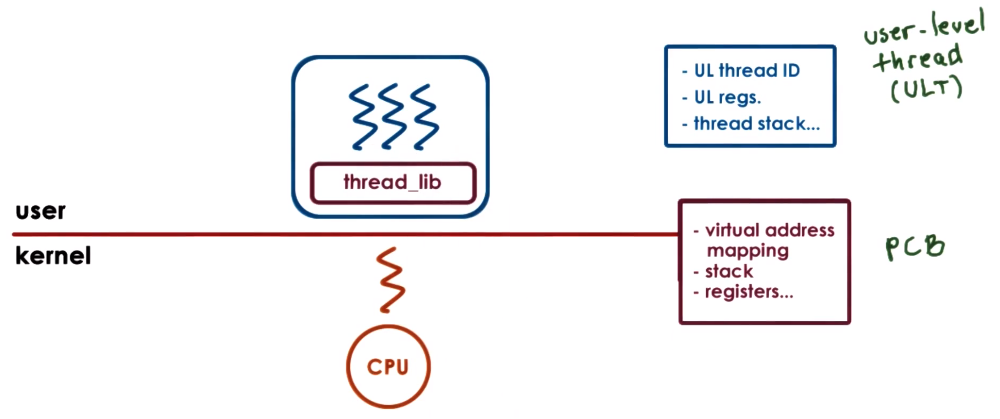
</center>

Now, consider a multithreaded process, and assume that there is only one CPU. This resembles a M:1 model, wherein many user-level threads are supported by one kernel-level thread. The user-level threads are managed by the user-level library (`thread_lib`).

The user-level library needs a way to represent the threads in order to track resource usage and to perform management mechanisms (e.g., scheduling and synchronization), which is accomplished using a **user-level thread (ULT)** data structure.

<center>
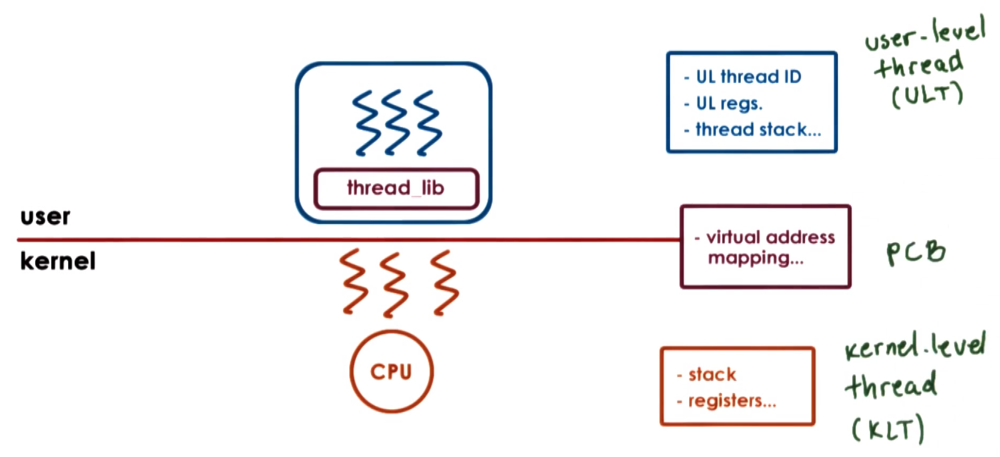
</center>

In order to associate multiple kernel-level threads with the process, rather than replicating the *entire* process control block structure, only the information pertaining to execution state of the **kernel-level threads (KLTs)** (e.g., stack and registers) is isolated to a corresponding data structure, while the process control block maintains the common information.

Observer that from the perspective of the user-level library, the underlying kernel-level threads resemble "virtual CPUs," which it uses to schedule the user-level threads.
  * UNIX-based systems have certain operations (e.g., `setjmp()` and `longjmp()`) which are useful when it is necessary to save and restore the context of a user-level thread

## 4-5. Thread-Related Data Structures

### At Scale

<center>
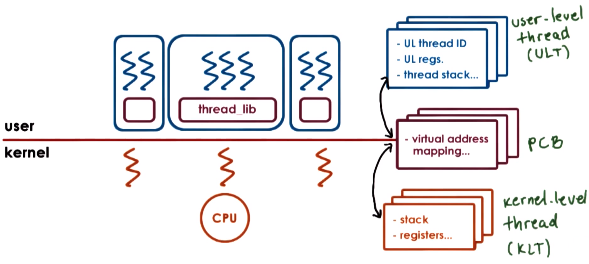
</center>

Consider now the scenario where there are multiple such processes. Clearly, this will require multiple copies of the data structures representing the user-level threads, process control blocks, and kernel-level threads. Therefore, it is necessary to maintain **relationships** among these data structures.
  * With respect to the user-level threads, the user-level library keeps track of these threads representing the single process. Therefore, there is a relationship between the user-level threads and the process control block representing the corresponding address space.
  * Furthermore, for each process, it is necessary to keep track of the kernel-level threads executing on behalf of the process, and correspondingly each kernel-level thread in turn must associate itself with the correct address space for the process.

<center>
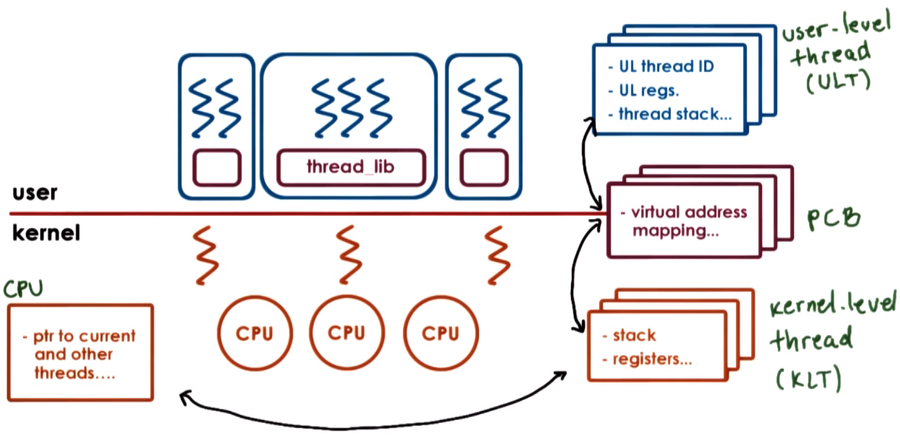
</center>

In a system with multiple CPUs, there must be a data structure to represent each CPU, as well as a corresponding relationship between the CPU data structure and the associated kernel-level thread(s).

<center>
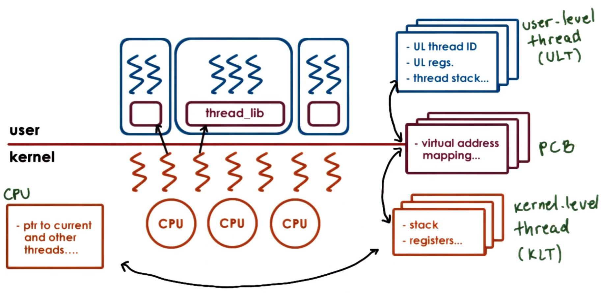
</center>

When the kernel itself is multithreaded, multiple kernel-level threads can support a single user-level process. When the kernel needs to schedule or context switch among kernel-level threads belonging to different processes, it can quickly determine via the aforementioned relationships that the processes belong to different process control blocks (i.e., distinct virtual address mappings), and therefore it can easily decide that it must completely invalidate the existing address mappings and restore new ones. In the process, it will save the entire process control block structure of the first kernel-level thread, and then restore the entire process control block structure of the second one.

### Hard and Light Process State

<center>
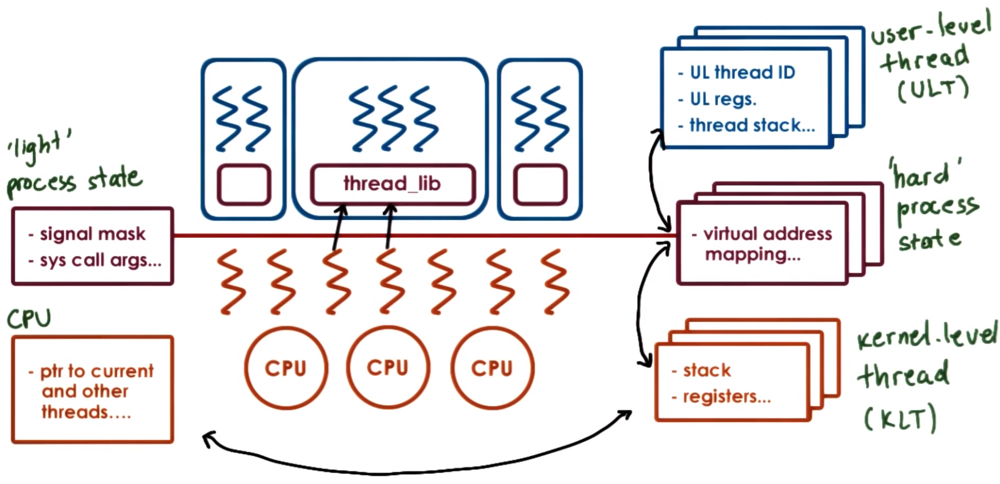
</center>

When two kernel-level threads belong to the *same* address space, there is corresponding information in the process control block pertaining to the entire user-level process, however, the information is also specific to only one kernel-level thread (e.g., signals and system call arguments). Therefore, when context switching among two kernel-level threads, there is a portion of the process-control block structure that must be preserved (e.g., the virtual address mapping), as well as a portion that is only specific to a particular kernel-level thread and which depends on the currently executing user-level thread (i.e., as managed by the user-level library).

Therefore, the information originally contained in the process control block is separated into the **'hard' process state** (which is relevant to all of the user-level threads that execute within the process) and the **'light' process state** (which is only relevant to the subset of user-level threads that are currently associated with a particular kernel-level thread(s)).

As has been described in this section, a large, monolithic process control block can be split into many smaller, more-specialized data structures and corresponding relationships in order to coordinate between the user-level threads and the associated kernel-level threads.

## 6. Rationale for Multiple Data Structures

With a ***single*** process control block:
  * there is a large, contiguous data structure
  * requires separate copies for every single thread (i.e., private for each entity), even though they share some information
  * requires saving and restoring the entire data structure on each context switch, which is an expensive "reset" operation to perform due to its large size
  * this one data structure is use for any changes/operations necessary (e.g., scheduling, memory management, synchronization, etc.), therefore, any customization will potentially affect multiple operating system services, thereby making such updates/changes more challenging

Therefore, there are several **limitations** to this approach of using a single process control block structure to represent *all* aspects of the execution state of a process:
  * poor scalability due to size
  * large overheads due to the requirement of private copies of data
  * poor performance due to saving and restoring of large amounts of data
  * poor flexibility making updates more difficult to achieve

Conversely, when using ***multiple** data structures:
  * smaller data structures (i.e., partitioned from the original large/monolithic data structure), maintained via pointers/relationships
  * easier to share via relationships and smaller data segments
    * shared data across threads can simply be pointed to
    * new elements can be created when it is necessary to have different information
  * on context switch, it is only necessary to save and restore what needs to be changed
    * any modifications will only impact a subset of the data elements
  * user-level library only needs to update a *portion* of the state (i.e., only that pertaining to the changed elements, thereby being confined to a much smaller interface)

Overall, the **benefits** of the multiple data structures approach are complementary to the limitations of the single data structure approach, i.e.,:
  * improved scalability via smaller, isolated data structures
  * lower overhead due to less overall copies of otherwise redundant data
  * improved performance due to reduced context switching time
  * improved flexibility due to the modular design

Consequently, modern operating systems adopt a multiple data structures approach for organizing information about their execution context.

## 7. Thread Structures Quiz and Answers

Having discussed how thread data structures are separated, consider now an actual Linux kernel implementation. Each question in this quiz references Linux kernel version 3.17.

1 - What is the name of the **kernel thread structure** (name of the C `struct`)?
  * `kthread_worker` - this data structure (along with the functions defined in this file) provides a simple interface for creating and stopping kernel threads

2 - What is the name of the data structure (contained in the `struct` from question 1) that describes the **process** that the kernel thread is running (name of the C `struct`)?
  * `task_struct` - this data structure is a holding place for tons of important information regarding a process

*References*:
  * [Free Electrons Linux Cross Reference](https://elixir.bootlin.com/linux/v3.17/source)
  * [Interactive Linux Kernel Map](https://makelinux.github.io/kernel/map/)

## 8. User-Level Structures in Solaris 2.0

### SunOS 5.0 Threading Model

Consider now the data structures described in the two referenced papers, which describe the kernel- and user-level threads implementations in the SunOS 5.0 kernel used in the Solaris 2.0 operating system.
  * ***N.B.*** Sun Microsystems was acquired by Oracle in 2010 in the wake of the 2008 financial crisis, however, it was previously known for the quality and stability of its UNIX distributions, as well as being a leader in introducing revolutionary features to the kernel, and therefore provides an exemplar for the study of "real-world" threading models.

<center>
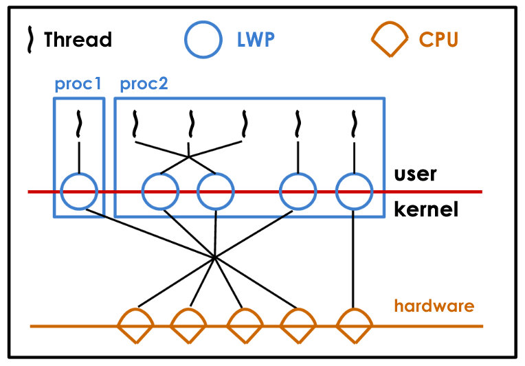
</center>

(*Reference*: Stein and Shah, Figure 1)

This figure illustrates the **lightweight threads** implementation described by the authors, representing the threading model supported by the operating system.

Going from the bottom up, at the hardware and kernel levels, the operating system is intended for multiprocessor systems with multiple CPUs, and furthermore the kernel itself is multithreaded (i.e., having multiple kernel-level threads).

At the user level, the processes can be either single- or multi-threaded, supporting both M:M and 1:1 mappings to kernel-level threads.

Each kernel-level thread executing a user-level thread has a **lightweight process data structure** associated with (represented by blue circles in the figure).
  * From the user-level library's perspective, these lightweight processes represent the virtual CPUs onto which the user-level threads are scheduled.
  * At the kernel level, there is a kernel-level scheduler which manages the kernel-level threads and schedules them onto the physical CPU(s)

### User-Level Thread Data Structures

Now, consider the the user-level thread data structures, as described in Stein and Shah ("*Implementing Lightweight Threads*").
  * ***N.B.*** This paper does not describe POSIX threads, however, the threads described are sufficiently similar for purposes of discussion.

<center>
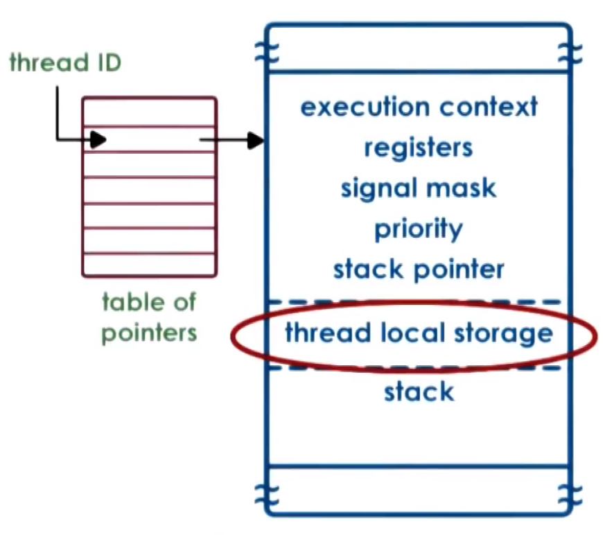
</center>

When the thread is **created**, the library returns a **thread ID** (`tid`). This is not a direct pointer to the actual data structure (i.e., as implied previously), but rather it is an index in a table of pointers. The **table pointers** in turn point to the actual underlying **thread data structure**.

With this configuration, if there is a problem with the thread, then if the thread ID were a direct pointer, it would now point to corrupt/invalid memory. Instead, with the pointer table as an intermediary, the table entry itself can encode information which provides meaningful feedback or an error message.

The thread data structure itself contains a number of fields (e.g., registers, signal mask, priority, and stack pointer). Furthermore, the thread data structure contains **thread local storage**, which includes the variables defined in the thread functions that are known at compile time so that the compiler can allocate storage on a per-thread basis for each of them.

The size of the **stack** can be be defined by the library defaults or by the user, but in general the size of most of the information in the thread data structure is fixed at compile time. Therefore, the information contained in the thread data structure can be layered contiguously in memory to improve locality and to facilitate the scheduler's finding of the next thread (i.e., via corresponding basic arithmetic operations).

<center>
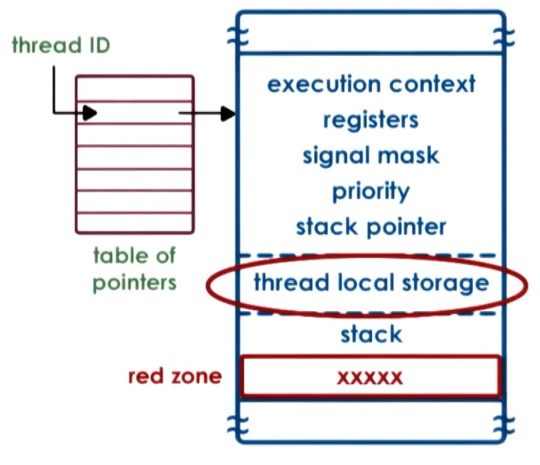
</center>

A key **problem** with this approach, however, is that the threading library itself does not control the stack size/growth during run-time, and furthermore the operating system itself is unaware that there are multiple user-level threads. Therefore, it is possible that as the stack grows, one thread may overwrite the data structure of another thread; if this occurs, the problem will not be detected until the latter thread proceeds to run, however, because the problem originated from the former thread, making identifying/debugging such a problem challenging.

The **solution** proposed by the authors is to separate the information about the different threads with a so-called **red zone**, a portion of the virtual address space that is not allocated, so that if the thread is running with an increasing stack during run-time, if it attempts to write to an address that resides in the red zone, then the operating system will cause a fault. Now, it is much easier to reason about the origin of the error due to its confinement to this specially designated region of memory and corresponding identification of the aberrant thread.

## 9. Kernel-Level Structures in Solaris 2.0

Now, consider the kernel-level data structures.

<center>
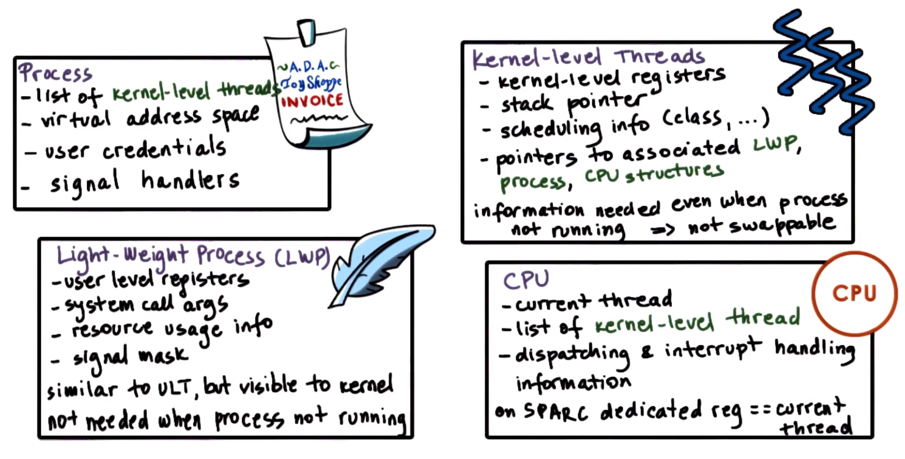
</center>

For each process, information is maintained about the process via the **process data structure**, e.g.,:
  * the list of **kernel-level threads** that execute within the process's address space
  * valid mappings of the virtual address space
  * user credentials (e.g., the user has access to a file during attempted access)
  * signal handlers which are valid for the process (e.g., how to respond to certain events that can occur in the operating system)
    * ***N.B.*** Signal handling is discussed later in this lesson

The **light-weight process (LWP) data structure** contains information that is relevant to some subset of the process, e.g.,:
  * one or more **user-level threads** that are executing in the context of the process, keeping track of their user-level registers and system call arguments
  * resource usage information
    * at the operating-system level, the kernel tracks resource usage on a per-kernel-thread basis; this is maintained in the LWP data structure for the corresponding kernel-level thread
    * therefore, to determine the aggregate resource usage for the entire process, this requires a traversal of all of the associated LWP data structures

***N.B.*** The information maintained in the LWP data structure is similar to that maintained at the user-level via the user-level thread data structure, however, the LWP data structure exposes the information that is visible to the kernel (e.g., as used by the operating system for scheduling). 

The **kernel-level threads data structure** contains information about the kernel-level threads, e.g.,:
  * kernel-level registers
  * stack pointer
  * scheduling information (e.g., class, etc.)
  * **pointers** to the associated LWP, process, and CPU data structures

***N.B.*** Note that the kernel-level threads data structure contains information about an execution context (i.e., for the kernel-level thread) that is always needed (e.g., operating-system-level services that must access kernel-level thread information, even when the thread is not active, such as scheduling information). Therefore, unlike the LWP data structure, the information contained in the kernel-level threads data structure is ***not swappable*** (i.e., it must *always* be present in memory); conversely, the information maintained in the LWT data structure does not need to be persistently present in memory, but rather can be swapped out if necessary (e.g., when memory becomes limited). This in turn allows the system to support a larger number of threads in a smaller memory footprint than would be otherwise possible if it were necessary to persist *all* of the aforementioned in memory.

The **CPU data structure** contains information pertaining to the CPU, e.g.,:
  * the currently executing/scheduled thread
  * a list of the other kernel-level threads
  * information for executing procedures to dispatching a thread, how to handle interrupts from various devices, etc.

***N.B.*** Once the current thread is known, it is possible to determine (via corresponding relationships) information about all of the associated data structures required to rebuild the entire process state.
  * On the SPARC architecture (as mentioned in the Solaris papers/references), many registers are provided, and in particular there is a dedicated register used to identify the current thread at any given point in time (i.e., it is updated accordingly during a context switch). Therefore, the pointer relationships can be followed accordingly to determine the state from this stored information, rather than using more expensive operations to make this determination.

<center>
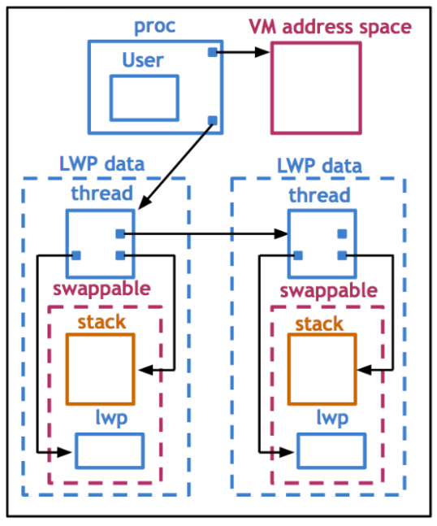
</center>

(*Reference*: Eykholt et al., Figure 2)

The figure shown above describes the relationships between all of the aforementioned kernel-level data structures.
  * The process data structure `proc` has information about the `User` and points to the address space `VM address space`, and also points to a list of kernel-level threads (designated `thread` inside of the data structure `LWP data` in the figure)
  * Each kernel-level thread data structure in turn points to the corresponding light-weight process `lwp` and stack `stack`, which are swappable

***N.B.*** For brevity, this figure omits information about the CPU data structure as well as other relationships/pointers among data structures.

## 10. Basic Thread Management Interactions

Given that there are threads at both the user and kernel levels, consider now the **interactions** between them to manage this efficiently.

<center>
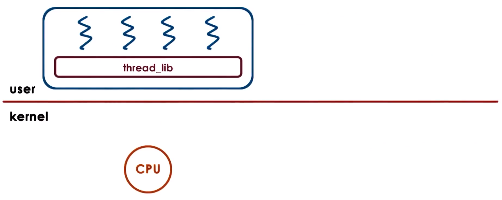
</center>

Consider a multithreaded process having four user-level threads, as shown above. However, the process is such that, at any given time, the actual level of concurrency is just two user-level threads (i.e., the process only requires two corresponding kernel-level threads).

<center>

</center>

When the process starts, the kernel provides a default number of kernel-level threads (e.g., one, as shown above), and the accompanying light-weight thread.

<center>
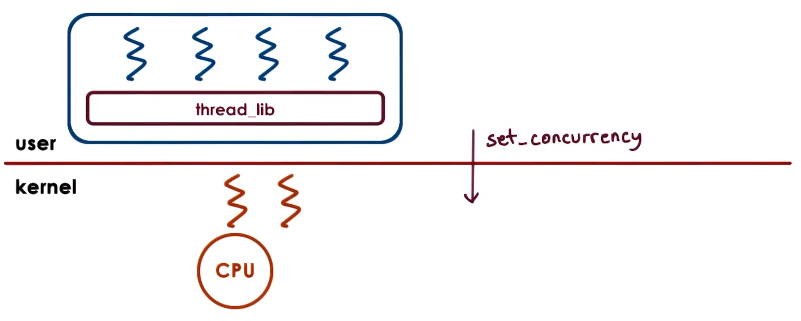
</center>

Next, the process requests an additional kernel-level thread. This is accomplished via a system called `set_concurrency` supported by the kernel, wherein in response to the request from the process, the kernel allocates an additional kernel-level thread(s) and allocates it to the process.

<center>
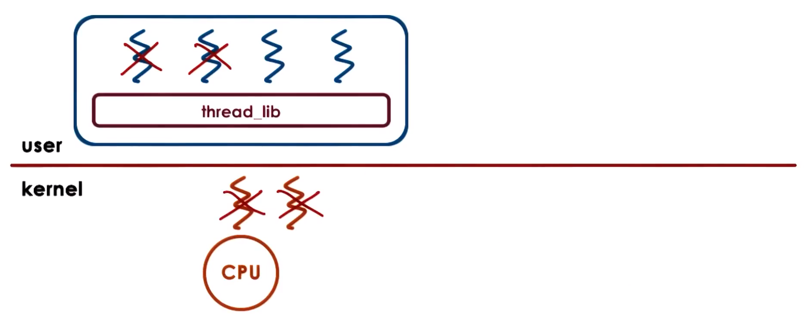
</center>

Now, consider the scenario wherein the two user-level threads that were mapped to the underlying kernel-level threads block (e.g., for an I/O operation, which moves them into the corresponding wait queue), thereby blocking the corresponding kernel-level threads as well. In this situation, the process itself is now blocked as well, since the associated kernel-level threads cannot proceed (i.e., are unavailable for the other unblocked user-level threads).

The reason for this occurrence is due to the fact that the user-level library is unaware of what is happening in the kernel (i.e., that the kernel-level threads are also blocked).

<center>
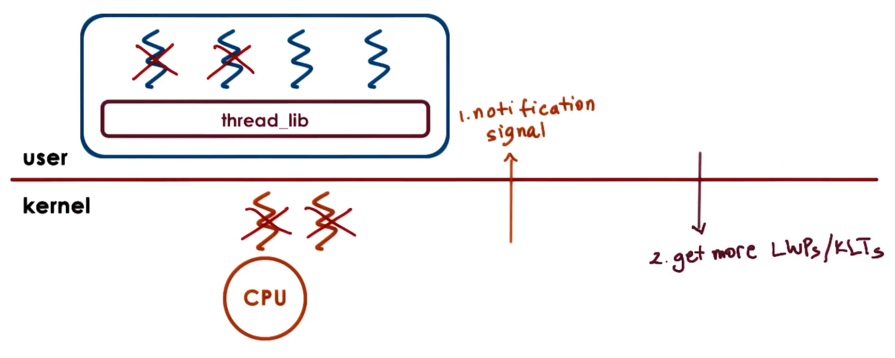
</center>

A more useful configuration would be to have the kernel notify the user-level library immediately prior to blocking the kernel-level threads, and then the user-level library (which assesses its current state to determine that it has available user-level threads in the run queue) can make a system call to request more kernel-level threads (and corresponding light-weight processes) from the kernel.

<center>
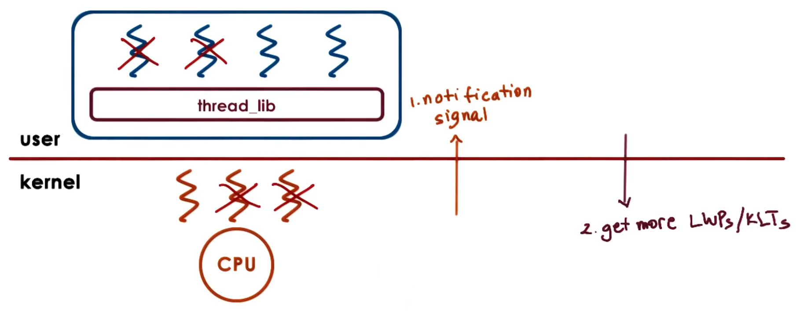
</center>

Now, with an extra kernel-level thread allocated, the user-level library can proceed with scheduling the remaining available user-level threads onto the associated light-weight process.

<center>
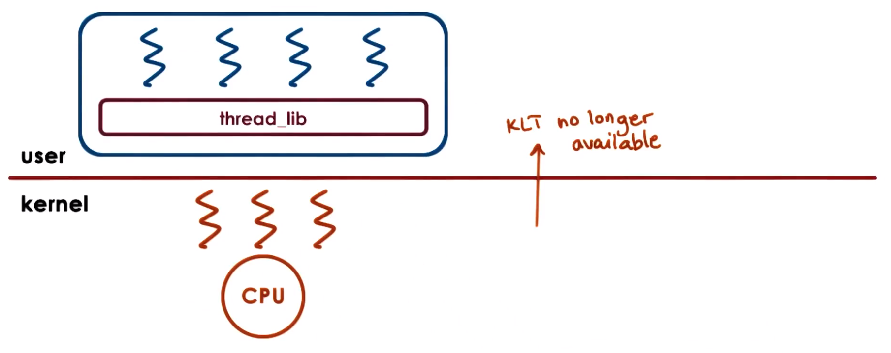
</center>

At a later time, when the I/O operation completes, at some point the kernel will notice that the additionally allocated kernel-level thread is consistently idle, and correspondingly will notify the user-level library that this kernel-level thread is no longer available.

As this example demonstrates:
  * The user-level library is unaware of what is happening in the kernel
  * The kernel is unaware of what is happening in the user-level library

Both of these observations therefore are problematic. To address these issues, in the Solaris threading implementation, certain **system calls** and **special signals** are introduced in order to allow the kernel and the user-level threading library to interact and coordinate.

## 11. PThread Concurrency Quiz and Answers

Consider an example of how the PThreads threading library can interact with the kernel to manage the level of concurrency that a process receives.

In the PThreads library, which **function** sets the concurrency level? (What is the function's name?)
  * `pthread_setconcurrency()`

Given the above function, which concurrency **value** instructs the implementation to manage the concurrency level as it deems appropriate? (What is the corresponding integer value?)
  * `0`

*Reference*: [manpage](https://man7.org/linux/man-pages/man3/pthread_getconcurrency.3.html)

## 12. Thread Management Visibility and Design

### Lack of Thread Management Visibility

The previous section discussed the fact that the kernel and the user-level library do not have mutual insight into each others' activities. Let us consider this point further now.

At the kernel level, the kernel sees:
  * all of the kernel-level threads
  * the CPUs
  * the kernel-level scheduler (which makes the decisions)

At the user level, the user-level library sees:
  * the constituent user-level threads of the process
  * the available kernel-level threads that are assigned to the process

If the user-level threads and kernel-level threads are using the 1:1 model, then every user-level thread will have an associated kernel-level thread (i.e., the user-level library will effectively see these kernel-level threads, though they are managed by the kernel).

<center>
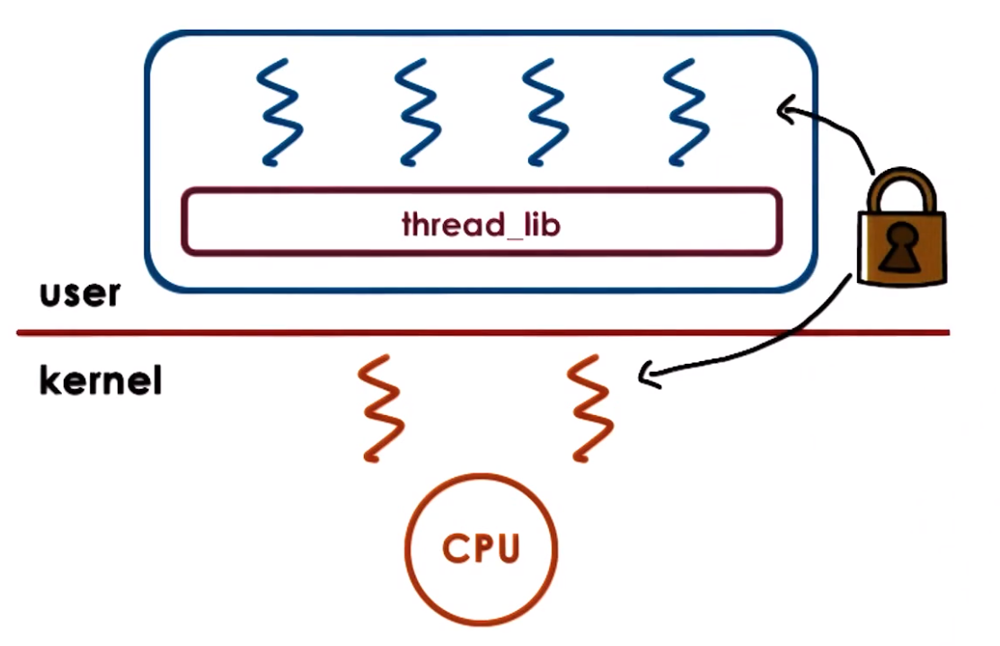
</center>

Even if not using a 1:1 model, the user-level library can request that one of its user-level threads be **bound** to a kernel-level thread.

<center>
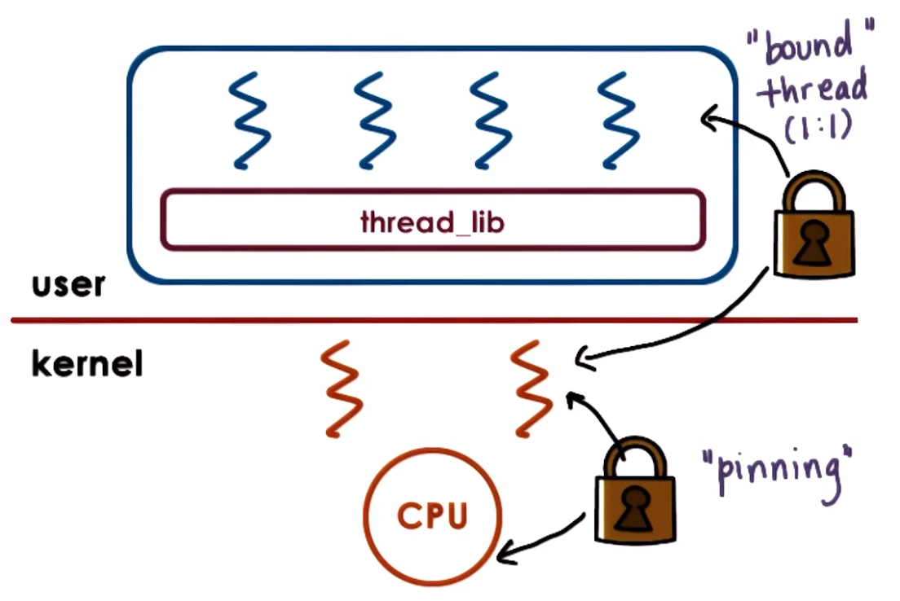
</center>

This is analogous to what might be done in a multi-CPU system, whereby a particular kernel-level thread is ***permanently*** associated with a particular CPU; in this scenario, this association is called **thread pinning**.

Correspondingly, the analogous term that was introduced in the Solaris threads model is a **"bound" thread**, whereby a user-level thread is associated to a particular kernel-level thread.
  * Furthermore, in a 1:1 model, every user-level thread is bound to a kernel-level thread in this manner.

<center>
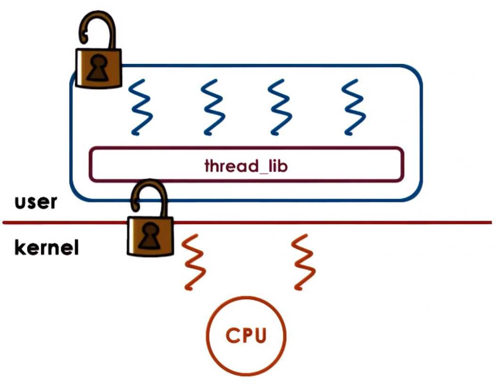
</center>

Now, consider the scenario wherein one of the user-level threads has a lock, and therefore the corresponding kernel-level thread is supporting the execution of the associated critical-section code.

<center>
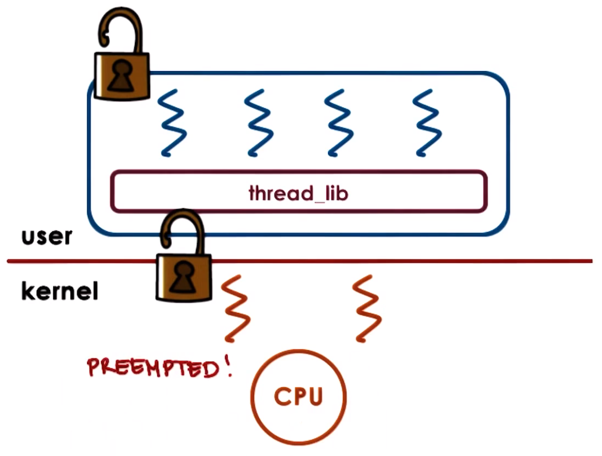
</center>

Furthermore, the kernel preempts one of the kernel-level threads from the CPU in order to schedule the other kernel-level thread, resulting in suspension of the execution of the critical-section code in the associated user-level thread of the former.

<center>

</center>

Consequently, as the user-level library scheduler cycles among the remaining user-level threads, if any of them require the lock, then they will be unable to proceed.

<center>
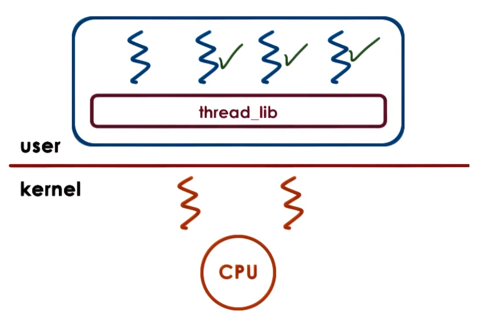
</center>

Therefore, only *after* the kernel-level thread is scheduled again will the critical section of the previously locked user-level thread be allowed to proceed, thereby allowing the other user-level threads to execute.

<center>
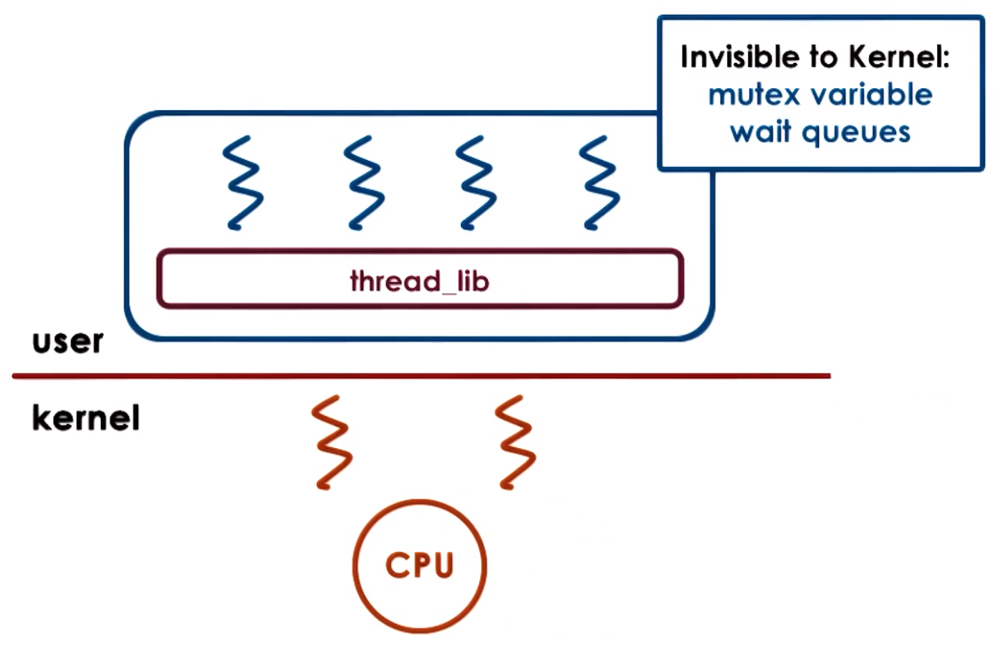
</center>

To reiterate, the **problem** is the lack of visibility of state and decisions between the kernel and the user-level library. In such a many-to-many model:
  * at the user level, the user-level library makes scheduling decisions that the kernel is not aware of, thereby changing the user-level threads to kernel-level threads mapping
  * data structures (e.g., mutexes, wait queues, etc.) are also invisible to the kernel

The 1:1 model helps to address some of these issues.

### How/When Does the User-Level Library Run?

Since the user-level library plays such an imperative role in how the user-level threads are managed, we need to understand exactly *when* the user-level library gets involved in the execution loop.

<center>
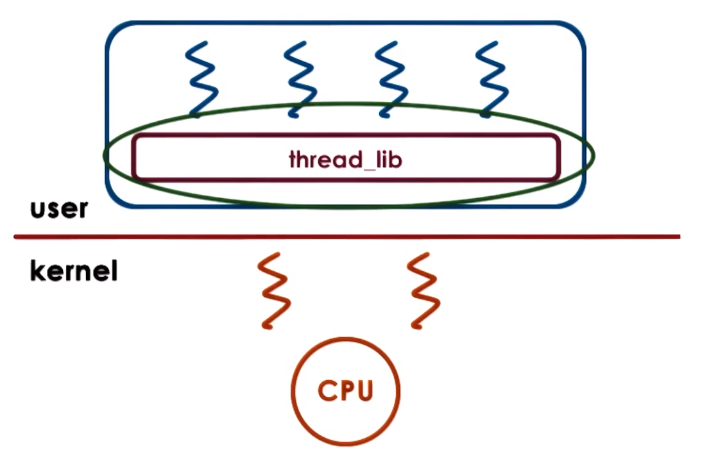
</center>

The user-level library is part of the user process (i.e., part of its address space), and occasionally the execution essentially jumps to the appropriate program counter into this address space.

There are multiple reasons why control should be passed to the **user-level library scheduler**, e.g.,:
  * user-level threads explicitly yield
  * timer set by user-level library expires
  * user-level threads call library functions (e.g., lock/unlock to perform synchronization actions)
  * blocked threads become runnable

***N.B.*** The user-level library scheduler is generally part of the user-level library implementation, not the application/process implementation itself.

In addition to being invoked on certain operations triggered by the user-level threads, the user-level library scheduler is also triggered to run in response to:
  * user-level thread operations
  * signals from a timer or directly from the kernel

These interactions will be demonstrated in the next section.

## 13. Issues on Multiple CPUs

Other interesting management interactions between the user-level threading library and the kernel-level thread management occurs in the situation involving multiple CPUs.

In the previously discussed situations, there was only one CPU, and all of the corresponding user-level threads ran on top of this CPU. Furthermore, changes (i.e., in terms of which of the user-level threads will be scheduled by the user-level threading library) were immediately reflected on that particular CPU.

Conversely, in a multi-CPU system, the kernel-level threads that support a single process may be running on multiple CPUs, perhaps even concurrently. Therefore, a situation can occur whereby the user-level library that is operating in the context of one kernel-level thread on one CPU needs to impact what is running on another kernel-level thread on another CPU.

<center>
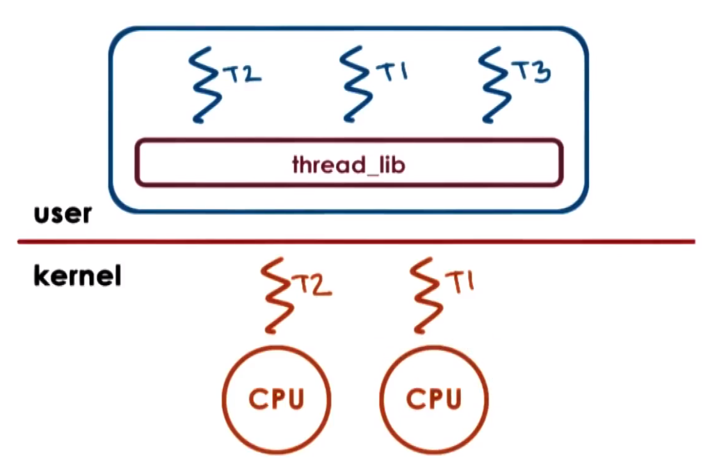
</center>

Consider the situation wherein there are three user-level threads running, having the thread priority `T3 > T2 > T1`.

<center>
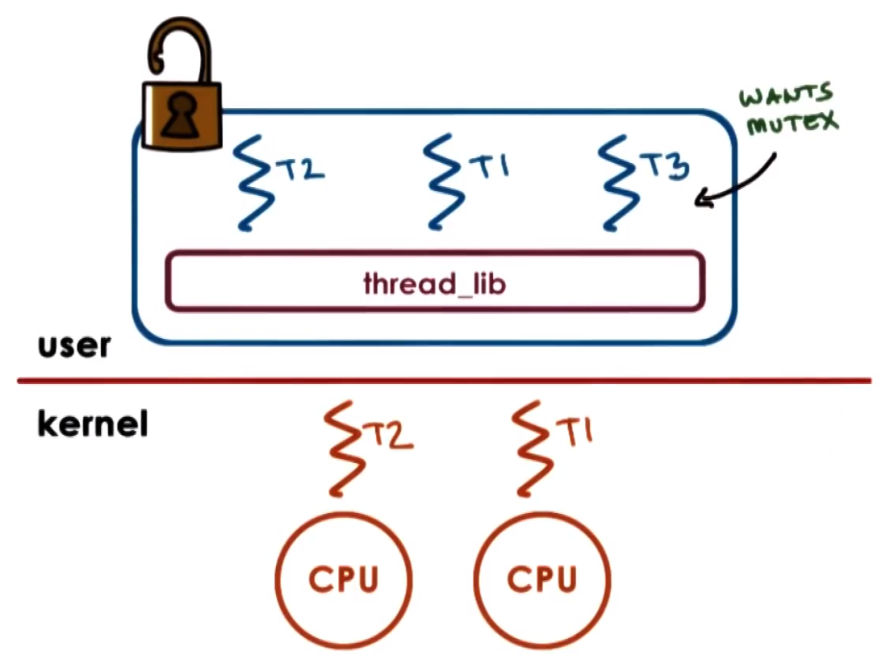
</center>

Furthermore, assume the situation is such that user-level thread `T2` is running in the context of one of the kernel-level threads and is currently holding the mutex. `T3` (the highest priority thread) is waiting on the mutex, and is therefore blocked (i.e., is not currently executing). Therefore, the other user-level thread `T1` is concurrently running on the other CPU (i.e., via corresponding kernel-level thread).

<center>
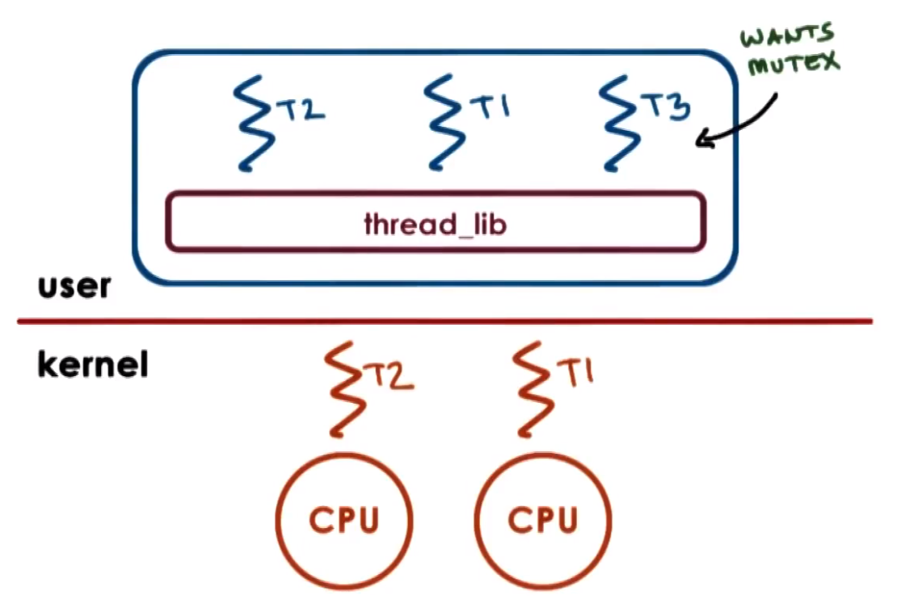
</center>

Now, at some later point in time, `T2` releases the mutex, and consequently `T3` is now runnable. At this point, all three user-level threads are runnable, and therefore it must be ensured that the thread priority is enforced appropriately; in order to accomplish this, `T1` (the lowest priority thread) must be preempted, however, it is already running on the CPU when this determination is made. Accordingly, the other CPU must be notified to perform a corresponding context switch to execute the higher priority user-level thread.

<center>
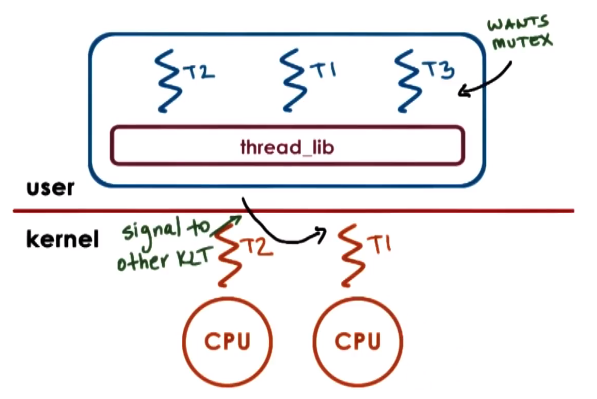
</center>

Since it is not possible to directly modify the registers of the other CPU when executing on another CPU, this is instead accomplished via **signal** (e.g., an interrupt) to the other kernel-level thread, informing it to run the user-level library code locally in order to allow the user-level library to make an updated scheduling decision.

<center>

</center>

Once this signaling is performed, the user-level library executing on the second CPU determines that it must schedule the highest priority user-level thread `T3` instead, thereby blocking `T1`.

Therefore, with multiple user-level threads (as managed by the user-level library) and multiple kernel-level threads, the interactions between these threads becomes more complicated in the scenario with multiple CPUs than with only one CPU.

## 14. Synchronization-Related Issues

Another interesting situation occurring in multi-CPU, multi-user-level-thread systems pertains to **synchronization**.

<center>
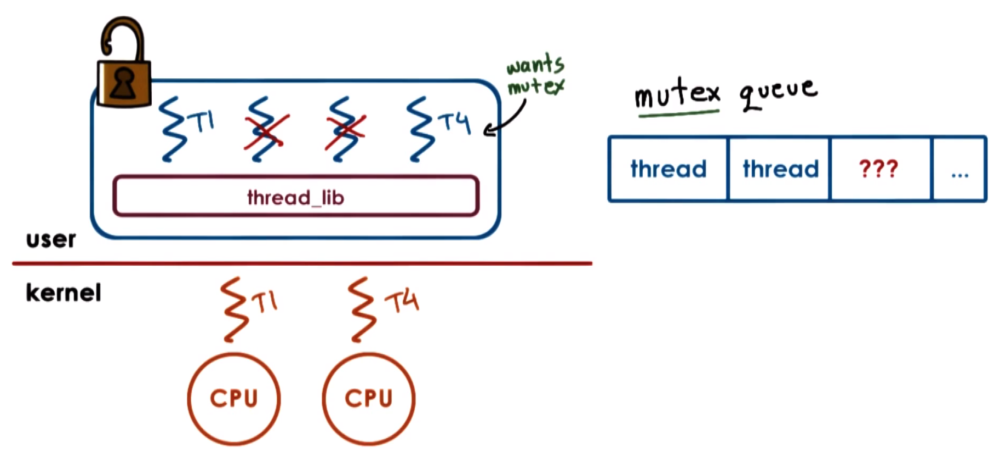
</center>

Consider the situation wherein one user-level thread `T1` is running on top of one kernel-level thread (and corresponding CPU), which currently owns the mutex. Consequently, a number of other user-level threads may be blocked. However, on another user-level thread `T4` is scheduled on the other CPU.

Now, `T4` also requires the mutex, which is currently locked by `T1`. The normal behavior in this situation would be to place `T4` into the queue associated with the mutex. However, in a multi-CPU system, such a situation can also occur, wherein the current owner of the mutex is executing the critical-section code on one CPU, but the other thread is currently performing actions to get the mutex (e.g., context switch to the queue); in fact, the former thread may even release the mutex during this time.

<center>
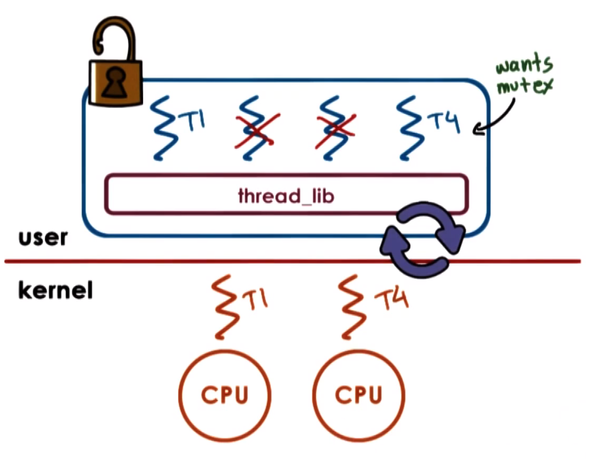
</center>

In such a situation (e.g., if the critical-section code is short and executes quickly), it is better for the waiting thread to **spin** on its currently associated CPU (i.e., wait a few CPU cycles) for the mutex to become available, rather than enqueuing for the mutex.

Otherwise, for long-duration critical sections, the default blocking/enqueueing behavior is more appropriate.

Collectively, this behavior (i.e., spinning vs. blocking/enqueuing) is described as **adaptive mutexes**; this approach is only sensible to use on multi-CPU systems (i.e., spinning on a single-CPU system would be trivial and even counter-productive).

Recall that when mutexes were introduced (cf. P2L2), it is useful to maintain some information on the owner of the mutex. Accordingly, adaptive mutexes are an illustrative example of how such information can be useful (e.g., when attempting to lock a mutex, verify that the current owner of the mutex is running on another CPU, in order to determine whether to spin or to block), in conjunction with information about the critical section (i.e., short vs. long execution duration).

### Destroying Threads

Consider now some final remarks regarding destroying threads.

Once a thread is no longer needed (i.e., once it exits), it should be destroyed, with its corresponding data structure, stack, etc. being freed.

However, since thread creation is a relatively time-intensive operation (e.g., creation and initialization of data structures), it is sensible to **reuse** threads (i.e., the underlying data structures).

<center>

</center>

To accomplish such reuse, upon exit of the thread...
  * put it on a **"death row"**
  * *periodically* destroy these (prospective zombie) threads via the **reaper thread** (i.e., rather than *immediately*)
  * otherwise, thread data structures and stacks are *reused*, resulting in a performance gain due to reduction in overall thread creations

## 15. Number of Threads Quiz and Answers

As we have seen so far, the interactions between the kernel-level threads and the user-level library involve requesting, allocating, and scheduling threads. Thus, it can be assumed that there is some number of threads allocated at startup to get the operating system to boot. (***N.B.*** Each question in this quiz references Linux kernel version 3.17.)

In the Linux kernel's codebase, a **minimum** of how many threads are required to allow a system to boot?
  * `20` (cf. `fork.c`, function `init_fork()`)

What is the name of the **variable** used to set this limit?
  * `max_threads`

*References*:
  * [Free Electrons Linux Cross Reference](https://elixir.bootlin.com/linux/v3.17/source)
  * [Interactive Linux Kernel Map](https://makelinux.github.io/kernel/map/)

## 16. Interrupts and Signals Introduction

In the previous discussion on data structures, the terms **interrupts** and **signals** were introduced. Let us consider these further now.

### Interrupts vs. Signals: Contrast

**interrupts**...
  * are events generated ***externally*** by components other than the CPU (e.g., I/O devices, timers, other CPUs, etc.), representing a notification to the CPU that some external event has occurred
  * are determined based on the specific configuration of the physical platform (e.g., the types of devices it has, details of the hardware architecture, etc.)
  * appear ***asynchronously*** (i.e., *not* in direct response to some specific action taking place on the CPU)

**signals**...
  * are events triggered by the CPU itself, and the software running on it
    * they are either generated by the software (e.g., a software interrupt), or the hardware itself triggers certain events that are interpreted as signals
  * are determined based on the operating system (i.e., the operating system determines which signals can occur on a given platform)
    * therefore, two identical platforms with the same interrupts can generate different signals on different operating systems
  * appear *both* ***synchronously*** (i.e., in response to a specific action that took place on the CPU) or ***asynchronously*** (typically in response to the synchronous action)
    * for example, if a process is attempting to access memory that has not been allocated to it, this results in a synchronous signal

### Interrupts vs. Signals: Comparison

There are certain **aspects** of both interrupts and signals that are similar, e.g.,:
  * both have a **unique identifier**, whose value depends on the hardware (interrupt) or operating system (signal)
  * both can be **masked** and disabled/suspended via the corresponding mask
    * on a per-CPU basis for an interrupt mask
    * on a per-process basis for a signal mask
  * both trigger a corresponding **handler** if enabled
    * the **interrupt handler** is set for the *entire system* by the operating system
    * the **signal handler** is set on a *per-process* basis by the process

## 17. Visual Metaphor

Now that interrupts and signals have been contrasted and compared, consider a visualization of these concepts.

<center>

</center>

Let us revisit the example of a toy shop, which gives rise to the following analogies:
  * an **interrupt** is like a *snowstorm warning* (generated externally to the toy shop)
  * a **signal** is like a *'battery is low' warning* (generated internally within the toy shop)

Each of the warnings are characterized by the following:

| Characteristic | Toy Shop | Interrupts and Signals |
| :--: | :--: | :--: |
| must bew handled in specific ways | safety protocols, hazard plans, etc. | interrupt handlers and signal handlers |
| can be ignored | continue working | interrupt mask and signal mask |
| can occur expectedly or unexpectedly | occur regularly or irregularly | appear synchronously or asynchronously | 

## 18. Interrupt Handling

<center>
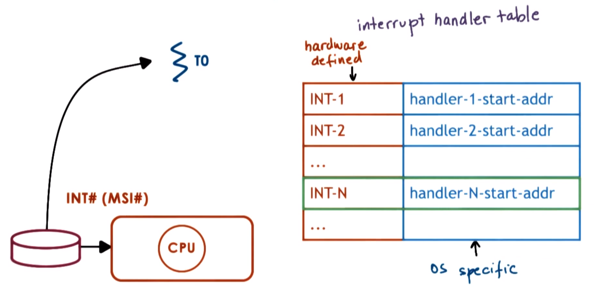
</center>

When a device (e.g., the disk) wants to send a notification to the CPU, it sends an interrupt that sends a signal via the **interconnect** that connects the device to the CPU complex.
  * In the past, this was accomplished via dedicated wires, however, most modern devices use a special message called a **message signal interrupter (MSI)**, which can be carried on the *same* interconnect that connects the device to the CPU complex (e.g., PCI-express).

Based on the pins where the interrupt occurs or based on the MSI message, the interrupt can be uniquely identified (i.e., it can be associated to the particular device in question).

When the interrupt interrupts the thread executing on the CPU (e.g., `T0`), if the interrupt is enabled, then based on the interrupt number (`INT#`), the **interrupt handler table** is correspondingly referenced. The interrupt handler table specifies the starting address of the associated interrupt-handling routine. Therefore, the interrupt triggers the program counter to be set to the corresponding interrupt handler for consequent execution. All of this occurs within the context of the executing/interrupted thread (e.g., `T0`)

***N.B.*** Recall that which exact interrupts can occur on a given hardware platform depends on the hardware (i.e., is defined by the hardware itself), whereas the corresponding handling is defined by the operating system.

## 19. Signal Handling

The situation with signals differs because--unlike interrupts--signals are not generated by an external entity.

### Signal Handling Example

<center>
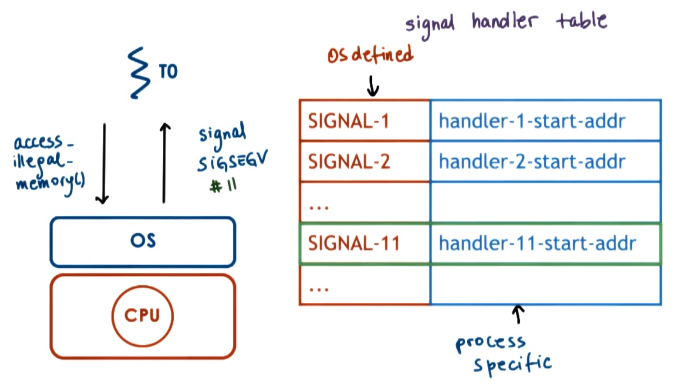
</center>

For example, if thread `T0` attempts to access memory that has not been allocated to it, this results in the generation of the signal `SIGSEGV`.

When the operating system generates this signal (e.g., `#11`), the consequent processing is analogous to that of the interrupt handling discussed previously, i.e.,:
  * the operating system maintains a **signal handler table** for every process in the system, which in turn specifies the starting address for the corresponding signal-handling routine
  * the signals that can occur on a particular platform are defined by the operating system, and their corresponding handling can be specified by the process

### More on Signals

The operating system itself also provides **default actions** for handling signals, e.g.,:
  * terminate the process
  * ignore the signal
  * terminate the process and core dump (e.g., in response to `SIGSEGV`, for post-mortem analysis)
  * stop the process
  * continue a stopped process

However, for most signals, the process itself can also install its own custom signal-handling routine
  * this is facilitated by system calls and library calls, e.g., `signal()` and `sigaction()`
  * some signals cannot be *'caught'* by the process in this manner, however (e.g., those which always kill the process)

The following are representative examples of signals:
  * synchronous
    * `SIGSEGV` - attempted illegal access to protected main memory
    * `SIGFPE` - attempt to divide by zero
    * `SIGKILL (kill, id)` - kill process via `id`
      * can be directed to a specific thread (i.e., from one process to another)
  * asynchronous
    * `SIGKILL (kill)` - terminates the process
    * `SIGALARM` - timeout due to expired timer

## 20. Why Disable Interrupts or Signals?

There is a **problem** which is common among both interrupts and signals in that both are executed in the context of the thread that was interrupted, meaning that they are handled on the thread's stack and therefore can cause certain issues that will lead us to the answer as to why we should sometimes disable interrupts and/or signals.

<center>
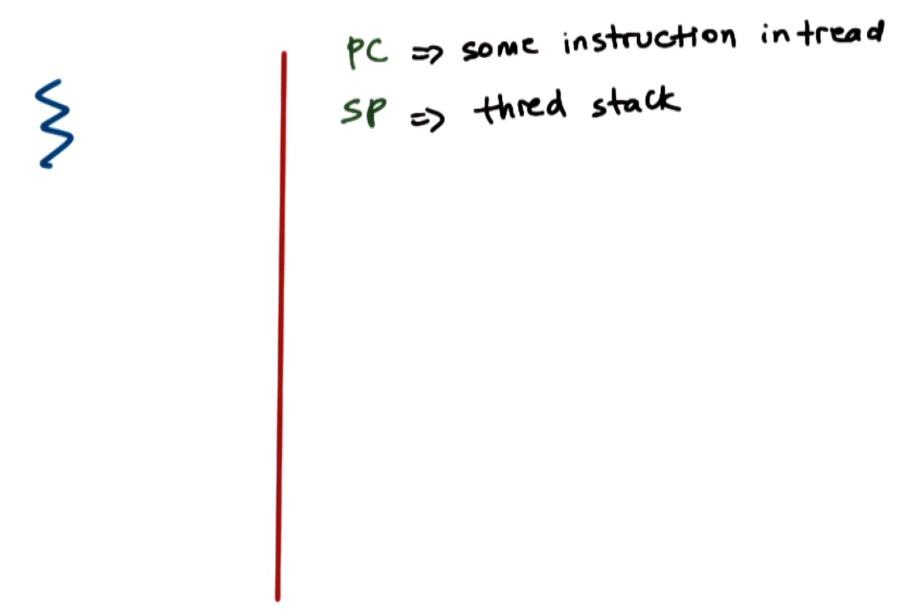
</center>

To demonstrate this problem, consider an arbitrary thread executing an instruction (where `PC` is the program counter, and `SP` is the stack pointer).

<center>
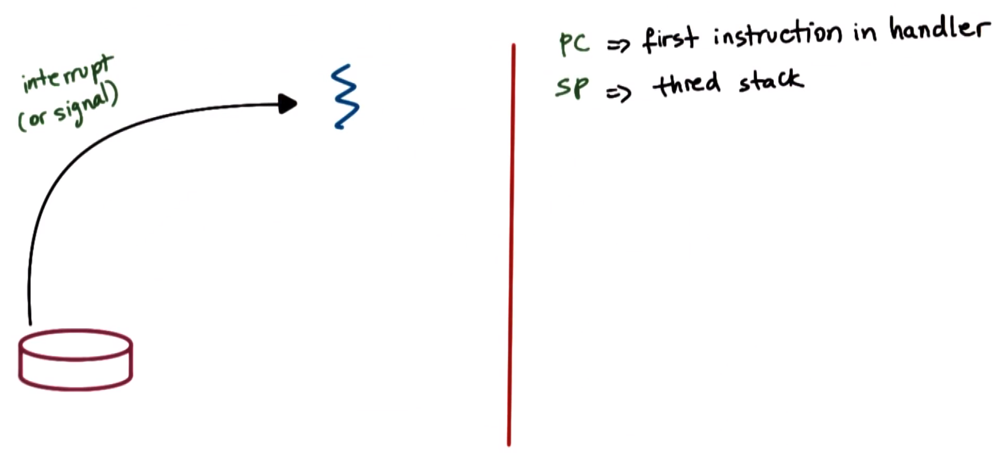
</center>

At some point during execution, an interrupt (or signal) occurs, and consequently the program counter changes to point to the first instruction of the handler. However, the stack pointer remains at the same location.
  * Furthermore, this can be nested (i.e., multiple interrupts and/or signals executing on the interrupted thread)

<center>

</center>

If the handler code must access some state that is mutually accessible to other threads in the system, this will require the use of a mutex(es).

<center>
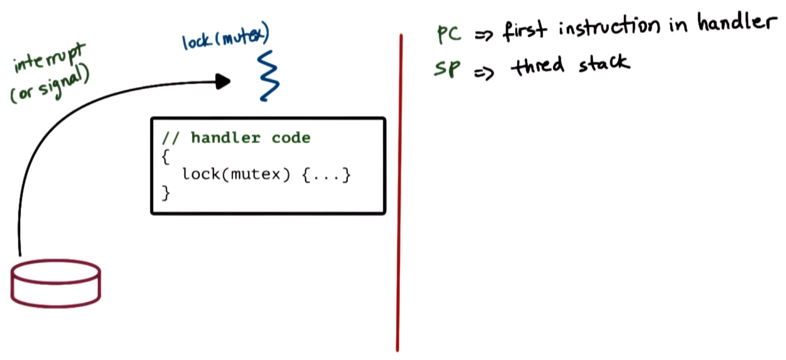
</center>

However, if the interrupted thread already owns the same mutex required by the handler, this creates a deadlock (i.e., the interrupted thread will not release the mutex until the handler completes the execution on its stack and returns, but the latter is in turn blocked by the locked mutex).

<center>
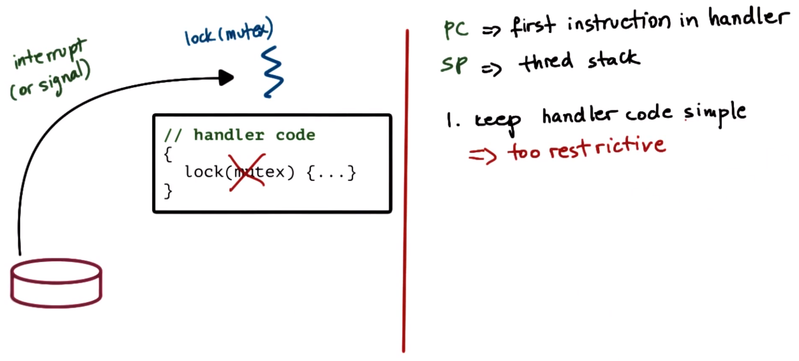
</center>

To resolve this issue, one possible **solution** is to keep the handler code simple (e.g., in this example, avoid the use of a mutex within the handler code). However, this approach may be too restrictive (i.e., limits the capabilities of the handler).

<center>
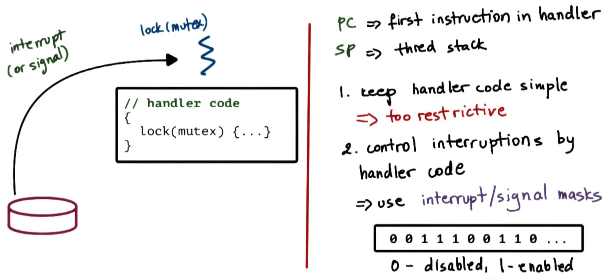
</center>

Alternatively, rather than restricting the capabilities of the handler (e.g., avoiding the use of mutexes), use **interrupt/signal masks**, which allow to dynamically enable or disable whether the handler code can interrupt the executing mutex.
  * The **mask** is a sequence of bits, where each bit corresponds to a specific interrupt or signal, set via the corresponding value `0`/disabled or `1`/enabled
  * When an event occurs, first the mask is checked, and if the event is enabled then invocation of the handler proceeds, otherwise if it is disabled, then the signal/interrupt remains pending and will be handled at a later time when the mask value changes

<center>
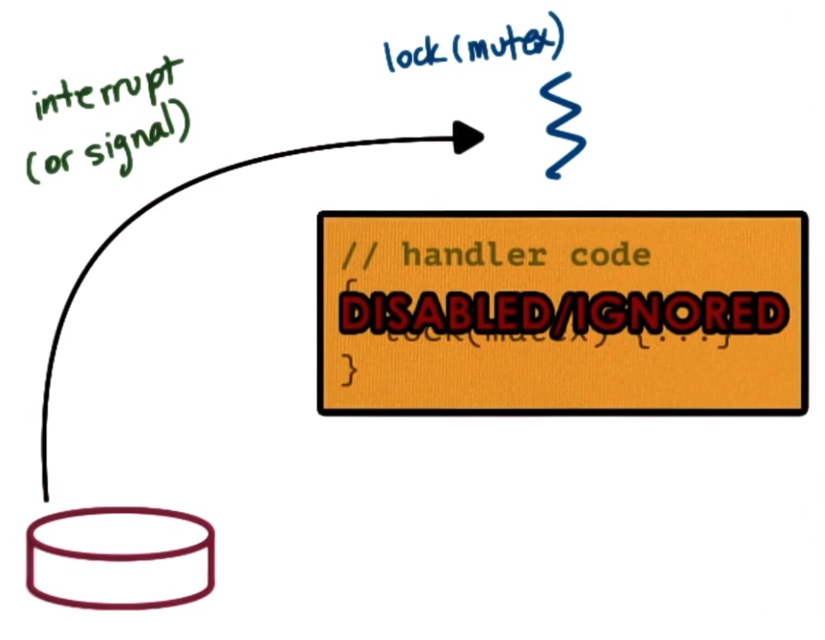
</center>

Furthermore, to solve the aforementioned deadlock situation, the thread--immediately prior to acquiring the mutex--can disable the interrupt, thereby preventing interruption of the thread's execution.

<center>
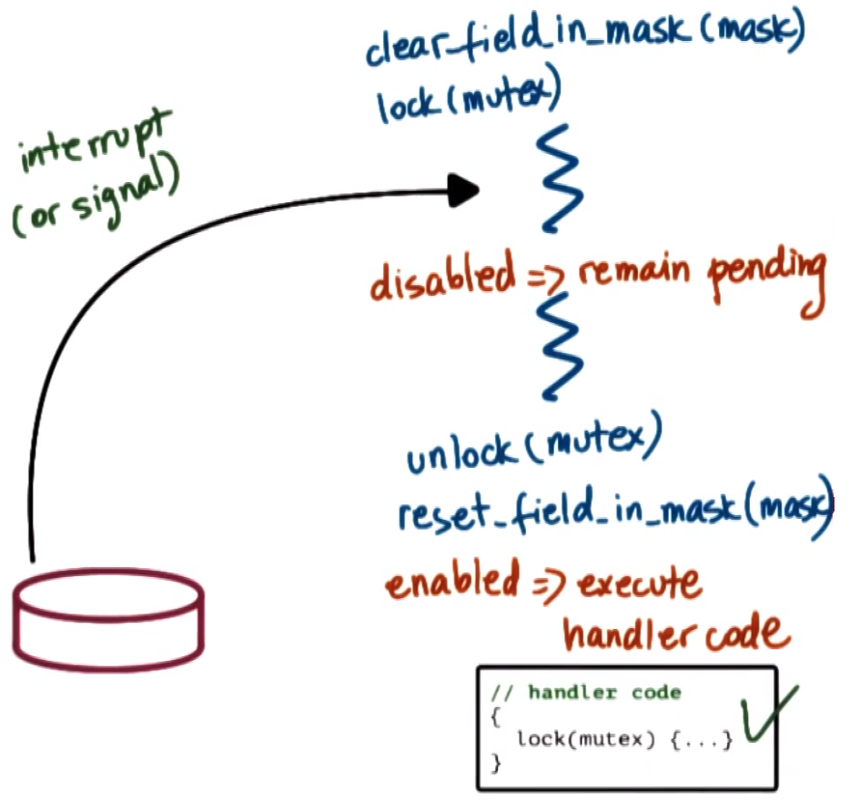
</center>

If the mask indicates the the the interrupt is disabled, then the interrupt will remain in a pending status until a later time.

Once the lock is freed (i.e., via corresponding call to `unlock()`), the thread will then reset the appropriate bit field in the mask, thereby enabling the execution of the handler code by the operating system; at this point, it is permissible for the handler to execute the critical-section code, because the thread no longer holds the mutex (i.e., the aforementioned deadlock is now avoided).

<center>
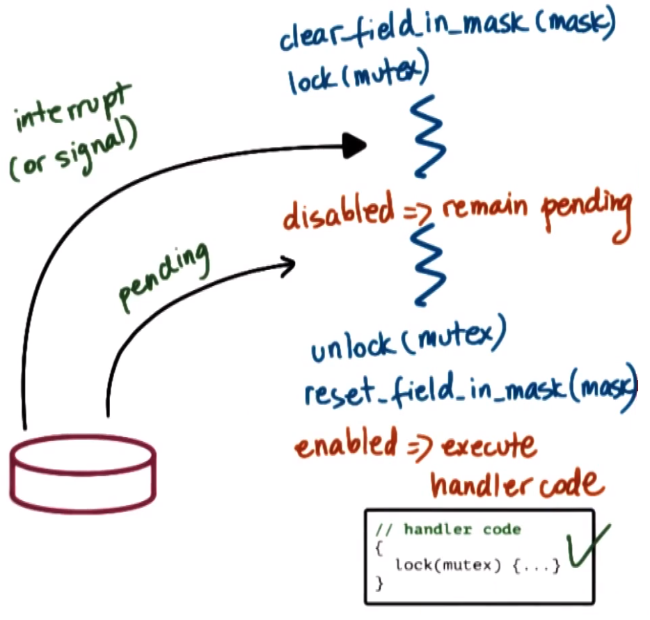
</center>

Note that while an interrupt (or signal) is pending, other instances can also occur, which in turn will also remain pending. Furthermore, once the event is enabled, the handler will typically only execute *once*; therefore, to ensure that the handler is executed *multiple* times, it is insufficient to simply generate multiple interrupts (or signals).

## 21. More on Masks

Here are a few more points regarding masks:
  * Interrupt masks are maintained on a **per-CPU** basis
    * If the interrupt mask ***disables*** a particular interrupt, then the corresponding hardware support responsible for routing the interrupt will simply avoid delivering that interrupt to the CPU
  * Signal masks occur on a **per-execution-context** basis (i.e., on what the user-level thread--running on top of a kernel-level thread--is doing at a particular moment)
    * If the signal mask ***disables*** a particular signal, the kernel sees the mask and avoids interrupting the corresponding thread

## 22. Interrupts on Multicore Systems

There are many details pertaining to interrupt handling that we will not discuss in this course. However, there are some final remarks to be aware with respect to interrupts, specifically their occurrence in the presence of multicore systems (and more generally on multi-CPU systems).

<center>
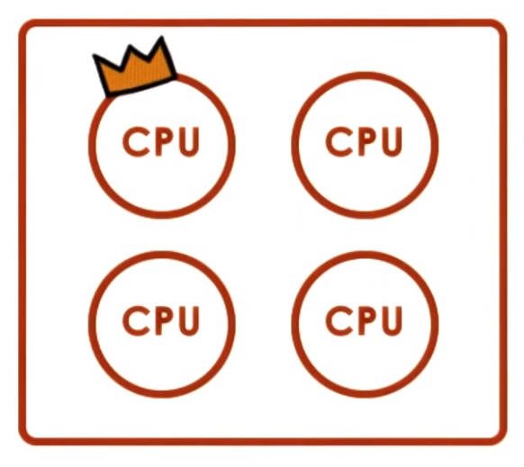
</center>

On a multi-CPU system, the interrupt-routing logic will direct the interrupt to any one of the CPUs that at a particular point in time has that interrupt enabled. Interrupts can be directed in this manner to *any* CPU(s) that has them enabled.

Furthermore, in such a multi-CPU system, we can specify that only *one* of the CPU cores is designated for dedicated handling of the interrupt (as designated by the crown in the figure shown above). This is the only CPU that has the interrupt enabled.
  * This consequently avoids overhead and perturbations related to interrupt handling on all of the other cores, with the net effect being an improvement in performance

## 23. Types of Signals

A final point regarding signal handling is that there are two **types** of signals:
  * **one-shot signals**
    * given that if there are many instances of a given signal that will occur, then they will be handled at least once
      * therefore, it is possible that either only 1 signal or `n` signals of that kind will occur, but in either case only *one* execution of the signal handler is performed
    * consequently, the signal handler must be explicitly re-enabled every time the signal occurs
      * therefore, if the process installs some custom handler for a particular signal, then it will be invoked on the initial occurrence of the signal, however, subsequent signal(s) will invoke the default handler provided by the operating system, or the operating system can elect to ignore the signal(s) (and they will be consequently lost)
  * **real-time signals**
    * if `n` signals are raised, then correspondingly the handler is guaranteed to be called `n` times
    * supported in the Linux operating system

## 24. Signals Quiz and Answers

The previous section described different types of signals. Using the most recent POSIX standard, indicate the correct signal names for the following events:
* terminal interrupt signal
  * `SIGINT`
* high bandwidth data is available on a socket
  * `SIGURG`
* background process attempting write
  * `SIGTTOU`
* file size limit exceeded
  * `SIGXFSZ`

*References*:
  * [POSIX.1-2017/IEEE Std 1003.1-2017](https://pubs.opengroup.org/onlinepubs/9699919799/)

## 25. Handling Interrupts as Threads

Now that we have a basic understanding of how interrupts are typically handled, let us now consider the **relationship** between interrupts and threads.

<center>
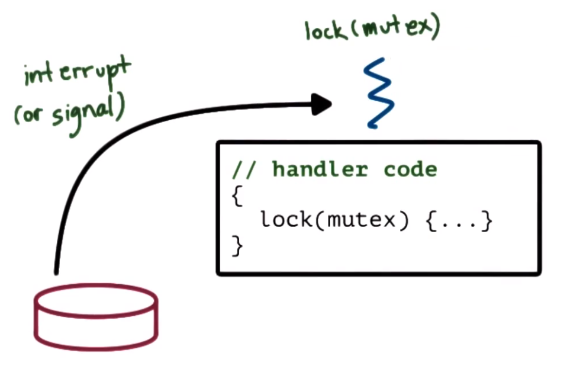
</center>

Recall from a previous example that when an interrupt occurs, there is the possibility of a deadlock resulting. This can occur if the interrupt-handling routine is attempting to lock a mutex that is already being held by the executing thread that the interrupt was called for. (A similar situation can also occur with respect to the signal-handling routine.)

<center>
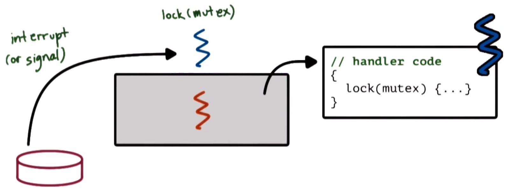
</center>

One **solution** to this problem--as illustrated in the SunOS reference paper--is to allow interrupts to become full-fledged **threads** themselves; this should occur *every time* they are potentially performing blocking operations. 

In this case, although the interrupt handler is blocked at this particular point in time, it has its own context (i.e., its own stack) and therefore it can remain blocked. At that point, the thread scheduler can schedule the original thread back onto CPU so that it can proceed with executing.

<center>
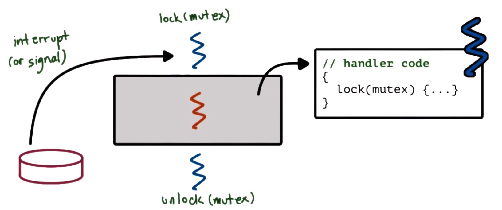
</center>

Eventually, the original thread will unlock the mutex, and at that point the thread corresponding to the interrupt-handling routine will be available to execute.

<center>
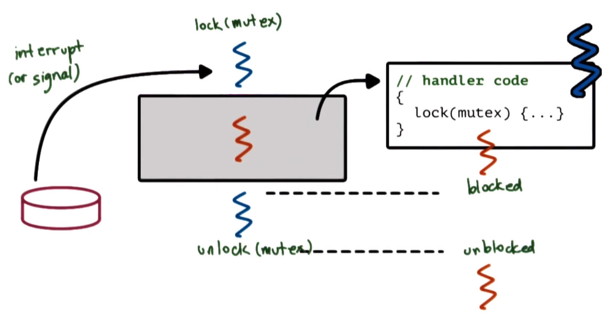
</center>

The way this occurs is as shown in the figure above.
  * Whenever an interrupt (or signal) occurs, it interrupts the execution of a thread. By default, that handling routine should start executing in the context in the context of the *interrupted thread* using its stack and registers.
  * If the handling routine will be performing synchronization operations, in this case the handler code will execute in the context of a *separate* thread.
  * When the locking operation is reached, if it turns out that it blocks, then the handler code and its thread will be placed in a wait queue associated with the mutex, and instead the originally interrupted thread will be scheduled to run.
  * When the unlock operation is reached, the sequence returns to handler-code thread, which is consequently dequeued from the wait queue associated with the mutex and the handling code can now be executed to completion.

  ### ...But Dynamic Thread Creation Is *Expensive*! 

While this approach is sensible, one **concern** is that dynamic thread creation is ***expensive***.

Therefore, the key **dynamic decision** to be made is:
  * if the handler does not lock, then execute on the interrupted thread's stack
  * otherwise, if the handler can ***block*** (e.g., when attempting to lock a mutex), then turn it into a ***real thread*** (i.e., create a new thread)

***N.B.*** These rules are enumerated in the Solaris paper with respect to the SunOS system.

As a matter of **optimization**, in order to eliminate the need to dynamically create threads (e.g., whenever it is determined that the handler can potentially lock), the kernel can pre-create and pre-initialize a number of **thread structures** for the various interrupt routines that it can support (i.e., the kernel will pre-create a number of threads and their associated data structures, and then initialize the data structures so that they point to the appropriate locations in the appropriate interrupt handling routines so that any interrupt-internal data is appropriately allocated, and so on). Consequently, the creation of a thread is removed from the fast path of the interrupt processing, thereby avoiding incurring of that cost when the interrupt actually occurs, thereby significantly improving (i.e., speeding up) the interrupt-handling time.

## 26. Interrupts: Top vs. Bottom Half

<center>
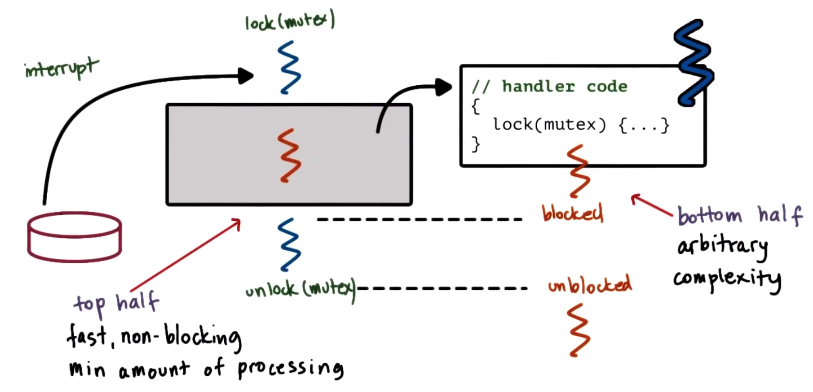
</center>

Furthermore, when an interrupt first occurs, and the sequence is within the initial part of the interrupt handler, it may be necessary to disable certain interrupts (recall that this is one approach to preventing a deadlock situation).

However, when the interrupt handling is passed to a *separate* thread, we can consequently enable any interrupts that had been originally disabled (i.e., any occurring interrupts can now be handled in the same manner as would be done for any other thread in the system, with no corresponding danger of a similar additional deadlock situation occurring, due to the interrupt-handling routine being isolated to the separate thread). Therefore, it is much safer (i.e., with respect to having external interrupts occurring) when executing the bottom part of the handler code.

The words "***top***" and "***bottom***" in the figure above were chosen here intentionally to describe this situation. This description of how Solaris uses threads to handle interrupts is a very **common technique** for allowing an interrupt-handling routine to have potentially arbitrary complexity without concern for deadlocks. 
  
In Linux, these two parts of the interrupt processing are referred to as the **top half** and the **bottom half** (respectively).
  * The top half performs a minimum amount of processing, and is required to be **non-blocking**. Essentially, it is required to be ***fast***.
    * The top half executes *immediately* when an interrupt occurs.
  * The bottom half is allowed to perform processing operations of arbitrary complexity.
    * The bottom half--like any other thread--can be scheduled for a later time, can block, etc. Therefore, other than perhaps due to certain timeouts associated with the device, there is virtually no restriction on when it actually is allowed to execute.

***N.B.*** The paper goes into further detail in describing a specific **policy** for interpreting the priority levels associated with the threads when they are being interrupted, as well as priority levels associated with the devices. These priority levels are used to determine when and how a thread should be used to handle the particular interrupt in question. While this discussion is out of scope for present purposes, the **takeaway** is that if you want to permit arbitrarily complex functionality to be incorporated into the interrupt-handling operations, then it is imperative to ensure that the corresponding handling routine is executed by a dedicated thread (which is able to block) that can be potentially synchronized with if necessary.

## 27. Performance of Threads as Interrupts: The Bottom Line

<center>
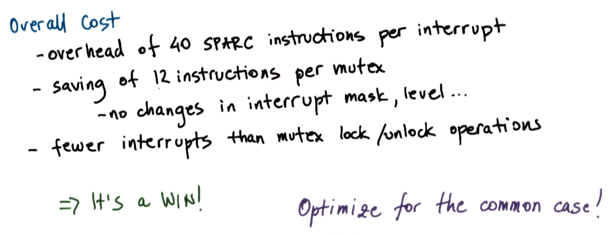
</center>

The **reason** that the paper describes the exercise of creating threads in order to handle interrupts is ultimately motivated by ***performance***.

The operations that are necessary to perform the appropriate checks and (if necessary) to create a separate thread to handle the interrupt incur an **overall cost/overhead** of around 40 SPARC instructions per interrupt-handling operation.

However, consequently, it is not necessary to repeatedly change the interrupt mask whenever a mutex is locked and then switch it back again when the mutex is subsequently unlocked, which saves around 12 instructions per mutex operations.

Because there are many fewer interrupts in the system than mutex lock/unlock operations, this is an overall **net winning** situation (i.e., the incurred amortized cost of the thread creations is outweighed by the relatively sparse occurrence of the interrupts).
  * This is a exemplary demonstration of ***optimizing for the common case***, an important lesson/concept in system design, with the **common case** here being the mutex lock/unlock operations, which are performed as efficiently as possible. The corresponding tradeoff cost (i.e., in order to prevent compromise of safety/correctness of the system) is incurred by the compensating thread creation.

## 28-32. Threads and Signal Handling

### 28. Introduction

Consider now the **interplay** between threads and the way in which signals must be handled.

<center>

</center>

In the Solaris threads implementation described in the reference papers, there is a **signal mask** associated with each **user-level thread**, which is part of the user-level process (i.e., is visible at the user-level library level). There is also a **signal mask** associated with the **kernel-level thread** (or, rather, the **light-weight process** that it is attached to); furthermore, this kernel-level mask is only visible at the kernel level.

<center>
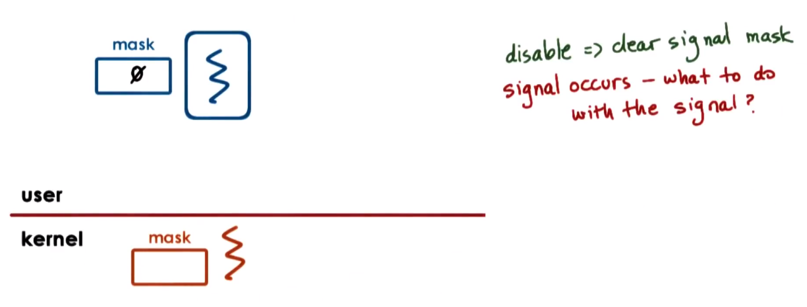
</center>

When a user-level thread must disable a signal, it clears the appropriate bit in the signal mask; this occurs at the user level (i.e., this mask is *not* visible to the kernel).

When the signal occurs, the kernel must be informed of what to do with the signal.

<center>
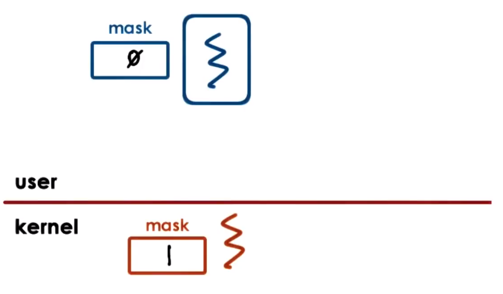
</center>

It is possible that the kernel-visible signal mask has that bit still set as `1`, and therefore the kernel thinks that the signal is *enabled* as far as this particular user process/thread is concerned.

In order to avoid having to make a system call to cross from the user level into the kernel level each time a user-level thread modifies the signal mask, it is necessary to devise a corresponding **policy**. The SunOS paper describing the lightweight user-level threading library proposes a **solution** for handling this situation.

To explain what is happening, let us now consider a sequence of different situations/cases.

### 29. Case 1

<center>
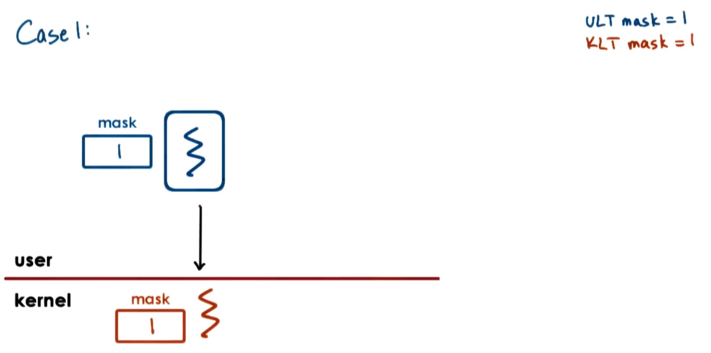
</center>

In Case 1, *both* the user-level signal mask *and* the kernel-level signal mask have the signal ***enabled***, with the user-level thread currently executing on the kernel-level thread.

When the signal occurs, there is no problem: The kernel detects that the signal is enabled, and consequently the kernel will interrupt the  user-level thread currently executing on top of the kernel-level thread. Because the user-level thread also has the signal enabled, the process will therefore be **safe**.

### 30. Case 2

<center>
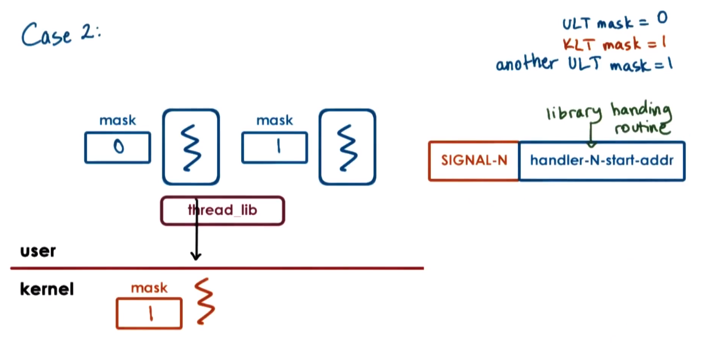
</center>

In Case 2, kernel-level mask is `1` (i.e., the kernel thinks that the overall user-level process can handle the signal). However, the user-level thread that is currently running on top of the kernel-level thread has the signal *disabled* (i.e., mask bit is `0`). Furthermore, there is *another* user-level thread that is currently in the run queue (i.e., is runnable, but not currently executing) which has its mask *enabled*.

The threading library that manages both of hte user-level threads is aware of *both* threads. Therefore, when a signal occurs at the kernel level, the kernel sees that the overall process knows how to handle this particular signal (and correspondingly has its bit set to `1`). However, it *should* be appropriate for the kernel to interrupt the user-level thread running on it (i.e., the currently running user-level thread with mask bit `0`/disabled).

The user-level thread library is aware of the other user-level thread (with bit `1`), which is capable of handling the signal. Recall that the way signals are handled is that when they interrupt the process (or, more precisely, the thread that is running in the process), the corresponding handling routine that must be executed is specified in the **signal handlers table**.

Therefore, an easy **solution** in this case is to have an associated **special library-handling routine** (which wrap the signal-handling routines) for all of the signals in the system, so that when a signal occurs, the corresponding library-provided handler begins executing (which in turn has visibility on the signal mask states for *all* of the user-level threads).
  * In this particular situation shown in the above figure, the user library can coordinate the signal (i.e., invoke the corresponding library-handling routine and library scheduler) to execute the *other* user-level thread (which has its signal mask set to `1` at the time that the signal occurs) on the kernel-level thread instead in order to handle the signal.

### 31. Case 3

<center>
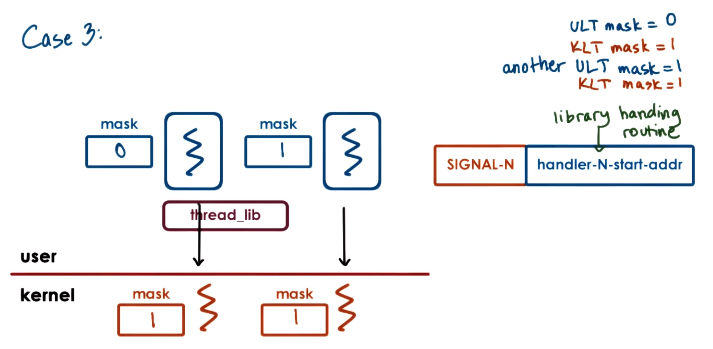
</center>

In Case 3, the user-level thread currently executing on top of the kernel-level thread where the signal actually occurs has its signal mask bit disabled (i.e., set to `0`). Furthermore, in the overall process, there is another user-level thread which has its signal mask bit enabled (i.e., set to `1`), but--unlike in Case 2 (where this latter user-level thread was on the run queue when the signal was generated)--it is currently running on another CPU/kernel-level thread when the signal is generated.

When the signal is delivered in the context of the corresponding kernel-level thread, the library-handling routine will intervene. The library-handling routine is aware that there is a user-level thread in the overall process that is capable of handling the particular signal in question, and furthermore it detects that the corresponding user-level thread is currently executing on top of another kernel-level thread (or, more precisely, a lightweight process that is managed by the user-level threading library).

<center>
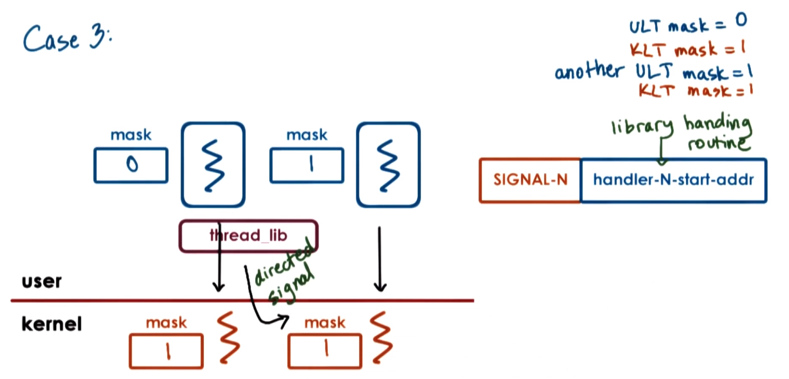
</center>

Consequently, due to this "awareness" of the user-level thread library, it generates a **directed signal** to the other kernel-level thread (i.e., to its associated lightweight process) where the other user-level thread is currently executing.

When the operating system delivers the signal to this particular kernel-level thread, it detects that the signal mask bit is enabled (i.e., set to `1`), and coordinates (via the associated library-handling routine) the execution of the appropriate signal handler. 

### 32. Case 4

<center>
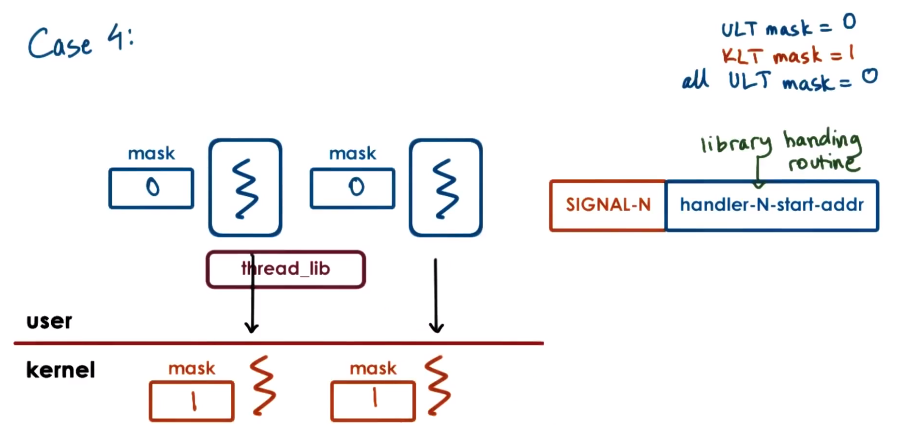
</center>

In Case 4, all user-level threads have a disabled signal mask bit (i.e., set to `0`) for the particular signal in question. Furthermore, the kernel-level threads are enabled (i.e., set to `1`), and therefore the kernel still thinks that the user process can handle this particular signal.

When the signal occurs in the kernel-level thread, the kernel detects that the kernel-level thread's signal mask bit is set to `1`, and therefore the kernel will interrupt the user-level thread currently executing in the context of the associated kernel-level thread. The library-handling routine is therefore dispatched, and detects that the user-level thread's signal mask bit is set to `0`, and that no other user-level threads are currently capable of handling this particular signal.

<center>

</center>

Consequently, the user-level threading library will perform a system call to request for the signal mask of the underlying kernel-level thread to be reset to `0`. Now, from the execution of one user-level thread, the state of the signal masks that are associated with the other kernel-level threads (which may be executing on other CPUs) can now be be affected.

Here, only the mask associated with the kernel-level thread which has been reset can be changed. Therefore, the user-level threading library will **reissue** the signal for the entire process again.

<center>

</center>

Now, the operating system will find another kernel-level thread associated with the user-level process which originally had its signal mask bit set to `1`, but is now `0` as well.

<center>
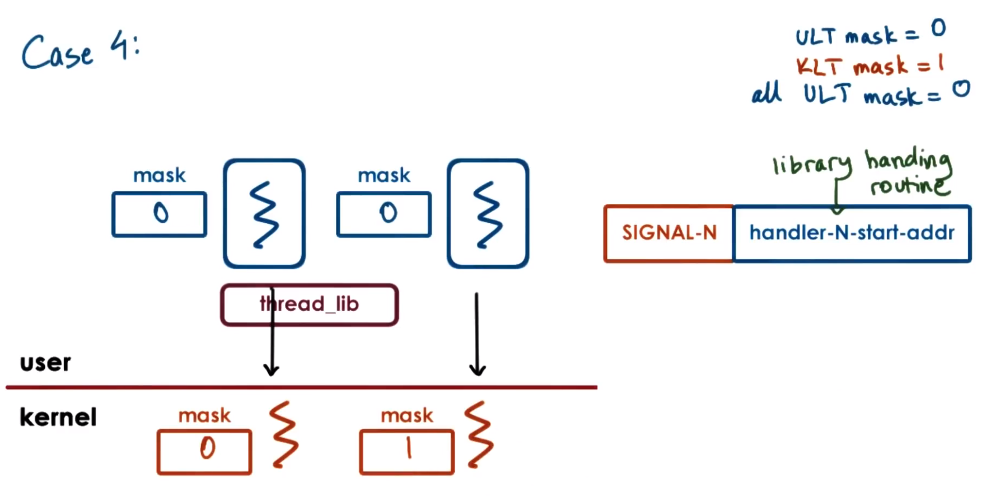
</center>

The operating system will consequently find a different kernel-level thread whose signal mask bit is set to `1`, and will signal in the context of this kernel-level thread, thereby interrupting the associated user-level thread (via the user-level threading library and corresponding library-handling routine).

<center>

</center>

Consequently, the kernel-level thread's signal mask bit will be reset to `0` as well.

The process will continue in this manner until all of the kernel-level threads have their signal mask bit set to `0`, i.e., the signal is now cleared/disabled for the overall user process.

Another possibility is that one of the user-level threads are ready to enable the signal mask again for the signal. Because the threading library is aware that it has already disabled all of the kernel-level signal masks, it will now need to perform a system call to the kernel in order to update the signal mask to `1` on one of the kernel-level threads to reflect that the user-level process is now capable of handling the signal.

#### Optimizing for the Common Case

The **solution** for how signal handling is managed and how interactions occur between the kernel and the user-level library is another exemplar of ***optimizing for the common case***:
  * Signals occur less frequently than do signal mask updates.
    * When entering a critical section of the code, signal mask updates can be performed relatively frequently (i.e., to ensure safety of the executing process/thread), while the corresponding signal occurs relatively infrequently.
  * Therefore, to decrease the cost of the common case (i.e., where there is no signal occurring), the relatively cheap signal mask update operation is only performed on the user-level signal masks, while avoiding a corresponding (relatively expensive) system call
    * This makes the signal handling logic more complex (i.e., more expensive), but this cost is justified with the overall improved performance via the corresponding reduction in system calls

## 32. Tasks in Linux

Finally, let us consider some aspects of the threading support provided in Linux.
  * Note that the current threading support in Linux is based on many "lessons learned" from earlier experiences with threads (e.g., those presented in the aforementioned Solaris papers)

Like most operating systems, Linux has an abstraction to represent processes, however, the main abstraction it uses to represent an execution context is called a **task**, represented by the corresponding structure `task_struct`. A task is essentially the execution context of a kernel-level thread.
  * A single-threaded process has *one* task
  * A multi-threaded process has *many* tasks (i.e., one per thread)


### `struct task_struct`

<center>
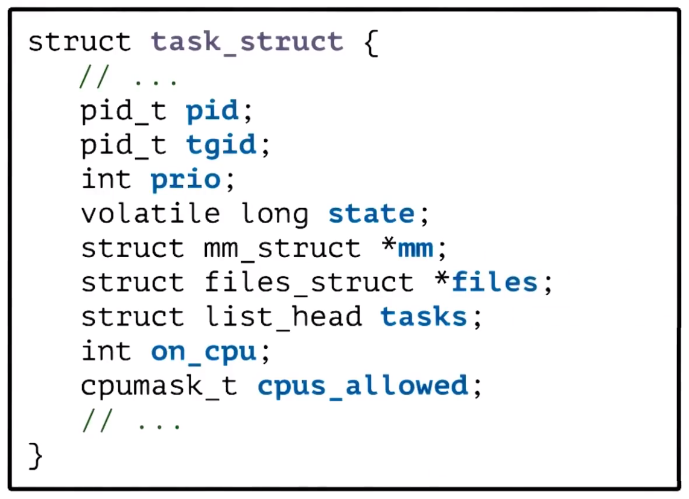
</center>

The figure above shows the key elements of the structure `task_struct`.
  * `pid` identifies the task (which, for historic reasons, is a slight misnomer via the prefix `p` corresponding to a "process")
    * In a single-threaded process (i.e., having one task), the `pid` is the same as the process id
    * In a multi-threaded process (i.e., having many tasks), each task is uniquely identified by `pid`. Furthermore, the process as a whole will be identified by the `pid` of the very first task that was created when the process was created, which in turn is also stored in the field `tgid` (task group id) among all of the tasks.
  * `tasks` maintains a list of tasks which are linked together via the single, common process (i.e., composed of the associated constituent threads) to which they belong
    * Therefore, the `pid` for the process can be determined by traversing `tasks`.
  * Having learned from previous implementation efforts (e.g., the aforementioned Solaris SunOS threads implementation), Linux has never had one, contiguous control block as described at the beginning of this course; instead, the process state has always been represented via a collection of **references** to data structures, which facilitates the ability for tasks in a single process to share some portions of the address space (e.g., virtual address mappings, files, etc.) 
    * `mm` is a reference to memory management
    * `files` is a reference to file management

***N.B.*** `task_struct` is a relatively large data structure, comprising a total of around 1.7 KB.

### Task Creation: `Clone()`

To create a new task, Linux supports the operation `clone()`, which resembles the following function signature (with analogous behavior to the previously seen thread creation routines):
```c
clone(function, stack_ptr, sharing_flags, arg)
```

<center>

</center>

The parameter `sharing_flags` is a bitmap that specifies which portion of the task's state will be **shared** between the parent and the child tasks. The figure above shows corresponding argument values that can be used to set this field; in particular, the effects of a given flag depend on whether the flag is being set or cleared.
  * For instance, when all of the flag bits are set, then a new child thread is being created, which shares *everything* (e.g., the address space) with the parent thread.
  * Conversely, if all of the sharing flags are cleared, then *nothing* is being shared between the child and parent threads, which is more similar to what occurs when forking a new process.
  * Otherwise, in some cases it is also sensible to use various combinations of set and unset flags (e.g., sharing only files between the parent and child tasks).

As a related aside, `fork()` is implemented internally in Linux via `clone()` (i.e., with all flags cleared).

Furthermore, in Linux (and POSIX-compliant operating systems in general), `fork()` has distinctly different semantics for multi-threaded vs. single-threaded processes.
  * In a single-threaded process, when forking, it is expected that the resulting child process is a *full* replica of the parent process.
  * Conversely, in a multi-threaded process, when forking, the child will be a single-threaded process (i.e., only a portion of the address space will be replicated, specifically that section which is visible from the parent thread/task that called `fork()`). This has many implications pertaining to synchronization (e.g., mutex management), however, this topic is beyond the scope of this course.

### Linux Threads Model

The current implementation of the Linux threads model is called the **Native POSIX Threads Library (NPTL)**, which is a 1:1 model (i.e., there is one kernel-level thread associated with each user-level thread).
  * ***N.B.*** NPTL replaces an older implementation called **LinuxThreads**, which was more similar to the many-to-many model, which in turn suffered from many of the same issues (e.g., complex signal management, etc.) described in the Solaris reference papers.

In NPTL, by virtue of the underlying 1:1 model, the kernel sees all of the information pertaining to each user-level thread (e.g., blocked/unblocked status for synchronization, signal mask status, etc.). This is made possible for two reasons:
  1. Kernel traps are much cheaper with a 1:1 model (i.e., the user-level to kernel-level crossing is comparatively faster in a 1:1 model rather than in a M:M model)
  2. Modern platforms have more resources (e.g., larger memories allowing for a relatively abundant amount of kernel-level threads, larger range of IDs which relaxes restrictions on uniquely identifying processes and tasks, etc.)

Nevertheless, when dealing with thread-management scenarios involving an extremely large number of threads (e.g., exascale computing) or complex platforms (e.g., having many different kinds of processors), it still makes sense to consider user-level library support, providing custom policies for thread management, etc. For practical purposes, however, the current 1:1 model in NPTL is sufficient.

## 34. Lesson Summary

This lesson reviewed two older papers pertaining to the Solaris SunOS operating system
  * Implementation insights for supporting user- and kernel-level threads
  * Historic perspective on Linux threading models

This lesson also introduced interrupts and signals, two important notification mechanisms which are supported by most modern operating systems.
