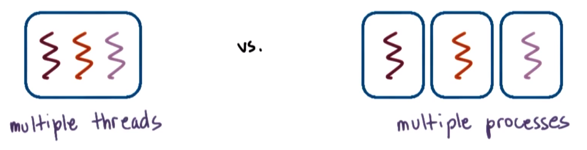
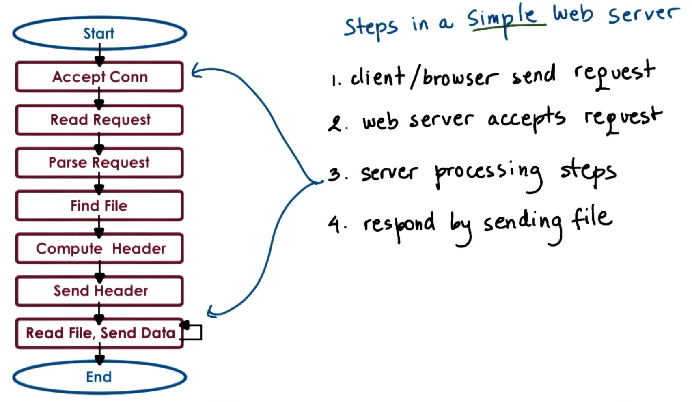
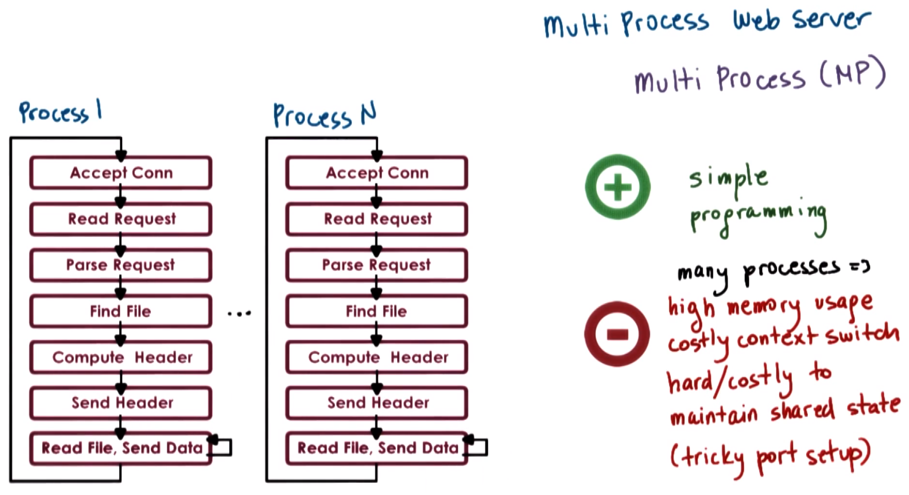
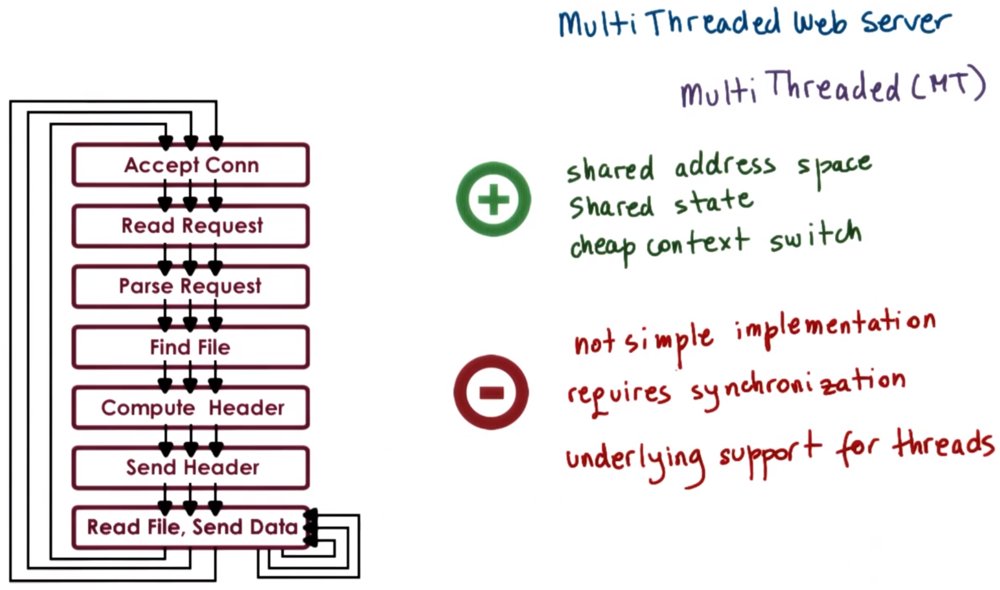
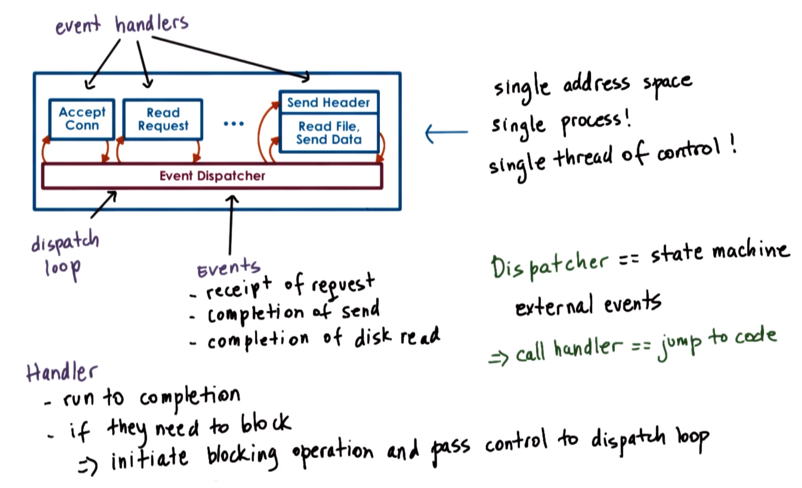
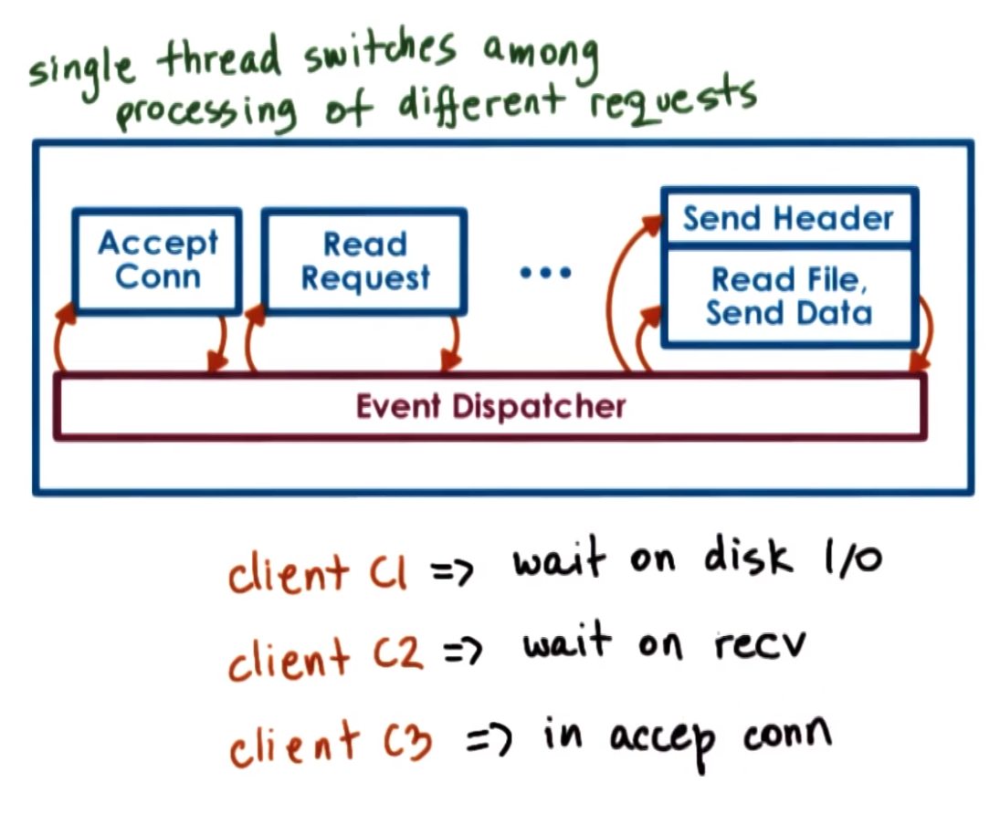
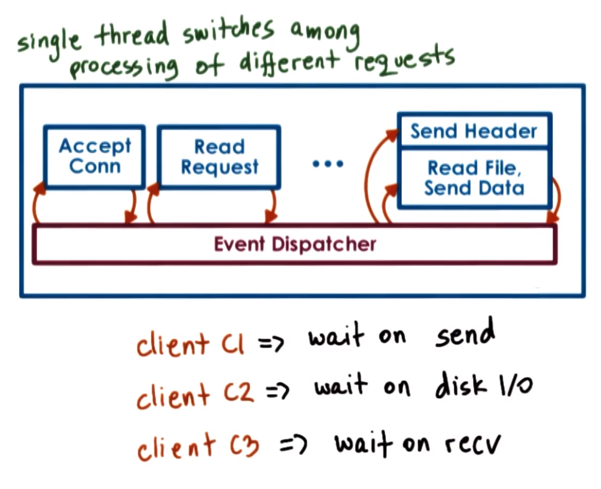
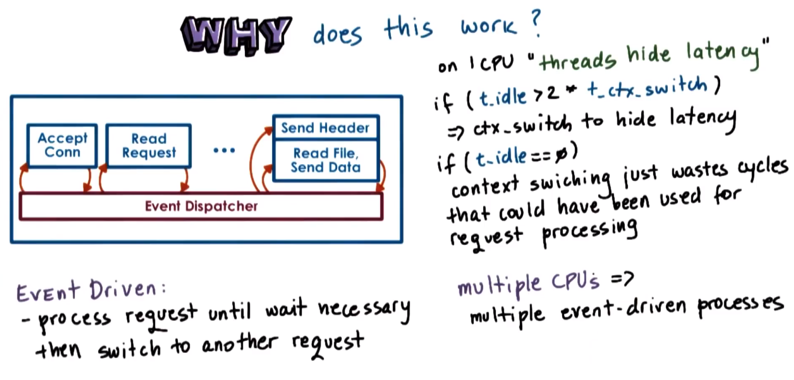

# P2L5: Thread Performance Considerations

## 1. Preview

This lecture will contrast several approaches for structuring applications that require concurrency
  * This will include a comparison between multi-process vs. multi-threaded vs. event-driven approaches

Additionally, this lectures's discussion will be based on the **event-driven models/architectures**, specifically Flash vs. Apache
  * Reference: Pai et al. "*Flash: An Efficient and Portable Web Server*." This paper describes the event-driven architecture Flash, and also includes detailed performance comparisons between multi-process, multi-threaded, and event-driven implementations of a Web server application
  * Additionally, Apache is a popular open source Web server that will be discussed towards the end of this lecture.

The lecture will conclude with a discussion on how to structure good experiments.

## 2. Which Threading Model Is Better?

Recall the comparison between the boss/workers and pipeline concurrency models (cf. P2L2 Section 40). As shown above, the total execution times to process 11 work orders are `360 ms` and `320 ms` (respectively).

Additionally, consider a comparison of the respective **average times** to complete the orders. Per the calculations shown above, these amount to `196 ms` and `220 ms` (respectively).

Therefore, for this particular configuration (i.e., 11 toy orders processed by 6 threads):
  * If minimizing the execution time is of importance (e.g., for the toy shop manager), then select the pipeline model
  * Otherwise, if minimizing the average time to completion is of importance (e.g., for the customers), then select the boss/workers model

***N.B.*** Changing the configuration (i.e., different number of threads and/or work orders) can affect these results, i.e., the analysis and conclusion ***depend on the metrics***.

## 3. Are Threads Useful?

At the beginning of P2L2, we asked: are threads useful?

Recall, there are a number of **reasons** why threads are indeed useful, e.g.,:
* **parallelization** - speed up execution
* **specialization** - hot cache via specialized threads
* **efficiency** - lower memory requirements and cheaper synchronization compared to equivalent multi-process implementations
* Even on a single CPU, threads are useful because they can hide the latency of I/O operations.

However, how did we draw these conclusions? (e.g., what resources were available in the system, what metrics were used for comparing implementations with/without threads, etc.)

### What is *Useful*?

To measure whether something is "useful" or not, this differs depending on what exactly is being measured.

For example:
  * For a matrix-multiplying application, the **execution time** is a key metric
  * For a Web service application:
    * The **number of client requests per-unit time** is a key metric for the server
    * The **response time** is a key metric for the client 
  * For a hardware chip (ie.g., CPU), **higher overall utilization** is a key metric

In the Web service application, useful metrics may include:
  * average time (a typical value)
  * maximum time (worst-case value)
  * minimum time (best-case value)
  * 95-percentile time (detect outliers)

Therefore, as these examples demonstrate, in order to evaluate a solution and to determine whether or not it is useful, it is important to determine the relevant **properties** (or **metrics**) that characterize the desired behavior.

## 4. Visual Metaphor

Let us now consider a visual metaphor for our discussion regarding metrics as follows:

| Characteristic | Optimization | Toy Shop | Operating Systems |
| :--: | :--: | :--: | :--: |
| throughput | maximize (as many as possible) | how many toys per hour? | process completion rate (i.e., the number of processes completed on a given platform per-unit time) |
| response time | minimize (as short as possible) | average time to react to a new order | average time to respond to an input (e.g., mouse click)  |
| utilization | maximize (ideally 100%)  | percentage of work benches in use over time  | percentage of CPU utilization (i.e., CPU, devices, memory, etc. are used efficiently, rather than persistently leaving a lot of unused/under-utilized resources) |

...and many more!

Therefore, metrics exist in virtually all systems, and accordingly it is imperative to have them be well-defined when attempting analyze the behavior of systems and how it compares to alternative solutions.

## 5-7. Performance Metrics

### 5. Introduction

As has been emphasized, performance considerations are focused on the metrics that we choose.

Ideally, **metrics** should be represented with values that we can ***measure*** and ***quantify***, preferably in a ***standardized*** manner. Correspondingly, the metric should be a measurable and/or quantifiable property.
  * A quantifiable metric allows to evaluate the system's behavior and/or to compare it to other systems
    * e.g., execution time
  * The metric itself should ***pertain*** to the **system** of interest
    * e.g., software implementation of a problem
  * The metric should be able to evaluate the system ***behavior***
    * e.g., improvement of the system compared to other implementations (i.e., over a range of meaningful parameters/dimensions such as varied workload, varied allocated resources, etc.)

### 6. Other Performance Metrics

So far, this lecture has mentioned several useful metrics (e.g., **execution time**, **throughput**, **response time/request rate**, and **CPU utilization**). Additionally, there are many other useful metrics to consider, e.g.,:
  * **wait time** - the user may not just care about when they *receive* a response, but also about when their request actually *begins* to execute
    * With a request/job involving many interactions, the sooner it starts, the sooner the user can proceed with these interactions
    * With a long-running request/job, the sooner it starts, the sooner the user is able to diagnose issues that can occur (e.g., to stop, re-configure, and re-launch)
  * **throughput** - how many tasks are completed per-unit time
    * In addition to helping to evaluate the utility of a platform, throughput can be relevant in the context of both a single machine (e.g., server) as well as a collection of machines (e.g., an entire data center)
  * **platform efficiency** - a combination of how well resources are utilized and how well they deliver the corresponding throughput
    * This is an additional metric (i.e., in addition to throughput) that is useful to assess large, complex systems (e.g., an entire data center)
    * There is a ***trade-off*** between throughput (i.e., revenue generation) and resource usage (i.e., incurred cost for additional machines, personnel, etc.)
  * A corollary to platform efficiency is assessing performance with respect to a ***particular resource***, e.g.,:
    * **performance per-unit cost** (e.g., per $) - operating cost
    * **performance per-unit power** (e.g., per Watt) - energy consumption
  * **percentage of service level agreement (SLA) violations** - determine if customer requirements are being met adequately
    * Service level agreements (e.g., guaranteed response within 3 seconds, guaranteed 95% accuracy of quotes, etc.) are typically used in enterprise applications to fulfill customer requirements 
  * **client-perceived performance** - assessing the customer experience
    * For certain applications, there is some "slack" in the requirements, e.g., in a regular video application, humans can only perceive up to 30 frames per second, therefore improving performance beyond this frame rate is unnecessary for this use case--rather, it is sufficient to simply ensure a frame rate of *at least* 30 frames per second is maintained
  * Furthermore, it may be useful to consider more ***holistic assessments***, e.g.,:
    * **aggregate performance** - Rather than focusing on the performance of an *individual* application, a more complex system may require assessment of average/aggregate performance across the system (e.g., average task time, weighted averages based on priorties of tasks, etc.)
    * **average resource usage** - In addition to CPU utilization, it may be useful to measure other resources (e.g., memory, file system, storage sub-system, etc.)

### 7. Summary

In summary, a **metric** is some ***measurable quantity*** that we can use to reason about the behavior of the system. Ideally, these metrics are obtained from:
  * **experiments** with real software deployment, real machines, real workloads, etc.
    * However, sometimes this is not an option (e.g., we cannot wait to actually deploy the software to before we begin measuring something about it and/or analyzing its behavior)
  * **'toy' experiments** using ***representative, realistic*** settings/configurations that mimic the real behavior of the system as much as possible (e.g., similar access patterns, similar types of machines, etc.)
  * supplemental **simulation** if necessary (e.g.,, if using toy experiments), such as creating an environment that mimics a larger system that is feasible to achieve with a smaller experiment/simulation

Any of these methods represent viable settings whereby one can evaluate a system and gather some performance metrics about it. Such experimental settings are referred to as a **testbed**.
  * A testbed indicates where the experiments were carried out and what were the relevant metrics that were measured

## 8. Are Threads *Really* Useful?

Returning to the question "*are threads useful?*" (recall Section 3), we realize now that the answer is not so straightforward; rather, it depends on the **metrics** and on the **workload**!

In the **toy shop** example, depending on the workload (i.e., different number of toy orders) and the corresponding metric, it led to the conclusion that a different implementation of the toy shop (i.e., a different way to organize its workers) was a better one.

In other domains, such as **graphs** and **graphs processing**, depending on the type of the graph in question (e.g., how well-connected it is), it may be suitable to choose a correspondingly different type of shortest-path algorithm. Here, the graph type is equivalent to the "workload."
  * Some shortest-path algorithms are known to work well on ***densely*** connected graphs
  * Other shortest-path algorithms work better for ***sparsely*** connected graphs

When comparing **file systems**, an important consideration may be is the **file patterns**, e.g.:
  * Some file systems may be optimized for predominantly ***read accesses***
  * Other file systems may be optimized for a mixed workload (e.g., *both* ***reading*** and ***updating***)

The larger **point** that transcends these particular examples is that in order to answer "the" question of whether something is better than an alternative implementation or algorithm is always the same: ***it depends***!

Correspondingly, the answer to the question of whether or not threads are *really* useful is: it depends (i.e., on the context in which we are trying to answer this particular question). Indeed, for practical purposes, this is (almost) *always* the correct answer, particularly when dealing with systems.
  * In fact, the contrary (i.e., a particular implementation/design is *always better*) is **not** an acceptable one in this course!

For the remainder of this lecture, we will attempt to answer more specifically whether threads *are* indeed useful, and particularly when are threads more or less useful when comparing a ***multithreaded-based implementation*** of a problem to some alternatives. Additionally, guidance will be provided for how to define some useful **metrics**, as well as how to structure **experimental evaluations** so that such metrics can be correctly ***measured***.

## 9. Multi-Process vs. Multi-Threaded

### How to Best Provide Concurrency?

To understand when threads *are* useful, let us consider the different ways to provide concurrency, as well as the tradeoffs among those implementations.

So far, discussion has focused around **multi-threaded** applications. Additionally, an application can be implemented by having multiple concurrently running processes (i.e., **multi-process**). (***N.B.*** This was also noted briefly in P2L2.)

To make the discussion of the comparison between these two models more concrete, we will perform this analysis in the context of a **Web server**. For a Web server, a **key feature** is the ability to concurrently process client requests.

### Example: Web Server

Before proceeding, let us consider the steps involved in the operation of a *simple* Web server.

1. The client (or browser) needs to send a request that the Web server will accept (e.g., to `www.gatech.edu`)

2. The Web server (e.g., `www.gatech.edu`) accepts the request

3. After the Web server accepts the request, there are a number of **processing steps** it must perform before finally providing the response (e.g., a **file**)
    * Read and parse an HTTP request
    * Find the file in the local file system (i.e., on the server side)
    * Compute the header
    * Send the header
    * Send the file, or potentially send an error message (e.g., "file not found") via the header

***N.B.*** The remainder of this lecture will focus on these processing steps. Also, note that there are differences among these steps, e.g.,:
  * Some of them are more computationally expensive, with most of the work being performed by the CPU (e.g., parsing the request and computing the header)
  * Others require interaction with the network (e.g., accepting the connection, reading the request, and sending the data) or with the disk (e.g., finding the file and reading the file)
  * Furthermore, some of these steps may potentially **block**; whether or not they block depends on the state of the system at a particular point in time (e.g., the connection may be already pending, the data for the file may already be cached in memory due to a previous request, etc.)
    * In these cases, this will not result in an actual call to the device (i.e., an invocation to the network or disk, respectively), and consequently will be serviced much more quickly

4. The Web server responds by sending the file or corresponding error message, thereby completing the overall process

## 10. Multi-Process Web Server

(adapted from Pai et al. Figure 2)

One easy way to achieve **concurrency** is to have *multiple instances* of the *same* process, i.e., a **multi-process** implementation.

The **benefit** of this approach is that it is ***simple***: Once the sequence of steps has been correctly developed for *one* process, this is generalized by simply spawning *multiple* processes of this same sequence.

There are some **drawbacks** to this approach of running multiple processes in a platform, however.
  * Each process requires memory allocation, thereby adding a high load on the memory sub-system and a consequent adverse impact on performance.
  * Given that these are processes, there is an associated cost with performing context switches among the processes.
  * It can be expensive to maintain **shared state** across the processes, because the communication mechanisms and the synchronization mechanisms that are available across processes are relatively higher in overhead.
  * In some cases, it may be tricky to perform certain tasks (e.g., forcing multiple processes to be able to respond to a single address and to share a single socket port)

## 11. Multi-Threaded Web Server

(adapted from Pai et al. Figure 3)

An alternative to the multi-process model is to develop a Web server as a **multi-threaded** application, having multiple execution contexts (i.e., multiple threads within the same address space, with every single one of them processing a request).
  * In the figure shown above, every single one of the threads executes *all* of the steps, starting with the "Accept Connection" operation all the way down to actually sending the file.
  * Another possibility is to have the Web server implemented as a boss/workers model, wherein a single boss thread performs the "Accept Connection" operation, and then subsequently every single one of the workers performs the remaining operations (i.e., from reading of the HTTP requests that comes in on that connection all the way down to sending the file).

The **benefits** of the multi-threaded approach are as follows:
  * The threads share the **address space** (i.e., everything within it), thereby precluding the necessity to perform system calls in order to coordinate with other threads (unlike in the multi-process model).
  * Context switching between the threads is relatively cheap, because it can be done at the user level (i.e., via the user-level threading library).
  * Since a lot of the per-thread **state** is shared among the threads, it is not necessary to allocate memory for *everything* that is required for each of their respective execution contexts (i.e., due to the shared address space). Consequently, the memory requirements are relatively lower in this approach.

The **drawback** of this approach is that it is not simple/straightforward to implement the multi-threaded program, i.e.,:
  * Requires explicit synchronization among the threads (e.g., during access and update of the shared state)
  * There is a reliance on the underlying operating system for it to support threads in the first place. While this is less of an issue with modern operating systems (many of which are multi-threaded already), this was indeed a non-trivial issue contemporaneously with the time period in which the Flash paper (Pai et al.) was written, and is therefore nevertheless an argument to be addressed in the present discussion.

## 12-16. Event-Driven Model

### 12. Introduction

Consider now an alternative model for structuring Web server applications that perform concurrent processing, called the **event-driven model**.

(adapted from Pai et al. Figure 4)

An event-driven application can be characterized as shown in the figure above. The application is implemented in a single address space, having a single process, and only a single thread of control.

The main part of the process is an **event dispatcher** that continuously (i.e., in a loop) looks for incoming **events**, and then based on those events the event dispatcher invokes one or more 
of the registered **event handlers**.

Examples of **events** include:
  * Receipt of the request from the client/browser
  * Completion of the send operation
  * Completion of the disk read operation

The event dispatcher has the ability accept any of these types of event notifications, and then based on their notification type it can invoke the appropriate event handler. In this respect, the event handler operates much like a **state machine** responding to external events.

Since (as described here) this model pertains to a single-threaded process, invoking an event handler is tantamount to jumping to the appropriate location in the process's address space where the event handler is implemented, at which point the event-handler execution can proceed.
  * For example, if the process is notified that there is a pending connection request on the network (i.e., via the corresponding network port), the event dispatcher will pass that event to the "Accept Connection" event handler.
  * Similarly, if the event is the receipt of a data message on an already established connection, then the event dispatcher will pass that to the "Read Request" event handler.
  * Once the file name is extracted from the request and it is confirmed that the file is present, the process will send out the file in chunks, and then once there is a confirmation that the chunks/portions of the file have been successfully sent, it will proceed iteratively in this manner (i.e., via the corresponding event handler responsible for the send operation) until the entire file is sent, or until an error is encountered and a corresponding error message is sent to the client

Therefore, whenever events occurs, the event handlers are the sequence of code that executes in response to the corresponding events.

A **key feature** of the event handlers is that they run to completion. Furthermore, if the handler must perform a **blocking** operation, it initiates the blocking operation and then immediately passes control back to the event dispatcher (i.e., the process is no longer in the handler), at which point the event dispatcher is now free to service other events or to call other event handlers.

### 13. Concurrent Execution in the Event-Driven Model

At this point, it may seem that if the event-driven model has just *one* thread, then it is  unreasonable to expect to achieve concurrency.

Recall that in the multi-process and multi-threaded models, *each* execution context (i.e., process or thread, respectively) handles only *one* request at a time, and therefore to achieve concurrency, *multiple* execution contexts are used accordingly. Furthermore, if there are fewer CPUs than available threads, then there must be context switching among the threads.

Conversely, the event-driven model achieves concurrency by **interleaving** multiple requests within the *same* execution context. Accordingly, in the event-driven model, the single thread switches its execution for the required processing among the different requests at any given time.

Consider a client request `C1` entering the system. It starts with the "Accept Connection" event, and proceeds through the events sequence. Once it reaches the event pertaining to reading the file from the server, I/O is initiated. At this point, `C1`'s request is waiting on the disk I/O operation to complete on the server side.

In the meantime, two additional client requests `C2` and `C3` are received. If `C2` was received first, it will eventually wait on `recv()` (i.e., an event from the network) to receive the HTTP response header from the server. At this point, if `C3` is received, it will begin at the "Accept Connections" handler.

At some later time point, the processing of all three requests will have proceeded along the sequence of events, e.g.,:
  * `C3`'s connection was accepted, and now it is waiting on `recv()` for the server response header
  * `C2` is now waiting on disk I/O on the server side (i.e., reading the file to send the data)
  * `C1` is now waiting on `send()`, receiving the file from the server in chunks

Therefore, as this example demonstrates, while there is only *one* execution context (i.e., a single thread), it is able to service multiple client requests concurrently in an interleaved manner.

### 14. Event-Driven Model: Why?

An immediately arising question is: *Why* does the event-driven model work? And, what is the benefit of having only a *single* thread that switches between different requests, rather than simply assigning different requests to different execution contexts (i.e., to different threads or to different processes).

Recall from the introductory lecture on threads (cf. P2L2) that even on one CPU, threads **hide latency**.
  * The main takeaway from that discussion (cf. P2L2 Section 5) is that if a thread will wait more than twice the amount of time that it takes to perform a context switch (i.e., if `t_idle > 2 * t_ctx_switch`), then it makes sense to perform the context switch to another thread that will perform some useful work in the meantime, thereby hiding latency.
  * Conversely, if there truly is no idle time (i.e., if `t_idle == 0`, such as if the processing of the request does not result in some type of blocking operation [e.g., I/O] on which it must wait), then context switching simply wastes cycles that otherwise could have been use for processing the requests, and therefore it is not sensible to perform the context switch in the first place.

Therefore, in the event-driven model, the request is processed (in the context of a single thread) until it is necessary to wait, and then it switches to another request.

If there are multiple CPUs available, the event-driven model is still sensible, especially when it is necessary to handle more concurrent requests than the number of available CPUs.
  * For example, each CPU can host a single event-driven process, and then handle multiple concurrent requests within that one context. Furthermore, this could be done with less overhead than if each of the CPUs otherwise had to context switch among multiple processes (or multiple threads), where each is handling a separate request.
  * There is one **caveat** here, however: It is important to have **mechanisms** in place that will direct the correct set of events to the appropriate CPU (i.e., at the appropriate instance of the event-driven process), otherwise the operation will be incorrect.
    * ***N.B.*** There are mechanisms available to achieve this, as well as current support in networking hardware, however, this is beyond the scope of the present discussion.

### 15. Event-Driven Model: How?

