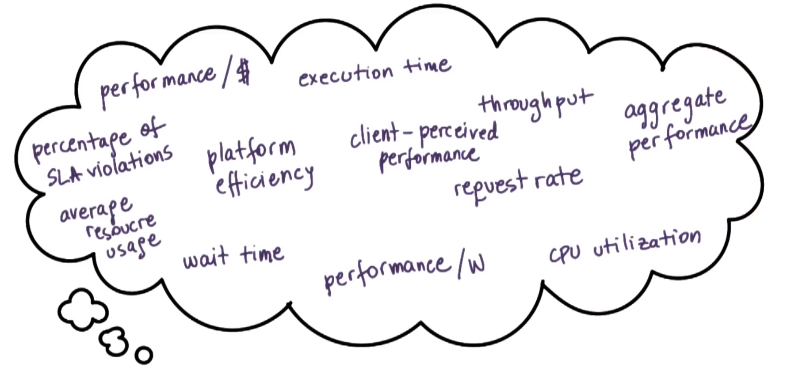
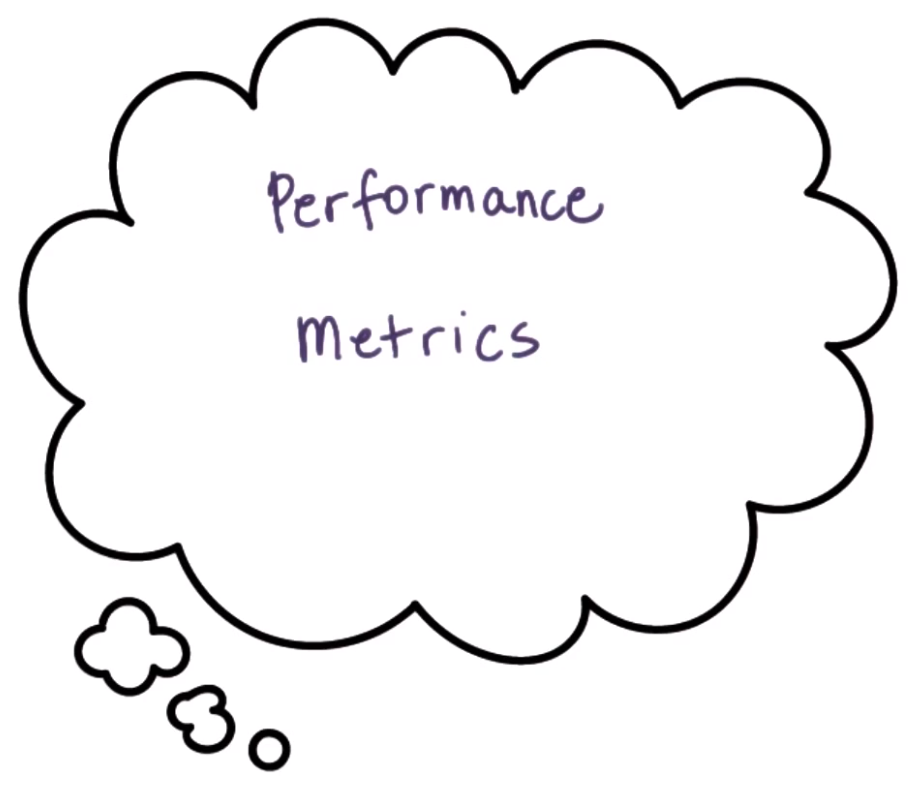

# P2L5: Thread Performance Considerations

## 1. Preview

This lecture will contrast several approaches for structuring applications that require concurrency
  * This will include a comparison between multi-process vs. multi-threaded vs. event-driven approaches

Additionally, this lesson's discussion will be based on the **event-driven models/architectures**, specifically Flash vs. Apache
  * Reference: Pai et al. "*Flash: An Efficient and Portable Web Server*." This paper describes the event-driven architecture Flash, and also includes detailed performance comparisons between multi-process, multi-threaded, and event-driven implementations of a Web server application
  * Additionally, Apache is a popular open source Web server that will be discussed towards the end of this lecture.

The lecture will conclude with a discussion on how to structure good experiments.

## 2. Which Threading Model Is Better?

Recall the comparison between the boss/workers and pipeline concurrency models (cf. P2L2 Section 40). As shown above, the total execution times to process 11 work orders are `360 ms` and `320 ms` (respectively).

Additionally, consider a comparison of the respective **average times** to complete the orders. Per the calculations shown above, these amount to `196 ms` and `220 ms` (respectively).

Therefore, for this particular configuration (i.e., 11 toy orders processed by 6 threads):
  * If minimizing the execution time is of importance (e.g., for the toy shop manager), then select the pipeline model
  * Otherwise, if minimizing the average time to completion is of importance (e.g., for the customers), then select the boss/workers model

***N.B.*** Changing the configuration (i.e., different number of threads and/or work orders) can affect these results, i.e., the analysis and conclusion ***depend on the metrics***.

## 3. Are Threads Useful?

At the beginning of P2L2, we asked: are threads useful?

Recall, there are a number of **reasons** why threads are indeed useful, e.g.,:
* **parallelization** - speed up execution
* **specialization** - hot cache via specialized threads
* **efficiency** - lower memory requirements and cheaper synchronization compared to equivalent multi-process implementations
* Even on a single CPU, threads are useful because they can hide the latency of I/O operations.

However, how did we draw these conclusions? (e.g., what resources were available in the system, what metrics were used for comparing implementations with/without threads, etc.)

### What is *Useful*?

To measure whether something is "useful" or not, this differs depending on what exactly is being measured.

For example:
  * For a matrix-multiplying application, the **execution time** is a key metric
  * For a Web service application:
    * The **number of client requests per-unit time** is a key metric for the server
    * The **response time** is a key metric for the client 
  * For a hardware chip (ie.g., CPU), **higher overall utilization** is a key metric

In the Web service application, useful metrics may include:
  * average time (a typical value)
  * maximum time (worst-case value)
  * minimum time (best-case value)
  * 95-percentile time (detect outliers)

Therefore, as these examples demonstrate, in order to evaluate a solution and to determine whether or not it is useful, it is important to determine the relevant **properties** (or **metrics**) that characterize the desired behavior.

## 4. Visual Metaphor

Let us now consider a visual metaphor for our discussion regarding metrics as follows:

| Characteristic | Optimization | Toy Shop | Operating Systems |
| :--: | :--: | :--: | :--: |
| throughput | maximize (as many as possible) | how many toys per hour? | process completion rate (i.e., the number of processes completed on a given platform per-unit time) |
| response time | minimize (as short as possible) | average time to react to a new order | average time to respond to an input (e.g., mouse click)  |
| utilization | maximize (ideally 100%)  | percentage of work benches in use over time  | percentage of CPU utilization (i.e., CPU, devices, memory, etc. are used efficiently, rather than persistently leaving a lot of unused/under-utilized resources) |

...and many more!

Therefore, metrics exist in virtually all systems, and accordingly it is imperative to have them be well-defined when attempting analyze the behavior of systems and how it compares to alternative solutions.

## 5-7. Performance Metrics

### 5. Introduction

As has been emphasized, performance considerations are focused on the metrics that we choose.

Ideally, **metrics** should be represented with values that we can ***measure*** and ***quantify***, preferably in a ***standardized*** manner. Correspondingly, the metric should be a measurable and/or quantifiable property.
  * A quantifiable metric allows to evaluate the system's behavior and/or to compare it to other systems
    * e.g., execution time
  * The metric itself should ***pertain*** to the **system** of interest
    * e.g., software implementation of a problem
  * The metric should be able to evaluate the system ***behavior***
    * e.g., improvement of the system compared to other implementations (i.e., over a range of meaningful parameters/dimensions such as varied workload, varied allocated resources, etc.)

### 6. Other Performance Metrics

So far, this lecture has mentioned several useful metrics (e.g., **execution time**, **throughput**, **response time/request rate**, and **CPU utilization**). Additionally, there are many other useful metrics to consider, e.g.,:
  * **wait time** - the user may not just care about when they *receive* a response, but also about when their request actually *begins* to execute
    * With a request/job involving many interactions, the sooner it starts, the sooner the user can proceed with these interactions
    * With a long-running request/job, the sooner it starts, the sooner the user is able to diagnose issues that can occur (e.g., to stop, re-configure, and re-launch)
  * **throughput** - how many tasks are completed per-unit time
    * In addition to helping to evaluate the utility of a platform, throughput can be relevant in the context of both a single machine (e.g., server) as well as a collection of machines (e.g., an entire data center)
  * **platform efficiency** - a combination of how well resources are utilized and how well they deliver the corresponding throughput
    * This is an additional metric (i.e., in addition to throughput) that is useful to assess large, complex systems (e.g., an entire data center)
    * There is a ***trade-off*** between throughput (i.e., revenue generation) and resource usage (i.e., incurred cost for additional machines, personnel, etc.)
  * A corollary to platform efficiency is assessing performance with respect to a ***particular resource***, e.g.,:
    * **performance per-unit cost** (e.g., per $) - operating cost
    * **performance per-unit power** (e.g., per Watt) - energy consumption
  * **percentage of service level agreement (SLA) violations** - determine if customer requirements are being met adequately
    * Service level agreements (e.g., guaranteed response within 3 seconds, guaranteed 95% accuracy of quotes, etc.) are typically used in enterprise applications to fulfill customer requirements 
  * **client-perceived performance** - assessing the customer experience
    * For certain applications, there is some "slack" in the requirements, e.g., in a regular video application, humans can only perceive up to 30 frames per second, therefore improving performance beyond this frame rate is unnecessary for this use case--rather, it is sufficient to simply ensure a frame rate of *at least* 30 frames per second is maintained
  * Furthermore, it may be useful to consider more ***holistic assessments***, e.g.,:
    * **aggregate performance** - Rather than focusing on the performance of an *individual* application, a more complex system may require assessment of average/aggregate performance across the system (e.g., average task time, weighted averages based on priorties of tasks, etc.)
    * **average resource usage** - In addition to CPU utilization, it may be useful to measure other resources (e.g., memory, file system, storage sub-system, etc.)

### 7. Summary

In summary, a **metric** is some ***measurable quantity*** that we can use to reason about the behavior of the system. Ideally, these metrics are obtained from:
  * **experiments** with real software deployment, real machines, real workloads, etc.
    * However, sometimes this is not an option (e.g., we cannot wait to actually deploy the software to before we begin measuring something about it and/or analyzing its behavior)
  * **'toy' experiments** using ***representative, realistic*** settings/configurations that mimic the real behavior of the system as much as possible (e.g., similar access patterns, similar types of machines, etc.)
  * supplemental **simulation** if necessary (e.g.,, if using toy experiments), such as creating an environment that mimics a larger system that is feasible to achieve with a smaller experiment/simulation

Any of these methods represent viable settings whereby one can evaluate a system and gather some performance metrics about it. Such experimental settings are referred to as a **testbed**.
  * A testbed indicates where the experiments were carried out and what were the relevant metrics that were measured

## 8. Are Threads *Really* Useful?

Returning to the question "*are threads useful?*" (recall Section 3), we realize now that the answer is not so straightforward; rather, it depends on the **metrics** and on the **workload**!

In the **toy shop** example, depending on the workload (i.e., different number of toy orders) and the corresponding metric, it led to the conclusion that a different implementation of the toy shop (i.e., a different way to organize its workers) was a better one.

In other domains, such as **graphs** and **graphs processing**, depending on the type of the graph in question (e.g., how well-connected it is), it may be suitable to choose a correspondingly different type of shortest-path algorithm. Here, the graph type is equivalent to the "workload."
  * Some shortest-path algorithms are known to work well on ***densely*** connected graphs
  * Other shortest-path algorithms work better for ***sparsely*** connected graphs

When comparing **file systems**, an important consideration may be is the **file patterns**, e.g.:
  * Some file systems may be optimized for predominantly ***read accesses***
  * Other file systems may be optimized for a mixed workload (e.g., *both* ***reading*** and ***updating***)

The larger **point** that transcends these particular examples is that in order to answer "the" question of whether something is better than an alternative implementation or algorithm is always the same: ***it depends***!

Correspondingly, the answer to the question of whether or not threads are *really* useful is: it depends (i.e., on the context in which we are trying to answer this particular question). Indeed, for practical purposes, this is (almost) *always* the correct answer, particularly when dealing with systems.
  * In fact, the contrary (i.e., a particular implementation/design is *always better*) is **not** an acceptable one in this course!

For the remainder of this lecture, we will attempt to answer more specifically whether threads *are* indeed useful, and particularly when are threads more or less useful when comparing a ***multithreaded-based implementation*** of a problem to some alternatives. Additionally, guidance will be provided for how to define some useful **metrics**, as well as how to structure **experimental evaluations** so that such metrics can be correctly ***measured***.

## 9. Multi-Process vs. Multi-Threaded

### How to Best Provide Concurrency?

