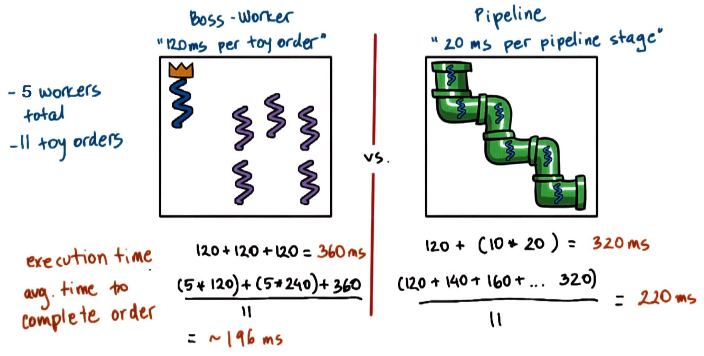
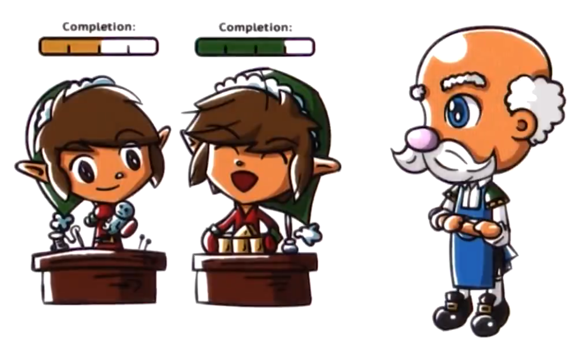

# P2L5: Thread Performance Considerations

## 1. Preview

This lecture will contrast several approaches for structuring applications that require concurrency
  * This will include a comparison between multi-process vs. multi-threaded vs. event-driven approaches

Additionally, this lesson's discussion will be based on the **event-driven models/architectures**, specifically Flash vs. Apache
  * Reference: Pai et al. "*Flash: An Efficient and Portable Web Server*." This paper describes the event-driven architecture Flash, and also includes detailed performance comparisons between multi-process, multi-threaded, and event-driven implementations of a Web server application
  * Additionally, Apache is a popular open source Web server that will be discussed towards the end of this lecture.

The lecture will conclude with a discussion on how to structure good experiments.

## 2. Which Threading Model Is Better?

Recall the comparison between the boss/workers and pipeline concurrency models (cf. P2L2 Section 40). As shown above, the total execution times to process 11 work orders are `360 ms` and `320 ms` (respectively).

Additionally, consider a comparison of the respective **average times** to complete the orders. Per the calculations shown above, these amount to `196 ms` and `220 ms` (respectively).

Therefore, for this particular configuration (i.e., 11 toy orders processed by 6 threads):
  * If minimizing the execution time is of importance (e.g., for the toy shop manager), then select the pipeline model
  * Otherwise, if minimizing the average time to completion is of importance (e.g., for the customers), then select the boss/workers model

***N.B.*** Changing the configuration (i.e., different number of threads and/or work orders) can affect these results, i.e., the analysis and conclusion ***depend on the metrics***.

### 3. Are Threads Useful?

At the beginning of P2L2, we asked: are threads useful?

Recall, there are a number of **reasons** why threads are indeed useful, e.g.,:
* **parallelization** - speed up execution
* **specialization** - hot cache via specialized threads
* **efficiency** - lower memory requirements and cheaper synchronization compared to equivalent multi-process implementations
* Even on a single CPU, threads are useful because they can hide the latency of I/O operations.

However, how did we draw these conclusions? (e.g., what resources were available in the system, what metrics were used for comparing implementations with/without threads, etc.)

#### What is *Useful*?

To measure whether something is "useful" or not, this differs depending on what exactly is being measured.

For example:
  * For a matrix-multiplying application, the **execution time** is a key metric
  * For a Web service application:
    * The **number of client requests per-unit time** is a key metric for the server
    * The **response time** is a key metric for the client 
  * For a hardware chip (ie.g., CPU), **higher overall utilization** is a key metric

In the Web service application, useful metrics may include:
  * average time (a typical value)
  * maximum time (worst-case value)
  * minimum time (best-case value)
  * 95-percentile time (detect outliers)

Therefore, as these examples demonstrate, in order to evaluate a solution and to determine whether or not it is useful, it is important to determine the relevant **properties** (or **metrics**) that characterize the desired behavior.

## 4. Visual Metaphor

Let us now consider a visual metaphor for our discussion regarding metrics as follows:

| Characteristic | Optimization | Toy Shop | Operating Systems |
| :--: | :--: | :--: | :--: |
| throughput | maximize (as many as possible) | how many toys per hour? | process completion rate (i.e., the number of processes completed on a given platform per-unit time) |
| response time | minimize (as short as possible) | average time to react to a new order | average time to respond to an input (e.g., mouse click)  |
| utilization | maximize (ideally 100%)  | percentage of work benches in use over time  | percentage of CPU utilization (i.e., CPU, devices, memory, etc. are used efficiently, rather than persistently leaving a lot of unused/under-utilized resources) |

...and many more!

Therefore, metrics exist in virtually all systems, and accordingly it is imperative to have them be well-defined when attempting analyze the behavior of systems and how it compares to alternative solutions.

## 5. Performance Metrics Introduction

