# P3L1: Scheduling

## 1. Preview

This lecture will discuss in detail the key **resource management** components in operating systems.

First, the lecture will examine how the operating system manages CPUs, and how it decides how processes and their threads will get to execute on those CPU. This activity is performed by the **scheduler**.

The lecture will review some the **scheduling mechanisms**, **algorithms**, and **data structures** used by the scheduler.

This lecture will also examine in more detail some of the scheduling algorithms used in the Linux operating system (e.g., **O(1)** and the **Completely Fair Scheduler (CFS)**).

This lecture will also examine certain aspects of scheduling that are common for **multi-CPU platforms**, including multi-core platforms as well as platforms with hardware-level multi-threading (e.g., pay-per-chip multi-threaded processors, which require a new operating system scheduler) in order to demonstrate some of the more **advanced features** that modern schedulers should incorporate.

## 2. Visual Metaphor

This lecture will be discussing at length regarding scheduling and operating system schedulers.

Continuing with the visual metaphor, consider some of the **issues** that arise with respect to operating system scheduling.

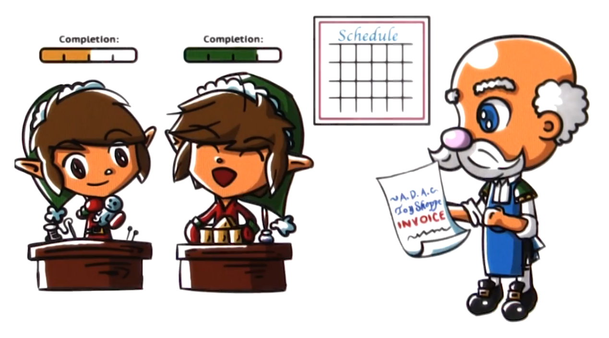

Returning to the toy shop an analogy, like an **operating system scheduler**, a **toy shop manager** schedules work in the toy shop. There are multiple ways in which the toy shop manager can schedule the toy shop orders and dispatch them to workers in the toy shop. The motivation for each of these choices is based on some of the high-level goals of the manager and how he wants to manage the shop (i.e., how to utilize the shop's resources).

| Toy Shop Manager Characteristic | Description |
| :--: | :--: |
| Dispatch orders immediately | Scheduling is simple (e.g., **first-in, first-out (FIFO)**), giving rise to low scheduling overhead|
| Dispatch simple orders first | If the objective is for the total number of orders processed per-unit time, then the objective is to maximize the number of orders processed over time; this requires additional processing by the manager for incoming orders (e.g., assessing simple vs. complex orders) |
| Dispatch complex orders first | Since each workbench in the shop may have a variety of tools (which may be underutilized by simple orders), if the objective is to keep all available resources at the workbenches as busy as possible, then the manager ensures to schedule complex orders as soon as they arrive, and if simple orders arrive subsequently, then the workers can suspend work on the complex orders and perform the simple orders, and then return to completing the complex orders |

| Operating System Characteristic | Description |
| :--: | :--: |
| Assign tasks immediately | Scheduling is simple (e.g., **first-come, first-serve (FCFS)**), thereby reducing overhead in the CPU scheduler itself |
| Assign simple tasks first | If the objective is to maximize throughput, then perform tasks with the shortest running time first (e.g., **shortest job first (SJF)**) |
| Assign complex tasks first | If the objective is to maximize utilization of the platform's resources (e.g., CPU(s), devices, memory, etc.), then perform complex tasks first |

***N.B.*** Here, a **task** refers to a thread or process in the context of an operating system scheduler, which schedules the tasks onto the CPUs (analogous to the workbenches in the toy shop) that the scheduler manages.

As this lecture proceeds, it will discuss some of the options to consider when designing **algorithms** such as the aforementioned, as well as various aspects of the **design** and **implementation** of operating system schedulers.

## 3. CPU Scheduling Overview

**CPU scheduling** was briefly discussed in a previous lecture on processes and process management (cf. P2L2).

Recall that a **CPU scheduler** decides ***how*** and ***when*** **processes** (and their constituent **threads**) access **shared CPUs** in the system. In this lecture, the term **task** will be use to refer to processes and thread interchangeably, since the same kinds of mechanisms are valid in both of these contexts.

The CPU scheduler concerns the scheduling of *both* **user-level processes/threads** as well as **kernel-level threads**.

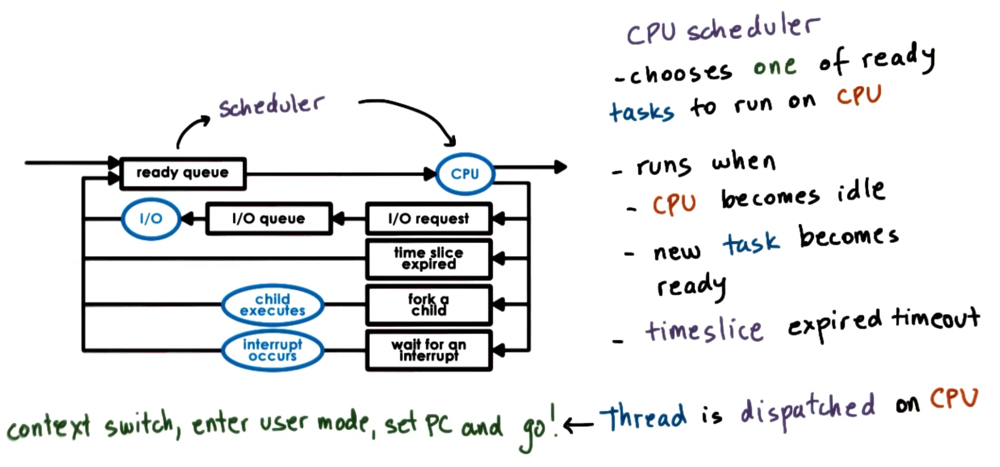

Recall (cf. P2L2, regarding processes and process scheduling) that the key **responsibility** of the CPU scheduler is to select ***one*** of the tasks in the **ready queue** to be scheduled to run on the CPU. As per the figure shown above, tasks may become ready (i.e., they may enter the ready queue) after a blocking I/O operation completes, after a blocking interrupt completes, after being created via fork from a parent process, or after a time slice expires (i.e., it is removed from the shared CPU due to its alloted time on the CPU expiring in order to allow another task to use the CPU).

Therefore, in order to perform scheduling, the CPU scheduler will assess all of the tasks currently in the ready queue to determine which *one* it will dispatch to run the CPU next.
  * Whenever the CPU becomes **idle**, the CPU scheduler must run (e.g., if the scheduled task makes an I/O request and consequently leaves the CPU abruptly to enter the I/O request queue, then the CPU is now idle). The **objective** of the CPU scheduler in this case is to select another task from ready queue as soon as possible in order to **minimize** this idle time on the CPU.
  * Furthermore, whenever a **new task** becomes ready (i.e., is available on the ready queue), the CPU scheduler must be run. The **objective** of the CPU scheduler in this case is to check whether any of the tasks are of relatively high **priority**/**importance** (and therefore should interrupt the currently executing task on the CPU).
  * A common way in which a CPU is shared among the tasks by the CPU scheduler is to assign each task in the system a **timeslice** (i.e., an allotted amount of time in residence on the CPU), such that when the timeslice expires, then the running task is consequently removed from the CPU, thereby initiating a subsequent scheduling operation for the next task.

Once the CPU scheduler selects a task to be scheduled, the task is consequently **dispatched** onto the CPU. This involves the following sequence of events:
  1. A **context switch** (i.e., entering the context of the newly selected task)
  2. Enter **user mode**
  3. Set the **program counter** to the appropriate next-executing instruction from the newly selected task
  4. Proceed with execution of the new task on the CPU

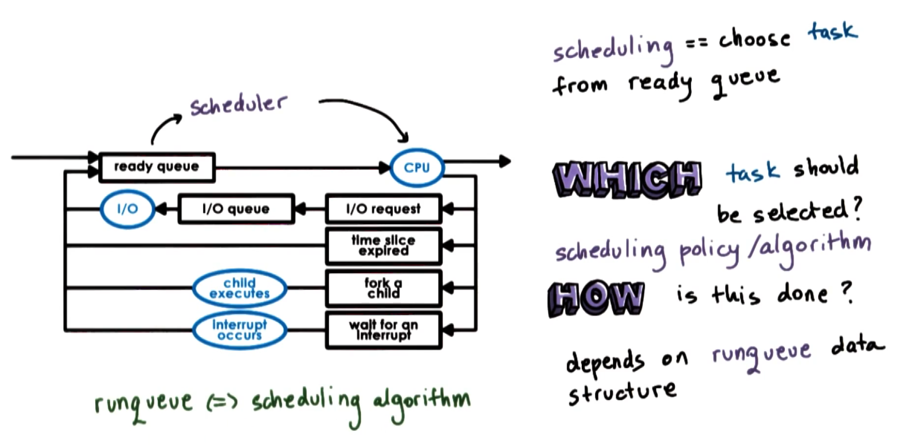

In summary, the **objective** of the **CPU scheduler** is to select the next **task** to run from the **ready queue**.

To achieve this objective, ***which*** task should be selected?
  * This will depend on the particular **scheduling policy/algorithm** that is executed by the CPU scheduler. (Several such algorithms will be described next in this lecture.)

Furthermore, ***how*** is this accomplished (i.e., how are these scheduling algorithms performed)?
  * The details of the CPU scheduler's implementation are highly dependent on the **runqueue** data structure used to implement the ready queue.

Therefore, the design of the runqueue and of the corresponding scheduling algorithm are ***tightly coupled***, as will be discussed in this lecture.
  * Certain scheduling algorithms demand a different type of runqueue data structure
  * Similarly, the design of the runqueue can limit types of scheduling algorithms that it is able to support efficiently.

## 4. "Run-to-Completion" Scheduling

### Introduction: Run-to-Completion Scheduling Algorithms

For the initial discussion of scheduling algorithms, first consider the algorithm called **run-to-completion scheduling**, which assumes that as soon as a task is assigned to a CPU, it will run until the task is completed.

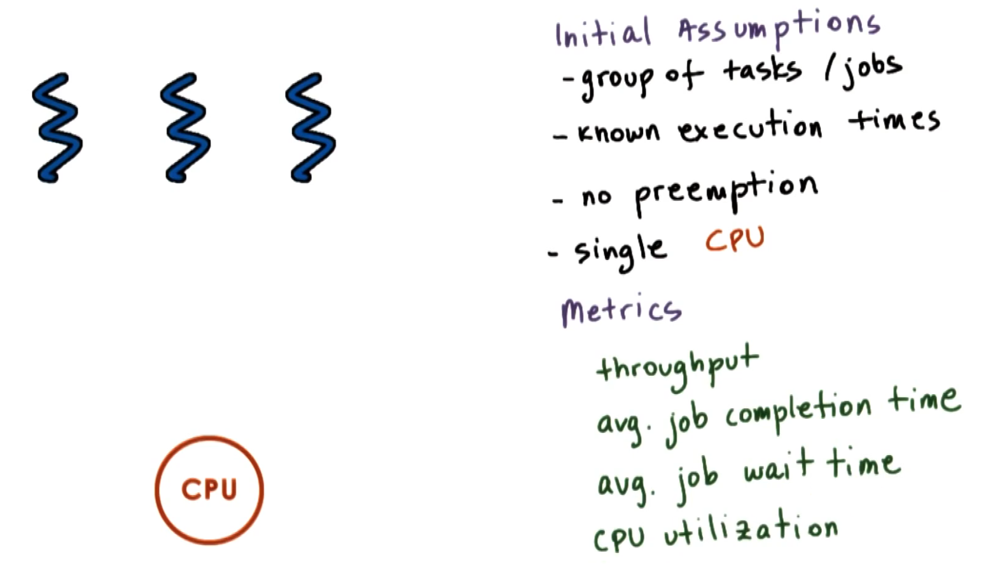

With respect to this algorithm, the following **initial assumptions** will be made:
  * There is a **group** of tasks to be scheduled
    * ***N.B.*** The terms "tasks," "jobs," and "threads" can be used interchangeably in this context.
  * It is known exactly how much time is required (i.e., the **execution time**) for each task to execute
  * There is **no preemption** in the system once the task begins to run (i.e., it will ***run to completion***, without interruption or preemption to run another task instead)
  * There is a *single* CPU available

***N.B.*** We will relax these requirements as the lecture progresses.

Since this lecture will examine various different scheduling algorithms, it will be important to be able to compare them, therefore, we must consider useful **metrics** for this purpose. With respect to comparing scheduling algorithms, some pertinent metrics include the following:
  * **throughput**
  * **average job completion time**
  * **average job wait time**
  * **CPU utilization**

### First-Come, First-Server (FCFS)

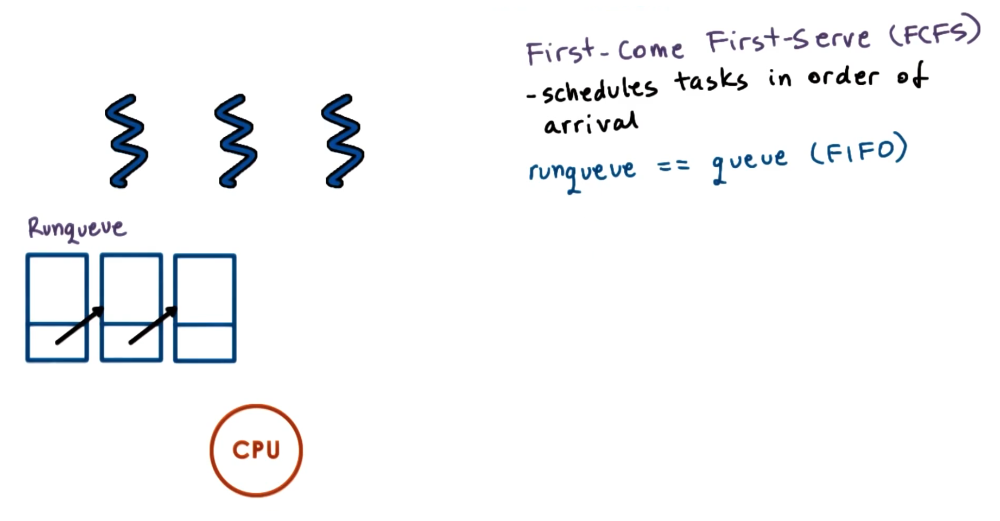

In the **First-Come, First Serve (FCFS)** scheduling algorithm (the simplest run-to-completion scheduling algorithm), tasks are scheduled on the CPU in the same order in which they arrival, regardless of their execution time, the system load, etc. When the task completes, the CPU scheduler will select the next-in-line task.

A useful way to organize the tasks is to use a first-in, first-out (FIFO) queue structure, whereby a newly arriving task is placed at the back of the queue, and the CPU scheduler selects the next task from the front of the queue. Correspondingly, to make these decisions, the CPU scheduler must only know the location of the queue's **head** as well as how to **dequeue** tasks from the queue structure. Therefore, for FIFO scheduling, a **FIFO queue** is a suitable runqueue data structure.

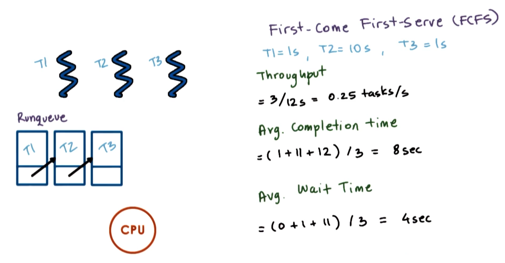

Consider a scenario where tasks `T1`, `T2`, and `T3` have the execution times `1s`, `10s`, and `1s` (respectively). Furthermore, the tasks arrive in the order `T1 (first) -> T2 -> T3 (last)` (i.e., the order in which the tasks are placed in the runqueue).

Evaluating the corresponding metrics gives the following:
  * ***throughput***
    * `3 tasks / (1 + 10 + 1) s = 0.25 tasks/s`
  * ***average completion time***
    * `(1 + 11 + 12) s / 3 tasks = 8 s/task`
      * `T1` completes in `1s`, which is immediately followed by execution of `T2` taking `10s` to complete (for a total completion time of `1 + 10 = 11s`, including the prior execution time of `T1`), and then finally `T3` completes execution in `1s` (in total `1 + 10 + 1 = 12s`, including the prior execution times of `T1` and `T2`)
  * ***average wait time***
    * `(0 + 1 + 11) s / 3 tasks = 4 s/task`
      * `T2` waits `1s` for `T1` to complete in order to proceed with execution, and similarly `T3` waits `10s` for `T2`

Given this simple scheduling algorithm, we can achieve better performance with respect to these metrics using other algorithms, as discussed next.

### Shortest Job First (SJF)

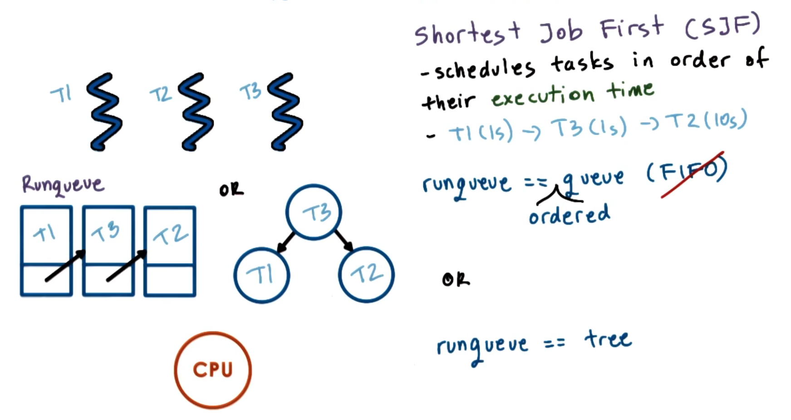

Observe that in the first-come, first serve scheduling algorithm, while it is simple, the average wait time for the tasks is poor, even with only a single "long" task occurring in the system (e.g., `T2`) ahead of relatively shorter tasks (e.g., `T3`).

To deal with this issue, another scheduling algorithm called **Shortest Job First (SJF)** schedules tasks in order of their ***execution time***, with ***shortest*** tasks executing ***first*** (e.g., via the previous example, `T1 (first) -> T3 -> T2 (last)`, where the tie between `T1` and `T3` is broken arbitrarily).

In order to organize the **runqueue** in a similar manner as before (i.e., as a FIFO queue), **adding** new tasks simply involves adding tasks at the tail of the queue, as before. However, when **scheduling** the tasks, the entire queue must be traversed in order to determine which task has the shortest execution time; therefore, the runqeue will no longer be a FIFO queue if adding new tasks in this manner, since addition and removal of tasks will not generally occur in order of placement in the runqueue.

One solution to this issue is to maintain the runqueue as an **ordered queue**, whereby placement of newly arriving tasks is done in a specified order. This makes the insertion operation into the queue more complex, however, this will restore the desired property of a FIFO queue, whereby the shortest task is always located at the head of the queue.

Furthermore, it is not necessary to use a queue data structure at all, but rather the runqueue can be a **tree-like data structure**, whereby the **nodes** representing the tasks are ordered within the tree structure in order of their execution time. When inserting a new node/task into the tree, the tree may need to be rebalanced, however, the CPU scheduler will simply select the left-most node/task to find the shortest-execution-time task.

Therefore, it is not strictly necessary to use a queue data structure for the runqueue; other data structures (e.g., trees) may be more appropriate for a particular scheduling algorithm.

## 5. SJF Performance Quiz and Answers

Consider an analysis of the performance of the shortest job first (SJF) scheduling algorithm. Assume that SJF is used to schedule the tasks `T1`, `T2`, and `T3`. Furthermore, assume the following:
  * The CPU scheduler does not preempt tasks (i.e., a run-to-completion model is used).
  * The known execution times are as follows: `T1 = 1s`, `T2 = 10s`, `T3 = 1s`
  * All three tasks arrive into the system at the same time, `t = 0s`

Calculate the throughput, average completion time, and average wait time via the SJF algorithm.
  * **throughput**
    * `3 tasks / (1 + 1 + 10) s = 0.25 tasks/s`
      * via ordering `T1 (first) -> T3 -> T2 (last)`
  * **average completion time**
    * `(1 + 2 + 12) s / 3 tasks = 5 s/task`
      * via ordering `T1 (first) -> T3 -> T2 (last)`
  * **average wait time**
    * `(0 + 1 + 2) s / 3 tasks = 1 s/task`
      * via ordering `T1 (first) -> T3 -> T2 (last)`

***N.B.*** Observe that the average completion time and average wait time are shorter compared to the first-come, first serve scheduling algorithm (cf. Section 4).

Reference equations:
* throughput

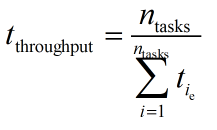

* average completion time

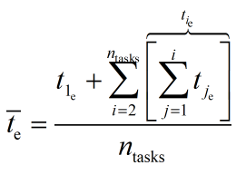

* average wait time

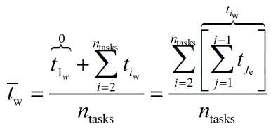

where *`n`*`tasks` is the number of tasks, *`t`*`e` is the total (cumulative) execution time for a task (i.e., relative to time `t = 0`), and *`t`*`w` is a wait time for a task.
  * ***N.B.*** *`i`* and *`j`* are indices denoting specific tasks, where both *`i`* and *`j`* are indexed in the ***order*** of the tasks' executions (e.g., *`i`* and *`j`* represent indices `1`, `2`, and `3` for tasks `T1`, `T3`, and `T2` (respectively) in this quiz's example). Correspondingly, index variables *`t`**`i`* and *`t`**`j`* denote these tasks' single-task execution times (e.g., `1s`, `1s`, and `10s` for tasks `T1`, `T3`, and `T2` (respectively) in this quiz's example).

## 6-7. Preemptive Scheduling

Up to this point, the discussion has assumed that the currently executing task on the CPU *cannot* be interrupted (i.e., cannot be preempted). Let us now *relax* this assumption/requirement and consider **preemptive scheduling**, wherein tasks do not have exclusive use of the CPU for the entire duration of their execution (i.e., they *can* be interrupted).

### 6. Shortest Job First (SJF) + Preempt

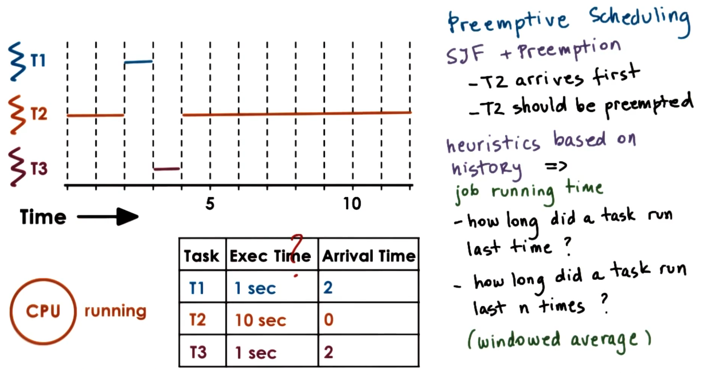

First, consider preemption in conjunction with the shortest job first (SJF) scheduling algorithm.

Here, let us additionally relax the assumption that all tasks arrive at the same time (i.e., time `t = 0 s`), but rather the tasks can **arrive** at ***arbitrarily different*** times. Furthermore, the initial assumption that the tasks' respective execution times are known still holds.

In the figure shown above, task `T2` arrives first (i.e., at time `t = 0s`). Therefore, upon arrival, the CPU scheduler detects `T2` and schedules it to run on the CPU immediately.

Upon arrival of tasks `T1` and `T3` at time `t = 2s`, `T2` is preempted due to the shortest job first scheduling algorithm (i.e., `T2`'s execution time is comparatively larger than both `T1` and `T3`).

The subsequent execution therefore occurs as in the time plot in the figure shown above. To achieve this behavior, whenever a new task(s) enter the runqueue (e.g., `T1` and `T3` at time `t = 2s`), the CPU scheduler must be invoked in order to inspect the execution times of the tasks and consequently decide whether or not to preempt the currently executing task (e.g., `T2` immediately prior to time `t = 2s`).

While it is assumed here that the execution time for each task is known, in practice it is difficult to determine this a priori, as this is influenced by many factors (e.g., input dependencies for the task, presence/absent of the task's data in the cache, which other tasks are running in the system, etc.).

Therefore, in principle, it is necessary to employ certain **heuristics** based on the task's history in order to estimate the execution time for the task in question. With respect to the *future* execution time of the task, a useful heuristic is to use the task's **past running time**, e.g.,:
  * How long did a task run in the most recent execution?
  * How long did a task run for the last `n` executions?
    * This can be used to to determine an average over a period of time, over a number of past executions, etc. Such an averaging over a defined time interval is called a **windowed average**.

### 7. Priority Scheduling

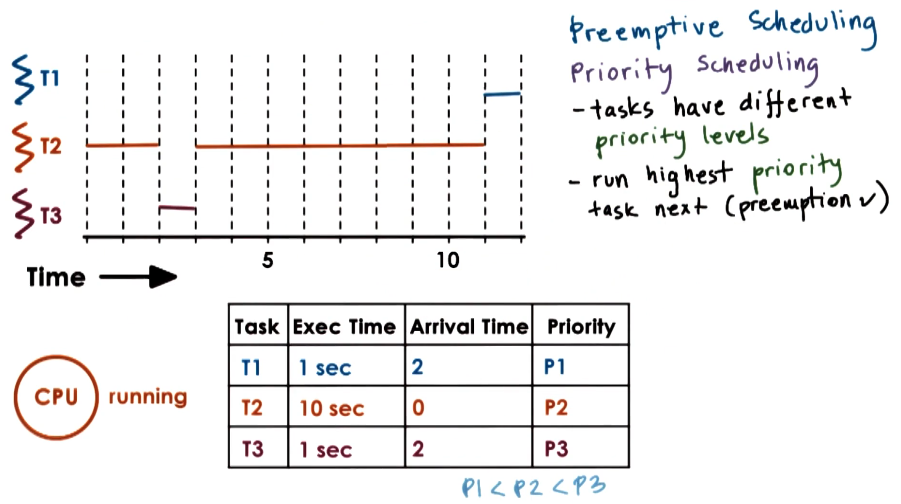

While the shortest job first (SJF) scheduling algorithm considers the task(s) with the shortest execution time(s) in order to determine tasks scheduling (i.e., by appropriate preemption as necessary), another key **criterion** for making these decisions involves whether the tasks have different **priorities**.

Tasks having different **priority levels** is a common scenario in scheduling problems (e.g., certain operating system kernel-level threads may have tasks with higher priority than other threads supporting user-level processes; within a user-level process, threads which monitor user input events may have relatively higher priority compared to other threads performing background processing or long-running simulations; etc.).

In such scenarios, the CPU scheduler must be able to run the **highest priority** task next, including capability for potential preemption of the currently running task if necessary.

Returning to the previous example, consider now the scenario which includes priority scheduling as in the figure shown above, whereby tasks `T1`, `T2`, and `T3` have priorities `P1`, `P2`, and `P3` (respectively) such that `P1 (lowest) < P2 < P3 (highest)`.

As before, the process begins with task `T2` executing immediately upon arrival at time `t = 0s`. Upon arrival of tasks `T1` and `T3` at time `t = 2s`, based on the relative priorities of these tasks, `T2` is preempted to permit the higher-priority task `T3` to execute.

Once `T3` completes execution, `T2` is now of relatively highest priority and proceed with completing execution, followed by `T1` (which executes last).

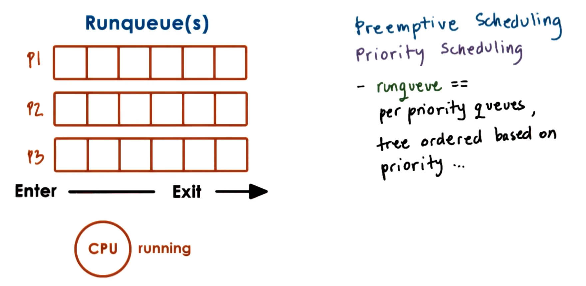

In practice, the CPU scheduler must be able to quickly assess not just the current group of runnable tasks, but also their respective relative priorities (i.e., for determination of which task to run at any given time).
  * This can be achieved via **multiple priority queues** as the runqueue, with one per priority level. Consequently, the CPU scheduler can select a task from the runqueue at the highest priority level first, followed by the next highest priority level, etc.
  * Alternatively, this can also be achieved via an **ordered data structure** (e.g., tree) as the runqueue, whereby the ordering is with respect to the priorities (rather than with respect to the execution time, as in the tree data structure for the shortest job first scheduling algorithm [cf. Section 4])

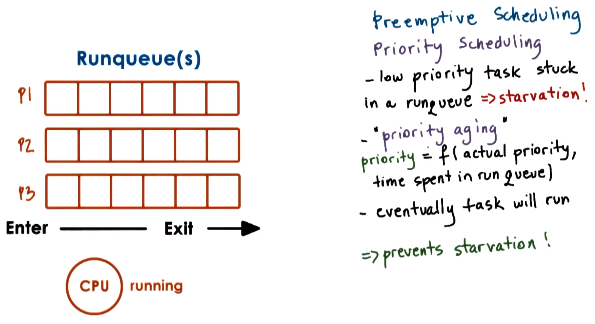

One **danger** with priority scheduling is a condition called **starvation**, whereby the low priority task(s) is stuck in the runqueue indefinitely due to persistent arrival of relatively higher priority tasks to the runqueue.

One **mechanism** to mitigate starvation is called **priority aging**, whereby the priority of the task itself is not fixed, but rather is a function of both its intrinsic priority level as well as the elapsed time spent in the runqueue, with the latter factor increasing in weight/importance as time progresses.

## 8. Preemptive Scheduling Quiz and Answers

Consider now the performance metrics for a preemptive CPU scheduler.

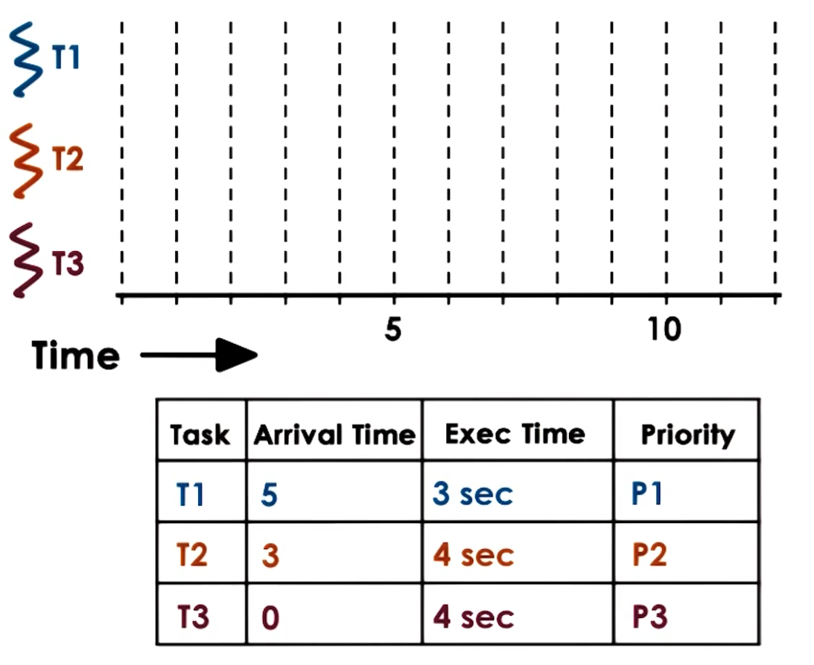

An operating system scheduler uses a priority-based scheduling algorithm with preemption to schedule tasks. Given the values shown in the table above, determine the finishing times of each task. Assume that the priorities are `P3 (lowest) < P2 < P1 (highest)`.
  * `T1` finishes at:
    * `t = 8s`
  * `T2` finishes at:
    * `t = 10s`
  * `T3` finishes at:
    * `t = 11s`

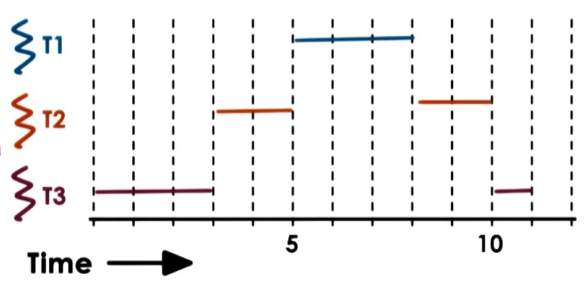

The time plot for these tasks is as shown in the figure above, which is described by the following sequence of events:
  1. `T3` arrives first, and executes for `3s` (`1s` remaining to complete `T3`).
  2. At time `t = 3s` `T2` arrives, and `T3` is preempted to allow `T2` to run. `T2` runs for `2s` (`2s` remaining to complete `T2`).
  * At time `t = 5s` `T1` arrives, and `T2` is preempted to allow `T1` to run. `T1` runs for `3s` to completion.
  * At time `t = 8s` (upon completion of `T1`), `T2` and `T3` remain in the runqueue. Since `T2` has relatively higher priority, it is scheduled to run, and subsequently runs to completion.
  * Finally, at `t = 10s`, `T3` is scheduled to run, and subsequently runs to completion.

## 9. Priority Inversion

An interesting phenomenon called **priority inversion** occurs when priorities are introduced into the scheduling.

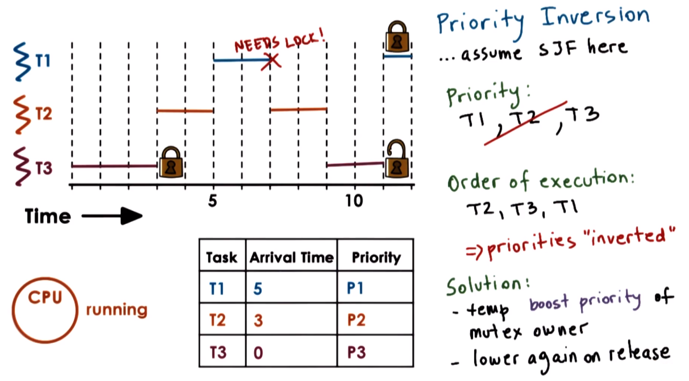

Consider the configuration described in the figure shown above, which assumes a shortest job first (SJF) scheduling algorithm. Here, the priorities are: `P3 (lowest) < P2 < P1 (highest)`. For simplicity, the execution times are omitted, but can be assumed to have some finite duration extending beyond the time scale of the shown time plot.

The sequence of events is as follows:
  1. Initially, `T3` is the only task present in the system. At time `t = 3s`, `T3` acquires a lock.
  2. At time `t = 3s`, `T2` arrives, and since `T2` has a higher priority than `T1`, `T3` is preempted to allow for `T2`'s execution.
  3. At time `t = 5s`, `T1` arrives, and since `T1` has a higher priority than `T2`, `T2` is preempted to allow for `T1`'s execution.
  4. `T1` executes for `2s`, at which point it reaches a point in its execution where it must acquire the lock held by `T3`.
  5. Since the lock is not accessible by `T1`, `T1` is put on a wait queue associated with the lock, and the next highest priority task `T2` is consequently scheduled to execute.
  6. At time `t = 9s`, `T2` completes execution, and since `T3` is the only *runnable* task at this point, `T3` proceeds with execution.
  7. At time `t = 11s`, `T3` releases the lock, thereby allowing for the higher priority `T1` to proceed with execution; consequently, `T3` is preempted, and `T1` acquires the lock and executes.

Based on this sequence, the ***expected priority*** is `T1 (highest) > T2 > T3 (lowest)`. However, the ***actual order of execution*** that occurs is `T2`, `T3`, `T1`. Therefore, the priorities of the tasks are **inverted**.

A **solution** to this inversion problem is to temporarily **boost** the priority of the mutex owner (e.g., at time `t = 7s`, rather than executing `T2`, boost the priority of `T3` to the level of `T1` in order to allow `T3` to execute and eventually free the lock so that `T1` can proceed, rather than performing the intermediate switch to `T2` first instead).
  * This technique in particular demonstrates the importance of tracking the current owner of the mutex (e.g., in the corresponding mutex data structure), as this information allows to perform such coordination in the first place.
  * Furthermore, note that such boosting generally should only be performed ***temporarily*** (e.g., after `T3` releases the lock, it should be restored to its original low priority level).

***N.B.*** This boosting technique is used commonly in many operating systems today.

## 10. Round Robin Scheduling

When it comes to running tasks that have the ***same*** priority level, there are other options available in addition to the first-come, first-serve (FCFS) or shortest job first (SJF) scheduling algorithms discussed so far.

A popular option is the so-called **round robin scheduling** algorithm, as demonstrated in the figure shown above. Here, there are three tasks `T1`, `T2`, and `T3`, with all three having the *same* priority and entering the system at the same time (i.e., time `t = 0s`), and consequently entering the runqueue.

With round robin scheduling, the first task is selected from the head of the queue (e.g., `T1`), similarly to the first-come, first serve (FCFS) scheduling algorithm.

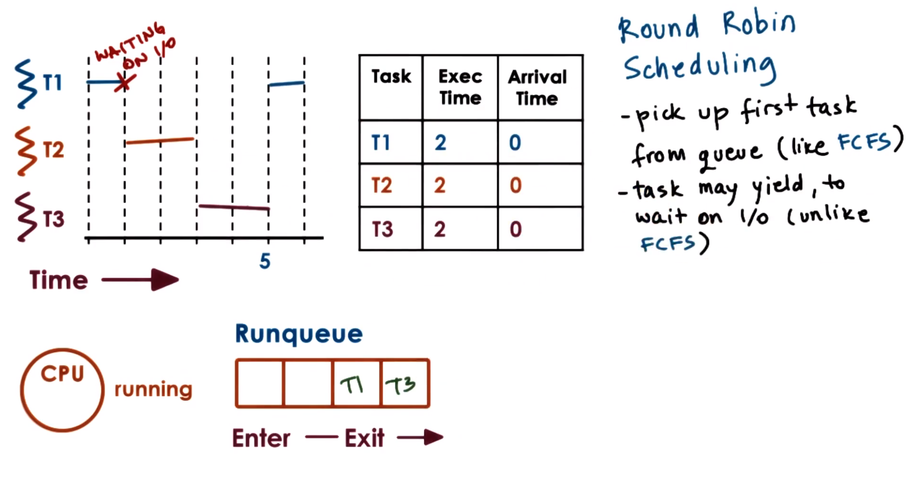

However, unlike in first-come, first-serve (FCFS) scheduling (where it is assumed that each task executes to completion), there is the possibility of a task being interrupted (e.g., `T1` yields to wait on an I/O operation at time `t = 1s`). If this occurs, the blocked task either completes or is placed at the tail of the queue, and the next task in the queue (e.g., `T2`) is selected to run. This process then proceeds in this manner until the queue is empty.

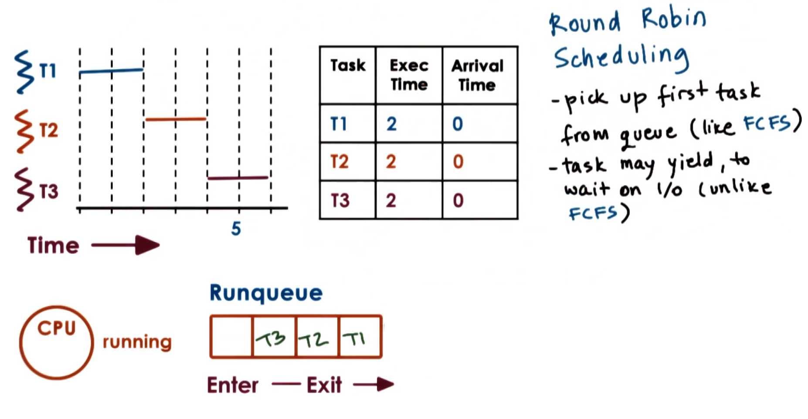

Conversely, if there were no I/O operation to interrupt `T1`, execution of the tasks would proceed as shown in the figure above (i.e., via the ordered placement in the runqueue).

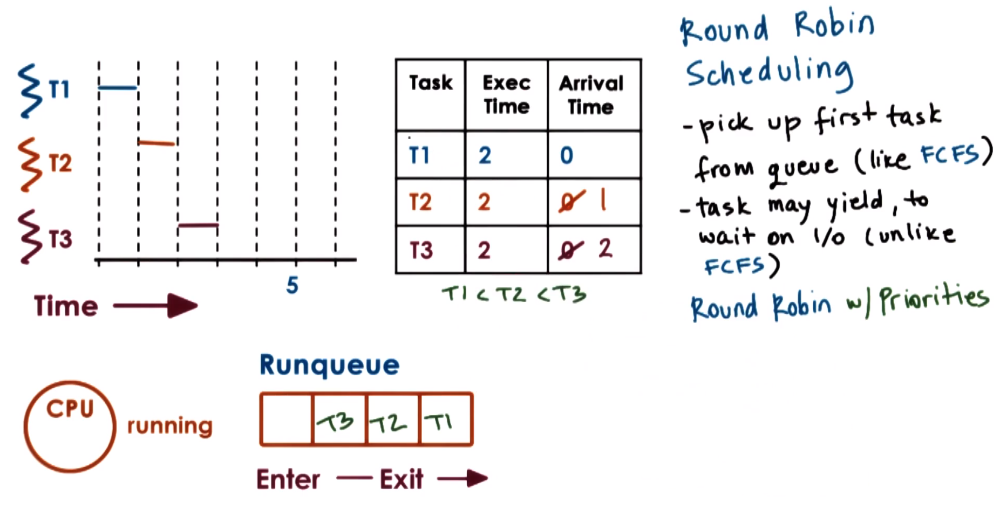

Round robin scheduling can also be generalized to include **priorities**. Consider, for example (as in the figure shown above), tha the tasks arrive at different times having different priorities such that `P1 (lowest) < P2 < P3 (highest)`. In this case, if a higher priority task arrives (e.g., when `T2` arrives at time `t = 1s`), then the currently running task (e.g., `T1` immediately prior to time `t = 1s`) is preempted to proceed with execution of the former.

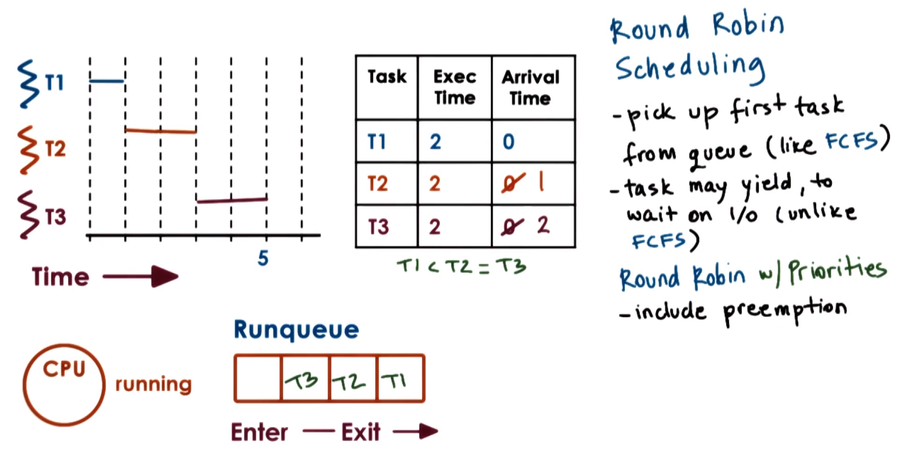

Furthermore, as shown in the figure above, if two of the tasks have equal priorities (e.g., `T2` and `T3`, both of which are higher than `T1`), then tie breaking is achieved in the usual round-robin manner (i.e., via the runqueue order for the tasks in question).

Therefore, in order to include priorities with round robin scheduling, it is necessary to also include **preemption**, but otherwise the tasks are scheduled from the runqueue (i.e., similarly to first-come, first-serve (FCFS)).

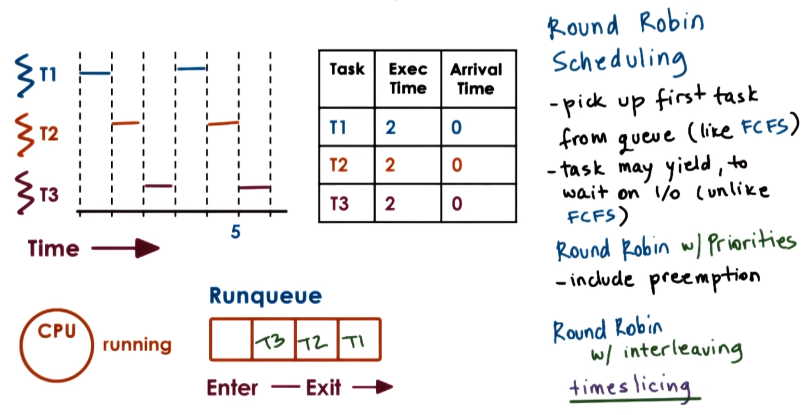

A further **modification** that is sensible for round robin scheduling is rather than to wait for tasks to yield explicitly, instead to interrupt them so that they are **interleaved** (i.e., such that the tasks currently in the system are "mixed" together). Such a mechanism is called **timeslicing**.

For example, in the the figure shown above, each task is assigned a timeslice of one time unit (e.g., `1s`), and operates over this fixed interval and then the system proceeds onto the next task in a round-robin manner via the runqueue (with a corresponding interruption of the current task, if necessary), and thus the system proceeds in this manner until all tasks complete execution.

Timeslicing will now be discussed in more detail in the following sections.

## 11-15. Timesharing and Timeslices

### 11. Introduction

#### Timeslice

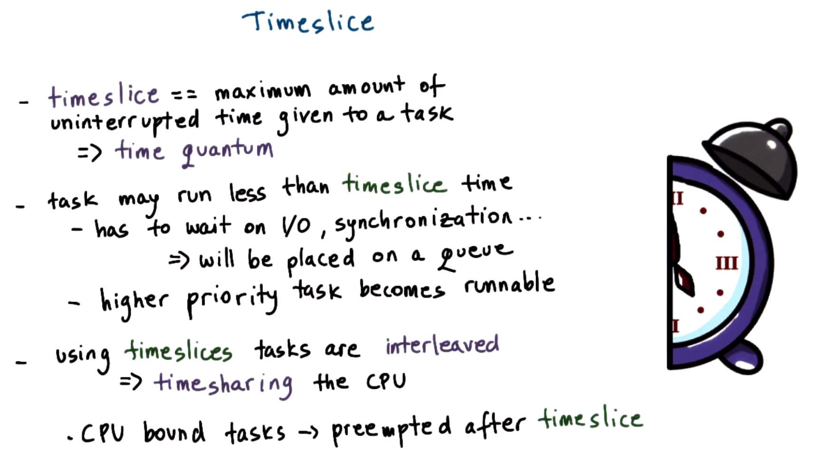

Timeslices were introduced briefly previously (cf. P2L1). As a more formal definition, a **timeslice** is the maximum amount of ***uninterrupted time*** that can be assigned to a given task. A timeslice is also referred to as a **time quantum**.

Inasmuch as a timeslice defines a *maximum* amount of time, this also implies that a task may run for ***less*** time than the specified timeslice.
  * For example, if a task must wait on an I/O operation, synchronization (e.g., coordinating the locking/unlocking of a mutex), etc., then it will be removed from the CPU and placed on a queue, which may occur prior to expiration of the timeslice.
  * Furthermore, in a priority-based scheduling system, a higher priority task will preempt a relatively lower priority task, therefore in general a lower priority task will account for a smaller portion of a given timeslice.

Irrespectively of the particular system configuration, the use of timeslices allows to achieve the **interleaving** of tasks, i.e., the tasks can participate in **timesharing** of the CPU.
  * This is not particularly critical for **I/O-bound-tasks**, since they are waiting for the I/O operation to complete, externally to the system.
  * Conversely, for **CPU-bound tasks**, the timeslice is the primary mechanism by which timesharing of the CPU is achieved in the first place. This occurs by virtue of the fact that after the timeslice expires, the current task is preempted and the next task is scheduled onto the CPU.

#### Timeslice Scheduling

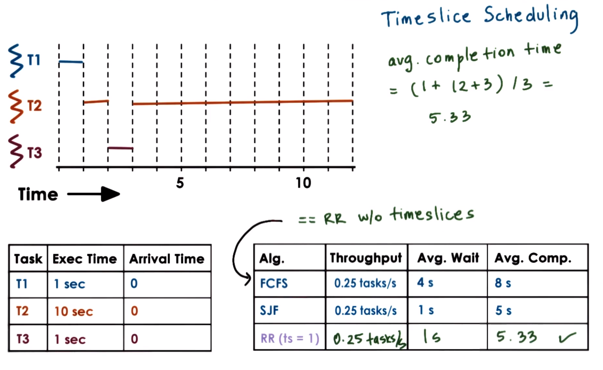

Consider an example derived from that seen previously in the lecture, as in the figure shown above.
  * Note that here the metrics (i.e., throughput, average wait time, and average completion time) computed with respect to the first-come, first-serve (FCFS) scheduling algorithm also apply to the round robin (RR) without timeslices scheduling algorithm. As given, the tasks `T1`, `T2`, and `T3` would be scheduled in the usual manner via the runqueue (i.e., in order of position within the queue).

For the round robin (RR) scheduling algorithm with a timeslice *`t`*`s` of `1s`, the execution for the tasks is as shown in the figure above, corresponding to the following sequence:
  1. Tasks `T1`, `T2`, and `T3` each execute for `1s` per the timeslice (in that order), thereby completing the execution of both `T1` and `T3`.
  2. At time `t = 3s`, since `T2` is the only remaining runnable task, it is scheduled an proceeds to execute until completion.

Regarding the corresponding metrics (relative to time `t = 0s`, as before):
  * **throughput** - by inspection, this is identical to that of the first-come, first-serve (FCFS) scheduling algorithm (i.e., the three tasks are completed over the course of `12s`)
  * **average wait time** - `(0 + 1 + 2) s / 3 tasks = 1 s/task`
  * **average completion time** - `(1 + 12 + 3) s / 3 tasks = 5.33 s/task`

Therefore, by simply using a round robin scheduling algorithm with a timeslice, a comparable performance to that of the shortest job first (SJF) scheduling algorithm is achieved with respect to the average completion time. Furthermore, this is achieved by maintaining the simplicity of the first-come, first-serve (FCFS) scheduling algorithm (i.e., without the additional complexity of managing the runqueue, as in SJF).

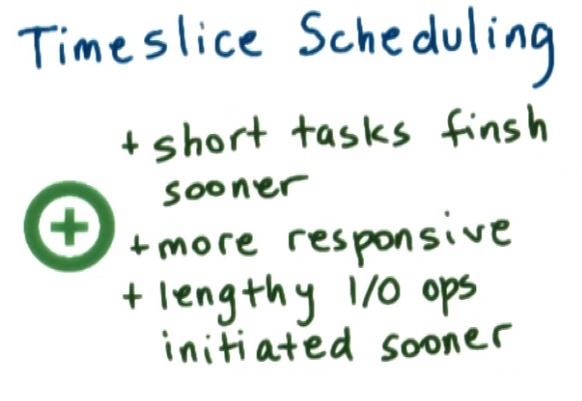

Accordingly, the **benefits** of timeslice scheduling (particularly with a relatively *short* timeslice) include:
  * Relatively short tasks (e.g., `T1` and `T3`) generally finish sooner.
  * Scheduling is more responsive.
  * Lengthy I/O operations can be initiated sooner, which improves the user experience (e.g., the wait operation can be made in an early timeslice, which in turn allows for other tasks to complete in the meantime).

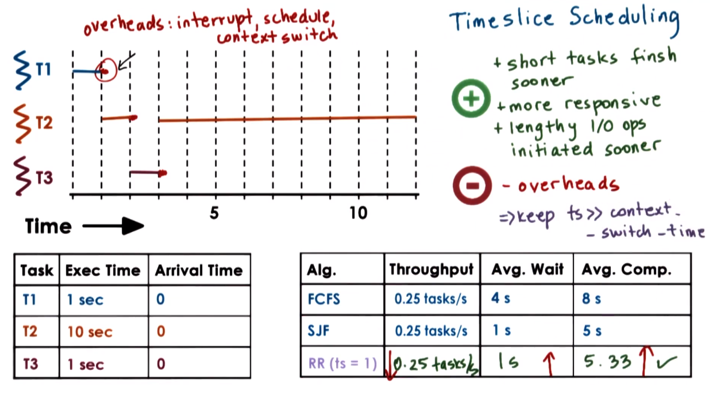

Conversely, a key **drawback** is the **overhead** associated with performing the task changes (e.g., interrupts, scheduling, and context switches).
  * In practice, these are not instantaneous events, and can add non-trivial overhead in terms of run-time (i.e., relative to the timeslice's time scale), memory, and performance, etc. Furthermore, there is no useful application processing occurring during this overhead "downtime."
  * Also, note that, in principle, this "pure overhead" is incurred at each timeslice interval even when the *same* task is running (e.g., `T2` performs these overhead operations at *each* interval `t = 4s`, `t = 5s`, etc. until it completes). However, in practice, these timeouts are handled by the operating system in a more efficient manner (e.g., avoiding re-schedules and context switches for the *same* task, with those being among the two most expensive overhead operations) than this "naive" approach in such a case; the details of this are beyond the present scope.

Therefore, relative to the "ideal" metrics as computed (i.e., assuming *no* overhead), the dominant overhead operations will impact the performance accordingly:
  * The **throughput** will be lower than that computed.
  * The tasks will begin slightly later (i.e., rather than *immediately* following the previous time slice), thereby increasing the average wait time and the average completion time due to this overhead time delay.

The exact impact of overhead on these metrics will depend on the exact time duration of the overhead operations relative to that of the timeslice. In general, it is ideal to maintain *`t`*`s``  >>  `*`t`*`context_switch` to maximize performance accordingly (i.e., to minimize the impact of overheads on performance).

Therefore, in general, consider both the nature of the tasks as well as intrinsic overheads in the system when **determining** meaningful values for the timeslice.

### 12. How Long Should a Timeslice Be?

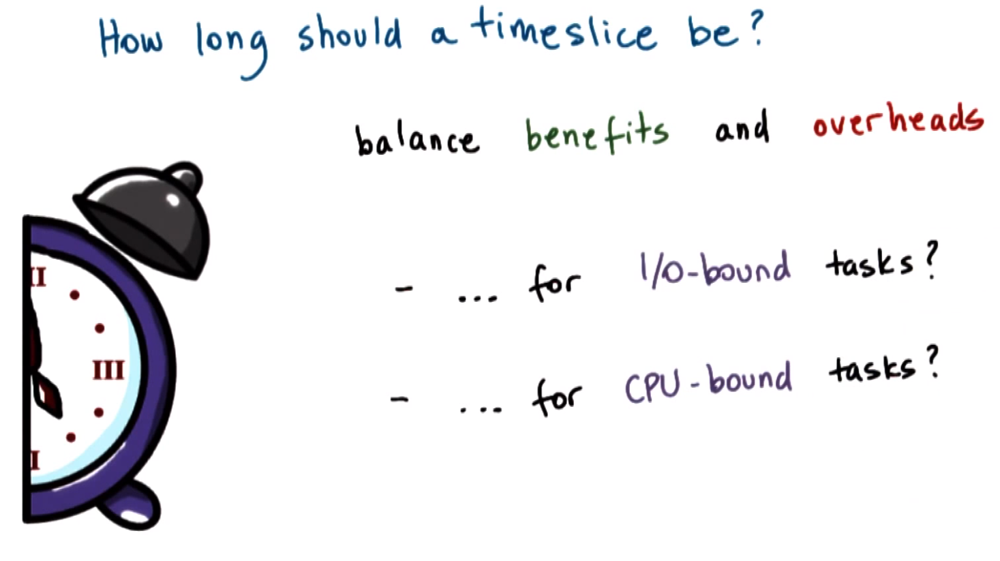

As described in the previous section, the use of timeslices delivers certain **benefits** (e.g., the ability to begin the execution of tasks sooner, which in turn enables the achievement of an overall schedule for the task that is more responsive). However, this is accompanied by **overheads** as well. Therefore, the **balance** between these benefits and drawbacks has **implications** for the particular **length** of the timeslice that is selected.

To answer the question "*How long should a timeslice be?*," the corresponding **balance** differs for...
  * I/O-bound tasks (those tasks that perform I/O operations), vs.
  * CPU-bound tasks (those tasks that are mostly executing on the CPU and perform little-to-no I/O operations)

These two scenarios are discussed in turn next.

### 13. CPU-Bound Timeslice Length

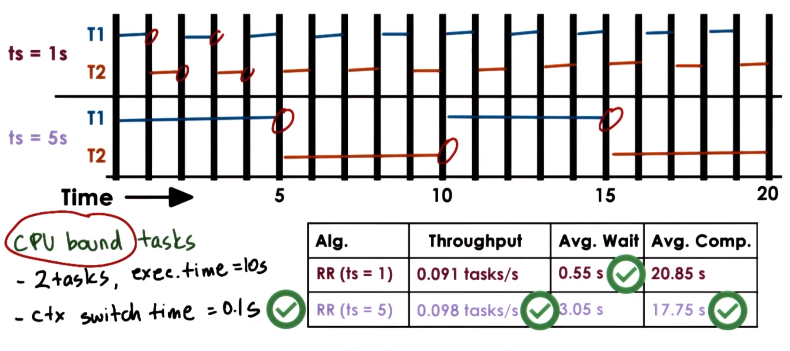

(***N.B.*** There are **errata** in the metrics calculations in the table shown above. See the in-text table below for the correct values.)

Now consider an example consisting of two **CPU-bound tasks** both having an execution time of `10s` and a context switching time of `0.1s` (i.e., to switch between the two tasks), as shown in the figure above. Furthermore, consider two different timeslice values (*`t`*`s`): `1s` and `5s`.
  * **N.B.** In the time plot of the figure, the "thick" vertical bars encompass the corresponding context switching time.

As demonstrated in the time plot, the context switches are more frequent with a shorter timeslice (`1s`).

The corresponding metrics are calculated as follows:

| Scheduling Algorithm | Throughput (tasks/s) | Average Wait Time (s) | Average Completion Time (s) |
| :---: | :---: | :---: | :---: |
| round robin (*`t`*`s`` = 1s`) | `2 / (10 + 10 + 19*0.1)` `= 0.091` | `[0 + (1 + 0.1)] / 2` `= 0.55` | `[(19*1 + 18*0.1) + (1.1 + 19*1 + 18*0.1)] / 2` `= 21.35` |
| round robin (*`t`*`s`` = 5s`) | `2 / (10 + 10 + 3*0.1)` `= 0.098` | `[0 + (5 + 0.1)] / 2` `= 2.55` | `[(5*3 + 2*0.1) + (5.1 + 5*3 + 2*0.1)] / 2` `= 17.75` |

As these metrics suggest:
  * A higher timeslice value (e.g., *`t`*`s`` = 5s`) is more advantageous for higher throughput and for a shorter average completion time
  * Conversely, a lower timeslice value (e.g., *`t`*`s`` = 1s`) is more advantageous for a shorter average wait time

However, since these are CPU-bound tasks, the wait time is not particular concern here, but rather, the user is more interested in throughput and completion times, therefore, in general a ***longer*** timeslice is more advantageous here.

In particular, for CPU-bound tasks, the theoretical limit for this example/configuration is as follows:

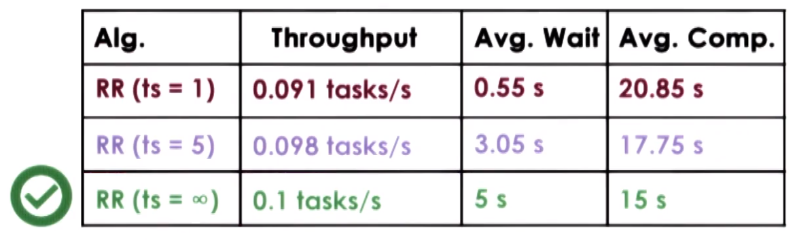

| Scheduling Algorithm | Throughput (tasks/s) | Average Wait Time (s) | Average Completion Time (s) |
| :---: | :---: | :---: | :---: |
| round robin (*`t`*`s`` → ∞`) | `2 / (10 + 10)` `= 0.1` | `[0 + (10)] / 2` `= 5` | `[(10) + (20)] / 2` `= 15` |

Therefore, in summary, in general a CPU-bound task prefers a **large timeslice**.

### 14. I/O-Bound Timeslice Length

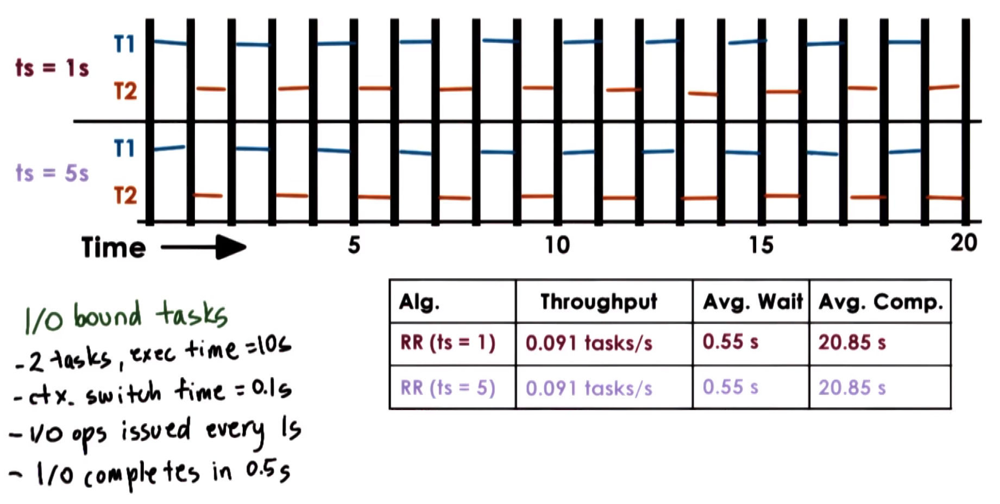

Now consider an example consisting of two **I/O-bound tasks** both having an execution time of `10s` and a context switching time of `0.1s` (i.e., to switch between the two tasks), as shown in the figure above. Furthermore, consider two different timeslice values (*`t`*`s`): `1s` and `5s`. The nature of the I/O calls is such that the task issues an I/O operation every `1s`, and each such I/O operation completes in `0.5s`.

As shown above in the figure, the resulting time plot is identical to that of the CPU-bound tasks with for a timeslice of `1s`. However, in this scenario, rather than being preempted, the tasks issue the I/O operation and subsequently yield of their own volition (i.e., irrespectively of the timeslice length).

Furthermore, with a timeslice `5s`, the resulting timeslice is also equivalent, since the I/O operations' frequency (once per `1s`) is higher than that of the timeslice duration (`5s`).

The corresponding metrics are calculated as follows:

| Scheduling Algorithm | Throughput (tasks/s) | Average Wait Time (s) | Average Completion Time (s) |
| :---: | :---: | :---: | :---: |
| round robin (*`t`*`s`` = 1s`) | `2 / (10 + 10 + 19*0.1)` `= 0.091` | `[0 + (1 + 0.1)] / 2` `= 0.55` | `[(19*1 + 18*0.1) + (1.1 + 19*1 + 18*0.1)] / 2` `= 21.35` |
| round robin (*`t`*`s`` = 5s`) | `2 / (10 + 10 + 19*0.1)` `= 0.091` | `[0 + (1 + 0.1)] / 2` `= 0.55` | `[(19*1 + 18*0.1) + (1.1 + 19*1 + 18*0.1)] / 2` `= 21.35` |

Therefore, it can be concluded here that for I/O-bound tasks, the value of the timeslice is not relevant.

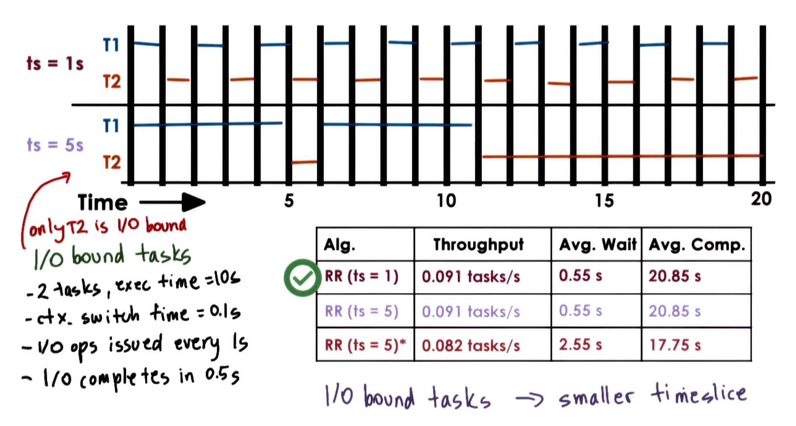

However, as demonstrated by the figure shown above, this is not a correct conclusion. Here, consider the case where *only* `T2` is I/O-bound (with characteristic times as given previously), while `T1` is not (i.e., `T1` is strictly CPU-bound).
  * In this case, the time plots are identical for `T1` and `T2` for a timeslice of `1s`, with the difference that for `T1` there is preemption after each `1s` timeslice, whereas for `T2` there is a voluntary yield off of the CPU to wait the I/O operation.
  * However, for the timeslice of `5s`, at time `t = 5s`, `T1` is preempted, and then `T2` is scheduled for `1s` until it yields due to the I/O operation, and then `T1` is scheduled again and executes to completion. Lastly, `T2` is the last remaining task from time `t = 11s` onwards.

For the latter case (i.e., a timeslice of `5s` with only `T2` being I/O-bound), the performance metrics are as follows:

| Scheduling Algorithm | Throughput (tasks/s) | Average Wait Time (s) | Average Completion Time (s) |
| :---: | :---: | :---: | :---: |
| round robin (*`t`*`s`` = 5s`)* | `2 / (10 + 10 + 3*0.1 + 8*0.5)` `= 0.082` | `[0 + (5 + 0.1)] / 2` `= 2.55` | `[(11 + 2*0.1) + (11 + 9 + 3*0.1 + 8*0.5)] / 2` `= 17.75` |

Therefore, in the I/O-bound case, a decreased timeslice (i.e., `1s`) both increases throughput and decreases the average wait time. With respect to the average completion time, this is increased in the smaller timeslice due to the large variance in the completion times of `T1` and `T2` (i.e., `t = 11s` and `t = 20s`, respectively). However, overall, it can be concluded that for I/O-bound tasks, a **smaller** timeslice is generally more advantageous.
  * With a smaller timeslice, an I/O-bound task is more likely to run sooner, to issue an I/O request, or to respond to a user.
  * Furthermore, with a smaller timeslice, it is possible to keep both the CPU and the I/O devices busy, thereby maximizing the use of the system resources.

### 15. Summarizing Timeslice Length

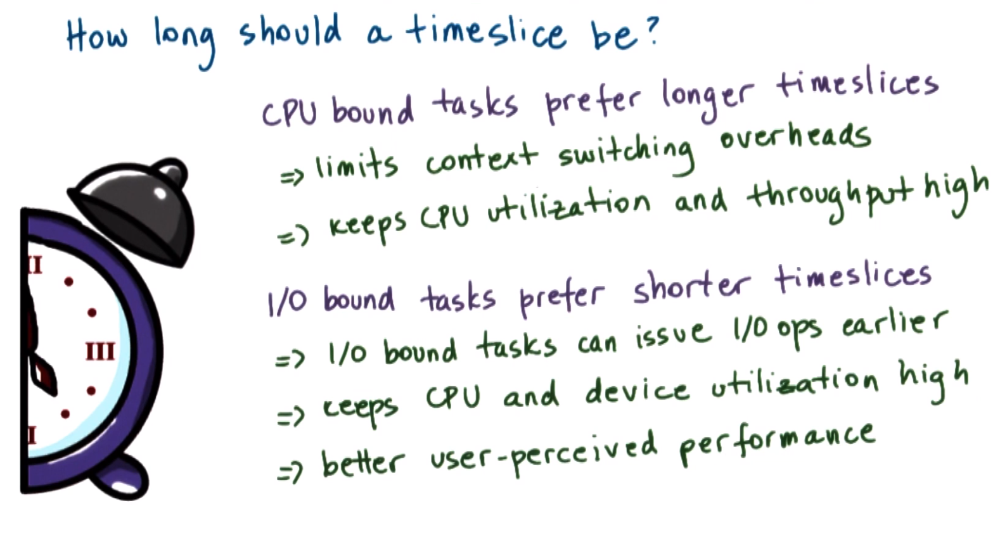

Revisiting the question of "*How long should a timeslice be?*"...
  * CPU-bound tasks prefer ***longer*** timeslices
    * Longer timeslices give rise to less frequent context switches, and correspondingly a reduction in overheads from associated operations
    * Longer timeslices maintain high CPU utilization and throughput by maximizing the useful application processing (and correspondingly minimizing "non-useful" overhead)
  * I/O-bound tasks prefer ***shorter*** timeslices
    * With shorter timeslices, I/O-bound tasks can issue I/O operations sooner/earlier
    * Shorter timeslices maintain high CPU utilization and device utilization
    * Shorter timeslices promote better user-perceived performance (i.e., the system appears "more responsive" to the user with respect to user inputs and corresponding outputs to the user)

## 16. Timeslice Quiz and Answers

On a single-CPU system, consider the following workload and conditions:
  * `10` I/O-bound tasks and `1` CPU-bound task
  * The I/O-bound tasks issue an I/O operation every `1ms` of CPU computing time
  * I/O operations always take `10ms` to complete
  * The overhead for context switching is `0.1ms`
  * All tasks are long-running (i.e., assume *large* execution times relative to the other aforementioned times)

Given these parameters, what is the CPU utilization (%) for a round robin scheduler where the timeslice is:
  * `1ms`?
    * `91%`
      * Every `1ms`, there is either a preemption of the CPU-bound task, or the I/O-bound task will intrinsically stop to perform the I/O operation.
      * Therefore, over a timeslice of `1ms`, the CPU utilization is `1ms / (1ms + 0.1ms) = 0.91`.
  * `10ms`?
    * `95%`
      * Each of the ten I/O-bound tasks run for `1ms` apiece, with an immediately succeeding context switch of `0.1ms` after each. After this, the CPU-bound task is scheduled and then runs for `10ms` (i.e., the full timeslice).
      * Therefore, over a timeslice of `10ms`, the (aggregate) CPU utilization is `(10*1 + 1*10) / [(10*1 + 10*0.1) + (1*10 + 1*0.1)] = 0.95`. This is represented diagrammatically as follows:
      

      
      

As this example demonstrates, from the CPU's perspective (i.e., with respect to maximizing CPU utilization), having a larger timeslice (which favors the CPU-bound task) increases CPU utilization.
  * Though not computed explicitly in the example, from the perspective of the I/O device, the opposite will be true: Having a smaller timeslice will favor more frequent operation of the I/O device, inasmuch as the I/O device is otherwise idle while the system is running the CPU-bound task.

Reference equation:

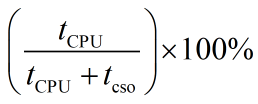

Tips to solve:
  1. Determine a ***consistent, recurring interval***.
  2. In the interval, each task should be given an opportunity to run.
  3. During that interval, how much time is spent computing? This is the ***CPU running time*** (*`t`*`CPU`).
  4. During that interval, how much time is spent context switching? This is the ***context switching overheads*** (*`t`*`cso`).
  5. Calculate based on (1)-(4).

## 17. Runqueue Data Structure

### Introduction

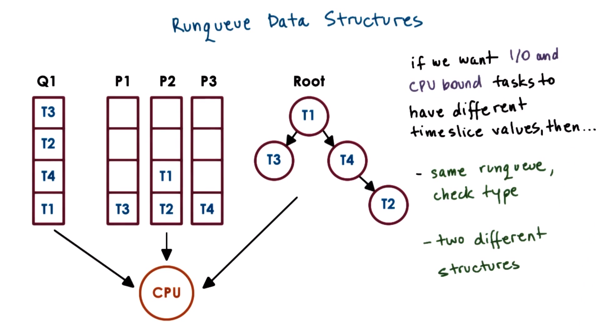

Recall that the runqueue is only logically a "queue," but in fact can be represented by multiple data structures, as shown above in the figure. Example configurations include:
  * a *single* queue
  * *multiple* queues, each with a distinct priority
  * a tree
  * etc.

Regardless of the data structure used in the actual implementation, an **important feature** is that it should be easy for the CPU scheduler to determine the next thread to run, given the scheduling criteria.

Therefore, in order to have I/O- and CPU-bound tasks to have *different* timeslice values, then there are two main options:
  1. Maintain a *single* runqueue structure, in a manner which facilitates easy determination by the CPU scheduler for the type of the task being scheduled (i.e., so that it can apply the appropriate policy).
  2. Maintain two *different* runqueue structures (i.e., one for CPU-bound tasks, and the other for I/O-bound tasks), with corresponding policies for each runqueue structure.

### Dealing with Different Timeslice Values

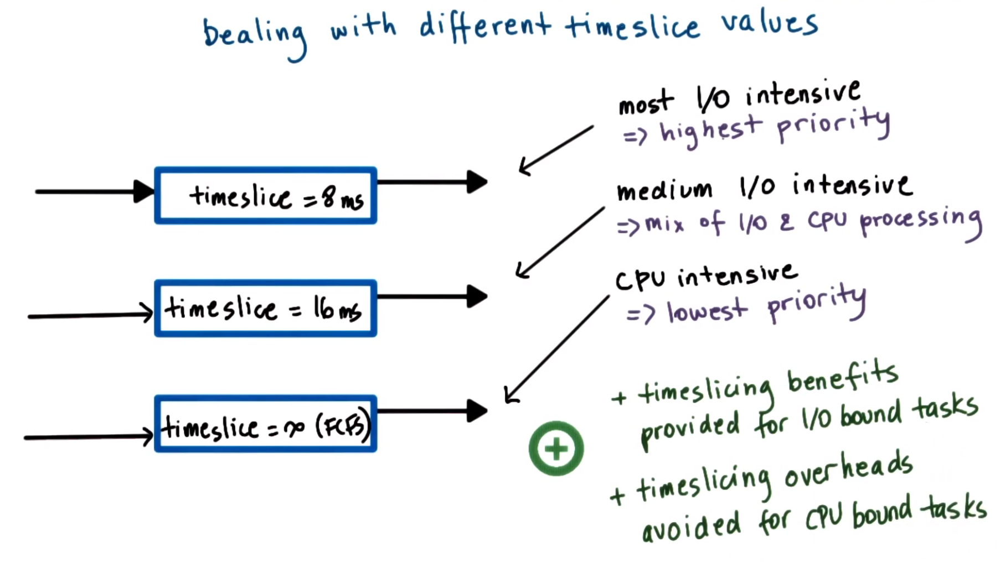

One solution for the latter approach (i.e., separate/distinct runqueues) is to use the data structure as in the figure shown above. This is a **multi-queue** data structure having the following queues (i.e., for incoming tasks):
  1. The most I/O-intensive tasks are assigned to the first runqueue, with a corresponding short timeslice (e.g., `8ms`).
  2. Medium I/O-intensive tasks (i.e., those having a mix of I/O-bound and CPU-bound processing), with a corresponding medium-length timeslice (e.g., `16ms`).
  3. Strictly CPU-intensive tasks, with a corresponding "infinite" timeslice (i.e., having the equivalent behavior of first-come, first-serve (FCFS)).

From the scheduler's perspective, the relative priorities of these runqueues are: `1 (highest) > 2 > 3 (lowest)`. Therefore, it generally favors I/O-bound tasks over CPU-bound tasks.

The **benefits** of this multi-queue configurations are:
  * Timeslicing benfits are *provided* to those tasks which benefit from them (i.e., I/O-bound tasks).
  * Timeslicing overheads are also *avoided* for CPU-bound tasks.

However, this begs several questions:
  * How do we know if a task is CPU- or I/O-intensive?
  * How do we know how I/O-intensive a task is?
    * This can be determined using history-based heuristics, similarly to that discussed in the context of shortest job first (SJF), however, this approach is still inconclusive when considering the following:
      * What about *new* tasks?
      * What about tasks that dynamically *change* phases in their behavior?

#### Multi-Level Feedback Queue (MLFQ)

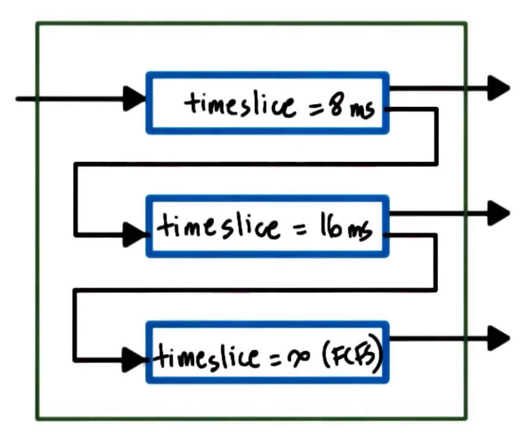

To deal with these issues, these queues can be treated *not* as three *separate* runqueues, but rather a ***single*** multi-queue data structure, as shown in the figure above.

This data structure can be used as demonstrated in the following sequence of figures.

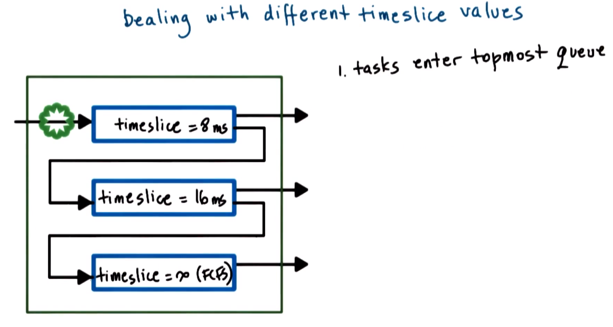

When a newly created task first enters the system, it enters in the top-most queue (having the shortest timeslice), i.e., the **initial assumption** is that the incoming task is of the most intensive variety (i.e., will context switch often).

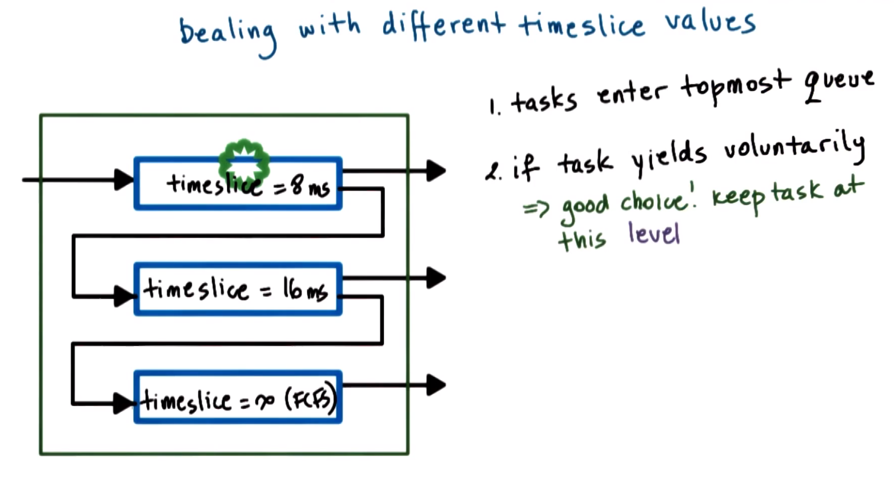

If the task stops executing (e.g., by yielding voluntarily, or to wait for an I/O operation) before expiration of the timeslice (i.e., before `8ms` have elapsed), then this assumption is *correct*, and therefore it is appropriate to keep the task at this level/queue. Therefore, when the task becomes runnable again, it will be returned to this level/queue.

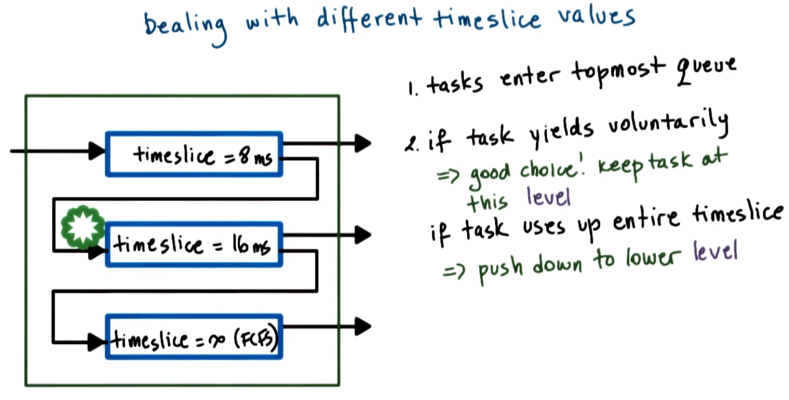

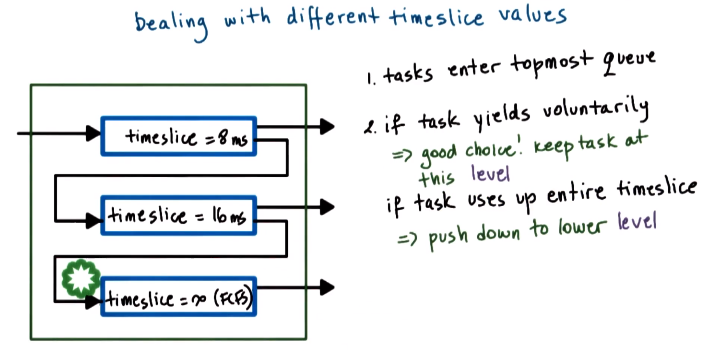

Conversely, if the task executes for the entire initial timeslice (i.e., `8ms`), then it is pushed down to a lower level (i.e., the fundamental assumption is *incorrect*--the task is more CPU-intensive than initially thought).
  * The task is subsequently preempted and scheduled via the next queue (having timeslice `16ms`).
  * Similarly, if necessary, the task can again be preempted on the middle queue (having timeslice `16ms`) and then scheduled via the final queue.

Therefore, this configuration provides a **mechanism** whereby the queue placement is dictated by historic information of the task's behavior within the overall runqueue, starting with the initial assumption that the task is mostly I/O-intensive (rather than CPU-intensive), which is subsequently refined (i.e., it may turn out to be more CPU-intensive than initially assumed).

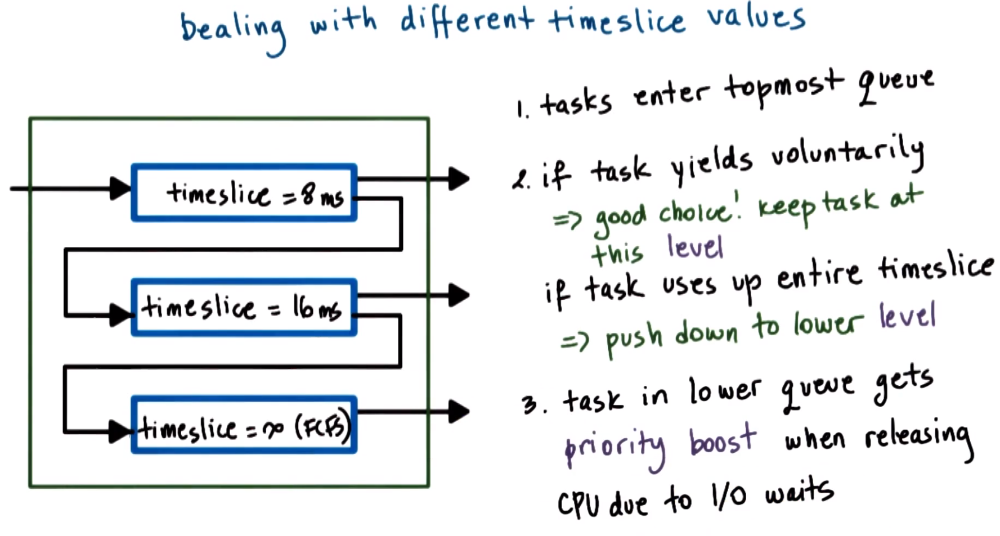

Note that if a task in one of the lower-level queues exhibits sustained "anomalous" behavior over time for that particular level (i.e., persistently releasing the CPU earlier than the alotted timeslice, such as due to waiting on I/O operations), this notifies the scheduler to perform a **priority boost** on the task, thereby increasing its priority level to a more appropriately suited queue (i.e., one at a higher priority level than the task is currently in).

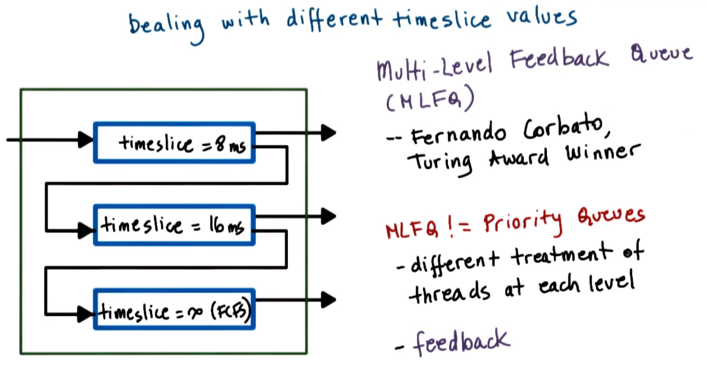

Collectively, this resulting data structure is called a **Multi-Level Feedback Queue (MLFQ)**.
  * In fact, for the design of this data structure (along with related work on timesharing systems), its author Fernando Corbato received the prestigious ACM Turing Award (the equivalent to the "Nobel Prize in Computer Science").

As a **cautionary note**, beware not to trivialize the MLFQ data structure as simply the equivalent to "multiple priority queues."
  * In the MLFQ data structure, there are different scheduling policies associated with each different priority level (i.e., among the "sub-queues" in the overall data structure), which is distinctly different from a priority queue data structure.
  * Furthermore, even more uniquely, the MLFQ data structure incorporates its characteristic **feedback mechanism** that allows to dynamically adjust over time into which level the tasks are placed, thereby optimizing the overall timesharing schedule for the constitutent tasks within the system.

***N.B.*** The so-called "O(1) scheduler" used in Linux (discussed next) uses some of the mechanisms derived from this data structure. Furthermore, while the Solaris scheduling mechanism is not covered in the course, it is essentially a MLFQ with sixty such levels/queues, as well as some sophisticated feedback rules for determining how and when a thread/task is moved up and down the levels.

## 18. Linux O(1) Scheduler

Consider now some concrete examples of schedulers that are part of an actual operating system.

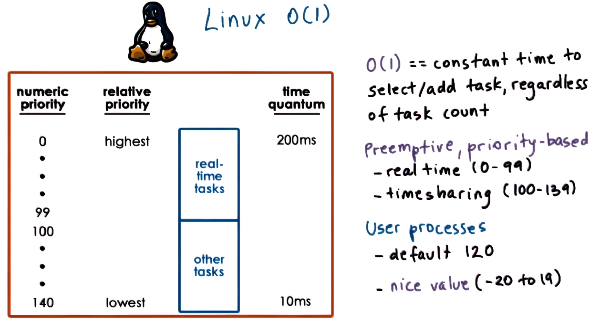

The first such example is the **Linux O(1) scheduler**, as shown in the figure above.

The O(1) scheduler is so called because it is able to perform task management operations (e.g., selecting or adding a task to/from the runqueue) in constant time (i.e., `O(1)` run-time operation), regardless of the total number of active tasks in the system at any given time.

The O(1) scheduler is a preemptive and priority-based scheduler, with a total of `140` **priority levels**, with `0` being the highest and `139` being the lowest.

Furthermore, these priority levels are organized into different **classes**, as follows:
  * Tasks `0` to `99` are part of the **real-time tasks** class
  * Tasks `100` to `139` are part of the **timesharing** class

All **user processes** fall under this latter class (i.e., timesharing), having a default priority level of `120`, which can be adjusted via corresponding system call to set the so-called **nice value** (which ranges from `-20` to `19`, thereby spanning the set of timesharing priorities).

The O(1) scheduler borrows from the Multi-Level Feedback Queue (MLFQ) in that it associates different **timeslice values** with different priority levels, and it also uses **feedback** from how the tasks behave in the past to determine how to adjust their future priority levels.

However, the O(1) scheduler differs in how it assigns the timeslice values to priorities as well as in how it uses the feedback.
  * Regarding the **timeslice** value assignment:
    * It depends on the priority level of the task, similarly as is done in the Multi-Level Feedback Queue (MLFQ).
    * However, it assigns the ***shorter*** timeslice values to the ***lower*** priority CPU-bound tasks, and it assigns the ***longer*** timeslice values to ***higher*** priority more-interactive tasks.
  * Regarding the **feedback** mechanism:
    * The time is based on the **sleep time** (i.e., the time that the task spends wating/idling), rather than the execution time.
      * A ***longer*** sleep time suggests that the task is **interactive** (e.g., spending more time waiting on user input or similar events), and therefore in this case it is necessary to ***increase*** (i.e., **boost**) the priority of the task; this is accomplished by subtracting `5` from the current priority level, which takes effect the next time that the task is executed.
      * Conversely, a ***shorter*** sleep time suggests that the task is **compute-intensive**, and therefore in this case it is necessary to ***decrease*** the priority of the task; this is accomplished by adding `5` (up to a maximum) to the current priority level.

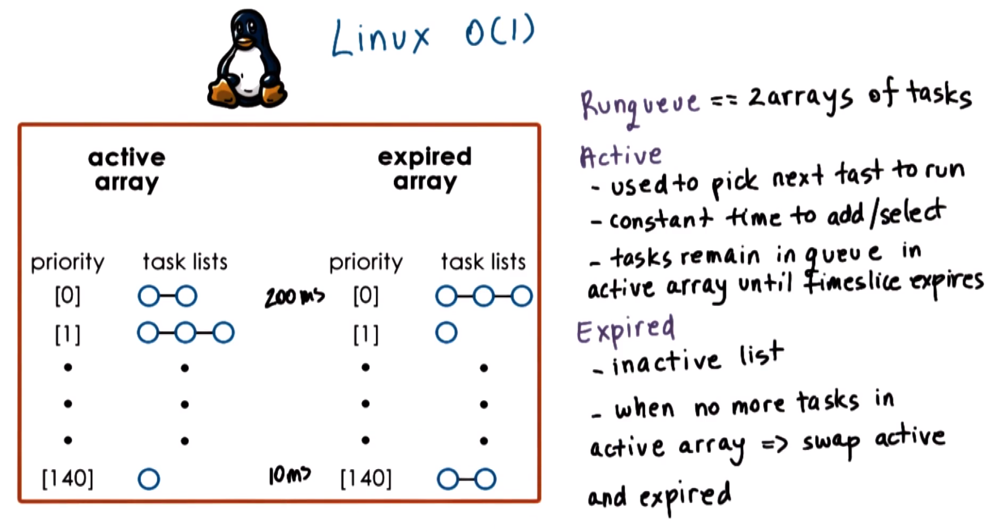

The **runqueue** in the O(1) scheduler is organized as two arrays of tasks queues, as shown in the figure above. Each array element points to the first runnable task at the corresponding priority level.

The two arrays are called **active** and **expired**.
  * The **active** array:
    * Is the primary list that the scheduler uses to select the next task to run.
    * Takes constant time to **add** a task, since this can be computed simply by using the array index to find the appropriate priority level, and then following the pointer to the end of the task list at that priority level to enqueue the task that is present there.
      * Similarly, it takes constant time to **select** the task, because the scheduler relies on certain instructions that return the position of the first set bit in a sequence of bits, where the sequence of bits corresponds to the priority levels (with a bit value of `1` indicating tha there *are* tasks present at that priority level). Therefore, it takes constant time to run the instructions to determine what is the first priority level that has certain tasks on it; once this position is known, it also subsequently takes constant time to index into this array and then select the first task from the runqueue that is associated with that priority level.
    * Maintains tasks that are remaining in the queue (i.e., tasks that yield the CPU in order to wait for an event, or tasks that are preempted due to a higher priority task becoming runnable) in the **active array** until their timeslice expires.
      * The time that these tasks spend on the CPU is subtracted from the total amount of time, and if it is less than the timeslice, then they are still placed on the corresponding queue in the active list. Only *after* a task consumes its *entire* timeslice will it then be removed from the active list and placed on the appropriate queue within the expired array.
  * The **expired** array:
    * Contains the list of inactive tasks (i.e., those tasks that are not currently active in the sense that the scheduler will *not* select them as long as there are any tasks remaining in the active array).
    * Swaps (i.e., exchanges the pointers of) the active and expired arrays when there are no more tasks present in the active array.
      * This also explains why in the O(1) scheduler, the low-priority tasks are given short timeslices (e.g., `10ms`), while high-priority tasks are given long timeslices (e.g., `200ms`); therefore, as long as any of the high-priority tasks have remaining time in their timeslice, they will continue to be scheduled (i.e., they will remain in one of the active-array queues) until they are placed on the expired array (at which point they are no longer being scheduled), thereby allowing lower priority tasks having a shorter timeslice the opportunity to run without also disrupting (i.e., without excessively delaying) the high-priority tasks.
      * Furthermore, note that having such a two-array setup provides an **aging mechanism**, whereby the high-priority tasks ultimately consume their timeslice, are placed on the expired array, and allow the low-priority tasks to run (for their relatively shorter timeslice amount).

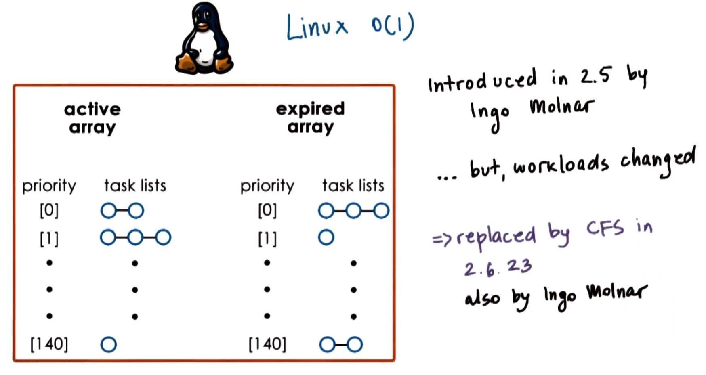

The O(1) scheduler was introduced in the version 2.5 Linux kernel by Ingo Molnár. Despite this efficient O(1) design, it ultimately adversely impacted the performance of interactive tasks significantly. Furthermore, as the workloads changed (particularly as typical applications in the Linux environment were becoming more time-sensitive, e.g., Skype, movie streaming, gaming, etc.), the resulting "jitter" introduced by the O(1) scheduler had become unacceptable by that point.

Consequently, the O(1) scheduler was replaced by the **Completely Fair Scheduler (CFS)** (discussed next) as the default scheduler starting from version 2.6.23 Linux kernel, which was also devised by Ingo Molnár.

***N.B.*** Both the O(1) and CFS schedulers are part of the standard Linux distribution, with CFS being the default (however, it is possible to switch back to the O(1) scheduler to execute tasks as well).

## 19. Linux CFS Scheduler

### Problems with the O(1) Scheduler

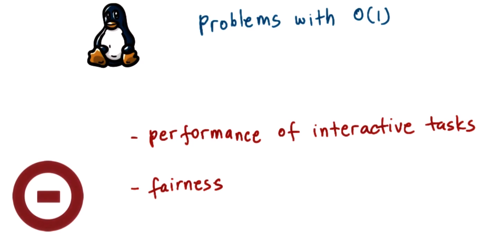

There are several critical **issues** with the O(1) scheduler:
  * Once tasks are placed on the expired list, they are not scheduled until all of the remaining tasks from the active list have had a chance to execute for their alloted timeslice. Consequently, the performance of **interactive tasks** is affected (e.g., there is a lot of "jitter").
  * Additionally, the scheduler generally does *not* make any ***fairness guarantees***.
    * While there are multiple definitions of "***fairness"***," here we can consider intuitively that in a given time interval, all of the tasks should be able to run for an amount of time that is proportional to their priority. However, for the O(1) scheduler, it is difficult to substantiate any claims that it makes such a fairness guarantee.

### Linux Completely Fair Scheduler (CFS)

Recall that the **Completely Fair Scheduler (CFS)** (proposed by Ingo Molnár and subsequently adopted as the default scheduler in the Linux kernel start from version 2.6.23) was developed to address the problems with the O(1) scheduler.
  * ***N.B.*** The CFS scheduler is the default scheduler for all non-real-time tasks, whereas the real-time tasks are scheduled by a separate real-time scheduler.

#### Runqueue Overview

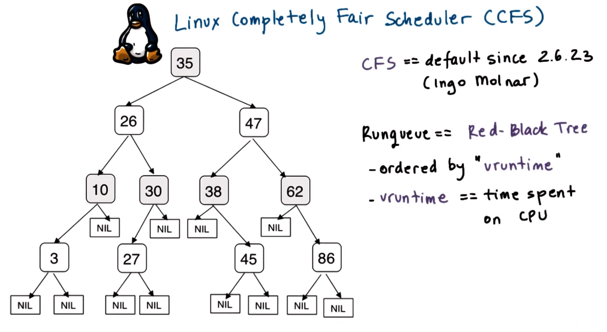

The main idea behind the Completely Fair Scheduler (CFS) is that it uses a **red-black tree** data structure for its **runqueue**.
  * Red-black trees belong to the family of dynamic tree structures that have a **special property** such that as nodes are added or removed from the tree, the tree will subsequently re-balance itself such that all of the paths from the root node to the leaf nodes are all approximately the same size.
    * ***Reference***: [Sedgewick and Wayne, Section 3.3](https://algs4.cs.princeton.edu/33balanced/)

Tasks are **ordered** in the runqueue based on the amount of time that they spend running on the CPU, called the **virtual run-time (vruntime)**. The Completely Fair Scheduler (CFS) tracks the vruntime in a granularity of nanoseconds.

As demonstrated by the figure shown above, the tree structure is described as follows:
  * Each ***internal node*** in the tree corresponds to a task.
  * Nodes toward the **left** of the tree corresponds to those tasks having ***less*** time on the CPU (i.e., having lower vruntimes), and therefore must be scheduled sooner.
  * Conversely, nodes toward the **right** of the tree correspond to those tasks having consumed ***more*** time on the CPU (i.e., having higher vruntimes), and therefore they do not have to be scheduled as quickly the nodes/tasks to their left.
  * The **leaf nodes** do not contribute a direct role in the scheduler.

#### CFS Scheduling Algorithm

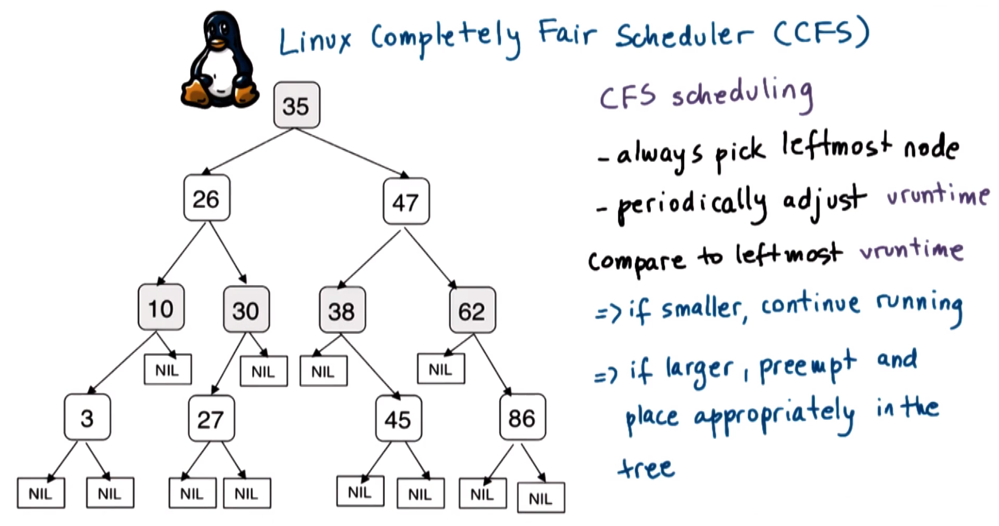

The Completely Fair Scheduler (CFS) **scheduling algorithm** can be summarized as in the figure shown above.
  * The Completely Fair Scheduler (CFS) always schedules the task which has the least amount of time on the CPU (i.e., the ***left-most node*** in the tree).
  * The Completely Fair Scheduler (CFS) periodically adjusts (i.e., increments) the vruntime of the task that is currently executing on the CPU, at which point it compares the vruntime of the currently running task with that of the left-most task in the tree.
    * If the vruntime of the currently running task is smaller, then continue running the task.
    * Otherwise, if the vruntime of the currently running task is larger, then preempt the currently running task and place it appropriately in the tree. Then, the new leftmost node will be selected to run next.

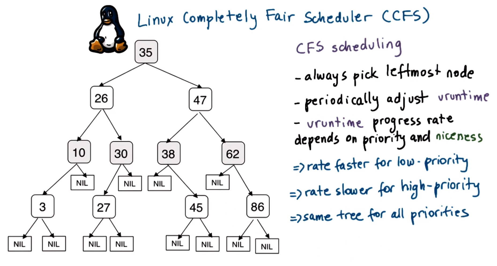

To account for differences in task priorities or in niceness values, the Completely Fair Scheduler (CFS) changes the **effective rate** at which the tasks' vruntimes progress.
  * For ***lower-priority tasks***, time passes "more quickly," i.e., the vruntime progresses ***faster***, and therefore these tasks are more likely to lose their CPU more quickly (due to their vruntimes increasing more quickly relative to other tasks in the system).
  * Conversely, for ***higher-priority tasks***, time passes "more slowly," i.e., the runtime progresses ***more slowly***, and therefore these tasks will be able to execute on the CPU longer.

Note that the Completely Fair Scheduler (CFS) uses *one* tree data structure for *all* of the priority levels, unlike what was seen previously in other schedulers examples.

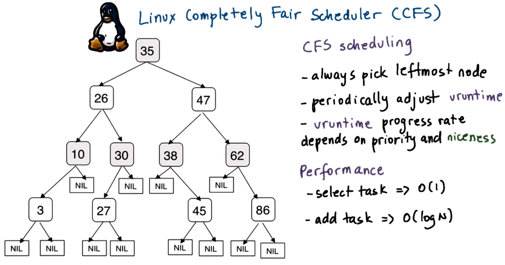

In summary, the **performance** of the Completely Fair Scheduler (CFS) is as follows:
  * ***Selecting*** a task to execute from the runqueue takes `O(1)` run-time (i.e., typically a trivially simple access of the left-most node in the tree).
  * ***Adding*** a new task to the runqueue takes `O(log N)` run-time (where `N` is the total number of tasks in the system).
    * Given current systems' load levels, this run-time performance is acceptable, however, as the computer's capacity of the nodes continues to increase and systems are able to support more and more tasks, it is possible that at some point the Completely Fair Scheduler (CFS) will be replaced by something else that will be more performant with respect to this performance criterion (i.e., adding a new task).

## 20. Linux Scheduler Quiz and Answers

What was the **main reason** that the Linux O(1) scheduler was replaced by the CFS scheduler? (Select the correct answer.)
  * Scheduling a task under high loads takes an unpredictable amount of time.
    * `INCORRECT`
      * The Linux O(1) scheduler takes constant time (i.e., O(1)) to select and schedule a task, regardless of the load.
  * Low-priority tasks can wait indefinitely and starve.
    * `INCORRECT`
      * While not completely incorrect (in the sense that as long as there are continuously arriving higher-priority tasks in the system, then it *is* possible for lower-priority tasks to starve), this is not the *main* reason why the O(1) scheduler was replaced.
  * Interactive tasks can wait unpredictable amounts of time to be scheduled to run.
    * `CORRECT`
      * Common workloads have become increasingly interactive, and therefore demanded higher predictability. In the O(1) scheduler, with the active and expired lists, once a task is moved to the expired list, it must wait there until *all* of the low-priority tasks consume their entire time quanta.
      * ***N.B.*** For a long time, Linus Torvalds resisted integrating a scheduler that would address the needs of these more-interactive tasks in the Linux kernel, his rationale being that Linux was intended to be a general-purpose operating system, which should not address the particular needs of some more-real-time or more-interactive tasks, and consequently he preferred the relative simplicity of the O(1) scheduler. However, as the general-purpose workloads began to change, it became necessary for Linux as a general-purpose operating system to incorporate a scheduler that would address these evolving needs; this was therefore accomplished by adopting the Completely Fair Scheduler (CFS).

## 21. Scheduling on Multi-Processor (i.e., Multi-CPU) Systems

Consider now scheduling on multi-CPU systems.

### Architecture Overview

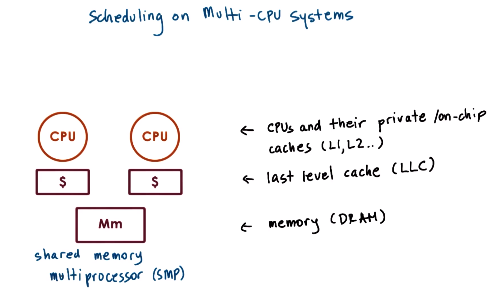

Before proceeding, consider the **architecture details** in such a system, as shown in the figure above.

First consider a **shared memory multiprocessor (SMP)** (later, we will examine and compare this to multi-core architectures). A shared memory (SMP) is characterized by:
  * Multiple CPUs, each having their own ***private*** caches (e.g., L1, L2, etc.), which are *not* shared.
  * Last-level caches (LLCs), which may or may not be shared among the CPUs.
  * A system memory (DRAM) that is ***shared*** across all of the CPUs.
    * ***N.B.*** For simplicity, the figure above shows only *one* main memory (Mm) component, however, in general there may be multiple such physical components in a system. Nevertheless, in either case, the memory is ***shared*** among the CPUs.

### Multi-CPU Systems

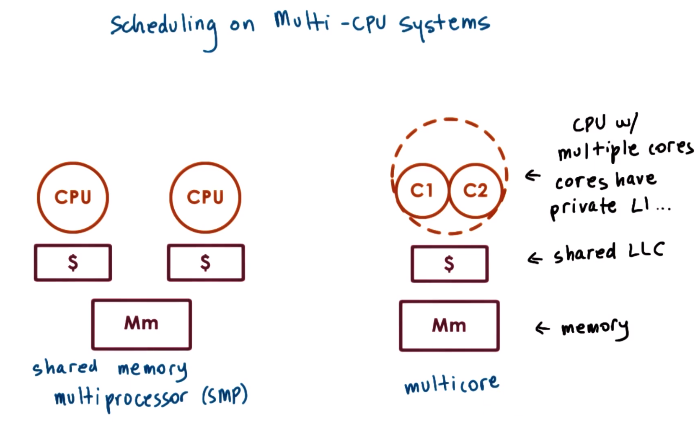

In current multicore (i.e., multi-CPU) systems (e.g., a dual-core processor, as shown in the figure above), each CPU can have multiple internal **cores** (i.e., multiple internal CPUs), each of which has a private cache, with the overall multi-core CPU having a shared last-level cache (LLC) and shared system memory (DRAM).
  * In current consumer/client devices (e.g., laptops and smartphones), dual-core processors are common, whereas in server-end platforms it is more common to have six- or eight-core CPUs and to have multiple such CPUs (i.e., multiple multi-core CPUs).

As far as the operating system is concerned, it sees all of the CPUs (i.e., in *both* shared memory multiprocessor *and* multi-core processor systems) as **entities** onto which it can schedule an execution contexts (i.e., a threads). and therefore all of these entities are target candidate CPUs for scheduling the operating system's workload.

To make discussion more concrete, we will first examine scheduling on multi-CPU systems in the context of shared memory multiprocessor (SMP) systems; correspondingly, many of these principles also apply to multicore processors as well. Furthermore, multicore systems will be compared and contrasted to this as well towards the end of the lecture.

### Scheduling on Shared Memory Multiprocessor (SMP) Systems

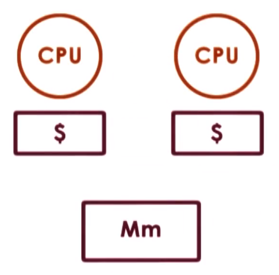

Recall from previous lectures (cf. P2L2 and P2L3) that the performance of threads and processes is highly dependent on whether the required state is present in the cache or in main memory.

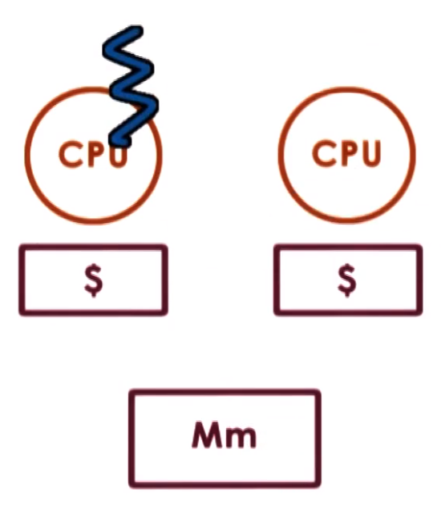

For example, consider a thread executing on one of the CPUs, as shown in the figure above.

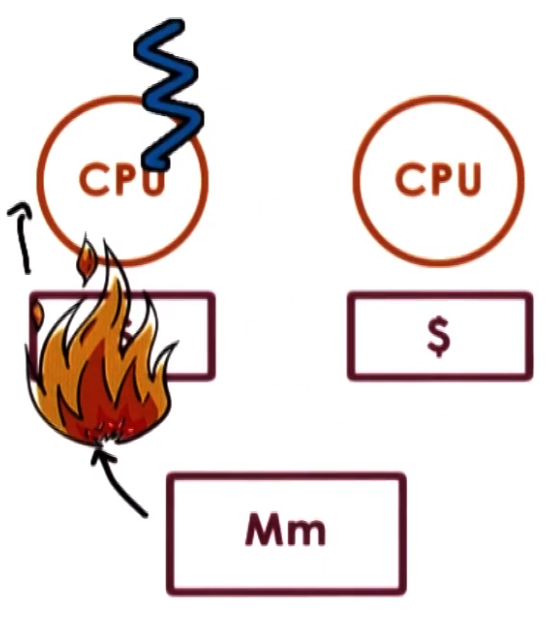

Over time, the thread is able to bring a lot of its required state both into the last-level cache that is associated with the CPU as well as into the private caches that are available on the CPU itself. In this case, the caches are ***hot***, thereby greatly improving performance of the thread.

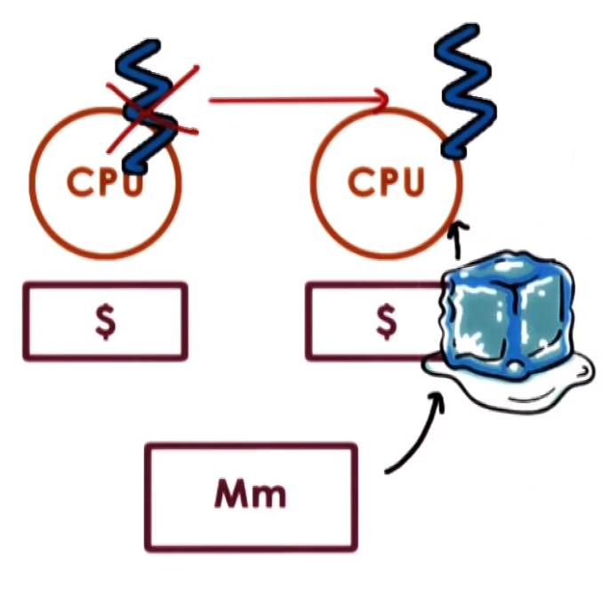

In the next pass-through, if the thread is scheduled to execute on the *other* CPU, none of the thread's state will be present in the corresponding new cache, and therefore it will be operating with a ***cold*** cache. Consequently, all of the state must be brought back in, thereby adversely impacting performance.

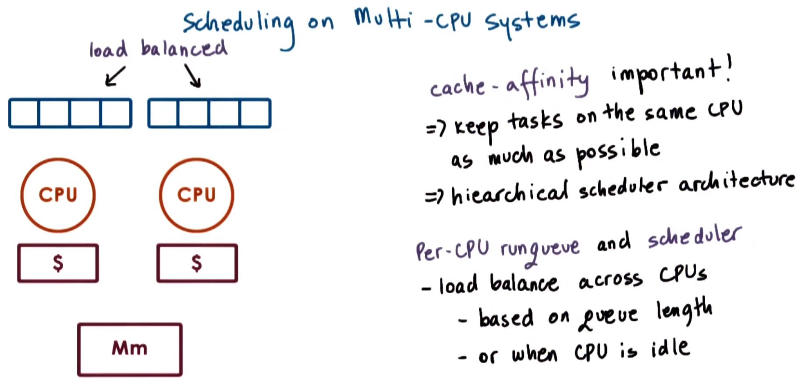

Therefore, with respect to multi-CPU systems, the **objective** is to schedule the thread onto the *same* CPU where it executed previously, because it is more likely that the cache will be hot; this principle is called **cache-affinity**, which is clearly an important feature for maximizing performance of the system.

To achieve cache-affinity, this can be implemented via a **hierarchical scheduler architecture**, which involves:
  * A **load balancing component** to divide tasks among the CPUs.
  * A per-CPU **scheduler** (each having a corresponding per-CPU **runqueue**) to repeatedly schedule tasks on a given CPU as much as possible.

To balance the load across the CPUs (and correspondingly across their respective per-CPU runqueues), the top-level entity in the scheduler (i.e., the load balancer) can examine relevant information such as:
  * The current length of each queue (i.e., to determine how to balance tasks across them).
  * Whether the CPU is idle, at which point it can examine the other CPUs to determine if there are other pending tasks among them which can be redistributed to the idle CPU(s).

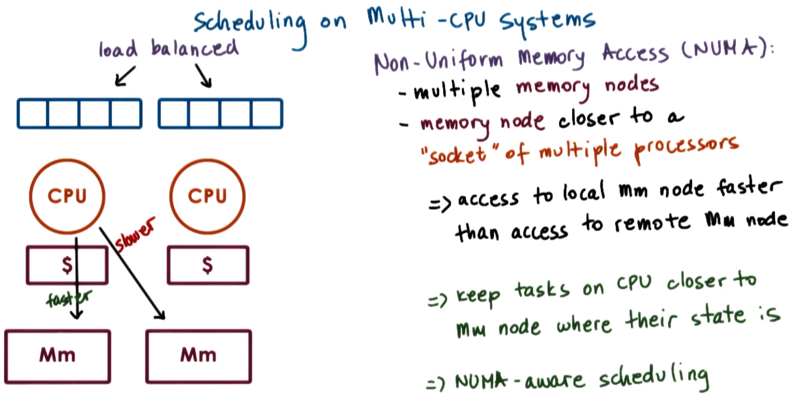

In addition to having multiple processors, it is also possible to have multiple main memory modules/nodes. In this case, the CPUs and the memory nodes are interconnected via some type of **interconnect** mechanism (e.g., on modern Intel platforms, there is an interconnect called **QuickPath Interconnect (QPI)**).

One way in which the memory nodes can be configured is such that a memory node can be technically connected to some subset of the CPUs (e.g., to a socket that has *multiple* processors). In this case, the access from this set CPUs will be comparatively ***faster** than to a memory node that is associated with another subset of CPUs. Both types of accesses are made possible via the interconnect that is connecting all of these components, however, there will be a disparity in the access times among them. Such types of platforms are called **Non-Uniform Memory Access (NUMA)**.

Therefore, from a scheduling perspective, it is sensible for the scheduler to divide the tasks in such a way that tasks are bound to those CPUs that are closer to the memory node where the state of those tasks is most-closely located; accordingly, this type of scheduling is called **NUMA-aware scheduling**.

## 22. Hyperthreading

The reason why it is necessary to context switch among threads is because the CPU has *one* set of **registers** to describe the active **execution context** (i.e., for the thread that is *currently* executing on the CPU).
  * In particular, these registers include the **stack pointer** and the **program counter**.

Over time, however, hardware architects have recognized that they can perform certain **design optimizations** to "hide" some of the overheads associated with such context switching.

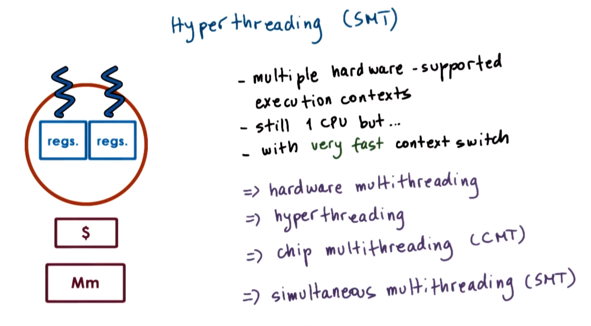

One way this has been achieved is to have multiple sets of registers, with each set of registers describing the context of a *separate* thread (i.e., a *separate* execution entity); a term that is used to described this scheme is called **hyperthreading**, which is characterized by:
  * Multiple hardware-supported execution contexts (i.e., "hyperthreads")
  * There is only *one* physical CPU, on which only one such thread can execute at any given time
  * The **context switching** operations (i.e., among the threads) are ***very fast***, however
    * This essentially involves the CPU switching from using one set of registers to another, without requiring anything to be saved or restored.

***N.B.*** This mechanism is referred to by multiple names (i.e., in addition to "hyperthreading"), including the following:
  * hardware multithreading
  * chip multithreading (CMT)
  * simultaneous multithreading (SMT)
    * "hyperthreading" and "SMT" are the most common usages, and will be used accordingly in this lecture.

Hardware today frequently supports two hardware threads, however, there are multiple higher-end server designs that support up to eight hardware threads. Furthermore, one of the features of today's hardware is the ability to enable or disable such hardware multithreading at boot time, given that there are trade-offs associated with this feature (as usual!).
  * If ***enabled***, from the operating system's perspective, each of the hardware contexts appears to the operating system's scheduler as a *separate* context (i.e., a separate virtual CPU) onto which it can schedule threads, given that it can load the registers with the thread's context concurrently.

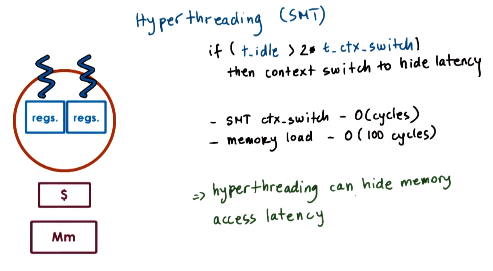

For example, in the figure shown above, the scheduler has the impression that it has two available CPUs, and consequently the scheduler will load the corresponding registers with the contexts of the respective threads. Therefore, one of the key **decisions** that the scheduler must make is to determine which particular two threads to schedule at the same time to run on these hardware contexts.

Recall (cf. P2L2) that if *`t`*`idle`` > 2*`*`t`*`ctx_switch`, then the context switch among the threads will hide idling latency. In simultaneous multithreading (SMT) systems:
  * *`t`*`ctx_switch` (i.e., between the two hardware threads) is on the order of cycles (i.e., `O(cycles)`)
  * The time to perform a memory access operation (e.g., memory load) remains on the order of 100s of cycles (i.e., `O(10``2`` cycles)`), which is much greater

Therefore, hyperthreading can **hide** memory access latency (i.e., it *is* sensible to perform context switches among the threads).

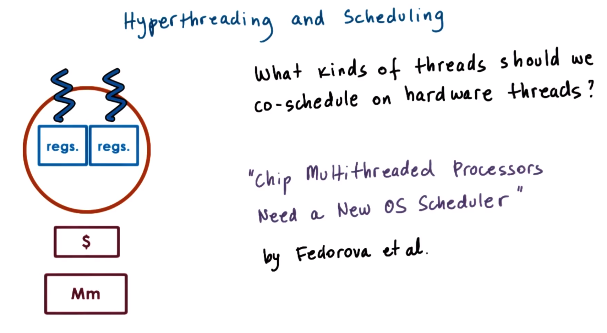

Hyperthreading does have **implications** for scheduling, inasmuch as it raises some other **requirements** when deciding what ***kinds*** of threads should be **co-scheduled** on the hardware threads of the CPU.
  * This topic will be discussed in the context of the paper "*Chip Multithreaded Processors Need a New OS Scheduler*" by Fedorova et al.

## 23. Scheduling for Hyperthreading Platforms

### Threads and Simultaneous Multithreading (SMT)

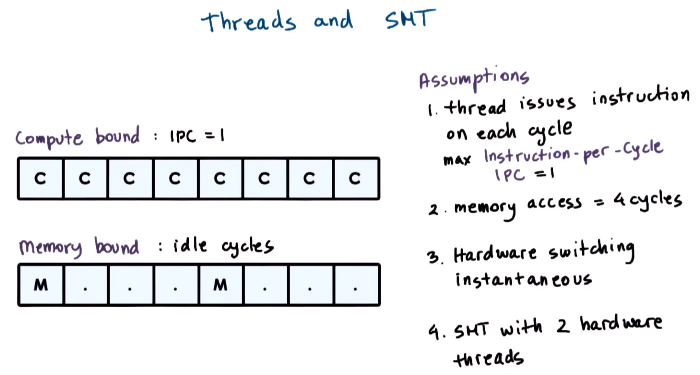

To understand what is required from a scheduler in a simultaneous multithreading system, let us first make some **assumptions**:
  1. A thread can issue an instruction on each cycle (`c`)
      * Therefore, a **CPU-bound thread** (i.e., a thread which issues instructions that *only* need to run on the CPU) will be able to achieve a *maximum* **instructions-per-cycle (IPC)** metric of `1 IPC` (i.e., given there is only one CPU, it is not possible to exceed this limit of `1 IPC`).
  2. A memory access operation requires `4` cycles.
      * Therefore, a **memory-bound thread** (`M`) will experience some **idle cycles** (`.`) while waiting for the memory access operations to return/complete.
  3. The time required to context switch among the various hardware threads is ***instantaneous*** (i.e., overheads are considered *negligible*).
  4. The system consists of a simultaneous multithreading (SMT) processor having `2` constituent hardware threads.

***N.B.*** These assumptions and associated figures are based on those made in the paper by Fedorova et al.

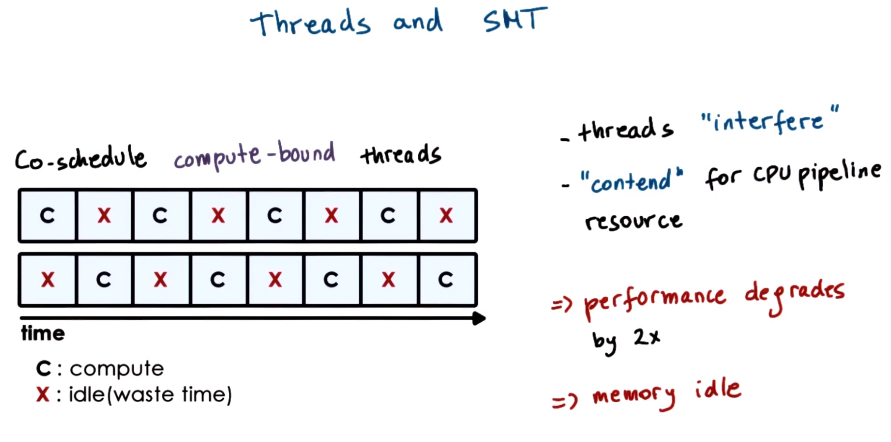

First, consider what would happen when there is **co-scheduling** of two **CPU-bound threads** on the two respective hardware contexts, as shown in the figure above. In this case, both of the threads are ready to issue a CPU instruction on *every* single CPU cycle, however, given that there is only *one* **CPU pipeline** (i.e., *one* fetch-decode-issue ALU logic), consequently only *one* of the threads can execute at any given point of time.

Therefore, the threads will **interfere** with each other, i.e., they will **contend** for the CPU pipeline resources, and in the ***best case*** each thread will spend one cycle idling (`x`) while the other issues its instruction. Consequently, the **performance** of *each* thread degrades by a factor of `2`.

Furthermore, examining the entire platform, observe that in this particular case the memory controller component is ***idle*** (i.e., nothing that is scheduled is performing memory access operations), which is another inefficiency.

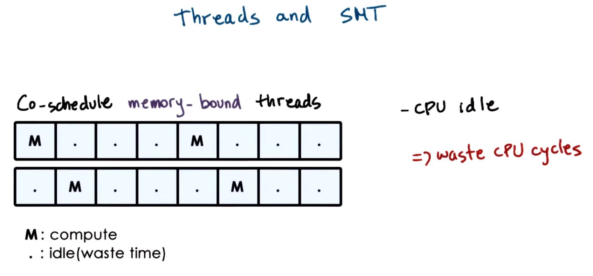

Alternatively, consider the co-scheduling of two **memory-bound threads**, as shown in the figure above. In this case, there are resulting **idle cycles** because *both* threads issue memory operations and consequently *both* threads wait a few cycles for their memory operations to complete, thereby resulting in ***wasted CPU cycles***, as before.

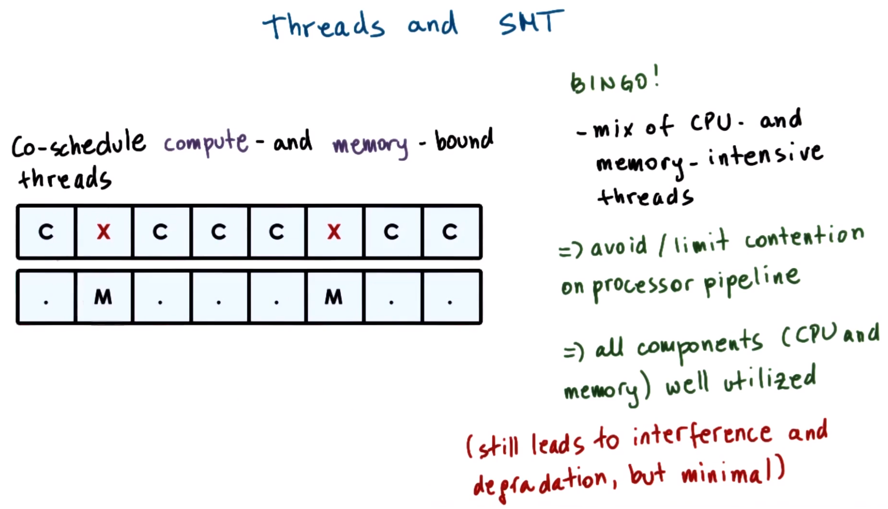

Therefore, a final option is to ***mix*** (i.e., co-schedule) CPU- and memory-bound threads, resulting in a more desirable scheduling scheme, as shown in the figure above. In this case, there is full utilization of *each* CPU cycle, with context switching to the memory-bound thread occurring when it is necessary to perform a memory operation, which in turn is followed by a context switch back to the CPU-bound thread to perform CPU operations while the memory operations occur.

This approach provides the following **benefits**:
  * Avoids (or at least limits) contention on the processor pipeline.
  * All components (i.e., the CPU and memory) are well-utilized.

A **drawback** of this approach is that there is still a level of degradation that occurs due to the interference between the threads (e.g., the CPU-bound thread can only execute on 3 of every 4 cycles in the figure shown above vs. 4 out of 4 when running by itself). However, in practice, this level of degradation will be minimized given the properties and corresponding design of the particular system in question.

## 24. CPU-Bound or Memory-Bound?

