# P3L2: Memory Management

## 1. Preview

This lecture will discuss the **memory-management mechanisms** used in operating systems, i.e., how operating systems manage **physical memory** and also how they provide processes with the "illusion" of **virtual memory**.

Note that the intent of this course is to review some of the basic mechanisms in operating systems, as well as to serve as a refresher of this (perhaps previously seen) content. Therefore, the **objective** of this lesson is to review the **key concepts** and to facilitate the use of additional references (e.g., textbooks, online material, etc.) in order to "fill in blanks."
  * Accordingly, this lecture will illustrate some **advanced services**.

## 2. Visual Metaphor

Returning to the toy shop analogy, **operating systems** and **toy shops** each have **memory/part management systems** (i.e., a mechanism to manage **state** required for processing actions).
  * In an operating system, this state is captured by **memory** (via the corresponding **memory-management subsystem**).
  * In a toy shop, state is captured by the various constituent **parts** that are required to assemble the toys.

| Characteristic | Toy Shop | Operating System Memory Management |
| :---: |  :---: |  :---: |
| Uses intelligently sized containers | Same-sized crates of toy parts to facilitate management of the parts in and out of the storage room | The memory management subsystem of the operating system typically manages memory at the granularity level of **memory pages** or **memory segments**, the size of which is an important design consideration |
| Not all parts/memory are needed at once | Toy orders are completed in stages, and not all toy orders are completed at the same time (e.g., teddy bears may require fabric and threads vs. other toys requiring wooden parts, etc.) | Executing tasks/processes on a computing system only operate on a ***subset*** of the entire memory at any given time, and therefore do not require *all* of the memory simultaneously (i.e., some subset of the memory state can be brought in/out of memory at any given time to meet the demands of the currently executing task) |
| The process is optimized for achieving high performance | Reduce the wait time for parts (i.e., reduce the time required to move the parts in/out of containers) in order to make more toys | Reduce the time to **access** state in memory (i.e., transferring state from main memory to/from memory pages and segments) in order to improve performance (i.e., to achieve ***faster*** memory access) |

To achieve performance improvements with respect to memory access optimization, operating systems' memory management subsystems rely on **hardware support**,e.g., **translation lookaside buffers (TLBs)**, caches, and **software algorithms** (e.g., for pages, for memory allocation, etc.).

## 3-4. Memory Management

### Introduction

Recall (cf. P2L1) that the introductory lecture on processes and process management briefly discussed a few **basic mechanisms** pertaining to memory management. The **goal** of this lecture is to complete this discussion with a more detailed description of operating-system-level memory management components.

### 3. Memory Management: Goals

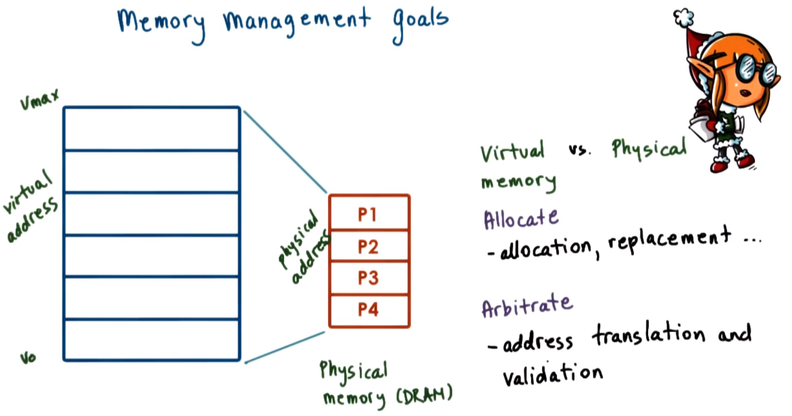

Recall that one of the **roles** of the operating system is to manage the physical resources (e.g., **physical memory (DRAM)**) on behalf of one or more executing processes.

In order to avoid the imposition of a ***limit*** on the size and on the layout of an address space (i.e., based on the amount of physical memory that is actually available, and/or based on how it is shared among processes) there is a ***decoupling*** of the notions of **physical memory** (available on the hardware itself) vs. **virtual memory** (used by the address space).

As a matter of fact, most processes use **virtual addresses**, which in turn are ***translated*** into the actual **physical addresses** where the particular process state is stored.
  * The **range** of the virtual addresses (i.e., from `V``0` to `V``max`) establishes the amount of virtual memory that is visible in the system, which can in fact ***exceed*** the amount of available physical memory.

Therefore, in order to manage the **physical memory** itself, the operating system must be able to **allocate** physical memory and to **arbitrate** how the physical memory is accessed.
  * **Allocation** requires that the operating system incorporates certain **mechanisms** (e.g., algorithms and data structures) to track how physical memory is being used, as well as to determine what regions of physical memory are free at any given time.
  * Furthermore, since the physical memory is generally ***smaller*** than the virtual memory, it is likely that some of the contents required in the virtual address space are not present in physical memory (e.g., they may be stored on secondary storage, such as on disk); therefore, the operating system must have mechanisms to perform **replacement** operations (i.e., replacing the contents *currently* in physical memory with content that is currently *needed* in the virtual address space but is instead present in some other temporary storage).
    * To accomplish this, there is some **dynamic component** in the memory management system that determines *when* content should be brought in from disk as well as *which* content from physical memory should be  stored on disk, depending on the kinds of processes that are currently running.
  * **Arbitration** requires that the operating system is quickly able to **interpret** and **verify** a process's memory access attempt (i.e., when examining the virtual memory address space, the operating system should be able to quickly **translate** the virtual address into a corresponding physical address, as well as to **validate** that the access attempt is indeed ***legal***).
    * To accomplish this, current operating systems rely on a combination of **hardware support** as well as smartly-designed **data structures** that are used in to perform  **address translation** and **address validation**.

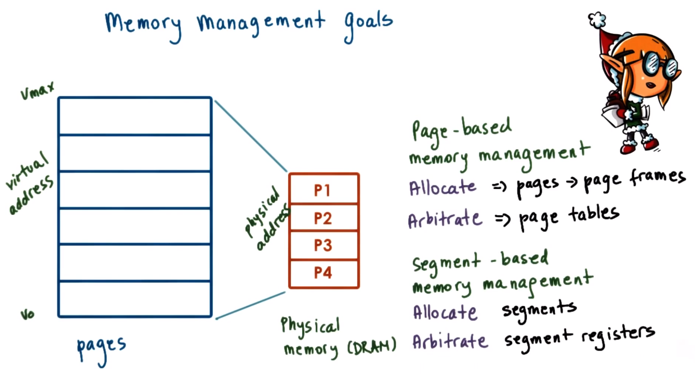

As shown in the figure above, the **virtual address space** is subdivided into thick-sized segments of uniform size called **pages**. Analogously, the (generally smaller) **physical address space** is simlarly subdivided into **page frames**, of the same size as the corresponding virtual-address pages.

In **page-based memory management** (or **paging**):
  * The role of **allocation** (as performed by the operating system) is to ***map*** pages from virtual memory to page frames of the physical memory.
  * Furthermore, the **arbitration** of the memory accesses is achieved via **page tables**.

However, paging is not the only mechanism by which to achieve such decoupling of the virtual and physical memories. In **segment-based memory management** (or **segmentation**):
  * With respect to **allocation**, rather than using fixed-sized pages, flexibly-sized **segments** are used to map regions of physical memory as well as to swap in/out of physical memory.
  * With respect to **arbitration** of memory accesses (i.e., to translate or to validate appropriate acceses of the physical memory), **segment registers** are used (which are typically supported on modern hardware).

***N.B.*** **Paging** is currently the dominant form of memory management in modern operating systems, and therefore it will be the focus of current discussion (segmentation will be revisited later in this lecture).

### 4. Memory Management: Hardware Support

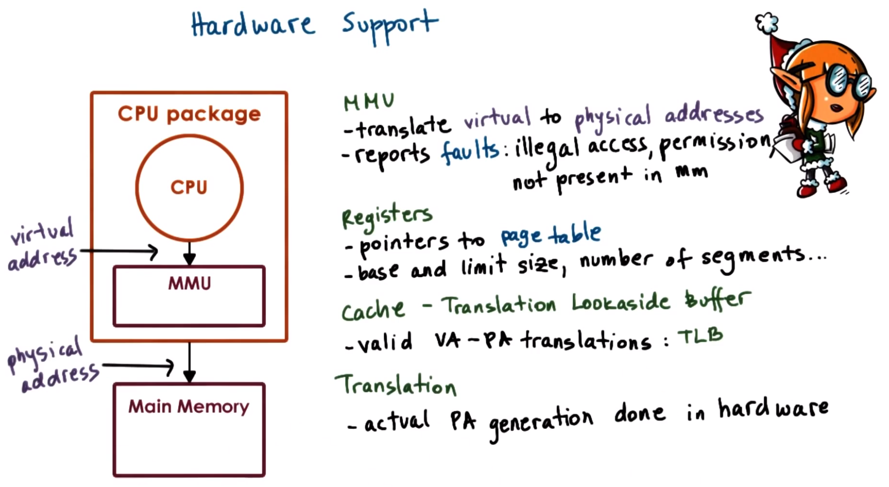

As was already suggested, memory management is *not* performed solely by the operating system alone, but rather to improve the efficiency of these **memory management operations**, the **hardware** has evolved over the most recent decades to integrate a number of **mechanisms** to facilitate easier, faster, and/or more-efficient memory management operations (e.g., memory allocation and arbitration).
  * Every CPU package is equipped with a **memory management unit (MMU)**.
    * The CPU issues virtual addresses to the memory management unit (MMU), which in turn is responsible for ***translating*** the virtual addresses to the appropriate physical addresses.
    * Furthermore, the memory management unit (MMU) can generate/report **faults**, which occur as signals that can result from:
      * Illegal memory access attempts (e.g., accessing an address that has not been allocated at all).
      * An inadequate permission level to perform the request access operation (e.g., the memory reference is part of a store instruction in which the process is attempting to overwrite a particular memory address to which it does not have write-access permission, i.e., the page in question is ***write-protected***).
      * An attempt to access memory that is not present in **main memory (MM)**, and there must be ***fetched*** from disk.
  * Designated **registers** also support memory management during ***address translation***.
    * For example, in a paged-based system, there are registers used to point to the currently active **page table**.
    * Similarly, in a segment-based system, there registers used to indicate the base address of the segment, the size limit of the segment, the total number of segments, etc.
  * Since memory address translation occurs for practically all memory references, accordingly most memory management units (MMUs) integrate a small cache of valid virtual-address-to-physical-address translations; this cache is called the **translation lookaside buffer (TLB)**.
    * The translation lookaside buffer (TLB) improves the speed of address translation operation, inasmuch as the presence of such a translation in the cache obviates the need to otherwise perform an additional operation to accomplish this mapping (e.g., accessing the page table and determining the validity of the address).
  * Finally, the actual generation/**translation** of the physical address itself (i.e., from the virtual address) is performed by the **hardware**.
    * The operating system maintains certain **data structures** (e.g., **page tables**) to maintain certain information that is necessary to perform this translation, however, the actual translation itself is performed by the hardware.
    Furthermore, this also implies that the hardware itself dictates what type of **memory management modes** are supported (e.g., segmentation, paging, or both via what types of corresponding registers the hardware supports), as well as what types of pages that can be used, the formats of the virtual addresses and of the physical addresses (i.e., in order to be understood by the hardware itself), etc.

There are other aspects of memory management that are more flexible with respect to their design, since they are performed by the software (e.g., the actual memory allocation of the processes to the main memory's address space, the replacement policy to determine which portion of state will be present in main memory vs. on disk, etc.). The discussion will focus on these **software-oriented aspects** of memory management, since that is most relevant from the perspective of an operating systems course.

## 5. Page Tables

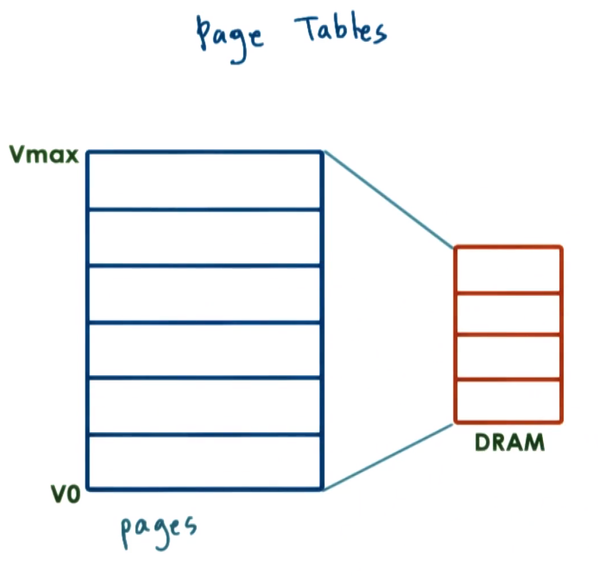

As was mentioned, paging is currently the more popular approach to memory management, as shown in the figure above.

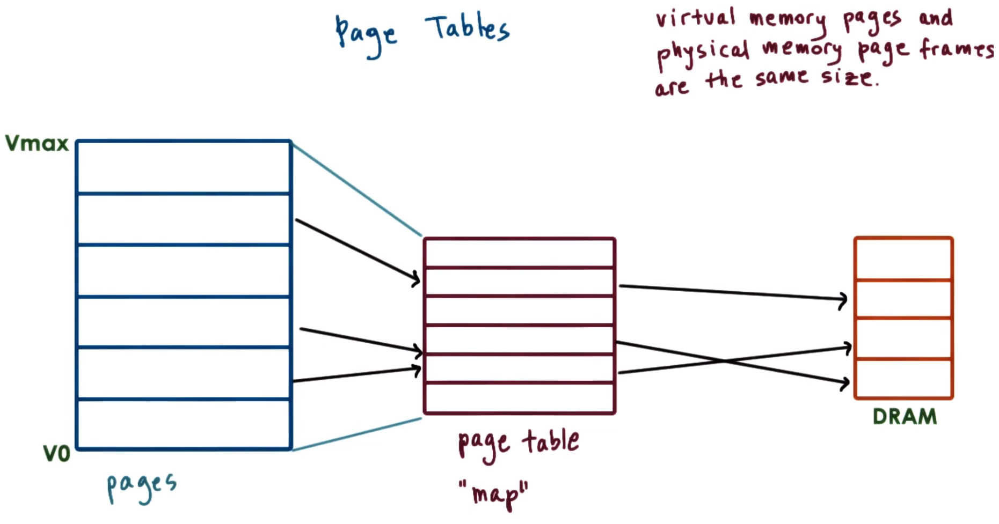

Now, consider one of the major components that allows page-based memory management: **page tables**. Page tables alow to translate virtual memory addresses to physical memory addresses, as shown in the figure above.

For each virtual address, an **entry** in the page table is used to determine the actual physical location corresponding to the virtual address in the physical memory (DRAM). Therefore, in this manner, the page table serves a "**map**" which instructs the operating system (as well as the hardware itself) where to find specific virtual memory references.

While the relative sizes in the figure shown above are not strictly to scale, note that the **sizes** of the **pages** in virtual memory are ***identical*** to the sizes of the corresponding **page frames** in physical memory.
  * By maintaining this 1:1 relationship between the sizes, this obviates the requirement to maintain the translation of *every* individual virtual address in the page table, but rather it is only necessary to translate the ***first*** address of a virtual-address page to the ***first*** address of the corresponding physical-address page frame (and consequently, the subsequent addresses will similarly correspond directly between the two via appropriate offsets relative to the first address).
  * Consequently, the number of entries that must be maintained in the page table is ***reduced*** substantially.

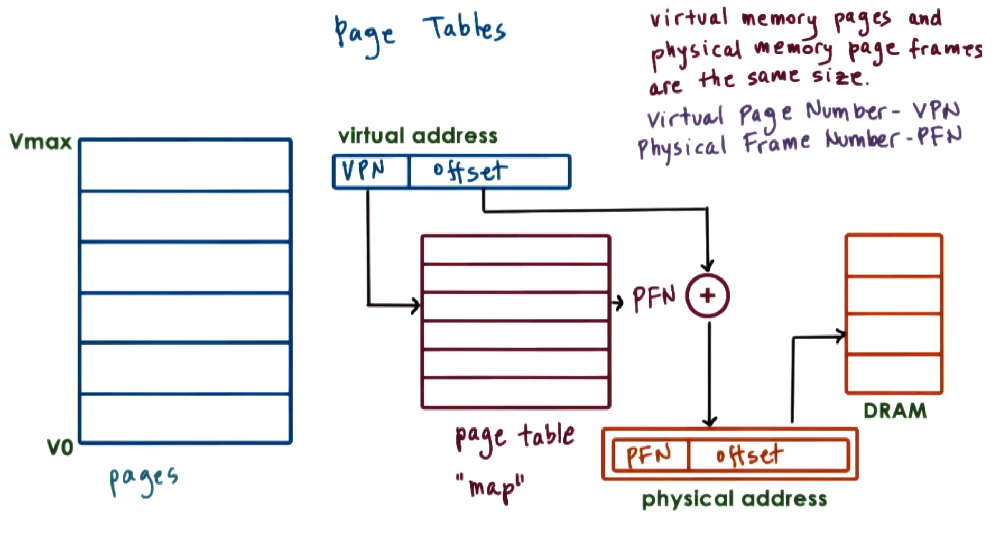

Therefore, only the first portion of the **virtual address** is used to ***index*** into the page table; this part of the virtual address is called the **virtual page number (VPN)**, while the remaining portion of the virtual address is the actual **offset**.

The virtual page number (VPN) is used as an offset into the page table itself, which in turn produces the **physical frame number (PFN)** (the corresponding physical address of the page frame itself, located in DRAM/physical memory).

In order to complete the full translation of the virtual address, the physical frame number (PFN) is **combined** with the offset portion specified in the latter portion of the virtual address to produce the actual **physical address**.

The resulting physical address can then ultimately reference the appropriate location in physical memory (i.e., DRAM).

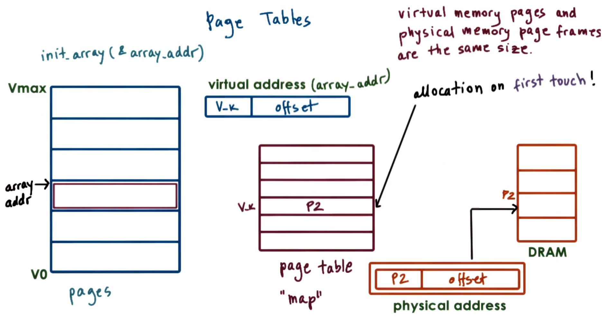

Consider an example, as shown in the figure above. Here, there is an attempt to access the data structure `array_addr` to initialize it (via function call `init_array(&array_addr)`).

The memory for `array_addr` has already been allocated in the virtual address space for the process, however, it has not yet been accessed prior to this point in the process. Consequently, the operating system has not yet allocated memory for `array_addr`.

Therefore, on first access of this memory location in the virtual address space, the operating system determines that there is no physical memory corresponding to the range of virtual memory addresses corresponding to `array_addr`, therefore, the operating system will allocate a page frame `P2` from physical memory via corresponding mapping in the page table to virtual address `V_k` (with corresponding offset).

Note that the physical memory for `array_addr` is only physically allocated when the process ***first*** attempts to access it (i.e., during initialization in this particular case); this is referred to as ***allocation on first touch***. This ensures that physical memory is *only* allocated when it is actually needed (e.g., to avoid allocating physical memory for data structures that programmers create but never use in the program/process).

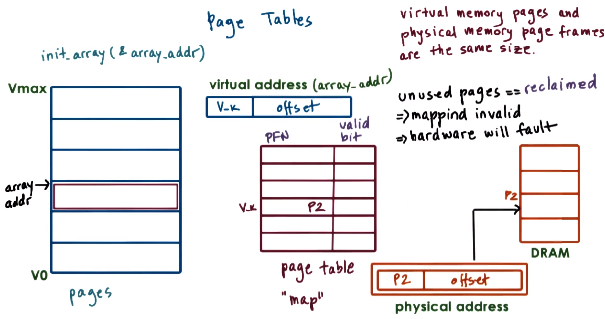

Consequently, if the process does not use some of its memory pages for an extended time period, it is likely that those pages will be **reclaimed** (i.e., the contents will no longer be present in physical memory, but rather they will be moved to disk and replaced with other memory content which is relevant to currently running processes). 

In order to detect this, page-table **entries**  consist of both the physical frame number (PFN) *and* a **valid bit**, with the latter informing the memory management system regarding the (in)validity of the attempted memory access.
  * For example, if the page frame *is* present in physical memory and the mapping *is* valid, then the valid bit is `1`.
  * Conversely, if the page frame is *not* present in physical memory, then the valid bit is `0`.

If the hardware's **memory management unit (MMU)** detects that the valid bit is set to `0` in the page-table entry, then it will raise a **fault** (i.e., it will trap to the operating system). In this case, control is passed to the operating system, at which point the operating system must determine the following:
  * Should the access be permitted?
  * Where exactly is the page located in the physical memory (i.e, the corresponding page frame)?
  * Where should the page be brought into the physical memory?

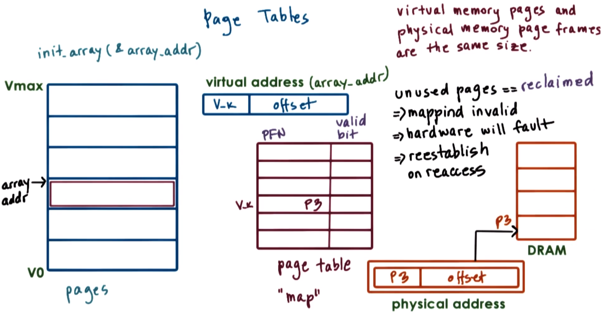

As long as a ***valid*** address is being accessed by the process, on the occurrence of a fault, ultimately there will be a **restablished** mapping between a valid virtual address (e.g., `&array_addr`) and a valid location in physical memory.

However, it is likely that if a page frame was moved to disk and is now being brought back into physical memory, then it will be placed in a different location of physical memory (e.g., `P3`) than that at which it was present originally (e.g., `P2`). Accordingly, the corresponding page-table entry is updated to reflect this.

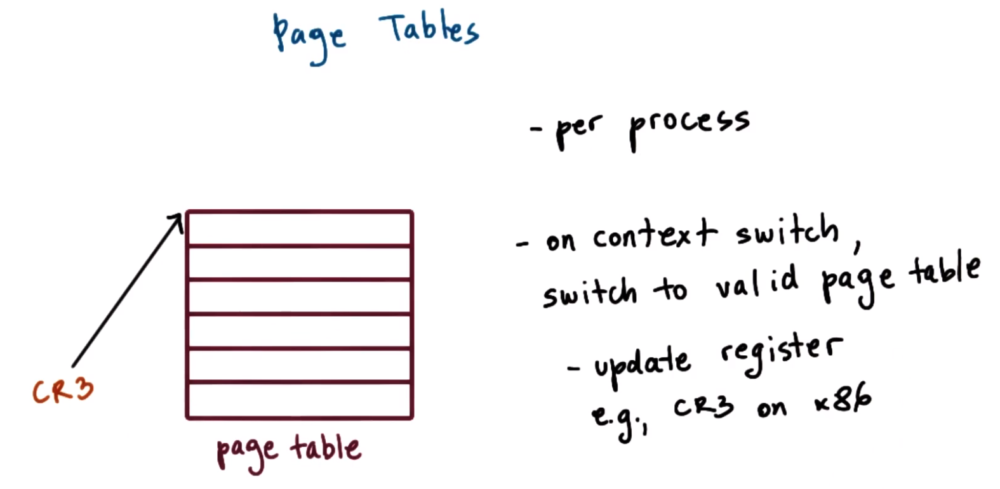

As a final note, to summarize, the operating system creates a page table on a ***per-process*** basis. The operating system maintains such a page table for *every* single running process that exists in the system.

Therefore, on **context switch**, the operating system must ensure that it correspondingly switches to the appropriate (i.e., valid) page table for the switched-to process.

Furthermore, recall that hardware assists with page table accesses by maintaining a **register** to point to the active page table (e.g., on x86 platforms, register `CR3` performs this role, maintaining the address for the page table of the *currently* running process, including following a context switch).

## 6. Page Table Entry

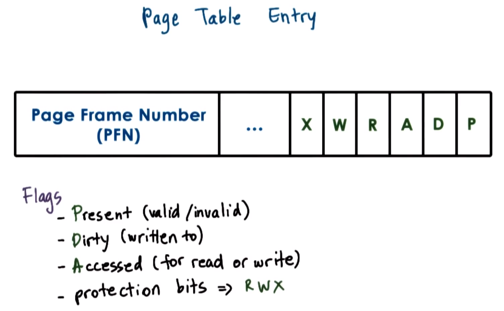

Recall that every page table **entry** contains the **page frame number (PFN)** of the corresponding physical address, as well as (at least one) valid bit; this bit is called the **present bit (P)**, since it indicates whether or not the contents of the virtual memory are actually present in physical memory.

Additionally, there are a number of fields/**flags** that are part of each page table entry used by the operating system during memory management operations, which in turn are also understood and interpreted by the hardware. These include:
  * The **dirty bit (D)**, which is set whenever a page is written to.
    * For instance, this is useful in file systems, where files are cached in memory. Here, the dirty bit can be used to detect which files have been written to and therefore must be updated on disk.
  * The **accessed bit (A)**, which tracks whether the page has been accessed in general (i.e., either for reading or for writing).
  * Other useful information maintained by the page table entry include **protection bits**, i.e., whether a page can be only read (**R**), only written to (**W**), and other similar operations (**X**).

### Page Table Entry on x86

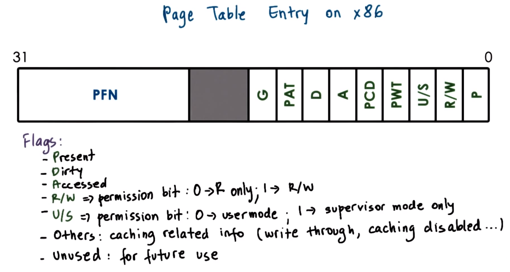

As a more concrete/practical example of a page table entry, consider that of an Pentium x86 system, as shown in the figure above, having the following **flags**:
  * The bits/flags **Present (P)**, **Dirty (D)**, and **Accesses (A)** have identical meanings as for that described more generically in the previous section.
  * The **Read/Write (R/W)** bit is a single bit indicating a permission.
    * The value `0` indicates a read-only-access page.
    * The value `1` indicates that both read and write accesses are permissible for the page.
  * The **U/S** bit is another type of permission bit indicating the access level.
    * The value `0` indicates that the page can only be accessed from `user` mode.
    * The value `1` indicates that the page can only be accessed from `supervisor` (i.e., kernel) mode.
  * The other bits/flags indicate the behavior of the caching system present on the hardware (e.g., whether or not caching is disabled, write-through enabled, etc.).
  * Furthermore, there is a region of **unused** bits/flags which are reserved for future use.

### Page Fault

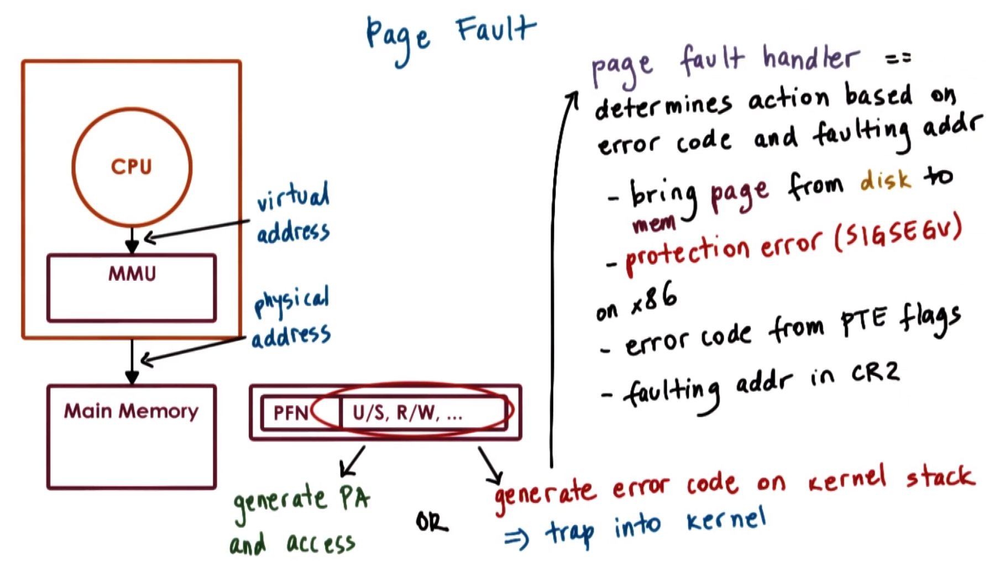

The **memory management unit (MMU)** uses the page table entry not only to perform the virtual-address-to-physical-address translation, but also relies on the aforementioned bits to establish the **validity** of the memory access operation.

If the hardware (i.e., memory management unit (mmu)) determines that a requested memory access operation cannot be performed, it generates a **page fault**; in this case, the CPU places an **error code** on the kernel stack and the generates a **trap** into the operating system kernel.

Consequently, this generates a **page fault handler**, which determines the appropriate action to perform based on the error code and the faulting address that generated the error. The key **information** included in the error code are the following:
  * Whether or not the fault was caused due to the page not being ***present***, and therefore requiring a corresponding transfer from the disk into main memory.
  * There was an attempt to access memory which violated a permission protection, resulting in a **protection error** (e.g., `SIGSEGV`).

***N.B.*** On an x86 system, the error code information is generated from the page table entry flags, and the faulting address (as required by the page fault handler) is stored in register `CR2`.

## 7. Page Table Size

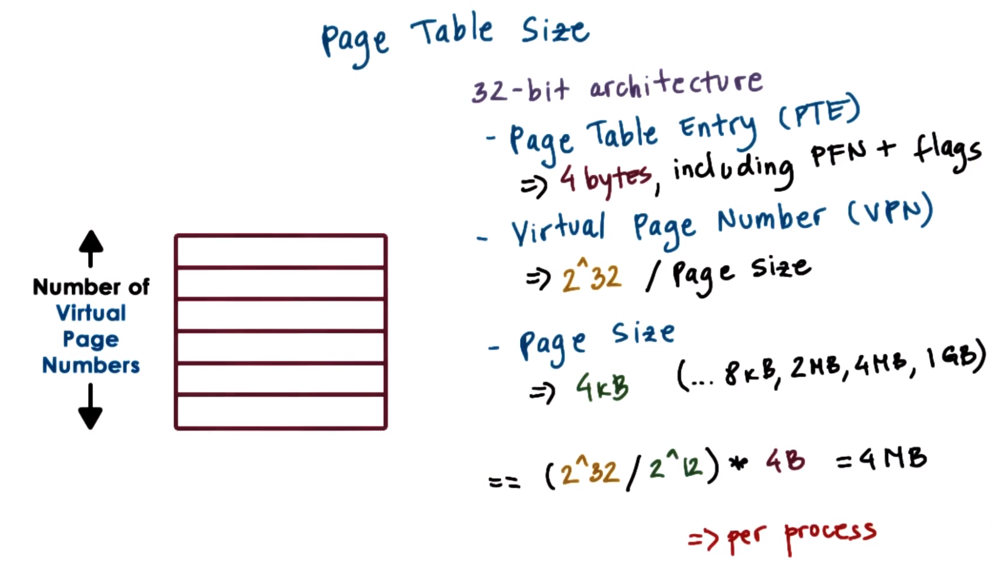

To calculate the **size** of a page table, note that a page table contains the *same* number of entries as is equal to the number of **virtual page numbers(VPNs)** existing in the virtual address space. Furthermore, each of these entries contains the page frame number (corresponding to the locatin in the physical address space) as well as other information (e.g., permission bits).

For example, on a **32-bit architecture** (as in the figure shown above), a sensible sizing would be as follows:
  * Each **page table entry (PTE)** consists of `4 bytes`, which includes the page frame number (PFN) and corresponding flags.
  * Therefore, the **total number** of page table entries (PTEs) depends on the total number of **virtual page numbers (VPNs)**, which in turn is dictated by both the size of the virtual addresses and by the size of the page itself.
  * In the case of a 32-bit architecture (for *both* the physical memory as well as the virtual address space), this amounts to a total number of page table entries (PTEs) of `2``32``/page size`.

Different hardware platforms support different page sizes. For the sake of argument, taking a page size of `4 KB` (a commonly used page size), on a 32-bit architecture, this results in `[(2``32`` total addressable bits) / (4 * 2``10`` bits/page)] * (4 KB / 1 PTE) = 4 MB/page` for *each* process. With many active processes in a modern operating system, this can quickly become a large quantity.
  * ***N.B.*** Other common page sizes include `8 KB`, `2 MB`, `4 MB`, and `1 GB`

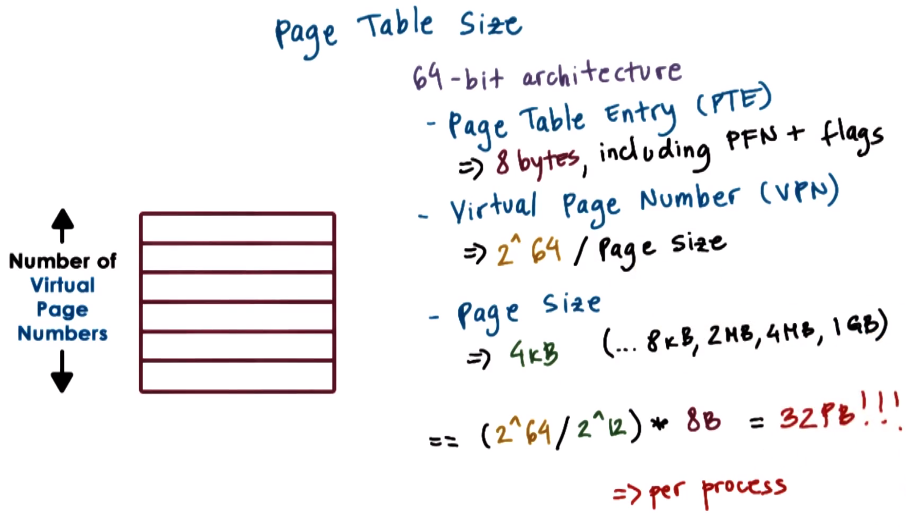

Consider similar analysis for a **64-bit architecture** having a page table entry (PTE) size of `8 bytes` and a `4 KB` page size (as before), as in the figure shown above. This gives a total number of page table entries (PTEs) of `[(2``64`` total addressable bits) / (4 * 2``10`` bits/page)] * (8 B / 1 PTE) = 32 PB/page` for *each* process, an astronomically large number. A natural question is therefore: Where is all of this memory stored?

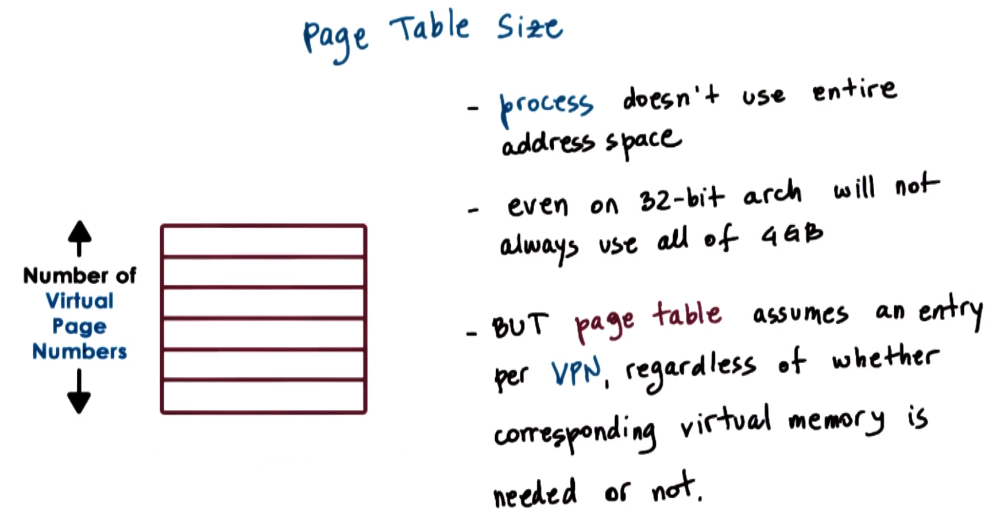

Before answering this question, note that a given process generally does *not* use the ***entire*** virtual memory address space that is theoretically available; even on 32-bit architectures, a typical process does not use all of the available `4 GB` of virtual-address-space memory.

However, the **issue** that arises here is that the **page table** (as described so far) assumes an entry for *each* virtual page number (VPN), regardless of whether or not the corresponding virtual-memory region is needed by the process. Therefore, such a page table design "explodes" the requirements for the page table size.

The following sections will therefore explore alternative methods to represent the page table size in a more practical manner.

## 8. Hierarchical (Multi-Level) Page Tables

As suggested in the preceding discussion, a "flat" page table design is no longer tenable given current memory usage demands.

Instead, page tables have evolved from a flat page map to a more ***hierarchical, multi-level*** structure, as in the figure shown above (which shows a **two-level page table**).

In a two-level page table:
  * The **outer page table** (or **top page table**) is referred to as a **page table directory**, whose elements are not *direct* pointers to physical memory pages but rather are pointers to page tables.
  * The **internal page table** has proper page tables as its elements, which themselves point to actual physical memory pages. Their entries have the page-frame number and corresponding protection bits for the physical addresses referenced by the corresponding virtual addresses.
    * An **important aspect** of the internal page table is that its elements (i.e., the actual page tables) *only* exist for **valid** virtual-memory regions (i.e., "holes" in the virtual-memory address space result in a corresponding "lack" of an entry in the internal page table).

If a process requests memory (e.g., via call to `malloc()`), additional virtual memory can be allocated to the process. In this case, the operating system will examine the internal page table, and if necessary will allocate an additional page table element in the internal page table and correspondingly set the appropriate page table directory to point to this new entry in the internal page table. This new internal page table entry will in turn correspond to some portion of the newly allocated virtual memory region that the process has requested.

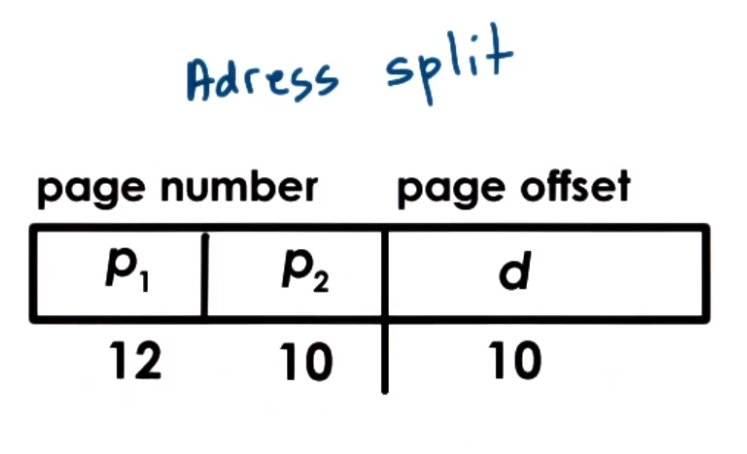

To find the correct element within the internal page table, the **virtual address** is ***split*** into yet another component, having the **address format** as shown in the figure above.

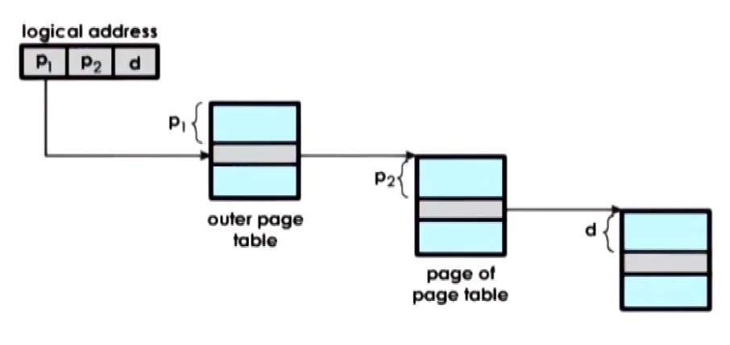

Using this address format, the correct physical address can be determined by the sequence shown in the figure above.
  * The last portion of the address (`d`) is the offset (as before), which is used to compute the offset within the actual physical page frame.
  * The first two components of the address (`p1` and `p2`) are indices into the respective page tables, which in combination produce the physical frame number (PFN) constituting the starting address of the physical-memory region.
    * `p1` is used as an index into the outer page table (which determines the page table directory entry, i.e., pointing to the actual page table in question).
    * `p2` is used as an index into the internal page table to produce the page table entry consisting of the physical frame number (PFN), which in turn is added to the offset (as before) to compute the actual physical address.

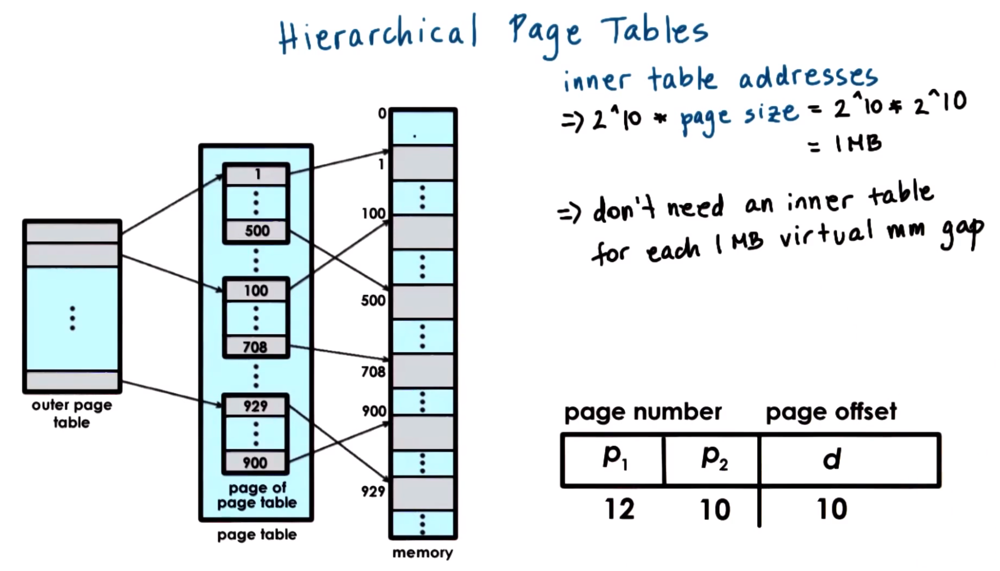

In the figure shown above, the example shows an address format having `10 bits` for the internal page table offset (i.e., `p2`), or a page size of `2``10` pages. Therefore, given a page offset (i.e., `d`) of `10 bits` (i.e., a corresponding **page size** of `2``10` bits/page), each internal page table can address `(2``10`` pages/internal page table) * (2``10`` page size) = 1 MB / inner-page-table page element`. This indicates that whenever there is a "**gap**" in the virtual memory of size `1 MB`, it is unnecessary to allocate the corresponding page table entry in the internal page table; this correspondingly ***reduces*** the overall size of the internal page table required for a given process.

In contrast, with a single-level page table design, the page table must translate *every* single virtual address, with corresponding entries for *every* virtual page number (VPN).

Therefore, it is evident that the hierarchical page table model greatly promotes the reduction in the required size for the page table.

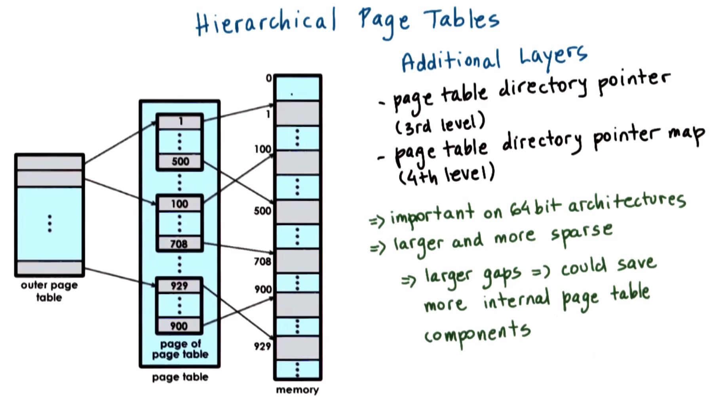

This scheme can be further ***extended*** to use **additional layers** by generalizing the same principle, as in the figure shown above.

For instance, a third level can be added, consisting of pointers to page table directories.

Similarly, adding a fourth level consists of a map of pointers to page table directories.

This technique is particularly important on 64-bit architectures, where the page tables are both much ***larger*** as well as much more ***sparse*** (i.e., there are more "holes" in the virtual address space for the processes).
  * Due to this sparseness, there are larger gaps in the virtual address space region, and correspondingly there are larger gaps in the constituent page tables components which are otherwise unnecessary.
  * In fact, with four-level addressing, it is possible to save/omit entire page table directories as a result of certain gaps in the virtual address space.

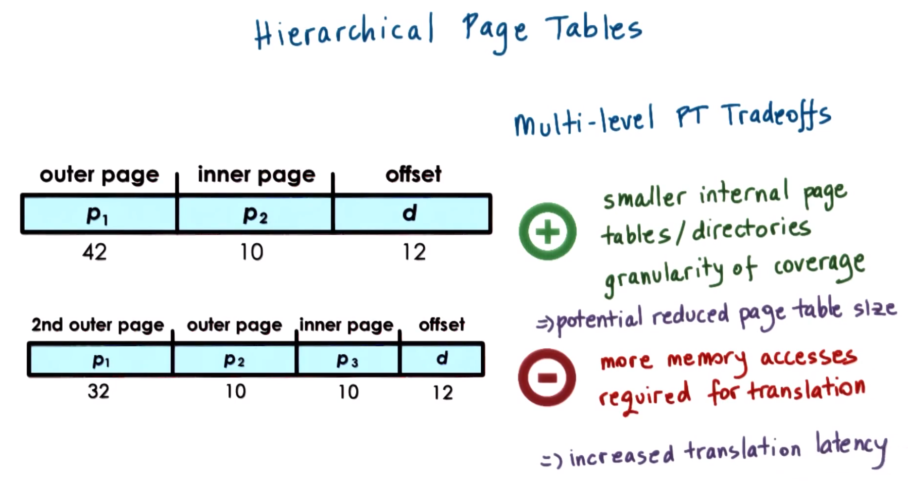

Consider an example of such a four-level address (using 64-bit addresses), as shown in the figure above. As before, a 64-bit virtual address can be interpreted to determine which indices are used to access the various levels of the page table hierarchy. In both the two-level and four-level addresses, the last region is the offset (`d`), representing the index into the actual physical page table.

There is a **trade-off** in supporting multiple levels in the page table hierarchy.
  * As a **benefit**, as multiple levels are added, the internal page tables and page table directories consequently cover increasingly smaller regions of the virtual address space, thereby potentially ***reducing*** the **page table size** (due to the resulting "gaps" increasingly matching the appropriate level of granularity).
  * Conversely, as a **drawback**, there are more memory access operations required to perform address translation (i.e., increasing proportionally to the number of levels of addressing) in order to reach the ultimate physical address, which results in an ***increased*** **translation latency**.

## 9. Multi-Level Page Table Quiz and Answers

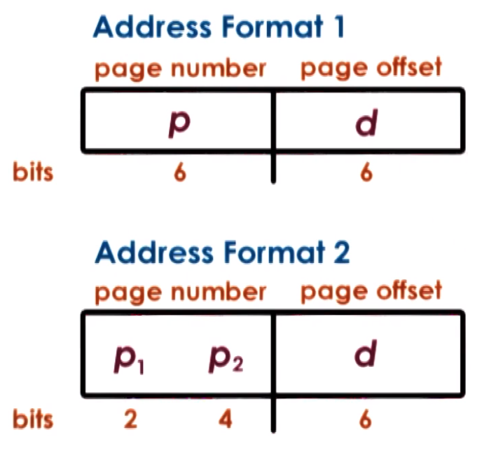

A process using `12 bit` addresses has an address space where only the first `2 KB` and the last `1 KB` are allocated and used.

How many total entries are there in a **single-level page table** that uses **Address Format 1** per the figure shown above?
  * `64`

How many entries are there in the inner page tables of the **2-level page table** that uses **Address Format 2**?
  * `48`

***Explanation***: In both formats, the page offset is `6` bits, therefore each page is `2``6` or `64 bytes`. Furthermore:
  * In **Address Format 1**, `6 bits` are used for the virtual page number (VPN) (i.e., `p`). Therefore, there are a total of `2``6` or `64` different pages. Furthermore, in a single-level page table, there is an entry for *each* of these `64` pages, giving a total of `64` page table entries.
  * In **Address Format 2**, the first two bits provide the index into the outer page table (i.e., `p``1`), and the next four bits provide the index into to the inner page tables (i.e., `p``2`). The bits of `p``1` address `2``4 + 6`` = 2``10` virtual addresses from the virtual address space. This means that every element of the outer page table can be used to hold the translations for `1 KB` of the virtual addresses. Given that the process is such that only the first `2 KB` and the last `1 KB` of the virtual address space are allocated, then one of the entries of the outer page table will not need to be populated with a corresponding inner page table; therefore, the four-bit memory required for the inner page table (i.e., `p``2`) can be saved and consequently reused for indexing into the inner page table, giving `2``4`` = 16` possible entries per inner page table element. Therefore, the total number of entries that are needed across the remaining inner page tables will be `64 - 16 = 48` total page table entries, a 25% reduction in the page table size relative to the single-level page table format.

## 10. Speeding Up Translation Lookaside Buffers (TLBs)

### Overhead of Address Translation

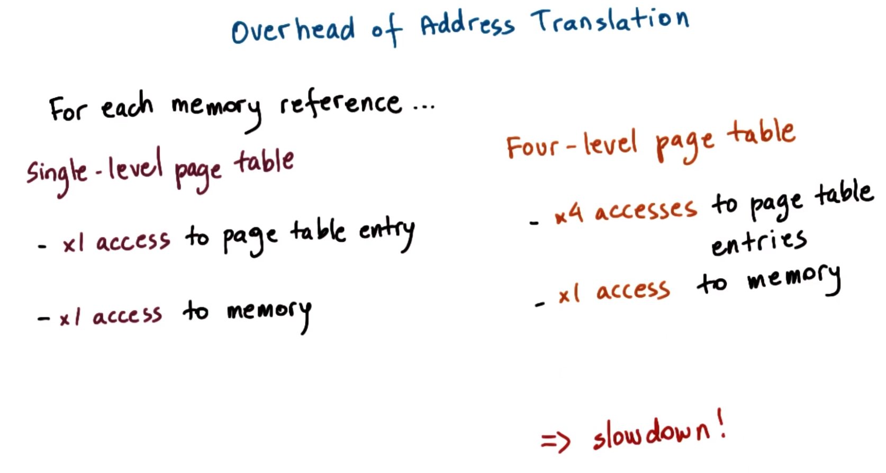

Recall that it was demonstrated that adding levels to the address translation process reduces the size of the page table but with an incurred overhead to achieve this.

A comparison of the relative **overheads** is as follows, for *each* memory reference:
  * For a **single-level page table**, a memory reference will require *two* memory accesses:
    1. One to access the page table entry (to determine the physical frame number (PFN))
    2. Another to perform the actual memory access operation at the correct physical address.
  * For a **four-level page table**, a memory reference will require five memory accesses:
    1. Four to access access *each* level of the page table hierarchy prior to producing the actual physical frame number (PFN).
    2. Another to perform the actual access of the correct physical memory location.

Therefore, in the multi-level (e.g., four-level) page table, such nested memory accesses can be costly from a performance standpoint, resulting in a ***slowdown***.

### Page Table Cache

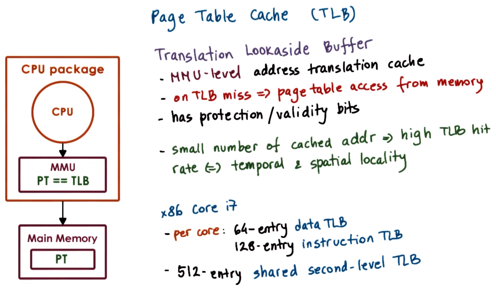

The **standard technique** to avoid such repeated memory access operations is to use a **page table cache**.

On most architectures, the hardware **memory management unit (MMU)** integrates a **hardware cache** that is ***dedicated*** for caching address translations; this cache is called the **translation lookaside buffer (TLB)**.

On each address translation, the translation lookaside buffer (TLB) cache is first quickly referenced.
  * If the address can be generated from the translation lookaside buffer (TLB) contents, then there is **TLB hit**, which consequently ***bypasses*** all of the other otherwise required memory access operations in order to perform the translation.
  * Conversely, if there is a **TLB miss** (i.e., the address is *not* present in the TLB cache), then it is necessary to perform all of the address translation steps via access of the page tables from memory.

In addition to the proper address translation, the translation lookaside buffer (TLB) entries also contain all of the necessary protection and validity bits to **verify** that the access operation is ***correct***, or (if necessary) to generate a **fault**.

As it turns out, even a ***small*** number of entries in the translation lookaside buffer (TLB) can result in a ***high*** TLB hit rate, by virtue of the associated high temporal and spatial **locality** via the corresponding memory references.

For example, on recent x86 platforms (e.g., x86 Intel Core i7):
  * There are *per-core* separate translation lookaside buffers (TLBs) for data (`64` entries) and for instructions (`128` entries).
  * Additionally, there is a *shared* (i.e., across *all* cores) second-level translation lookaside buffer (TLB) (having `512` entries).

Even with relatively small/modest sizes, these translation lookaside buffers (TLBs) were determined to be sufficiently effective to address typical memory access needs for modern processes running on this modern processor.

## 11. Inverted Page Tables

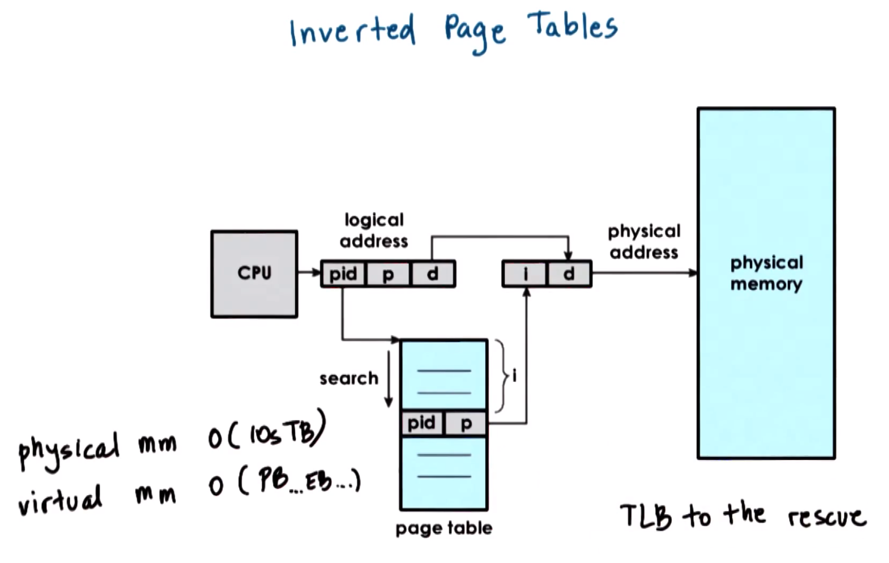

Another (and completely different) way to organize the address translation process is to create so-called **inverted page tables**, as in the figure shown above.

Here, the **page table entries (PTEs)** contain information, one for each element of the **physical memory** (e.g., in terms of **physical frame numbers (PFNs)**, each of the page table elements correpsond to one such PFN).

On modern platforms, there is physical memory on the order of 10s of terabytes (i.e., `O(10 TB)`), and correspondingly a virtual memory comprising an address space that can reach the order of petabytes and beyond (i.e., `O(PB)`, `O(EB)`, etc.). Therefore, it is much more efficient for a process to have a page table structure that is on the order of the available physical memory, rather than on the order of the virtual memory address space.

Using such inverted page tables, finding the translation occurs as follows:
1. The page table is searched based on the **process id** (`pid`) and the first part of the virtual address (`p`), as was seen previously. 
2. When the appropriate entry (i.e., `pid-p` combination) is found in the page table, the corresponding **index** (`i`) (i.e., the element where this information is stored) denotes the **physical frame number (PFN)** of the memory location that is indexed by the **logical address** in question.
3. Combining this with the actual offset (i.e., combining `pid-p` with `d`) produces the **physical address** that is being referenced from the CPU.

The **problem** with inverted page tables is that they require to perform a **linear search** of the page table to find which entry matches the `pid-p` information that is part of the logical address presented by the CPU. Since the physical memory can be arbitrarily assigned to different processes, the page table generally is *not* ordered (i.e., two adjacent entries in the page table in general will pertain to two unrelated processes), and there is no clever search technique used to speed up this search operation.

However, in practice, the **translation lookaside buffer (TLB)** catches  many of these memory references, and therefore such a detailed linear search is not performed very frequently. However, this search *can* still be performed periodically, and therefore a more efficient solution is desirable.

### Hashing Page Tables

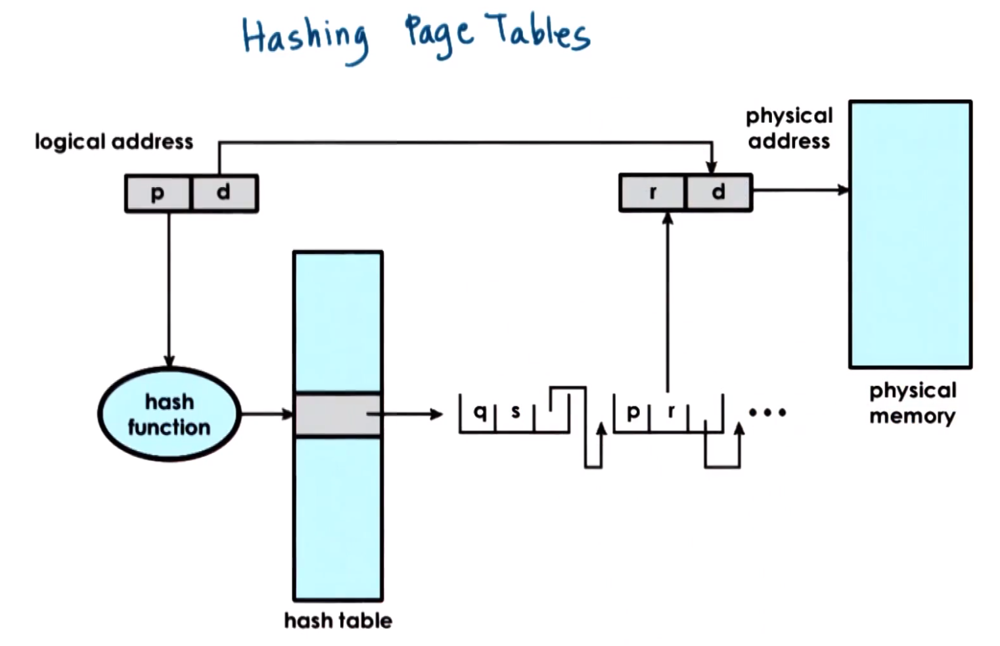

To address the linear search issue of inverted page tables, they are supplemented with so-called **hashing page tables**, as in the figure shown above.

In the most general terms, a hashing page table operates as follows:
  1. A **hash function** is used to compute a **hash** based on a portion of the address (i.e., `p`).
  2. The resulting hash is an entry in the **hash table**, which points to a **linked list** of possible matches for the corresponding portion (i.e., `p`) of the **logical address**.
      * This correspondingly increases the speed of the linear search (and therefore the overall address translation operation), inasmuch as it narrows the search candidates to the relatively few entries into the inverted page table that are present in the linked list (i.e., as opposed to searching the entire page table itself).
  3. When a match is found on the linked list, the **physical address** can be produced from the offest (`d`), as before.

## 12. Segmentation

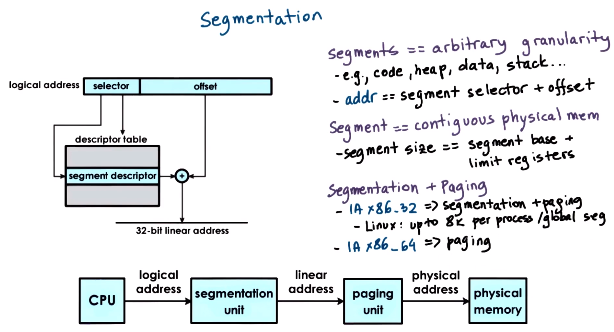

Recall that in addition to paging, virtual-to-physical address memory mapping can be performed using **segments**; this process is referred to as **segmentation**.

With segments, the address space is divided into components of arbitrary granularity (i.e., of arbitrary size), and typically the different segments correspond to logically meaningful components of the address space (e.g., code, heap, data, stack, etc.).

Therefore, a **virtual address** (i.e,. the **logical address** in the figure shown above) in the segmented memory mode includes a segment descriptor (the **selector**) and the **offset**.
  * The **segment descriptor** is used in combination with the **descriptor table** to produce information regarding the physical address of the segment.
  * The segment descriptor is ***combined*** with the **offset** to produce the linear address of the memory address.

In its pure form, a segment can be represented with a *contiguous* portion of physical memory. In this case, the **segment size** is defined by its **base address** and its **limit registers** (which imply the segment's size), thereby enabling segments of variable size.

In practice, however, segmentation and paging are used ***together***. This means that address that is produced using this method (called the **linear address**) is passed to the **paging unit** (i.e., a multi-level/hierarchical page table) to ultimately compute the actual **physical address** to locate the appropriate memory location.

The type of address translation that is possible on a particular platform is determined by the hardware. For example:
  * On the 32-bit x86 Intel Architecture (IA x86_32) hardware platforms, both segmentation and paging are supported.
    * For these platforms, Linux allows up to `8,000` segments to be available per process, along with another `8,000` global segments.
  * On the 64-bit x86 Intel Architecture (IA x86_64) platforms, both segmentation and paging are supported for backward compatibility, however, the default mode is to use paging only.

## 13. Page Size

### How Large Is a Page?

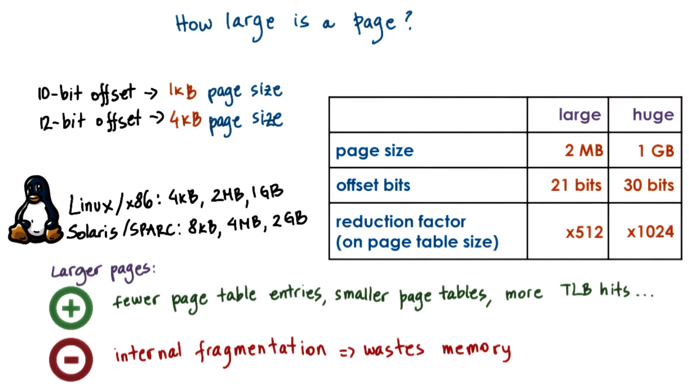

Up to this point, the matter of selecting an appropriate page size has not been considered. In the examples examined thus far, the address formats used (arbitrarily selected) offsets of `10` or `12` bits (i.e., for demonstration purposes). Correspondingly, this offset determines the total amount of addresses in the page, and therefore the corresponding page size (e.g., `2``10`` = 1 KB` and `2``12`` = 4 KB` addressable page sizes, respectively).

However, in practice, real systems support different page sizes. Linux and x86 platforms support several common page sizes:
  * `4 KB`, the most common, and the default option on these platforms
  * `2 MB`, called "**large**" pages
    * To address `2 MB` of content in a page, this requires `21 bits` for the page offsets (i.e., to compute the physical addresses).
  * `1 GB`, called "**huge**' pages
    * To address `1 GB` of content in a page, this requires `30 bits` for the page offsets.

The key **benefit** of using the larger page sizes (e.g., `2 MB` and `1 GB`) is that more bits in the virtual address are used for the offset bits, and consequently fewer bits are used to represent the virtual page numbers (VPNs) and correspondingly fewer necessary entries in the page table. In fact, use of the larger page sizes significantly reduces the size of the page table:
  * Compared to the `4 KB` page size, the large (`2 MB`) page size reduces the page table size by a factor of `512×`.
  * Compared to the `4 KB` page size, the huge (`1 GB`) page size reduces the page table size by a factor of `1024×`.

Therefore, in summary, the key **benefits** of larger page sizes include:
  * Fewer page table entries, resulting in smaller page tables
  * Increasing the number of translation lookaside buffers (TLBs) hits due to improved translation of the physical memory via the TLB cache.

Conversely, a **drawback** of using larger pages is the large page size itself. Due to the resulting large "gaps" of unused memory addresses (i.e., a sparsely populated virtual address space), this gives rise to the phenomenon called **internal fragmentation** (wasted memory regions in the allocated memory). Due to this issue, smaller pages (e.g., of size `4 KB`, the default size in Linux/x86) are more commonly used.

***N.B.*** There are certain use cases (e.g., databases and in-memory data stores) where such "large" or "huge" page are necessary and therefore sensible to use.

***N.B.*** On different systems, depending on the operating system and the hardware architecture, different page sizes may be supported (e.g., Solaris 10 running on the SPARC architecture supports page sizes of `8 KB`, `4 MB`, and `2 GB`).

## 14. Page Table Size Quiz and Answers

On a **12-bit architecture**, what are the number of entries in the page table if the page size is the following (assume a single-level page table):
  * `32 bytes` page size?
    * `128` entries
  * `512 bytes` page size?
    * `8` entries

***Explanation***: If the architecture is 12-bit, then the addresses are 12 bits long.
  * For a 32-byte page size, this requires `log``2``32 = 5` bits for the offset into the page, leaving `12 - 5 = 7` bits for the virtual page number (VPN), or `2``7`` = 128` entries.
  * Similarly, for a 512-byte page size, this requires `log``2``512 = 9` bits for the offset into the page, leaving `12 - 9 = 3` bits for the virtual page number (VPN), or `2``3`` = 8` entries.

Therefore, the impact of using a larger page size is a corresponding decrease in the number of page table entries (i.e., a smaller page table size).

## 15. Memory Allocation

