# P3L3: Inter-Process Communication

## 1. Preview

This lecture will discuss **inter-process communication (IPC)**.

In particular, this lecture will primarily discuss **shared memory IPC**, and the corresponding APIs.

Additionally, the lecture will describe some of the other IPC mechanisms that are common in modern operating systems.

## 2. Visual Metaphor

<center>

</center>

Recall (cf. P2L2) that a process is like an order of toys in a toy shop. In this lecture, we will see how processes can **communicate** with each other during their execution. First, however, consider how **inter-process communication (IPC)** is related to the recurring toy shop analogy; in particular, inter-process communication (IPC) is like working together in a toy shop.

| Characteristic | Toy Shop Workers | Inter-Process Communication |
| :---: | :---: | :---: |
| Workers share the work area / Processes share (physical) memory | Leaving common parts and tools on the table to be shared among the workers | Processes can share data they both need to access, which is placed in the shared memory (as will be discussed further in this lecture) |
| Workers can call each other / Processes  can exchange messages | The workers can directly communicate by explicitly ***requesting*** something from one another and consequently receiving the required ***response*** | Processes can explicitly exchange message, requests, and responses via **message-passing mechanisms** that are supported via certain APIs (e.g., **sockets**) |
| Interactions among workers/processes requires synchronization | The worker indicates "*I will start when you finish*" | Processes may need to **wait** on one another and correspondingly may need to rely on certain **synchronization mechanisms** (e.g., mutexes) to ensure that communication proceeds in the correct manner |

## 3. Inter-Process Communication (IPC)

<center>
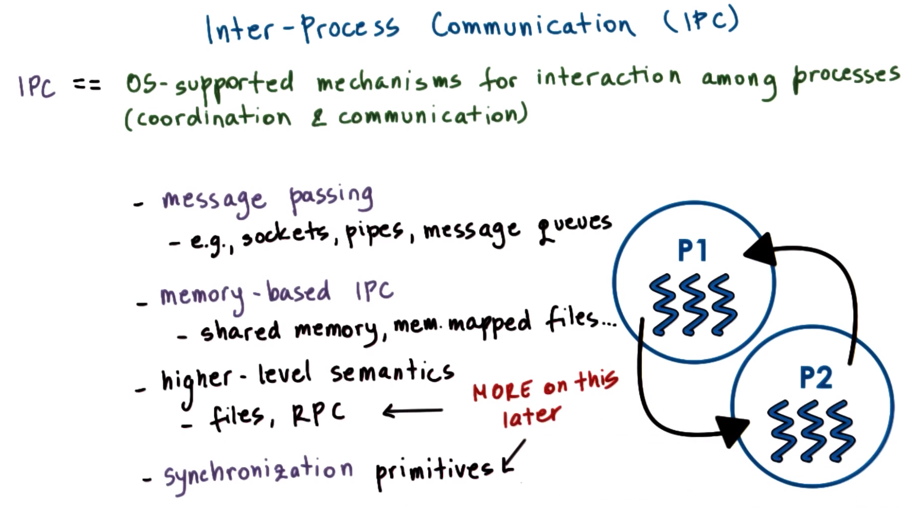
</center>

**Inter-process communication (IPC)** refers to a set of mechanisms (e.g., synchronization, coordination, and communication) that the operating system must support in order to permit multiple processes to interact amongst each other.

Inter-process communication (IPC) mechanisms are broadly **categorized** as message-based or memory-based.
  * Examples of **message-passing IPC mechanisms** include sockets, pipes, message queues, and other operating-system-supported constructs.
  * The most common **memory-based IPC mechanism** is for the operating system to provide processes with access to some **shared memory**, which may be in the form of:
    * A completely **unstructured set** of pages of physical memory
    * **Memory-mapped files**

Inter-process communication also provides a means of **higher-level semantics**.
  * With respect to **files**, both categories of inter-process communication (IPC) can be perceived as a method for IPC (i.e., multiple processes reading and writing from/to the *same* file); file systems will be described in a later lecture.
  * Another mechanism that provides higher-level semantics with respect to inter-process communication (IPC) among processes is what is referred to as **remote procedure calls (RPCs)**. RPC will also be discussed in a later lecture.

***N.B.*** Here, "***higher-level semantics"***" describes how the mechanism in question supports more than simply a channel for two processes to coordinate or communicate amongst each other, but rather also prescribe some additional detail on the protocols that will be used, how the data will be formatted, how the data will be exchanged, etc.

Finally, communication and coordination also implies **synchronization**.
  * When processes send and receive **messages** among each other, they effectively synchronize with each other as well.
  * Similarly, when processes synchronize (e.g., via a mutex-like data structure), they also communicate something about the point in their execution. From this perspective, **synchronization primitives** also fall under the category of inter-process communication (IPC) mechanisms; however, a separate lecture will be dedicated to discussing specifically regarding synchronization (this lecture will instead focus on message-passing and memory-based IPC mechanisms).

## 4-5. Message-Based Inter-Process Communication (IPC)

### 4. Message Passing

<center>
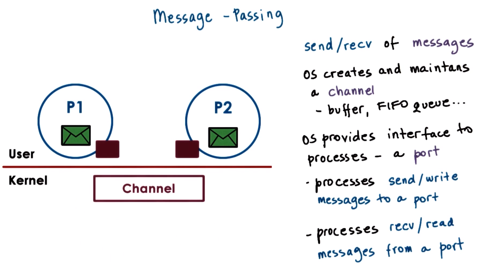
</center>

One mode of inter-process communication (IPC) that operating systems support is called **message passing**. As the name implies, processes create **messages** and the send or receive them.

The operating system is responsible for creating and maintaining the **channel** that will be used to pass messages among processes. This can be thought of as type of buffer, first-in, first-out (FIFO) queue, or other similar data structure.

The operating system also provides some **interface** to the processes to enable them to pass messages via the channel. The processes then **send** (or **write**) messages to a **port**, and on the other end the processes **receive** (or **read**) messages from the associated port. The channel in turn is responsible for **passing** the message from one port to the other.

<center>
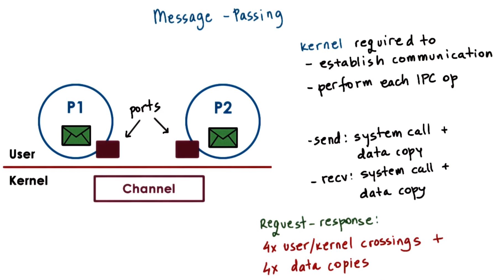
</center>

The **operating system kernel** is required to both establish the communication channel as well as to perform every single inter-process communication (IPC) operation. This means that both the **send operation** and the **receive operation** *each* require a system call and a copy of the data.
  * In the case of the **send operation**, this involves copying from the sender process's address space to the communication channel.
  * In the case of the **receive operation**, this involves copying from the channel to the recipient process's address space.

This means that a simple **request-response interaction** among two processes requires `4` user/kernel crossing and `4` data-copying operations (i.e., send request, receive request, send response, and receive response).

<center>
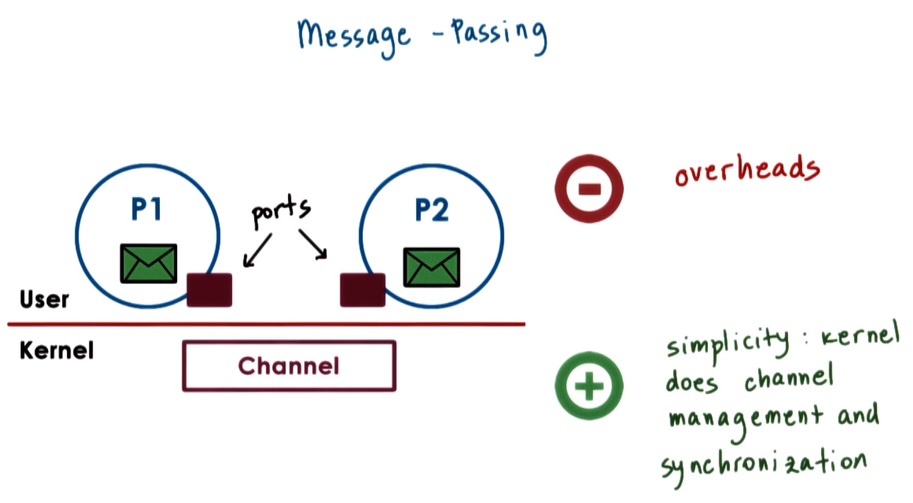
</center>

Consequently, a key **drawback** of message-passing inter-process communication (IPC) is that there is an associated **overhead** (i.e., the aforementioned user/kernel crossings and data-copying operations).

However, message-passing inter-process communication (IPC) provides the key **benefit** that it is relatively **simple**, inasmuch as the operating system kernel is able to handle all of the necessary operations and synchronization (e.g., channel management, synchronization, ensuring the data is not overwritten or corrupted as the processes send/receive messages, etc.).

### 5. Forms of Message Passing

In practice, there are several **methods** of message-passing-based inter-process communication (IPC), as discussed in the following subsections.

#### Pipes

<center>
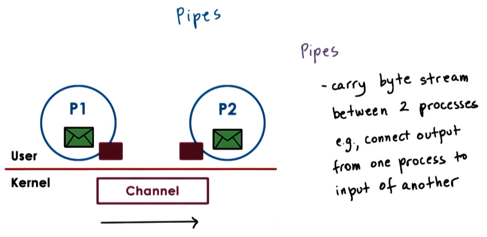
</center>

The first (and simplest) form of message-passing inter-process communication (IPC) (which is also part of the POSIX standard) is called **pipes**. Pipes are characterized by *two* **endpoints** (i.e., only two processes can communicate in this manner).

With pipes, there is no notion of a "message" per se, but rather there is simply a **stream** of bytes that is pushed into the pipe from one process and then received into the other.

One popular use of pipes is to connect the output from one process to the input of another process (i.e., the entire byte stream of process `P1` is delivered as input to process `P2`--rather than typing it in manually, for instance).

#### Message Queues

<center>
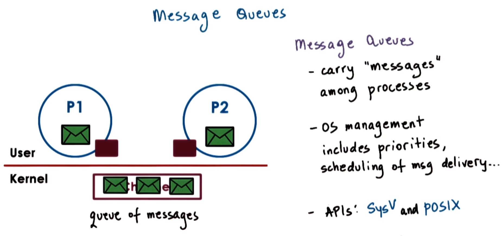
</center>

A more complex form of message-passing inter-process communication (IPC) is **message queues**. As the name suggests, message queues understand the notion of "messages" that they transfer among the processes. The sending process must submit a **properly-formatted message** to the channel, amd then the channel delivers the corresponding properly-formatted message to the receiving process.

The operating-system-level **functionality** regarding message queues also includes the understanding of priorities of messages, scheduling the manner in which messages are delivered, etc.

The use of message queues is supported via different APIs. In UNIX-based systems, these include the **POSIX API** and the **System V (SysV) API**.

#### Sockets

<center>
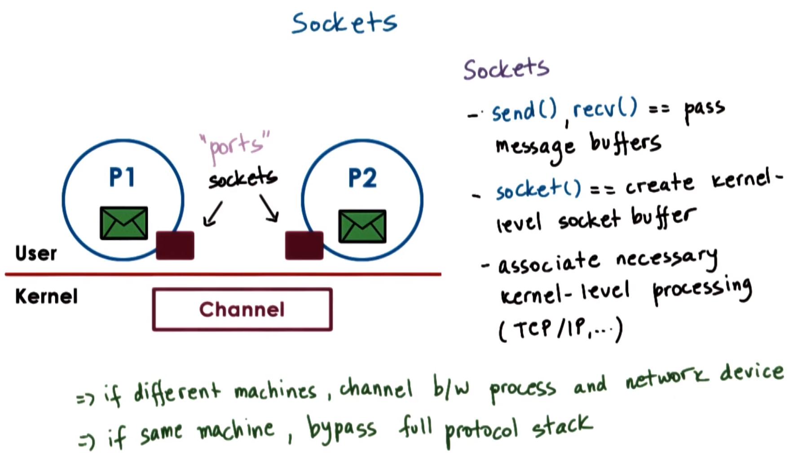
</center>

The message-passing API that is likely most familiar is the **socket API**. With this socket form of inter-process communication (IPC), the notion of "*ports*" that is required in message-passing inter-process communication (IPC) mechanisms is itself the **socket abstraction** that is supported by the operating system.

With sockets, processes send or receive messages via an API (e.g., system calls `send()` and `recv()`, respectively). The socket API supports send and receive operations that allow processes to send **message buffers** into and out of the in-kernel **communication buffer** (i.e., the **channel**).

The system call to `socket()` itself creates a kernel-level socket buffer. Additionally, it will associate any necessary **kernel-level processing** that must be performed along with the message's movement (e.g., TCP/IP for a network socket, in which the entire TCP/IP protocol stack is associated with the data movement in the kernel).

***N.B.*** Sockets do not need to be used for processes that are on a *single* machine; rather, if the two processes are on *different* machines, then the channel exists essentially between the (local) process and a network device that will actually send the data externally. Additionally, the operating system is sufficiently "smart" to determine that if two processes are on the *same* machine, then it can **bypass** execution of the full protocol stack (e.g., it will bypass sending the data out on the network just to receive it back and push it into the recipient process). This remains hidden from the programmer, but can be detected via corresponding performance measurements.

## 6. Shared-Memory Inter-Process Communication (IPC)

<center>
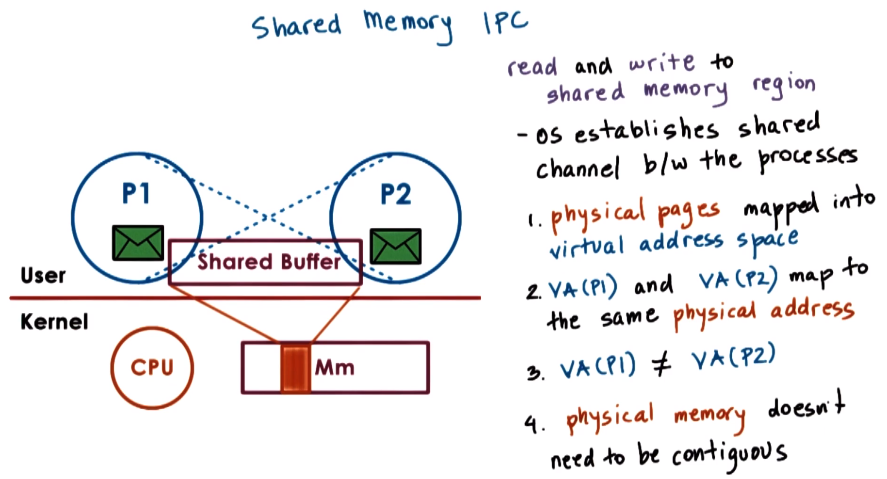
</center>

In **shard-memory inter-process communication (IPC)**, processes read and write from/to a **shared memory region**.

The operating system is involved in establishing this **shared-memory channel/buffer** between the processes. 
  * This means that the operating system will **map** certain physical pages of memory into the virtual address spaces of both processes (e.g., the virtual addresses in `P1` and the virtual addresses in `P2` will map to the *same* physical addresses in main memory).
  * At the same time, the virtual-address regions corresponding to the shared-memory buffer in the two processes, i.e., they do not have to have the same virtual addresses (e.g., `VA(P1) ≠ VA(P2)` in general).
  * Furthermore, the physical memory that is backing the shared-memory buffer need not be a contiguous portion of the physical memory.

***N.B.*** All of these features leverage the memory management support that is available in operating systems running on modern hardware.

<center>
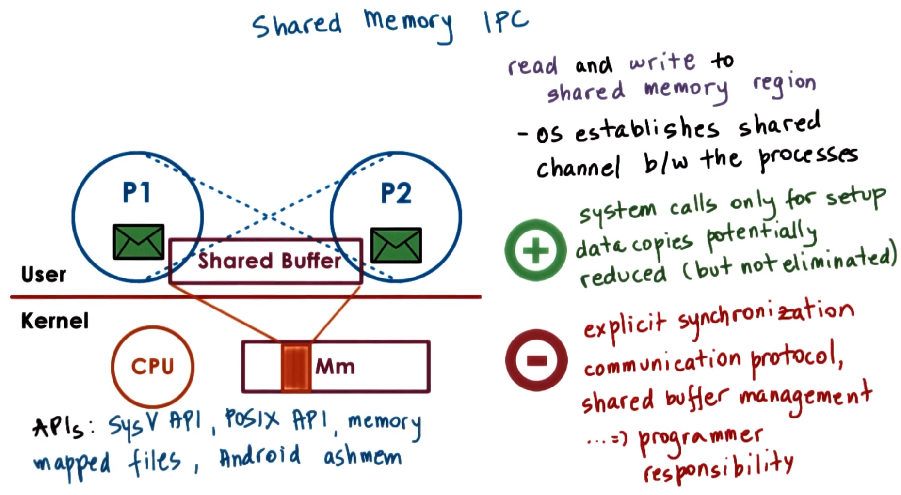
</center>

A key **benefit** of this approach is that once the physical memory is mapped into both address spaces, the operating system is effectively "out of the way" (i.e., the system calls are only used in the initial setup phase). Furthermore, data copies are potentially reduced.
  * Data copies are not entirely eliminated, however, inasmuch as in order for data to be visible to *both* processes, it must be explicitly allocated from the virtual addresses belonging to the shared-memory region; if this is not the case and there is no such visibility, then the data within the *same* address space must be copied in/out of the shared-memory region.
  * However, in some cases, data copying can be reduced. For instance if `P2` needs to compute the sum of two arguments that were passed to it from `P1` via the shared-memory region, then `P2` can only read these arguments but otherwise does not need to actually copy them into other portions of its address space in order to compute the sum and then pass it back.

However, there are also **drawbacks** with this approach.
  * Since the shared-memory region can be concurrently accessed by *both* processes, this means that the processes must explicitly synchronize their shared-memory operations (i.e., similarly to what is required for threads operating within a single, shared address space).
  * Furthermore, it is the responsibility of the developer to determine any communication-protocol-related issues, e.g., how to format messages, how to delimit messages, what is the header format, how the shared-memory buffer is allocated (i.e., when will each process be able to use a portion of the shared-memory buffer for its needs), etc.--thereby adding complexity.

UNIX-based system (e.g., Linux) support two popular shared-memory APIs:
  1. **System V (SysV) API**, which was originally developed as part of System V.
  2. **POSIX API**

Additionally, shared-memory-based communication can be established between processes using a **file-based interface**. For example:
  * **Memory-mapped files** in both address spaces, which uses an API that is analogous to the POSIX shared-memory API.
  * The Android operating system uses a form of shared-memory inter-process communication (IPC) called **ashmem**.
    * ***N.B.*** There are a number of differences in the details of how ashmem behaves compared to the System V or POSIX APIs, but it is provided here for reference as another "real world" example.

The remainder of this lecture will focus on briefly describing the UNIX-based shared-memory APIs.

## 7. Inter-Process Communication (IPC) Comparison Quiz and Answers

Consider using inter-process communication (IPC) to communicate between processes. You can either use a **message-passing** or a **memory-based** API. Which one do you think will perform better? (Select one option.)
  * message passing
  * shared memory
  * neither; it depends
    * `CORRECT`
      * Message passing must perform multiple copies between the communicating processes and the kernel, resulting in corresponding overhead.
      * Shared-memory inter-process communication (IPC) incurs cost associated with the kernel establishing valid mappings among the processes' address spaces and the shared-memory pages, also resulting in corresponding overhead.
      * Therefore, there are drawbacks with both approaches, and therefore the performance will depend on the relative costs incurred by these respective overheads.

The next section will discuss trade-offs between these two inter-process communication (IPC) mechanisms.

## 8. Copy vs. Map

<center>

</center>

Before proceeding with further discussion, there is an important **contrast** to consider regarding message-based vs. shared-memory approaches to inter-process communication (IPC). The end **goal** of both of these approaches is to transfer some data from one address space into the other target address space.

<center>
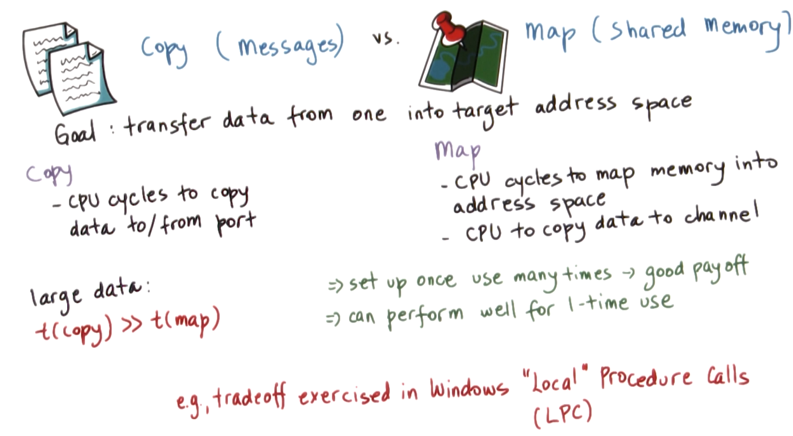
</center>

In **message passing**, this goal requires that the CPU be involved in the **copying** of data. Accordingly, this requires some number of CPU cycles to copy the data into the channel (via the port) and then from the port into the target address space.

Conversely, in **shared memory**, this goal requires that (at a minimum) there are CPU cycles expended to **map** the physical memory into the appropriate address spaces. Furthermore, the CPU is also used to copy the data into the channel whenever necessary (however, in this case there are no user-to-kernel switches required).
  * The memory mapping itself is a costly operation, however, once the channel is established once and then subsequently used many times, this results in a **good payoff** (i.e., the setup cost is amortized appropriately).
  * Furthermore, even for a single use, the memory-mapped approach can still perform quite well. In particular, when it is necessary to move large amounts of data from one address space into another, the CPU time that is required to perform the copy operation can greatly exceed the CPU time required to perform the map operation (i.e., *`t`*`(copy) >> `*`t`*`(map)`).
    * In fact, Windows systems internally leverage the fact that there exists this difference with respect to the communication mechanisms they support between processes (i.e., if the data to be transferred is smaller than a certain threshold, then the data is copied in/out of a communication channel via a port-like interface, otherwise the data is potentially copied at least *once* to ensure that it is in a page-aligned area and then that area is mapped into the address space of the target process). This mechanism supported by the Windows kernel is called **"Local" Procedure Calls (LPCs)"**.

## 9-10. System V (SysV) Shared Memory

### 9. SysV Shared Memory Overview

Now that the shared-memory mechanisms have been described in a general way, consider the specific details of the **System V (SysV)** UNIX API.

<center>

</center>

Firstly, the operating system supports **segments** of shared memory, which need not necessarily correspond to *contiguous* physical pages.

Furthermore, the operating system treats **shared memory** as a ***system-wide*** resource, using system-wide policies. This means that there is a **limit** on the total number of segments (and correspondingly on the total size) of the shared memory.
  * ***N.B.*** Presently, imposing such limits is not as much of an issue (e.g., in Linux, currently the limit is `4000` segments). However, in the past, this limit was much more significant, being set to even as few as `6` segments in certain operating systems. Even more recent version of Linux had a limit of `128` segments.
  * The operating system may also impose other limits with respect to the system-wide shared memory.

<center>
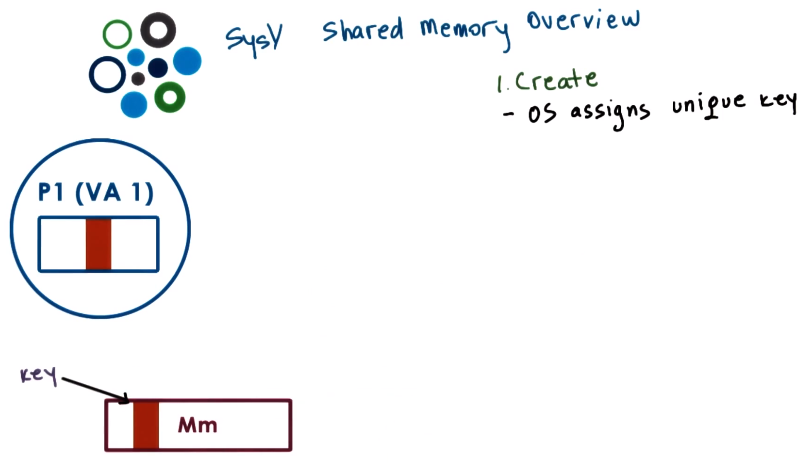
</center>

When a process requests for a shared-memory segment to be **created**, the operating system allocates the required amount of physical memory (provided that certain limits are met), and then assigns a **unique key** to the process. This key is used to uniquely identify the segment within the operating system; any other process can refer to this particular segment via the key.

If the creating process wants to communicate with other processes using shared memory, then it will ensure that they "learn" this key in some manner (e.g., by using some other form of inter-process communication (IPC), passing it as a file or as a command-line argument, etc.).

<center>
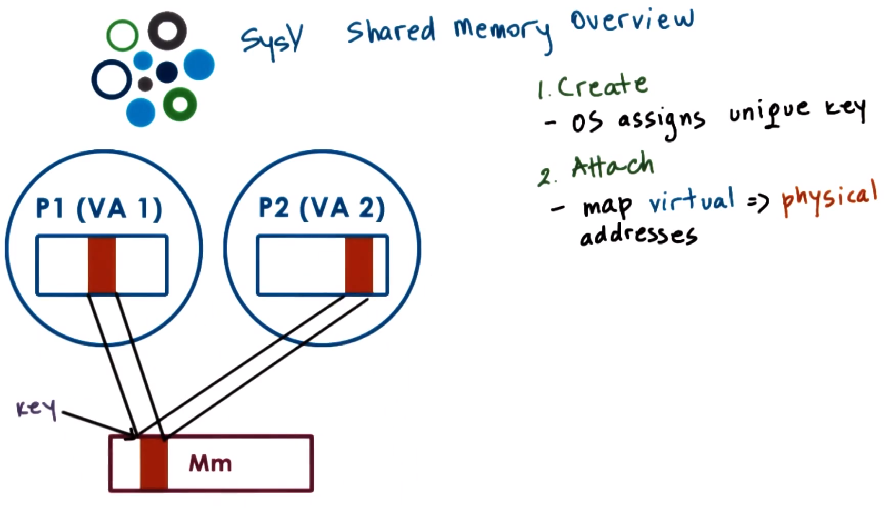
</center>

Using the key, the shared-memory segment can be **attached** by a process (e.g., `P1`). This means that the operating system establishes **valid mappings** between the virtual addresses that are part of the processes' virtual address space (e.g., `VA 1`) and the corresponding physical memory (i.e., main memory) that backs the segment.

Furthermore, **multiple processes** (e.g., `P1` and `P2`) can attach to the *same* memory segment, in which case each process shares access to the *same* physical pages. Consequently, read and write operations from/to these pages will be visible across *all* processes, analogously to when threads share access to memory that is part of the same address space. Additionally, the shared-memory segment in physical memory in turn can be mapped to different virtual addresses in different processes (e.g., `VA 1` and `VA 2`).

<center>
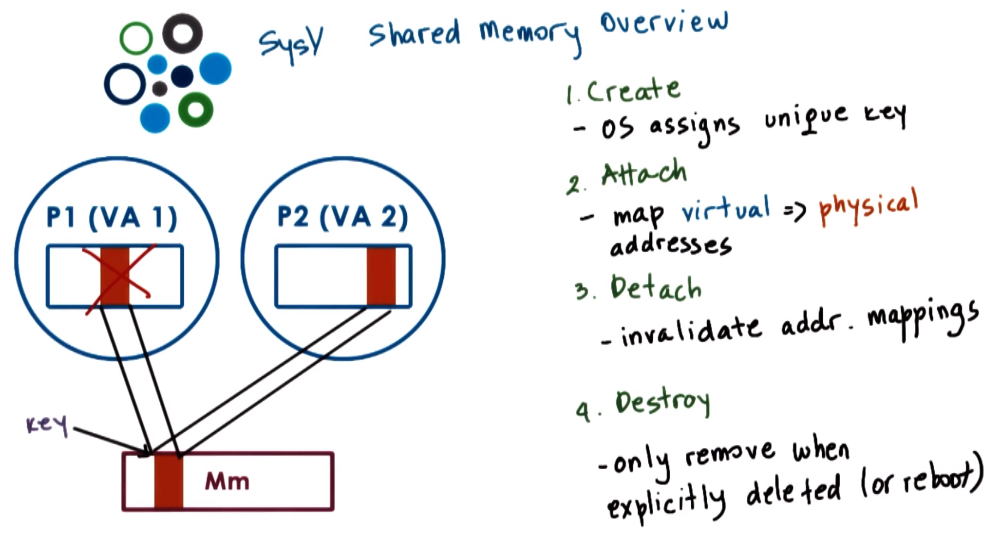
</center>

**Detaching** a segment means **invalidating** the address mappings for the virtual address region (e.g., `VA 1`) that corresponded to the segment within the process (e.g., `P1`). In other words, the page table entries for those virtual addresses will no longer be valid.

However, note that a segment is *not* actually **destroyed** once it is detached; in fact, a segment may be attached, detached, and then re-attached multiple times by different processes over the lifetime of the segment. This means that once a segment is created, it is a **persistent entity** until there is an *explicit* request for it to be destroyed, similarly to what occurs with a file (i.e., the file is created and then the file persists until it is explicitly deleted; in the meantime, the file can be opened, closed, read from, written to, etc. and the file will still be present in the system).
  * ***N.B.*** This **property** of shared memory (i.e., to be removed only when it is explicitly deleted or when there is a system reboot) distinguishes it from regular, non-shared memory (which is `malloc()`d and then subsequently disappears as soon as the process exits).

### 10. SysV Shared Memory API

<center>
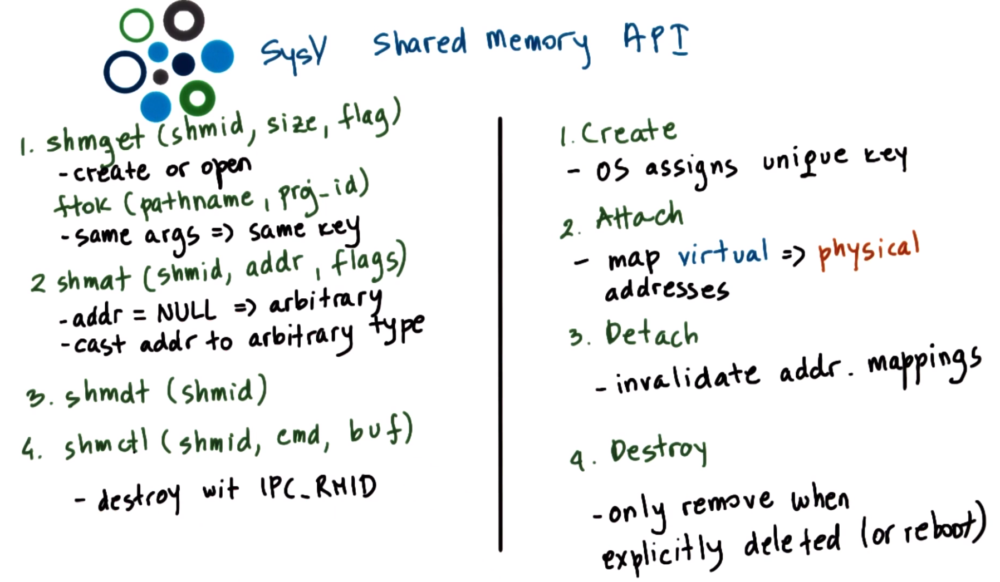
</center>

System V (SysV) uses the shared-memory API corresponding to the aforementioned high-level operations as in the figure shown above.

`shmget(shmid, size, flag)` is used to **create** or **open** a segment of the appropriate size.
  * The `flag`s include various options (e.g., permissions).
  * The unique identifier `shmid` is the **key**, which is not actually created by the operating system, but rather is explicitly passed to the operating system by the application itself.
    * To **generate** such a unique identifier, the API relies on the operation `ftok(pathname, proj_id)`, which generates a token based on its arguments. Therefore, given the *same* arguments during two (or more) calls to this operation, it will *always* return the *same* key (i.e., its behavior is similar to that of a hash function). In this manner, different processes can agree upon how to obtain a unique key for the shared-memory segment that they will use to mutually communicate.

`shmat(shmid, addr, flags)` **attaches** the shared-memory segments into the virtual address space of the process (i.e., it maps them into the user address space).
  * The programmer has the option to provide the specific virtual addresses where the segment should be mapped via parameter `addr`, otherwise if `NULL` is passed then the operating system will select and return some arbitrary suitable addresses that are available in the process's address space.
  * The ***returned*** virtual memory can be interpreted in arbitrary ways. Therefore, it is the programmer's responsibility to appropriately **cast** the return value (i.e., the memory region) to the appropriate type.

`shmdt(shmid)` **detaches** the segment identified by the identifier `shmid`, and consequently this renders invalid the virtual-to-physical memory mappings.

`shmctl(shmid, cmd, buf)` is used to pass certain commands related to the shared-memory-segment management to the operating system. In particular, the command `IPC_RMID` is used to **remove** the segment `shmid`.

## 11. POSIX Shared Memory API

<center>
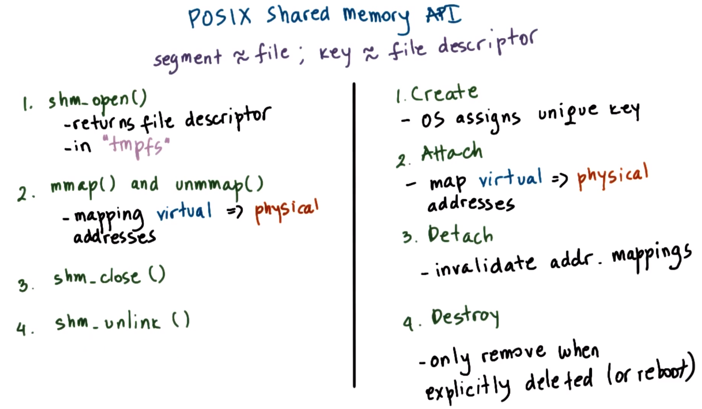
</center>

There is also the complementary **POSIX API** for shared memory, as in the figure shown above.
  * **N.B.** On Linux systems, this API has been supported since the v.2.4 kernel.
  * Although intended to be *the* standard, the POSIX API is not as widely supported as, for instance, the System V API.

The most notable **difference** in the POSIX API is that the POSIX shared-memory standard does *not* use segments, but rather uses **files**. These are not "real" files (i.e., existing on a file system that is otherwise used by the operating system), but rather these files only exist in the so-called **tmpfs** (the temporary file system), which is intended to look and feel like a file system (i.e., the operating system can reuse the same types of mechanisms that are used for file systems), but in essence constitutes a bunch of state that is present in physical and volatile memory.

Therefore, the operating system simply uses the same representation (i.e., via the same corresponding data structures) as is used for representing a file in order to represent the pages in memory corresponding to a shared-memory region. For this reason, there is no longer the need for an otherwise awkward key generation process, but rather **shared-memory segments** can be referenced by the corresponding **file descriptor**; consequently, the operations provided by the API for files are otherwise analogous to those existing for segments.


`shm_open()` returns a file descriptor in **tmpfs**, and `shm_close()` closes the file descriptor.
  * ***N.B.*** While these `shm_...` are used explicitly for shared-memory file operations, in fact the regular file operations `open()` and `close()` (respectively) can also be used for this purpose, as the operating system will understand how to perform the necessary operations accordingly in this manner.

To **attach** or **detach** shared memory, the POSIX API relies on the operations `mmap()` and `unmmap()` (respectively), which perform the mapping/unmapping (respectively) of the virtual-to-physical addresses for the process via the corresponding file descriptor.

To **destroy** a shared-memory segment, there is an explicit operation `shm_unlink()` to perform this operation.
  * Similarly, `shm_close()` will remove the file descriptor from the address space of the process, but in order to instruct the operating system delete all of the shared-memory-related data structures and to subsequently free that shared-memory segment, `shm_unlink()` must be explicitly called.

***Reference***: [POSIX Shared Memory API](https://man7.org/linux/man-pages/man7/shm_overview.7.html)

## 12. Shared Memory and Synchronization

<center>
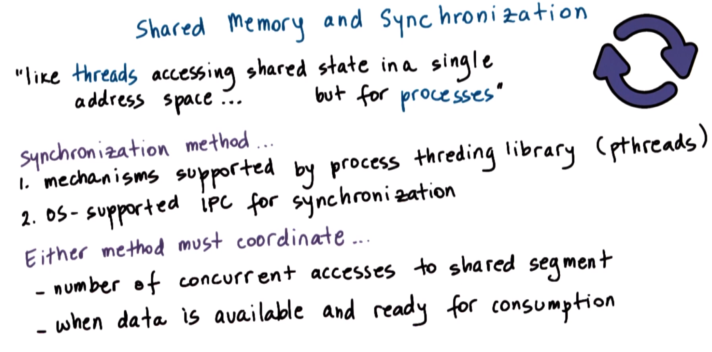
</center>

When data is placed in shared memory, it can be accessed ***concurrently*** by *all* processes that have access to that shared-memory region. Therefore, such accesses must be **synchronized** in order to avoid **race conditions**. This is analogous to the manner in which threads are synchronized (i.e., when they share a single address space), however, here this must be done for the **processes** as well. Therefore, it is still necessary to use **synchronization constructs** (e.g., mutexes and condition variables) in order for processes to properly synchronize when accessing shared data.

There are a couple of available **options** for handling this entire process synchronization.
  1. The exact same mechanisms that are supported by the threading libraries can be used with processes (e.g., two PThreads processes can synchronize amongst each other using corresponding PThreads mutexes and condition variables that have been appropriately set).
  2. Additionally, the operating system itself supports certain mechanisms for synchronization that are available for inter-process communication (IPC) interactions.

Regardless of the method that is chosen, there must be corresponding mechanisms to **coordinate** the following:
  * The number of **concurrent accesses** to the shared-memory region (e.g., for mutual exclusion support, as provided by mutexes).
  * When **data** is available and ready for consumption by the peer processes via appropriate notification or signaling mechanism (e.g., condition variables are a construct that provides this functionality).

## 13. PThreads Synchronization for Inter-Process Communication (IPC)

<center>
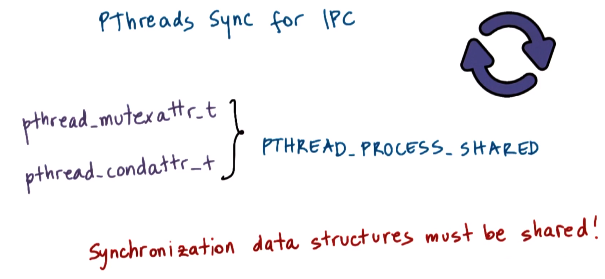
</center>

When discussing PThreads previously (cf. P2L3), recall that one of the **attributes** that is used to specify the properties of the mutex (`pthread_mutexattr_t`) or of the condition variable (`pthread_condattr_t`) upon its creation is whether or not that synchronization construct is private to the process or shared among the processes. Correspondingly, the keyword/macro to specify this shared property is `PTHREAD_PROCESS_SHARED`, i.e., when synchronizing shared-memory access among two multi-threaded processes which are synchronized via PThreads, it is possible to use mutexes and condition variables that have been correctly initialized in this manner to be shared processes.

However, an **important note** is that the synchronization variables themselves *also* must be shared.
  * Recall that in multi-threaded programs, the mutex and/or condition variables must be globally visible to *all* threads to be shared among them; along the same lines, such global sharing is also necessary among communicating processes. Therefore, in order to achieve this, it must be ensured that the data structures for the synchronization constructs (e.g., `pthread_mutexattr_t` and `pthread_condattr_t`) are allocated from the shared-memory region that is visible to both processes.

For example:

```c
// make shm data structure
typedef struct {
  pthread_mutex_t mutex;
  char *data;
} shm_data_struct, *shm_data_struct_t;

// create shm segment
seg = shmget(ftok(arg[0], 120), 1024, IPC_CREATE|IPC_EXCL);
shm_address = shmat(seg, (void *)0, 0);
shm_ptr = (shm_data_struct_t)shm_address;

// create and initialize mutex
pthread_mutexattr_t(&m_attr);
pthread_mutexattr_set_pshared(&m_attr, PTHREAD_PROCESS_SHARED);
pthread_mutex_init(&shm_prt.mutex, &m_attr);
```
***N.B.*** This example uses the System V API.

In the section denoted "*create shm segment*":
  * In the operation `shmget()`:
    * The shared memory identifier is uniquely created via the operation `shmget()`, which uses `arg[0]` from the command line (i.e., the path to the executable) and the integer argument `120`.
    * The argument `1024` indicates to create a segment of size `1 KB`.
    * The argument `IPC_CREATE|IPC_EXCL` sets permissions for the segment.
  * Using the resulting segment identifier `seg` returned from `shmget()`, the operation `shmat()` attaches this segment, which returns the shared memory address that is then stored in `shm_address`.
    * `shm_address` is the virtual-memory address in this particular instance of the process (i.e., that which is executing in the code snippet shown above), which points to the physically shared memory.
  * The address `shm_address` is then ***casted*** to point to type `shm_data_struct` (i.e., via corresponding pointer type `shm_data_struct_t`), which is stored in pointer `shm_ptr`.
  
The data type `shm_data_struct`is the data structure representing the shared-memory region that is shared among the processes, as defined in the section denoted "*make shm data structure*".
  * `char *data;` is the actual byte stream corresponding to the data.
  * `pthread_mutex_t mutex;` is the synchronization variable (i.e., the mutex that will be used among the processes when they are accessing the shared-memory area, which in turn avoids concurrent writes, race conditions, and similar issues).

Therefore, `shm_data_struct` provides an interpretation for what is laid out in the shared-memory region.

Finally, the mutex is created and initialized, as in the section denoted "*create and initialize mutex*".
  * Before creating the mutex, it must be initialized with the corresponding attributes; this is accomplished via the operation `pthread_mutexattr_t(&m_attr)` with respect to mutex attributes data structure `m_attr` (not explicitly defined in the code snippet for simplicity).
  * Regarding the mutex attributes, these are set via operation `pthread_mutexattr_set_pshared()`, which provides the keyword macro `PTHREAD_PROCESS_SHARED` as the second argument to indicate that this particular attribute data structure (i.e., `m_attr`) is shared among the processes.
  * Finally, the mutex itself is initialized via operation `pthread_mutex_init()` via the initialized attributes data structure `m_attr`. Furthermore, observe that the location of the mutex passed to this initialization call (i.e., `shm_prt.mutex`) is not simply an arbitrary mutex in the process address space, but rather it is the particular mutex element of the shared-memory data structure `shm_data_struct`.

The aforementioned set of operations will properly allocate and initialize a mutex that is ***shared*** among the processes. Accordingly, a similar set of operations should also be used to allocate and initialize any condition variables that are intended for shared use among processes.

Once these data structures have been properly created and allocated, they can subsequently be used just as regular mutexes would be in a PThreads multi-threaded process (i.e., there is no functional difference otherwise in their actual usage, given that they are used across processes).

<center>
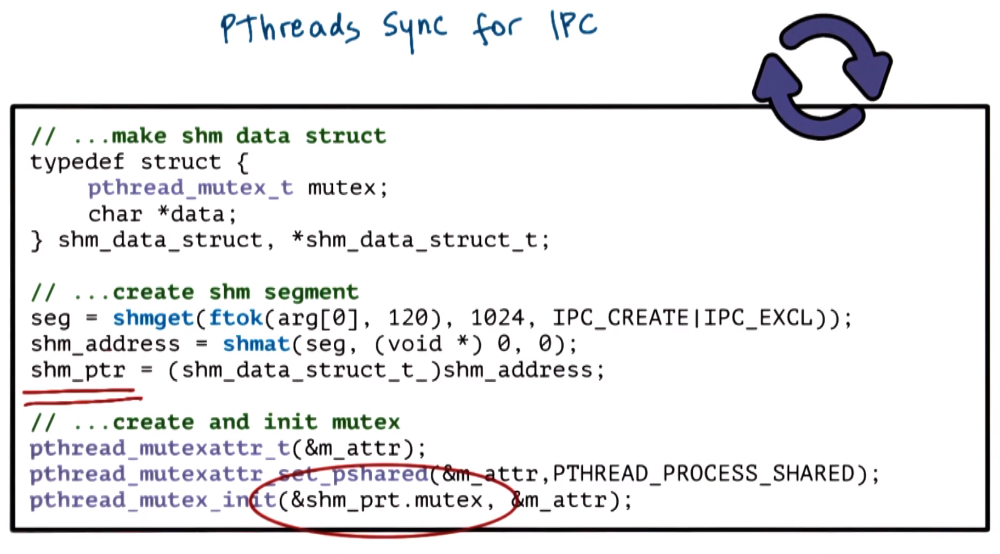
</center>

To reiterate, the **key point** is to ensure that the synchronization variable is allocated within the ***shared-memory region*** that is shared among the processes.

## 14. Other Inter-Process Communication (IPC) Synchronization Constructs

Additionally, shared-memory accesses can be synchronized using **mechanisms** provided by the operating system for performing inter-process communication (IPC) interactions. This is particularly important because the "process shared" option (e.g., `PTHREAD_PROCESS_SHARED`) for the mutex is not necessarily always supported on every single platform.

<center>
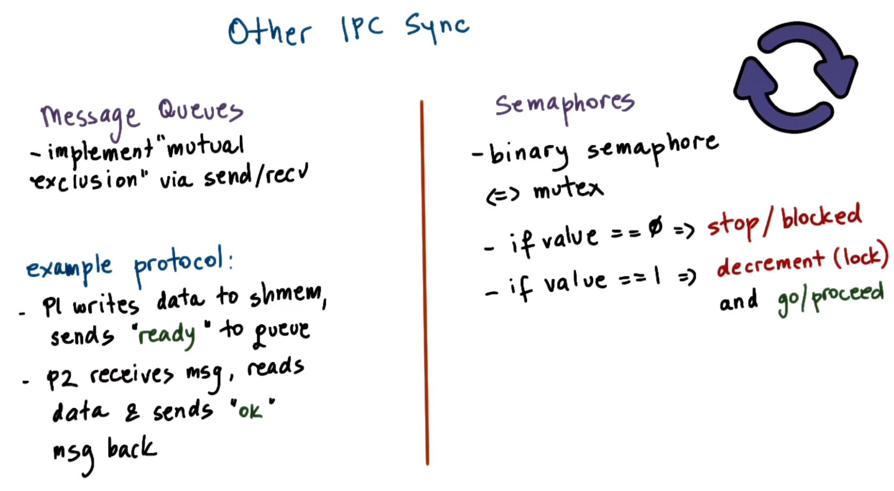
</center>

Instead, we rely on **other forms** of inter-process communication (IPC) for synchronization, such as message queues or semaphores.

**Message queues** allow to implement mutual exclusion via send/receive operations. An example protocol for this is as follows:
  * Two processes `P1` and `P2` are communicating via shared memory, and they use message queues to synchronize.
  * The first process `P1` writes to the data that is in shared memory (i.e., `shmem`), and then sends a "*ready*" message on the message queue.
  * The second process `P2` receives the "*ready*" message, knows that it is permissible to read the data from this shared memory, and then sends back an "*okay*" message response back to `P1`.

Another option is to use **semaphores**. Semaphores are an operating-system-supported synchronization construct. A **binary semaphore** can have two values (i.e., `0` or `1`), and therefore can achieve similar behavior to that which is exhibited by a mutex (i.e., depending on the value of the semaphore, the process is either *allowed* to proceed or is *stopped* at the semaphore pending a change).

For example, given a binary semaphore:
  * If `value == 0`, then the process is stopped/blocked.
  * If `value == 1`, then the semantics of the semaphore construct is such that the process will automatically decrement the value (i.e., down to `0`) and consequently the process will go/proceed.
    * Therefore, this decrement operation is equivalent to obtaining a lock for a mutex.

***N.B.*** The System V (SysV) API for the message queues and semaphores inter-process communication (IPC) mechanisms is similar to those that were seen for shared memory (i.e., in terms of creating, closing, etc. message queues and/or semaphores). Furthermore, for both constructs, there are also equivalent POSIX APIs.

***References***:
  * [SysV IPC Tutorials](https://tldp.org/LDP/lpg/node21.html)
    * This code example uses shared memory with message queues, and semaphores for synchronization. This example uses the System V (SysV) API.
  * [mq_notify() man page](https://man7.org/linux/man-pages/man3/mq_notify.3.html)
  * [sem_wait() man page](https://man7.org/linux/man-pages/man3/sem_wait.3.html)
  * [shm_overview man page](https://man7.org/linux/man-pages/man7/shm_overview.7.html)

## 15. Message Queue Quiz

For message queues, what are the Linux system calls that are used for...
  * sending a message to a message queue
    * `msgsnd()`
  * receiving a message from a message queue
    * `msgrcv()`
  * performing a message control operation
    * `msgctl()`
  * getting a message identifier
    * `msgget()`

## 16. Inter-Process Communication (IPC) Command-Line Tools

