# P3L4: Synchronization Constructs

## 1. Preview

Up to this point in the course, **synchronization** has been mentioned multiple times while discussing other operating systems concepts. This lecture will now focus primarily on synchronization itself.

This lecture will discuss several **synchronization constructs**, as well as the **benefits** of using these constructs.

Furthermore, this lecture will discuss the **hardware-level support** that is necessary to implement these synchronization primitives.

In covering these concepts, this lecture will reference the paper "*The Performance of Spin Lock Alternatives for Shared-Memory Multiprocessors*" (1990) by Thomas E. Anderson, involving the efficient implementation of spinlock (synchronization) alternatives. This paper will give a deeper understanding of how synchronization constructs are implemented on top of the underlying hardware and why they exhibit certain performance strengths.

## 2. Visual Metaphor

<center>

</center>

Returning to the toy shop analogy, now consider synchronization and synchronization mechanisms in the context of this example/analogy. **Synchronization** in operating systems is like waiting for a toy shop co-worker to finish so that you can continue working.

| Characteristic | Waiting Toy Shop Worker | Synchronization |
| :---: | :---: | :---: |
| May repeatedly check if the working co-worker / co-process is done in order to continue working | The waiting co-worker asks: "*Are you done? Or still working?*" This can have a negative impact on the working co-worker by delaying their processing and annoying them. | Processes may repeatedly check whether it is allowable to continue using a synchronization construct called a **spinlock**, which is supported in operating systems.  |
| May wait for a signal from the working co-worker / co-process in order to continue | The working co-worker indicates to the waiting co-worker: "*Hey, I'm done!*" However, the waiting worker may not be ready at this particular time (e.g., left for lunch break), therefore it may take an elapsed time period for the waiting co-worker to return and proceed with processing the toy work order. | Processes can synchronize using **mutexes** and **condition variables**, as discussed previously (cf. P2L2). These constructs can be used to implement the behavior whereby a process waits for a **signal** from another process before it can continue working. |
| Waiting hurts performance | In both of the above cases, the workers waste some amount of productive time while waiting. | Regardless of how the process waits and which synchronization mechanism is used, such waiting will adversely impact performance (e.g., wasted CPU cycles when performing checking operations, as well as due to cache effects when signaling another process that is periodically blocked and subsequently returning and resuming execution).  |

## 3. More About Synchronization

<center>

</center>

There has already been a fair amount of discussion in this course regarding dealing with concurrency in multi-threaded programs. Specifically, **mutexes** and **condition variables** were described, both in generic terms via Birrell's model (cf. P2L2) and their specific APIs and usage in the context of PThreads (cf. P2L3).

So then, why bother to discuss even *more* about synchronization here?

<center>

</center>

In the aforementioned discussion of mutexes and condition variables, it was indicated that these constructs have a number of common **pitfalls**, including:
  * Error-proneness, (in)correctness, and ease of use (e.g., forgetting to unlock the mutex, unlocking the wrong mutex, signaling the wrong condition variable, etc.).
    * These issues are an indication that the use of mutexes and condition variables is *not* an error-proof method, which means that such errors in turn may adversely affect the **correctness** of programs that use mutexes and condition variables, and in general will affect the ease of use of these two synchronization constructs.
  * Lack of expressive power.
    * It is necessary to introduce **helper variables** in order to express invariants (e.g., to control readers/writers access to a shared file) or to deal with priority control/restrictions (i.e., given that mutexes and condition variables do not inherently allow to specify anything regarding regarding **priority**).
    * Furthermore, this implies that these two synchronization constructs lack expressive power, inasmuch as they cannot be used to easily express arbitrarily complex **synchronization conditions**.

Furthermore, mutexes and condition variables (and any other software synchronization constructs, for that matter) require **low-level support** from the hardware in order to guarantee correctness of these synchronization constructs. Hardware provides this type of low-level support via **atomic instructions**.

Therefore, for the reasons enumerated above, it is sensible to spend more time discussing synchronization. Accordingly, this lecture will:
  * Examine a few other constructs (some of which eliminate some of these issues with mutexes and condition variables)
  * Discuss different types of uses for the underlying atomic instructions in order to achieve efficient implementations of certain synchronization constructs.

## 4. Spinlocks (Basic Synchronization Construct)

<center>

</center>

One of the most basic synchronization constructs that is commonly supported in an operating system is the **spinlock**.

In some ways, spinlocks are similar to mutexes, e.g.,:
  * The spinlock is used to protect the critical section to provide **mutual exclusion** among potentially multiple threads (or processes) attempting to perform the critical-section code.
  * The spinlock has certain **constructs** that are equivalent to the locking and unlocking constructs/operations of mutexes.
    * The corresponding use of these lock and unlock operations in spinlocks is similar to that of mutexes: If the lock is free then it can be acquired and consequently the critical section can be executed, otherwise if the lock is *not* free then the thread will be suspended at this particular point (i.e., `spinlock_lock(s)`) and unable to proceed.

However, a key **difference** between a spinlock and mutex is that when the lock is busy, the thread that is suspended in its execution (i.e., suspended at `spinlock_lock(s);`) is *not* blocked (i.e., as in the case of mutexes), but rather it is **spinning** (i.e., it is running on the CPU and repeatedly checking to see whether the lock has been freed, burning CPU cycles in this manner until the lock becomes free or until the thread becomes preempted for some reason [e.g., its timeslice has expired, a higher-priority thread has become runnable, etc.]). Conversely, with mutexes, the thread would have relinquished the CPU and allowed another thread to run.

Because of their relative simplicity, spinlocks are a **basic synhcronization primitive**, which in turn can be used to implement more-complex, more-sophisticated synchronization constructs. Therefore, because they are a basic construct, spinlocks will be revisited later in this lecture to discuss different **implementation strategies** for spinlocks.

## 5. Semaphores

<center>

</center>

The next synchronization construct to discuss is the **semaphore**. Semaphores are common synchronization constructs that have been part of operating system kernels for a while.

As a first approximation, a semaphore acts like a traffic signal, i.e., it either:
  * Allows threads to ***go***.
  * Or ***stops***/***blocks*** threads from proceeding any further.

Therefore, a semaphore is somewhat similar to what was discussed regarding a mutex (which either allows the thread to obtain the lock and proceed with the critical section, or the thread is blocked and must wait for the mutex to become free), however, a semaphore is ***more general*** than the behavior that can be achieved with a mutex.

<center>

</center>

More formally, a semaphore is **represented** by a positive integer value.
  * On **initialization**, a semaphore is assigned some **maximum value** (a positive integer).
  * Threads arriving at the semaphore will **try** the semaphore.
    * If the value of the semaphore is ***non-zero***, then its value is ***decremented*** and the thread will **proceed**.
    * If the value is ***zero***, then the thread must **wait**.
    * Therefore, the number of threads that are allowed to proceed equals the maximum value that was used to initialize the semaphore.
  * On **exit**, threads leaving the critical section will **post** (i.e., signal) to the semaphore, causing the semaphore's counter to ***increment***.

Therefore, as a synchronization construct, one of the key **benefits** of a semaphore is that it allows to express **count-based synchronization requirements** (e.g., `5` producers may be able to produce at the same time, via initialization of the semaphore to the maximum value of `5`).

Furthermore, if a semaphore is initialized with the value `1`, then its behavior is equivalent to that of a mutex; such a semaphore is called a **binary semaphore**. Accordingly, for a binary semaphor, the **post** operation is equivalent to unlocking of a mutex.

<center>

</center>

As a historic aside, semaphores were originally designed by **Edsger W. Dijkstra** (1930-2002), a Dutch computer scientist and Turing award recipient. In Dijkstra's original model, the semaphore operations wait and post were referred to as **P** (*proberen*, Dutch for "*to test out / to try*") and **V (verhogen)** (*verhogen*, Dutch for "*to increase*") (respectively). These operations (i.e., `P` and `V`) are still commonly retained in descriptions and literature regarding semaphores, based on Dijkstra's pioneering work in this area.

## 6. POSIX Semaphores

<center>

</center>

A brief list of some of the semaphore-related operations that are part of the POSIX API are as follows:
```c
#include <semaphore.h>

sem_t sem;
sem_init(sem_t *sem, int pshared, int count);
sem_wait(sem_t *sem);
sem_post(sem_t *sem);
```

The header `semaphore.h` defines the type `sem_t` for the semaphore.

`sem_init()` is used to initialize the semaphore (i.e., of type `sem_t`). Regarding the parameters:
  * `sem` is a pointer to the semaphore.
  * `count` is the initialization count.
  * `pshared` is a flag indicating whether the semaphore is shared by threads within a single process, or across processes.

The operations `sem_wait()` and `sem_post()` take as a parameter the semaphore variable that was previously initialized (e.g., `sem`).

## 7. Mutex via Semaphore Quiz and Answers

Complete the following code snippet (i.e., the initialization routine for the semaphore, `sem_init()`) so that the semaphore has behavior identical to a mutex used by threads within a process:

<center>

</center>

Answer:
```c
#include <semaphore.h>
// ...
sem_t m;
sem_init(&m, 0, 1); // answer
// ...
sem_wait(&m);
  // critical section
sem_post(&m);
```

***Explanation***:
  * The second argument (`0`) indicates that the semaphore is a *non*-process-sharing semaphore.
  * The third argument (`1`) for the counter makes this a binary semaphore, whose behavior resembles that of a mutex.
    * When the operation `sem_wait()` is reached, it will decrement this counter and consequently will allow exactly *one* thread at a time to enter the critical section.
    * Similarly, the operation `sem_post()` will increment the counter, which is the equivalent of a mutex being freed.

***Reference***: [`sem_init()` man page](https://linux.die.net/man/3/sem_init)

***N.B.*** Most operating systems textbooks include some examples on how to implement one synchronization construct with another (e.g., mutexes and/or condition variables via semaphores). Therefore, they can be referenced accordingly for this purpose.

## 8-9. Reader/Writer Locks

### 8. Introduction

<center>

</center>

When specifying synchronization requirements, it is sometimes useful to distinguish among the different **types** of **accesses** that a **resource** can be accessed with.

For instance, it is commonly desirable to distinguish between those accesses that do *not* modify a shared resource (i.e., only **read**) vs. those accesses that *do* modify a shared resource (i.e., always **write**).
  * For **read** accesses, the resource can be ***shared*** concurrently.
  * For **write** accesses, this requires ***exclusive*** access of the resource.

Therefore, operating systems and language run-times support so-called **reader/writer locks**. Reader/writer locks can be defined similarly to a mutex, however, it is additionally necessary to specify the type of access (i.e., read vs. write) to be performed, and then the lock will behave accordingly.

### 9. Using Reader/Writer Locks

<center>

</center>

In Linux, a reader/write lock can be **defined** using the corresponding type `rwlock_t`, as provided by the header `linux/spinlock.h`.

To **access** a shared resource using this reader/write lock, use the appropriate interface provided by the operations `read_lock()` or `write_lock()`.

The reader/writer API also provides the corresponding unlock counterparts, `read_unlock()` and `write_unlock()` (respectively).

***N.B.*** A few other operations are supported on the reader/write lock type `rwlock_t`, however, the shown above are the primary ones. To explore more such operations, consult the [source code](https://elixir.bootlin.com/linux/latest/source/include/linux/rwlock.h) for the header file `linux/spinlock.h` accordingly.

<center>

</center>

Reader/writer locks are supported in many operating systems and language run-times (e.g., Windows (.NET), Java, POSIX, etc.). In some of these contexts, the reader/writer operations are referred to as "**shared/exclusive locks**."

However, certain aspects of the behavior of the reader/writer locks are **different** with respect to their **semantics**.
  * It may be sensible to permit a ***recursive*** `read_lock()` operation to be invoked, but then it can differ across implementations with respect to what exactly occurs when calling the complementary operation `read_unlock()`.
     * In some implementations, a single `read_lock()`/`read_unlock()` pair may unlock *every* single one of the `read_lock()` operations that have been recursively invoked from within the same thread.
     * In other implementations, a *separate* `read_unlock()` operation may be required for every single `read_lock()` operation.
  * With respect to the treatment of **priorities**...
    * Handling the **upgrade**/**downgrade** of a priority.
      * In some implementations, a reader (i.e., the owner of a shared lock) may be given a priority to **upgrade** the lock (e.g., conversion from a reader lock to a writer lock), as compared to a newly arriving request for a write/exclusive lock.
      * In other implementations, the owner of a reader lock first releases the lock and then subsequently attempts to re-acquire the lock with write-access permissions, contending with any other thread that is attempting to perform the same operation at that time.
    * Interaction between the **state** of the lock, the priority of the thread, and the **scheduling policy** in the overall system.
      * For instance, it can block a reader such that a thread that otherwise would have been allowed to proceed is blocked if there is already a writer having higher priority that is waiting on the lock. In this case, the writer is waiting because there are other threads that already have read access to the lock; therefore, if there is a **coupling** between the scheduling policy and the synchronization mechanisms, it is possible that a newly-arriving reader will be blocked (i.e., it will not be allowed to join the other readers in the critical section because the waiting writer has higher priority).

## 10. Monitors

<center>

</center>

One of the **issues** with the synchronization constructs discussed thus far is that they require developers to pay attention to the use of the pair-wise operations `lock()`/`unlock()`, `wait()`, `signal()`, and others. Accordingly, this is one of the important **causes** of errors.

Conversely, **monitors** are higher-level synchronization constructs that assist with this issue. In an abstract manner, monitors explicitly specify...
  * What is the **shared resource** being protected.
  * What are all of the possible **entry procedures** to the shared resource (e.g., differentiating between readers and writers).
  * What are possible **condition variables** that potentially could be used to wake up different types of waiting threads.

When performing certain types of **access** with monitors...
  * On **entry** of the thread into the monitor (i.e., when the thread acquires the shared resource), all of the necessary locking and checking operations will occur when the thread is entering the monitor.
  * On **exit** of the thread from the monitor (i.e., when the thread is finished with the shared resource and consequently exits), all of the necessary unlocking, checking, and signaling (e.g., to the condition variable(s)) operations occurs *automatically*, and is therefore hidden from the programmer.

Due to these features, monitors are therefore referred to as a **high-level synchronization construct**.

***N.B.*** Historically, monitors were included in the MESA language run-time developed by XEROX PARC. Today, Java supports monitors as well. Every single object in Java has an **internal lock**, and methods that are declared to be **synchronized methods** are correspondingly entry points into the monitor. When compiled, the resulting code includes all of the appropriate locking and checking; the only ***caveat*** is that the `notify()` operation must be called explicitly.

***N.B.*** "Monitors" also refers to the **programming style** wherein mutexes and condition variables are used to describe the entry and exit codes from the critical section, as was described in the lecture on threads and concurrency with the corresponding "*enter critical section*" and "*exit critical section*" code regions (cf. P2L2).

## 11. More Synchronization Constructs

<center>

</center>

In addition to the multiple synchronization constructs encountered thus far, there are many other options available as well.

<center>

</center>

Some (e.g., **serializers**) make it easier to define **priorities** while also ***hiding*** the need for explicit signaling and the explicit use of condition variables from the programmer.

Others (e.g., **path expressions**) requires that the programmer specify the **regular expression** that captures the correct synchronization behavior.
  * As opposed to using locks or other constructs, the programmer would specify something like "*many reads or a single write*," and accordingly the run-time ensures that the operations that access the shared resource are interleaved in such a manner that satisfies the particular regular expression provided.

Another useful construct includes **barriers**, which behave as a "*reverse* of a semaphore" (i.e., if a semaphore allows `n` threads to proceed before it blows, then correspondingly a barrier blocks all threads until `n` threads arrive at this particular point protected by the barrier).

**Rendezvous points** is a synchronization construct that waits for *multiple* threads to meet at that particular point of the execution.

For ***scalability*** and ***efficiency***, there are efforts to achieve concurrency without explicitly locking and waiting; these approaches all fall under a category referred to as **optimistic wait-free synchronization**, which are "optimistic" in the sense that they "bet" on the fact that there will *not* be a conflict due to concurrent writes, and therefore it is safe to allow reads to proceed concurrently.
  * An example falling into this category is the so-called **read-copy update (RCU) log**, which is part of the Linux kernel.

<center>

</center>

One **essential commonality** among all of these synchronization constructs is that at the lowest level, they *all* require some **support** from the underlying **hardware** in order to make **atomic updates** to the shared-memory region; this is the only manner in which they can actually ***guarantee*** that the **lock** is properly required, and that the **state change** is performed in a ***safe*** manner (e.g., without leading to race conditions, and such that all threads in the system are in agreement as to what exactly is the current state of the synchronization construct).

The remainder of this lesson will discuss how synchronization constructs can be built by directly using the hardware support that is available from the underlying platform, specifically focusing on **spinlocks** as the simplest such construct to provide a representative case study.

## 12. Synchronization Building Block: Spinlock

### Spinlocks Revisited

<center>

</center>

Recall from earlier in this lecture that **spinlocks** are the most basic synchronization construct/primitive, and that they are also used in creating some more-complex synchronization constructs. For this reason, it is sensible to focus the remainder of this lecture on understanding ***how*** exactly spinlocks can be **implemented**, and ***what*** types of opportunities are available for their **efficient imlementation**.

To address these matters, the lecture will follow the paper "*The Performance of Spin Lock Alternatives for Shared Memory Multiprocessors*" (1990) by Thomas E. Anderson, which discusses the following pertinent topics:
  * Alternative implementations of spinlocks
    * This is also relevant to other synchronization constructs, which use spinlocks internally.
  * Generalization of techniques using atomic instructions to other constructs used in other situations.

## 13. Spinlock Quiz 1 and Answers

<center>

</center>

Consider the following pseudocode for a possible spinlock implementation:
```c
spinlock_init(lock):
  lock = free; // 0 = free, 1 = busy

spinlock_lock(lock):
  spin:
    if (lock == free) { lock = busy; }
    else { goto spin; }

spinlock_unlock(lock):
  lock = free;
```

The corresponding interaction with the **spinlock** `lock` is described as follows:
  1. `lock` must be initialized to `free` (i.e., `0`).
  2. To ***lock*** `lock`, check if `lock` is `free`...
    * If `lock` *is* `free`, then we can change its state (i.e., acquire `lock` and change its state to `busy`).
    * Otherwise if `lock` is *not* `free` (i.e., is `busy`), then we must keep ***spinning*** (i.e., perform the check designated by `spin: ...` repeatedly).
  3. Finally, we can release `lock` by setting it to `free`.

Based on this information, does this spinlock implementation correctly guarantee **mutual exclusion**? And if so, is it **efficient**? (Select one choice per category.)
  * Mutual exclusion:
    * Is guaranteed
    * Is not guaranteed
      * `CORRECT`
  * Efficiency:
    * Is efficient
    * Is not efficient
      * `CORRECT`

***Explanation***:
  * With respect to ***efficiency***, regarding the `goto` statement, as long as `lock` is not `free`, the cycle/check is repeatedly executed, which wastes CPU resources. Therefore, from an efficiency standpoint, this is *not* an efficient implementation.
  * Furthermore, with respect to ***correctness*** (i.e., ***mutual exclusion***), this implementation is also *incorrect*. In an environment where there are multiple threads (or multiple processes) executing concurrently, it is possible that more than one thread (or process) will simultaneously observe that `lock` is `free`, and therefore they will proceed to perform the operation `lock = busy;` at the same time; however, only *one* of these threads will successfully execute this operation, while the others will simply overwrite it and then proceed thinking that it has correctly acquired the lock. Consequently, *all* processes (or *all* threads) can end up in the critical section, leading to incorrect program behavior.

## 14. Spinlock Quiz 2 and Answers

<center>

</center>

The following is a variation on the implementation from Quiz 1 which avoids the `goto` statement:
```c
spinlock_init(lock):
  lock = free; // 0 = free, 1 = busy

spinlock_lock(lock):
  while (lock == busy); // spin
  lock = busy;

spinlock_unlock(lock):
  lock = free;
```

The corresponding interaction with the **spinlock** `lock` is described as follows:
  1. `lock` must be initialized to `free` (i.e., `0`).
  2. As long as `lock` is `busy`, the thread continues to ***spin*** via the `while` loop.
      * At some point, when `lock` is set to `free`, the thread will exit from this `while` loop and will set `lock` to `busy` (i.e., to acquire `lock`).
  3. Finally, we can release `lock` by setting it to `free`.

Based on this information, does this spinlock implementation correctly guarantee **mutual exclusion**? And if so, is it **efficient**? (Select one choice per category.)
  * Mutual exclusion:
    * Is guaranteed
    * Is not guaranteed
      * `CORRECT`
  * Efficiency:
    * Is efficient
    * Is not efficient
      * `CORRECT`

***Explanation***:
  * With respect to ***efficiency***, since there is continuous looping/spinning (via the `while` loop) as long as `lock` is `busy`, this implementation is *inefficient*.
  * Furthermore, with respect to ***correctness*** (i.e., ***mutual exclusion***), this implementation is also *incorrect*. Even though the `while` check has been added, as before, multiple threads (or processes) will observe that `lock` is `free` once it becomes `free` (i.e., exits the `while` loop), and consequently these threads (or processes) will attempt to set `lock` to `busy`; if the threads (or processes) are allowed to execute concurrently, there is no way to guarantee purely via the software that there will not be some interleaving of exactly how these threads (or processes) perform these checking and setting operations, and that a race condition will not occur here. Therefore, in general the program will behave incorrectly.

In summary, while multiple purely-software-based implementations of a spinlock may be devised, ultimately they all result in the same **conclusion**: Some type of **hardware support** is strictly necessary to ensure that these checking and setting operations on the spinlock occur **atomically** via the **hardware support**, as discussed next.

## 15. Need for Hardware Support

<center>

</center>

Returning to the operation `spinlock_lock()` from the previous section (Quiz 2), it is necessary to check and to set the value of `lock` **atomically** (i.e., indivisibly) so that it can be guaranteed that only *one* thread (or process) at a time can successfully `lock`.

The **problem** with the implementation in the figure shown above is that it takes multiple cycles to perform these checking and setting operations, and therefore during these multiple cycles threads (or processes) can be interleaved in arbitrary ways. Furthermore, if the threads (or processes) are running on multiple processors, their execution can completely overlap temporally.

Therefore, to achieve the desired behavior, it is necessary to rely on **hardware-supported atomic instructions**.

## 16. Atomic Instructions

<center>

</center>

Each type of hardware or hardware architecture supports a number of **atomic instructions**, which are typically ***hardware-specific*** (i.e., different instructions may be supported on different hardware platforms, and correspondingly not every platform must support every single instruction). Examples include:
  * `test_and_set()`
  * `read_and_increment()`
  * `compare_and_swap()`

As the names of these example suggest, each such atomic performs some **multi-step, multi-cycle operation**. However, because they are ***atomic*** instructions, the hardware provides the following **guarantees**:
  * **atomicity** - The operation occur as full, discrete events (i.e., not partially/incompletely).
  * **mutual exclusion** - The operation occurs such that only *one* instruction is permitted to perform the operation at a time.
  * **queueing** - All concurrently instructions are queued *except for one*, with the others waiting pending their own turn.

Therefore, atomic instructions specify an **operation** which effectively constitutes the **critical section**, which in turn is assisted by **hardware-supported synchronization mechanisms** for that operation.

<center>

</center>

Returning to the previous spinlock example, using the first atomic operation `test_and_set()`, the spinlock implementation can be modified as in the figure shown above. Here, `test_and_set(lock)` ***automatically*** returns (i.e., ***tests***) the original value and ***sets*** the new value to `1` (i.e., `busy`).

Furthermore, when there are multiple threads contending for `lock` (i.e., via their respective attempts to perform the operation `spinlock_lock()`), only *one* must successfully ***acquire*** the lock.
  * For the very first thread that arrives and executes the operation `test_and_set()`, this operation will return the value `0` (i.e., `free`), because the original value of `lock` is `0` post-initialization. Therefore, this thread exits the `while` loop, and consequently this thread is the *only* thread that acquires `lock` and then proceeds with execution.
  * Conversely, all of the remaining threads that attempt the operation `test_and_set()` receive the return value of `1` (i.e., `busy`), because the first thread has already set `lock` to `1`. Therefore, these remaining threads continue to ***spin*** in the `while` loop.
    * Note that during this time, these threads repeatedly set the value of `lock` to `1` (i.e., via the `while` loop), however, this is *not* problematic. Since the first thread has already set `lock` to `1` when it acquired it, consequently these other threads are effectively unchanging since `lock` is indeed locked already.

Which specific atomic instructions are available on a given hardware platform varies from hardware to hardware.
  * Some operations (e.g., `test_and_set()`) are fairly prevalent, while others (e.g., `read_and_increment()`) may not be available on all platforms.
  * In fact, there may even be multiple variations/versions of this (e.g., in some cases, there may be an available atomic operation that atomically increments but does not necessarily return the old value; in other cases, there may be atomic operations that support `read_and_decrement()` as opposed to `read_and_increment()`; etc.).

Additionally, there may be differences in **efficiencies** with which different atomic operations execute on different architectures.

For these reasons, software such as **synchronization constructs** that are built using certain atomic instructions must be **ported** across hardware platforms accordingly (i.e., the implementation must use only those atomic instructions which are available on the target hardware platform). Furthermore, it must be ensured that the implementation of such software is **optimized** such that it uses the most efficient atomic operations on the target platform, and to use them in an efficient manner in the first place.

Anderson's paper presents several alternatives for implementing spinlocks using the atomic instructions provided by the available hardware, which will be discussed in the remainder of this lecture.

## 17. Shared-Memory Multi-Processors

Before discussing the alternative spinlock implementations presented in Anderson's paper, consider a refresher on multi-processor systems and their cache-coherence mechanisms; this is necessary in order to understand the design trade-offs and the performance trends discussed in the paper.

### Introduction

<center>

</center>

A **multi-processor system** consists of multiple CPUs (i.e., more than one) and memory that is mutually accessible by all of the CPUs. The **shared memory** can be either a *single* (physical) memory component that is equidistant from all of the CPUs, or there can be multiple memory components.

Regardless of the number of (physical) memory components, they are somehow **interconnected** to the CPUs, e.g.,:
  * Via an **interconnect-based (i/c-based)** connection (the most common configuration in modern systems).
  * Via a **bus-based** connection (which was more common in the past).

***N.B.*** In the figure shown above, the bus-based connection shows a single memory module, however, the bus-based configuration can be used with multiple memory modules, and similarly an interconnect-based connection can be used with a single memory module.

A key **difference** between the bus-based and interconnect-based connections is that in interconnect-based connections, there can be *multiple* memory references in flight (i.e., where one memory reference is applied to one memory module, and another memory reference is applied to another memory module), whereas in a bus-based connection only *one* shared-memory reference can be in flight at a given time (i.e., regardless of whether the memory reference is addressing a single memory module or if it is spread out across multiple memory modules, and therefore in a bus-based connection, the **bus** is shared across all of the memory modules).

Because of this **property** whereby the memory is accessible to *all* of the CPUs, these systems are called **Shared Memory Multi-Processors**. Other terms used to refer to shared-memory multi-processors include **symmetric multi-processors** and **SMPs**.

### Shared Memory Multi-Processors and Caches

<center>

</center>

Additionally, each CPU in such a shared-memory multi-processor system can have a **cache**. Access to the cache data is much faster, therefore caches are useful for hiding memory latency.

Furthermore, the issue of memory latency is amplified in shared-memory systems inasmuch as there is **contention** for the shared-memory module. Due to this contention, certain memory references must be delayed, which adds even more to the memory latency, i.e., it is as if the memory were (temporally) "further away" from the CPU due to this contention effect.

Therefore, when data is present in the cache, the CPU reads the data from the cache (i.e., rather than from memory), which in turn has a positive impact on performance.

When CPUs perform a **write** operation, several things can happen:
  * **no-write** - A CPU write operation to the cache may not be permissible in the first place, and therefore will be rerouted directly to memory, and any cached copy of that particular memory location will be **invalidated**.
  * **write-through** - A CPU write operation may be applied to *both* the cached location *and* directly to the memory.
  * **write-back** - On some architectures, the CPU write operation can be applied to the cache, but then the actual update to the appropriate memory location can be *delayed* (i.e., applied later). For example, when a particular cache line is evicted.

## 18. Cache Coherence

<center>

</center>

One **challenge** to consider is: What happens when multiple CPUs reference the *same* data (e.g., `x`, as in the figure shown above)?
  * The data appears in multiple caches.
  * Furthermore, with multiple memory modules, the data is present in *one* of the memory modules, but is referenced by *both* CPUs (and correspondingly is also referenced in their respective caches).

In some architectures, this issue must be resolved purely with software; otherwise, the caches will be **non-coherent**.

<center>

</center>

For instance, if one CPU makes an update (e.g., `x` is updated to `3`), then the hardware does nothing to account for the fact that the value of the data in the cache of the other CPU is different (e.g., `x` is `4` in the other CPU); rather, this discrepancy must be handled by the software. Such architectures/platforms are called **non-cache-coherent (NCC)**.

Conversely, on other platforms, the hardware itself handles all of the necessary steps to ensure that the CPUs' caches are coherent (i.e., contain the same data, even after one CPU makes an update to the data). Accordingly, these architectures/platforms are called **cache-coherent (CC)**.

<center>

</center>

The basic **mechanisms** that are used in cache coherence are called **write-invalidate (WI)** and **write-update (WU)**. Consider what happens with each of these mechanisms when a certain value is present in all of the caches (e.g., `x` in the figure shown above).

<center>

</center>

In the **write-invalidate (WI)** case, if one CPU changes the data value, then the hardware ensures that if any other cache contains that same data-value reference then that reference will be **invalidated**. Subsequent accesses to this invalidated reference(s) via the other CPU(s) result in a **cache miss**, and will consequently push the reference over to memory (in which case the reference is updated via another method, e.g., `write-through` or `write-back`).

In the **write-update (WU) case**, once a CPU changes the data value, then the hardware ensures that if any other cache contains that data-value reference is correspondingly **updated** as well. Subsequent accesses to this reference(s) via the other CPU(s) result in a **cache hit**, thereby returning the correctly updated reference.

The **trade-offs** with these approaches are as follows:
  * With **write-invalidate (WI)**, the key **benefit** is that there is a lower bandwidth requirement imposed on the system's shared interconnect.
    * Since it is not necessary to send the *full value* `x`, but rather just its *address* in order to be invalidated in the other caches.
    * Furthermore, once the cache line is invalidated, future notifications to the same (originally changed reference's) location will not result in subsequent invalidations on the other caches. Therefore, since the data is no longer required on any of the other CPUs in the immediate future, it is possible to **amortize** the cost of the "coherence traffic" over multiple reference-value changes (e.g., `x` can change to `x'` multiple times on the first CPU before it is needed on another CPU, but `x` is only invalidated *once* ).
  * With **write-update (WU)** architectures, the key **benefit** is that the data is available on the other CPUs that must access it immediately upon update; there is no additional cost incurred (e.g., another memory access) in order to retrieve the latest data value.

However, with respect to "selecting" between these approaches, there is a **caveat**/**drawback**: As a programmer, there is effectively *no* choice whether to use write-invalidate (WI) vs. write-update (WU), but rather this will be strictly ***determined by the hardware*** (i.e., this is a property of the hardware architecture and its correspondingly implemented policy).

## 19. Cache Coherence and Atomics

An **important concept** to understand is what exactly occurs with cache coherence when atomic instructions are used.

Recall that the purpose of atomic instructions is to deal with issues related to the arbitrary interleaving of threads that are sharing the CPU, as well as threads that are concurrently executing across multiple CPUs.

<center>
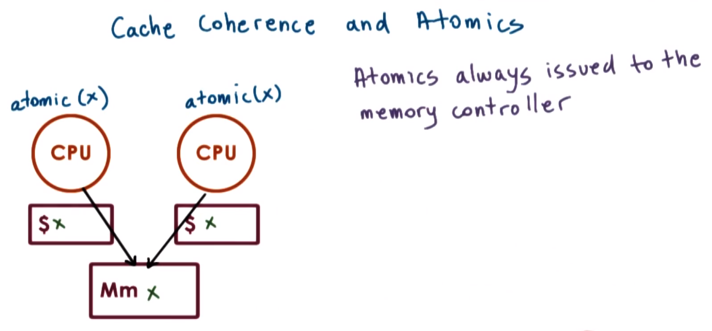
</center>

Consider the situation as in the figure shown above, wherein there are two CPUs, and on both CPUs it is necessary to perform some atomic instruction `atomic(x)` involving the memory location of `x`. Furthermore, `x` has been cached in both of the CPUs.

The **problem** is as follows: How to prevent *multiple* threads on these two different CPUs from *concurrently* accessing the respective cached values of `x`? If it is permissible for `atomic(x)` to read and update the *cached* value of `x` (the memory reference that is the target of the atomic instruction), there can be multiple **problems**, e.g.,:
  * Since there are multiple CPUs with caches, it is therefore uncertain where exactly the value `x` has been cached.
  * There are **write-update (WU)** vs. **write-invalidate (WI)** protocols.
  * There is latency on the chip.

Given these issues, it is very challenging to deal with the situation wherein a particular atomic operation is applied to the cache on *one* of the CPUs, as it is uncertain whether or not another atomic operation is attempted on the cached value in the other CPU(s).

For this reason, atomic operations **bypass** the caches and instead ***always*** directly access the (physical) memory location where the particular target value (i.e., `x`) is stored.


By forcing all atomic operations to operate directly on the memory controller, this creates a **central entry point** whereby all of the corresponding references can be ***ordered*** and ***synchronized*** in a ***unique*** manner (i.e., none of the aforementioned race conditions can occur if it were permissible for the atomic operations to access the caches directly instead).

<center>
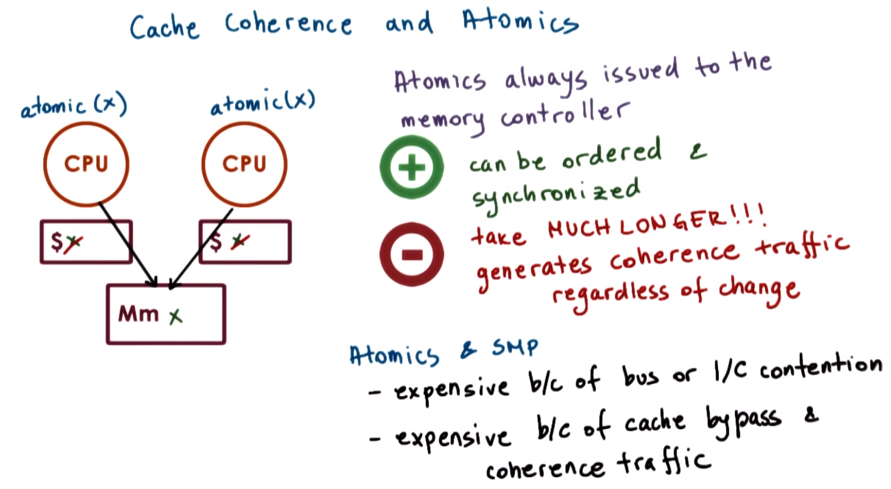
</center>

However, while this solves the correctness problem, it correspondingly raises another **issues**:
  * Atomic operations generally take much **longer** than other types of instructions, inasmuch atomic operations must *always* access main memory as well as contend for this memory.
  * Furthermore, in order to guarantee the intended atomic behavior, it is necessary to generate **coherence traffic** to either update or to invalidate *all* of the cached copies of the memory reference, regardless of whether or not this value is actually changed by the atomic operation.
    * This is necessary in order to ensure safety and to guarantee correctness of the atomic operations.

In summary, atomic instructions on shared memory multi-processor (SMP) systems are generally **more expensive** compared to instructions on a single-CPU system because:
  * There is **contention** for the shared bus (or shared interconnect).
  *  Atomic operations are generally more expensive because they bypass the cache and consequently trigger all necessary coherence traffic, regardless of whether or not the accessed memory reference targeted by the atomic instruction is actually modified.

## 20. Spinlock Performance Metrics

With the background on shared memory multi-processor (SMP) systems, cache coherence, and atomic instructions now concluded, we are now ready to discuss the design and performance trends of **spinlock implementations**.

<center>
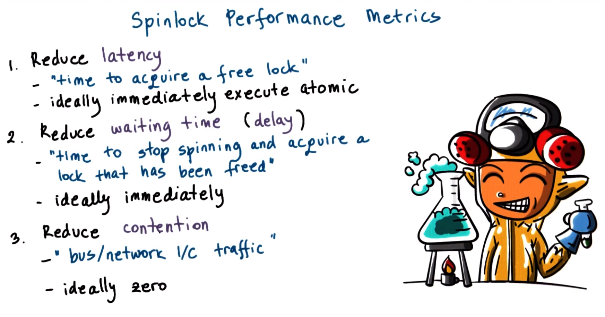
</center>

The one remaining matter is: What are the **performance metrics** that are useful when reasoning about different implementations of spinlocks?

To determine this, consider what are the **objectives** for the spinlock...
  1. Reduce **latency** (i.e., the time for a thread to acquire a free lock).
      * Ideally, the thread should be able to acquire immediately (i.e., zero latency) with a single instruction. Furthermore, recall that is has been established already that spinlock require atomic instructions, therefore, in the **ideal case**, a single atomic instruction should execute with ***zero*** latency and complete execution immediately thereafter.
  2. Reduce **waiting time**/**delay** (i.e., when a thread is spinning and a lock becomes free, the subsequent time required for the thread to stop spinning and to acquire the lock that has been freed should be reduced).
      * Similarly, in the **ideal case**, this should occur immediately (i.e., ***zero*** delay).
  3. Reduce **contention** on the shared bus (or on the shared network interconnect).
      * Here, contention refers to *both* the contention due to the actual atomic memory references as well as the contention that is generated due to coherence traffic. Contention is undesirable because:
        * It delays any other CPU in the system that is attempting to access the shared memory.
        * More importantly, contention will also delay the spinlock's **owner** (i.e., the thread of the process that is attempting to quickly complete a critical section to subsequently release the spinlock), and thus in a contention situation, there can be a potential delay of the corresponding unlock operation for the spinlock, thereby adversely impacting performance even more.
      * Therefore, in the **ideal case**, there is ***no*** contention generated.

Therefore, these are the three objectives that are desired to be achieved in a suitable spinlock design. The different alternatives discussed in this lecture will therefore be evaluated based on these criteria.

## 21. Conflicting Metrics Quiz

<center>
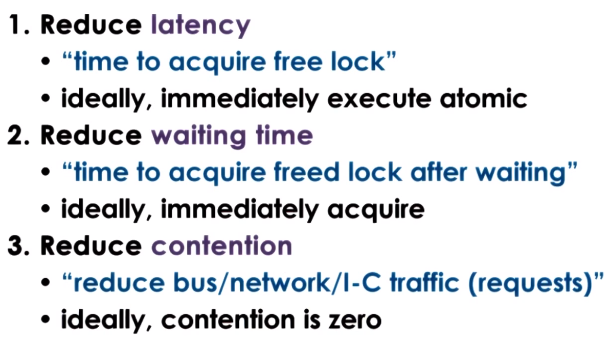
</center>

Consider the aforementioned spinlock performance objectives and accompanying performance metrics, as repeated/summarized in the figure shown above.

Among the described performance metrics, are there any **conflicting** goals (i.e., does any goal(s) counteract any other goal(s))? (Select all that apply.)
  * `1` conflicts with `2`
    * `DOES NOT APPLY`
      * This cannot be determined in general, as latency vs. wait time will ultimately be determined by the corresponding algorithm(s) used.
  * `1` conflicts with `3`
    * `APPLIES`
      * `1` (reduce latency) implies that the atomic operation be performed as soon as possible; consequently, the locking operation will immediately proceed with an atomic operation, which in turn conflicts with `3` (reduce contention) since this can create contention on the network.
  * `2` conflicts with `3`
    * `APPLIES`
      * `2` (reduce waiting time) requires that there is continuous spinning on the lock as long as the lock is unavailable in order to detect that the lock is freed as soon as possible to acquire it immediately; consequently, this will create contention, thereby conflicting with `3` (reduce contention).

## 22. `test_and_set()` Spinlock

<center>
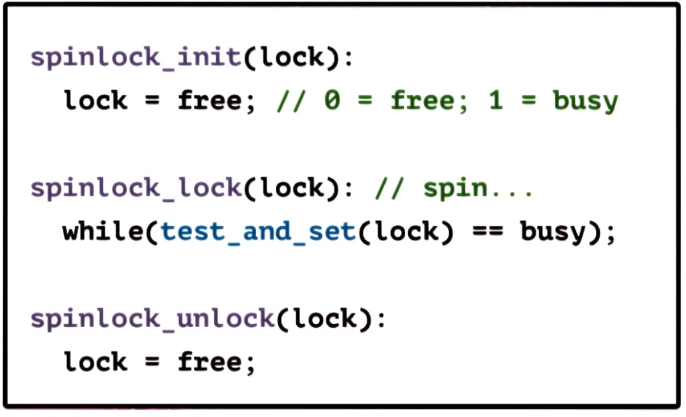
</center>

Consider a simple spinlock implementation using the `test_and_set()` instruction described previously, as in the figure shown above. In this examples (and the subsequent ones), it is assumed that the lock initialization step (i.e., `spinlock_init()`) sets `lock` to be `free`, where `0` and `1` represent `free` and `busy` (i.e., the lock is acquired/locked) (respectively).

In this implementation, a key **feature** is that the atomic instruction `test_and_set()` is a very common atomic instruction that is supported by most hardware platforms. Therefore, this code is very **portable** across platforms (i.e., the *same* code can be used across many *different* platforms).

<center>
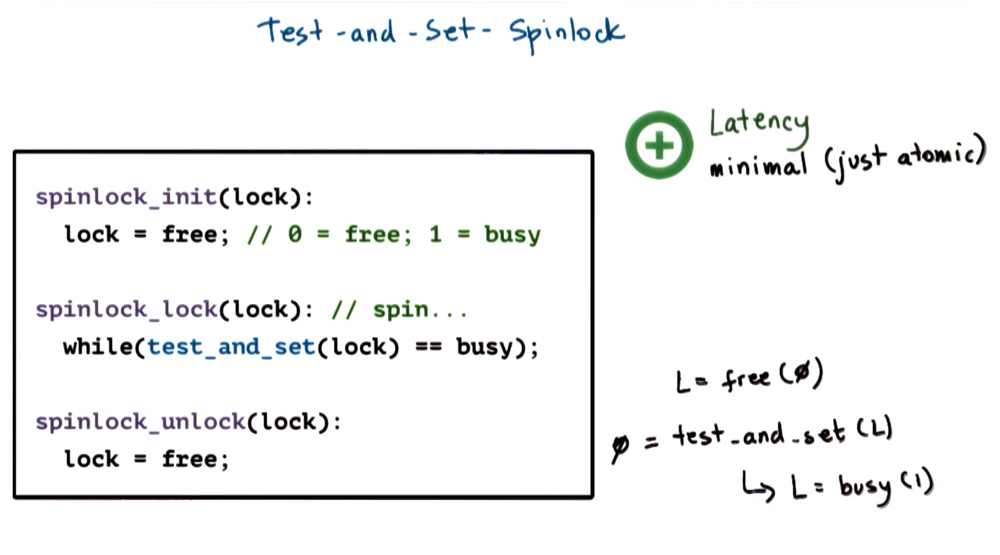
</center>

Regarding **latency**, this spinlock implementation performs as well as possible: It is only necessary to execute the atomic operation `test_and_set()`.
  * Note that `lock` is originally `free` (i.e., `0`), and then as soon as the operation `spinlock_lock()` is executed, an attempt is made to execute `test_and_set()`.
  * Since `lock` is `free`, `test_and_set()` returns `0`, therefore resulting in an exit from the `while` loop. Furthermore, `test_and_set()` changes the value of `lock` to `busy` (i.e., `1`).
  * Therefore, at this point the `while` loop has been exited from, spinning has stopped, and `lock` has been set to `busy`.

<center>
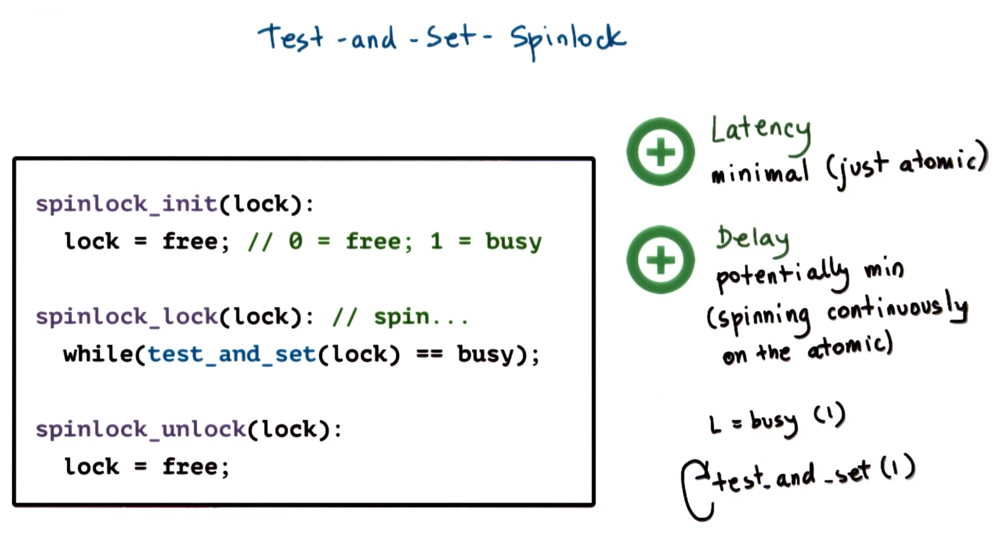
</center>

Regarding **delay**, this particular spinlock implementation potentially can perform well, due to the continuous spinning on the atomic instruction `test_and_set()`.
  * As long as `lock` is `busy`, `test_and_set()` returns `1` (i.e., `busy`), spinning continues.
  * However, whenever `lock` does become `free`, at least one `test_and_set()` operation will detect this, and consequently exit the `while` loop. Furthermore, this single successful `test_and_set()` operation will set `lock` to `busy`, thereby causing other `test_and_set()` operations to continue spinning.

<center>
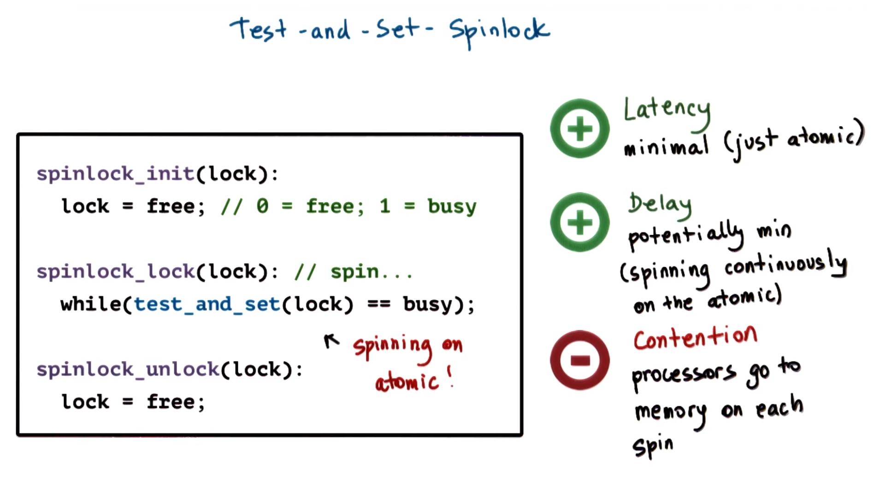
</center>

As indicated previously (cf. Section 21), there is a **conflict** with contention in relation to *both* latency *and* delay. Therefore, with respect to contention, this spinlock implementation will not perform well. As long as they are spinning, every processor will repeatedly go onto the shared interconnect (or onto the shared bus) to the memory location where the lock is stored, given that it is repeatedly attempting to execute the atomic instruction (i.e., `test_and_set()`). Consequently, this will create contention, thereby delaying the processing that is carried out on other CPUs, delaying the processing that the lock owner must perform (e.g., execution of the critical section), etc. which in turn will delay the time when the lock actually becomes free.

The **fundamental issue** with this implementation is that it continuously spins on the atomic instruction.
  * If there is *no* cache coherence, then it is *always* necessary to go to memory in order to check the value of the lock.
  * Furthermore, with this implementation, even if there *is* cache coherence, it will be **bypassed** due to the use of an atomic instruction (i.e., every single spin will go to memory, regardless of the cache coherence).

Clearly, this implementation is not the most efficient use of either atomic operations or of hardware that supports caches and cache coherence.

## 23. `test_and_test_and_set()` Spinlock

<center>
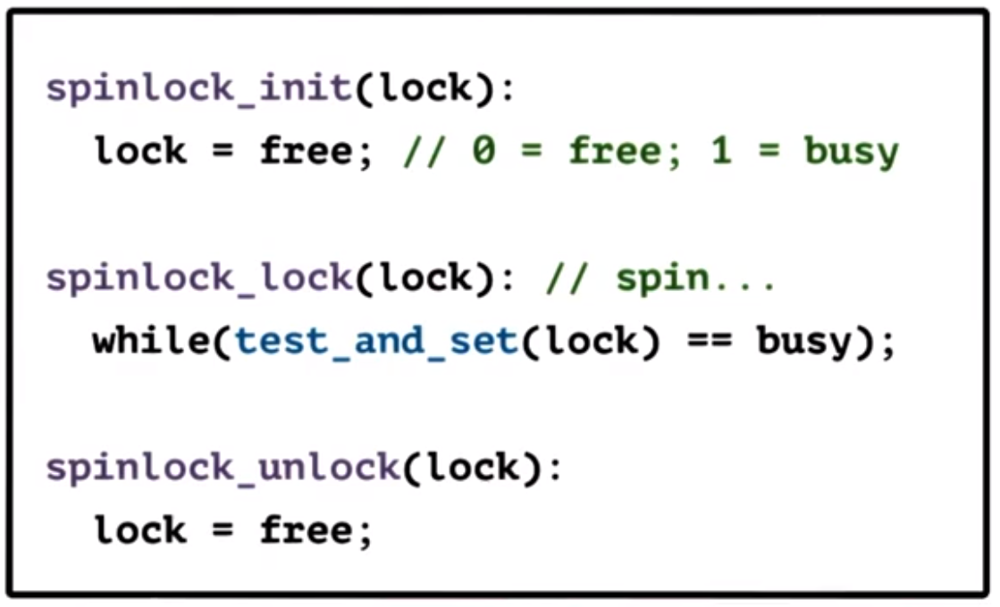
</center>

In the previous implementation example (repeated for reference in the figure shown above), recall a **key issue** is that all of the CPUs repeatedly spin on the atomic operation (i.e., `test_and_set()`). To **resolve** this issue, consider a separation into two ***distinct*** operations as follows:
  * `test()`, which checks `lock`.
  * `test_and_lock()` is the atomic operation, as before.

The **intuition** here is that for the operation `test()`, caches can be potentially used to test/check the ***cached*** copy of `lock`, and then only if this *cached* copy of `lock` indicates that its value has changed will the atomic operation (i.e., `test_and_set()`) actually be executed.

<center>
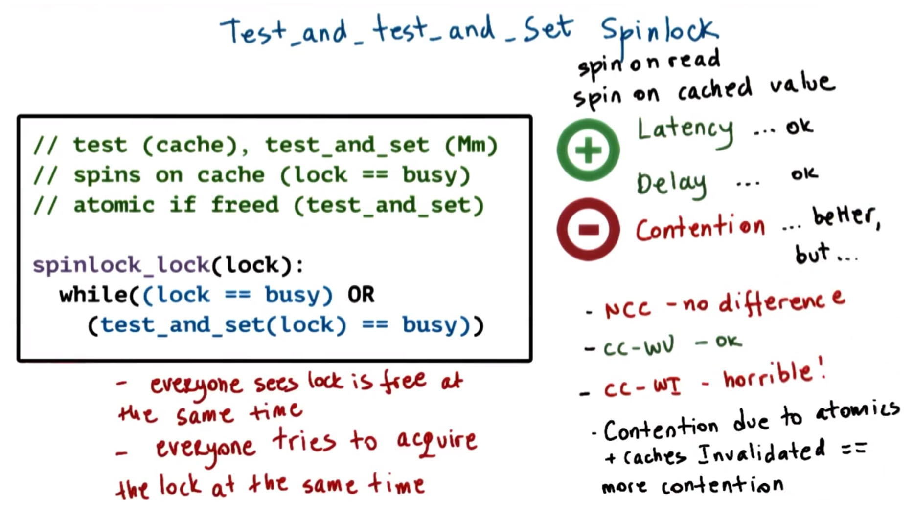
</center>

Following along with this change, the resulting modified operation `spinlock_lock()` is as in the figure shown above.
  * The first condition of the predicate `(lock == busy)` checks if `lock` is `busy`.
    * This checking is performed via the value in the **cache** (i.e., this does *not* involve any atomic operation, but rather is a simple check of whether a particular memory address is set to `1`/`busy` or `0`/`free`). On a system with caches, this will result in a **cache hit**.
    * As long as this condition is true (i.e., the `lock` is `busy`), the second condition of the predicate (i.e., the atomic operation) will *not* be evaluated (i.e., due to short-circuit evaluation of the operator `OR`), and therefore `lock` will remain `busy` and the `while` loop will continue to cycle.
  * Only when `lock` becomes `free` does the second condition of the predicate `test_and_set(lock) == busy` get evaluated.
    * At this point, the atomic operation `test_and_set()` will be executed (or at least an attempt to do so will occur), and the resulting return value from this operation will indicate whether or not `lock` is acquired.
    * Furthermore, this also means that `test_and_set()` will attempt to make a memory reference (via main memory) *only* when `lock` becomes `free`.

From this collective behavior, this spinlock implementation is accordingly called the **`test_and_test_and_set()` spinlock** (or, alternatively, the **spin on read spinlock** or **spin on cached value spinlock**).
  * ***N.B.*** The Anderson paper refers to this spinlock as "spin on read."

With respect to both **latency** and **delay**, this spinlock implementation is of acceptable (i.e., "okay") performance. It is slightly worse than the `test_and_set()` spinlock due to the extra check (i.e., `test()`) to determine whether `lock` is `busy` (via the cache), however, in principle this is not an exceedingly detrimental impact on performance.

With respect to **contention**, however, this implementation does not sufficiently resolve the issue.
  * Firstly, if dealing with a **non-coherent cache (NCC)** architecture, then every single memory reference will go directly to main memory anyways (just as with the atomic operation itself, `test_and_set()`), and therefore there is ***no difference*** at all in performance.
  * Conversely, if dealing with a **cache-coherent (CC)** architecture having **write update (WU)**, then the performance is ***acceptable***. However, a persistent issue in this case that all of the processors will detect that `lock` becomes `free` on the condition `lock == busy` (i.e., the delay component), and therefore at this point *every* one of the processors will simultaneously attempt to execute the atomic operation `test_and_set()`, thereby leading to potential issues.
  * The ***worst*** scenario with respect to poor performance due to contention is the combination of a **cache-coherent (CC)** architecture having **write invalidate (WI)**. In this case, every single attempt to acquire `lock` not only generates contention for the memory module, but also creates **invalidation traffic**.

Recall when discussing atomics that one outcome of executing an atomic instruction is that cache coherence is triggered (i.e., write-update or write-invalidate traffic) regardless of the present situation.
  * In the case of **write update (WU)**, the coherence traffic updates the value of the other caches with the ***new*** value of `lock`. If `lock` was busy before the write-update event and if `lock` remains busy after the write-update event, then there is no change; that particular CPU can continue to spin from the **cached** copy.
  * Conversely, in the case of **write invalidate (WI)**, the cached copy is simply ***invalidated***. Consequently, it is possible that `lock` was busy before the cache-coherence event (i.e., before the atomic instruction `test_and_set()` was executed), and if the atomic instruction was not successful, then the situation persists wherein `lock` is `busy`; however, as far as the **caches** in the system are concerned, the atomic instruction has invalidated their respective copies of `lock`.
    * The resulting **outcome** of this is that the caches must go out to main memory in order to fetch the copy of `lock` that they will spin on, and therefore the caches will not be able to simply spin on a cached copy of `lock` but rather they will have to fetch it from main memory *every* time there is an attempt to perform the atomic instruction, thereby ***compounding*** the adverse contention effects (and correspondingly decreasing performance).
    * Therefore, the reason for the poor performance of `lock` in this situation is that *every* CPU simultaneously detects that `lock` has become `free` and consequently simultaneously attempts to acquire `lock`.

## 24. `test_and_test_and_set()` Spinlock Quiz and Answers

<center>
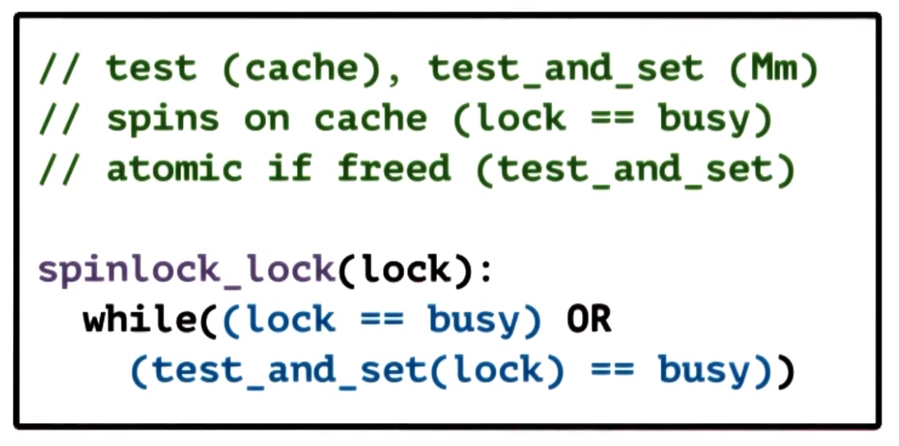
</center>

Consider further the implications of the `test_and_test_and_set()` spinlock implementation, repeated for reference in the figure shown above.

In a **shared memory multi-processor (SMP)** system with `N` processors, what is the memory **complexity** of the memory contention (accesses), relative to `N`, that will result from releasing a `test_and_test_and_set()` spinlock?
  * cache-coherent system with write-update: `O( _ )`?
    * `O(N)`
      * In this case, *all* of the processors are able to detect when `lock` is released immediately (i.e., when `lock == busy` becomes false), and consequently *all* will issues the atomic operation `test_and_set()`. Therefore, there will be as many references to `lock` as there are  `test_and_set()` operations occurring (i.e., `O(N)`).
  * cache-coherent system with write-invalidate: `O ( _ )`?
    * `O(N`<sup>`2`</sup>`)`
      * In this case, if all of the processors' respective caches are invalidated, this will occur for all ***after*** the initial release of `lock` (i.e., after `lock == busy` is false).
        * For some processors, by the time they re-read the memory value of `lock` from main memory in order to execute the second part of the predicate (`test_and_set(lock) = busy)`), `lock` already will have been set to `busy` by another processor, and consequently those processors will attempt to spin on the *newly read* cached copy of `lock` (i.e., going back to the first condition `lock == busy`).
        * Conversely, for other processors, when they attempt to re-read the memory value of `lock` from main memory, this occurs ***before*** any  `test_and_set()` operations have been executed, and therefore they will detect the value of `lock` as `free`. Consequently, these processors attempt to execute the operation `test_and_set()` accordingly. Only *one* of these `test_and_set()` operations will succeed, however, every single one of them will invalidate all the other processors' caches, including the caches of those processors that detected that `lock` is `busy` (i.e., via the first condition/check `lock == busy`).
      * Therefore, the worst-case complexity due the bandwidth that is generated from the contention that results when `lock` is freed is `O(N`<sup>`2`</sup>`)`.

## 25. Spinlock "Delay" Alternatives

A simple way to handle the issues of the `test_and_test_and_set()` spinlock implementation is to introduce a **delay**.

### Delay After Lock Release

<center>
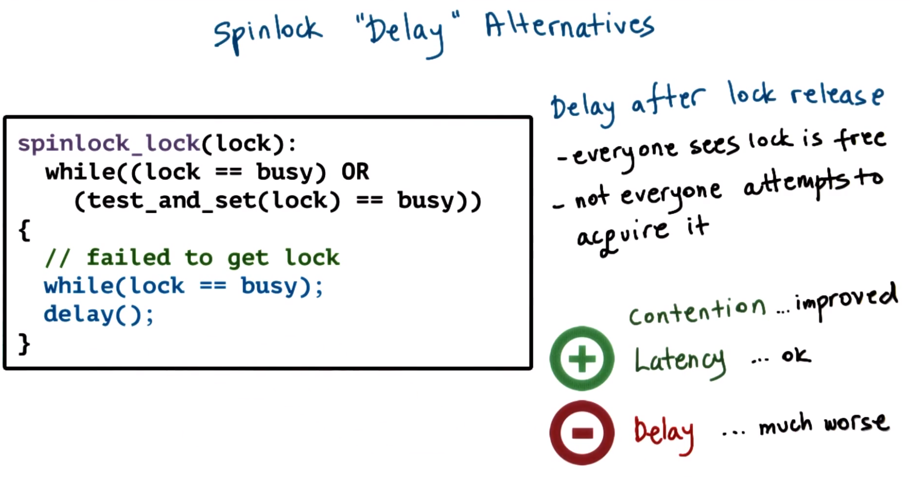
</center>

The figure above shows a simple implementation which introduces a delay operation `delay()` every single time a thread detects that `lock` is `free` (i.e., the delay occurs *after* `lock` is released). When the thread detects that `lock` is `free`, it exits the inner `while` loop, and then prior to proceeding to the next iteration of the outer `while` loop (where it again checks the condition `lock == busy`), the thread waits via the operation `delay()`.

The **rationale** for this approach is that even though every thread/processor detects that `lock` is `free` simultaneously, with the added operation `delay()`, not all of them will attempt to execute the atomic operation `test_and_set()` simultaneously.

Consequently, **contention** in the system is significantly **improved**.
  * When the operation `delay()` expires, the **delayed threads** will re-check the value of `lock` (i.e., via `lock == busy`), at which point it is possible that if another thread arrives in the meantime and proceeds to execute the atomic operation `test_and_set()` then the former will detect that `lock` is `busy` and consequently proceed to the inner `while` loop and continue spinning. Otherwise, if `lock` is `free`, then the delayed thread(s) will execute the atomic operation `test_and_set()`.
  * However, with the operation `delay()` included, it is much less likely that *all* of the threads will attempt to execute the atomic operation `test_and_set()` at exactly the *same* time. Furthermore, it is much less likely for the situation to occur wherein threads are repeatedly invalidated while attempting to spin on the cached value of `lock`, because after `delay()` in the second check of `lock == busy` in the inner `while` loop, many of the threads will detect that `lock` has already become `busy` and consequently will not attempt the atomic operation `test_and_set()` (i.e., overall, there are fewer situations in which simultaneously *both* `lock` is `busy` *and* a thread(s) is attempting to execute the atomic instruction `test_and_set()`, which was the root cause of the contention issue in the previous implementation example).

With respect to **latency**, this implementation is **adequate**.
  * Although it is necessary to perform one memory reference operation (i.e., `lock == busy`) to initialize the memory reference in the cache for `lock` before proceeding with the atomic instruction `test_and_set()`, this is equivalent to what is already being done in the `test_and_test_and_set()` spinlock implementation. 

However, with respect to **delay**, naturally this spinlock implementation is much worse, inasmuch as once `lock` is freed, the operation `delay()` must occur for an elapsed time period; during this time, if there is no contention for `lock`, then this is simply wasted time/cycles.

### Delay After Each Lock Reference

<center>
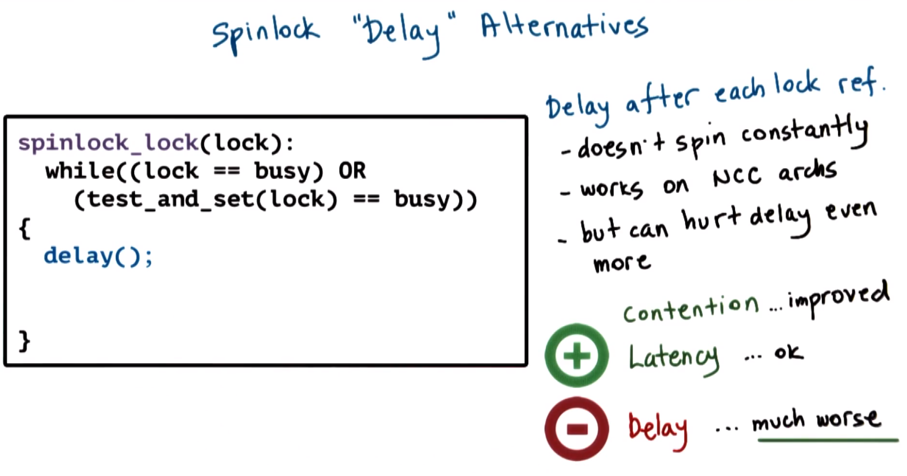
</center>

Another variant of the delay-based spinlock implementations is to introduce a delay after *each* memory reference operation for `lock`, as in the figure shown above. This is implemented by simply introducing the operation `delay()` in the body of the `while` loop prior to the next iteration.

 The main **benefit** of this approach is that it works in **non-cache-coherent (NCC)** architectures.
  * Because it is not necessary to spin constantly (i.e., due to the inclusion of `delay()` in every iteration of the loop), if there is no cache coherence and it is therefore necessary to go to main memory to fetch the reference for `lock`, then using the operation `delay()` will assist with reducing contention of the memory network.

The main **drawback** of this approach is that it will clearly adversely impact the delay much more, because the delay is compounded even when there is no contention on the network.

## 26. Selecting a Delay for a "Delay" Spinlock

<center>
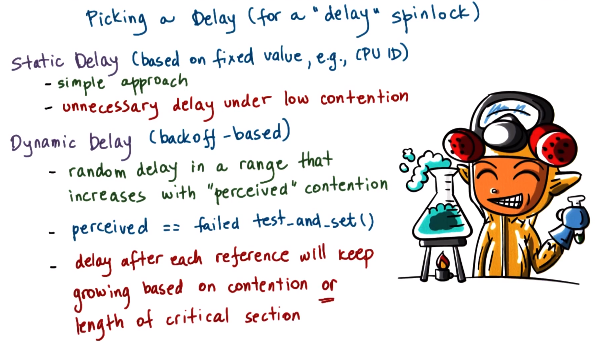
</center>

One key **consideration** for delay-based spinlock implementation is how to select a suitable value for the delay itself. There are two **basic strategies** available for this purpose:
  1. **static delay** - Uses a fixed value (e.g., CPU ID for the processor on which the process is running) to determine the delay to be used for any given *single* process running on that particular CPU.
      * The **benefit** of this approach is that it is ***simple***, and under high loads it is likely that such static delays will nicely "spread out" all of the atomic references, thereby reducing (or perhaps altogether eliminating) contention.
        * ***N.B.*** The delay must be some combination of the fixed information (e.g., CPU ID) and the length of the critical section in order to ensure that one process is delayed by an integer multiple of the critical section (thereby avoiding contention).
      * The **drawback** of this approach is that it creates unnecessary delay under low-contention conditions (e.g., even with only two processes, each process will *always* be waiting by at least an integer multiple of the critical section before proceeding with execution).
  2. **dynamic delay** - A more popular approach which avoids the issue posed by static delay (i.e., *always* delaying *all* processes) by assigning each process a ***random*** delay value based on the "perceived" ***current*** contention in the system. If the system is operating in a mode of low contention then a dynamic value will be selected within a smaller range, otherwise if there is high contention then the range is expanded accordingly, i.e., some processes will delay more (or "**back off**"), while others will delay less.
      * The **benefit** of this approach is that in general delays will be shortened on average for a given process under low-to-medium loads.
        * ***N.B.*** Under high load, theoretically both approaches converge to the same behavior (i.e., dynamic delay will approach the behavior of static delay).
      * A **key question** in this approach is: How to determine (i.e., "perceive") how much contention is currently in the system (i.e., high vs. low) in order to select an appropriate range of delays? For this purpose, a useful **metric** to estimate the contention is to track the number of **failed** `test_and_set()` operations: If a `test_and_set()` operation fails, then it is more likely that there is a high degree of contention.
      * The **drawback** of this approach is that if delaying after *every* single lock reference, then the delay will continually amplify based on *both* of the following:
        * whether there is indeed contention in the system,
        * *or* if the owner of the critical section is simply either delayed or executing a long critical section.
      * Therefore, this approach can potentially degenerate to the same undesirable behavior as before: If a process happens to be executing a long critical section while holding the spinlock, this does not necessarily mean it is necessary to increase the delay. Accordingly, it is necessary to guard against this situation when using this approach.

## 27-28. Queueing Lock

### 27. Queueing Lock Overview

<center>
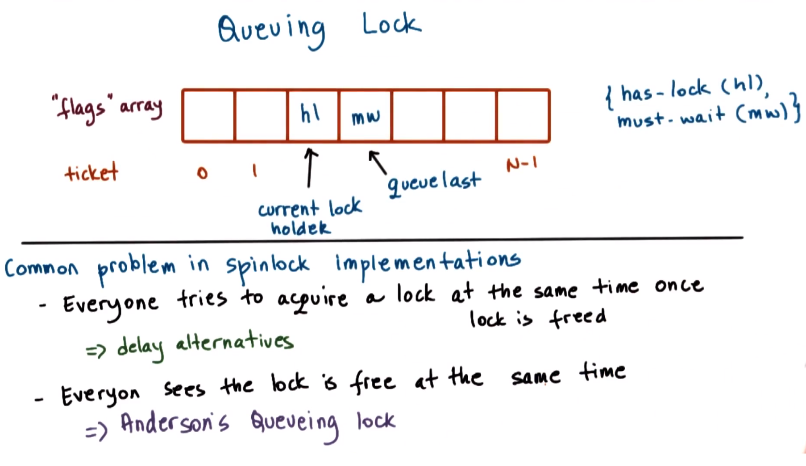
</center>

The alternative delay strategies described in the previous section solve the **problem** that every process/thread attempts to **acquire** the lock *simultaneously* once the lock is freed.

In Anderson's paper, the proposed implementation is called a **queueing lock** (also called the **Anderson lock**), which solves a complementary problem: Every process/thread **detects** *simultaneously* that the lock is free. Therefore, if this problem is solved (i.e., *not every* process/thread *detects* that the lock is free), then this equivalently solves the same problem as before (i.e., as a direct consequent of not *detecting* the lock is free simultaneously, accordingly the threads/processes also do not attempt to *acquire* the lock simultaneously either).

The **queueing lock** is as in the figure shown above.
  * The queuing lock consists of an **array** of **flags** of `N` elements (indexed `0` to `N-1`), where `N` is the number of processors in the system. 
  * Each element in the array contains one of two possible values: **`has_lock`** (**`hl`**) or **`must_wait`** (**`mw`**).
  * Additionally there are two **pointers** to the array elements:
    * the **current lock holder** (having value `has_lock`)
    * the last element on the queue, or **queue last** (having value `must_wait`)

<center>
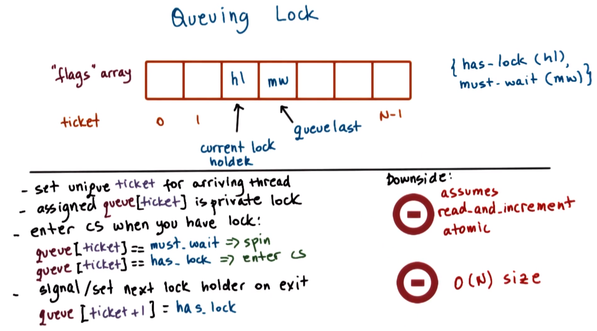
</center>

When a new thread arrives at the queueing lock, it receives a **unique ticket** indicating the thread's current position in the queueing lock. This is achieved by adding it to the position immediately after the now-former last element in the queue, with a corresponding increment to the queue last pointer to reflect this.

Since multiple threads may be arriving at the queueing lock simultaneously, it must be assured that the increment of the queue last pointer is performed atomically. Therefore, the queuing lock depends on hardware support for an atomic operation `read_and_increment()`; since this atomic operation is not as common as the aforementioned `test_and_set()`, the potential absence of `read_and_increment()` on a given hardware platform therefore constitutes a **drawback** to this implementation.

For each of the threads arriving at the queueing lock, the assigned elements of the array (i.e., the `queue[ticket]`) itself acts as a **private lock**, as follows:
  * A thread can enter the **critical section** (**CS**) when the lock is acquired:
    * If `queue[ticket] == must_wait` is true, then the thread must spin (as before with the previous spinlock implementations).
    * Otherwise if `queue[ticket] == has_lock` becomes true, then the lock is free and consequently the thread may proceed with entering the critical section.
  * When a thread completes the critical section and therefore must release the lock, it must **signal**/**set** the next thread in the array to indicate that it currently owns the lock.This can be accomplished by setting `queue[ticket + 1] = has_lock` accordingly.

An additional **drawback** to the queueing lock implementation is that the memory complexity is of size `O(N)` with respect to `N` processors (i.e., tracking `has_lock` vs. `must_wait` for *each* element/processor in the array), which is generally a much larger complexity than the other spinlock implementations (which only required *one* memory location to maintain information on the spinlock, i.e., whether it is `free` or `busy`).

### 28. Queueing Lock Implementation

<center>
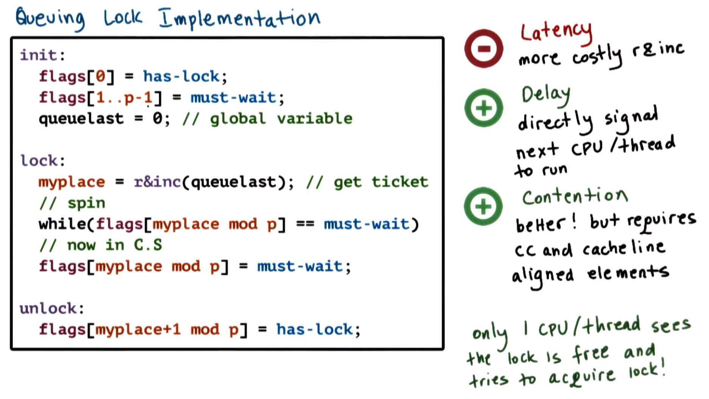
</center>

The queueing lock implementation is as follows:
```c
init:
  flags[0] = has_lock;
  flags[1..p-1] = must_wait;
  queue_last = 0; // global variable

lock:
  my_place = read_and_increment(queue_last); // get the ticket
  // spin
  while (flags[my_place mod p] == must_wait);
  // now in critical section
  flags[my_place mod p] = must_wait;

unlock:
  flags[my_place+1 mod p] = has_lock;
```

Regarding `init`:
  * The queueing lock is represented by the array `flags`, whose elements contains the values `has-lock` or `must_wait`.
  * Initially the first element of the array (`flags[0]`) is set to `has_lock`, and the remaining elements are set to `must_wait`.
  * Also part of the queueing lock structure is the global variable `queue_last`.

Regarding `lock`:
  * To obtain a ticket into the queueing lock, the process/thread must first perform the atomic operation `read_and_increment()`, which returns the current position in the array, as stored in `my_place`.
  * The process will continue to spin on the corresponding array element as long as its value is `must_wait` (i.e., as long as its predecessor element(s) is executing the critical section).
    * ***N.B.*** modular arithmetic is used (i.e., `my_place mod p`) to "wraparound" the array indices, since `read_and_increment()` continually increments `queue_last` but the array `flags` itself is of finite-length/bounded.
  * Once the owner of the lock completes execution of the critical section, it resets its element in the array to `must_wait` in order to prepare this field for the subsequent process that attempts to acquire the lock at this array position.

Regarding `unlock`:
  * Releasing the lock involves changing the value of the *next* element/process in the array (i.e., at index `my_place+1`) to `has_lock`. Consequently, the next process will exit from its current spin loop and proceed as previously described.
    * ***N.B.*** Modular arithmetic is used here as before per the bounded array.

Observe that the atomic operation `read_and_increment()` in this spinlock implementation involves performing this operation on `queue_last`, whereas the spinning itself occurs on a completely *different* variable (i.e., `my_place`). Consequently, when issuing the atomic operation `read_and_increment()`, any kind of invalidation traffic will not affect any of the spinning occurring among the elements of the array `flags` (i.e., `queue_last` and `my_place` are two ***distinct*** memory locations).

With respect to **latency**, this implementation is not very efficient, because it performs a more complex/costly atomic operation (i.e., `read_and_increment()`, which requires more cycles than the aforementioned `test_and_set()`), and additionally must perform modular arithmetic/shifting operations to determine the correct array index; furthermore, all of this must occur *before* it can be determined whether the processor/thread must spin or be in the critical section.

However, with respect to **delay**, this implementation is much better. When a lock is freed, the next-to-run processor/thread is **directly signaled** (i.e., by changing the value of its flag). Since the processors/threads spin on *different* memory locations, concurrent/simultaneous spinning can occur constantly, and the change in the value (i.e., `must_wait` to `has_lock`) is detected ***immediately***.

Furthermore, with respect to **contention**, this implementation is even better than any of the aforementioned alternatives described previously. Here, the atomic instruction is only executed *once* upfront and is subsequently *not* part of the spinning code. Additionally, the atomic instruction and the spinning are performed via different/distinct variables (i.e., `queue_last` and `my_place`, respectively), and therefore the invalidations that are triggered by the atomic instruction do *not* affect the processors' ability to spin on local caches.
  * However, a **caveat** is that in order to achieve this, it must be ensured that there is a **cache-coherent** architecture available in the first place; otherwise, the spinning would have to occur on potentially remote memory references (i.e., main memory rather than in local cache).
  * Furthermore, it must be ensured that every element is on a *separate* **cache line**; otherwise, when the value of any *one* element in the array is changed, the *entire* cache line will be consequently **invalidated**, thereby invalidating the caches of the other elements in the array (i.e., the other processors/threads that are spinning), which is undesirable.

To summarize, the key **benefits** of this spinlock implementation derive from the fact that it address the key problem that was identified with respect to the other aforementioned spinlock implementations: Only *one* CPU/thread at any given time detects that the lock is free and therefore only then attempts to acquire the lock. This is achieved by having a separate (essentially "private") lock within the array of lock.

## 29. Queueing Lock Array Quiz and Answers

Assume the use of Anderson's queueing spinlock implementation wherein each array element of the queue can have one of two values: `has_lock` (`0`) or `must_wait` (`1`). If a system has 32 CPUs available, then how large is the array data structure itself? (Select one choice.)
  * `32` bits
  * `32` bytes
  * neither
    * `CORRECT`
      * In order for the queueing lock implementation to work correctly, each array element must be in a *different* cache line. Therefore, the size of the array data structure itself depends on the size of the cache line (e.g., if a machine has a cache-line size of 64 bytes, then the size of the array data structure is `32 * 64 = 2048 bytes`).

## 30. Spinlock Performance Comparisons

<center>
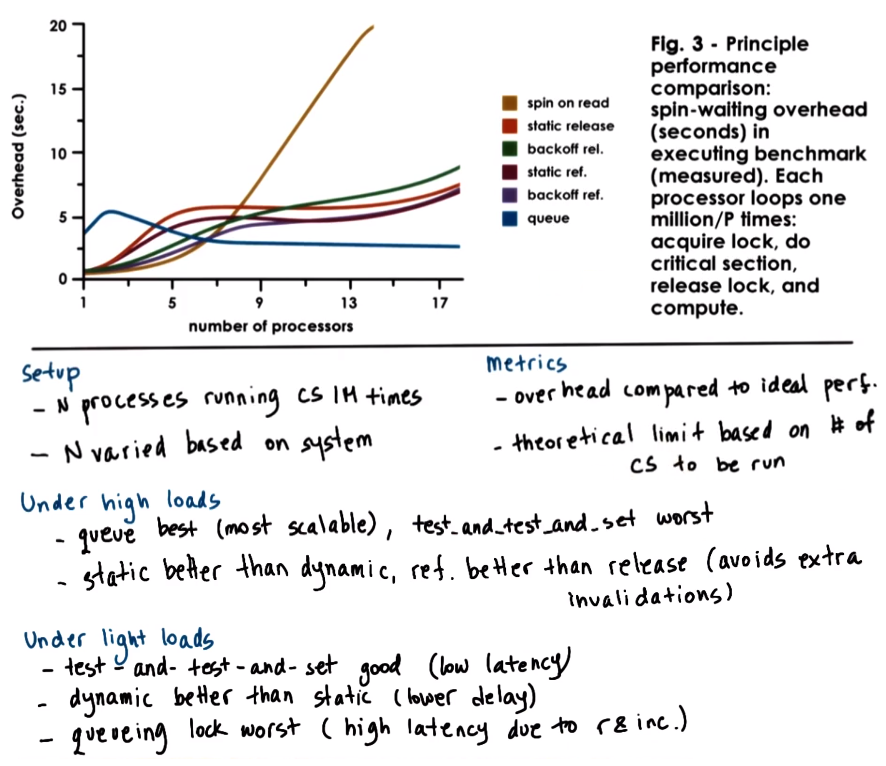
</center>

As final consideration, in closing of this lecture, consider one of the results from the performance measurements demonstrated in Anderson's paper (Figure 3), as per the figure shown above.

This figure shows measurements that were gathered from executing a program with multiple processes/processors, consisting of the following **setup**:
  * Each process executes a critical section (CS) in a loop for `10`<sup>`6`</sup> iterations.
  * The number of processes (i.e., `N`) was varied such that there is only one process per processor, running on the Sequent Computer Systems Symmetry (Model B) platform having 20 such processors (and therefore correspondingly `N` ranges from `1` to `20` in the experiments).
  * The platform is **cache-coherent** with **write-invalidate**.

The computed **metrics** based on the experiments is the relative **overhead** as measured compared to the case of the **ideal performance**, which was defined as the theoretical limit based on how long it takes to execute the fixed number of critical sections (`10`<sup>`6`</sup>).
  * The **rationale** for the ideal case is that if there is *no* contention (i.e., no such effects due to the fact that each of the critical sections must be locked and unlocked), then how long would it take to run this number of critical sections; accordingly, the measured ***difference*** between this theoretical limit and whatever time is measured for the actual performance of the experiment can be defined as the (relative) **overhead**, as in plotted curves in the figure shown above.

The experiments were performed for each one of the spinlock implementations discussed previously in this lecture.
  * The results do *not* include the basic atomic instruction `test_and_set()` (wherein there is simply continuous indefinite spinning on the atomic instruction), as the resulting curve would simply increase rapidly and quickly exceed the scale of the plot.
  * Furthermore, note that both delay alternatives (i.e., static and dynamic) were also tested.

The results of the experiments were as follows:
  * Under **high** loads (i.e., large `N`, with many processes contending for the lock):
    * The **queueing lock** implementation had the ***best*** performance. It is the most ***scalable***: As more processors are added, there is no appreciable increase on the overhead.
    * The `test_and_test_and_set()` implementation (denoted **spin on read** in the figure) had the ***worst*** performance. In this particular case, there is a cache-coherent architecture with write-invalidate, which on release of the atomic operation `test_and_test_and_set()` there is an order of `O(N`<sup>`2`</sup>`)` memory references (i.e., very high contention on the shared bus), which in turn greatly adversely impacted performance with respect to overhead.
    * Of the delay-based alternatives, the **static** implementations performed slightly better than the **dynamic** counterparts (denoted **backoff** in the figure). Under high loads, the static implementation more adequately balances out the atomic instructions compared to the dynamic implementation (which introduces some randomness resulting in additional collisions which are otherwise avoided by the static implementation).
      * Furthermore, with respect to the delay-based alternatives, note that delaying after every single memory reference (denoted `ref.` in the figure) is slightly better performing than delaying only after the lock is freed/released (denoted `release`/`rel.` in the figure), because avoiding delaying after every reference avoids some additional invalidations originating from the fact that the Sequent platform is a write-invalidate architecture.
  * Under **light** loads (i.e., small `N`, with few processors/processes):
    * The `test_and_test_and_set()` (or **spin-on-read**) implementation performs **very well** because this spinlock implementation has **low latency** (i.e., there is a simple check for `lock == busy` and then it proceeds to the atomic operation `test_and_set()`).
    * Among the delay-based alternatives, the **dynamic** (or **backoff**) implementations perform better than the **static** implementations because with the dynamic alternatives, there is a **low delay**. Recall that with the static implementations, they can lead to situations in which the two processors have the most extreme (i.e., shortest or longest) delays, and in cases where they contend for the lock, this results in wasted CPU cycles.
    * The **queueing lock** implementation has the **worst** performance due to **high latency** resulting from implementation of the atomic instruction `read_and_increment()` and of the required modular arithmetic operations (i.e., for queue array processing).

As a final comment, these results demonstrate that there is no *single* "good" answer to the matter of designing the "best" spinlock, but rather design decisions should be based on the expected workload (i.e., high vs. low), architectural features, number of processors, write-invalidate vs. write-update, etc. As before (cf. P2L5): "*it depends*"!

***N.B.*** The paper includes additional results that examine these tradeoffs in more detail.

## 31. Lesson Summary

This lecture discussed additional **synchronization constructs** beyond mutexes and condition variables (e.g., **semaphores**, **monitors**, and others), and described some of the **synchronization issues** that these constructs are well-suited for handling.

Additionally, the lecture examined the **spinlock** alternatives described in Anderson's paper, including how **hardware support** (in particular **atomic instructions**) is used when implementing constructs such as spinlocks.
