# P3L4: Synchronization Constructs

## 1. Preview

Up to this point in the course, **synchronization** has been mentioned multiple times while discussing other operating systems concepts. This lecture will now focus primarily on synchronization itself.

This lecture will discuss several **synchronization constructs**, as well as the **benefits** of using these constructs.

Furthermore, this lecture will discuss the **hardware-level support** that is necessary to implement these synchronization primitives.

In covering these concepts, this lecture will reference the paper "*The Performance of Spin Lock Alternatives for Shared-Memory Multiprocessors*" (1990) by Thomas E. Anderson, involving the efficient implementation of spinlock (synchronization) alternatives. This paper will give a deeper understanding of how synchronization constructs are implemented on top of the underlying hardware and why they exhibit certain performance strengths.

## 2. Visual Metaphor

<center>

</center>

Returning to the toy shop analogy, now consider synchronization and synchronization mechanisms in the context of this example/analogy. **Synchronization** in operating systems is like waiting for a toy shop co-worker to finish so that you can continue working.

| Characteristic | Waiting Toy Shop Worker | Synchronization |
| :---: | :---: | :---: |
| May repeatedly check if the working co-worker / co-process is done in order to continue working | The waiting co-worker asks: "*Are you done? Or still working?*" This can have a negative impact on the working co-worker by delaying their processing and annoying them. | Processes may repeatedly check whether it is allowable to continue using a synchronization construct called a **spinlock**, which is supported in operating systems.  |
| May wait for a signal from the working co-worker / co-process in order to continue | The working co-worker indicates to the waiting co-worker: "*Hey, I'm done!*" However, the waiting worker may not be ready at this particular time (e.g., left for lunch break), therefore it may take an elapsed time period for the waiting co-worker to return and proceed with processing the toy work order. | Processes can synchronize using **mutexes** and **condition variables**, as discussed previously (cf. P2L2). These constructs can be used to implement the behavior whereby a process waits for a **signal** from another process before it can continue working. |
| Waiting hurts performance | In both of the above cases, the workers waste some amount of productive time while waiting. | Regardless of how the process waits and which synchronization mechanism is used, such waiting will adversely impact performance (e.g., wasted CPU cycles when performing checking operations, as well as due to cache effects when signaling another process that is periodically blocked and subsequently returning and resuming execution).  |

## 3. More About Synchronization

<center>

</center>

There has already been a fair amount of discussion in this course regarding dealing with concurrency in multi-threaded programs. Specifically, **mutexes** and **condition variables** were described, both in generic terms via Birrell's model (cf. P2L2) and their specific APIs and usage in the context of PThreads (cf. P2L3).

So then, why bother to discuss even *more* about synchronization here?

<center>
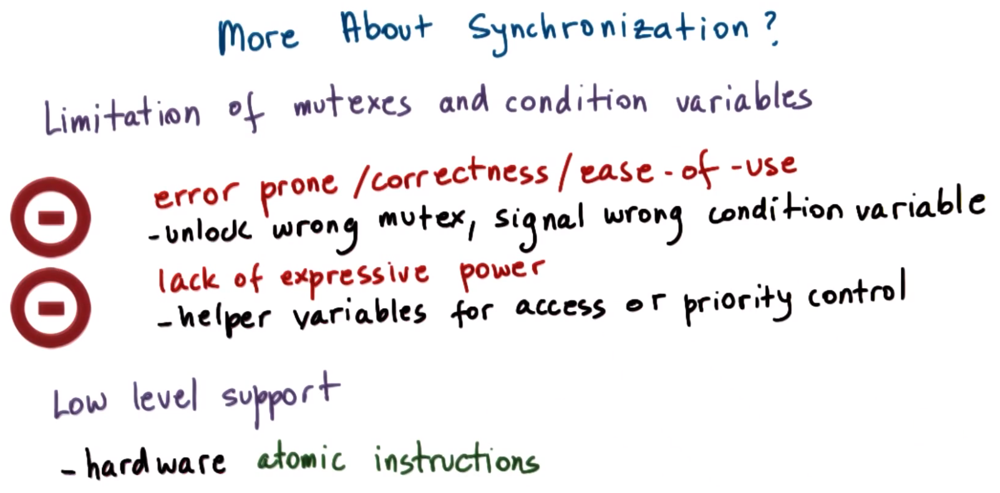
</center>

In the aforementioned discussion of mutexes and condition variables, it was indicated that these constructs have a number of common **pitfalls**, including:
  * Error-proneness, (in)correctness, and ease of use (e.g., forgetting to unlock the mutex, unlocking the wrong mutex, signaling the wrong condition variable, etc.).
    * These issues are an indication that the use of mutexes and condition variables is *not* an error-proof method, which means that such errors in turn may adversely affect the **correctness** of programs that use mutexes and condition variables, and in general will affect the ease of use of these two synchronization constructs.
  * Lack of expressive power.
    * It is necessary to introduce **helper variables** in order to express invariants (e.g., to control readers/writers access to a shared file) or to deal with priority control/restrictions (i.e., given that mutexes and condition variables do not inherently allow to specify anything regarding regarding **priority**).
    * Furthermore, this implies that these two synchronization constructs lack expressive power, inasmuch as they cannot be used to easily express arbitrarily complex **synchronization conditions**.

Furthermore, mutexes and condition variables (and any other software synchronization constructs, for that matter) require **low-level support** from the hardware in order to guarantee correctness of these synchronization constructs. Hardware provides this type of low-level support via **atomic instructions**.

Therefore, for the reasons enumerated above, it is sensible to spend more time discussing synchronization. Accordingly, this lecture will:
  * Examine a few other constructs (some of which eliminate some of these issues with mutexes and condition variables)
  * Discuss different types of uses for the underlying atomic instructions in order to achieve efficient implementations of certain synchronization constructs.

## 4. Spinlocks (Basic Synchronization Construct)

<center>
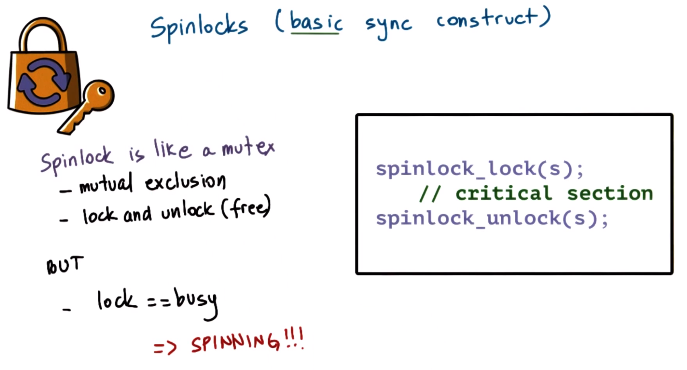
</center>

One of the most basic synchronization constructs that is commonly supported in an operating system is the **spinlock**.

In some ways, spinlocks are similar to mutexes, e.g.,:
  * The spinlock is used to protect the critical section to provide **mutual exclusion** among potentially multiple threads (or processes) attempting to perform the critical-section code.
  * The spinlock has certain **constructs** that are equivalent to the locking and unlocking constructs/operations of mutexes.
    * The corresponding use of these lock and unlock operations in spinlocks is similar to that of mutexes: If the lock is free then it can be acquired and consequently the critical section can be executed, otherwise if the lock is *not* free then the thread will be suspended at this particular point (i.e., `spinlock_lock(s)`) and unable to proceed.

However, a key **difference** between a spinlock and mutex is that when the lock is busy, the thread that is suspended in its execution (i.e., suspended at `spinlock_lock(s);`) is *not* blocked (i.e., as in the case of mutexes), but rather it is **spinning** (i.e., it is running on the CPU and repeatedly checking to see whether the lock has been freed, burning CPU cycles in this manner until the lock becomes free or until the thread becomes preempted for some reason [e.g., its timeslice has expired, a higher-priority thread has become runnable, etc.]). Conversely, with mutexes, the thread would have relinquished the CPU and allowed another thread to run.

Because of their relative simplicity, spinlocks are a **basic synhcronization primitive**, which in turn can be used to implement more-complex, more-sophisticated synchronization constructs. Therefore, because they are a basic construct, spinlocks will be revisited later in this lecture to discuss different **implementation strategies** for spinlocks.

## 5. Semaphores

<center>

</center>

The next synchronization construct to discuss is the **semaphore**. Semaphores are common synchronization constructs that have been part of operating system kernels for a while.

As a first approximation, a semaphore acts like a traffic signal, i.e., it either:
  * Allows threads to ***go***.
  * Or ***stops***/***blocks*** threads from proceeding any further.

Therefore, a semaphore is somewhat similar to what was discussed regarding a mutex (which either allows the thread to obtain the lock and proceed with the critical section, or the thread is blocked and must wait for the mutex to become free), however, a semaphore is ***more general*** than the behavior that can be achieved with a mutex.

<center>
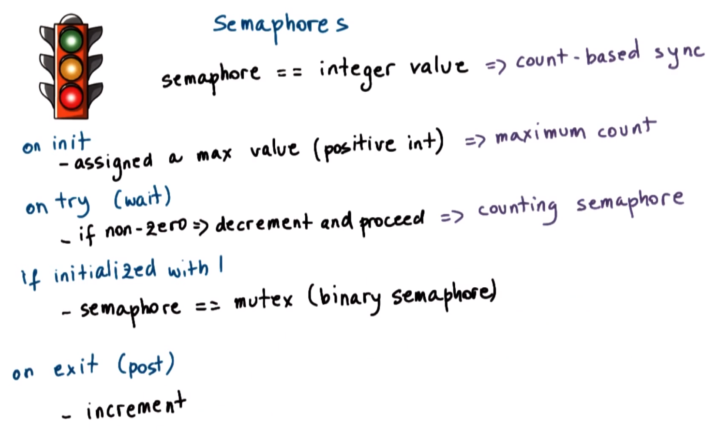
</center>

More formally, a semaphore is **represented** by a positive integer value.
  * On **initialization**, a semaphore is assigned some **maximum value** (a positive integer).
  * Threads arriving at the semaphore will **try** the semaphore.
    * If the value of the semaphore is ***non-zero***, then its value is ***decremented*** and the thread will **proceed**.
    * If the value is ***zero***, then the thread must **wait**.
    * Therefore, the number of threads that are allowed to proceed equals the maximum value that was used to initialize the semaphore.
  * On **exit**, threads leaving the critical section will **post** (i.e., signal) to the semaphore, causing the semaphore's counter to ***increment***.

Therefore, as a synchronization construct, one of the key **benefits** of a semaphore is that it allows to express **count-based synchronization requirements** (e.g., `5` producers may be able to produce at the same time, via initialization of the semaphore to the maximum value of `5`).

Furthermore, if a semaphore is initialized with the value `1`, then its behavior is equivalent to that of a mutex; such a semaphore is called a **binary semaphore**. Accordingly, for a binary semaphor, the **post** operation is equivalent to unlocking of a mutex.

<center>
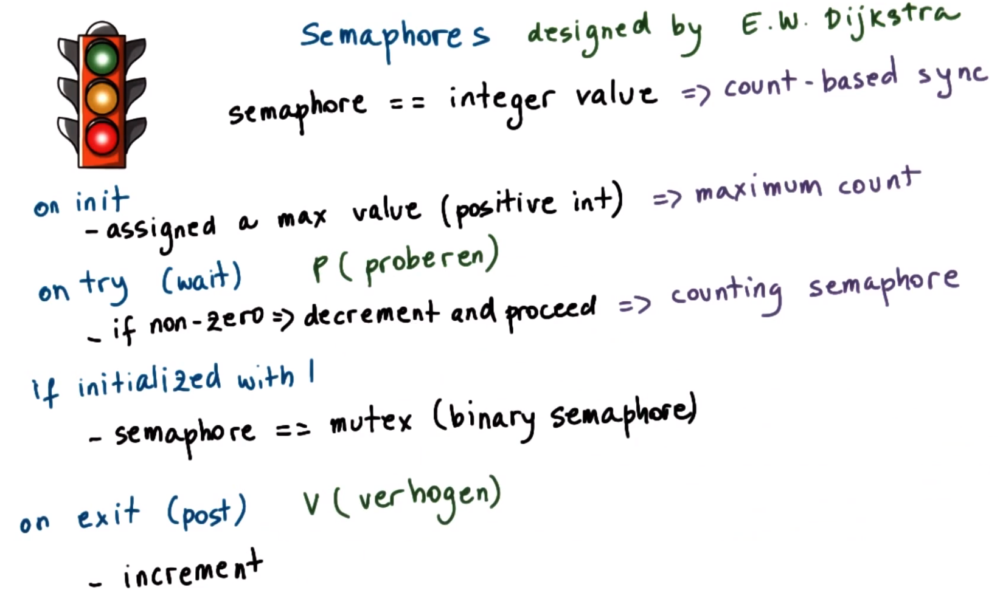
</center>

As a historic aside, semaphores were originally designed by **Edsger W. Dijkstra** (1930-2002), a Dutch computer scientist and Turing award recipient. In Dijkstra's original model, the semaphore operations wait and post were referred to as **P** (*proberen*, Dutch for "*to test out / to try*") and **V (verhogen)** (*verhogen*, Dutch for "*to increase*") (respectively). These operations (i.e., `P` and `V`) are still commonly retained in descriptions and literature regarding semaphores, based on Dijkstra's pioneering work in this area.

## 6. POSIX Semaphores

<center>
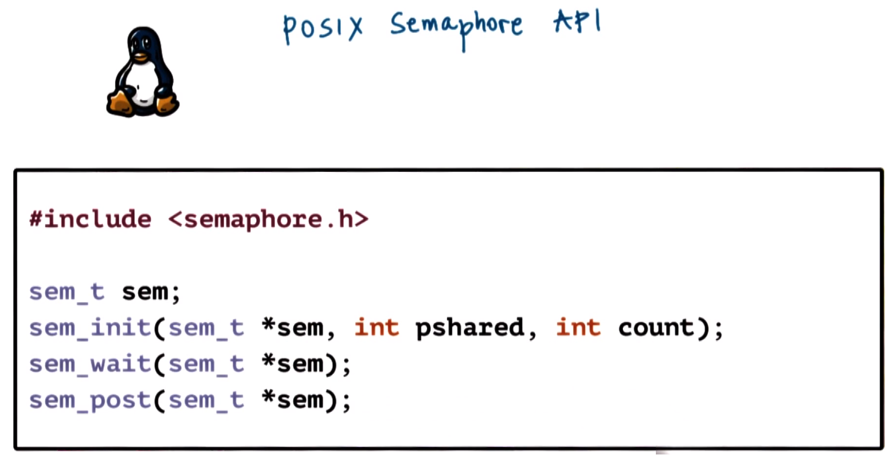
</center>

A brief list of some of the semaphore-related operations that are part of the POSIX API are as follows:
```c
#include <semaphore.h>

sem_t sem;
sem_init(sem_t *sem, int pshared, int count);
sem_wait(sem_t *sem);
sem_post(sem_t *sem);
```

The header `semaphore.h` defines the type `sem_t` for the semaphore.

`sem_init()` is used to initialize the semaphore (i.e., of type `sem_t`). Regarding the parameters:
  * `sem` is a pointer to the semaphore.
  * `count` is the initialization count.
  * `pshared` is a flag indicating whether the semaphore is shared by threads within a single process, or across processes.

The operations `sem_wait()` and `sem_post()` take as a parameter the semaphore variable that was previously initialized (e.g., `sem`).

## 7. Mutex via Semaphore Quiz and Answers

Complete the following code snippet (i.e., the initialization routine for the semaphore, `sem_init()`) so that the semaphore has behavior identical to a mutex used by threads within a process:

<center>
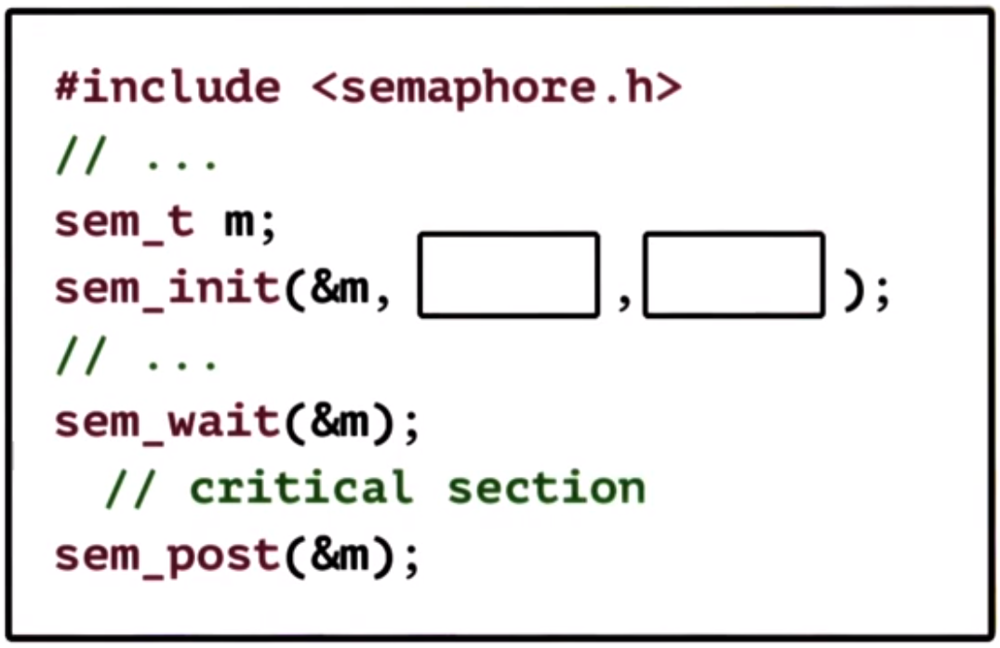
</center>

Answer:
```c
#include <semaphore.h>
// ...
sem_t m;
sem_init(&m, 0, 1); // answer
// ...
sem_wait(&m);
  // critical section
sem_post(&m);
```

***Explanation***:
  * The second argument (`0`) indicates that the semaphore is a *non*-process-sharing semaphore.
  * The third argument (`1`) for the counter makes this a binary semaphore, whose behavior resembles that of a mutex.
    * When the operation `sem_wait()` is reached, it will decrement this counter and consequently will allow exactly *one* thread at a time to enter the critical section.
    * Similarly, the operation `sem_post()` will increment the counter, which is the equivalent of a mutex being freed.

***Reference***: [`sem_init()` man page](https://linux.die.net/man/3/sem_init)

***N.B.*** Most operating systems textbooks include some examples on how to implement one synchronization construct with another (e.g., mutexes and/or condition variables via semaphores). Therefore, they can be referenced accordingly for this purpose.

## 8-9. Reader/Writer Locks

### 8. Introduction

<center>
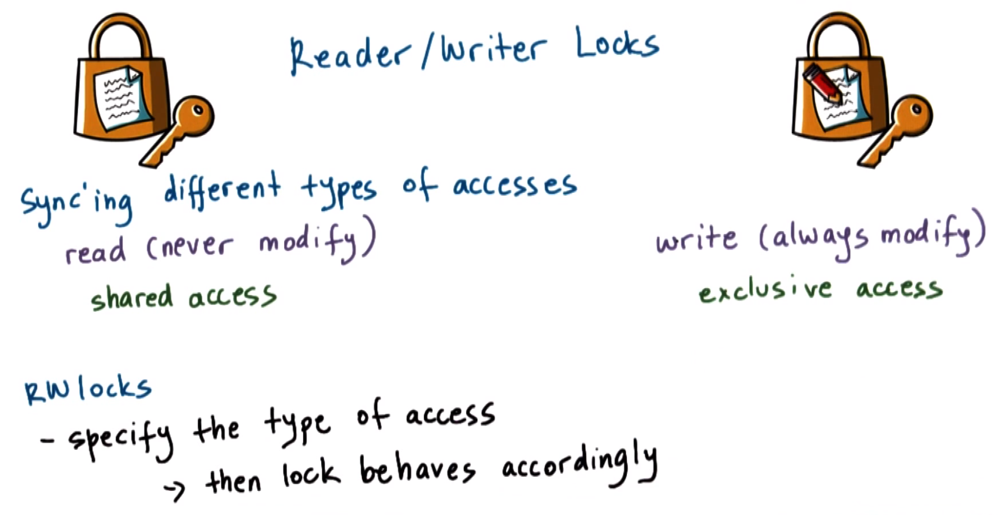
</center>

When specifying synchronization requirements, it is sometimes useful to distinguish among the different **types** of **accesses** that a **resource** can be accessed with.

For instance, it is commonly desirable to distinguish between those accesses that do *not* modify a shared resource (i.e, only **read**) vs. those accesses that *do* modify a shared resource (i.e., always **write**).
  * For **read** accesses, the resource can be ***shared*** concurrently.
  * For **write** accesses, this requires ***exclusive*** access of the resource.

Therefore, operating systems and language run-times support so-called **reader/writer locks**. Reader/writer locks can be defined similarly to a mutex, however, it is additionally necessary to specify the type of access (i.e., read vs. write) to be performed, and then the lock will behave accordingly.

### 9. Using Reader/Writer Locks

<center>
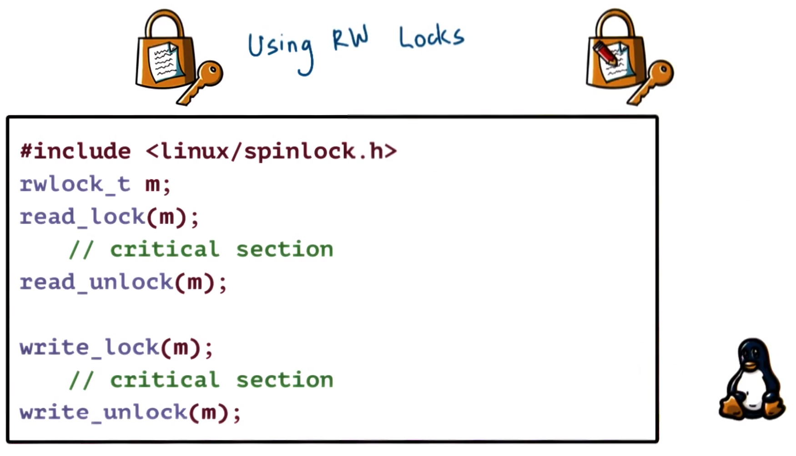
</center>

In Linux, a reader/write lock can be **defined** using the corresponding type `rwlock_t`, as provided by the header `linux/spinlock.h`.

To **access** a shared resource using this reader/write lock, use the appropriate interface provided by the operations `read_lock()` or `write_lock()`.

The reader/writer API also provides the corresponding unlock counterparts, `read_unlock()` and `write_unlock()` (respectively).

***N.B.*** A few other operations are supported on the reader/write lock type `rwlock_t`, however, the shown above are the primary ones. To explore more such operations, consult the [source code](https://elixir.bootlin.com/linux/latest/source/include/linux/rwlock.h) for the header file `linux/spinlock.h` accordingly.

<center>

</center>

Reader/writer locks are supported in many operating systems and language run-times (e.g., Windows (.NET), Java, POSIX, etc.). In some of these contexts, the reader/writer operations are referred to as "**shared/exclusive locks**."

However, certain aspects of the behavior of the reader/writer locks are **different** with respect to their **semantics**.
  * It may be sensible to permit a ***recursive*** `read_lock()` operation to be invoked, but then it can differ across implementations with respect to what exactly occurs when calling the complementary operation `read_unlock()`.
     * In some implementations, a single `read_lock()`/`read_unlock()` pair may unlock *every* single one of the `read_lock()` operations that have been recursively invoked from within the same thread.
     * In other implementations, a *separate* `read_unlock()` operation may be required for every single `read_lock()` operation.
  * With respect to the treatment of **priorities**...
    * Handling the **upgrade**/**downgrade** of a priority.
      * In some implementations, a reader (i.e., the owner of a shared lock) may be given a priority to **upgrade** the lock (e.g., conversion from a reader lock to a writer lock), as compared to a newly arriving request for a write/exclusive lock.
      * In other implementations, the owner of a reader lock first releases the lock and then subsequently attempts to re-acquire the lock with write-access permissions, contending with any other thread that is attempting to perform the same operation at that time.
    * Interaction between the **state** of the lock, the priority of the thread, and the **scheduling policy** in the overall system.
      * For instance, it can block a reader such that a thread that otherwise would have been allowed to proceed is blocked if there is already a writer having higher priority that is waiting on the lock. In this case, the writer is waiting because there are other threads that already have read access to the lock; therefore, if there is a **coupling** between the scheduling policy and the synchronization mechanisms, it is possible that a newly-arriving reader will be blocked (i.e., it will not be allowed to join the other readers in the critical section because the waiting writer has higher priority).

## 10. Monitors

<center>
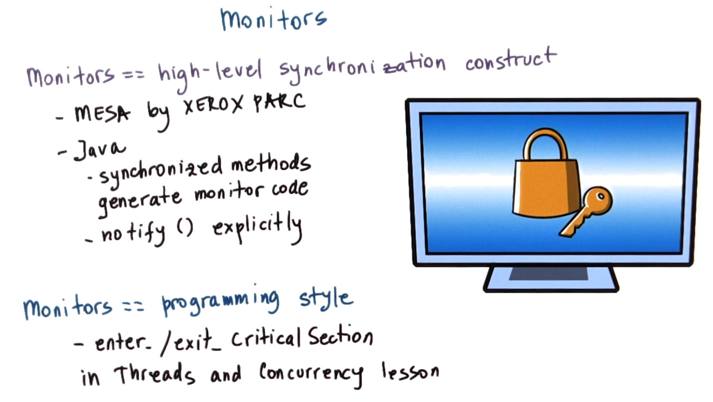
</center>

One of the **issues** with the synchronization constructs discussed thus far is that they require developers to pay attention to the use of the pair-wise operations `lock()`/`unlock()`, `wait()`, `signal()`, and others. Accordingly, this is one of the important **causes** of errors.

Conversely, **monitors** are higher-level synchronization constructs that assist with this issue. In an abstract manner, monitors explicitly specify...
  * What is the **shared resource** being protected.
  * What are all of the possible **entry procedures** to the shared resource (e.g., differentiating between readers and writers).
  * What are possible **condition variables** that potentially could be used to wake up different types of waiting threads.

When performing certain types of **access** with monitors...
  * On **entry** of the thread into the monitor (i.e., when the thread acquires the shared resource), all of the necessary locking and checking operations will occur when the thread is entering the monitor.
  * On **exit** of the thread from the monitor (i.e., when the thread is finished with the shared resource and consequently exits), all of the necessary unlocking, checking, and signaling (e.g., to the condition variable(s)) operations occurs *automatically*, and is therefore hidden from the programmer.

Due to these features, monitors are therefore referred to as a **high-level synchronization construct**.

***N.B.*** Historically, monitors were included in the MESA language run-time developed by XEROX PARC. Today, Java supports monitors as well. Every single object in Java has an **internal lock**, and methods that are declared to be **synchronized methods** are correspondingly entry points into the monitor. When compiled, the resulting code includes all of the appropriate locking and checking; the only ***caveat*** is that the `notify()` operation must be called explicitly.

***N.B.*** "Monitors" also refers to the **programming style** wherein mutexes and condition variables are used to describe the entry and exit codes from the critical section, as was described in the lecture on threads and concurrency with the corresponding "*enter critical section*" and "*exit critical section*" code regions (cf. P2L2).

## 11. More Synchronization Constructs

<center>
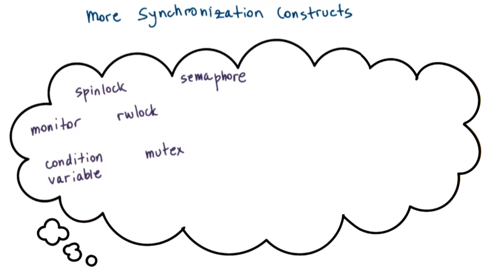
</center>

In addition to the multiple synchronization constructs encountered thus far, there are many other options available as well.

<center>
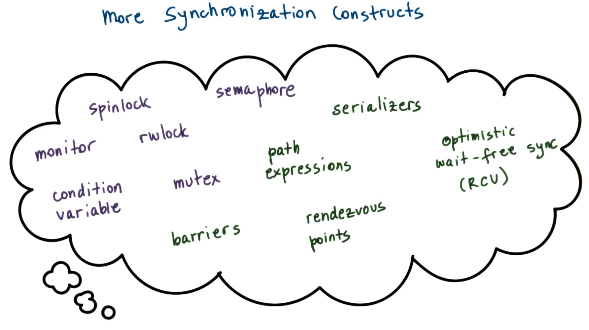
</center>

Some (e.g., **serializers**) make it easier to define **priorities** while also ***hiding*** the need for explicit signaling and the explicit use of condition variables from the programmer.

Others (e.g., **path expressions**) requires that the programmer specify the **regular expression** that captures the correct synchronization behavior.
  * As opposed to using locks or other constructs, the programmer would specify something like "*many reads or a single write*," and accordingly the run-time ensures that the operations that access the shared resource are interleaved in such a manner that satisfies the particular regular expression provided.

Another useful construct includes **barriers**, which behave as a "*reverse* of a semaphore" (i.e., if a semaphore allows `n` threads to proceed before it blows, then correspondingly a barrier blocks all threads until `n` threads arrive at this particular point protected by the barrier).

**Rendezvous points** is a synchronization construct that waits for *multiple* threads to meet at that particular point of the execution.

For ***scalability*** and ***efficiency***, there are efforts to achieve concurrency without explicitly locking and waiting; these approaches all fall under a category referred to as **optimistic wait-free synchronization**, which are "optimistic" in the sense that they "bet" on the fact that there will *not* be a conflict due to concurrent writes, and therefore it is safe to allow reads to proceed concurrently.
  * An example falling into this category is the so-called **read-copy update (RCU) log**, which is part of the Linux kernel.

<center>
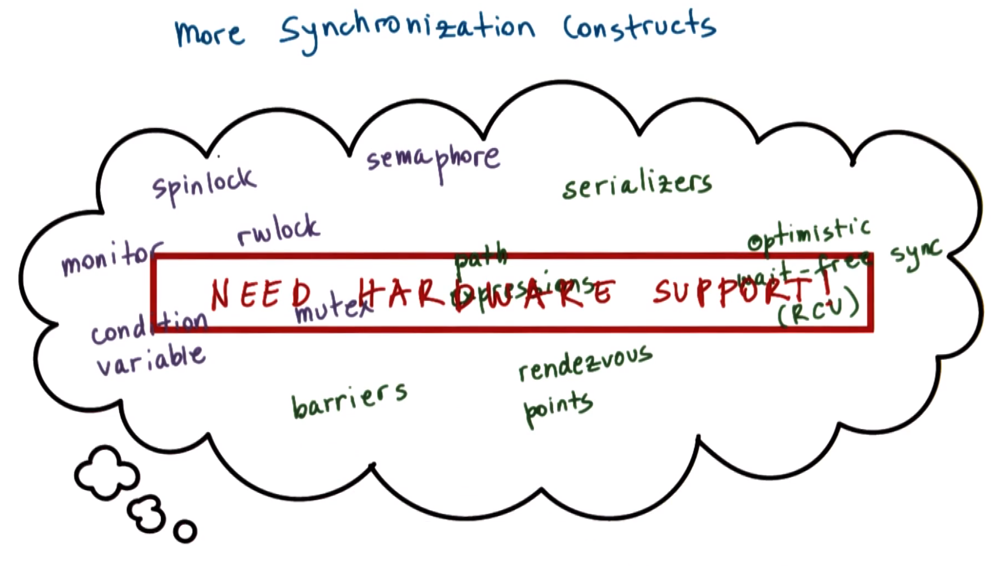
</center>

One **essential commonality** among all of these synchronization constructs is that at the lowest level, they *all* require some **support** from the underlying **hardware** in order to make **atomic updates** to the shared-memory region; this is the only manner in which they can actually ***guarantee*** that the **lock** is properly required, and that the **state change** is performed in a ***safe*** manner (e.g., without leading to race conditions, and such that all threads in the system are in agreement as to what exactly is the current state of the synchronization construct).

The remainder of this lesson will discuss how synchronization constructs can be built by directly using the hardware support that is available from the underlying platform, specifically focusing on **spinlocks** as the simplest such construct to provide a representative case study.

## 12. Synchronization Building Block: Spinlock

### Spinlocks Revisited

<center>
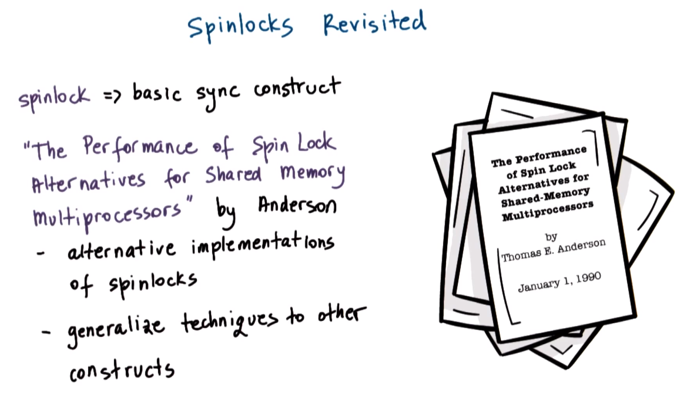
</center>

Recall from earlier in this lecture that **spinlocks** are the most basic synchronization construct/primitive, and that they are also used in creating some more-complex synchronization constructs. For this reason, it is sensible to focus the remainder of this lecture on understanding ***how*** exactly spinlocks can be **implemented**, and ***what*** types of opportunities are available for their **efficient imlementation**.

To address these matters, the lecture will follow the paper "*The Performance of Spin Lock Alternatives for Shared Memory Multiprocessors*" (1990) by Thomas E. Anderson, which discusses the following pertinent topics:
  * Alternative implementations of spinlocks
    * This is also relevant to other synchronization constructs, which use spinlocks internally.
  * Generalization of techniques using atomic instructions to other constructs used in other situations.

## 13. Spinlock Quiz 1 and Answers

<center>
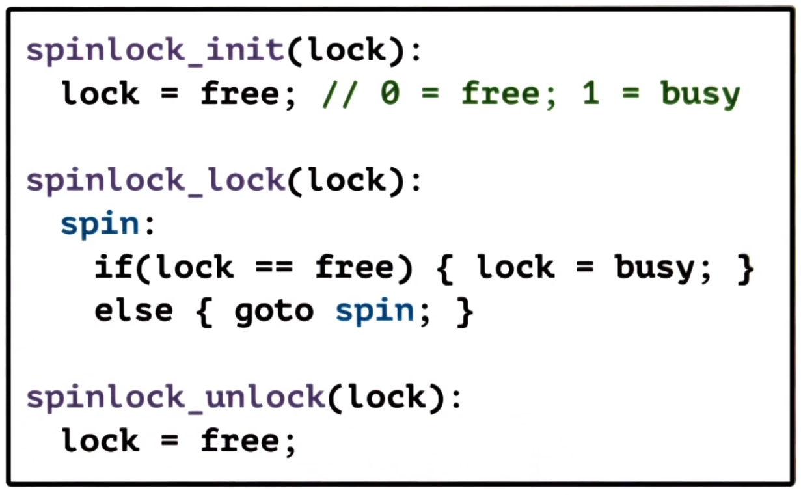
</center>

Consider the following pseudocode for a possible spinlock implementation:
```c
spinlock_init(lock):
  lock = free; // 0 = free, 1 = busy

spinlock_lock(lock):
  spin:
    if (lock == free) { lock = busy; }
    else { goto spin; }

spinlock_unlock(lock):
  lock = free;
```

The corresponding interaction with the **spinlock** `lock` is described as follows:
  1. `lock` must be initialized to `free` (i.e., `0`).
  2. To ***lock*** `lock`, check if `lock` is `free`...
    * If `lock` *is* `free`, then we can change its state (i.e., acquire `lock` and change its state to `busy`).
    * Otherwise if `lock` is *not* `free` (i.e, is `busy`), then we must keep ***spinning*** (i.e., perform the check designated by `spin: ...` repeatedly).
  3. Finally, we can release `lock` by setting it to `free`.

Based on this information, does this spinlock implementation correctly guarantee **mutual exclusion**? And if so, is it **efficient**? (Select one choice per category.)
  * Mutual exclusion:
    * Is guaranteed
    * Is not guaranteed
      * `CORRECT`
  * Efficiency:
    * Is efficient
    * Is not efficient
      * `CORRECT`

***Explanation***:
  * With respect to ***efficiency***, regarding the `goto` statement, as long as `lock` is not `free`, the cycle/check is repeatedly executed, which wastes CPU resources. Therefore, from an efficiency standpoint, this is *not* an efficient implementation.
  * Furthermore, with respect to ***correctness*** (i.e., ***mutual exclusion***), this implementation is also *incorrect*. In an environment where there are multiple threads (or multiple processes) executing concurrently, it is possible that more than one thread (or process) will simultaneously observe that `lock` is `free`, and therefore they will proceed to perform the operation `lock = busy;` at the same time; however, only *one* of these threads will successfully execute this operation, while the others will simply overwrite it and then proceed thinking that it has correctly acquired the lock. Consequently, *all* processes (or *all* threads) can end up in the critical section, leading to incorrect program behavior.

## 14. Spinlock Quiz 2 and Answers

<center>
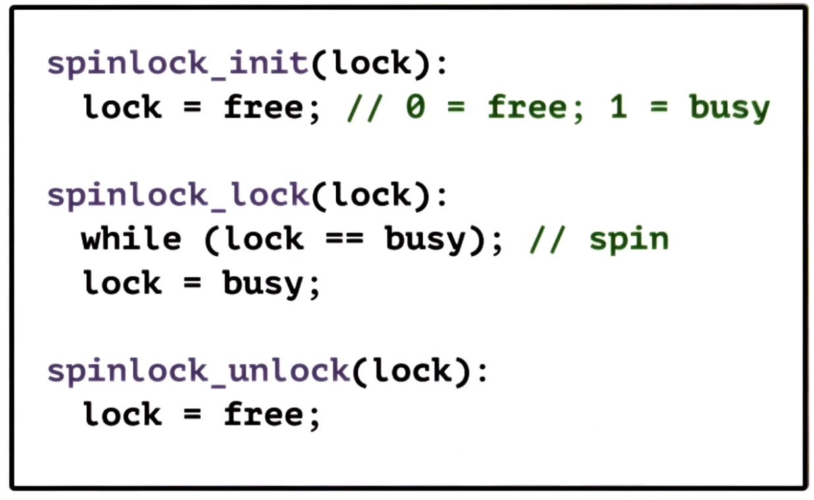
</center>

The following is a variation on the implementation from Quiz 1 which avoids the `goto` statement:
```c
spinlock_init(lock):
  lock = free; // 0 = free, 1 = busy

spinlock_lock(lock):
  while (lock == busy); // spin
  lock = busy;

spinlock_unlock(lock):
  lock = free;
```

The corresponding interaction with the **spinlock** `lock` is described as follows:
  1. `lock` must be initialized to `free` (i.e., `0`).
  2. As long as `lock` is `busy`, the thread continues to ***spin*** via the `while` loop.
      * At some point, when `lock` is set to `free`, the thread will exit from this `while` loop and will set `lock` to `busy` (i.e., to acquire `lock`).
  3. Finally, we can release `lock` by setting it to `free`.

Based on this information, does this spinlock implementation correctly guarantee **mutual exclusion**? And if so, is it **efficient**? (Select one choice per category.)
  * Mutual exclusion:
    * Is guaranteed
    * Is not guaranteed
      * `CORRECT`
  * Efficiency:
    * Is efficient
    * Is not efficient
      * `CORRECT`

***Explanation***:
  * With respect to ***efficiency***, since there is continuous looping/spinning (via the `while` loop) as long as `lock` is `busy`, this implementation is *inefficient*.
  * Furthermore, with respect to ***correctness*** (i.e., ***mutual exclusion***), this implementation is also *incorrect*. Even though the `while` check has been added, as before, multiple threads (or processes) will observe that `lock` is `free` once it becomes `free` (i.e., exits the `while` loop), and consequently these threads (or processes) will attempt to set `lock` to `busy`; if the threads (or processes) are allowed to execute concurrently, there is no way to guarantee purely via the software that there will not be some interleaving of exactly how these threads (or processes) perform these checking and setting operations, and that a race condition will not occur here. Therefore, in general the program will behave incorrectly.

In summary, while multiple purely-software-based implementations of a spinlock may be devised, ultimately they all result in the same **conclusion**: Some type of **hardware support** is strictly necessary to ensure that these checking and setting operations on the spinlock occur **atomically** via the **hardware support**, as discussed next.

## 15. Need for Hardware Support

<center>
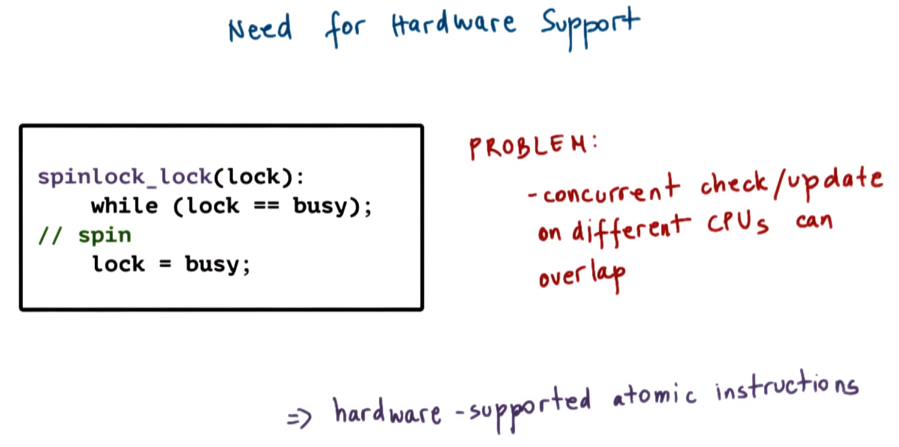
</center>

Returning to the operation `spinlock_lock()` from the previous section (Quiz 2), it is necessary to check and to set the value of `lock` **atomically** (i.e., indivisibly) so that it can be guaranteed that only *one* thread (or process) at a time can successfully `lock`.

The **problem** with the implementation in the figure shown above is that it takes multiple cycles to perform these checking and setting operations, and therefore during these multiple cycles threads (or processes) can be interleaved in arbitrary ways. Furthermore, if the threads (or processes) are running on multiple processors, their execution can completely overlap temporally.

Therefore, to achieve the desired behavior, it is necessary to rely on **hardware-supported atomic instructions**.

## 16. Atomic Instructions

<center>
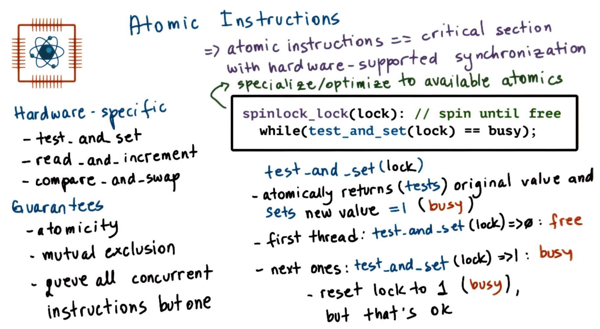
</center>

Each type of hardware or hardware architecture supports a number of **atomic instructions**, which are typically ***hardware-specific*** (i.e., different instructions may be supported on different hardware platforms, and correspondingly not every platform must support every single instruction). Examples include:
  * `test_and_set()`
  * `read_and_increment()`
  * `compare_and_swap()`

As the names of these example suggest, each such atomic performs some **multi-step, multi-cycle operation**. However, because they are ***atomic*** instructions, the hardware provides the following **guarantees**:
  * **atomicity** - The operation occur as full, discrete events (i.e., not partially/incompletely).
  * **mutual exclusion** - The operation occurs such that only *one* instruction is permitted to perform the operation at a time.
  * **queueing** - All concurrently instructions are queued *except for one*, with the others waiting pending their own turn.

Therefore, atomic instructions specify an **operation** which effectively constitutes the **critical section**, which in turn is assisted by **hardware-supported synchronization mechanisms** for that operation.

<center>

</center>

Returning to the previous spinlock example, using the first atomic operation `test_and_set()`, the spinlock implementation can be modified as in the figure shown above. Here, `test_and_set(lock)` ***automatically*** returns (i.e., ***tests***) the original value and ***sets*** the new value to `1` (i.e., `busy`).

Furthermore, when there are multiple threads contending for `lock` (i.e., via their respective attempts to perform the operation `spinlock_lock()`), only *one* must successfully ***acquire*** the lock.
  * For the very first thread that arrives and executes the operation `test_and_set()`, this operation will return the value `0` (i.e., `free`), because the original value of `lock` is `0` post-initialization. Therefore, this thread exits the `while` loop, and consequently this thread is the *only* thread that acquires `lock` and then proceeds with execution.
  * Conversely, all of the remaining threads that attempt the operation `test_and_set()` receive the return value of `1` (i.e., `busy`), because the first thread has already set `lock` to `1`. Therefore, these remaining threads continue to ***spin*** in the `while` loop.
    * Note that during this time, these threads repeatedly set the value of `lock` to `1` (i.e., via the `while` loop), however, this is *not* problematic. Since the first thread has already set `lock` to `1` when it acquired it, consequently these other threads are effectively unchanging since `lock` is indeed locked already.

Which specific atomic instructions are available on a given hardware platform varies from hardware to hardware.
  * Some operations (e.g., `test_and_set()`) are fairly prevalent, while others (e.g., `read_and_increment()`) may not be available on all platforms.
  * In fact, there may even be multiple variations/versions of this (e.g., in some cases, there may be an available atomic operation that atomically increments but does not necessarily return the old value; in other cases, there may be atomic operations that support `read_and_decrement()` as opposed to `read_and_increment()`; etc.).

Additionally, there may be differences in **efficiencies** with which different atomic operations execute on different architectures.

For these reasons, software such as **synchronization constructs** that are built using certain atomic instructions must be **ported** across hardware platforms accordingly (i.e., the implementation must use only those atomic instructions which are available on the target hardware platform). Furthermore, it must be ensured that the implementation of such software is **optimized** such that it uses the most efficient atomic operations on the target platform, and to use them in an efficient manner in the first place.

Anderson's paper presents several alternatives for implementing spinlocks using the atomic instructions provided by the available hardware, which will be discussed in the remainder of this lecture.

## 17. Shared-Memory Multi-Processors

Before discussing the alternative spinlock implementations presented in Anderson's paper, consider a refresher on multi-processor systems and their cache-coherence mechanisms; this is necessary in order to understand the design trade-offs and the performance trends discussed in the paper.

### Introduction

<center>
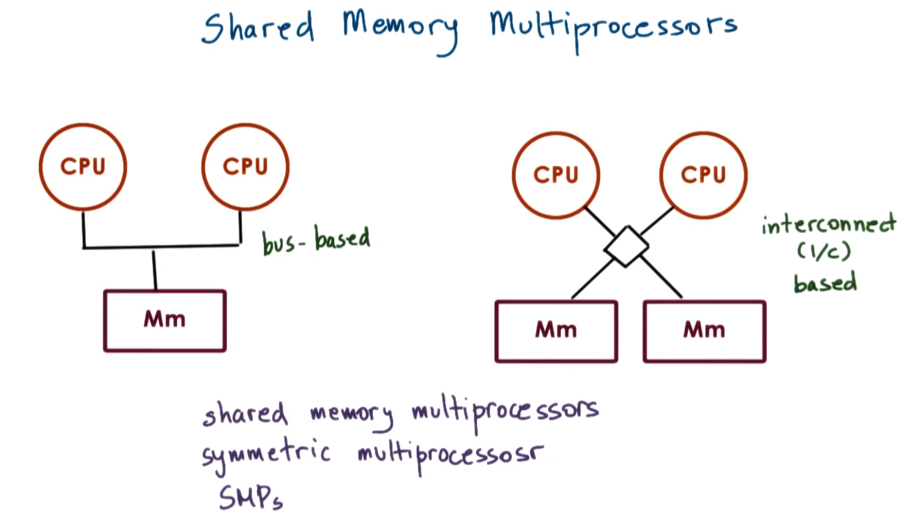
</center>

A **multi-processor system** consists of multiple CPUs (i.e., more than one) and memory that is mutually accessible by all of the CPUs. The **shared memory** can be either a *single* (physical) memory component that is equidistant from all of the CPUs, or there can be multiple memory components.

Regardless of the number of (physical) memory components, they are somehow **interconnected** to the CPUs, e.g.,:
  * Via an **interconnect-based (i/c-based)** connection (the most common configuration in modern systems).
  * Via a **bus-based** connection (which was more common in the past).

***N.B.*** In the figure shown above, the bus-based connection shows a single memory module, however, the bus-based configuration can be used with multiple memory modules, and similarly an interconnect-based connection can be used with a single memory module.

A key **difference** between the bus-based and interconnect-based connections is that in interconnect-based connections, there can be *multiple* memory references in flight (i.e., where one memory reference is applied to one memory module, and another memory reference is applied to another memory module), whereas in a bus-based connection only *one* shared-memory reference can be in flight at a given time (i.e., regardless of whether the memory reference is addressing a single memory module or if it is spread out across multiple memory modules, and therefore in a bus-based connection, the **bus** is shared across all of the memory modules).

Because of this **property** whereby the memory is accessible to *all* of the CPUs, these systems are called **Shared Memory Multi-Processors**. Other terms used to refer to shared-memory multi-processors include **symmetric multi-processors** and **SMPs**.

### Shared Memory Multi-Processors and Caches

<center>
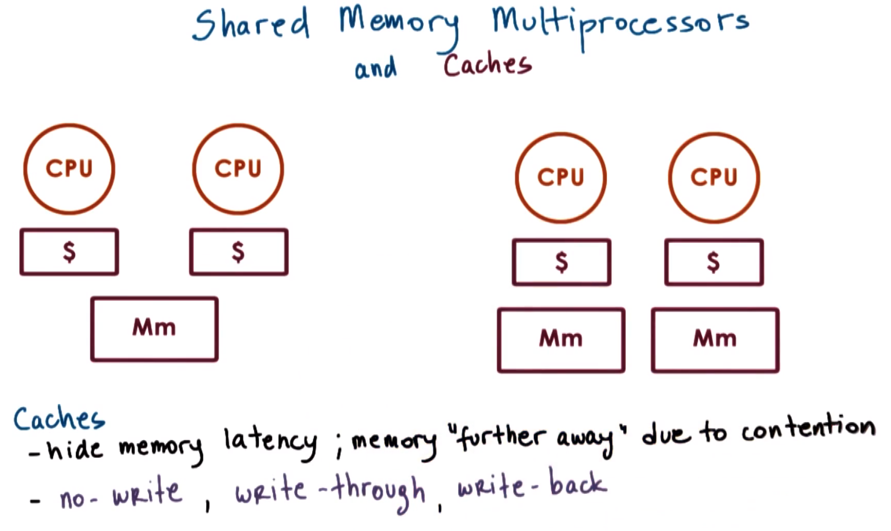
</center>

Additionally, each CPU in such a shared-memory multi-processor system can have a **cache**. Access to the cache data is much faster, therefore caches are useful for hiding memory latency.

Furthermore, the issue of memory latency is amplified in shared-memory systems inasmuch as there is **contention** for the shared-memory module. Due to this contention, certain memory references must be delayed, which adds even more to the memory latency, i.e., it is as if the memory were (temporally) "further away" from the CPU due to this contention effect.

Therefore, when data is present in the cache, the CPU reads the data from the cache (i.e., rather than from memory), which in turn has a positive impact on performance.

When CPUs perform a **write** operation, several things can happen:
  * **no-write** - A CPU write operation to the cache may not be permissible in the first place, and therefore will be rerouted directly to memory, and any cached copy of that particular memory location will be **invalidated**.
  * **write-through** - A CPU write operation may be applied to *both* the cached location *and* directly to the memory.
  * **write-back** - On some architectures, the CPU write operation can be applied to the cache, but then the actual update to the appropriate memory location can be *delayed* (i.e., applied later). For example, when a particular cache line is evicted.

## 18. Cache Coherence

<center>
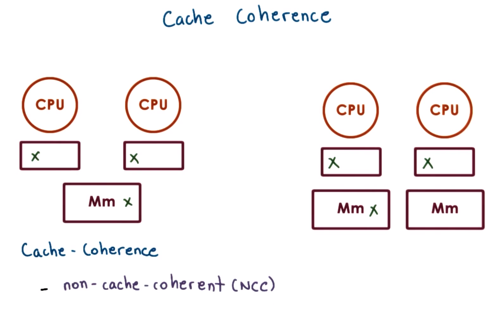
</center>

One **challenge** to consider is: What happens when multiple CPUs reference the *same* data (e.g., `x`, as in the figure shown above)?
  * The data appears in multiple caches.
  * Furthermore, with multiple memory modules, the data is present in *one* of the memory modules, but is referenced by *both* CPUs (and correspondingly is also referenced in their respective caches).

In some architectures, this issue must be resolved purely with software; otherwise, the caches will be **non-coherent**.

<center>
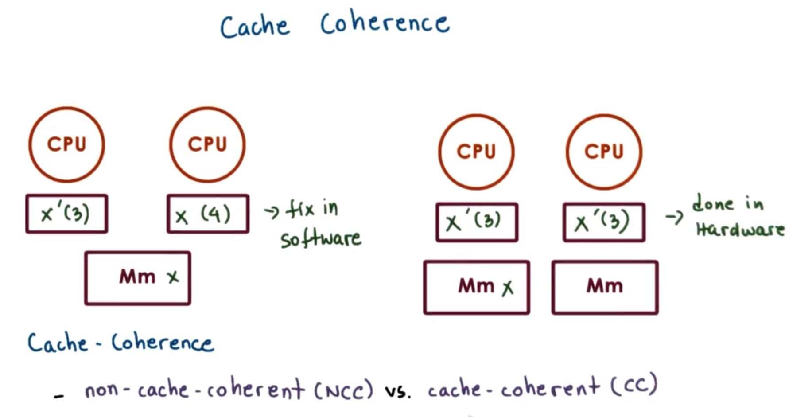
</center>

For instance, if one CPU makes an update (e.g., `x` is updated to `3`), then the hardware does nothing to account for the fact that the value of the data in the cache of the other CPU is different (e.g., `x` is `4` in the other CPU); rather, this discrepancy must be handled by the software. Such architectures/platforms are called **non-cache-coherent (NCC)**.

Conversely, on other platforms, the hardware itself handles all of the necessary steps to ensure that the CPUs' caches are coherent (i.e., contain the same data, even after one CPU makes an update to the data). Accordingly, these architectures/platforms are called **cache-coherent (CC)**.

<center>
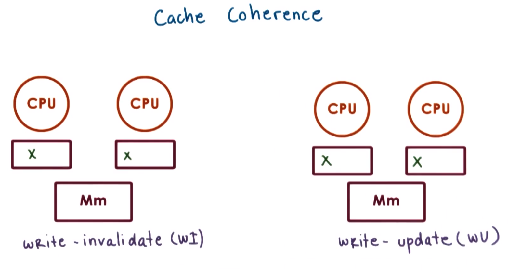
</center>

The basic **mechanisms** that are used in cache coherence are called **write-invalidate (WI)** and **write-update (WU)**. Consider what happens with each of these mechanisms when a certain value is present in all of the caches (e.g., `x` in the figure shown above).

<center>
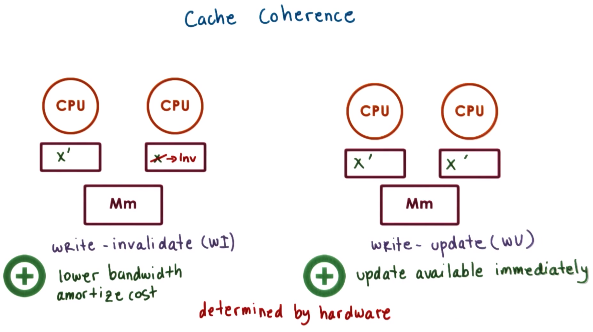
</center>

In the **write-invalidate (WI)** case, if one CPU changes the data value, then the hardware ensures that if any other cache contains that same data-value reference then that reference will be **invalidated**. Subsequent accesses to this invalidated reference(s) via the other CPU(s) result in a **cache miss**, and will consequently push the reference over to memory (in which case the reference is updated via another method, e.g., `write-through` or `write-back`).

In the **write-update (WU) case**, once a CPU changes the data value, then the hardware ensures that if any other cache contains that data-value reference is correspondingly **updated** as well. Subsequent accesses to this reference(s) via the other CPU(s) result in a **cache hit**, thereby returning the correctly updated reference.

The **trade-offs** with these approaches are as follows:
  * With **write-invalidate (WI)**, the key **benefit** is that there is a lower bandwidth requirement imposed on the system's shared interconnect.
    * Since it is not necessary to send the *full value* `x`, but rather just its *address* in order to be invalidated in the other caches.
    * Furthermore, once the cache line is invalidated, future notifications to the same (originally changed reference's) location will not result in subsequent invalidations on the other caches. Therefore, since the data is no longer required on any of the other CPUs in the immediate future, it is possible to **amortize** the cost of the "coherence traffic" over multiple reference-value changes (e.g., `x` can change to `x'` multiple times on the first CPU before it is needed on another CPU, but `x` is only invalidated *once* ).
  * With **write-update (WU)** architectures, the key **benefit** is that the data is available on the other CPUs that must access it immediately upon update; there is no additional cost incurred (e.g., another memory access) in order to retrieve the latest data value.

However, with respect to "selecting" between these approaches, there is a **caveat**/**drawback**: As a programmer, there is effectively *no* choice whether to use write-invalidate (WI) vs. write-update (WU), but rather this will be strictly ***determined by the hardware*** (i.e., this is a property of the hardware architecture and its correspondingly implemented policy).

## 19. Cache Coherence and Atomics
