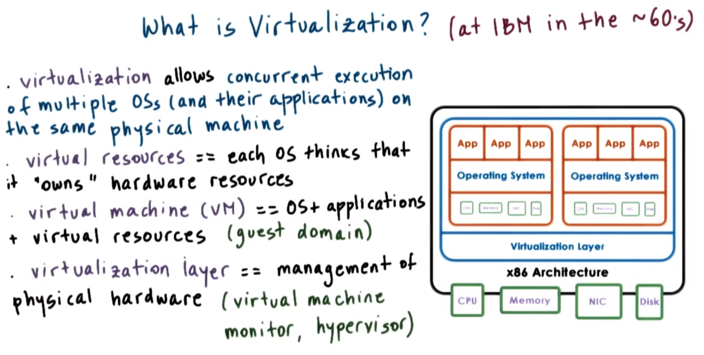
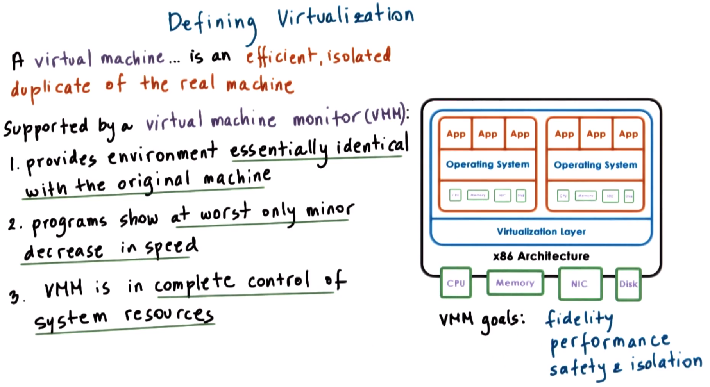

# P3L6: Virtualization

## 1. Preview

TODO

Reference: Rosenblum and Garfinkel "*Virtual Machine Monitors: Current Technologies and Future Trends*" (2005).

## 2. What Is Virtualization?

TODO

## 3. Defining Virtualization

TODO

Reference: Popek and Goldberg "*Formal Requirements for Virtualizable Third Generation Architectures*" (1974)

## 4. Virtualization Technologies Quiz and Answers

TODO

