# P4L1: Remote Procedure Calls

## 1. Preview

The previous lectures have discussed several mechanisms for inter-process communication (IPC). It was indicated then that these are fairly low-level mechanisms inasmuch as they focus on providing the basic capability for moving data among address spaces, but otherwise do not specify anything about the semantics of those operations or the protocols involved.

This lecture discusses **remote procedure calls (RPCs)**, an inter-process communication mechanism which specifies that processes interact via **procedure call interface**.

For the general discussion of remote procedure calls, this lecture will roughly follow the paper "*Implementing Remote Procedure Calls*" (1984) by Birrell and Nelson. This is an older paper, however, it very nicely discusses the general design space of remote procedure calls.

Later, the lecture will discuss SunRPC, a concrete implementation of an RPC system that is common in modern operating systems.

## 2. Why RPC?

<center>

</center>

To understand why RPC is necessary, consider two example applications, as in the figure shown above.

In the first application, a client requests a file from a server using a simple HTTP-like protocol called **GetFile** (cf. CS 6200 Project 1). In this application, the client and the server interact via a socket-based API, requiring the developer to:
  * Explicitly create and initialize the sockets.
  * Allocate and populate buffers for sending via the sockets.
  * Include protocol information (e.g., GetFile directive/header, buffer size, etc.).
  * Explicitly copy data (e.g., filename, file, etc.) into/out of the buffers.

In the second application, which is another client-server application, the client interacts with the server to upload some images, and then requests to the server for these images to be modified (e.g., to create a grayscale version of an image, to create a low-resolution version of an image, to apply some phase-detection algorithm, etc.). Therefore, while this application is similar to the first, there are some additional functionalities (i.e., processing) to be performed for every image. Correspondingly, the developer must perform similar steps (in some case identically) to the first application, with some notable differences:
  * Protocol-related information to be included in the buffers must specify information such as the algorithm (e.g., grayscaling, face detection, etc.) requested by the client to be performed by the server, as well as any relevant parameters.
  * The data sent between the client and the server is image data, which is both sent from the client to the server for processing, as well as received back by the client in post-processed form.

Observe that many of the ***steps*** are identical between the two applications. In the 1980s, as the speed of networks improved and as increasingly more distributed applications were being developed, it became obvious that these kinds of steps are quite ***common*** in related inter-process communications, requiring tedious re-implementation for a majority of these kinds of applications. Consequently, it became apparent that some system solution was necessary to simplify this process, i.e., capturing the common steps related to *remote* inter-process communication; accordingly, this gave rise to **remote procedure calls (RPCs)**.

## 3. Benefits of RPC

<center>

</center>

Remote procedure calls (RPCs) are intended to simplify the develop of cross-address space and/or cross-machine interactions.

Therefore, the **benefits** of remote procedure calls (RPCs) are as follows:
  * Remote procedure calls (RPCs) provide a higher-level interface for data movement and communication (e.g., communication establishment, requests, responses, acknowledgements, etc.).
  * Remote procedure calls (RPCs) permit for capturing a lot of error-handling and automating it, relieving the programmer's responsibility to otherwise manage this (i.e., via explicit implementation of error-handling facilities for *all* types of errors).
  * Remote procedure calls (RPCs) hide the complexities of cross-machine interactions from the programmer (e.g., machines of different types, failure of the connecting network, failure of either machine, etc.).

## 4. RPC Requirements

<center>

</center>

Consider the **requirements** for the systems software that provides support for remote procedure calls (RPCs), as shown above.
  1. The model of inter-process interactions that the RPC model is intended for must manage **client-server interactions**, whereby the server supports some potentially complex service (e.g., a complex computation which it executes quickly, a file service that serves remote content, etc.) that is otherwise not present in the client (i.e., either is not needed to be present on the client or is beyond the client's capabilities).
  2. When RPCs were first developed, the state-of-the-art programming languages were of the procedural-programming paradigm (e.g., Basic, Pascal, Fortran, and C). Therefore, since these were most familiar to programmers when RPC was developed, a corresponding goal of RPC systems was to simplify the development of distributed applications via a **procedure call interface** (and hence the namesake, i.e., remote *procedure calls*).
      * Consequently, RPCs are intended to have corresponding ***synchronous*** call semantics, i.e., when a process makes an RPC (e.g., to a server), the calling process/thread (e.g., client) will ***block*** and then ***wait*** until the called RPC completes and returns its result. This is analogous to what occurs when a procedure is called in a *single* address space: The execution of the thread reaches the point where the procedure call is made, and then execution switches to somewhere in the address space where the procedure is implemented, and the originally executing thread does not advance beyond the original procedure-call point until the result from the procedure call is returned, at which point the calling thread can proceed with its execution.
  3. Similarly to regular procedure calls, RPCs also provide **type checking**.
      * Passing an argument of the wrong type produces an error, which in turn can be caught with appropriate error handling.
      * The implementation of the RPC run-time can be optimized, e.g., when packets are being sent among the two machines, the corresponding information is transmitted as a stream of bytes from one point to the other, therefore, conferring some notion of types on the data contained in those bytes can be useful when the RPC run-time attempts to interpret these bytes (e.g., integers, files, etc.).
  4. Since the client and the server may run on *different* machines, there may be differences in how they represent certain data types, i.e., there may be necessary **cross-machine conversion**.
      * For example, there may be differences in big- vs. little-endian representations of integers, in representations of floating-point numbers, in representations for negative numbers, etc.
      * Correspondingly, the RPC system should *hide* all of these differences from the programmer, and ensure that the data is otherwise correctly transported with appropriate conversions/translations performed as necessary. One way to manage this conversion is for the RPC run-time at both endpoints to agree upon a *single* data ***representation*** for the data types (e.g., it can agree that everything will be represented in the **network format**, thereby obviating the requirement for the two endpoints to negotiate exactly how data should be encoded/represented)/
  5. RPC is intended to be more than simply a transport-level protocol (e.g., TCP and UPD), which is concerned with sending packets from one endpoint to another in an ordered, reliable manner; additionally, RPC should provide a **higher-level protocol** that supports underneath it different kinds of protocols (i.e., the same types of client-server interactions should be supported regardless of whether the two machines use UDP vs. TCP, etc. to communicate).
      * RPC should therefore support different transport protocols.
      * RPC should also support other higher-level mechanisms such as access control, authentication, fault tolerance (e.g., if a server is unresponsive, the client can retry and reissue the same request to either the same server or to a replica of the original server), etc.

## 5. Structure of RPC

<center>

</center>

To illustrate the structure of the remote procedure call (RPC) system, consider the example client-server system in the figure shown above. Here, the client must perform some arithmetic operation (e.g., addition, subtraction, multiplication, etc.) but is not capable of performing this operation locally; therefore, the server is the (remote) "calculator" process.

In this scenario, whenever the client must perform some arithmetic operation, it must send a **message** to the server indicating the operation to be performed as well as the corresponding arguments/operands. The server in turn contains the implementation of the operation, returning the result to the client.

To simplify all of the communications-related aspects of the programming (e.g., creating sockets, allocating/managing the buffers for the arguments and for the results, etc.), this communication pattern will use a remote procedure call (RPC) as follows:
  1. The client requires to perform the addition operation `add(i, j)`, storing the result in `k`. Since the client does not possess the corresponding implementation, it must use the RPC.
      * ***N.B.*** In a regular program, when a procedure call is made, the execution jumps to some other point in the address space (i.e., where the implementation of that procedure is actually stored), making the appropriate update to the program counter to set it to some value in that address space corresponding to the first instruction of the procedure. Conversely, when the RPC `add()` is called, the execution of the program also jumps to another location in the address space, however, this location will not be the "real" implementation of `add()`, but rather it will be in a "**stub**" implementation; from the perspective of the rest of the client, this will "appear" as calling `add()`, but the corresponding implementation/internal representation is distinct from that of a local procedure call.
  2. The responsibility of the **client stub** is t ocreate a **buffer** and to populate the buffer with all of the appropriate information (e.g., the descriptor of the function `add` and its arguments `i` and `j`). The stub code itself is ***automatically*** generated via tools that are part of the RPC package, obviating the requirement for the programmer to do this explicitly.
      * Therefore, the client's call to `add()` moves the execution of the client process into a portion of the **RPC run-time** (the systems software that implements all of the RPC functionality), the first step of which is the stub implementation itself.
  3. After the buffer is created, the RPC run-time will send a **message** to the server process (e.g., via TCP/IP sockets or some other transport protocol).
      * ***N.B.*** For simplicity, the figure shown above omits information about the server (e.g., its IP address, the port number where it is running, etc.) which is otherwise available to the client, which in turn is used by the RPC run-time to establish the connection and to carry out all of the necessary communication.
  4. On the server side, when the **packets** for the connection are received, they are relayed to the **server stub**.
  5. The **server stub** is code which knows how to parse and to interpret all of the received bytes in the packets from the client that were delivered to the server stub, and which also knows how to determine that this is an RPC request for the procedure `add()` with arguments `i` and `j`.
      * Once the server stub determines that it must perform `add()`, it knows that the remaining bytes must be interpreted as the corresponding integer arguments `i` and `j` (i.e., the server stub will know how many bytes to copy from the packet stream and how to allocate data structures for these particular integer variables `i` and `j` to be created in the address space of the server process).
  6. Once all of the information is extracted on the server side, the corresponding local variables are created in the address space of the user-level server process, and the server stub is ready to make a call in the server process that has the actual implementation of all of the necessary arithmetic operations, including `add()`. Only at this point is the *actual* implementation of the procedure `add()` called, with the result of the addition of `i` and `j` being computed and subsequently stored in a variable in the server process's address space.

Once the result is computed on the server side, it will take the reverse path:
  1. It proceeds through the server stub, which first creates a buffer for the result, and then sends a response back to the client via the appropriate client connection.
  2. On the client side, it arrives in the RPC run-time via the received response packets, and then result is extracted from these packets by the client stub and then is placed somewhere in memory in the user-level client process's address space, ultimately returning the result to the client process.

For the entire duration between the initial call to the remote procedure call (RPC) by the client up to receiving the response from the server process, the client process is ***blocked*** (i.e., suspended) on the operation `add()`, similarly to what occurs during a local procedure call; the execution of the client process can only continue when the result of the (remote or local) procedure call is available.

## 6. Steps in RPC

<center>

</center>

To generalize the example from the previous section, consider a summary of the steps involved in a remote procedure call (RPC) interaction between a client and a server.
  * 0. **server binding** - The client finds and discovers (i.e., "***binds***" to) the server that supports the desired functionality.
      * For connection-oriented protocols (e.g., TCP/IP) that require a connection to be established between the client and the server processes, the **connection** itself is established in this step.
  1. **client call** - The client makes the actual RPC call, i.e., control passes to the client stub, and the client code blocks.
  2. **marshal** - The client stub creates a data buffer which is populated with the values of the arguments that are passed to the procedure call. This process is called **marshalling** the arguments.
      * The arguments themselves may be located at arbitrary non-contiguous locations in the client process's address space, however, the RPC run-time must send a *contiguous* buffer to the sockets for transmission. Therefore, the marshalling process takes care of this, i.e., placing all of the arguments into a buffer that is passed to the sockets.
  3. **send** - Once the buffer is available, the RPC run-time sends the message to the server. The sending involves whatever **transmission protocol** (e.g., TCP, UDP, shared-memory based inter-process communication for a client and a server on the same machine, etc.) that both sides have agreed upon during the binding process.
  4. **receive** - When the data is subsequently transferred onto the server machine, it is received by the RPC run-time, and then all of the necessary checks are performed to determine the correct **server stub** to which the **message** must be passed. Additionally, certain **access control** checks can be included in this particular step.
  5. **unmarshal** - The server stub unmarshals the data, i.e., convert the incoming byte stream from the client (via the server-side receive buffers) and then extract the arguments and correspondingly create any necessary data structures to hold the values of those arguments.
  6. **actual call** - Once the arguments are allocated and set to the appropriate values, the actual procedure call can now be made, whereby the server stub calls the implementation of the procedure that is part of the server process itself.
  7. **result** - The server performs the RPC operation and computes its result, or the server may potentially conclude that some **error message** must be returned.

On return, a similar set of steps occurs: The result is passed to the server stub, and follows a similar reverse path in order to return the result back to the client.

<center>

</center>

An additional step is required for this all to work. Prior to the client discovering the server for binding (i.e., step `0` in the previous figure), the server must "announce" the procedure(s) that it is capable of performing, i.e., argument types required for the procedure, the IP address and port number where it is located, and any other pertinent information required to discover the server in order for a client to bind to it. Therefore, the server must perform a **registration** step (denoted step `-1` in the figure shown above) prior to being bound by a client.

## 7. Interface Definition Language (IDL)

<center>

</center>

A key advantage of remote procedure calls (RPCs) is that the client and the server can be developed independently as separate applications; they can be completely independently processes written different developers, and can even be written in completely different programming languages.

However, in order for this to work correctly, there must be some type of **agreement** so that the server can explicitly indicate ***what*** **procedures** it is capable of performing, and ***what*** **arguments** are required for those procedures.

The reason this information is necessary is so that:
  * The client-side process can decide which particular server to bind.
  * The remote procedure call (RPC) run-time can incorporate certain tools to automate the process of generating the stub functionality.

Therefore, to address these needs, remote procedure call (RPC) systems rely on the use of **interface definition languages (IDLs)**, which serve as a **protocol** for how to express this ***agreement***.

## 8. Specifying an IDL

<center>

</center>

An **interface definition language (IDL)** is used to describe the **interface** that a particular server exports. At a minimum, this includes:
  * The **name** of the procedure
  * The **types** of the various arguments used by the procedure, as well as of the results

Therefore, an interface definition language (IDL) is analogous to a function prototype definition.

Another important piece of information to include in an interface definition language (IDL) is a **version number**.
  * If there are multiple servers performing the *same* operation/procedure, the version number helps the client to identify which server is the most current (i.e., which has the most-current implementation of the procedure).
  * Furthermore, a version number is useful when it is necessary to perform upgrades in the system. For instance, it may not be necessary to update *all* of the clients and *all* of the servers simultaneously, but rather there may be **incremental upgrades** performed; therefore, by using a version number, the clients will be able to identify the server which supports exactly the type of procedure implementation that is compatible with the rest of the client program.

<center>

</center>

The remote procedure call (RPC) system can use an interface definition language (IDL) that is completely **language-agnostic** with respect to the programming languages that are otherwise used to write the client and the server processes.

**Sun RPC**, which is an example of a remote procedure call (RPC) system that will be examined more closely later in this lecture, uses an interface definition language (IDL) that is called **external data representation (XDR)**, as in the figure shown above. XDR is a completely different specification from any other existing programming language.
  * ***N.B.*** A more comprehensive example using Sun RPC XDR is shown [here](http://web.cs.wpi.edu/~rek/DCS/D04/SunRPC.html).

<center>

</center>

Conversely, the opposite of a language-agnostic interface definition language (IDL) selection for describing the interfaces is a **language-specific** interface definition language (IDL). For instance, the **Java RMI**, which is the Java equivalent of a remote procedure call (RPC), uses the actual Java programming language to specify the interfaces that the RMI server is exporting, as in the figure shown above.

In such a scenario (e.g., Java RMI), the programmer who is already familiar with the language in question (e.g., Java) need not learn yet another set of rules for defining data structures, procedures, etc. in another language, but rather can use what is already familiar.

However, if the user is otherwise unfamiliar with the language in question, then they still must learn something anyways, and therefore the goal of a language such as XDR is to provide as simple of an interface as possible for such user.

To reiterate, whatever choice is made for the interface definition language (IDL), this is used ***only*** for the specification of the **interface** that the server will export; the interface, specified with whichever interface definition language (IDL) that is ultimately selected, will be used by the remote procedure call (RPC) system for tasks such as automating the stub-generation process, generating the marshalling process, and generating information that is used in the service discover process. However, the interface definition language (IDL) is ***not*** an implementation of the service itself.

## 9. Marshalling

<center>

</center>

To understand marshalling, consider again the example procedure `add()`, as in the figure shown above.

The variables `i` and `j` are located somewhere in the memory of the client process's address space. Since these are two separate, unrelated variables, there are no guarantees that they are located adjacently/contiguously in the address space.

When the client makes the call `rpc_add(i, j)`, the ultimate target in the remote procedure call (RPC) run-time is a message stored in the buffer `buffer`, which is further sent via socket API (i.e., `socket_send()`) to the remote server. `buffer` itself must be some contiguous region of bytes that includes the arguments `i` and `j` as well as information about the actual procedure `rpc_add()` (i.e., an identifier for the procedure itself), in order to inform the server of what must be performed (via corresponding interpretation of the bytes contained in the packet).

`buffer` is generated by the marshalling code, which copies the variables `i` and `j` into `buffer`. Furthermore, `buffer` serializes these arguments of `rpc_add()` into a ***contiguous*** memory location in `buffer`.

<center>

</center>

As a less trivial example, consider now the scenario of an array adding procedure `rpc_array_add()`, as in the figure shown above.

`rpc_array_add()` takes as arguments the integer `i` and array `array_j`, and adds `i` to each element of `array_j`. As before, the marshalling code serializes the arguments `i` and `array_j`.

Serializing `array_j` can be done in various ways.
  * As an example, first, the size of the array `array_size` is placed in `buffer`, and then all of the array elements (i.e., `all_array_elements`) are placed immediately after `array_size`. Then, as a result of the marshalling process, `buffer` will contain the specified procedure `array_add`, the first argument `i`, and then the second argument `array_j` (comprised of `array_size` and `all_array_elements`).
  * Another type of agreement that would be sensible is to simply list all of the array elements, terminated by some special character to denote the end of the array (e.g., `\0` terminates a C-style string).

In either case, it is apparent that the marshalling process must **encode** the data into some ***agreed upon format***, in order for the buffer/packet(s) to be correctly interpreted on the receiving side (i.e., the server). In this manner, the **encoding** specifies the data layout when it is serialized to the byte stream, so that any observer can interpret the bytes sensibly.

## 10. Unmarshalling

<center>

</center>

In contrast to the previous section, the unmarshalling code takes the `buffer` provided by the network protocol, and then based on the procedure descriptor (e.g., `array_add`) and the known data types required for that procedure (e.g., integer `i` and an array) the unmarshalling code parses the rest of the byte stream from `buffer`. The correct number of bytes are extracted, which are then used to initialize data structures corresponding to the argument types.

As a result of the unmarshalling process, `i` and `array_j` are allocated somewhere in the server process's address space and are initialized to values that correspond to whatever was placed in the message (i.e., via `buffer`) that was received by the server.

To reiterate, marshalling and unmarshalling routines are not something that the developer typically explicitly writes, but rather the remote procedure call (RPC) systems typically include a special **compiler** which takes an interface definition language (IDL) **specification** (which describes the procedure prototype and the data types for the arguments) and uses it to generate the marshalling and unmarshalling routines used by the respective stubs to perform the corresponding translations. Furthermore, these routines are also responsible for generating the appropriate encoding-related actions (e.g., how to represent an array in the encoded byte stream, converting an integer from one endian format to another, etc.).

Once the interface definition language (IDL) is compiled and all of the code is generated to provide the implementation for the marshalling and unmarshalling routines, all that the developer must do is to use that code and link it with the program files for the server and/or client processes when generating the respective executables.

## 11. Binding and Registry

### **Binding**

<center>

</center>

**Binding** is a mechanism used by the client to determine ***which*** server it should connect to, based on:
  * The name of the service
  * The version number of the service
  * etc.

Furthermore, binding is used by the client to determine ***how*** to establish a connection to the particular server in question, based on:
  * The IP address
  * The network protocol
  * etc.

### **Registry**

<center>

</center>

In order to support binding, the system software must support some form of a **database** containing *all* of the available services; this database is often called a **registry**. The registry is analogous to the "Yellow Pages" used to search for a required **service name** based on the best match for the protocol, the version number, the proximity, etc. The corresponding match provides the **contact details** for that particular service (e.g., the IP address, the port number, the protocol to use, etc.).

At one extreme, this registry can be some **distributed** online service (e.g., `rpcregistry.com`) that *any* remote procedure call (RPC) server can register with. In this case, the clients have a well-known contact point for finding information regarding the services they require.

At the other extreme, the registry can be a **dedicated process** that runs on *every* single server machine, and is only aware of those services that run on this particular machine. Correspondingly, the clients must know the particular machine's address to request a particular service. Furthermore, in this case, the registry still provides other useful information to the client (e.g., the prot number required for connection to the server).

Regardless of how the registry is actually implemented, it requires some type of **naming protocol** (i.e., naming conventions).
  * For instance, a simple approach could require the client to specify the exact name (e.g., `add`) and version number for the requested service.
  * Alternatively, a more sophisticated naming scheme could consider the fact that words such as `summation`, `sum`, `addition`, etc. are likely equivalent to the word `add`, and therefore any service that uses any of these names is a fair candidate to be considered when attempting to find the best match.
    * ***N.B.*** Allowing for this type of "reasoning" requires support for ontologies and/or other cognitive learning methods, which is beyond the scope of this course.

## 12. Visual Metaphor

<center>
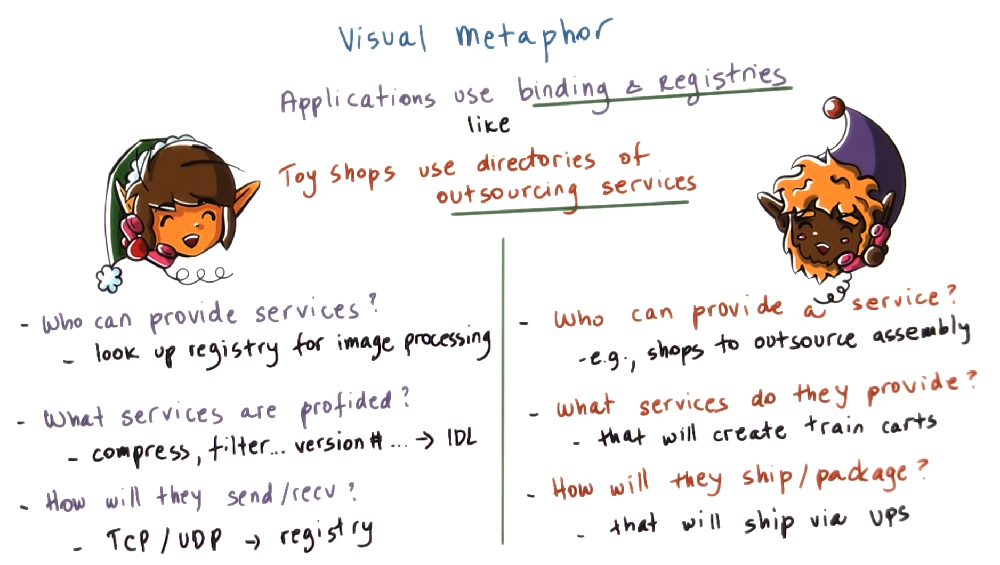
</center>

To illustrate the use of binding and registries by applications using remote procedure calls (RPCs), consider an analogy to the toy shop: A toy shop uses directories of outsourcing services.

| Characteristic | Toy Shop Outsourcing Directory | Remote Procedure Calls (RPCs) |
| :--: | :--: | :--: |
| Who can provide a service? | Shops to outsource toy assembly operations | Look up the registry to find a particular service (e.g., image processing) |
| What services do they provide? | A service that assembles train carts | The registry provides details regarding the various services provided by each server (e.g., image compression, filtering, etc.), the version number, etc., all of which relies on the use of some interface definition language (IDL) which describes the interfaces in some standard manner |
| How will they ship & package / send &receive? | Assembled train carts ship via UPS | The registry provides information regarding the protocols that a particular server or services support (e.g., TCP or UDP) |

Therefore, the application can use the information provided by the registry to determine which particular server/process to bind with (and similarly, in the toy shop, the manager can consider the relevant factors to determine which outsourcing service to select).

## 13. Pointers in RPCs

<center>
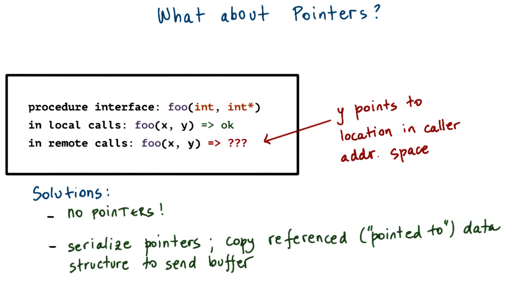
</center>

A tricky **issue** that emerges with remote procedure calls (RPCs) is the use of **pointers** as arguments to procedures, e.g., `foo(int, int*)` (as in the figure shown above), where the second argument is a pointer to an `int` (or perhaps even a pointer to an `int` array).

In regular procedures (i.e., *local* procedure calls), it is sensible to have procedures taking pointer arguments, e.g., `foo(x, y)`, where `y` is a pointer to some address in the address space of the calling process which stores the argument's value.

Conversely, in a *remote* procedure call (RPC), passing a pointer to the remote server is nonsensical, inasmuch as the pointer in the caller process's (i.e., client's) address space is otherwise inaccessible to the called process (i.e., the server).

Therefore, to resolve this issue with respect to remote procedure calls (RPCs), RPC systems can make one of the following decisions:
  1. Disallow the use of pointer arguments altogether in the first place.
  2. Allow the use of pointer arguments.
      * To achieve this, the RPC run-time ensures that the marshalling code that gets generated understands the fact that the argument(s) in question is a pointer(s). Therefore, rather than directly copying the argument(s) to the send buffer, it instead **serializes** the pointer argument(s) (i.e., it copies the referenced/"pointed-to" data structure into the data buffer as one contiguous/serial representation). 
      * Correspondingly, on the server side, the RPC run-time must first unpack all of the data to recreate the *same* equivalent data structure, and then it records the address to this data structure as the corresponding pointer-value argument for making the call to the actual local implementation of the particular operation/procedure.

## 14. Handling Partial Failures

<center>
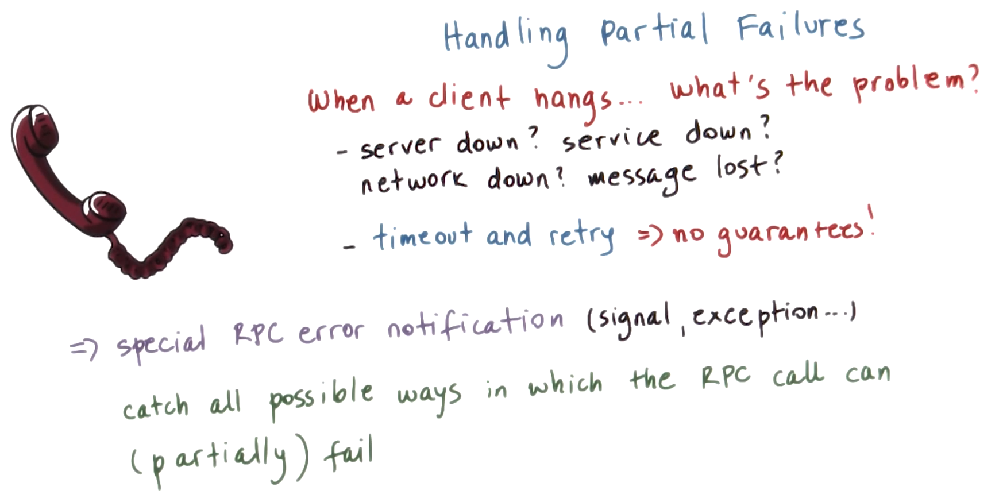
</center>

Along the lines of "trickiness" with respect to remote procedure calls (RPCs), now consider potential **errors** in fault handling and reporting.

When the client **hangs** while waiting on a remote procedure call (RPC), it is often difficult to determine the exact problem, e.g.,:
  * Is the server down? (e.g., due to server machine crash)
  * Is the service down? (e.g., due to overloaded server)
  * Is the network down? (e.g., due to an inoperable switch or router)
  * Is the message lost? (e.g., due to lost client request and/or lost server response)

Furthermore, even if the remote procedure call (RPC) run-time incorporates some mechanisms for **timeout and automatic retry**, there are still no guarantees in this case that the problem will be resolved or that the RPC run-time will be able to provide a better understanding of what has occurred. For some cases, it is potentially possible to determine the root cause of the error, but in principle this is still very complex (i.e., involving large overhead) and ultimately is unlikely to provide a *definitive* answer.

For this reason, remote procedure call (RPC) systems typically attempt to introduce a new type of **error notification** (e.g., signal or exception) which captures what error has occurred with the RPC request but without otherwise claiming to provide the *exact* details. This serves as a ***catch all*** for *all* types of errors/failures that can potentially occur during the RPC call, and can also potentially indicate a **partial failure** (i.e., the call did not *completely* fail, but rather the client cannot determine what exactly has succeeded vs. what has failed).

## 15. RPC Failure Quiz and Answers

Assume a remote procedure call (RPC) fails and returns a **timeout message**. Given this timeout message, what is the reason for the RPC failure that can be concluded by the RPC run-time? (Select any/all that apply.)
  * client packet lost
  * server packet lost
  * network link down
  * server machine down
  * server process failed
  * server process overloaded
  * all of the above
  * any of the above
    * `CORRECT` - As explained in the previous section, any of the failure modes indicated above as options are possible causes of failure. Also, hypothetically (albeit unlikely), it is possible for *all* of these failures to occur simultaneously; however, in practice, it is likely to be some subset of these failures, rather than *all* of them together.

## 16. RPC Design Choice Summary

<center>
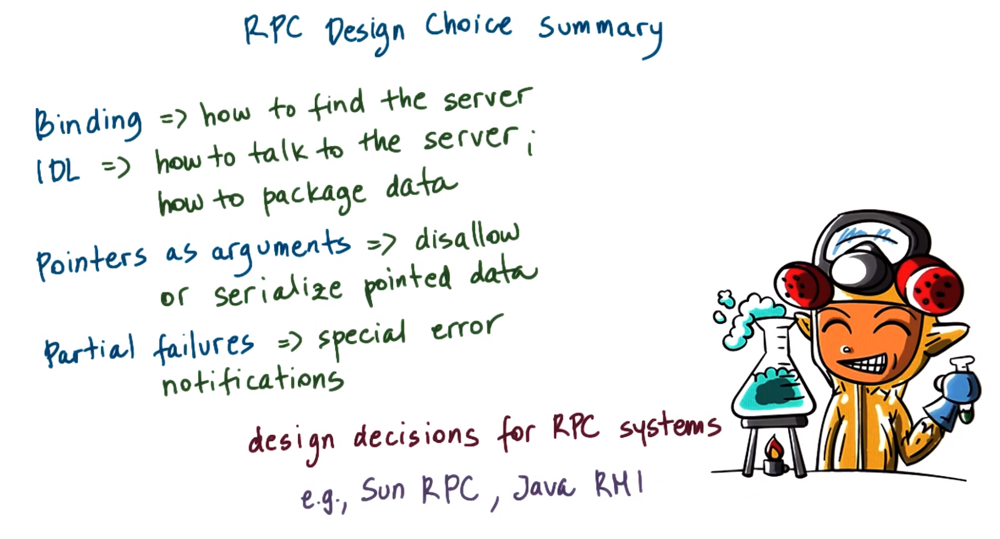
</center>

The previous sections of this lecture have described several **issues** with remote communication and the corresponding remote procedure call (RPC) mechanisms that resolve these issues, as follows:
  * **binding** - Allows the client to determine how to find the server and which server to connect to in the first place.
  * **interface definition language (IDL)** - Determines how to package arguments and results exchanged among the client and the server, which by extension specifies how the client and the server communicate among themselves.
  * **pointers as arguments** - Dealing with this issue involves either (1) disallowing the use of pointers as arguments altogether, or (2) building into the RPC system itself some type of support mechanism to serialize the pointed-to data appropriately.
  * **partial failures** - Since it is difficult to determine *exactly* the way in which an RPC system has failed, dealing with this issue involves the RPC run-time providing some special errors and notifications, with the RPC run-time attempting to determine (as reasonably as possible) what the exact cause(s) of the failure is/are but without otherwise making guarantees of a *precise* answer to this.

For all of these issues, there are several **choices** that can be made in the concrete **implementation** of a remote procedure call (RPC) system.
  * For binding, this can involve either a distributed or per-machine registry.
  * For the interface definition language (IDL), this can involve either a language-agnostic or language-specific IDL.
  * etc.

In summary, these issues define the **design space** for a remote procedure call (RPC) system. Accordingly, in different RPC or RPC-like systems, we can make different choices within this design space. This will be the topic of the following sections, which will also briefly contrast this with the RPC-like support provided by Java called **Java Remote Method Invocation (RMI)**.

## 17. What is SunRPC?

<center>
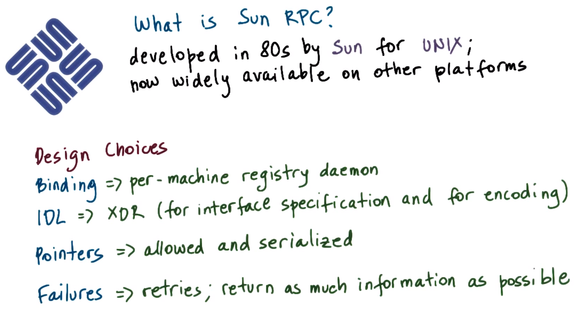
</center>

Sun RPC is a remote procedure call (RPC) package originally developed by Sun Microsystems in the 1980s for their UNIX **network file system (NFS)**, which subsequently became more broadly popular and widely available on other platforms.

Sun RPC makes the following **design choices**:
  * **binding** - It is assumed that the server machine is known up-front, and therefore the registry design is such that there is a **registry daemon** on a per-machine basis. When a client needs to communicate with a particular service, the client must first contact the registry on that particular machine to determine how to coordinate with the exact service that it requires.
  * **interface definition language (IDL)** - There is no fundamental assumption made regarding the programming language used by either the client or the server processes. Therefore, in order to maintain neutrality, Sun RPC relies on a language-agnostic IDL called **XDR**, which is used for both the specification of the interface as well as the encoding (i.e., how data types are encoded when transmitted among machines).
  * **pointers** - The use of pointers is allowed. Corresponding pointed-to data structures are serialized.
  * **failures** - Internally there is a **retry** mechanism to retry contacting the server when a connection times out, which is performed a specific number of times. Furthermore, as much as possible, the Sun RPC run-time attempts to return meaningful errors in order to allow the caller to distinguish between failure modes such as unavailable server, mismatch, unsupported protocol or version, timeout-related failure, etc.

## 18. Sun RPC Overview

<center>
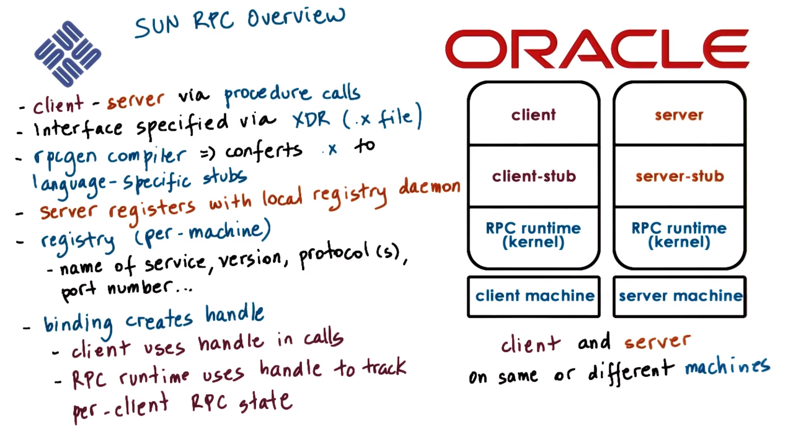
</center>

Similarly to the previous generic description of remote procedure calls (RPCs), with Sun RPC, the client and the server are able to interact via a **procedure call interface**. The server specifies the interface that it supports in a `.x` file written in XDR. Furthermore, Sun RPC includes the **rpcgen compiler** which converts `.x` to language-specific stubs, generating separate stubs for the client and server processes.

When launched, the server process registers itself with the **registry daemon** which is available on the *local* machine. This per-machine registry tracks **information** such as the name of the service, version, protocol(s) supported by the service, and the port number to contact when the client process sends a request to the server. The client must explicitly contact the registry on the *target* machine in order to obtain the pertinent information regarding the server process.

When **binding** occurs, the client creates an **RPC handle**, which is used whenever the client makes an remote procedure calls (RPCs). In this manner, the RPC run-time is able to track all of the per-client RPC-related state.

Note that with Sun RPC (or any other RPC, for that matter), the client and the server processes that are communicating amongst each other may be either on *different* machines or on the *same* machine. In the latter case, the RPC works in the typical manner of inter-process communication (IPC), but additionally operates at a much higher level of semantics (i.e., procedure call semantics).

<center>
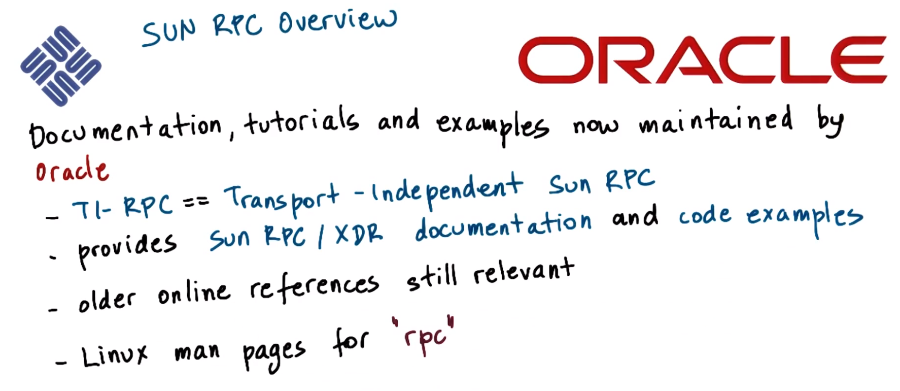
</center>

Before further discussing the key components of Sun RPC, to view a more complete reference, refer to the documentation, tutorial, and examples that are now maintained by Oracle (after its acquisition of Sun Microsystems in 2010).
  * ***Reference***: [ONC+ Developer's Guide](https://docs.oracle.com/cd/E19683-01/816-1435/index.html)

***N.B.*** In Oracle's documentation, references to **Transport-Independent Sun RPC (TI-RPC)** (i.e., as opposed to Sun RPC) denote the corresponding protocol which is used for client-server communication that does not require specification at compile-time (i.e., instead, it can be dynamically specified at run-time). Otherwise, the documentation closely follows the original Sun RPC specification, as well as the XDR interface definition language (IDL).

Additionally, there are older online references available which are still valid and relevant.

Lastly, the Linux man pages provide a corresponding entry via `man rpc`, which describes the Linux-supported APIs.

## 19. Sun RPC XDR Example

<center>
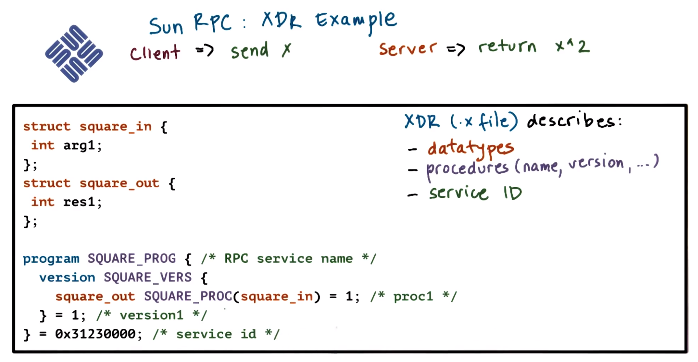
</center>

Consider now the various components of Sun RPC via example, as in the figure shown above. As before, the client contacts a server that can perform calculations. In this example, the client passes the single argument `x`, which the client requests to the server to use to determine/compute the value of `x`<sup>`2`</sup>.

The corresponding `.x` XDR file is shown in the figure above, which describes how the server specifies its interface.
  * The server specifies all of the **data types** (e.g., `square_in` and `square_out`) required for the procedures that it supports (e.g., `SQUARE_PROC()`).
    * ***N.B.*** In XDR (as in C), the data type `int` represents a 32-bit integer. Furthermore, there are no strict naming conventions (e.g., `snake_case`) required for XDR specifications.
  * In addition to the data types, the server specifies the actual RPC service itself (e.g., `SQUARE_PROG`), which is used by the client(s) to find the appropriate service to which to bind. Furthermore, the server specifies the version (e.g., `SQUARE_VERS`) for the corresponding **procedure** (e.g., `SQUARE_PROC()`). A *single* RPC server can support one or many procedures in this manner (e.g., a calculator server can support various arithmetic operations).
    * Each procedure has an associated **procedure ID** (e.g., `SQUARE_PROC()` has id number `1`). This identifier is not used by the programmer, but rather is used internally by the RPC run-time when attempting to identify which particular procedure is being called/requested by the client (i.e., as opposed to passing the procedure name by reference back and forth between client and server).
    * Additionally, each version of the procedure is similarly associated with a **version ID** (e.g., `1`, denoting "version 1" for `SQUARE_PROC()`). In fact, such a version number/identifier can be applied to an entire *collection* of procedures in this manner.
      * Over time, a given procedure(s) (e.g., `SQUARE_PROC()`) may be refined and/or additional procedures may be added. In this process, it may be undesirable to *immediately* update the interface to the client with *all* corresponding changes (which may be semantically and/or syntactically different). In such a case, it may be more sensible for the client-server interaction to occur via corresponding reference to a *specific* version number/identifier of the requested procedure; therefore, when a client requests a procedure version that is not supported by the server, then the communication can be explicitly rejected by the server.
      * In this manner, a given server can support *multiple* versions of the *same* procedure, which in turn facilitates the evolution of the system, without otherwise requiring additional coordination to update all clients and all servers simultaneously.
  * Finally, the server specifies a **service ID**, which is a number used by the RPC run-time to differentiate among the different services it supports.

Therefore, in general, the client requests a service via **names/labels** (e.g., service name, procedure name, and version number), whereas the RPC run-time itself internally uses **identifiers** (e.g., service ID, procedure ID, and version ID).

<center>
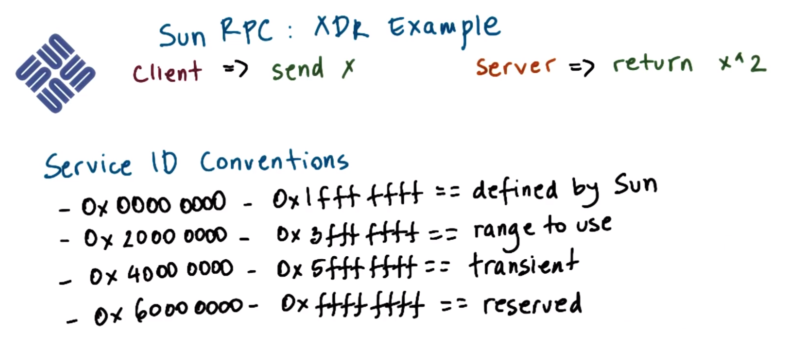
</center>

With respect to the **service ID**, it is permissible to specify an value in the ranges shown in the figure above (i.e., `0x20000000` to `0x3fffffff`). Otherwise, values outside of this range have pre-defined meanings (e.g., network file system) or are otherwise reserved for other uses.

## 20. Compiling XDR

<center>
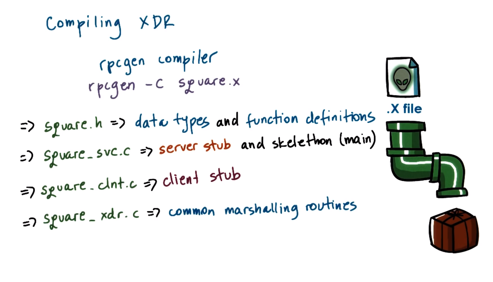
</center>

Consider now the compilation process for a `.x` file, as in the figure shown above. Here, it is assumed that the same procedure from the previous section is used (i.e., `SQUARE_PROC()`), whose definition is contained in the corresponding file (e.g., `square.x`). Using a `.x` file in this manner will automatically generate the code that is used for both the client and the server-side processing.

To perform this compilation, Sun RPC relies on the compiler `rpcgen`, which can generate C code via flag `-c` (e.g., `rpcgen -c square.x`). The result of this command is the generation of various files, as follows:
  * **header files** (e.g., `square.h`) - Contains all language-specific definitions of data types and function prototypes.
  * **stubs**
    * **server-side stubs** (e.g., `square_svc.c`) - The skeleton code for the server-side code (including the routine `main()`), without the actual implementation of the service/procedure itself; rather, the implementation is the responsibility of the programmer.
    * **client-side stubs** (e.g., `square_clnt.c`) - A complete/"proper" stub.
  * **common marshalling routines** (e.g., `square_xdr.c`) - A separate file containing common code pertaining to marshalling and unmarshalling routines for all of the data types (i.e., argument(s) and result(s)) used by both the client and the server.

<center>
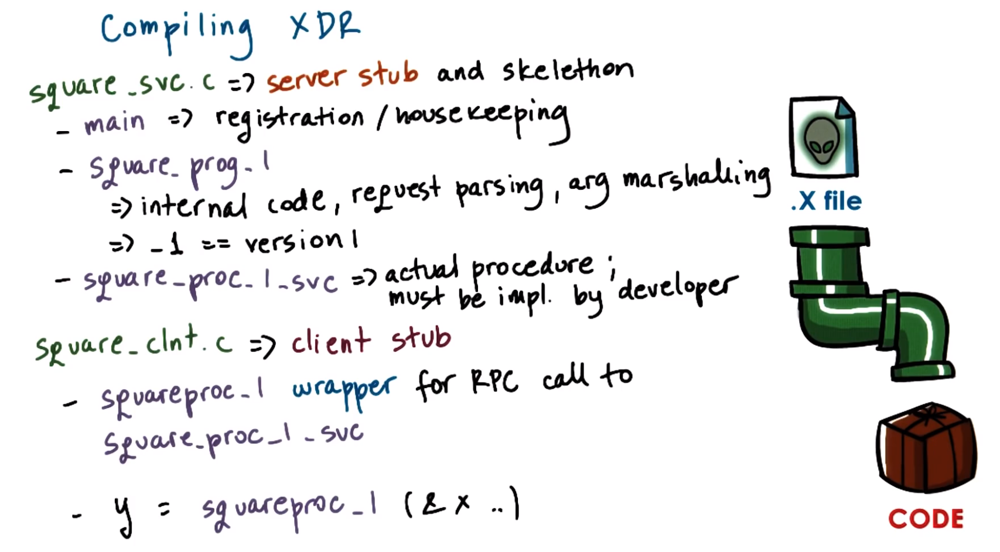
</center>

Examining the auto-generated server file `square_svc.c` (where `svc` denotes "service"), it is composed of two parts:
  1. The routine `main()` for the server process, which includes code for the client registration step, as well as additional housekeeping operations.
  2. All other code related to the particular remote procedure call (RPC) service(s) (e.g., `square_prog_1`), including:
      * The version number (e.g., `_1`), to determine which particular procedure to be called
      * Request parsing
      * Argument(s) marshalling
      * And other internal code

Additionally, the server stub file `square_proc_1_svc.c` contains auto-generated code which includes the prototype(s) for the actual procedure(s) that is invoked in the server process. The corresponding implementation(s) must be provided by the programmer.

Similarly, the auto-generated client file `square_clnt.c` (where `clnt` denotes "client") contains the client stub. This includes an auto-generated procedure (e.g., `squareproc_1()`), which represents a wrapper for the actual remote procedure call (RPC) used by the client to call the server-side process, where the corresponding server-side implementation (i.e., `square_proc_1_svc()`) is actually called.

Once all of the aforementioned is developed, the developer then writes the client application with corresponding calls to the wrapper function (e.g., `y = squareproc_1(&x /* , ... */);`), similarly to making a regular/local procedure call, without the need to additionally create sockets, buffers, copy data into buffers, etc.; indeed, the corresponding abstractions provided by the RPC system are what make remote procedure calls (RPCs) appealing.

## 21. Summarizing XDR Compilation

<center>
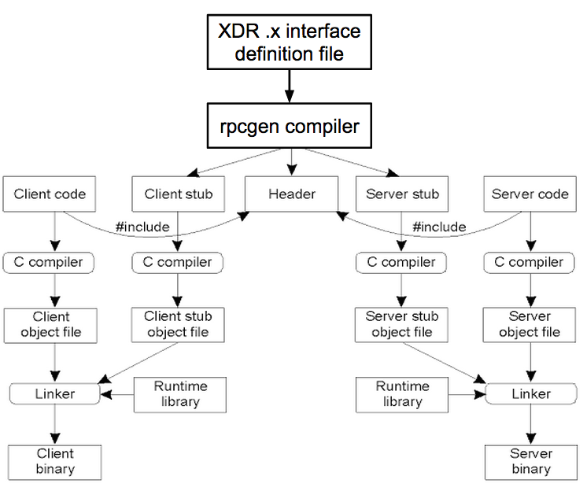
</center>

(***N.B.*** The figure shown above contains the high-resolution version of the diagram used in this section.)

<center>
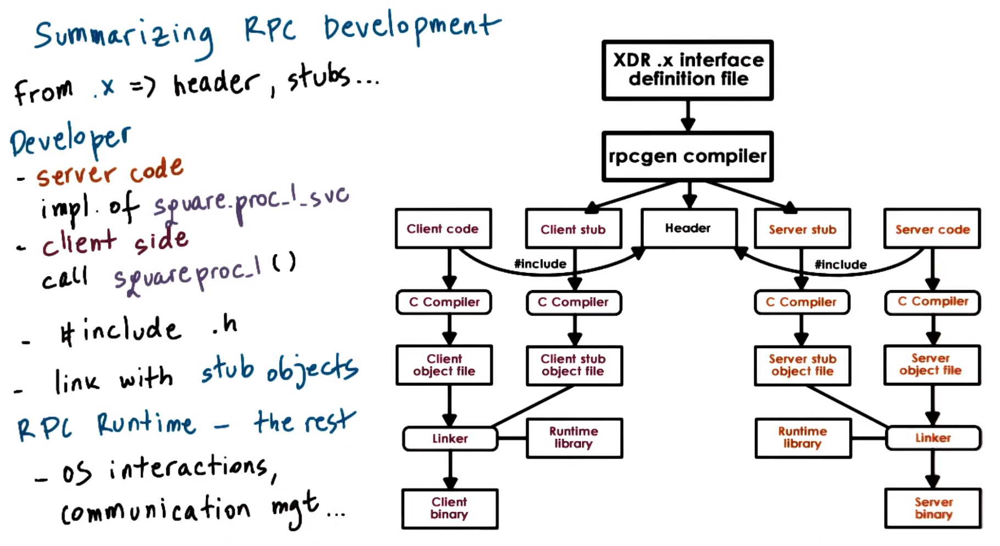
</center>

This section summarizes the steps involved in developing remote procedure call (RPC) applications, as in the figure shown above.

First, the `.x` file is written using XDR, and then is passed through the rpcgen compiler. The rpcgen compiler generates several files, including the header file, the respective stubs, as well as the skeleton code for the server implementation. Additionally, the rpcgen compiler generates a `_xdr` file containing a number of helpful marshalling routines.

For the server-side application, the developer must provide the implementation of the actual service procedure (e.g., `square_proc_1_svc`, per the naming convention).

For the client-side application, the developer develops the client application as appropriate, and  whenever necessary, the client application calls the wrapper procedure (e.g., `squareproc_1()`). This call is what actually invokes all of the communication with the server and the corresponding execution of the particular service(s) implementation(s).

As a matter of correctness, the developer must ensure to include all of the appropriate `.h` files (particularly those which are auto-generated by the rpcgen compiler), as well to link the client and the server code with the corresponding respective stub objects.

The RPC run-time that is called from the stubs then provides all other necessary functionality (e.g., interactions with the operating system, creating sockets, managing connections, etc.)

<center>
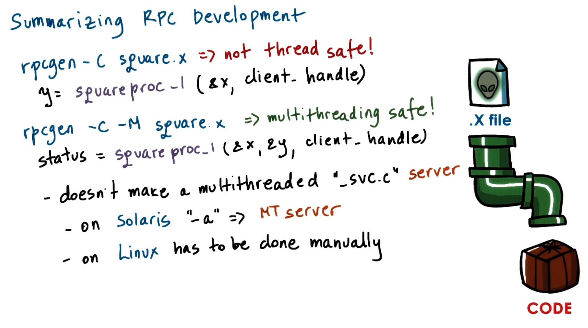
</center>

Note that `rpcgen -C` generates code that is ***not*** thread-safe. Therefore, the output of the compilation results in a function that must be called in a manner such as `y = squareproc_1(&x, client_handle);`. The issue with the implementation of this operation, as well as at the run-time level, is that there are a number of ***statically*** allocated data structures (including for the result), leading to race conditions when multiple threads attempt to make remote procedure calls (RPCs) to this routine concurrently.

Correspondingly, to generate **thread-safe** code, the code must be compiled with flag `-M` (denoting "multithreading-safe"), e.g., `rpcgen -C -M square.x`. The corresponding wrapper function that is generated has a different signature and implementation, e.g., `status = squareproc_1(&x, &y, client_handle);`. Here, it ***dynamically*** allocates memory for the results of the operation, thereby resolving some of the aforementioned issues with respect to the previous thread-unsafe implementation.
  * ***N.B.*** Using the flag `-M` does not actually create a multi-threaded server (e.g., `..._svc.c` is not multi-threaded).

On Solaris platforms, the compiler flag `-a` generates multi-threaded server code. However, on Linux, this option is not supported, but rather any such multi-threaded server must be implemented manually (using the generated thread-safe routines as a starting point).

## 22. `square.x` Return Type Quiz and Answers

Consider the following XDR file (`square.x`):
```c
struct square_in {
 int arg1;
};
struct square_out {
 int res1;
};

program SQUARE_PROG { /* RPC service name */
  version SQUARE_VERS {
    square_out SQUARE_PROC(square_in) = 1; /* proc1 */
  } = 1; /* version1 */
} = 0x31230000; /* service id */
```

What is the return type of `square_proc_1()` if `square.x` is compiled with the following flags:
  * `rpcgen -C`
    * `square_out*`
  * `rpcgen -C -M`
    * `enum clnt_stat`

***N.B.*** As this quiz demonstrates, the thread-safe vs. non-thread-safe versions of the function have different prototypes with correspondingly different return-value types.

## 23. Sun RPC: Registry

<center>
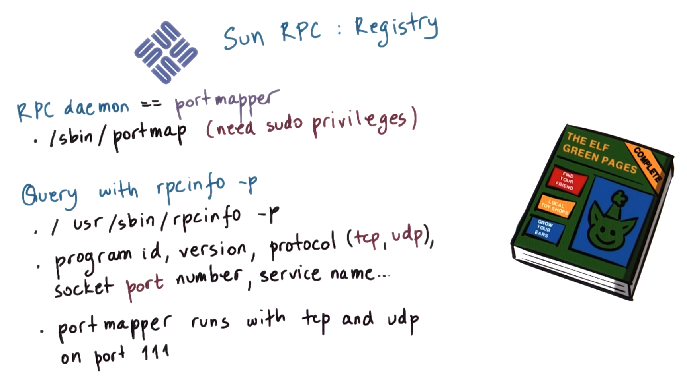
</center>

Consider now the Sun RPC **registry**. Recall that the actual code that the server must register with the registries auto-generated in the `rpcgen` process, as part of the function `main()`.

In Sun RPC, the registry process (or **RPC daemon**) is process that runs on every single machine, which is called `portmapper`. The process `portmapper` is contacted by *both* the server (when registering a particular service) and the client (when determining the specific contact information for a particular service being searched).
  * ***N.B.*** To start this process in Linux, this requires administrative access permissions (i.e., `sudo`), which permits to launch the RPC daemon via command `/sbin/portmap`.

Given that the client has already communicated with the RPC daemon, the client clearly knows the IP address of the machine with which it must interact, therefore the information that the client can extract from `portmapper` include the port number used by the client to communicate with the server, whether particular version and protocol are supported by the server that the the client requires, etc.

Once the RPC daemon is running, we can explicitly query what services are registered with it via command `rpcinfo -p` (***N.B.*** this may require an absolute path, e.g., `/usr/sbin/rpcinfo -p`). Once run, this command returns information for every single service registered on that particular machine, including:
  * program id
  * service name
  * version
  * contact information
    * protocol (e.g., TCP or UDP)
    * socket port number

***N.B.*** When running this service, note that `portmapper` is registered with TCP and UDP on the *same* port number, `111`. This means that there are two different sockets listened to by this server: (1) a TCP socket, and (2) a UDP socket. Therefore, the service `portmapper` can communicate with *both* TCP and UDP clients.

## 24. Sun RPC: Binding

<center>
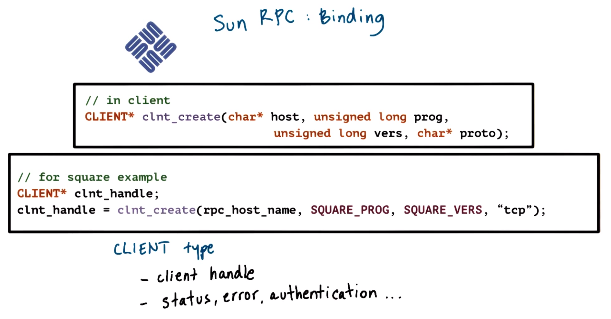
</center>

With respect to the **binding** process in Sun RPC, the binding process is initiated by the client using the operation `clnt_create()`, as in the figure shown above.

For the specific example of the service `square`, the operation is as in the figure shown above. The arguments to `clnt_create()` include:
  * The host name of the server (e.g., `rpc_host_name`)
  * The protocol used to communicate with the server (e.g., `"tcp"`)
  * The name of the RPC service (e.g., `SQUARE_PROG`)
  * The version number of the RPC service (e.g., `SQUARE_VERS`)

***N.B.*** The RPC service name and version (e.g., `SQUARE_PROG` and `SQUARE_VERS`, respectively) are auto-generated in the remote procedure call (RPC) generation process from the `.x` file, and are included in the `.h` header file as hash-defined values. Therefore, if the client must support a different version number of the service, it must be re-compiled (since this information is static) but otherwise no other parts of the client code require modification.

The return value from the operation `clnt_create()` is a client handle of type `CLIENT*` which is included in every single remote procedure call (RPC) operation that it requests and is used to track certain information, e.g.,:
  * status of the current RPC operation
  * error messages
  * authentication-related information
  * etc.

## 25. XDR Data Types

Recall that in the basic `square.x` example, all of the data types for the input and output arguments must be described in the `.x` file. Note that all of these types and data structures must be XDR-supported data types.

***N.B. Reference***: [RFC 4506](https://datatracker.ietf.org/doc/html/rfc4506) (XDR data types specification)

<center>
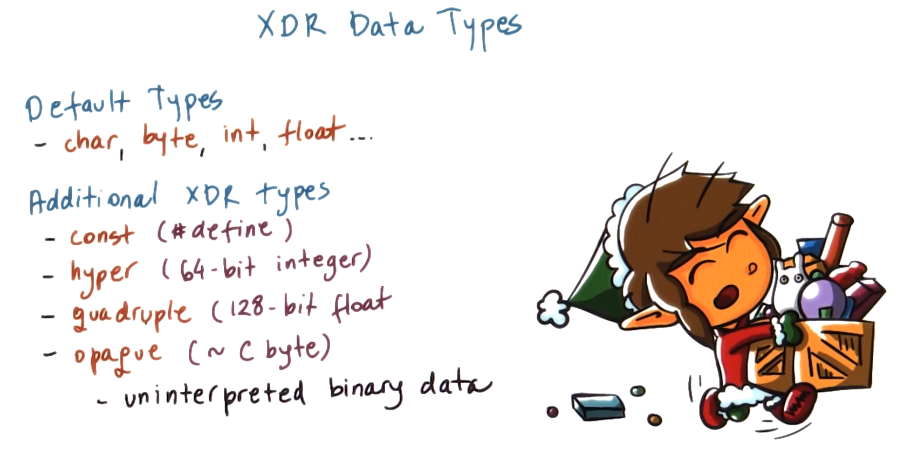
</center>

Some of the default XDR data types are those that are commonly available in programming languages like C (e.g., `char`, `byte`, `int`, `float`, etc.).

Additionally, XDR supports many other data types.
  * `const` - After compilation, translates to a `#define` macro constant in C.
  * `hyper` - 64-bit integer
  * `quadruple` - 128-bit floating-point number
  * `opaque` - Corresponds approximately to the data type `byte` in C (i.e., uninterpreted binary data).
    * For instance, to transfer an image, it can be represented as an array of `opaque` elements.

<center>
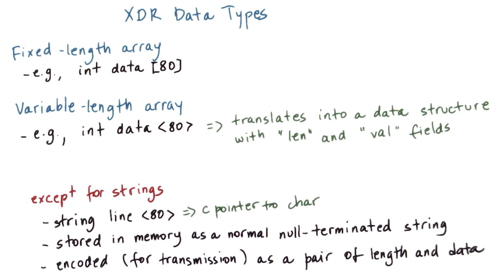
</center>

Regarding **arrays**, XDR allows to specify two types of arrays:
  1. **fixed-length array** (e.g., `int data[80]`), which specifies the *exact* number of elements in the array.
      * The RPC run-time allocates the corresponding amount of memory whenever arguments of this data type are sent or received, and is aware of exactly how many bytes from the incoming packet stream should be read out in order to populate a variable that is of this array data type.
  2. **variable-length array** (e.g., `int data<80>`), which species the *maximum expected* number of elements.
      * When compiled, a variable-length array is translated into a data structure containing two fields: (1) an integer `len` which corresponds to the *actual* size of the array, and (2) a point `val` which is an address of where the data in the array is actually stored.
      * When the data is actually sent, the sender has to specify `len` (the size of the array) and then set `val` to point ot the memory location where the data is stored.
      * On the receiving end, the server knows that it is expecting a data structure that has variable length, and will parse `len` to determine the actual length/size of the array and correspondingly allocate the appropriate amount of memory, and then will read the remaining portions of the incoming byte stream in order to populate the allocated memory with the corresponding values.

The key **exception** to the aforementioned variable-length array configuration is **strings**. When a variable-length string is defined (e.g., `string line<80>`), the resulting variable (e.g., `line`) is simply a C pointer to `char`. In memory, the string is stored as a normal C-style/null-terminated string (i.e., an array of `char`s terminated by `'\0'`). Operations (e.g., string copy, string length, etc.) require this particular representation in order to determine where the string ends. However, when the variable-length string is encoded for transmission, it is encoded as a **pair** of length and data; in this respect, such a string is otherwise identical to other similar variable-length data structures.

## 26. XDR Data Types Quiz and Answers

Consider a remote procedure call (RPC) routine that uses the following data type:
```c
int data<5>;
```

Furthermore, assume that the array `data` is ***full***. How many bytes are required to represent this five-element array in a C client on a `32`-bit machine?
  * `28` bytes
    * For a variable-length array, in C, this is compiled to a data structure comprised of fields `int len` (`4` bytes) and `int *val` (`4` bytes, for an address on a `32`-bit machine). Furthermore, since the memory required for five `int` elements is `5 * 4` bytes, the total memory required is the sum of these quantities, i.e., `4 + 4 + (5 * 4) = 28` bytes.

## 27. XDR Routines

<center>
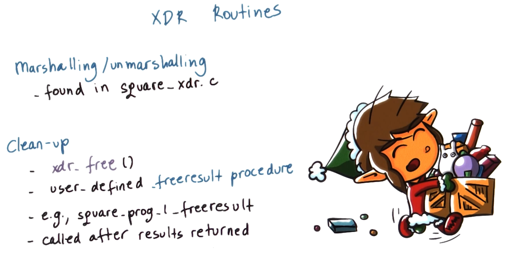
</center>

XDR provides the RPC run-time with some helpful **routines**.
  * After compiling a `.h` XDR file, the compiler generates a number of routines used for **marshalling**/**unmarshalling** the various data types in the remote procedure call (RPC) operations. These are found in the correspondingly generated `_xdr.c`  file (e.g., `square_xdr.c`).
  * Additionally, the compiler generates **clean-up operations**.
    * `xdr_free()`, which de-allocates/frees up memory regions that are used for the data structures and arguments in the RPC operations.
    * These routines are typically called within a procedure which is suffixed with `_freeresult` (e.g., `square_prog_1_freeresult()`), which is a user-defined procedure wherein the user can specify all of the different data structures (i.e., pieces of state) which must be de-allocated after the run-time is finished with servicing the RPC request and returning the results. The RPC run-time automatically calls this procedure after it finishes computing the result.

## 28. Encoding

<center>
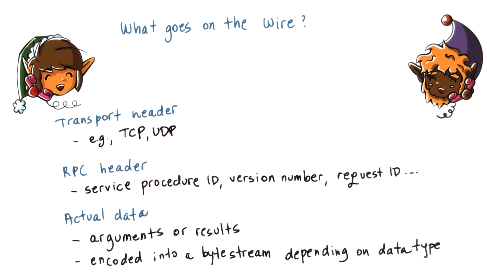
</center>

Consider now what actually ends up in the **buffers** that are passed for transmission among the client and the server.

For instance, for a server which can support multiple procedures, it is important to pass not just the arguments but also to actually include an **RPC header** that wil uniquely identify the procedure that is being called (e.g., the service procedure ID), the version number, a request ID (e.g., to detect repeated requests on retries), etc. In this manner, similar types of information are sent between the server and the client (i.e., via the corresponding packets transmitted over the wire).

Additionally, clearly the actual **data** itself must also be included. This comprises (e.g., the arguments or results). However, rather than directly copying fro memory into the packets, the different data types (i.e., arguments or results) must first be ***encoded*** into a byte stream in order to serialize them in a manner which depends on the actual data type. Therefore, it is imperative to have an actual ***agreement*** as to how this encoding is performed to allow the server to interpret the byte stream in order to recreate the appropriate data structure in the server process's address space. Furthermore, in order for the server process to actually call the procedure that implements the service, it must have the arguments present in the server process's memory. And similarly, these requirements hold for the client process's interpretation of the returned results from the server process (i.e., interpreting the received byte stream from the server in order to populate data structures in its own local memory).
  * ***N.B.*** In some cases, there may be a one-to-one mapping of the in-memory representation with how the data is encoded in the packet, while in other cases this may not hold true.

Finally, when all of the pertinent information is placed in a packet, it must be preceded with the **transport header**, which specifies the protocol (e.g., TCP or UDP) and the destination address, and ensures that all of the protocol-specific operations occur on the client and on the server appropriately.

## 29. XDR Encoding

<center>
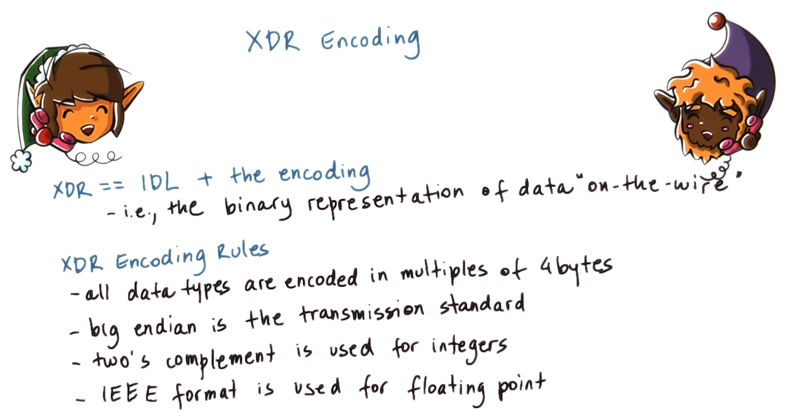
</center>

As hinted already with the previous discussion on the XDR data types' syntax, XDR specifies *both* the **syntax** (via the **interface definition language (IDL)**, which describes the data types) *and* the **encoding** of the data types (i.e., what is the binary representation of the data when it is on the wire).
  * As suggested previously regarding the string data type, XDR corresponds to both the IDL (the syntax for describing the data type) and the encoding (how the data is represented when transmitted between the client and the server on the wire).

The **XDR encoding rules** are as follows:
  * All data types are encoded as integer multiples of `4` bytes.
    * For instance, transmitting a single byte of data requires `1` byte for the data and then `3` additional bytes for padding. This facilitates alignment when moving data to/from memory and to/from network packets via the network card.
  * ***Big-endian*** is used as the transmission standard, irrespectively of the native format of either the client or the server.
    * In some cases, this may add unnecessary overhead (i.e., if both client and server machines are little-endian), however, having such a standard agreement facilitates prevention of any ambiguity in the interpretation of the byte-stream data sent on the wire.
  * **Two's complement** is used for integers.
  * **IEEE 754** format is used for floating-point numbers.
  * etc.

<center>
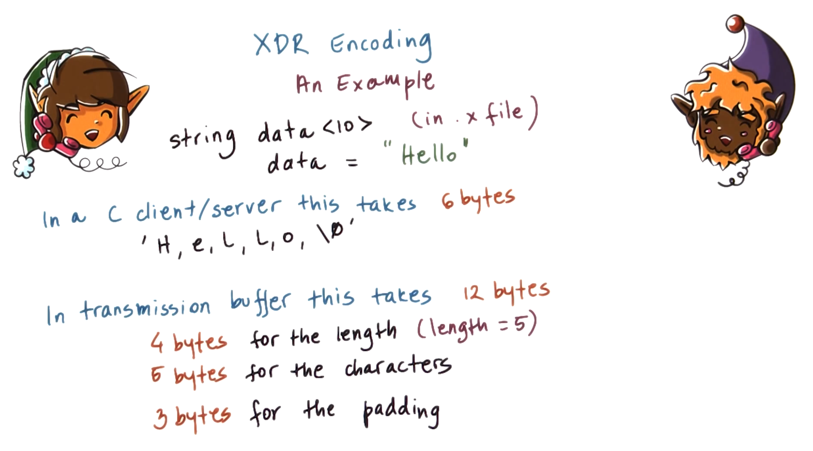
</center>

Consider these rules via an example, as in the figure shown above.

The following are given:
```c
string data<10> // in .x file
data = "Hello"  // argument passed from client to server
```

The C-based client and server processes' respective address spaces require `6` bytes to store `data`'s characters (i.e., `'H'`, `'e'`, `'l'`, `'l'`, `'o'`, `'\0'`).

However, the **transmission buffer** itself requires `12` bytes to store `data`, as follows:
  * `4` bytes for the length (`length = 5`)
  * `5` bytes for the characters (***N.B.*** `'\0'` is not transmitted for a string)
  * `3` bytes for padding (i.e., to make the buffer an integer multiple of `4` bytes for proper boundary-alignment)

## 30. XDR Encoding Quiz and Answers

Consider a remote procedure call (RPC) routine that uses the following XDR data type:
```c
int data<5>;
```

Furthermore, assume that the array `data` is ***full***. How many bytes are required to encode this five-element array to send it from a client to a server, both of which are `32`-bit machine? (Ignore bytes required for the headers and protocol-related information.)
  * `24` bytes
    * Variable-length arrays are encoded such that the first four bytes correspond to the integer value of the array size (i.e., `len`), and the remaining bytes correspond to the actual array elements (with appropriate padding as necessary). In this case, the array elements require `5 * 4 = 20` bytes, and since `len` is `4` bytes (i.e., an `int` on a 32-bit machine), this gives `20 + 4 = 24` bytes, which is an integer multiple of `4` (i.e., no additional padding is necessary).
    <center>
    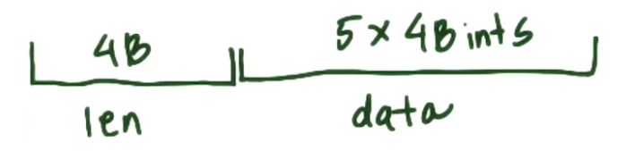
    </center>

## 31. Java RMI

<center>

</center>

Another popular type of RPC-like system is **Java Remote Method Invocations (RMIs)**. Java RMI is also pioneered by Sun as form of client-server communication among address spaces in the **Java Virtual Machine (JVM)**.

**Java** is an object-oriented language, wherein objects interact via ***method invocations*** (i.e., rather than ***procedure calls***). For this reason, this inter-process communication (IPC) mechanism matches Java's object-oriented semantics in the corresponding form of a remote *method* invocation.

The **architecture** of Java RMI is similar to that which was seen previously with respect to remote procedure calls (RPCs) (e.g., Sun RPC).
  * Client and server processes have client-side and server-side stubs. The server-side stub is referred to as a **skeleton**.
  * In the Java Virtual Machine (JVM), all of the processes (i.e., all clients and servers) are written in the Java programming language. For this reason, the **interface definition language (IDL)** for Java RMIs is itself Java (i.e., it is a language-specific IDL).
    * ***N.B.*** It would not be sensible to use a language-agnostic approach here, given that both the client and the server processes also use Java.
  * The **run-time layer** is separated into two components:
    1. **Remote Reference Layer** - Captures all of the common code required to provide various ***server-reference semantics***, e.g.,:
        * **unicast** - The client interacts with a *single* server (as in the previous examples).
        * **broadcast** - The client interacts with *multiple* servers
        * **return-first response** - The client returns only when the *first* response arrives
        * **return-if-all-match** - The client returns only when *all* of the responses arrive and when these responses *match*.
        * etc.
    2. **Transport Layer** - Implements all transport-protocol-related functionality (e.g., TCP, UDP, shared-memory-based communications on the *same* machine, etc.)

Regardless of the underlying transport protocol, all of the aforementioned functionality is implemented in a *uniform* manner; Java RMI captures these features in separate components within the remote reference layer. Therefore, as a developer, one can simply specify the desired reference semantics, or they can implement just this particular component (i.e., the remote reference layer) to achieve the particularly desired semantics.

***N.B.*** Java RMIs are mentioned in this lecture for reference, however, its detail discussion is beyond the present scope.
  * ***Reference***: [Java RMI Tutorials](https://docs.oracle.com/javase/tutorial/rmi/)

## 32. Lesson Summary

This lecture examined **remote procedure calls (RPCs)**, a popular inter-process communication (IPC) mechanism that is used to support client-server interactions.

An RPC system requires the use of an **interface definition language (IDL)** in order to describe the remote service, as well as other mechanisms (e.g., service registration, binding, data marshalling, etc.) required to enable the remote data exchanges.

This lecture described Sun RPC in detail, with sufficient examples to enable the use and implementation of Sun RPC systems.
