# P4L1: Remote Procedure Calls

## 1. Preview

The previous lectures have discussed several mechanisms for inter-process communication (IPC). It was indicated then that these are fairly low-level mechanisms inasmuch as they focus on providing the basic capability for moving data among address spaces, but otherwise do not specify anything about the semantics of those operations or the protocols involved.

This lecture discusses **remote procedure calls (RPCs)**, an inter-process communication mechanism which specifies that processes interact via **procedure call interface**.

For the general discussion of remote procedure calls, this lecture will roughly follow the paper "*Implementing Remote Procedure Calls*" (1984) by Birrell and Nelson. This is an older paper, however, it very nicely discusses the general design space of remote procedure calls.

Later, the lecture will discuss SunRPC, a concrete implementation of an RPC system that is common in modern operating systems.

## 2. Why RPC?

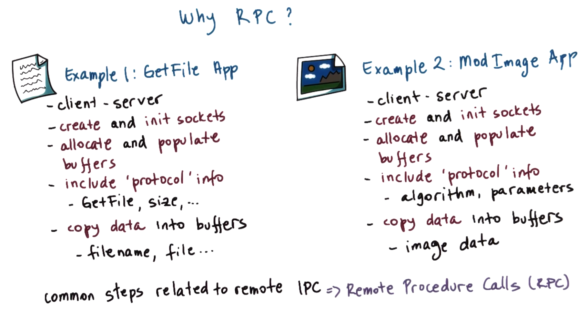

To understand why RPC is necessary, consider two example applications, as in the figure shown above.

In the first application, a client requests a file from a server using a simple HTTP-like protocol called **GetFile** (cf. CS 6200 Project 1). In this application, the client and the server interact via a socket-based API, requiring the developer to:
  * Explicitly create and initialize the sockets.
  * Allocate and populate buffers for sending via the sockets.
  * Include protocol information (e.g., GetFile directive/header, buffer size, etc.).
  * Explicitly copy data (e.g., filename, file, etc.) into/out of the buffers.

In the second application, which is another client-server application, the client interacts with the server to upload some images, and then requests to the server for these images to be modified (e.g., to create a grayscale version of an image, to create a low-resolution version of an image, to apply some phase-detection algorithm, etc.). Therefore, while this application is similar to the first, there are some additional functionalities (i.e., processing) to be performed for every image. Correspondingly, the developer must perform similar steps (in some case identically) to the first application, with some notable differences:
  * Protocol-related information to be included in the buffers must specify information such as the algorithm (e.g., grayscaling, face detection, etc.) requested by the client to be performed by the server, as well as any relevant parameters.
  * The data sent between the client and the server is image data, which is both sent from the client to the server for processing, as well as received back by the client in post-processed form.

Observe that many of the ***steps*** are identical between the two applications. In the 1980s, as the speed of networks improved and as increasingly more distributed applications were being developed, it became obvious that these kinds of steps are quite ***common*** in related inter-process communications, requiring tedious re-implementation for a majority of these kinds of applications. Consequently, it became apparent that some system solution was necessary to simplify this process, i.e., capturing the common steps related to *remote* inter-process communication; accordingly, this gave rise to **remote procedure calls (RPCs)**.

## 3. Benefits of RPC

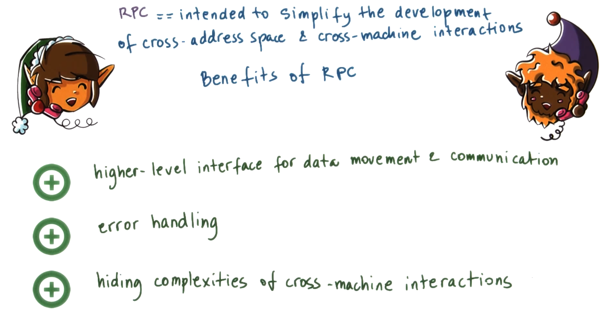

Remote procedure calls (RPCs) are intended to simplify the develop of cross-address space and/or cross-machine interactions.

Therefore, the **benefits** of remote procedure calls (RPCs) are as follows:
  * Remote procedure calls (RPCs) provide a higher-level interface for data movement and communication (e.g., communication establishment, requests, responses, acknowledgements, etc.).
  * Remote procedure calls (RPCs) permit for capturing a lot of error-handling and automating it, relieving the programmer's responsibility to otherwise manage this (i.e., via explicit implementation of error-handling facilities for *all* types of errors).
  * Remote procedure calls (RPCs) hide the complexities of cross-machine interactions from the programmer (e.g., machines of different types, failure of the connecting network, failure of either machine, etc.).

## 4. RPC Requirements

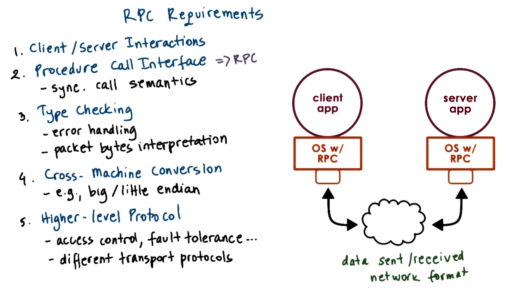

Consider the **requirements** for the systems software that provides support for remote procedure calls (RPCs), as shown above.
  1. The model of inter-process interactions that the RPC model is intended for must manage **client-server interactions**, whereby the server supports some potentially complex service (e.g., a complex computation which it executes quickly, a file service that serves remote content, etc.) that is otherwise not present in the client (i.e., either is not needed to be present on the client or is beyond the client's capabilities).
  2. When RPCs were first developed, the state-of-the-art programming languages were of the procedural-programming paradigm (e.g., Basic, Pascal, Fortran, and C). Therefore, since these were most familiar to programmers when RPC was developed, a corresponding goal of RPC systems was to simplify the development of distributed applications via a **procedure call interface** (and hence the namesake, i.e., remote *procedure calls*).
      * Consequently, RPCs are intended to have corresponding ***synchronous*** call semantics, i.e., when a process makes an RPC (e.g., to a server), the calling process/thread (e.g., client) will ***block*** and then ***wait*** until the called RPC completes and returns its result. This is analogous to what occurs when a procedure is called in a *single* address space: The execution of the thread reaches the point where the procedure call is made, and then execution switches to somewhere in the address space where the procedure is implemented, and the originally executing thread does not advance beyond the original procedure-call point until the result from the procedure call is returned, at which point the calling thread can proceed with its execution.
  3. Similarly to regular procedure calls, RPCs also provide **type checking**.
      * Passing an argument of the wrong type produces an error, which in turn can be caught with appropriate error handling.
      * The implementation of the RPC run-time can be optimized, e.g., when packets are being sent among the two machines, the corresponding information is transmitted as a stream of bytes from one point to the other, therefore, conferring some notion of types on the data contained in those bytes can be useful when the RPC run-time attempts to interpret these bytes (e.g., integers, files, etc.).
  4. Since the client and the server may run on *different* machines, there may be differences in how they represent certain data types, i.e., there may be necessary **cross-machine conversion**.
      * For example, there may be differences in big- vs. little-endian representations of integers, in representations of floating-point numbers, in representations for negative numbers, etc.
      * Correspondingly, the RPC system should *hide* all of these differences from the programmer, and ensure that the data is otherwise correctly transported with appropriate conversions/translations performed as necessary. One way to manage this conversion is for the RPC run-time at both endpoints to agree upon a *single* data ***representation*** for the data types (e.g., it can agree that everything will be represented in the **network format**, thereby obviating the requirement for the two endpoints to negotiate exactly how data should be encoded/represented)/
  5. RPC is intended to be more than simply a transport-level protocol (e.g., TCP and UPD), which is concerned with sending packets from one endpoint to another in an ordered, reliable manner; additionally, RPC should provide a **higher-level protocol** that supports underneath it different kinds of protocols (i.e., the same types of client-server interactions should be supported regardless of whether the two machines use UDP vs. TCP, etc. to communicate).
      * RPC should therefore support different transport protocols.
      * RPC should also support other higher-level mechanisms such as access control, authentication, fault tolerance (e.g., if a server is unresponsive, the client can retry and reissue the same request to either the same server or to a replica of the original server), etc.

## 5. Structure of RPC

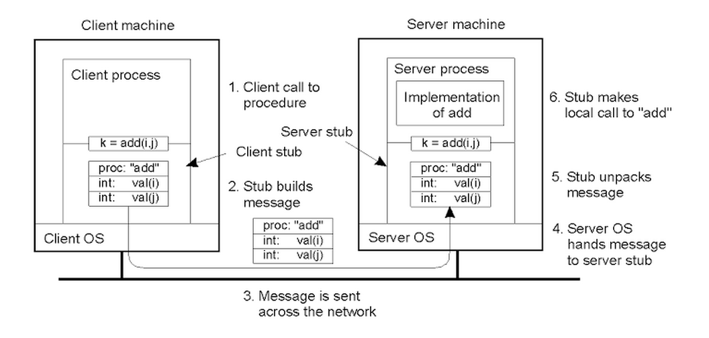

To illustrate the structure of the remote procedure call (RPC) system, consider the example client-server system in the figure shown above. Here, the client must perform some arithmetic operation (e.g., addition, subtraction, multiplication, etc.) but is not capable of performing this operation locally; therefore, the server is the (remote) "calculator" process.

In this scenario, whenever the client must perform some arithmetic operation, it must send a **message** to the server indicating the operation to be performed as well as the corresponding arguments/operands. The server in turn contains the implementation of the operation, returning the result to the client.

To simplify all of the communications-related aspects of the programming (e.g., creating sockets, allocating/managing the buffers for the arguments and for the results, etc.), this communication pattern will use a remote procedure call (RPC) as follows:
  1. The client requires to perform the addition operation `add(i, j)`, storing the result in `k`. Since the client does not possess the corresponding implementation, it must use the RPC.
      * ***N.B.*** In a regular program, when a procedure call is made, the execution jumps to some other point in the address space (i.e., where the implementation of that procedure is actually stored), making the appropriate update to the program counter to set it to some value in that address space corresponding to the first instruction of the procedure. Conversely, when the RPC `add()` is called, the execution of the program also jumps to another location in the address space, however, this location will not be the "real" implementation of `add()`, but rather it will be in a "**stub**" implementation; from the perspective of the rest of the client, this will "appear" as calling `add()`, but the corresponding implementation/internal representation is distinct from that of a local procedure call.
  2. The responsibility of the **client stub** is t ocreate a **buffer** and to populate the buffer with all of the appropriate information (e.g., the descriptor of the function `add` and its arguments `i` and `j`). The stub code itself is ***automatically*** generated via tools that are part of the RPC package, obviating the requirement for the programmer to do this explicitly.
      * Therefore, the client's call to `add()` moves the execution of the client process into a portion of the **RPC run-time** (the systems software that implements all of the RPC functionality), the first step of which is the stub implementation itself.
  3. After the buffer is created, the RPC run-time will send a **message** to the server process (e.g., via TCP/IP sockets or some other transport protocol).
      * ***N.B.*** For simplicity, the figure shown above omits information about the server (e.g., its IP address, the port number where it is running, etc.) which is otherwise available to the client, which in turn is used by the RPC run-time to establish the connection and to carry out all of the necessary communication.
  4. On the server side, when the **packets** for the connection are received, they are relayed to the **server stub**.
  5. The **server stub** is code which knows how to parse and to interpret all of the received bytes in the packets from the client that were delivered to the server stub, and which also knows how to determine that this is an RPC request for the procedure `add()` with arguments `i` and `j`.
      * Once the server stub determines that it must perform `add()`, it knows that the remaining bytes must be interpreted as the corresponding integer arguments `i` and `j` (i.e., the server stub will know how many bytes to copy from the packet stream and how to allocate data structures for these particular integer variables `i` and `j` to be created in the address space of the server process).
  6. Once all of the information is extracted on the server side, the corresponding local variables are created in the address space of the user-level server process, and the server stub is ready to make a call in the server process that has the actual implementation of all of the necessary arithmetic operations, including `add()`. Only at this point is the *actual* implementation of the procedure `add()` called, with the result of the addition of `i` and `j` being computed and subsequently stored in a variable in the server process's address space.

Once the result is computed on the server side, it will take the reverse path:
  1. It proceeds through the server stub, which first creates a buffer for the result, and then sends a response back to the client via the appropriate client connection.
  2. On the client side, it arrives in the RPC run-time via the received response packets, and then result is extracted from these packets by the client stub and then is placed somewhere in memory in the user-level client process's address space, ultimately returning the result to the client process.

For the entire duration between the initial call to the remote procedure call (RPC) by the client up to receiving the response from the server process, the client process is ***blocked*** (i.e., suspended) on the operation `add()`, similarly to what occurs during a local procedure call; the execution of the client process can only continue when the result of the (remote or local) procedure call is available.

## 6. Steps in RPC

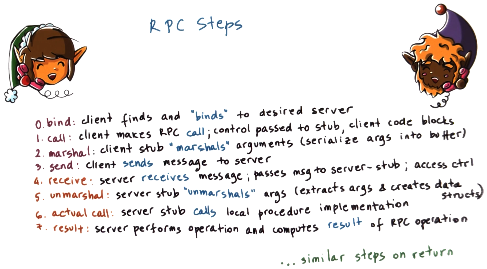

To generalize the example from the previous section, consider a summary of the steps involved in a remote procedure call (RPC) interaction between a client and a server.
  * 0. **server binding** - The client finds and discovers (i.e., "***binds***" to) the server that supports the desired functionality.
      * For connection-oriented protocols (e.g., TCP/IP) that require a connection to be established between the client and the server processes, the **connection** itself is established in this step.
  1. **client call** - The client makes the actual RPC call, i.e., control passes to the client stub, and the client code blocks.
  2. **marshal** - The client stub creates a data buffer which is populated with the values of the arguments that are passed to the procedure call. This process is called **marshalling** the arguments.
      * The arguments themselves may be located at arbitrary non-contiguous locations in the client process's address space, however, the PRC run-time must send a *contiguous* buffer to the sockets for transmission. Therefore, the marshalling process takes care of this, i.e., placing all of the arguments into a buffer that is passed to the sockets.
  3. **send** - Once the buffer is available, the RPC run-time sends the message to the server. The sending involves whatever **transmission protocol** (e.g., TCP, UDP, shared-memory based inter-process communication for a client and a server on the same machine, etc.) that both sides have agreed upon during the binding process.
  4. **receive** - When the data is subsequently transferred onto the server machine, it is received by the RPC run-time, and then all of the necessary checks are performed to determine the correct **server stub** to which the **message** must be passed. Additionally, certain **access control** checks can be included in this particular step.
  5. **unmarshal** - The server stub unmarshals the data, i.e., convert the incoming byte stream from the client (via the server-side receive buffers) and then extract the arguments and correspondingly create any necessary data structures to hold the values of those arguments.
  6. **actual call** - Once the arguments are allocated and set to the appropriate values, the actual procedure call can now be made, whereby the server stub calls the implementation of the procedure that is part of the server process itself.
  7. **result** - The server performs the RPC operation and computes its result, or the server may potentially conclude that some **error message** must be returned.

On return, a similar set of steps occurs: The result is passed to the server stub, and follows a similar reverse path in order to return the result back to the client.

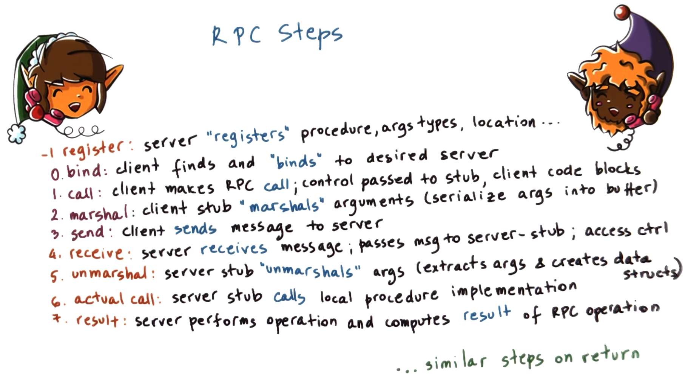

An additional step is required for this all to work. Prior to the client discovering the server for binding (i.e., step `0` in the previous figure), the server must "announce" the procedure(s) that it is capable of performing, i.e., argument types required for the procedure, the IP address and port number where it is located, and any other pertinent information required to discover the server in order for a client to bind to it. Therefore, the server must perform a **registration** step (denoted step `-1` in the figure shown above) prior to being bound by a client.

## 7. Interface Definition Language (IDL)

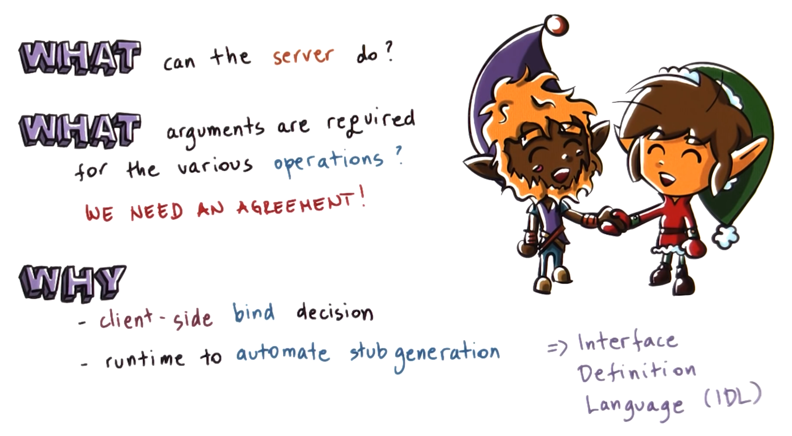

A key advantage of remote procedure calls (RPCs) is that the client and the server can be developed independently as separate applications; they can be completely independently processes written different developers, and can even be written in completely different programming languages.

However, in order for this to work correctly, there must be some type of **agreement** so that the server can explicitly indicate ***what*** **procedures** it is capable of performing, and ***what*** **arguments** are required for those procedures.

The reason this information is necessary is so that:
  * The client-side process can decide which particular server to bind.
  * The remote procedure call (RPC) run-time can incorporate certain tools to automate the process of generating the stub functionality.

Therefore, to address these needs, remote procedure call (RPC) systems rely on the use of **interface definition languages (IDLs)**, which serve as a **protocol** for how to express this ***agreement***.

## 8. Specifying an IDL

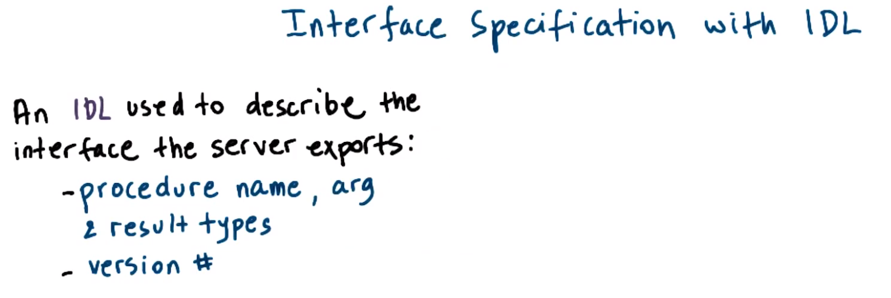

An **interface definition language (IDL)** is used to describe the **interface** that a particular server exports. At a minimum, this includes:
  * The **name** of the procedure
  * The **types** of the various arguments used by the procedure, as well as of the results

Therefore, an interface definition language (IDL) is analogous to a function prototype definition.

Another important piece of information to include in an interface definition language (IDL) is a **version number**.
  * If there are multiple servers performing the *same* operation/procedure, the version number helps the client to identify which server is the most current (i.e., which has the most-current implementation of the procedure).
  * Furthermore, a version number is useful when it is necessary to perform upgrades in the system. For instance, it may not be necessary to update *all* of the clients and *all* of the servers simultaneously, but rather there may be **incremental upgrades** performed; therefore, by using a version number, the clients will be able to identify the server which supports exactly the type of procedure implementation that is compatible with the rest of the client program.

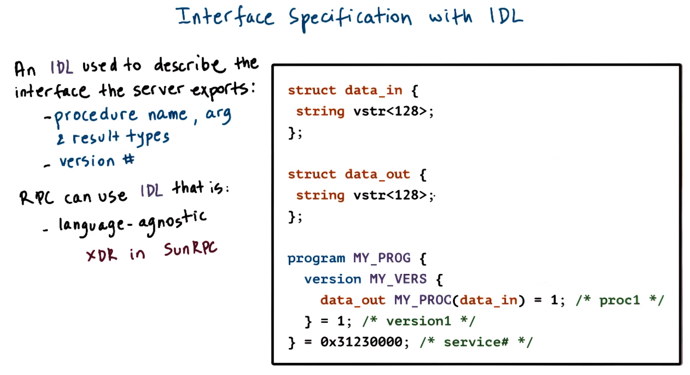

The remote procedure call (RPC) system can use an interface definition language (IDL) that is completely **language-agnostic** with respect to the programming languages that are otherwise used to write the client and the server processes.

**Sun RPC**, which is an example of a remote procedure call (RPC) system that will be examined more closely later in this lecture, uses an interface definition language (IDL) that is called **external data representation (XDR)**, as in the figure shown above. XDR is a completely different specification from any other existing programming language.
  * ***N.B.*** A more comprehensive example using Sun RPC XDR is shown [here](http://web.cs.wpi.edu/~rek/DCS/D04/SunRPC.html).

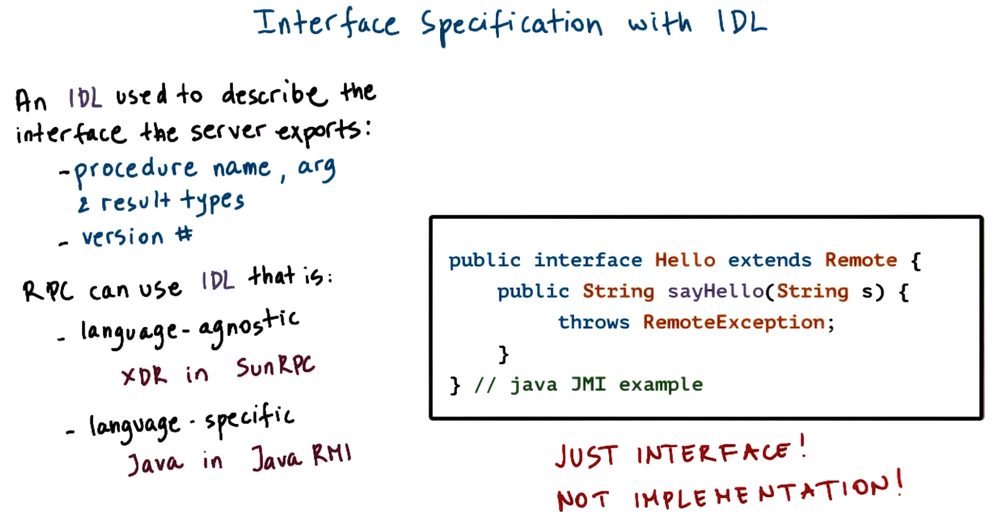

Conversely, the opposite of a language-agnostic interface definition language (IDL) selection for describing the interfaces is a **language-specific** interface definition language (IDL). For instance, the **Java RMI**, which is the Java equivalent of a remote procedure call (RPC), uses the actual Java programming language to specify the interfaces that the RMI server is exporting, as in the figure shown above.

In such a scenario (e.g., Java RMI), the programmer who is already familiar with the language in question (e.g., Java) need not learn yet another set of rules for defining data structures, procedures, etc. in another language, but rather can use what is already familiar.

However, if the user is otherwise unfamiliar with the language in question, then they still must learn something anyways, and therefore the goal of a language such as XDR is to provide as simple of an interface as possible for such user.

To reiterate, whatever choice is made for the interface definition language (IDL), this is used ***only*** for the specification of the **interface** that the server will export; the interface, specified with whichever interface definition language (IDL) that is ultimately selected, will be used by the remote procedure call (RPC) system for tasks such as automating the stub-generation process, generating the marshalling process, and generating information that is used in the service discover process. However, the interface definition language (IDL) is ***not*** an implementation of the service itself.

## 9. Marshalling

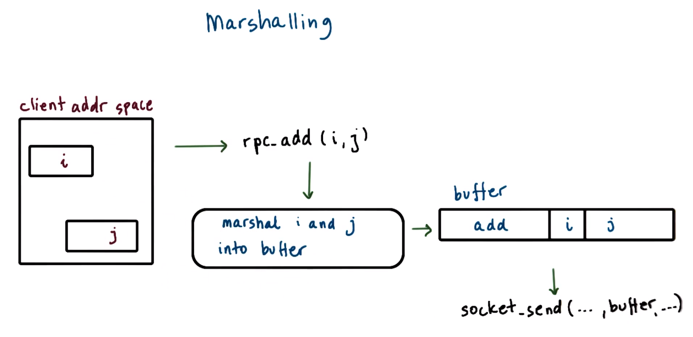

To understand marshalling, consider again the example procedure `add()`, as in the figure shown above.

The variables `i` and `j` are located somewhere in the memory of the client process's address space. Since these are two separate, unrelated variables, there are no guarantees that they are located adjacently/contiguously in the address space.

When the client makes the call `rpc_add(i, j)`, the ultimate target in the remote procedure call (RPC) run-time is a message stored in the buffer `buffer`, which is further sent via socket API (i.e., `socket_send()`) to the remote server. `buffer` itself must be some contiguous region of bytes that includes the arguments `i` and `j` as well as information about the actual procedure `rpc_add()` (i.e., an identifier for the procedure itself), in order to inform the server of what must be performed (via corresponding interpretation of the bytes contained in the packet).

`buffer` is generated by the marshalling code, which copies the variables `i` and `j` into `buffer`. Furthermore, `buffer` serializes these arguments of `rpc_add()` into a ***contiguous*** memory location in `buffer`.

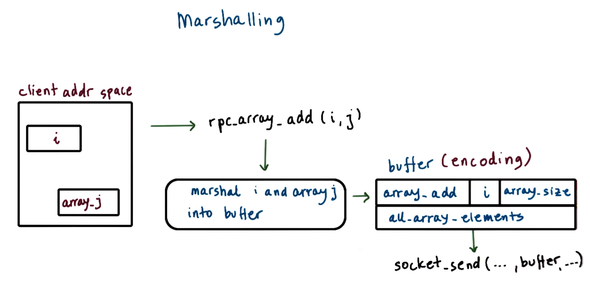

As a less trivial example, consider now the scenario of an array adding procedure `rpc_array_add()`, as in the figure shown above.

`rpc_array_add()` takes as arguments the integer `i` and array `array_j`, and adds `i` to each element of `array_j`. As before, the marshalling code serializes the arguments `i` and `array_j`.

Serializing `array_j` can be done in various ways.
  * As an example, first, the size of the array `array_size` is placed in `buffer`, and then all of the array elements (i.e., `all_array_elements`) are placed immediately after `array_size`. Then, as a result of the marshalling process, `buffer` will contain the specified procedure `array_add`, the first argument `i`, and then the second argument `array_j` (comprised of `array_size` and `all_array_elements`).
  * Another type of agreement that would be sensible is to simply list all of the array elements, terminated by some special character to denote the end of the array (e.g., `\0` terminates a C-style string).

In either case, it is apparent that the marshalling process must **encode** the data into some ***agreed upon format***, in order for the buffer/packet(s) to be correctly interpreted on the receiving side (i.e., the server). In this manner, the **encoding** specifies the data layout when it is serialized to the byte stream, so that any observer can interpret the bytes sensibly.

## 10. Unmarshalling

In contrast to the previous section, the unmarshalling code takes the `buffer` provided by the network protocol, and then based on the procedure descriptor (e.g., `array_add`) and the known data types required for that procedure (e.g., integer `i` and an array) the unmarshalling code parses the rest of the byte stream from `buffer`. The correct number of bytes are extracted, which are then used to initialize data structures corresponding to the argument types.

As a result of the unmarshalling process, `i` and `array_j` are allocated somewhere in the server process's address space and are initialized to values that correspond to whatever was placed in the message (i.e., via `buffer`) that was received by the server.

To reiterate, marshalling and unmarshalling routines are not something that the developer typically explicitly writes, but rather the remote procedure call (RPC) systems typically include a special **compiler** which takes an interface definition language (IDL) **specification** (which describes the procedure prototype and the data types for the arguments) and uses it to generate the marshalling and unmarshalling routines used by the respective stubs to perform the corresponding translations. Furthermore, these routines are also responsible for generating the appropriate encoding-related actions (e.g., how to represent an array in the encoded byte stream, converting an integer from one endian format to another, etc.).

Once the interface definition language (IDL) is compiled and all of the code is generated to provide the implementation for the marshalling and unmarshalling routines, all that the developer must do is to use that code and link it with the program files for the server and/or client processes when generating the respective executables.

## 11. Binding and Registry

### **Binding**

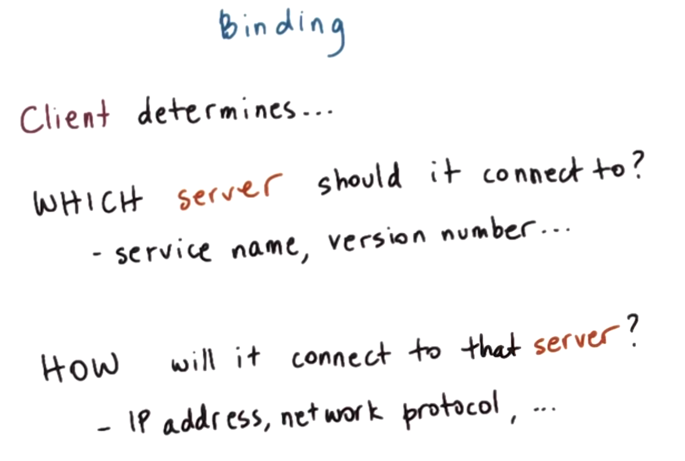

**Binding** is a mechanism used by the client to determine ***which*** server it should connect to, based on:
  * The name of the service
  * The version number of the service
  * etc.

Furthermore, binding is used by the client to determine ***how*** to establish a connection to the particular server in question, based on:
  * The IP address
  * The network protocol
  * etc.

### **Registry**

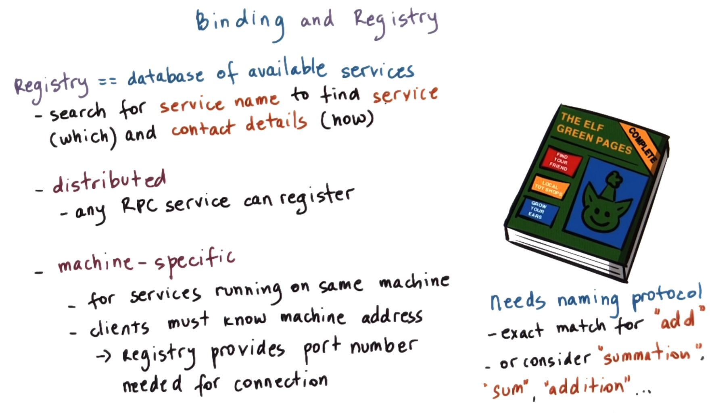

In order to support binding, the system software must support some form of a **database** containing *all* of the available services; this database is often called a **registry**. The registry is analogous to the "Yellow Pages" used to search for a required **service name** based on the best match for the protocol, the version number, the proximity, etc. The corresponding match provides the **contact details** for that particular service (e.g., the IP address, the port number, the protocol to use, etc.).

At one extreme, this registry can be some **distributed** online service (e.g., `rpcregistry.com`) that *any* remote procedure call (RPC) server can register with. In this case, the clients have a well-known contact point for finding information regarding the services they require.

At the other extreme, the registry can be a **dedicated process** that runs on *every* single server machine, and is only aware of those services that run on this particular machine. Correspondingly, the clients must know the particular machine's address to request a particular service. Furthermore, in this case, the registry still provides other useful information to the client (e.g., the prot number required for connection to the server).

Regardless of how the registry is actually implemented, it requires some type of **naming protocol** (i.e., naming conventions).
  * For instance, a simple approach could require the client to specify the exact name (e.g., `add`) and version number for the requested service.
  * Alternatively, a more sophisticated naming scheme could consider the fact that words such as `summation`, `sum`, `addition`, etc. are likely equivalent to the word `add`, and therefore any service that uses any of these names is a fair candidate to be considered when attempting to find the best match.
    * ***N.B.*** Allowing for this type of "reasoning" requires support for ontologies and/or other cognitive learning methods, which is beyond the scope of this course.

## 12. Visual Metaphor
