# P4L2: Distributed File Systems

## 1. Preview

TODO

Reference Paper: Nelson et al. "*Caching in the Sprite Network File System*" (1988).

## 2. Visual Metaphor

<center>
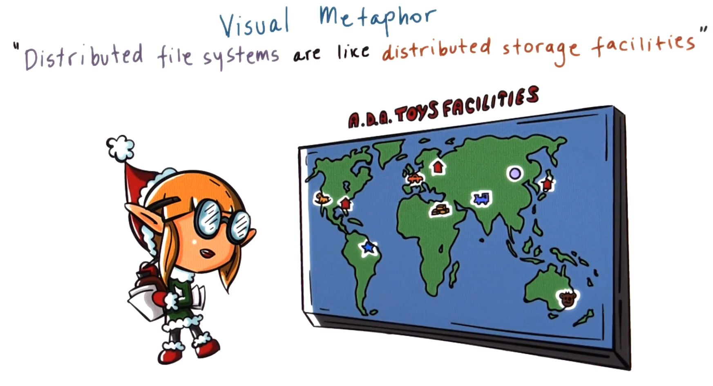
</center>

**Distributed file systems** are like distributed storage facilities containing toy parts for a toy shop.

| Characteristic | Distributed Storage Facilities for Toy Parts | Distributed File System |
| :--: | :--: | :--: |
| Accessed via well-defined interface | The toy shop manager reviews storage reports in order to make decisions without having to leave the toy shop in order to directly visit off-site storage facilities | Distributed file systems are accessed via higher level, well-defined interfaces (e.g., the **virtual file system (VFS)** discussed previously [cf. P3L5]), which allows the operating system to take advantage of multiple types of storage devices/machines regardless of where they are (physically) located |
| Focus on consistent state | Distributed storage facilities constantly update their inventories to provide consistent information about the parts that they can deliver, in order to enable the toy shop manager and other workers to accurately determine the inventory levels, delivery times, etc. | Distributed file systems must track state, file updates, cache coherence, etc. when a file is updated by any one of its clients |
| Mixed distribution models are supported | Distributed storage facilities can be configured in different ways (e.g., only storage, both storage and processing services, specialized for specific toys and/or parts, etc.) | A distributed file system can be configured using various different **distribution models** (e.g., replicated vs. partitioned, peer-like systems, etc.) |

## 3. Distributed File Systems

TODO

<center>
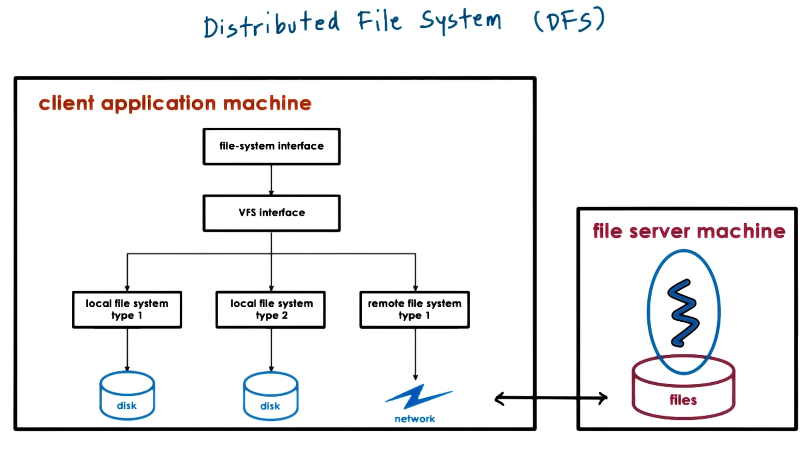
</center>

## 4. DFS Models

TODO

<center>
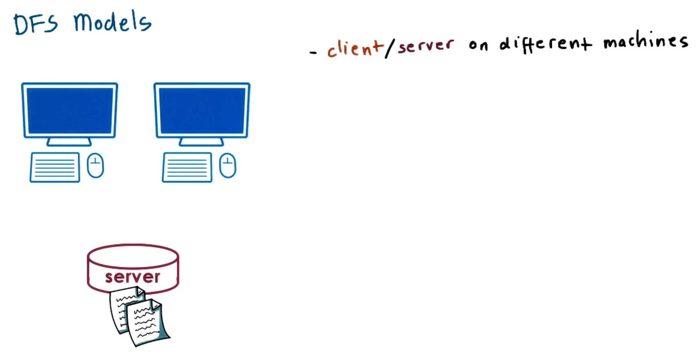
</center>

<center>
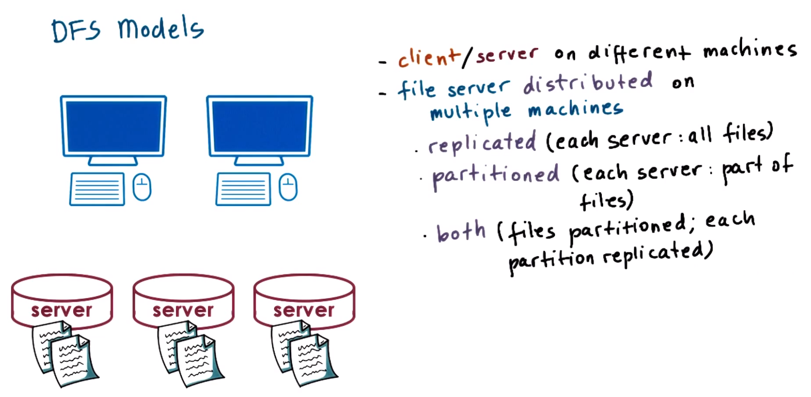
</center>

<center>
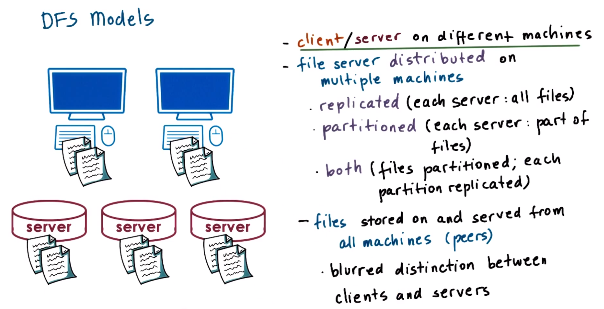
</center>

## 5. Remote File Service: Extremes

TODO

<center>
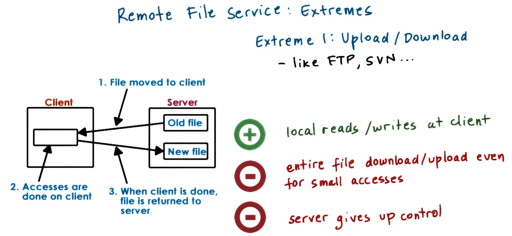
</center>

<center>
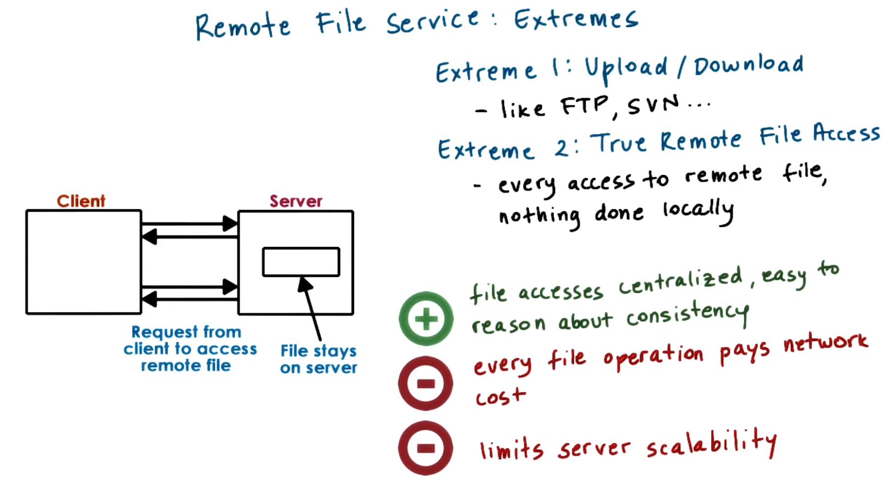
</center>

## 6. Remote File Service: A Compromise

TODO

<center>
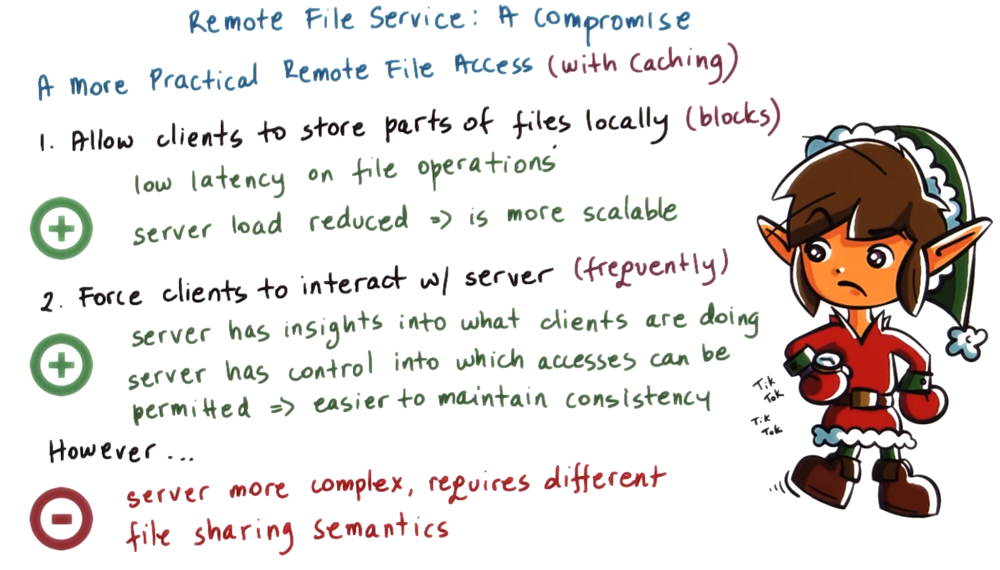
</center>

## 7. Stateless vs. Stateful File Server

TODO

<center>
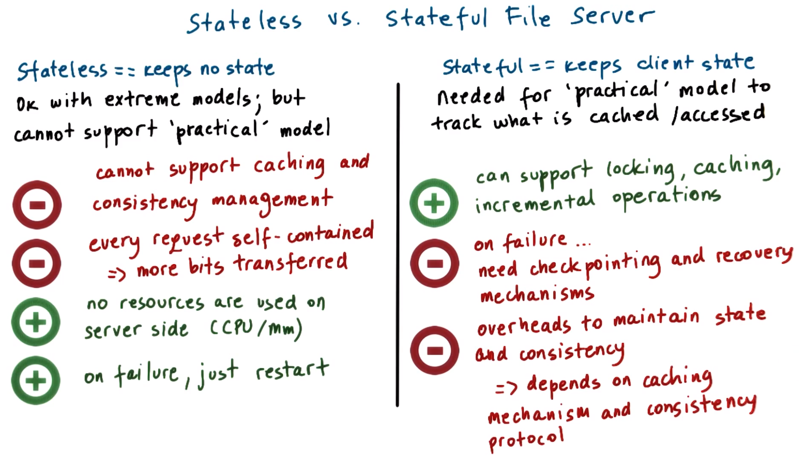
</center>

## 8. Caching State in a DFS

<center>
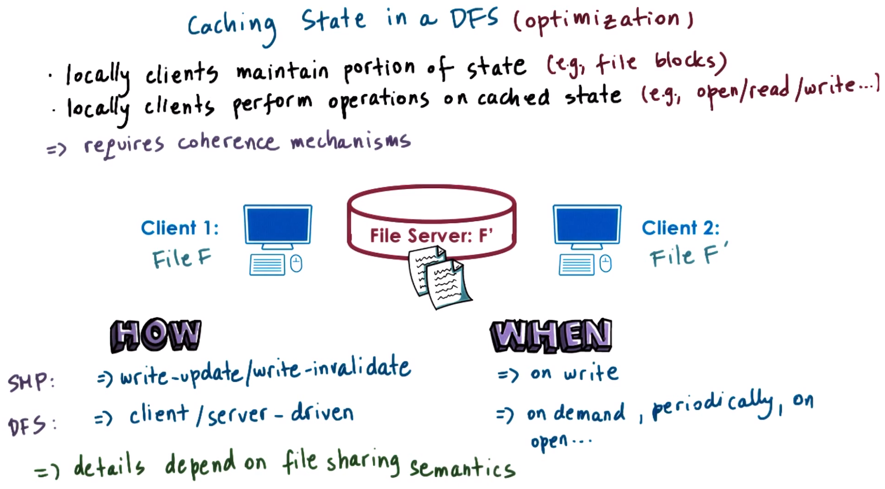
</center>

## 9. File Caching Quiz and Answers

Where can **files** or **file blocks** be cached in a distributed file system (DFS) with a **single server** and **many clients**?
  * This caching can occur in several locations, including:
    * As the files or file blocks are brought in from the server to the clients, they can be present in the **clients' memory** as part of their **buffer cache**. This is what regular (i.e., non-distributed) file systems do when retrieving files from the local disk.
    * Clients can also store cache components on their their **local client storage devices** (e.g., hard disk drives, solid state drives, etc.). In this case, it may be generally faster to retrieve portions of the file from the local storage rather than retrieval over the network from the remote file system.
    * Finally, the file blocks can also be cached on the **server-side**, in the **buffer cache** of the file server machine's memory. However, the usefulness of this approach (i.e., the hit rate on the buffer cache) will depend on how many clients are accessing the server simultaneously, as well as how their requests are interleaved. If there is high request interleaving then the buffer cache may prove to not be particularly useful, due to a loss of locality among the accesses originating from the many clients.

## 10. File Sharing Semantics on a DFS

<center>
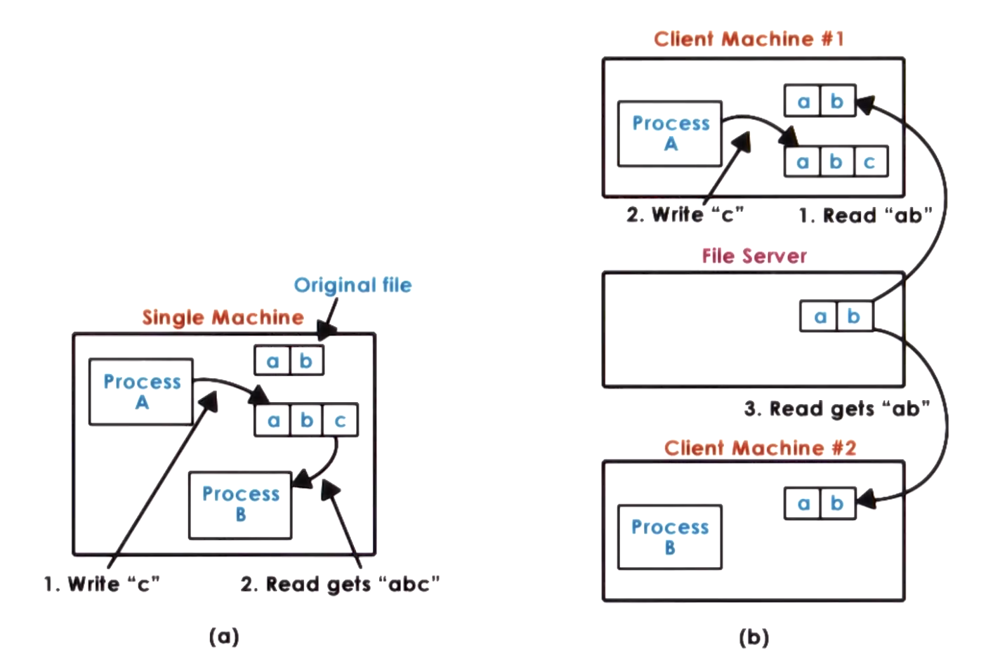
</center>

<center>

</center>

## 11. DFS Data Structure Quiz and Answers

Consider a **distributed file system (DFS)** that is implemented via a **server-driven mechanism** and with **session semantics**. Given this design, which of the following items should be ***included*** in the **per-file data structures** maintained by the **server**? (Select all that apply.)
  * readers
    * `APPLIES`
  * current writer
    * `DOES NOT APPLY`
  * current writers
    * `APPLIES`
  * version number
    * `APPLIES`

***N.B.*** Here, a "server-driven mechanism" means that the server pushes any invalidations to the client, and "session semantics" means that any changes made to a file will become visible when the file is closed (i.e., when the session is closed) and when a subsequent client opens the file (thereby starting a new session).

**Explanation**: Since it is possible for overlapping sessions to see *different* versions of the file, it is possible to have concurrent writers. Session semantics does not specify what occurs when *all* of these writers close the same file (e.g., one of the modified versions becomes the new version of the file, modifications are merged, an error is raised back to the client for conflict resolution, etc.), therefore sensible information to track by the server on a per-file basis in such a distributed file system include the current readers of the system, as well as all of the current concurrent writers. It is also sensible to track the version number of the file to track state between the clients and the server (i.e., older vs. newer/newest version of the file).

## 12. File vs. Directory Service

TODO

<center>
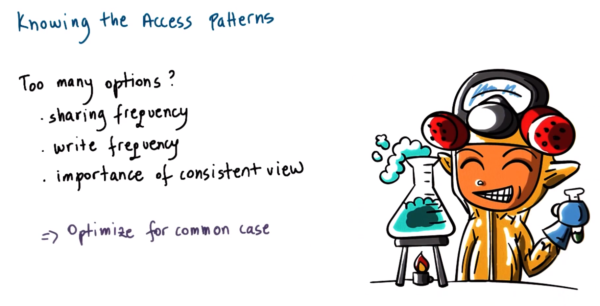
</center>

<center>
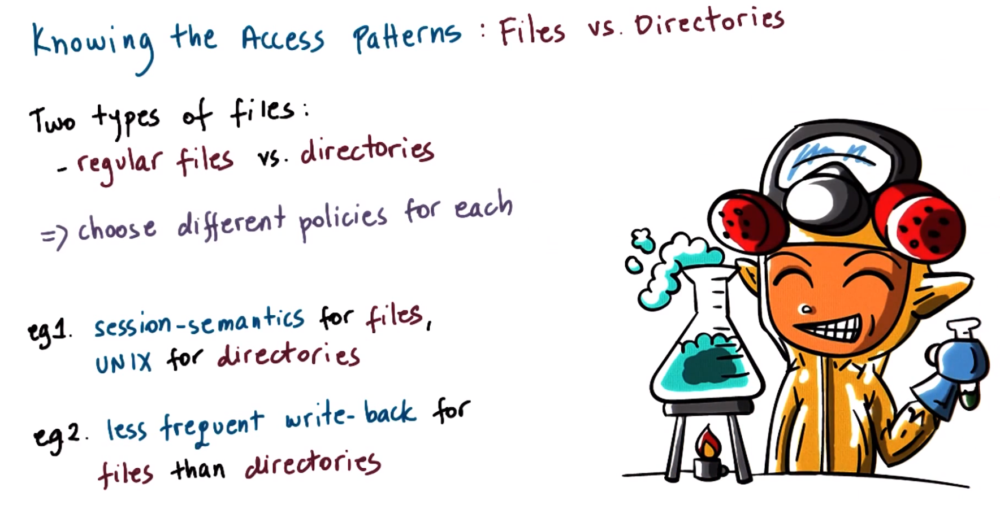
</center>

## 13. Replication and Partitioning

TODO

<center>
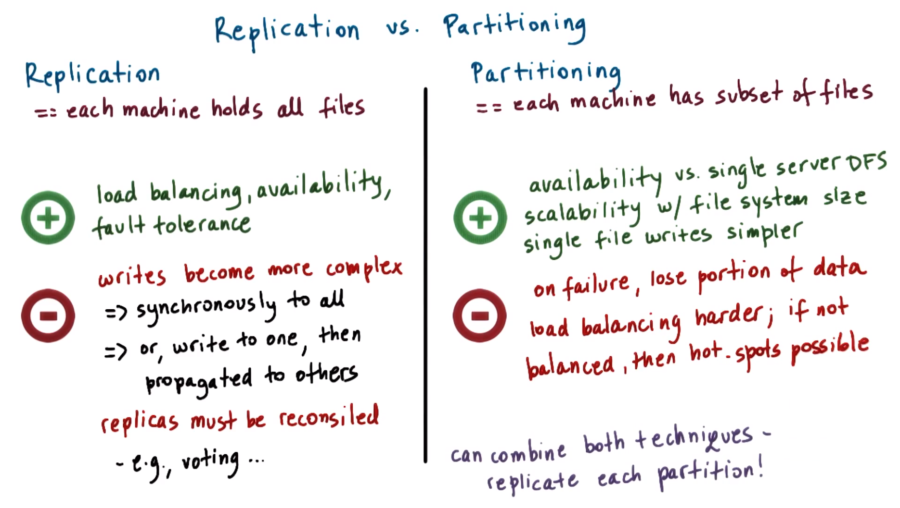
</center>

## 14. Replication vs. Partitioning Quiz and Answers

Consider **server machines** that hold `100` files each. Using `3` such machines, a distributed file system (DFS) can be configured using **replication** or **partitioning**.

How many **total files** can be stored in the replicated vs. the partitioned DFS?
  * Replicated DFS
    * `100` - By inspection, each machine holds the same files.
  * Partitioned DFS
    * `300` - Each machine can hold `100` files, and there are `3` such machines. Therefore, all else qual, the partitioned DFS can hold more files.

What is the **percentage** of the total files that are lost if one machine fails in the replicate vs. the partitioned DFS? (Round to the nearest percentage.)
  * Replicated DFS
    * `0` - By inspection, redundancy provided by the replicated DFS ensures that the remaining two machines maintain integrity of the files.
  * Partitioned DFS
    * `33%` - A third of the files are lost, since the files are distributed across three machines in the partitioned DFS. Therefore, there is a trade-off in poorer fault-tolerance with a partitioned DFS.

These comparisons demonstrate why generally a ***mixed*** approach (i.e., combining replicated DFS ***and*** partitioned DFS) provides greater flexibility with respect to both size and resiliency.

***Reference Equations***:
  * **total files formula**
```
files_stored_per_machine * number_of_machines
```
  * **percentage lost formula**
```
(files_lost_per_single_failure / total_files) * 100%
```

## 15. Networking File System (NFS) Design

TODO

<center>
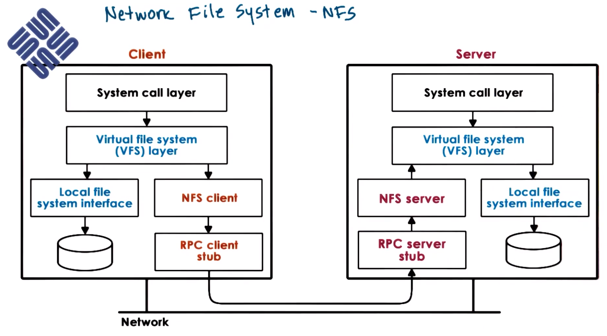
</center>

<center>
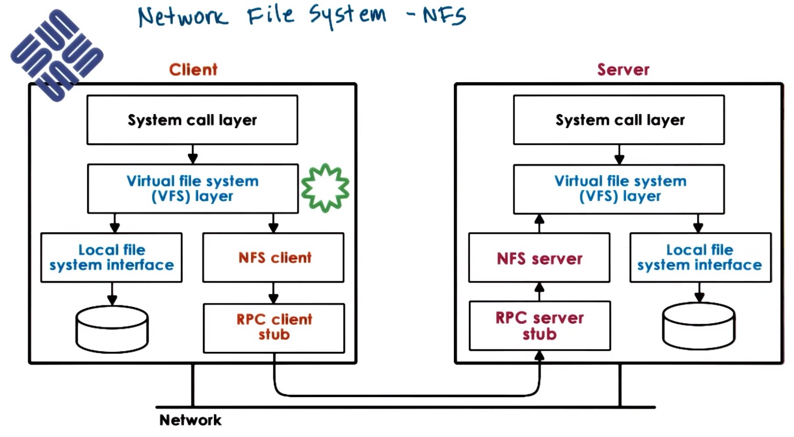
</center>

<center>
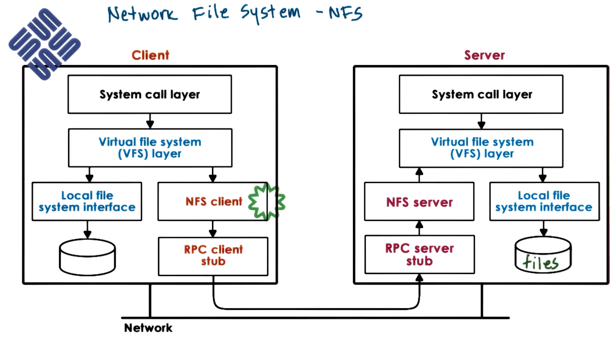
</center>

<center>
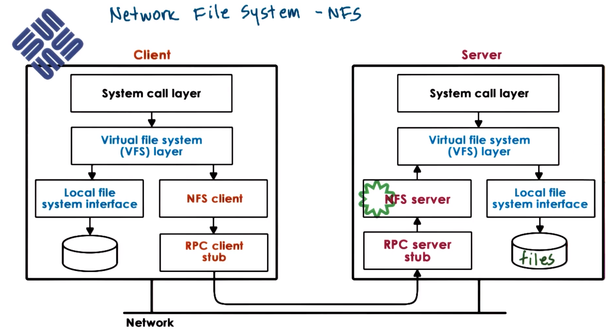
</center>

<center>
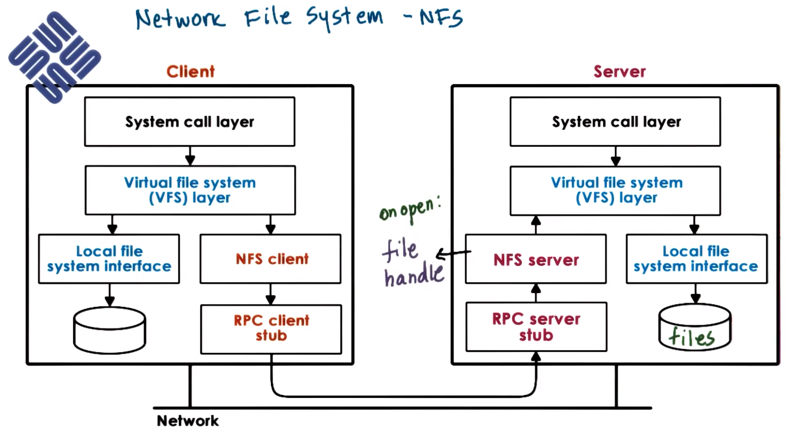
</center>

<center>
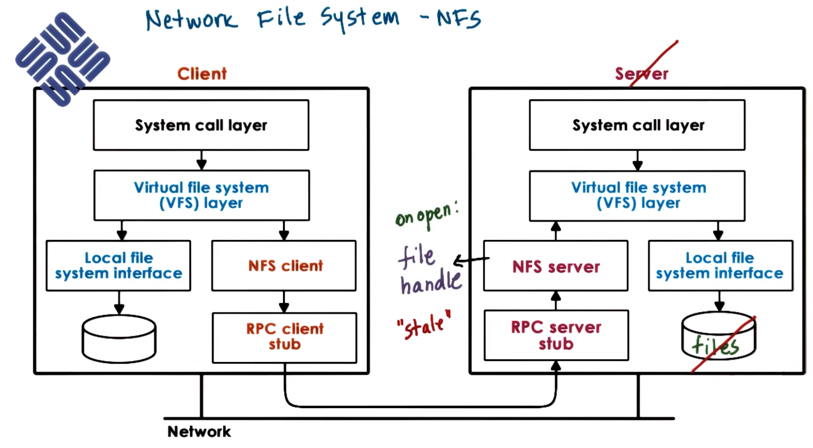
</center>

<center>

</center>

## 16. NFS File Handle Quiz and Answers

In the previous section, it is indicated that a **file handle** can become "**stale**". What does this mean? (Select the best option.)
  * The file is outdated
    * `INCORRECT` - This implies that the file has been written by another entity, since a particular client successfully acquired the file handle in the first place. Therefore, this may be a consistency-related issue, but this does not pertain to returning a *stale* file handle.
  * The remote server is not responding
    * `INCORRECT` - This is a remote procedure call (RPC) layer error. If the server is not responding, this is not necessarily related to the actual ability to access a file at some point in time on the server machine; instead, this could be due to a network issue.
  * The file on the remote server has been removed
    * `CORRECT`
  * The file has been open for too long
    * `INCORRECT` - Such a "timeout" issue does not necessarily pertain to "staleness" of the file handle itself.
      * *N.B.* Some distributed file systems provide specific time windows over which a client is allowed to keep a file open, however, this is not a particular characteristic of the Network File System (NFS).

## 17. NFS Versions

TODO

<center>
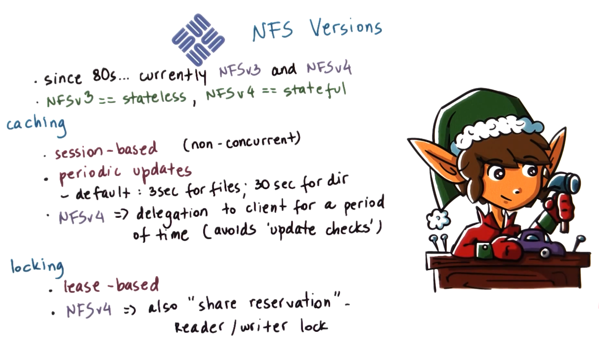
</center>

## 18. NFS Cache Consistency Quiz and Answers

Which of the following **file-sharing semantics** are supported by Network File System (NFS) and its **cache consistency mechanisms**? (Select the correct option.)
  * UNIX
    * `INCORRECT` - NFS is a distributed file system, therefore there is no guarantee that update to a file(s) is immediately visible.
  * session
    * `INCORRECT`
  * periodic
    * `INCORRECT`
  * immutable
    * `INCORRECT` - NFS allows for file modification.
  * neither
    * `CORRECT`

***Explanation***: In principle, NFS attempts to perform session semantics (in the sense that updates made to a file are flushed back to the server when the file is closed, and in that for a file open operation the client can check with the server to determine whether the file has been updated in order to make a corresponding update to the cached file), however, additionally the NFS can be configured to have the client and the server perform periodic checks for intermediate updates made to a file *during* the session itself. Furthermore, the frequency with which this occurs can also be configured (including completely disabled); therefore, NFS always has session semantics behavior, however it additionally can have periodic semantics, so it has **neither** purely session nor purely periodic file-sharing semantics by default (but rather depends on its specific configuration).

## 19. Sprite Distributed File System

TODO

<center>
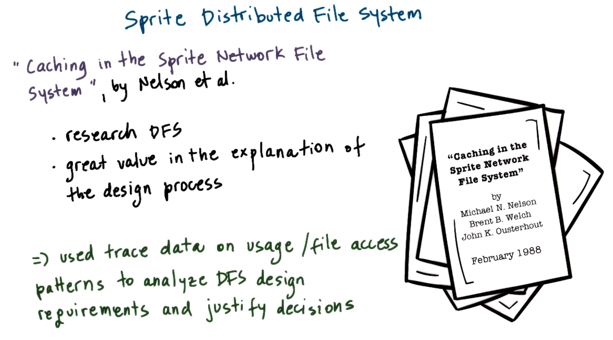
</center>

## 20. Sprite DFS Access Pattern Analysis

TODO

<center>
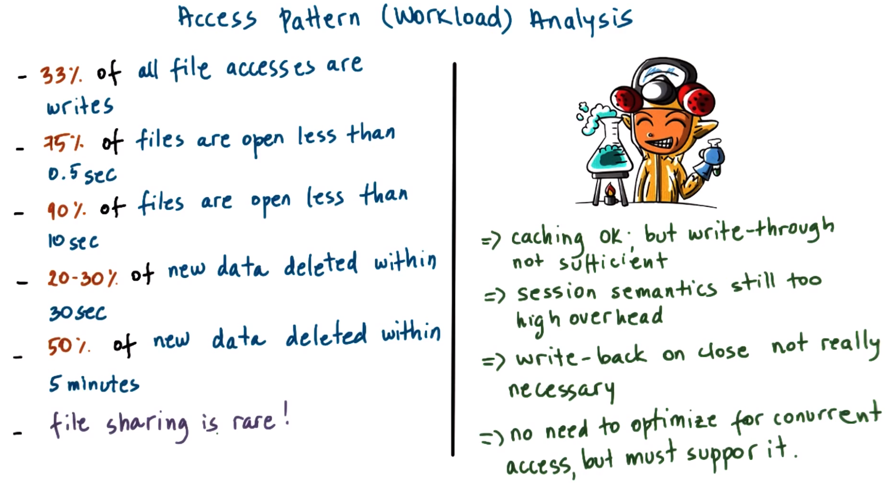
</center>

## 21. Sprite DFS from Analysis to Design

TODO

<center>
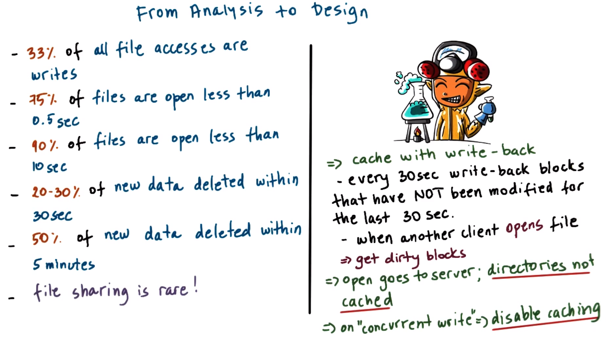
</center>

<center>
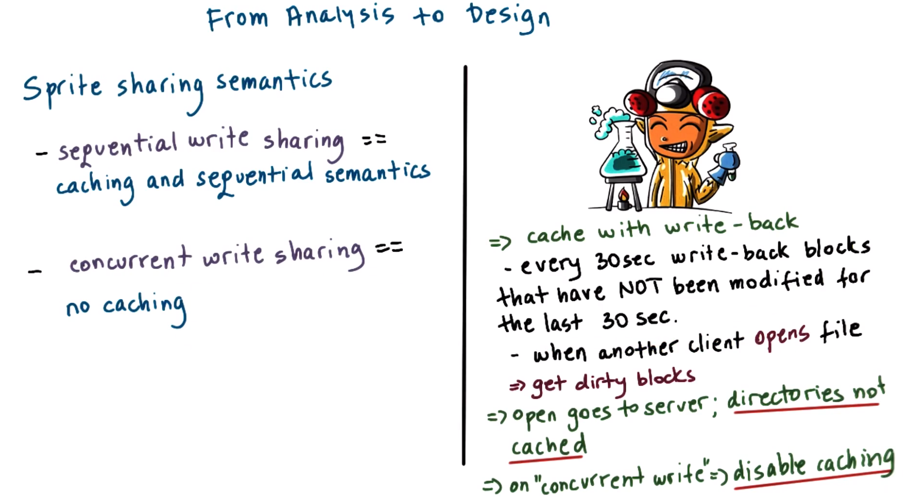
</center>

## 22. File Access Operations in Sprite

TODO

<center>
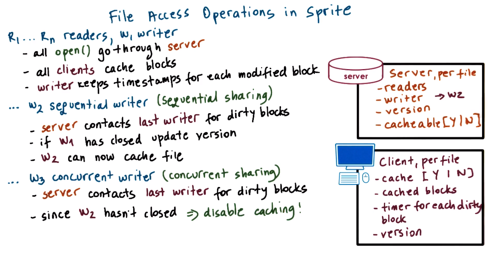
</center>

## 23. Lesson Summary

TODO
