# P4L4: Datacenter Technologies

## 1. Preview

TODO

## 2. Datacenter Quiz and Answers

How many datacenters are there worldwide as of 2011?
  * `510,000`

How much total area is required to house all of the world's datacenters as of 2011?
  * `285.5 million ft`<sup>`2`</sup>

***Reference***: [*How Many Data Centers?*](https://www.datacenterknowledge.com/archives/2011/12/14/how-many-data-centers-emerson-says-500000/)

## 3. Internet Services

TODO

<center>
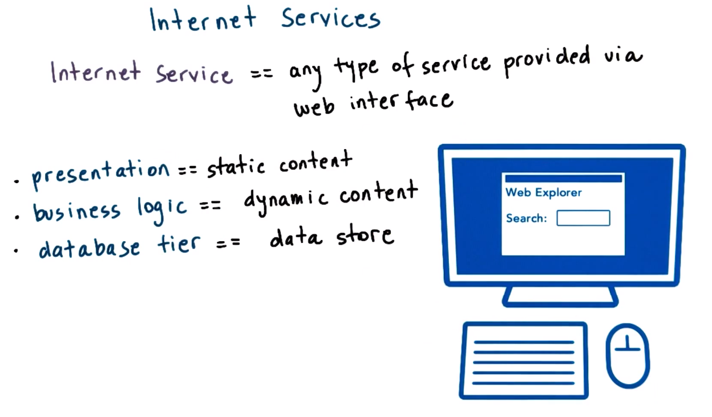
</center>

<center>
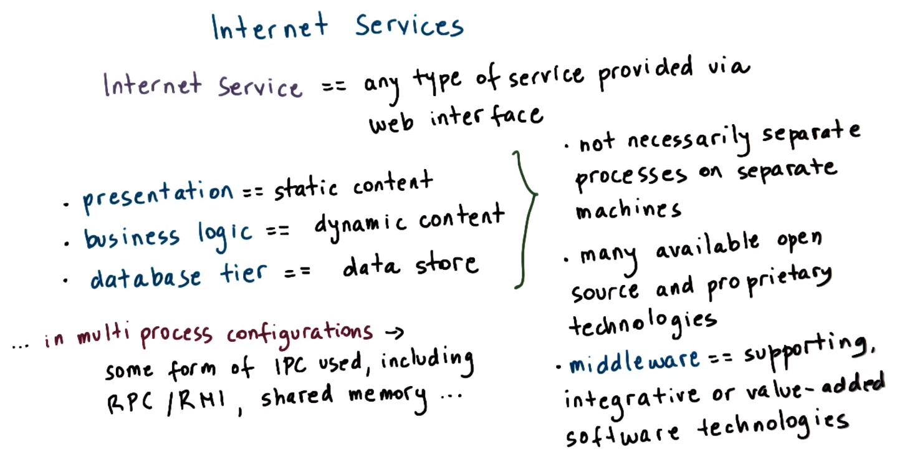
</center>

## 4-6. Internet Service Architectures

### **4. Introduction**

TODO

<center>
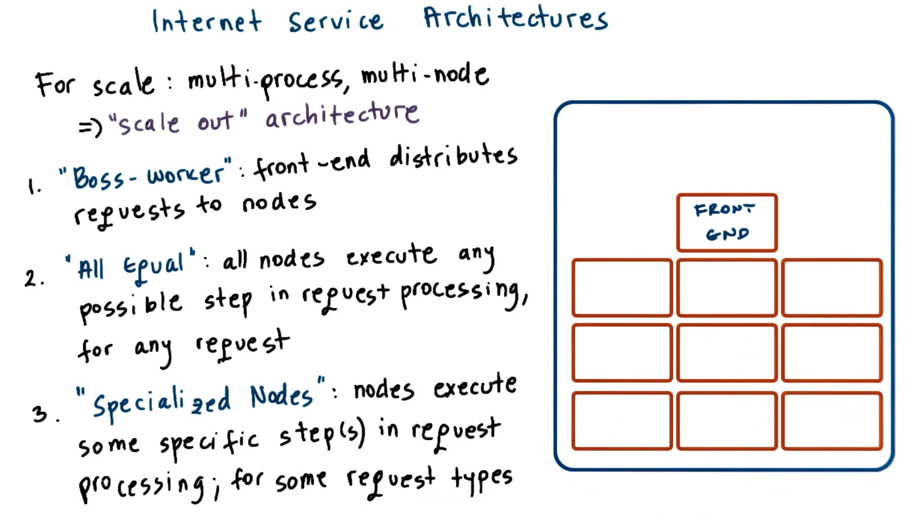
</center>

<center>
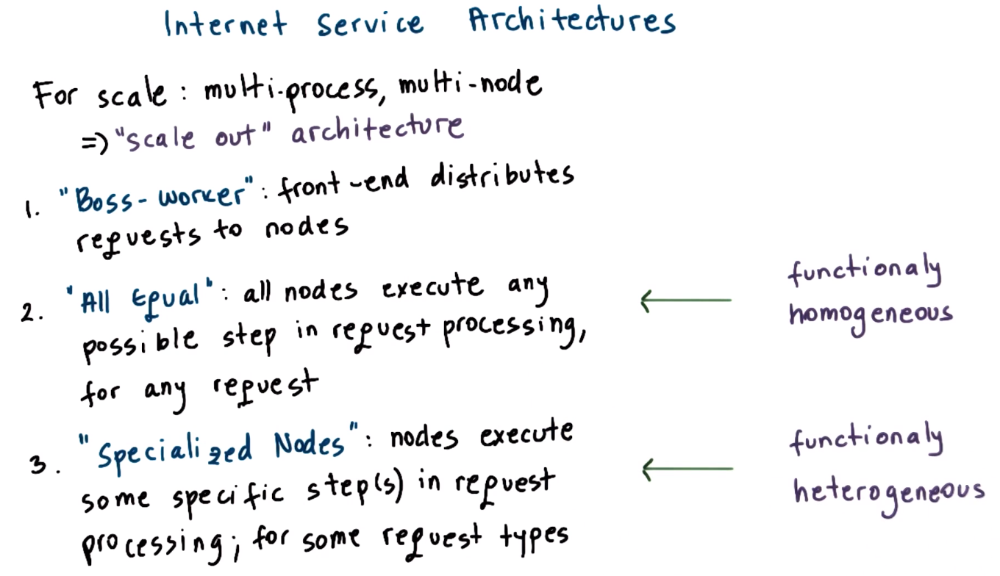
</center>

### **5. Homogeneous Architectures**

TODO

<center>
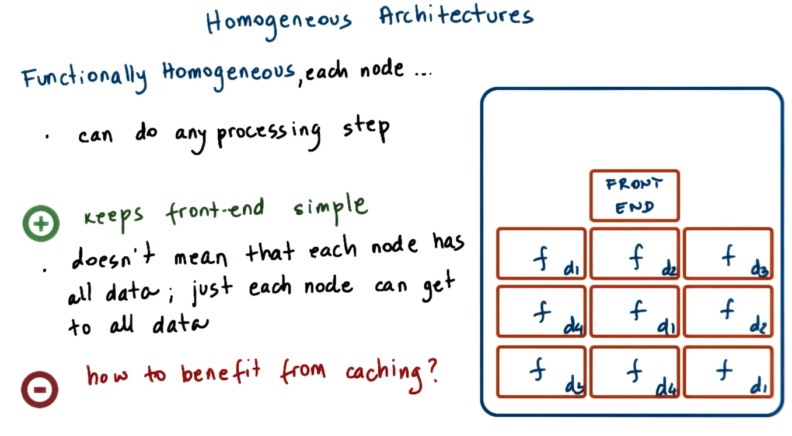
</center>

### **6. Heterogeneous Architectures**

TODO

<center>
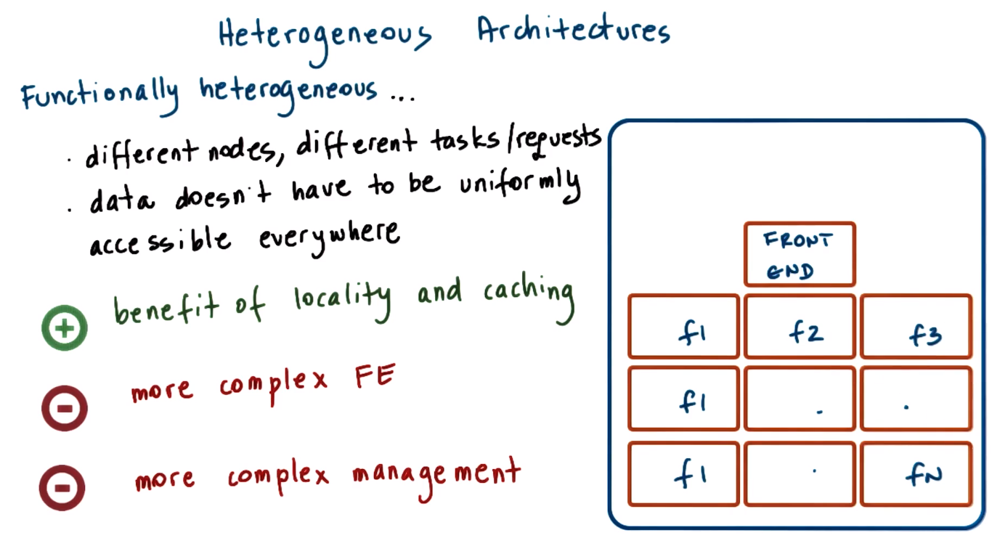
</center>

## 7. Homogeneous Design Quiz and Answers

Consider a **toy shop** where every worker knows how to build any toy (**homogeneous architecture**). If the rate of arriving orders begins to increase, the homogeneous architecture is kept balanced by:
  * Adding more workers (processes), more workbenches (servers), more tools and parts (storage), etc.
    * The bottom line is that the management is fairly simple (however, it still takes time to achieve this).

## 8. Heterogeneous Design Quiz and Answers

Consider a **toy shop** where every worker knows how to build a specific toy (**heterogeneous architecture**). If the rate of arriving orders begins to increase, the heterogeneous architecture is kept balanced by:
  * Profiling what kinds of toys are in demand and what kinds of resources and expertise those toys require, as well as adding more of the appropriate types of workers, workbenches, and parts accordingly.
    * The bottom line is that management of these systems is much more complex compared to the requirements of a comparable homogeneous architecture.

***Reference***: Brewer "*Lessons from Giant-Scale Services*" (2001).
  * This is a popular reference which discusses the design space of such large-scale Internet services, which also discusses some of the trade-offs associated with choices for data replication vs. partitioning, as discussed previously (cf. P4L2 and P4L3).

## 9. Scale Out Limitations Quiz and Answers

Consider a **toy shop** where every worker knows how to build any toy (**homogeneous architecture**). As the rate of arriving orders begins to increase, the toy shop manager proceeds to **scale out** (i.e., adding workers, workbenches, parts, etc.). This will work until the toy shop manager...
  * Can no longer manage all of the resources
  * Can no longer physically fit more parts and staff in the toy shop
  * Cannot find shops to outsource to (i.e., the toy shop only trusts its own workers)

***N.B.*** These types of limits similarly exist in the context of Internet services as well, e.g.,:
  * There may be a limit to the physical size of the datacenter relative to the amount of resources that can be placed there.
  * Given the complexity of the management processes, there may be limits as to how many different things can be effectively managed.
  * The ability to run custom software stacks (e.g., operating systems, software services, etc.) may be limited.
  * etc.

Therefore, in order to address these challenges, **cloud computing** has emerged as a solution to address some of these limitations regarding the scale which can be supported with existing Internet services solutions.

## 10. Cloud Computing Poster Child: Animoto

TODO

<center>
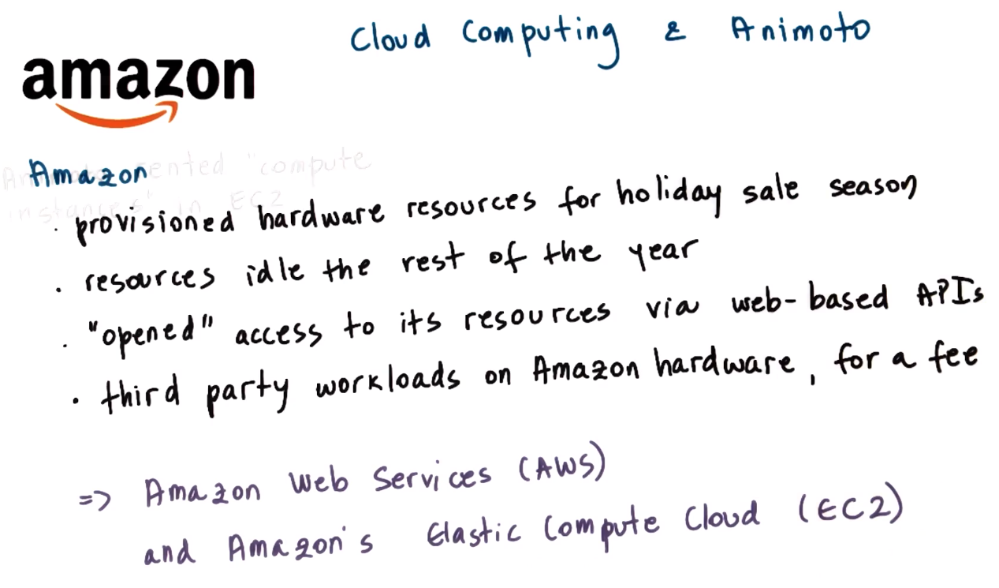
</center>

<center>
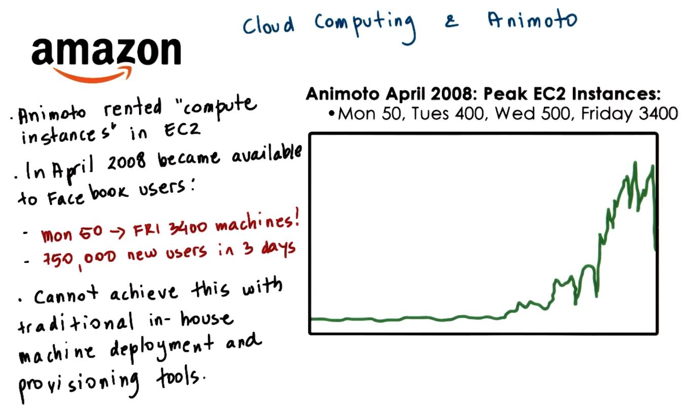
</center>

## 11. Cloud Computing Requirements

TODO

<center>
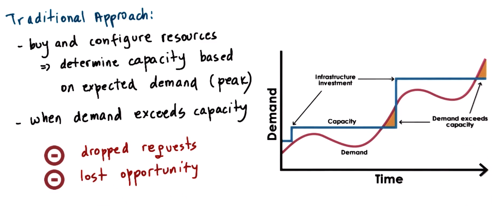
</center>

<center>
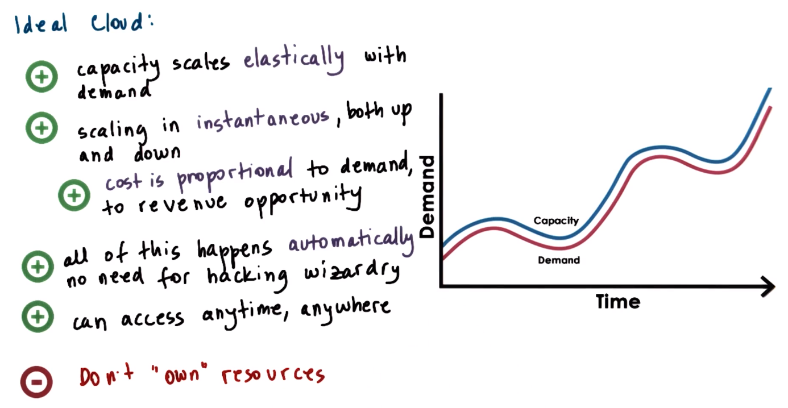
</center>

<center>
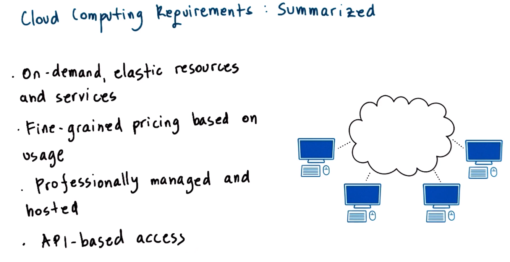
</center>

## 12. Cloud Computing Overview

TODO

<center>
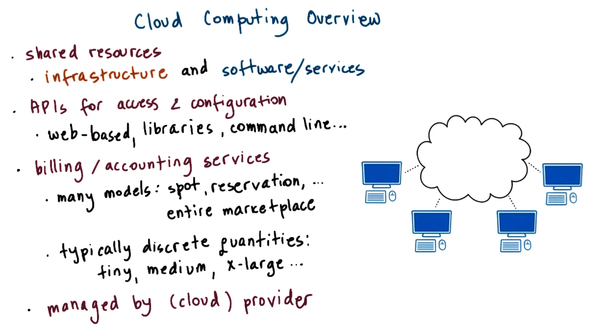
</center>

## 13. Why Does Cloud Computing Work?

TODO

<center>
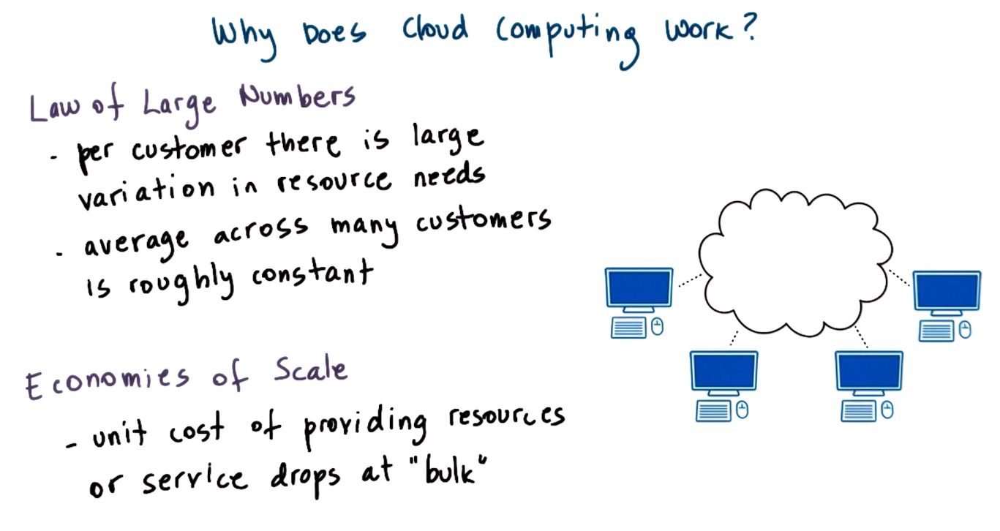
</center>

## 14. Cloud Computing Vision

TODO

<center>
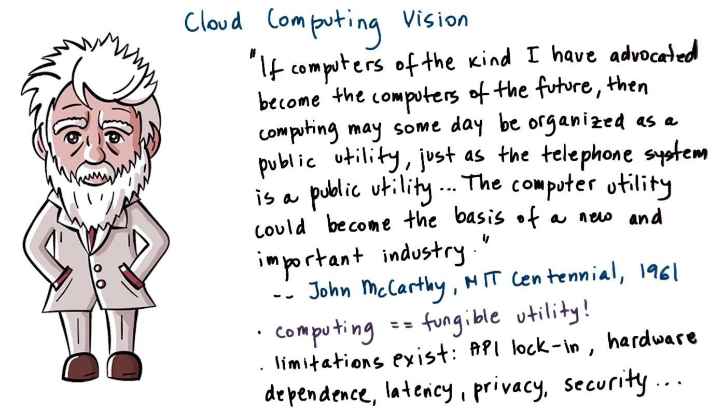
</center>

## 15. Cloud Computing Definitions Quiz and Answers

The following is a short excerpt from the documents of the National Institute of Standards and Technology (NIST) dated Oct 25, 2011 giving a definition of **cloud computing**:

> "*Cloud computing is a model for enabling **ubiquitous**, convenient, **on-demand network access** to a **shared pool** of configurable computing resources (e.g., network, servers, etc.) that can be **rapidly provisioned** and released with **minimal management** effort or service provider interactions.*"

Match the ***bolded*** phrases with the following categories based on the cloud computing requirement they best describe. (Leave blank if `none`.)
  * elastic resources
    * `on-demand network access`, `shared pool of resources`, `rapidly provisioned`
  * fine-grained pricing
    * (`none`)
  * professionally managed
    * `minimal management`
  * API-based
    * `ubiquitous`

## 16. Cloud Deployment Models

TODO

<center>
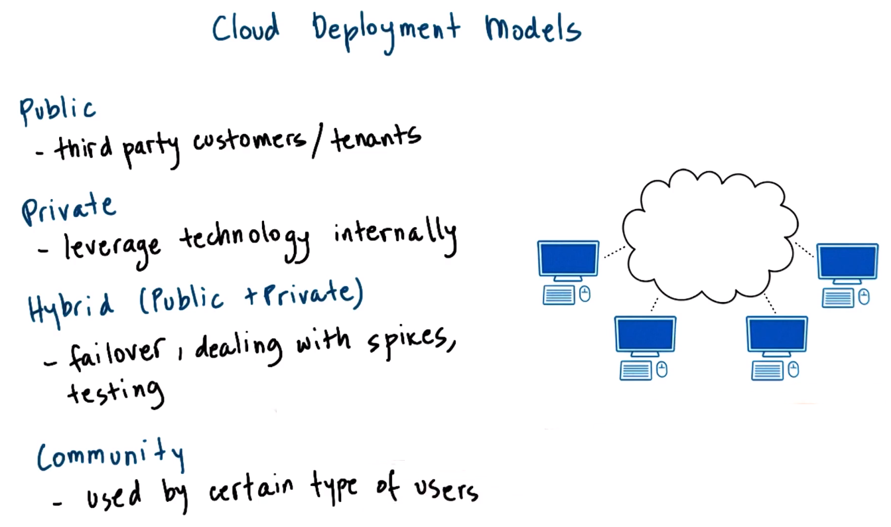
</center>

## 17. Cloud Service Models

TODO

<center>
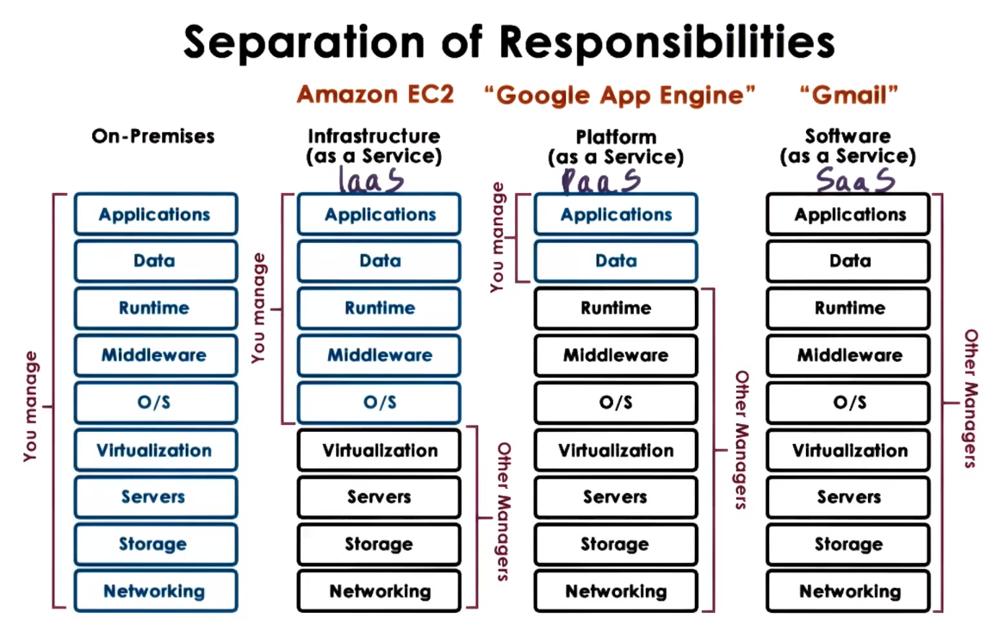
</center>

## 18. Requirements for the Cloud

TODO

<center>
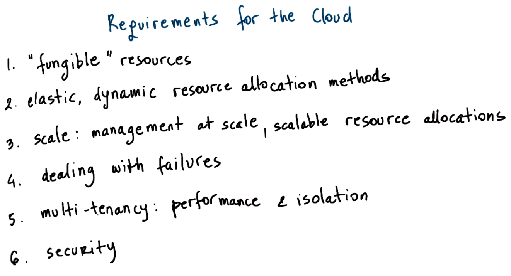
</center>

## 19. Cloud Failure Probability Quiz and Answers

Consider now why failures are a prominent issue in large-scale systems (e.g., cloud platforms) compared to systems for which scale is of less concern.

A hypothetical cloud has `n = 10` components (CPUs). Each has a failure probability of `p = 0.03`.

What is the probability that there will be a **failure** somewhere in the system?
  * `26%`
    * `1 - (1 - p)`<sup>`n`</sup>` = 0.26` (where `n = 10`)

What if the system has `n = 100` components?
  * `95%`
    * `1 - (1 - p)`<sup>`n`</sup>` = 0.26` (where `n = 100`)

***N.B.*** Modern cloud systems have `n` components on the order of `10`<sup>`3`</sup>, `10`<sup>`5`</sup>, or even more. Even though they typically operate at a much lower `p` level than `0.03`, in general as more components are added to the system, the probability of failure increases dramatically. Therefore, it is necessary to include mechanisms that are prepared to deal with these types of failures (e.g., software timeouts, restart/retry, backups, checkpointing, etc.).

***Reference Equations***:
* Probability of a *single* component *NOT* failing
```
(1-p)
```
* Probability of *none* of the components failing
```
(1-p)^n
```
* System failure probability
```
1 - [(1-p)^n] (and * 100 for % value)
```

where:
* `p` is the failure probability of a *single* component
* `n` is the number of components

## 20. Cloud-Enabling Technologies

TODO

<center>
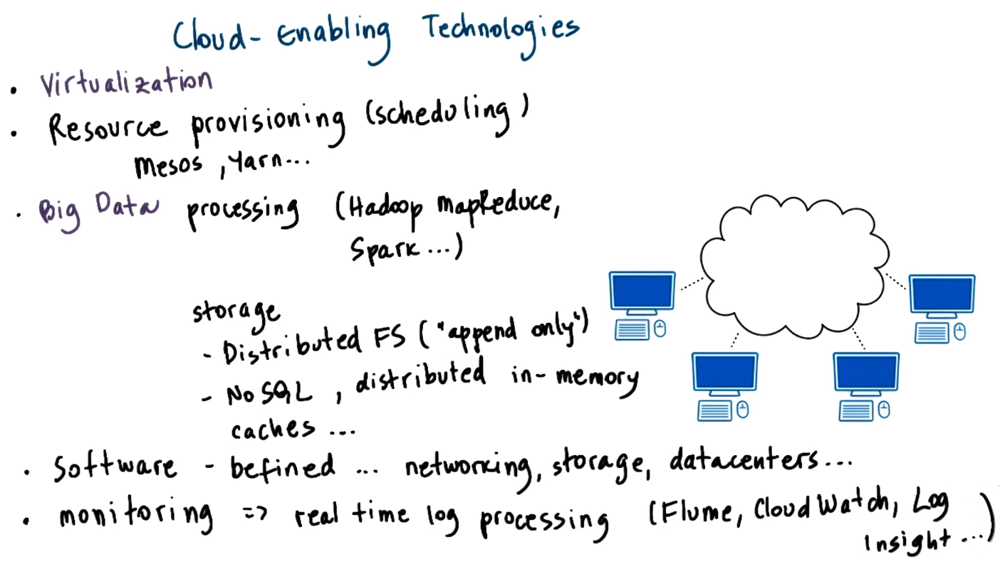
</center>

## 21. The Cloud as a Big Data Engine

TODO

<center>
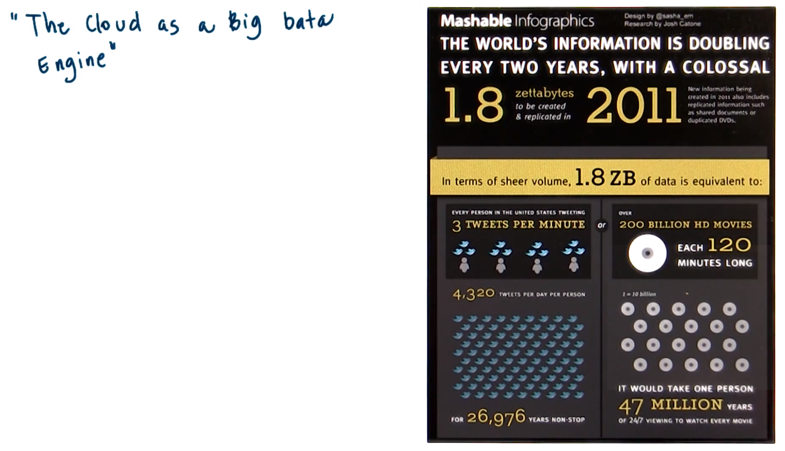
</center>

<center>
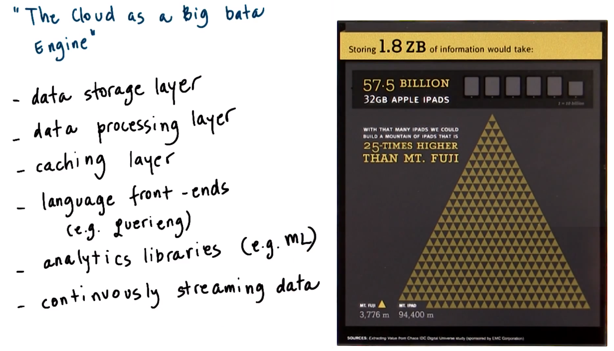
</center>

## 22. Example Big Data Stacks

TODO

<center>
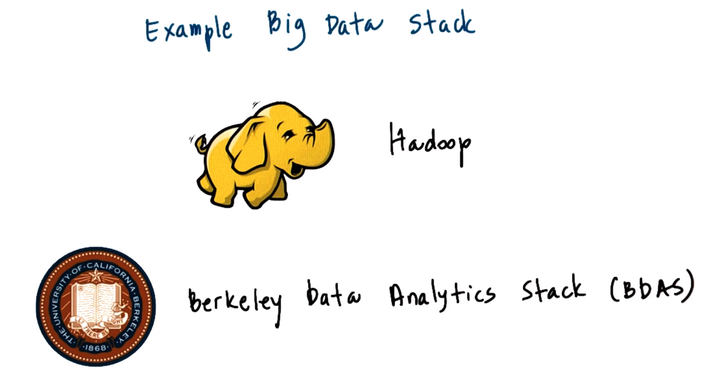
</center>

<center>
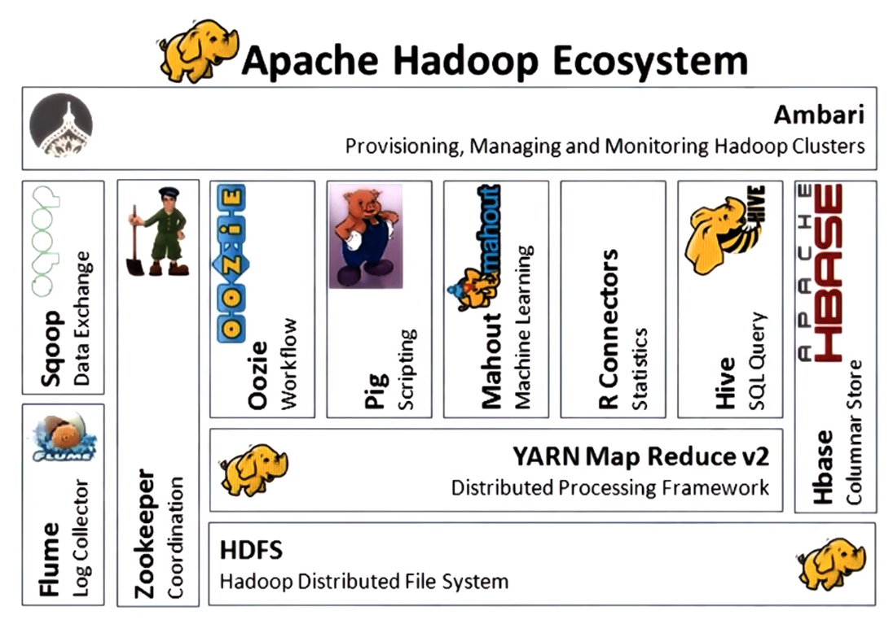
</center>

<center>
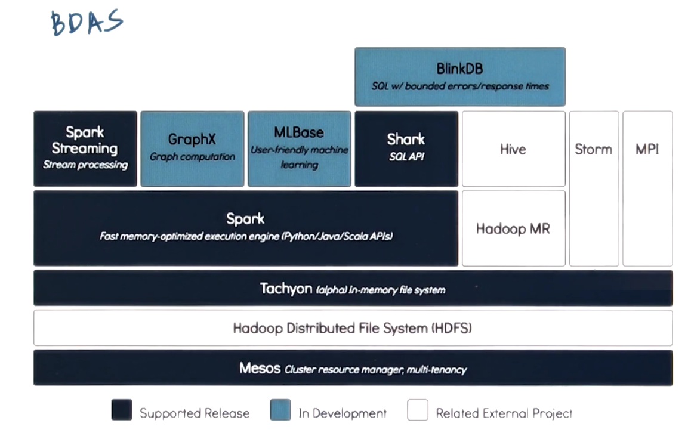
</center>

## 23. Lesson Summary

TODO
