# Introduction

## 1. Lesson Introduction

This course will cover how modern processor cores work, how these cores access memory, and how they are assembled into a multi-core chip.

However, to start off: What *is* computer architecture?

## 2. What Is Computer Architecture?

<center>
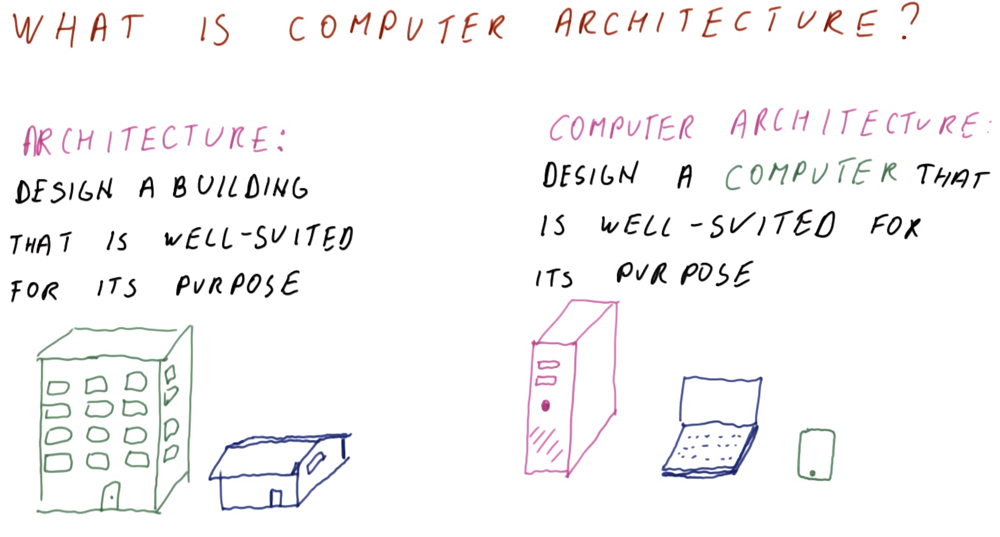
</center>

In the traditional sense, "*architecture*" pertains to the design of a building that is well-suited for its purpose (e.g., apartment vs. house vs. office building).

Similarly, **computer architecture** pertains to the design of a ***computer*** that is well-suited for its purpose (e.g., desktop vs. laptop vs. mobile device).

## 3. Why Do We Need Computer Architecture?

<center>
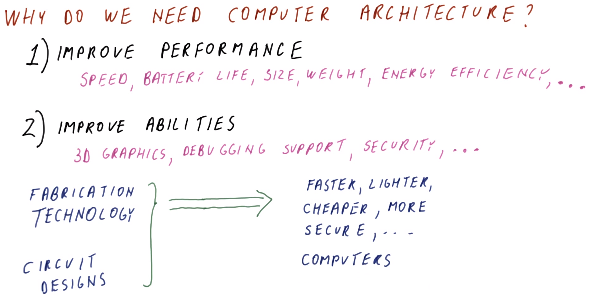
</center>

Computer architecture provides several uses:
  1. To improve **performance** -- making computers faster, smaller, cheaper
      * Speed of computation
      * Battery life
      * Overall size and weight of the computer
      * Energy efficiency
      * etc.
  2. To improve **abilities** -- enhancing computers' capabilities
      * 3D graphics support
      * Debugging support
      * Improving security

Accomplishing these goals requires improvements in fabrication technology and in circuit designs, and then translating these into devices which are faster, lighter, cheaper, more secure, etc. via computer architecture.

## 4. Computer Architecture Quiz and Answers

Computer architecture is about: (Select all that apply.)
  * How to build faster transistors
    * `DOES NOT APPLY` - Computer architecture may involve the use of such faster transistors for building better/faster computers, but it does not pertain to the design of these transistors themselves.
  * How to build faster computers
    * `APPLIES` - Since a "faster" computer may fit the criterion of a "better" computer, computer architecture is a key method by which such a faster/better computer can be achieved.
  * How to build larger buildings
    * `DOES NOT APPLY`
  * How to design energy-efficient computers
    * `APPLIES` - Energy efficiency is another criterion by which a computer can be deemed "better."
  * How to build buildings that fit more computers
    * `DOES NOT APPLY`
  * How to build computers that fit better into buildings
    * `APPLIES` - Optimizing the size of a computer is another criterion related to computer architecture.

## 5. Computer Architecture and Technology Trends

<center>
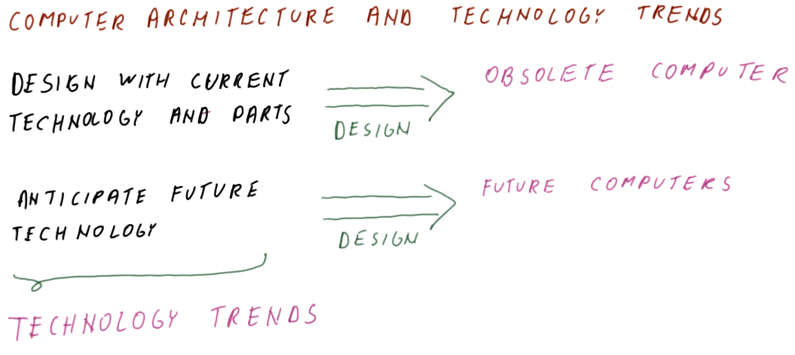
</center>

Computer architecture therefore involves building future computers. Consider now how it interacts with **technology trends**.

Progress in computer manufacturing technology is very rapid, so designing with current technology using available parts, by the time the new computer is designed, the "new" computer is practically "already obsolete."

Therefore, by anticipating future technology and what will be correspondingly available, designing a computer in this manner yields "future computers" that use the most advanced technology available at the time. In order to do this effectively, the designer must be aware of technology trends (i.e., how technology is expected to change in the future, and what is expected to be available).

## 6. Moore's Law

<center>
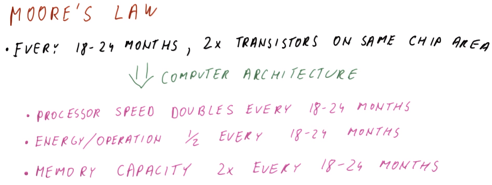
</center>

One of the most famous trends is **Moore's Law**, which roughly states that every 1.5 to 2 years, double the amount of transistors will fit on the same chip area. This is what technology improvement aims to achieve.

As computer architects, we attempt to ***translate*** this expected technology trend into:
  * Doubling the processor speed every 18 to 24 months
  * Reduce energy per operation for the same work by a factor of 0.5 every 18 to 24 months
  * Double the memory capacity every 18 to 24 months (i.e., in the case of a memory chip)


***N.B.*** [This article](https://www.extremetech.com/computing/165331-intels-former-chief-architect-moores-law-will-be-dead-within-a-decade) (2013) explores the question of how much longer Moore's Law will be valid.

## 7. Speed Doubling Quiz and Answers

<center>
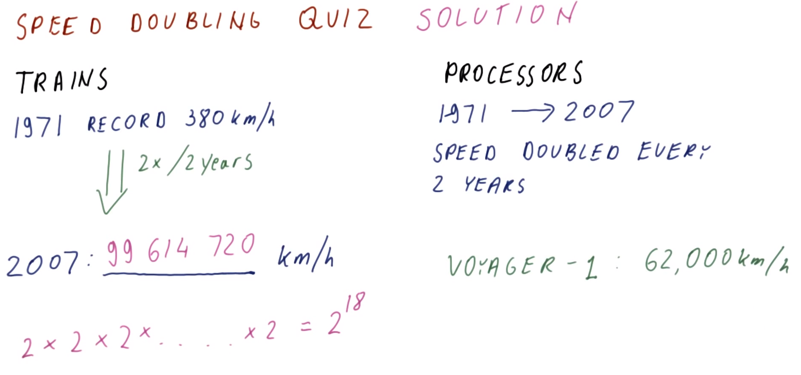
</center>

Consider the implications of speed doubling, by comparing the speed of trains and processors, as in the figure shown above.

Therefore, if maximum train speed had doubled at a comparable rate to processors between 1971 and 2007 (i.e., twice every two years, for 18 years), the resulting speed would be an astronomical `2`<sup>`18`</sup> km/h (or `99,614,720` km/h); for comparison/reference, the Voyager-1 probe (the fastest entity built by humans to date) achieved a maximum speed of `62,000` km/h. Furthermore, over that time period (18 years), the maximum train speed has not even doubled (i.e., not even `2`<sup>`1`</sup>)!

## 8. Memory Wall

<center>
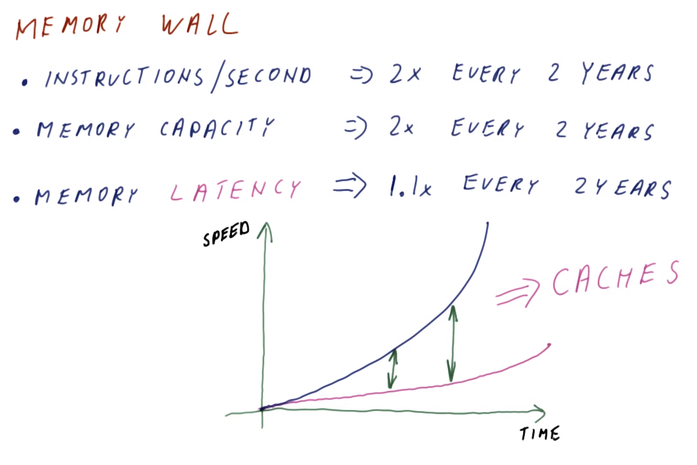
</center>

One of the consequences of Moore's Law and the performance improvements that we expect to follow is the so-called **memory wall**.

The memory wall exists for the following reasons:
  * The **processor speed** (in terms of instructions/second) can be expected to roughly double every two years (as per previously discussed Moore's Law)
  * The **memory capacity** (i.e., gigabytes of memory existing in the same-sized module) is also roughly doubling every two years
  * However, the **memory latency** (i.e., the amount of time required to perform a memory operation) has only been improving at a rate of roughly 1.1× every two years

Therefore, as time elapses, there is an increasing **gap** between the speed/performance of processors vs. that of memory; this problem is the aforementioned memory wall. To compensate for this discrepancy in performance, **caches** have been used as "stairs" to circumvent the memory wall, whereby processors access caches (which are fast), and only those rare memory accesses which are misses end up going to the relatively slower main memory.
  * We will spend several later lessons on how to perform caching, etc.
  * For now, it is worth to know that this is another aspect of processor design to consider: If the memory does not improve at the same rate as processor, we must compensate by continuously improving the performance of caches to compensate for this.

## 9. Processor Speed, Cost, and Power

<center>
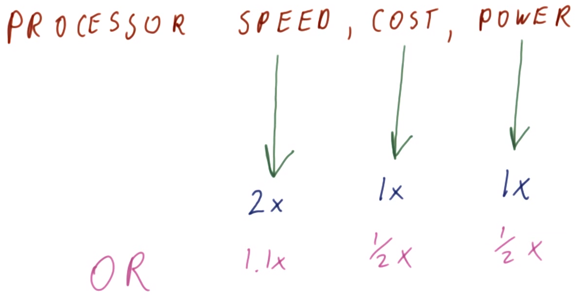
</center>

When discussing **processor performance**, we typically refer to a processor's **speed** (i.e., how many instructions per second it can complete). However, we must also consider its fabrication **cost** and its **power** consumption.
  * Lower fabrication costs allow to place more-powerful processors into devices that cannot be otherwise expensive (e.g., refrigerators, watches, etc.).
  * Low power consumption is important not only due to the cost of electricity but also because it translates into longer battery life and smaller form factors (e.g., smartphones)

Therefore, it is desirable to have the following concurrent performance improvements:
| Performance Characteristic | Improvement Factor (Baseline) | Improvement Factor (Scaled) |
|:---:|:---:|:---:|
| Speed | `2×` | `1.1×` |
| Cost | `1×` | `0.5×`  |
| Power | `1×` | `0.5×`  |

Even if `2×` speed improvement is not achieved, the same relative improvements are still useful (e.g., scaled relative to `1.1×` improvement in speed). The particular level of performance improvement ultimately depends on the type of computer being designed by the computer architect.

## 10. Speed vs. Power vs. Weight vs. Cost Quiz and Answers

<center>
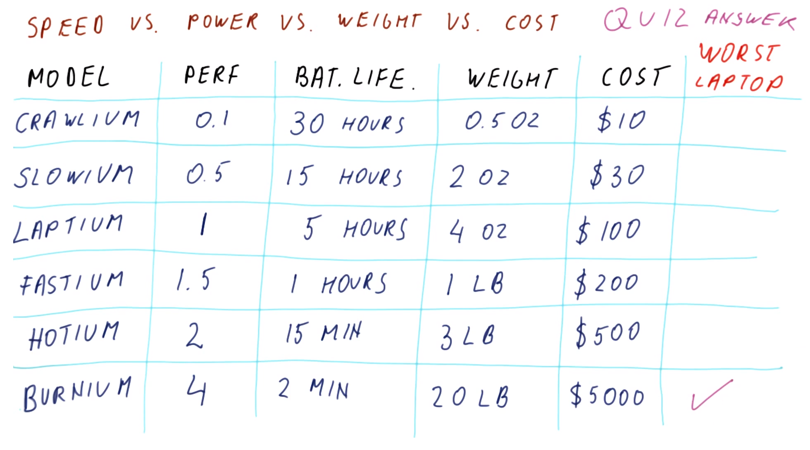
</center>

Consider the laptop processor models as in the figure shown above, which compares their relative speed performance, expected battery life, overall weight, and cost. Of these models, which is the ***worst***?
  * The general trend moving down the table rows is an improvement in speed performance with corresponding diminution of the remaining characteristics.
  * `Laptium` is a reasonable processor model, giving reasonable performance balanced with acceptable battery life, weight, and cost. Similarly, `Slowium` is somewhat reasonable, sacrificing speed for a comparable improvement in the other characteristics.
  * Beginning with `Fastium` (moving towards the bottom), however, the improvement in speed is rapidly outpaced by diminution in the other characteristics.
  * In general, the design in the "middle" of the table (e.g., `Laptium` and `Fastium`) are better than either extremes (`Crawlium` and `Burnium`).
  * Therefore, in comparing the extremes, the ***worst*** model is `Burnium`. `Crawlium` may still have some use cases (e.g., embedded devices, simple handheld devices, etc.), while `Burnium` has extremely suboptimally improved performance at the expense of the other desirable performance characteristics. Thus, paradoxically, in this example, the "highest performance" processor is also the worst!

## 11-13. Power Consumption

### 11. Introduction

<center>
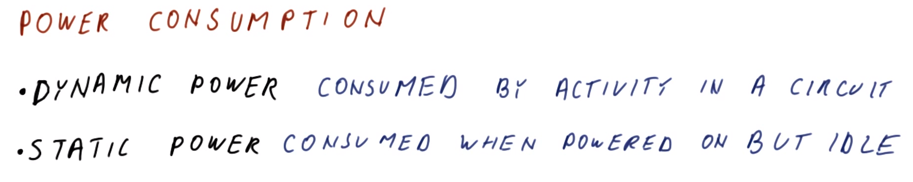
</center>

As is evident, one of the more important aspects of the processor is its **power consumption**. There are generally two kinds of power consumed by the processor:
  1. **dynamic power** - the power consumed by the actual activity in an electronic circuit
  2. **static power** - the power consumed by the circuit when it is powered on, but otherwise idle

Both types of power and their relationship--as well as their effect on processor speed--will be discussed next.

### 12. Active Power

<center>
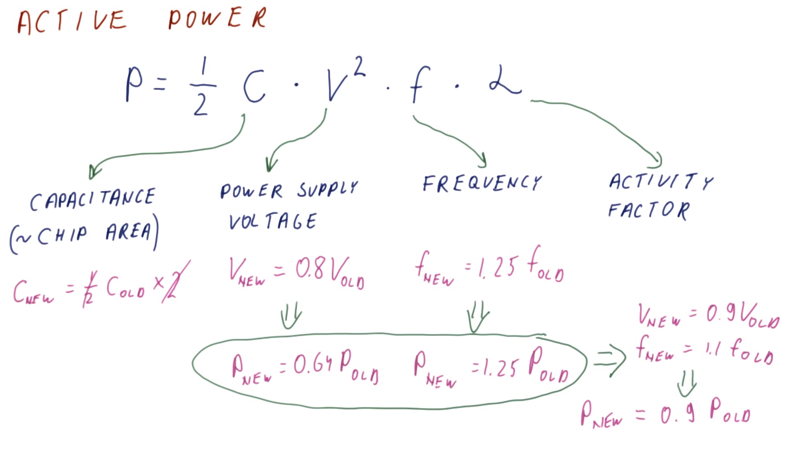
</center>

The **active power** can be computed as follows: `P = 0.5 × C × V`<sup>`2`</sup>` × f × α`
  * `C` is the **capacitance**, which is roughly proportional to the chip area
  * `V` is the **voltage**, as provided by the power supply
  * `f` is the **clock frequency** (typically rated in GHz)
  * `α` is the **activity factor**, i.e., a factor describing the fraction of the processor's transistors that are actually active in any given clock cycle
    * Therefore, `α = 1` is the extreme case that the processor constantly switches *all* of its transistors every clock cycle; `α = 0.1` indicates that only 10% of transistors are active in a given clock cycle; etc. 

Consider the impact on power when the processor is improved by reducing its size in half after two years:
  * The new capacitance is `0.5×` of the old for one processor, however, because we are building a more powerful processor, two such processors are placed on the chip (i.e., dual-core); therefore, there is no net reduction in capacitance
    * Therefore, with no other improvements, the processor consumes the same amount of power, however, is twice as more performant with respect to computation (i.e., due to doubling of the processor cores, each operating at the same frequency as before)
  * In reality, smaller transistors are generally faster, therefore the clock frequency can be increased accordingly
    * Consider the case of improving clock frequency by a factor of `1.25×`: This proportionally increases the power consumption by a factor `1.25×`
  * However, smaller transistors also enable a lowering of the power-supply voltage (while maintaining the same speed)
    * Consider the case of reducing (i.e., improving) the power-supply voltage by a factor `0.8×`: This decreases the power consumption by a factor `0.64×` (i.e., `0.8`<sup>`2`</sup>`×`)

Combining these factors, this yields something along the lines of `V`<sub>`new`</sub>` = 0.9V`<sub>`old`</sub> and `f`<sub>`new`</sub>` = 1.1f`<sub>`old`</sub>, netting a power-consumption improvement of `P`<sub>`new`</sub>` = 0.9P`<sub>`old`</sub> (i.e., 10% reduction)
  * Here, voltage is lowered slightly less (i.e., `0.9×` rather than `0.8×`) in order to allow for an increase in the frequency (which would be otherwise difficult to achieve with a more drastic reduction in voltage)
  * Similarly, the frequency is only increased slightly more (i.e., `1.1×` rather than `1.25×`) in order to allow for a decrease in the power-supply voltage (otherwise, a more drastic increase in frequency would require maintaining the original power-supply voltage, or perhaps even increasing it slightly)

Therefore, the net effect of these improvements is a dual-core processor, with each core being faster (by 10%) while consuming (10%) less power!
  * This demonstrates why reduction in transistor size with improved technology is imperative to improvement in active power consumption by the processor.
  * Furthermore, the voltage is a significant factor on power consumption, due to its squared relationship (i.e., `P` is proportional to `V`<sup>`2`</sup>)

### 13. Static Power

Now consider **static power**, which is what prevents us from lowering the voltage too much.

<center>
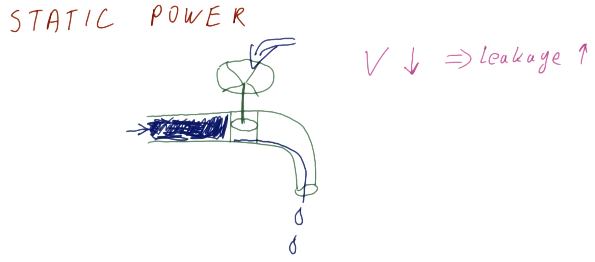
</center>

A **transistor** is analogous to a faucet. As water enters:
  * If the valve is *open*, water flows out.
  * If the valve is *closed*, no water flows out.
  * If the valve is *partially closed*, the "faucet" behaves as if the water pressure (i.e., power supply voltage) is controlled by water pressure from another faucet.
    * Therefore, if the power-supply voltage is dropped, there is "less (valve) pressure," resulting in a "leakage." Such analogous "leakage" (i.e., of current/electrons) is reflected in transistors: As the voltage decreases, the "leakage" correspondingly increases

<center>
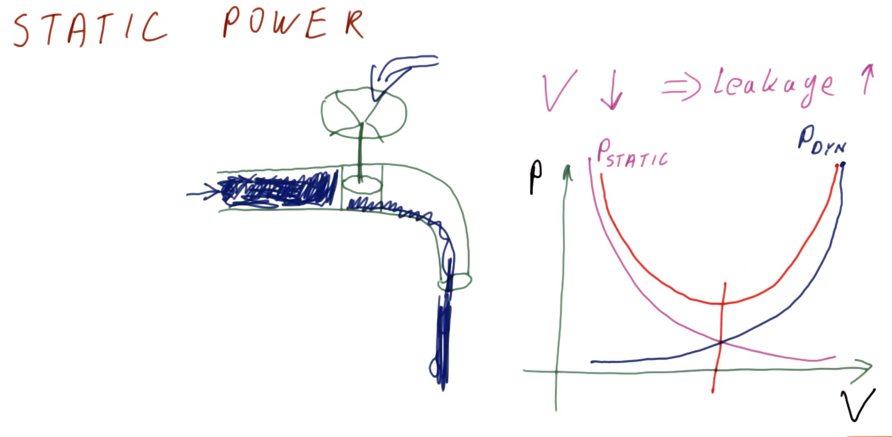
</center>

By increasing static power, the lowering of the voltage yields more "leakage." As this voltage lowering progresses, the corresponding "leakage" becomes a much larger "stream" of leakage.

Therefore, the total power (i.e., `P`<sub>`static`</sub>` + P`<sub>`dynamic`</sub>) is optimized (i.e., minimized) at some intermediate voltage level, as dictated by the relative effects of static vs. dynamic power.

Consequently, in modern architecture design, it is not simply a matter of arbitrarily lowering the voltage to decrease dynamic power and correspondingly increase static power. The effect of static power is much more pronounced in modern design, inasmuch as the voltage has already been lowered/optimized to a point where the effect of static power begins to dominate.

<center>
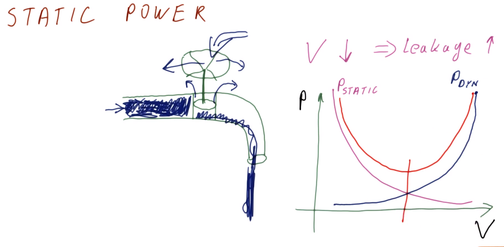
</center>

The leakage through the transistor is not the only source of leakage that results in static power consumption. Because the transistors themselves are very small, they themselves also act as "sub-faucets" whose own valves are also "leaky," along with "back pressure" from the "main valve" resulting in leaking; and so on. Therefore, there are many sources of static power effects.

However, to understand the relationship between static and dynamic power, it is sufficient to understand that in the case of power-supply voltage (for example), static and dynamic power both "compete" over this voltage, yielding a optimum at some intermediate level.

## 14. Active Power Quiz and Answers

<center>
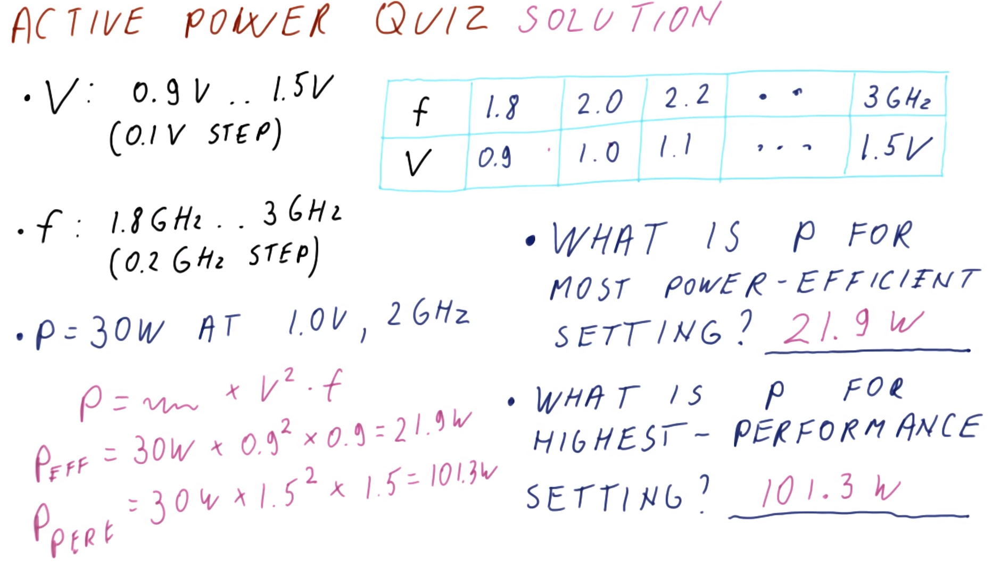
</center>

Consider a processor with the parameters as shown in the figure above, having the given relationships/requirements between frequency `f` and voltage `V` per the table (where `V` is the minimum possible value for given `f`). Furthermore, assume that a power measurement of `30 W` is observed at `1.0 V` and `2 GHz`.

What is the power for the most power-efficient setting?
  * `30 W × (0.9 V / 1.0 V)`<sup>`2`</sup>` × (1.8 GHz / 2 GHz) = 21.9 W`
    * This is the setting with the lowest frequency and lowest voltage, due to the relationships `P ~ f` and `P ~ V`<sup>`2`</sup> (respectively)

What is the power for the highest-performance (i.e., speed) setting?
  * `30 W × (1.5 V / 1.0 V)`<sup>`2`</sup>` × (3 GHz / 2 GHz) = 101.3 W`
    * This is the setting with the highest frequency

Therefore, there is a large difference in power consumption between the most power-efficient vs. highest-performance settings, however, the corresponding difference between these two settings is not even a `2×` improvement in performance (i.e., `f`), due to the relatively larger effect of the voltage on performance.

## 15-17. Fabrication Cost & Yield

### 15. Fabrication Cost

<center>

</center>

Another important relationship to understand is that between **fabrication cost** and the corresponding **chip area**.

Chips are manufactured by taking a silicon disc (called a "wafer") and subjecting it to a number of processing steps.
  * Each of these steps prints some aspect of the circuitry that appears on each processor.
  * At the end of these steps, the wafer is cut into small sections constituting the processor chip itself, which is then packaged/enclosed with a casing containing connection pins.

Upon fabrication, the processor chips are tested.
  * Chips which *pass* testing are approved for subsequent distribution and sale.
  * Chips which *fail* testing are discarded.

It is important to understand that up to the point of cutting out chips, the manufacturing process (and consequent cost) is generally uniform. The resulting wafer is a disc having a cross-sectional diameter of approximately `12 in.`. it costs thousands of dollars to put such a disc through the manufacturing processing steps, at which point it is expected that the majority of the chips are working (i.e., pass testing).

However, the size of the chip significantly impacts this (initially fixed) cost to produce the chips from the resulting wafer. If there are more chips per unit wafer area, the wafer cost is divided more favorable; the opposite is true when there are fewer chips per unit wafer area.

Therefore, it appears that the cost of a single chip is linearly proportional to its size; but, in fact, things are much worse than that.

### 16. Fabrication Yield

<center>
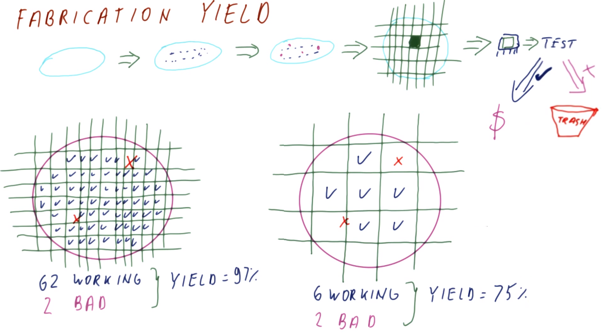
</center>

The **fabrication yield** is the percentage of acceptable chips resulting from the fabrication process (i.e., those which *pass* testing). More formally:
```
yield = working chips / chips on wafer
```

The size of the chip affects the yield. When larger chips are produced, not only is the per-unit cost higher (as discussed previously), but the resulting yield is also lower.

On a typical wafer, there are a few spots called **defects** (denoted by red "`X`s" in the figure shown above), which result from impurities in the original silicon substrate and/or errors in the subsequent fabrication processing steps. Therefore, for the same number of defects on the same-sized wafer, a smaller chip size will generally result in a higher yield (as in the figure shown above).
  * N.B. In the figure shown above, "working" chips (denoted by blue "`√`s") are those having complete shapes with no defects (i.e., excluding those on the edges which are rounded/incomplete).

### 17. Fabrication Cost Example

<center>
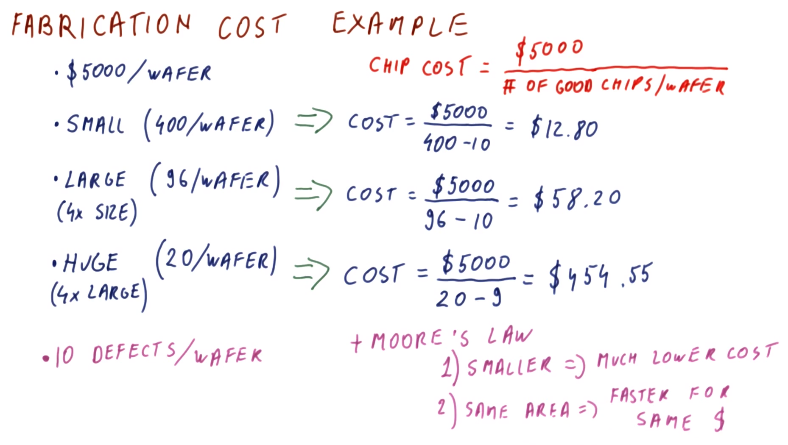
</center>

Now consider an example of fabrication costs comparisons. Suppose that the fabrication cost is `$5000` per wafer, including processing into chips. Furthermore, suppose that there are `10` defects per wafer.
  * ***N.B.*** Per Patterson & Hennessy (3rd edition), "a 30 cm diameter wafter in a leading-edge technology with 4 to 6 metal layers costs between $5000 and $6001 in 2001."

The cost to manufacture each chip is:
```
cost = cost per wafer / yield per wafer
     = cost per wafer / # good chips per wafer
```

The resulting impact on cost for various chip sizes is therefore as follows:

| Chip Size | Working Chips Quantity* | Cost | Relative Cost |
|:---:|:---:|:---:|:---:|
| Small | `400/wafer` | `$5000/(400 - 10 chips) = $12.80/chip` | `$12.80/$12.80 = 1` |
| Large (4× Small) | `96/wafer` | `$5000/(96 - 10 chips) = $58.20/chip` | `$58.20/$12.80 = 4.55` |
| Huge (4× Large) | `20/wafer` | `$5000/(20 - 9 chips) = $454.55/chip`** | `$454.55/$12.80 = 35.51` |

* ****N.B.*** The working chips quantity does not scale proportionally with chip size (e.g., `4×` increase in chip size results in less than `4×` chips per wafer; cf. actual `96/wafer` vs. proportionally `400/4 = 100/wafer`, and actual `20/wafer` vs. proportionally `96/4 = 24/wafer`) due to the effect of non-working chips (e.g., around the wafer edges) as the chip size increases.
* *****N.B.*** With only `20` chips per wafer, the likelihood of defects occurring on the *same* chip increases; therefore, here, it is assumed two defects occur on the same chip among the `10` defects, resulting in `9` total defects.

Per above table, observe that there is a non-linear relationship between chip size and per-chip fabrication cost. Furthermore, combining this with Moore's Law (as discussed previously in this lecture, i.e., fitting more transistors on the same chip), there are effectively two **choices** with which we can design:
  1. Smaller chips (which are equivalent in performance to a previously larger chip), thereby ***reducing cost***
      * This approach is of particular interest for novelty/innovation (e.g., reducing the form factor of cellphones and modern smartphones, and other similar consumer devices)
  2. Utilize the same area (which is relatively more performant compared to a previous chip of the same area), thereby achieving ***faster performance*** for the same cost
      * This approach is of particular interest for high performance processors

## 18. Manufacturing Cost Quiz and Answers

Consider the following processors:
  * `WP` (watch processor) - `1 mm`<sup>`2`</sup> processor for watches
  * `LP` (laptop processor) - `100 mm`<sup>`2`</sup> processor for laptops

Which of the following is true regarding these processors cost? (Select the correct choice.)
  * cost(LP) = 100 * cost(WP)
  * cost(LP) > 100 * cost(WP)
    * `CORRECT` - Larger processors generally result in lower yield.
      * ***N.B.*** cost(LP) = 100 * cost(WP) would only be true if yield were disregarded; however, this is not a practical assumption. Recall the effect of chip size on working chips quantity (cf. Section 17).
  * cost(LP) < 100 * cost(WP)

## 19. Lesson Outro

We said that the goal of computer architecture is to design a computer that is better suited for its intended use. For the remainder of the course, we will learn about techniques that can be used to improve the computer's performance, energy efficiency, and cost. However, before exploring these techniques, we must learn how to measure and compare performance and other characteristics of computer designs; in other words, we must *quantify* performance in a manner that more adequately/explicitly expresses our intuitive notion of "better." This is the topic of the next lecture.
