# Metrics and Evaluation

## 1. Lesson Introduction

Before learning how to make "better" computers, we must learn what "better" means in this context, as well as how to measure this.

This lecture will discuss **latency** and **throughput**, which we use as a measure of computer performance. Subsequently, we will examine how to measure performance of real computers using **benchmarks**, as well as a few general ways to achieve "good" performance. 

## 2. Performance

<center>
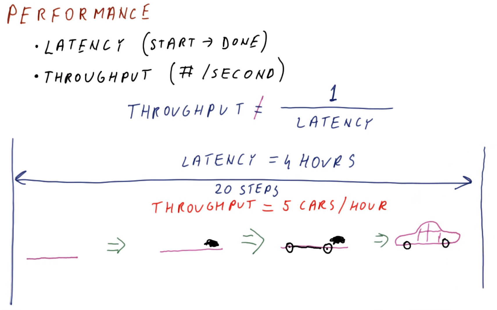
</center>

When considering **performance**, we typically associate this with processor speed. However, within this, there are really two underlying aspects of performance, which are not necessarily identical:
  1. **latency** - the elapsed duration between the start and completion of a task
  2. **throughput** - the number of operations per-unit time (e.g., `ops/s`)

It may seem intuitive that latency and throughput are inverses of each other; however, this is not necessarily true, i.e., in general:
```
throughput ≠ 1/latency
```

Consider a car assembly line, having the following sequential operations:
  1. begin with a bare chassis
  2. install an engine
  3. add wheels
  4. install the frame (doors, hood, etc.)

For this assembly process, the latency is the total duration of assembly (e.g., `4` hours). However, this assembly process occurs continuously (e.g., when a chassis is moved from stage 1 to stage 2, another chassis replaces it in stage 1 immediately thereafter; and so on), resulting in a throughput of `5` cars/hour (assuming the four operations comprise 20 sub-steps), i.e., rather than simply `1/(4 hr) = 0.25/hr`.

## 3. Latency and Throughput Quiz and Answers

<center>
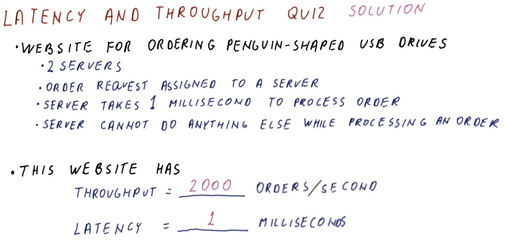
</center>

Consider a website for ordering penguin-shaped USB drives having the following features:
  * `2` servers
  * An order request is assigned to a server
  * The server takes `1 ms` to process an order
  * The server cannot perform any other tasks while processing an order

What is the throughput and latency for this website?
  * Throughput
    * `(2 orders)/(1 ms) = 2000 orders/s` - both servers process an order simultaneously over the *same* `1 ms` time interval, thereby achieving a higher throughput relative to a *single* server processing orders by itself
  * Latency
    * `1 ms` - as given in the prompt

## 4. Comparing Performance

<center>
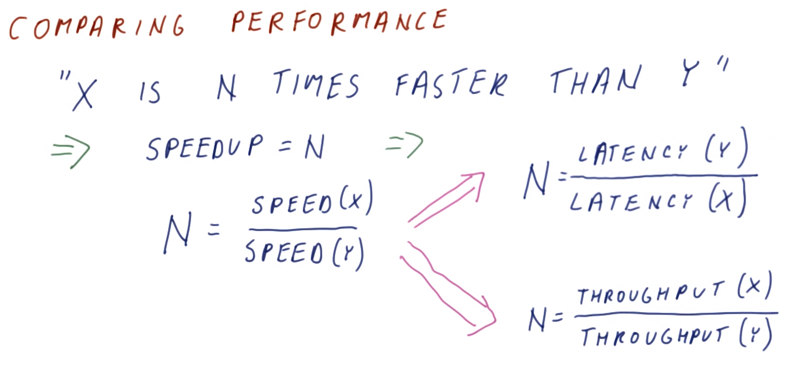
</center>

We can therefore measure performance as either latency or throughput. So, then, how do we ***compare*** performance of two (or more) different systems?

For example, consider how to substantiate the claim "*System X is N times faster than System Y.*" Typically, in such a characterization, we define the **speedup** as follows:
```
speedup = N
```

where:
```
N = speed(X)/speed(Y)
```

With this characterization, there is a distinction between comparing with respect to latency vs. with respect to throughput, i.e.,:
```
N = latency(Y)/latency(X)
```
vs.
```
N = throughput(X)/throughput(Y)
```

***N.B.*** For latency, in general, speed(X) is not directly proportional to latency(X), but rather there is an inverse relationship instead (i.e., the longer the latency, the slower the speed).

## 5. Performance Comparison 1 Quiz and Answers

Assume that an old laptop takes `4 hours` to compress a video, while a new laptop can perform this same task in `10 minutes`.

What is the speedup of the new laptop relative to the old laptop?
  * `speedup = latency(old)/latency(new) = (4 hr × 60 mins/hr)/(10 min) = 24`

***N.B.*** Intuitively, `speedup > 1` indicates that the new system is *faster* than the old system; conversely, `speedup < 1` indicates that the new system is *slower* than the old system. With this intuition, incorrectly calculating speedup in this example via throughputs (i.e., `speedup = 10/240 = 0.04`) yields an unintuitive result.

## 6. Performance Comparison 2 Quiz and Answers

Consider again the laptop which can compress a video in `10 minutes`. Now, assume that it falls down the storm drain, and we are forced to use the old laptop instead, which can compress the same video in `4 hours`.

What is the speedup of the old laptop relative to the new laptop?
  * `speedup = latency(new)/latency(old) = (10 min)/(4 hr × 60 mins/hr) = 0.04`

***N.B.*** As before, intuition can help with interpreting the result. In this case, it is sensible that indeed the older system has a "slow speedup" (i.e., `speedup < 1`).

## 7. Speedup

<center>
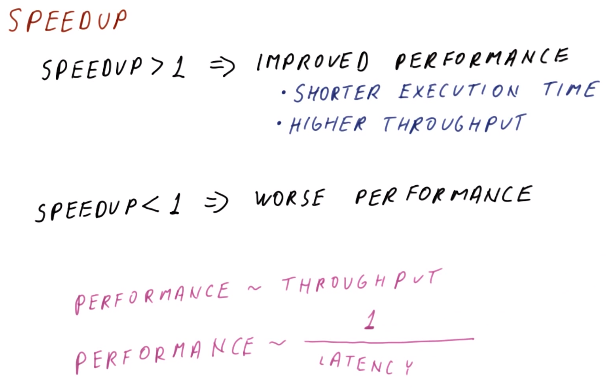
</center>

As demonstrated in the preceding quizzes, the value of `speedup` can have various ranges:
  * `speedup > 1` suggests ***improved*** performance (i.e., either via shorter execution time or via higher throughput)
  * `speedup < 1` suggests **decreased** performance (i.e., either via longer execution time or via lower throughput)

As a final note, beware of the following relationships:
  * `performance ~ throughput`
  * `performance ~ 1/latency`

(where `~` indicates "proportional to")

## 8. Measuring Performance

<center>
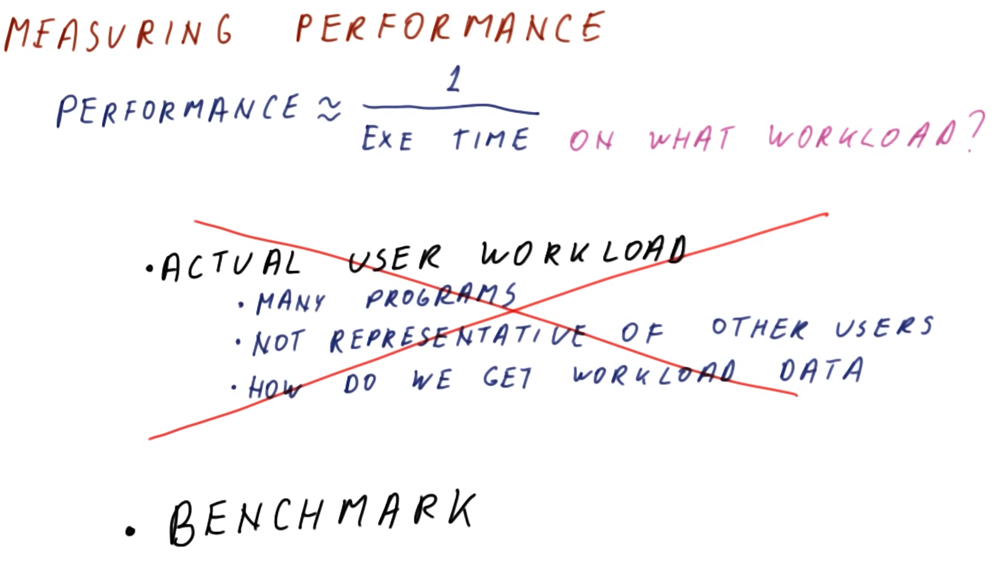
</center>

Recall the following relationship:
```
performance ~ 1/(execution time)
```

In this relationship, `execution time` is an important consideration: On what **workload** does this measured time apply? (i.e., What exactly should be run on the two systems to compare them?)

The best assessment for comparing the two systems is to run **actual workloads** from a particular user. However, this has several ***issues*** that preclude achieving this in practice:
  * Requires running many different programs
  * Is not representative of other users
  * It is not clear how to acquire *useful* workload data

Therefore, rather than using actual workloads, when comparing two (or more) systems, it is more typical to use a **benchmark workload** instead.

## 9. Benchmarks

<center>
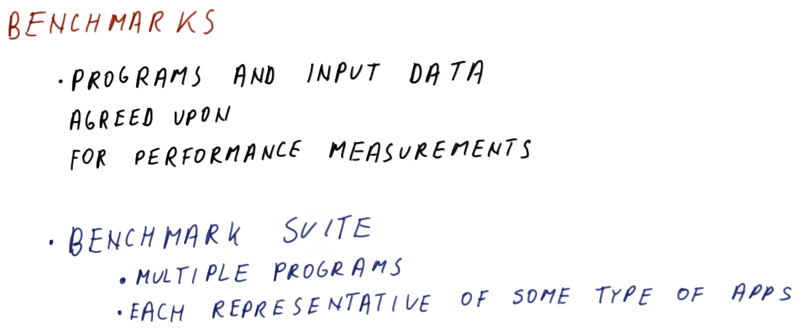
</center>

What is a **benchmark**? A benchmark is comprised of programs and input data agreed upon (i.e., by the target stakeholders, users, companies, etc.) to be used for performance measurements. This is typically decided either by a consortium of companies who develop industry standards, and/or groups of users who are concerned with a particular performance issue.

Typically, rather than using a *single* benchmark, a **benchmark suite** is used instead. This consists of *multiple* programs (along with their corresponding input data), each of which is representative of some type of particular application class.

## 10. Types of Benchmarks

<center>
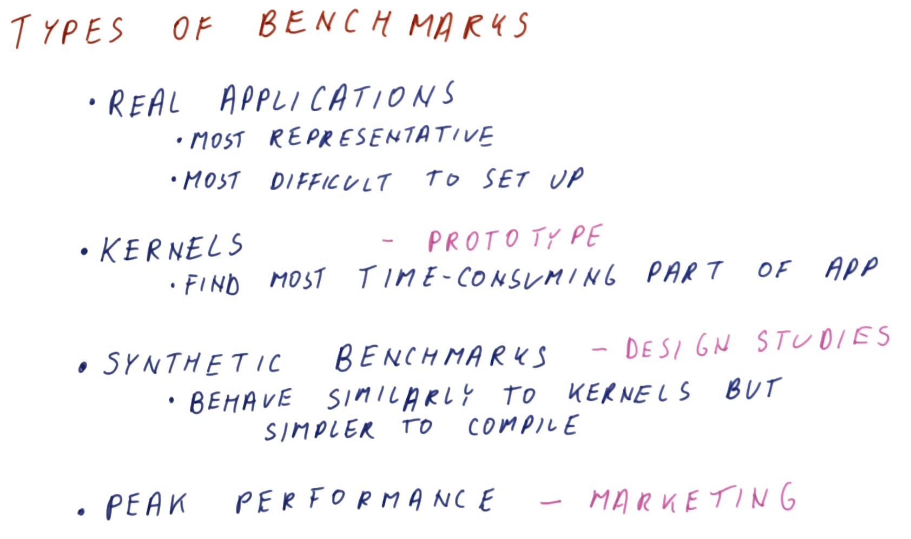
</center>

There are many **types** of benchmarks available:
  * **real applications**
    * The most representative (i.e., of actual use)
    * The most difficult to set up (sometimes even to an impractical extent)
  * **application kernels**
    * This involves identifying the most time-consuming part of the application (e.g., a loop), isolating this part, and then performing testing on only this part (i.e., rather than on the *entire* application)
    * This may still have practical limitations, particularly on a resource-limited system
  * **synthetic benchmarks**
    * These are designed to behave similarly to kernels, however, are much simpler to compile (i.e., these constitute the "abstraction" of the kernel)
    * These are useful for design studies (i.e., selecting among potential candidate systems), but not particularly useful for reporting performance to a general audience
  * **peak performance**
    * Rather than the actual/typical performance, this involves examining the maximum performance (i.e., maximum cycles per second achieved under ideal condition)
    * This is useful for marketing, however, not particularly informative for technical analysis

## 11. Performance Reporting Quiz and Answers

Which of the following uses code from real applications, but *not all* of the code? (Select the correct choice.)
  * actual workload mix
    * `INCORRECT` - similarly to an application suite, an actual workload mix uses *all* of the real application code, and additionally includes actual usage patterns from a specific user
  * application suite
    * `INCORRECT` - an application suite uses *all* of the real application code
  * application kernel
    * `CORRECT` - an application kernel tests that subset of real application's code which is performance-critical
  * synthetic benchmarks
    * `INCORRECT` - synthetic benchmarks do not use code from real applications, but rather use code specifically designed for testing
  * peak performance
    * `INCORRECT` - peak performance doe snot use any code

## 12. Benchmark Standards

<center>
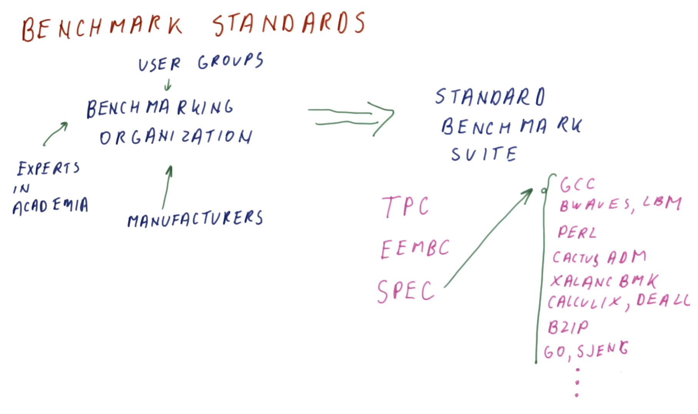
</center>

Benchmarks are very important to computer manufacturers, so typically there are **standards organizations** which are responsible for devising benchmark suites for use in comparing performance between machines.

Typically, a benchmark organization takes input from various **stakeholders**, including:
  * manufacturers
  * user groups
  * experts in academia
  * etc.

From this input, the benchmark organization produces a **standard benchmark suite**, along with instructions on how to produce representative measurements. For example, this process gave rise to several important benchmark suites, including:
  * **TPC** - benchmarks used for databases, web servers, data mining, and other transaction processing
  * **EEMBC** ("embassy" benchmarks) - benchmarks used for embedded processing (e.g., cars, video players, printers, phones, etc.)
  * **SPEC** - benchmarks used to evaluate engineering workstations and processors
    * These benchmarks are not very I/O-intensive, but rather are mostly processor-oriented.
    * The SPEC benchmark suite includes a number of applications, including:
      * **gcc** - software development workloads (e.g., compiler)
      * **bwaves**, **lbm** - fluid dynamics workloads
      * **Perl** - string processing workloads
      * **CactusADM** - physics simulation workloads
      * **xalancbmk** - XML parser workloads
      * **calculix**, **deall** - differential equations solvers workloads
      * **bzip** - compression application
      * **go**, **sjeng** - game AI applications
      * etc.
    * Therefore, the SPEC benchmark suite attempts to cover a variety of potential users for processors and high-performance systems

## 13. Summarizing Performance

<center>
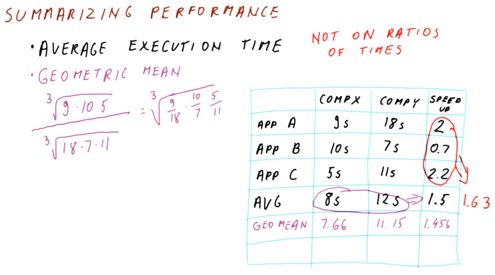
</center>

If there are, say, 26 applications in a benchmark suite, how do we summarize the overall performance of a machine on the entire suite (i.e., with a *single* number)? Consider two systems (X and Y), as in the figure shown above, summarized as follows:

| Application | Computer X Execution Time | Computer Y Execution Time | Speedup |
|:---:|:---:|:---:|:---:|
| A | `9 s` | `18 s` | `18/9 = 2` |
| B | `19 s` | `7 s` | `7/19 = 0.7` |
| C | `5 s` | `11 s` | `11/5 = 2.2` |

Typically, we use a metric such as the **average execution time** (i.e., via **arithmetic mean**) to characterize the individual systems:
  * Computer X: `(9 + 10 + 5 s)/3 = 8 s`
  * Computer Y: `(18 + 7 + 11 s)/3 = 12 s`

When examining the average speedup *between* the two systems, there are two possibilities:
  * average of speedups: `(2 + 0.7 + 2.2)/3 = 1.63`
  * speedup via average execution times: `12/8 = 1.5`

However, taking the average of the individual applications' speedups is not appropriate for reporting the average execution time (the speedup using the average execution times is not equivalent to the average of the individual applications' speedups). Instead, a more suitable approach is to use the **geometric mean** for *both* the applications' execution times *and* the speedups. The geometric mean is defined as follows (given `n` measurements):
```
geometric mean = (i_1 × i_2 × ⋯ × i_n)^(1/n)
```

Therefore, via the geometric mean:
```
geometric mean of Y/geometric mean of X = [(9*10*5)^(1/3)]/[(18*7*11)^(1/3)]
                                        = 11.15/7.66
                                        = 1.456
             geometric mean of speedups = [(9/18)*(10/7)*(5/11)]^(1/3)
                                        = 1.456
```

***N.B.*** Observe that when using the geometric mean, the computations are ***equivalent*** using either the geometric means of the execution times *or* of the individual speedups.

Therefore, it is useful to compute average execution times (i.e., via arithmetic means) to characterize the individual systems with respect to their execution times, however, the geometric mean is a more useful metric with respect to comparing the systems' speedups; accordingly, arithmetic means should ***not*** be used on ***ratios*** of times.

## 14. Speedup Averaging Quiz and Answers

Consider the following benchmark comparing an old laptop to a new laptop:

| Representative Application Workload | Old-to-New Speedup |
|:---:|:---:|
| Homework Formatting | `2` |
| Virus Scanner | `8` |

What is the ***overall*** speedup going from the old laptop to the new laptop?
  * `(2*8)^(1/2) = 4`

***N.B.*** As indicated previously (cf. Section 13), arithmetic means (e.g., `(2 + 8)/2 = 5`) are ***not*** appropriate for comparison when dealing with ratios (e.g., speedups), therefore, the geometric mean is used instead.

## 15. Iron Law of Performance

<center>
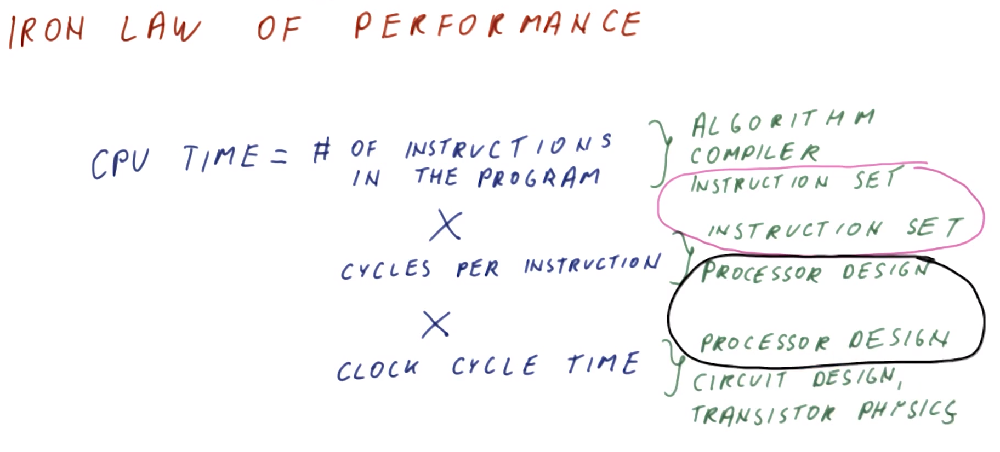
</center>

A large part of this course will focus on the processor itself. Therefore, the **processor (CPU) time** can be expressed as follows (called the **Iron Law of Performance**):
```
CPU Time = # instructions in the program × cycles per instruction × clock cycle time
```

***N.B.*** Per dimensional analysis:
```
CPU Time [=] (instructions/program) × (cycles/instruction) × (s/cycle) [=] s/program
```

To understand why this constitutes the CPU time, consider the constituent components, which reflect various aspects of the computer architecture and related areas.
  1. number of instructions in the program
      * **algorithm** and **compiler** - a more efficient program requiring fewer instructions to accomplish the same task will reduce (i.e., improve) CPU time
      * **instruction set** - affects how many instructions will be needed to execute the program (i.e., very simple instructions may require more instructions for the same program, thereby requiring longer CPU time)
  2. cycles per instruction
      * **instruction set** - with respect to cycles per instruction, simpler instructions will generally require fewer cycles to accomplish the same thing
      * **processor design** - affects how many cycles are required per instruction
        * Later, we will see several techniques that allow a processor design to spend fewer cycles per instruction without otherwise changing the instruction set
  3. clock cycle time
      * **processor design** - a processor can be designed to perform fewer tasks per clock cycle, thereby spending less time per clock cycle
      * **circuit design** and **transistor physics** - faster circuits and better transistors require less time to perform the same task per clock cycle

Observe that computer architecture therefore provides the following tradeoffs with respect to CPU time design optimization:
  * With respect to the **instruction set**, there is a choice between ***complex*** instruction sets (which use fewer instructions requiring more cycles per instruction) vs. ***simple*** instruction sets (which use more instructions requiring fewer cycles per instruction)
  * With respect to **processor design**, there is a choice between a processor having a  ***shorter*** clock cycle (at the expense of spending more cycles per instruction) vs. a ***longer*** clock cycle (thereby reducing the number of cycles per instruction) 

A good CPU design therefore optimizes (i.e., minimizes) CPU time by balancing these tradeoffs appropriately.

## 16. Iron Law Quiz and Answers

Consider the following system:
  * The program executes `3 billion` instructions
  * The processor spends `2 cycles` on each instruction
  * The processor clock cycle speed/frequency is `3 GHz`

What is the total execution time of the program on this processor?
  * `(3 * 10^9 instructions) × (2 cycles/instruction) × [1/(3 * 10^9 cycles/s)] = 2 s`

## 17. Iron Law for Unequal Instruction Times

<center>
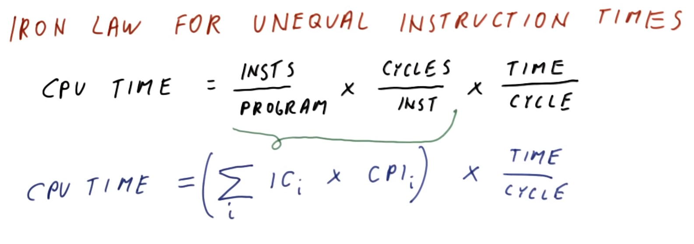
</center>

The Iron Law of Performance can be applied when spending a constant number of cycles for each instruction (cf. Section 15). Additionally, if there are ***unequal*** instructions execution times (i.e., spending variable numbers of cycles for different instructions), the Iron Law of Performance can be generalized as follows:
```
CPU Time = sum(IC_i × CPI_i) × (time/cycle)
```

where:
  * `IC_i` denotes the instructions count for instruction `i`
  * `CPI_i` denotes the cycles per instruction for instruction `i`

Here, as before, the `sum()` equivalently computes the total number of cycles required to execute the program over all of the constituent instructions.

## 18. Iron Law 2 Quiz and Answers

Consider the following system:
  * The program executes `50 billion` instructions
    * `10 billion` are branches, with `4 cycles` per instruction
    * `15 billion` are loads, with `2 cycles` per instruction
    * `5 billion` are stores, with `3 cycles` per instruction
    * The remainder are integer adds, with `1 cycle` per instruction
  * The processor clock cycle speed/frequency is `4 GHz`

What is the total execution time of the program on this processor?
  * `[(10 * 10^9 ins * 4 cycles/ins) + (15 * 10^9 ins * 2 cycles/ins) + (5 * 10^9 ins * 3 cycles/ins) + (20 * 10^9 ins * 1 cycle/ins)] × [1/(4 * 10^9 cycles/s)] = 105/4 s = 26.25 s`

## 19. Amdahl's Law

<center>
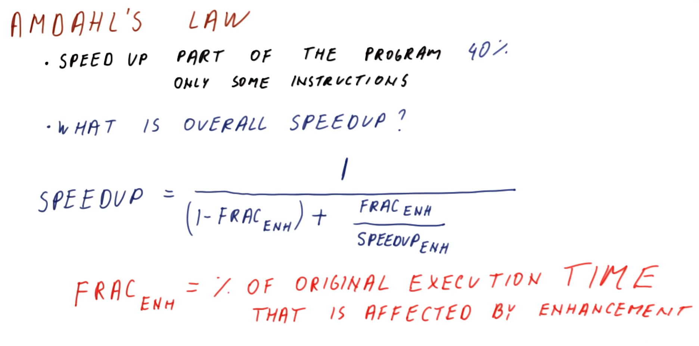
</center>

**Amdahl's Law** considers the resulting system speedup when only *part* of the program (i.e., only *some* of the constituent instructions) is changed. In this situation, the **overall speedup** is as follows:
```
speedup = 1/[(1 - Frac_ENH) + (FRAC_ENH/speedup_ENH)]
```

where `Frac`<sub>`ENH`</sub> is the fraction (or percentage) of the original execution ***time*** (i.e., ***not*** of the number of instructions, etc.) that is affected by the change/enhancement.

## 20. Amdahl's Law Quiz and Answers

Consider the following system:
  * The program executes `50 billion` instructions
  * The processor clock cycle speed/frequency is `2 GHz`
  * The instruction `BRANCH` is improved from `4` to `2` cycles per instruction

Furthermore, the following are given:

| Instruction Type | % of Total Instructions in the Program | CPI |
|:---:|:---:|:---:|
| `INT` | `40%` | `1` |
| `BRANCH` | `20%` | `4` → `2` |
| `LOAD` | `30%` | `2` |
| `STORE` | `10%` | `3` |

What is the overall speedup of the system?
  * via Iron Law:
  ```
  speedup = {[(0.4 * 1) + (0.2 * 4) + (0.3 * 2) + (0.1 * 3) cycles/ins] × (50 * 10^9 ins) × [1/(2 * 10^9 cycles/s)]} /
            {[(0.4 * 1) + (0.2 * 2) + (0.3 * 2) + (0.1 * 3) cycles/ins] × (50 * 10^9 ins) × [1/(2 * 10^9 cycles/s)]}
          = 1.24
  ```

***N.B.*** While it may seem appropriate to apply Amdahl's Law as follows (via `Frac`<sub>`ENH`</sub>` = 20%` per instruction `BRANCH`):
```
speedup = 1/[(1 - 0.2) + (0.2/(4/2))] = 1/0.9 = 1.111
```
this does ***not*** apply here. This is because `Frac`<sub>`ENH`</sub> is only with respect to the instruction `BRANCH` (i.e., its quantity), ***not*** with respect to the overall execution time of the system/program. Recall (cf. Section 19) that Amdahl's Law only applies to execution time, but ***not*** to instructions count or to other such factors.

## 21. Amdahl's Law: Implications

<center>
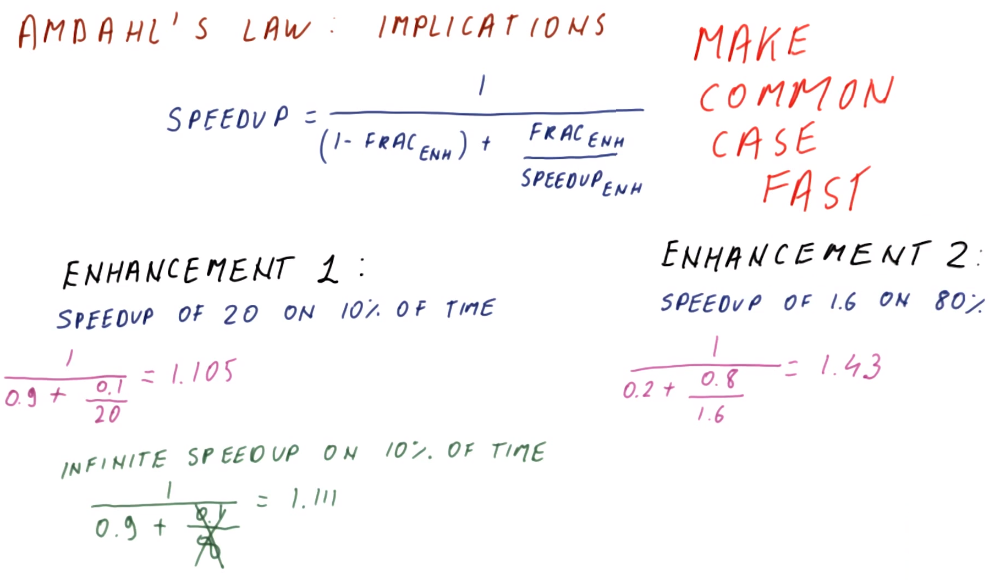
</center>

Let us now examine the implications of Amdahl's Law with respect to system improvements.

Recall Amdahl's law (cf. Section 19), as follows:
```
speedup = 1/[(1 - Frac_ENH) + (FRAC_ENH/speedup_ENH)]
```

Consider the following two enhancements:

| Enhancement | Description | Overall Speedup (via Amdahl's Law) |
|:---:|:---:|:---:|
| 1 | speedup of 20 on 10% of execution time | `1/[(1-0.1) + 0.1/20] = 1.105` |
| 2 | speedup of 1.6 on 80% of execution time | `1/[(1-0.8) + 0.8/1.6] = 1.43` |

Comparing the above, it is therefore generally ***better*** to have a smaller speedup on a larger fraction of the system execution time (Enhancement 2) than to have a larger speedup on a smaller fraction of the system execution time (Enhancement 1).

Examining Enhancement 1, consider the limiting extreme of an infinite speedup: `1/[(1-0.1) + 0.1/∞] = 1.111`. Even in this best-case scenario, Enhancement 2 still provides a better overall speedup.
  * ***N.B.*** A speedup of `20` is already considerably high (and difficult to achieve in practice), so the extreme case of `∞` provides a useful demonstration, but is not otherwise practically feasible.

The overall conclusion from this analysis therefore suggests to ***make the common case fast*** (i.e., focus on speedup on that component(s) of the system which occupies the largest fraction of the overall execution time).

## 22. Amdahl's Law 2 Quiz and Answers

Assume the following are given:

| Instruction Type | % of Execution Time | CPI |
|:---:|:---:|:---:|
| `INT` | `40%` | `1` |
| `BRANCH` | `20%` | `4` |
| `LOAD` | `30%` | `2` |
| `STORE` | `10%` | `3` |

Furthermore, the clock frequency is `2 GHz`.

Which of the following possible improvements is the best? (Select the correct option.)
  * Decrease CPI from `4` to `3` for instruction `BRANCH`
    * `INCORRECT` - `1/[(1-0.2) + 0.2/(4/3)] = 1.05`
  * Increase clock frequency from `2 GHz` to `2.3 GHz`
    * `CORRECT` - `1/[(1-1) + 1/(2.3/2)] = 1.15`
  * Decrease CPI from `3` to `2` for instruction `STORE`
    * `INCORRECT` - `1/[(1-0.1) + 0.1/(3/2)] = 1.034`

***N.B.*** Observe that increasing the clock frequency impacts `100%` of the system execution time, compared to the relatively smaller system-wide impacts of the instructions `BRANCH` (`20%`) AND `STORE` (`10%`).

## 23. Lhadma's Law

<center>
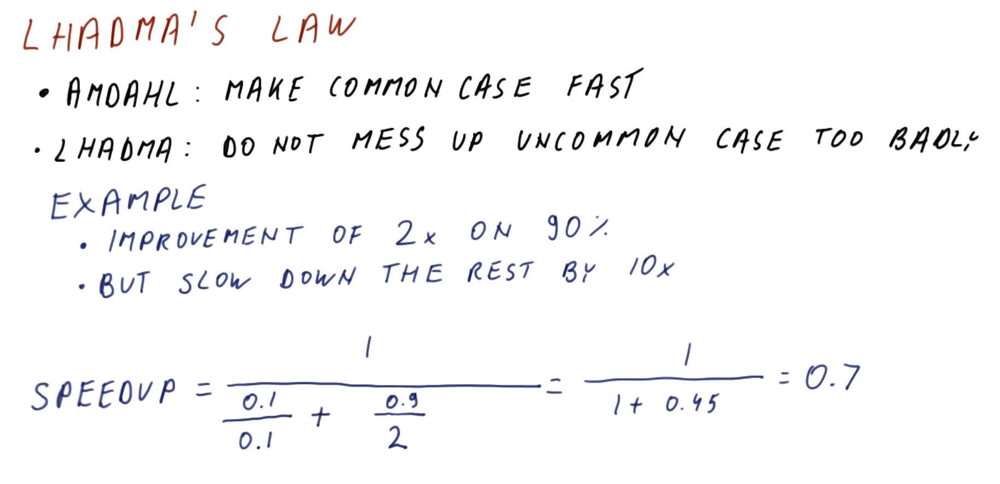
</center>

Now consider so-called **Lhadma's Law**, a corollary to Amdahl's Law (which suggests to make the common case fast): Do not adversely impact the uncommon case too excessively (i.e., in the process of making the common case fast).

Consider the following demonstrative example:
  * An improvement/speedup of `2×` on `90%` of the execution time
  * But a corresponding slowdown of the rest of the system by `10×`

The overall speedup is therefore: `1/{[0.1/(1/10)] + [0.9/(2/1)]} = 1/[1 + 0.45] = 0.7`

This suggests an overall *slowdown* of the system. In fact, even if the `90%` were improved by a factor of `∞`, the limit on the overall speedup would be only `1` (i.e., no net speedup). Therefore, with a worsening of even a relatively small part of the overall system (e.g., `10%`), the resulting impact on the overall system speedup can be net negative!

## 24. Diminishing Returns

<center>
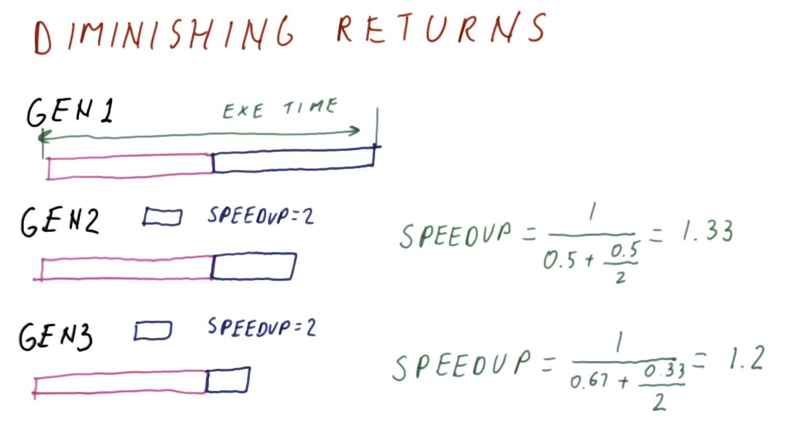
</center>

A final consequence of Amdahl's Law to consider is that of the **law of diminishing returns**.

Consider a processor Gen 1 whose execution can be divided into two phases (as denoted by purple and blue in the figure shown above), each of which constitute approximately half of the overall execution time.

In the subsequent Gen 2 processor, the blue phase is sped up by `2×`. The overall speedup with respect to Gen 1 is then: `1/[(1-0.5) + 0.5/2] = 1.33`

Similarly, in the subsequent Gen 3 processor, the blue phase is again sped up by `2×`. The overall speedup with respect to Gen 2 is then: `1/[(1-1/3) + (1/3)/2] = 1.2`

Therefore, inasmuch as the blue phase constitutes a decreasing fraction of the overall execution time in subsequent generations of the processor, speeding up this phase generation-over-generation yields a marginally diminishing improvement in the speedup. Consequently, eventually there will be practically no speedup observed generation-over-generation.

Furthermore, it is typically the case that the initial improvement in a system component is relatively simple to accomplish, while subsequent improvements require a much larger expenditure of effort, cost, etc. (i.e., eventually it is more practical to focus on improving the purple phase rather than continuing to focus on the blue phase).

Therefore, the implication of the law of diminishing returns is that computer architectures should not over-focus on continually improving the *same* system component, but rather critically assess what is the currently dominant component (with respect to the overall system execution time) at any given point.

## 25. Lesson Outro

Now we know how to measure and compare performance, and we also know that overall performance improvement requires a careful balance between improving one aspect of the design while simultaneously minimizing adverse impacts on the other aspects of the design.

We are now ready to examine more advanced techniques for improving performance and efficiency. In the next lesson, we will first examine **pipelining**, one of the most important and generally applicable techniques available in a computer architect's arsenal.
