# Pipelining

## 1. Lesson Introduction

There are several key concepts that are used in many ways in computer architecture. One of these concepts is called **pipelining**, and it used in several ways in virtually every computer nowadays.

***N.B.*** You should already be familiar with pipelining (and how it is used to improve processor performance) as a prerequisite for this course. Therefore, this lecture is provided mainly as a review of pipelining in a manner which sets the stage for more advanced topics.

## 2. Pipelining

<center>
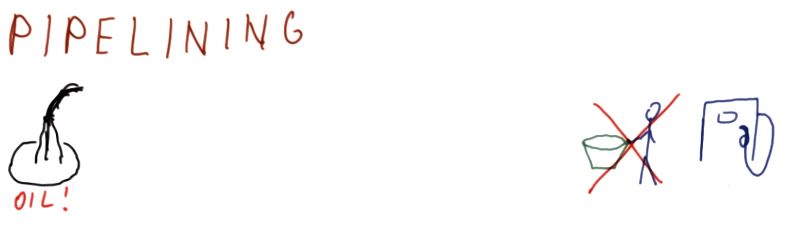
</center>

Consider discovery of oil at a distant location from a destination gas station. Transferring the oil via bucket takes `3` days to complete. It takes `4` round trips to fill the pumping station. Clearly, this approach is extremely inefficient.

<center>
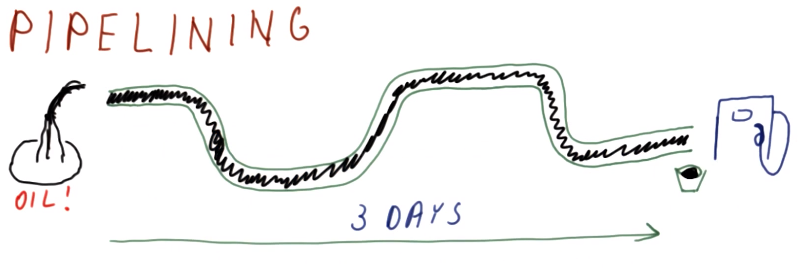
</center>

Alternatively, consider installing a long pipe between the oil source and the gas station. Initially, oil is pumped through the pipe from the source to the pumping station, taking `3` days for the oil to travel through and fill the entire pipe, yielding a bucket of oil at the pumping station.

<center>
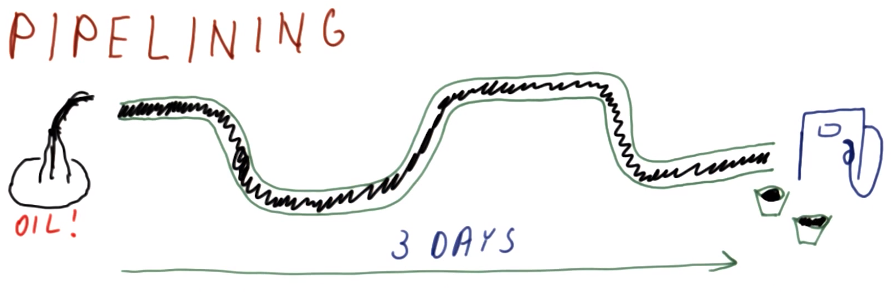
</center>

The latency is still `3` days; so what is the big deal, then? In this case, after filling the pipe, the subsequent buckets of oil are immediately available for filling now that the pipe is continuously "primed"/full. Therefore, after the initial latency, the rate of pumped oil will be much higher than round trips with a bucket.

Therefore, with respect to pipelining, a key idea is that while the initial latency may be long, the subsequent in-progress process will be efficiently delivered in rapid succession.

## 3. Pipelining in a Processor

<center>
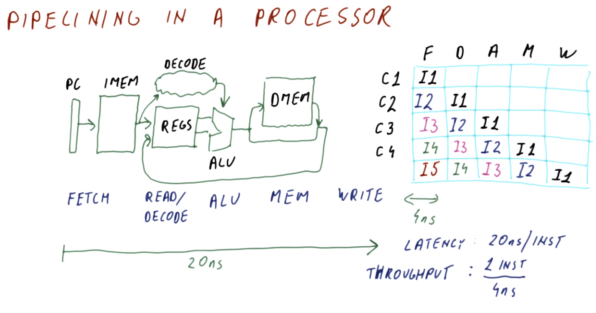
</center>

Now, we will apply the idea of pipelining to a processor. Traditional processors are comparatively simple by modern standards, however, they are still illustrative for the purpose of describing pipelining.

In a traditional processor, there are the following **components** (as in the figure shown above):
  * **program counter** (**PC**)
  * **instruction memory** (**IMEM**)
  * **registers** (**REGS**)
  * **arithmetic/logic unit** (**ALU**)
  * **dynamic memory** (**DMEM**)

The process flow occurs as follows:
  1. The PC accesses IMEM for the next instruction
  2. The instruction is decoded to determine the instruction type, and possibly simultaneously examining the registers
  3. Once the registers are read, they are fed into the ALU, which performs the corresponding operation (e.g., `ADD`, `SUB`, `XOR`, etc.) per the decoding logic
  4. The result of the ALU computation can be written back into the registers, or if a `LOAD` or `STORE` instruction is received then it will be used to access data memory which then provides the value to write back into the registers

***N.B.*** Additionally, there are other operations (e.g., branching) that can occur within this process flow.

In this manner, one instruction per cycle is achieved. Therefore, the following **stages** of operation can be denoted on a per-cycle basis:
* 1. `FETCH` (`F`) - the PC fetches an instruction from IMEM
* 2. `READ/DECODE` (`D`) -  registers are read and decoded
* 3. `ALU` (`A`) - the ALU performs a computation/operation
* 4. `MEM` (`M`) - DMEM is accessed
* 5. `WRITE` (`W`) - registers are written to

The time to perform these successive steps may total around `20 ns` (i.e., per instruction). Therefore, to apply pipelining to this process, the idea is to "continuously fill" these five stages during operation with instructions (e.g., `I1`, `I2`, etc.), for example:

| Cycle | `F` | `D` | `A` | `M` | `W` |
|:---:|:---:|:---:|:---:|:---:|:---:|
| C1 | I1 | | | | |
| C2 | I2 | I1 | | | |
| C3 | I3 | I2 | I1 | | |
| C4 | I4 | I3 | I2 | I1 | |
| C5 | I5 | I4 | I3 | I2 | I1 |

Therefore, immediately following cycle C5, instruction I1 is completed, and then each successive cycle yields an additionally complete instruction (i.e., I2, I3, etc.). Assuming that each stage takes the same time to complete, this gives `(20 ns)/(5 stages) = 4 ns/stage`, and therefore after the initial **latency** of `20 ns` to "fill" the pipeline with one complete instruction, subsequent instructions will be completed at this rate of `4 ns` per cycle, i.e., a **throughput** of `(1 instruction)/(4 ns) = 0.25 instructions/ns`.

## 4. Laundry Pipelining Quiz and Answers

<center>
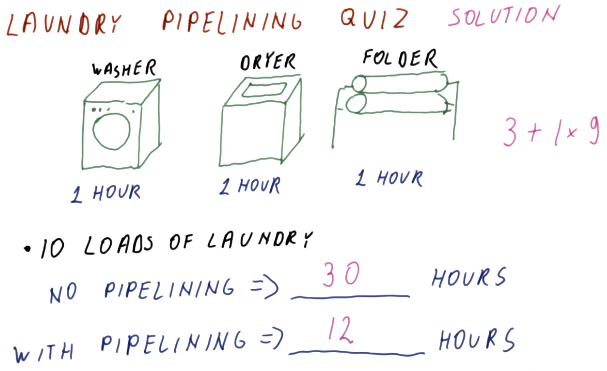
</center>

Assume the following devices are available for doing laundry:

| Device | Execution Time per Operation |
|:---:|:---:|
| Washer | `1 hr` |
| Dryer | `1 hr` |
| Folder | `1 hr` |

For `10` loads of laundry, what is the total completion time required:
  * Without pipelining?
    * `1*10 + 1*10 + 1*10 = 30 hr`
  * With pipelining?
    * `3*1 + 1*(10-1) = 12 hr`

Therefore, pipelining reduces the total completion time dramatically, by minimizing idle time on any particular device.

## 5. Instruction Pipelining Quiz and Answers

Consider a `5`-stage processor pipeline (with `1` clock cycle per stage) executing a program comprised of `10` instructions.

What is the total program execution time (in cycles):
  * Without pipelining?
    * `(5 stages/instruction)*(1 cycle/stage)*(10 instructions/program) = 50 cycles/program`
  * With pipelining?
    * `5*1*1 + 1*1*(10-1) = 14 cycles/program`

***N.B.*** As before, with pipelining, it takes a full instruction (i.e., there is latency) to fill the pipeline first.

## 6. Pipeline Cycles per Instruction (CPI)

<center>
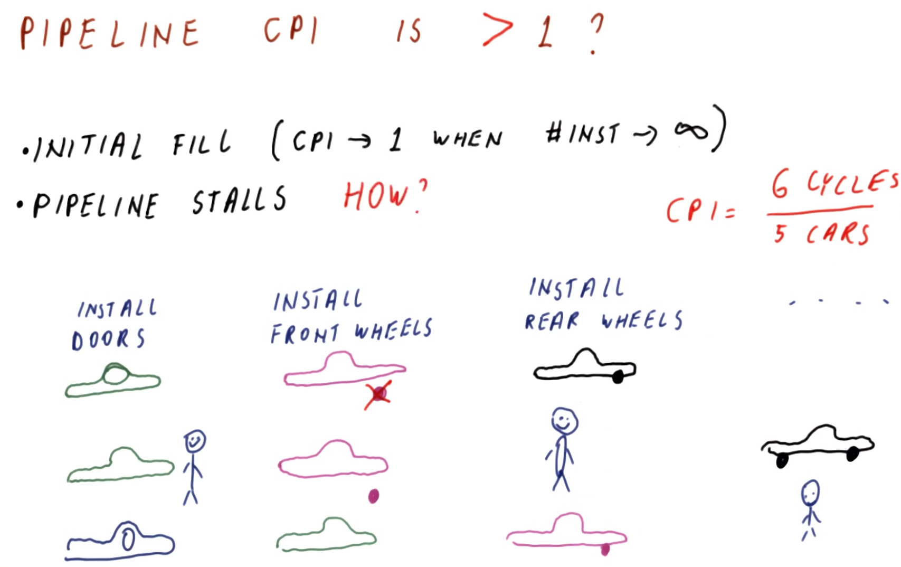
</center>

In principle, the **cycles per instruction** (**CPI**) should be `1` once the pipeline is filled. A typical program is composed of *billions* of instructions, so the first few cycles (i.e., to initially fill the pipeline) are effectively negligible, and therefore ***at steady state*** this suggests a CPI of `1`. However, is this necessarily true?

In fact, this is ***not*** always the case. The reasons this may not be achieved include:
  * Initial filling of the pipeline
    * However, even with the initial filling, the CPI will approach `1` as the number of instructions grows (in principle, even approaching `∞` instructions)
  * Pipeline stalls

With respect to **pipeline stalls**, consider a car production line (as in the figure shown above), comprised of the following stages:
  1. install doors
  2. install front wheels
  3. install rear wheels
  4. etc.

Now, consider the sequential assembly of a black car, purple car, green car, and blue car.
  * During the installation of the front wheels for the purple car, the machine damages the wheels. Therefore, while the black car is able to proceed to subsequent stages, the purple car is unable to proceed to the next stage (rear wheels installation), and consequently must remain in its current stage (front wheel installation) to correct the issue (i.e., install a new set of wheels).
  * Because the purple car was unable to proceed in this stage cycle, the worker who installs the rear wheels is ***idle*** for the next cycle, awaiting arrival of the purple car. Furthermore, the subsequent green car is unable to proceed onto the next stage (install front wheels) pending correction of the issue with the purple car.
  * Once the issue is corrected for the purple car, the pipeline can proceed as before (including commencing assembly on the most recently begun blue car), however, there is now an "idle gap" that propagates through the pipeline.

Therefore, a pipeline stall introduces inefficiency into pipelining. If such stalls occur regularly over the course of program execution, this can result in a steady-state `CPI > 1` (e.g., `(6 cycles)/(5 cars) = 1.2 cycles/car`), which is inefficient.

How, then, can stalling occur in a *processor pipeline* (i.e., as opposed to the car assembly analogy)? This is discussed in the next section.

## 7. Processor Pipeline Stalls

<center>
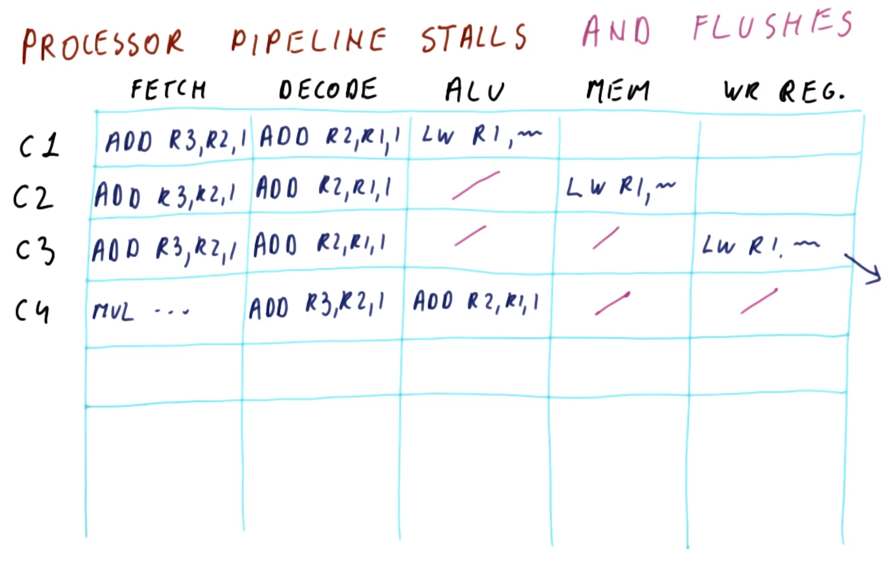
</center>

Consider how a stall can occur in a five-stage processor pipeline, as in the figure shown above.

The initial state of the pipeline is as follows:

| Cycle | `F` | `D` | `A` | `M` | `W` |
|:---:|:---:|:---:|:---:|:---:|:---:|
| C1 | `ADD R3, R2, 1` | `ADD R2, R1, 1` | `LW R1, ...` | | |

In this case, instruction `ADD R2, R1, 1` reads the incorrect value of the register `R1`, thereby generating a **processor stall**. The instruction must remain in the stage `D` to rectify the issue, thereby generating a "gap" in the pipeline, as follows:

| Cycle | `F` | `D` | `A` | `M` | `W` |
|:---:|:---:|:---:|:---:|:---:|:---:|
| C1 | `ADD R3, R2, 1` | `ADD R2, R1, 1` | `LW R1, ...` | | |
| C2 | `ADD R3, R2, 1` | `ADD R2, R1, 1` | (*gap*) | `LW R1, ...` | |

Furthermore, several such "gaps" can occur, even when there is only a single dependency across stages (e.g., `R1`). In this case, the re-read of `R1` generates another "gap" as follows:

| Cycle | `F` | `D` | `A` | `M` | `W` |
|:---:|:---:|:---:|:---:|:---:|:---:|
| C1 | `ADD R3, R2, 1` | `ADD R2, R1, 1` | `LW R1, ...` | | |
| C2 | `ADD R3, R2, 1` | `ADD R2, R1, 1` | (*gap*) | `LW R1, ...` | |
| C3 | `ADD R3, R2, 1` | `ADD R2, R1, 1` | (*gap*) | (*gap*) | `LW R1, ...` |

Assuming `R1` can be read (`D`) and written (`W`) in the same cycle, the pipeline proceeds as follows:

| Cycle | `F` | `D` | `A` | `M` | `W` |
|:---:|:---:|:---:|:---:|:---:|:---:|
| C1 | `ADD R3, R2, 1` | `ADD R2, R1, 1` | `LW R1, ...` | | |
| C2 | `ADD R3, R2, 1` | `ADD R2, R1, 1` | (*gap*) | `LW R1, ...` | |
| C3 | `ADD R3, R2, 1` | `ADD R2, R1, 1` | (*gap*) | (*gap*) | `LW R1, ...` |
| C4 | `MUL ...` | `ADD R3, R2, 1` | `ADD R2, R1, 1` | (*gap*) | (*gap*) |

Therefore, this pipeline results in a CPI of `(5 cycles)/(3 instructions) = 1.67 > 1`.

***N.B.*** Generally, processor stalls are detected by the hardware itself.

A processor pipeline may also need to be **flushed** (unlike the previously described car assembly analogy), as discussed next.

## 8. Processor Pipeline Stalls and Flushes

<center>
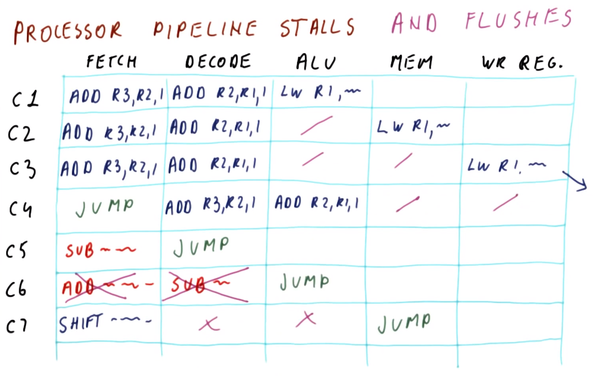
</center>

Continuing from the example of the previous section, suppose that the next instruction is `JUMP`, as follows:

| Cycle | `F` | `D` | `A` | `M` | `W` |
|:---:|:---:|:---:|:---:|:---:|:---:|
| C1 | `ADD R3, R2, 1` | `ADD R2, R1, 1` | `LW R1, ...` | | |
| C2 | `ADD R3, R2, 1` | `ADD R2, R1, 1` | (*gap*) | `LW R1, ...` | |
| C3 | `ADD R3, R2, 1` | `ADD R2, R1, 1` | (*gap*) | (*gap*) | `LW R1, ...` |
| C4 | `JUMP` | `ADD R3, R2, 1` | `ADD R2, R1, 1` | (*gap*) | (*gap*) |

Since the instruction `JUMP` is not decoded initially, the subsequent instructions are fed into the pipeline:

| Cycle | `F` | `D` | `A` | `M` | `W` |
|:---:|:---:|:---:|:---:|:---:|:---:|
| C1 | `ADD R3, R2, 1` | `ADD R2, R1, 1` | `LW R1, ...` | | |
| C2 | `ADD R3, R2, 1` | `ADD R2, R1, 1` | (*gap*) | `LW R1, ...` | |
| C3 | `ADD R3, R2, 1` | `ADD R2, R1, 1` | (*gap*) | (*gap*) | `LW R1, ...` |
| C4 | `JUMP` | `ADD R3, R2, 1` | `ADD R2, R1, 1` | (*gap*) | (*gap*) |
| C5 | `SUB ...` | `JUMP` | `ADD R3, R2, 1` | `ADD R2, R1, 1` | (*gap*) | 

By cycle C6, the instruction `JUMP` is interpreted, however, the subsequent instructions are inappropriate for this instruction:

| Cycle | `F` | `D` | `A` | `M` | `W` |
|:---:|:---:|:---:|:---:|:---:|:---:|
| C1 | `ADD R3, R2, 1` | `ADD R2, R1, 1` | `LW R1, ...` | | |
| C2 | `ADD R3, R2, 1` | `ADD R2, R1, 1` | (*gap*) | `LW R1, ...` | |
| C3 | `ADD R3, R2, 1` | `ADD R2, R1, 1` | (*gap*) | (*gap*) | `LW R1, ...` |
| C4 | `JUMP` | `ADD R3, R2, 1` | `ADD R2, R1, 1` | (*gap*) | (*gap*) |
| C5 | `SUB ...` | `JUMP` | `ADD R3, R2, 1` | `ADD R2, R1, 1` | (*gap*) | 
| C6 | `ADD ...` | `SUB ...` | `JUMP` | `ADD R3, R2, 1` | `ADD R2, R1, 1` |

Therefore, to rectify this, the processor **flushes** the instructions:

| Cycle | `F` | `D` | `A` | `M` | `W` |
|:---:|:---:|:---:|:---:|:---:|:---:|
| C1 | `ADD R3, R2, 1` | `ADD R2, R1, 1` | `LW R1, ...` | | |
| C2 | `ADD R3, R2, 1` | `ADD R2, R1, 1` | (*gap*) | `LW R1, ...` | |
| C3 | `ADD R3, R2, 1` | `ADD R2, R1, 1` | (*gap*) | (*gap*) | `LW R1, ...` |
| C4 | `JUMP` | `ADD R3, R2, 1` | `ADD R2, R1, 1` | (*gap*) | (*gap*) |
| C5 | `SUB ...` | `JUMP` | `ADD R3, R2, 1` | `ADD R2, R1, 1` | (*gap*) | 
| C6 | (*flushed*) | (*flushed*) | `JUMP` | `ADD R3, R2, 1` | `ADD R2, R1, 1` |

Consequently, in the subsequent cycle C7, the appropriate corresponding instruction (`SHIFT ...`) is fed into the pipeline:

| Cycle | `F` | `D` | `A` | `M` | `W` |
|:---:|:---:|:---:|:---:|:---:|:---:|
| C1 | `ADD R3, R2, 1` | `ADD R2, R1, 1` | `LW R1, ...` | | |
| C2 | `ADD R3, R2, 1` | `ADD R2, R1, 1` | (*gap*) | `LW R1, ...` | |
| C3 | `ADD R3, R2, 1` | `ADD R2, R1, 1` | (*gap*) | (*gap*) | `LW R1, ...` |
| C4 | `JUMP` | `ADD R3, R2, 1` | `ADD R2, R1, 1` | (*gap*) | (*gap*) |
| C5 | `SUB ...` | `JUMP` | `ADD R3, R2, 1` | `ADD R2, R1, 1` | (*gap*) | 
| C6 | (*flushed*) | (*flushed*) | `JUMP` | `ADD R3, R2, 1` | `ADD R2, R1, 1` |
| C7 | `SHIFT ...` | (*flushed*) | (*flushed*) | `JUMP` | `ADD R3, R2, 1` |

This results in a CPI of `(4 cycles)/(2 instructions) = 2 > 1`.

## 9. Control Dependencies

<center>
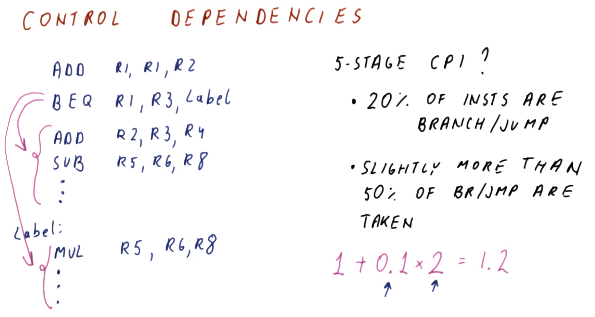
</center>

The "branch" and "jump" problems from the previous section are due to what is called a **control dependency**.

Consider the following program:
```mips
  ADD R1, R1, R2     # L1
  BEQ R1, R3, Label  # L2
  ADD R2, R3, R4     # L3
  SUB R5, R6, R8     # L4
  # ...

Label:
  MUL R5, R6, R8     # L5
  # ...
```

The instructions in lines L3 and L4 (and onwards) have a control dependency on the branch in L2, i.e., the execution of the former depends on the result of the latter. Similarly, the instruction in line L5 (and onwards) has a control dependency on the branch in L2. Essentially, once a branch occurs in the program, all subsequent instructions to be executed will have a control dependency on the branch point; therefore, it is indeterminate a priori whether or not to fetch the subsequent instructions until the branch instruction itself is known.

Consider now the effect of such control dependencies on the five-stage pipeline's CPI.
  * On average, about 20% of all instructions are branches and jumps.
  * Slightly more than 50% of branch/jump instructions are actually taken (i.e., they proceed to `Label` or similar, rather than executing the immediately succeeding instructions).

Therefore, based on these facts, the expected CPI is `1 + (0.20*0.50)*2 = 1.2` (assuming the error is caught in the third stage, resulting in `2` subsequent flushes generated by the pipeline).

With a deeper pipeline (i.e., more than five stages), this "guessing penalty" is larger, because the error will be caught in a later stage, thereby generating more upstream flushes. In fact, such a deep pipeline is typical in modern architectures.

Conversely, if we are able to make better predictions about the branching behavior, such penalties can be either reduced or largely eliminated. Later in the course, we will discuss the technique called **branch prediction**, which deals with this particular issue.

## 10. Control Dependency Quiz and Answers

Consider the following pipeline:
  * `25%` of all instructions are taken as branches/jumps
  * The pipeline has `10` stages
  * The correct target for branch/jump instructions is detected in the sixth stage
  * Everything else flows "smoothly"

What is the actual CPI for this pipeline?
  * `1 + 0.25*5 = 2.25`

The result of this suggests that branching more than *halves* the throughput of the pipeline!

## 11. Data Dependencies

<center>
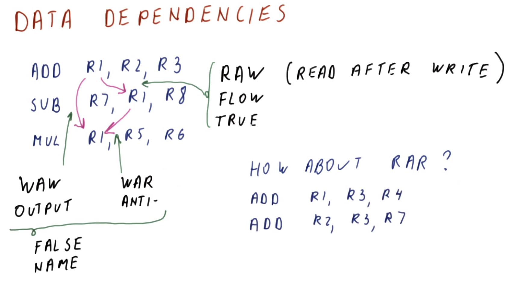
</center>

Additionally, there are also **data dependencies** which can cause pipeline stalls.

Consider the following instructions:
```mips
ADD R1, R2, R3
SUB R7, R1, R8
```

Here the instruction `SUB` has a data dependency on the previous instruction `ADD` via `R1`. This is called a **read after write** (**RAW**) **dependency**, also called a **flow dependency** or a **true dependency**.

In such a scenario, we cannot simply feed such instructions successively into the pipeline assuming they are effectively independent of each other.

There also additional data dependencies that can occur. Consider an extension of the aforementioned instructions as follows:
```mips
ADD R1, R2, R3
SUB R7, R1, R8
MUL R1, R5, R6
```

Here, `R1` creates another dependency among the instructions `ADD`, `SUB`, and `MUL`.
  * In the case of `ADD` vs. `MUL`, `ADD` must complete its use of `R1` prior to `MUL` writing a new value to it for use by instructions subsequent to `MUL`. This is called a **write after write** (**WAW**) **dependency** (i.e., the orders of the write operations are significant), also called an **output dependency**.
  * In the case of `SUB` vs. `MUL`, `SUB` must finish reading `R1` before `R1` can be used by `MUL` (which overwrites `R1`). This is called a **write after read** (**WAR**) **dependency** (i.e., the value must be read prior to being written over), also called an **anti dependency** (it effectively reverses the order of the flow dependencies).

***N.B.*** For reasons that are described later, these latter two dependencies (WAW and WAR) are also collectively called **false dependencies** or **name dependencies**.

So, then, is there a "read after read" data dependency? The answer is no. Consider the following instructions:
```mips
ADD R1, R3, R4
ADD R2, R3, R7
```

Observe that there is no dependency among these two `ADD` instructions; if they are reordered, the net effect is equivalent (i.e., the correct value of `R3` will be read in either order).

## 12. Data Dependencies Quiz and Answers

<center>
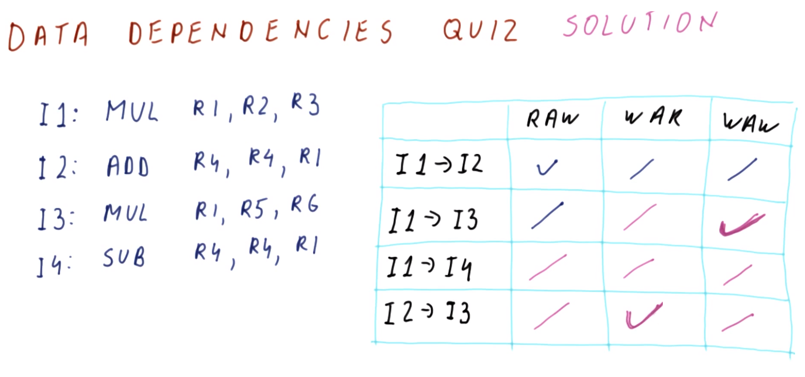
</center>

Consider the program composed of the following instructions:
```mips
MUL R1, R2, R3  # I1
ADD R4, R4, R1  # I2
MUL R1, R5, R6  # I3
SUB R4, R4, R1  # I4
```

Identify (via `√`) the data dependencies (if any) among the following pairs of instructions:

| Dependencies Pair | RAW | WAR | WAW |
|:---:|:---:|:---:|:---:|
| `I1` → `I2` | `√` | | |
| `I1` → `I3` | | | `√` |
| `I1` → `I4` | | | |
| `I2` → `I3` | | `√` | |

Explanation:

| Dependencies Pair | RAW | WAR | WAW |
|:---:|:---:|:---:|:---:|
| `I1` → `I2` | `√` | ("freebie" given initially in the prompt) | ("freebie" given initially in the prompt) |
| `I1` → `I3` | There are no shared registers between these instructions | `I3` does not write a result into a register that is previously read by `I1` | `√` - `I3` overwrites the result produced by `I1` in register `R1` |
| `I1` → `I4` | `I4` reads register `R1`, however, the value it reads is *not* that produced by `I1` (but rather that produced by `I3`) | `I4` does not write a result into a register that is previously read by `I1` | `I4` writes to register `R4`, which is not used by `I1`; furthermore, even if `I4` were to have written to register `R1`, this would have been a data dependency with `I3` (via register `R1`) rather than with `I1` |
| `I2` → `I3` | `I2` does not write to a register that is subsequently read by `I3` | `√` - `I3` overwrites register `R1`, which is previously read by `I2` | `I3` and `I2` each access *different* registers for writing (`R1` and `R4`, respectively) |

## 13. Dependencies and Hazards

Consider now the relationship between the aforementioned dependencies and what are called **pipeline hazards**.

A **dependency** is a property of the *program* alone. We can check whether two (or more) instructions have a dependency among them by simple inspection, without any regard for what the pipeline looks like.

In a particular pipeline, *some* dependencies will potentially cause problems, while other dependencies cannot cause problems no matter what.

<center>

</center>

An example of this as in the figure shown above, which depicts the traditional five-stage pipeline as before.

The corresponding program has an output dependency (via register `R1`), as follows:
```mips
ADD R1, R2, R3
MUL R1, R4, R5
```

In this particular pipeline, the output dependency is never a problem.

| Cycle | `F` | `D` | `A` | `M` | `W`|
|:---:|:---:|:---:|:---:|:---:|:---:|
| C1 | `...` | `...` | `...` | `MUL` | `ADD` |

The instruction `ADD` proceeds through the pipeline until it reaches the write stage (`w`).

At the point of cycle C1, the instruction `MUL` has proceeded through the upstream stages (i.e., has been fetched and decoded, and has performed the read of registers `R4` and `R5`). The correct values are read for `R4` and `R5` (since they are unaffected by the instruction `ADD`), and now `MUL` simply sits in the memory stage (`M`) since it is not a memory operation; `MUL` has the computed value that it will write to `R1` at this point.

| Cycle | `F` | `D` | `A` | `M` | `W`|
|:---:|:---:|:---:|:---:|:---:|:---:|
| C1 | `...` | `...` | `...` | `MUL` | `ADD` |
| C2 | `...` | `...` | `...` | `...` | `MUL` |

In the subsequent cycle C2 (i.e., after the instruction `ADD` leaves the pipeline), `MUL` simply writes its computed value to register `R1`. Therefore, as this demonstrates, these two instructions *always* write to `R1` in the correct order, and so the output dependency is not consequential to performance (i.e., CPI) in this particular pipeline, which naturally satisfies this dependency.

<center>
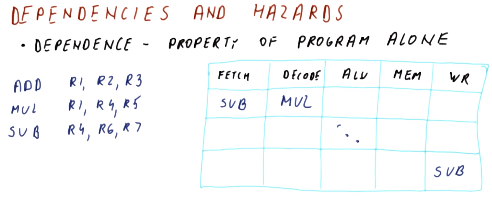
</center>

Consider another example as in the figure shown above.

The corresponding program has a write after read (RAW) dependency (via register `R4`), as follows:
```mips
ADD R1, R2, R3
MUL R1, R4, R5
SUB R4, R6, R7
```

Here, similarly the RAW dependency does not affect the performance of the particular pipeline.

| Cycle | `F` | `D` | `A` | `M` | `W`|
|:---:|:---:|:---:|:---:|:---:|:---:|
| C1 | `SUB` | `MUL` | `...` | `...` | `...` |

The instruction `MUL` reads register `R4` in the decode stage (`D`), and at this point (cycle C1) the instruction `SUB` is being fetched (stage `F`); this read of `R4` is not yet affected by the (later-occurring) instruction `SUB`.

| Cycle | `F` | `D` | `A` | `M` | `W`|
|:---:|:---:|:---:|:---:|:---:|:---:|
| C1 | `SUB` | `MUL` | `...` | `...` | `...` |
| ⁝ | ⁝ | ⁝ | ⁝ | ⁝ | ⁝ |
| C4 | `...` | `...` | `...` | `...` | `SUB` |

Later on, when instruction `MUL` exits the pipeline, instruction `SUB` writes to register `R4` in the write stage (`W`). Here, there is no issue presented in the pipeline, because despite consecutive instructions' use of the register `R4`, the read of `R4` by instruction `MUL` occurs several cycles upstream of the subsequent overwrite of the value by instruction `SUB`.

<center>
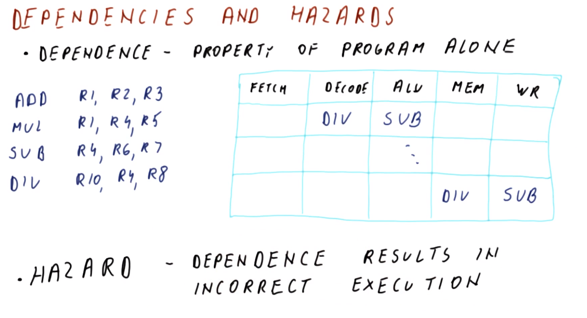
</center>

Now, consider a counterexample as in the figure shown above.

The corresponding program has a true dependency (via register `R4`), as follows:
```mips
ADD R1, R2, R3
MUL R1, R4, R5
SUB R4, R6, R7
DIV R10, R4, R8
```

Here, the true dependency *does* create an issue in the pipeline.

| Cycle | `F` | `D` | `A` | `M` | `W`|
|:---:|:---:|:---:|:---:|:---:|:---:|
| C1 | `...` | `DIV` | `SUB` | `...` | `...` |

In cycle C1, the instruction `DIV` reads register `R4` in the decode stage (`D`); furthermore, in this cycle, the instruction `SUB` is in the ALU stage (`A`). At this point, the instruction `SUB` did *not* write its computed value to register `R4` yet (it is currently computing it via stage `A`), therefore, when the instruction `DIV` attempts to read register `R4` in stage `D`, it is reading a ***stale*** value (i.e., prior to the update via instruction `SUB`).

| Cycle | `F` | `D` | `A` | `M` | `W`|
|:---:|:---:|:---:|:---:|:---:|:---:|
| C1 | `...` | `DIV` | `SUB` | `...` | `...` |
| ⁝ | ⁝ | ⁝ | ⁝ | ⁝ | ⁝ |
| C3 | `...` | `...` | `...` | `DIV` | `SUB` |
| C4 | `...` | `...` | `...` | `...` | `DIV` |

In a subsequent cycle (C3), when instruction `SUB` is finally writing to register `R4`, the instruction `DIV` has already computed its value, and thus in the next cycle (C4), instruction `DIV` eventually writes the stale value into register `R4`.

Therefore, clearly this true dependency ***is*** problematic in this pipeline. If the pipeline is allowed to proceed in this manner, register `R10` will receive the incorrect value upon completion of instruction `DIV`.

Such a situation wherein a dependency can cause such an issue in a pipeline is called a **hazard**. A hazard occurs when a dependency results in incorrect execution of one or more instructions via the pipeline. Hazards are a property of *both* the program itself (because hazards arise due to dependencies within the program itself) *and* the pipeline (which impacts how the instructions interact spatiotemporally within the pipeline).

***N.B.*** As demonstrated, in this particular pipeline, output and anti dependencies cannot become hazards, but true dependencies can.

<center>
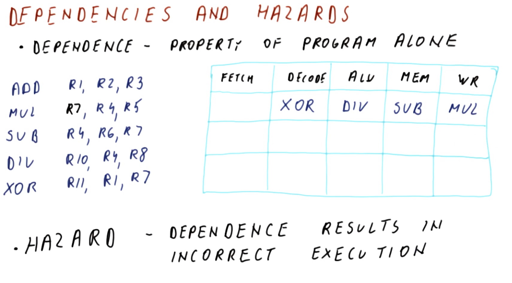
</center>

Note that not all true dependencies result in hazards in this particular pipeline, as demonstrated in the figure shown above.

The corresponding program has a true dependency (via registers `R1` and `R7`), as follows:
```mips
ADD R1, R2, R3
MUL R7, R4, R5   # N.B. write occurs to `R7` instead of `R1` here
SUB R4, R6, R7
DIV R10, R4, R8
XOR R11, R1, R7
```

| Cycle | `F` | `D` | `A` | `M` | `W`|
|:---:|:---:|:---:|:---:|:---:|:---:|
| C1 | `...` | `XOR` | `DIV` | `SUB` | `MUL` |

In cycle C1:
  * The dependency between instructions `XOR` and `ADD` via register `R1` is *not* a hazard in this pipeline. In this pipeline, in general if there are three or more instructions between the producing and consuming instruction, then the consuming instruction reads the dependent register *after* the producing instruction has already written to it.
  * Conversely, the dependency between instructions `XOR` and `MUL` via register `R7` *is* potentially problematic. In this cycle (C1), instruction `XOR` reads `R7` simultaneously as instruction `MUL` is writing to it. If `MUL` writes near the end of the clock cycle while `XOR` reads near the beginning of the clock cycle, then `XOR` will read the incorrect/stale value.

Therefore, in general, this pipeline will only avoid hazards caused by true dependencies if and only if there are three (or more) intermediate instructions between the interdependent instructions.

## 14. Dependencies and Hazards Quiz and Answers

<center>
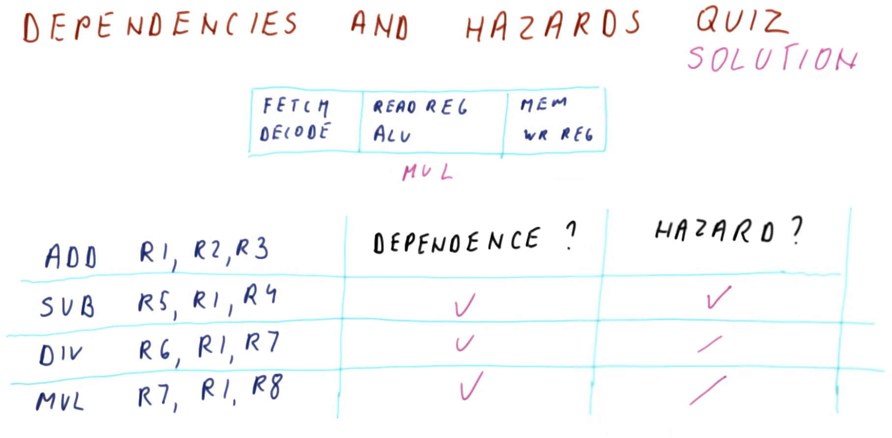
</center>

Consider a three-stage pipeline, with the following stages (`S1`, `S2`, and `S3`, respectively):
  1. fetch, decode
  2. read register, ALU
  3. read memory, write to register

Furthermore, the following program proceeds through the pipeline:
```mips
ADD R1, R2, R3  # I1
SUB R5, R1, R4  # I2
DIV R6, R1, R7  # I3
MUL R7, R1, R8  # I4
```

What (if any) dependencies are there between instructions `I1` and the others? (Indicate via `√`)

| Dependency Pair | Dependency? | Hazard? |
|:---:|:---:|:---:|
| `I1` → `I2` | `√` - There is a dependency via register `R1` | `√` - In cycle C1 (see below), instruction `SUB` may not receive the updated value for `R1` from instruction `ADD` "in time," and therefore may read a stale value instead |
| `I1` → `I3` | `√` - There is a dependency via register `R1` | In cycle C2 (see below), instruction `DIV` is reading the value of `R1` that was already written by instruction `ADD`, and therefore there is *no* hazard |
| `I1` → `I4` | `√` - There is a dependency via register `R1` | In cycle C3 (see below), instruction `MUL` is reading the value of `R1` that was already written by instruction `ADD` (the same value also read previously by instruction `DIV` in cycle C2), and therefore there is *no* hazard  |

| Cycle | `S1` | `S2` | `S3` |
|:---:|:---:|:---:|:---:|
| C1 | `DIV` | `SUB` | `ADD` |
| C2 | `MUL` | `DIV` | `SUB` |
| C3 | `...` | `MUL` | `DIV` |

***N.B.*** Recall that dependencies can exist irrespectively of the pipeline, and therefore can be determined on the basis of the ***program*** alone. Conversely, hazards must be analyzed with respect to the ***pipeline***, which is determined by the relationship between the stages in which the corresponding read and write operations occur.

## 15. Handling of Hazards

<center>
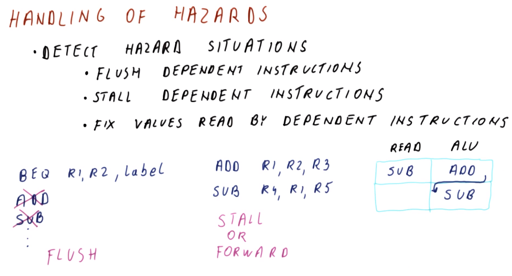
</center>

Now that we have seen that some dependencies can become hazards in a given pipeline, we must handle these hazards somehow, in order to ensure correct execution within the pipeline (i.e., rather than permitting the computation of incorrect results). However, one simplification here is to observe that it is only necessary to handle dependencies which result in hazards (but otherwise we need not concern ourselves with dependencies which do *not* result in hazards).

Therefore, we must ***detect*** hazard situations, and then perform some combination of the following **corrective actions**:
  * flush dependent instructions
  * stall dependent instructions (i.e., delay reading in order to ensure that the correct value is read)
  * fix values that were already read by dependent instructions

It is necessary to use flushes for **control dependencies**, because the instructions already in the pipeline after the control dependency become hazard are the incorrect instructions. Therefore, stalling or fixing the values is not a tenable action; instead, the affected instruction(s) must be removed from the pipeline and then the intended/correct instruction(s) must be subsequently fetched.

For hazards caused by **data dependencies**, we can either stall or forward. 

**Forwarding** makes the value from the previous execution immediately available for execution in the next cycle. Consider the following instructions:
```mips
ADD R1, R2, R3
SUB R4, R1, R5
```

| Cycle | `F` | `D` | `A` | `M` | `W`|
|:---:|:---:|:---:|:---:|:---:|:---:|
| C1 | `...` | `SUB` | `ADD` | `...` | `...` |

At the end of cycle C1, instruction `SUB` has read the wrong (i.e., stale) value in register `R1`; however, the instruction `ADD` does have the updated value in this cycle, but it has not placed it into `R1` yet at this point.

| Cycle | `F` | `D` | `A` | `M` | `W`|
|:---:|:---:|:---:|:---:|:---:|:---:|
| C1 | `...` | `SUB` | `ADD` | `...` | `...` |
| C2 | `...` | `...` | `SUB` | `ADD` | `...` |

Consequently, at the beginning of the next cycle (C2), the instruction `SUB` can retrieve the value of `R1` produced by the instruction `ADD` (i.e., at the end of cycle C1), which replaces the value in `R1` read by `SUB` immediately prior in cycle C1, in order to ensure that instruction `SUB` computes using the correct value of `R1` when `SUB` reaches stage `A`.

Therefore, **forwarding** denotes this notion of a value already existing "somewhere in the pipeline" at a point before it is actually used and consequently being used to "fix" the value subsequently at the actual point of use in the pipeline (i.e., to ensure correct execution).

However, forwarding does not always work. Sometimes, the required value will be produced at a later point in time, i.e., *after* it is needed in the subsequent instruction (i.e., "too late" for the value to be useful); in this case, it is necessary to stall rather than to forward.

## 16. Flushes, Stalls, and Forwarding Quiz and Answers

<center>
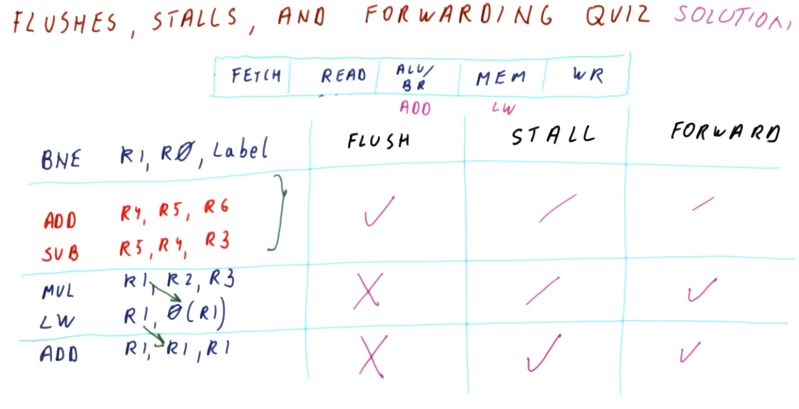
</center>

Consider a five-stage pipeline comprised of the following stages:
  1. fetch instruction
  2. decode instruction and read registers
  3. perform ALU operation and evaluate branch operation
  4. load and store memory
  5. write result to register

The following program executes in the pipeline:
```mips
BNE R1, R0, Label  # I1
ADD R4, R5, R6     # I2 - begin control hazard
SUB R5, R4, R3     # I3 - end control hazard
MUL R1, R2, R3     # I4 - begin data dependency A (via `R1`)
LW  R1, 0(R1)      # I5 - end data dependency A, begin data dependency B (via `R1`)
ADD R1, R1, R1     # I6 - end data dependency B
```

***N.B.*** A control hazard occurs here because after instruction `I1`, we fetch two incorrect instructions (`I2` and `I3`) before finally fetching the correct instruction `I4`.

For each group of instructions, should we flush, stall, and/or forward?

| Instructions Group | Flush | Stall | Forward |
|:---:|:---:|:---:|:---:|
| `I2` & `I3` | `√` - We must flush to resolve a control dependency | Stalling cannot be used for control dependencies | Forwarding cannot be used for control dependencies |
| `I4` & `I5` | Flushing cannot be used for data dependencies | Since forwarding is a viable corrective action, it is preferred over stalling | `√` - In cycle C1 (see below), instruction `LW` reads register `R1` in stage `R` while instruction `MUL` writes the value in stage `A/B`, therefore, this value can be forwarded accordingly so that it is available to instruction `LW` upon its entry into stage `A/B` |
| `I5` & `I6` | Flushing cannot be used for data dependencies | `√` - In cycle C2 (see below), when the instruction `ADD` reads register `R1` in stage `R`, the instruction `LW` (in stage `A/B`) is computing the address and still has not accessed memory at this point. Subsequently, in cycle C3 (see below), the instruction `ADD` is computing using the *incorrect*/stale value in register `R1`, while instruction `LW` is still loading the memory (which it does not complete until the end of this cycle). Therefore, due to this "temporal mismatch," it is necessary to stall.  | `√` - After stalling for a cycle (i.e., in cycle C3, see below), we can forward in order to avoid additional stalling |

| Cycle | `F` | `R` | `A/B` | `M` | `W` |
|:---:|:---:|:---:|:---:|:---:|:---:|
| C1 | `ADD` | `LW` | `MUL` | `SUB` | `ADD` |
| C2 | `...` | `ADD` | `LW` | `MUL` | `SUB` |
| C3 | `...` | `...` | `ADD` | `LW` | `MUL` |

## 17. How Many Stages?

<center>
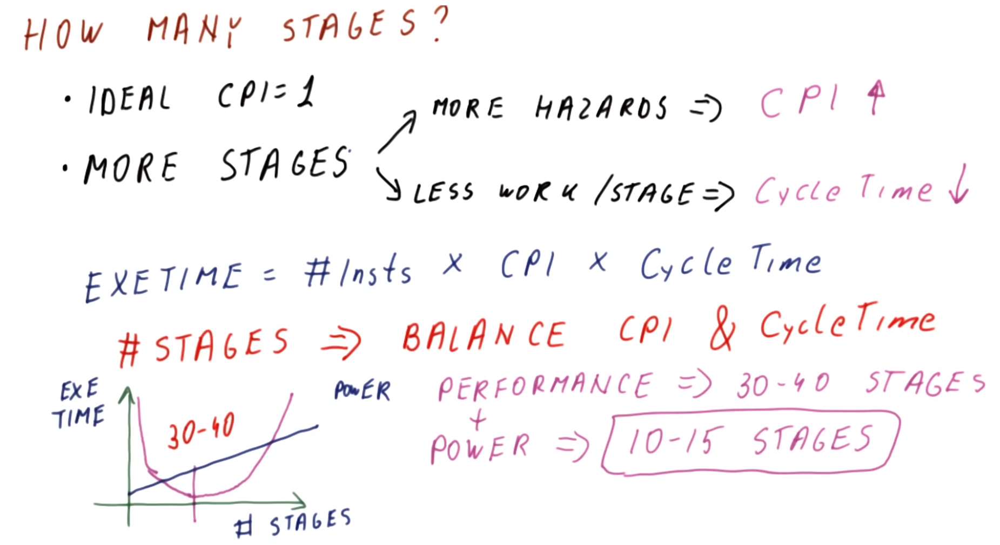
</center>

Now that we have seen how pipelines work and how they are affected by hazards and dependencies, let us now consider how many stages a pipeline should have.

In a pipeline, as we have seen so far, ideally `CPI = 1`. (Later in this course, we will see that it is possible to achieve `CPI < 1`.)

However, in general, adding more stages:
  * Potentially introduces more hazards, thereby generally increasing `CPI`
  * There is less work per stage, thereby shortening/improving cycle time

Recall the Iron Law (cf. Lecture 2):
```
execution time = number of instructions × CPI × cycle time
```

Therefore, for the same number of instructions in a given program:
  * Increasing the CPI increases the execution time
  * Decreasing the cycle time decreases the execution time

Accordingly, the number of stages must be chosen in such a manner which balances the CPI and cycle time in order to minimize the overall execution time.

Examining the relationship between execution time and the number of stages (as in the figure shown above), as the number of stages increases, the execution time decreases (the clock cycle time decreases, while the introduction of hazards is still relatively minimal), however, eventually the effects of hazards begin to dominate, thereby increasing the execution time beyond some optimal (minimized) execution time. In modern processors, this optimum occurs around `30` to `40` stages, which is a considerably "deep" pipeline.

However, this only concerns ***performance***; another consideration is ***power*** usage. As more stages are added (thereby shortening the cycle time), there are more cycles per-unit time, and each of those cycles use more pipeline latches which consume more energy to latch temporary results. Therefore, power quickly increases with the number of stages.

Therefore, when considering *both* performance *and* power, we must select a number of stages that optimizes both *together*. This typically amounts to `10` to `15` stages in modern processors (i.e., which balances adequate performance with acceptably low power consumption).

## 18. Lesson Outro

We now know how pipelines work and how they need to balance the increasing clock frequency vs. the stalls and flushes caused by hazards.

Nowadays, virtually every processor uses pipelining, so therefore we will use our pipelining knowledge throughout the course as we examine some of the more advanced topics in subsequent lectures.
