# Branches

## 1. Lesson Introduction

We have seen in the previous lecture regarding pipelining that each control hazard wastes *many* cycles in a processor pipeline. Since branches and jumps are common, therefore performance will not be particularly good unless we address this issue. That is the central topic of this lecture.

## 2. Branch in a Pipeline

<center>
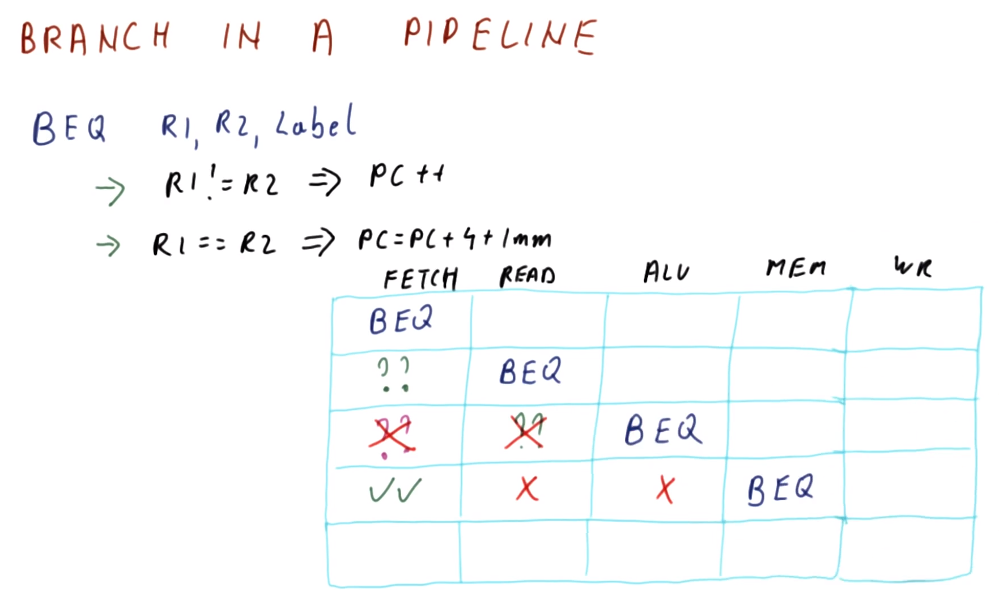
</center>

Before discussing branch prediction in this lecture, recall what a branch does in a pipeline. Consider the following branch instruction:
```mips
BEQ R1, R2, Label
```

This instruction compares registers `R1` and `R2`, and if they are equal, then the program will jump to `Label`. This is usually implemented by storing (in the immediate part of the instruction field) the difference between the next instruction's **program counter** (**PC**) and the PC that should be at `Label`, so that (effectively) if `R1` and `R2` are equal then the branch adds this to the immediate operand to its current PC (i.e., that which it computed for the next instruction).

Therefore:
  * If the branch condition is not met (e.g., `R1 != R2`), then this simply results in an increment of the PC (i.e., `PC++`, an increment by `4` bytes).
  * If the branch condition is met (e.g., `R1 == R2`), then the branch will increment the PC as well as add the immediate value to it (i.e., `PC = PC + 4 + Imm`), in order to ensure that the next fetched instruction will be at `Label`.

Consider, then, what occurs when a branch instruction enters a pipeline (using a traditional five-stage pipeline, as before in Lecture 3).

| Cycle | `F` | `D` | `A` | `M` | `w` |
|:---:|:---:|:---:|:---:|:---:|:---:|
| C1 | `BEQ` | `...` | `...` | `...` | `...` |
| C2 | `?` | `BEQ` | `...` | `...` | `...` |

When the instruction `BEQ` reaches the stage `D` (decode) in cycle C2, it reads its operands `R1` and `R2`, but it is still unclear at this point whether or not the branch will be taken as these operands have not been compared at this point. Therefore, in the upstream stage `F` (fetch), we either will or will not fetch something, which is indeterminate a priori during this cycle.

| Cycle | `F` | `D` | `A` | `M` | `w` |
|:---:|:---:|:---:|:---:|:---:|:---:|
| C1 | `BEQ` | `...` | `...` | `...` | `...` |
| C2 | `?1` | `BEQ` | `...` | `...` | `...` |
| C3 | `?2` |  `?1` | `BEQ` | `...` | `...` |

In the next cycle C3, when the instruction `BEQ` reaches stage `A` (ALU), at the end of this cycle, it is finally determined whether or not the branch is taken. This gives rise to two possibilities:
  1. We have fetched the ***correct*** instructions in the upstream stages (i.e., `?1` and `?2`), and therefore the pipeline can proceed normally since there is no hazard introduced.
  2. We have fetched the ***incorrect*** instructions in the upstream stages, and therefore the pipeline must cancel these instructions.

| Cycle | `F` | `D` | `A` | `M` | `w` |
|:---:|:---:|:---:|:---:|:---:|:---:|
| C1 | `BEQ` | `...` | `...` | `...` | `...` |
| C2 | `?1` | `BEQ` | `...` | `...` | `...` |
| C3 | `?2` |  `?1` | `BEQ` | `...` | `...` |
| C4 | `...` | `X` |  `X` | `BEQ` | `...` |

In the next cycle C4, if the incorrect instructions were fetched previously, then they will be canceled (denoted `X` in the table above), and the subsequent instructions entering the pipeline will proceed as normally. Such a branch misprediction results in an inefficiency, since now the branch effectively takes three cycles to execute (due to cancellation of the subsequent two instructions).

Conversely, if the branch predicted correctly and the correct instructions were fetched previously, such cancellation does not occur, but rather the instructions `?1` and `?2` proceed as normally.

Therefore, in general, it is not advantageous *not* fetch a new instruction after the branching instruction (e.g., `BEQ`), because if we refrain from fetching *anything* at all, then we are *guaranteed* to have two empty instructions after the branching instruction; it is better to incur this penalty only *some* of the time rather *all* of the time.

Another thing that is important to note is that at the end of the stage `F` (fetch) (where the instruction `BEQ` is fetched), we do not know anything about this instruction yet at this point. All we have obtained is the instruction word (the 4 bytes representing the instruction), but he have not yet begun to decode the branch. Therefore, in the next cycle, we must fetch the next instruction based only on the knowledge of the branch instruction's address, but otherwise we are unaware of whether or not it is a branch instruction at this point; this means there is insufficient information to make a prediction regarding whether or not to branch.

# 3. Branch Prediction Requirements

<center>
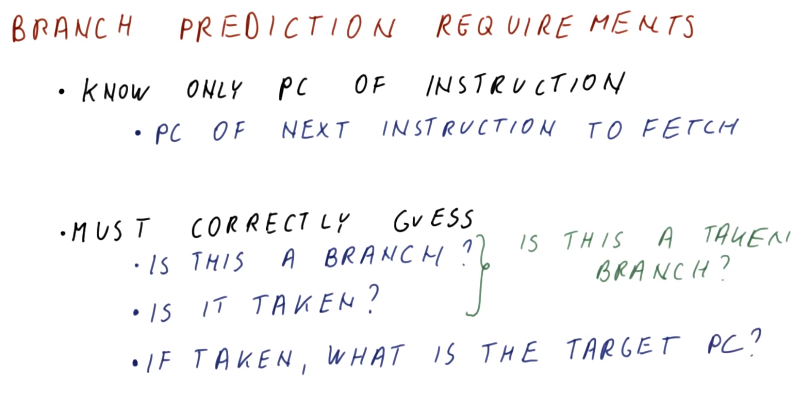
</center>

What, then, is required in order to perform **branch predictions** (i.e., determining whether or not a branch is taken, and if so to where)?

Branch prediction can be feasibly implemented with only the knowledge of where we fetch the current instruction from; therefore, it is necessary to guess the program counter (PC) of the next instruction to be fetched.

Therefore, branch prediction must correctly guess the following series of questions:
  1. Is this a branch?
  2. If it is a branch, is the branch taken?
  3. If the branch *is* taken, what is the target PC?

The first two questions can be combined into a single question: Is this a branch that is taken, or something else? (i.e., in either case of a non-branching instruction or a non-taken-branch instruction, we simply fetch the subsequent instruction in memory)

## 4. Branch Prediction Accuracy

<center>
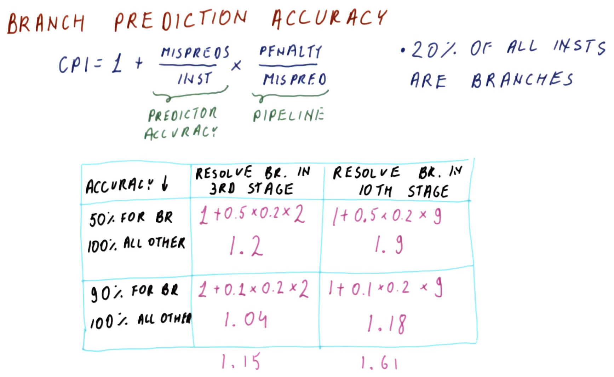
</center>

Consider now the effect of branch prediction accuracy on performance.

The **cycles per instruction** (**CPI**) can be expressed as follows:
```
CPI = 1 + mispredictions/instruction × penalty/misprediction
```

where:
  * `1` represents an ideal pipeline (i.e., no hazards)
  * The second term represents additional cycles added to the pipeline on average due to **branch mispredictions**
    * The factor `mispredictions/instruction` characterizes the predictor's accuracy (i.e., how often mispredictions occur)
    * The factor `penalty/misprediction` characterizes the pipeline (i.e., the incurred penalty per missed prediction); in particular, where in the pipeline occurs (i.e., at which stage) determines the severity of this penalty in a given pipeline

Consider a comparison of the following two pipelines (assume that `20%` of all instructions are branches in typical programs running on these pipelines, which is reasonable for common programs):

| Accuracy | Pipeline A - resolves `BR` in stage `3` | Pipeline B - resolves `BR` in stage `10` |
|:---:|:---:|:---:|
| `50%` for branches, `100%` for all other instructions | `CPI = 1 + [(1-0.5)*0.2]×(3-1) = 1.2` | `CPI = 1 + [(1-0.5)*0.2]×(10-1) = 1.9` |
| `90%` for branches, `100%` for all other instructions | `CPI = 1 + [(1-0.9)*0.2]×(3-1) = 1.04` | `CPI = 1 + [(1-0.9)*0.2]×(10-1) = 1.18` |

***N.B.*** Pipeline B is more representative of a modern processor.

Therefore, as these CPI comparisons suggest, a better branch prediction (e.g., `90%` vs. `50%`) will improve CPI in either a shallow or deep pipeline, but the impact of this improvement depends on the depth of the pipeline (in particular, the improvement is more pronounced for a deeper pipeline):
  * `speedup for Pipeline A = 1.2/1.04 = 1.15`
  * `speedup for Pipeline B = 1.9/1.18 = 1.61`

As a corollary: The deeper a pipeline, the more dependent it is on branch-prediction accuracy for good performance.
  * ***N.B.*** Indeed, this is why research into branch predictors continues to this day. Modern branch predictors are in fact quite good: For branching instructions, they are significantly better than even 90%!

## 5. Branch Prediction Benefit Quiz and Answers

<center>
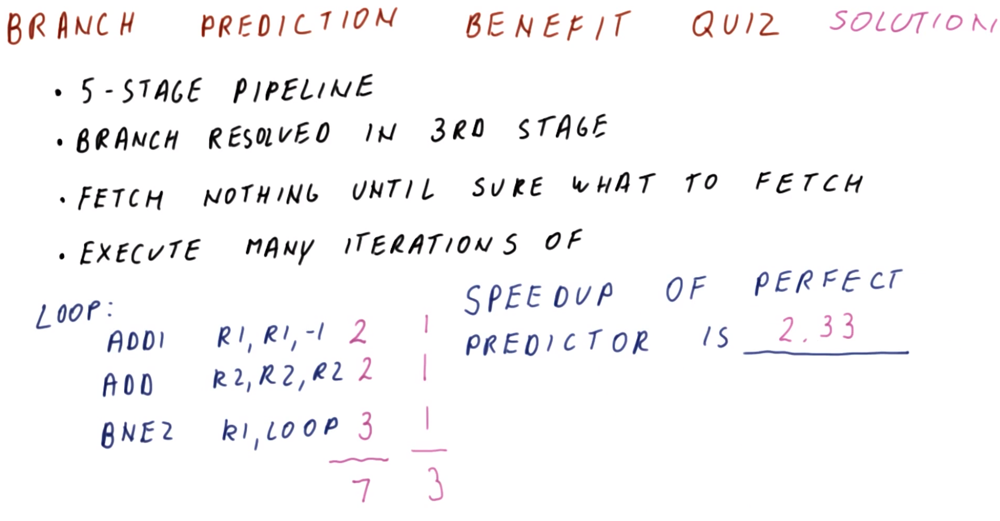
</center>

Consider the following pipelined processor system:
  * A five-stage pipeline
  * Branches are fully resolved in the third stage (ALU), i.e., the correct PC to be fetched is determined at this point
  * Nothing is fetched until there is certainty as to what instruction to fetch
  * The program executes many iterations of the following loop:
    ```mips
    LOOP:
      ADDI R1, R1, -1
      ADD  R2, R2, R2
      BNEZ R1, LOOP
    ```

What is the speedup achieved if we have a ***perfect*** predictor (i.e., the next instruction to be fetched is always known correctly)?
  * `7/3 = 2.33` (i.e., over twice the performance compared to fetching nothing until the correct instruction to fetch can be determined)

***Explanation***:

The number of cycles spent in each instruction within the loop are as follows:
```mips
LOOP:
  ADDI R1, R1, -1  # 2 -> this instruction is determined in stage 2/`D`
  ADD  R2, R2, R2  # 2 -> this instruction is determined in stage 2/`D`
  BNEZ R1, LOOP    # 3 -> this instruction's branching behavior is indeterminate until stage 3/`A`
```

Therefore, overall, it takes `2 + 2 + 3 = 7` cycles per loop iteration to perform these instructions.

Furthermore, with a perfect predictor, the number of cycles spent in each instruction to determine the subsequent instruction are as follows:
```mips
LOOP:
  ADDI R1, R1, -1  # 1
  ADD  R2, R2, R2  # 1
  BNEZ R1, LOOP    # 1
```

Therefore, overall, it takes `1 + 1 + 1 = 3` cycles per loop iteration to determine the instructions.

## 6. Performance with Not-Taken Prediction

<center>

</center>

Having examined the performance resulting from refusal to make *any* predictions, consider now the performance resulting from so-called **"not-taken" predictions** (i.e., simply fetching the next instruction as if none of the instructions were *taken* branches).

Consider the following comparisons:

| Prediction Strategy | Branch Instruction Penalty | Non-Branch Instruction Penalty |
|:---:|:---:|:---:|
| Refuse to predict | `3` cycles | `1` or `3` cycles, for "actually not taken" or "actually taken" (respectively) |
| Predict as "not taken" | `2` cycles | `1` cycle ("not taken" prediction is always correct) |

As this suggests, predicting as "not taken" is *always* better than making no prediction at all.
  * For non-branching instructions, there is never a penalty incurred by the former
  * For branching instructions, the penalty incurred by the former is either the same or less severe

Therefore, virtually every processor that has a pipeline will perform some form of branch prediction, even if the "prediction" is simply to increment the program counter (PC) to fetch the next instruction (in practice, there is no net cost incurred to perform this operation, as it does not require performing actual branch prediction and the PC must be incremented regardless as part of normal operation of the processor). 

## 7. Multiple Predictions Quiz and Answers

<center>
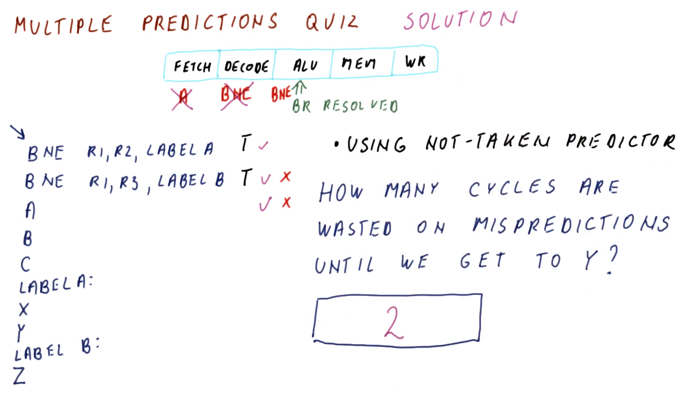
</center>

Assume a five-stage pipeline as before, and suppose that branches are resolve in the third stage (i.e., `A`/`ALU`). Consider the following program running on this system:
```mips
  BNE R1, R2, LABEL A  # actually taken
  BNE R1, R3, LABEL B  # actually taken
  A
  B
  C
LABEL A:
  X
  Y
LABEL B:
  Z
```

where generic instructions `A`, `B`, `C`, `X`, `Y`, and `Z` are *not* branching instructions.

If we use a "not-taken" predictor and assuming that the branching instructions *are* taken, how many cycles are wasted on mispredictions until we arrive at instruction `Y`?
  * `2` cycles

***Explanation***:

| Cycle | `F` | `D` | `A` | `M` | `W` |
|:---:|:---:|:---:|:---:|:---:|:---:|
| C1 | `BNE` | `...` | `...` | `...` | `...` |
| C2 | `BNE` | `BNE` | `...` | `...` | `...` |
| C3 | `A` |  `BNE` | `BNE` | `...` | `...` |

Since branches are resolved in the third stage, the first three cycles are as in the table shown above.

| Cycle | `F` | `D` | `A` | `M` | `W` |
|:---:|:---:|:---:|:---:|:---:|:---:|
| C1 | `BNE` | `...` | `...` | `...` | `...` |
| C2 | `BNE` | `BNE` | `...` | `...` | `...` |
| C3 | (flush) |  (flush) | `BNE` | `...` | `...` |

When `BNE R1, R2, LABEL A` is resolved in the third stage (`A`), this cancels the two upstream instructions in the pipeline, and in the next cycle the program will proceed to instruction `X` via branching. Therefore, overall, `2` cycles are wasted. Furthermore, note that this penalty is the *same* as if the second instruction `BNE` were not a branch at all (i.e., in reality, we have mispredicted *two* branches in this situation, however, this is effectively no different than had the first branching instruction been correctly predicted, as this would have jumped passed the second branching instruction anyways).

Therefore, when a branch is mispredicted, it is most important to redirect to the correct path as quickly/efficiently as possible (while incurring any necessary penalty in the process), as there is no additional penalty incurred when skipping mispredicted branching instructions that will have never been executed anyways (e.g., there is no additional `2`-cycle penalty incurred by the second instruction `BNE`, as it is flushed before reaching stage `A` to trigger its own flushes).

## 8. Predict Not-Taken

<center>
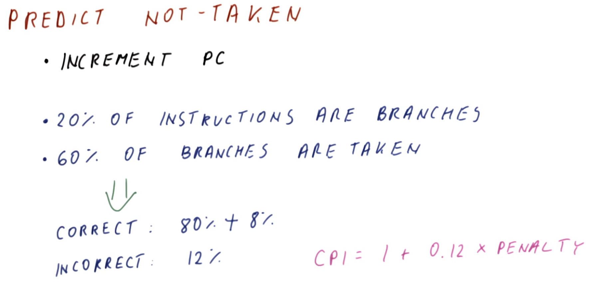
</center>

Let us now consider in more detail the **"not-taken" predictor**, which is the simplest available predictor. It amounts to simply incrementing the program counter (PC). Since we know the PC from which the branch instruction is fetched and we know the size of the instruction, we can therefore increment the PC trivially based on this information alone. Furthermore, the hardware already performs this operation normally during program execution, so there is no added overhead to accomplish this.

But there is still an outstanding question: How accurate is this predictor? A couple of **rules of thumb** suggest the following:
  * Approximately `20%` of instructions are branching instructions (i.e., the naive "not-taken" predictor will be correct `80%` of the time)
  * Slightly more than half (say, `60%`) of branches *are* taken when branching instructions are encountered in the program

Combining this information suggests the following branch prediction via the "not-taken" predictor:
  * ***correct***: `80% + [(100% - 60%) * 20%] = 88%`
  * ***incorrect***: `60% * 20% = 12%`

Therefore, the resulting impact on cycles per instruction (CPI) by the "not-taken" predictor can be expressed as:
```
CPI = 1 + 0.12 × penalty
```

***N.B.*** In the five-stage pipeline, `penalty = 2`, suggesting `CPI = 1.24`.

## 9. Why Do We Need Better Prediction?

<center>
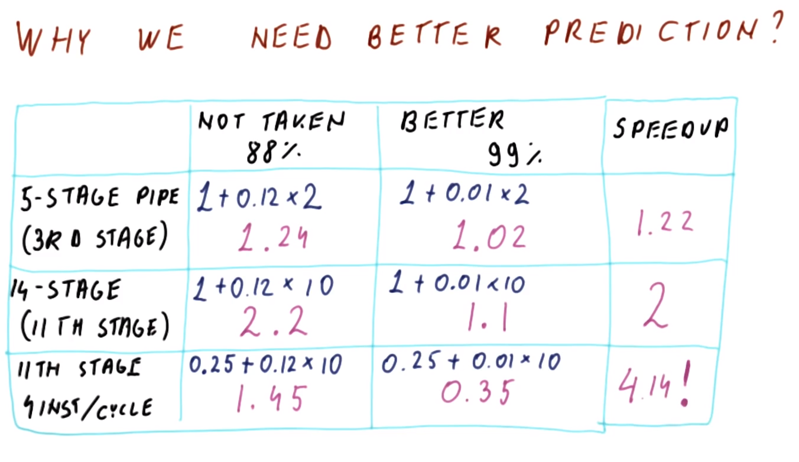
</center>

We have seen that the "not-taken" predictor (which is relatively trivial to implement) is reasonably accurate: For approximately 88% of all instructions, it predicts correctly. So, then, why do we even need better predictors in the first place? After all, improving upon this will presumably require some investment in hardware and effort to improve the predictor.

To explore this question, consider the following comparisons:

| Pipeline | Branch Instruction Resolution | Misprediction Penalty | CPI for "Not-Taken" Predictor (88% Accuracy) | CPI for Better Predictor (99% Accuracy) | Speedup |
|:---:|:---:|:---:|:---:|:---:|:---:|
| 5-Stage | Stage `3` | `2` cycles | `1 + 0.12*2 = 1.24` | `1 + 0.01*2 = 1.02` | `1.24/1.02 = 1.22` |
| 14-Stage | Stage `11` | `10` cycles | `1 + 0.12*10 = 2.2` | `1 + 0.01*10 = 1.1` | `2.2/1.1 = 2.0` |
| 14-Stage, executing `4` instructions/cycle* | Stage `11` | `4*10 = 40` cycles | `0.25 + 0.12*10 = 1.45`** | `0.25 + 0.01*10 = 0.35`** | `1.45/0.35 = 4.14` |
  * ****N.B.*** This pipeline is most representative of a modern processor.
  * *****N.B.*** The ideal CPI for this pipeline is `1/4 = 0.25`, since it executes `4` (i.e., `> 1`) instructions/cycle.

As these comparisons suggest, the better predictor gives a much better speedup/performance compared to the "not-taken" predictor. Furthermore, this improvement is even more pronounced when using a pipeline that is capable of performing `instructions/cycle > 1`.

## 10. Predictor Impact Quiz and Answers

<center>
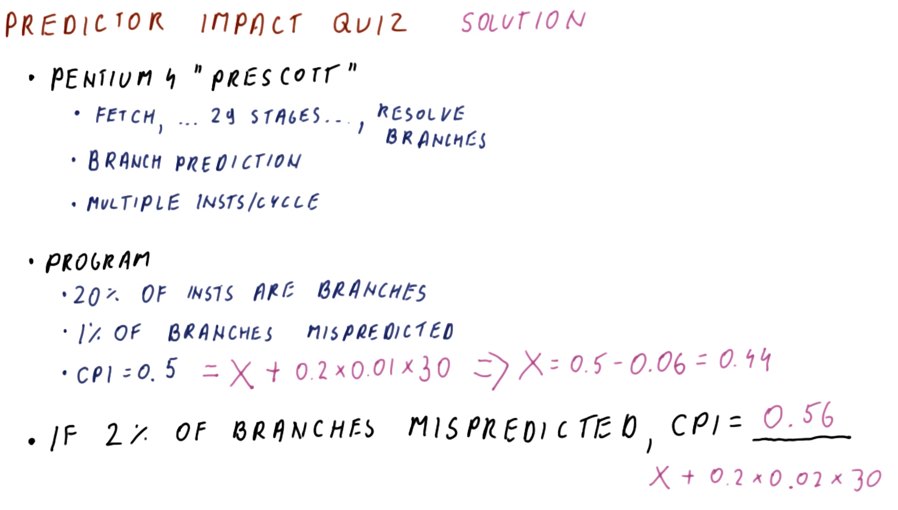
</center>

Consider the Intel Pentium 4 "Prescott" processor, which has the following specifications:
  * Performs a `FETCH` operation, then a subsequent `29` stages, and then it resolves branches at stage `31`
  * Uses branch prediction
  * Executes multiple instructions per cycle

Furthermore, a program is given with the following attributes:
  * `20%` of the instructions are branches
  * `1%` of branches are mispredicted
  * `CPI = 0.5`

If a slightly worse predictor is used, which instead mispredicts `2%` of branches, how would this change the CPI?
  * `0.44 + 0.2*0.02*(31-1) = 0.56`

***Explanation***:

Given an overall CPI of `0.5`, this is comprised of the following components (where `X` is unknown):
```
0.5 = X + 0.2*0.01*(31-1)
```

Solving for `X`, this suggests an ideal CPI (i.e., with a perfect branch predictor) of `X = 0.5 - 0.06 = 0.44` for this processor pipeline.

## 11. Why Do We Need Better Prediction? (Part 2)

<center>
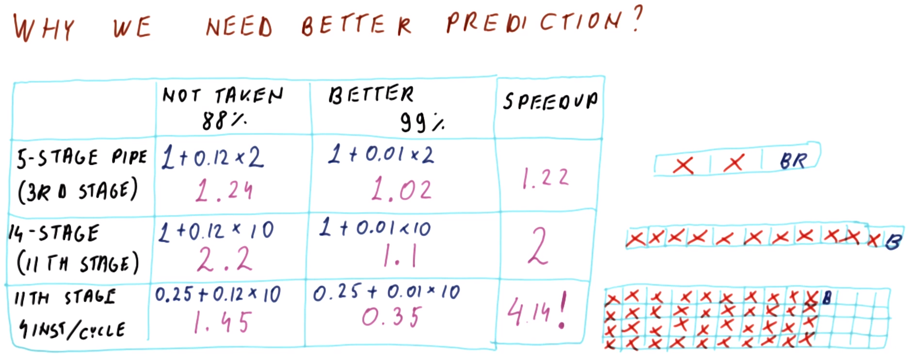
</center>

Previously (cf. Section 9), examined how better prediction improves performance (i.e., CPI) in a pipelined processor.

Additionally, another consideration for why better prediction is useful is to examine waste/inefficiency resulting from misprediction. In general, the deeper the pipeline, the more inefficiency that is introduced by misprediction. For example:

| Pipeline | Branch Instruction Resolution | Misprediction Penalty |
|:---:|:---:|:---:|
| 5-Stage | Stage `3` | `2` cycles | 
| 14-Stage | Stage `11` | `10` cycles |
| 14-Stage, executing `4` instructions/cycle | Stage `11` | `4*10 = 40` cycles |

In particular, for a parallel processor (executing `instructions/cycle > 1`), this can lead to ***many*** wasted cycles. Therefore, correct branch prediction is even more consequential in such systems.

## 12. Better Prediction: How?

<center>
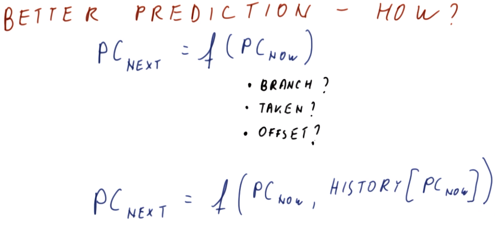
</center>

So, then, how can such a "better predictor" be achieved?

The "not-taken" predictor determines the next program counter (PC) value based on the current value, i.e., `PC`<sub>`NEXT`</sub>` = f(PC`<sub>`NOW`</sub>`)`. Specifically, this is accomplished by simply incrementing the value `PC`<sub>`NOW`</sub>.

If all that is known is `PC`<sub>`NOW`</sub>, is there a better function we could use to form a better prediction of `PC`<sub>`NEXT`</sub>? In this case, the answer is no. However, there is some additional information that can assist with this goal, for example:
  * Is the current instruction a branch?
  * If the current instruction *is* a branch, will it be taken?
  * What is the offset field of the instruction? (i.e., for a branch instruction, this can be added to the PC accordingly to determine the appropriate target if the branch is taken)

Unfortunately, none of this information is generally available a priori. 
However, there is still a way to achieve better prediction: This can be accomplished by examining the past behavior of the branch in `PC`<sub>`NOW`</sub> as a heuristic, i.e., `PC`<sub>`NEXT`</sub>` = f(PC`<sub>`NOW`</sub>`, HISTORY(PC`<sub>`NOW`</sub>`))`. This approach is useful because branches tend to behave in repeated, predictable patterns, which is advantageous for improving the prediction accordingly.

## 13. Branch Target Buffer (BTB)

<center>
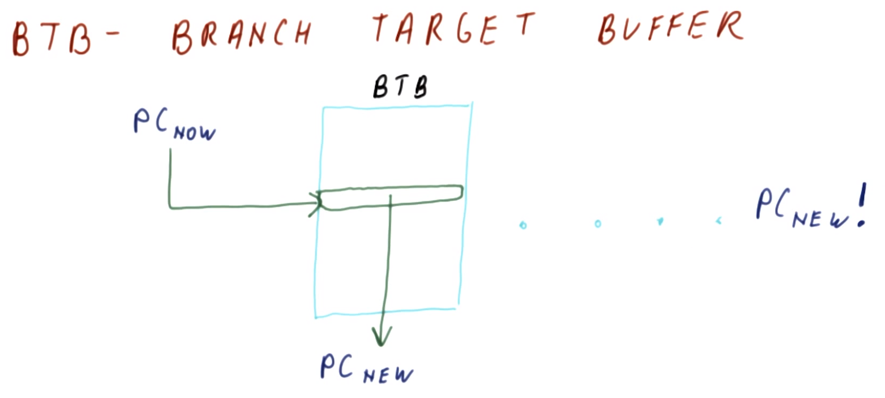
</center>

The simplest predictor that uses branch history information is called the **branch target buffer** (**BTB**). The BTB predictor takes the current program counter (PC) of the branch and uses it to index into a table (appropriately called the BTB), and from this table we read out the best guess for the value of `PC`<sub>`NEW`</sub> (i.e., the predicted next instruction).

So, then, how do we populate the BTB table? *Both* `PC`<sub>`NOW`</sub> *and* `PC`<sub>`NEW`</sub> are tracked via the BTB table throughout the pipeline. During the operation `FETCH`, the ***predicted*** value of `PC`<sub>`NEW`</sub> is fetched. Then, subsequently in the pipeline, the ***actual***/***correct*** value of `PC`<sub>`NEW`</sub> is fetched, and compared with the predicted value. If the values disagree, this is treated as a misprediction, and correspondingly the branch instruction's own value `PC`<sub>`NOW`</sub> is used again to re-index into the BTB table to update the corresponding value of `PC`<sub>`NEW`</sub> with the actual value, for use in subsequent prediction.

<center>
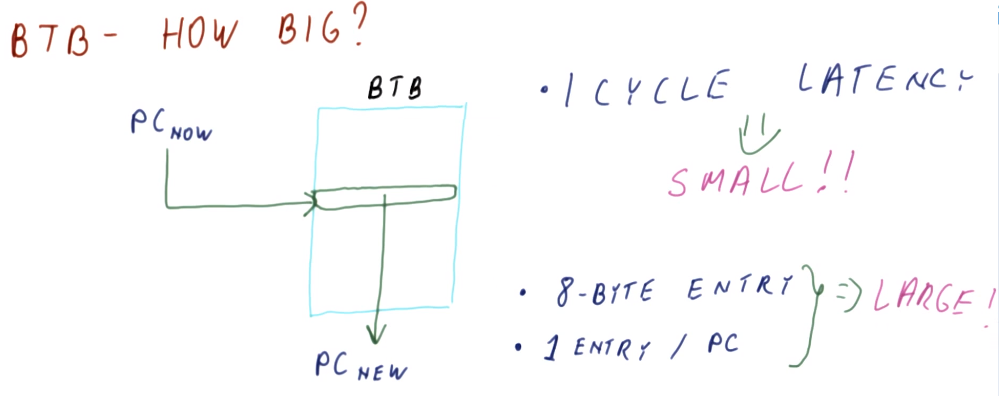
</center>

There is still an unresolved matter with respect to the BTB table, however: How large should the table be?
  * It requires at least a `1` cycle latency to account for the prediction of `PC`<sub>`NEW`</sub> from `PC`<sub>`NOW`</sub>, but ideally no more than this
    * This requires a ***small*** table size
  * Additionally, it must be wide enough to store an entire instruction address (e.g., with 64-bit addressing, each table entry is `8 bytes` in size), as well as large enough to store at least `1` table entry for each PC address in the program
    * This requires a ***large*** table size (the memory requirements to achieve this for a typical program would be demanding!)

These requirements pose conflicting requirements: Practically speaking, we cannot have a dedicated entry in the BTB table for *every* possible PC address. So, then, how can we resolve this conflict? That is discussed in the next section.

## 14. Realistic Branch Target Buffer (BTB)

<center>
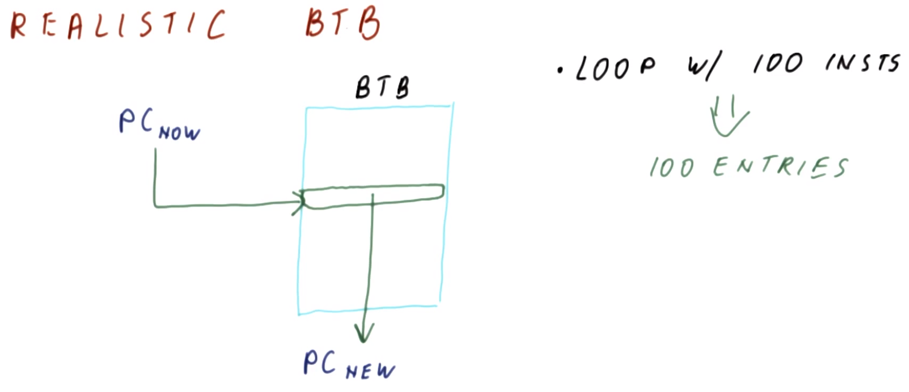
</center>

To resolve the issue with respect to the branch target buffer (BTB) table size (as described at the end of the previous section), it is firstly important to note that in practice it is not necessary to have an entry in the BTB table for *every* possible program counter (PC) address value; instead, it is sufficient to have just the entries for those instructions which are most likely to execute in the near future.

For example, consider a loop composed of `100` program instructions. To account for this loop, it is only necessary for the BTB table to correspondingly store approximately `100` entries. After the first iteration of the loop, the BTB table will be populated with these instructions, which will then become available for subsequent iterations of the loop.

<center>
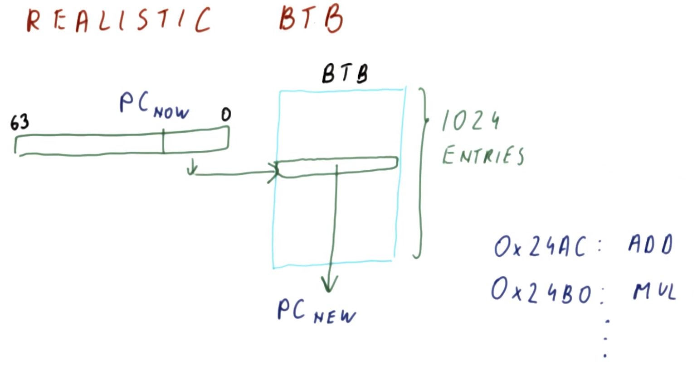
</center>

Now that the BTB table is populated, consider the performance of timing experiments, which determine that only `1024` entries can be accessed in one cycle. This gives rise to the following question: Since there are many possible PC address values, how do we map *each* PC address value to an entry in the BTB table in a manner which avoids conflicts among different PC address values mapping to the *same* table entry? Furthermore, note that the mapping function must be relatively simple, because any additional delay/overhead incurred from computing the mapping function will further constrain the possible size for the BTB table (i.e., to ensure that the operation will still complete in one cycle).

To achieve this objective, consider the composition of the 64-bit input address `PC`<sub>`NOW`</sub>. `log`<sub>`2`</sub>`(1024) = 10` bits are required to index into the BTB table. Therefore, we can dedicate the 10 least-significant bits (LSBs) to store the index into the BTB table. Such a mapping function is very fast, as it involves a simple/direct indexing into the table via the LSBs.
  * ***N.B.*** Here, we are using the least-significant bits (LSBs) rather than the most-significant bits (MSBs) because the MSBs typically resemble each other, particularly within the same part of a given program (e.g., within a loop), for example *`0x24`*`AC` (`ADD`), *`0x24`*`B0` (`MUL`), etc. This in turn would give rise to ambiguous inputs with respect to mapping into the BTB table (i.e., resulting in unintended conflicts/overwrites of existing values). Conversely, LSBs will generally be more dissimilar, even among "nearby" instructions within the program.

## 15. BTB Quiz and Answers

<center>
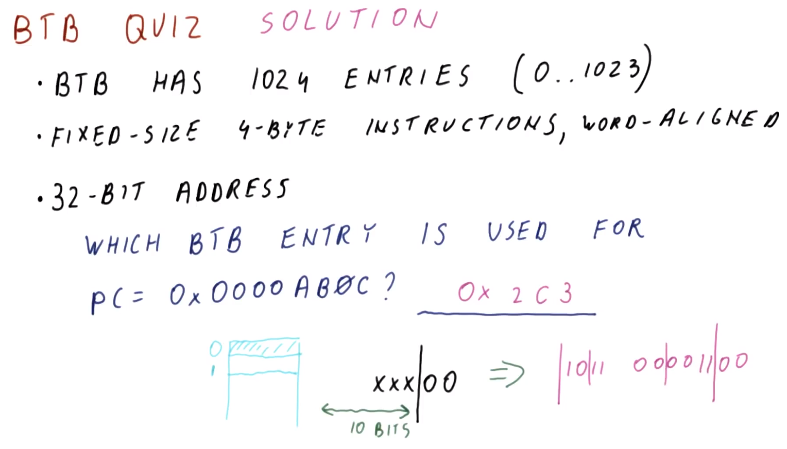
</center>

Consider a system comprised of the following:
  * A BTB table with `1024` entries, which are zero-indexed (i.e., `0, 1, ..., 1023`).
  * The system architecture uses fixed-size `4`-byte instructions which must be **word-aligned** (i.e., each instruction must begin at an address that is divisible by `4`).
  * The program counter (PC) is a `32`-bit register (i.e., the processor uses `32`-bit addresses)

Which BTB table entry should be used for address value `PC = 0x0000AB0C`?
  * `0x2C3`

***Explanation***:

While it may seem as trivially simple as using the 10 least-significant bits (LSBs) of the given PC address value, it is not so simple; this is due to the constraint of fixed-size 4-byte instructions which are word-aligned (i.e., this constraint will not be *generally* satisfied by the 10 LSBs). Therefore, in general, only addresses `0x0`, `0x4`, `0x8`, etc. (but *not* `0x1`, `0x2`, `0x3`, etc.) are suitable candidates for BTB table entries.

Therefore, a more general approach would be to use BTB table entry values having the general form `...00` to ensure that this constraint is satisfied. Furthermore, we can offset by these two positions and use the offset-by-two 10 LSBs (i.e., right-padded with `00`) as follows:
```
      A---B---0---C---
  ... 1010101100001100
          |        |^^
```
***N.B.*** `^` denotes the padding `0`s.

This gives the value (denoted by `|...|` above) `1011000011`<sub>`2`</sub>, or equivalently `0x2C3` or `707`<sub>`10`</sub>.

## 16. Direction Predictor

<center>
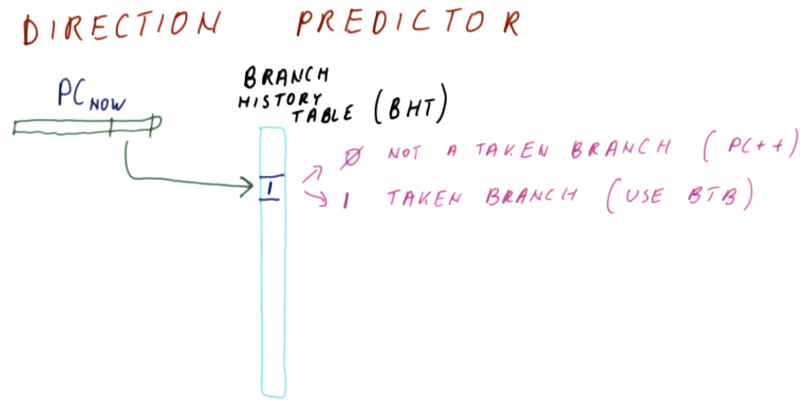
</center>

So, then, how to accomplish **direction prediction**? To do this, we use a table called the **branch history table** (**BHT**), which takes the least significant bits (LSBs) of `PC`<sub>`NOW`</sub> as input indices, similarly to indexing into the branch target buffer (BTB) table.

However, the entry in the BHT is much smaller: The simplest predictor will have a single bit indicating `0` (branch is *not* taken, therefore increment the program counter) vs. `1` (the branch is taken, therefore use the BTB table).

As is done for the BTB table, the BHT entry can be similarly updated (if necessary) once the actual branch instruction is resolved.

Because an entry into the BHT can be a single bit, this allows for a potentially large BHT, which can accommodate many instructions and avoid conflicts among executing instructions, while still maintaining a relatively small corresponding BTB table (i.e., containing entries for only those instructions which *do* take branches).

## 17-21. BTB and BHT Quizzes and Answers

### Problem Statement

Consider the following program:
```mips
      MOV R2, 100       # 0xC000
      MOV R1, 0         # 0xC004
Loop: BEQ R1, R2, Done  # 0xC008
      ADD R4, R3, R1    # 0xC00C 
      LW  R4, 0(R4)     # 0xC010
      ADD R5, R5, R4    # 0xC014
      ADD R1, R1, 1     # 0xC018
      B   Loop          # 0xC01C
Done:                   # 0xC020
```

***N.B.*** Observe that each program instruction address is 4 bytes in size.

Suppose we are given the following:
  * A branch history table (BHT) having `16` entries and which makes perfect branch predictions
  * A branch target buffer (BTB) table having `4` entries which that makes perfect branch predictions 

### 17. Quiz 1 and Answers

<center>
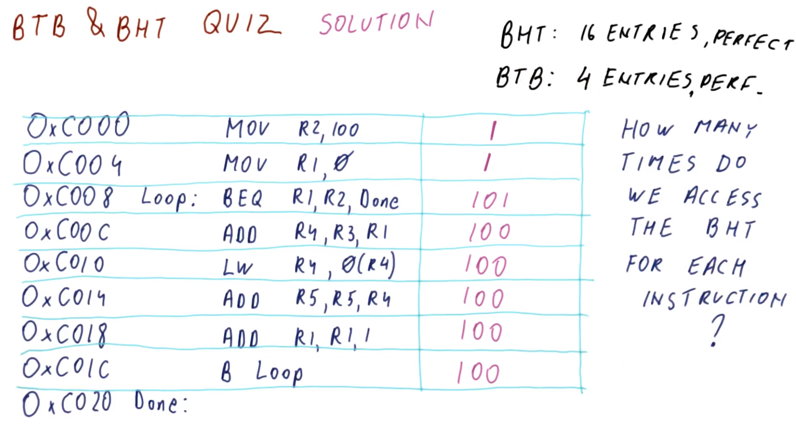
</center>

How many times do we access the BHT for *each* instruction?

| Instruction Address | Instruction | Number of BHT Accesses |
|:---:|:---:|:---:|
| `0xC000` | `MOV R2, 100` | `1` |
| `0xC004` | `MOV R1, 0` | `1` |
| `0xC008` | (`Loop:`) `BEQ R1, R2, Done` | `101` |
| `0xC00C` | `ADD R4, R3, R1` | `100` |
| `0xC010` | `LW R4, 0(R4)` | `100` |
| `0xC014` | `ADD R5, R5, R4` | `100` |
| `0xC018` | `ADD R1, R1, 1` | `100` |
| `0xC01C` | `B Loop` | `100` |

***Explanation***:

The BHT is accessed in order to determine whether a given instruction is a taken branch; this is done every time we fetch an instruction, and because we have perfect prediction (for both the BTB table and the BHB), this implies that we will never fetch any instruction that will not actually execute.

The first two instructions at addresses `0xC000` and `0xC004` execute only once. The third instruction at address `0xC008` is the branch instruction, which only executes once and causes entry into the loop/branching logic (denoted by label `Loop`).

The loop executes as long as `R1` and `R2` are not equal, which are initialized by the first two instructions to values `0` and `100` (respectively). The last two instructions of the `Loop` segment increment `R1` by `1` and then jump back to `Loop`. Therefore, this proceeds for 100 iterations, until `R1` and `R2` are equal (i.e., both equaling `100`, which occurs on the 101st iteration), at which point the loop is exited and the program proceeds to label `Done` (i.e., at this point in the program, the branch is *taken* to `Done`).

### 18. Quiz 2 and Answers

<center>

</center>

Which branch history table (BHT) entry do we access for each instruction?

| Instruction Address | Instruction | BHT Entry |
|:---:|:---:|:---:|
| `0xC000` | `MOV R2, 100` | `0` |
| `0xC004` | `MOV R1, 0` | `1` |
| `0xC008` | (`Loop:`) `BEQ R1, R2, Done` | `2` |
| `0xC00C` | `ADD R4, R3, R1` | `3` |
| `0xC010` | `LW R4, 0(R4)` | `4` |
| `0xC014` | `ADD R5, R5, R4` | `5` |
| `0xC018` | `ADD R1, R1, 1` | `6` |
| `0xC01C` | `B Loop` | `7` |

***Explanation***:

There are `16` entries in the BHT, which can be accessed via the offset least-significant bits (LSBs) of the corresponding instruction addresses. Therefore:

| Instruction Address | BHT Entry |
|:---:|:---:|
| `0xC000` (`1100 0000 00\|00 00\|00`) | `0` |
| `0xC004` (`1100 0000 00\|00 01\|00`) | `1` |
| `0xC008` (`1100 0000 00\|00 10\|00`) | `2` |
| `0xC00C` (`1100 0000 00\|00 11\|00`) | `3` |
| `0xC010` (`1100 0000 00\|01 00\|00`) | `4` |
| `0xC014` (`1100 0000 00\|01 01\|00`) | `5` |
| `0xC018` (`1100 0000 00\|01 10\|00`) | `6` |
| `0xC01C` (`1100 0000 00\|01 11\|00`) | `7` |

***N.B.*** If `15` were reached in this manner, the subsequent instruction would result in a wraparound back to `0`, however, this does not occur in this particular program.

## 19. BTB and BHT 3 Quiz and Answers

<center>
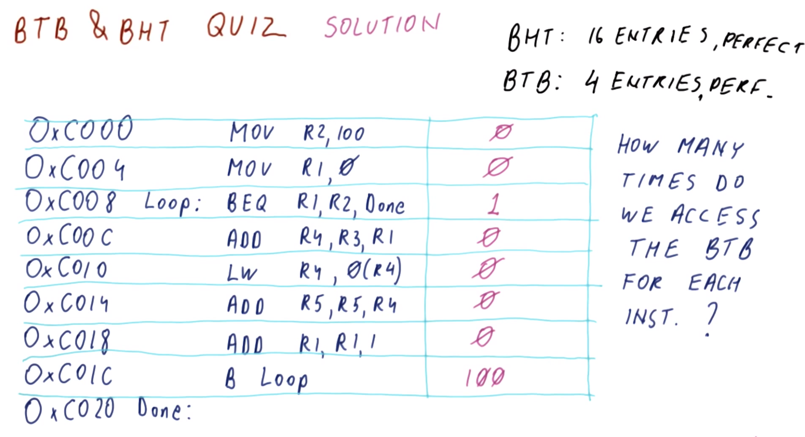
</center>

How many times do we access the branch target buffer (BTB) table for each instruction?

| Instruction Address | Instruction | Number of BTB Table Accesses |
|:---:|:---:|:---:|
| `0xC000` | `MOV R2, 100` | `0` |
| `0xC004` | `MOV R1, 0` | `0` |
| `0xC008` | (`Loop:`) `BEQ R1, R2, Done` | `1` |
| `0xC00C` | `ADD R4, R3, R1` | `0` |
| `0xC010` | `LW R4, 0(R4)` | `0` |
| `0xC014` | `ADD R5, R5, R4` | `0` |
| `0xC018` | `ADD R1, R1, 1` | `0` |
| `0xC01C` | `B Loop` | `100` |

***Explanation***:

The BTB table is only accessed if the branch history table (BHT) indicates to take the branch (recall that we assume both tables predict perfectly); otherwise, if the branch is *not* taken, then we simply increment the program counter (PC) without accessing the BTB table at all.

Therefore, by inspection, all non-branching instructions do not access the BTB table at all. The instruction `B Loop` at instruction `0xC01C` is *always* taken, and this occurs `100` times in the program loop. Furthermore, with respect to the instruction `BEQ R1, R2, Done` at instruction address `0xC008`, in every iteration that stays in the loop (i.e., when `R1` and `R2` are not equal, which occurs for `100` iterations, as per the quiz in Section 17), the branch is not taken and therefore the BTB table is not accessed; conversely, when `R1` and `R2` become equal (i.e., both having the value `100`, which occurs once in the final iteration), this causes an access of the BTB table (and consequent branch to `Done`).

## 20. Quiz 4 and Answers

<center>
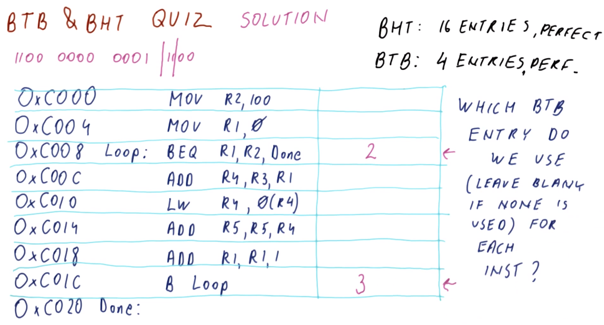
</center>

Which branch target buffer (BTB) table entry do we use for each instruction? (Leave blank if no entry is used.)

| Instruction Address | Instruction | BHT Entry |
|:---:|:---:|:---:|
| `0xC000` | `MOV R2, 100` | |
| `0xC004` | `MOV R1, 0` | |
| `0xC008` (`1100 0000 0000 \|10\|00`) | (`Loop:`) `BEQ R1, R2, Done` | `2` |
| `0xC00C` | `ADD R4, R3, R1` | |
| `0xC010` | `LW R4, 0(R4)` | |
| `0xC014` | `ADD R5, R5, R4` | |
| `0xC018` | `ADD R1, R1, 1` | |
| `0xC01C` (`1100 0000 0001 \|11\|00`) | `B Loop` | `3` |

***Explanation***:

Recall from the previous quiz (cf. Section 19) that only the branching instructions will access the BTB table; therefore, for the remaining non-branching instructions, by inspection, there are no corresponding BHT entries.

To determine the BHT entries of the branching instructions, this can be achieved by examining their instruction addresses. Since the BTB table has `4` entries, we use the four least-significant bits (LSBs) offset by two bits (i.e., `00`, which is are common to all of the instructions).

## 21. Quiz 5 and Answers

<center>
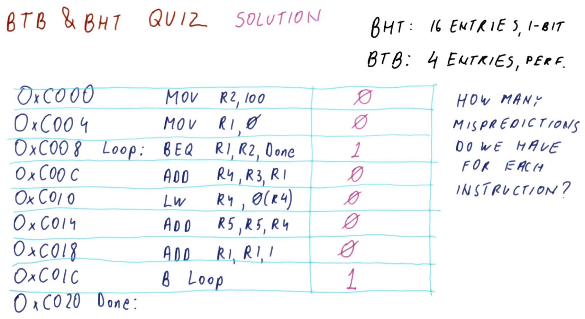
</center>

Consider the same system as before, however, with the following slight modification:
  * A branch history table (BHT) having `16` entries, with each entry being a `1`-bit predictor and initialized to value `0` (i.e., all predict "not taken")
    * This is ***different*** from the initial system, which made perfect branch predictions
  * A branch target buffer (BTB) table having `4` entries which that makes perfect branch predictions 
    * This is the ***same*** as before

How many mispredictions occur for each instruction during program execution?

| Instruction Address | Instruction | Number of Mispredictions |
|:---:|:---:|:---:|
| `0xC000` | `MOV R2, 100` | `0` |
| `0xC004` | `MOV R1, 0` | `0` |
| `0xC008` | (`Loop:`) `BEQ R1, R2, Done` | `1` |
| `0xC00C` | `ADD R4, R3, R1` | `0` |
| `0xC010` | `LW R4, 0(R4)` | `0` |
| `0xC014` | `ADD R5, R5, R4` | `0` |
| `0xC018` | `ADD R1, R1, 1` | `0` |
| `0xC01C` | `B Loop` | `1` |

***Explanation***:

Recall (cf. Section 18, Quiz 2) that each BHT entry is unique in this program, therefore, none of the instructions will generate collisions in the BTB table.

By inspection, the first two (non-branching) instructions generate `0` mispredictions.

Upon entry into the loop, the first iteration is as follows:
  * The branching instruction `BEQ R1, R2, Done` at instruction address `0xC008` is *not* taken, which is a correct prediction (because the BHT entries are initialized to `0`).
  * The subsequent (non-branching) instructions are *not* taken, which is similarly a correct prediction.
  * The tail-end branching instruction `B Loop` at address `0xC01C` *is* taken, and this is an *misprediction*, since the BHT entry is initialized to `0`, thereby contradictorily suggesting the branch would *not* be taken. Consequently, the BHT entry is updated to `1`.

In subsequent loop iterations, the program proceeds similarly; furthermore, with the tail-end instruction's BHT entry set to `1` in the first iteration, this is no longer a misprediction in these iterations.

In the final loop iteration (for which the values `R1` and `R2` both become equal to `100`, i.e., on the 101st iteration), the branching instruction `BEQ R1, R2, Done` at instruction address `0xC008` is now *taken*, and this is a *misprediction* since the BHT entry (initialized to `0`) suggests otherwise. Consequently, the BHT entry is updated to `1` and the program takes the branch to label `Done`.

As these results suggest, over the course of the program, the prediction is very accurate (i.e., only 2 mispredictions out of hundreds of executed instructions!).
  * ***N.B.*** As demonstrated here, 1-bit predictors are effective for iterative constructs such as loops. However, as we will see later, 1-bit predictors are not as effective when dealing with other constructs (e.g., those which do not have many iterations and/or those which do not have many if-else statements).

## 22. Issues with 1-Bit Prediction

<center>
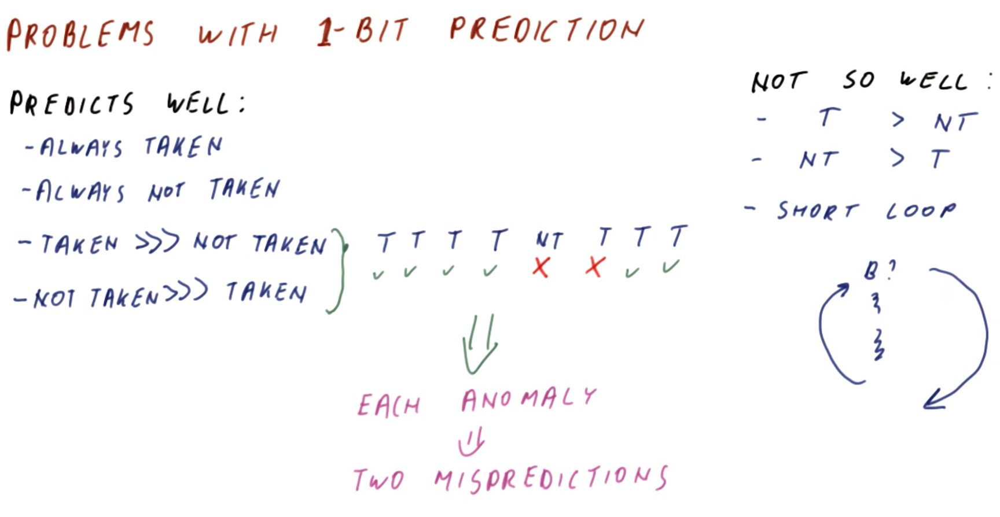
</center>

As demonstrated in the previous section, the 1-bit predictor works reasonably well for loops having many iterations. However, there are some **issues** that arise when using a 1-bit predictor, which have ultimately led to development of other, better predictors.

The 1-bit predictor performs prediction ***well*** in the following cases:
  * Branches that are either always taken, or always not taken
    * Even if the initial guess is incorrect, the cost for this misprediction penalty is eventually amortized over subsequent iterations
  * The number of times that the branches are taken vastly outnumber the branches not being taken, or the number of times the branches are not taken vastly outnumber the branches being taken
    * Similarly, the mispredictions will be relatively rare and therefore their cost is amortized over the course of the program's execution 

The latter case is demonstrative for why the 1-bit predictor can be problematic. Consider the following situation, wherein there are many more branches that are taken rather than not taken:
```
T T T T NT T T T
√ √ √ √ X  X √ √
```

In such a scenario, a misprediction (`X`) is a relatively rare anomaly; however, observe that *each* such misprediction will necessarily generate *two* mispredictions (i.e., the initial incorrect prediction followed by the subsequent correction).

Therefore, the 1-bit predictor will generally perform ***poorly*** in the following cases:
  * There is a comparable number of branches taken vs. branches not taken (i.e., in these cases, there will be many such anomalies occurring during program execution)
  * Short loops, which are insufficient to adequately amortize the misprediction cost over the course of its (relatively few) iterations
    * The prediction is generally only correct while the program remains in the loop; as soon as it exits, a misprediction penalty is incurred

<center>
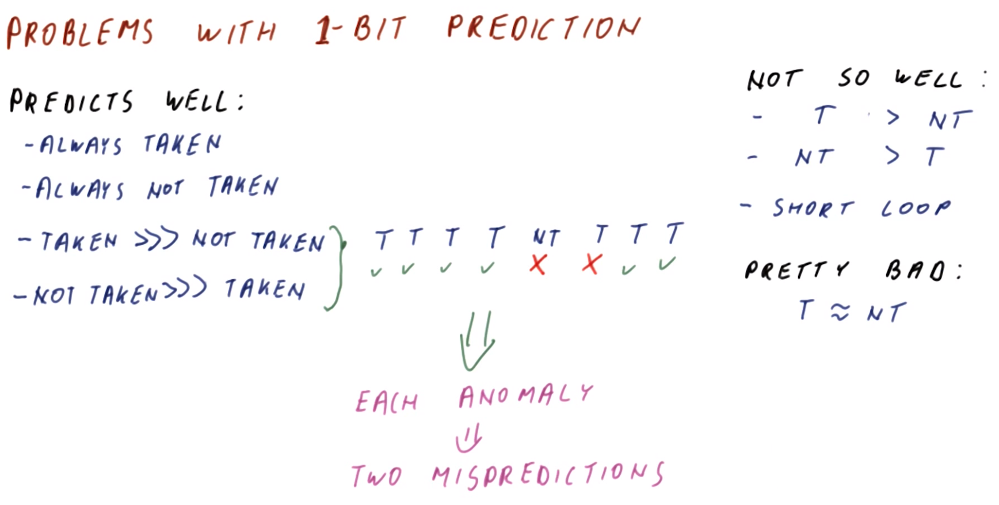
</center>

In the most extreme case, the 1-bit predictor will perform the ***worst*** when the number of branches taken vs. not taken are approximately equal.

Next, we will consider improving prediction in the case of "poor" 1-bit predictor performance.

## 23. 2-Bit Predictor

<center>
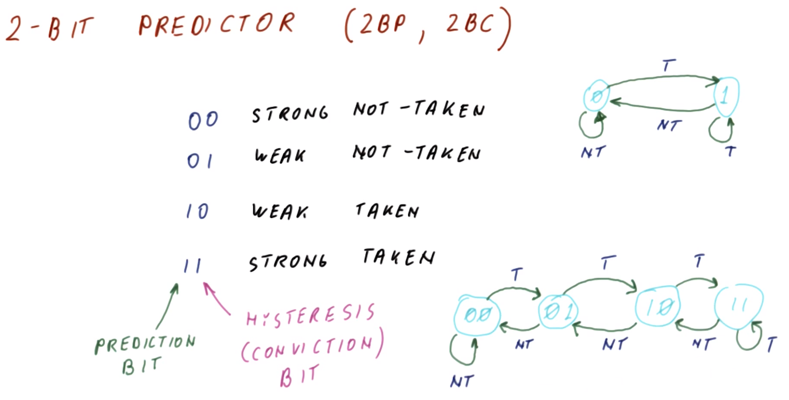
</center>

The predictor that fixes the aforementioned issue of two mispredictions per anomaly (in the 1-bit predictor) is called a **2-bit predictor** (**2BP**), or a **2-bit counter** (**2BC**).

The two bits are defined as follows:
  * **prediction bit** -The most-significant bit (MSB), which indicates what the prediction should be, similarly to the single bit of the 1-bit predictor
  * **hysteresis bit** (or **conviction bit**) - The least significant bit (LSB), which indicates the certainty of the prediction bit

The 2BP has the following possible state values:
  * `00` - strong not-taken
  * `01` - weak not-taken
  * `10` - weak taken
  * `11` - strong taken

Per the corresponding state diagrams (as in the figure shown above):
  * In the 1-bit predictor, one outcome completely "changes our mind completely" about what to do with the branch, which results in *two* mispredictions per anomaly.
  * Conversely, in the 2-bit predictor, there is only *one* misprediction per anomaly, as incorrect guesses do not incur an additional penalty to return to the correct prediction state.
    * In general, the state will reside in either "strong" state, and only transition through the "weak" zone periodically. Only in this transition through the "weak" zone will a two-mispredictions penalty be incurred.

The behavior is the 2-bit predictor is simple enough to implement, while providing more effective (i.e., less penalty-incurring) performance.

## 24. 2-Bit Predictor Initialization

<center>
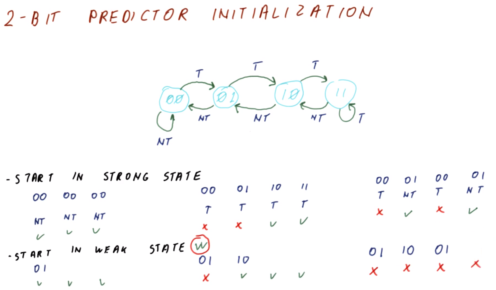
</center>

Given that there are four possible states for the 2-bit predictor, consider: Does it matter in which state the predictor starts off? 

Starting in a ***strong*** state suggests the following possible prediction behaviors:
```
00 00 00
NT NT NT
√  √  √ 
```
  * An initial *correct* prediction remains in the strong state
```
00 01 10 11
T  T  T  T
X  X  √  √
```
  * An initial *incorrect* prediction incurs ***two*** penalties before predicting correctly

Starting in a ***weak*** state suggests the following possible prediction behaviors:
```
01 00 00
NT NT NT
√  √  √ 
```
  * An initial *correct* prediction transitions to the strong state
```
01 10 11 11
T  T  T  T
X  √  √  √
```
  * An initial *incorrect* prediction incurs ***one*** penalty before predicting correctly

These comparisons therefore suggest it is advantageous to initialize in a ***weak*** state.

However, consider the situation where the branching behavior changes frequently:

(*start in strong state*)
```
00 01 00 01
T  NT T  NT
X  √  X  √
```
(*start in weak state*)
```
01 10 01 10
T  NT T  NT
X  X  X  X
```

Therefore, in the worst case, starting in a weak state results in *always* mispredicting when branching is frequent.

However, in practice, it is more common to have more stable branching behavior, therefore, the suggestion of starting in a weak state will be generally advantageous. Furthermore, even an initial misprediction is generally inconsequential to performance over the lifetime of the program (i.e., the misprediction penalty is amortized relatively quickly), so it also just as valid to simply (somewhat arbitrarily) start in state `00`, which is relatively simple to do.

## 25. 2-Bit Predictor (2BT) Quiz and Answers

<center>
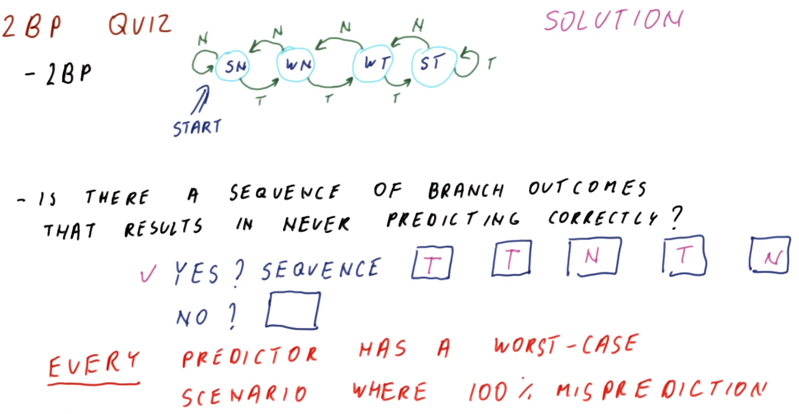
</center>

Consider a 2-bit predictor having the four states as described previously (cf. Section 24), defined as follows:

| State | Bit Pattern |
|:---:|:---:|
| Strong Not-Taken (SN) | `00` |
| Weak Not-Taken (WN) | `01` |
| Weak Taken (WT) | `10` |
| Strong Taken (ST) | `11` |

Assume we start at state `00` (Strong Not-Taken).

Is there a sequence of branch outcomes that results in ***never*** predicting correctly? If so, indicate the first five steps of the state transitions sequence.
  * `Yes`: `T` → `T` → `NT` → `T` → `NT`

***Explanation***:
```
SN WN WT WN WT ...
00 01 10 01 10 ...
T  T  NT T  NT ...
X  X  X  X  X  ...
```

***N.B.*** It is possible to change this particular predictor such that this behavior does not result in 100% misprediction, however, in general, ***every*** predictor inherently has the possible worst-case scenario of 100% misprediction; it is merely a matter of how likely such a sequence will occur in practice (a good predictor ensures this is exceedingly rare).

## 26. 1-Bit Predictor to 2-Bit Predictor Improvements

<center>
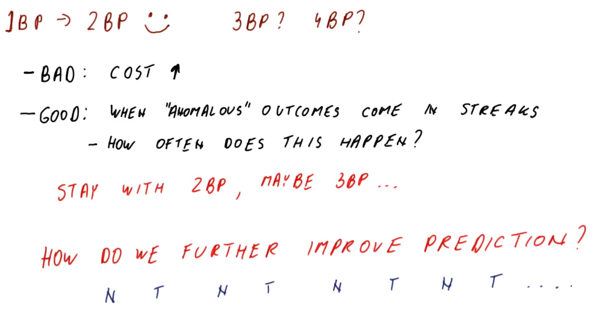
</center>

As we have seen, moving from a 1-bit predictor to a 2-bit predictor improves prediction behavior, primarily because one-off occurrences of the other branching behavior does not completely change the prediction decision.

Therefore, a natural question arises: Would adding more bits (e.g., 3-bit predictor, 4-bit predictor, etc.) further improve prediction performance?
  * The ***drawback*** of using more bits is cost, which increases in proportion to the number of bits used for prediction
  * The ***benefit*** of using more bits is that when anomalous outcomes occur in sequential "streaks," this increases hysteresis (i.e., remaining longer in the "original" behavior prediction before transitioning to the "other" behavior) which may be more appropriate for reducing penalty incurrence

However, in practice, it is not often that such "anomalous streaks" occur in a program. Therefore, additional bits are generally of marginal benefit beyond 2-bit predictors (maybe 3-bit predictors may be useful, however, 4-bit predictors and beyond are typically impractical).

So, then, if adding more bits does not provide additional benefits beyond a certain point, how do we further improve prediction (i.e., beyond the 2-bit predictor)? In particular, as we have seen, neither the 1-bit predictor nor the 2-bit predictor are effective in the case of frequent switching in the branching behavior. This topic is discussed next.

## 27. History-Based Predictors

<center>
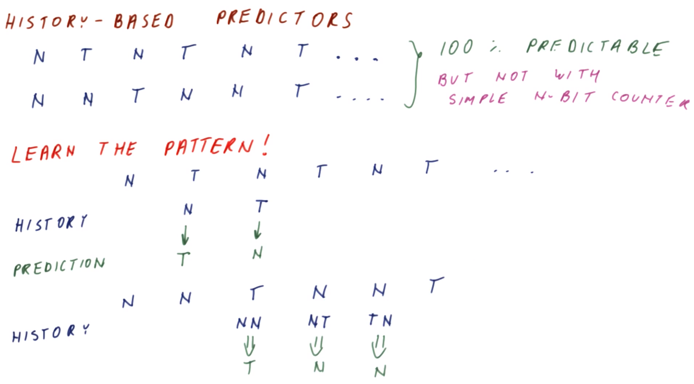
</center>

**History-based predictors** attempt to predict patterns with frequent changes in branching behavior, with changes occurring in a repeated pattern (as in the figure shown above). Such patterns are therefore ***predictable***, however, they are ineffectively predicted by *n*-bit predictors.

To solve this issue, history-based predictors "learn the pattern" over time. To accomplish this, rather than focusing solely on the "majority" outcome, history-based predictors examine the ***branch history*** as the program executes (as in the figure shown above). This history in turn refines the predictive pattern in response the *current* branching behavior, until the prediction eventually becomes accurate for the inherent underlying branching pattern (which may involve more complex "mappings", e.g., `NT NT` predicts `T`, `T NT` predicts `NT`, etc.).

## 28. 1-Bit History Predictor with 2-Bit Counters

<center>
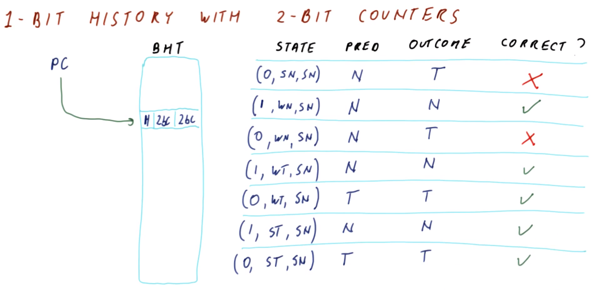
</center>

As a more concrete example, consider a history-based predictor comprised of a 1-bit history with two 2-bit counters (one for each history state). The general approach to this branch predictor is similar to before (as in the figure shown above): The program counter (PC) indexes into the branch history table (BHT). However, here, rather than having a 1-bit (or 2-bit) counter in each entry, instead we have a 1-bit history (H) and a pair of 2-bit counters (2BC) (one for when the state is `0`, and the other for when the state is `1`).

Consider the following sequence:

| Sequence | Predictor State | Prediction | Actual Branch Outcome | Correct Prediction? |
|:---:|:---:|:---:|:---:|:---:|
| S1 | `(0, SN, SN)` | `NT` | `T` | `X` |
| S2 | `(1, WN, SN)` | `NT` | `NT` | `√` |
| S3 | `(0, WN, SN)` | `NT` | `T` | `X` |
| S4 | `(1, WT, SN)` | `NT` | `NT` | `√` |
| S5 | `(0, WT, SN)` | `T` | `T` | `√` |
| S6 | `(1, ST, SN)` | `NT` | `NT` | `√` |
| S7 | `(0, ST, SN)` | `T` | `T` | `√` |

In the initial state (`(0, SN, SN)`, sequence S1), the history bit `0` indicates to use the *first* 2-bit predictor (`SN`), resulting in a prediction of `NT` (not taken). However, since this differs from the actual branch outcome (`T`/taken), there is a misprediction. Since the prediction is incorrect, the history bit indexes into the first 2-bit predictor and changes it to `WN`, and then also flips itself to `1` (i.e., the actual outcome, `T`).

In the next prediction (`(1, WN, SN)`, sequence S2), the history bit `1` indicates to use the *second* 2-bit predictor (`SN`), resulting in a prediction of `NT`, which is correct. Therefore, the 2-bit predictors remain unchanged. Furthermore, the history bit is changed to `0`, consistently with the actual branch outcome (`NT`).

In the next prediction (`(0, WN, SN)`, sequence S3), the history bit `0` indicates to use the *first* 2-bit predictor (`WN`), resulting in a prediction of `NT`, which is incorrect. Since the prediction is incorrect, the history bit indexes into the first 2-bit predictor and changes it to `WT`, and then also flips itself to `1` (i.e., the actual outcome, `T`).

In the next prediction (`(1, WT, SN)`, sequence S4), the history bit `1` indicates to use the *second* 2-bit predictor (`SN`), resulting in a prediction of `NT`, which is correct. Therefore, the 2-bit predictors remain unchanged. Furthermore, the history bit is changed to `0`, consistently with the actual branch outcome (`NT`).

In the next prediction (`(0, WT, SN)`, sequence S5), the history bit `0` indicates to use the *first* 2-bit predictor (`WT`), resulting in a prediction of `T`, which is correct. Since the prediction is correct, the history bit indexes into the first 2-bit predictor and changes it to `ST`, and then also flips itself to `1` (i.e., the actual outcome, `T`).

From this point on, there is perfect prediction, with the 2-bit predictors set to "strong" states, and the history bit flipping accordingly with the actual branch outcome to reference the appropriate 2-bit predictor. Therefore, at this point, the branching pattern has been "learned" by the predictor.

## 29. 1-Bit History Predictor Quiz and Answers

<center>
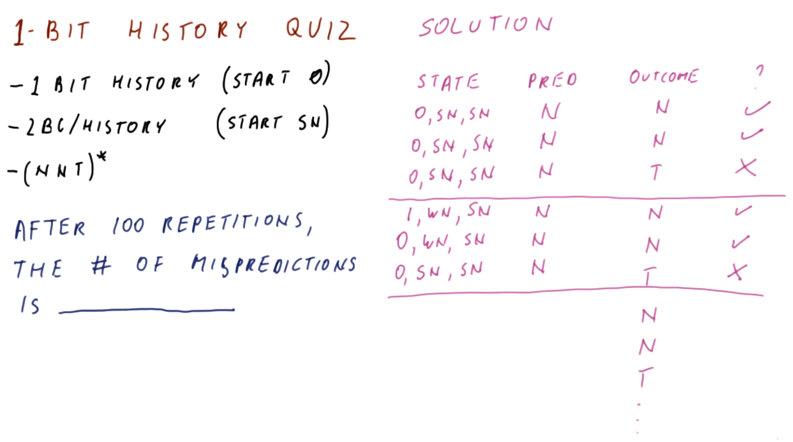
</center>

Consider the following system:
  * 1-bit history, initialized to `0`
  * 2-bit predictor per each history state, both initialized to `SN` (Strong Not-Taken)

Furthermore, the pattern to predict is `(NNT)*`.

After `100` repetitions of the pattern (i.e., 300 total outcomes), what is the overall number of mispredictions that occur?
  * `100`

***Explanation***:

Consider the corresponding sequence as follows:

| Sequence | Predictor State | Prediction | Actual Branch Outcome | Correct Prediction? |
|:---:|:---:|:---:|:---:|:---:|
| S1 | `(0, SN, SN)` | `N` | `N` | `√` |
| S2 | `(0, SN, SN)` | `N` | `N` | `√` |
| S3 | `(0, SN, SN)` | `N` | `T` | `X` |
| S4 | `(1, WN, SN)` | `N` | `N` | `√` |
| S5 | `(0, WN, SN)` | `N` | `N` | `√` |
| S6 | `(0, SN, SN)` | `N` | `T` | `X` |
| S7 | `(0, SN, SN)` | `N` | `N` | `√` |

Since sequence S7 has the same state and prediction behavior as the initial state (i.e., sequence S1), it can be inferred by inspection that this pattern will continue. Therefore, in the overall `300` sequences, a third of these will be incorrect predictions (i.e., each third of the triplets, e.g., `S3` in `S1` to `S3`, `S6` in `S4` to `S6`, etc.), or `100` total. Therefore, a 1-bit history predictor is not particularly effective for this pattern.

## 30-31. 2-Bit History Predictor

### 30. Introduction

<center>
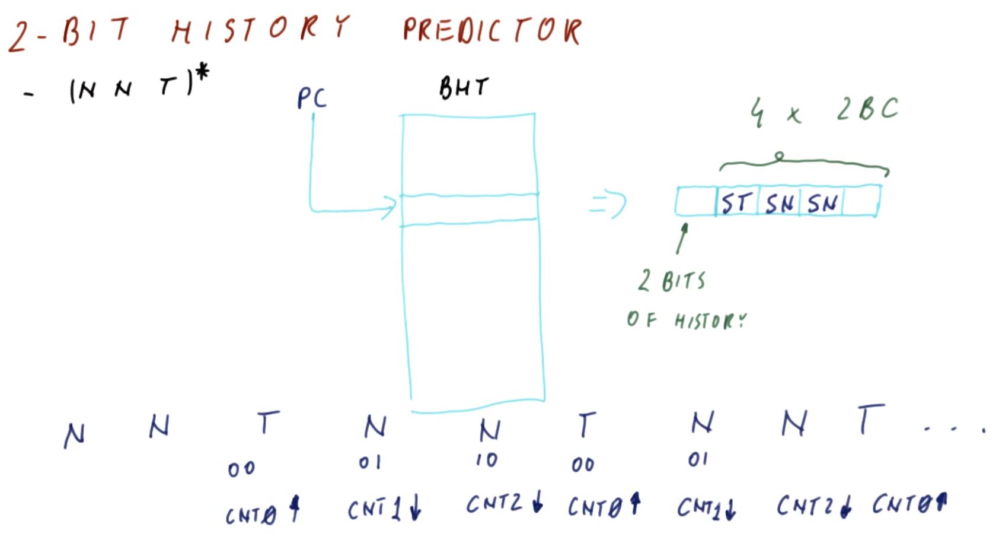
</center>

As demonstrated in the previous section, the 1-bit history predictor cannot predict the pattern `(NNT)*` very well. A 2-bit history predictor is better suited for this pattern; the 2-bit history predictor is discussed in this section.

For a 2-bit history predictor, as before, the program counter (PC) indexes into the branch history table (BHT). However, the corresponding BHT entry has five components: `2` bits of history (i.e., the two preceding outcomes), and `4` 2-bit counters (one for each combination of possible history states). Therefore, the 2-bit history requires an entry size of `10` bits (`2 + 4*2`). Here, we shall denote the 2-bit counters as `C0`, `C1`, `C2`, and `C3`.

Consider the operation of the 2-bit history predictor as follows (by generalizing the behavior of the 1-bit history predictor from the previous section):
```
NT NT T   NT  NT  T   NT  NT  T   ...
      00  01  10  00  01  10  00
      C0↑         C0↑         C0↑
          C1↓         C1↓
              C2↓         C2↓
```

Observe that:
  * Counter `C0` always increments, therefore, it quickly begins to consistently predict branch taken (`T`) and it converges on strongly taken (`ST`)
  * Counters `C1` and `C2` always decrement, therefore, they quickly begin to consistently predict branch not taken (`NT`) and converge on strongly not taken (`SN`)
  * Counter `C3` is never accessed, because the pattern `11` (i.e., via `TT`) does not occur in the history bits

Therefore, eventually the 2-bit history predictor becomes a perfect predictor for this pattern.

## 31. Properties and Generalized *N*-Bit History Predictor

<center>
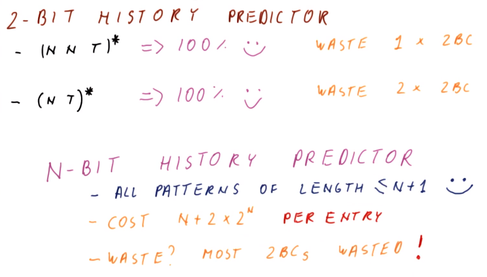
</center>

The previous section demonstrated that after the initial "warmup" period, the 2-bit history predictor predicts the pattern `(NNT)*` with 100% accuracy. To achieve this, *one* of its 2-bit counters is "wasted"/unused (i.e., `C3`).

Furthermore, consider the pattern `(NT)*` using the 2-bit history predictor:
```
NT T NT  T   NT  T   ...
     01  10  01  10  
     C1↓     C1↓         
         C2↑     C2↑      
```

In this case, *two* of its 2-bit counters are "wasted"/unused (i.e., `C0` and `C3`). 

Therefore, in general, an ***n*-bit history predictor** will predict all patterns of length `≤ `*`n`*`+ 1` with 100% accuracy. However, the corresponding cost is *`n`*`+ 2×2`<sup>*`n`*</sup> total bits per BHT entry. Consequently, this will typically generate a lot of waste (i.e., unused bits among the 2-bit counters) in practice.

This leads to another design challenge: How do we predict such *n*-length patterns (which do occur in practice, e.g., loops) while not incurring such a large cost (and corresponding waste) to do so?

## 32. *N*-Bit History Predictor Quiz and Answers

<center>
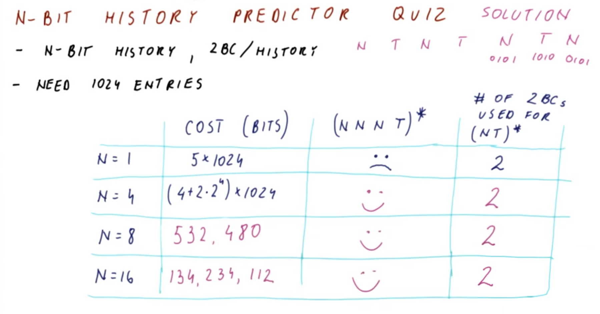
</center>

Consider the following system:
  * *n*-bit history
  * 2-bit predictor per each history state
  * `1024` entries are required uniquely identify each branch instruction in the branch history table (BHT)

For *`n`* values of `1`, `4`, `8`, and `16`:
  * What is the cost in bits?
  * How well does the predictor work on pattern `(NNNT)*`?
  * What is the number of 2-bit counters required for the pattern `(NT)*`?

***Solution and Explanation***:

| *`n`* | Cost (bits) | Predicts Pattern `(NNNT)*` Accurately? | Number of 2-Bit Counters Required for Pattern `(NT)*` | Usage of Available 2-Bit Counters |
|:---:|:---:|:---:|:---:|:---:|
| `1` | `[(1 + 2*2`<sup>`1`</sup>`)]*1024 = 5*1024 = 5120` | no | `2` | `2/(2`<sup>`1`</sup>`) = 1` (`100%`) |
| `4` | `[(4 + 2*2`<sup>`4`</sup>`)]*1024 = 36*1024 = 36864` | yes |`2` | `2/(2`<sup>`4`</sup>`) = 0.125` (`12.5%`) |
| `8` | `[(8 + 2*2`<sup>`8`</sup>`)]*1024 = 520*1024 = 532480` | yes | `2` | `2/(2`<sup>`8`</sup>`) = 7.8125 × 10`<sup>`-3`</sup> (`~0.78%`) |
| `16` | `[(16 + 2*16`<sup>`16`</sup>`)]*1024 = 131088*1024 = 134234112` | yes | `2` | `2/(2`<sup>`16`</sup>`) ≈ 3.05176 × 10`<sup>`-5`</sup> (`~0.003%`) |

By inspection, in general, recall (cf. Section 31) that an `n`-bit history predictor will be accurate for a pattern of length `≤ `*`n`*` + 1`.

With respect to the 2-bit counters requirement:

(*1-bit history predictor*)
```
NT T NT ...
   0 1
```
(*4-bit history predictor*)
```
NT T NT T NT   T    NT   ...
          0101 1010 0101
```
  * uses patterns `01` and `10` exclusively, thereby requiring ***two*** 2-bit counters (i.e., from the available `2`<sup>`4`</sup>` = 16`)

(...and similarly for the 8-bit and 16-bit history predictors)

## 33. History Predictor Quiz and Answers

<center>
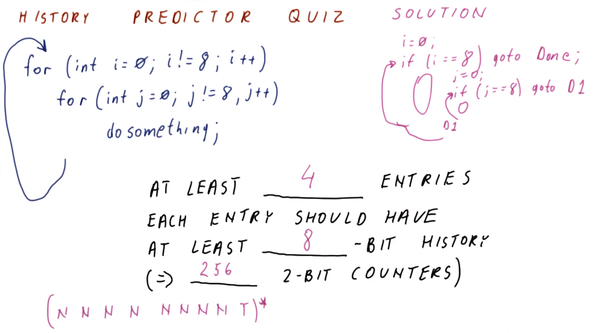
</center>

Consider the following common nested loop structure:
```c
for (int i = 0; i != 8; i++)
  for (int j = 0; j != 8; j++)
    // do something
```

In order to execute this code effectively, how may entries are required by the history predictor?
  * At least `4` entries (i.e., two for each `for` loop, accounting for branching in each)

How many history bits should each entry have?
  * At least an `8`-bit history, to account for full traversal of the inner `for` loop

How many 2-bit counters should each entry have?
  * `2`<sup>`8`</sup>` = 256` 2-bit counters

***N.B.*** The pattern of the outer-`for` loop's condition-check branch statement is `(NT NT NT NT NT NT NT NT T)*`. Therefore, using `256` will result in many unused/wasted bits, since realistically only `9` are required to effectively predict this pattern.

## 34-36. History with Shared Counters

So, then, how to reduce waste (i.e., how to have fewer than `2`<sup>`n`</sup> counters ***per entry***) while still maintaining a long history? That is the topic of this section.

<center>

</center>

As demonstrated in the previous section (cf. Section 33), for an `n`-bit history pattern, only *`O`*`(n)` (i.e., `n + 1`) counters are required to capture this effectively.

Therefore, with `2`<sup>`n`</sup> 2-bit counters available, one idea is to ***share*** these counters between the entries (i.e., rather than dedicating *all* of these counters on a *per-entry* basis). This introduces the possibility of conflict if two counters share the *same* bits, however, with a sufficiently large "pool" of counters (i.e., relative to the the size/needs of a particular entry), such conflicts rarely occur in practice.

<center>
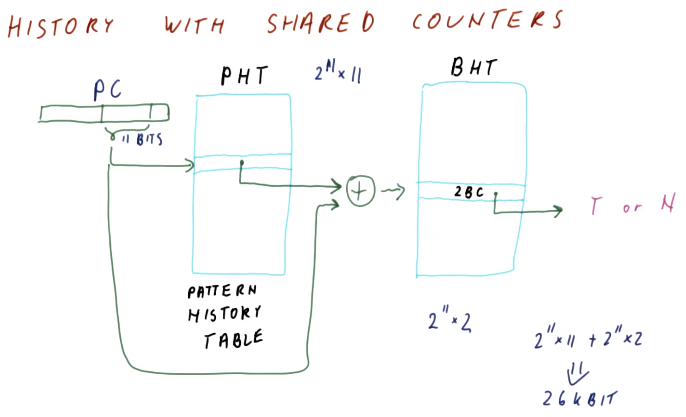
</center>

The operation of such a 2-bit counter is as shown in the figure above.
  * The lower bits of the **program counter** (**PC**) index into the **pattern history table** (**PHT**), which maintains only the history bits for the branch in question (e.g., an `11`-bit history is correspondingly recorded in an `11`-bit entry in the PHT, ***without*** the 2-bit counters).
  * To determine whether or not to take the branch, the PHT entry is combined with the PC index (typically via XOR operator, or similar) to then index into the **branch history table** (**BHT**), which contains the individual 2-bit counters as entries. The latter entries therefore predict whether or not the branch is taken.
  * Subsequently, if the branch outcome is known, we use the same combination of PC index & PHT entry to index back into the same BHT entry, incrementing/decrementing it accordingly to the current branch decision, and then this pattern is also fed back into the PHT entry for the next prediction on this particular branch.

***N.B.*** In principle, the combination of PC index & PHT entry may *not* be unique with respect to the BHT entry, thereby yielding a collision/conflict in the BHT. However, this is typically not a practical issue, provided the size of the BHT is large relative to the PHT.

For example, with a PC index comprised of `11` bits (with corresponding `11`-bit entries in the PHT) and a BHT of size `2`<sup>`11`</sup> entries, this requires an overall cost of `(2`<sup>`11`</sup>` × 11 history entries) + (2`<sup>`11`</sup>` × 2 two-bit counters) = 26 KBi`, which is much lower than the cost using an equivalent PHT of size `2`<sup>`11`</sup> entries (cf. *`O`*`(MBi)` to *`O`*`(GBi)`) instead of `11`-bit sized entries.
  * ***N.B.*** Here, the unit `Bi` denotes `2`<sup>`10`</sup> based metric prefixes, e.g., `KBi = 2`<sup>`10`</sup>, `MBi = 2`<sup>`20`</sup>, etc. (cf. `KB = 10`<sup>`3`</sup>, `MB = 10`<sup>`6`</sup>, etc.)

<center>
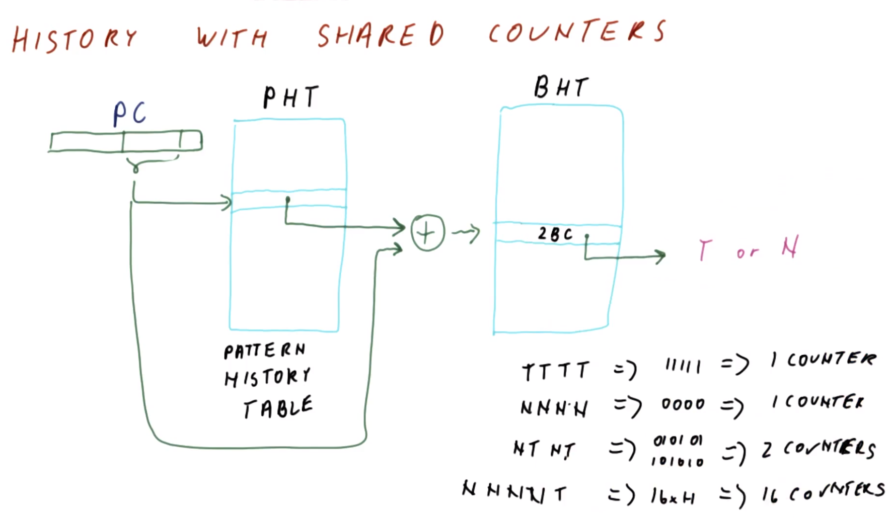
</center>

Consider the pattern `T T T T ...` (i.e., branch always taken). In this case, the corresponding entry in the PHT is `1 1 1 1 ...`, along with a fixed PC index for the branch. Therefore, performing the appropriate combination (i.e., via XOR), this requires only `1` counter (i.e., only `1` entry in the BHT table, using only one of its 2-bit counters). Even so, the total cost for this is the PHT entry (e.g., `11` bits) combined with the size of the 2-bit counter (which is still much less than `2`<sup>`n`</sup> combined with the 2-bit counter).

By the same reasoning, the pattern `NT NT NT NT ...` (with corresponding PHT entry `0 0 0 0 ...`) requires only `1` counter.

The pattern `NT T NT T ...` generates two possible PHT entries `0 1 0 1 ...` and `1 0 1 0 ...`, and therefore requires `2` counters.

In general, it is evident that many patterns will indeed have a small counter requirement. This leaves many available entries in the BHT for more complex patterns such as `NT NT NT NT T`, which may require the full `n` history bits (e.g., `16`), correspondingly using all `n` 2-bit counters. Therefore, this arrangement naturally allocates BHT entries proportionally to the requirements of the PHT. However, to avoid potential conflicts, the BHT should be large relative to the PHT (i.e., to avoid mapping to the *same* entry in the BHT via two different PC indices representing two distinct/different branches); by virtue of using a 2-bit-entry BHT, it is not difficult to have a large BHT in practice.

## 37. Pshare

<center>
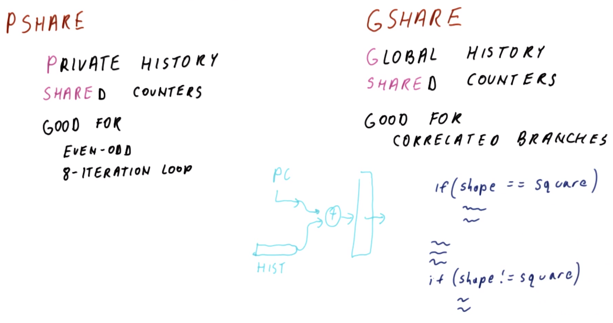
</center>

The previously described arrangement (cf. Section 36) is called a **pshare** predictor, characterized by the following:
  * A ***p***rivate history for each branch (i.e., *each* individual branch should have its *own* history in the branch history table (BHT))
  * ***S***hared counters, whereby in general *different* branches can map to the *same* counters

Pshare predictors are useful for the following:
  * Even-odd behavior (e.g., taken vs. not-taken branching)
  * Loops with relatively few iterations (e.g., `8`-iteration loops)

Essentially, pshare predictors are effective whenever the branches' own previous behavior is predictive of their future behavior.

Another similar predictor type is called a **gshare** predictor, characterized by the following:
  * A ***g***lobal history (a *single* history to predict *all* branches)
    * With a "global history" arrangement, the program counter (PC) is first combined directly with the global history entry before indexing into the table (as in the figure shown above). Therefore, *every* branch gets shifted via the history table proceeding in this manner. 
  * ***S***hared counters (similarly to pshare)

Gshare predictors are useful for **correlated branches** (i.e., branches whose decision is related to what the other programs in the program were doing). As an example of correlated branching, consider the following code:
```c
if (shape == "square") { // branch 1
  // do something
}

// do something

if (shape != "square") { // branch 2
  // do something
}
```

In this example, branches `1` and ` 2` are *correlated*: Taking either branch precludes taking the other (and vice versa). Therefore, if either branch is already in the history, the other can be predicted perfectly as a direct consequence. However, on initial encounter of the first-occurring branch, this information will be unknown initially and therefore can yield a missed prediction.

## 38. Pshare vs. Gshare Quiz and Answers

<center>
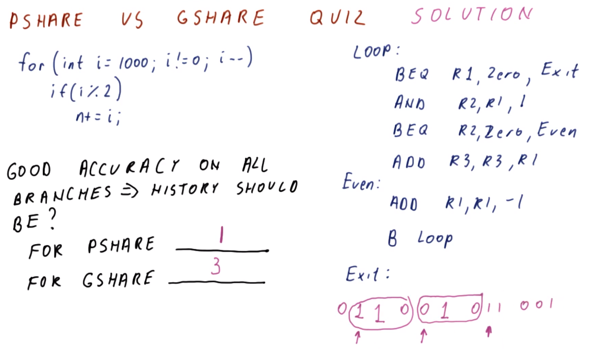
</center>

Consider the following C code fragment:
```c
for (int i = 1000; i != 0; i--)
  if (i % 2)
    n += i;
```

The equivalent assembly code is as follows:
```mips
LOOP:
  BEQ R1, zero, EXIT  # test to exit `for` loop
  AND R2, R1, 1       # test least-significant bit of `R1`
  BEQ R2, zero, EVEN  # jump to `EVEN` if even number occurs
  ADD R3, R3, R1      # add `R1` (`i`) to `R3` (`n`) if odd
EVEN:
  ADD R1, R1, -1      # decrement `i`
  B   LOOP            # branch unconditionally back to LOOP
EXIT:
  # end of code fragment
```

To achieve good prediction accuracy on *all* branches in this code segment, how many bits should be used for entries using pshare vs. gshare?
  * pshare - `1` bit
  * gshare - `3` bits

***Explanation***:

This code contains three branches (`BEQ ...`, `BEQ ...`, `B ...`).
  * (1) By inspection, `B LOOP` is trivially predicable, even without any history; therefore, any history will work.
  * (2) `BEQ R1, zero, EXIT` is taken all `1000` times, except for the last iteration. Even with a 2-bit counter, this branch will be predicted accurately `1000` times followed by only one misprediction, which overall is still very accurate.
  * (3) `BEQ R2, zero, EVEN`, which makes even-odd decision, requires the "most attention" with respect to history. In particular, it is important to know whether the previous iteration was even or odd in order to predict accurately.
    * For pshare, this can be handled simply with `1` history bit. This will also cover branches (1) and (2).
    * For gshare, the previous outcome should exist in the global history. The global history yields the following pattern (via `BEQ ...`, `BEQ ...`, `B ...`, respectively): `011 001 ...`. Accordingly, there are effectively two patterns that must be captured: `110` and `010` (i.e., the second branch is varying, while the other two branches have the predictable pattern `1_0` or `0_0`), thereby requiring `3` history bits accordingly.

Therefore, gshare can achieve similar performance to pshare, however, generally this will require more history bits to accomplish. Additionally, gshare can effectively handle "correlated branches" (cf. Section 37), unlike pshare which cannot.

## 39. Gshare or Pshare?

<center>

</center>

Now that we have seen the gshare can perform correlated branching which pshare cannot, while pshare can perform equivalent branching with relatively shorter/smaller history requirements than gshare, the question is: Which of these should be selected for a given processor?

Many earlier processors selected only one or the other. However, it was quickly discovered that it is advantageous to use ***both***, i.e.,:
  * Gshare for correlated branches
  * Pshare for self-similar branches, even with a relatively short history

## 40. Tournament Predictor

<center>
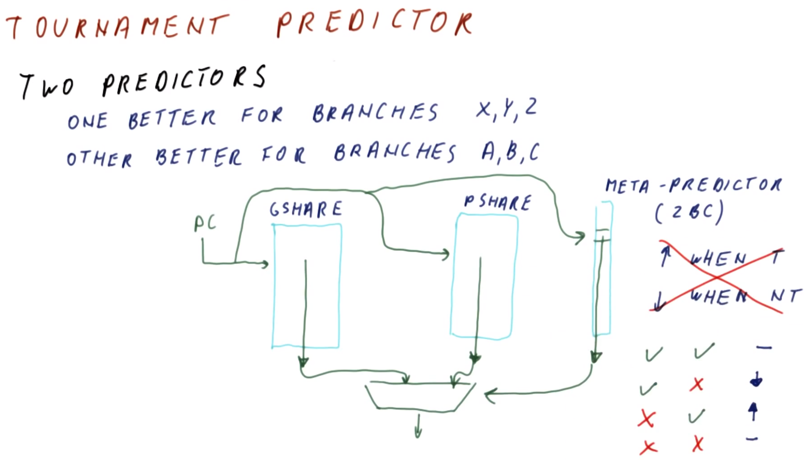
</center>

The discussion from the previous section leads us to a so called **tournament predictor**. In a tournament predictor, there are two predictors:
  * One predictor is better for certain branches (e.g., X, Y, Z)
  * The other predictor is better for other branches (e.g., A, B, C)

The objective of the tournament predictor is to optimize each predictor to its corresponding branches; however, it is unknown a priori which predictor is optimized to which branches.

Given two predictors (e.g., a gshare and a pshare, as in the figure shown above), the program counter (PC) is used to index into both predictors, and the decisions that they generate are 
are combined with a **meta-predictor** (another array of 2-bit counters, which is also indexed via the PC). The output of the meta-predictor does not give a prediction for the branch, but rather it indicates which of the two predictors is the more likely to give an accurate prediction for the branch in question.

The individual predictors are "trained" as before. However, the meta-predictor is trained differently. Rather than incrementing when the branch is taken and decrementing when the branch not taken, the meta-predictor is trained based on the performance of the two predictors, as depicted in the following table:

| Predictor 1 | Predictor 2 | Meta-Predictor |
|:--:|:--:|:--:|
| correct prediction | correct prediction | no change |
| correct prediction | incorrect prediction | decrement |
| incorrect prediction | correct prediction | increment |
| incorrect prediction | incorrect prediction | no change |

(where here Predictor 1 is the gshare, and Predictor 2 is the pshare)

Therefore, in the meta-predictor, the prediction bit of the 2-bit counter indicates which of the two predictors to select. The hysteresis is present just in case gshare is overall more accurate but sometimes pshare beats it (or vice versa). Furthermore, note that each branch has its own meta-predictor entry (via corresponding PC index), and therefore this decision process depends on the branches themselves (i.e., correspondingly with the particular program behavior during its execution).

## 41. Hierarchical Predictors

<center>
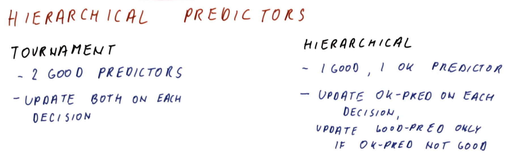
</center>

Another type of predictor that combines prediction decisions is called a **hierarchical predictor**. It is similar to a tournament predictor with a couple of differences/variations as follows:

| Tournament Predictor | Hierarchical Predictor |
|:--|:--|
| Combines two good predictors (one being optimized for certain branches, the other being optimized for other branches). This involves using two good predictions (which are expensive to implement) per branch/entry just to use *one* of them ultimately. | Combines one good predictor with one "fair/ok" predictor. Here, the good predictor (which is expensive to implement) is used where necessary, whereas the ok predictor covers common and/or trivial cases (that are otherwise "overkill" for the good predictor's capabilities).  |
| Updates both predictors on each decision so that they are both up-to-date with the current prediction/execution state, with each attempting to optimize each branching decision. | Updates only the ok predictor on *each* decision, but only updates the good predictor if the ok predictor does not perform well for a particular branch(es). Therefore, the good predictor's entries are not allocated if the ok predictor is otherwise performing well. This allows to have expensive (but relatively few) entries in the good predictor, and inexpensive (but relatively numerous) entries in the ok predictor. |

Based on these characteristics, when comparing the tournament vs. hierarchical predictors, typically the hierarchical predictor wins out, because it turns out that there are many branches which can be predicted well using a simple 2-bit counter (i.e., used as the ok predictor in the hierarchical predictor). With each predictor balancing cost vs. accuracy, the hierarchical predictor optimizes this balance more efficiently.

***N.B.*** It is even possible to have either a tournament or hierarchical predictor with more than two predictors, generalizing the respective concepts accordingly.

## 42. Hierarchical Predictor Example

<center>

</center>

Consider the Pentium M processor, which represents a real-world hierarchical predictor. It is characterized by the following predictors:
  * ***cheap*** - a large array of 2-bit counters
  * ***local history*** - stores a local history for each branch, along with an array of 2-bit counters for different histories
  * ***global history*** - stores a global history (which is longer than the local-history predictor), along with an array of 2-bit counters

To ***predict*** a single branch, first, look up the PC in the 2-bit counter array, as well as in the local and global history predictors

<center>
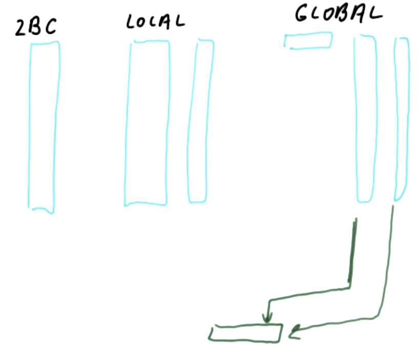
</center>

Next, the actual prediction is formed for the processor by using the result of the global predictor, as shown above. If the global predictor indicates that the branch ***is*** predicted here, then a companion "tag" array records that this branch is indeed predicted by the global predictor.

<center>
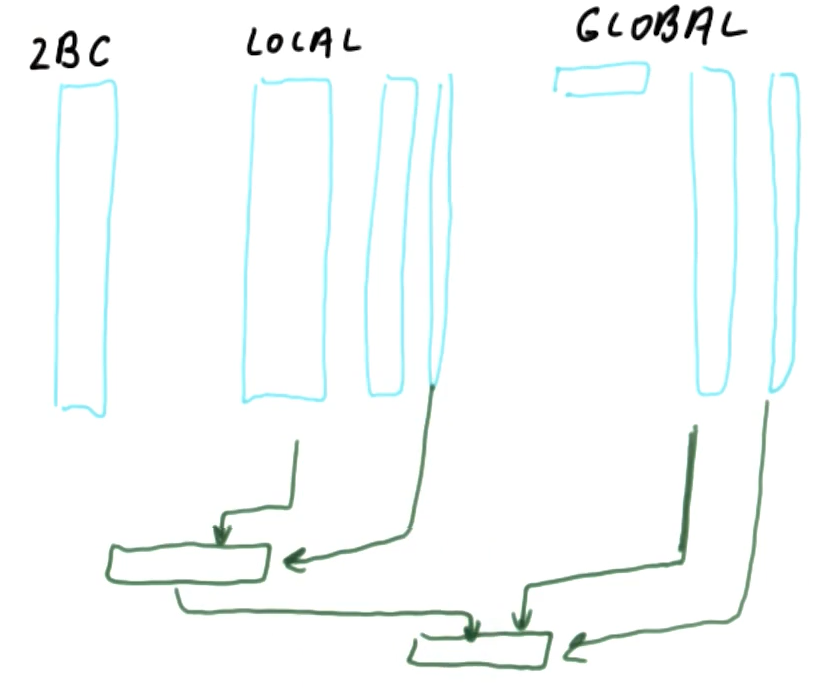
</center>

Conversely, if the global predictor does ***not*** have a matching tag (i.e., it does not predict the instruction and is consequently not inserted into the global predictor), then correspondingly the local predictor is used, as shown above. If the local predictor indicates tha the branch ***is*** predicted here, then the local predictor similarly uses a "tag" array to record this.

<center>
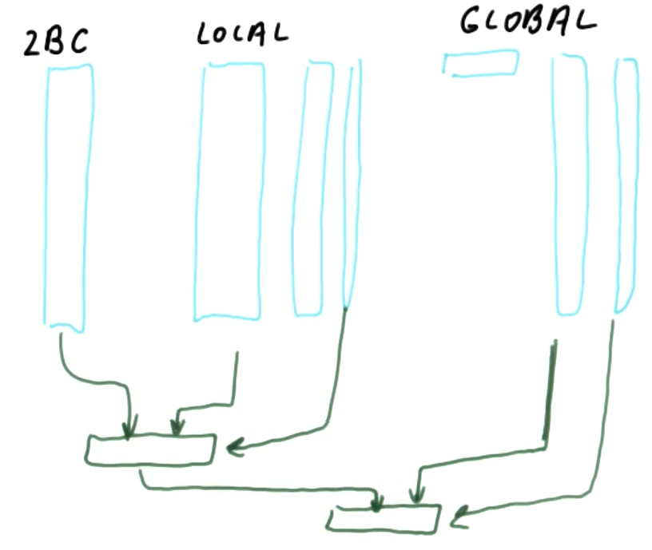
</center>

Finally, if neither the global predictor nor the global predictor have a matching tag (i.e., neither predict the instruction), then the 2-bit counter is used to provide the result.

However, when we ***update*** the predictor, we first update the 2-bit counter. Then:
  * If the branch is ***predicted***:
    * If the branch is present in the local predictor, we update the local predictor accordingly.
    * Similarly, if the branch is present in the global predictor, we update the global predictor accordingly.
  * If the branch is ***mispredicted***:
    * It is inserted into the local predictor, so that the branch is present subsequently.
    * Furthermore, if the local branch is mispredicting, then the branch is inserted into the global predictor, so that the branch is present subsequently.

By "cascading" in this manner, branches are almost perfectly predictable by 2-bit counters, which accounts for a lot of the branches in practice.
  * For example, always taken (or predominantly taken) branches will be mostly predicted by the 2-bit counter, rarely requiring the local and global predictors, which in turn frees/saves space in the latter predictors for the other branches which do require them. Consequently, we can have fewer of the 2-bit entries in the local and global predictors than otherwise necessary (i.e., relative to predicting *all* of the branches via the local and/or global predictors).

<center>
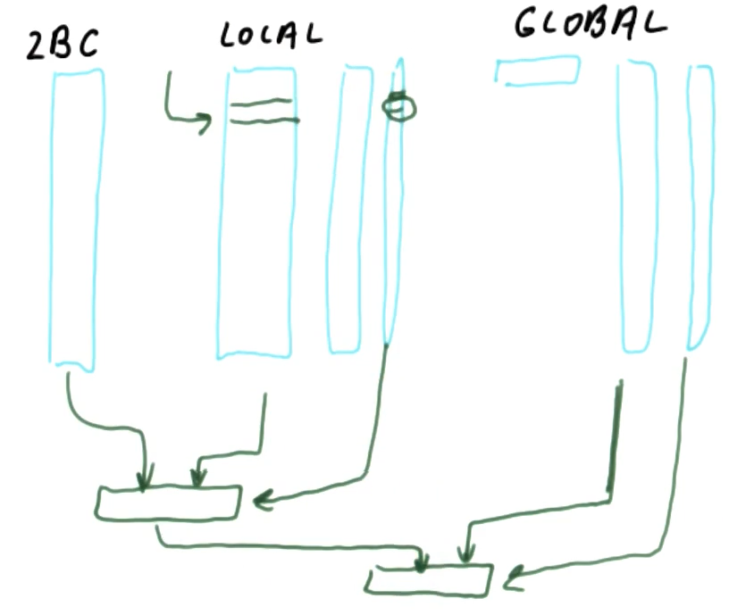
</center>

So, then, how do we determine whether the branch is present or not? To accomplish this, we insert some bits of the branch's address into the corresponding tag-array entry of the predictor (i.e., the local predictor, as shown above). Therefore, the history entry will index via some bits of the PC in order to find the history, and in the same entry of the tag array, we also insert some of the upper bits of the PC; accordingly, when different branches map to this entry, only one of them gets predicted by this entry, while the rest are not determined to be found at this location. In this manner, if most of the branches that map to this entry are actually predictable by the 2-bit predictor, then the entry is not required to make a prediction for those branches.

## 43. Multi-Predictor Quiz and Answers

<center>
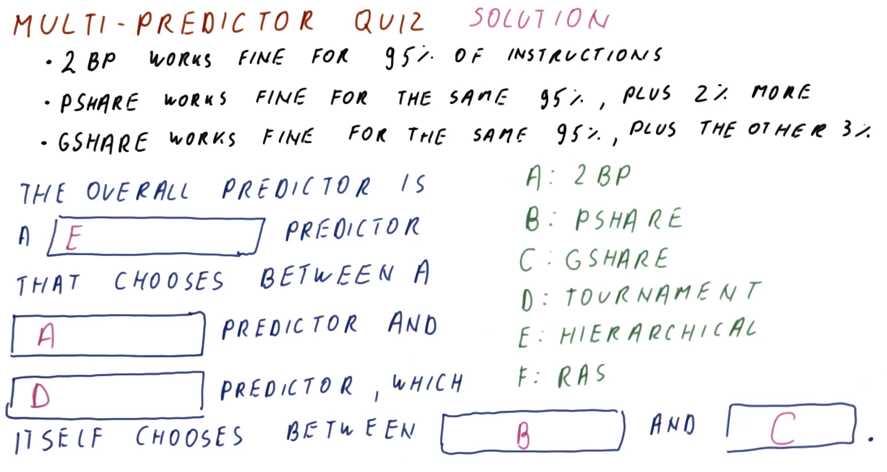
</center>

Consider a program with the following characteristics, which uses a multi-predictor scheme to combine decisions:
  * A 2-bit predictor which works well for 95% of instructions
  * A pshare predictor which works well for the same 95% of instructions, and for an additional 2% not covered by the 2-bit predictor (i.e., giving an overall 97% prediction)
  * A gshare predictor which works well for the same 95% of instructions, as well as for an additional 3% not covered by either the 2-bit predictor or the pshare predictor (i.e., giving an overall 98% prediction)

Therefore, cumulatively, the three predictors can predict virtually 100% of instructions.

How can we describe such a multi-predictor? (Given options: `2-bit predictor`, `pshare`, `gshare`, `tournament`, `hierarchical`, `return address stack (RAS)`)
  * The overall predictor is a `hierarchical` predictor that choses between a `2-bit counter` predictor and a `tournament` predictor, which itself choses between `pshare` and `gshare`.

***Explanation***:

Because the 2-bit counter is the cheapest predictor which can cover the most branches, it is sensible to use it ot predict most of the branches. In such a multi-predictor scheme, the 2-bit counter is combined with a (more expensive) tournament predictor, which is reserved for branches which are mispredicted by the 2-bit counter. The tournament predictor in turn is composed of a pshare and gshare, which have complementary prediction capabilities (i.e., covering the remaining 5% of mispredictions) but are otherwise not advantageous relative to one another.

## 44-45. Return Address Stack (RAS)

<center>
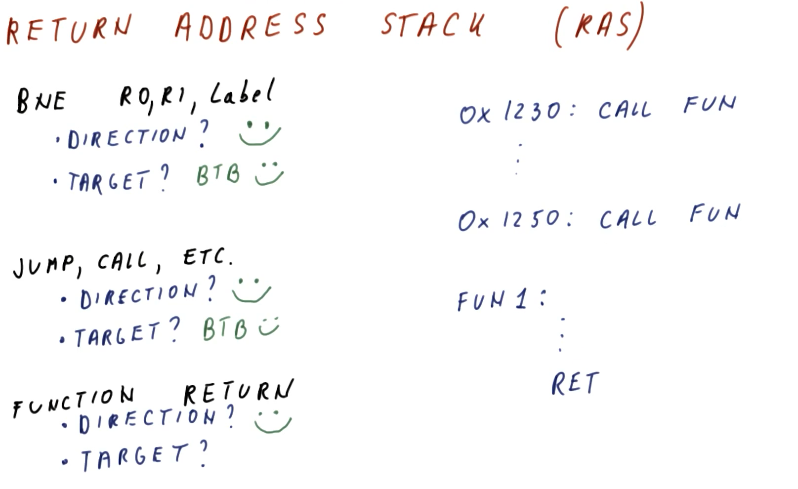
</center>

As we have seen, there are several different types of branches requiring prediction.
  * For conditional branches (e.g., `BNE R0, R1, Label`), we must predict:
    * ***Direction*** (i.e., taken vs. not taken), via the aforementioned strategies
    * If taken, what is the ***target*** address?
      * For this purpose, the BTB is sufficient, because the target (e.g., `Label`) is always the same
  * For unconditional jumps, function calls, etc., we must predict:
    * ***Direction***, which is trivial since it is always taken (and therefore even the simplest predictor is sufficient)
    * If taken, what is the ***target*** address?
      * For this purpose, the BTB is sufficient (i.e., which simply recalls the previous target of the previously executed instruction)
  * For a function return, we must predict:
    * ***Direction***, which is trivial since it is always taken
    * If taken, what is the ***target*** address? This is difficult to predict in general...
      * If the function is called from the *same* place, then return will always jump back to the *same* location, and therefore the BTB will be sufficient.
      * However, more typically, the function can be called from multiple places in the program (e.g., instructions `CALL FUN` at addresses `0x1230` and `0x1250` in the figure above, which are the return targets for the common function `FUN1`)
        * In this case the BTB is insufficient, because in general it will recall the incorrect return target (e.g., if called from `0x1230` initially then the subsequent call from `0x1250` will incorrectly predict a return to `0x1230`, and so forth for subsequent calls).
        * So, then, how can function returns be predicted accurately in such a situation?

To resolve the issue with respect to predicting a return address correctly, we use a **return address stack (RAS)**, which is a separate predictor dedicated to predicting return addresses from a function call.

<center>
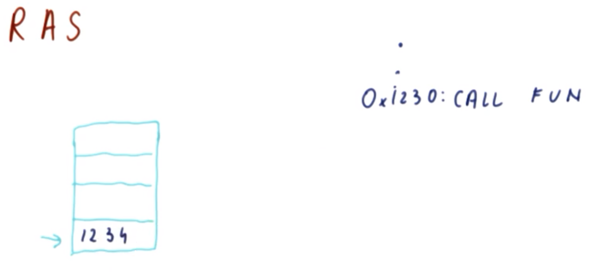
</center>

The RAS works via a small hardware stack with a corresponding pointer. When a function call is executed (e.g., `CALL FUN` at address `0x1230`), the return address (i.e., `0x1234`) is pushed onto the RAS and the pointer is moved up.

<center>
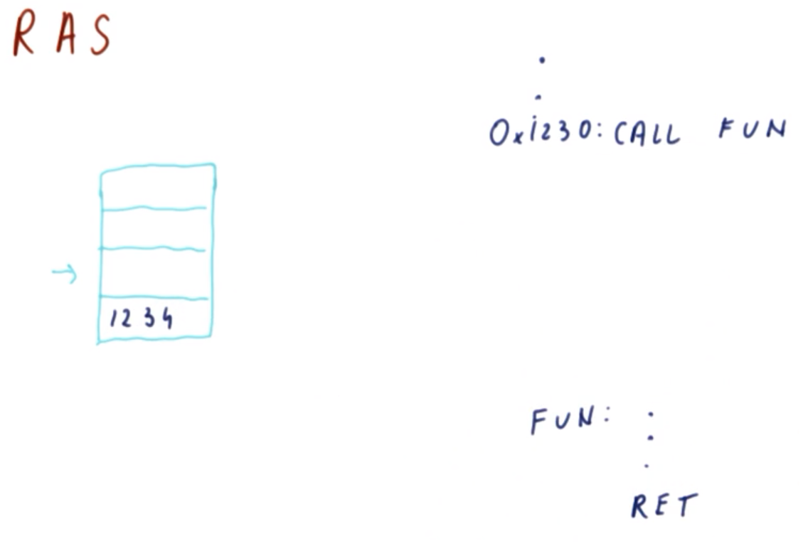
</center>

Within the function, upon reaching the instruction `RET`, the pointer is popped.

<center>
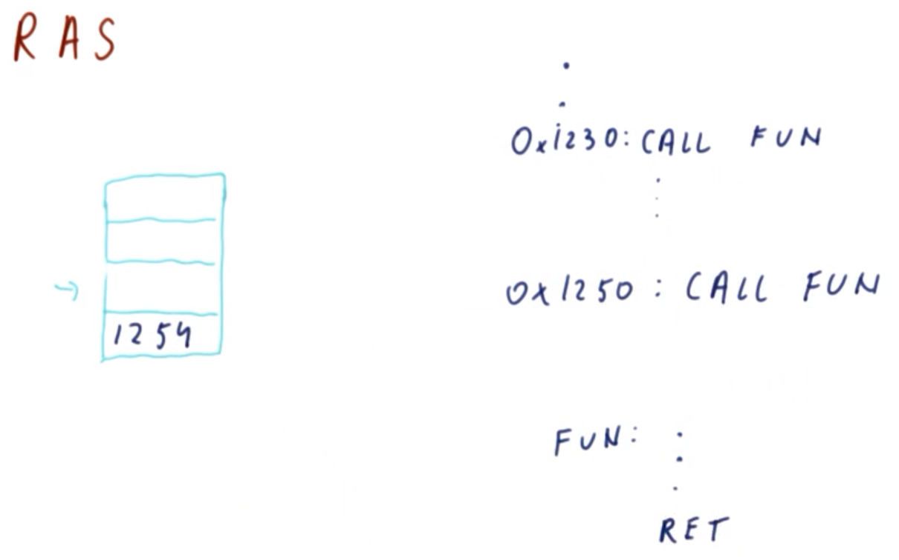
</center>

Similarly, upon reaching `CALL FUN` at address `0x1250`, the return address (`0x1254`) is pushed on the RAS, and the pointer is moved up. Upon reaching the instruction `RET`, the pointer is popped.

<center>
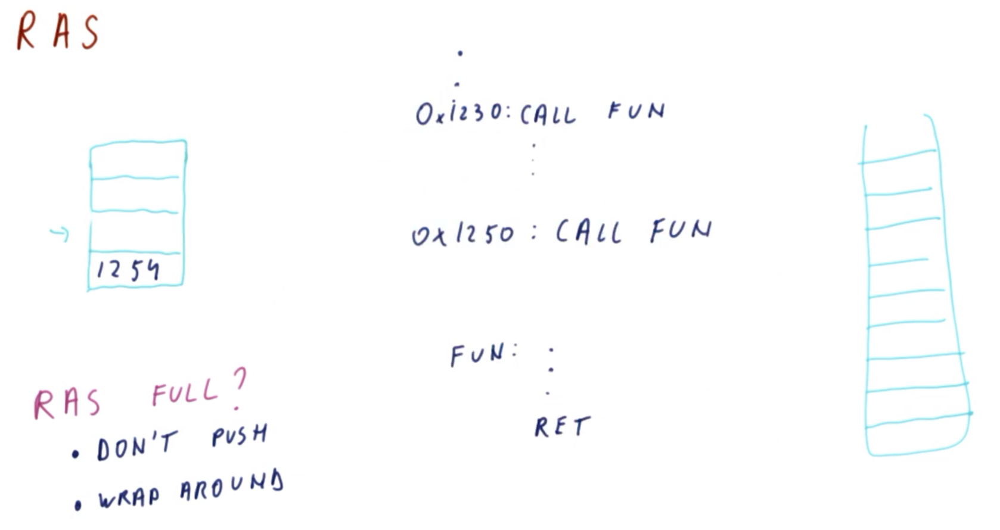
</center>

So, then, why use the RAS predictor, rather than the actual call stack of the program? This is because the RAS predictor must be located on the chip very closely to where the rest of the branch prediction is occurring, and must also be very small. Therefore, unlike a traditional stack (wherein stack frames can be pushed on sequentially until memory is exceeded, as in the right part of the figure shown above), the RAS predictor provides a small stack to allow making predictions very ***rapidly*** (i.e., in one cycle), which in turn allows for only a limited amount of entries on the RAS stack itself.

What happens when we exceed the size of the RAS? (i.e., What resolution measures are available?)
  * Do not push anything else, but rather preserve what is already present on the RAS stack, in order to avoid overwriting anything there
  * Wrap around back to the beginning of the stack, and overwrite in this manner

## 46. RAS Quiz and Answers

<center>
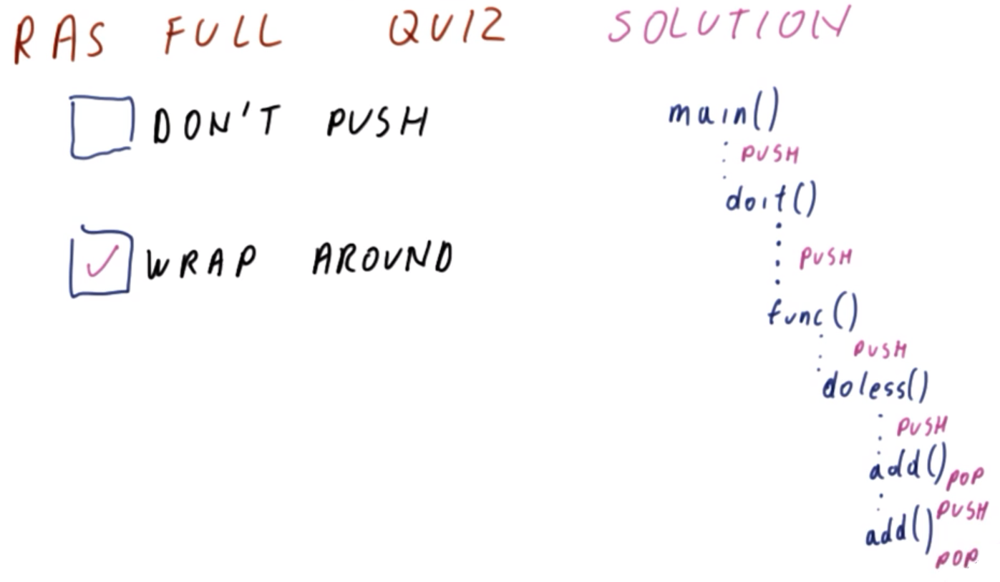
</center>

Which approach is better for resolving a full RAS stack?
  * do not push
  * wraparound
    * `CORRECT`

***Explanation***:

To understand why the wraparound approach is better, consider a typical program (as in the figure shown above, starting with top-level `main()`). The function `main()` proceeds with extensive work until it eventually calls the function `doit()`, which correspondingly pushes onto the RAS stack. Similarly, a cascade of nested function calls may occur subsequently, with corresponding pushes onto the RAS stack.

To demonstrate simply, consider the call sequence (within `main()`) of `doit()`, `func()`, `doless()`, and then subsequent repeated calls to `add()` (i.e., the functions become increasingly less complex and more frequently called).
  * With only *one* entry in the RAS stack and using *do not push* approach, then this is occupied by the initial call to `doit()`, which might be a very large function. As long as we stay in this function (i.e., because it does the majority of the actual work in the program), all of the subsequent function calls will be mispredicted due to running out of space on the RAS, with the only *correct* prediction occurring upon final return from `doit()`.
  * With *two* entries on the RAS stack and using *do not push* approach, the first entry is occupied by the return address of `doit()`, which ultimately will save *one* missed prediction upon final return to `doit()`; and similarly, the second entry will ultimately save *one* missed prediction upon return to `func()`.

Therefore, with the *do not push* approach, this results in a series of mispredictions in downstream (shorter, more frequent) function calls, to ultimately yield correct predictions for the final returns of the (longer, less frequent) parent-function calls.

Conversely, in the *wraparound* approach, correct prediction occurs with respect to the smaller, downstream/terminal function calls' returns (of which there are many), with mispredictions only occurring for the final returns with respect to the (infrequently called) parent-function calls. Therefore, because the innermost, more-frequent function calls dominate, the few entries on the RAS stack are utilized more effectively with the *wraparound* approach (i.e., by minimizing mispredictions).

Another consideration with respect to RAS is that it *is* a *predictor*, after all; therefore, either way, there will inherently be some mispredictions occurring (which can be recovered from appropriately). However, the objective here is to *minimize mispredictions*, and therefore inasmuch as neither approach is a *perfect* predictor, the wraparound approach is still the more optimal between the two with respect to this objective.

## 47. But...But...How Do We *Know* It Is a `ret`?

<center>
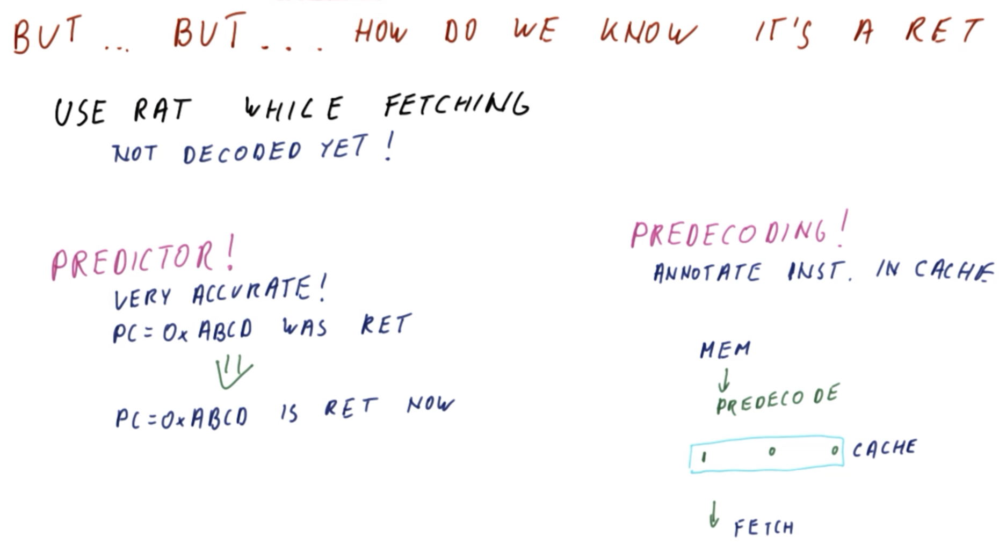
</center>

Note that the prediction must be made while fetching the instruction; in the case of a return instruction, the return address stack (RAS) must be used *before* determining that it is a return instruction; it is *not* feasible to simply arbitrarily push and pop from the RAS prior identifying a return instruction (e.g., if there is an instruction `ADD` present which is popped, rather than a `RET` as intended, then the program will not behave correctly). Therefore, it must be determined (or at least accurately predicted) when a return instruction occurs in order to use the RAS appropriately.
  * To summarize: The ***problem*** is that the RAS is being used *while* fetching the instruction, which has *not* been decoded yet, so therefore it is indeterminate whether or not the instruction in question is a return instruction.

So, then, how can this be resolved/determined?

One way is to simply use a **predictor**, which is simply trained on whether or not the instruction fetched is `RET`, with the predictor thereby informing whether to use the RAS or not. Such a predictor would be very accurate.
  * If at a particular point, the PC previously held the address `0xABC` containing the instruction `RET`, then it is very likely that the same PC occurring will still have instruction `RET`. In this situation, a single-bit predictor can be used effectively here.

Another approach is to use **predecoding**, whereby the processor's cache (described in a subsequent lesson) stores instructions that have been fetched from memory. The processor fetches instructions from the cache, and only if the cache does not already contain the instruction then does the processor fetch from memory. Therefore, with predecoding, when fetching from memory, enough of the instruction is decoded to determine whether or not it is a `RET`, and this information is stored along with the actual instruction in the cache (e.g., with 32-bit instructions, 33 bits are stored: 32 bits for the actual instruction, and 1 bit to indicate whether or not the instruction is a `RET`).
  * Therefore, as the instructions come in from memory and are placed into the cache, they are predecoded along with the additional bit/information. Then, upon fetching, this information is readily available. 
  * Alternatively, the instructions can be fetched from memory directly to cache as they are, and then on every fetch, determine what the instruction. However, because it is more power-efficient to predecode *once* (and subsequently fetch *many* times), the previously described predecoding scheme is a more popular approach.

Predecoding is therefore useful for predictions such as:
  * Is it a return instruction?
  * Is it a branch instruction at all?
    * If it is not a branch at all, then we can completely omit the use of any branch predictors, thereby saving a lot of power.

Furthermore, if instructions have variable sizes, predecoding can also inform, for example, how many bytes does the instruction contain (i.e., in order to fetch the next instruction quickly, without relying on decoding the instruction immediately prior to fetching the next one, and so on).

Additionally, there are many things that modern processors do during this predecoding phase, in order to avoid doing them "on the clock (cycle)."

## 48. Lesson Outro

We now know how the processor predicts which instruction to fetch next. This knowledge will be explored further in a course project.

However, some branches are difficult to predict nevertheless. The next lesson explores helping the compiler to completely eliminate such branches from the program to avoid predicting them altogether.
