# Predication

## 1. Lesson Introduction

This lesson continues the study of control hazards. We already know about branch predictors (cf. Lesson 4), and we also know that some branches are *really* difficult to predict, even with a sophisticated branch predictor.

In this lesson, we will see how the compiler can assists with completely avoiding some of these difficult-to-predict branches.

## 2. Predication

<center>
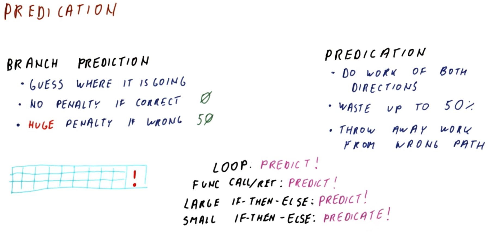
</center>

**Predication** is another method for dealing with control hazards. Unlike branch prediction, when we are really trying to guess which way the if-then-else, loop, or other branching will occur, predication is another way of dealing with control dependencies.

Branch prediction is about guessing where the program is going.
  * Usually there is no penalty for correct branch prediction; essentially, we just keep fetching as if there were no branch, and even if the branch is actual taken then we continue fetching from the correct location, thereby avoiding a penalty.
  * However, a key ***problem*** with branch prediction is that in modern processors there is a ***huge*** penalty for mispredictions.
    * Bear in mind that modern processors have a ***deep*** pipeline, with *many* stages occurring prior to encountering the missed prediction. Furthermore, each stage contains many in-progress instructions; therefore, a misprediction negates *all* of this work (typically on the order of several 10s of instructions, e.g., `48 ~ 50` instructions in a 12-stage pipeline with 4 instructions per cycle)!

Predication involves doing the work of *both* the taken and not taken directions of a branch.
  * In this manner, the waste is up to 50% of the work performed (i.e., at the position within the pipeline that the branch occurs, half of the content fetched to that point could be from one path while the other half is from the other path, with only effectively half overall being used and the other half being discarded).

So, then, what is particularly useful about predication, given the relatively low penalty potential of branch prediction vs. the inherent "wastefulness" of predication? To demonstrate this, let's consider some conditional branches that we might want to predict, as follows.

<center>
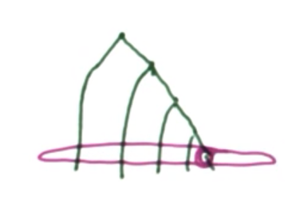
</center>

For a ***loop***, usually branch prediction is preferable.
  * With loop branches, the more iterations that occur, the more predictable they are in general.
  * Conversely, with predication, in each iteration of the loop, the work is divided into two: One is for the next iteration, the other for after the loop. Therefore, with 1000 iterations, very little of the work ends up being done "correctly," i.e., the branch diverges too much (as in the figure shown above).
    * When we need to determine whether or not to stay in the loop, we start the work of both of these, with one path going off of the loop and the other going back into the loop. This proceeds similarly with subsequent branches/paths, and with all of this work occurring concurrently, a very small fraction of the work (i.e., the right-most circled in the figure shown above) results in staying in the loop itself, with the other ("non-useful") work encompassing various variants of (unnecessarily) exiting the the loop in each iteration.

For ***function calls***, a similar phenomenon occurs, i.e., branch prediction is more advantageous.
  * Here, predication is not sensible, because calls and returns always go to the return address, so the notion of "not going" there is nonsensical.

<center>
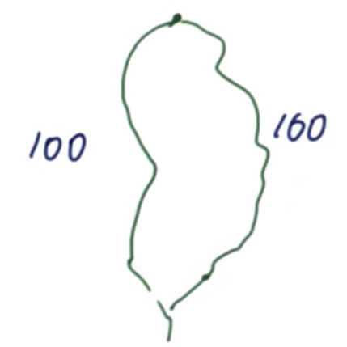
</center>

Consider a ***large if-then-else***. Here, we have a decision which yields two possible paths (as in the figure shown above). Here, should we attempt to predict this decision, or to predicate (such that we do the work of both and eventually merge and re-continue through the execution path).
  * If we predict, we waste up to 50 instructions (i.e., with mispredictions), but more likely (i.e., with correct predictions) we waste nothing.
  * Conversely, if we predicate, and assuming the two branches have equal waste, then given 200 instructions we will waste 100 of them either way. Therefore, the waste is larger than the corresponding penalty of branch prediction (50). Therefore, branch prediction is also more sensible here.

<center>
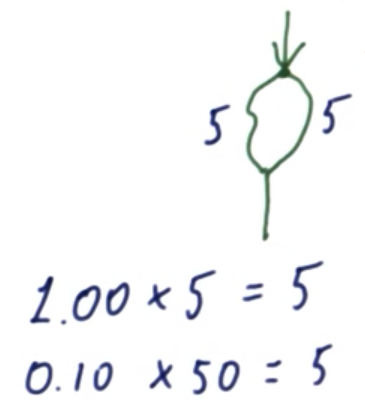
</center>

Now, consider a ***small if-then-else*** (as in the figure shown above). With 5 instructions apiece in the then and else paths...
  * Here, predication involves 10 instructions, followed by subsequent instructions done by the program either way (i.e., irrespectively of prediction vs. predication).
    * With 100% waste, we end up with `1.00 * 5 = 5` instructions wasted with predication.
  * With prediction, there is no penalty with correct predictions, however, mispredictions yield a waste of 50 instructions, which is substantially ***worse*** than predication.
    * With a 10% misprediction rate, we end up with `0.10 * 50 = 5` instructions wasted with prediction. Therefore, with an accuracy of 90% or better, we are better off predicting; otherwise, with a worse accuracy than this, predication is better.

Therefore, in general, the smaller the if-then-else, the stronger the bias towards predication and away from prediction (barring high prediction accuracy).

## 3. If Conversion

<center>

</center>

Before discussing how predication works in hardware, first consider the technique called **if conversion**, which is how the compiler creates the code that will be executed along both paths.

```c
if (cond) {
  x = arr[i];
  y = y + 1;
} else {
  x = arr[j];
  y = y - 1;
}
```

Consider the relatively small if-then-else code fragment, as shown above. If conversion transforms this code into the work of both paths, followed by a selection of some sort between the results of these two paths, as follows:

```c
x1 = arr[i];
x2 = arr[j];
y1 = y + 1;
y2 = y - 1;
x = cond ? x1 : x2;
y = cond ? y1 : y2;
```

But a question still remains: How is this done?

```mips
BEQ ...,
  MOV x, x2
  B Done

MOV x, x1
⋮
```

If we convert statement `x = cond ? x1 : x2;` (as shown above) into a conditional expression  that still branches based on the condition and then performs the move of `x2` into `x` or otherwise moves `x` into `x1`, then we haven't really done much; we have simply converted one branch into another, and now we have this branch twice (unless we have some sort of correlating predictor, such as the global history predictor), resulting in possibly *two* missed predictions, rather than only the *one* that could have resulted.

<center>
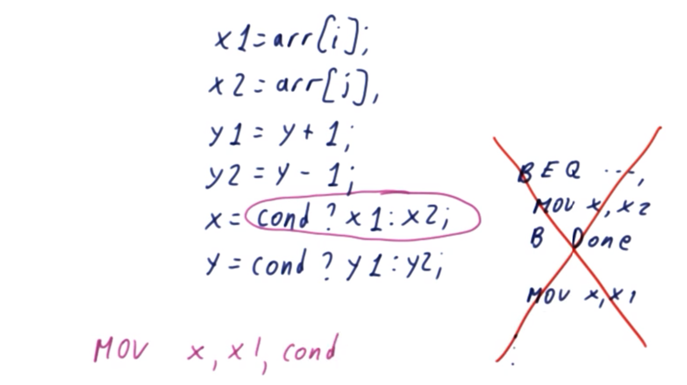
</center>

Therefore, if this is the *only* possibility, then  if conversion is simply ***not*** performed.


In order for if conversion to work here, what is need is an instruction such as `MOV x, x1, cond` via flag `cond` indicating `true`.

## 4. Conditional Move

<center>
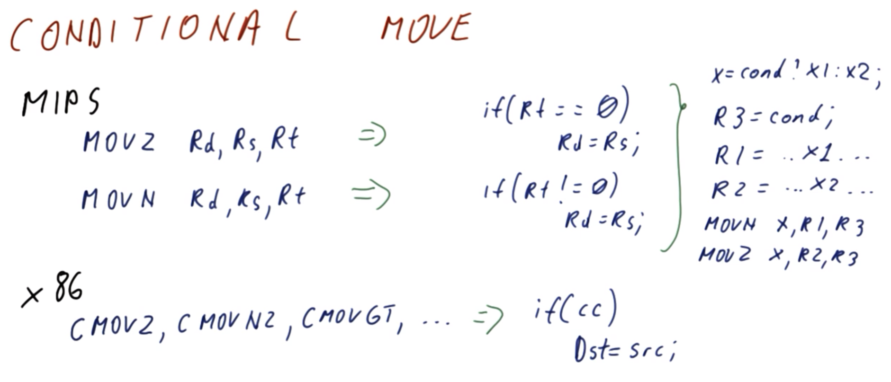
</center>

Therefore, the simplest form of predication supporting hardware is a **conditional move** instruction.

In the MIPS instruction set:
  * The instruction `MOVZ` takes two sources (`Rs`, `Rt`) and a destination register (`Rd`).
    * It compares `Rt` to `0`...
      * If `Rt` is `0`, then `Rd` is set to `Rs`.
      * Otherwise, `Rd` is unchanged.
    * Consequently, there is no branch anymore, as there is only a single instruction.
  * The instruction `MOVN` works similarly to `MOVZ`, except that it moves `Rs` into `Rd` only if `Rt` is *not* `0`.

```mips
R3 = cond
R1 = ... x1 ...
R2 = ... x2 ...
MOVN x, R1, R3
MOVZ x, R2, R3
```
 
Therefore, to implement `x = cond ? x1 : x2;` using MIPS, this could be done as shown above. The result places one of `R1` or `R2` into `x`, depending on whether `R3` is `true` or `false` (i.e., depending on the condition `cond`).

```c
if (cc)
  Dst = src;
```

Similarly, the x86 instruction set has a set of `CMOV` instructions (e.g., `CMOVZ`, `CMOVNZ`, `CMOVGT`, etc.), wherein the condition is determined by the flags. All of these instructions effectively implement the shown above (where `cc` denotes the condition code, and `Dst` and `src` represent the destination and source registers, respectively). The corresponding implementation would be similar to that shown previously for MIPS, with the inclusion of `R3 = cond` being unnecessary here (but rather supplanted with a corresponding `CMOV` instruction instead).

## 5. `MOVZ`/`MOVN` Quiz and Answers

<center>
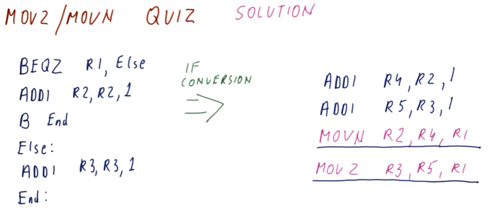
</center>

Consider how conditional move instruction are used, given the following MIPS code:
```mips
  BEQZ R1, Else
  ADDI R2, R2, 1
  B    End
Else:
  ADDI R3, R3, 1
End:
```
After if conversion, the result is as follows:
```mips
ADDI R4, R2, 1
ADDI R5, R3, 1
# ?
# ?
```

What are instructions (`?`) required to perform the if conversion?

***Answer and Explanation***:

```mips
ADDI R4, R2, 1
ADDI R5, R3, 1
MOVN R2, R4, R1 # answer
MOVZ R3, R5, R1 # answer
```

Recall that if conversion amounts to doing the work of *both* (i.e., then/taken *and* else/not-taken) paths, and then selecting among the two results such that only *one* of them is active.

The first two instructions of the if conversion (`ADDI ...`) correspond to these two paths.
  * If the taken path is correct, then `R2` is assigned the value of `R4`.
  * If the not-taken path is correct, then `R3` is assigned the value of `R5`.

Subsequently:
  * `MOVN` performs the taken path via `R1` as the condition, moving `R4` into `R2`
  * `MOVZ` performs the non-taken path via `R1` as the condition, moving `R5` into `R3`

In the if-conversion form, the branches are therefore removed and replaced with four total sequential steps/instructions; in contrast, pre-conversion, there are more instructions, as well as a more difficult-to-predict branching (via `BEQZ R1, Else`).

## 6. `MOVZ`/`MOVN` Performance

<center>
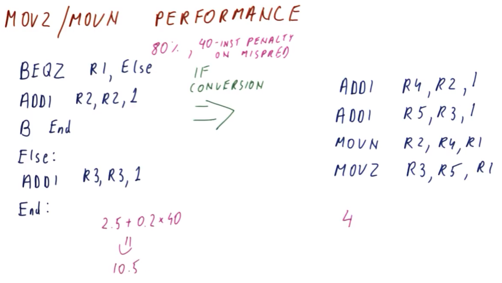
</center>

Let us now consider the performance of `MOVZ`/`MOVN` in the context of if conversion.

In the previous section (quiz), it was already demonstrated that such branch code as in the figure shown above can be if converted.

Suppose now that the instruction `B End` is perfectly predicted, and is therefore the only one of practical concern. Furthermore, assume that the branch is predicted with `80%` accuracy, with a `40%` penalty for misprediction. In this case:
  * The if converted version incurs a penalty of `4` instructions
  * For the non-converted version, assuming unbiased, difficult-to-predict branching, misprediction yields a penalty of `(0.5*3 + 0.5*2) + (1 - 0.8)*0.4 = 10.5` instructions on average

Therefore, in this instance, the if converted version is more optimal with respect to penalty-minimization.

## 7. `MOVZ`/`MOVN` Performance Quiz and Answers

<center>
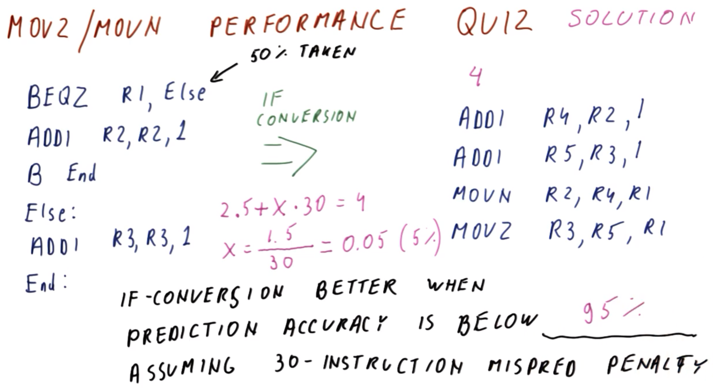
</center>

Consider the code shown above. The branch designated by the first instruction (`BEQZ R1, Else`) is taken `50%` of the time. Given this information, the if conversion is better when the prediction accuracy is below what (i.e., *specify* a percentage), assuming a `30`-instruction misprediction penalty.
  * `95%`

***Explanation***:

Given a `50%` taken rate, *perfect* prediction implies an execution of `3*0.5 + 2*0.5 = 2.5` instructions between the two branches (in contrast, the if-converted version executes `4` instructions).

Therefore, the critical level for prediction accuracy can be determined as follows:
```
2.5 + x*30 = 4
x = (4 - 2.5)/30 = 0.05
```

which implies a critical threshold of `1 - 0.5 = 0.95` (`95%`) prediction accuracy.

## 8. `MOVc` Summary

<center>
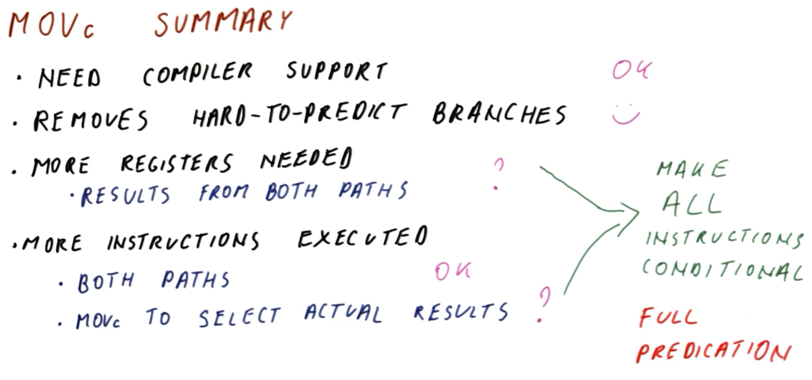
</center>

To summarize, in the aforementioned approach involving conditional move instructions (`MOVc`):
  * Compiler support is required → `necessary` for if conversion
    * If the compiler does not provide this optimization, then the code will be simply left intact (i.e., with a branch present); therefore, this is not a fully backwards-compatible approach, inasmuch as when the conditional move instructions are included in the instruction set architecture (ISA) then the compiler can take advantage of this optimization, but otherwise old code will not benefit from these conditional move instructions.
  * Removes hard-to-predict branches → `useful` for if conversion
    * If such a branch is identified (e.g., via profiling), if conversion can be performed to eliminate such a branch.
  *  Typically requires the use of more registers than the original, non-converted code → `not strictly necessary` for if conversion
    * The results of *both* paths must be stored.
  * More instructions are executed (i.e., as a result of if conversion)
    * *Both* paths are executed, not just *one* of them. → `useful` for if conversion
    * `MOVc` instructions must be included in order to select the actual results (i.e., those to be used/kept from among the results generated via both paths). → `not strictly necessary` for if conversion

Per above features, those designated `not strictly necessary` can be mitigated/resolved by updating the ISA to make ***all*** instructions conditional (i.e., every instruction computes its result and then either does or does not write it to the destination register, depending on whether or not a condition is or is not true [respectively]). Such an approach is called **full predication**, which requires extensive ISA support to perform; this approach is discussed next.

## 8-9. Full Predication

### Hardware Support

<center>
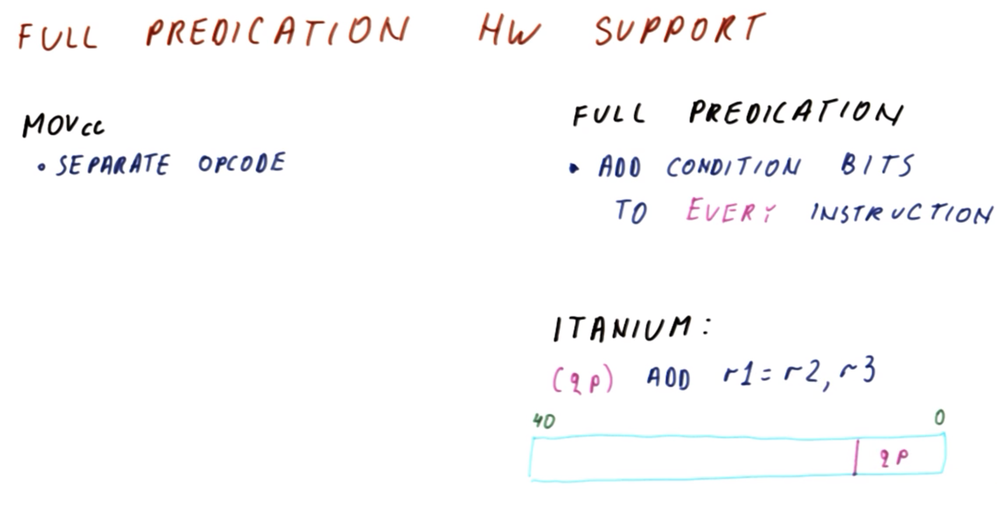
</center>

Consider the respective hardware requirements for conditional moves (i.e., via `MOVcc`) vs. full predication.

For conditional moves, a separate opcode is required to identify that the instruction in question is a conditional instruction. Typically, there is a *separate* opcode for *each* particular condition, thereby requiring *multiple* such opcodes in practice.

For full predication, the ***same*** instructions are used as those for instructions without conditions, to which condition bits are added; this is done for ***every*** instruction. Therefore, every instruction word contains *some* bits indicating the condition for writing to the destination register.

For example, the Intel **Itanium** instruction set has full predication (as in the figure shown above).
  * Here, an instruction such as `ADD r1=r2, r3` identifies the source registers (`r1` and `r2`), the destination register (`r1`), the instruction/opcode (`ADD`), and also includes a field (`qp`) within the instruction itself in order to specif the so-called **qualifying predicate** (which, here, identifies the location of the condition for performing the write to the register `r1`).
  * An Itanium instruction is comprised of 41 bits, wherein the six least-significant bits specify the qualifying predicate. In Itanium, these bits are actually small 1-bit registers, which enable to perform a condition check, whose result can be stored in this 1-bit register; correspondingly, these six bits indicate which of the 64-bit conditional registers will be used (i.e., in order to determine whether or not to write to `r1`).

### Example


## 10. Full Predication Quiz and Answers


## 11. Lesson Outro

