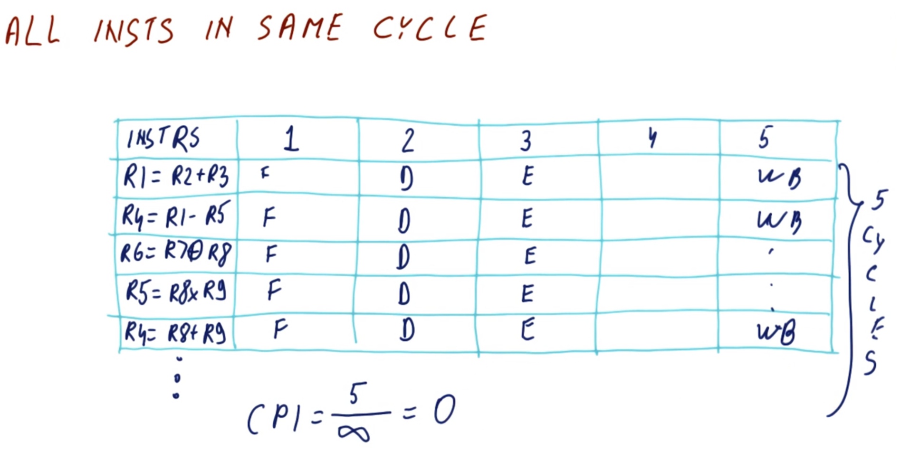
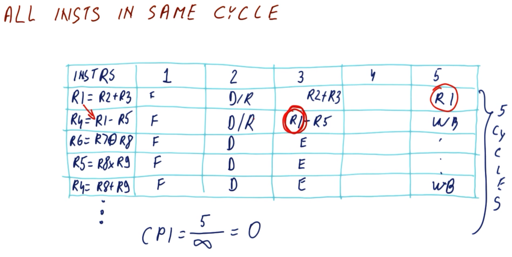
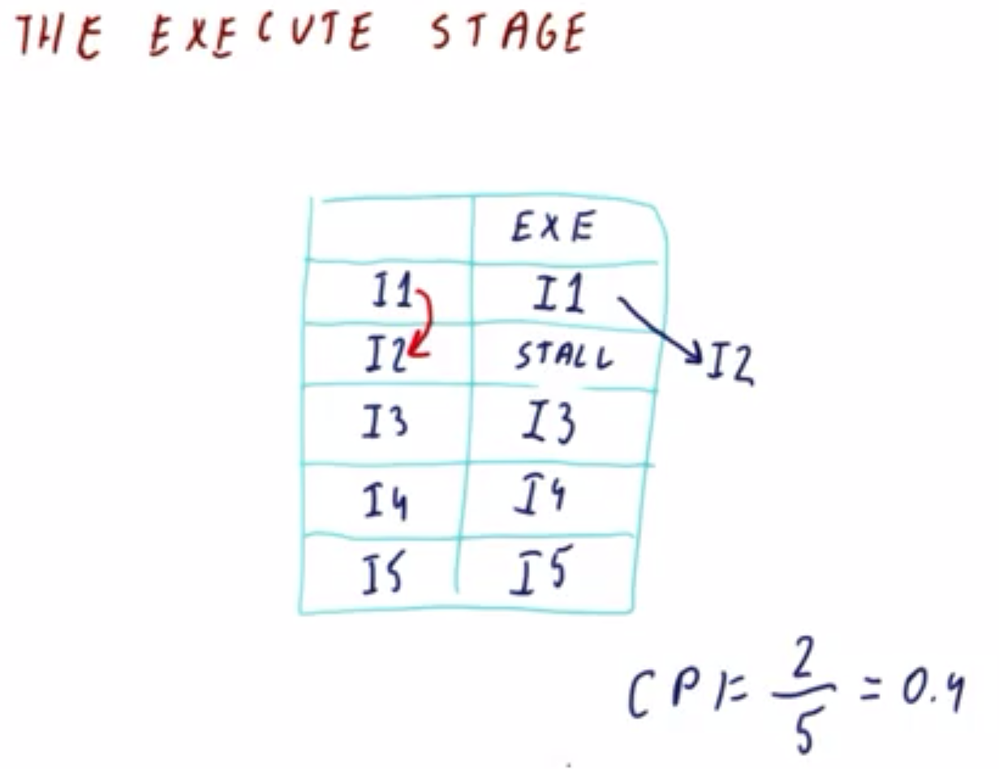
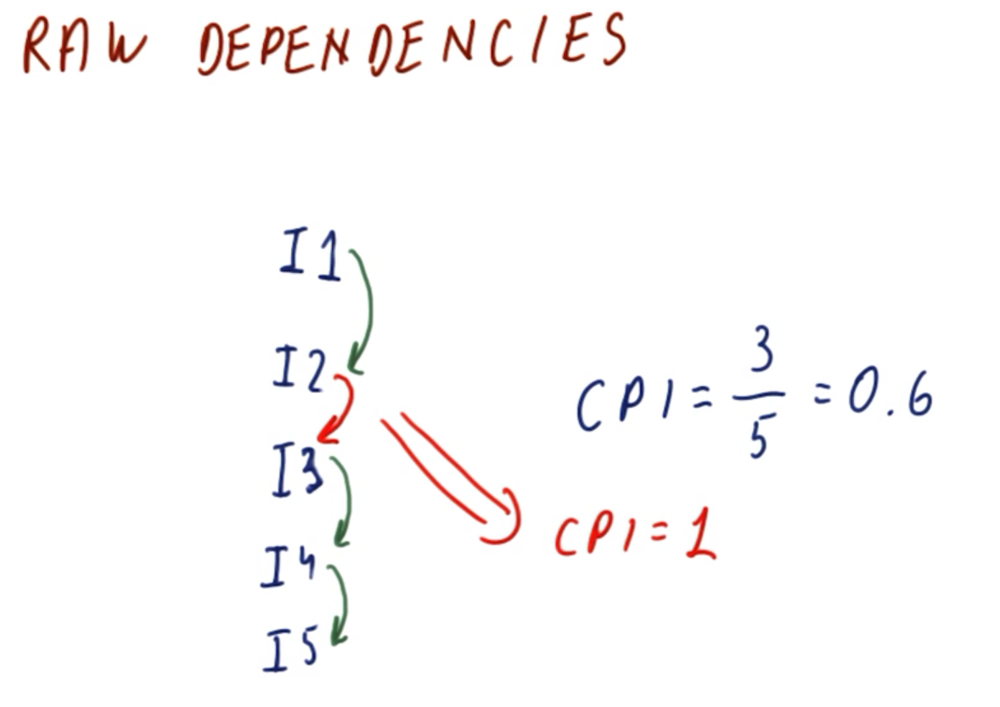
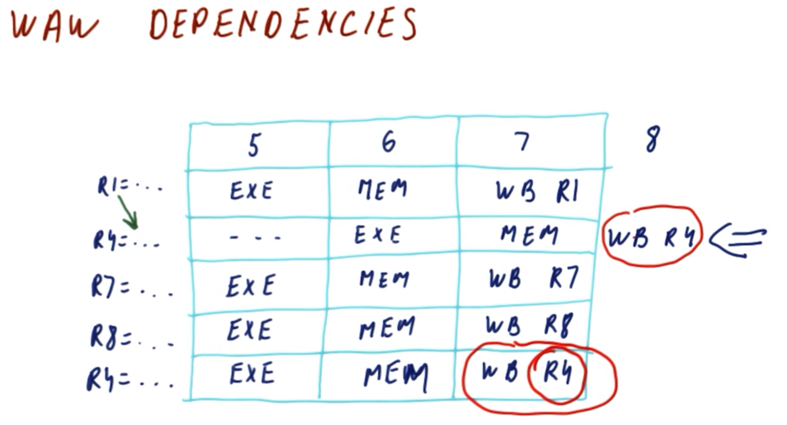
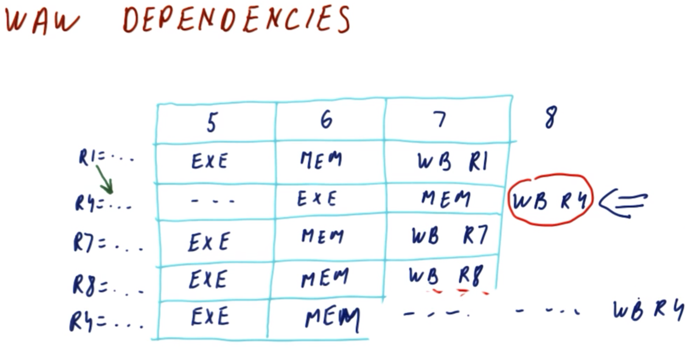
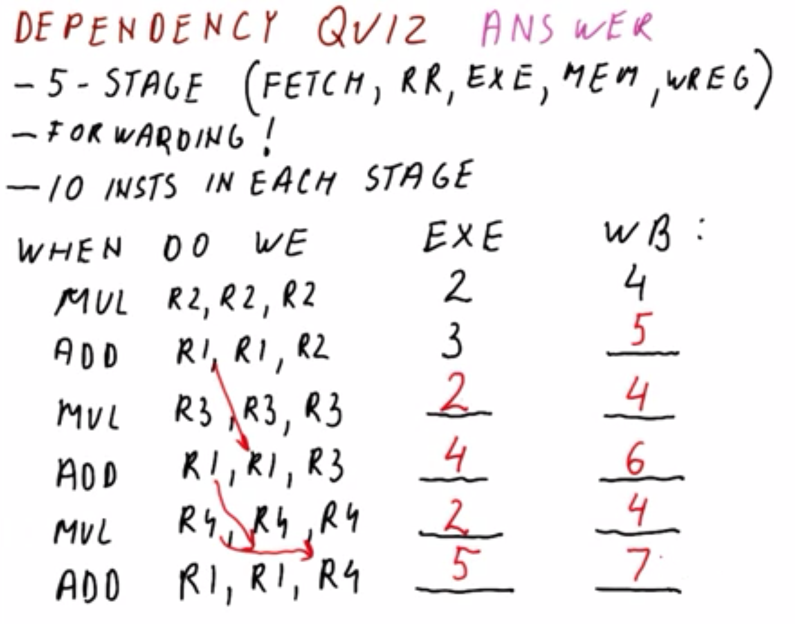
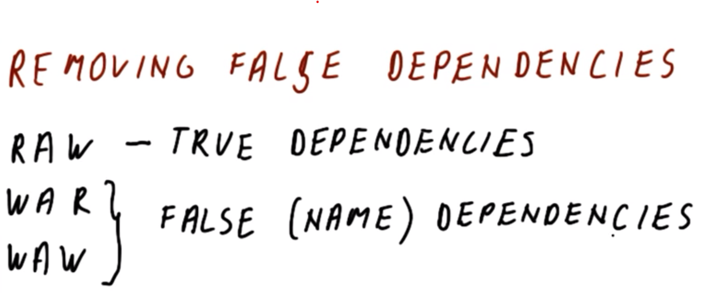

# Instruction-Level Parallelism (ILP)

## 1. Lesson Introduction

Recall that branch prediction (cf. Lesson 4) and if conversion (cf. Lesson 5) help to eliminate most of the pipeline issues caused by control hazards. But **data dependencies** can also prevent the finishing of one instruction in every single cycle; so, then, what can be done about data dependencies? And why stop at only *one* instruction per cycle, for that matter?

In this lesson, we will learn about **instruction-level parallelism (ILP)**, which indicates how many instructions could be *possibly* executed.

## 2. *All* Instructions in the *Same* Cycle

<center>

</center>

In the most ***ideal*** situation, all instructions pending execution simply go through the pipeline all in the *same* stage (i.e., all executing simultaneously in the *same* cycle).

| Instruction* | C1 | C2 | C3 | C4 | C5 |
|:--:|:--:|:--:|:--:|:--:|:--:|
| `R1 = R2 + R3` | `F` | `D` | `E` | `⋯` | `WB` |
| `R4 = R1 - R5` | `F` | `D` | `E` | `⋯` | `WB` |
| `R6 = R7 ⨁ R8` (XOR) | `F` | `D` | `E` | `⋯` | `WB` |
| `R5 = R8 × R9` | `F` | `D` | `E` | `⋯` | `WB` |
| `R4 = R8 + R9` | `F` | `D` | `E` | `⋯` | `WB` |

****N.B.*** Using simplified high-level-language-like notation here instead of opcodes (i.e., assembly-style notation) for brevity.

Consider the five-stage-pipeline example shown above. Eventually, in the last stage of the pipeline, the results are written. Furthermore, even with additional instructions beyond those shown above, all would be completed within five cycles. Therefore, with increasing number of instructions, the following holds:

```
CPI = 5/∞ = 0
```

<center>

</center>

While a CPI of `0` is "ideal on paper," there are inherent **issues** here. For example, the first two instructions *both* read/decode register `R1`, therefore, upon execution of the respective instructions, the first instruction is writing to `R1` while next instruction is simultaneously reading `R1`. Correspondingly, this error propagates downstream in subsequent instructions.

Therefore, necessarily, such instructions *cannot* execute in the *same* cycle; instead, some type of resolution measure is necessary for managing such instructions' respective executions.

## 3. The `Execute` Stage

As seen previously (cf. Section 2), an issue arises when multiple instructions execute in the *same* cycle dealing with the *same* data/register(s) (e.g., having to read registers *before* the previous instruction has written to them). In particular, this problem occurs in the stage `E` (execute), due to operation there on an ***invalid*** value by that point.

<center>

</center>

Consider **forwading** in the stage `E` as a potential resolution measure for this issue. Recall (cf. Lesson 3) that forwarding feeds the value(s) from the previous instruction into the subsequent instruction *before* the value(s) has been written to the register(s).

Returning to the example from the previous section, and focusing on the stage `E` (as in the figure shown above), recall that there is a dependency between instructions `I1` and `I2`. Here, `I1` executes, and then subsequently `I2` also executes in the *same* cycle.

The ***problem*** with forwarding here is that while forwarding from `I1` to `I2` *could* resolve the issue with respect to the latter in the *next* cycle, it does *not* resolve the matter with respect to the *same*/*current* cycle.
  * Examining the timeline for the cycle (relative to the beginning of stage `E`), the result from `I1` is only available at the *end* of `I1` (which is the only point where forwarding to `I2` would be beneficial), but the point at which the value is *necessary* for use in `I2` is in the *beginning* of the *same* cycle; this would essentially (unrealistically) require "backwards time travel"

<center>

</center>

In reality, to resolve this matter, it is necessary to **stall** in `I2` during this cycle, pending completion of `I1`'s execution, thereby delaying execution of `I2` in the current/same cycle, only executing in the subsequent cycle (i.e., concurrently with `I3`).

If there are *no* dependencies among subsequent instructions `I3`, `I4`, and/or `I5` with respect to `I1`, then the former can all still proceed with execution uninterruptedly in the same cycle. This yields the following (ignoring transient effects such as initial filling of the pipeline, etc. for simplicity):

```
CPI = 2 cycles / 5 instructions = 0.4
```

This is a slight deviation from the ideal of `1 cycle / 5 instructions = 0.2`, however, as this analysis suggests, many such dependencies (which *do* occur in practice) will further exacerbate this problem (i.e., deviating/increasing away from `0` cycles per instruction).

## 4. RAW Dependencies

As we have just seen (cf. Section 3), even the ideal processor (i.e., that which can execute *all* instructions per cycle) still must obey **RAW (read-after-write) dependencies**, i.e., it must still wait for results to be produced in order to be used by subsequent instructions requiring those results. This in turn generates inherent ***delays*** which will occur even in such an ideal processor, and therefore the instruction-level parallelism (ILP) is not `0`, but rather something larger than that.

<center>

</center>

Consider the instructions in the figure shown above. RAW dependencies are denoted by green curved arrows. Here, there are three downstream RAW dependencies (`I2`, `I4`, and `I5`), while `I1` and `I3` can execute normally. Therefore, in the ideal situation:

```
CPI = 3 cycles / 5 instructions = 0.6
```

Additionally, with an added dependency between `I2` and `I3` (denoted by red in the figure shown above), there is now full RAW dependency across all five instructions (i.e,. all five cycles are required to perform all five instructions), resulting in the following:

```
CPI = 5 cycles / 5 instructions = 1
```

Therefore, in general, the RAW dependencies will dictate the lower limit of the possible CPI (i.e., somewhere between `0` and `1`), even with an ideal processor (i.e., one which can otherwise efficiently fetch all instructions, decode/read arbitrarily many registers simultaneously, etc.--but still *cannot* provide time travel!).

### 5. WAW Dependencies

<center>

</center>

| Instruction | C5 | C6 | C7 | C8 |
|:--:|:--:|:--:|:--:|:--:|
| `R1 = ...` | `E` | `M` | `WB R1` |`⋯` |
| `R4 = ...` | `(...)` | `E` | `M` | `WB R4` |
| `R7 = ...` | `E` | `M` | `WB R7` |`⋯` |
| `R8 = ...` | `E` | `M` | `WB R8` |`⋯` |
| `R4 = ...` | `E` | `M` | `WB R4` |`⋯` |

Consider the instructions shown above. For purposes of examining **write-after-write (WAW) dependencies**, it is inconsequential as to which specific instructions are being performed (as denoted by `...` accordingly), other than the fact that such a dependency exists among them and that the write-to operation impacts a particular register itself.

Here, the first instruction computes a result which it writes to `R1`, the second instruction similarly writes to `R4`, and so on. If there is a read-after-write (RAW) dependency between the first and second instructions, then by cycle `C5` (at which the first instruction is executing), the second instruction must wait on the first to complete its execution first (and consequently the latter will only execute in the subsequent cycle, `C6`); simultaneously, the downstream instructions proceed with execution in cycle `C5`, unaffected by the upstream RAW dependency.

Consequently, in this five-stage pipeline, by cycle `C6`, there is a "relative lag" in the second instruction with respect to the others (which have now proceed to stage `M`), which continues into cycle `C7`. However, because of the "upstream lag," there is a discrepancy in the pipeline stage `WB R4`, which is performed by *both* the second instruction (now in cycle `C8` due to delay) and the first instruction (in cycle `C7` "as usual"). Effectively, the second instruction will overwrite (in cycle `C8`) the *intended* value produced by the fifth instruction (previously in cycle `C7`).
  * The original intent of the programmer here is that the fifth instruction would "already have" the valid value by that point (which would only be a valid assumption if there were *no* RAW dependency here).

Observe that the root cause of this ***problem*** is the delay induced from the upstream RAW dependency.

<center>

</center>

| Instruction | C5 | C6 | C7 | C8 | C9 |
|:--:|:--:|:--:|:--:|:--:|:--:|
| `R1 = ...` | `E` | `M` | `WB R1` |`⋯` |`⋯` |
| `R4 = ...` | `-` | `E` | `M` | `WB R4` |`⋯` |
| `R7 = ...` | `E` | `M` | `WB R7` |`⋯` |`⋯` |
| `R8 = ...` | `E` | `M` | `WB R8` |`⋯` |`⋯` |
| `R4 = ...` | `E` | `M` |`(...)`|`(...)`| `WB R4` |

To resolve this problem, on solution would be to delay the writing in the fifth instruction to occur in a downstream cycle relative to the second instruction via stalling, as shown above. Therefore, in this situation, the processor must intervene with some type of resolution measure to ensure correct ordering of the write operations.

### 6. Dependency Quiz and Answers

<center>

</center>

Now that we have seen two types of depdendencies (i.e., read-after-write/RAW and write-after-write/WAW) and how they can affect the scheduling of instructions in a processor attempting to perform at `CPI > 1`, consider the following scenario.

A processor is given with a classical five-stage pipeline (`F`, `D`, `E`, `M`, `W`) and which can also perform ***forwarding*** (i.e., if the result has been produced, it is fed into the instruction correctly, even though it has not been written to a register yet). Furthermore, each stage can execute `10` instructions (i.e., ideally, it can perform all `10` instructions within `5` cycles--assuming no dependencies, etc.).

Given this processor, in which cycle does the operation `WB` (write back) occur for the following instructions)?

| Instruction | `E` | `WB` |
|:--:|:--:|:--:|
| `MUL R2, R2, R2` | `C2` | `C4` |
| `ADD R1, R1, R2` | `C3` | ? |
| `MUL R3, R3, R3` | ? | ? |
| `ADD R1, R1, R3` | ? | ? |
| `MUL R4, R4, R4` | ? | ? |
| `ADD R1, R1, R4` | ? | ? |

(***N.B.*** Cycles are numbered relative to `C0` for initial fetch/`F` of first instruction.)

***Answer and Explanation***:

| Instruction | `E` | `WB` |
|:--:|:--:|:--:|
| (1) `MUL R2, R2, R2` | `C2` | `C4` |
| (2) `ADD R1, R1, R2` | `C3` | `C5` |
| (3) `MUL R3, R3, R3` | `C2` | `C4` |
| (4) `ADD R1, R1, R3` | `C4` | `C6` |
| (5) `MUL R4, R4, R4` | `C2` | `C4` |
| (6) `ADD R1, R1, R4` | `C5` | `C7` |

In the second instruction, the operation `ADD` requires a one-cycle delay to read the result of the previous instruction (i.e., dependence via `R2`), resulting in `WB` occurring in cycle `C5`.

In the third instruction, there is no dependency, since the instruction only involves the single register `R3` (which does not depend on either upstream instructions). Therefore, `WB` can occur in cycle `C4` "as usual."

In the fourth instruction, there is a dependency (via `R1` and `R3`) on the upstream instructions (via the second and third instructions, respectively). In particular, this instruction must wait to execute in cycle `C3` for `R1` to be available/valid for writing to, consequently resulting in a `WB` in cycle `C6`.
  * ***N.B.*** This `ADD` operation will also overwrite `R1` in the which was written in the previous `ADD` (i.e., the second instruction), however, this has no impact on the second instruction (which also reads `R1`), due to the latter having already completing `WB` in cycle `C5`.

In the fifth instruction, there is no dependency, since the instruction only involves the single register `R4` (which does not dependent on any upstream instructions). Therefore, `WB` can occur in cycle `C4` "as usual."
  * ***N.B.*** This instruction is analogous to the second instruction, ie., no dependencies involved.

In the sixth instruction, there is a dependency (via `R1` and `R4`) on the upstream instructions (via the fourth and fifth instructions, respectively). Correspondingly, the execution of the sixth instruction must occur subsequently to the latest-occurring dependency, i.e., subsequently to cycle `C4` (via the fourth instruction, which does not execute until cycle `C4`). Consequently, the sixth instruction does not execute until cycle `C5` and subsequently performs `WB` in cycle `C7`.
  * ***N.B.*** Cycle `C7` is valid for `WB` of the sixth instruction, because there is no other write dependency (i.e., in any upstream instructions) by the time of cycle `C7`, i.e., this would be the latest-occurring `WB` with respect to register `R1`.

### 7-10. Removing False Dependencies

#### 7. Introduction to False Dependencies

Thus far we have seen that:
  * read-after-write (RAW) dependencies are of concern due to having to feed the required value from a previous instruction, thereby causing a delay
  * write-after-write (WAW) dependencies are of concern due to ensuring that the downstream-most instruction indeed occurs intended (i.e., writes a valid value to the register)

Anti-dependencies (cf. Lesson 3) are also of concern here, because it is undesirable to overwrite results *before* the instructions requiring the results have a chance to actually use them.

<center>

</center>

Additionally, consider the removal of **false dependencies** (also called **name dependencies**).
  * Read-after-write (RAW) is a **true dependency**, because it *must* be obeyed in order to produce a valid program (i.e., there is inter-dependency among the data shared by the instruction programs, which is consequential to the intended semantics of the program itself).
  * Conversely, **write-after-read (WAR)** and **write-after-write (WAW)** are examples of **false dependencies**. This designation is due to the fact that there is nothing *fundamental* about them: They simply arise naturally by virtue of using the *same* register for two *different* results (e.g., as seen previously in this lesson, two instructions writing to the same register results in a WAW dependency; if the second/later instruction were to use another register to write this value instead, then the WAR dependency would cease to occur).

Therefore, when dealing with a ***true*** dependency, it is ***necessary*** to perform a delay in order to resolve it (i.e., there is no other possible resolution measure available, such as using an alternate/unused register).

#### 8. Duplicating Register Values
