# Instruction-Level Parallelism (ILP)

## 1. Lesson Introduction

Recall that branch prediction (cf. Lesson 4) and if conversion (cf. Lesson 5) help to eliminate most of the pipeline issues caused by control hazards. But **data dependencies** can also prevent the finishing of one instruction in every single cycle; so, then, what can be done about data dependencies? And why stop at only *one* instruction per cycle, for that matter?

In this lesson, we will learn about **instruction-level parallelism (ILP)**, which indicates how many instructions could be *possibly* executed.

## 2. *All* Instructions in the *Same* Cycle

<center>

</center>

In the most ***ideal*** situation, all instructions pending execution simply go through the pipeline all in the *same* stage (i.e., all executing simultaneously in the *same* cycle).

| Instruction* | C1 | C2 | C3 | C4 | C5 |
|:--:|:--:|:--:|:--:|:--:|:--:|
| `R1 = R2 + R3` | `F` | `D` | `E` | `⋯` | `WB` |
| `R4 = R1 - R5` | `F` | `D` | `E` | `⋯` | `WB` |
| `R6 = R7 ⨁ R8` (XOR) | `F` | `D` | `E` | `⋯` | `WB` |
| `R5 = R8 × R9` | `F` | `D` | `E` | `⋯` | `WB` |
| `R4 = R8 + R9` | `F` | `D` | `E` | `⋯` | `WB` |
| ⋮ | ⋮ | ⋮ | ⋮ | ⋮ | ⋮ | 

****N.B.*** Using simplified high-level-language-like notation here instead of opcodes (i.e., assembly-style notation) for brevity.

Consider the five-stage-pipeline example shown above. Eventually, in the last stage of the pipeline, the results are written. Furthermore, even with additional instructions beyond those shown above, all would be completed within five cycles. Therefore, with increasing number of instructions, the following holds:

```
CPI = 5/∞ = 0
```

<center>

</center>

While a CPI of `0` is "ideal on paper," there are inherent **issues** here. For example, the first two instructions *both* read/decode register `R1`, therefore, upon execution of the respective instructions, the first instruction is writing to `R1` while next instruction is simultaneously reading `R1`. Correspondingly, this error propagates downstream in subsequent instructions.

Therefore, necessarily, such instructions *cannot* execute in the *same* cycle; instead, some type of resolution measure is necessary for managing such instructions' respective executions.

## 3. The `Execute` Stage

As seen previously (cf. Section 2), an issue arises when multiple instructions execute in the *same* cycle dealing with the *same* data/register(s) (e.g., having to read registers *before* the previous instruction has written to them). In particular, this problem occurs in the stage `E` (execute), due to operation there on an ***invalid*** value by that point.

<center>

</center>

Consider **forwarding** in the stage `E` as a potential resolution measure for this issue. Recall (cf. Lesson 3) that forwarding feeds the value(s) from the previous instruction into the subsequent instruction *before* the value(s) has been written to the register(s).

Returning to the example from the previous section, and focusing on the stage `E` (as in the figure shown above), recall that there is a dependency between instructions `I1` and `I2`. Here, `I1` executes, and then subsequently `I2` also executes in the *same* cycle.

The ***problem*** with forwarding here is that while forwarding from `I1` to `I2` *could* resolve the issue with respect to the latter in the *next* cycle, it does *not* resolve the matter with respect to the *same*/*current* cycle.
  * Examining the timeline for the cycle (relative to the beginning of stage `E`), the result from `I1` is only available at the *end* of `I1` (which is the only point where forwarding to `I2` would be beneficial), but the point at which the value is *necessary* for use in `I2` is in the *beginning* of the *same* cycle; this would essentially (unrealistically) require "backwards time travel"

<center>

</center>

In reality, to resolve this matter, it is necessary to **stall** in `I2` during this cycle, pending completion of `I1`'s execution, thereby delaying execution of `I2` in the current/same cycle, only executing in the subsequent cycle (i.e., concurrently with `I3`).

If there are *no* dependencies among subsequent instructions `I3`, `I4`, and/or `I5` with respect to `I1`, then the former can all still proceed with execution uninterruptedly in the same cycle. This yields the following (ignoring transient effects such as initial filling of the pipeline, etc. for simplicity):

```
CPI = 2 cycles / 5 instructions = 0.4
```

This is a slight deviation from the ideal of `1 cycle / 5 instructions = 0.2`, however, as this analysis suggests, many such dependencies (which *do* occur in practice) will further exacerbate this problem (i.e., deviating/increasing away from `0` cycles per instruction).

## 4. RAW Dependencies

As we have just seen (cf. Section 3), even the ideal processor (i.e., that which can execute *all* instructions per cycle) still must obey **RAW (read-after-write) dependencies**, i.e., it must still wait for results to be produced in order to be used by subsequent instructions requiring those results. This in turn generates inherent ***delays*** which will occur even in such an ideal processor, and therefore the instruction-level parallelism (ILP) is not `0`, but rather something larger than that.

<center>

</center>

Consider the instructions in the figure shown above. RAW dependencies are denoted by green curved arrows. Here, there are three downstream RAW dependencies (`I2`, `I4`, and `I5`), while `I1` and `I3` can execute normally. Therefore, in the ideal situation:

```
CPI = 3 cycles / 5 instructions = 0.6
```

Additionally, with an added dependency between `I2` and `I3` (denoted by red in the figure shown above), there is now full RAW dependency across all five instructions (i.e., all five cycles are required to perform all five instructions), resulting in the following:

```
CPI = 5 cycles / 5 instructions = 1
```

Therefore, in general, the RAW dependencies will dictate the lower limit of the possible CPI (i.e., somewhere between `0` and `1`), even with an ideal processor (i.e., one which can otherwise efficiently fetch all instructions, decode/read arbitrarily many registers simultaneously, etc.--but still *cannot* provide time travel!).

## 5. WAW Dependencies

<center>

</center>

| Instruction | C5 | C6 | C7 | C8 |
|:--:|:--:|:--:|:--:|:--:|
| `R1 = ...` | `E` | `M` | `WB R1` |`⋯` |
| `R4 = ...` | `(...)` | `E` | `M` | `WB R4` |
| `R7 = ...` | `E` | `M` | `WB R7` |`⋯` |
| `R8 = ...` | `E` | `M` | `WB R8` |`⋯` |
| `R4 = ...` | `E` | `M` | `WB R4` |`⋯` |

Consider the instructions shown above. For purposes of examining **write-after-write (WAW) dependencies**, it is inconsequential as to which specific instructions are being performed (as denoted by `...` accordingly), other than the fact that such a dependency exists among them and that the write-to operation impacts a particular register itself.

Here, the first instruction computes a result which it writes to `R1`, the second instruction similarly writes to `R4`, and so on. If there is a read-after-write (RAW) dependency between the first and second instructions, then by cycle `C5` (at which the first instruction is executing), the second instruction must wait on the first to complete its execution first (and consequently the latter will only execute in the subsequent cycle, `C6`); simultaneously, the downstream instructions proceed with execution in cycle `C5`, unaffected by the upstream RAW dependency.

Consequently, in this five-stage pipeline, by cycle `C6`, there is a "relative lag" in the second instruction with respect to the others (which have now proceeded to stage `M`), which continues into cycle `C7`. However, because of the "upstream lag," there is a discrepancy in the pipeline stage `WB R4`, which is performed by *both* the second instruction (now in cycle `C8` due to delay) and the first instruction (in cycle `C7` "as usual"). Effectively, the second instruction will overwrite (in cycle `C8`) the *intended* value produced by the fifth instruction (previously in cycle `C7`).
  * The original intent of the programmer here is that the fifth instruction would "already have" the valid value by that point (which would only be a valid assumption if there were *no* RAW dependency here).

Observe that the root cause of this ***problem*** is the delay induced from the upstream RAW dependency.

<center>

</center>

| Instruction | C5 | C6 | C7 | C8 | C9 |
|:--:|:--:|:--:|:--:|:--:|:--:|
| `R1 = ...` | `E` | `M` | `WB R1` |`⋯` |`⋯` |
| `R4 = ...` | `(...)` | `E` | `M` | `WB R4` |`⋯` |
| `R7 = ...` | `E` | `M` | `WB R7` |`⋯` |`⋯` |
| `R8 = ...` | `E` | `M` | `WB R8` |`⋯` |`⋯` |
| `R4 = ...` | `E` | `M` |`(...)`|`(...)`| `WB R4` |

To resolve this problem, one solution would be to delay the writing in the fifth instruction to occur in a downstream cycle relative to the second instruction via stalling, as shown above. Therefore, in this situation, the processor must intervene with some type of resolution measure to ensure correct ordering of the write operations.

## 6. Dependency Quiz and Answers

<center>

</center>

Now that we have seen two types of dependencies (i.e., read-after-write/RAW and write-after-write/WAW) and how they can affect the scheduling of instructions in a processor attempting to perform at `CPI > 1`, consider the following scenario.

A processor is given with a classical five-stage pipeline (`F`, `D`, `E`, `M`, `W`) and which can also perform ***forwarding*** (i.e., if the result has been produced, it is fed into the instruction correctly, even though it has not been written to a register yet). Furthermore, each stage can execute `10` instructions (i.e., ideally, it can perform all `10` instructions within `5` cycles--assuming no dependencies, etc.).

Given this processor, in which cycle does the operation `WB` (write back) occur for the following instructions?

| Instruction | `E` | `WB` |
|:--:|:--:|:--:|
| `MUL R2, R2, R2` | `C2` | `C4` |
| `ADD R1, R1, R2` | `C3` | ? |
| `MUL R3, R3, R3` | ? | ? |
| `ADD R1, R1, R3` | ? | ? |
| `MUL R4, R4, R4` | ? | ? |
| `ADD R1, R1, R4` | ? | ? |

(***N.B.*** Cycles are numbered relative to `C0` for initial fetch/`F` of first instruction.)

***Answer and Explanation***:

| Instruction | `E` | `WB` |
|:--:|:--:|:--:|
| (1) `MUL R2, R2, R2` | `C2` | `C4` |
| (2) `ADD R1, R1, R2` | `C3` | `C5` |
| (3) `MUL R3, R3, R3` | `C2` | `C4` |
| (4) `ADD R1, R1, R3` | `C4` | `C6` |
| (5) `MUL R4, R4, R4` | `C2` | `C4` |
| (6) `ADD R1, R1, R4` | `C5` | `C7` |

In the second instruction, the operation `ADD` requires a one-cycle delay to read the result of the previous instruction (i.e., dependence via `R2`), resulting in `WB` occurring in cycle `C5`.

In the third instruction, there is no dependency, since the instruction only involves the single register `R3` (which does not depend on either upstream instructions). Therefore, `WB` can occur in cycle `C4` "as usual."

In the fourth instruction, there is a dependency (via `R1` and `R3`) on the upstream instructions (via the second and third instructions, respectively). In particular, this instruction must wait to execute in cycle `C3` for `R1` to be available/valid for writing to, consequently resulting in a `WB` in cycle `C6`.
  * ***N.B.*** This `ADD` operation will also overwrite `R1` in the which was written in the previous `ADD` (i.e., the second instruction), however, this has no impact on the second instruction (which also reads `R1`), due to the latter having already completing `WB` in cycle `C5`.

In the fifth instruction, there is no dependency, since the instruction only involves the single register `R4` (which does not dependent on any upstream instructions). Therefore, `WB` can occur in cycle `C4` "as usual."
  * ***N.B.*** This instruction is analogous to the second instruction, ie., no dependencies involved.

In the sixth instruction, there is a dependency (via `R1` and `R4`) on the upstream instructions (via the fourth and fifth instructions, respectively). Correspondingly, the execution of the sixth instruction must occur subsequently to the latest-occurring dependency, i.e., subsequently to cycle `C4` (via the fourth instruction, which does not execute until cycle `C4`). Consequently, the sixth instruction does not execute until cycle `C5` and subsequently performs `WB` in cycle `C7`.
  * ***N.B.*** Cycle `C7` is valid for `WB` of the sixth instruction, because there is no other write dependency (i.e., in any upstream instructions) by the time of cycle `C7`, i.e., this would be the latest-occurring `WB` with respect to register `R1`.

## 7-10. Removing False Dependencies

### 7. Introduction to False Dependencies

Thus far we have seen that:
  * **read-after-write (RAW)** dependencies are of concern due to having to feed the required value from a previous instruction, thereby causing a delay
  * **write-after-write (WAW)** dependencies are of concern due to ensuring that the downstream-most instruction indeed occurs intended (i.e., writes a valid value to the register)

**Anti-dependencies** (cf. Lesson 3) are also of concern here, because it is undesirable to overwrite results *before* the instructions requiring the results have a chance to actually use them.

<center>

</center>

Additionally, consider the removal of **false dependencies** (also called **name dependencies**).
  * **Read-after-write (RAW)** is a **true dependency**, because it *must* be obeyed in order to produce a valid program (i.e., there is inter-dependency among the data shared by the instruction programs, which is consequential to the intended semantics of the program itself).
  * Conversely, **write-after-read (WAR)** and **write-after-write (WAW)** are examples of **false dependencies** (also called **name dependencies**). This designation is due to the fact that there is nothing *fundamental* about them: They simply arise naturally by virtue of using the *same* register for two *different* results (e.g., as seen previously in this lesson, two instructions writing to the same register results in a WAW dependency; if the second/later instruction were to use another register to write this value instead, then the WAR dependency would cease to occur).

Therefore, when dealing with a ***true*** dependency, it is ***necessary*** to perform a delay in order to resolve it (i.e., there is no other possible resolution measure available, such as using an alternate/unused register). Conversely, false dependencies *do* have potential resolution measures, as discussed next.

### 8. Duplicating Register Values

<center>

</center>

One approach for eliminating false dependencies is to **duplicate** register values.

| Instruction | `C100` | `C101` |`C102`|
|:--:|:--:|:--:|:--:|
|`R1 = R2 + R3` | `E` |`⋯`|`⋯`|
|`R4 = R1 - R5` |`⋯`| `E` |`⋯`| `⋯`|
|`R3 = R4 + 1` |`⋯`|`⋯`| `E` |`
|`R4 = R8 - R9` | `E` |`⋯`| `⋯`| 
| `⋮` | `⋮` | `⋮` | `⋮` |
|`... = R4 ...` |`⋯`|`⋯`| `⋯`| 

For example, consider the instructions shown above. In cycle `C100`, the first instruction is able to execute. Subsequently, the value `R1` can be supplied to the second instruction via forwarding, allowing the second instruction to execute in cycle `C101`. Similarly, `R4` is supplied to the third instruction from the second instruction via forwarding, with the former executing in cycle `C102`.

However, throughout this time, the fourth instruction *is* otherwise capable of executing in cycle `C100` (i.e., no dependency with respect to either operand `R8` or `R9`), if not for the co-dependency on register `R4` for writing the resulting value. Therefore, a ***false dependency*** arises with respect to the second and fourth instructions by virtue of both writing to `R4`.

<center>
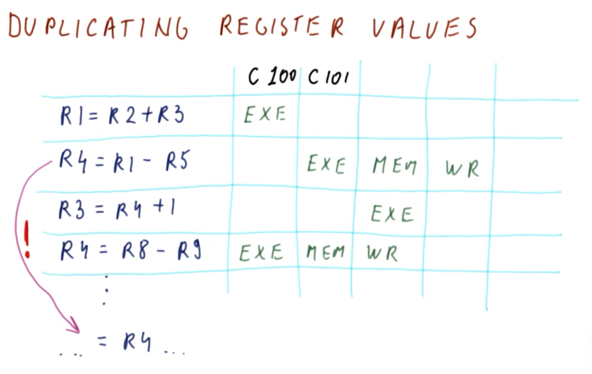
</center>

| Instruction | `C100` | `C101` |`C102`|`C103`|
|:--:|:--:|:--:|:--:|:--:|
|`R1 = R2 + R3` | `E` |`⋯`|`⋯`|`⋯`|
|`R4 = R1 - R5` |`⋯`| `E` |`M`| `WB`|
|`R3 = R4 + 1` |`⋯`|`⋯`| `E` |`⋯`|
|`R4 = R8 - R9` | `E` |`M`| `WB` | `⋯`| 
| `⋮` | `⋮` | `⋮` | `⋮` | `⋮` |
|`... = R4 ...` |`⋯`|`⋯`| `⋯`| `⋯`|  

Consider which value of `R4` will occur in the downstream-most instruction, as shown above.

The second instruction will proceed from the stage `E` into the subsequent stages in the corresponding cycles (i.e., `M`/`C102` and `WB`/`C103`). Meanwhile, the fourth instruction proceeds similarly, but earlier on (i.e., `E`/`C100`, `M`/`C101`, and `WB`/`C102`). Because the second instruction writes to `R4` in a *later* cycle (i.e., cycle `C103`), this is the value ultimately received by the downstream-most instruction; however, this is ***not*** the intended semantics of the program, i.e., the value of `R4` should be that written in the fourth instruction.

To resolve this issue, a possible **solution** here is to simply **duplicate** the value, i.e., the second instruction writes to *one* version of `R4`, while the fourth instruction writes to *another* version of `R4`, whereby both versions are stored for later recall. In this manner, rather than storing only *one* value in the register (e.g., `R4`), *multiple* such values are stored instead. Then, a subsequent instruction must **search** all of these possible values when attempting to read it later--i.e., that which occurred in the most recent *instruction* (e.g., the fourth instruction), but not necessarily the most recent *cycle* (e.g., cycle `C103`, via the second instruction; and similarly for the third instruction's reading of `R4` from the previous/second instruction rather than that of the earlier-cycle-occurring fourth instruction).

Note that this "multiple versions storing" is complicated to implement in practice.

### 9. Register Renaming

<center>
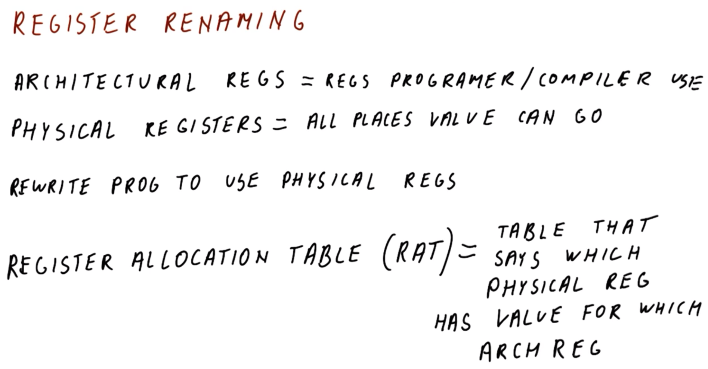
</center>

As an alternative to duplicating register values (which can be challenging to implement in practice), **register renaming** is another scheme to provide resolution to false dependencies, in a manner which is more manageable.

Register renaming separates the concept of **architectural registers** (i.e., those used by the programmer/compiler, e.g., `ADD R1, R2, R3`) from that of **physical registers**, which constitute all of the places that values can actually be placed/stored in the processor itself. 

Correspondingly, with register renaming, the idea is that as the processor reads instructions and determines which (architectural) registers they are using (i.e., via fetching and decoding), the processor also performs register renaming, whereby the processor re-writes the program itself to use the physical registers instead.

In order to determine the location of these values, the processor uses a table called the **register allocation table (RAT)**, which maps the values of the physical registers to the architectural registers. Correspondingly, *each* architectural register contains an entry in the RAT, indicating the location where its physical register can be found.
  * ***N.B*** The concept of the RAT should be familiarized at this point, as it will recur often in the subsequent subject matter of this course.

### 10. RAT Example

<center>
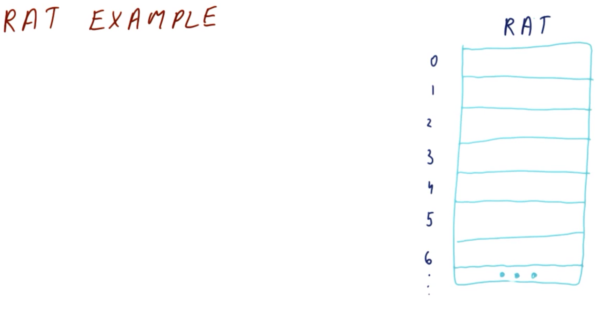
</center>

An example of a **register allocation table (RAT)** is shown above. Here, each architectural register (e.g., `R0`, `R1`, etc.) stores a corresponding entry in the table (e.g., entry `0`, `1`, etc., respectively).

<center>
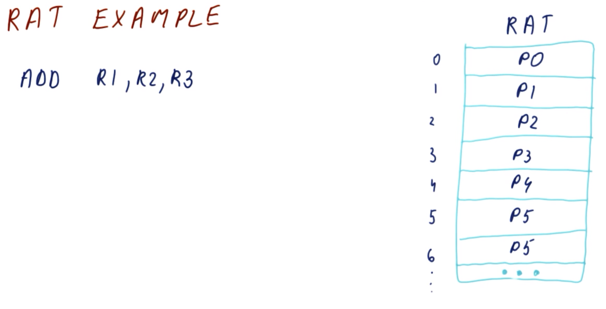
</center>

When the processor fetches instructions, it makes corresponding entries in the RAT. For example, consider the following instruction:

```mips
ADD R1, R2, R3
```

For all the registers that are read by the instruction (e.g., `R1`, `R2`, and `R3`), there is a lookup performed for the corresponding entries in the RAT. In this case, consider the correspondence of (architectural register) `R1` in (physical register) `P1`, `R2` in `P2`, etc. for the sake of example.

<center>
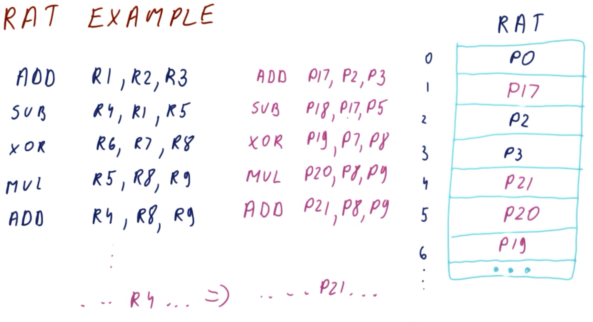
</center>

Now consider, the following expanded set of instructions:

```mips
ADD R1, R2, R3 # ADD P17, P2, P3
SUB R4, R1, R5 # SUB P18, P17, P5
XOR R6, R7, R8 # XOR P19, P7, P8
MUL R5, R8, R9 # MUL P20, P8, P9
ADD R4, R8, R9 # ADD P21, P8, P9
```

When the processor fetches and decodes the instructions, it subsequently renames the instructions and rewrites them in a manner in which they occur with respect to the corresponding physical registers (e.g., `R2` is renamed to `P2`, etc., as in the code shown above). Furthermore, note that with respect to the **stored results** themselves, these are not placed in the same corresponding physical register, but rather in a different/vacant one (e.g., result `R1` is stored in `P17`, ***not*** in `P1`; and similarly for the other results registers).
  * ***N.B.*** In this manner, the RAT is updated on each new instruction fetch and decode produces a new value, in order to provide a "valid" updated value for subsequent instructions (e.g., per the above instructions, `R4` is first saved into `P18` in the second instruction, but subsequently saved in separate/new register `P21` in the fifth instruction, which is correspondingly *read* as the *latter* value further downstream, thereby resolving a potential write-after-write dependency). 

## 11. Register Renaming Quiz and Answers

<center>
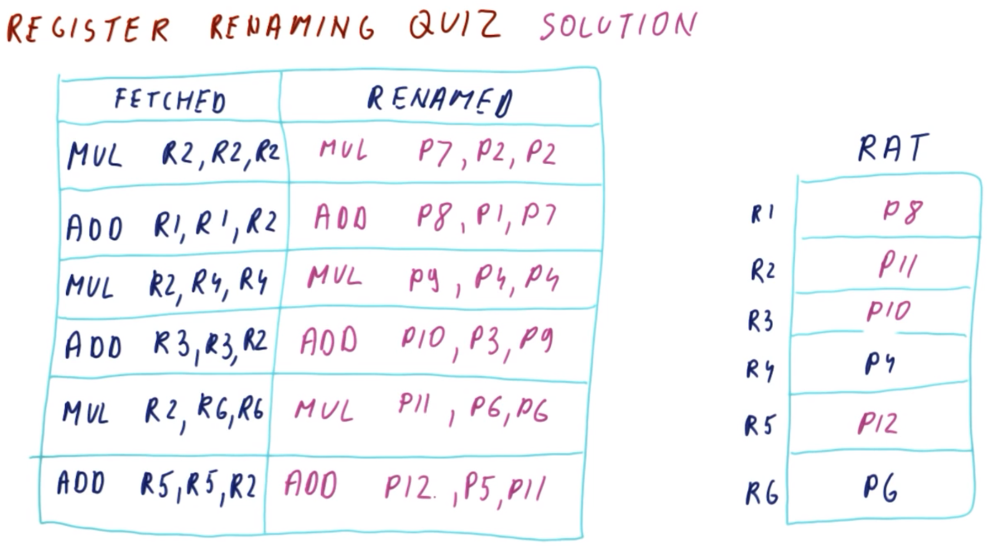
</center>

| Fetched | Renamed |
|:--:|:--:|
| `MUL R2, R2, R2` | `MUL P7, P2, P2` |
| `ADD R1, R1, R2` | `??` |
| `MUL R2, R4, R4` | `??` |
| `ADD R3, R3, R2` | `??` |
| `MUL R2, R6, R6` | `??` |
| `ADD R5, R5, R2` | `??` |

| Architectural Register | Physical Register |
|:--:|:--:|
| `R1` | `P1` |
| `R2` | `P2` |
| `R3` | `P3` |
| `R4` | `P4` |
| `R5` | `P5` |
| `R6` | `P6` |

Consider the sequence of instructions shown above (given as a fetched-renamed pairs, in order of occurrence) and corresponding initial state of the RAT (immediately prior to execution of the first instruction).

| Architectural Register | Physical Register |
|:--:|:--:|
| `R1` | `P1` |
| `R2` | `P7` |
| `R3` | `??` |
| `R4` | `??` |
| `R5` | `??` |
| `R6` | `??` |

Furthermore, The RAT entries post-execution are as shown above (the entry after the first instruction is executed is given here). 

What are the corresponding post-execution renamed instructions and RAT physical register values (i.e., `??`s per above)?

***Answer and Explanation***:

| Fetched | Renamed |
|:--:|:--:|
| `MUL R2, R2, R2` | `MUL P7, P2, P2` |
| `ADD R1, R1, R2` | `ADD P8, P1, P7` |
| `MUL R2, R4, R4` | `MUL P9, P4, P4` |
| `ADD R3, R3, R2` | `ADD P10, P3, P9` |
| `MUL R2, R6, R6` | `MUL P11, P6, P6` |
| `ADD R5, R5, R2` | `ADD P12, P5, P11` |

| Architectural Register | Physical Register |
|:--:|:--:|
| `R1` | `P8` |
| `R2` | `P11` |
| `R3` | `P10` |
| `R4` | `P4` |
| `R5` | `P12` |
| `R6` | `P6` |

The final state of the renamed (physical) registers are assigned sequentially per the corresponding write-to-register operations, as shown above.
* After the first instruction (given initially):

| Architectural Register | Physical Register |
|:--:|:--:|
| `R1` | `P1` |
| `R2` | `P7` |
| `R3` | `R3` |
| `⋮ ` | `⋮ ` |

* After the second instruction:

| Architectural Register | Physical Register |
|:--:|:--:|
| `R1` | `P8` |
| `R2` | `P7` |
| `R3` | `R3` |
| `⋮ ` | `⋮ ` |

* After the third instruction:

| Architectural Register | Physical Register |
|:--:|:--:|
| `R1` | `P8` |
| `R2` | `P9` |
| `R3` | `R3` |
| `⋮ ` | `⋮ ` |

* After the fourth instruction:

| Architectural Register | Physical Register |
|:--:|:--:|
| `R1` | `P8` |
| `R2` | `P9` |
| `R3` | `P10` |
| `⋮ ` | `⋮ ` |

* After the fifth instruction:

| Architectural Register | Physical Register |
|:--:|:--:|
| `R1` | `P8` |
| `R2` | `P11` |
| `R3` | `P10` |
| `⋮ ` | `⋮ ` |

* After the sixth (final) instruction:

| Architectural Register | Physical Register |
|:--:|:--:|
| `R1` | `P8` |
| `R2` | `P11` |
| `R3` | `P10` |
| `R4` | `P4` |
| `R5` | `P12` |
| `R6` | `P6` |

## 12. False Dependencies *after* Renaming?

<center>
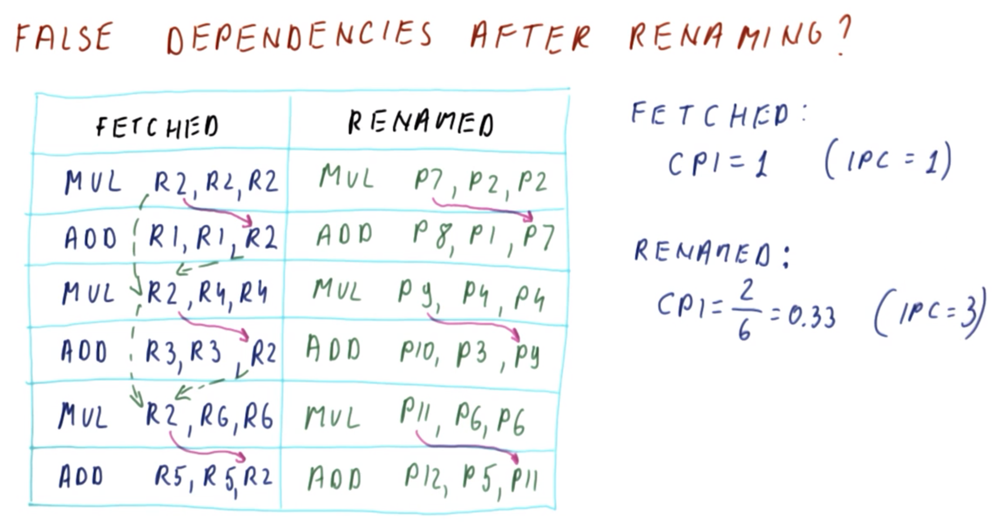
</center>

From the previous quiz (cf. Section 11), it was observed that fetched instructions can be renamed to eliminate false dependencies (as in the figure shown above).

Let us now examine further to verify whether any false dependencies remain post-rename, and what the corresponding impact is on the instructions per cycle (IPC).

| Fetched | Renamed |
|:--:|:--:|
| `MUL R2, R2, R2` | `MUL P7, P2, P2` |
| `ADD R1, R1, R2` | `ADD P8, P1, P7` |
| `MUL R2, R4, R4` | `MUL P9, P4, P4` |
| `ADD R3, R3, R2` | `ADD P10, P3, P9` |
| `MUL R2, R6, R6` | `MUL P11, P6, P6` |
| `ADD R5, R5, R2` | `ADD P12, P5, P11` |

Per the instructions shown above, there are still true dependencies in the renamed program as follows (solid purple arrows per figure shown above):
  * via `P7` between the first and second instructions
  * via `P9` between the third and fourth instructions
  * via `P11` between the fifth and sixth instructions

Furthermore, in the original program (pre-rename), there are output dependencies as follows (dashed green arrows per figure shown above):
  * via `R2` between the first and third instructions
  * via `R2` between the third and fifth instructions

Additionally, in the original program (pre-rename), there are anti-dependencies as follows (dashed green arrows per figure shown above):
  * `R2` between the second and third instructions
  * `R2` between the fourth and fifth instructions

Therefore, examining the dependencies in aggregate in the pre-renamed/fetched state, there is effectively a full sequential program, yielding the following:
```
CPI = 6 cycles / 6 instructions = 1
IPC = 1 / CPI = 1
```

Conversely, in the renamed program:
```
CPI = 2 cycles / 6 instructions = 0.33
IPC = 1 / CPI = 3
```

Therefore, a substantial improvement is yielded in the renamed program. This is due to elimination of the output and anti dependencies, allowing for execution of the first, third, and fifth instructions in the first cycle (i.e., the upstream instructions in the post-rename true-dependencies pairs), followed immediately by the second, fourth, and sixth instructions in the subsequent second/next cycle (i.e., rather than sequentially executing in six successive cycles/steps, as in the pre-rename program).

## 13-14. Instruction Level Parallelism (ILP)

### 13. ILP Introduction

<center>
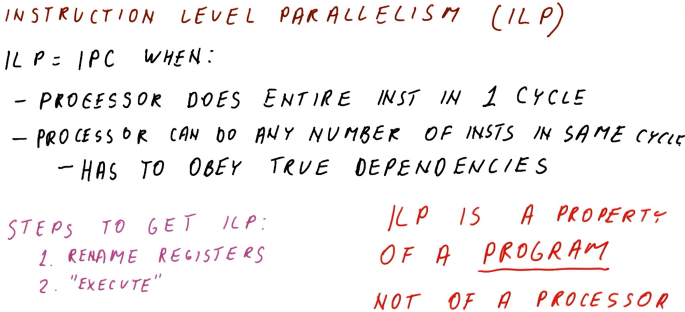
</center>

Now that we have examined register renaming, tracing through true dependencies, etc. earlier in the lesson, we are ready to critically examine **instruction level parallelism (ILP)**.

ILP can be defined as the instructions per cycle (IPC) resulting from the following conditions being met:
  * The processor performing the *entire* instruction in 1 *single* cycle (i.e., without otherwise requiring a pipeline)
  * The processor can perform any (arbitrary) number of instructions in the *same* cycle
    * Theoretically, it could execute the *entire* program in *one* cycle in this manner; however, it must still obey true dependencies to maintain a *valid* program

In other words, ILP describes the ideal performance of a processor which is only constrained by the existence of true dependencies within the program.

In order to ***compute*** the ILP for a program, perform the following **steps**:
1. Rename the registers as applicable
2. Evaluate the program as if it is fully "executed," taking true dependencies into account in order to characterize the full (effective) set of instructions

A **key principle** of ILP to bear in mind (i.e., in order to conceptualize it properly) is that ILP itself is an inherent ***property*** of a ***program*** (but ***not*** of the particular processor itself). Essentially, the ILP is a model for understanding the theoretically ideal performance of a given program, subject only to true dependencies (which is an inherent property of the program, rather than the specific implementation details imposed on the program by the particular processor itself).
  * With this in mind, it does not make sense, for example, to pose the question "*What is the ILP for this program running on an Intel Core i7 processor?*"
  * Conversely, it *is* valid to consider the *IPC* of a program running on a given processor, though that pertains to a separate matter altogether (i.e., performance on the processor itself, rather than an intrinsic property of the program per se)

### 14. ILP Example

<center>
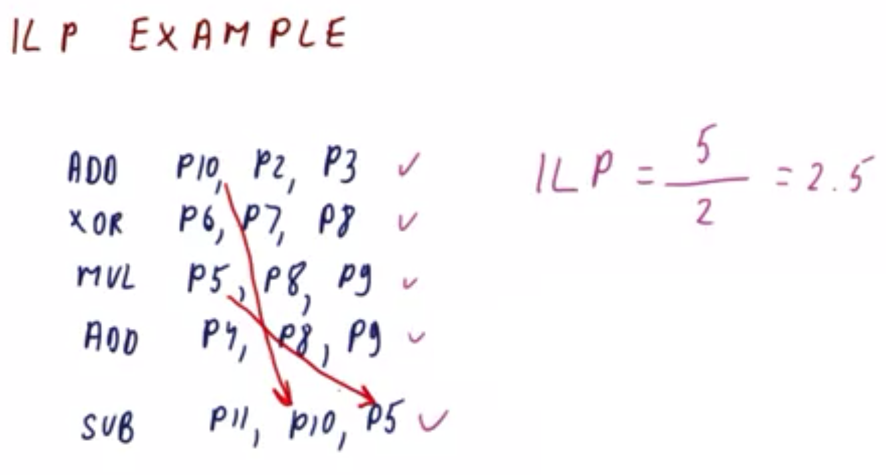
</center>

```mips
ADD P10, P2, P3  # I1
XOR P6, P7, P8   # I2
MUL P5, P8, P9   # I3
ADD P4, P8, P9   # I4
SUB P11, P10, P5 # I5
```

Having gained a better understanding of ILP, consider the program shown above as a concrete example for determining the ILP. The program as shown is already in its renamed state, with only true dependencies remaining. These true dependencies occur as follows:
  * between instructions `I1` and `I5` via register `P10`
  * between instructions `I3` and `I5` via register `P5`

Furthermore, consider which instructions can execute in which cycle. This can be determined systematically / by inspection as follows:
  * In the first cycle, instructions `I1`, `I2`, `I3`, and `I4` can execute simultaneously
  * Due to the aforementioned true dependencies, instruction `I5` cannot occur until the upstream dependencies have executed (i.e., `I3` and `I5`), and therefore instruction `I5` cannot occur until the second/subsequent cycle

Consequently, from the aforementioned analysis, the resulting ILP is as follows:
```
ILP = 5 instructions / 2 cycles = 2.5
```
(***N.B.*** Recall that this ILP is intrinsic to the *program* itself, irrespectively of the processor on which it runs)

Note the following convenient **heuristics**/**tricks** for determining the ILP.
  * Renaming of the program is unnecessary here; by inspection, even if examining the initial form of the program (i.e., using architectural registers) reveals anti and/or output dependencies, these can be effectively ignored for purposes of ILP analysis, with attention paid strictly to the true dependencies only; the process of renaming simply removes the former dependencies, leaving only the true dependencies remaining.
  * When proceeding through this type of analysis, be mindful to keep track of the (effective) cycles resulting from the true-dependency-containing program, and correspondingly noting the placement of the factors in the ILP calculation (i.e., do not confuse instructions with cycles with respect to numerator vs. denominator, respectively).

## 15. ILP Quiz and Answers

<center>
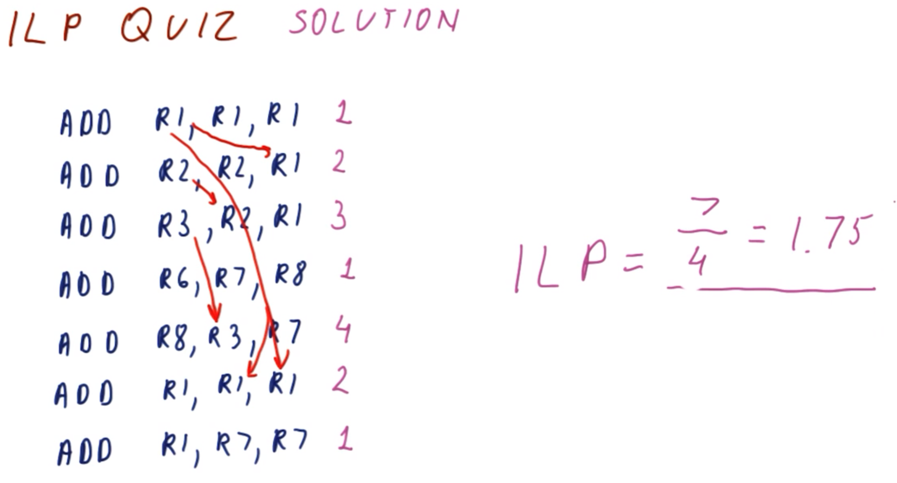
</center>

```mips
ADD R1, R1, R1
ADD R2, R2, R1
ADD R3, R2, R1
ADD R6, R7, R8
ADD R8, R3, R7
ADD R1, R1, R1
ADD R1, R7, R7
```

Given the program shown above, what is the ILP?

***Answer and Explanation***:

```mips
ADD R1, R1, R1 # I1 - C1
ADD R2, R2, R1 # I2 -     C2
ADD R3, R2, R1 # I3 -         C3
ADD R6, R7, R8 # I4 - C1
ADD R8, R3, R7 # I5 -             C4
ADD R1, R1, R1 # I6 -     C2
ADD R1, R7, R7 # I7 - C1
```

Ignoring output and anti dependencies, the following true dependencies occur in the program:
  * `I1` and `I2` via register `R1`
  * `I2` and `I3` via register `R2`
    * ***N.B.*** There is also dependency between `I1` and `I3` via register `R1`, however, both `R1` and `R2` are effectively "bottlenecking" similarly with respect to instruction `I3`
  * `I3` and `I5` via register `R3`
  * `I1` and `I6` via register `R1`

Therefore, the true dependencies give rise to four sequential cycles (as denoted above, i.e., `C1` through `C4`), giving rise to the following:
```
ILP = 7 instructions / 4 cycles = 1.75
```

## 16. ILP with Structural and Control Dependencies

<center>
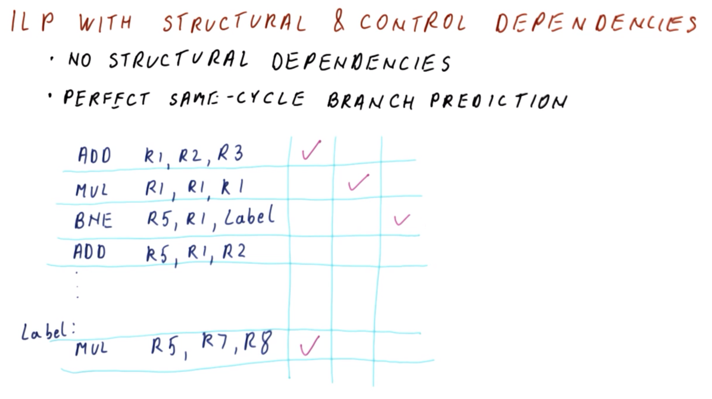
</center>

We have seen that when determining the ILP for a program, false dependencies among data dependencies can be effectively ignored, and instead only considering true dependencies (also called flow dependencies, or read-after-write [RAW] data dependencies). Therefore, instruction-level parallelism (ILP) only considers these types of data dependencies; however, note that there are additionally two other types of data dependencies of concern: **Structural dependencies** and **control dependencies**. How, then, do these latter dependencies affect ILP?

Firstly, when performing ILP analysis, there are *no* **structural dependencies** to consider. Structural dependencies occur when there is insufficient hardware available to perform all necessary tasks in the *same* cycle. However, when determining the ILP, *ideal* hardware is assumed, therefore, such an "implementation detail" is not a relevant consideration. Therefore, ignoring structural dependencies effectively implies that any instruction that *could* possibly execute in the cycle *will* execute accordingly (and not otherwise wait on another resource, e.g., being rate-limited by a single adder, etc.).

Furthermore, with respect to **control dependencies**, *perfect* same-cycle branch prediction is assumed. This means that branches are predicted in the *same* cycle as that in which they are fetched. Therefore, all of the *correct* instructions after the branch are observed by the ideal processor in the *same* cycle in which the branch is encountered in the program.

```mips
  ADD R1, R2, R3    # I1 - C1
  MUL R1, R1, R1    # I2 -     C2
  BNE R5, R1, Label # I3 -         C3
  ADD R5, R1, R2    # I4
  ⋮
Label:
  MUL R5, R7, R8    # IN - C1
```

As an example, consider the program shown above, which contains a branch. Here, between instructions `I1` and `I2` there is both a flow dependency and output dependency via register `R1`, as well as a branch instruction in `I3` (with a corresponding flow dependency with `I2` via register `R1`).

Per the aforementioned dependencies, the first three instructions occur in successive cycles (`C1` through `C3`). Furthermore, assume that the branch in instruction `I3` is *taken*; in this case, although the branch cannot *execute* until cycle `C3`, upon initial fetching immediately prior to cycle `C1`, it is already *known* that the branch will be taken (i.e., goes to `Label`), and--therefore--instruction `IN` can execute immediately in cycle `C1` due to no data dependencies (i.e., no *delay* is introduced into the program).

Therefore, with an ideal processor, control dependencies have no (adverse) impact on ILP, because the branched-to instruction(s) effectively execute "as usual," and correspondingly, control dependencies can similarly be ignored with respect to ILP determination.

## 17. ILP vs. IPC

It has already been established that ILP is not equivalent/equal to IPC on any *real* processor (actually, it *can* be, but not *strictly* so); indeed, the ILP is effectively the IPC for a an *ideal* processor, performing perfect branch prediction and only constrained by data dependencies.

```mips
ADD R1, R2, R3 # I1
SUB R4, R1, R5 # I2
XOR R6, R7, R8 # I3
MUL R5, R8, R9 # I4
ADD R4, R8, R9 # I5
```

To further demonstrate the distinction between ILP and IPC, consider the program shown above. Furthermore, consider a *real* processor characterized by the following:
  * 2-issue (the processor can handle two instructions per cycle)
  * out-of-order superscalar (the processor does not require execution of the program to occur in *exact* order)
  * `1` multiplication unit, and `2` units which can perform addition, subtraction, XOR, etc. operations

<center>
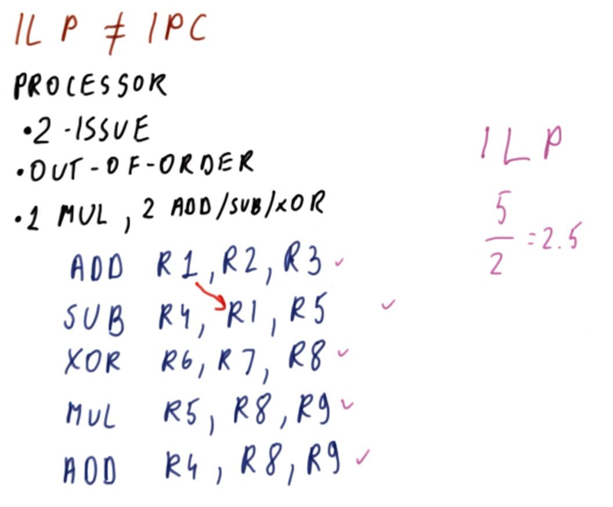
</center>

```mips
ADD R1, R2, R3 # I1 - C1
SUB R4, R1, R5 # I2 -     C2
XOR R6, R7, R8 # I3 - C1
MUL R5, R8, R9 # I4 - C1
ADD R4, R8, R9 # I5 - C1
```

With respect to ILP, these "real processor" characteristics can be ignored, only focusing on data dependencies. There is one data dependency between instructions `I1` and `I2` via register `R1`. Consequently, this yields *two** cycles under ILP (denoted above as cycles `C1` and `C2`) and the following:

```
ILP = 5 instructions / 2 cycles = 2.5
```

<center>
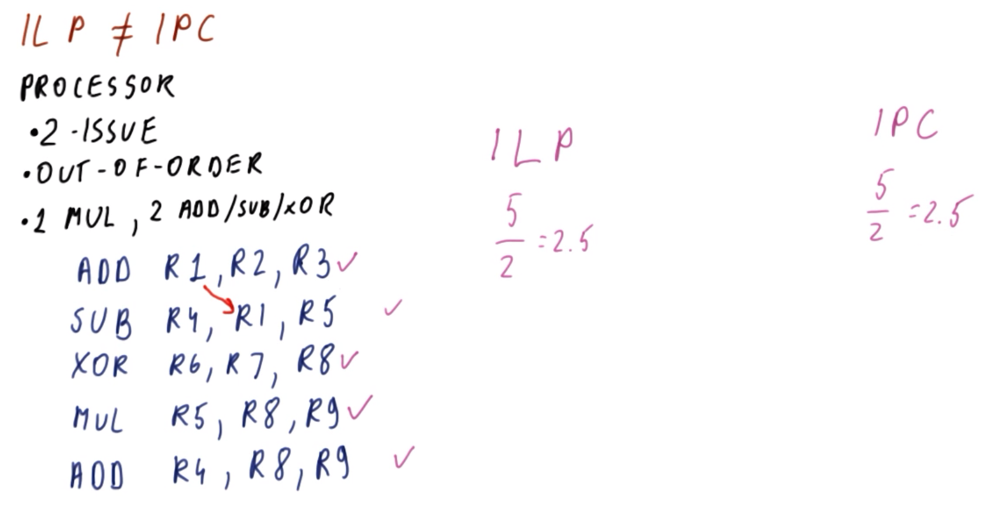
</center>

```mips
ADD R1, R2, R3 # I1 - C1
SUB R4, R1, R5 # I2 -     C2
XOR R6, R7, R8 # I3 - C1
MUL R5, R8, R9 # I4 - C1
ADD R4, R8, R9 # I5 -     C2
```

Consider now the *real* processor scenario. In addition to the previously identified data dependency (i.e., between instructions `I1` and `I2` via register `R1`), we must consider the other aforementioned limitations of the processor. Due to the limitations of the processor, instruction `I5` cannot be performed in cycle `C1`, because the hardware is limited to one `MUL` and (cumulatively) two `ADD`, `SUB`, and/or `XOR` operations per cycle, and therefore the processor must *wait* to execute instruction `I5` (which consequently occurs in the subsequent cycle, `C2`, as shown above). With respect to IPC, this therefore yields:

```
IPC = 5 instructions / 2 cycles = 2.5
```

In this case, the resulting IPC is identical to the ILP of the ideal processor.

<center>
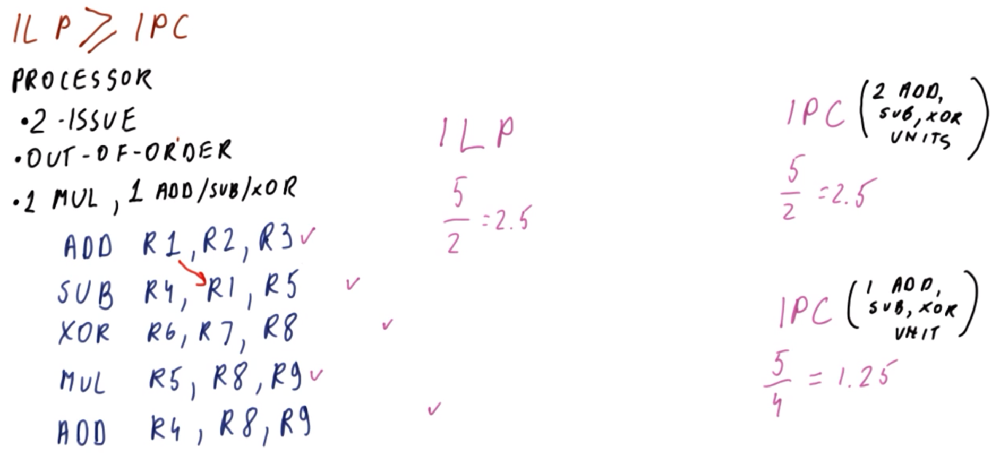
</center>

```mips
ADD R1, R2, R3 # I1 - C1
SUB R4, R1, R5 # I2 -     C2
XOR R6, R7, R8 # I3 -         C3
MUL R5, R8, R9 # I4 - C1
ADD R4, R8, R9 # I5 -             C4
```

Conversely, consider a modification of the real processor whereby there is only *one* `ADD`, `SUB`, and/or `XOR` operations per cycle available (as in the figure shown above). In this case, there is additional "bottlenecking" of the hardware, resulting in four cycles (denoted as cycles `C1` through `C4` above), and correspondingly:

```
IPC = 5 instructions / 4 cycles = 1.25
```

In this case, the IPC is only half that of the ILP. Therefore, in general, `ILP ≥ IPC`, with the ILP constituting the ***upper bound*** of theoretical performance (i.e., relatively to an ideal processor).

## 18. IPC & ILP Quiz and Answers

<center>
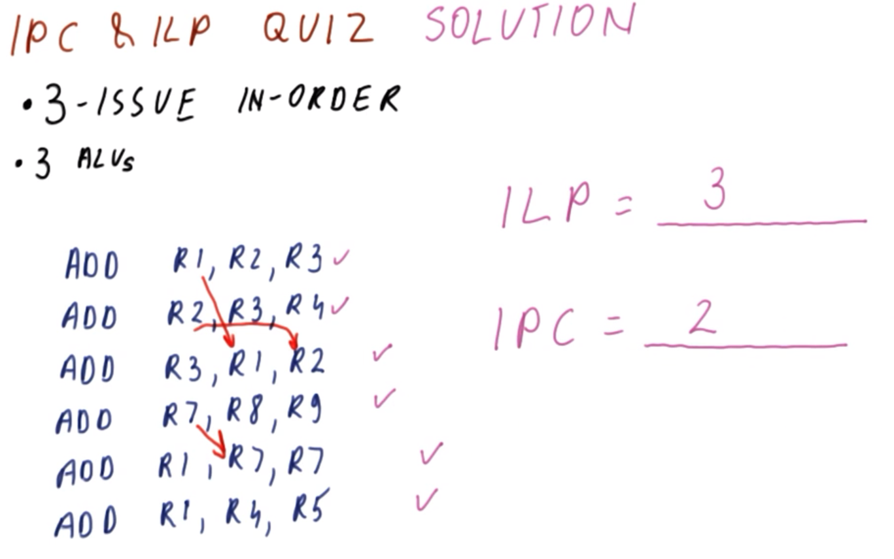
</center>

```mips
ADD R1, R2, R3 # I1
ADD R2, R3, R4 # I2
ADD R3, R1, R2 # I3
ADD R7, R8, R9 # I4
ADD R1, R7, R7 # I5
ADD R1, R4, R5 # I6
```

Consider the program shown above, running on the real processor characterized by the following:
  * `3`-issue, in-order
  * `3` ALUs (i.e., general purpose, for any arbitrary instruction)

What is the ILP and IPC for this program?

***Answer and Explanation***

First, examining the dependencies gives:
  * between instructions `I1` and `I3` via register `R1`
  * between instructions `I2` and `I3` via register `R2`
  * between instructions `I4` and `I5` via register `R7`

```mips
ADD R1, R2, R3 # I1 - C1
ADD R2, R3, R4 # I2 - C1
ADD R3, R1, R2 # I3 -     C2
ADD R7, R8, R9 # I4 - C1
ADD R1, R7, R7 # I5 -     C2
ADD R1, R4, R5 # I6 - C1
```

With respect to ILP (as annotated in the code above), two cycles result from the data dependencies, giving the following:

```
ILP = 6 instructions / 2 cycles = 3
```

```mips
ADD R1, R2, R3 # I1 - C1
ADD R2, R3, R4 # I2 - C1
ADD R3, R1, R2 # I3 -     C2
ADD R7, R8, R9 # I4 -     C2
ADD R1, R7, R7 # I5 -         C3
ADD R1, R4, R5 # I6 -         C3
```

With respect to IPC on the real processor (as annotated in the code above), in addition to the two cycles resulting from the data dependencies, instruction `I3` is delayed to cycle `C2` because the processor is in-order, and therefore must wait for `I2` to execute first (which similarly bottlenecks/delays downstream instructions with respect to "in-order"). Similarly, instruction `I4` can execute in cycle `C2`, however, the data dependency (i.e., between `I4` and `I5` via register `R7`) causes an additional one-cycle delay, with instructions `I5` and `I6` consequently occurring in the subsequent cycle `C3`.

This yields the following:

```
IPC = 6 instructions / 3 cycles = 2
```

***N.B.*** In this particular case, even if this were a 2-issue processor, the in-order property is even more rate-limiting here, inasmuch as it causes delays by virtue of the inherent data dependencies in the program, thereby yielding the same IPC of `2`. Therefore, in general, many of these factors act in aggregate to impact the IPC of a real processor.

## 19. ILP & IPC Discussion

<center>
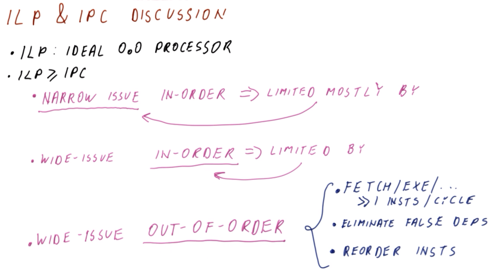
</center>

Having seen what ILP is and how it relates to IPC, we can now further discuss them comparatively.

Recall that ILP is defined as the IPC of an ***ideal, out-of-order processor*** having perfect branch prediction, and sufficient computational resources to perform arbitrarily large and complex programs (subject to data dependency limitations). Furthermore, in general, `ILP ≥ IPC` (i.e., with respect to the IPC achievable by any *real* processor).

Consider a **narrow-issue, in-order** processor (whereby "narrow-issue" designates a processor only capable of performing 1-3 or so instructions per cycle). In this case, the IPC is mostly limited by the ***narrow-issue*** constraint (i.e., in-order is relatively less constraining).

Conversely, for a **wide-issue, in-order** processor (whereby "wide-issue" designates a processor capable of performing relatively many instructions per cycle), the IPC is mostly limited by the ***in-order*** constraint (i.e., wide-issue is relatively less constraining, inasmuch as it is already approaching the ideal/ILP capabilities with respect to instructions-per-cycle execution).

Lastly, consider a **wide-issue, out-of-order** processor. In order to improve IPC (i.e., approaching towards ILP/ideal), such a processor must:
  * (*via wide-issue*) perform fetch, execute, etc. operations on `>> 1` instructions per cycle (i.e., more than `4` or so)
  * eliminate false dependencies
  * (*via out-of-order*) be capable of executing instructions out-of-order 

## 20. Lesson Outro

In this lesson, we have seen that excellent performance should be achievable, even when the program has many data dependencies.

In the next several lessons, we will learn how a *real* processor can *actually* achieve this, using only hardware structures having limited size and complexity.
