# Instruction Scheduling

## 1. Lesson Introduction

In this lesson, we will see how **instruction scheduling** allows us to execute programs faster, even when these programs have data dependencies; and how to execute more than one instruction every cycle.

## 2. Improving IPC

This lesson will examine how to improve the instructions per cycle (IPC) using out-of-order execution, as well as how to design *actual* hardware to accomplish this.

<center>
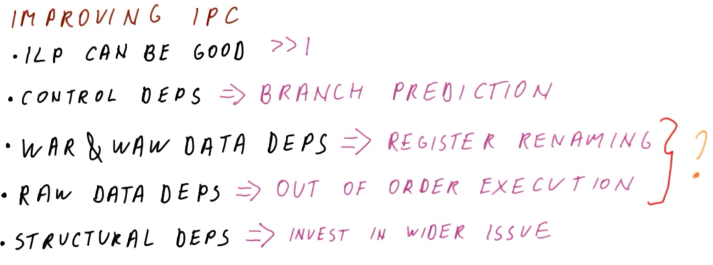
</center>

With respect to improving the IPC, we have seen (cf. Lesson 6) that **instruction level parallelism (ILP)** can be good (i.e., `>> 1`, typically larger than `4` or so).

However, in order to achieve performance approaching ILP, it is necessary to handle the **control dependencies**. To this end, we have seen (cf. Lesson 6) how branch prediction can help to eliminate control dependencies if **branch prediction** is correct.
  * If the branch prediction is *very good* (which on modern machines, it typically *is*), then insofar as control dependencies are concerned, the IPC will approach ILP.

Additionally, it is necessary to consider the data dependencies **write-after-read (WAR)** and **write-after-write (WAW)**, also called **false dependencies**. **Register renaming** provides a resolution measure to completely eliminate these false dependencies, such that they cease to exist in the program anymore, thereby removing their deleterious effect on IPC.

Furthermore, **read-after-write (RAW)** dependencies (also called **true dependencies**) must also be resolved. For this, recall (cf. Lesson 6) that **out-of-order execution** (i.e., not strictly following the sequential program instructions, but rather immediately executing instructions whose inputs are executable in any given cycle) provides a resolution measure for eliminating RAW dependencies, thereby improving IPC.

Finally, **structural dependencies** arise when instructions cannot be executed due to lack of available resources in the processor in a given cycle. To provide a resolution measure for eliminating structural dependencies, use a **wider-issue** processor (i.e., one which can handle many instructions in each cycle, thereby minimizing the need to delay instructions due to lack of available resources).

Among these resolution measures, it remains to be determined how these can be performed. Initially, this lesson will focus on register renaming and out-of-order execution, in particular, implementing these resolution measures in a manner which is amenable to actual hardware implementation in a processor (i.e., beyond simply "on paper").

## 3. Tomasulo's Algorithm

<center>
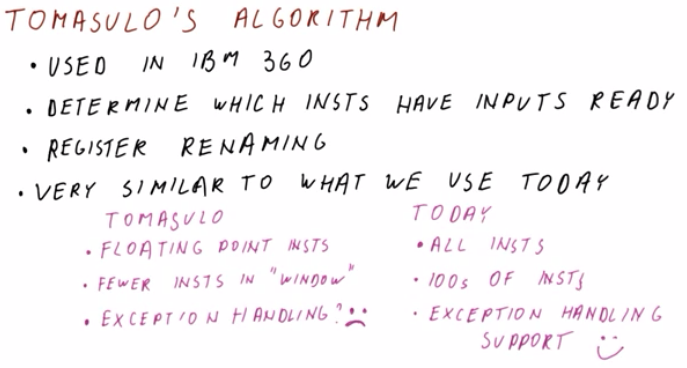
</center>

The first technique for improving processor instructions per cycle (IPC) is called **Tomasulo's algorithm**, which is a 40+ year old technique for out-of-order execution. This algorithm was used in older IBM 360 machines.

Tomasulo's algorithm determines which instructions have inputs that are currently ready for execution in the next/upcoming cycle, as well as those instructions which still must wait for their inputs to be produced. Tomasulo's algorithm also includes a form of register renaming. Furthermore, Tomasulo's algorithm is surprisingly similar to what is still in current use on modern processors with respect to out-of-order execution.

Therefore, Tomasulo's algorithm is a useful case study in a still-applicable approach to this problem (albeit with more complexity in implementation on modern machines).

| Characteristic | Tomasulo's Algorithm | Modern Machines |
|:--:|:--:|:--:|
| Applicable instructions | Only for floating point instructions | For *all* instructions |
| Scope of examined "window" (i.e., near-future/upcoming-cycle instructions) | Only examined relatively *few* instructions within the  window | Examine *hundreds* of instructions within the window  |
| Exception handling | Rudimentary exception handling, since floating-point instructions are a relatively small scope, only applying to relatively niche programs (e.g., those involving intensive floating-point calculations) and in simple configurations (e.g., only running one program at a time, for which exceptions could be handled relatively simply on an ad hoc basis) | Include extensive, explicit hardware support for exception handling, as will be discussed later |

The ***differences*** between Tomasulo's algorithm and modern machines are as in the table shown above.

We will first begin with examining Tomasulo's algorithm itself, and then contrast with modern machines subsequently thereafter.

## 4. Tomasulo's Algorithm - The Big Picture

Before examining Tomasulo's algorithm in detail, here we will first consider an overview of how it works (i.e., the underlying hardware structure).

<center>

</center>

The first component is the **instruction queue (IQ)**, as in the figure shown above. The instructions are repeatedly fetched in the order they are received from the **Fetch** unit, and queued appropriately (i.e., in a ***first-in, first-out*** manner); in the case of Tomasulo's algorithm, recall that these are restricted to floating-point instruction.

<center>
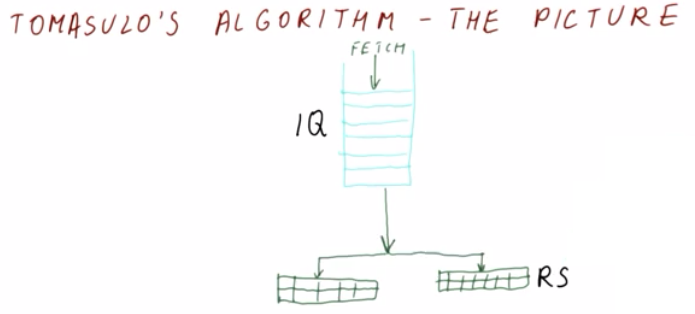
</center>

The next-available instruction in the IQ is placed into one of the available **reservation stations (RS)**, as in the figure shown above. The RSes are essentially "on standby" in this manner, waiting to receive the next instruction.

<center>
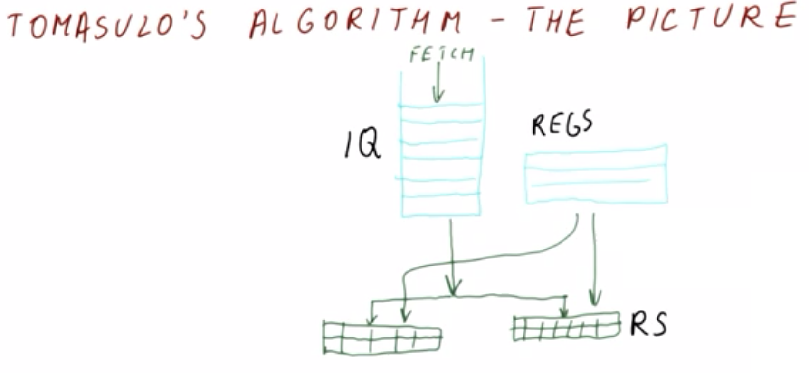
</center>

Additionally, there is a **floating-point registers file (REGS)** (as in the figure shown above), which contains the floating point registers themselves. When an instruction is inserted into the RS, the values already present in the REGS (i.e,. those which are *currently* available for execution) are simply inserted into the RS appropriately.

<center>
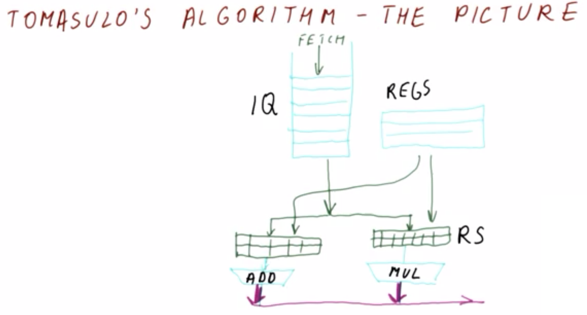
</center>

Once the instruction is ready to execute, it is sent to the corresponding **execution unit**, as in the figure shown above. Different types of execution units are present (e.g., `ADD`, `MUL`, etc.) for the appropriate instruction/computation required. Furthermore, each execution unit has a separate, dedicated RS, into which the appropriate upstream instructions queue/wait for.

<center>
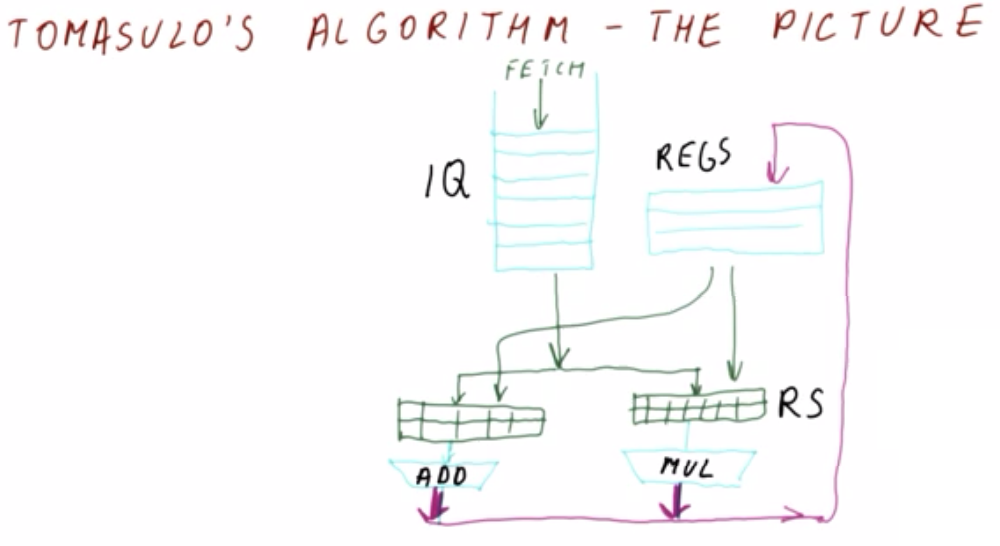
</center>

Once such a unit (e.g., `ADD`, per the figure shown above) has produced a result, the result is **broadcasted** on the **common data bus (CDB)**, as in the figure shown above (denoted by purple arrows and lines). This result is fed back into the REGS (i.e., all current results are available/up-to-date accordingly in REGS, ready for use by subsequent instructions).

<center>
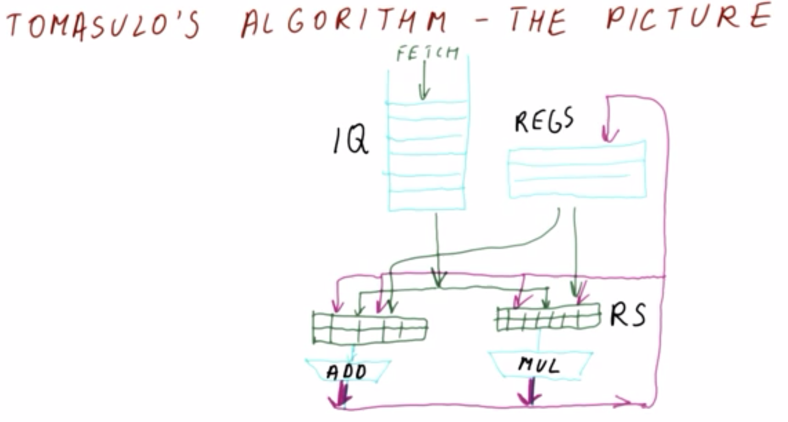
</center>

Furthermore, the results are broadcasted to the RSes as well, as in the figure shown above. This is to ensure current data is relayed to instructions which are in queue within the RSes, pending execution. Therefore, at any given time, a given RS is synchronizing values which are either known and/or pending update.

In the figure shown above, there are *two* feedback lines (shown in purple) per RS, to emphasize the fact that a typical instruction has *two* inputs (e.g., operands for either operation `ADD` or `MUL`); correspondingly, subsequent post-result broadcast of the result can impact either of these two values (e.g., possibly latching into multiple RSes).

<center>

</center>

Finally, if the instruction is *not* an arithmetic instruction (e.g., but rather a `LOAD`, `STORE`, etc. via REGS), then it is instead sent to the **address generation unit (ADDR)**, as in the figure shown above. From there, the instruction is inserted into the appropriate **buffer** (i.e., load buffer, store buffer, etc., respectively), from which the instruction is subsequently queued up for going into **memory (MEM)**.

<center>
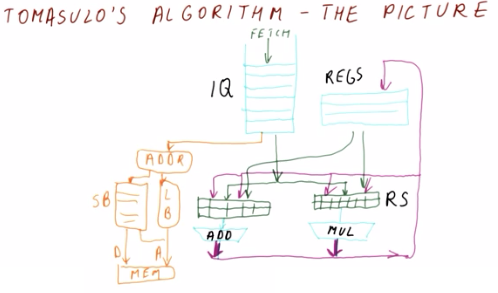
</center>

As in the figure shown above, the **load buffer (LB)** provides only the specifically requested data, while the the **store buffer (SB)** provides *both* the address *and* the data to MEM.

<center>
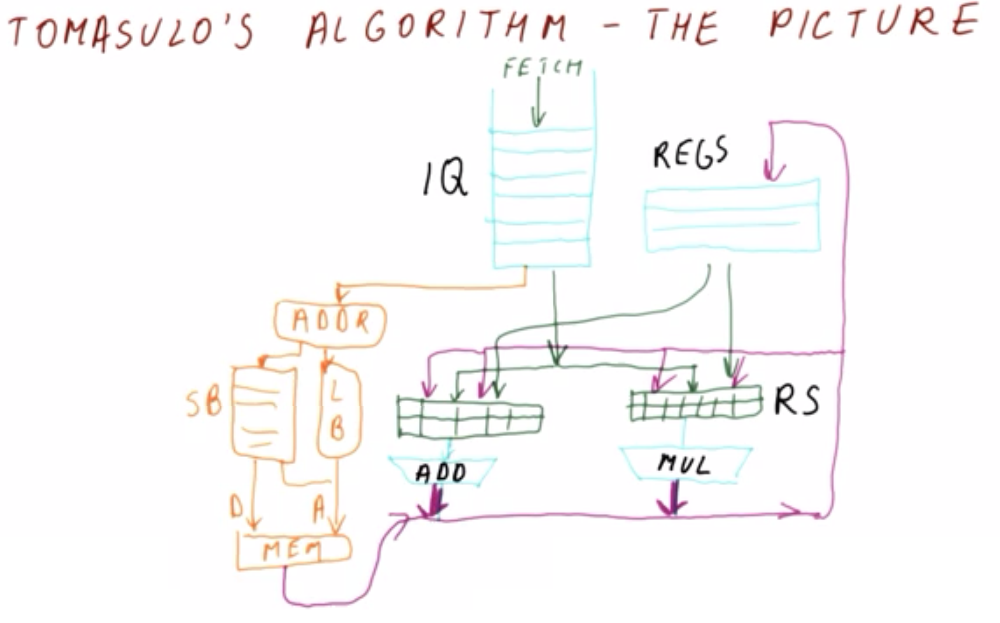
</center>

When the loaded data is returned from MEM, it is similarly ***broadcasted*** via the CDB, targeting the appropriate register in REGS, as in the figure shown above.

<center>
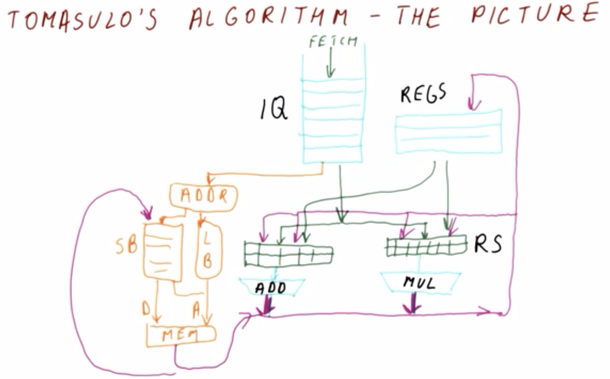
</center>

Furthermore, the loaded data from MEM is additionally ***broadcasted*** back to the SB, so that the current values are available there for subsequent placement into MEM, i.e., the corresponding value is only placed into MEM once it becomes available.

Therefore, unlike arithmetic instructions (which can be executed out-of-order), inputs to load and store instructions are only made available in the store/load buffers in an ***in-order*** manner.
  * ***N.B.*** The manner in which this in-ordering is achieved will be discussed later (in particular, modern processors are in fact capable of performing load and store operations *out*-of-order).

<center>
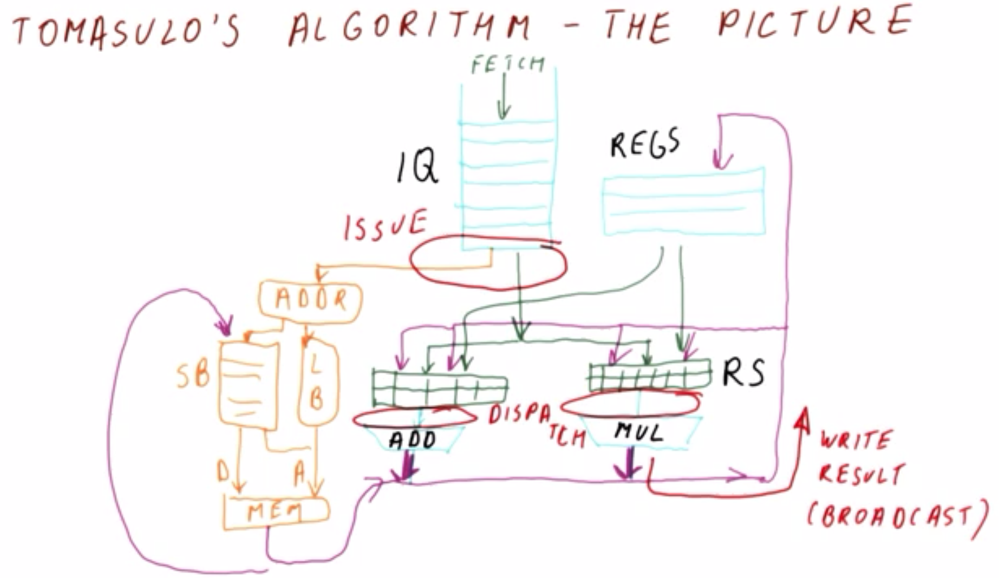
</center>

Before proceeding further with additional details regarding Tomasulo's algorithm, consider some additional nomenclature (as in the figure shown above, denoted in red).
  * The **issue** is the section which coordinates sending of the instructions from IQ to RS or ADDR.
  * When the instruction is finally sent from a RS to the corresponding execution unit, this action is called a **dispatch**.
  * When the executed by the execution unit and subsequently broadcasted, this operation is called **write result** (or **broadcast**).

Next, we will examine what occurs subsequently to performing these successive operations (i.e., issue, dispatch, and broadcast).

## 5-6. Tomasulo's Algorithm - Operation `Issue`

### 5. Introduction

<center>

</center>

The first step in Tomasulo's algorithm is the operation `Issue`. During `Issue`, the next instruction (in ***program-order***) is taken from the instruction queue (IQ). This must be done in program-order to ensure correct register renaming.

Next, it must be determined from where the inputs to the instruction originate (i.e., are they already in the register file [REGS], or rather are they pending broadcast from already in-progress instructions). Furthermore, if it is necessary to *wait* for an instruction, then which one? For this particular purpose, there will be some type of **register allocation table (RAT)** available.

Next, the next-available **reservation station (RS)** is obtained, having the appropriate type for the instruction in question (i.e., `ADD`, `MUL`, etc.). Furthermore, if all RSes are busy at this point (i.e., in use by an instruction already), then no Issue operation occurs in this particular cycle.
  * ***N.B.*** In Tomasulo's algorithm, instructions are issued *once* per cycle.

Next, the instruction is placed into the appropriate RS.

Finally, the destination register of the instruction is **tagged**, such that when the result is produced, it is sent there appropriately (i.e., for subsequent use by future instructions sharing the data in that register accordingly).

### 6. Example

Consider now a running example of how Tomasulo's algorithm works, starting with the operation `Issue`.

<center>
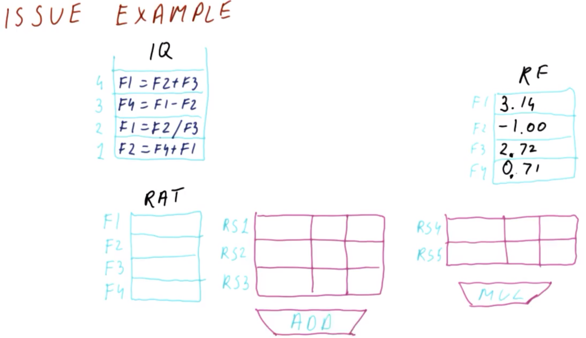
</center>

An **issue queue (IQ)** with four instructions is given (as in the figure shown above), containing four instructions in program-order.
  * ***N.B*** Instructions here are written compactly in a high-level format for simplicity/brevity (e.g., `F2 = F4 + R1` rather than `ADD F2, F4, F1`, etc.).

Furthermore, the **floating-point registers** (denoted by `F1, F2`, etc.) are contained in the **register allocation table (RAT)**, which stores the corresponding instructions producing the register in question. A blank entry in the RAT redirects to the **register file (RF)**, the latter of which in turn contains the values of the registers themselves.

Lastly, the **reservation stations (RS)** (denoted by `RS1`, `RS2`, etc.) store the operand values for the appropriate instructions.

<center>
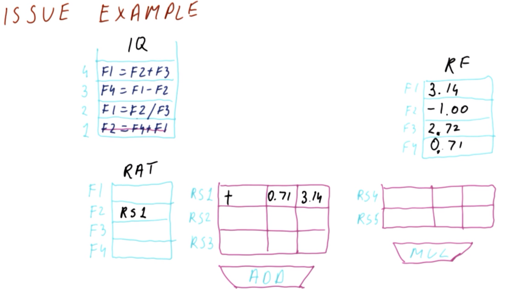
</center>

When instruction `I1` (`F2 = F4 + F1`) is issued from the IQ, it is taken from the **instruction buffer** (as in the figure shown above).

Next, the RAT is examined. Since both inputs `F1` and `F4` are available, their corresponding values from the RF are store in `RS1` (where `+` denotes the operation `ADD`), which *is* indeed a currently available RS at this point.

Lastly, for purposes of register renaming, since the result will now originate from `RS1`, the corresponding entry is updated in the RAT to reflect this (i.e., future instructions will now read `F2` via `RS1`'s pending result, rather than via the RF). Furthermore, the instruction will be removed from the IQ, thereby shifting down the upstream instructions accordingly (in the figure, this is denoted by crossing out with purple line in the IQ, but otherwise for simplicity without corresponding redrawing of the IQ itself).

<center>
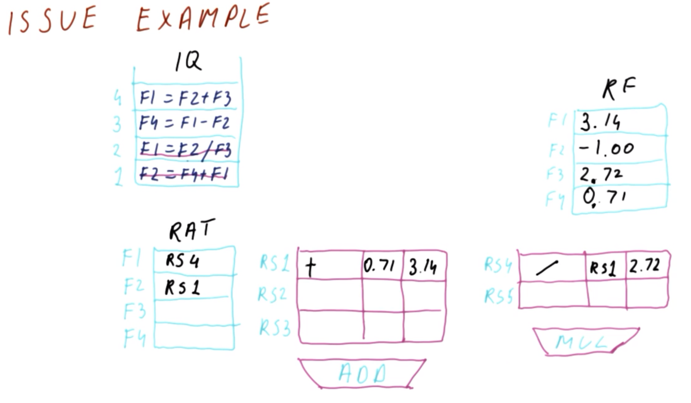
</center>

Next, instruction `I2` (`F1 = F2 / F3`) is taken from the IQ (as in the figure shown above).

The operation `DIV` (denoted `/` in the figure shown above) is sent to the next-available RS associated with the execution unit `MUL`. Since operand `F2` is used, it cannot be read directly from the RF now (i.e., due to the aforementioned upstream use by `I1`), but rather this value must ***wait*** on `RS1`.

Correspondingly, instruction `I2` is removed from the issue queue, and the RAT is correspondingly updated for `F1` via `RS4`.

<center>
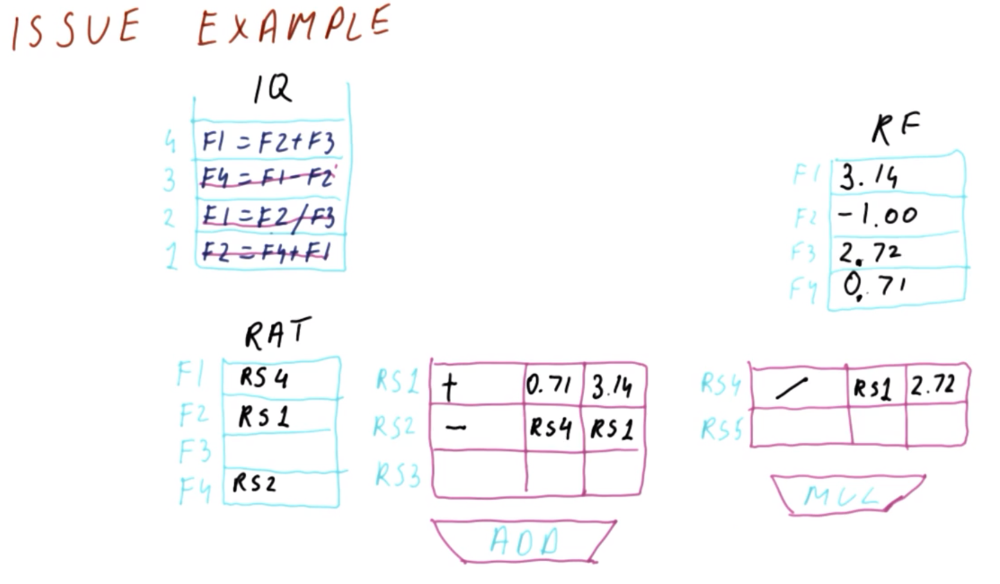
</center>

Next, instruction `I3` (`F4 = F1 - F2`) is taken from the IQ (as in the figure shown above). In this case, neither operand values can be read directly from the corresponding RF entries, but rather both are ***waiting*** on the RAT (i.e., `F1` via `RS4`, and `F2` via `RS1`). Furthermore, the RAT is updated accordingly (i.e., `F4` via `RS2`). 

<center>
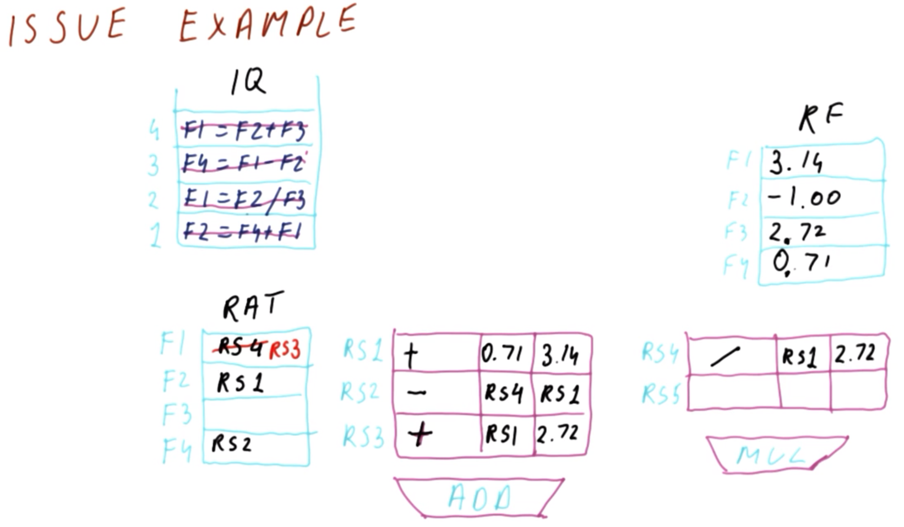
</center>

***N.B.*** At this point (i.e., immediately following instruction `I3`), if there were *no* `RS3`present, the execution unit `ADD` would be currently *full*, and therefore instruction `I4` would have to wait to be removed from the IQ in the next cycle, pending execution of at least one of instructions `I1` or `I3` first.

Lasty, instruction `I4` (`F1 = F2 + F3`) is taken from the IQ (as in the figure shown above). Here, operand `F3` is taken directly from the RF, whereas operand `F1` is taken from the RAT (via `RS4`).

However, note that here there is a ***collision*** with respect to RAT entry for `F1` (i.e., the result of previous instruction `I2` vs. that of the current instruction `I4`). To resolve this, the existing entry (i.e., `RS4`) is ***overwritten*** by this more-recent result (i.e., `RS3`). Furthermore, as before, instruction `I4` is removed from the IQ.

***N.B.*** In a real processor, *one* instruction is issued per cycle, with these inter-dependent instructions having been executed (i.e., providing corresponding results) by the time the next instruction is removed from the IQ.

## 7. `Issue` Quiz and Answers

<center>
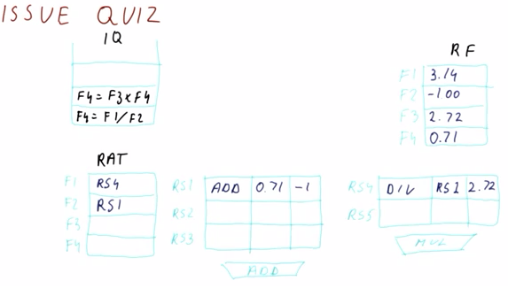
</center>

Consider the operation `Issue` as in the figure shown above. Two instructions are already present in the register stations (RS) immediately prior to execution of the next instruction in the instruction queue (IQ).

From here, perform the `Issue` operation on the next two instructions, or otherwise describe what occurs if the instruction cannot be issued. (For simplicity, do not consider execution of in-progress instructions in the other RSes, but rather simply issue with respect to the next-in-line instructions.)

***Answer and Explanation***:

<center>
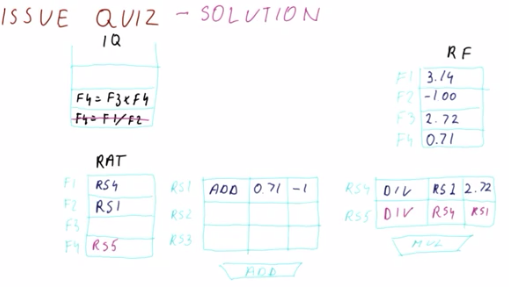
</center>

The next instruction to be issued from the IQ is instruction `I1` (`F4 = F1 / F2`), which is issued to `RS5`, with corresponding register allocation table (RAT) entry being set to `RS5`. Furthermore, note that both operands of `I1` depend on the in-progress instructions existing prior to this cycle (i.e., `F1` and `F2` via `RS4` and `RS1`, respectively).

The next instruction in the IQ after instruction `I1` is instruction `I2` (`F4 = F3 × F4`). This instruction *cannot* be issued in the current cycle, due to the RSes for the execution unit `MUL` being currently *full*. Therefore, the operation issue is currently stalled, pending availability of the next-available RS.

## 8-9. Tomasulo's Algorithm - Operation `Dispatch`

### 8. Introduction

Now, consider the operation `Dispatch`.

<center>

</center>

Consider the configuration as in the figure shown above. In a given cycle, the operation dispatch must consider the **latching** of operations/results that are produced, as well as  determine which instructions are ready to execute; in a given cycle, both of these determinations occur *simultaneously*.

In the configuration shown, there is a new cycle beginning; by the end of this cycle, the next instruction to execute will be determined. At the beginning of the cycle, none of the instructions are ready for execution (i.e., there is nothing to dispatch yet).

<center>
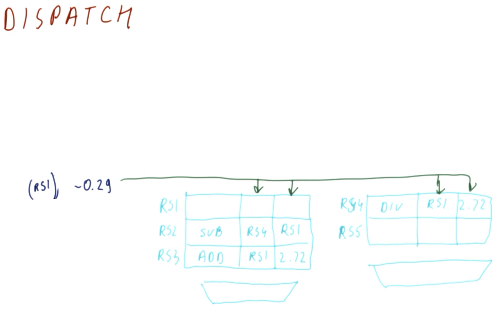
</center>

On initial broadcast of the result from register station `RS1` post-execution (i.e., in an upstream cycle), its result is received in the corresponding RSes, including `RS1` itself (which is now available following the aforementioned upstream-cycle execution using its results).

<center>
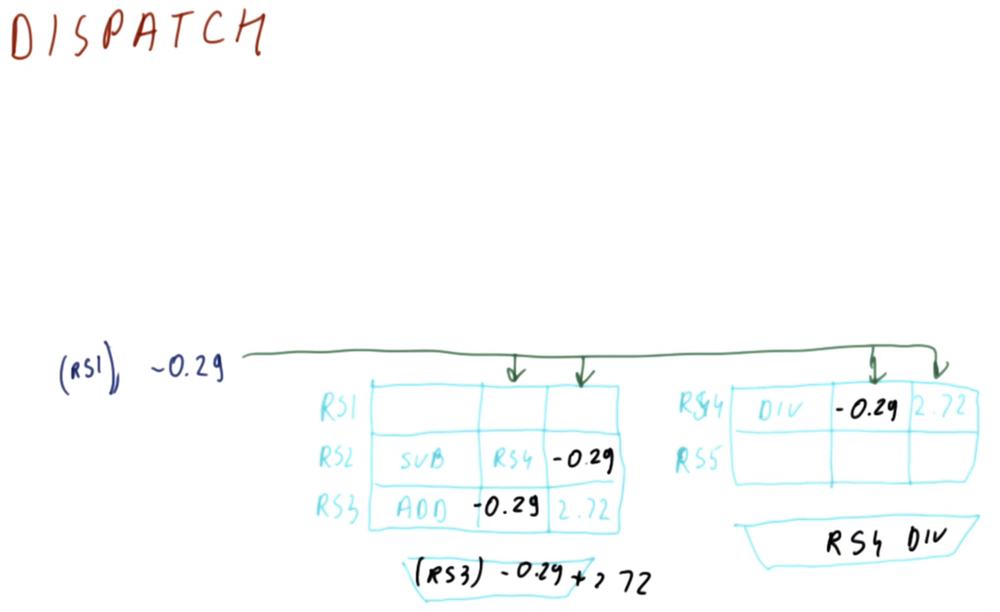
</center>

Next, post-broadcast, the tag `RS1` is matched into respective operands waiting on its result. In this case, the corresponding value (`-0.29`) is replaced in the operands of `RS2`, `RS3`, and `RS4`, all of which are pending this updated result.

At this point, it is determined which RSes have sufficient information (i.e., fully populated operand values) to proceed with execution. In this case, `RS2` is still pending an operand value (`RS4`), whereas both `RS3` and `RS4` have sufficient information available now to execute. Correspondingly, the latter are sent to their respective execution units (assuming both can execute on this particular processor at this point). Upon completion of the execution, the results will be broadcasted, and this process repeats accordingly.

### 9. More than One Instruction Is Ready

During operation `Dispatch`, we have not yet considered what occurs if *more* than one instruction is ready to execute.

<center>
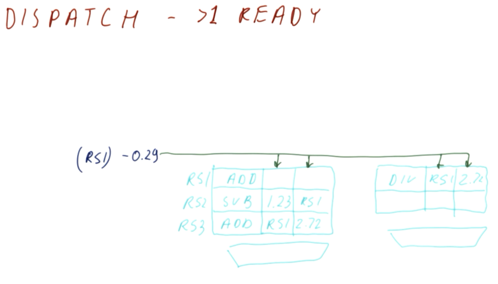
</center>

Consider the configuration in the figure shown, wherein a broadcast (via value `-0.29` via tag `RS1`) is occurring, leading into the next cycle.

<center>
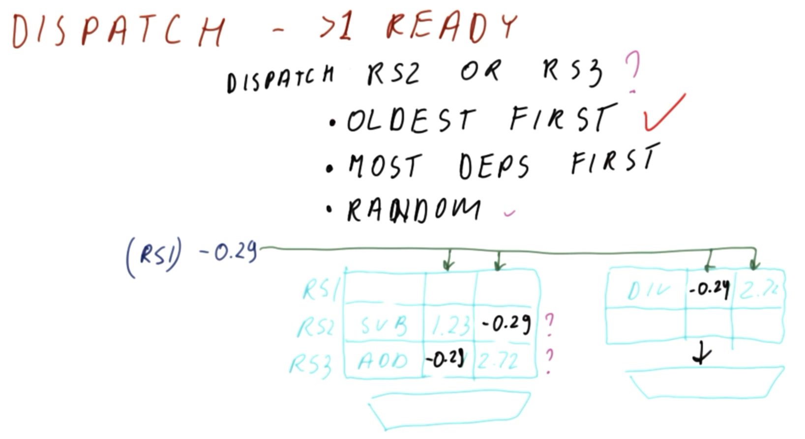
</center>

As before (cf. Section 8), `RS1` is now available following previous execution, and the broadcasted value is correspondingly updated/latched (i.e., in the correspondingly pending operands of `RS2`, `RS3`, and `RS4`).

Here, `RS4` is the unambiguous candidate for the execution unit `MUL`. However, with respect to execution unit `ADD`, it is unclear which instruction to dispatch, as there are two available (`RS2` and `RS3`) but only one execution unit. (Here, we are assuming that the execution unit `ADD` can only handle one instruction per cycle.)

Ideally, the instruction should be selected such that it allows the earliest-possible execution of future instructions (thereby yielding the highest performance); however, as a practical matter, this requires *knowledge* of the future, which is not strictly feasible (and this is not particularly something that hardware is adept at, for that matter, inasmuch as hardware is only capable of analyzing the current instruction as well as perhaps a best-case "look-ahead" of 1-2 instructions in the instruction queue; but, in general, the currently queued instructions have many indeterminate results dependencies in any given cycle).

So, then, what is the appropriate manner in which to make this determination of which instruction to dispatch next? The following **heuristics** are available for this purpose:
  * ***oldest first*** - select whichever instruction has been in the corresponding RS the longest
    * All else equal, there is a relatively high probability that this instruction will provide a result that is "currently blocking / pending update"
  * ***most dependencies first*** - select whichever instruction has the most dependencies
    * This one is sensible from a "maximizing of unblocking" standpoint, however, it is also practically least feasible, as it requires searching through a lot of information (thereby requiring intensive resources, etc.)
  * ***random*** - select the next instruction randomly

Among these heuristics, ***oldest first*** is the most common/optimal.
  * Note that if the oldest is *not* sent first, then eventually executable instructions will be depleted (i.e., the remaining ones will increasingly depend more on the oldest instruction[s]). Therefore, it's not a matter of *correctness* insofar as selecting an alternate strategy to oldest first is concerned, but rather that oldest first is an effective strategy *in practice* (in particular with releasing instructions that are "blocking"). In this manner, oldest first balances out the volume of information reviewed (and corresponding resource requirements to achieve this) against critical unblocking of instructions, providing a "compromise" between the other strategies (i.e., random and most dependencies first).

## 10. `Dispatch` Quiz and Answers

<center>

</center>

Consider the configuration in the figure shown above, immediately prior to a `Dispatch` operation. Why has not `RS3` (which already has executable operand values) dispatched already prior to reaching this cycle? (Select all valid possibilities.)
  * `RS3` was issued in the previous cycle.
    * `APPLIES` - If `RS3` were indeed issued in the previous cycle (i.e., it arrived within the reservation station), then depending on when instructions for execution are selected (e.g., towards the end of the cycle), there may be a temporal "mismatch" (i.e., the next-available instruction was not ready yet at that point)
  * Another instruction was dispatched to the execution unit `ADD`.
    * `APPLIES` - This is possible, for example, if `RS1` wAas sent in the previous cycle to the execution unit; in that case, the execution unit (assumed here to only execute one instruction per cycle) would be "occupied" and therefore unable to execute `RS3`.
  * `RS2` is older than `RS3` (i.e., `RS2` precedes `RS3` in program-order), so `RS3` cannot dispatch until `RS2` does.
    * `DOES NOT APPLY` - In an out-of-order algorithm (which Tomasulo's algorithm *is* characterized by), there *is* a dispatch of an instruction as soon as its operands are ready. If this factor were of concerned, then the dispatch of the instruction could simply be delayed (i.e., even if the operands *are* ready at this point); however, note that this would yield an in-order processor, which is not desirable here (i.e., due to sub-optimal performance). In fact, the reason why this is an out-of-order processor is precisely because instructions such as `R3` *can* execute even if they are *not* the oldest one in the reservation stations.

## 11-13. Tomasulo's Algorithm - Operation `Write Result` (aka `Broadcast`)

### 11. Introduction

The final step in Tomasulo's Algorithm is the operation `Write Result` (also called `Broadcast`).

<center>
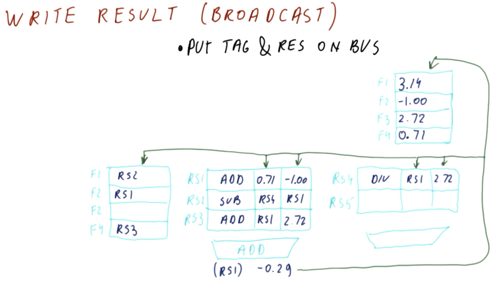
</center>

Consider the configuration in the figure shown above. Towards the end of the cycle, the execution unit `ADD` is ready to broadcast its result. To do this, the tag is applied (`RS1`) to the corresponding result (`-0.29`) and then sent on the bus, resulting in downstream broadcast to the corresponding structures (as denoted by green lines and arrows in the figure shown above).

<center>
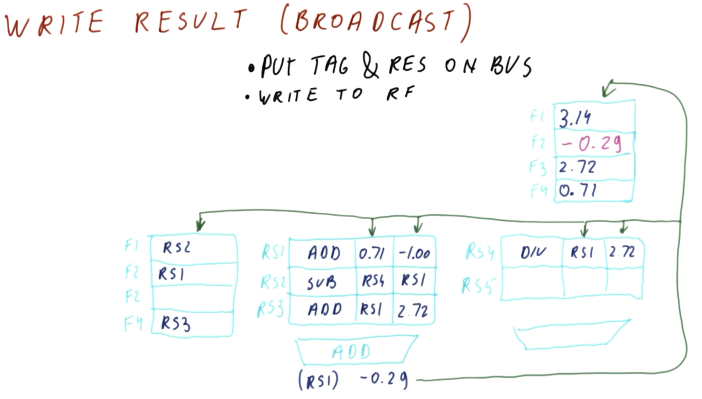
</center>

Next, the result value (`-0.29`) is written to the register file (i.e., entry `F2`). Furthermore, here, observe that it is not necessary to carry the tag `F2` in the result, because `RS1` already matches the register allocation table (RAT) entry (i.e., `RS1` in `F2`).

<center>
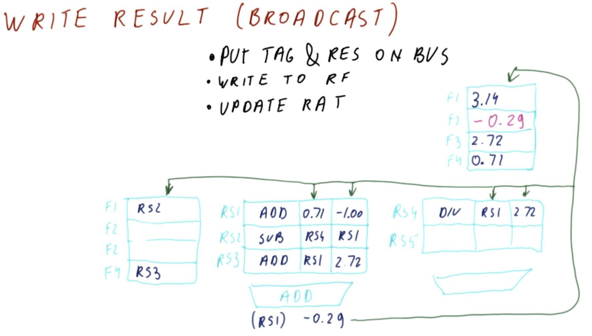
</center>

Next, the RAT entry is updated, i.e., the entry matching the tag (`RS1`) is changed accordingly; in particular, here, the previous entry is removed for `F2`, with `F2` now directly retrieving its value from the register file (i.e., as implied via empty entry in the RAT, which in practice is typically handled by a "valid" bit).

<center>
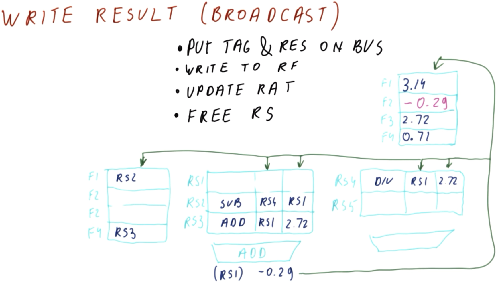
</center>

Lastly, the reservation table (`RS1`) is freed, in order to accommodate the next appropriate instruction in the instruction queue.
  * ***N.B.*** In real hardware, this "erasure of the entry" in the RS would be handled by a "valid" bit, or equivalent mechanism.

### 12. More than One Broadcast

Now, consider the situation in which it is necessary to perform more than one `Broadcast` operation.

<center>
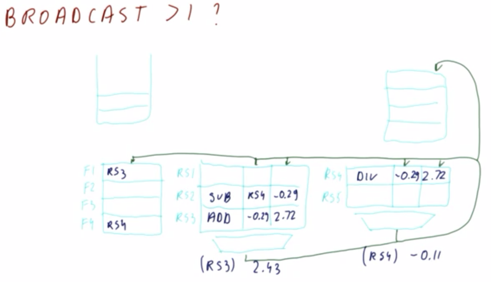
</center>

Consider the configuration as in the figure shown above. Here, both the executions units `ADD` and `MULT` finish their respective operations simultaneously in the *same* cycle, and must correspondingly broadcast over the *same* (single) bus; in such a case, which broadcast will occur first?

There are several possible **hardware resolutions** to this issue, such as:
  * Provide a *separate* broadcast bus for *each* execution unit.
    * In this case, there will be twice as many comparators for each operand for each instruction in each reservation station (i.e., the tag must be compared in turn among all of these).
  * If only *one* bus is available, then typically one of the execution units is made to be the **highest-priority unit**.
    * A common **heuristic** along these lines is to give higher priority to relatively slower execution units (e.g., `MUL`, if `MUL` is slower than `ADD`). The reason for this is that because the corresponding instructions will have been executing for the relatively longest time, they are then correspondingly relatively more likely to be "bottlenecking" for downstream dependencies. This could be further improved by additional carrying along information regarding the instruction age, however, this gives rise to a more complicated implementation (which in practice does not yield much additional improvement over an already reasonably effective heuristic).

### 13. Broadcast of a "Stale" Result

Finally, consider the issue of a `Broadcast` operation being performed for a "stale" result.

<center>
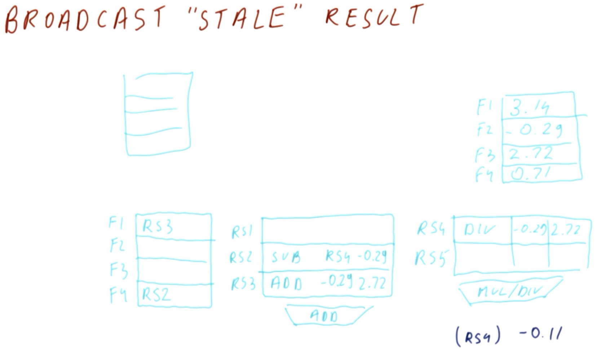
</center>

Consider the configuration as in the figure shown above. Here the execution unit `MUL/DIV` is preparing to broadcast the result `(RS4) -0.11` (via corresponding instruction in `RS4`). However, upon examination of the register allocation table (RAT), observe that none of the instructions are currently associated with `RS4`.

So, then, how can such a situation occur? This can occur as a result of renaming (e.g., if, for example, the entry for `F4` in the RAT originally held `RS4`, but was subsequently changed to `RS2`, as shown in the current configuration). 

<center>
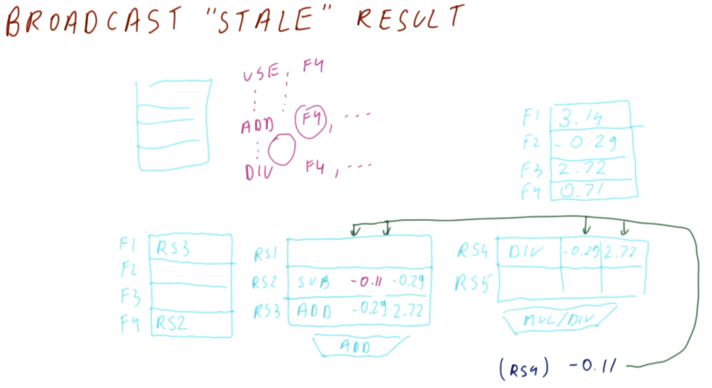
</center>

Consequently, upon broadcasting (as in the figure shown above, denoted by green lines and arrows), the reservation stations are updated as usual, i.e., each operand entry is matched against the tag `RS4` and updated accordingly (e.g., update of `RS2`, as denoted in purple in the figure shown above).

Here, there is no change to the RAT, because the resulting value (`-0.11`) is not used by any subsequent instructions in the instruction queue. The only reason for updating the register file is to store this value for downstream instructions depending on it; however, here, no such instructions occur in the instruction queue. Furthermore, the current values in the RAT are appropriate for the next instructions arriving in the instruction queue.

```mips
DIV F4, ... # first-occurring in instruction queue
⋮
ADD F4, ... # next-occurring in instruction queue -- uses `F4` produced by `DIV F4, ...`
⋮           # use `F4` produced by `ADD F4, ...`
```

Accordingly, consider the corresponding sequence of instructions shown above. In general, a given downstream instruction should use the most-recently-broadcasted value (i.e., `F4`).

Furthermore, note that if the broadcasted tag does not match any of the current entries in the RAT, then neither the RAT nor the register file should be updated (because all the instructions in their respective reservation stations which are depending on this value will have received it accordingly via the broadcast by that point). Bear this in mind (e.g., in quizzes, demonstrations, etc.) when updating the states accordingly.

## 14-15. Tomasulo's Algorithm - Review

Now that we have seen all of the steps in Tomasulo's algorithm, consider a review of it in its entirety.

<center>
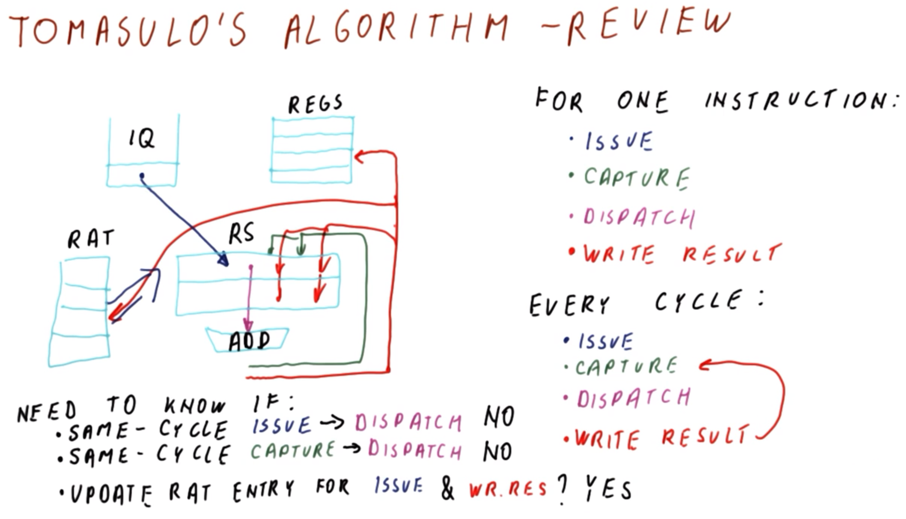
</center>

The pertinent hardware components in Tomasulo's algorithm are as follows (as in the figure shown above):
  * **Instruction Queue (IQ)**
  * **Register Allocation Table (RAT)**
  * **Register File (REGS)**
  * **Reservation Station (RS)**
  * **Execution Unit** (e.g., `ADD`)

Examining the **operations** for *one* instruction, these are as follows:
  1. `Issue`(denoted by blue in the figure shown above)
      * The instruction is issued from the IQ to an available RS, with a corresponding lookup performed in the RAT to determine the location of the value(s) for its operand(s).
      * Once the instruction is issued, its waits for the operands to become ready (i.e., obtain actual values)
  2. `Capture` (denoted by green in the figure shown above)
      * While instructions wait in their respective RSes, the instructions are attempting to capture the results broadcasted by other instructions (i.e., from their respective execution units)
  3. `Dispatch` (denoted by purple in the figure shown above)
      * Once the last-pending operand has been captured, the instruction is dispatched, i.e., sent to the execution unit for execution.
  4. `Write Result` (aka `Broadcast`) (denoted by red in the figure shown above)
    * Once the instruction completes execution, it writes its result, i.e., this result is broadcasted and fed back to other instructions in their respective RSes which are pending capture of this result, as well as making corresponding updates to the REGS and RAT. Writing to the RAT allows (i.e., clearing the entry there) allows future instructions to get the current value from the REGS directly, rather than waiting for the blocking instruction to execute.

It is ***important*** to note while all of these operations occur sequentially for any given *instruction*, in any given *cycle*, some instruction will be in any one of these operations at any given time (i.e., the processor is generally performing *all* of these operations simultaneously at any given time). In this manner, the broadcasted result is the one that feeds back to the capture for use by subsequent instructions which are pending the result.

Therefore, because all of these operations *can* (and do) occur in every cycle, there are some additional **considerations** to be aware of.
  * Is it possible to perform an `Issue` of an instruction followed immediately by a `Dispatch` of that instruction in the *same* cycle, if it does not need to `Capture` any other results? → Typically, ***no***.
    * While issuing the instruction, the RS is being populated for the instruction. In order to dispatch, it is necessary to test the contents of the RS prior to dispatching. Since the data is being written to the RS *during* the issue, and since the RS is not ready yet at that point in the cycle, it is not yet recognized as an instruction that can be dispatched by that point. Effectively, the RS is treated as "empty" in this cycle, and only starting in the *next* cycle is the RS containing the instruction eligible for dispatch.
    * However, note that it *is* possible to design the processor in such a manner that the instruction is ready for dispatch in the *same* cycle as in which it is issued.
  * Is it possible to perform a `Capture` (i.e., of the last-pending operand value) in the *same* cycle as the `Dispatch`? → Typically, ***no***.
    * The RS updates its status from "operands missing" to "operands available" in during the cycle in which the capture is occurring; only in the next cycle does the RS subsequently appear as containing an instruction which can be dispatched.
    * However, it *is* still possible to capture operands in the *same* cycle as dispatch, however, this requires specialized hardware to accomplish this.
  * Is it possible to update the RAT entry for *both* `Issue` and `Write Result` (aka `Broadcast`) in the *same* cycle? → ***yes***.
    * An instruction that is issued may need to update the RAT, in order to change the entry belonging to its destination operand. Meanwhile, the instruction that is broadcasting also needs to update the RAT entry corresponding to its destination operand. Therefore, if the instruction being issued and the instruction writing its result *both* have the *same* destination-register entry in the RAT, then the RAT entry must be effectively "updated twice"; this *can* indeed be done. Rather than writing the entry once and then writing it again, it must be ensured that the instruction that issuing ends up being the one whose value is ultimately retained in the RAT; this is because the broadcast instruction is pointing other RSes to the read the corresponding register in the REGS, but since the issuing instruction is later-occurring in the program-order, the latter instructs the RSes to examine *its* own RS for the result. Because the (downstream) instructions that read the RAT are the ones that issue even later, then they need to see the *latest* value of the register upon their issuing, i.e., that which is produced by the currently issuing instruction (rather than the broadcasting instruction). Therefore, there is no ambiguity, and the issuing instruction can simply be used to update the RAT entry accordingly.

## 16-19. One-Cycle Quizzes

### 16. Introduction

The following set of quizzes tests understanding of what occurs in one cycle via Tomasulo's algorithm.

### 17. Part 1 Question and Answers

<center>
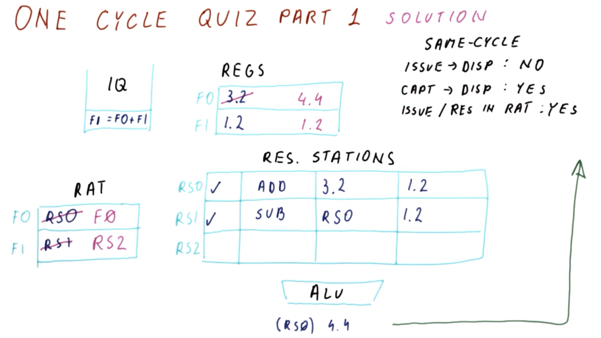
</center>

Consider the configuration shown above (blue text and annotations denote the state at the beginning of the cycle). Furthermore, the following are permissible based on the hardware itself:
  * Operations `Issue` and `Dispatch` *cannot* occur in the same cycle
  * Operations `Capture` and `Dispatch` *can* occur in the same cycle
  * Update of RAT following simultaneous operations `Issue` and `Broadcast` *can* occur in the same cycle

At the end of the cycle, what will be the contents of the two entries in both the RAT and REGS?

***Answer and Explanation***:

Consider all possible events in this cycle, as follows:
  * 1 - Issuing of an instruction from IQ will update the RAT correspondingly
  * 2 - `(RS0) 4.4` will be broadcasted from the execution unit `ALU`, which in turn will correspondingly update the RAT and REGS

These events can be analyzed in any arbitrary order, however, their resulting effects must be further examined and reconciled accordingly as necessary (denoted in purple text and annotations in the figure shown above).
  * 1 - Issuing of the instruction from IQ (`F1 = F0 + F1`) examines the entries for `F0` and `F1` in the RAT, followed by writing of `F1` into the corresponding reservation station(s). Because there is an available RS (`RS2`), the instruction is issued there, with corresponding update for entry `F1` in the RAT. Furthermore, there is no corresponding update to the REGS.
  * 2 - Broadcasting of `(RS0) 4.4` from the execution unit `ALU` makes the corresponding update to `REGS` for entry `F0`, and also invalidates the existing entry for `F0` in `RAT` (which now directs back to REGS).

Lastly, the entry `F1` in REGS remains unchanged, since neither event affected that value.

### 18. Part 2 Question and Answers

<center>
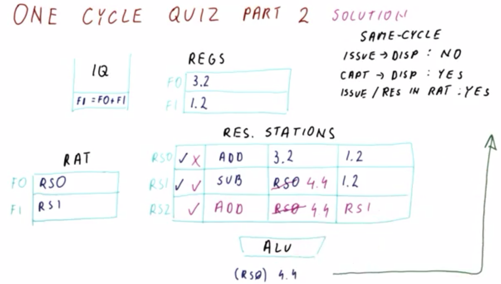
</center>

Continuing from the previous example (cf. Section 17), the same initial state is observed as previously.

By the end of this cycle, what is the final state of reservation stations (RSes)? In particular, are `RS0` and/or `RS1` still busy? And will `RS2` be used at all?

***Answer and Explanation***:

To determine the downstream effects on the RSes, it is first necessary to determine whether an instruction is issued from the IQ, as well as the impact of the currently broadcasting instruction from the execution unit (i.e., is there any capturing of the result by the RSes). These can be analyzed in arbitrary order, however, caution must be exercised in examining multiple updates to the *same* field.

With respect to issuing from IQ:
  * `RS2` is identified as an available reservation station, and becomes ***occupied*** by the instruction (`F1 = F0 + F1`) accordingly. Furthermore, both operands `F0` and `F1` have corresponding entries in the RAT (`RS0` and `RS1`, respectively)

With respect to the broadcast from `ALU`:
  * pre-broadcast:
    * `RS0` frees its reservation station, thus `RS0` is ***not occupied*** at the end of the cycle.
    * `RS1` remains ***occupied*** due to dependence on `RS0` for one of its operands.
  * post-broadcast:
    * `RS1` entry for `RS0` is captured as `4.4`
    * `RS2` entry (which was issued in this same cycle) for `RS0` is captured as `4.4`; furthermore, this is necessary to occur in the *same* cycle, because with `RS0` freed, that value is now stale/invalid. `RS0` entry for `RS1` is still pending a result (which is permissible here, since `RS1` has not yet executed).

### 19. Part 3 Question and Answers

<center>
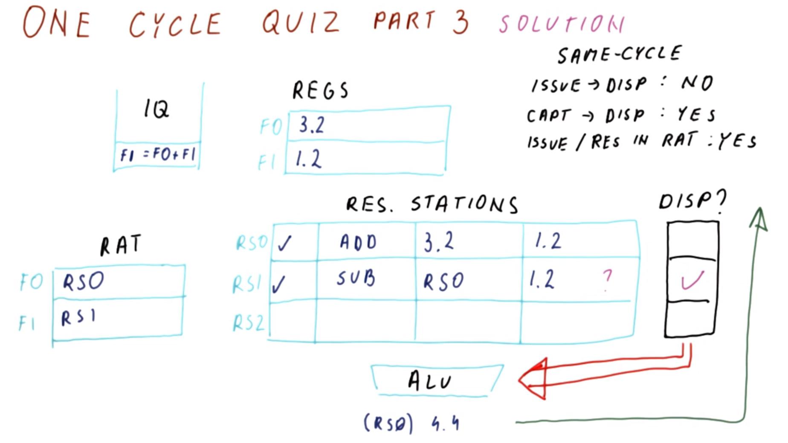
</center>

Continuing from the previous example (cf. Sections 17 and 18), the same reference state is observed as previously.

Which instruction (if any) will dispatch into the execution `ALU` by the end of this cycle? (Note: "No cycle" is a possible option.)

***Answer and Explanation***:

Recall (cf. Section 18) that `RS0` will free its reservation station and is in process of executing, therefore it ***will not*** dispatch (i.e., *again*) in this cycle.

`RS1` will capture its last-remaining operand during this cycle, thereby making it eligible for dispatch immediately thereafter. Since simultaneous capture and dispatch *is* possible on this hardware (as per the given parameters, cf. Section 17), `RS1` ***will*** consequently dispatch.

`RS2` is occupied during this cycle via issuing of the instruction (`F1 = F0 + F1`). However, since simultaneous issue nad dispatch is *not* possible on this hardware (as per the given parameters, cf. Section 17), `RS2` ***will not*** dispatch in this cycle (i.e., even if its operands were available/ready).

***N.B.*** In this case, since there is only *one* available instruction for dispatch, there is no ambiguity here. However, if there were *more than one* instructions available for dispatch, some type of mechanism (e.g., oldest first) would have to be devised/implemented to select among these, since there is only one execution unit (`ALU`) available.

## 20. Tomasulo's Algorithm Quiz and Answers

<center>

</center>

Which of the following is ***not*** true regarding Tomasulo's algorithm?
  * It issues instructions in program-order
    * `DOES NOT APPLY` - Instructions arrive via the instruction queue (IQ) in program-order. Consequently, it is not possible to issue instructions out-of-order.
  * It dispatches instructions in program-order
    * `APPLIES` - Instructions *can* be dispatched in out-of-program-order, hence why Tomasulo's algorithm is characterized as an out-of-order algorithm (i.e., running on an out-of-order processor).
  * It writes results in program-order
    * `APPLIES` - This is not necessarily true. Results can be written in the order in which they are *produced*, which may be out-of-program-order. 

## 21-27. Tomasulo's Algorithm - Long Example

### 21. Introduction

Now that we have seen how Tomasulo's algorithm works and the corresponding structures, we will now consider a longer example spanning multiple cycles (which is more representative of long-form problems, exam questions, etc.).

<center>
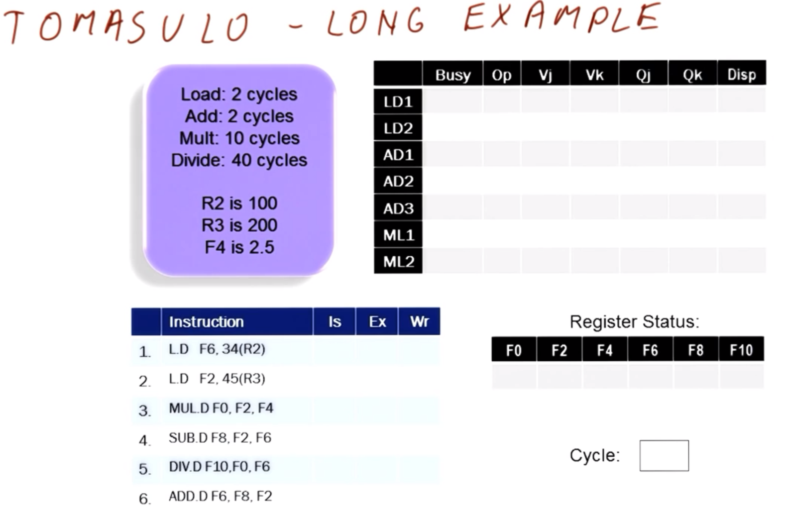
</center>

For convenience, the tables in the figure shown above are provided to streamline the analysis.

The processor is characterized as follows:
  * The unit `L` (load) requires `2` cycles to execute
  * The unit `ADD` (add) requires `2` cycles to execute
  * The unit `MUL` (multiply) requires `10` cycles to execute
  * The unit `DIV` (divide) requires `40` cycles to execute

Furthermore, the initial content of the register file (REGS) is as follows:
  * Register `R2` contains `100`
  * Register `R3` contains `200`
  * Register `F4` contains `2.5`

The instructions in the instruction queue (IQ) are as follows (ordered in program-order starting with instruction `I1`):

| Instruction Label | Instruction | Cycle of `Issue` | Cycle of `Execute` | Cycle of `Write Result` |
|:--:|:--:|:--:|:--:|:--:|
| `I1` | `L.D F6, 34(R2)` | | | |
| `I2` | `L.D F2, 45(R3)` | | | |
| `I3` | `MUL.D F0, F2, F4` | | | |
| `I4` | `SUB.D F8, F2, F6` | | | |
| `I5` | `DIV.D F10, F0, F6` | | | |
| `I6` | `ADD.D F6, F8, F2` | | | |

The register allocation table (RAT) contains the register statuses as follows (where empty entry implies pointing to the corresponding entry in REGS):

| Register | Value |
|:--:|:--:|
| `F0` | |
| `F2` | |
| `F4` | |
| `F6` | |
| `F8` | |
| `F10` | |

Lastly, the reservation stations (RSes) are as follows:

| Reservation Station Label | RS is busy/occupied? | Operation | Operand `Vj` | Operand `Vk` | Waited-for value `Qj` | Waited-for value `Qk` | Instruction is dispatched? |
|:--:|:--:|:--:|:--:|:--:|:--:|:--:|:--:|
| `LD1` | | | | | | | |
| `LD2` | | | | | | | |
| `AD1` | | | | | | | |
| `AD2` | | | | | | | |
| `AD3` | | | | | | | |
| `ML1` | | | | | | | |
| `ML2` | | | | | | | |

### 22. Load and Store Instructions

<center>
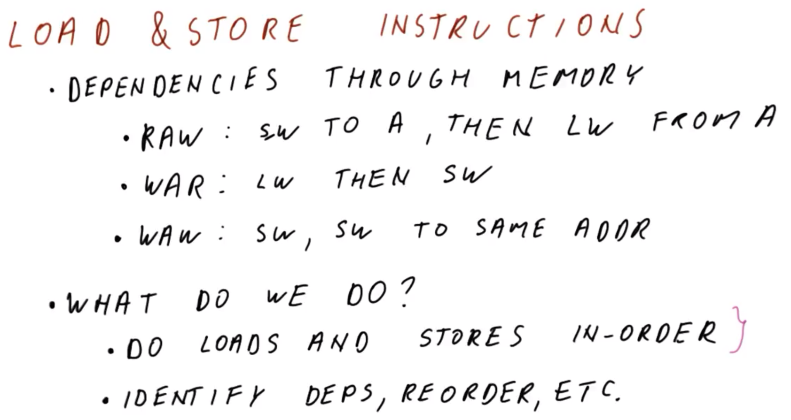
</center>

Here, let us briefly consider what occurs during load and store instructions.

Just as we have previously seen data dependencies occurring via registers (e.g., renaming registers to eliminate false dependencies, and similarly the use of reservation stations, etc. to properly obey the inherent true dependencies), there can *also* be occurring dependencies vai **memory** itself. In this case, here we assume loads and stores are the only instructions that can have dependencies via memory.
  * A **read-after-write (RAW)** dependency occurs if there is an operation `SW` (store word) to some address in memory, which is then followed by an operation `LW` (load word) from the same address (i.e., the `LW` uses the value stored by `SW`).
  * A **write-after-read (WAR)** (false) dependency occurs if the program first performs `LW`, followed by `SW`; if these operations were reordered, then the `LW` reads a stale value (i.e., preceding that which is otherwise updated by the subsequent operation `SW`).
  * A **write-after-write (WAW)** dependency occurs if there are successive  `SW` operations to the *same* address; here, the latest-occurring `SW` should be the value at the end, but a "stale" value can occur if these `SW` operations are reordered.

Obviously, dependencies in memory must be similarly obeyed (and/or otherwise eliminated) just as for data dependencies in registers. To **resolve** these memory dependencies, Tomasulo's algorithm does the following:
  * Perform instructions load and store **in-order**, i.e., do not reorder them at all, but rather insert them into the load/store queue in first-in, first-out order (e.g., a load does not execute if there is a previous store pending, even if the load is ready to execute at that point).
    * In practice, this is the resolution method of choice for Tomasulo's algorithm.
  * Identify the dependencies between load and store instructions, and correspondingly **reorder** them (as with any other instruction).
    * This turns out to be rather complicated to implement in practice (i.e., relative to more straightforward approach to reordering register dependencies). However, this *is* in fact implemented on modern processors (i.e., including for load and store instructions).

### 23. Cycles 1-2

<center>
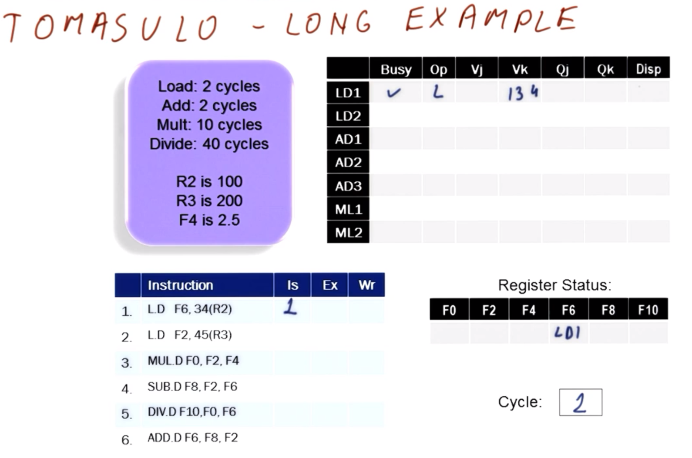
</center>

| Instruction Label | Instruction | Cycle of `Issue` | Cycle of `Execute` | Cycle of `Write Result` |
|:--:|:--:|:--:|:--:|:--:|
| `I1` | `L.D F6, 34(R2)` | `C1` | | |
| `I2` | `L.D F2, 45(R3)` | | | |
| `I3` | `MUL.D F0, F2, F4` | | | |
| `I4` | `SUB.D F8, F2, F6` | | | |
| `I5` | `DIV.D F10, F0, F6` | | | |
| `I6` | `ADD.D F6, F8, F2` | | | |

In cycle `C1`, there is nothing to dispatch and nothing to write, so only issuing is of concern. This is noted accordingly in the table shown above.

| Reservation Station Label | RS is busy/occupied? | Operation | Operand `Vj` | Operand `Vk` | Waited-for value `Qj` | Waited-for value `Qk` | Instruction is dispatched? |
|:--:|:--:|:--:|:--:|:--:|:--:|:--:|:--:|
| `LD1` | `C1` | `L.D` | `(N/A)` | `134` (`100 + 34`) | `(N/A)`|`(N/A)` | `No` |
| `LD2` | | | | | | | |
| `AD1` | | | | | | | |
| `AD2` | | | | | | | |
| `AD3` | | | | | | | |
| `ML1` | | | | | | | |
| `ML2` | | | | | | | |

Since there is a correspondingly empty reservation station, instruction `I1` can be placed accordingly into `LD1`, as in the table shown above. Furthermore, instruction `I1` gets its operand `R2` directly via REGS.

| Register | Value |
|:--:|:--:|
| `F0` | |
| `F2` | |
| `F4` | |
| `F6` | `LD1` |
| `F8` | |
| `F10` | |

The other operand `F6` is placed into the RAT (via corresponding RS `LD1`), as in the table shown above.

<center>

</center>

| Instruction Label | Instruction | Cycle of `Issue` | Cycle of `Execute` | Cycle of `Write Result` |
|:--:|:--:|:--:|:--:|:--:|
| `I1` | `L.D F6, 34(R2)` | `C1` | `C2` | |
| `I2` | `L.D F2, 45(R3)` | `C2` | | |
| `I3` | `MUL.D F0, F2, F4` | | | |
| `I4` | `SUB.D F8, F2, F6` | | | |
| `I5` | `DIV.D F10, F0, F6` | | | |
| `I6` | `ADD.D F6, F8, F2` | | | |

In cycle `C2`, there is nothing to dispatch and nothing to write, so only issuing is of concern. This is noted accordingly in the table shown above.

| Reservation Station Label | RS is busy/occupied? | Operation | Operand `Vj` | Operand `Vk` | Waited-for value `Qj` | Waited-for value `Qk` | Instruction is dispatched? |
|:--:|:--:|:--:|:--:|:--:|:--:|:--:|:--:|
| `LD1` | `C2` | `L.D` | `(N/A)` | `134` | `(N/A)`|`(N/A)` | `Yes (C2-C4)` |
| `LD2` | `C2` | `L.D` | `(N/A)` | `245` (`200 + 45`) | `(N/A)`|`(N/A)` | `No` |
| `AD1` | | | | | | | |
| `AD2` | | | | | | | |
| `AD3` | | | | | | | |
| `ML1` | | | | | | | |
| `ML2` | | | | | | | |

Since there is a correspondingly empty reservation station, instruction `I2` can be placed accordingly into `LD2`, as in the table shown above. Furthermore, instruction `I2` gets its operand `R3` directly via REGS.

| Register | Value |
|:--:|:--:|
| `F0` | |
| `F2` | `LD2` |
| `F4` | |
| `F6` | `LD1` |
| `F8` | |
| `F10` | |

The other operand `F2` is placed into the RAT (via corresponding RS `LD2`), as in the table shown above.

Furthermore, note that instruction `I1` is dispatched in cycle `C2`, noted above in the corresponding tables for `C2`. Furthermore, recall (cf. Section 21) that a load instruction requires `2` cycles; here, we shall assume that the write back occurs *after* execution of the second cycle (from initiation) is completed (i.e., two cycles after `C2`, or `C4`).

### 24. Cycles 3-4

<center>
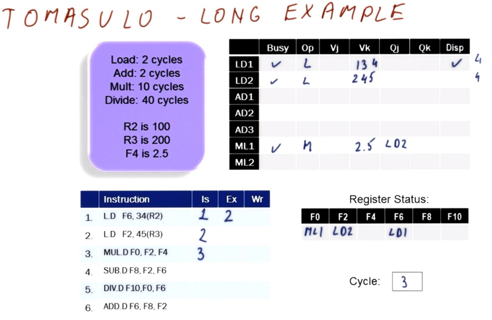
</center>

| Instruction Label | Instruction | Cycle of `Issue` | Cycle of `Execute` | Cycle of `Write Result` |
|:--:|:--:|:--:|:--:|:--:|
| `I1` | `L.D F6, 34(R2)` | `C1` | `C2` | |
| `I2` | `L.D F2, 45(R3)` | `C2` | | |
| `I3` | `MUL.D F0, F2, F4` | `C3` | | |
| `I4` | `SUB.D F8, F2, F6` | | | |
| `I5` | `DIV.D F10, F0, F6` | | | |
| `I6` | `ADD.D F6, F8, F2` | | | |

In cycle `C3`, instruction `I3` is issued. This is noted accordingly in the table shown above.

| Reservation Station Label | RS is busy/occupied? | Operation | Operand `Vj` | Operand `Vk` | Waited-for value `Qj` | Waited-for value `Qk` | Instruction is dispatched? |
|:--:|:--:|:--:|:--:|:--:|:--:|:--:|:--:|
| `LD1` | `C3` | `L.D` | `(N/A)` | `134` | `(N/A)`|`(N/A)` | `Yes (C2-C4)` |
| `LD2` | `C3` | `L.D` | `(N/A)` | `245` | `(N/A)`|`(N/A)` | `No` |
| `AD1` | | | | | | | |
| `AD2` | | | | | | | |
| `AD3` | | | | | | | |
| `ML1` | `C3` | `MUL.D` | `(waiting)` | `2.5` | `LD2` |`(N/A)` | `No` |
| `ML2` | | | | | | | |

Since there is a correspondingly empty reservation station, instruction `I3` can be placed accordingly into `ML1`, as in the table shown above. Furthermore, the operand `F4` is read directly from REGS. However, the other operand (`F2`) is waiting on `LD2`.

| Register | Value |
|:--:|:--:|
| `F0` | `ML1` |
| `F2` | `LD2` |
| `F4` | |
| `F6` | `LD1` |
| `F8` | |
| `F10` | |

Furthermore, the remaining operand `F0` is placed into the RAT (via corresponding RS `ML1`), as in the table shown above.

In cycle `C3`, instruction `I1` (via corresponding RS `LD1`) is still executing; in this case, can instruction `I2` (via corresponding RS `LD2`) begin execution?
  * If the load/store unit were pipelined, then this *would* be possible.
  * Conversely, without such a pipelined load/store unit, then this is *not* possible. With this assumption holding (as is intended for this particular example), `LD2` wil have to wait until cycle `C4` to begin executing the instruction, once the previous instruction `I1` (via `LD1`) has completed execution.

Furthermore, note that nothing is broadcasting yet in cycle `C3`.

<center>
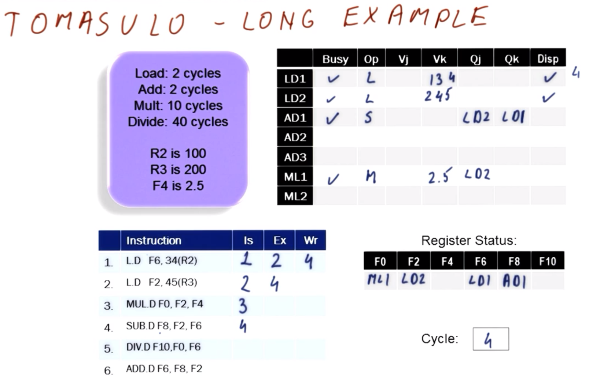
</center>

| Instruction Label | Instruction | Cycle of `Issue` | Cycle of `Execute` | Cycle of `Write Result` |
|:--:|:--:|:--:|:--:|:--:|
| `I1` | `L.D F6, 34(R2)` | `C1` | `C2` | |
| `I2` | `L.D F2, 45(R3)` | `C2` | | |
| `I3` | `MUL.D F0, F2, F4` | `C3` | | |
| `I4` | `SUB.D F8, F2, F6` | `C4` | | |
| `I5` | `DIV.D F10, F0, F6` | | | |
| `I6` | `ADD.D F6, F8, F2` | | | |

In cycle `C4`, instruction `I4` is issued. This is noted accordingly in the table shown above.

| Reservation Station Label | RS is busy/occupied? | Operation | Operand `Vj` | Operand `Vk` | Waited-for value `Qj` | Waited-for value `Qk` | Instruction is dispatched? |
|:--:|:--:|:--:|:--:|:--:|:--:|:--:|:--:|
| `LD1` | `C4` | `L.D` | `(N/A)` | `134` | `(N/A)`|`(N/A)` | `Yes (C2-C4)` |
| `LD2` | `C4` | `L.D` | `(N/A)` | `245` | `(N/A)`|`(N/A)` | `No` |
| `AD1` | `C4` | `SUB.D` | `(waiting)` | `(waiting)` | `LD2` | `LD1` | `No` |
| `AD2` | | | | | | | |
| `AD3` | | | | | | | |
| `ML1` | `C4` | `MUL.D` | `(waiting)` | `2.5` | `LD2` |`(N/A)` | `No` |
| `ML2` | | | | | | | |

Since there is a correspondingly empty reservation station, instruction `I3` can be placed accordingly into `ML1`, as in the table shown above. Furthermore, both operands are waiting on RSes (i.e., `LD2` and `LD1`).

| Register | Value |
|:--:|:--:|
| `F0` | `ML1` |
| `F2` | `LD2` |
| `F4` | |
| `F6` | `LD1` |
| `F8` | `AD1` |
| `F10` | |

Furthermore, the remaining operand `F8` is placed into the RAT (via corresponding RS `AD1`), as in the table shown above.

This now covers analysis of issuing in cycle `C4`. Now, consider analysis of dispatching in cycle `C4`, as follows.

<center>
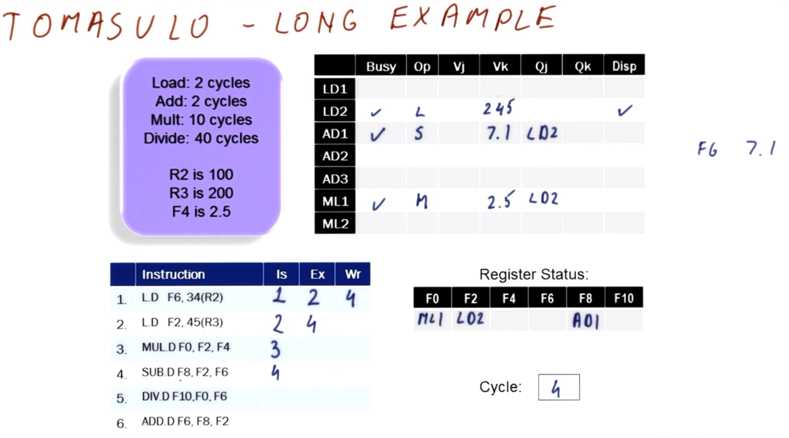
</center>

| Instruction Label | Instruction | Cycle of `Issue` | Cycle of `Execute` | Cycle of `Write Result` |
|:--:|:--:|:--:|:--:|:--:|
| `I1` | `L.D F6, 34(R2)` | `C1` | `C2` | `C4` |
| `I2` | `L.D F2, 45(R3)` | `C2` | `C4` | |
| `I3` | `MUL.D F0, F2, F4` | `C3` | | |
| `I4` | `SUB.D F8, F2, F6` | `C4` | | |
| `I5` | `DIV.D F10, F0, F6` | | | |
| `I6` | `ADD.D F6, F8, F2` | | | |

| Reservation Station Label | RS is busy/occupied? | Operation | Operand `Vj` | Operand `Vk` | Waited-for value `Qj` | Waited-for value `Qk` | Instruction is dispatched? |
|:--:|:--:|:--:|:--:|:--:|:--:|:--:|:--:|
| `LD1` | `C4` | `L.D` | `(N/A)` | `134` | `(N/A)`|`(N/A)` | `Yes (C2-C4)` |
| `LD2` | `C4` | `L.D` | `(N/A)` | `245` | `(N/A)`|`(N/A)` | `Yes (C4-C6)` |
| `AD1` | `C4` | `SUB.D` | `(waiting)` | `(waiting)` | `LD2` | `LD1` | `No` |
| `AD2` | | | | | | | |
| `AD3` | | | | | | | |
| `ML1` | `C4` | `MUL.D` | `(waiting)` | `2.5` | `LD2` |`(N/A)` | `No` |
| `ML2` | | | | | | | |

In cycles `C2` and `C3`, instruction `I1` (via RS `LD1`) has been executing, and is now ready to write result in cycle `C4` (and correspondingly instruction `I2` via RS `LD2` is ready to dispatch and begin executing), as indicated in the tables shown above.

| Reservation Station Label | RS is busy/occupied? | Operation | Operand `Vj` | Operand `Vk` | Waited-for value `Qj` | Waited-for value `Qk` | Instruction is dispatched? |
|:--:|:--:|:--:|:--:|:--:|:--:|:--:|:--:|
| `LD1` | | | | | | | |
| `LD2` | `C4` | `L.D` | `(N/A)` | `245` | `(N/A)`|`(N/A)` | `Yes (C4-C6)` |
| `AD1` | `C4` | `SUB.D` | `(waiting)` | `7.1` | `LD2` | `(N/A)` | `No` |
| `AD2` | | | | | | | |
| `AD3` | | | | | | | |
| `ML1` | `C4` | `MUL.D` | `(waiting)` | `2.5` | `LD2` |`(N/A)` | `No` |
| `ML2` | | | | | | | |

On write of the result of instruction `I1`, the result (`7.1`) is broadcasted and captured/latched (i.e., via waited-on RS `LD1`), as in the table shown above. Furthermore, RS `LD1` is now available.
  * ***N.B.*** For demonstration purposes, an "available" RS here corresponds to a blank row/entry, however, in practice, this would be recorded in hardware via a single "valid" bit entry.

| Register | Value |
|:--:|:--:|
| `F0` | `ML1` |
| `F2` | `LD2` |
| `F4` | |
| `F6` | |
| `F8` | `AD1` |
| `F10` | |

Additionally, the RAT is updated as shown above. Consequently, value `F6` is now read directly from REGS.

To recap, in cycle `C4`:
  * Instruction `I4` is issued
  * Instruction `I1` is dispatched and written back

### 25. Cycles 5-6

<center>
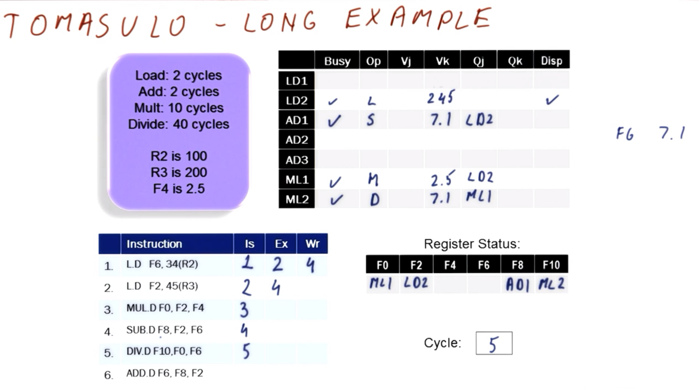
</center>

| Instruction Label | Instruction | Cycle of `Issue` | Cycle of `Execute` | Cycle of `Write Result` |
|:--:|:--:|:--:|:--:|:--:|
| `I1` | `L.D F6, 34(R2)` | `C1` | `C2` | `C4` |
| `I2` | `L.D F2, 45(R3)` | `C2` | `C4` | |
| `I3` | `MUL.D F0, F2, F4` | `C3` | | |
| `I4` | `SUB.D F8, F2, F6` | `C4` | | |
| `I5` | `DIV.D F10, F0, F6` | `C5` | | |
| `I6` | `ADD.D F6, F8, F2` | | | |

In cycle `C5`, instruction `I5` is issued. This is noted accordingly in the table shown above.

| Reservation Station Label | RS is busy/occupied? | Operation | Operand `Vj` | Operand `Vk` | Waited-for value `Qj` | Waited-for value `Qk` | Instruction is dispatched? |
|:--:|:--:|:--:|:--:|:--:|:--:|:--:|:--:|
| `LD1` | | | | | | | |
| `LD2` | `C5` | `L.D` | `(N/A)` | `245` | `(N/A)`|`(N/A)` | `Yes (C4-C6)` |
| `AD1` | `C5` | `SUB.D` | `(waiting)` | `7.1` | `LD2` | `(N/A)` | `No` |
| `AD2` | | | | | | | |
| `AD3` | | | | | | | |
| `ML1` | `C5` | `MUL.D` | `(waiting)` | `2.5` | `LD2` |`(N/A)` | `No` |
| `ML2` | `C5` | `DIV.D` | `(waiting)` | `7.1` | `ML1` | `(N/A)` | `No` |

Since there is a correspondingly empty reservation station, instruction `I5` can be placed accordingly into `ML2`, as in the table shown above. Furthermore, operand `F0` is waiting on RS `ML1`, while operand `F6` can be read directly from REGS.

| Register | Value |
|:--:|:--:|
| `F0` | `ML1` |
| `F2` | `LD2` |
| `F4` | |
| `F6` | |
| `F8` | `AD1` |
| `F10` | `ML2` |

Furthermore, the remaining operand `F10` is placed into the RAT (via corresponding RS `ML2`), as in the table shown above.

This now covers analysis of issuing in cycle `C5`. Furthermore, instruction `I2` (via RS `LD2`) is still executing in cycle `C5`, so it cannot be dispatched yet, nor is any other instruction able to dispatch at this point yet, either.

<center>
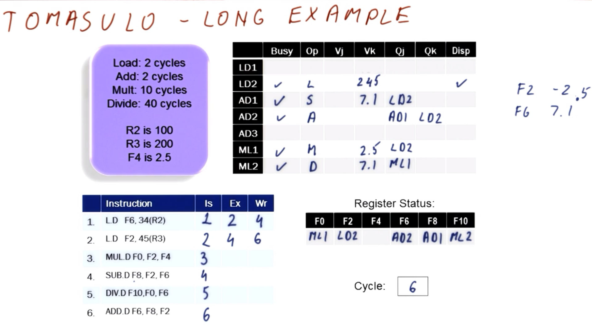
</center>

| Instruction Label | Instruction | Cycle of `Issue` | Cycle of `Execute` | Cycle of `Write Result` |
|:--:|:--:|:--:|:--:|:--:|
| `I1` | `L.D F6, 34(R2)` | `C1` | `C2` | `C4` |
| `I2` | `L.D F2, 45(R3)` | `C2` | `C4` | |
| `I3` | `MUL.D F0, F2, F4` | `C3` | | |
| `I4` | `SUB.D F8, F2, F6` | `C4` | | |
| `I5` | `DIV.D F10, F0, F6` | `C5` | | |
| `I6` | `ADD.D F6, F8, F2` | `C6` | | |

In cycle `C6`, instruction `I6` is issued. This is noted accordingly in the table shown above.

| Reservation Station Label | RS is busy/occupied? | Operation | Operand `Vj` | Operand `Vk` | Waited-for value `Qj` | Waited-for value `Qk` | Instruction is dispatched? |
|:--:|:--:|:--:|:--:|:--:|:--:|:--:|:--:|
| `LD1` | | | | | | | |
| `LD2` | `C6` | `L.D` | `(N/A)` | `245` | `(N/A)`|`(N/A)` | `Yes (C4-C6)` |
| `AD1` | `C6` | `SUB.D` | `(waiting)` | `7.1` | `LD2` | `(N/A)` | `No` |
| `AD2` | `C6` | `ADD.D` | `(waiting)` | `(waiting)` | `AD1` | `LD2` | `No` |
| `AD3` | | | | | | | |
| `ML1` | `C6` | `MUL.D` | `(waiting)` | `2.5` | `LD2` |`(N/A)` | `No` |
| `ML2` | `C6` | `DIV.D` | `(waiting)` | `7.1` | `ML1` | `(N/A)` | `No` |

Since there is a correspondingly empty reservation station, instruction `I6` can be placed accordingly into `ML2`, as in the table shown above. Furthermore, both operands are waiting on RSes (i.e., `AD1` and `LD2`).

| Register | Value |
|:--:|:--:|
| `F0` | `ML1` |
| `F2` | `LD2` |
| `F4` | |
| `F6` | `AD2` |
| `F8` | `AD1` |
| `F10` | `ML2` |

Furthermore, the remaining operand `F6` is placed into the RAT (via corresponding RS `AD2`), as in the table shown above.

This now covers analysis of issuing in cycle `C6`. Now, consider analysis of dispatching in cycle `C6`, as follows.

<center>
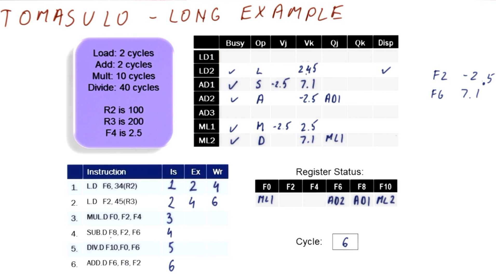
</center>

| Instruction Label | Instruction | Cycle of `Issue` | Cycle of `Execute` | Cycle of `Write Result` |
|:--:|:--:|:--:|:--:|:--:|
| `I1` | `L.D F6, 34(R2)` | `C1` | `C2` | `C4` |
| `I2` | `L.D F2, 45(R3)` | `C2` | `C4` | `C6` |
| `I3` | `MUL.D F0, F2, F4` | `C3` | | |
| `I4` | `SUB.D F8, F2, F6` | `C4` | | |
| `I5` | `DIV.D F10, F0, F6` | `C5` | | |
| `I6` | `ADD.D F6, F8, F2` | `C6` | | |

| Reservation Station Label | RS is busy/occupied? | Operation | Operand `Vj` | Operand `Vk` | Waited-for value `Qj` | Waited-for value `Qk` | Instruction is dispatched? |
|:--:|:--:|:--:|:--:|:--:|:--:|:--:|:--:|
| `LD1` | | | | | | | |
| `LD2` | `C6` | `L.D` | `(N/A)` | `245` | `(N/A)`|`(N/A)` | `Yes (C4-C6)` |
| `AD1` | `C6` | `SUB.D` | `-2.5` | `7.1` | `(N/A)`| `(N/A)` | `No` |
| `AD2` | `C6` | `ADD.D` | `(waiting)` | `-2.5` | `AD1` | `(N/A)` | `No` |
| `AD3` | | | | | | | |
| `ML1` | `C6` | `MUL.D` | `-2.5` | `2.5` |`(N/A)` |`(N/A)` | `No` |
| `ML2` | `C6` | `DIV.D` | `(waiting)` | `7.1` | `ML1` | `(N/A)` | `No` |

In cycles `C4` and `C5`, instruction `I2` (via RS `LD2`) has been executing, and is now ready to write result (`-2.5`) in cycle `C6` (however, nothing else is ready to execute until this result is written, and thus no dispatch occurs), as indicated in the tables shown above. This result is correspondingly captured (via `LD2`/`F2`).
  * ***N.B.*** While RSes `AD1` and `ML2` now have defined operands and are capable of executing, based on the constraints of the hardware (i.e., inability to perform simultaneous broadcast/capture and dispatch in the *same* cycle), dispatch cannot occur yet in this cycle.

| Register | Value |
|:--:|:--:|
| `F0` | `ML1` |
| `F2` | |
| `F4` | |
| `F6` | `AD2` |
| `F8` | `AD1` |
| `F10` | `ML2` |

Additionally, the RAT is updated as shown above. Consequently, value `F2` is now read directly from REGS.

In summary, in cycle `C6`:
  * Instruction `I6` is issued
  * Result of instruction `I2` is broadcasted
  * No dispatch occurs yet

### 26. Cycles 7-9

<center>
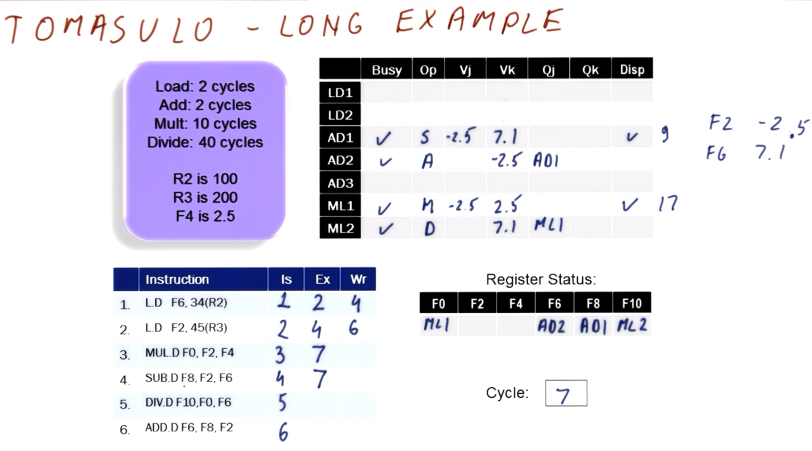
</center>

| Instruction Label | Instruction | Cycle of `Issue` | Cycle of `Execute` | Cycle of `Write Result` |
|:--:|:--:|:--:|:--:|:--:|
| `I1` | `L.D F6, 34(R2)` | `C1` | `C2` | `C4` |
| `I2` | `L.D F2, 45(R3)` | `C2` | `C4` | `C6` |
| `I3` | `MUL.D F0, F2, F4` | `C3` | `C7` | |
| `I4` | `SUB.D F8, F2, F6` | `C4` | `C7` | |
| `I5` | `DIV.D F10, F0, F6` | `C5` | | |
| `I6` | `ADD.D F6, F8, F2` | `C6` | | |

In cycle `C7`, there is no instruction to issue. This is noted accordingly in the table shown above. (This will also be true for subsequent cycles, since there are only six total instructions in this program.)

| Reservation Station Label | RS is busy/occupied? | Operation | Operand `Vj` | Operand `Vk` | Waited-for value `Qj` | Waited-for value `Qk` | Instruction is dispatched? |
|:--:|:--:|:--:|:--:|:--:|:--:|:--:|:--:|
| `LD1` | | | | | | | |
| `LD2` | | | | | | | | |
| `AD1` | `C7` | `SUB.D` | `-2.5` | `7.1` | `(N/A)`| `(N/A)` | `Yes (C7-C9)` |
| `AD2` | `C7` | `ADD.D` | `(waiting)` | `-2.5` | `AD1` | `(N/A)` | `No` |
| `AD3` | | | | | | | |
| `ML1` | `C7` | `MUL.D` | `-2.5` | `2.5` |`(N/A)` |`(N/A)` | `Yes (C7-C17)` |
| `ML2` | `C7` | `DIV.D` | `(waiting)` | `7.1` | `ML1` | `(N/A)` | `No` |

With respect to dispatch, both RSes `AD1` and `ML1` are ready to be dispatched in cycle `C7`, as in the table shown above. Both are correspondingly dispatched; however, since nothing is currently executing (i.e., both dispatched instructions require multiple cycles to execute), the results are not yet broadcasted at this point.

In cycle `C8`, there is no issue, dispatch, or broadcast, since the instructions are still currently executing at that point.

<center>
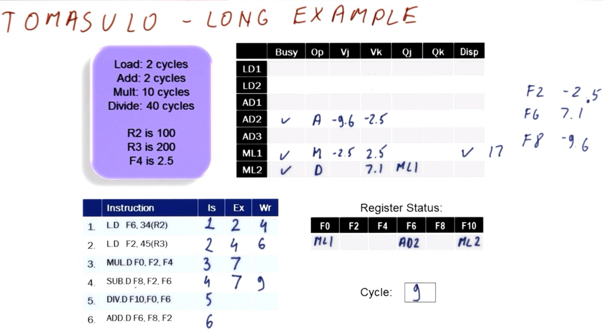
</center>

| Instruction Label | Instruction | Cycle of `Issue` | Cycle of `Execute` | Cycle of `Write Result` |
|:--:|:--:|:--:|:--:|:--:|
| `I1` | `L.D F6, 34(R2)` | `C1` | `C2` | `C4` |
| `I2` | `L.D F2, 45(R3)` | `C2` | `C4` | `C6` |
| `I3` | `MUL.D F0, F2, F4` | `C3` | `C7` | |
| `I4` | `SUB.D F8, F2, F6` | `C4` | `C7` | `C9` |
| `I5` | `DIV.D F10, F0, F6` | `C5` | | |
| `I6` | `ADD.D F6, F8, F2` | `C6` | | |

In cycle `C9`, instruction `I4` completes execution is able to broadcast its result (`-9.6`), as indicated in the table shown above. Furthermore, this broadcast *can* occur unambiguously here, because no other instruction is attempting to broadcast at this point.

| Register | Value |
|:--:|:--:|
| `F0` | `ML1` |
| `F2` | |
| `F4` | |
| `F6` | `AD2` |
| `F8` | |
| `F10` | `ML2` |

With respect to broadcast and corresponding capture/latch, the RAT is updated as shown above (i.e., with `F8` now read directly from REGS).

| Reservation Station Label | RS is busy/occupied? | Operation | Operand `Vj` | Operand `Vk` | Waited-for value `Qj` | Waited-for value `Qk` | Instruction is dispatched? |
|:--:|:--:|:--:|:--:|:--:|:--:|:--:|:--:|
| `LD1` | | | | | | | |
| `LD2` | | | | | | | | |
| `AD1` | | | | | | | | |
| `AD2` | `C7` | `ADD.D` | `-9.6` | `-2.5` | `(N/A)` | `(N/A)` | `No` |
| `AD3` | | | | | | | |
| `ML1` | `C7` | `MUL.D` | `-2.5` | `2.5` |`(N/A)` |`(N/A)` | `Yes (C7-C17)` |
| `ML2` | `C7` | `DIV.D` | `(waiting)` | `7.1` | `ML1` | `(N/A)` | `No` |

Furthermore, with respect to broadcast and corresponding capture/latch, `AD1` entry in RS `AD2` is updated accordingly (i.e., with result `-9.6`).

### 27. Cycles 10-end

## 28. Tomasulo's Algorithm - Timing Example

## 29-30. Tomasulo's Algorithm Timing Quizzes

### 29. Part 1 Quiz and Answers

### 30. Part 2 Quiz and Answers

## 31. Lesson Outro
