# ReOrder Buffer (ROB)

## 1. Lesson Introduction

We have seen (cf. Lesson 7) that processor performance can be improved substantially by reordering instructions. However, this is not always straightforward to accomplish in practice.

In real programs, **exceptions** can occur (e.g., divide by zero), which can disrupt program operation if the instructions are not executed exactly in program-order.

This lesson explains how to resolve these reordering issues when such exceptions do occur.

## 2. Exceptions in Out-of-Order Execution

Consider **exceptions** occurring in out-of-order execution, which as noted previously (cf. Lesson 7) is a limitation of Tomasulo's algorithm, insofar as its application to modern processors is concerned.

<center>

</center>

| Instruction Label | Instruction | Cycle of `Issue` | Cycle of `Dispatch` | Cycle of `Write Result` |
|:--:|:--:|:--:|:--:|:--:|
| `I1` | `DIV  F10, F0, F6` | `C1` | `C2` | `C42` |
| `I2` | `L.D F2, 45(R3)` | `C2` | `C3` | `C13` |
| `I3` | `MUL F0, F2, F4` | `C3` | `C14` | `C19` |
| `I4` | `SUB F8, F2, F6` | `C4` | `C14` | `C15` |

(***N.B.*** Assume here that operation `DIV` requires `40` cycles to execute, operation `L.D` requires `10` cycles to execute, operation `MUL` requires `5` cycles to execute, and operation `SUB` requires `1` cycle to execute.)

Consider the four instructions along with their corresponding timing analysis, as shown above.
  * By inspection, the instructions can issue in successive cycles (i.e., `C1`, `C2`, etc.)
  * Instruction `I1` dispatches in cycle `C2`, and then executes in cycle `C42`.
  * Instruction `I2` dispatches in cycle `C3`, and then executes in cycle `C13`.
  * Instruction `I3` is dependent on operand `F2` (via instruction `I2`) and therefore cannot dispatch until cycle `C14` (following write result of instruction `I2`), and then executes in cycle `C19`.
  * Instruction `I4` is dependent on operand `F2` (via instruction `I2`) and therefore cannot dispatch until cycle `C14` (following write result of instruction `I2`), and then executes in cycle `C15`.

Furthermore, assume that `F6` contains `0`, resulting in a **divide-by-zero** exception/error, which is detected in cycle `C40`.
  * In this scenario, what *should* happen is that the processor will save the program counter (PC) for this instruction, and then jump to an **exception handler**; if this exception handler comes back, then the program should return to this instruction and commence execution from there.
  * However, in *reality*, execution of the subsequent instructions (`I2`, `I3`, and `I4`) has already been performed by this point, with the results being written back accordingly (i.e., only instruction `I1`'s result `F10` is still indeterminate at this point). By this point (i.e., cycle `C40`), if jumping to the exception handler, then upon its return, the operand register `F0` of instruction `I1` will already have the corresponding value produced by (downstream) instruction `I3`; therefore, even with a handled error for `F6`, the resulting computation of the result `F10` will be (semantically) ***invalid***.

A similar issue can occur if a load instruction (e.g., instruction `I2`) encounters a **page fault**: The page is paged back from the disk, but upon returning to execute the load instruction itself, subsequent instructions may have already completed execution, thereby precluding the ability to proceed with the program properly.

Therefore, this ***issue*** of handling exceptions precisely is a fundamental flaw in Tomasulo's algorithm (at least as originally implemented).

## 3. Branch Misprediction in Out-of-Order Execution

Another ***issue*** with Tomasulo's algorithm is the occurrence of **branch mispredictions**. How, then, can recovery from branch predictions be achieved?

<center>
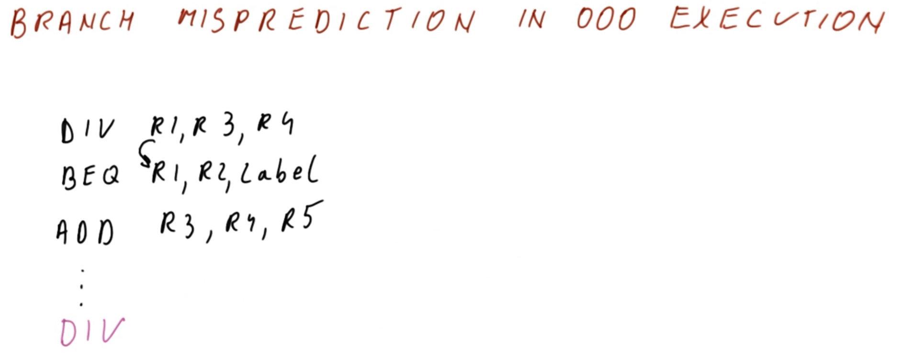
</center>

```mips
  DIV R1, R3, R4    # I1 - DIV requires 40 cycle
  BEQ R1, R2, Label # I2
  ADD R3, R4, R5    # I3
  ⋮
```

Consider the program shown above. Here, the branch `BEQ ...` in instruction `I2` *can* be predicted, however, it takes a long time (i.e., `40` cycles) to detect a misprediction. In the meantime, instruction `I3` is fetched as usual (i.e., the branch is taken), and intruction `I3` subsequently completes execution; in this case, register `R3`'s result is already written.

However, once a misprediction of the branch is detected (i.e., `40` to` 50` cycles later), the expected behavior of the program is such as if the instruction `I3` were never executed in the first place, but rather commence with fetching instructions beginning from `Label` (i.e., `DIV`). But that becomes impossible, because `R3` has already been updated by that point, and therefore instruction `I1` is using the unintended/incorrect value for its operand `R3`.

Observe that the issue described here is reminiscent of that described previously for exceptions (cf. Section 2): An instruction can complete execution and write its result to a register *before* preceding (program-order) instructions have been fully ***verified*** (and in the case of branching, before it is even determined whether or not the instruction should have actually been executed in the first place).

```mips
  DIV R1, R3, R4    # I1 - DIV requires 40 cycle
  BEQ R1, R2, Label # I2
  ADD R3, R4, R5    # I3
  ⋮
  DIV ...
```

A final issue arises due to so-called **phantom exceptions**. Consider the same program as shown above, with an additional downstream instruction `DIV ...` (still within the same branch). Assume there is a misprediction resulting in instruction `I3` *not* being executed (i.e., branch *not* taken). An issue arises if the downstream instruction `DIV ...` generates an exception, the the exception is indeed triggered irrespectively of the fact that it was not supposed to be executed (i.e., due to this branch not being taken). Therefore, this unnecessary exception-handling overhead will be incurred, without realizing it before its too late to detect in the normal program execution.

To reiterate, a ***key concern*** with exception handling is that there must be certainty that an exception is in fact necessary prior to executing it.

## 4. Correct Out-of-Order Execution

<center>
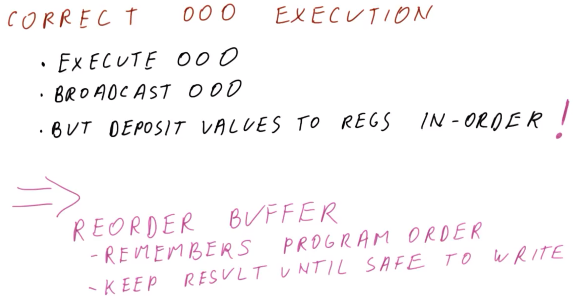
</center>

Now, consider how **out-of-order execution** *should* be performed appropriately.
  * The program itself should be executed ***out-of-order*** (i.e., in intended program-order).
  * Results should be broadcasted ***out-of-order***.
  * Values should be deposited to registers ***in-order***.
    * This is ***necessary***, because if register values are deposited out-of-order, then if it is subsequently discovered that one of the earlier instructions should *not* have been performed (e.g., it generates an exception, it has a branch misprediction, etc.), then this instruction has already deposited the value to the register previously when it should not have; therefore, by depositing in-order, this situation is prevented. By implication, by the time of depositing the value, all previous instructions have already finished successfully and there is no disruption to the program's semantics.
    * In Tomasulo's algorithm, values are *not* deposited to registers in-order, and therefore the aforementioned issues arise accordingly.

In order to resolve this issue, a structure called the **reorder buffer (ROB)** is used, characterized as follows:
  * Even after the instruction is issued, the ROB ***remembers*** the program-order.
  * The ROB ***retains*** the results of the instructions until they are safe to write to their respective registers.

Therefore, rather than simply writing to registers on an ad hoc basis immediately following production of the results/values, the results first enter the ROB. The ROB in turn is reviewed in-order, with results correspondingly deposited into their respective registers appropriately. Once the result is deposited from the ROB, only then is the instruction's execution completed.

## 5-6. ReOrder Buffer (ROB): Parts 1-2

### 5. Part 1

Now that we know that the reorder buffer (ROB) is *needed* in order to hold instructions until they are ready to execute in program-order, consider now how the ROB itself is structured.

<center>
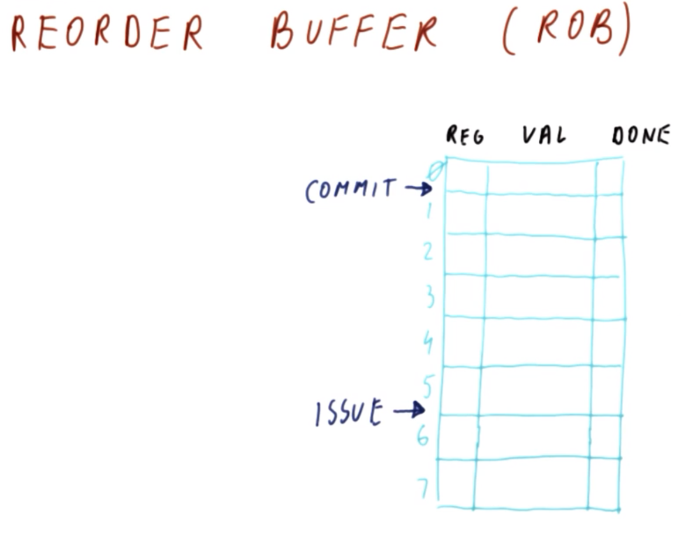
</center>

The ROB is a table of entries, as in the figure shown above. Each entry records at least three fields:
  * `VAL` → the value produced by the instruction (i.e., not the value written to the actual register, but rather upon completed execution of the instruction, the ROB's `VAL` is the target of the corresponding broadcast operation)
  * `DONE` → a bit to record whether or not the value `VAL` is valid
    * The ROB entry for the instruction is received *before* the result is actually written to the target register, therefore this must be tracked accordingly
  * `REG` → by the end of execution, the result itself must be written to an actual target register, which is recorded in this field correspondingly

The ROB in the figure shown above can hold up to eight instructions. Furthermore, the instructions are maintained in the ROB in ***program-order***. Correspondingly, two pointers are required:
  * `Issue` → indicates where the next instruction will be placed upon the next-occurring issue operation
  * `Commit` → what is the next-executable instruction in program-order 

Therefore, in the ROB in the figure shown above, the valid (i.e., in program-order) instructions are `I1` (oldest) through `I5` (newest), while newer instructions are added to `I6` and `I7`.

### 6. Part 2

Now that the structure of the reorder buffer (ROB) is more familiar, consider now how its actually ***used***.

<center>
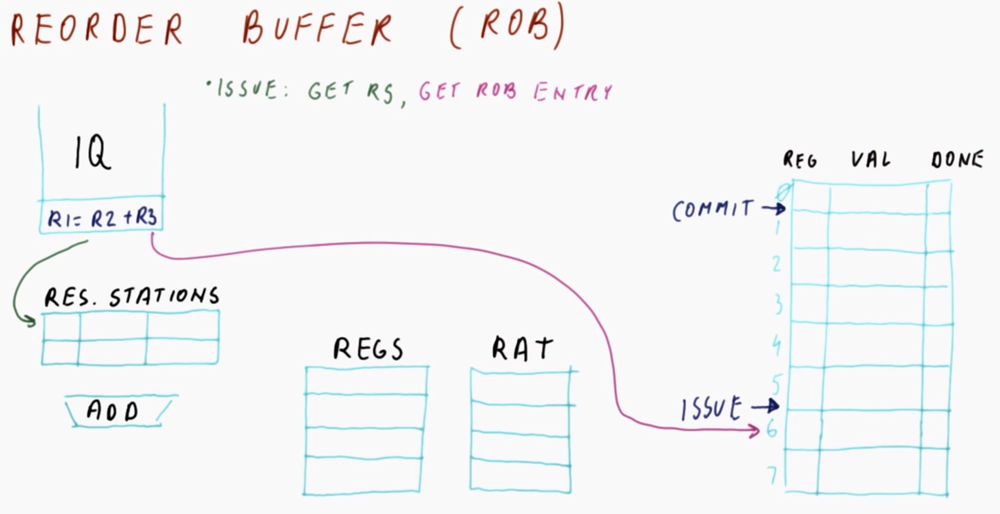
</center>

Consider the configuration as in the figure shown above. There is an instruction `R1 = R2 + R3` currently in the instruction queue (IQ). Here, we will analyze what occurs with this instruction, from its issuing from the IQ up through its eventual commit to the ROB (in such a processor having the ROB available).

On instruction ***issue***:
  * Retrieve an available reservation station (RS) and place the instruction into it (denoted by green arrow in the figure shown above)
  * The instruction is placed into the ROB, at the position of the pointer `Issue` (i.e., at index `6`)

<center>
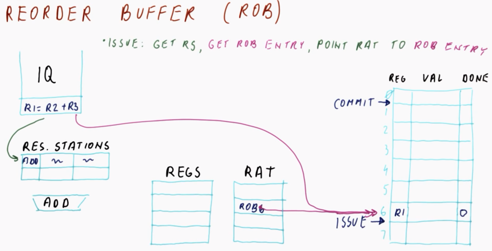
</center>

Upon placement of the instruction into the ROB, the pointer `Issue` is advanced by one position, as in the figure shown above.

Furthermore, as per Tomasulo's algorithm, the register allocation table (RAT) is updated accordingly with the entry for the instruction. However, rather than pointing to the RS itself, the RAT instead records the entry of the ROB `ROB6` (as denoted by purple arrow in the figure shown above).

<center>
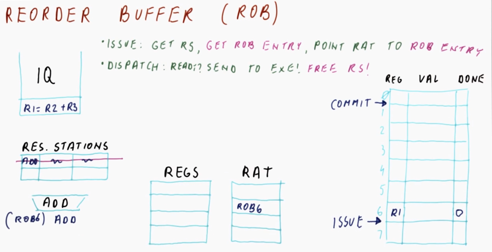
</center>

The RS is correspondingly populated with the values of its operand, including the entry `ROB6` via the ROB (as in the figure shown above). Furthermore, the entry `ROB6` records the target register `R1`, and designates the bit `Done` as `0` (i.e., instruction is still pending execution).

Now, the instruction `ADD` waits on its operands (i.e,. pending capture/latch, for subsequent dispatch to the execution unit `ADD`), as previously demonstrated with respect to Tomasulo's algorithm (cf. Lesson 7).

Eventually, once the instruction `ADD` is able to ***dispatch***, this occurs as follows:
  * Once the operands are ready, send to the execution unit (i.e., `ADD`)
  * Furthermore, free the RS upon dispatch
    * ***N.B.*** Previously, with Tomasulo's algorithm (i.e., without ROB), it was necessary to *wait* for the RS to release all the way until the instruction result is broadcasted (i.e., due to the RS serving as the tag for the result); however, this is obviated by the ROB entry itself, which instead provides this same feature, without otherwise encumbering the RS. In this manner, the RS is relieved of this additional tagging responsibility, now only serving in its primary role of capturing in-progress operands and determining when/which instructions to dispatch at the appropriate times.

Therefore, on instruction execuction via the execution unit `ADD`, the instruction `ADD` carries the tag `ROB6` for subsequent broadcast.

## 7. Free Reservation Stations Quiz and Answers

<center>

</center>

We have seen that the reorder buffer (ROB) changes when a reservation station (RS) is made available. Now, suppose an instruction *cannot* issue because there is no available RS for it. In which of the following configurations is the more likely? (Select one.)
  * Configuration 1 - `CORRECT`
    * No ROB available (but otherwise following Tomasulo's algorithm)
    * Two `ADD` and two `MUL` RSes available
  * Configuration 2
    * Has ROB available
    * Two `ADD` and two `MUL` RSes available

***Explanation***:

If the instruction cannot issue due to no available RSes, this means that all of the RSes are currently busy. Therefore, with a processor *lacking* a ROB, the RSes are retained from the time of instruction issue until the instruction broadcasts its result. Consequently, issuing of an instruction once the RSes are busy will necessitate waiting until the next instruction broadcast the result.

Conversely, in a ROB-based processor, all else equal (i.e., otherwise with the same number and types of RSes available), the RSes are occupied simultaneously with instruction issue, but then correspondingly freed simultaneously with dispatch of the instructions for execution (i.e., the RSes are freed relatively sooner compared to the non-ROB-based processor, all else equal). This in turn allows the next-available instruction to occupy the next-available RS.

## 8. ReOrder Buffer (ROB): Part 3

<center>
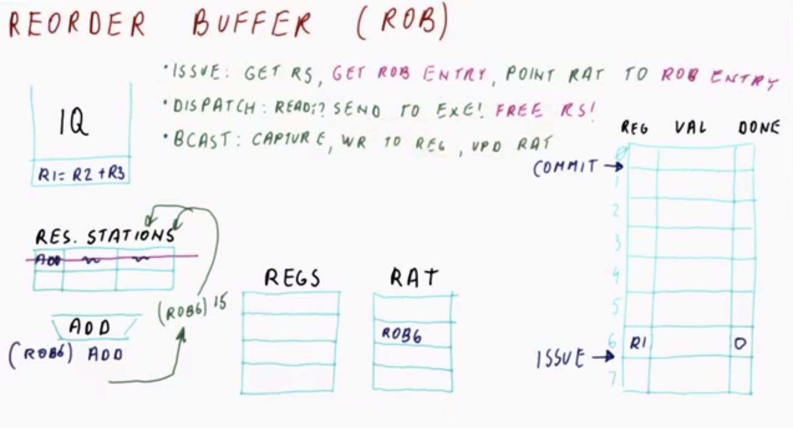
</center>

Eventually, the execution unit `ADD` produces a result which is subsequently ***broadcasted***, as in the figure shown above. This operation broadcast occurs exactly as described previously in Tomasulo's algorithm (cf. Lesson 7), except that the associated tag (i.e., `(ROB6)`) is that of the reorder buffer (ROB) entry, rather than of the reservation station (RS) (which has already been freed by this point).

Upon broadcasting of the tagged value (i.e., `(ROB6) 15`), it is fed back to the corresponding RSes (which they capture/latch), just as before with Tomasulo's algorithm.

*Without* the ROB, it would also be necessary to capture the result in a register (i.e., via REGS), and correspondingly updating (i.e., writing back to) the register allocation table (RAT) to point to this register.

<center>

</center>

Conversely, with a ROB, there is no such write back operation to REGS at this point yet, but rather the write occurs to the ROB (i.e., with a corresponding update to the DONE bit set to `1`), as in the figure shown above. Furthermore, the RAT retains the value of the ROB entry (i.e., rather than updating the RAT to point to REGS).

<center>
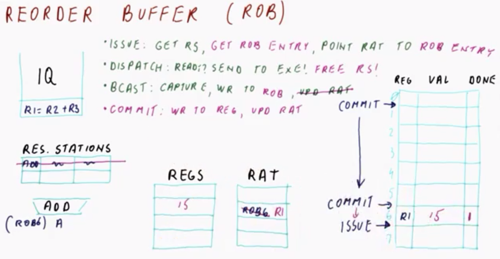
</center>

With the ROB, there is still a pending matter: While the result has been logged and the computation has been completed at this point, it has not yet been deposited into REGS; therefore, this is the last-remaining step, as in the figure shown above.

This additional step comprises the operation `Commit`. Here, all of the previous instructions are first committed, i.e., in each cycle, it is tested whether the next instruction at the pointer `Commit` (e.g., at index `1` of the ROB per the figure shown above) is completed, and if so, the pointer `Commit` is repositioned accordingly (i.e., at index `6`), and determining whether the instruction in question there is `Done` (i.e., it *is* in this case, via the corresponding bit set to `1`).

Upon this determination, the operation `Commit` itself involves taking the stored value (i.e., `15`) and writing it to the corresponding register in REGS (i.e., `R1`). Furthermore, the RAT is correspondingly updated to now reflect the updated entry in REGS (i.e., rather than pointing to the ROB); effectively, the process of updating the RAT is now moved from the operation `Broadcast` to that of `Commit`. Lastly, upon committing the instruction, the pointer `Commit` is updated the corresponding position (i.e., index `7`, as denoted by the purple arrow in the figure shown above).

That concludes the step-by-step examination of the ROB for one instruction. As is readily apparent, many of the same steps are reminiscent of those in Tomasulo's algorithm (cf. Lesson 7), with minor ***variations***, recapped as follows:
  * Pointing the RAT to the ROB entry rather than to the RS
  * Writing to the ROB on broadcast rather than directly to REGS
  * The RS is freed on dispatch rather than on broadcast
  * Additional operation `Commit` is included to coordinate between the ROB, RAT, and REGS

## 9. Hardware Organization with ROB

<center>
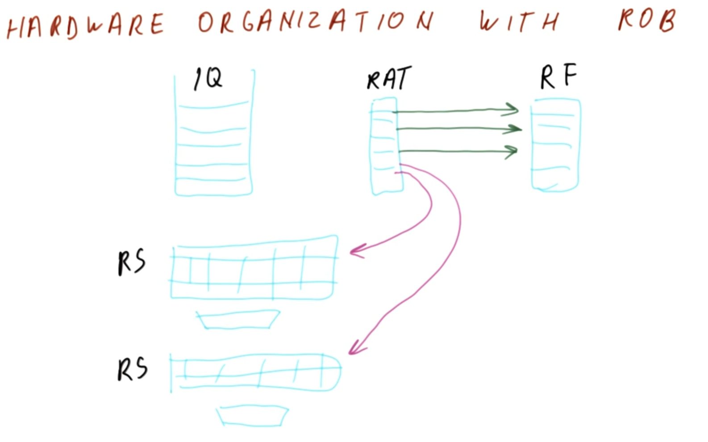
</center>

Consider now what ***hardware structures*** exist within the reorder buffer (ROB) itself, as in the figure shown above.
  * As before, there is an **instruction queue (IQ)**, from which instructions are dispatched into corresponding **reservation stations (RS)**
  * As before, there is a **register allocation table (RAT)**, which can point to either a **register file (RF)** or to a renamed/tagged version of the instruction within the RS (i.e., pending corresponding write to the RF)

<center>
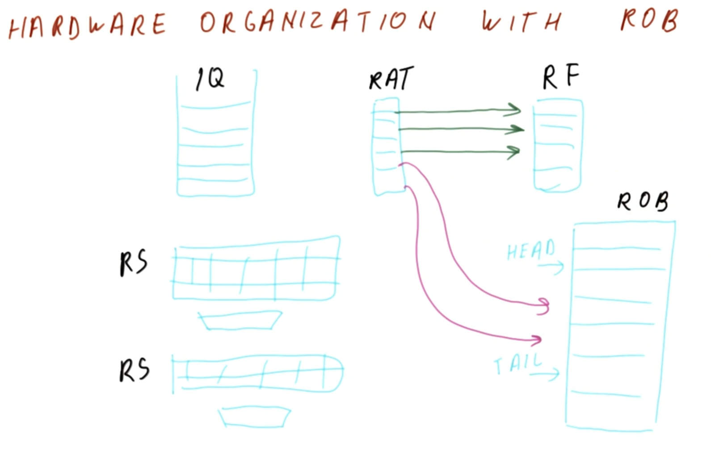
</center>

Following Tomasulo'a algorithm from before (cf. Lesson 7), RAT entries *not* pointing to the RF would otherwise point to the corresponding RSes; however, with ROB, there is the new additional structure of the **reorder buffer (ROB)** itself present, as in the figure shown above.
  * The pointers `HEAD` (where the next instruction that issues is stored) and `TAIL` (the last instruction designated for commit) delimit the range within the ROB corresponding to currently-executing instructions.
  * Furthermore, the RAT entries which are not currently pointing to the RF are instead correspondingly pointing to the entries in the ROB (as designated by purple arrows in the figure shown above) for the instructions that produce the corresponding values in question.

## 10. ROB Quiz and Answers

<center>
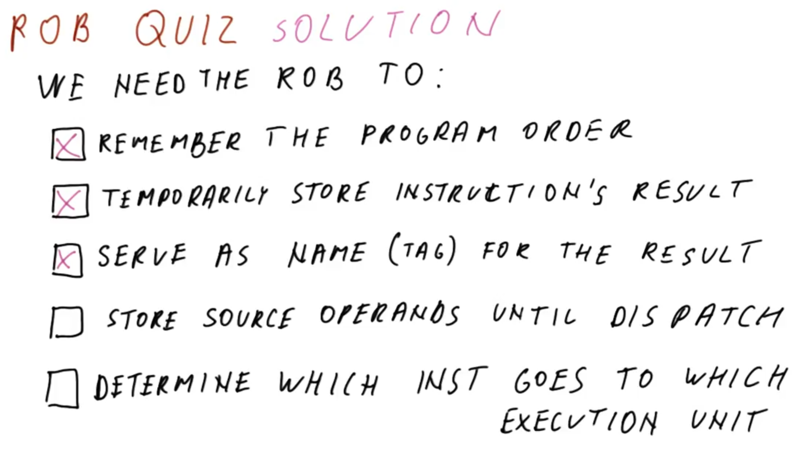
</center>

The reorder buffer (ROB) is required in order to (Select all applicable choices):
  * Remember the program order
    * `APPLIES` → The ROB is the only intermediary between issue (which is performed in program-order) and commit (which is also performed in program-order) which preserves program-order (whereas other intermediate steps between these generally occur out-of-order)
  * Temporarily store the instruction's result
    * `APPLIES` → The ROB stores the instruction's result between the time when the instruction is produced (i.e., when a broadcast occurs on the bust) and the time when the instruction's result is committed to the register file.
  * Serve as the name (tag) for the result
    * `APPLIES` → With Tomasulo's algorithm, the reservation station served this role; however, with a ROB configuration, the ROB entry is the one performing this role instead
  * Store source operands until dispatch
    * `DOES NOT APPLY` → This role is still performed by the reservation station, even with the ROB configuration
  * Determine which instruction goes to which execution unit
    * `DOES NOT APPLY` → The ROB is typically unified (i.e., *all* instructions go to the ROB, but they generally receive different/distinct entries in the ROB itself); therefore, it is evident/unambiguous which execution unit the instructions are directed to, because different execution units have distinct/dedicated reservation stations, and thus when an instruction is issued, it is sent to the *intended* set of reservations stations (which in turn dictate the corresponding execution unit)

## 11. Branch Misprediction Recovery

Recall that the reorder buffer (ROB) is necessary in order to have precise exceptions, as well as to facilitate recovery from branch mispredictions; the latter is the topic of section.

<center>
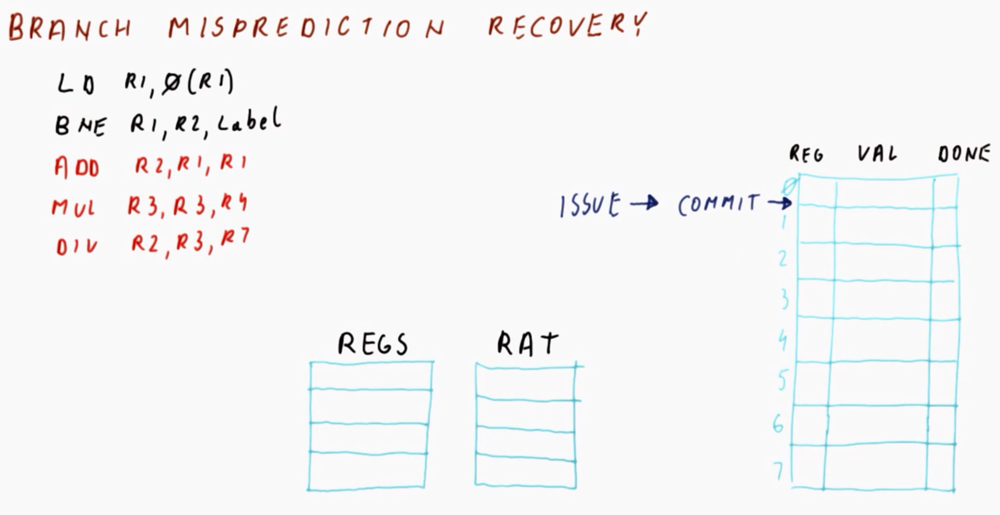
</center>

Consider the following program (as in the figure shown above, which includes the corresponding hardware configurations):
```mips
LD  R1, 0(R1)
BNE R1, R2, Label # <- Misprediction occurs via `R1 == R2` (branch not taken)
ADD R2, R1, R1    # <- Assume the program proceeds here due to misprediction
MUL R3, R3, R4
DIV R2, R3, R7
```

Assume that the program has a branch misprediction, whereby the subsequent instructions (denoted by red in the figure shown above) are executed despite an actual branching (i.e., to `Label`) being intended.

Immediately prior to the first instruction, the hardware state is as in the figure shown above, with the pointers `Issue` and `Commit` of the ROB being co-located. Furthermore, both the register file (REGS) and register allocation table (RAT) are empty.

<center>
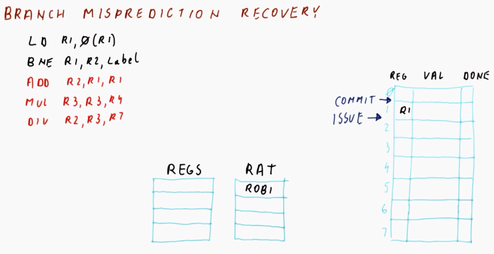
</center>

First, the instruction `LD` is issued, as in the figure shown above.
  * In the ROB, the pointer `Issue` is advanced by a position, and the result `R1` for this instruction is placed in the corresponding ROB entry
  * The RAT is updated with the corresponding ROB entry `ROB1`

<center>

</center>

Next, the instruction `BNE` is issued, as in the figure shown above.
  * In the ROB, the pointer `Issue` is advanced by a position, and since there is no output/result from this instruction, the ROB records a null entry (denoted by `/` in the figure shown above)
  * There is no corresponding update in the RAT (i.e., no pending result to record)

<center>
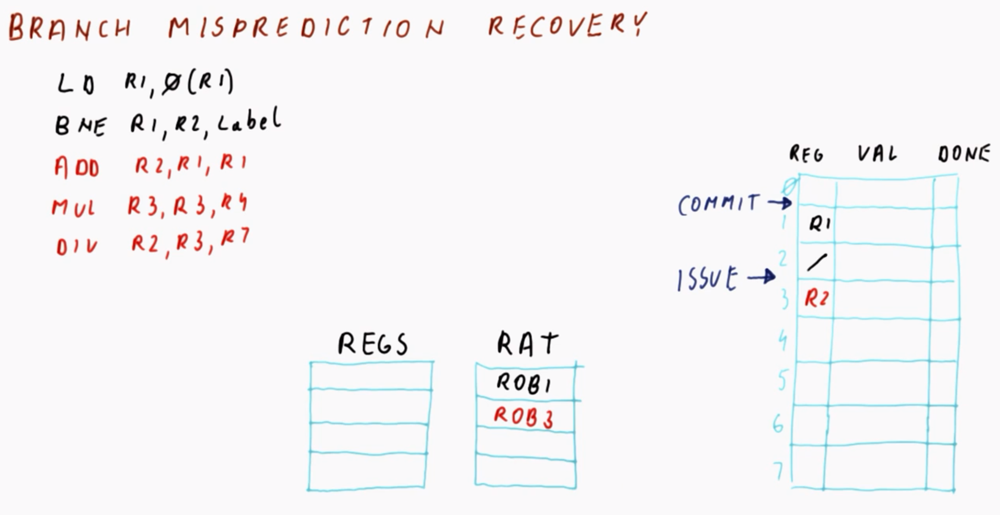
</center>

Next, instructions which should *not* have been issued (i.e., due to branch misprediction) are issued, starting with `ADD`, as in the figure shown above.
  * The result `R2` for this instruction is placed in the corresponding ROB entry
  * The RAT is updated with the corresponding ROB entry `ROB3`

<center>
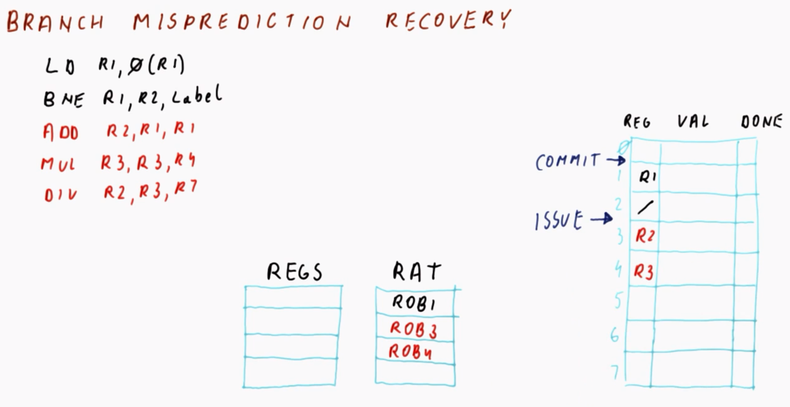
</center>

Next, the instruction `MUL` is issued, as in the figure shown above.
  * The result `R3` for this instruction is placed in the corresponding ROB entry
  * The RAT is updated with the corresponding ROB entry `ROB4`

<center>
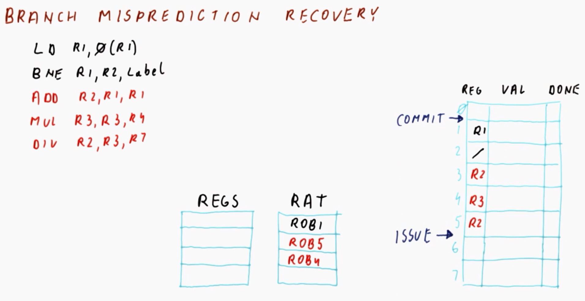
</center>

Next, the instruction `DIV` is issued, as in the figure shown above.
  *  In the ROB, the pointer `Issue` is advanced by a position, and the result `R2` for this instruction is placed in the corresponding ROB entry
  * The RAT is updated with the corresponding ROB entry `ROB5`, which overwrites the previous entry for `R2` (cf. instruction `ADD`)

<center>
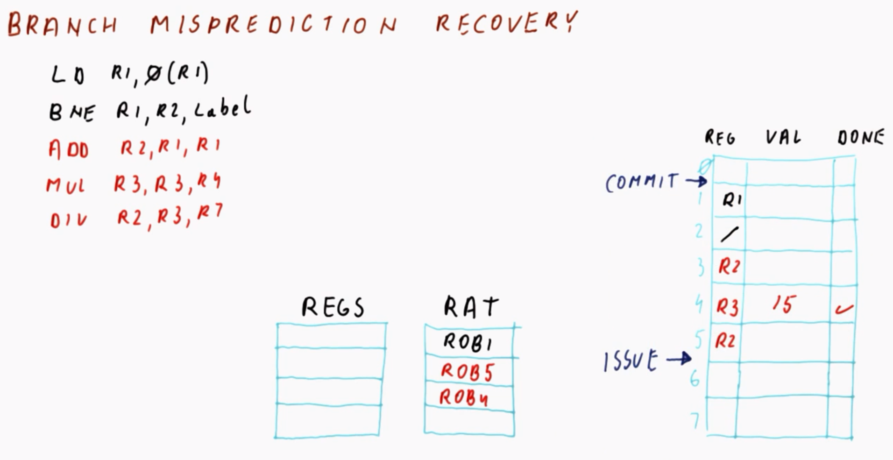
</center>

Now, suppose that the initial instruction `LD` takes a long time to produce a value (e.g., due to a cache miss). The branch (i.e., via instruction `BNE`) cannot complete until the `LD` is completed, and correspondingly the mispredicted instruction `ADD` is similarly "bottlenecked" by `LD`; however, the instruction `MUL` *can* complete because its operands (`R3` and `R4`) are not produced by any of the aforementioned upstream instructions.

Therefore, the instruction `MUL` might produce a value (e.g., `15`, as in the figure shown above), which it *is* otherwise capable of writing to REGS; however, once it is discovered that the branch is mispredicted, this would necessitate somehow "undoing" this operation `MUL`. Correspondingly, in a ROB-based processor, this result is instead recorded in the ROB entry, with a corresponding setting of the `Done` bit.

<center>
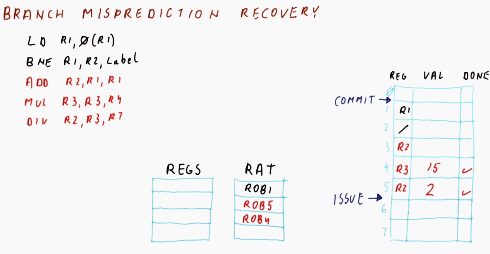
</center>

Similarly, the instruction `DIV` may eventually proceed, generating a corresponding result (e.g., `2`), which it records in the ROB accordingly (as in the figure shown above). As with the instruction `MUL`, this obviates an unintended "premature write" to REGS, given that this instruction results from a misprediction.

<center>
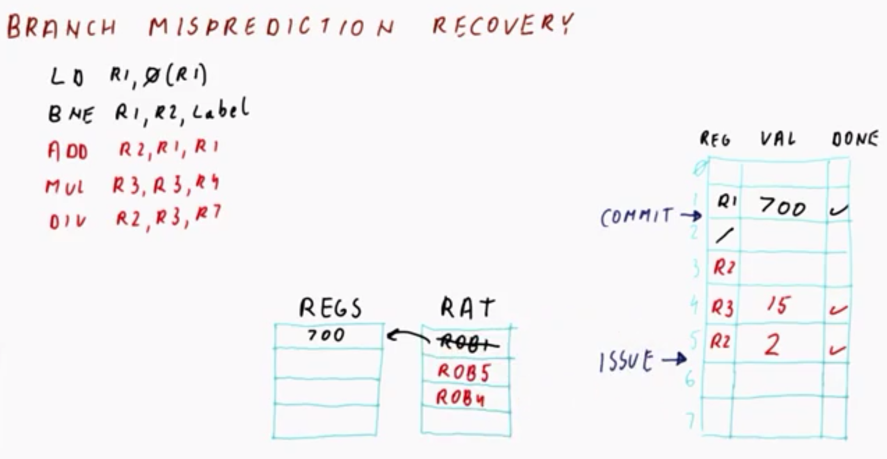
</center>

Eventually, the instruction `LD` completes, yielding a result (i.e., `700`), as in the figure shown above. Correspondingly, the value is recorded in the ROB and the bit `Done` is set accordingly. Consequently, the pointer `Commit` is advanced, and the result is written to REGS, thereby updating the RAT accordingly (i.e., to point to the REGS entry).

<center>
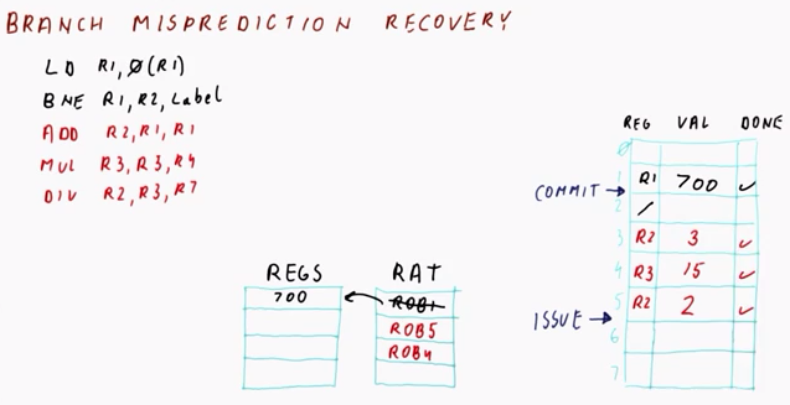
</center>

Now, suppose that the instruction `BNE` takes longer to produce a result than is required for `ADD`, as in the figure shown above. Consequently, instruction `ADD` produces a result (i.e., `3`) and updates the ROB entry and corresponding `Done` bit accordingly. However, here, this result is *not* written to REGS (nor would this have been done if following Tomasulo's algorithm without a ROB), due to the renaming of `R2` in RAT (i.e., as `ROB5` in the ROB configuration, or equivalent tagging in non-ROB-based Tomasulo's algorithm).

Eventually, the branch is resolved, and it is determined that a misprediction has occurred, as in the figure shown above. Correspondingly, the instruction `BNE` is marked as `Done` in the ROB, with the program proceeding with fetching instructions correctly in program-order (i.e., taking the corresponding branch, as designated by `Label`).

<center>
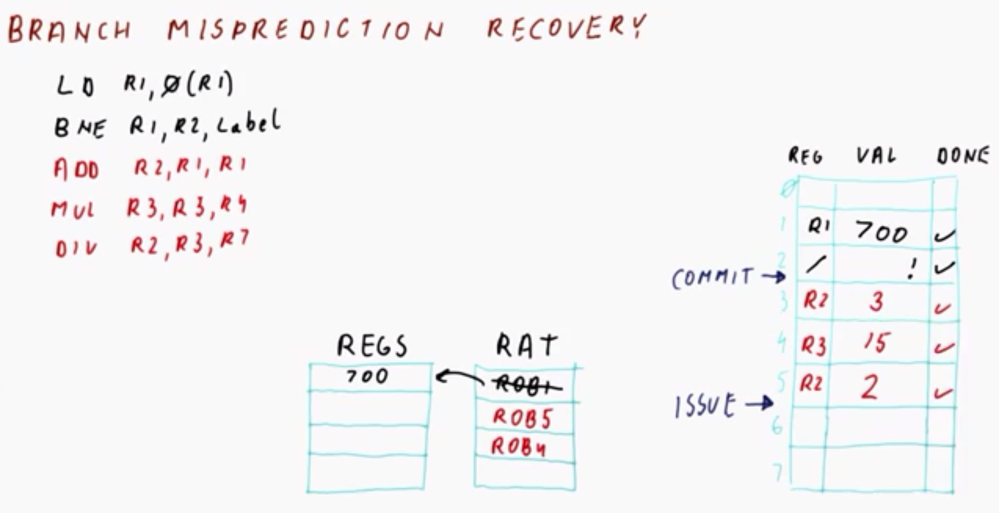
</center>

However, the question still remains: How do we remove the incorrect instructions (i.e., those produced from the branch misprediction, as denoted by red in the figure shown above)?

To address this matter, the ROB entry is annotated accordingly (i.e., via `!`, as in the figure shown above). Furthermore, rather than "fixing" the in-progress entries in the ROB, we proceed by simply fetching these "wrong" instructions, as it is still uncertain how to eliminate these instructions until the pointer `Commit` reaches the branch point.

Finally, upon committing the instruction `BNE`, it is determined that the wrong instructions have been fetched (i.e., the program counter [PC] that *should* have been created by the branch differs from the PC that was actually used, resulting in the misprediction). Consequently, the pointer `Commit` is advanced (as in the figure shown above), which does *not* result in any writing to REGS, however, due to the misprediction, the **recovery** is commenced *prior* to restarting the fetch from the correct place (i.e., in a manner ensuring in program-order).

<center>
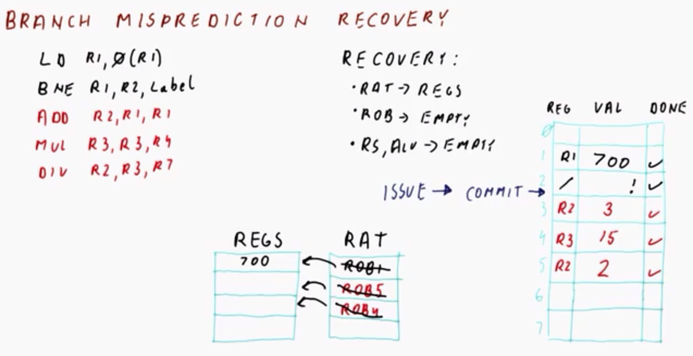
</center>

To perform this **recovery** operation, in a ROB-based processor, at the point at which the operation `Commit` has reached the branch instruction (i.e., `BNE`), REGS contains *exactly* the values that are required immediately prior to entering the branch instruction (as in the figure shown above), i.e., all of the corresponding instructions prior to the branch have been committed accordingly (with their updates reflected in REGS), while the same has *not* been done for the mispredicted instructions yet by this point.

Therefore, to ***undo*** the incorrect/mispredicted instructions, there are two necessary resolution measures.
  * Reverse the issuing of these instructions by simply making the ROB empty at these points (i.e., the pointer `Issue` is moved to the location of pointer `Commit`, as in the figure shown above), with corresponding undoing of the `Done` bits to invalidate these entries in the ROB.
  * Furthermore, REGS is updated accordingly with the preexisting values in the RAT. The ROB entries in the RAT are invalidated accordingly, with the RAT entries instead pointing directly to REGS (recall that the state of REGS immediately prior to entering the branch is *correct*).

Effectively, the current state is such that the mispredicted instructions have never occurred in the first place, and the program can now proceed with fetching instructions correctly (i.e., in program-order).

As is readily apparent, with a ROB-based processor, out-of-order instruction execution can be achieved in such a manner that correct in-program-order execution is still maintained.

Overall, the **recovery** in a ROB-based processor consists of the following features:
  * Making the RAT entries point to the corresponding REGS entries, thereby erasing/invalidating the renaming in the RAT resulting from mispredicted/incorrect instructions
  * Emptying out the mispredicted/incorrect ROB entries in the ROB after committing (i.e., via corresponding relocation of the pointer `Issue`)
  * Emptying out mispredicted/incorrect instructions in their respective reservation stations and correspondingly preventing execution units (e.g., `ALU`, etc.) from broadcasting results in the future

## 12. ROB and Exceptions

Now, consider how a reorder buffer (ROB) fixes exception-handling issues.

<center>
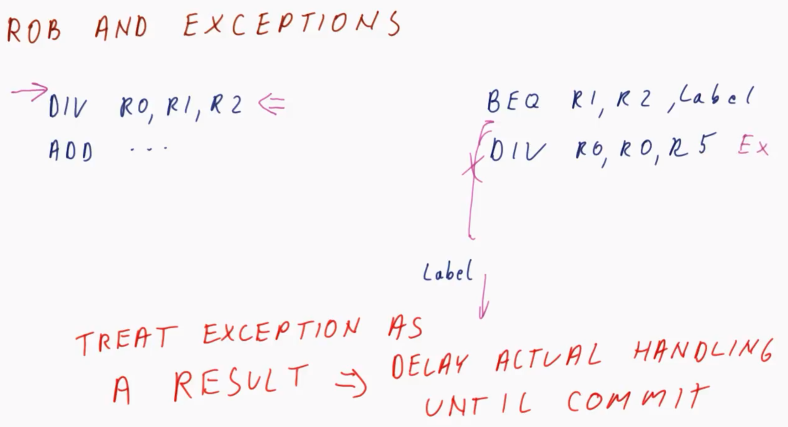
</center>

```mips
DIV R0, R1, R2 # `R2` is `0`, resulting in divide-by-zero exception
ADD ...
```

One such exception-handling **issue** arises in a program such as that shown above. Here, the instruction `DIV` can be delayed (i.e., the result `R0` is produced later), whereas the instruction `ADD` can be executed relatively quickly. Recall (cf. Lesson 7) that via Tomasulo's algorithm, the instruction `ADD` would deposit the result to the destination register long before the instruction `DIV` determines that its operand `R2` is `0`, resulting in a divide-by-zero exception; therefore, the exception handler should have been invoked, without ever executing the subsequent instruction `ADD` in the first place.

The ROB assists in this situation by treating the exception itself as any other result. Thus, when it is determined that `R2` is `0`, then--rather than producing a result for `R0`--the corresponding ROB entry is noted as an "exception" rather, than the (incomputable) result.

Furthermore, once the instruction `DIV` reaches the pointer `Commit`, at that point, the instruction `ADD` has not yet been committed, whereas all instructions preceding `DIV` have. Therefore, now, a corresponding flush of these errant instructions (i.e., `DIV` and `ADD`) can be performed, with a corresponding jump to the **exception handler** (denoted by purple arrow in the figure shown above), which now occurs effectively "immediately prior" to execution of the instruction `DIV`.

Similarly for a load instruction resulting ni a page fault, an analogous chain of events would unfold, i.e., upon reaching of the commit on (attempted) page load (resulting in a page-fault exception handler), everything that has been committed up to that point in the program will be "restored" accordingly. Upon successfully resolving the page load from disk, the program can jump back into the program and resume execution accordingly as normal.

```mips
  BEQ R1, R2, Label
  DIV R0, R0, R5    # `R5` is `0`, resulting in divide-by-zero
  ⋮
Label:
```

Another such exception-handling **issue** arises in a program such as that shown above. Here, there is a **phantom exception**, whereby if the branch via `BEQ` is *not* taken and the subsequent instruction `DIV` generates an exception (i.e., via operand `R5`, which results in a divide-by-zero error), then a situation can arise whereby the exception via `DIV` is generated *prior* to resolution of the branch `BEQ`. Therefore, upon finally resolving the branch, it is "too late" to catch the fact that an exception has already occurred with the subsequent instruction `DIV`.

To mitigate this issue, the ROB will designate the instruction `DIV` as an "exception." As the pointer `Commit` reaches the branch point (i.e., either at `BEQ` or immediately prior to it, depending on the particular branch misprediction strategy used), it will be determined that the branch has been mispredicted, and that the actual intenion of the program is to jump to `Label` instead. Consequently, neither the instruction `DIV` itself nor its downstream (i.e., branch not-taken) instructions are committed, and their executions are correspondingly "canceled," and therefore the exception via `DIV` itself is never generated in the first place (i.e., because the instruction `DIV` is never executed).

Therefore, the ***key point*** with respect to exception handling is that the ROB simply treats the exception itself as a(n invalid) ***result***, with a corresponding ***delay*** in the actual handling of the exception itself until the exception-generating instruction commits (at which point, the exact "resume point" for the exception handler is already determined). Furthermore, this approach mitigates any possible phantom exceptions resulting from branching.

## 13. Outside View of "Executed"

<center>
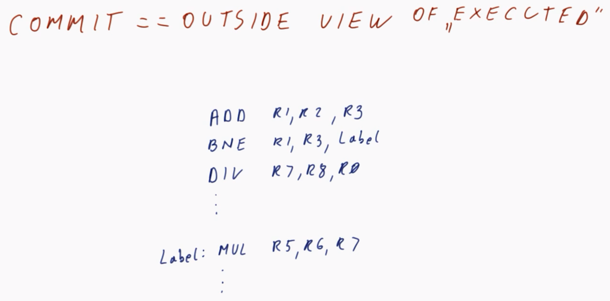
</center>

```mips
  ADD R1, R2, R3
  BNE R1, R3, Label
  DIV R7, R8, R0    # Misprediction in `BNE` goes here, rather than to `Label`
  ⋮
Label:
  MUL R5, R6, R7
```

Consider the program shown above. Here, a misprediction in the branch instruction `BNE` results in proceeding to the next instruction `DIV`, rather than jumping to `Label`/`MUL` as intended.


<center>

</center>

<center>
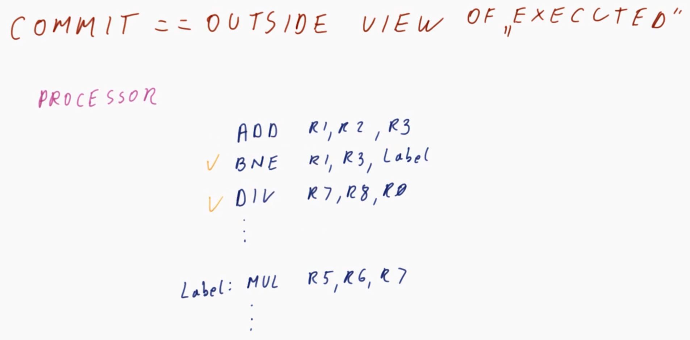
</center>

<center>
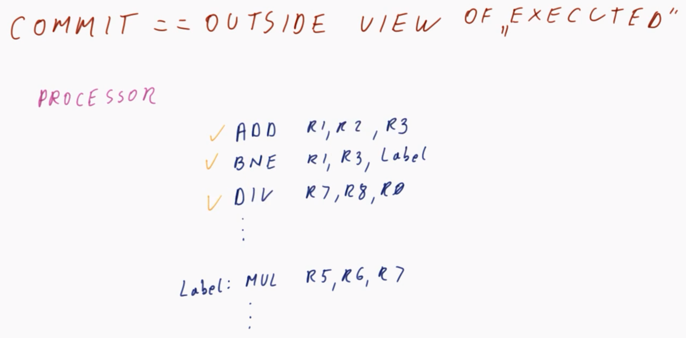
</center>

As far as the ***processor*** is concerned, the sequence of steps is as in the figures shown above.


<center>

</center>

<center>
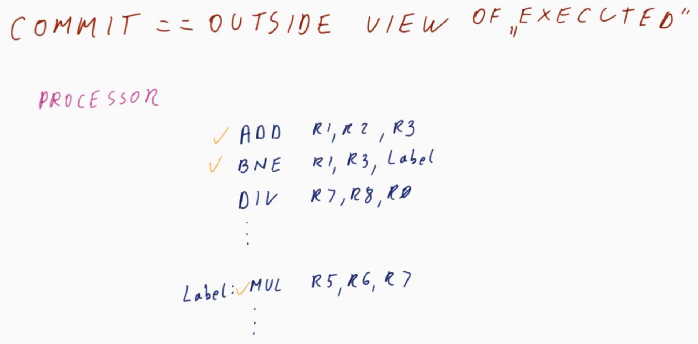
</center>

Upon resolving the branch, the instruction `DIV` is "undone," and the corresponding sequence is as in the figures shown above.

<center>
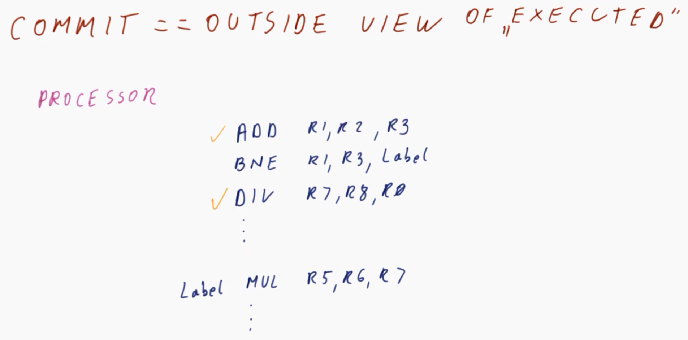
</center>

At some later point in time, the processor may eventually see the instruction `DIV` as being fully executed but not committed, as in the figure shown above.


<center>
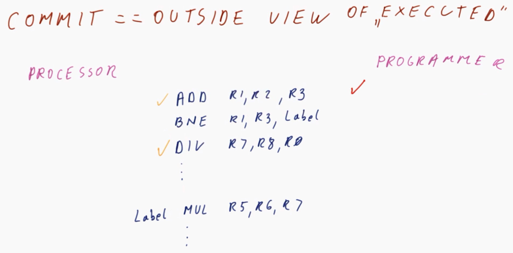
</center>

Concurrently, at this same later time point, the ***programmer*** observes/perceives the committed instruction `ADD`, as in the figure shown above. Until the processor finishes executing the instruction `BNE`, the programmer effectively does not "see" the downstream instructions `BNE` or (already executed) `DIV`.

<center>
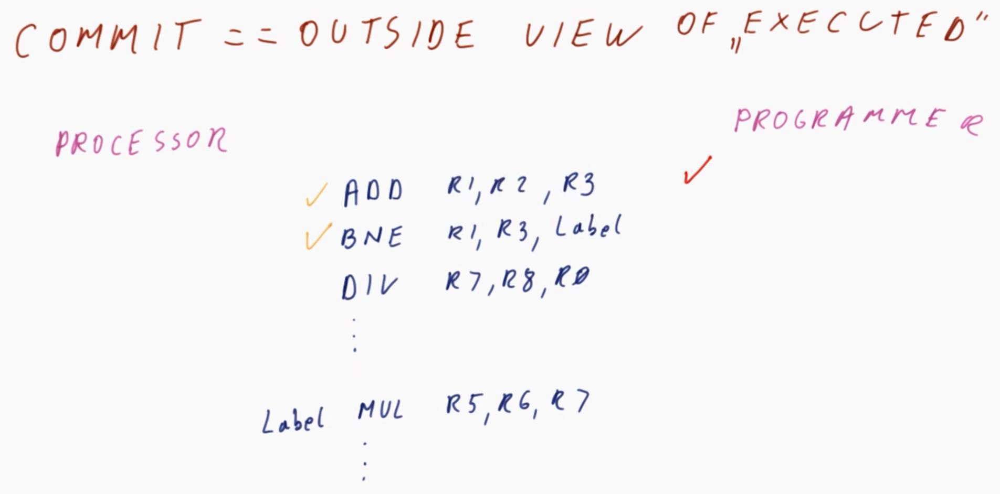
</center>


<center>
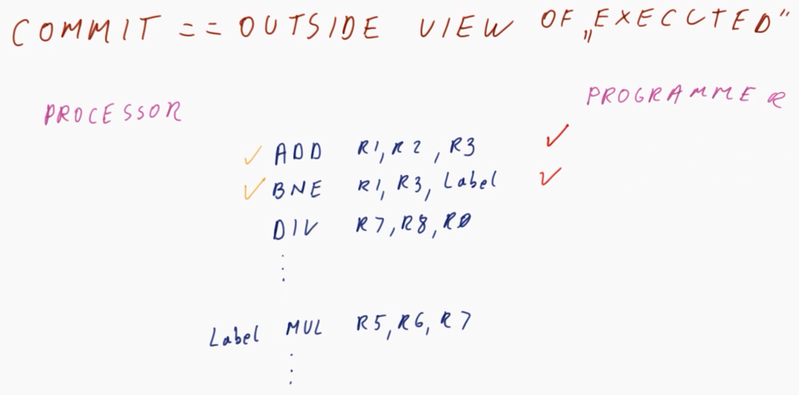
</center>

By the time the instruction `BNE` completes execution, from the perspective of the program, the execution of the subsequent instruction `DIV` is not "seen" (i.e., it is removed via the reorder buffer [ROB]), as in the figures shown above.

<center>
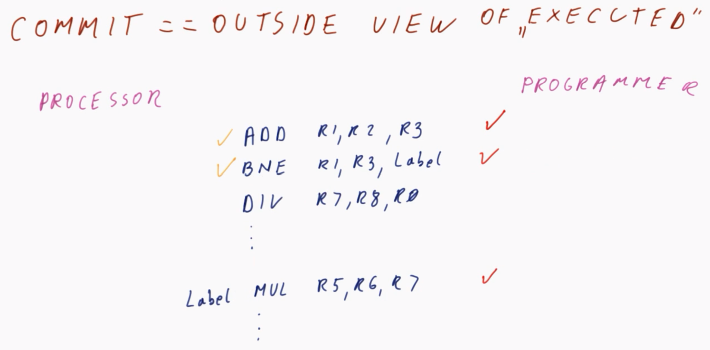
</center>

Subsequently, the program will commence with the processor fetching from `Label`/`MUL`, which is the next "visible" instruction to the programmer, as in the figure shown above. Effectively, the programmer never "sees" execution of any wrong-path instructions; furthermore, on occurrence of exceptions, the program similarly never "sees" any instructions besides those which should have been executed.

Therefore, the operation `Commit` effectively denotes "***official execution***" of the program, insofar as the programmer's perspective is concerned (which in general can differ from the *actual* execution occurring immediately prior to broadcasting of the result; thus, the internal state of the processor may not be reflected exactly "as-is" to the programmer).

## 14. Exceptions with ReOrder Buffer (ROB) Quiz and Answers

<center>
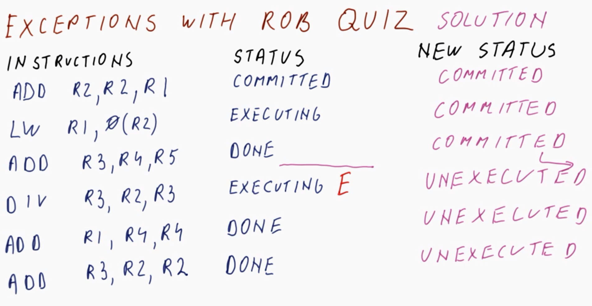
</center>

| Instruction (in program-order) | Status | New Status |
|:-|:-:|:-:|
| `ADD R2, R2, R1` | Committed | |
| `LW  R1, 0(R2) ` | Executing | |
| `ADD R3, R4, R5` | Done | |
| `DIV R3, R2, R3` | Executing | |
| `ADD R1, R4, R4` | Done | |
| `ADD R3, R2, R2` | Done | |

Consider the program in the table shown above. Here, the instructions statuses are as follows:
  * ***Committed*** → The instruction has exited the pipeline and its result has been committed from the reorder buffer (ROB) to the register file (REGS)
  * ***Executing*** → The instruction has left the reservation station (RS) and is commencing execution in the execution unit, however, its result has not yet been broadcasted on the bus (i.e., it has not yet *committed*)
  * ***Done*** → The instruction has arrived at the RS, subsequently left the RS, computed its result, deposited its result somewhere else, but the result is not yet *committed* (i.e., the instruction has not yet left the processor)

The current statuses of the program's instructions are as given in the table shown above. Consider the situation where an **exception** (denoted `E` in the figure shown above) occurs in the instruction `DIV ...` (e.g., a divide-by-zero exception via operand `R3`). What is the *new* status of these instructions after the exception has been handled (i.e., the point immediately prior to which the program can now proceed onto the exception handler)?

***Answer and Explanation***:

| Instruction (in program-order) | Status | New Status |
|:-|:-:|:-:|
| `ADD R2, R2, R1` | Committed | Committed |
| `LW  R1, 0(R2) ` | Executing | Committed |
| `ADD R3, R4, R5` | Done | Committed |
| `DIV R3, R2, R3` | Executing | Unexecuted |
| `ADD R1, R4, R4` | Done | Unexecuted |
| `ADD R3, R2, R2` | Done | Unexecuted |

At the point in which the exception occurs (i.e., with respect to instruction `DIV`), what should occur by this point is that the upstream instructions have already finished executing, with the subsequent instructions not executing (as far as the programmer is concerned).

Because the programmer only "sees" the program state up to the point of the most recent commit, then the fact that the downstream `ADD` instructions are already Done means that these must now be "undone" (i.e., the instructions starting with `DIV` onwards must be flushed from the pipeline), with the processor state correspondingly restored to the correct state immediately prior to encountering the exception (i.e., as expected in program-order).

To perform this "rollback," since the first instruction `ADD` is already committed (which cannot be undone at this point), the subsequent two instructions (immediately prior to `DIV`) must first be committed in order to proceed to the exception itself (***N.B.*** since the third instruction is already Done in the initial state, the change to commit is relatively trivial, however, the instruction `LW` may be slightly "bottlenecking" before proceeding through all necessary Commit statuses).

At this point, the instruction `DIV` now carries the exception condition into the status Commit itself; therefore, upon attempting to commit the instruction, it is determined that this cannot be done, and the exception is consequently generated. Therefore, now, the processor ceases committing further and instead flushes all subsequent instructions from the pipeline, resulting in these latter instructions being effectively Unexecuted (i.e., insofar as the programmer is concerned, these instructions were "never" fetched in the first place). Now, the program can proceed transfer of control to the exception handler (as denoted by the purple right-pointing arrow in the figure shown above).

## 15. Register Allocation Table (RAT) Updates on Commit

<center>
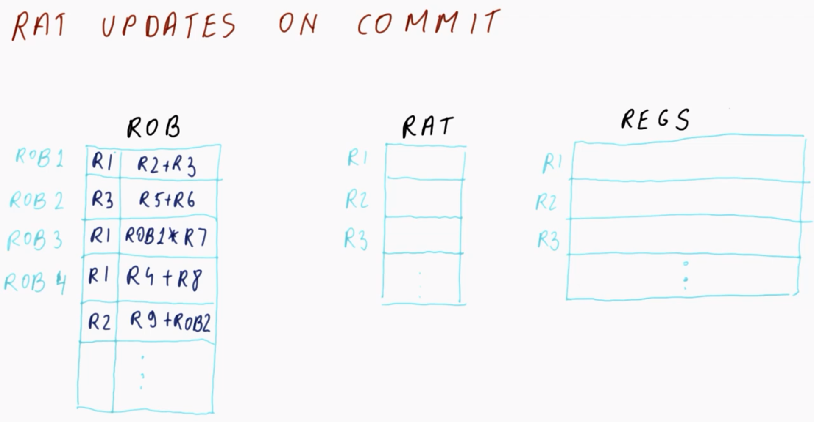
</center>

COnsider the configuration as in the figure shown above. The reorder buffer (ROB) currently holds the instructions as shown above. (***N.B.*** In the third instruction denoted `ROB3`, the evaluation `ROB1 * R7` is using the rename tag from entry `ROB1`; and similarly in the last instruction via `ROB2`, i.e., `R9 + ROB2`.)

Now, assume that all of these instructions have finished execution and placed these results accordingly in the ROB; it is now time to commit them.

<center>
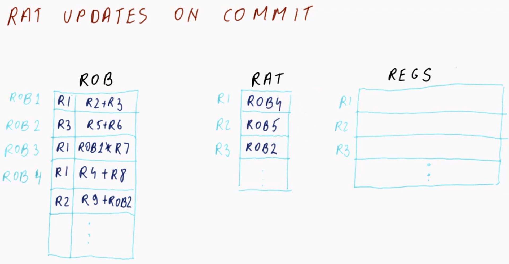
</center>

The next instruction to be committed is `ROB1`, as in the figure shown above. At this point, the entries in the register allocation table (RAT) are as shown above.
  * `R1` points to `ROB4`, because the entry `ROB4` is the *latest* to write to register `R1` as far as the issued instructions are concerned
  * `R2` points to `ROB5`, since there were no other renames of `R1` prior to that
  * `R3` points to `ROB2`, since that was the most recent rename

Furthermore, assume there are some existing (indeterminate) values in the register file (REGS), which will now be overwritten.
  * Recall that with Tomasulo's algorithm without ROB (cf. Lesson 7), when finishing instructions out-of-order (with no corresponding commit at the end), as the result is broadcasted, it is necessary to examine the RAT for the result.
    * If the RAT indicates that the result is produced by the instruction (i.e., via renamed tag), then the REGS would be updated accordingly with this entry.
    * Conversely, if the intended result is *not* that which is broadcasted, then REGS is correspondingly *not* updated (i.e., the result should be read directly from REGS instead).
  * Conversely, with respect to the ROB, there is an additional step involving the commit; in particular, commits are performed ***in program-order***. Each time an instruction is committed, its result *is* deposited into REGS irrespectively of the RAT entry.

<center>
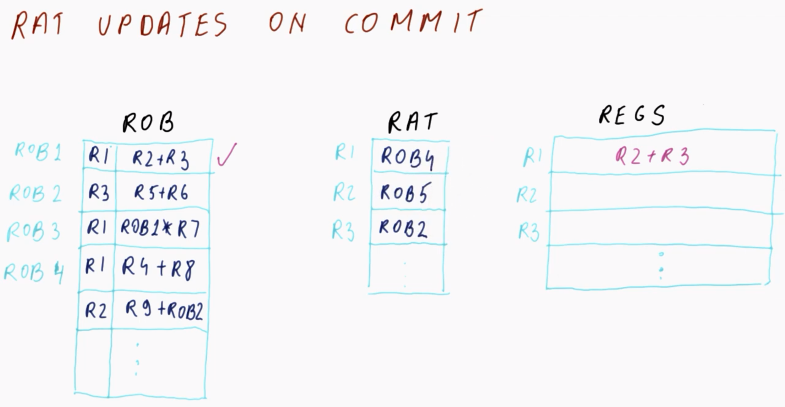
</center>

Therefore, with respect to instruction `ROB1`, upon committing, the result (i.e., `R2 + R3`) is placed directly in REGS, as in the figure shown above. Even though the RAT entry for `R1` suggests `ROB4`, this is not necessarily the latest (i.e., *committed*) value of register `R1`.

Furthermore, at this point, it is also determined whether or not the RAT will in fact be updated. Here, it is verified that indeed `ROB4` is the most recently renamed version of register `R1` immediately following committing of instruction `ROB1`.

<center>
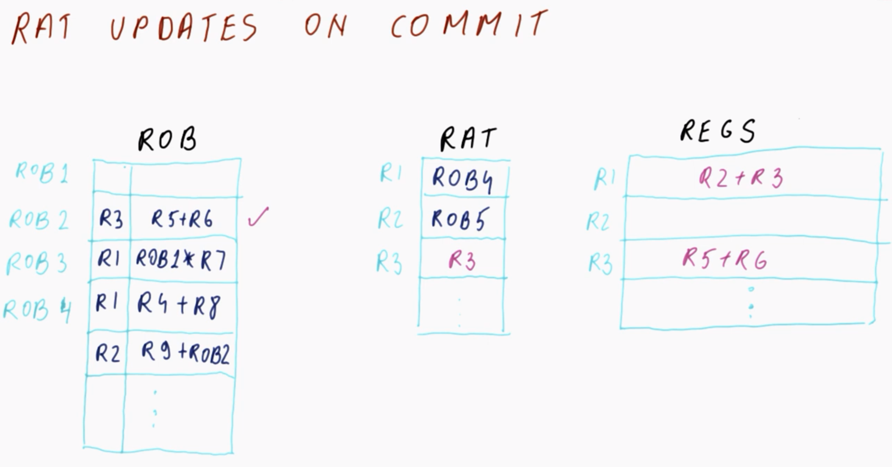
</center>

The entry for `ROB1` is now freed, and the next instruction `ROB2` is processed, as in the figure shown above. On commit of `ROB2`, the result of `ROB2` (i.e., `R5 + R6`) is written directly to REGS, irrespectively of the corresponding entry in RAT for register `R3`.

Upon inspecting RAT, the latest entry for `R3` is `ROB2`, which is now pointing to a stale entry in the ROB, and therefore the RAT is updated accordingly to point directly to `R3` in REGS.

<center>
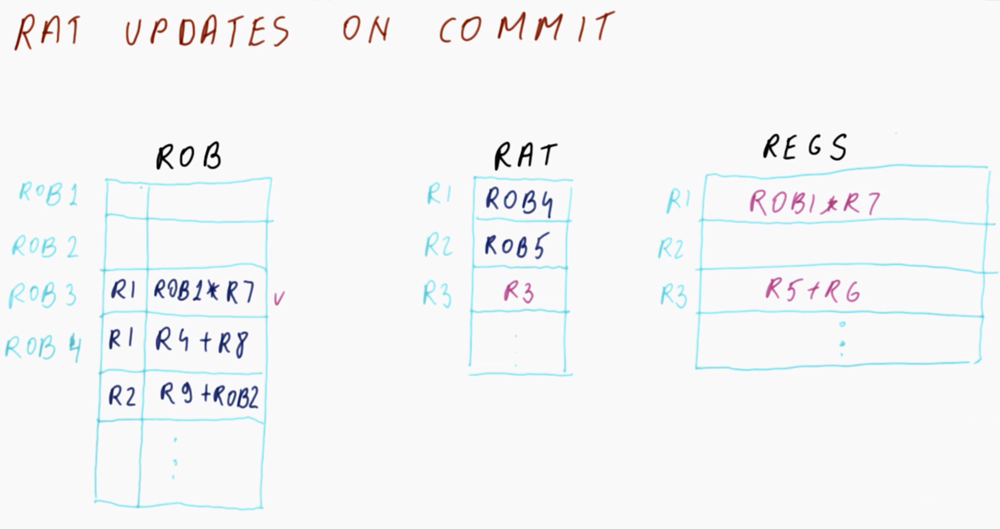
</center>

The entry for `ROB2` is now freed, and the next instruction `ROB3` is processed, as in the figure shown above. On commit of `ROB3`, the result of `ROB3` (i.e., `ROB1 * R7`) is written directly to REGS, irrespectively of the corresponding entry in RAT for register `R1`.

Upon inspecting the RAT, it is verified that indeed `ROB4` is the most recently renamed version of register `R1` immediately following committing of instruction `ROB3`.

<center>

</center>

At this point, it is worthwhile to pause and examine the current configuration/state, as in the figure shown above. In particularly, why are we proceeding in such a manner, whereby values are being deposited directly to REGS, knowing that they will be soon overwritten?

The reason for this is that because--at any given point in time--if it is necessary to stop there and handle an exception or other related errant behavior, then all that is necessary to do at that point is to simply flush the ROB (i.e., invalidate the existing ROB entries) and then simply reset the RAT to point directly to REGS (i.e., for all constituent registers); in its current state, the REGS is synchronized/consistent with the committed-to point of the ROB (denoted by purple arrow in the figure shown above), i.e., still executing in program-order. In particular, note that such a "rollback"/"reset" would ***not*** be feasible if such "redundant" work were not being performed (i.e., the REGS would be inconsistent with program-order).

Therefore, in general, REGS is ***always*** consistent/up-to-date as of the commit point when following this approach; accordingly, the process can be "stopped abruptly" at any given point as necessary (e.g., to handle an exception), with a corresponding redirect to REGS for the "true state" of the program at that point.

<center>
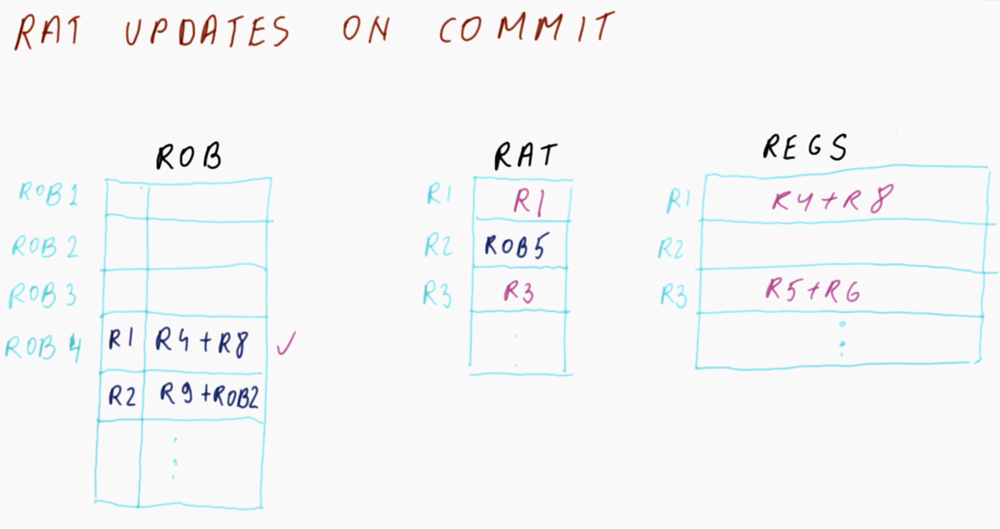
</center>

Proceeding back through the program, the entry for `ROB3` is now freed, and the next instruction `ROB4` is processed, as in the figure shown above. On commit of `ROB4`, the result of `ROB4` (i.e., `R4 + R8`) is written directly to REGS, irrespectively of the corresponding entry in RAT for register `R1`.

Upon inspecting RAT, the latest entry for `R1` is `ROB4`, which is now pointing to a stale entry in the ROB, and therefore the RAT is updated accordingly to point directly to `R1` in REGS.

<center>
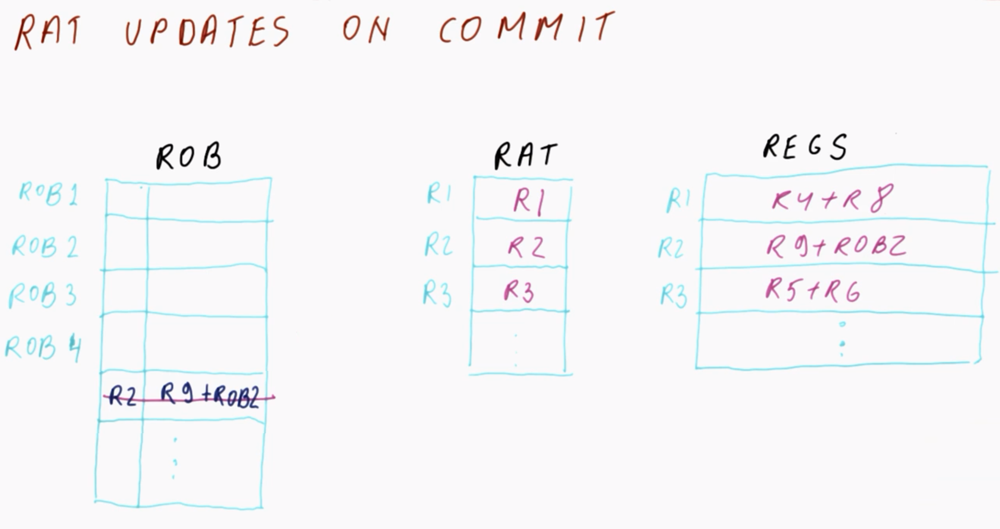
</center>

The entry for `ROB4` is now freed, and the next instruction `ROB5` is processed, as in the figure shown above. On commit of `ROB5`, the result of `ROB5` (i.e., `R9 + ROB2`) is written directly to REGS, irrespectively of the corresponding entry in RAT for register `R2`.

Upon inspecting RAT, the latest entry for `R2` is `ROB5`, which is now pointing to a stale entry in the ROB, and therefore the RAT is updated accordingly to point directly to `R2` in REGS.

At this point, with an empty ROB, the state of RAT is as expected, i.e., all registers pointing to corresponding entries in REGS, as of the most recent commit via ROB.

When proceeding in this manner of analysis, be mindful of the fact that the results are copied ***directly*** from ROB to REGS, irrespectively of the RAT entry, however, the RAT is correspondingly updated accordingly on commit (but only if there is a necessary rename from the ROB entry to the register/REGS entry; otherwise, an existing ROB entry in RAT *is* the intended entry, i.e., one which is pending an upcoming commit).

## 16-21. ReOrder Buffer (ROB) Example

### 16. Cycles 1-2

<center>
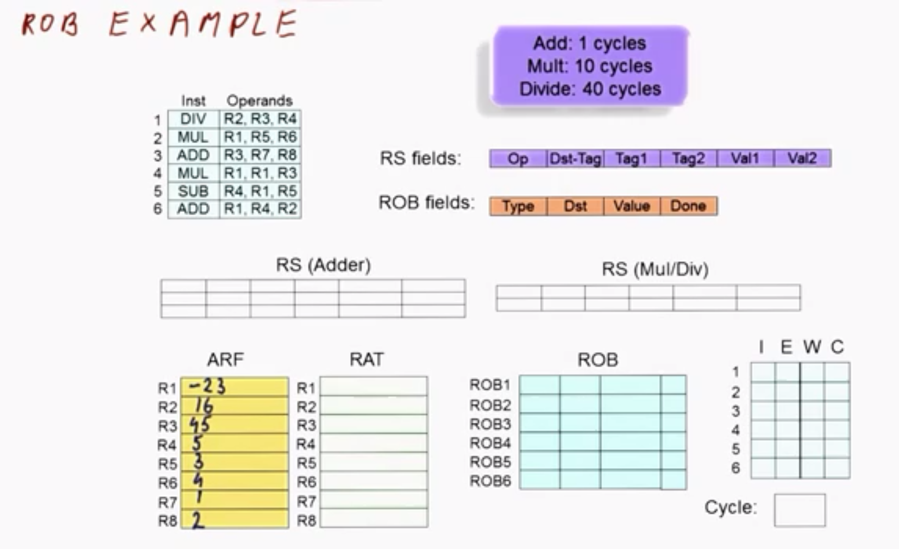
</center>

Consider the system having the configuration as in the figure shown above. In the current state (i.e., immediately prior to issuing the first instruction `I1`), both the register allocation table (RAT) and reorder buffer (ROB) are empty, implying the current register values are those of the architecture register file (ARF). Furthermore, note the following execution cycle requirements:
  * Instruction `ADD` requires `1` cycle to execute
  * Instruction `MUL` requires `10` cycles to execute
  * Instruction `DIV` requires `40` cycles to execute

***N.B.*** Note the formats of the fields per the legend in the figure shown above (i.e., register station [RS] fields in purple, ROB fields in orange).

<center>
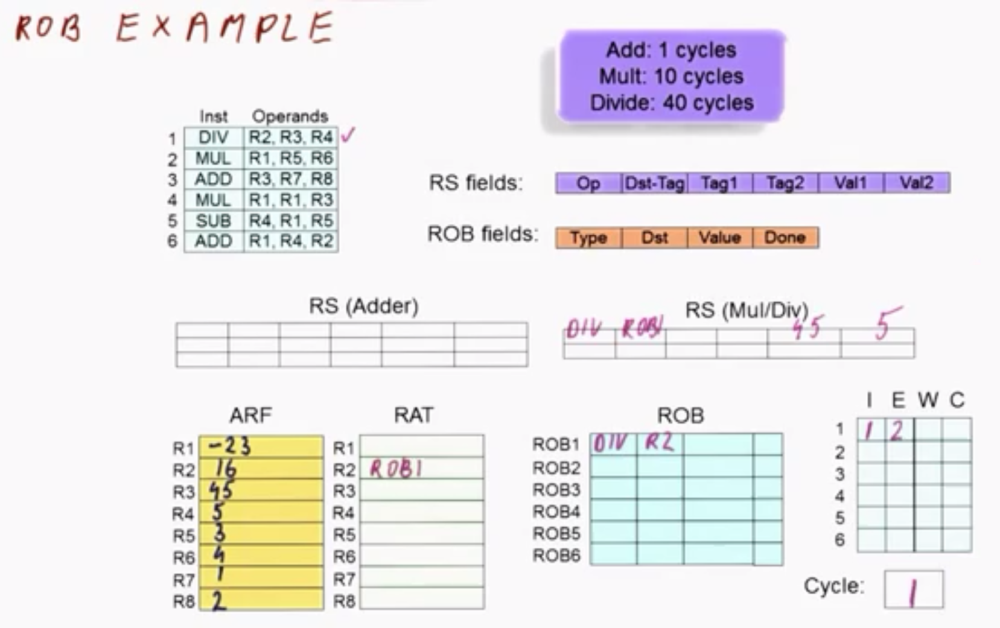
</center>

Cycle `C1` is depicted in the figure shown above.

The instruction `I1` is issued. To do this, there must be an available RS and corresponding ROB entry; both are readily available at this point, and populated accordingly.
  * The RS receives the destination tag (Dst-Tag) `ROB1`, which is the corresponding ROB entry (i.e., it is *not* the RS tag itself; this allows the RS to be freed relatively quickly upon dispatch).
  * The operands `R3` and `R4` are retrieved directly from ARF, with the corresponding values (`45` and `5`, respectively) recorded in the respective RS fields.
  * The entry in RAT is updated to `ROB1` for register `R2`.

| Instruction | Issue | Execute | Write Result | Commit |
|:-:|:-:|:-:|:-:|:-:|
| `I1` | `C1` | `C2` | | |

Since this processor is capable of dispatching in the same cycle, instruction `I1` is issued in cycle `C1`, with corresponding execution in the subsequent cycle `C2` (i.e., due to both operands having determinate values by this point already), as depicted in the table shown above.

<center>
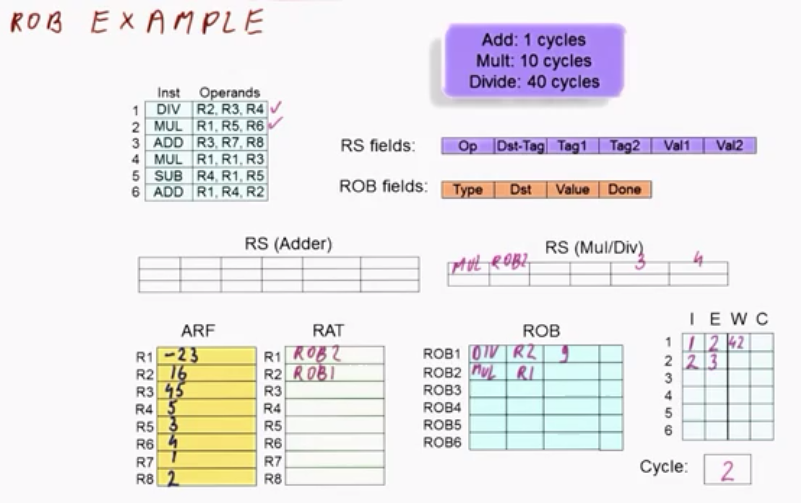
</center>

Cycle `C2` is depicted in the figure shown above.

| Instruction | Issue | Execute | Write Result | Commit |
|:-:|:-:|:-:|:-:|:-:|
| `I1` | `C1` | `C2` | `C42` | |

The RS is freed, and the result of instruction `I1` (i.e., `9`) is recorded in the ROB for reference (technically, the execution has not yet completed). The result will eventually be written in cycle `C42` (instruction `DIV` requires `40` cycles to execute), as in the table shown above.

At this point, there is nothing to dispatch (i.e., the RSes are empty), but the next instruction `I2` can be issued, and there is a correspondingly available RS for this purpose.
  * The RS receives the destination tag (Dst-Tag) `ROB2`, which is the corresponding ROB entry.
  * The operands `R5` and `R6` are retrieved directly from ARF, with the corresponding values (`3` and `4`, respectively) recorded in the respective RS fields.
  * The entry in RAT is updated to `ROB2` for register `R1`.

| Instruction | Issue | Execute | Write Result | Commit |
|:-:|:-:|:-:|:-:|:-:|
| `I1` | `C1` | `C2` | `C42` | |
| `I2` | `C2` | `C3` | `C13` | |

Since this processor is capable of dispatching in the same cycle, instruction `I2` is issued in cycle `C2`, with corresponding execution in the subsequent cycle `C3` (i.e., due to both operands having determinate values by this point already), as depicted in the table shown above. Furthermore, the RS is freed, and the result will eventually be written in cycle `C13` (instruction `MUL` requires `10` cycles to execute).

### 17. Cycles 3-4

<center>

</center>

Cycle `C3` is depicted in the figure shown above.

At this point, there is nothing to dispatch (i.e., the RSes are empty), but the next instruction `I3` can be issued, and there is a correspondingly available RS for this purpose.
  * The RS receives the destination tag (Dst-Tag) `ROB3`, which is the corresponding ROB entry.
  * The operands `R7` and `R8` are retrieved directly from ARF, with the corresponding values (`1` and `2`, respectively) recorded in the respective RS fields.
  * The entry in RAT is updated to `ROB3` for register `R3`.

| Instruction | Issue | Execute | Write Result | Commit |
|:-:|:-:|:-:|:-:|:-:|
| `I1` | `C1` | `C2` | `C42` | |
| `I2` | `C2` | `C3` | `C13` | |
| `I3` | `C3` | `C4` | `C5` | |

Since this processor is capable of dispatching in the same cycle, instruction `I3` is issued in cycle `C3`, with corresponding execution in the subsequent cycle `C4` (i.e., due to both operands having determinate values by this point already), as depicted in the table shown above. Furthermore, the RS is freed, and the result will eventually be written in cycle `C5` (instruction `ADD` requires `1` cycle to execute).

<center>
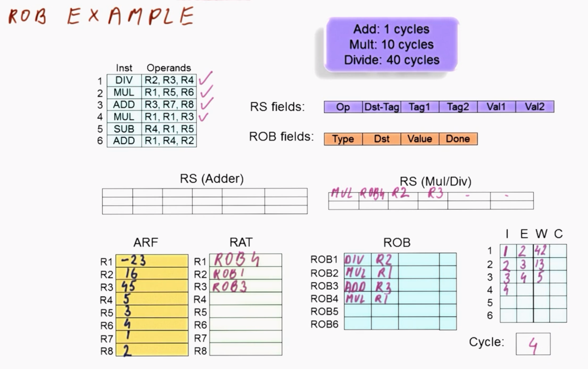
</center>

Cycle `C4` is depicted in the figure shown above.

At this point, there is nothing to dispatch (i.e., the RSes are empty), but the next instruction `I4` can be issued, and there is a correspondingly available RS for this purpose.
  * The RS receives the destination tag (Dst-Tag) `ROB4`, which is the corresponding ROB entry.
  * The operands `R1` and `R3` are retrieved from the ROB as per the RAT, with the corresponding ROB tags (`ROB2` and `ROB3`, respectively) recorded in the respective RS fields.
    * ***N.B.*** In the figure shown above, the entries in the RS are abbreviated as `ROB2` and `ROB3` (*not* registers `R2` and `R3`, respectively).
  * The entry in RAT is updated to `ROB4` for register `R1`.
    * ***N.B.*** Beware that when updating the RAT in this manner, ensure to thoroughly review where the entry is being used elsewhere in the system before proceeding (e.g., in this case, `R1` is *not* a pending operand in any outstanding RSes). If an input register were to get overwritten inadvertently while conducting such analysis, this could invalidate an in-progress instruction; therefore, the current values in the RAT must be used *first* before renaming/overwriting the corresponding RAT entry (otherwise, the instruction will be "waiting for its own result," which is impossible). In this case, `ROB4` is indeed the latest occurring version of register `R1`, since the upstsream instruction `I2` (via `ROB2`) has indeed already entered execution with the appropriate operand value of `R1`.

| Instruction | Issue | Execute | Write Result | Commit |
|:-:|:-:|:-:|:-:|:-:|
| `I1` | `C1` | `C2` | `C42` | |
| `I2` | `C2` | `C3` | `C13` | |
| `I3` | `C3` | `C4` | `C5` | |
| `I4` | `C4` | | | |

Instruction `I4` is *not* capable of executing yet, because both of its operands are still pending results at this point, as in the table shown above. 

### 18. Cycles 5-6

<center>

</center>

Cycle `C5` is depicted in the figure shown above.

At this point, the next instruction `I5` can be issued, and there is a correspondingly available RS for this purpose.
  * The RS receives the destination tag (Dst-Tag) `ROB5`, which is the corresponding ROB entry.
  * The operand `R1` is retrieved from the ROB as per the RAT  with the corresponding ROB tags (`ROB4`) while the operand `R5` has its value (i.e., `3`) is taken directly from ARF; both operands are recorded accordingly in the respective RS fields.
  * The entry in RAT is updated to `ROB5` for register `R4`.

| Instruction | Issue | Execute | Write Result | Commit |
|:-:|:-:|:-:|:-:|:-:|
| `I1` | `C1` | `C2` | `C42` | |
| `I2` | `C2` | `C3` | `C13` | |
| `I3` | `C3` | `C4` | `C5` | |
| `I4` | `C4` | | | |
| `I5` | `C5` | | | |

Instruction `I5` is *not* capable of executing yet, because one of its operands is still pending results at this point, as in the table shown above (similarly, instruction `I4` is pending values for its operands, thereby precluding its execution as well).

Furthermore, instruction `I3` is now ready to write its result (i.e., via `ROB3`) in cycle `C5`. The `Done` bit is updated correspondingly in the ROB (as denoted by the purple checkmark in the figure shown above), and this value is also broadcasted, with a corresponding capture occurring in the RS of instruction `I4`. Note that the RAT is not yet updated at this point (this will not occur until the commit).

<center>
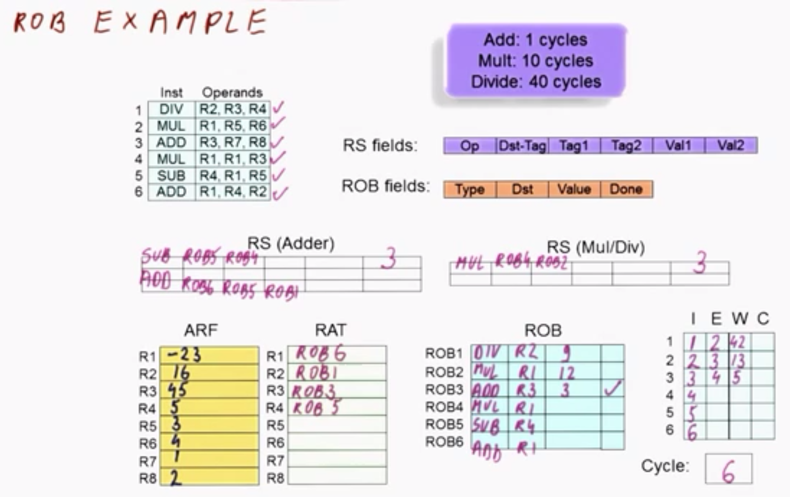
</center>

Cycle `C6` is depicted in the figure shown above.

At this point, the next instruction `I6` can be issued, and there is a correspondingly available RS for this purpose.
  * The RS receives the destination tag (Dst-Tag) `ROB6`, which is the corresponding ROB entry.
  * The operands `R4` and `R2` are retrieved from the ROB as per the RAT, with the corresponding ROB tags (`ROB5` and `ROB1`, respectively) recorded in the respective RS fields.
  * The entry in RAT is updated to `ROB6` for register `R1`.

| Instruction | Issue | Execute | Write Result | Commit |
|:-:|:-:|:-:|:-:|:-:|
| `I1` | `C1` | `C2` | `C42` | |
| `I2` | `C2` | `C3` | `C13` | |
| `I3` | `C3` | `C4` | `C5` | |
| `I4` | `C4` | | | |
| `I5` | `C5` | | | |
| `I6` | `C6` | | | |

Instruction `I6` is *not* capable of executing yet, because both of its operands are still pending results at this point, as in the table shown above (similarly, instructions `I4` and `I5` are pending values for their operands, thereby precluding their execution as well).

Furthermore, note that at this point, while `I3` has completed execution and writing/broadcasting its result, it cannot yet commit its result, because it is still pending the writing of results and subsequent commits of its two upstream instructions (`I1` and `I2`).

By cycle `C7`, there are no more instructions to issue. However, none of the in-progress instructions can execute yet, as they are pending the broadcast of dependent results. Therefore, based on this "gridlocked" situation, the next "eventful" cycle will not be until cycle `C13`, as described next.

### 19. Cycles 13-24

<center>
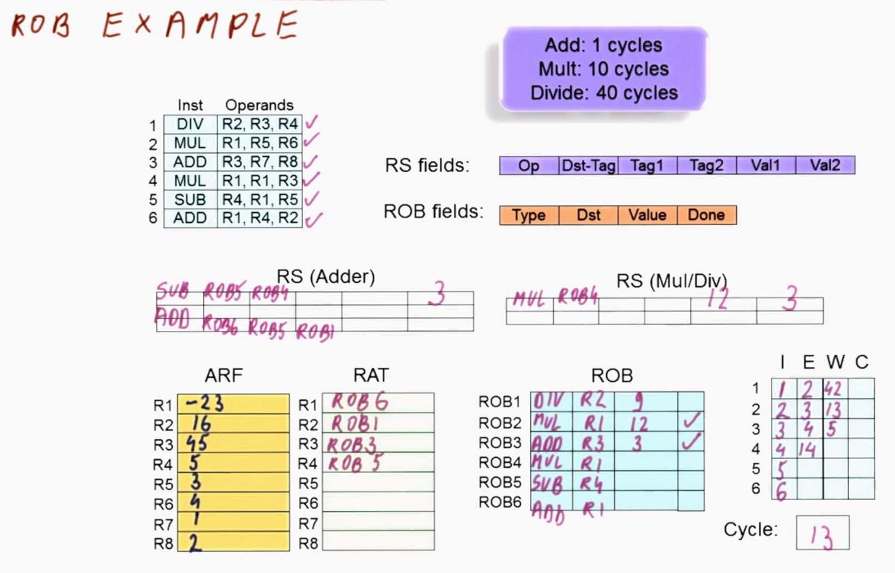
</center>

Cycle `C13` is depicted in the figure shown above.

At this point, instruction `I2` finally writes its result and broadcasts. The corresponding `Done` bit is set in the ROB for entry `ROB2`, with its value (i.e., `12`) broadcasted accordingly.

| Instruction | Issue | Execute | Write Result | Commit |
|:-:|:-:|:-:|:-:|:-:|
| `I1` | `C1` | `C2` | `C42` | |
| `I2` | `C2` | `C3` | `C13` | |
| `I3` | `C3` | `C4` | `C5` | |
| `I4` | `C4` | `C14` | | |
| `I5` | `C5` | | | |
| `I6` | `C6` | | | |

Instruction `I4` captures the broadcast value (i.e., `12`, via `ROB2`), and now has sufficient operands information/values in order to dispatch accordingly, and is able to dispatch and execute in the subsequent cycle `C14`, as indicated in the table shown above. Furthermore, the RS previously occupied by `I4` is freed accordingly.

<center>
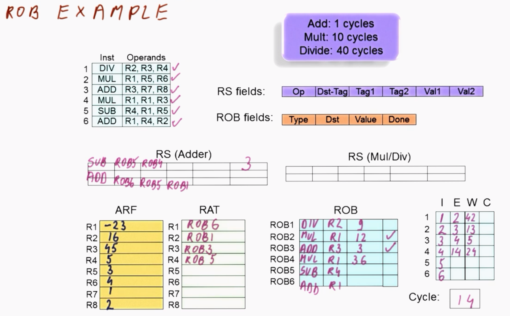
</center>

Cycle `C14` is depicted in the figure shown above.

| Instruction | Issue | Execute | Write Result | Commit |
|:-:|:-:|:-:|:-:|:-:|
| `I1` | `C1` | `C2` | `C42` | |
| `I2` | `C2` | `C3` | `C13` | |
| `I3` | `C3` | `C4` | `C5` | |
| `I4` | `C4` | `C14` | `C24` | |
| `I5` | `C5` | | | |
| `I6` | `C6` | | | |

At this point, instruction `I4` commences execution and continues to do so until cycle `C24` (via `10` cycle requirement for instruction `MUL`).

Furthermore, instructions `I5` and `I6` are still pending their operands in this cycle, and continue to do so from cycles `C15` through `C23`.

<center>

</center>

Cycle `C24` is depicted in the figure shown above.

At this point, instruction `I4` finally writes its result and broadcasts. The corresponding `Done` bit is set in the ROB for entry `ROB4`, with its value (i.e., `36`) broadcasted accordingly.

| Instruction | Issue | Execute | Write Result | Commit |
|:-:|:-:|:-:|:-:|:-:|
| `I1` | `C1` | `C2` | `C42` | |
| `I2` | `C2` | `C3` | `C13` | |
| `I3` | `C3` | `C4` | `C5` | |
| `I4` | `C4` | `C14` | `C24` | |
| `I5` | `C5` | `C25` | | |
| `I6` | `C6` | | | |

Instruction `I5` captures the broadcast value (i.e., `36`, via `ROB4`), and now has sufficient operands information/values in order to dispatch accordingly, and is able to dispatch and execute in the subsequent cycle `C25`, as indicated in the table shown above. Furthermore, the RS previously occupied by `I5` is freed accordingly.

Note that at this point, none of the instructions with their `Done` bit set (i.e., instructions `I2` through `I4`) can commit yet, as they are all pending a commit by the upstream instruction `I1`. Accordingly, no commit will occur until this "bottleneck" is resolved (i.e., in cycle `C43`, as per the table shown above).

### 20. Cycles 25-43

<center>
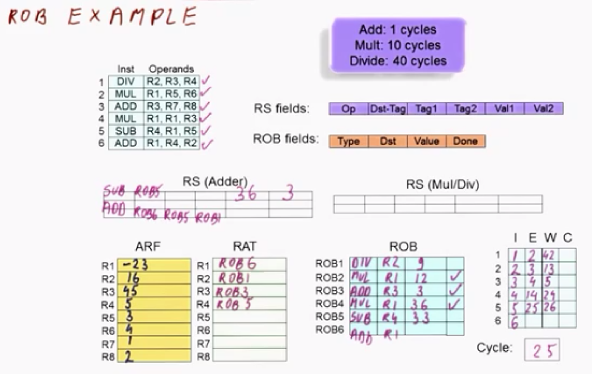
</center>

Cycle `C25` is depicted in the figure shown above.

| Instruction | Issue | Execute | Write Result | Commit |
|:-:|:-:|:-:|:-:|:-:|
| `I1` | `C1` | `C2` | `C42` | |
| `I2` | `C2` | `C3` | `C13` | |
| `I3` | `C3` | `C4` | `C5` | |
| `I4` | `C4` | `C14` | `C24` | |
| `I5` | `C5` | `C25` | `C26` | |
| `I6` | `C6` | | | |

At this point, instruction `I5` commences execution and continues to do so until cycle `C26` (via `1` cycle requirement for instruction `SUB`), as in the table shown above.

<center>
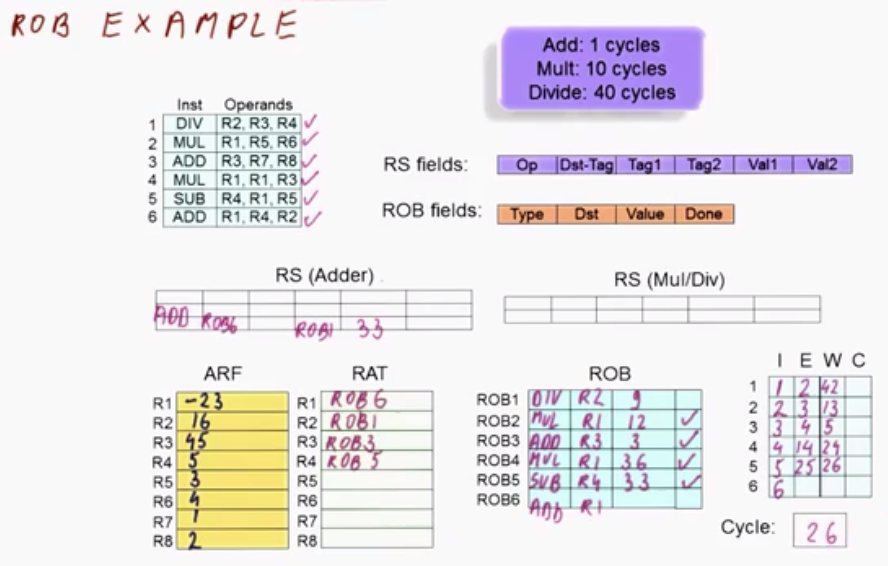
</center>

Cycle `C26` is depicted in the figure shown above.

At this point, instruction `I5` finally writes its result and broadcasts. The corresponding `Done` bit is set in the ROB for entry `ROB5`, with its value (i.e., `33`) broadcasted accordingly. Furthermore, the RS previously occupied by instruction `I5` is freed on dispatch.

Instruction `I6` captures the broadcast value (i.e., `33`, via `ROB5`), but is still pending a value for its other operand (i.e., `ROB1`). 

Furthermore, instruction `I6` still cannot dispatch at this point, as it is pending an operand result (`ROB1`); this "gridlock" persists in cycles `C27` through `C41`.

<center>
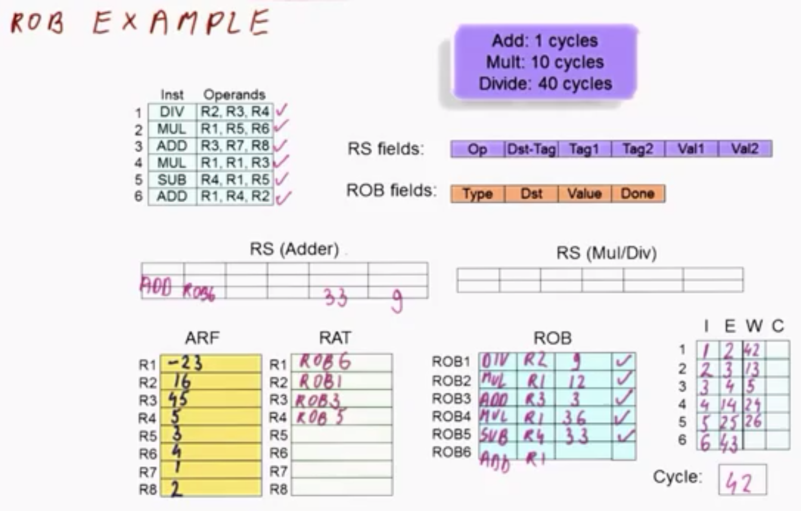
</center>

Cycle `C42` is depicted in the figure shown above.

At this point, instruction `I1` finally writes its result and broadcasts. The corresponding `Done` bit is set in the ROB for entry `ROB1`, with its value (i.e., `9`) broadcasted accordingly.

| Instruction | Issue | Execute | Write Result | Commit |
|:-:|:-:|:-:|:-:|:-:|
| `I1` | `C1` | `C2` | `C42` | |
| `I2` | `C2` | `C3` | `C13` | |
| `I3` | `C3` | `C4` | `C5` | |
| `I4` | `C4` | `C14` | `C24` | |
| `I5` | `C5` | `C25` | `C26` | |
| `I6` | `C6` | `C43` | | |

Instruction `I6` captures the broadcast value (i.e., `9`, via `ROB1`), and now has sufficient operands information/values in order to dispatch accordingly, and is able to dispatch and execute in the subsequent cycle `C43`, as indicated in the table shown above. Furthermore, the RS previously occupied by `I6` is freed accordingly.

<center>
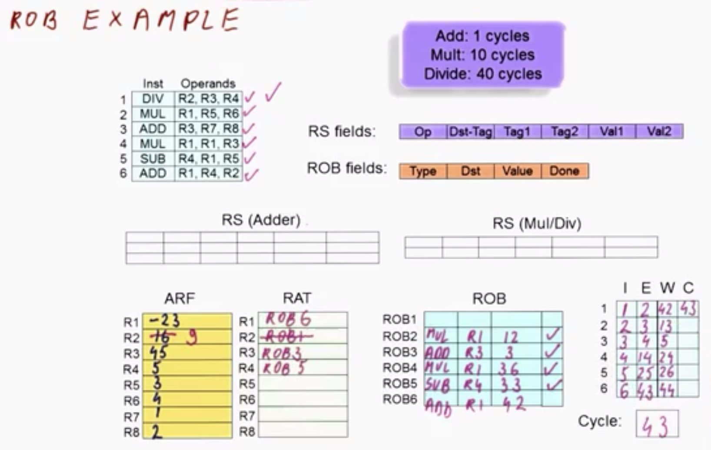
</center>

Cycle `C43` is depicted in the figure shown above.

| Instruction | Issue | Execute | Write Result | Commit |
|:-:|:-:|:-:|:-:|:-:|
| `I1` | `C1` | `C2` | `C42` | `C43` |
| `I2` | `C2` | `C3` | `C13` | |
| `I3` | `C3` | `C4` | `C5` | |
| `I4` | `C4` | `C14` | `C24` | |
| `I5` | `C5` | `C25` | `C26` | |
| `I6` | `C6` | `C43` | `C44` | |

At this point, instruction `I6` commences execution and continues to do so until cycle `C44` (via `1` cycle requirement for instruction `ADD`), as in the table shown above.

Furthermore, up to this point, commits have been "gridlocked" by instruction `I1`; however, now, instruction `I1` can be committed in this cycle (`C43`), as in the table shown above. Upon commit, the following occur:
  * The value for `R2` (i.e., `9`) is written in ARF
  * The RAT entry for `R2` is examined. Since it is pointing to `ROB1` (which is correspondingly the most recently updated value of `R2`), the RAT entry can be cleared accordingly (i.e., indicating to reference the updated value in ARF directly).
  * The ROB entry `ROB1` is cleared
  * Instruction `I1` is committed

At this point, to the programmer, instruction `I1` "appears" as completed. In reality, all of the other instructions besides the last one are completed at this point as well, however, they are not completed yet in program-order (i.e., until they are committed).

### 21. Cycles 44-48

<center>

</center>

Cycle `C44` is depicted in the figure shown above.

At this point, instruction `I6` finally writes its result and broadcasts. The corresponding `Done` bit is set in the ROB for entry `ROB6`, with its value (i.e., `42`) broadcasted accordingly.

| Instruction | Issue | Execute | Write Result | Commit |
|:-:|:-:|:-:|:-:|:-:|
| `I1` | `C1` | `C2` | `C42` | `C43` |
| `I2` | `C2` | `C3` | `C13` | `C44` |
| `I3` | `C3` | `C4` | `C5` | |
| `I4` | `C4` | `C14` | `C24` | |
| `I5` | `C5` | `C25` | `C26` | |
| `I6` | `C6` | `C43` | `C44` | |

Furthermore, instruction `I2` can be committed in this cycle, as in the table shown above. Upon commit, the following occur:
  * The value for `R1` (i.e., `12`) is written in ARF
  * The RAT entry for `R1` is examined. Since it is pointing to `ROB6` (which is correspondingly the most recently updated value of `R1`), this entry is retained, because this is the most recent occurring result for `R1`, which is still pending a commit.
  * The ROB entry `ROB2` is cleared
  * Instruction `I2` is committed

<center>

</center>

Cycle `C45` is depicted in the figure shown above.

| Instruction | Issue | Execute | Write Result | Commit |
|:-:|:-:|:-:|:-:|:-:|
| `I1` | `C1` | `C2` | `C42` | `C43` |
| `I2` | `C2` | `C3` | `C13` | `C44` |
| `I3` | `C3` | `C4` | `C5` | `C45` |
| `I4` | `C4` | `C14` | `C24` | |
| `I5` | `C5` | `C25` | `C26` | |
| `I6` | `C6` | `C43` | `C44` | |

At this point, instruction `I3` can be committed in this cycle, as in the table shown above. Upon commit, the following occur:
  * The value for `R3` (i.e., `3`) is written in ARF
  * The RAT entry for `R3` is examined. Since it is pointing to `ROB3` (which is correspondingly the most recently updated value of `R3`), the RAT entry can be cleared accordingly (i.e., indicating to reference the updated value in ARF directly).
  * The ROB entry `ROB3` is cleared
  * Instruction `I3` is committed

<center>

</center>

Cycle `C46` is depicted in the figure shown above.

| Instruction | Issue | Execute | Write Result | Commit |
|:-:|:-:|:-:|:-:|:-:|
| `I1` | `C1` | `C2` | `C42` | `C43` |
| `I2` | `C2` | `C3` | `C13` | `C44` |
| `I3` | `C3` | `C4` | `C5` | `C45` |
| `I4` | `C4` | `C14` | `C24` | `C46` |
| `I5` | `C5` | `C25` | `C26` | |
| `I6` | `C6` | `C43` | `C44` | |

At this point, instruction `I4` can be committed in this cycle, as in the table shown above. Upon commit, the following occur:
  * The value for `R1` (i.e., `36`) is written in ARF
  * The RAT entry for `R1` is examined. Since it is pointing to `ROB6` (which is correspondingly the most recently updated value of `R1`), this entry is retained, because this is the most recent occurring result for `R1`, which is still pending a commit.
  * The ROB entry `ROB4` is cleared
  * Instruction `I4` is committed

<center>

</center>

Cycle `C47` is depicted in the figure shown above.

| Instruction | Issue | Execute | Write Result | Commit |
|:-:|:-:|:-:|:-:|:-:|
| `I1` | `C1` | `C2` | `C42` | `C43` |
| `I2` | `C2` | `C3` | `C13` | `C44` |
| `I3` | `C3` | `C4` | `C5` | `C45` |
| `I4` | `C4` | `C14` | `C24` | `C46` |
| `I5` | `C5` | `C25` | `C26` | `C47`|
| `I6` | `C6` | `C43` | `C44` | |

At this point, instruction `I5` can be committed in this cycle, as in the table shown above. Upon commit, the following occur:
  * The value for `R4` (i.e., `33`) is written in ARF
  * The RAT entry for `R4` is examined. Since it is pointing to `ROB5` (which is correspondingly the most recently updated value of `R4`), the RAT entry can be cleared accordingly (i.e., indicating to reference the updated value in ARF directly).
  * The ROB entry `ROB5` is cleared
  * Instruction `I5` is committed

<center>
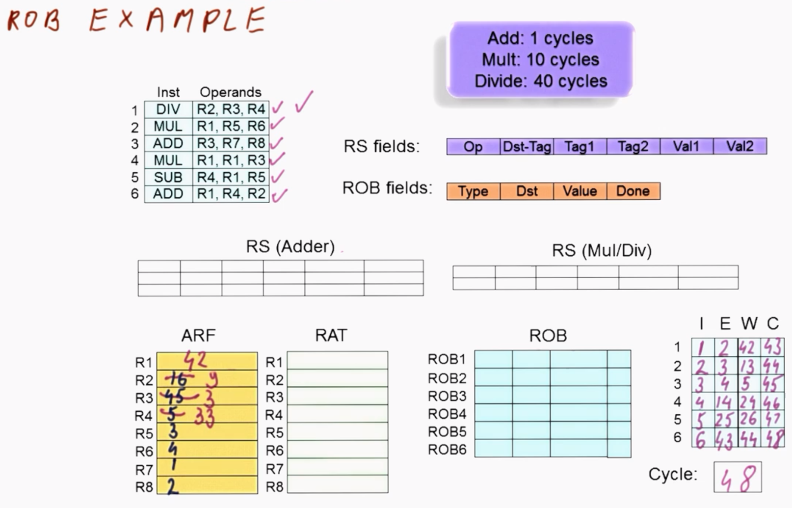
</center>

Cycle `C48` is depicted in the figure shown above.

| Instruction | Issue | Execute | Write Result | Commit |
|:-:|:-:|:-:|:-:|:-:|
| `I1` | `C1` | `C2` | `C42` | `C43` |
| `I2` | `C2` | `C3` | `C13` | `C44` |
| `I3` | `C3` | `C4` | `C5` | `C45` |
| `I4` | `C4` | `C14` | `C24` | `C46` |
| `I5` | `C5` | `C25` | `C26` | `C47`|
| `I6` | `C6` | `C43` | `C44` | `C48` |

At this point, instruction `I6` can be committed in this cycle, as in the table shown above. Upon commit, the following occur:
  * The value for `R1` (i.e., `42`) is written in ARF
  * The RAT entry for `R1` is examined. Since it is pointing to `ROB6` (which is correspondingly the most recently updated value of `R1`), the RAT entry can be cleared accordingly (i.e., indicating to reference the updated value in ARF directly).
  * The ROB entry `ROB6` is cleared
  * Instruction `I6` is committed

At this point, both the ROB and the RAT are empty, and the ARF contains the most-up-to-date values of the registers, thereby concluding this example.

## 22-29. ReOrder Buffer (ROB) Quizzes and Answers

### 22. Quiz 1 and Answers

<center>
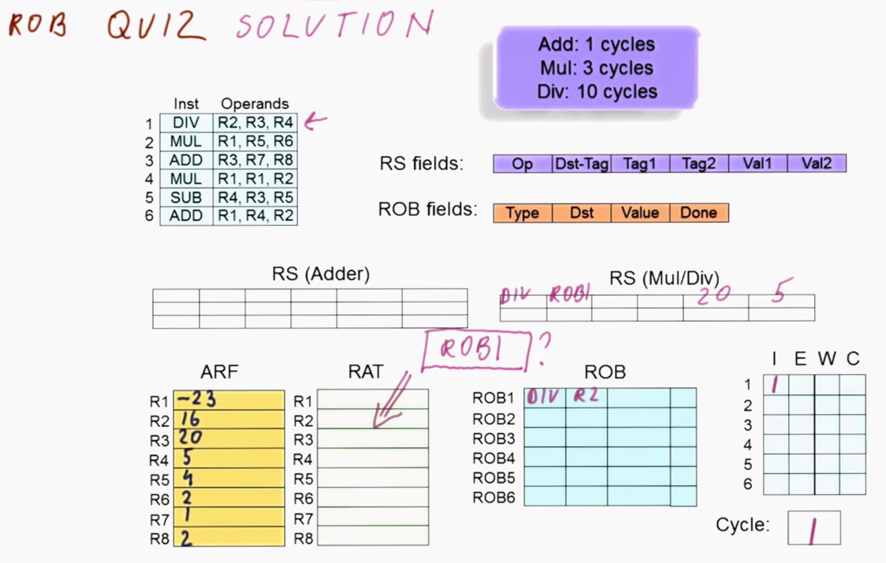
</center>

Consider the system characterized as in the figure shown above. Furthermore, assume that the same issue, dispatch, and broadcast behavior applies to this system as from previously (cf. Lesson 7), summarized briefly as follows:
  * If a result is captured, then the instruction can dispatch from registration station (RS) in the *same* cycle
  * If a result is dispatched, execution can commence in the *next* cycle
  * If an instruction is issued and has fully determinate operands on issuing, then the instruction can dispatch in the *same* cycle
  * Upon completing execution of an instruction, the result can be broadcast in the *next* cycle

In cycle `C1`, instruction `I1` issues. What is the corresponding entry in the register allocation table (RAT) for register `R2` (i.e., via instruction `I1`)?

***Answer and Explanation***:

In cycle `C1`, instruction `I1` issues, with corresponding occupation of the appropriate reservation station (RS) and entry in the reorder buffer (ROB) table, as in the figure shown above.

At this point, both of instruction `I1`s operands (i.e., `R3` and `R4`) are directly available from the architecture register file (ARF), with the corresponding values (i.e., `20` and `5`, respectively) populated accordingly in the RS.

Furthermore, the RAT entry is populated with entry `ROB1` for register `R2`.

### 23. Quiz 2 and Answers

<center>
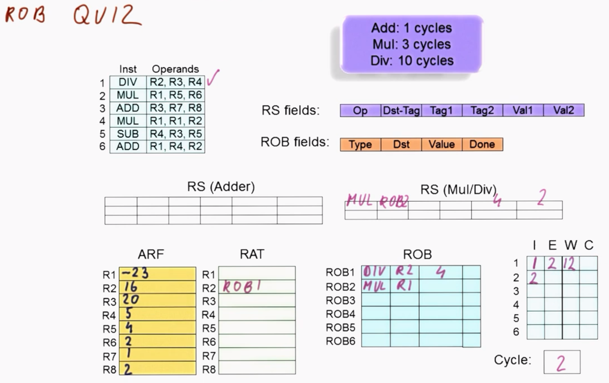
</center>

In cycle `C2`, instruction `I2` issues, with corresponding occupation of the appropriate reservation station (RS) and entry in the reorder buffer (ROB) table, as in the figure shown above. Furthermore, instruction `I1` commences execution in this cycle (producing result `4`) and frees its RS on dispatch accordingly, and will continue to execute until cycle `C12` (as per `10` cycles requirement for instruction `DIV`).

Instruction `I2` obtains its operands directly from ARF, with assigned destination tag (Dst-Tag) `ROB2` for eventual broadcast.

<center>
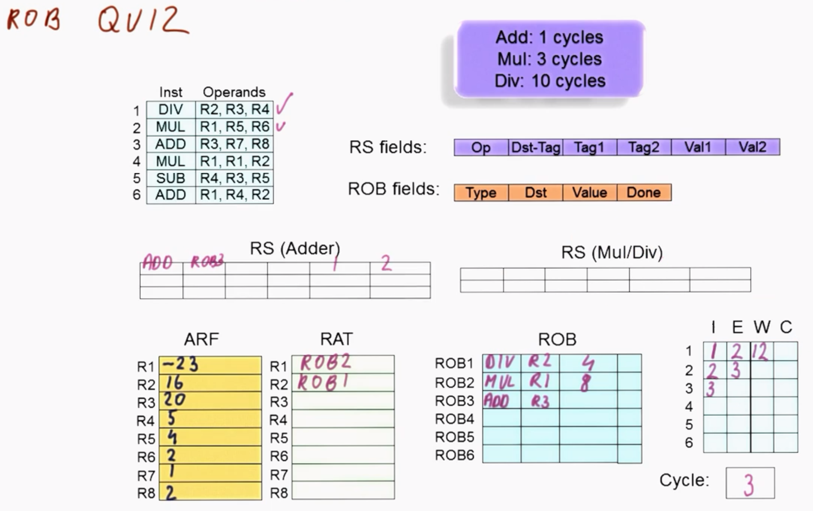
</center>

In cycle `C3`, instruction `I3` issues, with corresponding occupation of the appropriate reservation station (RS) and entry in the reorder buffer (ROB) table, as in the figure shown above. Furthermore, instruction `I2` commences execution in this cycle (producing result `8`) and frees its RS on dispatch accordingly, and will continue to execute until cycle `C6` (as per `3` cycles requirement for instruction `MUL`).

Instruction `I3` obtains its operands directly from ARF, with assigned destination tag (Dst-Tag) `ROB3` for eventual broadcast.

<center>
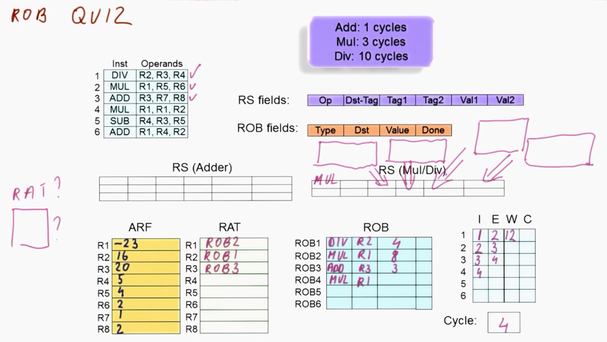
</center>

In cycle `C4`, instruction `I4` issues, with corresponding occupation of the appropriate reservation station (RS) and entry in the reorder buffer (ROB) table, as in the figure shown above. Furthermore, instruction `I3` commences execution in this cycle (producing result `3`) and frees its RS on dispatch accordingly, and will continue to execute until cycle `C5` (as per `1` cycle requirement for instruction `ADD`).

What are the appropriate RS field entries for instruction `I4`, and what is the corresponding RAT entry? 

***Answer and Explanation***:

<center>
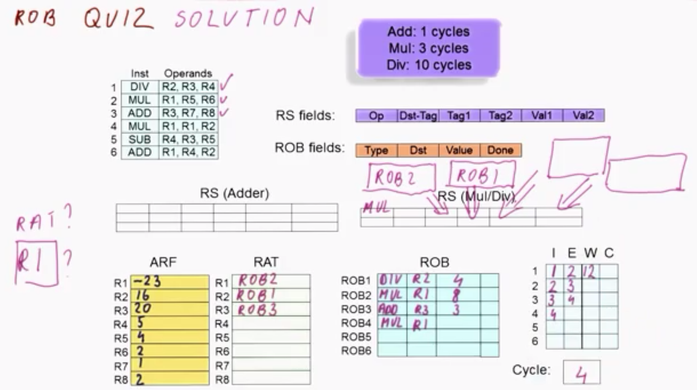
</center>

The entry for the RAT is simply `R1`, i.e., the result register of instruction `I4`. (Note that correspondingly, here, `ROB4` will overwrite the existing value `ROB2` for entry `R1` in RAT.)

| Op | Dst-Tag | Tag1 | Tag2 | Val1 | Val2 |
|:-:|:-:|:-:|:-:|:-:|:-:|
| MUL | `ROB4` | `ROB2` | `ROB1` | `(N/A)` | `(N/A)` |

Furthermore, the corresponding RS fields for instruction `I4` are as in the table shown above.

### 24. Quiz 3 and Answers

<center>
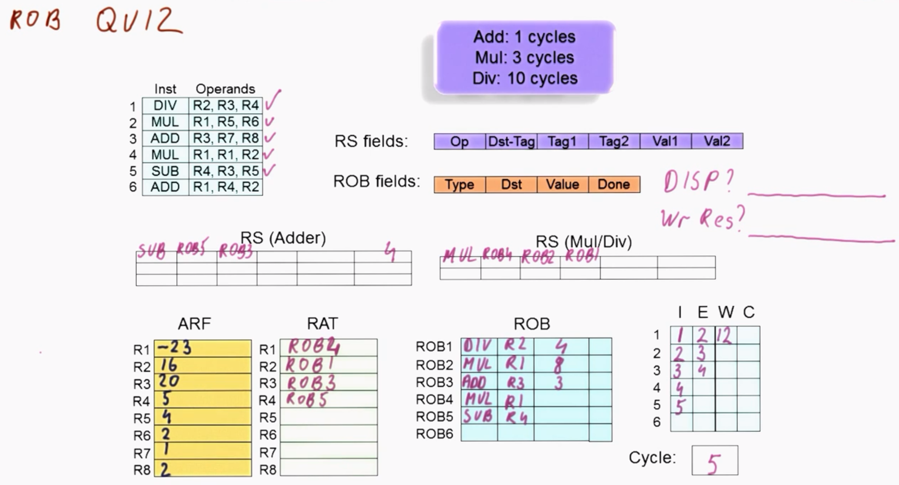
</center>

In cycle `C5`, instruction `I5` issues, with corresponding occupation of the appropriate reservation station (RS) and entry in the reorder buffer (ROB) table, as in the figure shown above. Furthermore, instruction `I4` is still present in its corresponding RS.

At this point, which instruction(s) (if any) is/are dispatched? (Specify the ROB entry.)

Furthermore, which instruction(s) (if any) write results in this cycle? (Specify the ROB entry.)

***Answer and Explanation***:

<center>
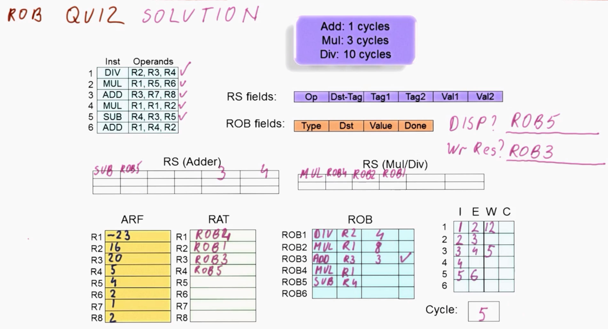
</center>

In cycle `C5`, no instruction is able to be dispatched yet at the start of the cycle, as both instruction-occupied RSes have pending broadcasts for their respective operands.

Furthermore, in cycle `C5`, instruction `I3` is now able to complete execution and consequently write its result (i.e., via corresponding tag `ROB3`). As a result of the write, entry `ROB3` has its `Done` bit set accordingly.

Since the broadcast and capture are able to occur in the same cycle in this system, and furthermore since the RS can dispatch in the same cycle as it captures, instruction `I5` (via tag `ROB5`) can now dispatch from its RS, since it has now received its last-pending operand result (i.e., `ROB3`). Correspondingly, instruction `I5` will execute (producing corresponding result `-1`) from cycles `C6` to `C7` (as per `1` cycle requirement for instruction `SUB`).

***N.B.*** Observe that in this cycle, instruction `I5` is able to issue, capture, and dispatch all in the *same* cycle!

### 25. Quiz 4 and Answers

<center>
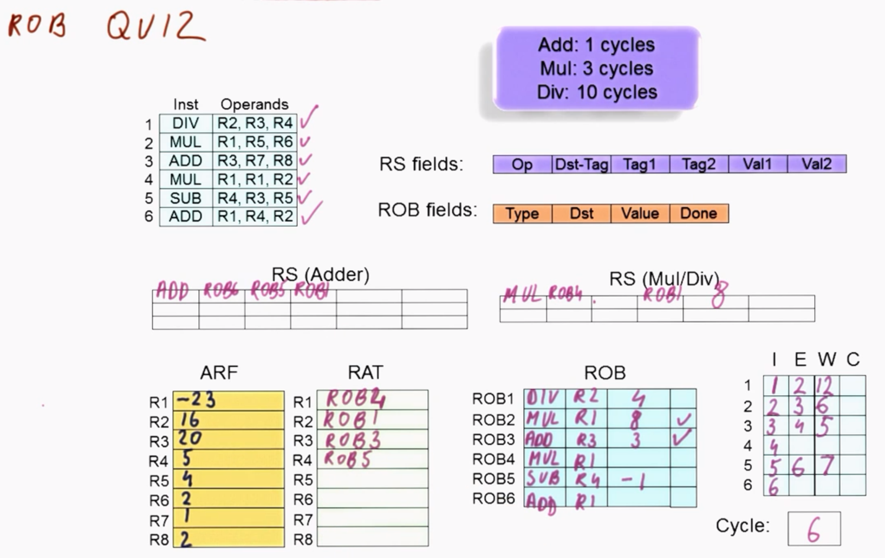
</center>

In cycle `C6`, instruction `I6` issues, with corresponding occupation of the appropriate reservation station (RS) and entry in the reorder buffer (ROB) table, as in the figure shown above. Furthermore, instruction `I4` is still present in its corresponding RS.

Furthermore, in cycle `C6`, instruction `I2` has completed execution and is able to write/broadcast its result (i.e., `8`), with a corresponding setting of its `Done` bit in its ROB entry. This value is consequently captured by the RS of instruction `I4`, which is still currently pending its other operand (`ROB1`) and thus not able to dispatch yet at this point.

<center>
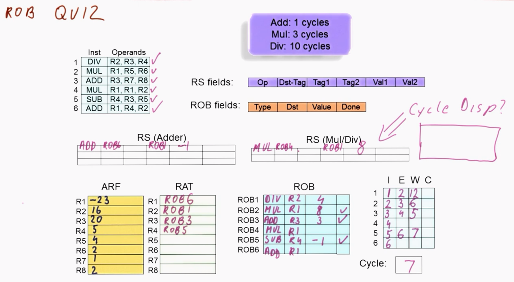
</center>

In cycle `C7`, instruction `I5` has completed execution and is able to write/broadcast its result (i.e., `-1`), with a corresponding setting of its `Done` bit in its ROB entry. This value is consequently captured by the RS of instruction `I6`, which is still currently pending its other operand (`ROB1`) and thus not able to dispatch yet at this point.

In which cycle does instruction `I4` get dispatched from its RS?

***Answer and Explanation***:

<center>

</center>

Observe that instruction `I4` (in its corresponding RS) is pending the result (i.e., `4`) of instruction `I4` (via corresponding tag `ROB1`). This will occur in cycle `C12`; at that point, instruction `I4` will also be able to dispatch from its RS in the same cycle upon receiving the broadcasted result, with execution commencing in the following cycle (i.e., `C13`).

***N.B.*** At this point, the system is "logjammed" (.e., via pending result `ROB1`) until cycle `C13`, so this cycle will be the focus of the next quiz accordingly.

### 26. Quiz 5 and Answers

<center>
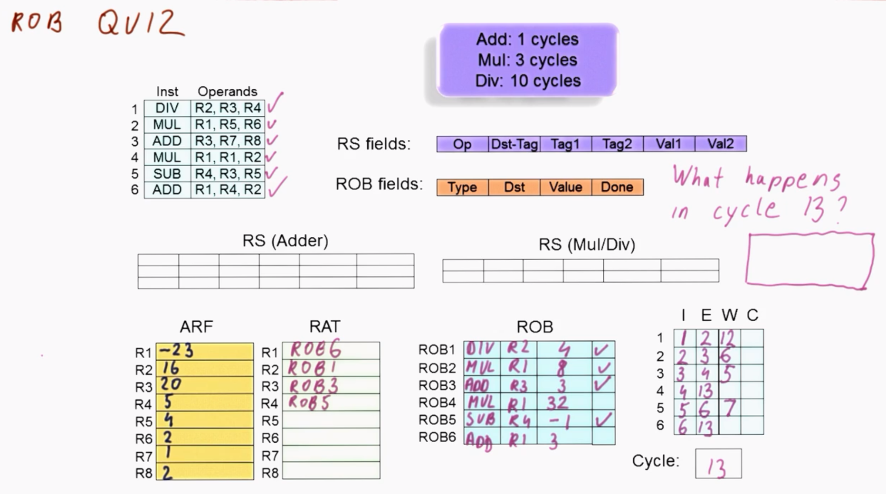
</center>

In cycle `C13`, instruction `I4` commences execution. Furthermore, instruction `I6` dispatches (correspondingly freeing its RS in the process) and will begin executing in the next cycle (i.e., `C14`) to produce its result (i.e., `3`) in cycle `C15` (as per `1` cycle requirement for instruction `ADD`).

In addition to these events, what else occurs in cycle `C13`? (Provide corresponding updates to the `IEWC` tracker table and to the ROB.)

***Answer and Explanation***:

<center>
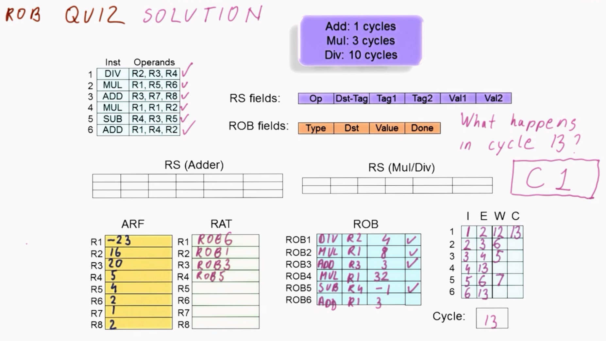
</center>

| Instruction | Issue | Execute | Write Result | Commit |
|:-:|:-:|:-:|:-:|:-:|
| `I1` | `C1` | `C2` | `C12` | `C13` |
| `I2` | `C2` | `C3` | `C6` | |
| `I3` | `C3` | `C4` | `C5` | |
| `I4` | `C4` | `C13` | | |
| `I5` | `C5` | `C6` | `C7` | |
| `I6` | `C6` | `C13` | | |

In cycle `C13` all instructions have been issued, and are additionally in progress of execution, as per the table shown above. Furthermore, neither instructions `I4` nor `I6` are able to write results at this point. However, by cycle `C13`, instruction `I1` is able to commit its result, and does so accordingly.

### 27. Quiz 6 and Answers

<center>
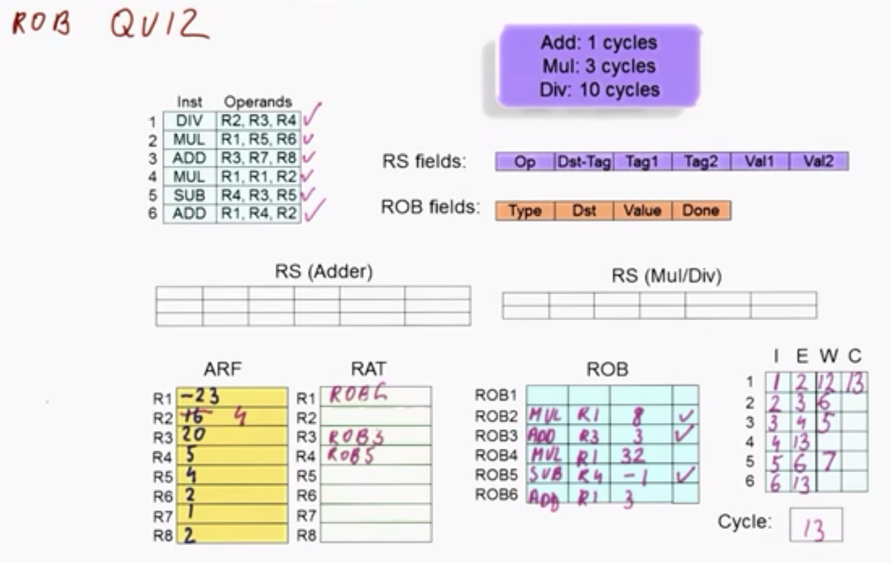
</center>

At the end of cycle `C13`, on commit of instruction `I1` (via `ROB1`), the corresponding update is made to ARF, with the RAT entry for register `R2` now blank (i.e., directing to ARF, rather than `ROB1`), with the value updated accordingly (i.e., `4`). Furthermore, entry `ROB1` is now also cleared in the ROB.

<center>
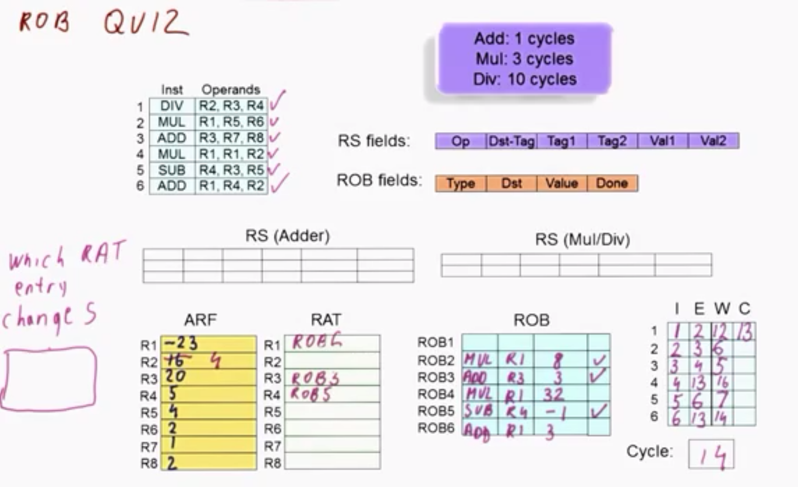
</center>

In cycle `C14`, instruction `I6` is now able to write its result (i.e., `3`).

What (if any) is/are the corresponding change(s) to the RAT in cycle `C14` consequently to the write result of instruction `I6`?

***Answer and Explanation***:

<center>
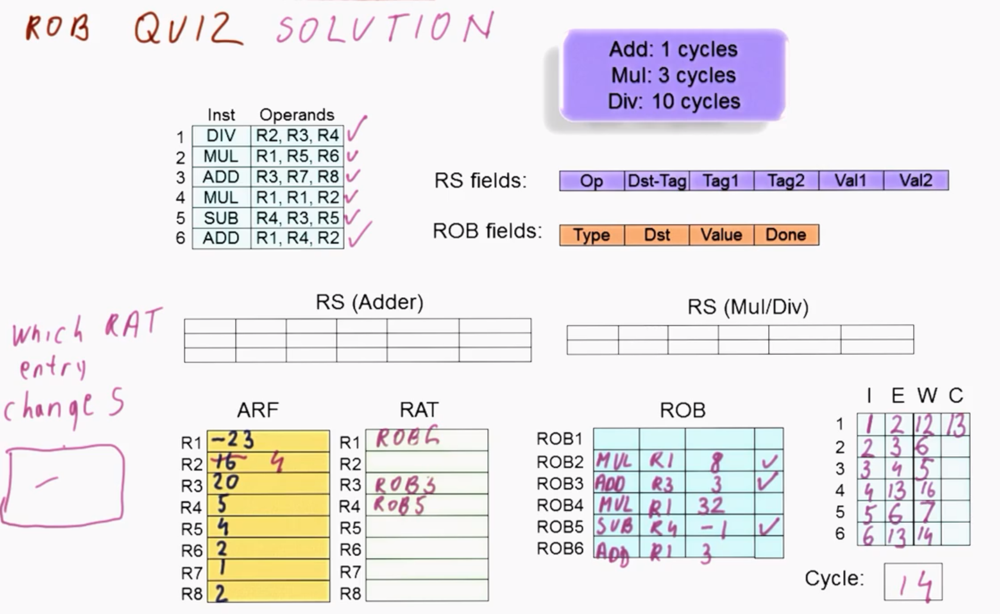
</center>

As a result of the write result of instruction `I6`, there is *no* corresponding change to the RAT. It is ***important*** to understand that write result does *not* correspondingly update the RAT; the RAT is only updated *on commit*. This in turn ensures proper in program-order execution.

### 28. Quiz 7 and Answers

<center>
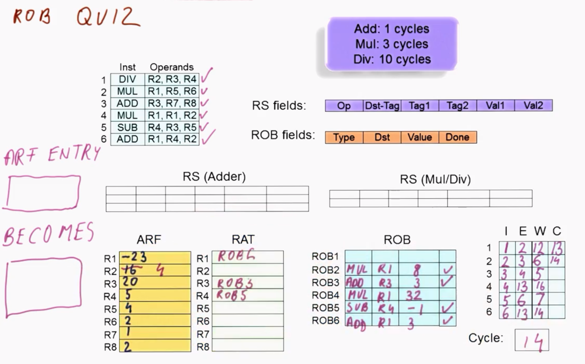
</center>

Further examining cycle `C14`, note that the `Done` bit is set appropriately for instruction `ROB6` (i.e., upon write result of corresponding instruction `I6`), with the corresponding result (`3`) broadcasted accordingly.

Furthermore, at this point, instruction `I2` can now be committed.

Which entry (if any) changes in the architectural registry file (ARF), and if so, what is the new value?

***Answer and Explanation***:

<center>

</center>

On commit of instruction `I2`, the ARF entry is correspondingly updated for register `R1` with result/value is `8`.

Furthermore, inspecting the RAT indicates current entry `ROB6`, which is the most recent value of register `R1`; since this entry differs from the currently committed instruction (i.e., `ROB2` via instruction `I2`), then the former entry is still retained in the RAT accordingly.

Lastly, the ROB entry for `ROB2` can now be cleared on commit.

### 29. Quiz 8 and Answers

<center>
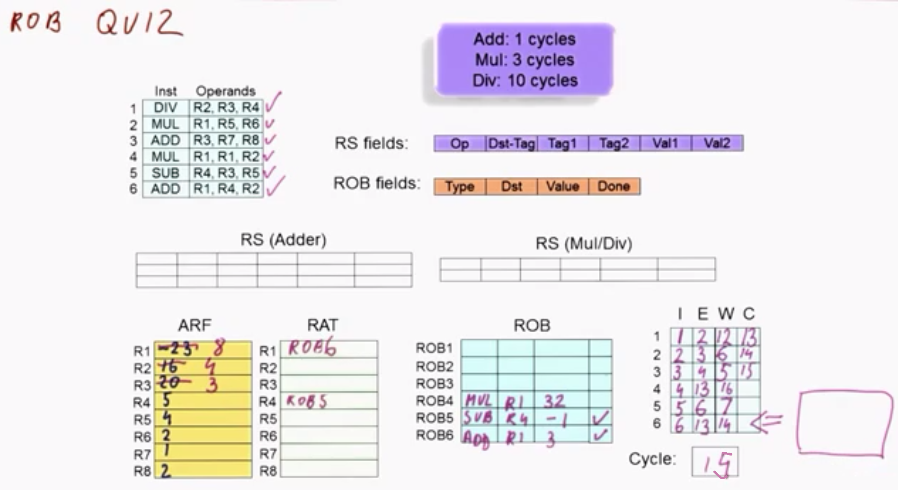
</center>

In cycle `C15`, there are no write results, however, instruction `I3` is able to commit. Consequently, the following occur:
  * ARF entry for `R3` is updated with the new value via `ROB3` (i.e., `3`)
  * Since entry `R3` in RAT currently points back to `ROB3` itself, this entry is cleared (i.e., read `R3` directly from `ARF` now)
  * The entry `ROB3` in the ROB is cleared

When does the last instruction (i.e., `I6`) finally commit?

***Answer and Explanation***:

<center>
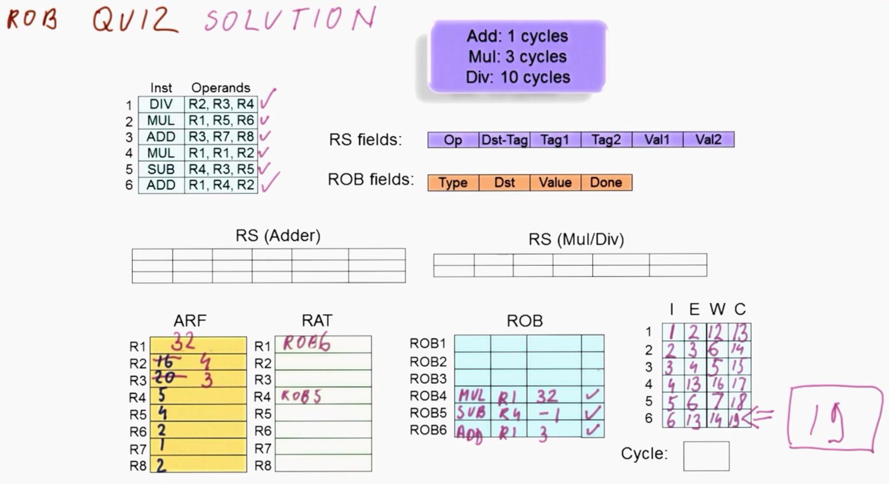
</center>

Since instruction `I4` writes its result in cycle `C16`, the earliest it can commit is in the subsequent cycle (i.e., `C17`). Proceeding similarly, the next two instructions (i.e., `I5` and `I6`) can correspondingly commit in the subsequent cycles (i.e., cycles `C18` and `C19`, respectively). Therefore, the last instruction `I6` commits in cycle `C19`.
  * ***N.B.*** Observe that in this case, this analysis was performed "by inspection," without requiring any further examination of the other elements in the system (i.e., ROB, RAT, and AFT). For the sake of thoroughness, the corresponding analysis is performed accordingly in the remainder of this section.

In cycle `C17` (in which instruction `I4` commits), the following occur with respect to instruction `I4` (via `ROB4`):
  * The `Done` bit is marked accordingly in the ROB for entry `ROB4`
  * ARF is updated with the corresponding result (`32`) for register `R1`
  * RAT has current entry `ROB6` (i.e., the most recent value of register `R1`), which differs from `ROB4`, so the former is left intact
  * The ROB entry `ROB4` is cleared out

<center>

</center>

In cycle `C18` (in which instruction `I5` commits), the following occur with respect to instruction `I5` (via `ROB5`):
  * The `Done` bit is marked accordingly in the ROB for entry `ROB5`
  * ARF is updated with the corresponding result (`-1`) for register `R4`
  * RAT has current entry `ROB5` (i.e., the most recent value of register `R4`), which is the same value, therefore, the RAT entry is cleared (i.e., indicating to retrieve the updated value directly from ARF)
  * The ROB entry `ROB4` is cleared out

<center>
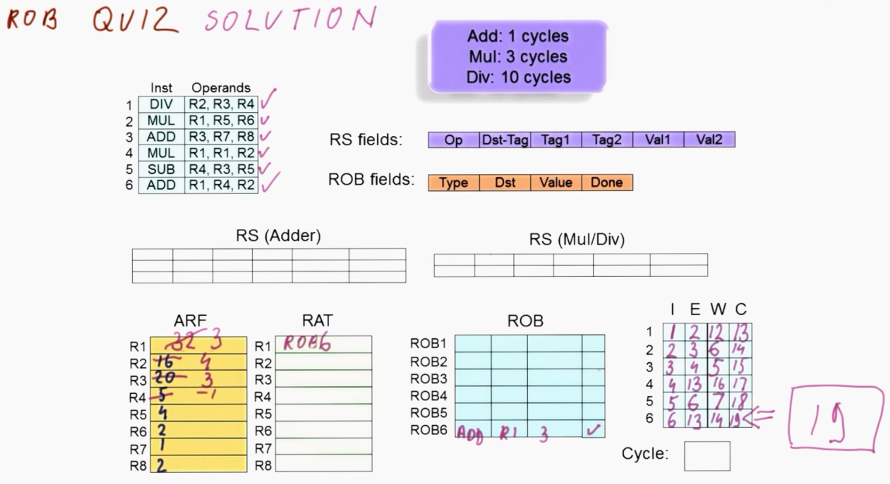
</center>

In cycle `C19` (in which instruction `I6` commits), the following occur with respect to instruction `I6` (via `ROB6`):
  * The `Done` bit is marked accordingly in the ROB for entry `ROB6`
  * ARF is updated with the corresponding result (`3`) for register `R1`
  * RAT has current entry `ROB6` (i.e., the most recent value of register `R1`), which is the same value, therefore, the RAT entry is cleared (i.e., indicating to retrieve the updated value directly from ARF)
  * The ROB entry `ROB6` is cleared out

<center>
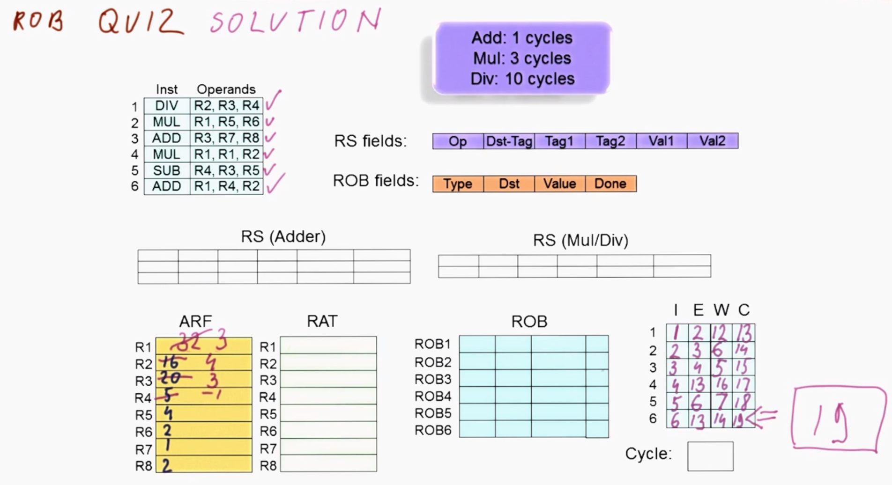
</center>

Upon completion of cycle `C19`, the current state of the system is as in the figure shown above, i.e., with ARF holding the most up-to-date values, and with the RAT, ROB, and RSes all empty.

## 30. ReOrder Buffer (ROB) Timing Example

Following a similar approach to previously with respect to Tomasulo's algorithm (cf. Lesson 7), consider now a "timing analysis" of a ROB-based system.

<center>
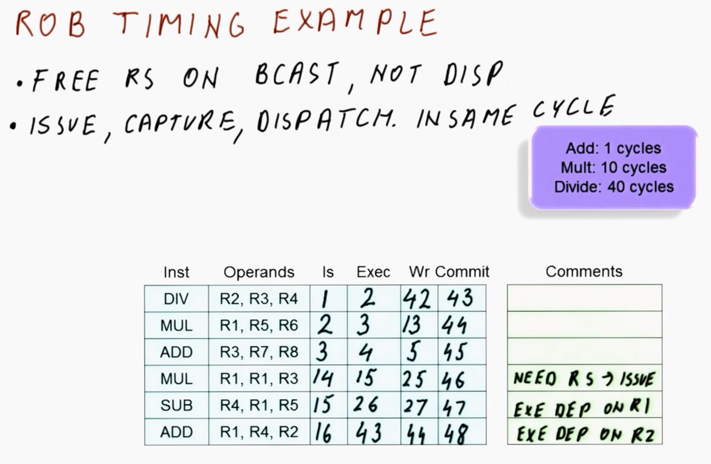
</center>

Consider the system as in the figure shown above.

```mips
DIV R2, R3, R4 # I1
MUL R1, R5, R6 # I2
ADD R3, R7, R8 # I3
MUL R1, R1, R3 # I4
SUB R4, R1, R5 # I5
ADD R1, R4, R2 # I6
```

The instructions in the system are as shown above.

The execution units are characterized as follows:
  * Instructions `ADD` and `SUB` require `1` cycle to execute
  * Instruction `MUL` requires `10` cycles to execute
  * Instruction `DIV` requires `40` cycles to execute

Furthermore, the processor operations are characterized as follows:
  * Reservation stations (RSes) are freed on broadcast, *not* on dispatch
    * ***N.B.*** In practice, this can occur in a speculative processor, wherein the instruction is retained until there is sufficient "certainty" that instruction execution is appropriate by that point
  * Issue, capture, and dispatch operations can all occur in the *same* cycle, with consequent execution occurring in the *following* cycle
    * ***N.B.*** This is similar to the processors of the previous examples

Assume that there are arbitrarily many ROB entries available (i.e., at least `6` such entries), and that there are `2` RSes for operations `MUL`/`DIV` and `3` RSes for operations `ADD`/`SUB`.

| Instruction | Operands | Issue | Execute | Write Result | Commit | Comments |
|:-:|:-:|:-:|:-:|:-:|:-:|:-:|
| `DIV` | `R2, R3, R4` | `C1` | `C2` | `C42` | `C43` | |

In cycle `C1`, instruction `I1` is issued into one of the `MUL`/`DIV` RSes, as per the table shown above.

Being the first instruction, `I1` has no dependencies "by inspection," therefore, it commences execution in the subsequent cycle `C2`. Furthermore, instruction `DIV` requires `40` cycles, therefore, the earliest possible write result would be in cycle `C42`, which is noted tentatively at this point.

Furthermore, the commit will occur in the subsequent cycle (i.e., `C43`).

| Instruction | Operands | Issue | Execute | Write Result | Commit | Comments |
|:-:|:-:|:-:|:-:|:-:|:-:|:-:|
| `DIV` | `R2, R3, R4` | `C1` | `C2` | `C42` | `C43` | |
| `MUL` | `R1, R5, R6` | `C2` | `C3` | `C13` | `C44` | |

In cycle `C2`, instruction `I2` is issued into the other `MUL`/`DIV` RS, as per the table shown above.

Instruction `I2` has no dependencies "by inspection," therefore, it commences execution in the subsequent cycle `C3`. Furthermore, instruction `MUL` requires `10` cycles, therefore, the earliest possible write result would be in cycle `C13`, which is noted tentatively at this point.

Furthermore, the commit will be unable to occur until at least cycle `C44`, pending commit of the upstream instruction `I1`.

| Instruction | Operands | Issue | Execute | Write Result | Commit | Comments |
|:-:|:-:|:-:|:-:|:-:|:-:|:-:|
| `DIV` | `R2, R3, R4` | `C1` | `C2` | `C42` | `C43` | |
| `MUL` | `R1, R5, R6` | `C2` | `C3` | `C13` | `C44` | |
| `ADD` | `R3, R7, R8` | `C3` | `C4` | `C5` | `C45` | |

In cycle `C3`, instruction `I3` is issued into one of the `ADD`/`SUB` RSes, as per the table shown above.

Instruction `I3` has no dependencies "by inspection," therefore, it commences execution in the subsequent cycle `C4`. Furthermore, instruction `ADD` requires `1` cycle, therefore, the earliest possible write result would be in cycle `C5`, which is noted tentatively at this point.

Furthermore, the commit will be unable to occur until at least cycle `C45`, pending commit of the upstream instruction `I2`.

| Instruction | Operands | Issue | Execute | Write Result | Commit | Comments |
|:-:|:-:|:-:|:-:|:-:|:-:|:-:|
| `DIV` | `R2, R3, R4` | `C1` | `C2` | `C42` | `C43` | |
| `MUL` | `R1, R5, R6` | `C2` | `C3` | `C13` | `C44` | |
| `ADD` | `R3, R7, R8` | `C3` | `C4` | `C5` | `C45` | |
| `MUL` | `R1, R1, R3` | `C14` | `C15` | `C25` | `C46` | Requires a free RS in order to issue, must wait until `C14` |

In cycle `C4`, instruction `I4` cannot be issued into one of the `MUL`/`DIV` RSes (which are both currently occupied pending execution of their respective instructions), therefore, the earliest possible issue of instruction `I4` is in cycle `C14`, as per the table shown above. 

Furthermore, instruction `I4` has dependencies for both of its operands, however, both will have executed by the end of cycle `C14`, and therefore instruction `I4` can commence execution in cycle `C15`. Instruction `MUL` requires `10` cycles, therefore, the earliest possible write result would be in cycle `C25`, which is noted tentatively at this point.

Furthermore, the commit will be unable to occur until at least cycle `C46`, pending commit of the upstream instruction `I3`.

| Instruction | Operands | Issue | Execute | Write Result | Commit | Comments |
|:-:|:-:|:-:|:-:|:-:|:-:|:-:|
| `DIV` | `R2, R3, R4` | `C1` | `C2` | `C42` | `C43` | |
| `MUL` | `R1, R5, R6` | `C2` | `C3` | `C13` | `C44` | |
| `ADD` | `R3, R7, R8` | `C3` | `C4` | `C5` | `C45` | |
| `MUL` | `R1, R1, R3` | `C14` | `C15` | `C25` | `C46` | Requires a free RS in order to issue, must wait until `C14` |
| `SUB` | `R4, R1, R5` | `C15` | `C26` | `C27` | `C47` | Execution depends on `R1` |

In cycles `C4` and `C5`, instruction `I5` cannot be issued yet (i.e., to ensure issuing of instructions in program-order), therefore, the earliest possible issue of instruction `I5` is in cycle `C15`, as per the table shown above.

Furthermore, instruction `I5` has a dependency via operand `R1`, whose value is not broadcasted until cycle `C25` (via instruction `I4`), and therefore instruction `I5` can commence execution in cycle `C26`. Instruction `SUB` requires `1` cycle, therefore, the earliest possible write result would be in cycle `C27`, which is noted tentatively at this point.

Furthermore, the commit will be unable to occur until at least cycle `C47`, pending commit of the upstream instruction `I4`.

| Instruction | Operands | Issue | Execute | Write Result | Commit | Comments |
|:-:|:-:|:-:|:-:|:-:|:-:|:-:|
| `DIV` | `R2, R3, R4` | `C1` | `C2` | `C42` | `C43` | |
| `MUL` | `R1, R5, R6` | `C2` | `C3` | `C13` | `C44` | |
| `ADD` | `R3, R7, R8` | `C3` | `C4` | `C5` | `C45` | |
| `MUL` | `R1, R1, R3` | `C14` | `C15` | `C25` | `C46` | Requires a free RS in order to issue, must wait until `C14` |
| `SUB` | `R4, R1, R5` | `C15` | `C26` | `C27` | `C47` | Execution depends on `R1` |
| `ADD` | `R1, R4, R2` | `C16` | `C43` | `C44` | `C48` | Execution depends on `R2`|

In cycles `C5` and `C6`, instruction `I6` cannot be issued yet (i.e., to ensure issuing of instructions in program-order), therefore, the earliest possible issue of instruction `I6` is in cycle `C16`, as per the table shown above.

Furthermore, instruction `I6` has dependencies for both of its operands, however, both will have executed by the end of cycle `C42`, and therefore instruction `I6` can commence execution in cycle `C43`. Instruction `ADD` requires `1` cycle, therefore, the earliest possible write result would be in cycle `C44`, which is noted tentatively at this point.

Furthermore, the commit will be unable to occur until at least cycle `C48`, pending commit of the upstream instruction `I5`.

This concludes the timing analysis of the system.

## 31-33. ReOrder Buffer (ROB) Timing Quizzes and Answers

### 31. Quiz 1 and Answers

<center>
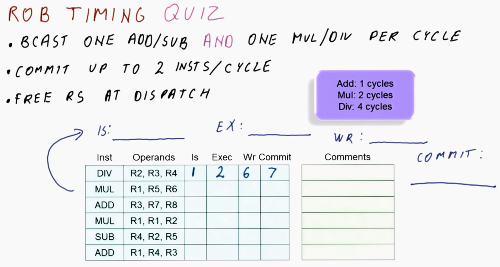
</center>

Consider the system as in the figure shown above.

```mips
DIV R2, R3, R4 # I1
MUL R1, R5, R6 # I2
ADD R3, R7, R8 # I3
MUL R1, R1, R2 # I4
SUB R4, R2, R5 # I5
ADD R1, R4, R3 # I6
```

The instructions in the system are as shown above.

The execution units are characterized as follows:
  * Instructions `ADD` and `SUB` require `1` cycle to execute
  * Instruction `MUL` requires `2` cycles to execute
  * Instruction `DIV` requires `4` cycles to execute

Furthermore, the processor operations are characterized as follows:
  * Broadcast of one `ADD`/`SUB` *and* one `MUL`/`DIV` can occur in the *same* cycle
  * Up to two instructions can be committed in the *same* cycle
  * The reservation station (RS) is freed on dispatch

Assume that there are arbitrarily many ROB entries available (i.e., at least `6` such entries), and that there are `2` RSes for operations `MUL`/`DIV` and `3` RSes for operations `ADD`/`SUB`.

| Instruction | Operands | Issue | Execute | Write Result | Commit | Comments |
|:-:|:-:|:-:|:-:|:-:|:-:|:-:|
| `DIV` | `R2, R3, R4` | `C1` | `C2` | `C6` | `C7` | |

In cycle `C1`, instruction `I1` is issued into one of the `MUL`/`DIV` RSes, as per the table shown above.

Being the first instruction, `I1` has no dependencies "by inspection," therefore, it commences execution in the subsequent cycle `C2`. Furthermore, instruction `DIV` requires `4` cycles, therefore, the earliest possible write result would be in cycle `C6`, which is noted tentatively at this point.

Furthermore, the commit will occur in the subsequent cycle (i.e., `C7`).

What is the corresponding analysis for the next cycle, cycle `C2`?

***Answer and Explanation***:

<center>
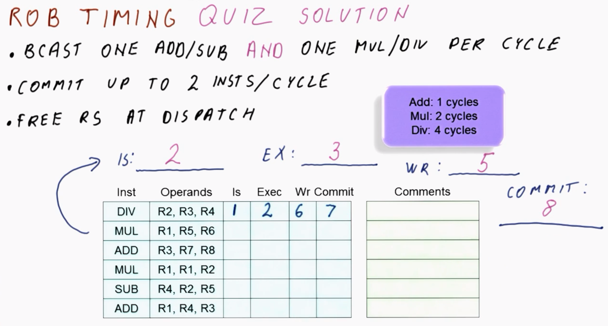
</center>

| Instruction | Operands | Issue | Execute | Write Result | Commit | Comments |
|:-:|:-:|:-:|:-:|:-:|:-:|:-:|
| `DIV` | `R2, R3, R4` | `C1` | `C2` | `C6` | `C7` | |
| `MUL` | `R1, R5, R6` | `C2` | `C3` | `C5` | `C8` | |

In cycle `C2`, instruction `I2` is issued into the other `MUL`/`DIV` RS, as per the table shown above.

Instruction `I2` has no dependencies "by inspection," therefore, it commences execution in the subsequent cycle `C3`. Furthermore, instruction `MUL` requires `2` cycles, therefore, the earliest possible write result would be in cycle `C5`, which is noted tentatively at this point.

Furthermore, the commit will be unable to occur until at least cycle `C8`, pending commit of the upstream instruction `I1`.

### 32. Quiz 2 and Answers

<center>
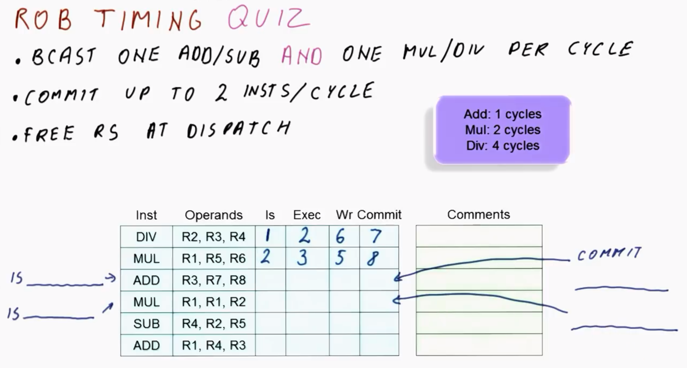
</center>

With respect to the subsequent instructions `I3` and `I4`, in which cycle(s) do they issue, and in which cycle(s) to they commit?

***Answer and Explanation***:

<center>
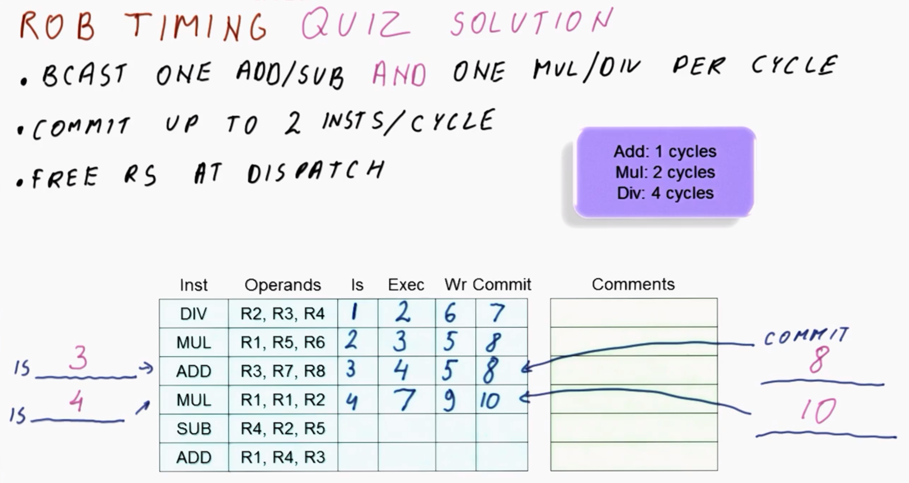
</center>

| Instruction | Operands | Issue | Execute | Write Result | Commit | Comments |
|:-:|:-:|:-:|:-:|:-:|:-:|:-:|
| `DIV` | `R2, R3, R4` | `C1` | `C2` | `C6` | `C7` | |
| `MUL` | `R1, R5, R6` | `C2` | `C3` | `C5` | `C8` | |
| `ADD` | `R3, R7, R8` | `C3` | `C4` | `C5` | `C8` | |

In cycle `C3`, instruction `I3` is issued into one of the `ADD`/`SUB` RSes, as per the table shown above.

Instruction `I3` has no dependencies "by inspection," therefore, it commences execution in the subsequent cycle `C4`. Furthermore, instruction `ADD` requires `1` cycle, therefore, the earliest possible write result would be in cycle `C5`, which is noted tentatively at this point.
  * ***N.B.*** Since the processor is able to broadcast up to two instructions per cycle, this can occur concurrently with the broadcast of `I2` in cycle `C5`.

Furthermore, the commit will occur subsequently thereafter in cycle `C8`.
  * ***N.B.*** Commit of instruction `I3` can occur concurrently with instruction `I2` in cycle `C2`, since the processor supports up to two commits per cycle.

| Instruction | Operands | Issue | Execute | Write Result | Commit | Comments |
|:-:|:-:|:-:|:-:|:-:|:-:|:-:|
| `DIV` | `R2, R3, R4` | `C1` | `C2` | `C6` | `C7` | |
| `MUL` | `R1, R5, R6` | `C2` | `C3` | `C5` | `C8` | |
| `ADD` | `R3, R7, R8` | `C3` | `C4` | `C5` | `C8` | |
| `MUL` | `R1, R1, R2` | `C4` | `C7` | `C9` | `C10` | |

In cycle `C4`, instruction `I4` is issued into one of the `ADD`/`SUB` RSes, as per the table shown above.

Furthermore, instruction `I4` has dependencies for both of its operands, however, both will have executed by the end of cycle `C6`, and therefore instruction `I4` can commence execution in cycle `C7`. Instruction `MUL` requires `2` cycles, therefore, the earliest possible write result would be in cycle `C9`, which is noted tentatively at this point.

Furthermore, the commit will occur subsequently thereafter in cycle `C10`.

### 33. Quiz 3 and Answers

<center>
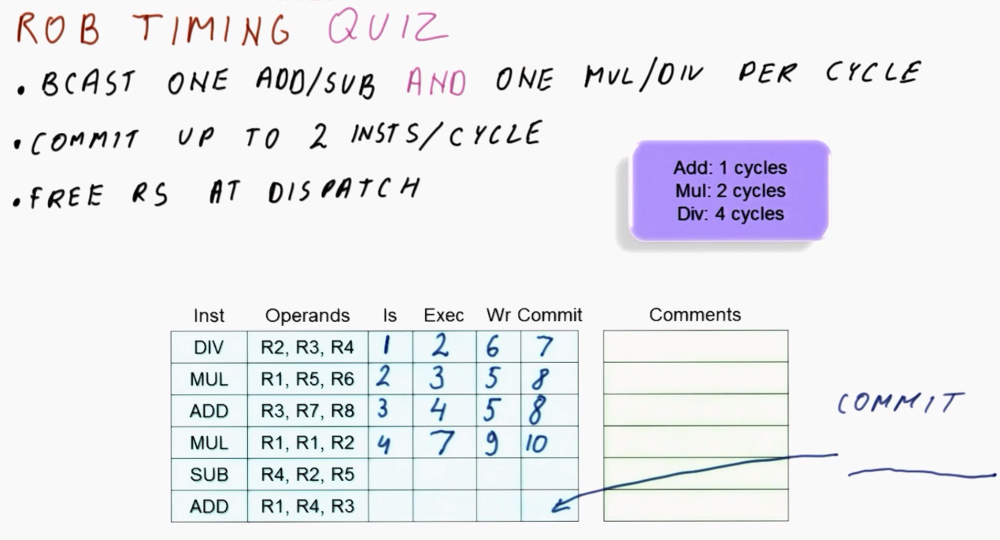
</center>

Finally, in concluding the analysis of this system, in which cycle does the final instruction (i.e., `I6`) get committed?

***Answer and Explanation***:

<center>
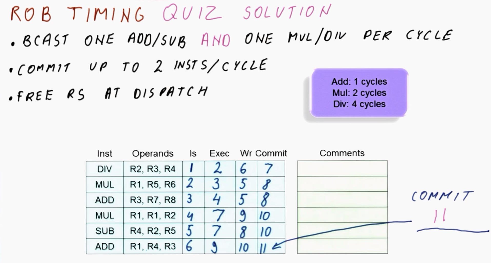
</center>

| Instruction | Operands | Issue | Execute | Write Result | Commit | Comments |
|:-:|:-:|:-:|:-:|:-:|:-:|:-:|
| `DIV` | `R2, R3, R4` | `C1` | `C2` | `C6` | `C7` | |
| `MUL` | `R1, R5, R6` | `C2` | `C3` | `C5` | `C8` | |
| `ADD` | `R3, R7, R8` | `C3` | `C4` | `C5` | `C8` | |
| `MUL` | `R1, R1, R2` | `C4` | `C7` | `C9` | `C10` | |
| `SUB` | `R4, R2, R5` | `C5` | `C7` | `C8` | `C10` | |

In cycle `C5`, instruction `I5` is issued into one of the `ADD`/`SUB` RSes, as per the table shown above.

Furthermore, instruction `I5` has a dependency via operand `R2`, whose value is not broadcasted until cycle `C6` (via instruction `I1`), and therefore instruction `I5` can commence execution in cycle `C7`. Instruction `SUB` requires `1` cycle, therefore, the earliest possible write result would be in cycle `C8`, which is noted tentatively at this point.

Furthermore, the commit will occur subsequently thereafter in cycle `C10`.
  * ***N.B.*** Commit of instruction `I5` can occur concurrently with instruction `I4` in cycle `C10`, since the processor supports up to two commits per cycle.

| Instruction | Operands | Issue | Execute | Write Result | Commit | Comments |
|:-:|:-:|:-:|:-:|:-:|:-:|:-:|
| `DIV` | `R2, R3, R4` | `C1` | `C2` | `C6` | `C7` | |
| `MUL` | `R1, R5, R6` | `C2` | `C3` | `C5` | `C8` | |
| `ADD` | `R3, R7, R8` | `C3` | `C4` | `C5` | `C8` | |
| `MUL` | `R1, R1, R2` | `C4` | `C7` | `C9` | `C10` | |
| `SUB` | `R4, R2, R5` | `C5` | `C7` | `C8` | `C10` | |
| `ADD` | `R1, R4, R3` | `C6` | `C9` | `C10` | `C11` | |

In cycle `C6`, instruction `I6` is issued into one of the `ADD`/`SUB` RSes, as per the table shown above.

Furthermore, instruction `I6` has dependencies for both of its operands, however, both will have executed by the end of cycle `C8`, and therefore instruction `I6` can commence execution in cycle `C9`. Instruction `ADD` requires `1` cycle, therefore, the earliest possible write result would be in cycle `C10`, which is noted tentatively at this point.

Furthermore, the commit will occur subsequently thereafter in cycle `C11`.

## 34. Unified Reservation Stations

Having seen how an reorder-buffer-based (ROB-based) processor works, which involves *separate* reservation stations, consider now the concept of the ***unified* reservation station**.

<center>

</center>

As in the figure shown above, we have thus far seen configurations involving *separate* reservation stations (RSes) for each distinct execution unit (e.g., `3` RSes for execution unit `ADD`/`SUB`, and `2` RSes for execution unit `MUL`/`SUB`). With this type of configuration, it is possible for "bottlenecking" to occur, whereby one (or more) of the RSes becomes full with in-progress instructions at the point of the next-issuing instruction.

Note that both types of reservation stations (i.e., across different execution units) are exactly the same, with the exception that they are feeding into different execution units (however, otherwise, the logic, monitoring, etc. of register values with respect to broadcast, capture, and issuing is identical).

Therefore, to improve the ability use the RSes (a relatively expensive resource), a **unified reservation station** approach can be used, whereby *all* RSes are effectively "pooled" across the various execution units. On issuing, the next-in-line instruction then simply occupies the next-available RS, irrespectively of the target execution unit in question.
  * The **benefit** of this approach is that as long as there are *anY* available RSes, then instructions can continue to be issued.
  * However, the **drawback** of this approach is that the logic for dispatching the instructions into the corresponding execution units becomes more complicated to implement (in every cycle, there is additional overhead to evaluate the heterogeneous set of pending instructions among the RSes, as well as dispatching to the appropriate execution unit accordingly)

In practice, processors typically use some variation of the unified reservation station (i.e., as opposed to strictly segregated/dedicated RSes).

## 35. Superscalar

Up to this point, the reorder-buffer-based (ROB-based) processors examined have *not* been **superscalar**, i.e., they have only issued *one* instruction per cycle (rather than *greater* than one). Even with a processor capable of *committing* up to two instructions per cycle (cf. Section 31), there will still be a "bottlenck" induced by the rate-limiting issue operation.

<center>
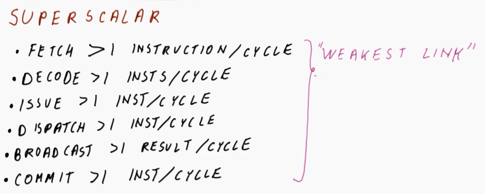
</center>

Now, consider a real **superscalar** processor, as per the figure shown above. Such as processor is characterized as follows:

| Superscalar Processor Characteristic | Description |
|:-:|:-:|
| Fetches `> 1` instruction per cycle | This effectively entails fetching more than one instruction's worth of memory for cycle (e.g., a `4`-byte memory word would require fetching of `>= 8` bytes per cycle) |
| Decodes `> 1` instructions per cycle | This amounts to having more than one decoder available/present (i.e., in every cycle, the first decoder examines the first instruction, while the second decoder examines the second instruction fetched, etc.) |
| Issues `> 1` instructions per cycle | Note that (as before) it is necessary to issue instruction in program-order, therefore, as a given instruction is being issued, the next instruction is also being examined for issuing, etc. Furthermore, if one of the next instructions *cannot* issue, then that will also preclude the subsequent downstream instruction(s) from issuing as well. |
| Dispatches `> 1` instructions per cycle | As seen previously in this lesson, with multiple execution units available, it is possible to dispatch one instruction to each of these execution units, which effectively enables superscalar performance already. However, in practice, the imbalance in the distribution of the execution units (e.g., three `ADD`/`SUB` units vs. two `MUL`/`DIV` units) can result in "bottlenecking," therefore, it is generally necessary to have a more "even" distribution of the execution unit types in order to sustain superscalar performance over many cycles (i.e., to *consistently* perform `>= 2` issue and dispatch operations on average per cycle). |
| Broadcasts `> 1` results per cycle | This involves not only having multiple (i.e., `>= 2`) broadcast buses, but also requires every reservation station to compare its waited-for tags among *all* of these buses (because in any given cycle, one or more of these buses can be producing a result(s) at that point). Correspondingly, this significantly complicates the implementation of the reservation stations accordingly, i.e., the implementation cost/complexity is directly proportional to the total number of broadcast operations that must be monitored (roughly `O(n)` cost in `n` broadcast operations). |
| Commits `> 1` instructions per cycle | As seen previously in this lesson, and similarly as for the issue operation, the next-pending instruction for committing is evaluated while a corresponding "lookahead" occurs for the subsequent to-be-committed instruction, and so on. Furthermore, in performing this evaluation, program-order must be maintained, therefore, it is not permissible to commit a "downstream" instruction "prematurely," if a particular instruction under current inspection cannot yet be committed. |

Taking these characteristics in aggregate, among these, there will generally be a "weakest link," which will dictate the degree to which superscalar performance can actually be achieved (i.e,. performing *on average* `> 1` instruction per cycle across all of these operations).

## 36. Terminology Confusion
