# Memory Ordering

## 1. Lesson Introduction

We have seen (cf. Lesson 8) that an out-of-order processor will track when one instruction uses a register value produced by another.

However, load and store instructions can access the *same* memory location without using the same register to perform the access; this lesson explores *how* exactly this can be done correctly in an out-of-order processor.

## 2. Memory Access Ordering

<center>
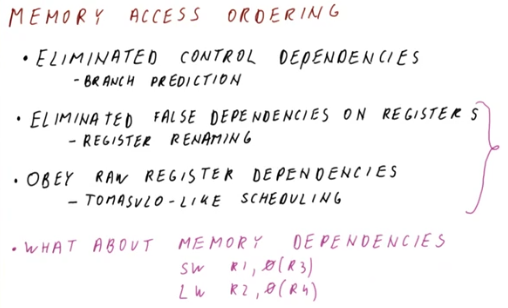
</center>

We have seen (cf. Lessons 7 and 8) that reorder buffer (ROB) and Tomasulo's algorithm can be used to enforce the order of **dependencies** on registers between instructions.

However, a ***question*** still remains: What about **memory access** ordering?
  * There are load and store instructions available; do they really need to be performed *strictly* in program order, or can these be reordered, too?

So far, we have eliminated **control dependencies** using **branch prediction**.

Furthermore, we have eliminated **false dependencies** (i.e., dependencies via registers) using **register renaming**.

Next, we will see how to obey **read-after-write (RAW) register dependencies** using **Tomasulo-like scheduling**.
  * Here, we have instructions waiting in reservation stations until their dependencies have been satisfied, at which point they can proceed to execution out of program order.

Note that the data-dependency handling performed thus far (i.e., false dependencies and RAW register dependencies) only pertain to **register dependencies**, in which one instruction produces a value in a register used by another register. But what about memory dependencies?

Consider the following program:

```mips
SW R1, 0(R3)
LW R2, 0(R4)
```

Here, there may be a dependency between the memory value written by `SW` (store) and that read by `LW` (load).
  * For example, if registers `R3` and `R4` hold the ***same*** address, then `LW` must get the value from `SW`, in which case these instructions must be performed ***in order***.
  * Conversely, if `R3` and `R4` hold ***different*** addresses, then (as previously seen with registers) it is not strictly necessary to maintain program-order between these memory accesses.

Nevertheless, we have not yet seen how to handle out-of-order memory access; correspondingly, this topic will be the focal point of this lesson.

## 3. When Does Memory Write Happen?

<center>

</center>

The first point we must consider is: For **store instructions**, how does the **memory write** operation actually happen? This occurs at **commit**.
  * It is necessary for write to memory to occur at commit, because it is otherwise ***unsafe*** to update memory at any point ***before*** the instruction commits.
  * Any instruction that has not yet committed is subject to being **cancelled** (e.g., due to branch misprediction or occurrence of an exception).
  * Therefore, performing a memory write prematurely may later result in a necessary memory "unaccess" (i.e., restore the old memory value), which is extremely difficult to perform. To avoid this, memory writes and stores are delayed until commit.

Does this mean that **memory load** also must wait until commit before retrieving the data (i.e., at which point only *then* is the data present in memory)? In other words, if we *write/store* instructions at commit, then where does data get *loaded* from? (Furthermore, it is desirable for loads to occur as early as possible, in order to complete these loads in order to supply the data to subsequent instructions depending on the data.)
  * For this purpose, we introduce the structure called the **load-store queue**, which maintains all of the loads and stores.

Next, we will see how loads get data from the stores in this manner.

## 4-5. Load-Store Queue (LSQ)

### 4. LSQ Part 1

Because the loads in our processor must be performed as soon as possible (i.e., for immediate availability to downstream instructions which are dependent on the data), while stores do not write to memory until commit, the **load-store queue (LSQ)** is required in order to supply the values from stores to loads.

<center>

</center>

This load-store queue (LSQ) (shown in the figure above) is just like the reorder buffer (ROB), meaning that it has entries placed in order, which are subsequently removed at commit. However, in the load-store queue (LSQ), we only place load and store instructions there.
  * The bit `L/S` indicates whether the instruction is a **load** (`L`) or **store** (`S`).
  * The field `Addr` specifies which **address** the instruction is accessing.
  * The field `Val` indicates the **value** that the instruction stores or loads.
  * The field `C` indicates whether or not the instruction has been completed.

Consider the following program:

```mips
LW R1, 0(R1) # I1
SW R2, 0(R3) # I2
LW R4, 0(R4) # I3
SW R5, 0(R0) # I4
LW R5, 0(R8) # I5
```

<center>
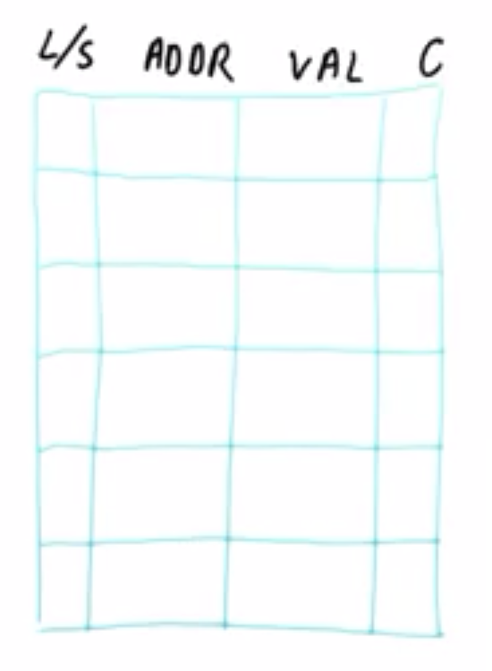
</center>

Initially, the load-store queue (LSQ) is empty, as shown above. It is subsequently populated in program-order.

<center>

</center>

The first instruction (`I1`) accesses the computed memory address `104`. Because there are no previous store instructions, this instruction fetches directly from memory (`MEM`).

<center>
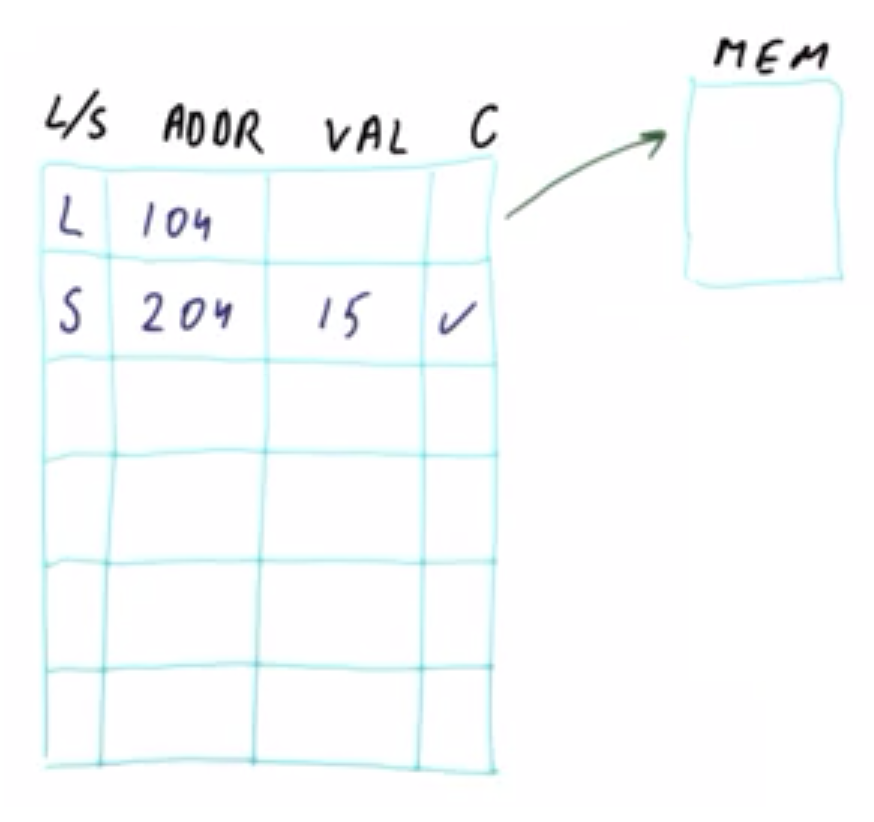
</center>

The second instruction (`I2`) stores the value `15` at computed address of `204`. The instruction is marked in field `C`; essentially, the instruction is essentially "delayed," and therefore it remains in the load-store queue (LSQ).

<center>
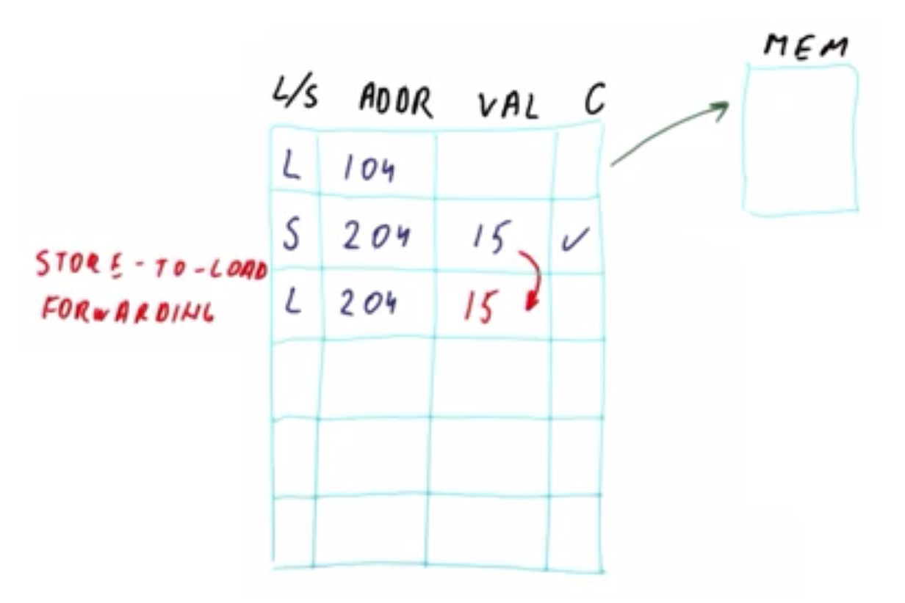
</center>

The third instruction (`I3`) accesses the computed memory address `204`. In general, for every load instruction, the load-store queue (LSQ) is checked to determine if any (upstream) instruction matches the computed address.
  * If there is ***no*** matching store instruction for that address (e.g., as seen previously for instruction `I1`), then the load proceeds to access memory (`MEM`) directly.
  * Conversely, if there ***is*** a matching store instruction for that address, memory (`MEM`) is *not* directly access, but rather **store-to-load forwarding** is performed (i.e., as in this case for instruction `I3`), whereby the corresponding ***value*** from the previous store instruction (i.e., `15` in the case of instruction `I2` forwarded to `I3`) is also produced by the current load instruction in question, *without* a corresponding memory (`MEM`) access.

***N.B.*** Store-to-load forwarding assumes that at the time of the load instruction, the upstream store instruction(s) has/have already been completed, and therefore the computed addresses are known/available at the point of the load instruction.

### 5. LSQ Part 2

<center>
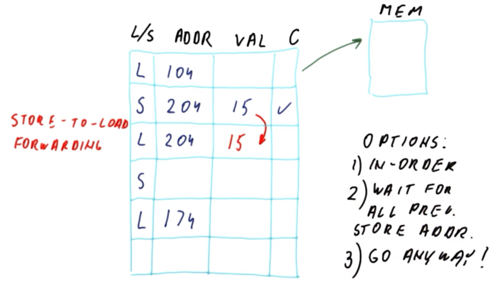
</center>

Proceeding similarly to the subsequent instructions (i.e., `I4` and `I5`), observe that it is entirely possible for the store instruction (`I4`) to *not* have a computed address available at the point at which the load instruction (`I5`) produces its own computed address (e.g., `174`).

The possible resolution **options** in such a scenario are as follows:
  * 1 - **in-order** execution of load and store (i.e., the load instruction is not allowed to execute until all previous instructions have been completed).
    * This guarantees that at the point of execution of the load instruction, all of the store addresses and values are available.
    * However, in reality, loads cannot proceed without resolved upstream stores. For example, if the load instruction in `I1` were a cache miss (requiring a corresponding resolution to proceed), then all of the downstream instructions would have to ***wait*** for this resolution to occur. 
  * 2 - Such ***waiting*** can be reduced by not simply waiting for *all* upstream instructions to resolve, but rather simply waiting for only all previous **stored addresses** to become known/computed.
    * Once all stored addresses are known, the load address can be compared, and the instruction can be consequently determined (i.e., either memory [`MEM`] is accessed if nothing matches, the value is retrieved from the corresponding store if it is available, or we wait for the store to produce the value if the address matches but the store has not yet computed the value).
  * 3 - Alternatively, the *most aggressive* option is to simply **proceed** with the load instruction anyways.

<center>
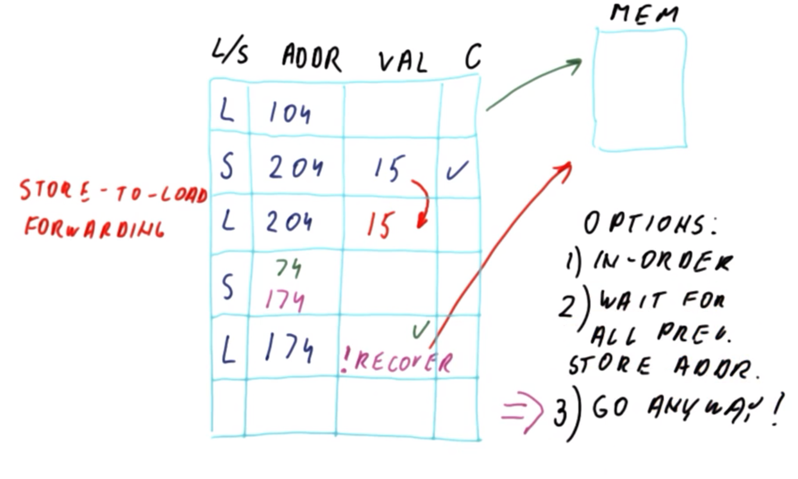
</center>

Following the third option, once the address is computed for the load instruction (e.g., `174`), the computed addresses of the previous store instructions are checked as follows:
  * If one if the store instructions matches, then we ***wait*** for it (i.e., clearly, fetching from memory [`MEM`] is inappropriate in this case).
  * Otherwise, if none of the store instructions match, then we ***ignore*** the fact that some of them might match once their addresses are resolved; in this case, the load instruction will fetch from memory (`MEM`) (denoted by red arrow in the figure shown above). At this point, one of two things can occur:
    * 1 - The store instruction resolves to an address (e.g., `74`, denoted by green font in the figure shown above), in which case we confirm that the load instruction was correspondingly completed.
    * 2 - The store instruction computes the same address (i.e., `174`, denoted by magenta font in the figure shown above), in which case the load instruction has loaded the ***incorrect*** value from memory; in this case, we must **recover** accordingly (i.e., the load instruction loaded the incorrect value, thereby possibly inadvertently supplying it to other downstream instructions).
      * In this case, when the store instructions produce an address, we then check whether any of the downstream load instructions match the address and have subsequently completed execution; if so, then the load instruction is requested to be "redone" (and correspondingly for the downstream instructions), thereby resolving the issue of the load instruction loading the incorrect value.

Most modern processors today use the third option ("go anyway") because it yields the ***best performance***. In practice, if we permit the load instructions to proceed without otherwise waiting for the store instructions, it turns out that most of the time this results in the ***correct*** instructions being executed, achieving a net speedup in performance (i.e., less overall "downtime" due to waiting on store instructions, despite the occasionally incurred cost of recovery in the case of an invalid assumption regarding the validity of the upstream store instruction's address).
  * Furthermore, there are also entire schemes around attempting to predict when such an incorrect assumption will occur, thereby proceeding with load instructions only if this occurrence is unlikely.

## 6. Out-of-Order Load-Store Execution

<center>

</center>

Now, consider what occurs with out-of-order execution of load and store instructions, following the "aggressive" approach of load instructions fetching from memory as soon as their computed address is known, if there is no preceding store instruction that has also computed the same address at the point of execution (which later turns out to resolve to the same address after all).

Consider the following example program, a sequence of instructions in the load-store queue (LSQ):

```mips
LOAD  R3 = 0(R6)   # I1
ADD   R7 = R3 + R9 # I2
STORE R4 → 0(R7)   # I3
SUB   R1 = R1 - R2 # I4
LOAD  R8 = 0(R1)   # I5
```

In an out-of-order processor, when attempting to execute these instructions, the following might occur. (Assume for purposes of discussion that all of these instructions have already been fetched, decoded, etc.)

<center>
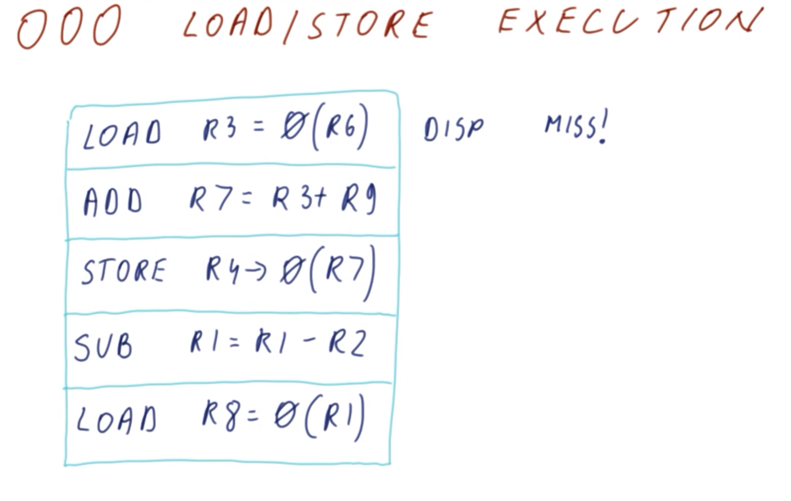
</center>

For instruction `I1` (as in the figure shown above), because the `LOAD` only depends on `R6` (which is not otherwise produced by any other instructions), it can ***dispatch***. Therefore, it fetches from memory, and eventually returns the corresponding value for `R3`.

However, in this scenario, there is a ***cache miss***. Consequently, the `LOAD` instruction will be delayed, pending reconciliation of the correct memory value, and therefore instruction `I1` *cannot* be dispatched until this occurs, thereby impacting the execution of downstream instructions `I2` and `I3` (via corresponding dependency on `R3`).

<center>
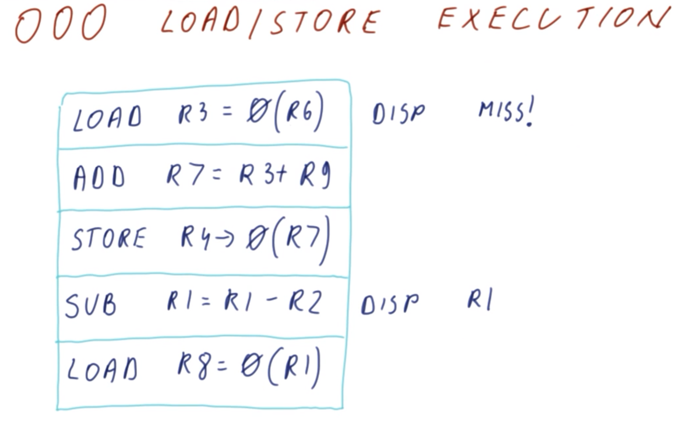
</center>

Meanwhile, instruction `I4` *can* be dispatched (as in the figure shown above), thereby producing `R1` very quickly.

<center>
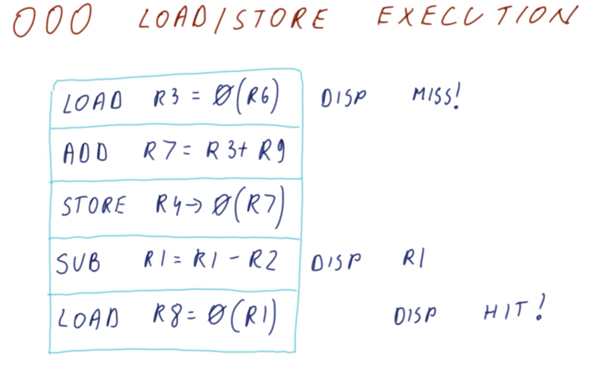
</center>

At this point, `I5` *can* also subsequently dispatch (as in the figure shown above), which in this scenario results in a ***cache hit***. Consequently, the `LOAD` instruction is able to produce `R8` very quickly, thereby supplying it to downstream instructions accordingly.

<center>
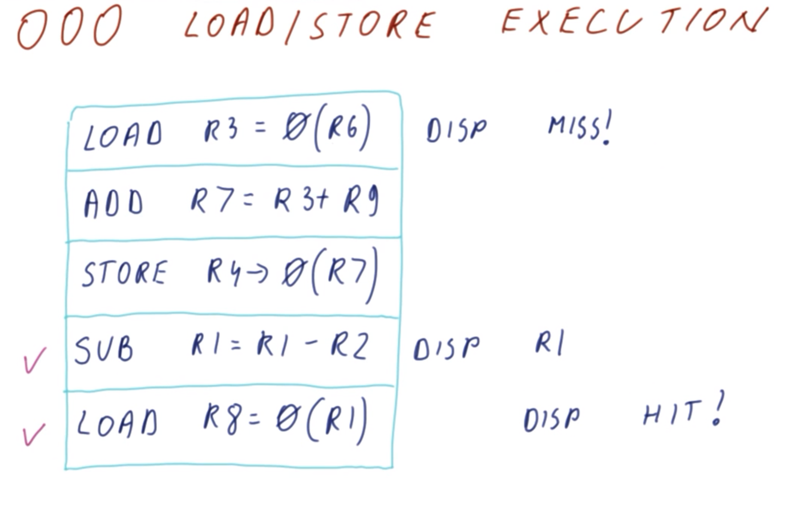
</center>

At this point in the program (as in the figure shown above):
  * Instructions `I4` and `I5` have completed, and are pending commits
  * Meanwhile, upstream instructions `I1`, `I2`, and `I3` are still pending execution, waiting on the instruction `LOAD` (`I1`) to complete 

<center>

</center>

Eventually, the instruction `LOAD` (`I1`), completes (as in the figure shown above). The resulting value `R3` is subsequently fed into instruction `I2` (which in turn completes execution promptly thereafter), and similarly `R7` is fed from instruction `I2` to `I3` for its subsequent execution.

Assuming the resulting address from instruction `I5` was `X`, then let's also assume in this scenario that the resulting address from instruction `X` is *not* `X` (i.e., the address addressed by `R7` in instruction `I3` is *different* from the address addressed by `R1` in downstream instruction `I5`). In this case, there will be *no* issue/conflict, since the instruction `STORE` in `I3` stores a different/unrelated address.

<center>
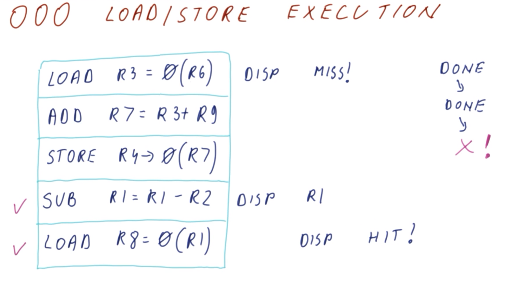
</center>

Conversely, consider the situation in which instruction `I3` *does* compute the value `X` for `R7` (as in the figure shown above). In this case, the value stored in `R4` in instruction `I3` is the value which downstream instruction `I5` *should* actually be using (i.e., in operand `R1`), however, `I5` has already executed by this point, using a ***stale*** value loaded from memory.

We will next discuss the resolution measures for this scenario.

## 7. In-Order Load-Store Execution

<center>
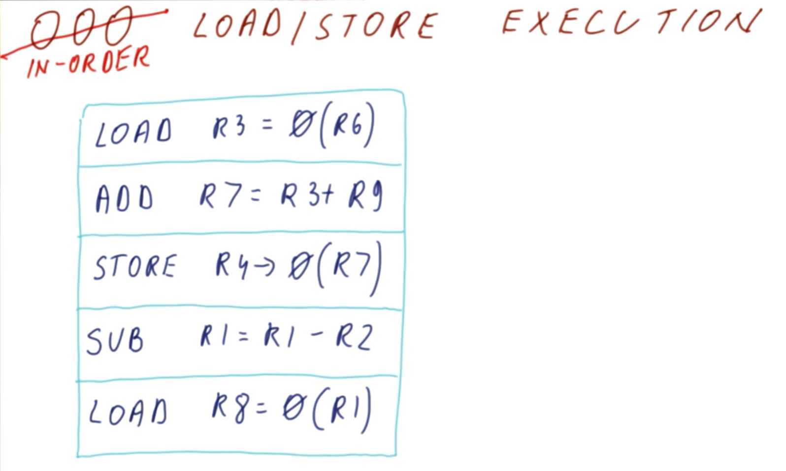
</center>

The first solution to the problem encountered in the previous section is to simply avoid the strategy of out-of-order load-store execution altogether, and instead perform **in-order load-store execution**.

<center>
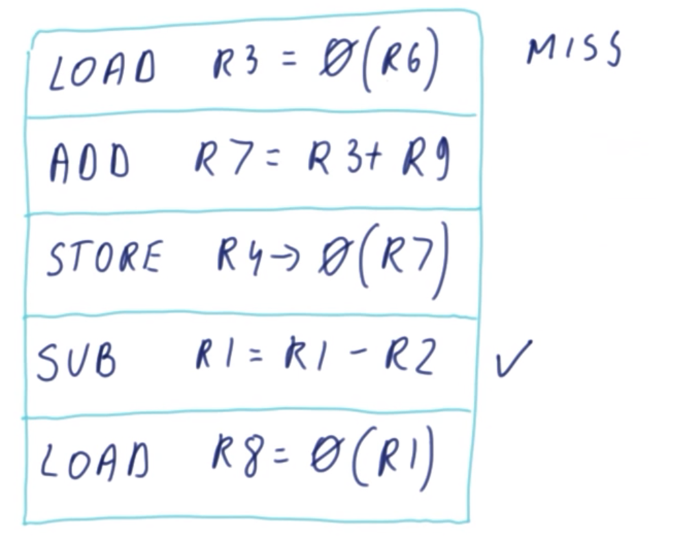
</center>

In the case of in-order load-store execution (as in the figure shown above):
  * The `LOAD` in instruction `I1` is a ***cache miss***, resulting in a stall of the subsequent two instructions (`ADD`/`I2` and `STORE`/`I3`, respectively) pending completion of instruction `I1`.
  * The `SUB` in instruction `I4` completes, providing the address `R1` for subsequent `LOAD` in instruction `I5`. At this point, the load-store queue checks to determine whether any preceding instructions might resolve to the same address; or, even worse, whether *all* of the preceding instructions have even completed in the first place (i.e., if this is *not* the case, then the downstream `LOAD` will be stalled anyhow, pending completion of the upstream instructions). Consequently, the `LOAD` in instruction `I5` does ***not*** fetch from memory, despite having a resolved address available (i.e., `R1`).

<center>
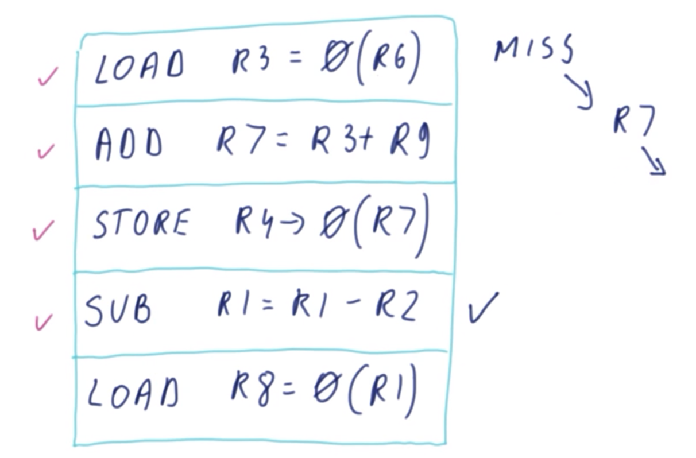
</center>

Eventually, the cache miss in instruction `I1` is resolved, and the instruction `LOAD` is able to proceed (as in the figure shown above). Consequently, instruction `I2` is able to computed `R7` promptly thereafter, and similarly instruction `I3` can now perform its corresponding instruction `STORE`. Furthermore, as instruction `I1` completes, instruction `I4` completes subsequently thereafter.

<center>
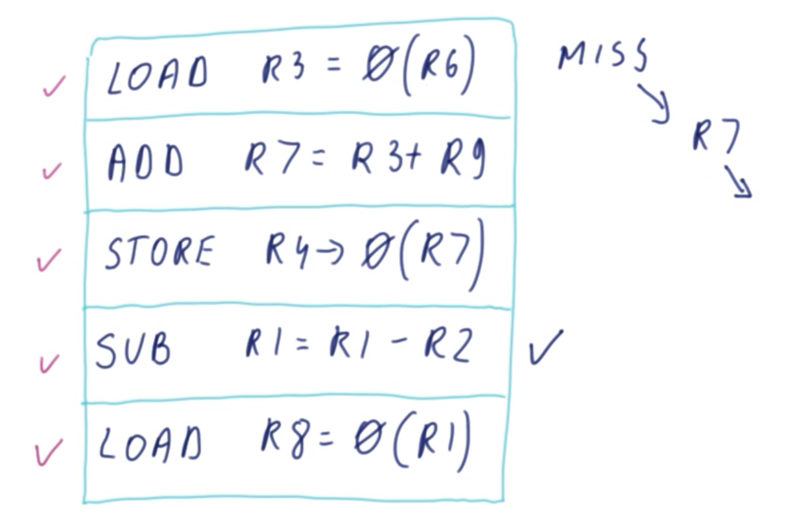
</center>

Note that the `STORE` in instruction `I3` is not considered "completed" when it commits, but rather when its address operand `R7`becomes known, as well as computing the target address (i.e., `R4`); only at this point can the `LOAD` in instruction `I5` proceed, by checking the preceding instructions to determine whether any `STORE`s produced the necessary operand values (i.e., `R1`). Therefore, instruction `I5` can only execute after `I3`, which in turn only completes execution *after* the `LOAD` in instruction `I1` is completed.

Effectively, most of the instructions are executed *out-of-order*, however, load and store instructions still proceed in-order. Of course, it is readily apparent that this is suboptimal if *different*/*distinct* addresses are involved among the load and store instructions, as this introduces otherwise unnecessary execution delays for downstream instructions not otherwise dependent on the upstream instructions' resolved addresses. This problem is further exacerbated if in addition to this delay, the downstream load instructions (e.g., `I5`) result in cache misses, thereby introducing additional execution delays.

Therefore, this strictly in-order load-store execution is *not* a very high-performance resolution strategy, however, it does ensure program correctness.

## 8. Memory Ordering Quiz and Answers

<center>
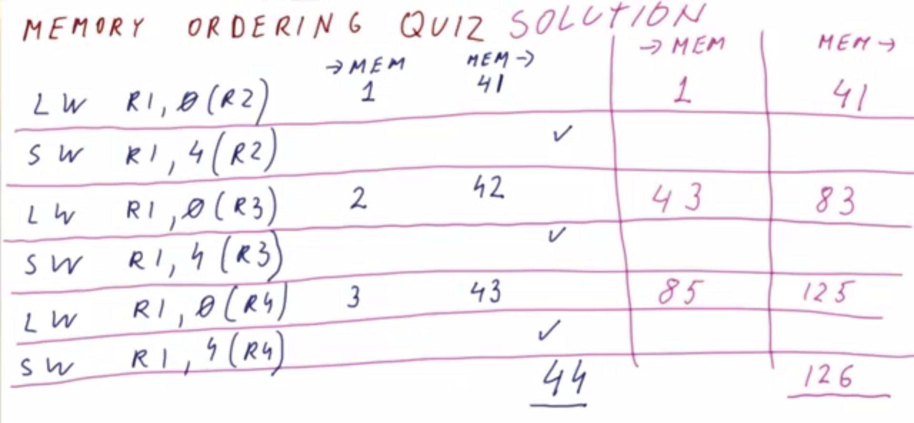
</center>

Consider the following program:

```mips
LW R1, 0(R2) # I1
SW R1, 4(R2) # I2
LW R1, 0(R3) # I3
SW R1, 4(R3) # I4
LW R1, 0(R4) # I5
SW R1, 4(R4) # I6
```

Assume that all of the load instructions (`LW`) are ***cache misses***, resulting in a `40`-cycle delay per cache miss.

The execution proceeds as follows:

| Instruction | Cycle of request to memory (`MEM`) | Cycle of response from memory (`MEM`) | Cycle of store execution |
|:--:|:--:|:--:|:--:|
| `I1` | `C1` | `C41` | (N/A) |
| `I2` | (N/A) | (N/A) | `C42` | 
| `I3` | `C2` | `C42` | (N/A) |
| `I4` | (N/A) | (N/A) | `C43` | 
| `I5` | `C3` | `C43` | (N/A) |
| `I6` | (N/A) | (N/A) | `C44` | 

Therefore, the overall execution requires `44` cycles in total. However, observe that load instructions (`LW`) are performed "***prematurely***" with respect to store instructions (`SW`), e.g., in the case of `I3`, since `R3 + 0 == R2 + 4` via `R2` in upstream instruction `I2`, then in actuality instruction `I3` must wait on instruction `I2` to obtain this correct memory value first (i.e., `R2`) before proceeding with `I3`'s own execution; and so on with respect to the remaining `LW`-`SW` instructions pairs.

Therefore, modify this sequence accordingly for in-order execution to ensure program correctness (i.e., in which cycle does each instruction send a request to memory, and when is the corresponding result returned).

***Answer and Explanation***:

| Instruction | Cycle of request to memory (`MEM`) | Cycle of response from memory (`MEM`) | Cycle of store execution |
|:--:|:--:|:--:|:--:|
| `I1` | `C1` | `C41` | (N/A) |
| `I2` | (N/A) | (N/A) | `C42` | 
| `I3` | `C43` | `C83` | (N/A) |
| `I4` | (N/A) | (N/A) | `C84` | 
| `I5` | `C85` | `C125` | (N/A) |
| `I6` | (N/A) | (N/A) | `C126` | 

As before, instruction `I1` sends a request to memory (`MEM`) in cycle `C1`, with a corresponding response in cycle `C41`. However, instruction `I2` cannot proceed fully, pending `R1` via upstream instruction `I1`. This resolution occurs in cycle `C42`.

Consequently, per the in-order execution requirement, instruction `I3` therefore cannot proceed until cycle `43`, with a corresponding response from `MEM` in cycle `83`. At this point, instruction `I4` can commence execution in cycle `C84`.

Analogously, instruction `I5` does not proceed until cycle `C85`, with a corresponding response from `MEM` in cycle `C126`. Finally, instruction `I6` commences execution in cycle `C126`.

Therefore, with in-order execution, this program executes in `126` total cycles. This is a nearly 3× delay relative to out-of-order execution (cf. `44` total cycles). This demonstrates that there is a marked ***advantage*** in reordering load-store instructions, however, this carries a ***risk*** of potentially requiring **recovery** in the event of loading an incorrect memory value.

## 9. Store-to-Load Forwarding

<center>

</center>

Before discussing how to recover from load operations performed prematurely, first consider the **store-to-load forwarding** problem.

For a ***load*** instruction, we must consider: Which upstream store instruction does it retrieve the value from?
  * Generally, there can be *multiple* store instructions corresponding to the *same* address, any/all of which pertain to the load instruction in question. Therefore, it is necessary to determine *which* of these in particular will supply the necessary value to the load instruction. 
  * Furthermore, if *none* of the upstream store instructions matches, then this must be determined accordingly, in order to correspondingly fetch the instruction from memory (`MEM`).

When a ***store*** instruction is finally resolved, we then must consider: Which downstream load instruction does it supply to value to?
  * There might be a load instruction whose address is already determined; once the store instruction in question determines the corresponding address and value, it should correspondingly relay this value to the load instruction.

Furthermore, note that there can be ***multiple*** downstream load instructions pending this store-instruction-produced value; in this case, how is this determined? This is done so via the **load-store queue (LSQ)**, as discussed next.

## 10. Load-Store Queue (LSQ) Example

<center>

</center>

To illustrate the operation of the **load-store queue (LSQ)**, consider the example in the figure shown above. The load-store queue (LSQ) itself is ordered from ***oldest*** to ***newest*** instructions (stored ***in program-order***), and consists of the following entries:
  * `L/S` - denotes a `LOAD` (`L`) or `STORE` (`S`) instruction
  * `PC` - the **address** (per the **program counter**) from which the load or store instruction was fetched
  * `Seq` - the **sequence number**, which is simply incremented with each instruction
    * ***N.B.*** This section's text will reference instructions unambiguously by `Seq` (e.g., "instruction `41773`").
  * `Addr` - the **address** to which the load or store instruction resolves to
  * `Value` - the resulting **value** computed by the load or store instruction 

<center>
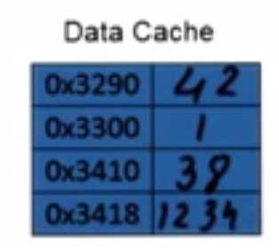
</center>

Furthermore, the **data cache** content is also recorded here for additional reference, whose content is initialized as in the figure shown above.

<center>

</center>

Instruction `41773` executes first, accessing address `0x3290` (via the data cache), producing the corresponding value `42`.

Subsequently, instruction `41774` (prematurely) computes its result as `25` (i.e., tentative target of the store instruction going into memory), however, this value is not yet placed in the data cache, pending its own final commit prior to doing so.

Similarly, instruction `41775` (prematurely) computes its result as `-17`.

<center>

</center>

Instruction `41776` accesses address `0x3418` and determines if any of the upstream store instructions matches this address. Since no upstream store instruction matches, instruction `41776` consequently loads value `1234` from the data cache.

<center>

</center>

Instruction `41777` accesses address `0x3290` and determines if any of the upstream store instructions matches this address. It determines that instruction `41775` matches (the most-recently-occurring upstream store instruction per this address), and correspondingly loads the value `-17` directly, rather than retrieving it from the data cache.

<center>

</center>

Instruction `41778` accesses address `0x3300` and determines if any of the upstream store instructions matches this address. Since no upstream store instruction matches, instruction `41778` consequently loads value `1` from the data cache.

<center>

</center>

Instruction `41779` (prematurely) computes its result as `0` (i.e., tentative target of the store instruction going into memory), however, this value is not yet placed in the data cache, pending its own final commit prior to doing so.

<center>
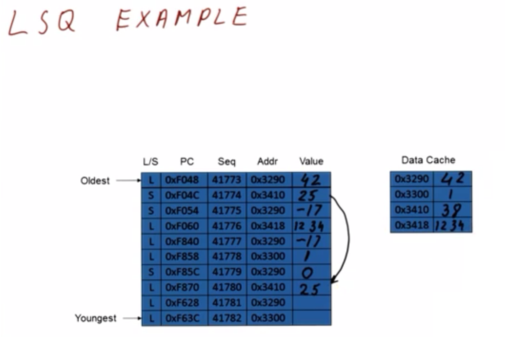
</center>

Instruction `41780` accesses address `0x3410` and determines if any of the upstream store instructions matches this address. It determines that instruction `41774` matches (the most-recently-occurring upstream store instruction per this address), and correspondingly loads the value `25` directly, rather than retrieving it from the data cache.

<center>

</center>

Instruction `41781` accesses address `0x3290` and determines if any of the upstream store instructions matches this address. It determines that instruction `41779` matches (the most-recently-occurring upstream store instruction per this address), and correspondingly loads the value `0` directly, rather than retrieving it from the data cache.
  * Observe that by this point, there are several upstream store instructions corresponding to address `0x3290`, however, it is imperative to retrieve the *most recent* one. This ensures an in-order-like processing of the instructions (i.e., this would be the expected memory-location value at a given point in the program's execution). However, insofar as the *data cache* is concerned, the corresponding value is still `42`, despite several intermediate modifications having occurred up to this point since commencement of the first instruction (i.e., instruction `41773`), none of which have yet sent their corresponding value to the data cache up to this point.

<center>

</center>

Finally, instruction `41782` accesses address `0x3300` and determines if any of the upstream store instructions matches this address. Since no upstream store instruction matches, instruction `41778` consequently loads value `1` from the data cache.
  * ***N.B.*** Upstream instruction `41778`, which also accesses address `0x3300`, is a load instruction rather than a store instruction, and therefore does not impact this current instruction (i.e., instruction `41782`).

<center>

</center>

At some later point, the load and store instructions commence with **committing**.

Instruction `41773` commits, copying its value to the corresponding register, thereby advancing the **oldest pointer** to subsequent instruction `41774`.

<center>
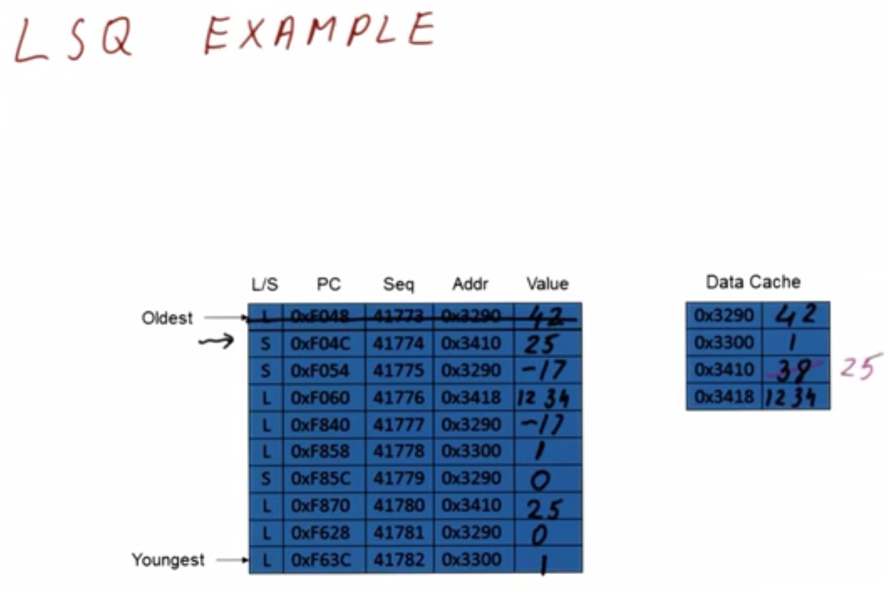
</center>

Instruction `41774` commits, copying its value `25` to the corresponding data-cache address (overriding its existing value `38`), thereby advancing the **oldest pointer** to subsequent instruction `41775`.

<center>
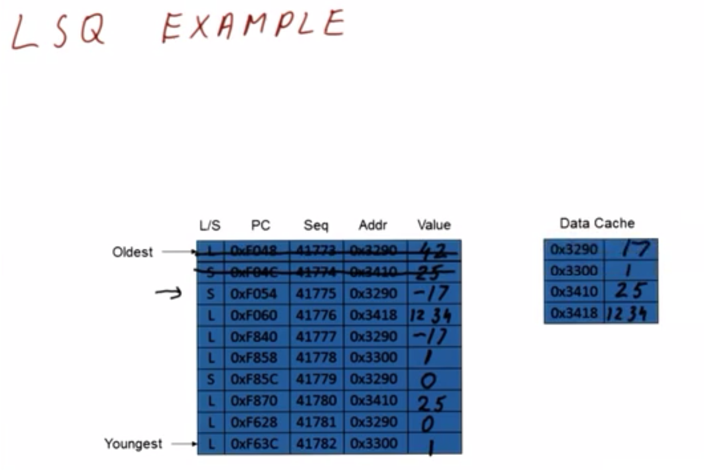
</center>

Instruction `41775` commits, copying its value `17` (*sic*) to the corresponding data-cache address (overriding its existing value `42`), thereby advancing the **oldest pointer** to subsequent instruction `41776`.
  * ***N.B.*** In the lecture video, `-17` is not explicitly used in the data cache, presumably a transposition error (as correspondingly suggested in the figure shown above).

<center>
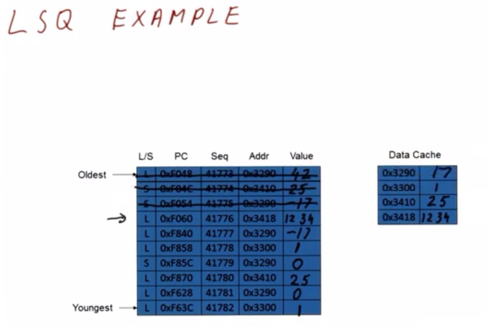
</center>

Recall that values are sent to memory or to cache *at the point of commit* (i.e., but *not* at the point of execution). The reason for this is as follows. Consider the scenario in which an ***exception*** has occurred at this point in the program (i.e., with **oldest pointer** currently pointing to store instruction `41776`). In such a case, we can simply ***flush*** this instruction from the load-store queue (LSQ), thereby maintaining the ***integrity*** of the current value in the data cache (i.e., this data-cache value is the *intended* value at this point in the program's execution, and more generally so at any given point in the program's execution as of the most-recent commit).
  * This corresponds analogously to the architecture register file (ARF) seen previously (cf. Lesson 8), which similarly involved copying and committing of values to registers, thereby ensuring that at any given time, there is no ambiguity with respect to intended (i.e., committed) register value at that point in the program's execution.

<center>
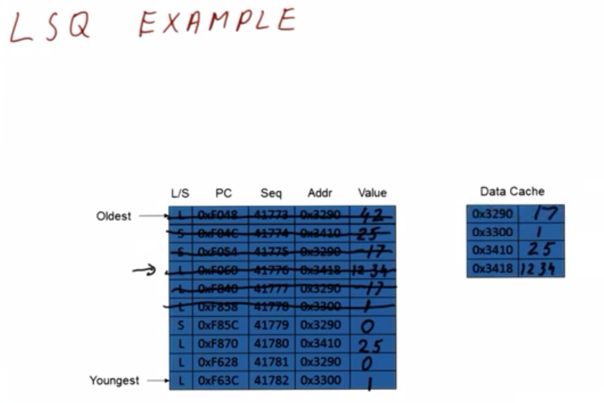
</center>

Proceeding accordingly, instruction `41776` commits, copying its value to the corresponding register, thereby advancing the **oldest pointer** to subsequent instruction `41777`, and correspondingly so for the subsequent two load instructions (i.e., load instructions `41777` and `41778`).

<center>
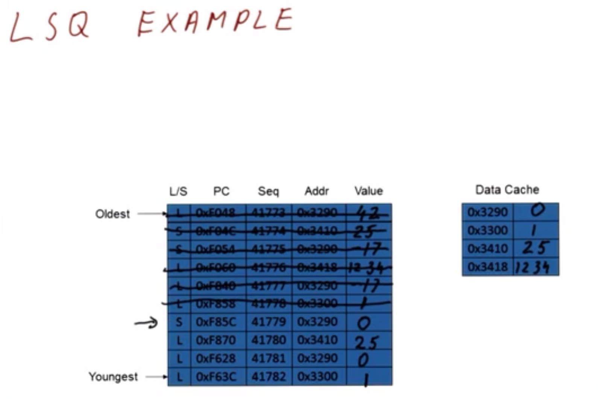
</center>

Instruction `41779` commits, copying its value `0` to the corresponding data-cache address (overriding its existing value `17`), thereby advancing the **oldest pointer** to subsequent instruction `41775`.

<center>
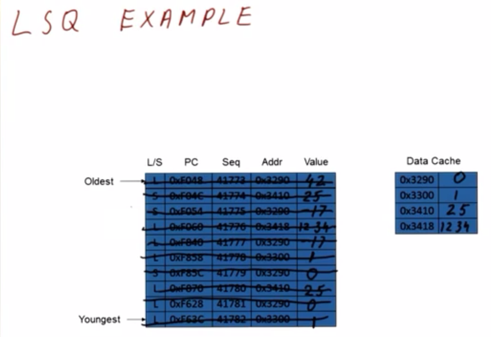
</center>

Finally, the last-remaining load instructions commit.

## 11. Load-Store Queue (LSQ), ReOrder Buffer (ROB), and Reservation Stations (RSes)

<center>
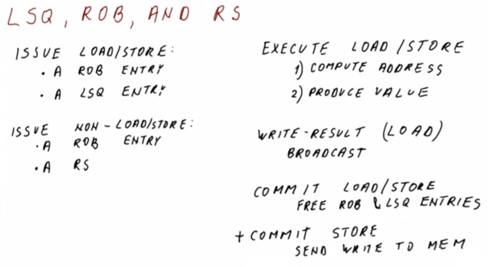
</center>

Consider the relationship between the **load-store queue (LSQ)**, the **reorder buffer (ROB)**, and **reservation stations (RSes)**.

When **issuing** a load or store instruction, this requires the following:
  * A ROB entry, which is required for every instruction in general
  * An LSQ entry, which corresponds analogously (i.e., for load and store instructions specifically) to the RS in a ROB-based configuration

When **issuing** instructions ***other*** than a load or store instruction, this requires the following:
  * A ROB entry, which (as before) is required for every instruction in general
  * An RS of the corresponding instruction type

Note than a load or store instruction ***cannot*** be issued unless ***both*** a ROB entry ***and*** an LSQ entry are available for the instruction in question. Correspondingly, for instructions other than load or store instructions, the instruction in question cannot be issued unless ***both*** a ROB entry ***and*** an RS (of corresponding instruction type) are available.

When **executing** a load or store instruction, this is comprised of two steps:
  * 1 - Compute the address
  * 2 -  Produce the value 

For a load instruction, this entails first computing the address, and then subsequently retrieving the value from memory. Conversely, for a store instruction, these steps could be performed in either order; either way, a store instruction computes the address while also attempting to obtain the value of the register to target for storage of this computed-address value.

The operation **write result** only occurs for load instructions; conversely, for a store instruction, there is no such corresponding operation (i.e., a store instruction does not write the result, but rather maintains the address and the value in the load-store queue [LSQ] for subsequent use by downstream load instructions, as well as for eventual committing to memory).
  * As soon as a load instruction gets a result from an upstream store instruction, the load instruction subsequently **broadcasts** this result to downstream dependent instructions, thereby ensuring that all reservation stations (RSes) awaiting this register value can then proceed accordingly. In this manner, the LSQ provides an analogous role to the RSes.

To subsequently **commit** the load or store instruction, the **ROB head** is advanced (thereby ***freeing*** the ROB entry accordingly), and correspondingly the **LSQ head** is advanced as well (thereby ***freeing*** the LSQ entry accordingly).

Additionally, for store instructions, the write must be **sent** to memory (`MEM`).
  * On commit, the (up to this point) retained address and value must now be finally updated in memory for the program itself.

## 12. Memory Ordering Quiz 1 and Answers

<center>
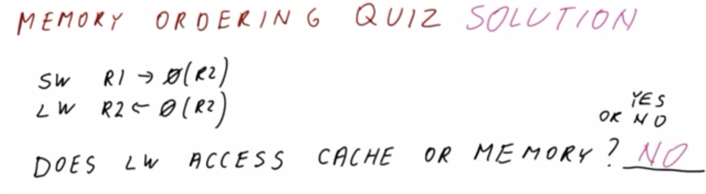
</center>

Given the following consecutive program instructions:

```mips
SW R1 → 0(R2)
LW R2 ← 0(R2)
```

Does the instruction `LW` access cache or memory? (Indicate `Yes` or `No`.)
  * `No`

***Answer and Explanation***:

The instruction `LW` does ***not*** access cache or memory. Since `R2` refers to the ***same*** address, the instruction `LW` will retrieve this value from the ***store***.

## 13. Memory Ordering Quiz 1 and Answers

<center>

</center>

As a follow up to the quiz in the previous section, given that the instruction `LW` does *not* retrieve its value from the cache or memory (but rather the store),  where exactly does the instruction `LW` get its value from? (Select all applicable choices.)
  * A result broadcast
    * `DOES NOT APPLY` - The store does *not* broadcast its resulting value; results are only broadcasted in this manner for instructions producing a *register* result (which does not apply for a store instruction).
  * A reservation station (RS) - RSes never provide any results to subsequent instructions, but rather only capture values for the *current* instruction. Furthermore, even in such a case, store instructions do not interact with RSes in this manner anyhow.
    * `DOES NOT APPLY`
  * A reorder buffer (ROB) entry
    * `DOES NOT APPLY` - A ROB entry *would* maintain a result for a register-producing instruction between the time of broadcast and the time of commit, however, because a store instruction is not a register-value-producing instruction, it does *not* correspondingly place its result in a ROB entry. (In fact, the store does not even technically have such a "result" to place in such a ROB entry in the first place.)
  * A load-store queue (LSQ) entry
    * `APPLIES` - The store instruction *does* maintain the value in the load-store queue. This is where the downstream load instruction(s) searches for a value when attempting to match its address to the corresponding upstream store instruction(s).

## 14. Lesson Outro

In this lesson, we have learned that a load-store queue is required to track dependencies through memory, thereby ensuring correct execution of memory instructions in an otherwise out-of-order processor.

Modern processors have fairly sophisticated load-store queues which facilitate a lot of reordering, including for memory instructions.
