# Compiler ILP

## 1. Lesson Introduction

We have now completed discussion of out-of-order processors (cf. Lessons 6 through 9), which attempt to execute *more* than one instruction per cycle.

Now, in this lesson, we will discuss how the **compiler** can facilitate this process.

## 2. Can Compilers Help to Improve IPC?

<center>
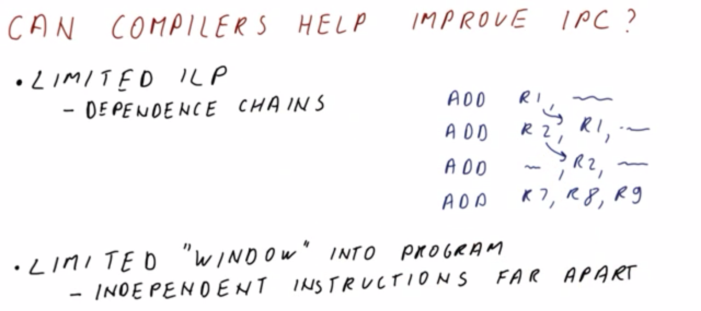
</center>

Can compilers help to improve **instructions per cycle (IPC)** (i.e., the number of instructions per cycle that the processor achieves)?

For this purpose, there are ***two*** particular ways in which the compiler indeed *can* facilitate IPC:
  * The instruction-level parallelism (ILP) of the program itself may be ***intrinsically limited***
    * This may be due to **dependency chains**, whereby instructions can occur in such a manner in which an inter-dependency "chain" forms (e.g., `R1` → `R2` as in the figure shown above). Such a dependency chain(s) can have a detrimental effect on ILP, as this effectively forms a single-instruction-per-cycle "bottleneck" within the program itself. 
      * As we shall see, the compiler can facilitate with resolving this issue, i.e., by eliminating such dependency chains.
  * The **hardware** itself has a limited "window" into the program
    * For example, independent instructions can occur spatiotemporally distantly from each other within the program itself, which may otherwise be amenable to improved ILP for such a program if operating on a capable/ideal processor. However, due to this "distance," a real processor may not be able to appropriately "perceive" this independence between the instructions (e.g., due to exhausted ROB-entries space prior to reaching the distant/downstream but otherwise independent instructions, for example `ADD R7, R8, R9` in the figure shown above, which is otherwise independent of the upstream instructions involving `R1` and `R2`).
      * As we shall see, The compiler can facilitate with resolving this issue, i.e., by placing such "distant" (but otherwise independent) instructions "closer" to each other, thereby achieving improved ILP (and correspondingly increased IPC, closer to the ideally achievable ILP).

## 3. Tree Height Reduction

<center>
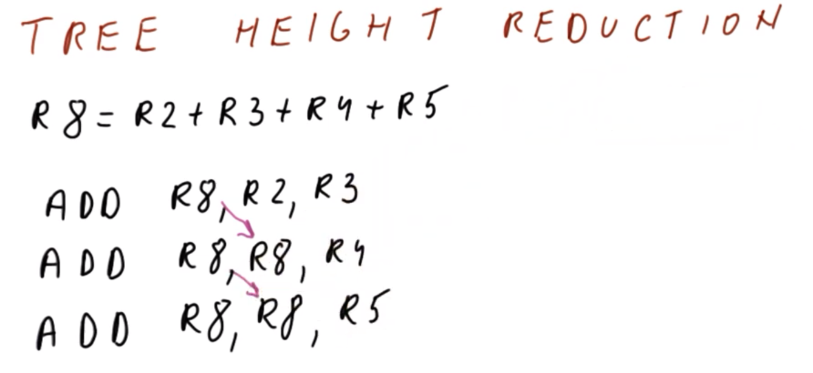
</center>

One example of a compiler-facilitated instruction-level parallelism (ILP) improvement in a program is the technique called **tree height reduction**.

Consider the following program, which computes `R8 = R2 + R3 + R4 + R5`:

```mips
ADD R8, R2, R3 # I1
ADD R8, R8, R4 # I2
ADD R8, R8, R5 # I3
```

Performing the instructions in this manner creates a dependency chain among the three instructions via `R8`, which necessarily imposes a sequential, one-instruction-per-cycle execution of the three instructions in turn.

<center>
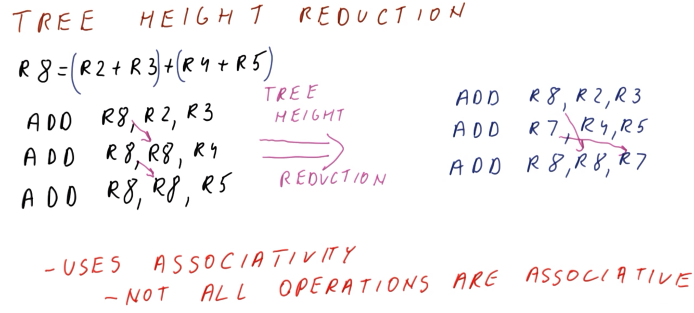
</center>

To resolve this "bottleneck," the compiler performs tree height reduction as follows. The compiler determines that instead of sequential summing the numbers (thereby creating a dependency chain), it can alternatively group the instructions' additions as pairs `(R2 + R3)` and `(R4 + R5)`, with each pair being independently determinate/computable, resulting in the following modification of the program:

```mips
ADD R8, R2, R3 # I1ʹ
ADD R7, R4, R5 # I2ʹ
ADD R8, R8, R7 # I3ʹ
```

This correspondingly allows for instructions `I1′` and `I2′` to be executed independently of each other, reducing the overall cycles requirement from `3` (strictly sequentially) to `2` (instructions `I1′` and `I2′` executing in parallel, followed by instruction `I3′`).

Note that tree height reduction is ***not*** always feasible. In this particular case, it exploits the intrinsic **associativity** of addition operations; however, ***not*** all operations are associative in this manner. Therefore, such a technique is only appropriate if it does ***not*** otherwise alter the intended/correct semantics of the (in-order-equivalent) program itself.

## 4. Tree Height Reduction Quiz and Answers

<center>

</center>

Consider the following program, which computes the arithmetic expression `R1 + R2 - R3 + R4 - R5 + R6 - R7`:

```mips
ADD R10, R1, R2  # I1
SUB R10, R10, R3 # I2
ADD R10, R10, R4 # I3
SUB R10, R10, R5 # I4
ADD R10, R10, R6 # I5
SUB R10, R10, R7 # I6
```

Observe that a dependency chain forms in this program via `R10`. Correspondingly, the instruction-level parallelism (ILP) of this program is as follows:

```
6 instructions / 6 cycles = 1 instruction/cycle
```

Perform a tree height reduction on this program, in order to improve instruction-level parallelism (ILP), and compute the correspondingly improved ILP.

***Answer and Explanation***:

To implement tree height reduction in this program, observe there are three addition operations (which *are* associative) and three subtraction operations (which are *not* associative). Correspondingly, we can reorder these operations to perform the additions first (and consequently in parallel), as well as use the distributive property with respect to the subtraction (i.e., correspondingly grouping the operands into upstream addition operations prior to subtracting), thereby transforming the target expression to the following: `((R1 + R2) + (R4 + R6)) - ((R3 + R5) + R7)`.

The resulting modified program is as follows:

```mips
ADD R10, R1, R2   # I1′
ADD R11, R4, R6   # I2′
ADD R10, R10, R11 # I3′
ADD R11, R3, R5   # I4′
ADD R11, R11, R7  # I5′
SUB R10, R10, R11 # I6′
```

The corresponding instruction-level parallelism (ILP) is as follows:
* Instructions `I1′` and `I2′` have no dependencies between them, however, instruction `I3′` depends on these upstream instructions' results.
* Instruction `I4′` has no upstream dependencies, and therefore can execute immediately on program start.
* Instruction `I5′` is dependent on the result of upstream instruction `I4′`.
* Instruction `I6′` is dependent on the results of upstream instructions `I3′` and `I5′`.

Correspondingly, these instructions can be executed as follows:

| Instruction | Earliest possible cycle of execution |
|:--:|:--:|
| `I1′` | `C1` |
| `I2′` | `C2` |
| `I3′` | `C1` |
| `I4′` | `C1` |
| `I5′` | `C2` |
| `I6′` | `C3` |

Therefore, the resulting ILP from this tree height reduction is:

```
6 instructions / 3 cycles = 2 instructions/cycle
```

Which is a 2× improvement over the original single-instruction-per-cycle (i.e., dependency-chain-limited) version of the program.

## 5. Make Independent Instructions Easier to Find

<center>

</center>

In the following sections of this lesson, we will examine the **techniques** which make independent instructions within a program easier for a *real* processor to find (as opposed to an *ideal* processor, which is otherwise capable of examining an *infinite* number of instructions "ahead," unlike a real processor whose capability is limited to only a *finite* number of upcoming instructions).

This will be examined in the context of the following two techniques in particular:
  * **Instruction scheduling** for simple branch-free instruction sequences
    * This includes loop-specific techniques, such as **loop unrolling** (and in particular how these techniques interact with instruction scheduling)
  * **Trace scheduling**, an even more powerful technique

## 6. Instruction Scheduling

<center>
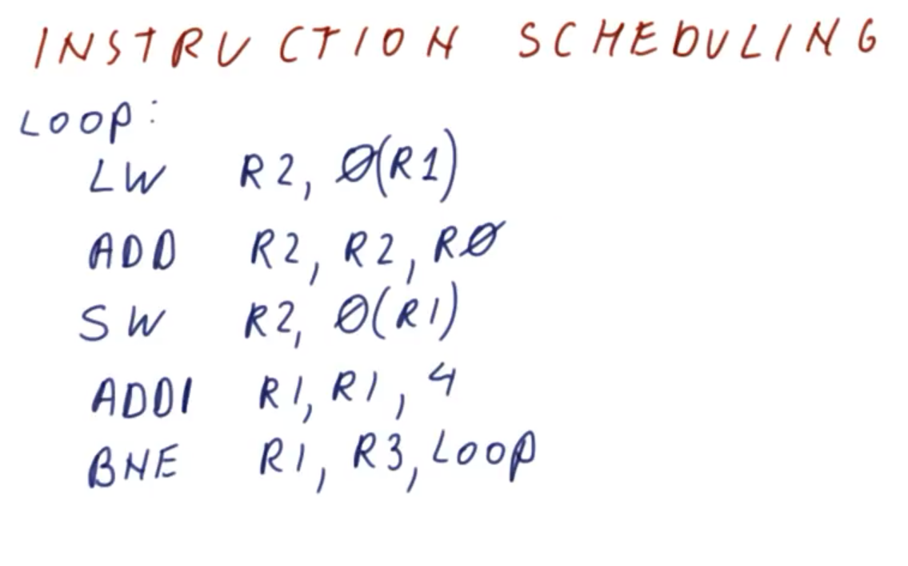
</center>

Consider compiler-facilitated **instruction scheduling**, as per the following program (an iterative loop):

```mips
loop:
  LW   R2, 0(R1)    # I1
  ADD  R2, R2, R0   # I2
  SW   R2, 0(R1)    # I3
  ADDI R1, R1, 4    # I4
  BNE  R1, R3, Loop # I5
```

* ***N.B.*** This compiler-facilitated instruction scheduling is different/distinct from the instruction scheduling examined previously in the context of Tomasulo's algorithm (cf. Lesson 7), wherein *hardware* is used to reorder instructions in a disparate manner from the program-order initially generated by the compiler. Instead, here, the *compiler* itself will perform an analogous optimization with respect to program ordering (i.e., independently of and prior to the actual machine-code generation for subsequent hardware execution).

<center>
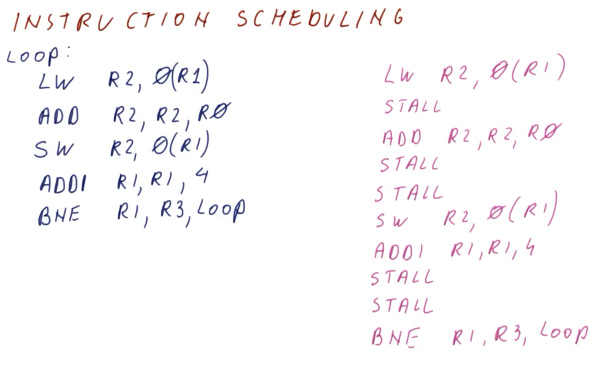
</center>

First, consider the scenario of a ***simple processor*** (as in the figure shown above), which can only examine the very next instruction (i.e., it is not otherwise attempting to execute the program out-of-order via reservation stations or equivalent mechanism).

In this case, the program sequence occurs as follows:

<table style="width: 100%; text-align: center;">
  <tr>
    <th>Cycle</th>
    <th>Instruction Executed</th>
    <th>Description</th>
  </tr>
  <tr>
    <td><code>C1</code></td>
    <td><code>I1</code></td>
    <td rowspan="2">Instruction <code>I1</code> requires two cycles to fetch the value from the cache and place it in register <code>R2</code>, thereby requiring a stall of one cycle prior to executing subsequent instruction <code>I2</code></td>
  </tr>
  <tr>
    <td><code>C2</code></td>
    <td><code>stall</code></td>
  </tr>
  <tr>
    <td><code>C3</code></td>
    <td><code>I2</code></td>
    <td rowspan="3">Instruction <code>I2</code> requires three cycles to perform the addition operation (i.e., add <code>R0</code> to <code>R2</code>, with corresponding dependency on upstream instruction <code>I1</code> with respect to operand <code>R2</code>), thereby requiring a stall of two cycle prior to executing subsequent instruction <code>I3</code></td>
  </tr>
  <tr>
    <td><code>C4</code></td>
    <td><code>stall</code></td>
  </tr>
  <tr>
    <td><code>C5</code></td>
    <td><code>stall</code></td>
  </tr>
  <tr>
    <td><code>C6</code></td>
    <td><code>I3</code></td>
    <td>Instruction <code>I3</code> can proceed in cycle <code>C6</code>, after appropriate resolution of operand <code>R2</code> via upstream instruction <code>I2</code></td>
  </tr>
  <tr>
    <td><code>C7</code></td>
    <td><code>I4</code></td>
    <td rowspan="3">Instruction <code>I4</code> can proceed in cycle <code>C7</code>, with no upstream dependencies (including instruction <code>I3</code>, which only reads mutual operand <code>R1</code>), however, this instruction introduces a two-cycle stall for its execution prior to executing subsequent instruction <code>I5</code></td>
  </tr>
  <tr>
    <td><code>C8</code></td>
    <td><code>stall</code></td>
  </tr>
  <tr>
    <td><code>C9</code></td>
    <td><code>stall</code></td>
  </tr>
  <tr>
    <td><code>C10</code></td>
    <td><code>I5</code></td>
    <td>Instruction <code>I5</code> can proceed in cycle <code>C10</code>, after appropriate resolution of operand <code>R1</code> via upstream instruction <code>I4</code></td>
  </tr>
</table>

<center>
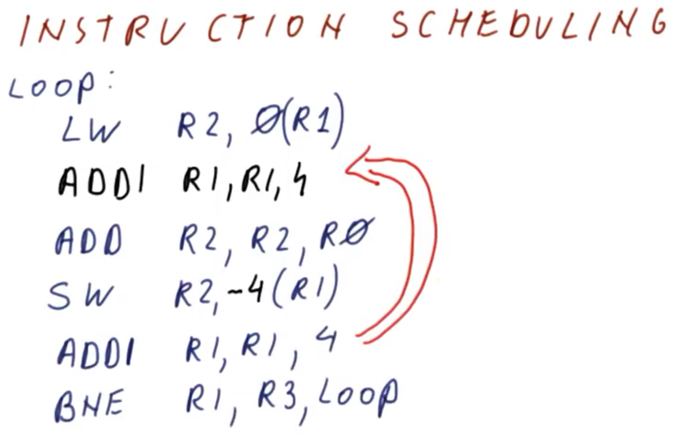
</center>

Now, consider the possible intervention by the compiler to improve the processor's performance with this program. Given the same processor as before, how can the compiler reduce the overall cycles per loop iteration (i.e., `10` per above analysis)?

The compiler can analyze the program as follows:
  * Since the `ADD` in instruction `I2` cannot be performed *immediately* following the `LW` in instruction `I1` (i.e., due to the two-cycle requirement for the `ADD`), it can find an alternate instruction to place in the `I2` position which does *not* depend on the corresponding `LW`.
  * The `SW` in instruction `I3` does depend on the operand of `I2` (i.e., `R2`), however, the `ADDI` in instruction `I4` does *not* have a dependency on the upstream `LW` in instruction `I1`, and therefore instruction `I4` could be placed "upstream" in the program relative to its current position, without otherwise affecting the semantics of the program itself

In performing this modification (i.e., moving `ADDI R1, R1, 4` to upstream position/instruction `I2′`), there must also be a corresponding adjustment in the offset of the `SW` in instruction `I4` to account for this (i.e., new offset `-4`, rather than `0` as before), thereby maintaining the otherwise correct value of operand `R1` for subsequent/downstream instructions.

<center>
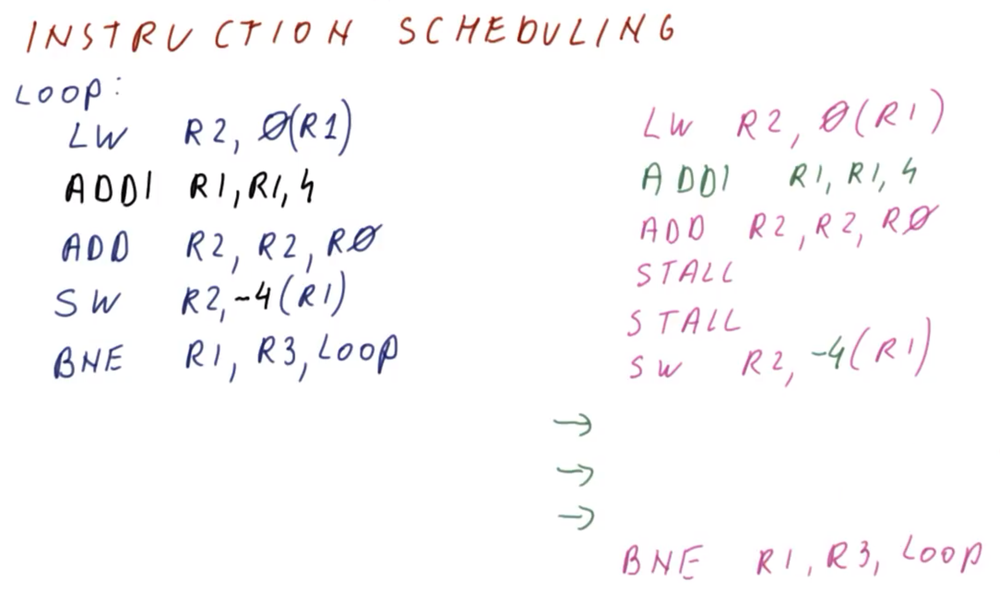
</center>

Per the modified program as follows:

```mips
loop:
  LW   R2, 0(R1)    # I1
  ADDI R1, R1, 4    # I2′
  ADD  R2, R2, R0   # I3′
  SW   R2, -4(R1)   # I4′
  BNE  R1, R3, Loop # I5
```

The corresponding cycles analysis is as follows:

<table style="width: 100%; text-align: center;">
  <tr>
    <th>Cycle</th>
    <th>Instruction Executed</th>
    <th>Description</th>
  </tr>
  <tr>
    <td><code>C1</code></td>
    <td><code>I1</code></td>
    <td>Instruction <code>I1</code> requires two cycles to fetch the value from the cache and place it in register <code>R2</code></td>
  </tr>
  <tr>
    <td><code>C2</code></td>
    <td><code>I2′</code></td>
    <td>Instruction <code>I2′</code> can proceed in cycle <code>C2</code>, with no upstream dependencies (and furthermore effectively eliminating the stall introduced by upstream instruction <code>I1</code>), however, this instruction introduces a two-cycle stall for its execution prior to executing subsequent instruction <code>I5</code></td>
  </tr>
  <tr>
    <td><code>C3</code></td>
    <td><code>I3′</code></td>
    <td rowspan="3">Instruction <code>I3′</code> requires three cycles to perform the addition operation (i.e., add <code>R0</code> to <code>R2</code>, with corresponding dependency on upstream instruction <code>I1</code> with respect to operand <code>R2</code>), thereby requiring a stall of two cycle prior to executing subsequent instruction <code>I4′</code></td>
  </tr>
  <tr>
    <td><code>C4</code></td>
    <td><code>stall</code></td>
  </tr>
  <tr>
    <td><code>C5</code></td>
    <td><code>stall</code></td>
  </tr>
  <tr>
    <td><code>C6</code></td>
    <td><code>I4′</code></td>
    <td>Instruction <code>I4′</code> can proceed in cycle <code>C6</code>, after appropriate resolution of operand <code>R2</code> via upstream instruction <code>I3′</code></td>
  </tr>
  <tr>
    <td><code>C7</code></td>
    <td><code>I5</code></td>
    <td>Instruction <code>I5</code> can proceed in cycle <code>C7</code>, after appropriate resolution of operand <code>R1</code> via upstream instruction <code>I2′</code> (furthermore, there is no stalls-induced delay, as the three-cycle execution of instruction <code>I2′</code> will have already completed by the start of upstream cycle <code>C5</code>)</td>
  </tr>
</table>

In this compiler-facilitated instruction scheduling, several of the intermediate stalls have been (either explicitly or effectively) eliminated, resulting in a net reduction from `10` cycles to `7` cycles per loop iteration in this program.

## 7. Instruction Scheduling Quiz and Answers

<center>
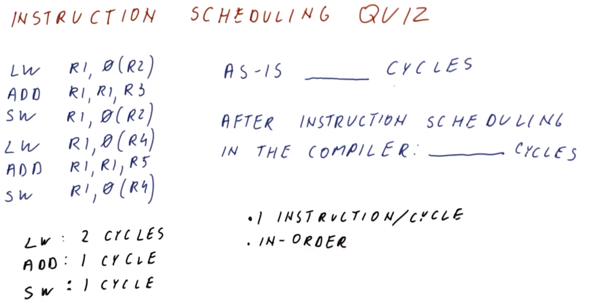
</center>

Consider the following program:

```mips
LW  R1, 0(R2)  # I1
ADD R1, R1, R3 # I2
SW  R1, 0(R2)  # I3
LW  R1, 0(R4)  # I4
ADD R1, R1, R5 # I5
SW  R1, 0(R4)  # I6
```

With respect to instructions' execution, assume the following:
  * Instruction `LW` requires `2` cycles to execute
  * Instruction `ADD` requires `1` cycle to execute
  * Instruction `SW` requires `1` cycle to execute

Furthermore, assume that the processor is characterized as before (cf. Section 5), i.e., it performs strictly `1` instruction per cycle and executes in-program-order.

How many cycles does this program require to execute as-is? How many cycles does this program require after modification via instruction scheduling in the compiler?

***Answer and Explanation***:

<center>
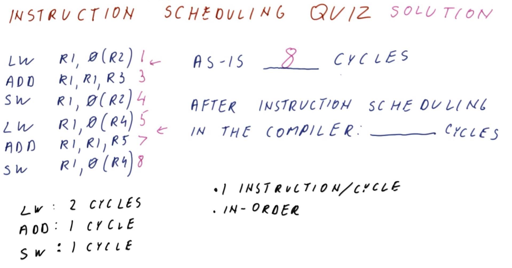
</center>

First, consider the as-is scenario. The corresponding per-cycle analysis is as follows:

<table style="width: 100%; text-align: center;">
  <tr>
    <th>Cycle</th>
    <th>Instruction Executed</th>
    <th>Description</th>
  </tr>
  <tr>
    <td><code>C1</code></td>
    <td><code>I1</code></td>
    <td rowspan="2">Instruction <code>I1</code> requires two cycles to fetch the value from the cache and place it in register <code>R1</code>, thereby requiring a stall of one cycle prior to executing subsequent instruction <code>I2</code></td>
  </tr>
  <tr>
    <td><code>C2</code></td>
    <td><code>stall</code></td>
  </tr>
  <tr>
    <td><code>C3</code></td>
    <td><code>I2</code></td>
    <td>Instruction <code>I2</code> requires one cycle to perform the addition operation (i.e., add <code>R3</code> to <code>R1</code>, with corresponding dependency on upstream instruction <code>I1</code> with respect to operand <code>R1</code>)</td>
  </tr>
  <tr>
    <td><code>C4</code></td>
    <td><code>I3</code></td>
    <td>Instruction <code>I3</code> requires one cycle to perform the store instruction</td>
  </tr>
  <tr>
    <td><code>C5</code></td>
    <td><code>I4</code></td>
    <td rowspan="2">Instruction <code>I4</code> requires two cycles to fetch the value from the cache and place it in register <code>R1</code>, thereby requiring a stall of one cycle prior to executing subsequent instruction <code>I5</code></td>
  </tr>
  <tr>
    <td><code>C6</code></td>
    <td><code>stall</code></td>
  </tr>
  <tr>
    <td><code>C7</code></td>
    <td><code>I5</code></td>
    <td>Instruction <code>I5</code> requires one cycle to perform the addition operation (i.e., add <code>R5</code> to <code>R1</code>, with corresponding dependency on upstream instruction <code>I4</code> with respect to operand <code>R1</code>)</td>
  </tr>
  <tr>
    <td><code>C8</code></td>
    <td><code>I6</code></td>
    <td>Instruction <code>I6</code> requires one cycle to perform the store instruction</td>
  </tr>
</table>

Therefore, as-is, this program requires `8` cycles.

<center>
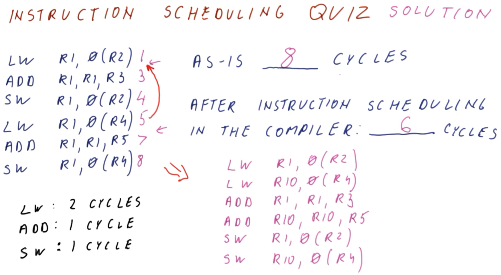
</center>

Now, consider the compiler-facilitated instruction scheduling scenario. To avoid the stall in cycle `C2`, we must "move up" a downstream instruction which does not otherwise depend on instruction `I1` as-is. This can be achieved by moving instruction `I5` to the second-instruction position (and correspondingly using a non-conflicting register for its target operand, i.e., from `R1` to `R10`). The updated program is thus as follows:

```mips
LW  R1, 0(R2)    # I1
LW  R10, 0(R4)   # I2′
ADD R1, R1, R3   # I3′
ADD R10, R10, R5 # I4′
SW  R1, 0(R2)    # I5′
SW  R10, 0(R4)   # I6′
```

The corresponding per-cycle analysis in the updated program is as follows:

<table style="width: 100%; text-align: center;">
  <tr>
    <th>Cycle</th>
    <th>Instruction Executed</th>
    <th>Description</th>
  </tr>
  <tr>
    <td><code>C1</code></td>
    <td><code>I1</code></td>
    <td>Instruction <code>I1</code> requires two cycles to fetch the value from the cache and place it in register <code>R1</code></td>
  </tr>
  <tr>
    <td><code>C2</code></td>
    <td><code>I2′</code></td>
    <td>Instruction <code>I2′</code> requires two cycles to fetch the value from the cache and place it in register <code>R10</code></td>
  </tr>
  <tr>
    <td><code>C3</code></td>
    <td><code>I3′</code></td>
    <td>Instruction <code>I3′</code> requires one cycle to perform the addition operation (i.e., add <code>R3</code> to <code>R1</code>, with corresponding dependency on upstream instruction <code>I1</code> with respect to operand <code>R1</code>), however, there is no stalls-induced delay, as the two-cycle execution of instruction <code>I1</code> will have already completed by the start of cycle <code>C3</code></td>
  </tr>
  <tr>
    <td><code>C4</code></td>
    <td><code>I4′</code></td>
    <td>Instruction <code>I4′</code> requires one cycle to perform the addition operation (i.e., add <code>R5</code> to <code>R10</code>, with corresponding dependency on upstream instruction <code>I2′</code> with respect to operand <code>R10</code>), however, there is no stalls-induced delay, as the two-cycle execution of instruction <code>I2′</code> will have already completed by the start of cycle <code>C4</code></td>
  </tr>
  <tr>
    <td><code>C5</code></td>
    <td><code>I5′</code></td>
    <td>Instruction <code>I5′</code> requires one cycle to perform the store instruction</td>
  </tr>
  <tr>
    <td><code>C6</code></td>
    <td><code>I6′</code></td>
    <td>Instruction <code>I6′</code> requires one cycle to perform the store instruction</td>
  </tr>
</table>

In this compiler-facilitated instruction scheduling, *both* of the intermediate stalls have been eliminated, resulting in a net reduction from `8` cycles to `6` cycles.

## 8. Scheduling and If Conversion

<center>
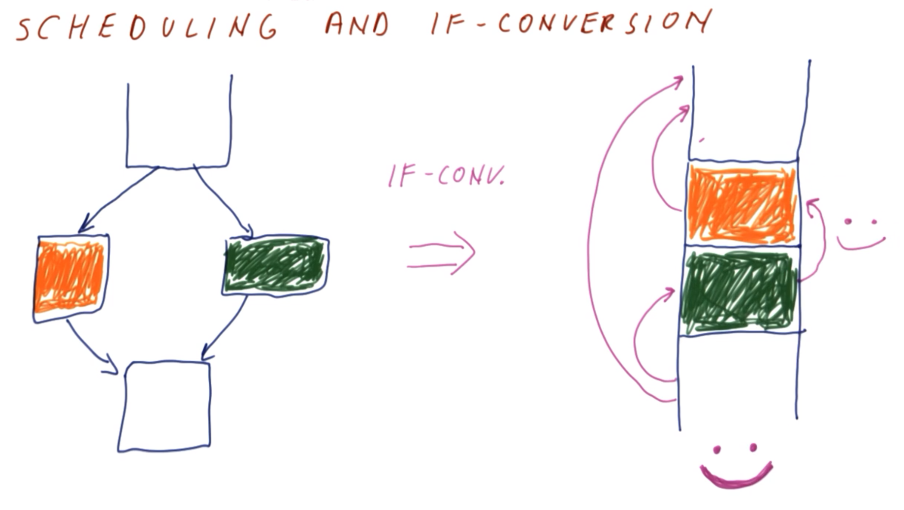
</center>

Having seen how compiler-facilitated instruction scheduling works, now consider how such compiler optimization interacts with **if conversion**.

Recall (cf. Lesson 5) that if conversion transforms branching code as in the left portion of the figure shown above (where orange is the `if` branch, and green is the `else` branch).
  * Before performing the if conversion, the code section upstream of the if-converted branches (uncolored in the figure shown above) can be ***easily*** rescheduled. Similarly, *within* the branched code sections (i.e., orange and green per the figure shown above) rescheduling can be performed easily, as well as in the code section downstream of the branches (uncolored in the figure shown above).
  * However, rescheduling in if schedule becomes ***challenging*** for instructions spanning ***across*** the if-converted branches to the downstream code section (e.g., if the downstream code section contains an instruction to fill a store in the green section, then if branching ultimately directs to the orange section, then ultimately this downstream instruction is never executed).

After if conversion is performed (as in the right portion of the figure shown above), the post-transformation code is effectively "inlined" into a branch-free sequence. Consequently, *all* of the instructions execute in turn, with appropriate predication applied. In this manner, instructions can "cross" the code sections readily without issue (e.g., green section to orange section, downstream section to green section, orange section to upstream section, and even downstream section up to upstream section).

Therefore, overall, if conversion introduces many more opportunities for replacing stall cycles with useful instructions, thereby improving compiler-facilitated instruction scheduling in addition to the aforementioned (cf. Lesson 5) benefit with respect to branch prediction (i.e., avoiding otherwise unnecessary branch instructions).

## 9. If Conversion for a Loop

<center>
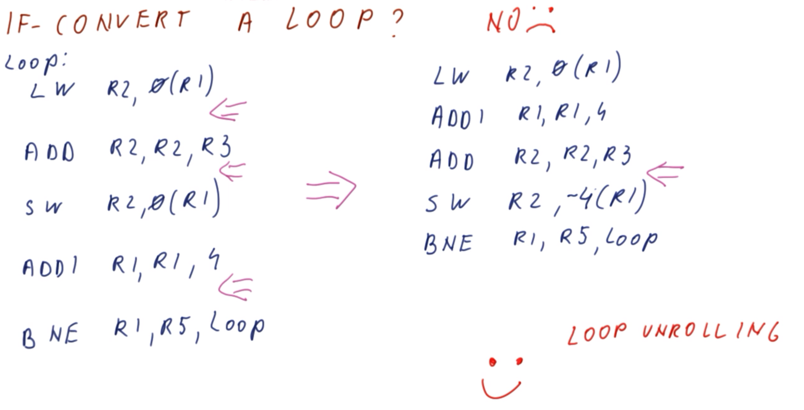
</center>

Having seen the performance improvement provided by if conversion, can this technique also be useful in a loop? Recall the loop program from Section 5, as in the figure shown above. Assume that each instruction requires `2` cycles to execute.
  * Before the compiler-facilitated instruction scheduling (left side of the figure shown above), there are three stall cycles (denoted by left-directed magenta arrows in the figure shown above).
  * After the compiler-facilitated instruction scheduling (right side of the figure shown above), there is still a necessary stall cycle, since the store instruction `SW` must be performed before the branching instruction `BNE`, and furthermore the instruction `SW` has an upstream dependency (`ADD R2, R2, R3`, via operand `R2`) which introduces the necessary stall accordingly (i.e., to complete the instruction `ADD`).

Examining the right-side code, in principle, if conversion would allow to perform the branching code immediately following the branching instruction `BNE`, thereby eliminating the branch via predication, possibly further eliminating the remaining stall. However, in such a scenario, a loop is ***not*** amenable to if conversion because for every subsequent iteration of the loop, it would be necessary to produce a new predicate, which in turn would add this additional overhead *per loop iteration*, with the resulting new predicates only becoming useful/relevant when the predicate is actually true. This in turn would have an adverse impact on performance (e.g., a million-iterations loop with only *one* predicate actually being true).

Therefore, an alternative to if conversion for loops (i.e., moving things "upstream" from "future" iterations) with a similar synergistic improvement on compiler-facilitated instruction scheduling is desirable. This improvement *does* in fact exist: It is called **loop unrolling**, which is discussed next.

## 10. Loop Unrolling

<center>
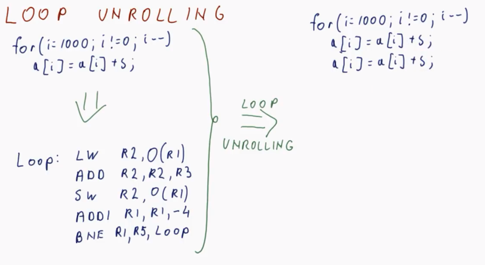
</center>

Consider the following C code:

```c
for (int i = 1000; i != 0; i--)
  a[i] = a[i] + s;
```

The corresponding instructions are as follows:

```mips
Loop:
  LW   R2, 0(R1)    # I1 - `R1` is the pointer to the `i`th element of the array, i.e., `a[i]`
  ADD  R2, R2, R3   # I2 - `R3` is the added quantity `s`
  SW   R2, 0(R1)    # I3 - update `a[i]`
  ADDI R1, R1, -4   # I4 - decrement pointer, i.e., `i--`
  BNE  R1, R5, Loop # I5 - check if pointer has reached the beginning of the array, i.e., `a[0]` via check `i == 0`
```

Applying **loop unrolling** to this loop code ***once*** yields the following:

```c
for (int i = 1000; i != 0; i--) {
  a[i] = a[i] + s;
  a[i] = a[i] + s;
}
```

Here, with a ***single*** unrolling, each given iteration of the loop will also perform the work of the ***next*** loop iteration.

<center>
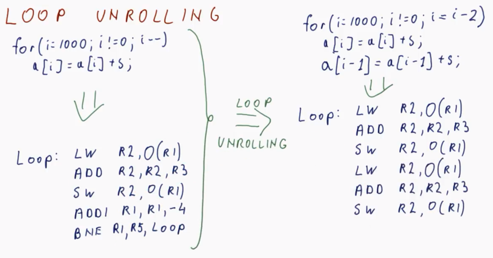
</center>

However, this requires an additional adjustment to the indexes (i.e., to avoid simply doing the "same" work "twice") as follows:

```c
for (int i = 1000; i != 0; i = i - 2) {
  a[i] = a[i] + s;
  a[i-1] = a[i-1] + s;
}
```

Consequently, this ***new*** loop arrangement yields a corresponding ***halving*** of the necessary loop iterations, which each new loop performing ***twice*** the work of the original loop iterations.

***N.B.*** This unrolling technique can be generalized (e.g., unrolling ***twice*** in order to ***triple*** the per-iteration work, etc.)

For this once-unrolled loop example, the corresponding instructions are as follows (i.e., doubling of the per-iteration-work instructions):

```mips
Loop:
  LW   R2, 0(R1)    # I1
  ADD  R2, R2, R3   # I2
  SW   R2, 0(R1)    # I3
  LW   R2, 0(R1)    # I4
  ADD  R2, R2, R3   # I5
  SW   R2, 0(R1)    # I6
  ⋮                 # previous instructions `ADDI ...` and `BNE ...` as before
```

<center>
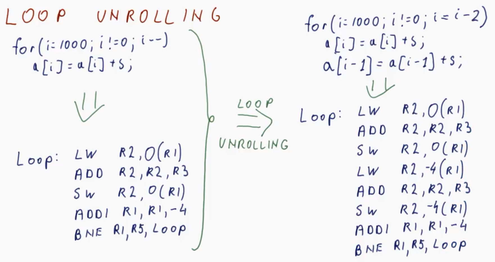
</center>

However, this requires a corresponding "indexes adjustment" to avoid "double (redundant) work," as follows:

```mips
Loop:
  LW   R2, 0(R1)    # I1
  ADD  R2, R2, R3   # I2
  SW   R2, 0(R1)    # I3
  LW   R2, -4(R1)   # I4 - adjust index/offset to `-4`, i.e., `a[i-1]`
  ADD  R2, R2, R3   # I5
  SW   R2, -4(R1)   # I6 - adjust index/offset to `-4`, i.e., `a[i-1]`
  ADDI R1, R1, -4   # I7
  BNE  R1, R5, Loop # I8
```

<center>
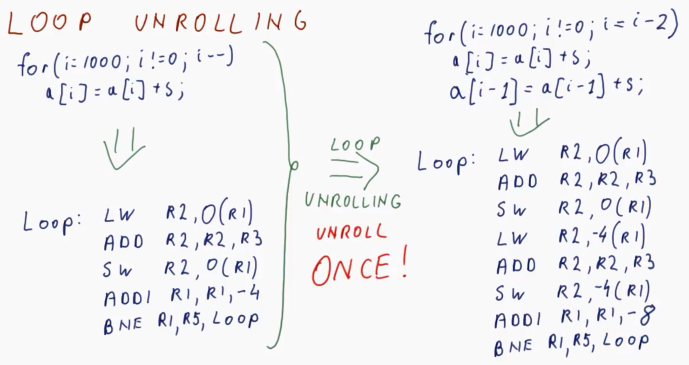
</center>

Additionally, a similar adjustment must be made for the loop update (i.e., `i = i - 2`), as follows:

```mips
Loop:
  LW   R2, 0(R1)    # I1
  ADD  R2, R2, R3   # I2
  SW   R2, 0(R1)    # I3
  LW   R2, -4(R1)   # I4
  ADD  R2, R2, R3   # I5
  SW   R2, -4(R1)   # I6
  ADDI R1, R1, -8   # I7 - adjust offset to `-8`, i.e., `i - 2`
  BNE  R1, R5, Loop # I8
```

Therefore, the net change for a once-unrolled loop is to duplicate the looping instructions, and then make corresponding updates to the loop-iterating indexing logic; collectively, this is what is meant by "***unroll once***. By generalization, unrolling `n` times has a corresponding `n + 1` repetition of per-loop work (e.g., unrolling ***twice*** performs ***triple*** per-loop work, unrolling ***thrice*** performs ***quadruple*** per-loop work, etc.).
  * ***N.B.*** By corollary, the "baseline loop" is effectively ***not unrolled*** (i.e., unrolled "***zero***" times, but ***not*** unrolled *once*, i.e., beware not to mix up the concepts of the loop logic itself vs. the corresponding level of unrolling!).

## 11-13. Loop Unrolling Benefits

Now, let's consider the ***benefits*** of loop unrolling, as discussed in turn in the following subsections.

### 11. Benefit: Reduction in Overall Instructions to Execute

<center>
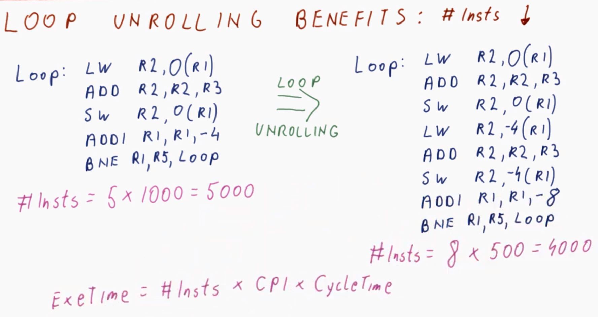
</center>

The first benefit of loop unrolling is a **reduction** in the overall number of program instructions.

Recall from the previous section (cf. Section 9) that the corresponding unrolled-once loop (as in the figure shown above) yielded a reduction from:
 ```
 5 instructions per iteration × 1000 loop iterations = 5000 instructions
 ```

to:
```
8 instructions per iteration × 500 loop iterations = 4000 instructions
```

This is a considerable reduction in the number of instructions required to perform this loop. This is accomplished here by reducing the **looping overhead** (i.e., trailing instruction `ADDI` and `BNE` to iterate to the next loop, which are only applied to half as many iterations with the once-unrolled modification).

Recall the iron law (cf. Lesson 2) as follows:

```
CPU Execution Time = # instructions in the program × cycles per instruction × clock cycle time
```

Applying this formalism to the present example, the `clock cycle time` remains unchanged for a given processor, and the CPI (`cycles per instruction`) may or may not have changed. However, the most direct impact here from loop unrolling is with respect to the `# instructions in the program`, i.e., its ***reduction*** yields a corresponding overall reduction in the `CPU Execution Time`.

Next, let's consider the effect on the CPI.

### 12-13. Benefit: Reduction in Cycles per Instruction (CPI)

<center>
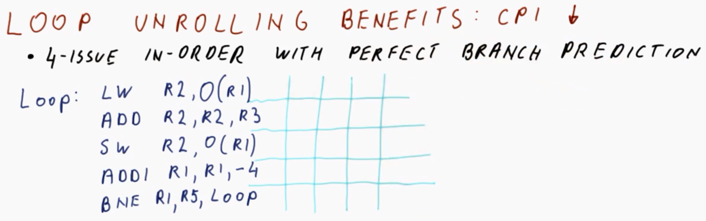
</center>

As it turns out, another benefit of loop unrolling is a **reduction** in the cycles per instruction (i.e., in addition to reducing the overall number of instructions).

To assess the effect of loop unrolling on cycles per instruction, consider a processor characterized as follows:
  * `4`-issue, in-order
    * capable of "looking ahead" at the next four instructions to determine which (if any) can be executed together
  * perfect branch prediction

First, consider a per-cycle analysis when executing the original/unrolled loop, to determine which instruction(s) can execute in a given cycle.
  * ***N.B.*** In the figure shown above, the ***cycles*** correspond to the ***columns*** (i.e., one column per cycle).

<center>
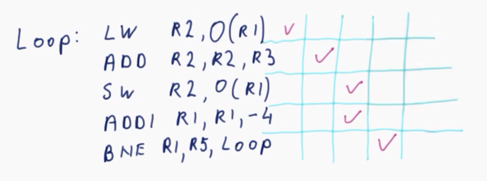
</center>

Recalling (cf. Section 9) the original/unrolled loop as follows (and correspondingly as in the figure shown above):

```mips
Loop:
  LW   R2, 0(R1)    # I1
  ADD  R2, R2, R3   # I2
  SW   R2, 0(R1)    # I3
  ADDI R1, R1, -4   # I4
  BNE  R1, R5, Loop # I5
```

In cycle `C1`, instruction `I1` executes, however, `I2` cannot yet execute due to dependency on operand `R2` with respect to preceding instruction `I1`. Therefore, instruction `I2` does not commence execution until cycle `C2`.

Similarly, instruction `I3` does not execute until cycle `C3`, due to its dependency on preceding instruction `I2` via common/mutual operand `R2`.

Conversely, instruction `I4` does ***not*** depend on its preceding instruction, therefore, it can also execute in cycle `C3` accordingly.

Lastly, instruction `I5` does depend on preceding instruction `I4` via common/mutual operand `R1`, and therefore `I5` cannot execute until cycle `C4` accordingly.

<center>
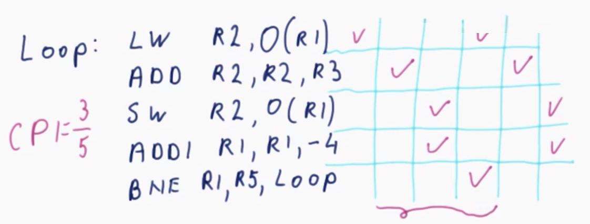
</center>

Now, consider the next loop iteration (as in the figure shown above).

Because of perfect branch prediction, the operation `LW` in instruction `I1` can actually be fetched from the ***next*** iteration without otherwise depending on the current/in-progress (first) branch, and therefore can be executed in cycle `C4` (i.e., simultaneously with instruction `I5`'s execution from the previous/first loop).

For the subsequent per-loop instructions (i.e., `I2` through `I4`) the corresponding analysis from the previous loop holds as well, yielding a corresponding additional two cycles (i.e., cycles `C5` and `C6`).

Therefore, generalizing across cycles, after the initial load (i.e., instruction `I1`), which occurs in a distinct cycle (i.e., `C1`) on commencing the first loop iteration, there is a `3` cycle requirement ***per loop*** to perform all `5` of the loop instructions. Correspondingly, on a per-loop basis, there is a CPI of `3/5`.

<center>
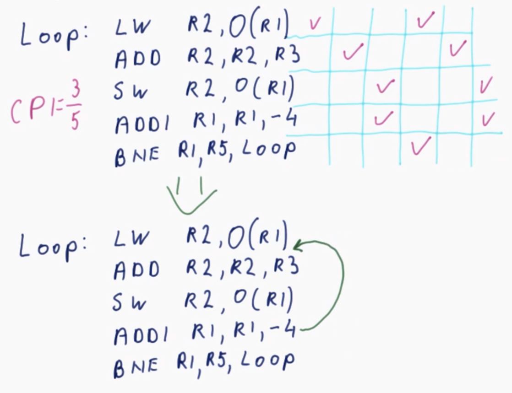
</center>

Before considering the corresponding impact of unrolling the loop, first consider the effect of compiler-facilitated instruction scheduling, as in the figure shown above.

Recall that there is a dependence between instructions `I1` and `I2` (i.e., via common/mutual operand `R2`). Furthermore, instruction `I5` must remain at the end of the loop in order to enforce program correctness. However, instruction `I4` can be reordered (i.e., "moved up") to improve cycles utilization without otherwise impacting the semantics of the program.

<center>
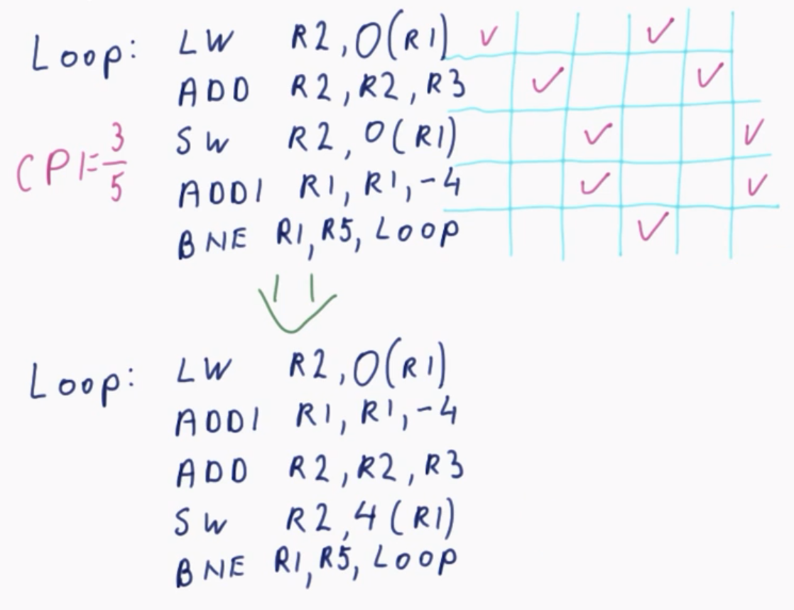
</center>

In the correspondingly updated program (as in the figure shown above), the necessary adjustments are made as follows:

```mips
Loop:
  LW   R2, 0(R1)    # I1
  ADDI R1, R1, -4   # I2′
  ADD  R2, R2, R3   # I3′
  SW   R2, 4(R1)    # I4′ - adjust offset to `4` (i.e., "add back" 4 from upstream offset in instruction I2′)
  BNE  R1, R5, Loop # I5
```

In this particular case, operation `ADDI` is the only instruction amenable to reordering in this manner, as otherwise there is a strict order-dependency among the other remaining instructions.

<center>
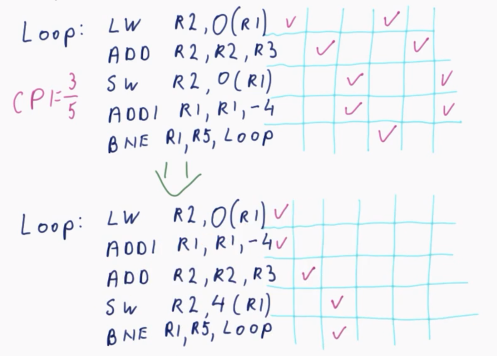
</center>

Now, consider a corresponding per-cycle analysis of the compiler-facilitated scheduling, as in the figure shown above.

In the first loop iteration, in cycle `C1`, both instructions `I1` and `I2′` can be performed simultaneously (i.e., there is no dependency between them). However, instruction `I3′` is dependent on instruction `I1` via common/mutual operand `R2`, and therefore instruction `I3′` cannot commence execution until cycle `C2`.

Similarly, instruction `I4′` cannot commence execution until cycle `C3` due to dependency on operand `R2`. Furthermore, instruction `I5` can commence execution in cycle `C3` as well.

<center>
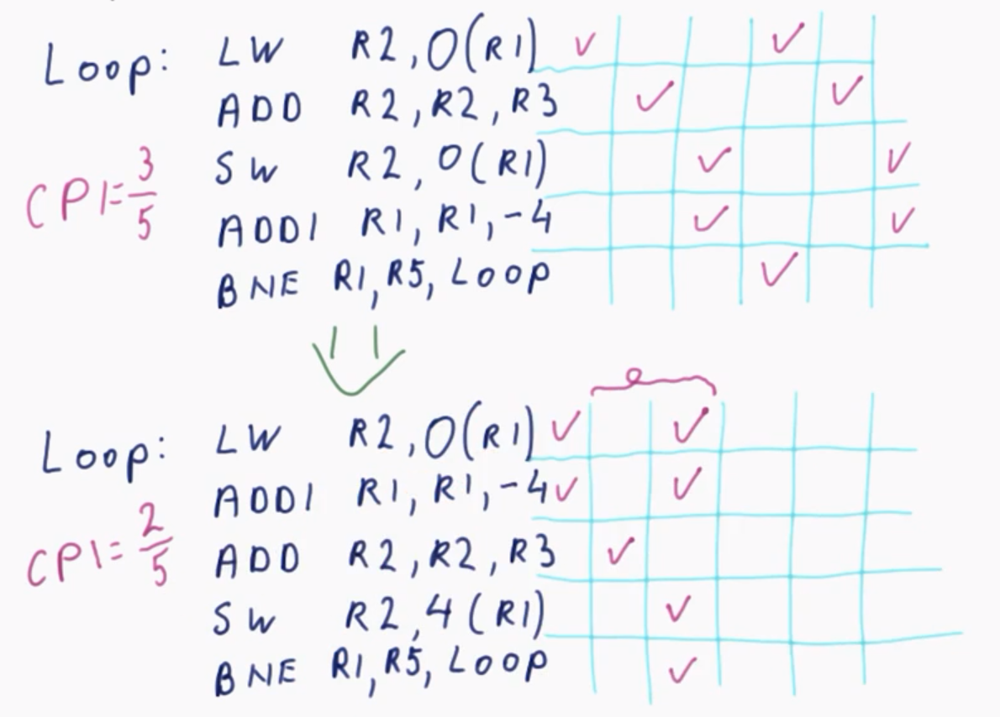
</center>

In the subsequent loop iteration, as previously (i.e., in the not-unrolled baseline case), due to perfect branch prediction, the branching *can* proceed to the next iteration as the first/previous iteration is in progress, and therefore instruction `I1` commences execution in cycle `C3`. Furthermore, since there is no modification of common/mutual operand `R1`, instruction `I2′` can also commence execution in cycle `C3` as well.

Therefore, generalizing across cycles, after the initial load (i.e., instruction `I1`), which occurs in a distinct cycle (i.e., `C1`) on commencing the first loop iteration, there is a `2` cycle requirement ***per loop*** to perform all `5` of the loop instructions. Correspondingly, on a per-loop basis, there is a(n improved) CPI of `2/5 = 0.4` via compiler-facilitated instruction scheduling (cf. CPI of `3/5 = 0.6` in the baseline case).

Now, let's additionally consider the **compound** effects of compiler-facilitated instruction scheduling ***and*** loop unrolling on cycles per instruction.

<center>
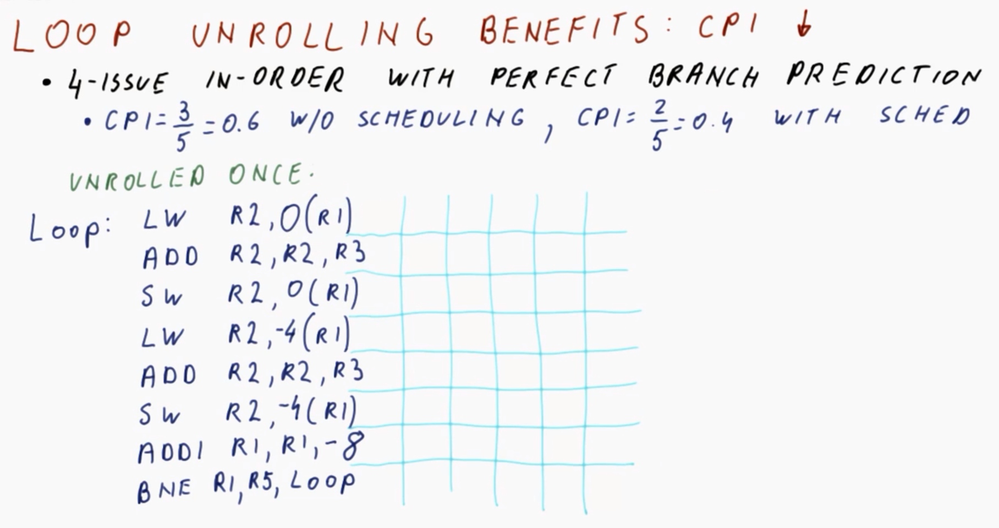
</center>

As before, consider a per-cycle analysis when executing the once-unrolled loop (but ***without*** compiler-facilitated instruction scheduling), to determine which instruction(s) can execute in a given cycle. Recall (cf. Section 9) that the once-unrolled modification of the loop is as follows:

```mips
Loop:
  LW   R2, 0(R1)    # I1
  ADD  R2, R2, R3   # I2
  SW   R2, 0(R1)    # I3
  LW   R2, -4(R1)   # I4
  ADD  R2, R2, R3   # I5
  SW   R2, -4(R1)   # I6
  ADDI R1, R1, -8   # I7
  BNE  R1, R5, Loop # I8
```

<center>
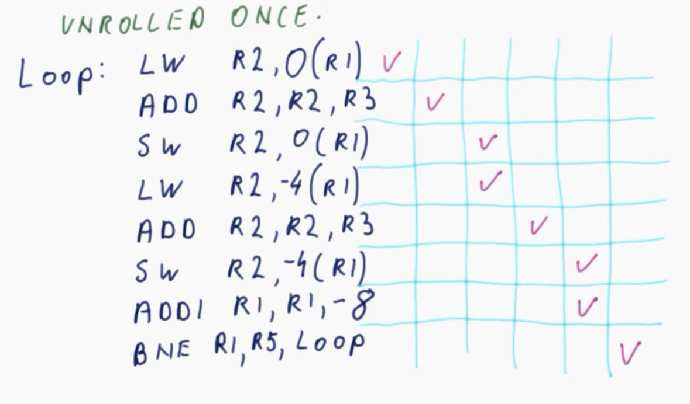
</center>

In the first loop iteration, there is a successive dependency in the first three instructions (i.e., `I1` through `I3`) via mutual/common operand `R2`, and therefore correspondingly these instructions executive in three successive cycles (i.e., `C1` through `C3`, respectively).

Instruction `I4` can also commence execution in cycle `C3`, as it has no upstream dependency. However, the subsequent instructions `I5` and `I6` do have corresponding upstream dependencies (i.e., via mutual/common operand `R2`), and therefore occur in subsequent cycles `C4` and `C5` (respectively).

Instruction `I7` can also commence in cycle `C5`, as it has no upstream dependency. However, the subsequent instruction `I8` has a corresponding upstream dependency (i.e., via mutual/common operand `R1`), and therefore occurs in subsequent cycle `C6`.


<center>
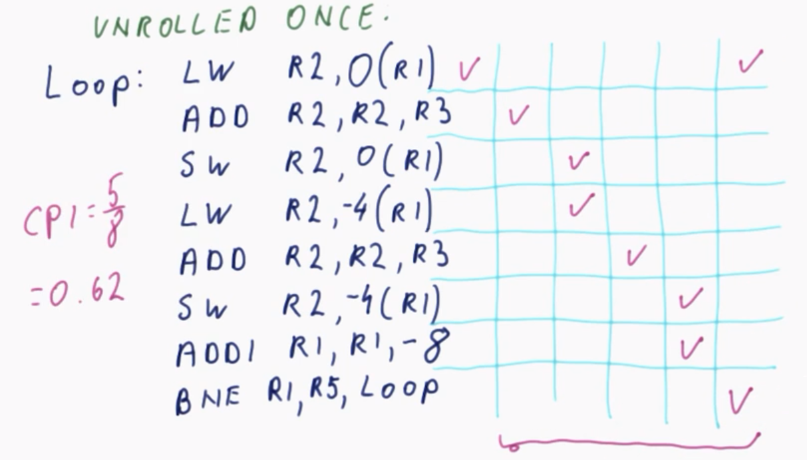
</center>

In the subsequent loop iteration, as before, due to perfect branch prediction, instruction `I1` can also commence execution in cycle `C6` (i.e., proceed onto the next cycle as the first/current cycle finishes execution).

Therefore, generalizing across cycles, after the initial load (i.e., instruction `I1`), which occurs in a distinct cycle (i.e., `C1`) on commencing the first loop iteration, there is a `5` cycle requirement ***per loop*** to perform all `8` of the loop instructions. Correspondingly, on a per-loop basis, there is a (comparable) CPI of `5/8 = 0.625` via once-unrolled loop unrolling (cf. CPI of `3/5 = 0.6` in the baseline case). Here, there is no particular benefit with respect to CPI, however, there is still a net improvement via the aforementioned reduction in overall program instructions (cf. Section 11).

<center>
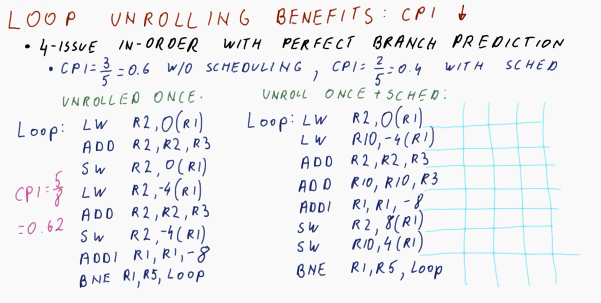
</center>

Now, consider a per-cycle analysis when executing the once-unrolled loop  ***with*** compiler-facilitated instruction scheduling, to determine which instruction(s) can execute in a given cycle. The corresponding modification (once-unrolled with compiler-facilitated instruction scheduling) of the loop is as follows:

```mips
Loop:
  LW   R2, 0(R1)    # I1
  LW   R10, -4(R1)  # I2′ - use register `R10` to avoid dependency via `R2`
  ADD  R2, R2, R3   # I3′
  ADD  R10, R10, R3 # I4′ - use register `R10` to avoid dependency via `R2`
  ADDI R1, R1, -8   # I5′
  SW   R2, 8(R1)    # I6′ - adjust index/offset to `8` to match I5′
  SW   R10, 4(R1)   # I7′ - use register `R10` to avoid dependency via `R2`, and adjust index/offset to `4` to match I2′
  BNE  R1, R5, Loop # I8
```

In analyzing the program, the downstream load operation (`LW`) can be moved up (i.e., to new position `I2′`) and performed in parallel with the initial load operation (i.e., instruction `I1`).

Furthermore, the adding operations `ADD` and `ADDI` can be moved up per corresponding absence of upstream dependencies.

The store operations (`SW`s) can then subsequently commence execution in turn. Note the corresponding adjustments in index/offset via their respectively paired common/mutual operand `R1` (which in turn is modified in upstream instruction `I5′`) per correspondingly matched/paired upstream load operations (`LW`s).

Lastly, the branching operation `BNE` (instruction `I8`) occurs at the end, as before.

<center>
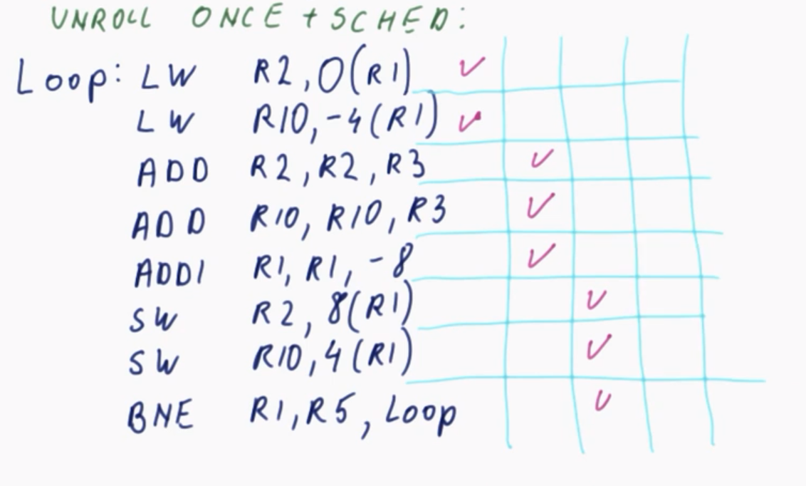
</center>

In the first loop iteration, instructions `I1` and `I2′` occur in parallel in cycle `C1`. However, there is an upstream dependency via mutual/common operand `R2` which prevents instruction `I3′` from executing in this cycle, and therefore instruction `I3′` commences execution in the next cycle, `C2`.

Nevertheless, due to the compiler-facilitated instruction scheduling, the subsequent addition operations (i.e., `I4′` and `I5′`) *can* also occur in the same cycle (i.e., `C2`) due to an absence of upstream dependencies.

Similarly, instruction `I6′` cannot commence execution until the subsequent cycle `C3` (i.e., due to upstream dependency via mutual/common operand `R1`), however, the subsequent instructions (i.e., `I7′` and `I8`) can also occur in this same cycle, `C3`. 

there is a successive dependency in the first three instructions (i.e., `I1` through `I3`) via mutual/common operand `R2`, and therefore correspondingly these instructions executive in three successive cycles (i.e., `C1` through `C3`, respectively).

<center>
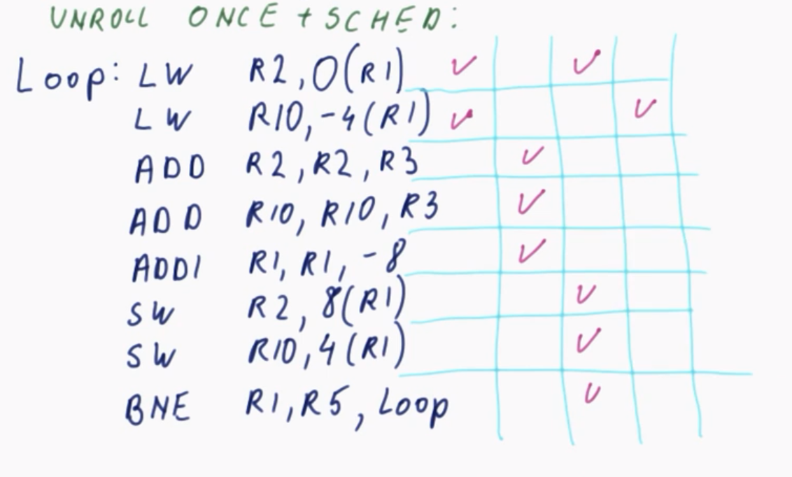
</center>

In the subsequent loop iteration, as before, due to perfect branch prediction, instruction `I1` can also commence execution in cycle `C3` (i.e., proceed onto the next cycle as the first/current cycle finishes execution).

However, instruction `I2′` cannot yet execute at this point (i.e., there are already `4` in-progress instructions in cycle `C3`), and therefore instruction `I2′` does not commence execution until the next cycle, `C4`.

From this point, the subsequent instructions/analysis generalize from the previous cycle, and so on.

<center>

</center>

Therefore, generalizing across cycles, after the initial loads (i.e., instructions `I1` and `I2′`), which occur in a distinct cycle (i.e., `C1`) on commencing the first loop iteration, there is a `3` cycle requirement ***per loop*** to perform all `8` of the loop instructions. Correspondingly, on a per-loop basis, there is a (substantially improved) CPI of `3/8 = 0.375` via once-unrolled loop unrolling with compiler-facilitated instruction scheduling (cf. CPI of `3/5 = 0.6` in the baseline case).

The effect on CPI for this loop is thus summarized as follows:

| | No scheduling | With scheduling |
|:--:|:--:|:--:|
| No unrolling | 0.600 | 0.400 |
| Once-unrolled | 0.625 | 0.375 |

Effectively, when compounded in this manner, loop unrolling provides more prospective instructions for consequent compiler-facilitated instruction scheduling, thereby eliminating even more dependencies (with a net result of a reduction in cycles per instruction). This compounding can further enhance parallelism in this manner with increased unrolling (i.e., twice-unrolled, thrice-unrolled, etc.).

Recalling the iron law (cf. Lesson 2):

```
CPU Execution Time = # instructions in the program × cycles per instruction × clock cycle time
```

The **net effect** is therefore a ***decrease*** in `CPU Execution` by reducing ***both*** `# instructions in the program` (via loop unrolling) ***and*** `cycles per instruction` (via compiler-facilitated instruction scheduling).

## 14. Loop Unrolling Quiz and Answers

<center>
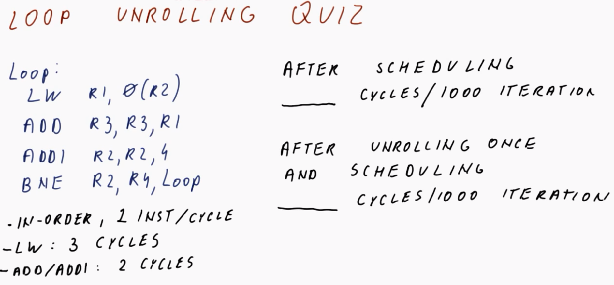
</center>

Consider the following loop instructions, which computes the sum of the elements of an array:

```mips
Loop:
  LW   R1, 0(R2)    # I1
  ADD  R3, R3, R1   # I2
  ADDI R2, R2, 4    # I3
  BNE  R2, R4, Loop # I4
```

Furthermore, assume the given processor is specified as follows:
  * in-order execution of `1` instruction per cycle
  * Load operation `LW` requires `3` cycles
  * Addition operations `ADD` and `ADDI` require `2` cycles

After compiler-facilitated instruction scheduling (but without otherwise applying loop unrolling), how many cycles are required to perform `1000` loop iterations?

Furthermore, after compiler-facilitated scheduling ***with*** once-unrolled loop unrolling, how many cycles are required to perform `1000` loop iterations?

***Answer and Explanation***:

(***N.B.*** The "solution" video is not officially published for this course, however, the corresponding solution is described in [video notes](https://learn.udacity.com/courses/ud007/lessons/e4e2a1d6-9603-4219-95d2-776ec78adfd0/concepts/7639dd97-5ac1-4de8-a11d-59502f0e0d78/quiz) for preceding "Quiz" video, reproduced here as follows.)

In the unmodified code, the per-cycle analysis is as follows:

| Instruction | `C1` | `C2` | `C3` | `C4` | `C5` | `C6` | `C7` | `C8` | ⋯ |
|:--:|:--:|:--:|:--:|:--:|:--:|:--:|:--:|:--:|:--:|
| `I1` | commence execution | (`stall`) | (`stall`) | | | | | commence execution | ⋯ |
| `I2` | | | | commence execution | (`stall`) | | | | ⋯ |
| `I3` | | | | | commence execution | (`stall`) | | | ⋯ |
| `I4` | | | | | | | commence execution |  | ⋯ |

Note the corresponding dependencies between via mutual/common operands `R1` and `R2`. Furthermore, there are `3` net additional cycles introduced by `stall`s as per the cycle requirements for the corresponding operations. Also, note that this particular processor (as specified) can only execute strictly *one* instruction per cycle.

Therefore, after the initial load (i.e., instruction `I1`), which incurs an initial three-cycle cost, on commencing the first loop iteration, there is a `7` cycle requirement ***per loop*** to perform all `4` of the loop instructions. Correspondingly, for `1000` loop iterations, this requires `7 × 1000 = 7000` total instructions.

After ***compiler-facilitated instruction scheduling*** (but ***without*** otherwise applying loop unrolling), the modified instructions are as follows:

```mips
Loop:
  LW   R1, 0(R2)    # I1
  ADDI R2, R2, 4    # I2′
  ADD  R3, R3, R1   # I3′
  BNE  R2, R4, Loop # I4
```

In this manner, compiler-facilitated instruction scheduling provides an opportunity to partially "absorb" the inefficiency introduced by the `stall` cycles. The corresponding per-cycle analysis is as follows:

| Instruction | `C1` | `C2` | `C3` | `C4` | `C5` | `C6` | ⋯ |
|:--:|:--:|:--:|:--:|:--:|:--:|:--:|:--:|
| `I1` | commence execution | (`stall`) | (`stall`) | | | commence execution | ⋯ |
| `I2′` | | commence execution | (`stall`) | | | | ⋯ |
| `I3′` | | | | commence execution | (`stall`) | | ⋯ |
| `I4` | | | | | commence execution  | | ⋯ |

Based on reordering, there is a net reduction by `2` cycles, however, there is still a dependency via operand `R1` between instructions `I1` and `I3′` which necessitates a "`stall`s-only" cycle `C3`.

Therefore, after the initial load (i.e., instruction `I1`), which incurs an initial one-cycle cost, on commencing the first loop iteration, there is a `5` cycle requirement ***per loop*** to perform all `4` of the loop instructions. Correspondingly, for `1000` loop iterations, this requires `5 × 1000 = 5000` total instructions.

Next, after ***compiler-facilitated instruction scheduling*** along with applying ***once-unrolled loop unrolling***, the modified instructions are as follows:

```mips
Loop:
  LW   R1, 0(R2)    # I1
  LW   R8, 4(R2)    # I2″ - use operand `R8` to avoid dependency
  ADD  R3, R3, R1   # I3″
  ADDI R2, R2, 8    # I4″ - modify corresponding index/offset to `8`
  ADD  R8, R3, R1   # I5″
  BNE  R2, R4, Loop # I6″
```

In this manner, the "compounded" version of the loop provides an opportunity to additionally reduce the overall cycles (however, some inefficiency due to `stall`s still remains). The corresponding per-cycle analysis is as follows:

| Instruction | `C1` | `C2` | `C3` | `C4` | `C5` | `C6` | `C7` | `C8` | ⋯ |
|:--:|:--:|:--:|:--:|:--:|:--:|:--:|:--:|:--:|:--:|
| `I1` | commence execution | (`stall`) | (`stall`) | | | | | commence execution | ⋯ |
| `I2″` | | commence execution | (`stall`) | (`stall`) | | | | | ⋯ |
| `I3″` | | | | commence execution | (`stall`) | | | | ⋯ |
| `I4″` | | | | | commence execution | (`stall`) | | | ⋯ |
| `I5″` | | | | | |commence execution | (`stall`) | | ⋯ |
| `I6″` | | | | | | | commence execution | | ⋯ |

As before, there is still a dependency via operand `R1` between instructions `I1` and `I3″` which necessitates a "`stall`s-only" cycle `C3`.

Therefore, after the initial load (i.e., instruction `I1`), which incurs an initial one-cycle cost, on commencing the first loop iteration, there is a `7` cycle requirement ***per loop*** to perform all `6` of the loop instructions. Correspondingly, for `1000` loop iterations, this requires `7 × 1000 = 7000` total instructions. However, note that with loop unrolling, the total number of loop iterations with once-unrolled loop unrolling is ***halved*** (i.e., each loop iteration performs ***twice*** the work of an equivalent not-unrolled loop), therefore, the equivalent number of iterations for the *same* program would be correspondingly only `7 × 500 = 3500`.

## 15. Unrolling Downsides

<center>
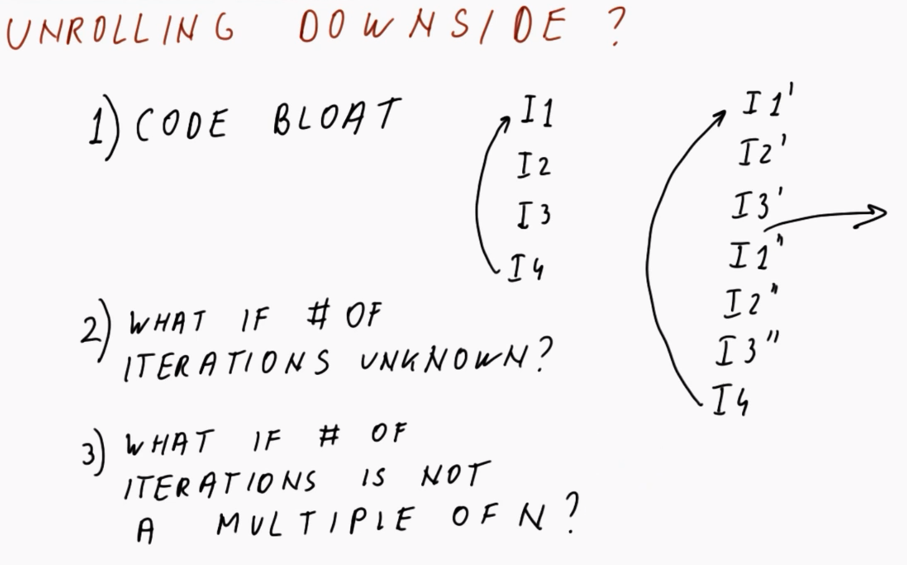
</center>

Having now seen how loop unrolling can both reduce the overall workload as well as enhance compiler-facilitated instruction scheduling, it may seem tempting to simply perform unrolling ***indiscriminately***. However, there are in fact **downsides** to such an approach:
  * 1 - code bloat
    * In general, loop unrolling results in more instructions all else equal (e.g., from `4` to `7` in the figure shown above). Furthermore, this increase in instructions-per-loop is amplified with increasing levels of loop unrolling (i.e., beyond once-unrolled to twice-unrolled, thrice-unrolled, etc.).
  * 2 - the total number of iterations is unknown
    * If the total number of iterations is unknown a priori (e.g., a `while` loop), then there is the additional challenge of determining when to ***exit*** from the looping construct.
  * 3 - the total number of iterations is not an integer multiple
    * This similarly introduces the additional challenge of introducing logic for when to ***exit*** a particular loop prematurely, as required by the program.

***N.B.*** Solutions *do* exist for handling premature loop exit, however, these are beyond the scope of this course (these are covered in an advanced compiler course).

## 16. Function Call Inlining

An optimization similar to loop unrolling (insofar as benefits are concerned) is called **function call inlining**.

<center>
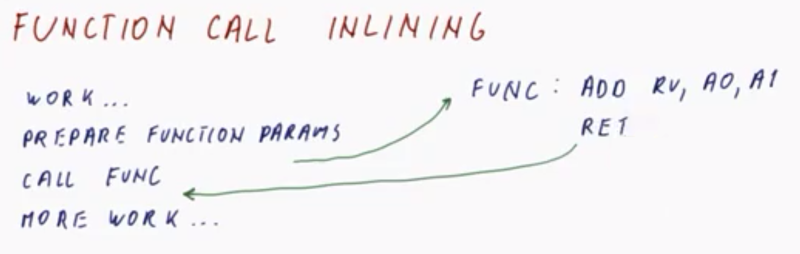
</center>

Consider code involving a function call, as in the figure shown above. Typically, this involves the sequence:
  * perform upstream work
  * on approaching the function call, prepare the function parameters (i.e., place them in the corresponding registers, as per the calling convention)
  * call the function (denoted by green arrows in the figure shown above)
    * perform the function logic, typically involving the parameters via the caller (e.g., `ADD RV, A0, A1`, as per the figure shown above)
    * return from the function call
  * perform downstream work upon return from the function call

Observe that here, there are inherently **overheads** introduced by calling the function and then subsequently returning from it. 

<center>
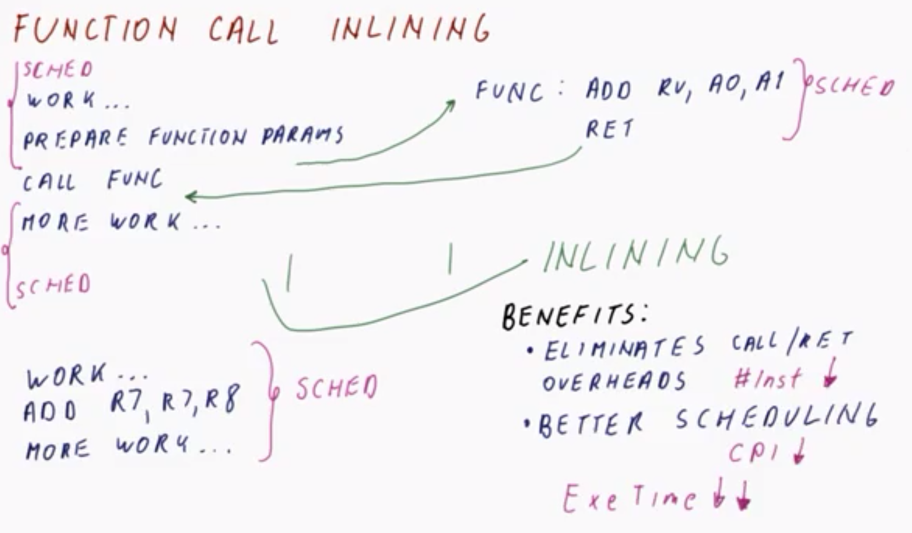
</center>

To address this, **function call inlining** involves simply ***inlining*** the function-body logic ***directly*** inside of the caller (e.g., inlining the previous function-call logic directly as `ADD R7, R7, R8`, as in the figure shown above), thereby obviating the need to prepare the function parameters and then subsequently return from the function upon its completed execution.

The **benefits** of function call inlining are as follows:
  * Elimination of call/return overheads → reduction in `# instructions in the program`
    * This includes not only the function-call and return instructions themselves, but also the upstream instructions required for preparing the function parameters (e.g., popping/pushing on the stack per calling conventions, etc.).
  * Improved compiler-facilitated instruction scheduling → reduction in `cycles per instruction`
    * As with loop unrolling, function call inlining also enhances/compounds the effect of compiler-facilitated instruction scheduling, by consolidating the code from three distinctly scheduled regions of code (i.e., upstream of function call, the function call itself, and then downstream of the function call) into one/consolidated scheduled region of code, thereby enhancing compiler-facilitated instruction scheduling by providing more possible candidate instructions for reordering.

As before (cf. loop unrolling), the ***net effect*** of these benefits (i.e., per the iron law) is a ***decrease*** in `CPU Execution Time`. Furthermore, the smaller/simpler the function in question, the larger net effect:
  * The overhead (i.e., function calling and subsequent return) is high for small functions, as the cost is not amortized by the function-body logic itself.
  * Furthermore, a small function will not provide ample opportunities for instructions reordering to begin with.

However, there is a **downside** to function call inlining (which is correspondingly similar to that for loop unrolling), as discussed next.

## 17. Function Call Inlining Downside

As with loop unrolling, a prominent **downside** of function call inlining is **code bloat**.

<center>

</center>

Consider a program which performs successive function calls, as in the figure shown above. Here, the function in question (i.e., `FUNC`) comprises `10` instructions followed by a return.

When performing function call inlining, the `10` instructions are placed inline within the program itself, thereby replacing the original function calls. 

Before inlining, the total number of instructions required is `13`, comprised of:
  * `10` for the function body
  * `1` for the return from the function
  * `2` calls made by the caller

However, after inlining, the total number of instructions required is `20`, i.e., inlining of the `10` function-body instructions twice within the original program (i.e., replacing the original function-call statements accordingly). Therefore, while the overhead is eliminated, the program itself grows in size proportionally to the number of function calls. This is particularly pronounced in a program which may call such a function hundreds of times.

Therefore, function call inlining must be applied **judiciously**, rather than simply applying it indiscriminately (i.e., for *all* functions and correspondingly for *all* function calls). Generally, it is most ***advantageous*** to inline functions which are small. However, as the function body grows, this results in replication of a lot of code relative to the original non-inlined version (even when accounting for the overhead in the latter).

## 18. Function Call Inlining Quiz and Answers

<center>
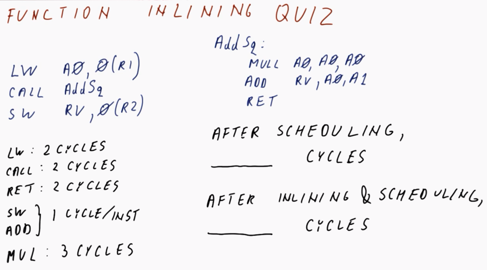
</center>

Consider the following program:

```mips
LW   A0, 0(R1) # I1 - prepare argument `A0` for function call
CALL AddSq     # I2
SW   RV, 0(R2) # I3

AddSq:
  MUL A0, A0, A0 # IA - square the argument `A0`
  ADD RV, A0, A1 # IB - add the arguments and return this value
  RET            # IC
```

Furthermore, consider the processor characterized as follows:
  * Instructions `LW`, `CALL`, and `RET` each require `2` cycles
  * Instructions `SW` and `ADD` each require `1` cycle
  * Instruction `MUL` requires `3` cycles

After compiler-facilitated instruction scheduling, how many cycles are required to execute this program?

Furthermore, after function call inlining and compiler-facilitated instruction scheduling, how many cycles are required to execute this program?

***Answer and Explanation***:

<center>
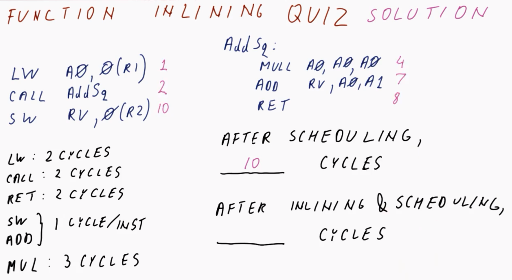
</center>

In the case of compiler-facilitated instruction scheduling (but ***without*** function call inlining), this requires `10` total cycles.
  * In the main program, there is no opportunity for reordering, since there is a strict order dependence in the instructions, including the function call `CALL`. Furthermore, each of these instructions requires `2` cycles apiece.
  * Similarly, the function-call body does not provide opportunities for instruction scheduling, either.

The corresponding per-cycle analysis is as follows:

| Instruction | `C1` | `C2` | `C3` | `C4` | `C5` | `C6` | `C7` | `C8` | `C9` | `C10` |
|:--:|:--:|:--:|:--:|:--:|:--:|:--:|:--:|:--:|:--:|:--:|
| `I1` | commence execution | (`stall`) | | | | | | | | | |
| `I2` | | commence execution | (`stall`) | | | | | | | |
| `IA` | | | | commence execution | (`stall`) |  (`stall`) | | | | |
| `IB` | | | | | | | commence execution | (`stall`) | | |
| `IC` | | | | | | | | commence execution |  (`stall`) | | |
| `I3` | | | | | | | | | | commence execution |

<center>
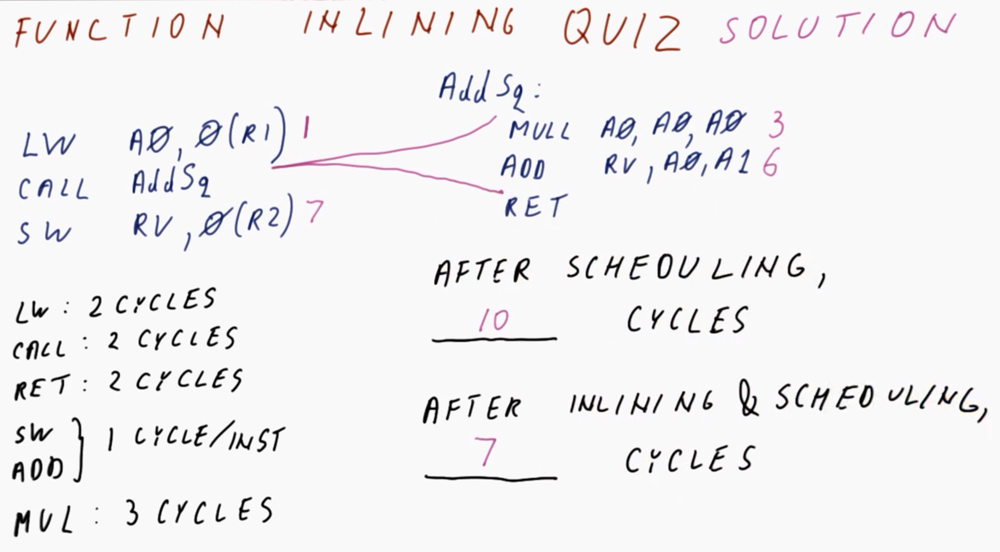
</center>

In the case of compiler-facilitated instruction scheduling (but ***without*** function call inlining), this requires only `7` total cycles.

With inlining, the corresponding update to the instructions is as follows:

```mips
LW  R3, 0(R1)  # I1′
MUL R3, R3, R3 # I2′
ADD R5, R3, R4 # I3′
SW  R5, 0(R2)  # I4′
```

The corresponding general-purpose register substitutions are as follows:

| pre-inlining argument or return register | post-inlining general-purpose register |
|:--:|:--:|
| `A0` | `R3` |
| `A1` | `R4` |
| `RV` | `R5` |

With this inlining, as before, there is still no opportunity for reordering, due to dependency via common/mutual operand `R3`.

The corresponding per-cycle analysis is as follows:

| Instruction | `C1` | `C2` | `C3` | `C4` | `C5` | `C6` | `C7` |
|:--:|:--:|:--:|:--:|:--:|:--:|:--:|:--:|
| `I1′` | commence execution | (`stall`) | | | | | |
| `I2′` | | | commence execution | (`stall`) | (`stall`) | | |
| `I3′` | | | | | | commence execution | |
| `I4′` | | | | | | | commence execution |

Therefore, in this particular example, the net reduction in cycles is strictly due to the elimination of the function-call overhead (i.e., instructions `CALL` and `RET`).

## 19. Other Compiler-Facilitated IPC Enhancements

<center>
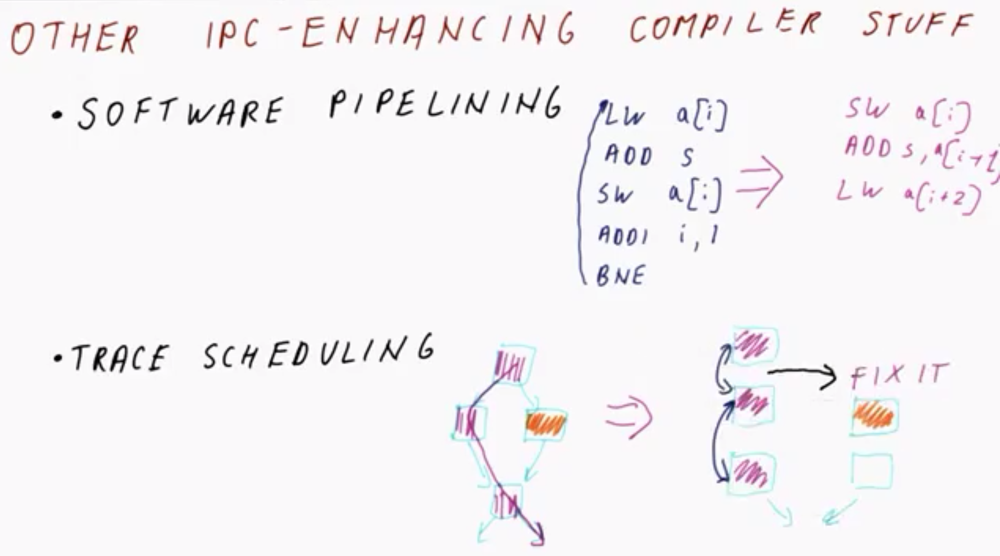
</center>

There are additional compiler optimizations which can further enhance instructions per cycle (IPC) performance, as discussed briefly here.
  * ***N.B.*** For a more comprehensive coverage of these topics, consult an advanced compilers course (or equivalent).

**Software pipelining** is a technique whereby loops are scheduled in such a manner which does not otherwise greatly increase the corresponding code size, but still yielding a similar to benefit to loop unrolling. The general premise of this technique is to treat the loop itself as a **pipeline** (i.e., comprised of corresponding stages), thereby scheduling the loop in such a manner whereby reordering of independent instructions promotes a "fuller" pipeline (i.e., more instructions executing per cycle).

**Trace scheduling** is another technique, which is essentially an enhanced form of if conversion. Conceptually, code which is intrinsically branched is analyzed to determine a **common path**, which are then subsequently combined (i.e., with branching otherwise eliminated between them), thereby promoting compiler-facilitated instruction scheduling across this consolidated code. Furthermore, **checks** are placed within this common-path code in order to execute code which is otherwise branched (i.e., outside of the common path), which also requires corresponding "fixes" to "un-branch" the corresponding consolidated code when necessary.

## 20. Lesson Outro

This lesson introduced some of the more advanced compiler techniques that facilitate production of better programs more suited for modern processors characterized by branch prediction, out-of-order program execution, and execution of multiple instructions per cycle.

In the next lesson, we will examine a type of processor which simplifies its own constituent hardware by relying more on such compiler support.
