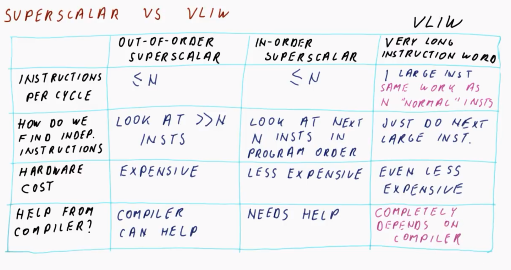
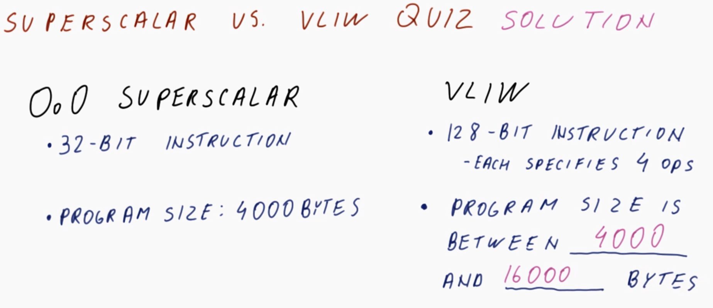
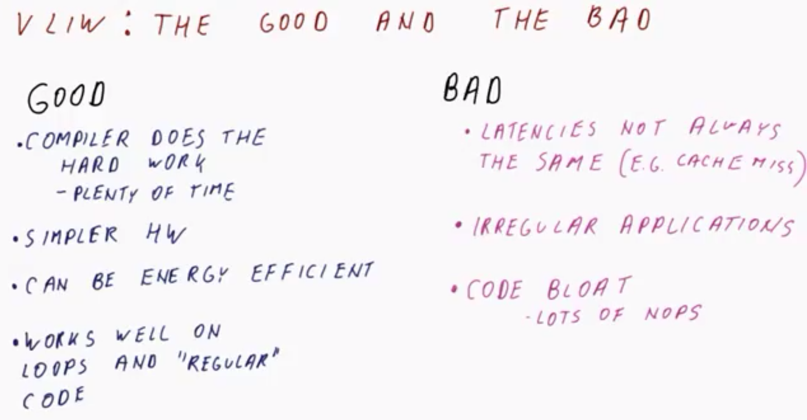
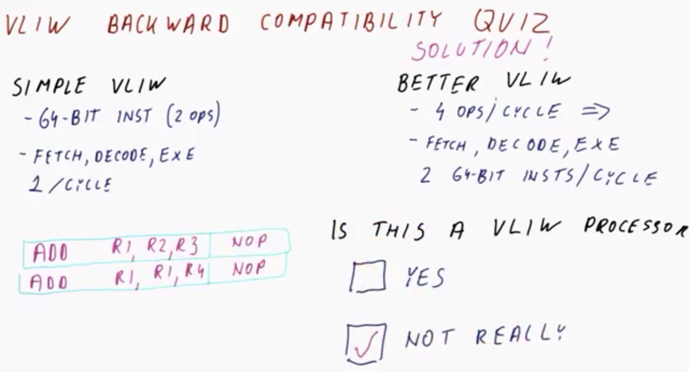
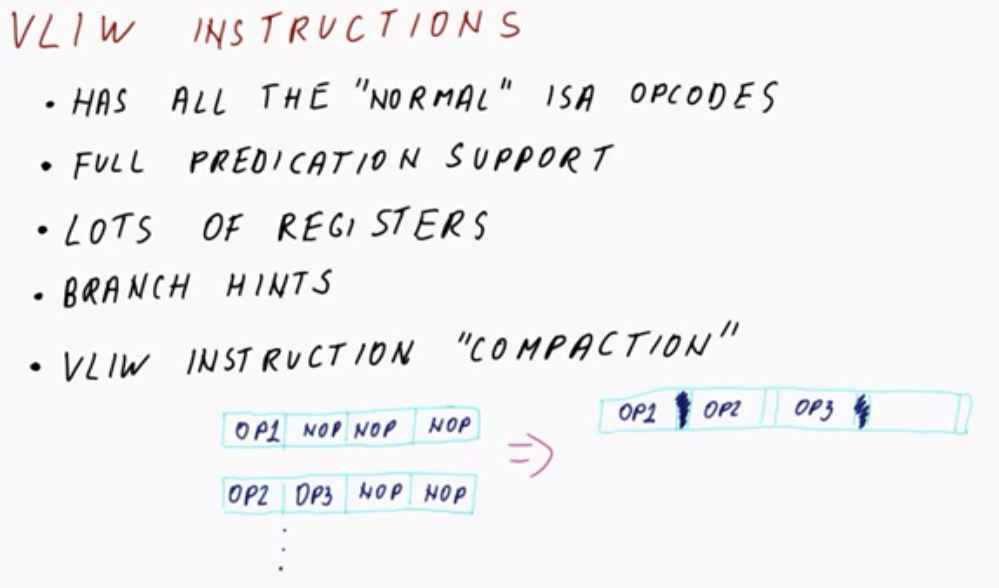
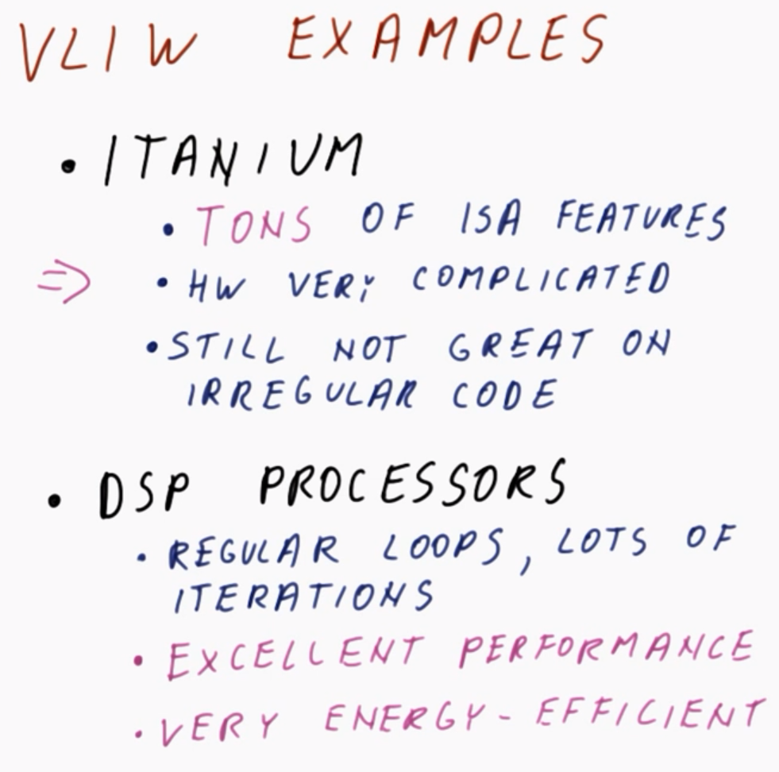
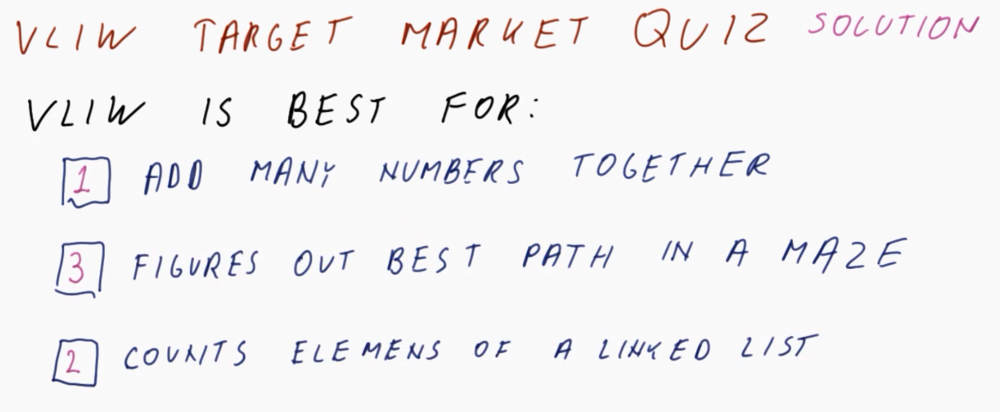

# Very Long Instruction Word (VLIW)

## 1. Lesson Introduction

In this lesson, we will learn about **very long instruction word (VLIW)** and explicitly parallel processors (e.g., Intel's Itanium). Unlike their out-of-order counterparts, these processors do ***not*** attempt to identify instruction-level parallelism (ILP) on their own, but rather defer to the compiler instead.

## 2. Superscalar vs. VLIW

In a previous lesson (cf. Lesson 8), we have seen that a **superscalar** is one which executes more than one instruction per cycle. Conversely, **very long instruction word (VLIW)** processors attempt to achieve the same amount of work per cycle, but in an alternate manner. Let us compare and contrast these two approaches as follows (where `N` denotes an `N`-issue processor, i.e., capable of performing `N` instructions per cycle):

| Characteristic | Out-of-order superscalar | In-order superscalar | VLIW |
|:--:|:--:|:--:|:--:|
| Instructions per cycle | Attempts to perform `≤ N` instructions per cycle | Attempts to perform `≤ N` instructions per cycle | Attempts to perform `1` ***large*** instruction per cycle, comprised of the equivalent work to `N` "regular" instructions (i.e., relative to a comparable superscalar processor) | 
| Detecting independent instructions within the program | Finds the `N` constituent instructions by looking ahead by ***much greater than*** `N` instructions in its **instructions window** | Finds the `N` constituent instructions by looking ahead by ***exactly*** `N` instructions in its **instructions window** | Does not perform any comparable "look ahead," but rather simply executes the next-in-order large instruction (i.e., otherwise analogously to a non-superscalar in-order processor) |
| Hardware cost| ***Most expensive***, due to the overhead incurred from "extended look ahead" | ***Moderately expensive***, due to the reduced overhead (i.e., no "extended look ahead") relative to out-of-order superscalar processing correspondingly requiring less hardware implementation accordingly | ***Least expensive*** for the same amount of work per cycle, assuming that the work is available and can be found/detected |
| Compiler assistance | The compiler ***can*** assist with improving performance, however, this is not essential | The compiler ***does*** assist with improving performance by reordering instructions in such a manner whereby independent instructions can be performed optimally (otherwise, performance can degrade substantially relative to an out-of-order superscalar processor) | The compiler is ***strictly necessary*** in order to use VLIW processors, otherwise performance will degenerate precipitously |

Therefore, in summary, moving from columns left-to-right in the table above comprises a tradeoff from high hardware dependency to high software/compiler dependency (respectively), in order to achieve equivalent instruction-level parallelism (ILP).

## 3. Superscalar vs. VLIW Quiz and Answers

Consider an out-of-order superscalar processor characterized by `32`-bit instructions running a program of size `4000` bytes.

Similarly, consider a VLIW processor characterized by `128`-bit instructions (with each VLIW instruction specifying `4` operations, comparable to each `1`/single operation on the other processor). What is the corresponding program size for this VLIW processor? 

***Answer and Explanation***:

In the ideal case, the VLIW processor can correspondingly perform the same `4000` byte program.

However, in the worst case (e.g., all instructions have dependencies), each equivalent instruction will still require a full VLIW instruction (i.e., only utilizing *one* of its *four* total possible operations per cycle), and therefore this will increase the required program size to `4000 × 4 = 16000` bytes.

Therefore, in practice, the corresponding program size will be somewhere in the range of these two (i.e., `4000` to `16000` bytes).

## 4. VLIW: The Good and the Bad

Consider now the ***good*** vs. ***bad*** aspects of VLIW.

The ***good*** aspects of VLIW are:
  * The compiler performs the hard work
    * Since the compiler only runs *once* whereas the program runs *many times*, the compiler has ample time to determine a suitable schedule. Conversely, in an out-of-order processor, there is comparatively much less time available to determine a suitable schedule, because as the program is executing, any time spent determining the schedule is accumulated as additional overhead to the total program execution time.
  * The required hardware is comparatively simpler to that required to implement an out-of-order processor
  * More energy efficient than a comparable out-of-order processor, since (all else equal) the hardware performs less per executed instruction
  * Works really well on loops and so called **"regular" code** (e.g., array traversal, multiplying matrices, and other such patterns which are readily amenable to compiler analysis for subsequent schedule optimization)

Conversely, the ***bad*** aspects of VLIW are:
  * Latencies of instructions are not always uniform
    * The compiler must assume sort of inherent latency in order to optimally schedule instructions, however, with non-uniform latencies, this becomes more challenging. For example, if planning around a cache hit latency, an incidental ***cache miss*** may introduce a much longer latency than originally anticipated.
  * Many applications are irregular
    * Almost every application which performs a lot of "decision making" (e.g., AI applications, applications working on pointers or pointer-intensive structures, etc.) are difficult for the compiler to effectively analyze.
  * Code bloat
    * Code for a VLIW-based program can become much larger than an equivalent out-of-order processor, due to insertion of many ***no-ops*** required to separate inter-dependent instructions in order to prevent them from being scheduled in the *same* VLIW instruction.

## 5. VLIW Backward Compatibility Quiz and Answers

Having seen some aspects of VLIW, let's further discuss the matter of **backward compatibility** in the form of a quiz.

Consider a simple VLIW processor, specified as follows:
  * `64`-bit instructions comprising `2` operations
  * Stages (e.g., fetch, decode, execute, etc.) perform `1` of these instructions per cycle (i.e., `2` corresponding operations per cycle)

Now, consider a newly proposed "better" VLIW processor, specified as follows:
  * `64`-bit instructions comprising `4` operations
  * Stages (e.g., fetch, decode, execute, etc.) perform `2` of these instructions per cycle to maintain corresponding backwards compatibility (i.e., equivalently `4` corresponding operations per `2` cycles)

So, then, is this new processor still a VLIW processor?

***Answer and Explanation***:

The new processor is ***not*** truly a VLIW processor.

In a real/valid VLIW processor, the compiler determines which  operations can be performed in parallel, thereby placing them in the *same* instruction to minimize overall execution time (while still guaranteeing that each cycle performs independent operations).
  * For programs run on the old processor, the compiler only guarantees that the two operations in the ***same*** instruction occur in parallel. Otherwise, if a dependency occurs (e.g., via operand `R1` in the figure shown above), then the compiler still places the operations  into ***separate*** VLIW instructions with corresponding no-ops (`NOP`) in each respective instruction to ensure necessarily independent execution (i.e., degeneration to `1` effective instruction per cycle).
  * Correspondingly, for programs run on the new processor, if *two* such 64-bit instructions occur in this same program, it still cannot perform them simultaneously (i.e., despite the "enhanced" `2` VLIW instructions per cycle capability) without violating program correctness, and therefore the same degeneration to `1` effective instruction per cycle occurs.

## 6. VLIW Instructions

Now, consider a qualitative description of these ***VLIW instructions***.

As we have seen, a VLIW processor really specifies *several* operations, each of which would have otherwise taken a *single* "normal" instruction in a "normal" superscalar processor. 
  * Correspondingly, a VLIW processor typically has all of these **"normal" instruction set architecture (ISA) opcodes** available/present.

Furthermore, a typical VLIW processor also provides **full predication**, or at least very extensive predication support.
  * This is because it relies on the compiler to expose parallelism, and one of the ways that the compiler achieves this is via instruction scheduling; therefore, it is desirable for the compile to be able to predicate, thereby exposing more opportunities for such instruction scheduling.

A VLIW processor (and corresponding ISA) also typically includes **many architectural registers**.
  * The reason for this is that a lot of the instruction-scheduling optimizations require the use of additional registers, e.g., modifying existing registers to accommodate reordered instructions, as seen previously (cf. Lesson 10).

Another frequently observed ISA support for compilers are **branch hints**, whereby the compiler can specify to the hardware what it "thinks" the branches will do, which in turn facilitates optimization by the branch predictor.

Lastly, there is often some type of **"compaction" mechanism** present for VLIW instructions.
  * For example, given a set of four-operation instructions (as in the figure shown above), the actual resulting VLIW instruction may include some type of **stop bit** intercalated between (otherwise inter-dependent) instructions to allow "packing" into a single VLIW instruction, thereby reducing overall no-ops (`NOP`s) in the resulting executed program (and correspondingly reducing code bloat accordingly).

## 7. VLIW Examples

Now, consider some "real world" examples of VLIW processors.

The (probably) most famous example of how *not* to implement the VLIW concept is Intel's **Itanium** processors line, characterized by the following:
  * ***Tons*** of instruction set architecture (ISA) features to enable compiler-facilitated instruction scheduling, etc.
  * Consequently, the resulting processor hardware became ***very complicated***
    * While it was no longer necessary to check for dependencies between instructions, it correspondingly introduced so many other "bells and whistles" in the process of "achieving" this that resulting hardware was among the most complicated that was every conceived/built by Intel thus far
    * And nevertheless, fundamentally, it is still ultimately a VLIW processor which is otherwise generally ill-suited for "irregular"/non-"normal" program code

Another example of where VLIW is used is in **digital signal processing (DSP)** processors. DSP is characterized by ubiquitous floating-point work/instructions, typically involving regular/predictable loops comprised of a small amount of per-loop-iteration work but executed over many iterations. For this particular (specialized) use case, VLIW provides the following corresponding **benefits**:
  * Excellent performance
  * High energy efficiency
    * There is not much power expended on determining dependencies and so on.

These two processors respective "case studies" demonstrate the fundamental difference between using VLIW as an "all-purpose" processor (negative overall outcome) via Itanium vs. as a specialized use via DSP applications (positive overall outcome).

## 8. VLIW Target Market Quiz and Answers

Among the following, which type of application is VLIW best suited for? (Rank from `1`/best to `3`/worst.)
  * Add many numbers together
    * `1` - This comprises a small, predictable loop with well-controlled dependencies, and so on. 
  * Determine the best path in a maze
    * `3` - This involves a lot of decision making, along with corresponding if conversions, etc., and therefore VLIW will be relatively inefficient due many of the instructions being "predicated out"
  * Count elements of a linked list
    * `2` - This will likely involve many load instructions (with corresponding hits and misses), with corresponding impact on compiler scheduling (i.e., due to cache misses, etc.), however, otherwise there is still some semblance of "normalcy" otherwise in this program 

***N.B.*** As discussed previously (cf. Section 4), VLIW is optimized for programs where the compiler can effectively analyze the instructions for consequent reordering (i.e., "normal" code).

## 9. Lesson Outro

In this lesson, we have discussed VLIW processors, including their Itanium "cousins."

Furthermore, we have examined the pros and cons of these VLIW processors, as well as some of the reasons for the Itanium's high expectations and eventual demise.

This lesson hereby concludes the first portion of the high-performance computer architecture course (i.e., CS 6290), where thus far we have learned how the modern processor's ***core*** itself works.

In the next part of the course (i.e., starting with Lesson 12), we will learn how to achieve good performance even when the main memory is really ***slow***, and otherwise way too ***small*** relative to the size of the programs intended to run on it.

Subsequently thereafter (i.e., starting with Lesson 18), we will conclude this course by learning how to assemble ***multiple*** processor cores together in order to achieve even better performance and energy efficiency.
