# Cache Review

## 1. Lesson Introduction

In this lesson, we will review **caches**.
  * ***N.B.*** This material should be known already (i.e., course prerequisite), however, it is extremely important to understand the basics of caches before proceeding onto virtual memory (cf. Lesson 13) and other more advanced caching topics (cf. Lesson 14). Therefore, this lesson will correspondingly include *more* detail than is included in a typical "review" lesson.

## 2. Locality Principle

<center>

</center>

Understanding caches requires an understanding of **locality**. 

The **locality principle** states that things that will happen ***soon*** are likely to be close to things that ***just*** happened.
  * This means that if we know something about the past behavior, then we are likely to be able to guess what will occur soon.

We have already seen the locality principle previously in branch prediction (cf. Lesson 4). Now, we will see this in the context of **caches**.

## 3. Locality Quiz and Answers

<center>

</center>

Which of the following are ***not*** good examples of locality? (Select all that apply.)
  * It rained 3 times today → Therefore, it is likely to rain again today
    * `DOES NOT APPLY` - Usually if it rains often, then it will probably continue to rain often (at least for a while)
  * We ate dinner at 6 PM every day last week → Therefore, we will probably eat dinner around 6 PM this week
    * `DOES NOT APPLY` - People tend to eat meals around the same time
  * It was New Year's Eve yesterday → Therefore, it will probably be New Year's Eve today
    * `APPLIES` -  New Year's Eve occurring on a given day generally means it ***will not*** be New Year's Eve the following day, i.e., New Year's Eve is temporal phenomenon which does ***not*** generally have locality on a timescale of days (this is effectively "anti-locality" in the sense that it "predicts" precisely the *opposite* of what the locality principle implies/suggests)

## 4. Memory References

<center>

</center>

In computer architecture, we are interested in the locality principle as applied to **memory references**.

If we know that a processor as **accessed** address `X` recently, then the **locality principle** suggests that:
  * It is likely to access the ***same*** address `X` again in the near future → This is known as **temporal locality**
  * It is likely to access addresses proximally to `X` → This is known as **spatial locality** 

Therefore, once a given address is accessed, it is also likely that the ***same*** address will be accessed again soon, along with nearby addresses.

## 5. Temporal Locality Quiz and Answers

<center>
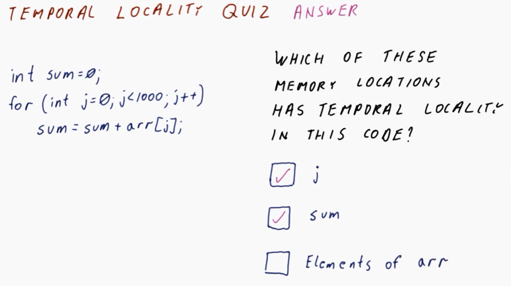
</center>

Consider the following code fragment:

```c
int sum = 0;
for (int j = 0; j < 1000; j++)
  sum = sum + arr[j];
```

Which of the following memory locations has ***temporal*** locality in this code? (Select all that apply.)
  * `j`
    * `APPLIES`
  * `sum`
    * `APPLIES`
  * elements of `arr`
    * `DOES NOT APPLY`

***Answer and Explanation***:

Recall (cf. Section 4) that temporal locality indicates that once a memory location is accessed, it is likely to be accessed again.
  * For `j`, this is true because it is used both as the `for` loop's iteration variable and in expression `arr[j]` in each loop iteration. Therefore, after a given iteration, it is generally likely that `j` will be accessed again soon; indeed, on initial access, it will be accessed *many* times (`1000` cumulatively) subsequently thereafter.
  * For `sum`, this is true for similar reasons to `j`, i.e., `sum` is initialized before the loop, and then is subsequently accessed for read and write operations on every loop iteration.
  * Conversely, for any given element of array `arr` (i.e., `arr[j]`), with each element occupying a different (albeit adjacent-to-the-next) memory location, once it is accessed in a given loop iteration, it is no longer accessed again subsequently thereafter.

## 6. Spatial Locality Quiz and Answers

<center>
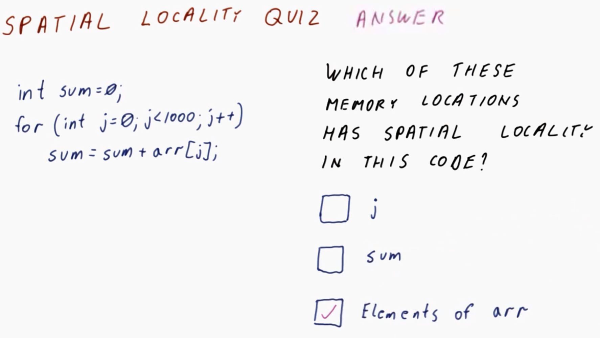
</center>

Returning to the previous example (cf. Section 5), as per the following code fragment:

```c
int sum = 0;
for (int j = 0; j < 1000; j++)
  sum = sum + arr[j];
```

Which of the following memory locations has ***spatial*** locality in this code? (Select all that apply.)
  * `j`
    * `DOES NOT APPLY`
  * `sum`
    * `DOES NOT APPLY`
  * elements of `arr`
    * `APPLIES`

***Answer and Explanation***:

Recall (cf. Section 4) that spatial locality indicates that once a memory location is accessed, it is likely that nearby memory locations will be accessed soon.
  * For `j`, it is accessed repeatedly as the loop continues to iterate, however, this has no implications for spatial locality (i.e., in relation to adjacent memory locations)
  * For `sum`, this is true for similar reasons to `j`, i.e., `sum` is accessed repeatedly as the loop continues to iterate, however, this has no implications for spatial locality (i.e., in relation to adjacent memory locations)
  * Conversely, for any given element of array `arr` (i.e., `arr[j]`), with each element occupying an adjacent-to-the-neighboring-array-element memory location, when a given element `arr[j]` is accessed for a given loop iteration, it is also likely that an adjacent memory location will also be accessed soon (i.e., on the subsequent loop iteration, and so on)

***N.B.*** Incidentally, when this program is compiled, typically it gives rise to some level of spatial locality between `j` and `sum` as well, i.e., both are likely to be allocated on the stack by the compiler in adjacent/nearby memory. Therefore, successive accesses of variables `sum` and `j` will also likely give rise to spatial locality.

## 7. Locality and Data Accesses

Now that we know what locality is, let us see how it is used to improves **data accesses**.

<center>

</center>

First, consider the example of borrowing books from a ***library***. Here, the library represents a data repository that is ***large*** in size, but ***very slow*** to access (i.e., we must first visit the building, then locate the book within the building, check out the book, return home, etc.).
  * In this scenario, within the library, typically there is a lot of **temporal locality**
    * For example, a student may often need to look up the definition of "locality" very often
  * Furthermore, there is also a lot of **spatial locality** in using the books within the library
    * For example, if a student looks up some type of "computer architecture" definition once, they will also likely look up other computer-architecture-related information as well in the near future

<center>

</center>

Continuing with the library-based locality and data access example, we have thus far seen that the library is large but very slow to access, and that accesses to this information within the library has ***both*** temporal and spatial locality.

Furthermore, when a ***student*** requires a piece of information from the library, they have the following available options:
  * 1 - Go to the library, find the information once (i.e., during this visit), and then return back home
  * 2 - Borrow the book, so that future accesses to the information in the book are much faster (i.e., available locally at home)
  * 3 - Take all of the books home from the library, and build the library at home

In the first option (round trip to the library), this incurs a lot of ***wasted time***, particularly if performing multiple round-trips to determine the *same* information. Furthermore, this approach does ***not*** benefit from locality (i.e., getting the *same* information one book via ***temporal locality*** and/or getting subject-matter-related information from multiple books via ***spatial locality***).
  * Correspondingly, this is not a typical approach employed by a student, as it is not an efficient way to study the information via library resources.

In the second option (borrowing the relevant book(s) from the library and taking it/them home), the book(s) is now locally available. This approach correspondingly benefits from locality (both temporally and spatially in the context of the particular book(s) in question), while also ***eliminating*** the ***problem*** of the library being large and slow.
  * Correspondingly, this is typically the ***most common*** approach to solve this problem. `:)`

The third approach (building the entire library at home) is very expensive, while conferring very little benefit in the process. While it *does* save the inconvenience of traveling round-trip to the library, it does *not* solve the problem of requiring to search among many books, locating them on the shelves, etc.
  * Correspondingly, this is another ill-advised strategy, as it is generally ***desirable*** to have relatively few books of particular interest, rather than to have many books which require slow lookup.

Therefore, just as a student is faced with these choices regarding the library, similar principles apply to a **processor** requiring access to **main memory**: Rather than going to main memory to fetch *every* single memory location, instead it will only retrieve the content of the memory locations of particular interest (and only a limited amount of such content, to prevent from degenerating back to slow-access behavior).
  * For this purpose, to store such a selected subset of useful information retrieved from main memory, the processors uses a small repository of such information which is called the **cache** in the context of such memory accesses.

## 8. Cache Quiz and Answers

<center>

</center>

Let us now apply the concepts discussed previously (cf. Section 7) to an actual cache.

We know that the **main memory** in a computer is large and very slow to access compared to the **processor**'s speed. Furthermore, we know that there is a lot of ***both*** spatial ***and*** temporal locality present in the data accesses (indeed, most programs exhibit a lot of spatial and temporal locality).

Therefore, for an access operation to a main-memory location, which ***one*** of the following options should the processor perform?
  * Go to main memory for every access
  * Have small memory built into the processor core, and store retrieved information there (for faster subsequent access)
    * `CORRECT`
  * Have a huge memory store co-located adjacently to the processor chip (since it is too large to fit on/in the processor chip itself), and store all of the information there

***Explanation***:

These options correspond analogously to the library example seen previously (cf. Section 7). Correspondingly, **caches** overcome the problem of having a large but slow main memory, while also exploiting both spatial and temporal locality.

## 9. Cache Lookups

<center>

</center>

Now that we know that the **cache** is a small memory section inside of the processor where the processor attempts to find the data first before subsequently proceeding to the main memory (cf. Section 7), let us know consider the **requirements** for a cache, which are as follows:
  * It must be ***fast*** → Therefore, it must be ***small***
    * As a consequence of its small size, ***not*** everything will fit in the cache, and therefore there will be a lot of main-memory locations which are ***not*** accounted for in the cache 

Therefore, when a **processor** wants to **access** some memory, the following can occur:
  * A **cache hit**, whereby that which was sought from the cache has been ***found*** in the cache (i.e., the main-memory location of interest is already ***present*** in the cache, thereby obviating the need to access main memory) → This results in a ***fast*** access operation, as ***desired***
  * A **cache miss**, whereby that which was sought from the cache has ***not*** been found in the cache (i.e., the main-memory location of interest is ***absent*** from the cache, thereby presenting the need to access main memory instead), a direct consequence of the cache's small size → This results in a ***slow*** access operation, which is ***undesirable***
    * When a cache miss does occur, the processor consequently ***copies*** this location from main memory to the cache, to (hopefully) improve locality for the subsequent memory access of this location (i.e., resulting in a cache hit at that point, rather than a cache miss); in this regard, (occasional) cache misses are "necessary" in order to progressively populate the cache with "useful" memory (i.e., that which improves cache hits overall and consequently correspondingly improved locality)

Therefore, once the cache is "warmed up" (i.e., initial cache misses eventually producing subsequent improved cache hits), the slow-memory access caused by cache misses will otherwise occur relatively ***rarely*** as the program continues to execute (i.e., the running programming will predominantly use data from the cache).

## 10. Cache Performance

<center>
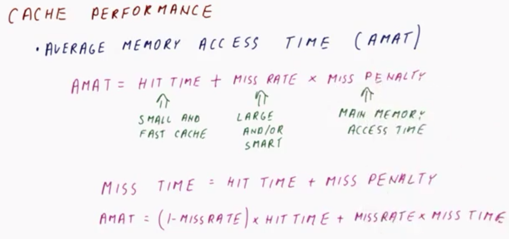
</center>

Let us now consider the properties of a ***good*** (i.e., ***performant***) cache.

### `AMAT`

We want our system to have a good **average memory access time (AMAT)**, which is the access time to memory as seen from the perspective of the **processor**. The `AMAT` is defined as follows:

```
AMAT = Hit Time + Miss Rate × Miss Penalty
```

where:
  * `Hit Time` is how quickly the cache can return the data when a **cache hit** occurs
  * `Miss Rate` is how often a **cache miss** occurs
  * `Miss Penalty` is the penalty per **cache miss**, which is effectively the main-memory access time

In general, an optimal `AMAT` is that which is ***minimized*** (i.e., the lower the better, and ideally `0`). To achieve this, that requires the following:
  * A ***low*** `Hit Time` → This requires a cache which is ***small*** and ***fast***
  * A ***low*** `Miss Rate` → This requires a cache which is ***large*** and/or ***smart***
    * A ***large*** cache is capable of fitting more data, thereby reducing cache misses
    * A ***smart*** cache will be "better-aware" of what data in particular that it should store, thereby also reducing cache misses
  * A ***low*** `Miss Penalty` → The penalty itself (i.e., due to requiring main-memory access) is typically ***very large*** (on the order of tens or even hundreds of processor cycles), but otherwise will be necessarily incurred in the event of a cache miss

Therefore, when designing caches, this entails a ***balance*** between the `Hit Time` and the `Miss Rate`, i.e., small-and-fast vs. large-and-intelligent (respectively), with "intelligence" typically implying a slower operation in order to achieve this.
  * Accordingly, some caches can be extremely small and fast and have a very good (i.e., small) `Hit Time`, but at the expense of having a larger `Miss Rate`.
  * Conversely, other caches can have a relatively large `Hit Time`, but with the corresponding benefit of extremely low `Miss Rate` thereby reducing the overall contribution from the `Miss Penalty` as a result of necessary main-memory accesses

### `Miss Time`

Additionally, `Miss Time` is another characteristic of caches, which is the overall time it takes for a **cache miss** occurs. `Miss Time` is defined as follows:

```
Miss Time = Hit Time + Miss Penalty
```

If a cache miss occurs, resulting in an incurred `Miss Penalty`, which contributes to an effective increase in the `Hit Time`.

`Miss Time` can also be considered/interpreted as the memory-access time elapsed due to the cache miss.

### `AMAT`: Alternately Expressed

Lastly, `AMAT` can also be alternately expressed only in terms of the `Hit Time` and `Miss Rate` (i.e., eliminating `Miss Penalty` from the previous/original equation via `Miss Penalty = Miss Time - Hit Time`) as follows:

```
AMAT = (1 - Miss Rate) × Hit Time + Miss Rate × Miss Time
```

Here, `(1 - Miss Rate)` is how often cache hits occur.

Typically, we use the ***original form*** of the `AMAT` definition, simply because checking the `Miss Time` usually includes checking whether there is a cache hit (`Hit Time`) followed by what must be performed in the event of a cache miss (`Miss Penalty`). Furthermore, it will ***always*** be necessary to have the `Hit Time` on hand, and ***occasionally*** it will also be necessary to have the `Miss Penalty`.

## 11. Hit Time Quiz and Answers

<center>

</center>

Having now seen the relationship between `Hit Time`, `Miss Time`, and cache performance (cf. Section 10), Recalling (cf. Section 10) that `Miss Time = Hit Time + Miss Penalty`, now consider the following.

Which of the following properties characterize a ***well-designed*** cache? (Select all that apply.)
  * `Hit Time < Miss Time`
    * `APPLIES`
      * In a well-designed cache, `Hit Time` is significantly lower than `Miss Time` (which encompasses both the `Hit Time` itself as well as the `Miss Penalty`). In fact, this will also generally be true for a poorly designed cache as well (i.e., once a cache miss occurs, the `Miss Penalty` component of the `Miss Time` will predominate).
  * `Hit Time > Miss Penalty`
    * `DOES NOT APPLY`
      * If the `Hit Time` exceeds the `Miss Penalty`, the cache is effectively useless as it is now even slower than the just fetching from main memory directly at that point.
  * `Hit Time == Miss Penalty`
    * `DOES NOT APPLY`
      * For similar rationale to the case of `Hit Time > Miss Penalty`, this is essentially the critical point at which the cache is effectively just equivalent to the main memory itself.
  * `Miss Time > Miss Penalty`
    * `APPLIES`
      * Per definition of `Miss Time`, this is inherently true (regardless of how well or poorly the cache is designed), i.e., `Miss Time - Miss Penalty > 0 ` implies some positive, finite `Hit Time` constituting this difference.

***N.B.*** Essentially, in a well-designed cache, necessarily `Hit Time < Miss Time`. What's more, ideally `Hit Time << Miss Time`, thereby moving performance closer to `Miss Time == Miss Penalty` (which would be the case if `Hit Time` were `0`).

## 12. Miss Rate Quiz and Answers

<center>

</center>

Recall (cf. Section 10) that `Hit Rate` can be expressed as `Hit Rate = 1 - Miss Rate`. Given this, which of the following is/are true regarding a ***well-designed*** cache? (Select all that apply.)
  * `Hit Rate > Miss Rate`
    * `APPLIES`
  * `Hit Rate < Miss Rate`
    * `DOES NOT APPLY`
  * `Hit Rate == Miss Rate`
    * `DOES NOT APPLY`
  * `Hit Rate` is almost `1`
    * `APPLIES`
  * `Miss Rate` is almost `1`
    * `DOES NOT APPLY`

***Explanation***:

In a well-designed cache, the `Hit Rate` is ideally as high as possible and correspondingly the `Miss Rate` being as low as possible, because the `Hit Rate` determines how often there is only cache-hit-related latency while the `Miss Rate` is how often full-main-memory latency must be incurred. Therefore, in general, `Hit Rate` should be (much) larger than the `Miss Rate`, and ideally exactly `1` (i.e., a corresponding `Miss Rate` of `0`).

## 13. Cache Size in Real Processors

<center>
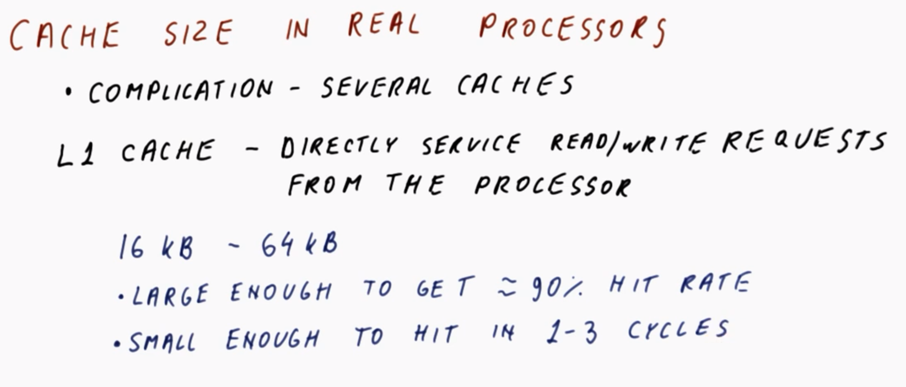
</center>

We have seen already (cf. Sections 10-12) that the cache should be ***fast*** and ***small***, but not too small to a point where it is otherwise unusable (i.e., effectively incapable of storing enough to promote many successive cache hits). So, then, what are the cache sizes which are actually observed in real processors?

There is an inherent ***complication*** in answering this question, due to the fact that real processors typically have ***several*** caches, not just a single one. Therefore, depending on which specific cache is being discussed, the size can vary accordingly.

Consider **L1 (Level 1) caches**, which are the caches that ***directly*** service the read and write requests from the processor (otherwise if a cache miss occurs here, then things get more complicated, because prior to subsequently proceeding to main memory instead the processor proceeds on to the next-level cache(s) first, as well be discussed later in this course). In the case of L1 caches, representative ***sizes*** in recent processors have been in the range of `16 KB` to `64 KB`, which provides the following characteristics:
  * Large enough to get an approximately `90%` cache hit rate (i.e., only correspondingly `10%` or so of all accesses from the processor go beyond this cache)
  * Still otherwise small enough to have a `Hit Time` commensurately with only `1` to `3` processor cycles (i.e., very short wait time to receive the data back from the L1 cache in a cache hit)
    * cf. Main memory access generally requires on the order of hundreds of processor cycles

## 14. Cache Organization

Now that we have a better understanding of the cache, and approximately how large it must be in real processors (cf. Section 13), let us now consider how the cache is ***organized*** internally.

<center>
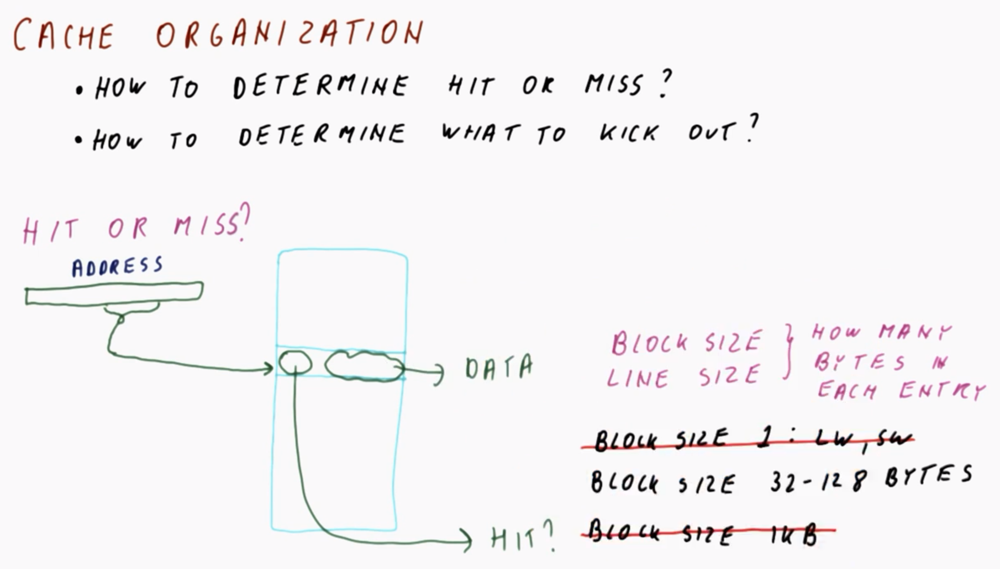
</center>

There are two pertinent ***questions*** to answer to better understand cache organization, which are as follows:
  * 1 - How to determine if there is a cache hit vs. a cache miss?
    * This entails determining what data is available in the cache, and then when the processor gives a requested address to the cache, it must be determined whether that data is or is not present in the cache (furthermore, this must be done very quickly).
  * 2 - How to determine what to eject from the cache once it is full?
    * Eventually, the data will need to be cycled through as the program executes, otherwise the cache will revert from a "hot" state (i.e., predominantly cache hits) back to a "cold" state (i.e., predominantly cache misses).

With respect to the first question (i.e., determining cache hit vs. cache miss), this requires something that is ***very fast***. Typically this involves a table of some sort, which can be quickly indexed via certain address bits from the data; this is depicted in the figure shown above (whose constituent components are described in turn in the subsequent sub-figures).

<center>

</center>

Conceptually, the cache is a table (as in the figure shown above).

<center>
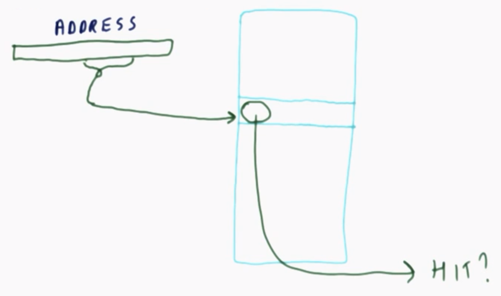
</center>

Furthermore, this table is indexed into with some fraction of bits taken from the address of the data (as in the figure shown above), which correspondingly indicate whether there is a cache hit.

<center>
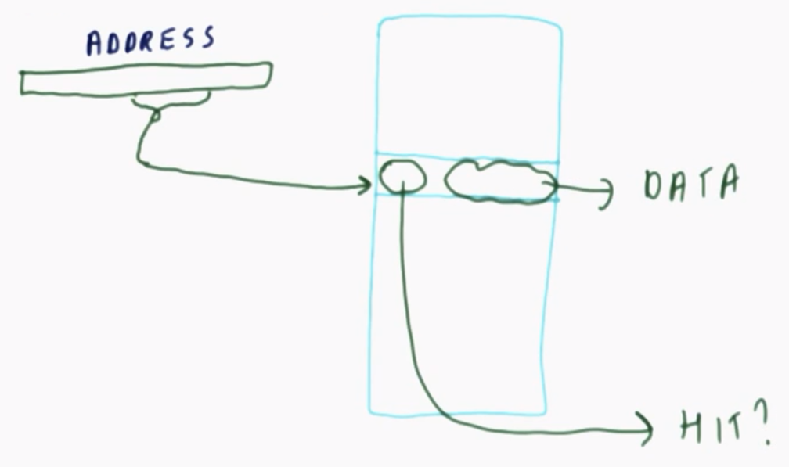
</center>

The remainder of the information in the **cache entry** (as in the figure shown above, denoted by `Data`) is the pertinent data in the event of a cache hit. The size of this data portion of the cache entry is called the **block size** (or **line size**, since an entry in the cache is also sometimes called a **line**), which specifies how many bytes are in each of these entries.

A block size of `1 byte` means that the entry in the cache is only one byte, and therefore every single byte address will map to a different cache entry within the cache/table. This creates several ***problems***, because usually the processor can issue accesses not only to a single byte, but rather operations can generally operate on multiple bytes simultaneously.
  * For example, `LW` and `SW` both capably access a `4`-byte location, in which case a single-byte access would require four corresponding lookups for different entries in the cache, thereby complicating and slowing down the cache considerably.

Therefore, in general, the block size should be at least sufficiently large enough to perform a ***single*** access in a given cache entry, in order to find all of the data within the ***same*** cache entry most of the time.

The next consideration is **spatial locality**. If there is a cache miss on a given access, then consequently the processor will retrieve an entire block's worth of memory into the cache.
  * If there is no spatial locality, then it should only need to bring in what is currently being accessed.
  * However if there is additionally spatial locality, then ideally it should bring in *more* than simply what is being accessed currently (i.e., the pertinent spatially-related data).

For this purpose, typically block sizes of `32 bytes` to `128 bytes` work well, both from the perspective of their larger-than-a-typical-access size as well as their capturing of much of the spatial locality that exists in programs.

Finally, consider a block size of `1 kilobyte`. In this case, *a lot* of data is fetched from memory every time a cache miss occurs, and if there is insufficient spatial locality then a lot of the additional/extra data will not be used anyways, thereby unnecessarily occupying extra space in the cache.
  * Recall (cf. Section 13) that the cache is only approximately `16 kilobytes` to `64 kilobytes` in real processors, so this is a rather substantial fraction of the overall cache size, and only using it to fill with mostly unused data, no less.

Therefore, it turns out that indeed (at least for L1 caches) the optimal block size is one which is neither too large nor too small, with the optimum occurring around a block size of `32 bytes` to `128 bytes` accordingly.
  * This block size balances the aforementioned tradeoffs while still promoting better overall spatial locality.

## 15. Block Size Quiz and Answers

<center>
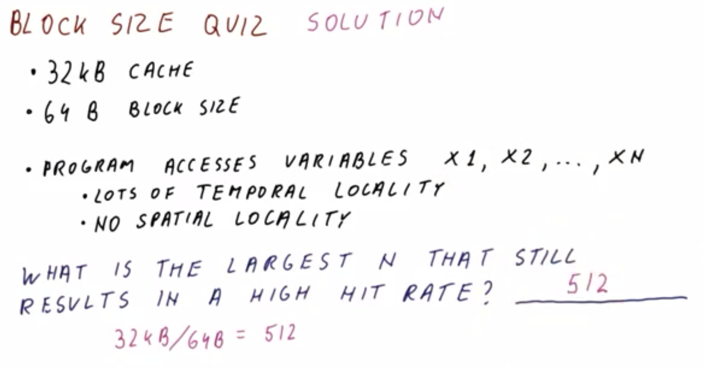
</center>

Given a cache characterized as follows:
  * Total size of `32 KB`
  * Block size of `64 bytes`

Consider a program which accesses variables `x1`, `x2`, ..., `xN` which are scalar values (i.e., not otherwise elements of the same array), and such that the program itself is characterized by the following with respect to these variables:
  * Lots of temporal locality
  * No spatial locality

Per these specifications, what is the largest `N` (i.e., total count of such variables) that still results in a ***high*** cache hit rate?

***Answer and Explanation***:

When `x1` is brought into the cache, it will be brought in along with an entire block's worth of data (i.e., `64 bytes`), and because there is no spatial locality, that means that none of the other variables will be co-located in that same block. And similarly applies for retrievals of the variables `x2`, ..., `xN`.

Therefore, every time any given variable is accessed, this will require retrieving the full `64 bytes` worth of data into the cache (i.e., the full line). Furthermore, in order to achieve a high cache-hit rate, because each variable (i.e., individually) has a lot of temporal locality, ideally they should *all* remain in the cache. To achieve this, this implies filling the entire cache, i.e.,:

```
32 KB / 64 bytes = 512
```

So, this cache can accommodate up to `512` such variables (i.e., with each occupying its own cache block, despite each variable itself only occupying perhaps `4` to `8` or so of those bytes, depending on the particular data type of the variables in question).

***N.B.*** In order to improve this (i.e., fit more such variables), it is more ideal for them to be more spatially related to improve spatial locality (and correspondingly "better packing" of the cache entries).

## 16. Cache Block Start Address

<center>
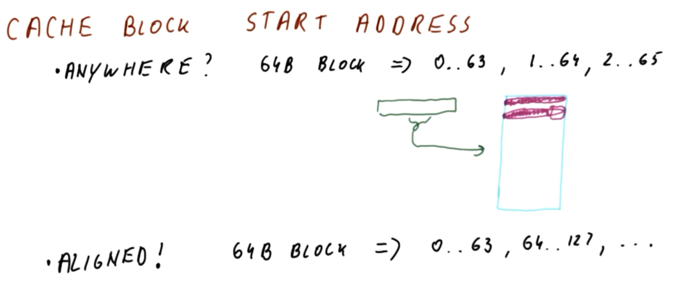
</center>

Now that we know (cf. Section 14) that a cache miss results in fetching an entire block's worth of data from memory, consider where these blocks can actually ***begin*** in memory.

One possible option is that a block can simply begin **anywhere**. For example, consider the case of `64 byte` blocks. In this case, the block may extend from byes `0` through `63`, `1` through `64`, `2` through `65`, and so on; in other words, if the **starting address** of the block can begin anywhere, then these would be the possible blocks fetched in the cache. However, this ***complicates*** matters considerably.

<center>
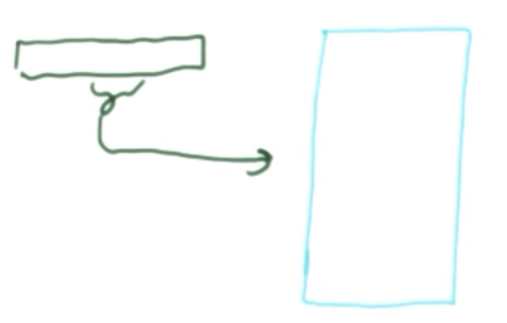
</center>

Firstly, recall (cf. Section 14) that the cache is a table, as in the figure shown above. The table is indexed into using some constituent bits of the address being accessed.

<center>
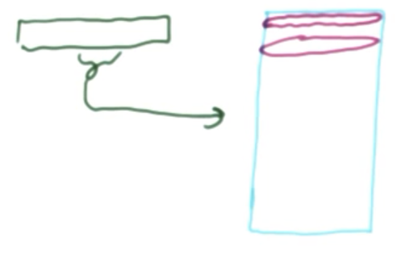
</center>

However, consider the case where the accessed address is `27`. The ***problem*** here is that the block can actually be found wherever the beginning of the block maps, as in the figure shown above. Block `0` through `63` might map at the top of the block, while block `1` through `64` maps below that, and so on. Therefore, there are ***many*** possible places where target address `27` may reside, by virtue of the fact that each of these blocks may map to these different locations depending on what its beginning address is.

<center>
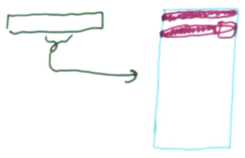
</center>

Secondly, there is another complication, which is that these blocks overlap. Therefore, block `0` through `63` contains data that overlaps with most of what block `1` through `64` contains, as in the figure shown above (as depicted by the shaded regions, i.e., everything else excluding the unshaded circled region, which is particular to the block `1` through `64`). Now the ***problem*** is that while the situation for ***reading*** is simple (i.e., either "copy" can be read for target address `27`), conversely, when it comes to ***writing***, it must be determined which of the copies exist and then correspondingly write to *all* of them, in order to maintain integrity of the reading operations. Therefore, this problem is similarly undesirable.

Therefore, in order to both reduce the complexity of accessing the cache and eliminate the problem of repeating data in the cache, we will only have caches where the blocks start at **block-aligned** addresses. Thus, for a `64 byte` block, this corresponds to a block extending from `0` through `63`, `64` through `127`, and so on. This ensures that any given byte address can only be found in ***one*** of these possible `64 byte` blocks at any given time, which in turn allows us to simply use some bits of the target address to indicate which of these blocks are being referenced for corresponding indexing into the cache for retrieval. For practical purposes, we will only ***assume*** block-aligned addresses for all "reasonable" caches.

## 17. Blocks in Cache and Memory

<center>
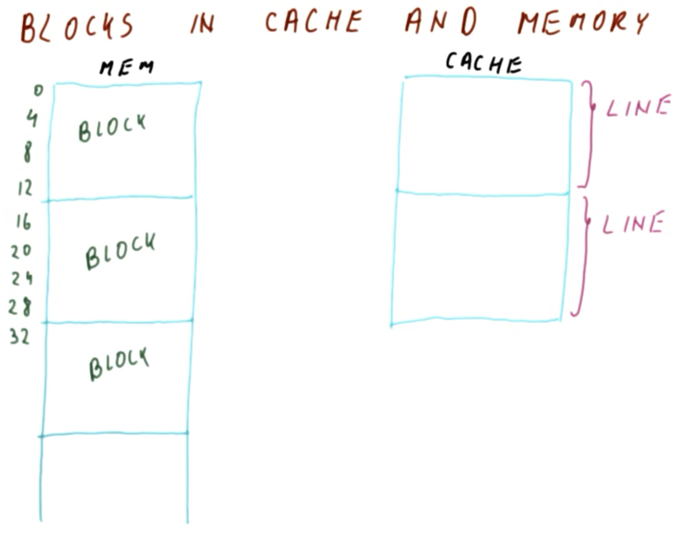
</center>

Now that we know cache blocks must be at aligned memory addresses (cf. Section 16), consider what the memory and cache looks like in terms of blocks (as in the figure shown above).

The **memory** appears as a large array of memory locations, starting at address `0` and incrementing at `4` bytes (i.e., `0`, `4`, `8`, etc.). Furthermore, given a block size of `16 bytes`, this suggests a possible block in memory spanning addresses `0` through `15`, `16` through `31`, etc.

Conversely, the **cache** can be considered as a number of slots where a **block** can fit. In this case, there is just a two-block cache (i.e., the cache is the size of two equivalent memory blocks). Furthermore, analogously to the blocks of data in memory, the cache has corresponding **lines**, which are essentially slots where a block can fit (e.g., the memory block starting at address `0` can be fetched into the cache and placed in corresponding line number `0`).
  * Therefore, to make a precise ***distinction*** between the "space" in a cache where a block can be placed vs. the actual memory content (i.e., the memory "block" itself) that is populated there, this "space" in the cache is correspondingly called a "line" to make this distinction. By corollary, the **line size** and the **block size** are the same to accommodate this accordingly.

## 18. Cache Line Sizes Quiz and Answers

<center>
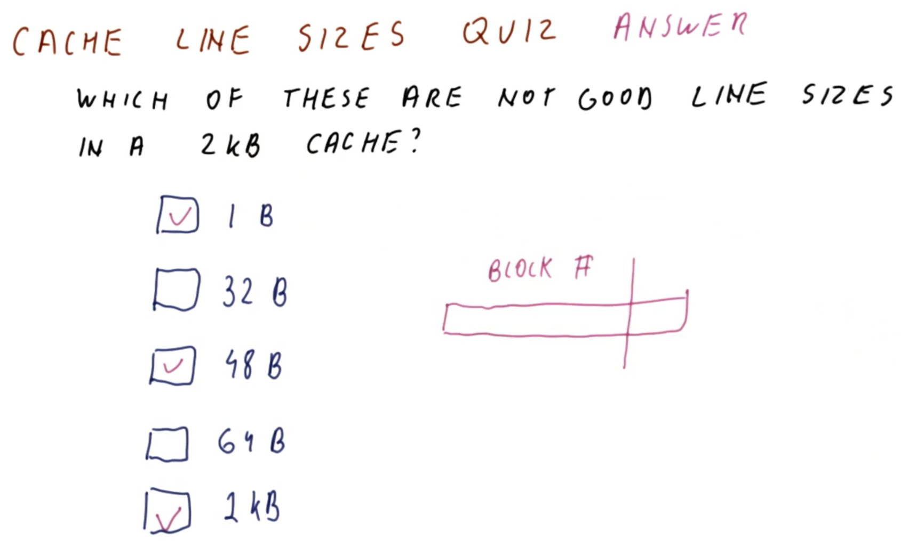
</center>

Which of the following are ***not*** good line sizes in a `2 KB` cache? (Select all that apply.)
  * `1 byte`
    * `APPLIES`
      * This size does not exploit spatial locality. Furthermore, word-size accesses will require accessing multiple blocks, or equivalently multiple lines in the cache. 
  * `32 bytes`
    * `DOES NOT APPLY`
      * This size is suitable for a line size. It exploits spatial localities, is not too large, and is a power of 2, and is therefore amenable to easily locating blocks.
  * `48 bytes`
    * `APPLIES`
      * This size, which suitable in terms of magnitude (i.e., neither too large nor too small), is not a power of 2, and therefore introduces issues with respect to alignment, requiring division by `48` rather than simple integer multiples of `2`.
  * `64 bytes`
    * `DOES NOT APPLY`
      * This size is also suitable for a line size, per similar rationale as for a `32 byte` block size. While this would halve the possible total blocks relative to `32 byte` blocks, this would still provide a lot of blocks fitting in a `2 KB` cache.
  * `1 KB`
    * `APPLIES`
      * This size, while suitable on the basis of being a power of 2, is not a good line size, because it would yield only two total lines in the cache due to its overly large size.

***Additional Explanation***:

<center>
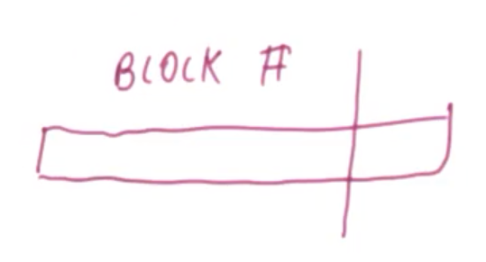
</center>

As an example, for a `32 byte` block (as in the figure shown above), the lowest `5` bits of the address indicate the location within the block, while the upper bits of the address correspond to the ***block number*** itself. Therefore, if (in this case) dividing by `32`, these lower-most bits are simply "discarded" to trivially compute the corresponding value. Conversely, a `48 byte` block would require an *actual* computation to determine the equivalent (i.e., rather than simple truncation of the bits).

Therefore, ideally, the block size should be one which:
  * Is a power of 2
  * Exploits spatial locality
  * Is relatively small compared to the cache size (i.e., to allow to fit many lines in the cache)

## 19. Block Offset and Block Number

<center>
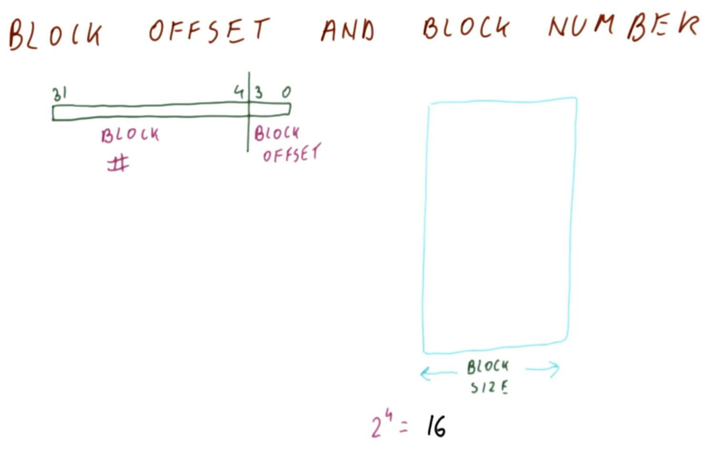
</center>

Consider now how to determine the **block offset** and the **block number**, given an **address**.

Assume that the processor produces a `32 bit` address, with bits numbered from `0` through `31`. This address is the location that the processor is attempting to find in the cache.

As before, the cache can be seen as an array of lines, each of a block size in size. In this example, assume a block size of `16 bytes`.

<center>
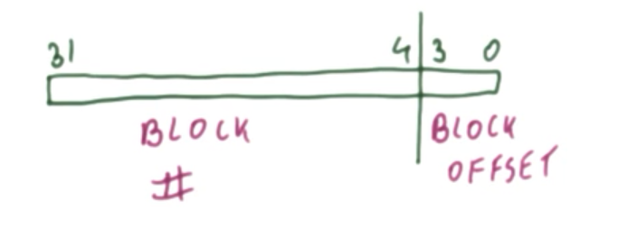
</center>

As in the figure shown above, some bits of the address indicate the block, while others indicate in which particular block the data resides.

With a block size of `16 bytes`, the processors must first determine how many bits indicate the location within the block. Since `16 = 2^4` (i.e., `log_2(16) = 4`), this requires `4 bits` to specify this accordingly.
  * Correspondingly, bits `0` through `3` designate the **block offset** to indicate this information (i.e., once the particular block is found in the cache, which part of this block should be read).
  * The remaining bits `4` through `31` indicate which particular block is being sought, i.e., the **block number**.

Therefore, when accessing the cache, the processor accesses the cache by attempting to determine the block via the block number, and if found, then it uses the offset to retrieve the correct data (i.e., from the corresponding location within the block).

## 20. Block Number Quiz and Answers

<center>
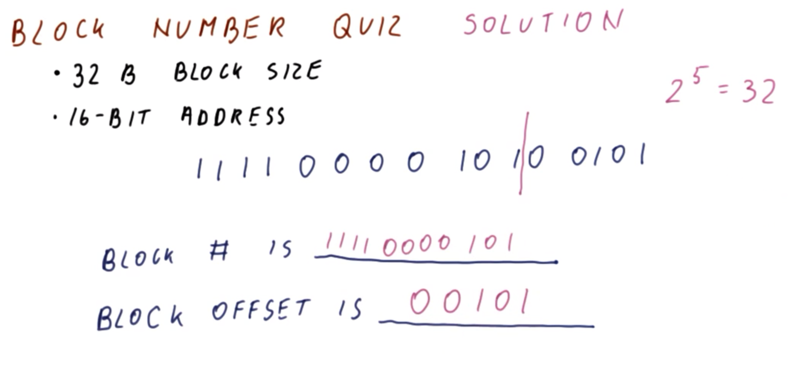
</center>

Consider a cache characterized as follows:
  * `32 bytes` block size
  * `16 bit` addresses (i.e., via the processor)

If the address in binary is given as follows:

```
1111 0000 1010 0101
```

What is the corresponding block number and block offset for this address? (Specified in binary.)

***Answer and Explanation***:

For a `32 bytes` block, the block offset will determine the location within the `32 bytes`. This requires `5 bits` to specify (i.e., `2^5 = 32`, or equivalently `log_2(32) = 5`). Given this, the `5` least significant bits indicate the following:

```
             |    |
1111 0000 1010 0101
```

Therefore, the block offset is `00101` (i.e., the `5` least significant bits), and the block number is `11110000101` (i.e., the remaining `32 - 5` most significant bits).

## 21. Cache Tags

With a better understanding of the block offset and the block number (cf. Sections 19 and 20), now consider **cache tags**, which are used to determine which blocks are actually ***present*** in the cache.

<center>
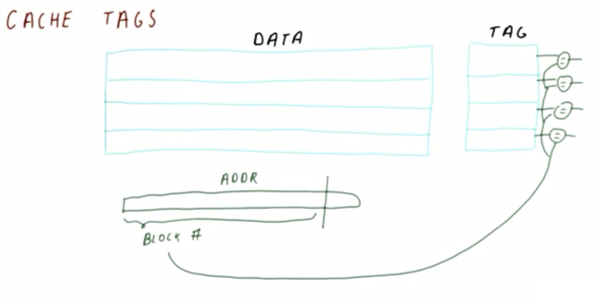
</center>

As before, the cache can contain some number of lines, as in the figure shown above (which depicts a four-line cache, with each line having `64 bytes` of data, for the sake of example).

Let us assume that any block from memory can be placed in any of the four lines. In this case, when given the address (i.e., `Addr` per the figure shown above), the least significant bits of the address will indicate the location within the line once the line itself is identified. However, generally, *any* of the four lines can contain *any* particular block number from main memory. So, then, how does the processor determine whether the access is actually a cache hit or not?

The answer to this is that in addition to the **data** of the blocks, the cache also keeps a so-called **tag**, indicating which block is present in the corresponding line. In this particular cache, the tag will contain the ***block number*** that the cache has in each of these lines.

Therefore, given the address, which is constituted by the block number (in addition to the block offset), the block number is ***compared*** to each of the tags in the cache. If one of the tags has value `1`, then this means that the tag ***matches*** the block number, and thus the corresponding data is located in this cache line.

<center>

</center>

Consider the situation as in the figure shown above, where the third line has corresponding matching tag `1`. This means that there is a ***cache hit***, and correspondingly the data is located in the cache at this line.

<center>
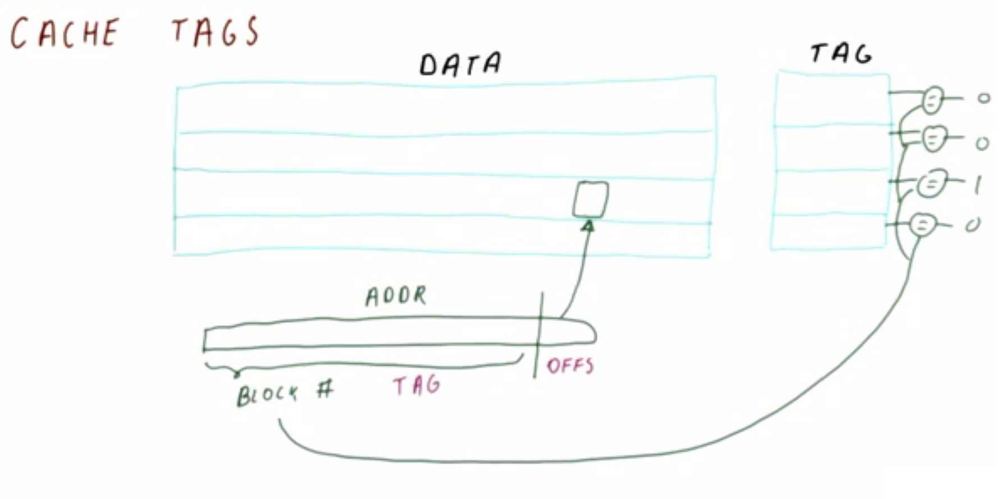
</center>

Now, the ***block offset*** can be used by the processor to determine where in that corresponding line the data is located, as in the figure shown above.
  * ***N.B.*** The block number is correspondingly called the **tag region** of the address. In the event of a cache miss, the corresponding tag-region data is placed into the cache line along with the block number being placed in the cache tag for subsequent searches. Furthermore, later, we will see that sometimes this tag region is ***not*** identical to the block number.

## 22. Cache Tag Quiz and Answers

<center>
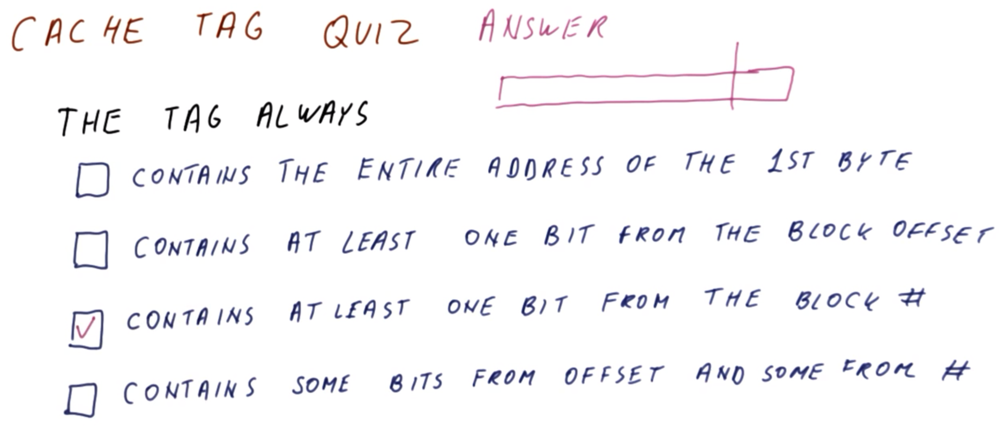
</center>

Which of the following is/are ***always*** true of a cache tag? (Select all that apply.)
  * Contains the entire address of the first byte
    * `DOES NOT APPLY`
      * This is not true, because the address supplied to the cache on an access contains the block offset in its least significant bits and the block number in the remaining most significant bits, as in the figure shown above. Furthermore, the cache tag only requires the block number portion of the address, and since the block always begins at an ***aligned*** address, thus the first byte of the block always has `0`s anyways and thus it is redundant to store these in the cache tag in the first place (instead, the cache tag contains only the bits required to identify the block).
  * Contains at least one bit from the block offset
    * `DOES NOT APPLY`
      * This is not true per similar rational as above, i.e., only the bits for the block number are relevant (whereas the block offset identifies the location of the data within that block once it is identified).
  * Contains at least one bit from the block number
    * `APPLIES`
      * As per the rationale above, the tag must contain at least one bit from the block number, because that is how the line is identified. In the example from the previous section (cf. Section 21), we saw that the *entire* block number can be a tag in that particular cache, however, this is not always/strictly true (i.e., more generally, the may be constituted from fewer than *all* of the block-number bits, but will contain *at least* one of them).
  * Contains some bits from the block offset and some others from the block number
    * `DOES NOT APPLY`
      * Per the same rationale as above, the block offset is not relevant.

## 23. Valid Bit

<center>

</center>

Another piece of information that the cache maintains about each of its constituent blocks is the so-called **valid bit**. Examining a cache with four lines of data along with their corresponding tags (as in the figure shown above), with the tags indicating which block is present in a given line, the question now is: What happens when the processor is turned on?

When the processor is turned on initially, the cache contains ***no*** useful data, however, there may still be data present; furthermore, even if all of the bits in the line were `0`, it is still necessary to know that whatever address is produced does not match any of the current blocks.

<center>
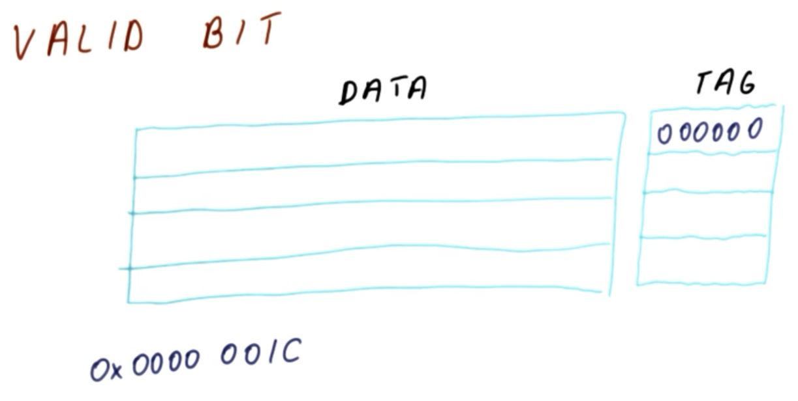
</center>

Furthermore, per corresponding matching of the tag (as in the figure shown above), if the tag is initially populated with all `0`s on turning on of the processor, what occurs if accessing an address such as `0x0000001C` (which incidentally contains a corresponding tag region of all `0`s)? In this case, there would be a corresponding match, with a resulting access of "garbage data" (i.e., not otherwise fetched from main memory first) in the cache.
  * ***N.B.*** Any possible value such match would cause a similar issue, not just this particular case of all `0`s, which is simply shown here for demonstration purposes.

<center>
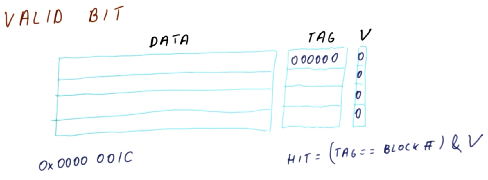
</center>

To ***solve*** this issue, an additional bit of state is added to the cache for each line (as in the figure shown above, denoted by `V`). This additional state indicates whether the tag and data are **valid** via this corresponding **valid bit**. Initially (i.e., on processor turn on), the valid bits are set to `0`, indicating that if the tag matches the address, it should ***not*** otherwise be treated as a cache hit, but rather the data should be fetched from main memory instead.

Correspondingly, the **hit condition** is more properly defined as:
```
Hit = (Tag == Block Number) & Valid Bit
```

Therefore, by setting the `Valid Bit` to `0` initially, this ensures no `Hit`, as intended in this scenario. Furthermore, this eliminates the problem of initializing the data and the tag in the first place. Later, as the cache becomes populated with the main-memory data, the `Valid Bit` is correspondingly set to `1`.

## 24-33. Types of Caches

### 24. Introduction

<center>
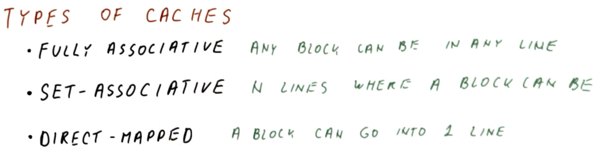
</center>

There are several ***types*** of caches when it comes to which blocks can be placed where in the cache.
  * The cache examples we have seen thus far are **fully associative caches**
    * In this type of cache, ***any*** block from memory can be placed into ***any*** line in the cache (e.g., a cache with room for `16` lines may require a corresponding search of up to `16` tags to locate the corresponding block)
  * The **direct-mapped caches** are essentially the opposite of fully-associated caches
    * In this type of cache, for a given block, there is ***exactly one*** location in the cache where the block can reside (i.e., only one line in the cache must be checked to determine if the cache contains that particular block)
    * In this arrangement, different blocks will still map to different lines, however, a particular block can only go into one particular location in the cache
  * The **set-associative cache** is a "middle ground" between the two aforementioned types
    * In this type of cache, there are `N` lines where a given block may be present within the cache, where `N` is typically greater than `1` but less than the total number of lines in the cache
    * Effectively, the direct-mapped cache is a special case of this set-associative cache with `N == 1`, and correspondingly the fully associative cache is the case of `N == total lines in the cache`; however, what is conventionally referred to as a "set-associative cache" typically refers to such a cache wherein `N` is relatively small compared to the total lines in the cache (typically, and `N` of `2`, `4`, or `8`)

The subsequent several sections will examine these various types of caches in turn.

### 25. Direct-Mapped Cache

Having had exposure to fully associative caches previously in this lesson, now let us consider the other "extreme", i.e., **direct-mapped caches**.

<center>
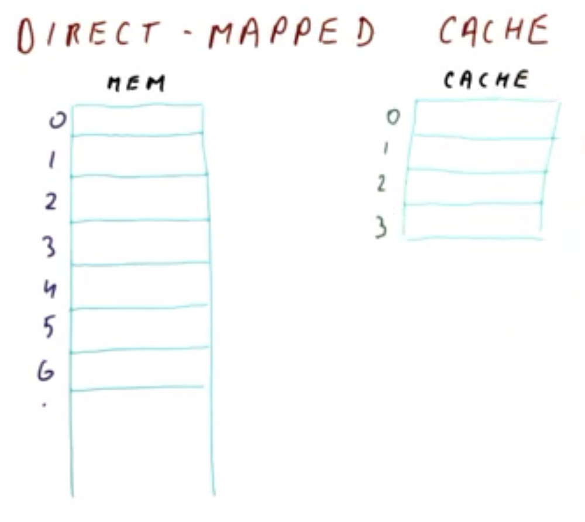
</center>

Consider a memory containing block numbers `0`, `1`, `2`, etc. (as in the figure shown above), along with the corresponding cache which is able to accommodate four such blocks (similarly numbered `0`, `1`, `2`, and `3`).

<center>
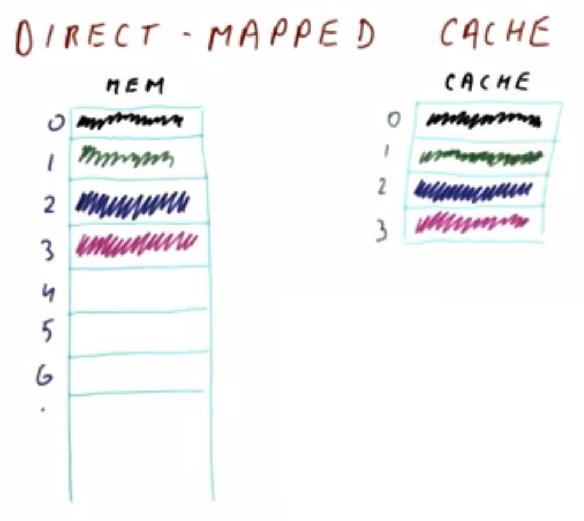
</center>

 in a direct-mapped cache, memory block `0` (if present in the cache at all), must be located in cache line `0`; memory block `1` (if present in the cache at all), must be located in cache line `1`; and so on, as in the figure shown above (depicted by color correspondences between memory blocks and cache lines).

<center>
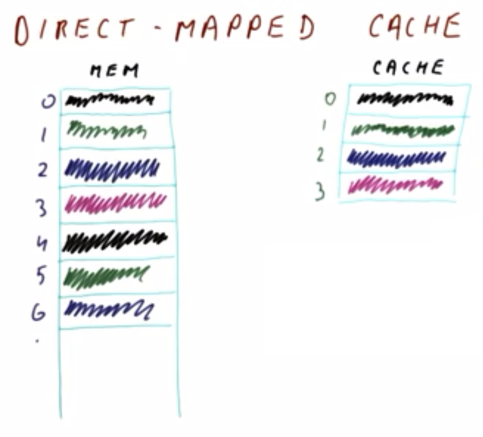
</center>

 Now, for memory block `4`, it "rolls over" and is correspondingly mapped to cache line `0`; and so on, as in the figure shown above. Therefore, for any given memory block address, there is only ***one*** corresponding location in the cache where that address is located.

<center>
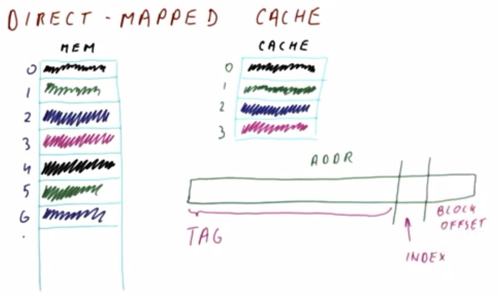
</center>

Examining the **address** itself more closely (as in the figure shown above):
  * The least significant bit still denote the **block offset** as before, indicating where within the block the data is present (assuming such a block is found in the cache)
  * The **block number** region itself is composed of:
    * A few bits indicating the **index**, i.e., where in the cache the block is located, with sufficient detail to unambiguously identify the specific cache line in question (e.g., a four-line cache would require at least `2 bits` to uniquely identify a cache line)
    * The remaining most-significant bits constitute the **tag** region

In this arrangement, an interesting question arises: Why does the tag region ***not*** include the full block number (i.e., extending into the index bits as well)? The reason for this is that the tag region needs to identify the cache line in the first place, and considering that the index bits must uniquely identify ***one*** location within the cache, then the tag region correspondingly does not otherwise need to (over-)specify the index bits, i.e., by examining a particular cache line, it has already been determined that the index bits must be the ones corresponding to that particular cache line. Therefore, the tag region simply needs to indicate which of the lines could be possible candidates, as from there, the index bits can identify unambiguously among those.
  * In other words, if the index bits were otherwise stored within the tag region, then ***all*** of the tags could be possibly placed into a given cache line (with all having equivalently the "same" index bits, which thereby would not necessitate additional storage of these bits if they are already effectively "known")

### 26. Direct-Mapped Caches Pros and Cons

<center>

</center>

Now, consider the upsides and downsides of direct-mapped caches.

When accessing the direct-mapped cache, it is only necessary to look in only ***one*** place. This provides the following ***upsides***:
  * The cache is ***fast*** (i.e., low `Hit Time`) → if data is present there at the one location, then it is a cache hit, otherwise it is a cache miss
    * Conversely, looking in more than one place requires additional waiting/downtime in order to read out all of the additional locations, and then determine which one of them (if any) has the data, and so on
  * The cache is ***cheaper*** than more complex caches → it is only necessary to do *one* comparison on every access to the cache (i.e., only requires one type of comparator, one valid-bit checker, etc.)
  * The cache is ***energy-efficient*** → only requires one type of comparison and one valid-bit check per access, which requires less energy expenditure per access compared to checking more than one

Conversely, the ***downsides*** of direct-mapped caches are related to the fact that the block ***must*** go into one location. To see why this is problematic, consider a processor accessing blocks `A` and `B` in direct succession (i.e., `A B A B ...` and so on), with both blocks `A` and `B` mapping to the ***same*** location in the cache.
  * When `A` is accessed, it is brought into the cache.
  * When `B` is accessed, it is brought into the cache, in the same location where `A` currently resides, thereby ejecting `A` in the process.
  * This pattern continues when `A` accessed again, thereby ejecting `B`; and so on.

Therefore, the downside of a direct-mapped cache is this particular situation of **conflicts** arising among the cache lines, with particular blocks "fighting" over a single spot in the cache, despite the cache itself having plenty of other underutilized locations available otherwise. Correspondingly, such conflicts consequently ***increase*** the `Miss Rate` (thereby potentially offsetting the benefit of a fast `Hit Time`).

### 27. Direct-Mapped Cache Quiz 1 and Answers

Let us now check our knowledge of direct-mapped caches and how they handle conflicts.

<center>
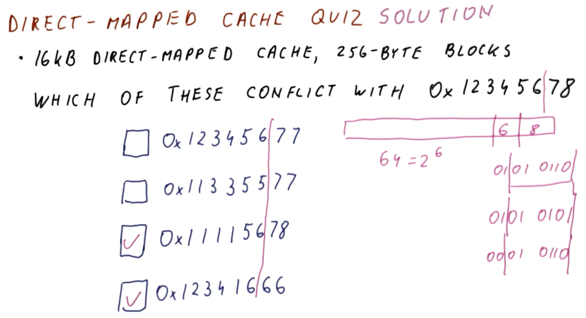
</center>

Consider a `16 KB` direct-mapped cache with `256-byte` blocks. Given this, which of the following addresses conflict with `0x12345678`? (Select all that apply.)
  * `0x12345677`
    * `DOES NOT APPLY`
  * `0x11335577`
    * `DOES NOT APPLY`
  * `0x11115678`
    * `APPLIES`
  * `0x12341666`
    * `APPLIES`

***Answer and Explanation***:

The key to solving these types of problems is to determine the breakdown of the address in question into its constituent offset, index, and tag regions.

With a `256-byte` block size, this means that there are `8 bits` (i.e., `log_2(256) = log_2(2^8) = 8`) constituting the block offset, as depicted in the figure shown above. In hexadecimal notation, this corresponds to the two least-significant digits. These can be conveniently ignored, with additional focus then placed on the directly index bits.

Conflicts occur where different blocks have the ***same*** index bits. To determine the number of bits in the index region, this can be determined via the number of blocks in the cache as per `16 KB / 256 bytes = 64 blocks`, and correspondingly `64 = 2^6` or equivalently `log_2(64) = 6` bits required to specify the index bits (as in the figure shown above).

Therefore, for the target address `0x12345678`, the corresponding index bits are as follows (via `0x...56...`, with `|...|` denoting the six particular index bits in question):

```
      |     |
... 0101 0110 ...
```

By inspection, conflicts may arise with prospective addresses having similar form `0x...56...` (i.e., `0x12345677` and `0x11115678`), however, to determine if an actual conflict occurs, it must also occur in a ***different*** block.
  * In particular, address `0x12345677` does ***not*** conflict (despite having the same index bits), because they are in the ***same*** block (i.e., having the same block number via `0x123456...`), thereby mapping to the same block but otherwise not conflicting among blocks.
  * Conversely, `0x11115678` is in a ***different*** block which maps to the ***same*** index bits, so this does result in a conflict.

Further examining `0x11335577`:

```
      |     |
... 0101 0101 ...
```

Since the index bits are different, the block does not conflict.

Finally, examining `0x12341666`:

```
      |     |
... 0001 0110 ...
```

These index bits ***do*** match, thereby mapping to the ***same*** place in the cache as `0x12345678` (but otherwise in a different block) and therefore causing a conflict accordingly.

### 28. Direct-Mapped Cache Quiz 2 and Answers

Now, consider an example of accessing direct-mapped caches.

<center>
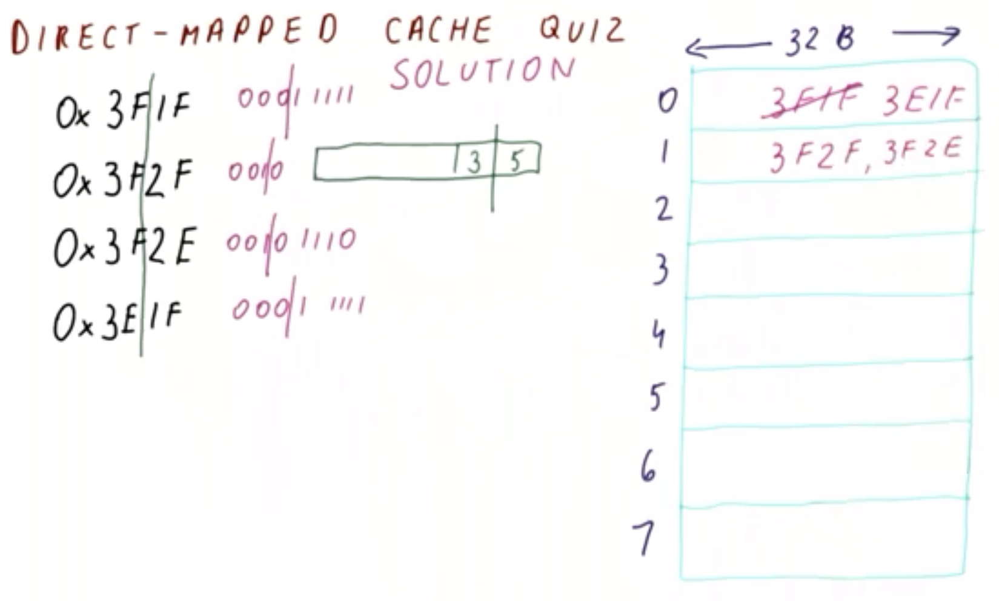
</center>

Consider a direct-mapped cache with eight lines (as in the figure shown above), numbered `0`, `1`, ..., `7` accordingly, each of which is `32 bytes` in size.

Furthermore, the processor produces the following sequence of accesses, one at a time:
```
0x3F1F
0x3F2F
0x3F2E
0x3E1F
```

What is the content of the cache ***after*** these four sequential accesses?

***Answer and Explanation***:

The address breakdown will be as follows (as depicted in green in the figure shown above), in respective least-to-most significant bits order (i.e., right-to-left in the corresponding figure):
  * `5 bits` offset region (via `32 = 2^5` or equivalently `log_2(32) = 5`)
  * `3 bits` index bits region (to uniquely identify each cache line, via `8 = 2^3` or equivalently `log_2(8) = 3`)
  * The remaining bits constitute the tag region

Now, consider the mapping of the sequential accesses into the cache, as per the least-significant `8 = 3 + 5 bits`, or equivalently the two least-significant hex digits (i.e., the least-significant byte), as follows:

| Hex Address (`\|` delimits least-significant byte) | Eight Least-Significant Bits (`\|` delimits offset vs. index bits) | Assigned Cache Line per Index Bits |
|:--:|:--:|:--:|
| `0x3F\|1F` | `... 000\|1 1111` | `0` |
| `0x3F\|2F` | `... 001\|0 1111` | `1` |
| `0x3F\|2E` | `... 001\|0 1110` | `1`, same block as `0x3F2F`, co-located within ***same*** block |
| `0x3E\|1F` | `... 000\|1 1111` | `0`, same block as `0x3F1F`, however, with replacement due to ***conflicting*** block |

Therefore, the final content of the cache is as follows:

| Cache Line | Content |
|:--:|:--:|
| `0` | `0x3E1F` |
| `1` | `0x3F2F`, `0x3F2E` |
| `2` | (empty) |
| `3` | (empty) |
| `4` | (empty) |
| `5` | (empty) |
| `6` | (empty) |
| `7` | (empty) |

### 29. Set-Associative Caches

Now, consider **set-associative caches**.

<center>
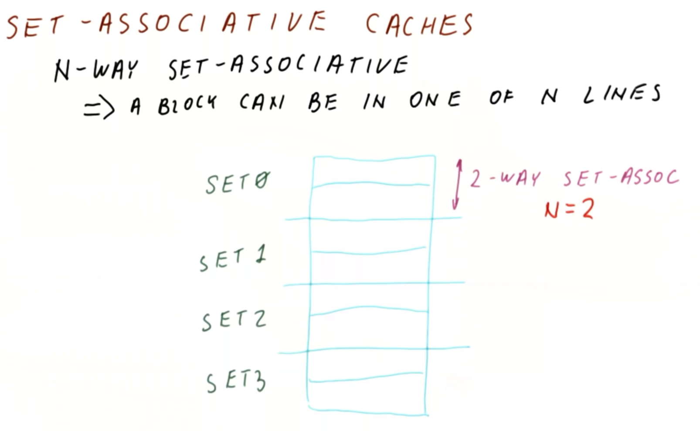
</center>

A cache is said to be **N-way set-associative** when a particular block can reside in one of `N` possible candidate lines. The overall cache is divided into regions called **sets** (as in the figure shown above, which has four such sets), and a given block can reside in one of the sets (i.e., as designated by the corresponding bits denoting the block's address).

Furthermore, *within* a set, there could be a number of lines that contain a block. In this particular case (as in the figure shown above), there is a **2-way set-associative** cache (i.e., `N = 2`), corresponding to the two possible candidate cache lines within a given set (the block can reside in either of these lines for a given set). Therefore, different blocks may be mapped to different sets, but within a particular set, the block will select among the two lines in that set.
  * ***N.B.*** Here, "2-way" associative is therefore referring to the two blocks within a given set, rather than referring to the number of sets (i.e., four total in this particular case, as per the figure shown above).

### 30. Offset, Index, Tag for Set-Associative Caches

Now, consider how to form the offset, index, and tag bit regions in the address for set-associative caches.

<center>
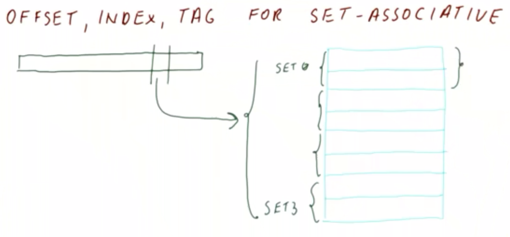
</center>

Given a two-way set-associative cache with four sets (as in the figure shown above), when the processor produces an address:
  * The least-significant bits (indicating the location within in the block) are still determined by the block size, thereby giving the **offset**
  * The next-least-significant bits are the **index** bits, indicating the particular set in question (as denoted by the green arrow in the figure shown above)
    * Therefore, the number of index bits is determined by how many sets are present in the cache (e.g., in the case of four sets, this requires two index bits to uniquely identify a given set)
  * The remaining bits (i.e., the most-significant bits) are the **tag** region

As with a direct-mapped cache, once a line has been placed in a given set (e.g., set `0`, as denoted by right-side green bracket in the figure shown above), it is determinate that everything that maps to this particular set will have the corresponding index bits set (e.g., `00`), so it is redundant/unnecessary to store this information in the tag itself; rather, within the set itself, it is only necessary to ensure that the content therein corresponds to the most-significant bits of the address (i.e., tag region), but not the index bits themselves.
  * ***N.B.*** Interestingly, a direct-mapped cache of the same size would have one additional index bit, thereby effectively reducing the tag region by one bit.

### 31. 2-Way Set-Associative Quiz and Answers

<center>
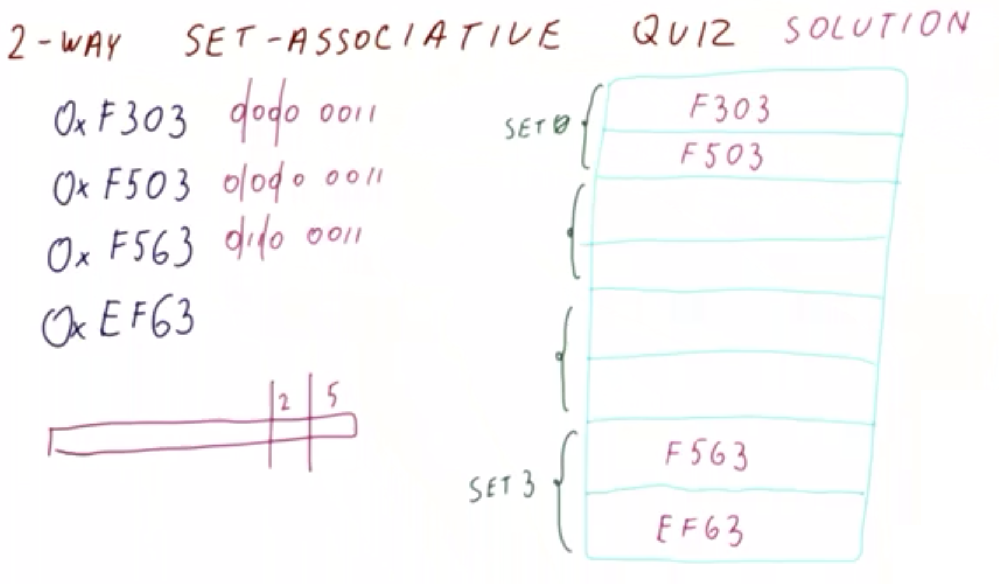
</center>

Consider a 2-way set-associative cache (as in the figure shown above) characterized as follows:
  * `32 bytes` block size
  * Four sets with two blocks per set

Furthermore, the processor produces the following sequence of accesses, one at a time:
```
0xF303
0xF503
0xF563
0xEF63
```

What is the content of the cache ***after*** these four sequential accesses?

***Answer and Explanation***:

As before (cf. Section 28), this will require determining which bits in the address correspond to the content in the cache.

The address breakdown will be as follows (as depicted in magenta in the figure shown above), in respective least-to-most significant bits order (i.e., right-to-left in the corresponding figure):
  * `5 bits` offset region (via `32 = 2^5` or equivalently `log_2(32) = 5`)
  * `2 bits` index bits region (to uniquely identify each set, via `4 = 2^2` or equivalently `log_2(4) = 2`)
  * The remaining bits constitute the tag region

Now, consider the mapping of the sequential accesses into the cache, as per the least-significant `7 = 2 + 5 bits`, or equivalently the two least-significant hex digits, as follows:

| Hex Address (`\|` delimits least-significant bytes) | Eight Least-Significant Bits (`\|` delimits offset vs. index bits) | Assigned Set:Line per Index Bits (where Line is `0` or `1` for a given Set) |
|:--:|:--:|:--:|
| `0xF3\|03` | `... 0\|00\|0 0011` | `0`:`0` |
| `0xF5\|03` | `... 0\|00\|0 0011` | `0`:`1`, same set as `0xF303`, but placed in the other line within the set |
| `0xF5\|63` | `... 0\|11\|0 0011` | `3`:`0` |
| `0xEF\|63` | `... 0\|11\|0 0011` | `3`:`1`, same set as `0xF563`, but placed in the other line within the set |

Therefore, with the 2-way set-associative cache, it is possible to place more than one block mapping to given location (i.e., set) within the cache, without otherwise yielding conflicts as a result. Indeed, this **conflicts reduction** is a key ***desirable property*** of an N-way set-associative cache. However, using this approach also complicates the tag-region checks, because now there are `N` corresponding locations for the processor to search within a given set before locating the data (or otherwise determining that a cache miss has occurred).

### 32. Fully Associative Cache

Finally, now consider the **fully associative cache**.

<center>

</center>

Given an eight-entry cache (as in the figure shown above), a fully associative cache is one in which ***any*** block can map to ***any*** of the available cache lines. In this case, the address is simply composed of the following:
  * The least-significant bits **offset** region, of size corresponding to the number of bits required to uniquely specify each cache line (e.g., `3` bits in the case of an eight-entry cache, via `8 = 2^3` or equivalently `log_2(8) = 3`)
  * Correspondingly, there are ***no*** index bits, since the offset already uniquely specifies the cache line in question
  * The remaining most-significant bits consequently correspond to the **tag** region

### 33. Direct-Mapped vs. Full Associative Caches

<center>
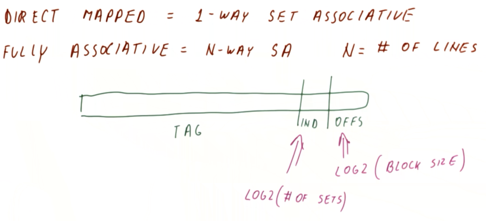
</center>

As mentioned previously (cf. Section 24), direct-mapped and fully associative caches can be considered ***special cases*** of set-associative caches.
  * A direct-mapped cache is essentially a one-way set-associative cache
  * A fully associative cache is an `N`-way set-associative cache, where `N` corresponds to the number of cache lines

Correspondingly, for all of these caches, the address that the processor supplies (as in the figure shown above) is broken down into the following components:
  * **offset** → the number of bits are specified by `log_2(block size)`, indicating the location within the block (of size `block size`)
  * **index** → the number of bits are specified by `log_2(number of sets)`
    * In a direct-mapped cache, `number of sets` corresponds directly to the number of blocks
    * In a fully associative cache, `number of sets` is simply `1` (i.e., `log_2(1) = 0`), and therefore no resulting index bits
  * **tag** → the remaining most-significant bits

Therefore, when attempting to determine which bits are the index bits, it is also necessary to determine the offset bits as well, in order to determine the corresponding specifications of these respective bits regions (i.e., among the least significant bits of a given address).

## 34-36. Cache Replacement

### 34. Introduction

Now that it is apparent how caches ***find*** the data when searching for it, consider what occurs when it is necessary to ***replace*** something from the cache to make room for new data (i.e., due to a cache miss).

<center>
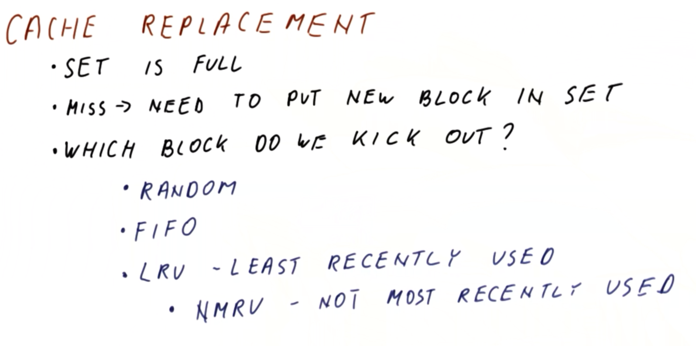
</center>

The situation which necessitates **cache replacement** is typically when the target set for the data is currently ***full***. This results in a **cache miss**, which thereby requires placing a ***new*** block (i.e., which yields **cache hits**) that is consequently brought into the cache. However, in order to accomplish this, the question is: ***Which*** existing block should be correspondingly ejected from the cache? There are several possible **replacement policies** for this purpose.

The first such replacement policy is **random**: Simply eject a randomly selected block from among those already present in the set.

<center>
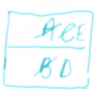
</center>

Another replacement policy is **first in, first out (FIFO)** (as in the figure shown above), whereby the block that has been present the ***longest*** is consequently ejected (e.g., with existing blocks `A` and `B`, bringing in `C` ejects `A`; subsequently bringing in `D` ejects `B`; subsequently bringing in `E` ejects `C`; and so on).

Another replacement policy is **least recently used (LRU)**, whereby the block that has not been used for the longest time period (i.e., the "least recently used" block) is ejected, followed by the next-most-recently-used block, and so on.
  * ***N.B.*** As a corollary, it would ***not*** be sensible to eject the "most recently used" block, since presumably such a block is correspondingly generating cache hits.

As it turns out, **least recently used (LRU)** is indeed a very good policy. Accordingly, there are several policies which attempt to approximate it (since actually accomplishing "true" LRU is not easy to do in practice).
  * For example, one such policy is **not most recently used (NMRU)**, which tracks just those blocks which have been used most recently, and then selecting randomly from among the remaining blocks besides those (i.e., without otherwise tracking ***all*** of the blocks to definitively determine *the* most recently used blocks).

### 35. Implementing Least Recently Used (LRU)

So, then, how is the **least recently used (LRU)** cache replacement policy actually ***implemented***?

The LRU cache replacement policy works really well because it exploits locality well, i.e., the most recently used data is correspondingly more likely to be used very soon afterwards (while the opposite is true for the data which has not been used recently).

<center>
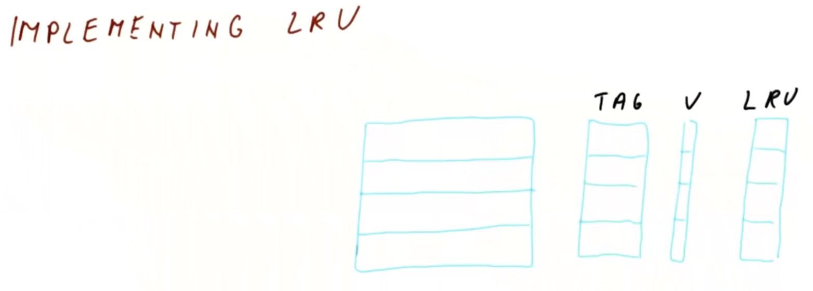
</center>

Consider a four-way set-associative cache (as in the figure shown above), focusing on a particular set composed of these four constituent blocks. Each such block has the following ***components***:
  * **tag**
  * **valid bit**
  * **LRU counter** → tracks which block was accessed when
    * The LRU counter stores a value corresponding to the size of the set (i.e., `0` through `3`, inclusive)

<center>
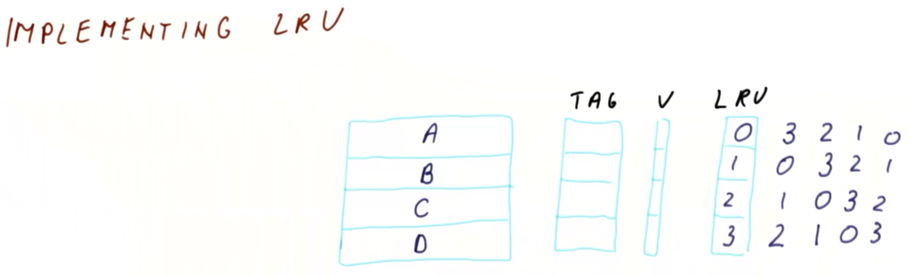
</center>

The LRU counter is initialized as follows:

| Line Number | LRU Counter |
|:--:|:--:|
| 0 | 0 |
| 1 | 1 |
| 2 | 2 |
| 3 | 3 |

***N.B.*** At any given time, all of the LRU counter values must be ***unique*** (i.e., different from each other).

When it is time to replace data in the cache, the first replacement occurs in the block with corresponding LRU counter value `0`, which is the least recently used block.

First, consider placement of a candidate block `A`. This will correspondingly be placed in the line with current LRU counter value `0`, as follows:

| Line Number | Data Block | LRU Counter |
|:--:|:--:|:--:|
| 0  | ***A*** | ***0*** |
| 1 | (N/A) | 1 |
| 2 | (N/A) | 2 |
| 3 | (N/A) | 3 |

With this placement, upon accessing by the processor, block `A` now becomes the most recently used, with a corresponding update to the LRU counter values as follows (via corresponding decrementing of the other counters):

| Line Number | Data Block | LRU Counter |
|:--:|:--:|:--:|
| 0  | ***A*** | ***3*** |
| 1 | (N/A) | 0 |
| 2 | (N/A) | 1 |
| 3 | (N/A) | 2 |

Next, candidate block `B` is placed into the cache, similarly in the line with current LRU counter value `0`, as follows:

| Line Number | Data Block | LRU Counter |
|:--:|:--:|:--:|
| 0  | A | 3 |
| 1 | ***B*** | ***0*** |
| 2 | (N/A) | 1 |
| 3 | (N/A) | 2 |

With this placement, upon accessing by the processor, block `B` now becomes the most recently used, with a corresponding update to the LRU counter values as follows (via corresponding decrementing of the other counters):

| Line Number | Data Block | LRU Counter |
|:--:|:--:|:--:|
| 0  | A | 2 |
| 1 | ***B*** | ***3*** |
| 2 | (N/A) | 0 |
| 3 | (N/A) | 1 |

Next, candidate block `C` is placed into the cache, similarly in the line with current LRU counter value `0`, as follows:

| Line Number | Data Block | LRU Counter |
|:--:|:--:|:--:|
| 0  | A | 2 |
| 1 | B | 3 |
| 2 | ***C*** | ***0*** |
| 3 | (N/A) | 1 |

With this placement, upon accessing by the processor, block `C` now becomes the most recently used, with a corresponding update to the LRU counter values as follows (via corresponding decrementing of the other counters):

| Line Number | Data Block | LRU Counter |
|:--:|:--:|:--:|
| 0  | A | 1 |
| 1 | B | 2 |
| 2 | ***C*** | ***3*** |
| 3 | (N/A) | 0 |

Next, candidate block `D` is placed into the cache, similarly in the line with current LRU counter value `0`, as follows:

| Line Number | Data Block | LRU Counter |
|:--:|:--:|:--:|
| 0  | A | 1 |
| 1 | B | 2 |
| 2 | C | 3 |
| 3 | ***D*** | ***0*** |

With this placement, upon accessing by the processor, block `D` now becomes the most recently used, with a corresponding update to the LRU counter values as follows (via corresponding decrementing of the other counters):

| Line Number | Data Block | LRU Counter |
|:--:|:--:|:--:|
| 0  | A | 0 |
| 1 | B | 1 |
| 2 | C | 2 |
| 3 | ***D*** | ***3*** |

This correspondingly reverts the LRU counters effectively to their initial state.

<center>
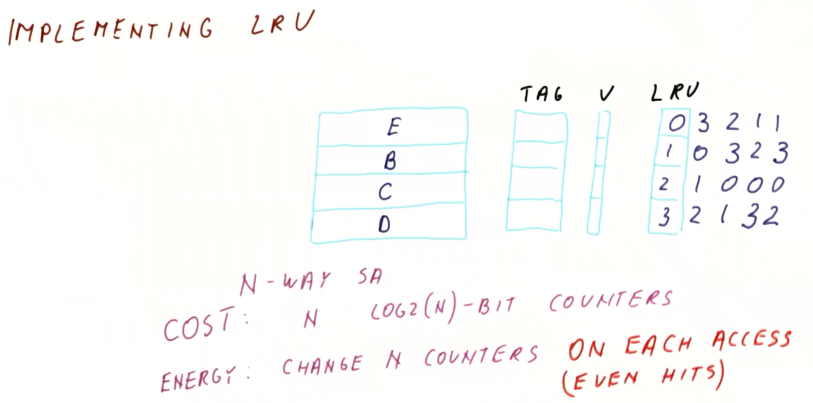
</center>

Now, given candidate block `E` being placed into the cache, it is correspondingly placed the line with current LRU counter value `0` (and correspondingly ejecting existing block `A` in the process), as follows:

| Line Number | Data Block | LRU Counter |
|:--:|:--:|:--:|
| 0  | ***E*** | ***0*** |
| 1 | B | 1 |
| 2 | C | 2 |
| 3 | D | 3 |

With this placement, upon accessing by the processor, block `E` now becomes the most recently used, with a corresponding update to the LRU counter values as follows (via corresponding decrementing of the other counters):

| Line Number | Data Block | LRU Counter |
|:--:|:--:|:--:|
| 0  | ***E*** | ***3*** |
| 1 | B | 0 |
| 2 | C | 1 |
| 3 | D | 2 |

Now, consider the scenario where `B` (which is currently the least recently used block) is ***re-accessed***. In this case, the LRU counters are reset as follows:

| Line Number | Data Block | LRU Counter |
|:--:|:--:|:--:|
| 0  | E | 2 |
| 1 | ***B*** | ***3*** |
| 2 | C | 0 |
| 3 | D | 1 |

Furthermore, what if `B` is accessed yet again? In that case, these LRU counter values persist in the same state.

Now, consider the scenario where `D` (which is neither the most nor least recently used block) is ***re-accessed***. In this case, the LRU counters are reset as follows:

| Line Number | Data Block | LRU Counter |
|:--:|:--:|:--:|
| 0  | E | 1 |
| 1 | B | 2 |
| 2 | C | 0 |
| 3 | ***D*** | ***3*** |

Note that in this situation, there is not a simple decrement of ***all*** of the other LRU counters, but rather the values are updated such that they are only decremented when the original values were ***above*** the original counter value in the accessed block (e.g., above `1`, in the case of block `D` here), while otherwise the counter values previously ***below*** this value retain their previous/original value (e.g., block `C` retains its original value of `0`, which is below `D`'s original value of `1` pre-increment). This ensures uniqueness of the LRU counter values.

As another example of this scenario, a subsequent re-access of "intermediately used" block `B` yields the following:

| Line Number | Data Block | LRU Counter |
|:--:|:--:|:--:|
| 0  | E | 1 |
| 1 | ***B*** | ***3*** |
| 2 | C | 0 |
| 3 | D | 2 |

Here, `B` is incremented, `D` is correspondingly decremented, but `E` and `C` remain unchanged.

As is evident, maintaining the LRU cache replacement policy is fairly complicated. For an `N`-way set-associative cache, it requires `N` LRU counters of size `log_2(N)` (e.g., with `N == 4`, this requires `log_2(4) = 2 bit` counters). Therefore, for a highly associative cache (e.g., `N == 32`), this will require a corresponding number of bits (e.g., `log_2(32) = 5 bit` counters, with `32` such counters per set). This adds a corresponding ***cost***.

Furthermore, with respect to ***energy*** consumption, this adds an additional problem: There is a necessary modification of up to `N` counters ***on each access*** (even for frequently occurring ***cache hits***).

Therefore, LRU approximations attempt to minimize the number of counters used, as well as perform fewer per-access updates (particularly on cache hits) in order to reduce energy consumption.

### 36. Least Recently Used (LRU) Quiz

<center>
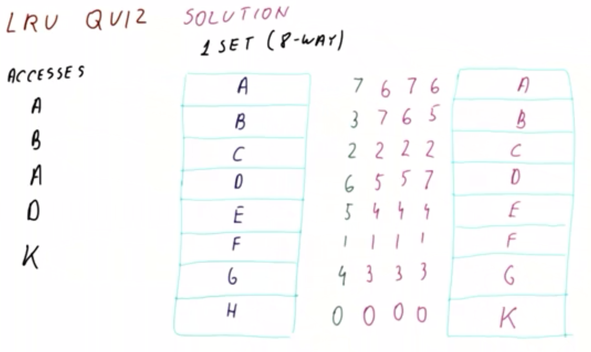
</center>

Consider a single set within a eight-way set-associative cache (as in the figure shown above). Assume that the eight blocks are initially populated as follows (along with initial LRU counters state):

| Line Number | Data Block | LRU Counter |
|:--:|:--:|:--:|
| 0 | A | 7 |
| 1 | B | 3 |
| 2 | C | 2 |
| 3 | D | 6 |
| 4 | E | 5 |
| 5 | F | 1 |
| 6 | G | 4 |
| 7 | H | 0 |

What is the ***new*** content of the cache, subsequently to the following sequence of accesses?

```
A
B
A
D
K
```

***Answer and Explanation***:

On initial access of `A` (the most recently used block), the counters retain their original values.

On subsequent access of `B`, the LRU counters update as follows:

| Line Number | Data Block | LRU Counter |
|:--:|:--:|:--:|
| 0 | A | 6 |
| 1 | ***B*** | ***7*** |
| 2 | C | 2 |
| 3 | D | 5 |
| 4 | E | 4 |
| 5 | F | 1 |
| 6 | G | 3 |
| 7 | H | 0 |

On subsequent re-access of `A`, the LRU counters update as follows:

| Line Number | Data Block | LRU Counter |
|:--:|:--:|:--:|
| 0 | ***A*** | ***7***  |
| 1 | B | 6 |
| 2 | C | 2 |
| 3 | D | 5 |
| 4 | E | 4 |
| 5 | F | 1 |
| 6 | G | 3 |
| 7 | H | 0 |

On subsequent access of `D`, the LRU counters update as follows:

| Line Number | Data Block | LRU Counter |
|:--:|:--:|:--:|
| 0 | A | 6 |
| 1 | B | 5 |
| 2 | C | 2 |
| 3 | ***D*** | ***7*** |
| 4 | E | 4 |
| 5 | F | 1 |
| 6 | G | 3 |
| 7 | H | 0 |

On subsequent access of `K` (resulting in a cache miss), `H` (the least recently used block, with corresponding LRU counter value `0`) is ejected and replaced, and the LRU counters are update as follows:

| Line Number | Data Block | LRU Counter |
|:--:|:--:|:--:|
| 0 | A | 5 |
| 1 | B | 4 |
| 2 | C | 1 |
| 3 | D | 6 |
| 4 | E | 3 |
| 5 | F | 0 |
| 6 | G | 2 |
| 7 | ***K*** | ***7*** |

This is the final state of the cache following the sequential accesses.

## 37-40. Write Policy

### 37. Introduction

<center>

</center>

The final aspect concerning caches' operation is the **write policy**. There are two **components** to this.

The first component of the write policy is the so called **allocate policy**, which concerns the question: Do we insert (i.e., ***allocate*** and enter the cache) for blocks that are written (i.e., if there is a **write miss**, should the block be brought into the cache or not?)? For this purpose, there are two ***types*** of caches, as follows:
  * **write-allocate**
    * This type of cache brings the block that is written into the cache 
  * **no-write-allocate**
    * This type of cache does ***not*** bring the block that is written into the cache (i.e., in the case of a **read miss**, the block is brought into the cache, but otherwise in the case of a **write miss**, the block is *not* brought into the cache)

Most modern caches are **write-allocate**, simply because there is generally inherent ***locality*** among read and write operations (i.e., data that is written is also likely to be read). Accordingly, write-allocate improves read hits, even in the event of a write miss.

The second component of the write policy concerns the question: When a write hit occurs, should the write be performed *only* in the cache, or *also* in main memory as well? For this purpose, there are two ***types*** of caches, as follows:
  * **write-through**
    * This type of cache updates the main memory immediately (i.e., a write to the cache correspondingly propagates up to the main memory as well, thereby "writing through" the cache)
  * **write-back**
    * This type of cache only writes to the cache, but otherwise only writes to main memory when the block is ***replaced*** in the cache (i.e., the block cannot be discarded until the most recently version of the block is finally written to the main memory, however, otherwise the "current" state is maintained exclusively within the cache up to and immediately prior to this point)

**Write-through** caches are relatively unpopular; instead, **write-back** caches are used much more commonly. This is due to the fact that writes (which have a lot of intrinsic locality) will update the cache possibly many times, only sending a write to main memory *once* as the block is replaced. This correspondingly prevents the main memory from becoming "overwhelmed" with write operations from the cache.

Furthermore, note that there is a relationship between the choices of **write-allocate** and **write-back** caches as the constituents of the collective write policy: Selecting write-back cache begets selection of a write-allocate cache, because minimizing writes to main memory (by correspondingly predominantly writing *only* to the cache via write-back) is particularly useful for **write misses** (in which case, it is desirable for future writes to occur in the cache via write-allocate).

### 38. Write-Back Caches

<center>
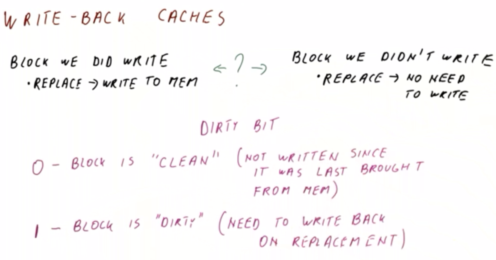
</center>

Now, consider what exactly occurs in a write-back cache.

Write-through is fairly straightforward: Simply write to main memory, and then the cache otherwise works as expected.

Conversely, in a **write-back** cache:
  * There can be a block that was (re)written to subsequently to fetching it from main memory. In this case, when the block is ***replaced***, it must be correspondingly ***written*** to main memory as well.
  * However, there is also the possibility that there were ***no*** writes since last fetching from main memory. Since such a block has only been ***read*** in the cache, there is no corresponding need to ***write*** that block back to main memory.

So, then, how can it be determined which of these two scenarios occurs in a write-back cache?
  * One possibility is that this is simply ***indeterminate***, in which case a write will simply occur every time the block is replaced.
    * Unfortunately, there is a lot of read-only data that ultimately will not necessitate a write to main memory, but will be (re)written repeatedly to main memory regardless, if following this approach.
  * Conversely, another possibility is to include a **dirty bit** in every block in the cache, which indicates whether or not the block has been written to main memory since being placed in the cache.
    * A dirty bit of `0` indicates that the block is "***clean***", i.e., the block was ***not*** written to since last being brought in from main memory.
    * A dirty bit of `1` indicates that the block is "***dirty***", i.e., the block ***was*** written to since last being brought in from memory, thereby necessitating a write-back to main memory on block replacement when the block in question is ejected from the cache.

### 39. Write-Back Cache Example

Consider an example of a write-back cache.

<center>
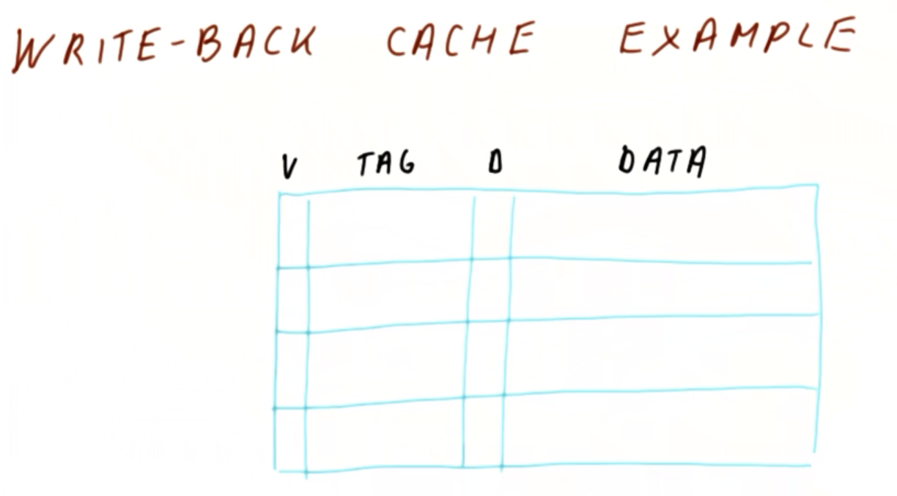
</center>

Consider a small four-entry direct-mapped cache (as in the figure shown above), comprised of the following **component**:
  * **valid bit**
  * **tag** region
  * **dirty bit**
  * **data** region

***N.B.*** A least recently used (LRU) counter is *not* needed here, as this is a direct-mapped cache (i.e., the replaced block is already determinate as-is).

Furthermore, consider the following sequence of accesses performed by the processor:

```
WR A
RD A
RD B
RD C
WR C
```

where `A`, `B`, and `C` map to ***different*** sets in the cache.

<center>
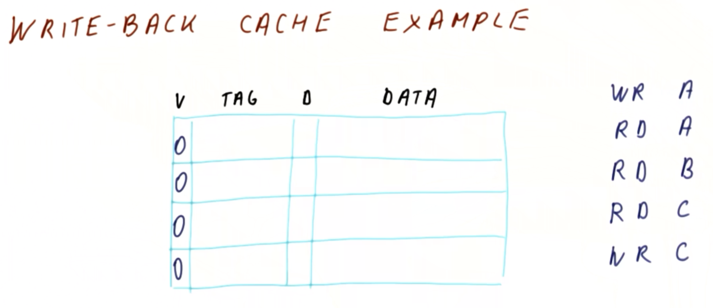
</center>

In the initial access `WR A` (as in the figure shown above), there is a cache miss, resulting in a setting of `0` for all the valid bits in the cache as follows:

| Cache Line | Valid Bit | Tag | Dirty Bit | Data |
|:--:|:--:|:--:|:--:|:--:|
| 0 | 0 | | | |
| 1 | 0 | | | |
| 2 | 0 | | | |
| 3 | 0 | | | |

<center>
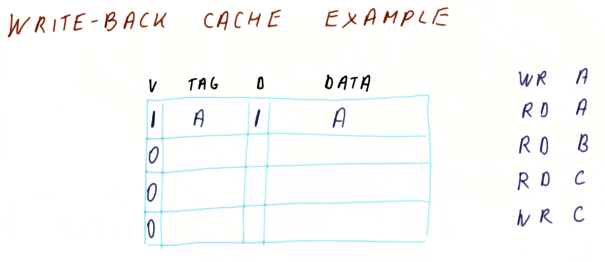
</center>

On initial `WR A` (as in the figure shown above), the cache is updated as follows:

| Cache Line | Valid Bit | Tag | Dirty Bit | Data |
|:--:|:--:|:--:|:--:|:--:|
| 0 | 1 | A | 1 | A |
| 1 | 0 |  | | |
| 2 | 0 |  | | |
| 3 | 0 |  | | |

Because this is a write operation, on populating the cache with the data for `A`, the processor will also correspondingly set the dirty bit to `1`. 

In the subsequent access `RD A`, the processor checks the tag and valid bit, correspondingly detects the match in tag `A` and the valid bit being set to `1` already, and therefore the processor simply uses this cache line for `A` (furthermore, the fact that the dirty bit is `1` does not change this, either).

<center>
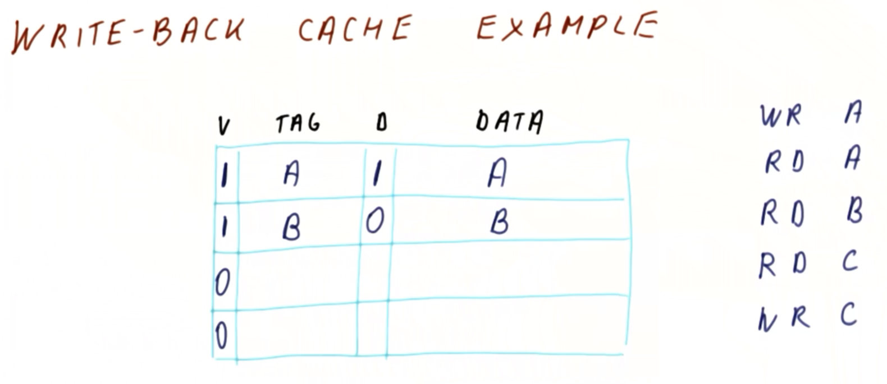
</center>

In the subsequent access `RD B` (as in the figure shown above), there is a cache miss (as per corresponding lack of entries for `B` with valid bit `1`), the cache is updated as follows:

| Cache Line | Valid Bit | Tag | Dirty Bit | Data |
|:--:|:--:|:--:|:--:|:--:|
| 0 | 1 | A | 1 | A |
| 1 | 1 | B | 0 | B |
| 2 | 0 |  | | |
| 3 | 0 |  | | |

Because this is a read operation, on populating the cache with the data for `B`, the processor will also correspondingly set the dirty bit to `0`. 

<center>
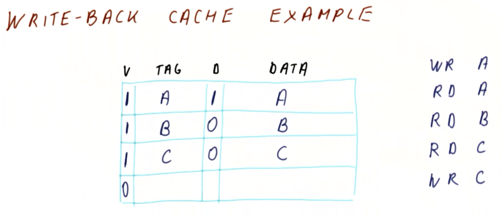
</center>

In the subsequent access `RD C` (as in the figure shown above), there is a cache miss (as per corresponding lack of entries for `C` with valid bit `1`), the cache is updated as follows:

| Cache Line | Valid Bit | Tag | Dirty Bit | Data |
|:--:|:--:|:--:|:--:|:--:|
| 0 | 1 | A | 1 | A |
| 1 | 1 | B | 0 | B |
| 2 | 1 | C | 0 | C |
| 3 | 0 |  | | |

Because this is a read operation, on populating the cache with the data for `C`, the processor will also correspondingly set the dirty bit to `0`.

<center>

</center>

In the subsequent access `WR C` (as in the figure shown above), there is a cache hit (as per corresponding preexisting entry for `C` with valid bit `1`), the cache is updated as follows:

| Cache Line | Valid Bit | Tag | Dirty Bit | Data |
|:--:|:--:|:--:|:--:|:--:|
| 0 | 1 | A | 1 | A |
| 1 | 1 | B | 0 | B |
| 2 | 1 | C | 1 | C |
| 3 | 0 |  | | |

Because this is a write operation, on populating the cache with the data for `C`, the processor will also correspondingly set the dirty bit to `1`. 

At this point, the dirty bit for every line in the cache simply indicates whether or not the line was ever written since being last brought into the cache.

<center>
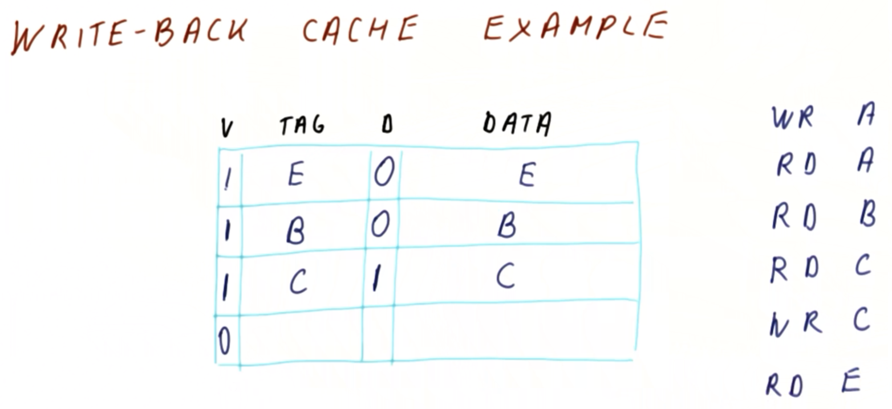
</center>

Now, consider a subsequent access operation `RD E` (as in the figure shown above), whereby `E` maps to the same line as `A`, for which there is a cache miss (as per corresponding lack of entries for `E` with valid bit `1`); the cache is updated as follows:

| Cache Line | Valid Bit | Tag | Dirty Bit | Data |
|:--:|:--:|:--:|:--:|:--:|
| 0 | 1 | E | 0 | E |
| 1 | 1 | B | 0 | B |
| 2 | 1 | C | 1 | C |
| 3 | 0 |  | | |

`E` correspondingly ejects `A` from the cache. However, prior to this, the data for `A` (which has been written to the cache already, but not yet to main memory) is sent to main memory as a write, since its dirty bit is set to `1`.

Furthermore, on eventual replacement with `E`, because this is a read operation, on populating the cache with the data for `E`, the processor will also correspondingly set the dirty bit to `0`.

<center>
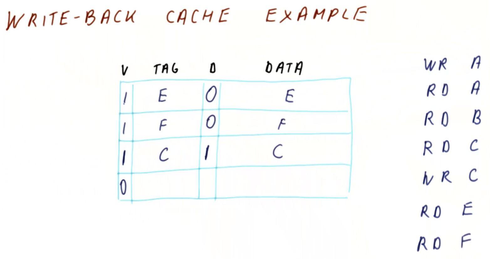
</center>

Finally, consider a subsequent access operation `RD F` (as in the figure shown above), whereby `E` maps to the same line as `B`, for which there is a cache miss (as per corresponding lack of entries for `F` with valid bit `1`); the cache is updated as follows:

| Cache Line | Valid Bit | Tag | Dirty Bit | Data |
|:--:|:--:|:--:|:--:|:--:|
| 0 | 1 | E | 0 | E |
| 1 | 1 | F | 0 | F |
| 2 | 1 | C | 1 | C |
| 3 | 0 |  | | |

`F` correspondingly ejects `B` from the cache. Since the data for `B` has dirty bit is set to `0`, `B` does ***not*** get sent to main memory for writing prior to this replacement occurring, but rather gets ejected and overwritten by `F` directly.

Furthermore, on replacement with `F`, because this is a read operation, on populating the cache with the data for `F`, the processor will also correspondingly set the dirty bit to `0`.

### 40. Write-Back Cache Quiz and Answers

<center>
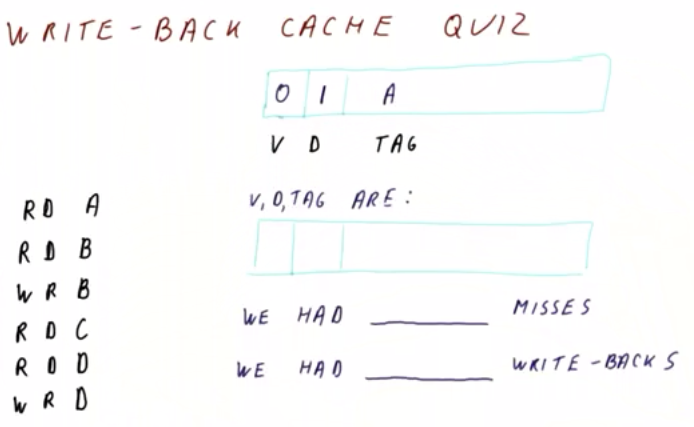
</center>

Consider a direct-mapped cache (as in the figure shown above), with a given entry in the cache in its initial state as follows:

| Valid Bit | Dirty Bit | Tag |
|:--:|:--:|:--:|
| 0 | 1 | A |

Furthermore, all accesses map to this same single entry.

The processor performs the following sequence of accesses:

```
RD A
RD B
WR B
RD C
RD D
WR D
```

with all of these accesses mapping to the *same* single entry in the cache.

After this sequence of accesses, what is the new state of the cache? Furthermore, how many cache misses occur in the sequence, and how many write-backs to main memory are performed?

***Answer and Explanation***:

<center>
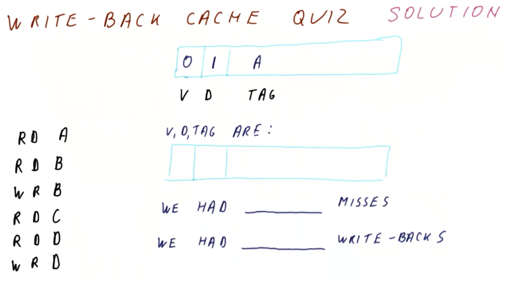
</center>

In the initial access `RD A` (as in the figure shown above), there is a cache miss (`1` total cache miss), resulting in a setting of `0` for the valid bit in the cache.
  * ***N.B.*** Because the initial valid bit is `0`, the fact that the dirty bit was `1` is irrelevant here.

<center>
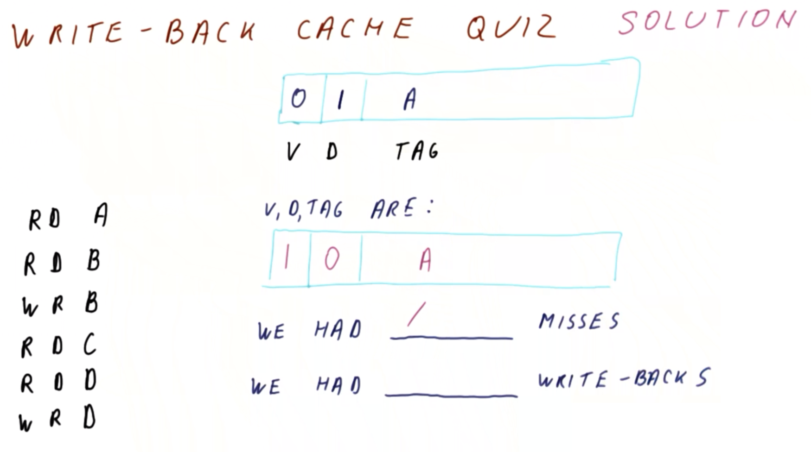
</center>

On initial `RD A` (as in the figure shown above), the cache is updated as follows:

| Valid Bit | Dirty Bit | Tag |
|:--:|:--:|:--:|
| 1 | 0 | A |

Because this is a read operation, on populating the cache with the data for `A`, the processor will also correspondingly set the dirty bit to `0`. 

<center>

</center>

In the subsequent access `RD B` (as in the figure shown above), there is a cache miss (`2` total cache misses), and the cache is updated as follows:

| Valid Bit | Dirty Bit | Tag |
|:--:|:--:|:--:|
| 1 | 0 | B |

Because this is a read operation, on populating the cache with the data for `B`, the processor will also correspondingly set the dirty bit to `0`. Furthermore, since the previous entry for `A` had dirty bit `0`, there is no corresponding write-back operation immediately preceding ejection of `A` and subsequent replacement by `B`.

<center>

</center>

In the subsequent access `WR B` (as in the figure shown above), there is a cache hit, and the cache is updated as follows:

| Valid Bit | Dirty Bit | Tag |
|:--:|:--:|:--:|
| 1 | 1 | B |

Because this is a write operation, on populating the cache with the data for `B`, the processor will also correspondingly set the dirty bit to `1`.

<center>

</center>

In the subsequent access `RD C` (as in the figure shown above), there is a cache miss (`3` total cache misses), and the cache is updated as follows:

| Valid Bit | Dirty Bit | Tag |
|:--:|:--:|:--:|
| 1 | 0 | C |

Because this is a read operation, on populating the cache with the data for `C`, the processor will also correspondingly set the dirty bit to `0`. Furthermore, since the previous entry for `B` had dirty bit `1`, there is a corresponding write-back operation immediately preceding ejection of `B` and subsequent replacement by `C` (`1` total write-back).

<center>
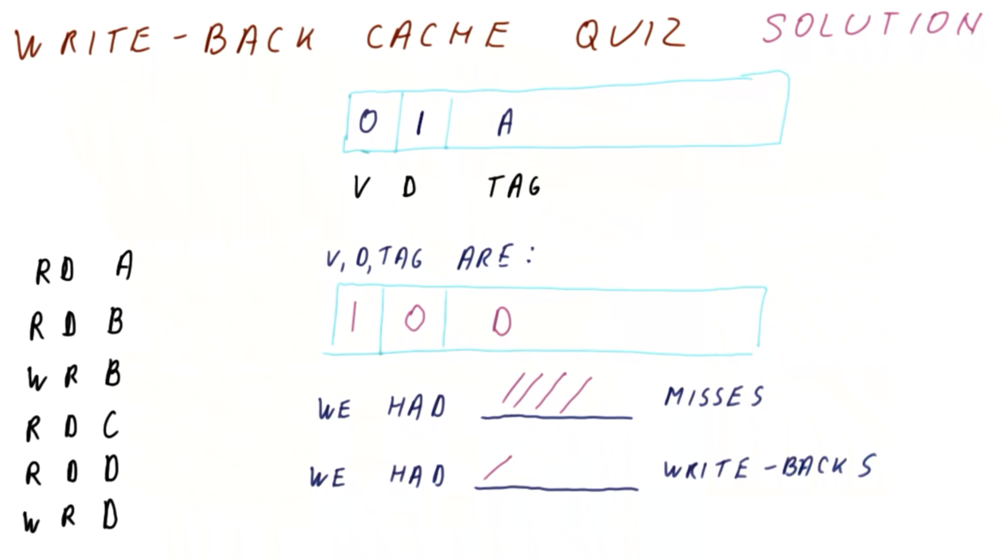
</center>

In the subsequent access `RD D` (as in the figure shown above), there is a cache miss (`4` total cache misses), and the cache is updated as follows:

| Valid Bit | Dirty Bit | Tag |
|:--:|:--:|:--:|
| 1 | 0 | D |

Because this is a read operation, on populating the cache with the data for `D`, the processor will also correspondingly set the dirty bit to `0`. Furthermore, since the previous entry for `C` had dirty bit `0`, there is no corresponding write-back operation immediately preceding ejection of `C` and subsequent replacement by `D`.

<center>
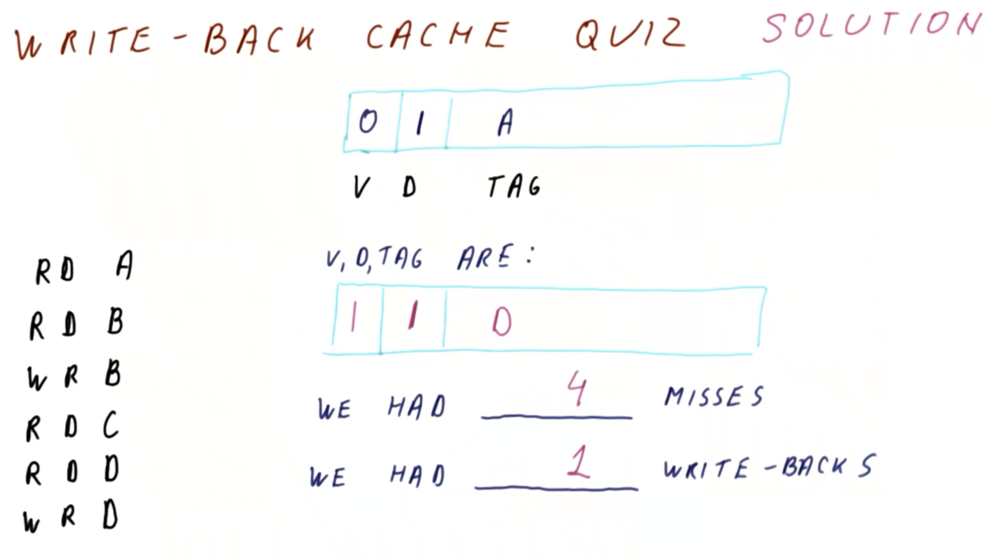
</center>

In the subsequent access `WR D` (as in the figure shown above), there is a cache hit, and the cache is updated as follows:

| Valid Bit | Dirty Bit | Tag |
|:--:|:--:|:--:|
| 1 | 1 | D |

Because this is a write operation, on populating the cache with the data for `D`, the processor will also correspondingly set the dirty bit to `1`.

This is the final state of the cache on execution of the sequential accesses. Furthermore, the summary of the upstream operations is as follows:
  * `4` total cache misses
  * `1` total write-backs

## 41-42. Cache Summary

Having seen multiple aspects of how caches work, let us now summarize them for a more realistic cache.

### 41. Part 1

<center>
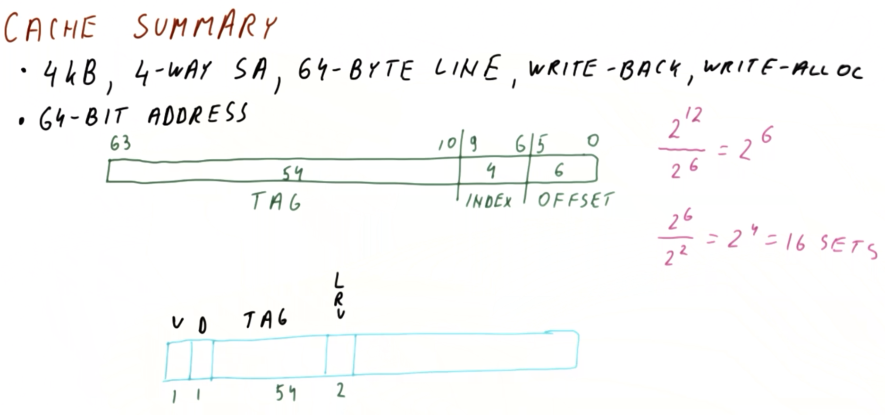
</center>

Consider a cache characterized as follows (as in the figure shown above):
  * `4 KB` in total size
    * four-way set-associative
    * `64 bytes` line size
    * a write policy characterized by write-back, write-allocate
  * `64 bit` addresses created by the processor to access the cache

When accessing this cache, the `64 bit` address will be divided into the following regions (from least- to most-significant bits):
  * **offset** (bits `0` through `5`, `6 bits` total)
    * For a `64 byte` line, this requires `log_2(64) = 6` bits to specify uniquely the location within the cache block
  * **index** (bits `6` through `9`, `4 bits` total)
    *  For a `4 KB` cache (`2^12` bytes total), the total number of blocks (given `64 byte` line size, or `2^6`) is therefore `2^12 / 2^6 = 2^6` blocks in the cache, correspondingly uniquely specified by `6` bits.
    * Furthermore, for a four-way set-associative cache (with each line specified uniquely via `4 = 2^2` bits within a given set, thereby constituting the **index** bits region of the address), this gives `2^6 / 2^2 = 2^4 = 16` total sets. 
  * **tag** (bits `10` through `63`, `54` bits total)
    * These are the remaining most significant bits after the offset and index bits are specified.

In the cache, for each given block, it is specified as follows:

| Line-Entry Region | Size | Comment |
|:--:|:--:|:--:|
| Valid Bit | 1 bit | (N/A) |
| Dirty Bit | 1 bit | Required for a write-back cache |
| Tag | 54 bits |  (N/A) |
| Least Recently Used (LRU) Counter | 2 bits | In a set-associative cache, a replacement policy is required, therefore, here we are using LRU accordingly (and in the case of a four-way set associative cache, this requires `log_2(4) = 2 bits` to uniquely specify each cache line) |
| Data | 64 bytes | The remaining area contains the data itself | 

As per the table above, there are `58 bits` (1 + 1 + 54 + 2) in addition to the `64 bytes` of data, thereby adding some ***overhead***. Furthermore, note that the cache size is usually expressed in terms of how much ***data*** it contains, whereas the ***actual*** cache size (i.e., in terms of the cache lines themselves) is typically larger than this, in order to accommodate this extra information on a per-cache-line basis.

### 42. Part 2

<center>
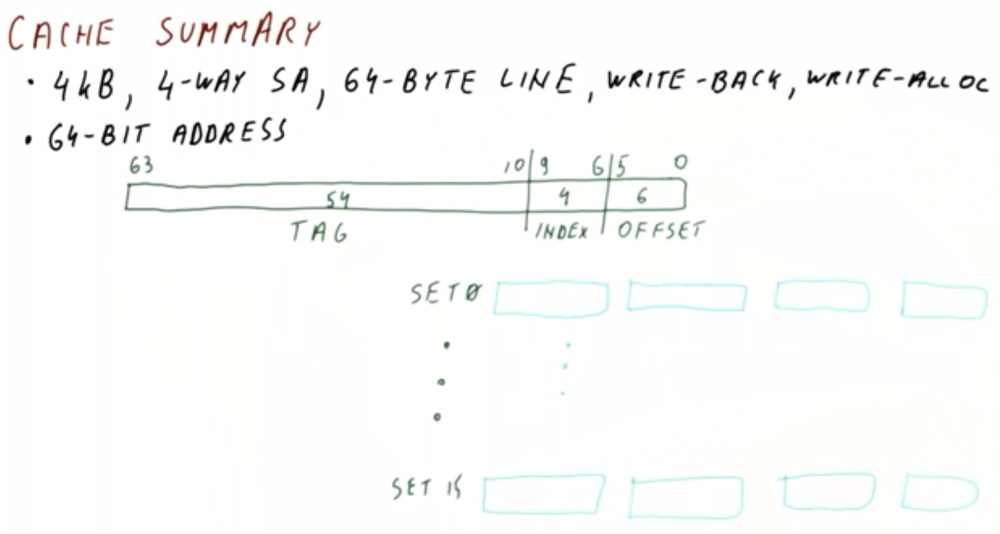
</center>

Given the same cache as specified previously (cf. Section 41), as in the figure shown above, now consider how the address is used to access the cache.

To simplify the representation, lines in a given set are represented horizontally, spanning the `16` total sets accordingly (i.e., sets `0` through `15`, respectively).

<center>
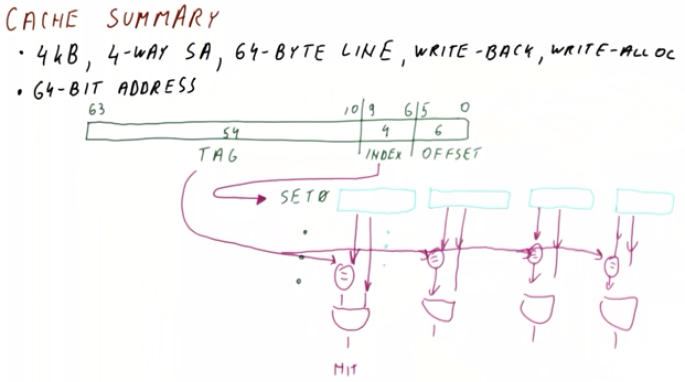
</center>

In order to ***access*** the cache (as in the figure shown above), the **index** bits are used to identify the corresponding set (e.g., set `0`). Next, the **tag** is read for corresponding **invalid** bits across ***all*** of the blocks in the corresponding set. These read tag bits are compared to the tag data of the lines within the cache, along with the corresponding **valid** bit.
  * ***N.B.*** These reads/comparisons are performed for ***all*** of the lines in the set ***simultaneously***.

In order for a **cache hit** to occur, the valid bit must be read as `1` (along with corresponding `OR` comparison with the tag itself).

<center>
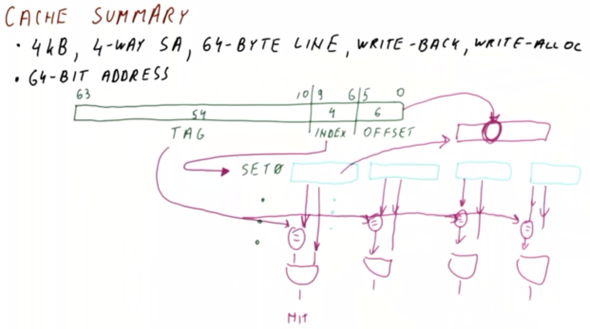
</center>

If a **cache hit** is found (as in the figure shown above), the corresponding line in the set has its corresponding block data read out. Once this (`64 bytes` of) data is read out, the **offset** from the address is correspondingly used to determine where the actual data itself is located, in order to return it to the processor itself.
  * In the case of a ***write*** operation, the offset indicates where to write. Furthermore, a corresponding **dirty bit** is changed to `1` in the corresponding line of the set.
    * ***N.B.*** The dirty bit is not checked/updated to `0` regardless in the case of a write operation, as a write operation will necessitate an update to `1` either way (i.e., such overhead is otherwise non-value-added relative to simply updating directly to `1` in the event of a write operation).

<center>
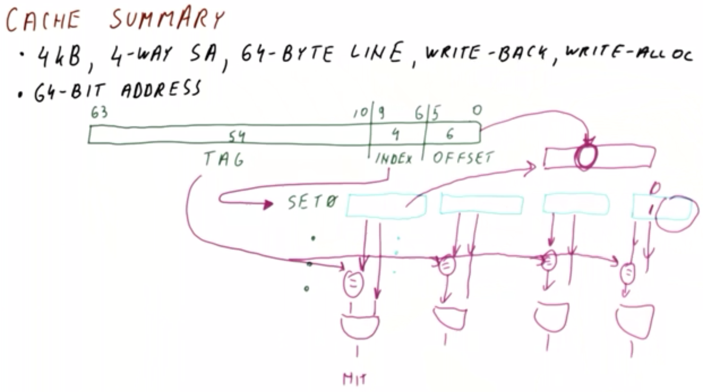
</center>

Conversely, in the case of a **cache miss** (as in the figure shown above), i.e., all `OR`-wise comparisons yield `0`, the **LRU counters** are consequently checked in order to determine which line to eject from the cache for the set in question.
  * Furthermore, if the **dirty bit** of the line in question is `0`, then replacement will occur directly.
  * Otherwise, if the **dirty bit** of the line in question is `1`, then the data must first be written to main memory prior to ejection and subsequent replacement.

On update/replacement of the block, the LRU counters are correspondingly updated accordingly, and the data is subsequently provided to the processor as usual from there.

As is evident now, all of the aforementioned cache-related activities occur essentially ***simultaneously*** on every access operation, with appropriate contingencies for cache hits vs. cache misses accordingly.

## 43-44. Cache Summary Quizzes and Answers

### 43. Cache Summary Quiz 1 and Answers

<center>
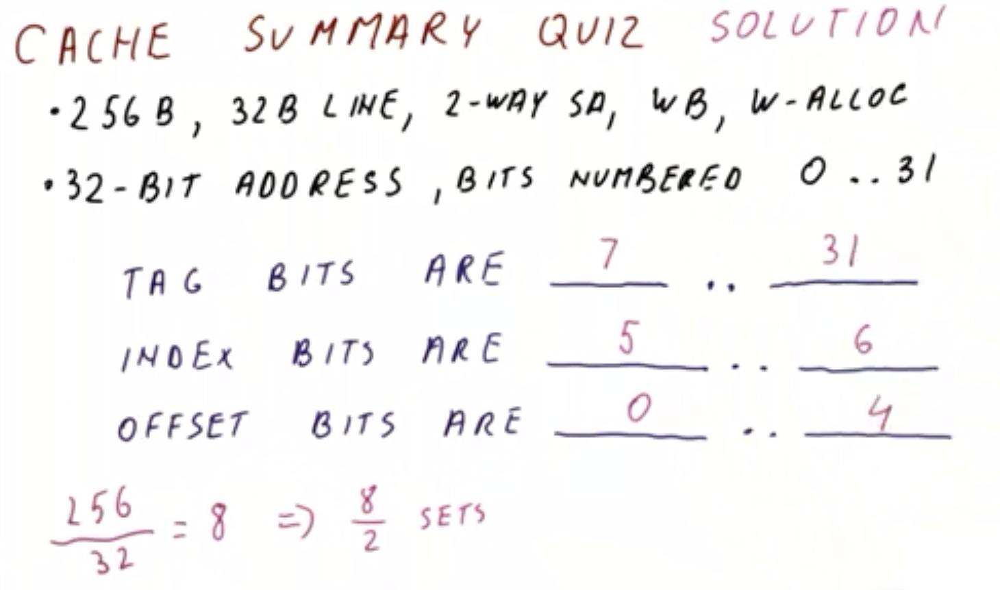
</center>

Consider a cache characterized as follows:
  * `256 bytes` in total size
    * `32 bytes` line size
    * two-way set-associative
    * a write policy characterized by write-back, write-allocate
  * `32 bit` addresses created by the processor to access the cache
    * These bits are numbered `0` through `31`

What are the corresponding bits regions of the address for this cache (in order from most to least significant bits)?
  * tag bits
    * `7` through `31`
  * index bits
    * `5` through `6`
  * offset bits
    * `0` through `4`

***Explanation***:

Considering the bits regions in least to most significant bits, starting with the **offset**, this can be determined as `32 = 2^5` or equivalently `log_2(32)  = 5`, thereby requiring `5 bits` to specify the offset (via corresponding bits `0` through `4`).

Next, the **index** bits can be determined via `256 bytes total / 32 bytes per line = 8 lines`. Furthermore, for a two-way set-associative cache, there are `8 lines / 2 lines per set  = 4 sets`, which can be correspondingly uniquely specified by `4 = 2^2` or equivalently `log_2(4) = 2`, thereby requiring `2` bits to specify the index (via corresponding bits `5` through `6`).

The remaining bits are therefore used for the **tag** bits (i.e., bits `7` through `31`).

### 44. Cache Summary Quiz 2 and Answers

<center>
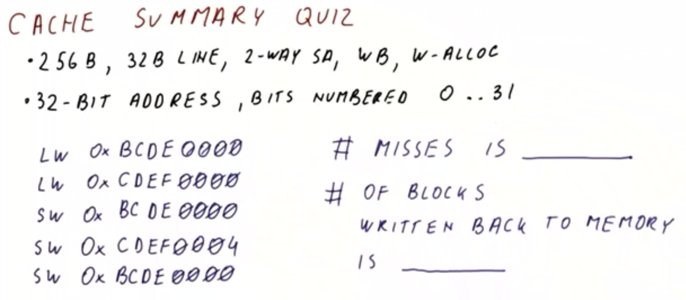
</center>

As a follow-up to the previous quiz (cf. Section 43), with the same previously specified cache, consider the following sequence of accesses:

```
LW 0xBCDE0000
LW 0xCDEF0000
SW 0xBCDE0000
SW 0xCDEF0004
SW 0xBCDE0000
```

Furthermore, assume the cache is completely empty at start (i.e., with all valid bits set to `0`).

How many cache misses occur in this sequence? How many blocks are written back to main memory in this sequence?

***Answer and Explanation***:

Recall (cf. Section 43) that the least-significant `5 bits` correspond to the offset, and the next-least-significant `2 bits` correspond to the index. By inspection, all of the addresses in the given sequence have the ***same*** index bits, indicating that they correspondingly map to the ***same*** cache set (having two lines) as well. Therefore, it is only necessary to consider this particular set in question for purposes of this analysis.

In the initial access `LW 0xBCDE0000`, there is a cache miss (`1` total cache miss), resulting in a setting of `0` for the valid bit in the cache.

<center>

</center>

On initial `LW 0xBCDE0000` (as in the figure shown above), the cache is updated as follows:

| Cache Line | Valid Bit | Dirty Bit | Tag |
|:--:|:--:|:--:|:--:|
| 0 | 1 | 0 | `0xBCDE00` |
| 1 | 0 |  | |

Because this is a read operation, on populating the cache with the data for `0xBCDE0000`, the processor will also correspondingly set the dirty bit to `0`. 

<center>

</center>

In the subsequent access `LW 0xCDEF0000` (as in the figure shown above), there is a cache miss (`2` total cache misses), and the cache is updated as follows:

| Cache Line | Valid Bit | Dirty Bit | Tag |
|:--:|:--:|:--:|:--:|
| 0 | 1 | 0 | `0xBCDE00` |
| 1 | 1 | 0 | `0xCDEF00` |

Because this is a read operation, on populating the cache with the data for `0xCDEF0000`, the processor will also correspondingly set the dirty bit to `0`. 

<center>

</center>

In the subsequent access `SW 0xBCDE0000` (as in the figure shown above), there is a cache hit, and the cache is updated as follows:

| Cache Line | Valid Bit | Dirty Bit | Tag |
|:--:|:--:|:--:|:--:|
| 0 | 1 | 1 | `0xBCDE00` |
| 1 | 1 | 0 | `0xCDEF00` |

Because this is a write operation, on populating the cache with the data for `0xBCDE0000`, the processor will also correspondingly set the dirty bit to `1`.

<center>
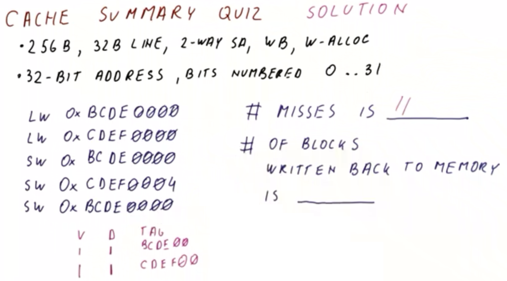
</center>

In the subsequent access `SW 0xCDEF0004` (as in the figure shown above), there is a cache hit, and the cache is updated as follows:

| Cache Line | Valid Bit | Dirty Bit | Tag |
|:--:|:--:|:--:|:--:|
| 0 | 1 | 1 | `0xBCDE00` |
| 1 | 1 | 1 | `0xCDEF00` |

Because this is a write operation, on populating the cache with the data for `0xCDEF0004`, the processor will also correspondingly set the dirty bit to `1`.

<center>

</center>

In the subsequent (and final) access `SW 0xBCDE0000` (as in the figure shown above), there is a cache hit, and the cache is updated as follows:

| Cache Line | Valid Bit | Dirty Bit | Tag |
|:--:|:--:|:--:|:--:|
| 0 | 1 | 1 | `0xBCDE00` |
| 1 | 1 | 1 | `0xCDEF00` |

Because this is a write operation, on populating the cache with the data for `0xBCDE0000`, the processor will also correspondingly set the dirty bit to `1`.

This is the final state of the cache on execution of the sequential accesses. Furthermore, the summary of the upstream operations is as follows:
  * `2` total cache misses
  * `0` total write-backs

## 45. Lesson Outro

This lesson has reviewed how caches work, along with the concerns and choices pertaining to designing caches. This knowledge will be used in most of the subsequent lessons in the course, starting with the lessons on virtual memory and advanced caches (cf. Lessons 13 and 14, respectively). Furthermore, this knowledge will also be necessary for successful completion of the course projects.
