# Virtual Memory

## 1. Lesson Introduction

In this lesson, we will discuss the support that computer architectures provide for **virtual memory**. This is an important topic because this makes modern operating systems *a lot* more efficient.

## 2. Why Virtual Memory?

<center>
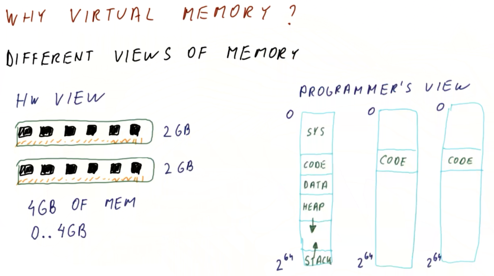
</center>

First, consider the purpose of **virtual memory** in the first place. Briefly, the purpose of virtual memory is to reconcile the respective views of **memory** from the perspectives of the (application) programmer vs. the hardware itself.

In the ***hardware view***, the machine is composed of some **memory modules** with some finite amount of memory (e.g., two `2 GB` modules for a total of `4 GB` of main memory, addressed as locations `0 GB` through `4 GB`, as in the figure shown above), that is accessible by the (real) **processor** itself.

Conversely, in the ***programmer's view***, the memory is a ***large array***, addressed from locations `0` to a very large number (e.g., `2^64` in the case of a `64 bit` machine), as in the figure shown above. In general, the size of this memory is much larger than that available on the physical hardware itself (e.g., `2^64 >> 4 GB`). Furthermore, this memory is typically composed of various ***regions***, such as:
  * **system** → reserved for the system itself
  * **code** → the actual program instructions
  * **data** → static data
  * **heap** → data allocated at run-time (e.g., via `malloc()` or equivalent), growing "downwards" (i.e., towards larger addresses)
  * **stack** → data pre-allocated at compile-time, typically "lower" in the address array (i.e., at relatively large addresses), and growing "updwards" (i.e., towards smaller addresses)

However, in general, the programmer does not bother by matters such as the remaining space between the heap and the stack, but rather the programmer simply wants to to perform `malloc()` operations (via the heap), push data onto the stack, etc. on an ad hoc basis, with no concern for "running out of memory" otherwise.
  * Furthermore, in a `64 bit` address space, the likelihood is indeed high that such a "running out of memory" is relatively low in practice.
  * Nevertheless, there is still the ***fundamental issue*** of the actual (i.e., physical) memory (on which the program is running) being substantially smaller than this "large-array" address space (or for a small program, the physical memory may also *exceed* the memory requirements substantially as well).

The matter complicates even more when considering the fact that in general, a given machine does not only run ***one*** program, but rather also runs ***multiple*** programs simultaneously (e.g., browsing files, a media player, a word processing application, etc. all running simultaneously), thereby exacerbating this problem.
  * From the perspective of any given *one* of these running applications/processes, ***each*** sees the address space spanning from `0` to `2^64` (in the case of a `64 bit` architecture).
  * Along these lines, it is ***not*** desirable to necessarily have to run these programs in a specific order (i.e., as opposed to on an ad hoc basis, which is a more typical usage), but rather it is desirable for each given program's own "view" of this large address space to be effectively ***isolated***/***independent*** of any other given program's view. However, this begets the ***problem*** of any one of these programs assuming it alone has ***full*** ownership of the ***entire*** address space (e.g., they all may regard the `code` region as belonging to them, despite having disparate/program-specific instructions for this particular region).

Therefore, **virtual memory** is a way to ***reconcile*** these differences between the programmer's view vs. the physical hardware's view; this topic will be further elaborated upon in this lesson accordingly.

## 3. Virtual Memory Quiz and Answers

<center>
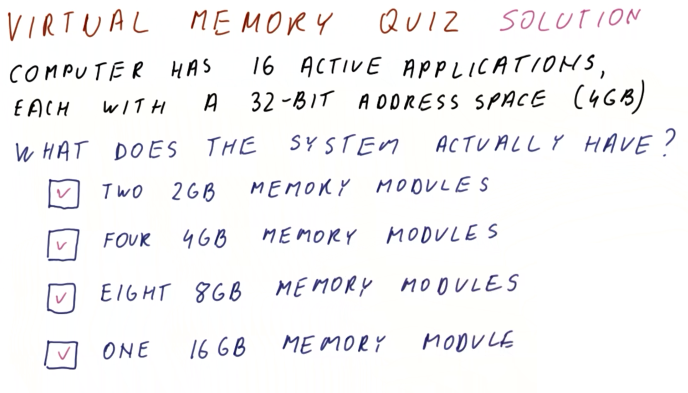
</center>

Consider a computer with `16` active applications, with each application having a `32 bit` address space (i.e., the application generates `32 bit` addresses, giving rise to a potential `2^32 = 4 GB` of memory).

Which of the following actual/physical memory configurations does the system have? (Select all that apply.)
  * Two `2 GB` memory modules
    * `APPLIES`
  * Four `4 GB` memory modules
    * `APPLIES`
  * Eight `8 GB` memory modules
    * `APPLIES`
  * One `16 GB` memory module
    * `APPLIES`

***Explanation***:

All of these options are potential candidates. When using virtual memory, what a given application "perceives" as its memory vs. what the physical hardware itself supports can be completely decoupled.

## 4. Processor's View of Memory

Now, consider how the **processor** views the memory.

<center>
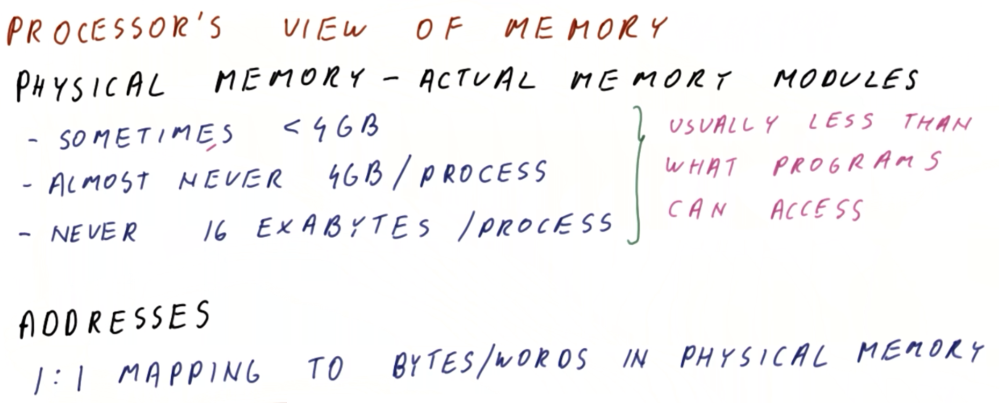
</center>

The processor sees what is called **physical memory**, which is the memory (i.e., address space) contained in the ***actual*** memory modules physically present in the system itself.
  * The amount of this memory is sometimes even less than `4 GB`.
  * It is almost never a full `4 GB` ***per process*** that is dedicated in the system, because there tens or even hundreds of other processes running at any given time in a modern operating system.
  * It is also virtually never `16 exabytes` (i.e., `2^64` address locations via `64 bit` addresses) ***per process***, as this would require an overwhelmingly large amount of physical memory to accommodate.

Therefore, in general, it can be concluded from these observations that the amount of **physical memory** present in the system is generally ***less*** than what a given program(s) can access (i.e., if all of the programs could access *all* of the possible memory intended, then this would far exceed the amount of physical memory available).

Lastly, note that the **addresses** that the processor uses for the physical memory have a **one-to-one mapping** to the bytes/words in the physical memory (i.e., a given processor address always maps to the ***same*** physical-memory location).

## 5. Program's View of Memory

Now, consider how the **program** views the memory.

<center>
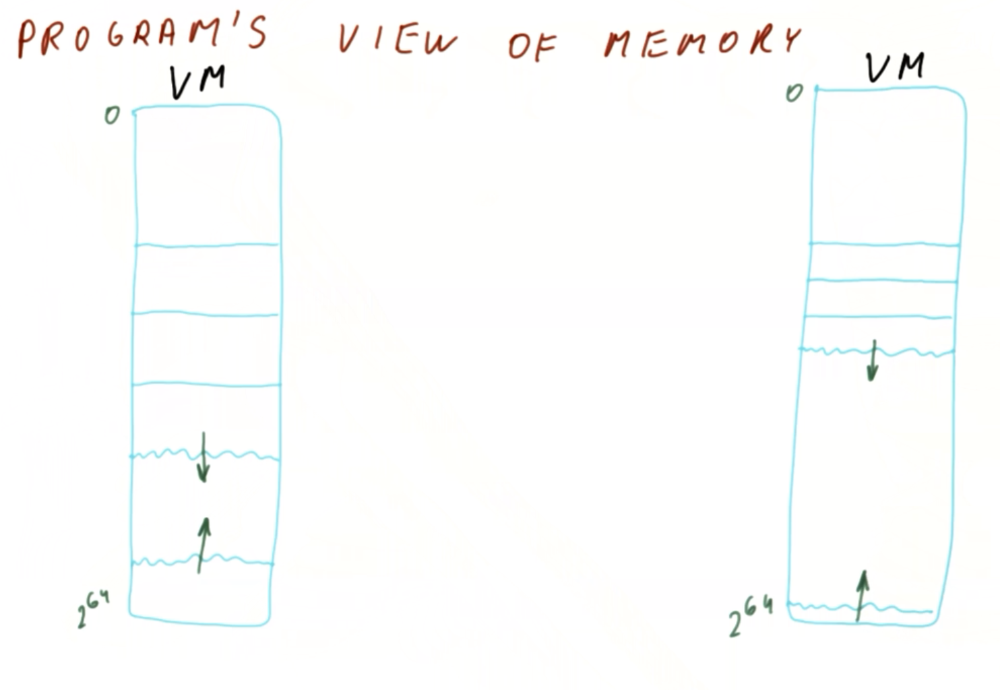
</center>

The program sees a large amount of memory (as in the figure shown above), and usually some contiguous regions of this memory are actually used by the program. Furthermore, there is a large region in the middle, between the heap and the stack (as denoted by oppositely directed green arrows in the figure shown above), that the program will generally not access unless the heap incidentally grows in that manner during run-time (however, in practice, the heap is usually small relative to the corresponding `2^64` address space, i.e., the program "thinks" it has a lot of this memory available but ultimately does not access most of it). This large (e.g., `2^64`) address space is what is correspondingly called **virtual memory** (i.e., the program "virtually" has "a lot" of memory available, but in practice only a small fraction of this exists as actual, physical memory).

Correspondingly, a separate smaller program also has its own virtual-memory address space (as depicted on the right side of the figure shown above, with relatively more memory in the heap region, which it similarly "under-utilizes" relative to the "full virtual-memory size"). Similarly, the "idea" that this program has about the corresponding virtual memory is that it "can always use more."

<center>
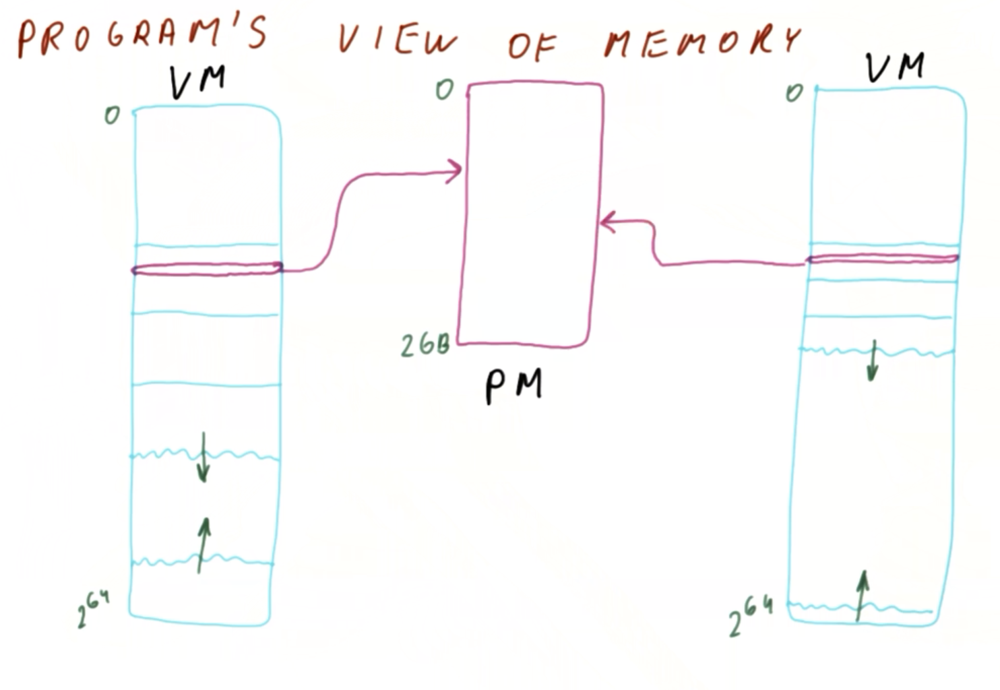
</center>

With both programs running simultaneously, consider now how this corresponds to the **physical memory** itself, as in the figure shown above.

When the first/larger program generates a memory-access operation that should access a given address in its virtual-memory address space (as denoted by purple in the figure shown above), how is it determined ***where*** exactly this maps in the physical-memory address space? Furthermore, when the second/smaller program correspondingly generates a memory-address operation with the ***same*** address, how is it determined ***where*** exactly this maps in the physical-memory address space as well?

The second/smaller program might go to a ***different*** location in physical memory (e.g., if the two programs are completely independent of each other).

<center>
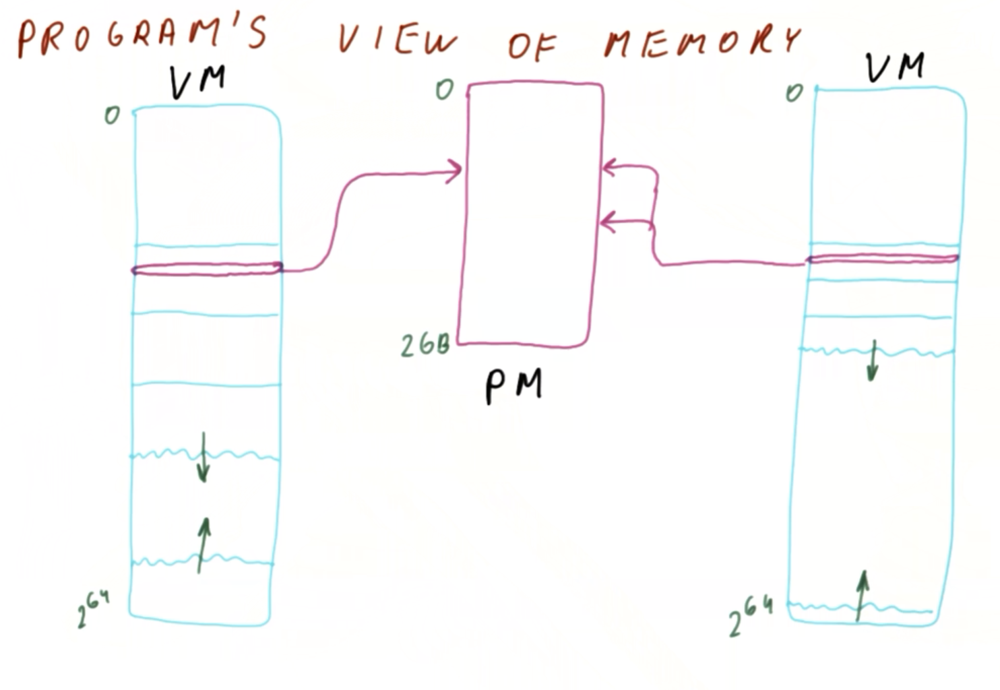
</center>

Conversely, the second/smaller program might go to the ***same*** location in phsyical memory (e.g., if the two programs are sharing data), as in the figure shown above.

<center>
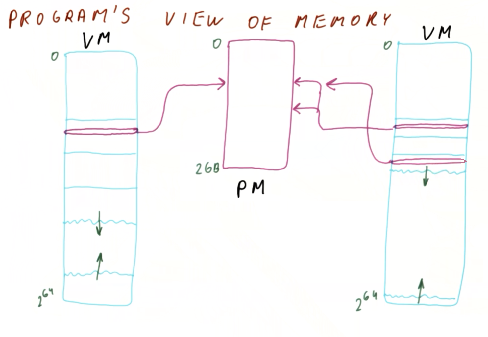
</center>

In fact, **data sharing** among programs is ***not*** constrained to strictly placing data in the ***same*** virtual-memory address space; instead, the second/smaller program can place the data in a different address in its virtual-memory address space (as in the figure shown above), while otherwise sharing the ***same*** physical-memory address space (i.e., mapping to the ***same*** location in the physical-memory address space).

So, then, how can such differences be reconciled? This is discussed next.

## 6. Mapping Virtual Memory to Physical Memory

When a program generates a **virtual address** (e.g., performs a load or store operation using this address), the processor must correspondingly ***access*** some **physical address**. The question is: How does the processor **map** what the program is attempting to access (virtual address) to what really should be accessed (physical address)?

Such a mapping would be very difficult if every byte of virtual memory could map to an ***arbitrary*** byte in the physical memory, as this would necessitate a large table of mappings (which in turn would require a lot of memory to maintain it).

<center>
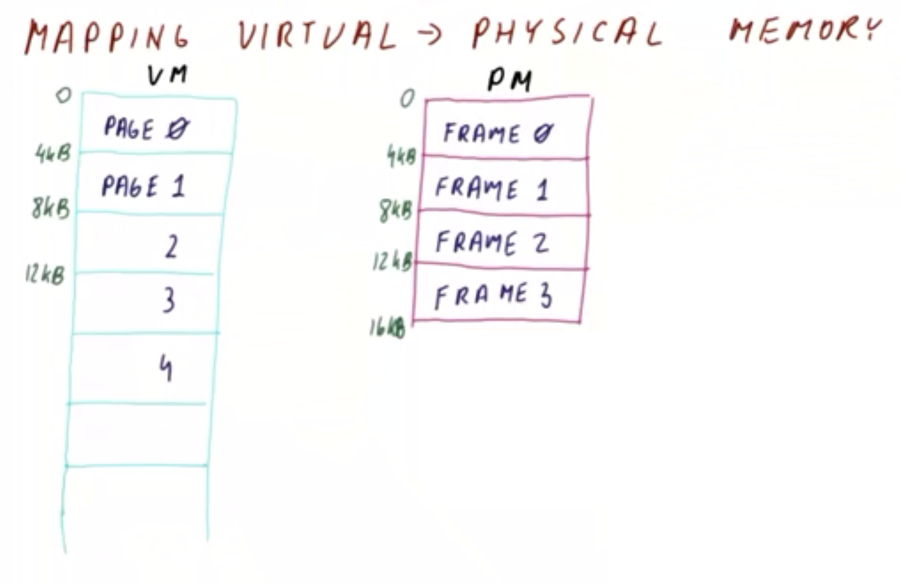
</center>

Rather than using such an "arbitrary mapping" approach, the program's **virtual memory** is divided into equally sized chunks called **pages** (as in the figure shown above). A typical **page size** is `4 KB`, with the pages correspondingly labeled in respective `0`-indexed order/alignment (i.e., `Page 0`, `Page 1`, etc. corresponding to virtual-memory addresses `0 KB` through `4 KB`, `4 KB` through `8 KB`, etc., respectively).

Additionally, the **physical memory** is divided into corresponding `4 KB` slots (called **frames**) that can hold these virtual-memory pages.
  * Recall (cf. Lesson 12) a similar configuration with respect to caches, whereby with respect to memory, the physical memory behaves analogously to a "cache" for the virtual memory, in the sense that it has a certain number of "places" (analogously to cache lines) where it can hold pages (analogously to a main-memory block). The difference here, however, is that the virtual memory is "perceived" to exist (whereas in a cache vs. main memory configuration, the corresponding blocks and cache lines exist "fully" as concrete/physical memory).

<center>
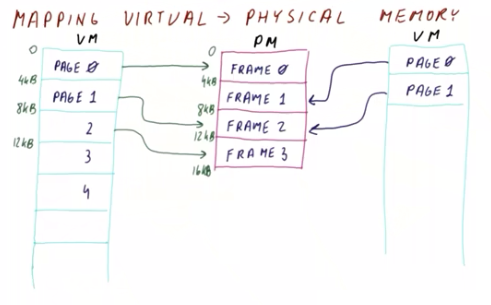
</center>

Given the page-based virtual memory and frame-based physical memory, the **operating system** correspondingly creates a **mapping** (as in the figure shown above), whereby the operating system determines which pages in the program will map to which corresponding frames.

Furthermore, given another running process (as depicted on the right side in the figure shown above), it has its own corresponding pages, which in turn might map to ***different*** frames. Otherwise, if two pages must share physical memory, then they will map to the ***same*** frame (e.g., `Page 1` of the first process and `Page 1` of the second process both mapping to `Frame 2`), in which case both processes when performing access operations (i.e., read and/or writes) will mutually access the ***same*** physical memory addresses.

<center>
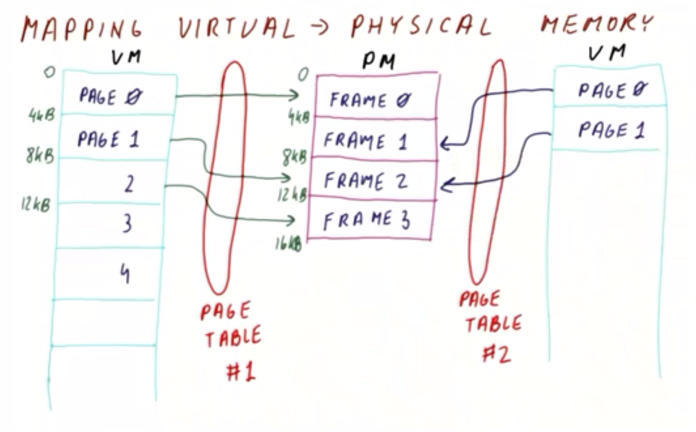
</center>

So, then, how is it decided how this virtual-memory-to-physical-memory mapping will occur? This is dictated by the **operating system** itself (as in the figure shown above). The corresponding mechanism for this mapping is called a **page table**, which is a table that indicates where each page in a given process will map to physical memory. Furthermore, ***each process*** has a corresponding page table for this purpose.

## 7. Page Size Quiz and Answers

<center>
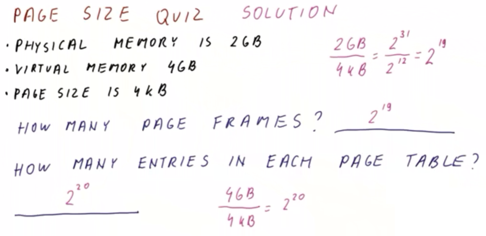
</center>

Consider a system with the following specifications:
  * Physical memory size is `2 GB`
  * Virtual memory size is `4 GB`
  * Page size is `4 KB`

How many page frames are available in this system?
  * `2^19`

How many entries are present in each page table? (Recall that a page-table entry maintains the mapping for the virtual-memory page to the corresponding physical-memory frame.)
  * `2^20`

***Explanation***:

To determine the number of page frames, this follows directly from `2 GB physical memory / 4 KB per page = [2*(2^30)] / [4*(2^10)] = 2^19`.

To determine the number of entries present in each table, this follows directly from `4 GB virtual memory / 4 KB per entry = [4*(2^30)] / [4*(2^10)] = 2^20` (i.e., one "mega/M entry").
  * ***N.B.*** Recall (cf. Section 6) that a ***separate*** page table is necessary for ***each*** `4 GB` process. Therefore, ***each*** process running on the system will require a corresponding `2^20` entry page table (i.e., of approximately `1 MB` in size).

## 8. Where Is the "Missing" Memory?

Now that it is understood that each given application "uses" a large amount of (virtual) memory relative to the available physical memory to accommodate all of these running processes, the question is: Where is the "missing" memory (i.e., accounting for this disparity in virtual vs. physical memory) actually located?

<center>
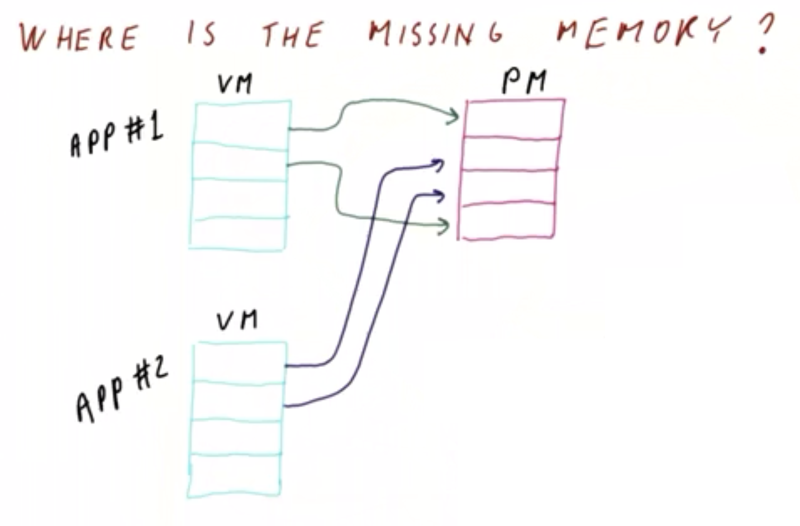
</center>

Consider two applications, each with four pages, along with a corresponding physical memory of four frames (as in the figure shown above). Furthermore, assume that both applications are both using **all** of their four pages.

When mapped, the corresponding pages eventually occupy all of the available physical memory frames; furthermore, there are insufficient physical memory frames to accommodate ***all*** of the apps' respective virtual memory frames. So, then, where are these remaining (un-mapped) pages mapped to?

<center>

</center>

The remaining pages in fact are mapped to the **hard disk** (as in the figure shown above). Thus, rather than being stored in physical memory, they are instead stored on the hard disk in the system.

These hard-drive-stored pages ***cannot*** be accessed directly by the processor, because the processor can only directly access memory via load and store operation on the physical memory itself. Therefore, if the processor must access the hard-drive-stored pages, these pages must first be brought into physical memory from the hard disk prior to being accessed (this will be described shortly). Correspondingly, in general, among the available (virtual) memory a given program "thinks" that it "has," some of this will be located in the hard disk (i.e., rather than in virtual memory) at any given time as the program/process is running.

## 9. Virtual-to-Physical Translation

Now that it is apparent that the program generates virtual addresses while processor actually uses physical addresses to access the memory, consider now how the processor performs this **virtual-to-physical address translation**.

<center>

</center>

When the program generates a **virtual address** (e.g., via load operation), as in the figure shown above, the processor divides this virtual address into two **components** as follows:
  * **page offset** → indicates the the location within the page
  * **virtual page number** → identifies the specific page of the program/process in question

Given a `4 KB` page size, the `12` least significant bits will correspond to the page offset (via `4*(2^10) = 2^12` or equivalently `log_2(4*(2^10)) = log_2(2^12) = 12`), while the remaining bits indicate the virtual page number.

<center>
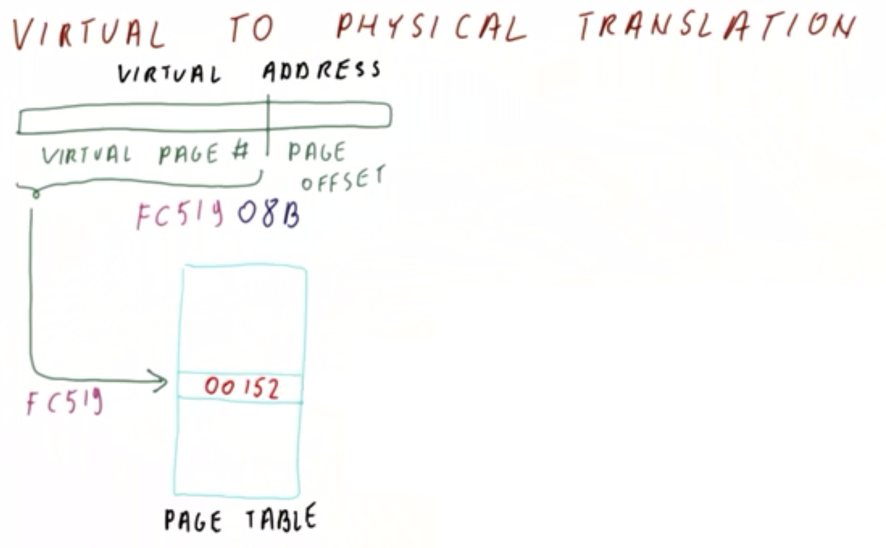
</center>

For example, given a `32 bit` address `0xFC51908B` (as in the figure shown above), the least-significant `12 bits` (`0x08B`) indicate the page offset, while the remaining most-significant bits (`0x0FC519`) identify the virtual page number.

From there, the virtual page number is used to index into the **page table**, which corresponds to a particular **physical frame number** in the page table (e.g., `00152` in the figure shown above).

<center>
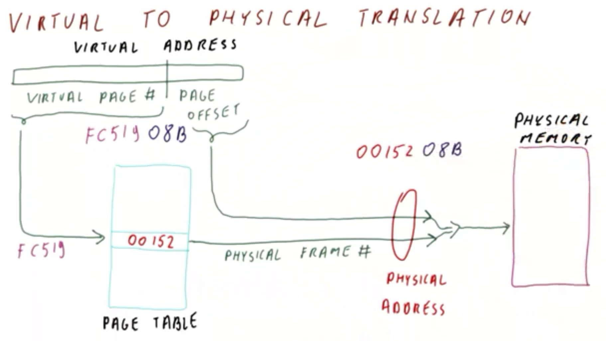
</center>

From there, the **physical frame number** is ***combined*** with the page offset to form a **physical address** (e.g., `0x0015208B`),as in the figure shown above. This physical address in turn is used to actually access the **physical memory** at the corresponding address location.

Note that the page offset is present in ***both*** the virtual ***and*** physical addresses (i.e., the least-significant bits from the virtual address correspondingly occur in the least-significant bits of the physical address as well). Conversely, the virtual page number of the virtual address is effectively "translated" into the physical-page-frame counterpart in the corresponding physical address.

## 10. Address Translation Quiz and Answers

<center>

</center>

Consider a process with a page table having only four frame-number entries, as follows:

Page Table Index/Position (Binary) | Page Table Entry |
|:--:|:--:|
| `00` | `0x1F` |
| `01` | `0x3F` |
| `10` | `0x23` |
| `11` | `0x17` |

Furthermore, suppose that the machine running this process has a `16 bit` virtual address space and a `20 bit` physical address space.

Given the following `16 bit` virtual addresses, what are the corresponding physical addresses?
  * `0xF0F0`
    * `0x05F0F0`
  * `0x001F`
    * `0x07C01F`

***Explanation***:

Relative to the page-table entries, the most-significant two bits of the `16 bit` virtual addresses correspond to the virtual page number, while the remaining least-significant `14 bits` correspond to the page offset.

Examining the binary form of address `0xF0F0` as follows:

```
||
1111 0000 1111 0000
```

this indicates a virtual page number of binary `11`, or equivalently page-table entry `0x17` (binary `0001 0111`).

Similarly, examining the binary form of address `0x001F` as follows:

```
||
0000 0000 0001 1111
```

this indicates a virtual page number of binary `00`, or equivalently page-table entry `0x1F` (binary `0001 1111`).

Therefore, the respective `8 bit` page-table frame entries can be combined with the corresponding least-significant `14 bits` of the virtual addresses to yield the `20 bit` physical addresses as follows (via the least-significant `20 bits`):

```
   |                      | 
00 0101 1111 0000 1111 0000 → 0x5F0F0

   |                      | 
00 0111 1100 0000 0001 1111 → 0x7C01F
```

## 11. Size of Flat Page Table

Up to this point, discussion has revolved around so-called **flat page tables**, wherein for every page number, there is a corresponding entry in the table.

<center>
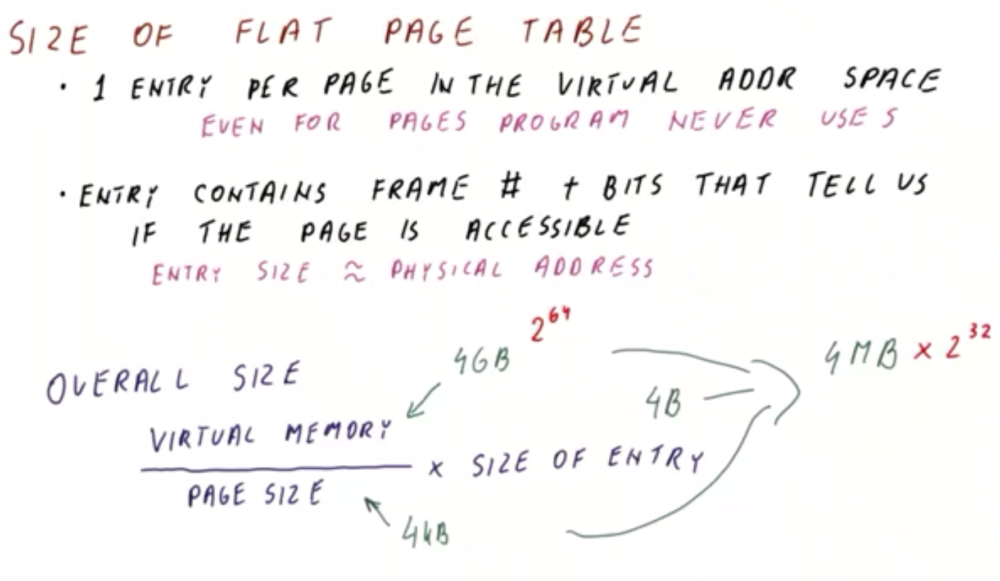
</center>

 Now, consider the **size** for such a flat page table. A flat page table has `1` entry per page in the entire virtual address space, even for pages in the address space that the program ***never*** actually accesses/uses (e.g., those pages located between the heap and the stack).

 The **entry** in such a page table contains a *combination* of the **frame number** *and* a few bits (e.g., protection bits, present vs. not present bit, etc.) that indicate whether the page is accessible. In such a scenario, the entry in the page table is typically ***similar in size*** to the actual physical address itself.
  * This similarity in size is due to the fact that the entry must contain the frame number (which comprises the majority of the bits in the physical address, excluding the page offset, but otherwise including the additional aforementioned bits).
  * Therefore, for a physical address size of `32 bits`, the corresponding page-table entry will also likely be `32 bits` in size as well. And similar correspondence for a `64 bit` physical address vs. corresponding `64 bit` page-table entry.

Thus, the **overall size** of a page table is defined as:

```
(virtual memory of the process / page size) × size of a single entry
```

Where the factor `(virtual memory of the process / page size)` constitutes the number of entries in the page table.

For example, given a virtual memory of `4 GB`, a page size of `4 KB`, and a single-entry size of `4 bytes`, the corresponding overall size of the page table is `(4 GB / 4 KB) × 4 bytes = 4 MB` per process.
  * ***N.B.*** A given process might actually use ***less*** than `4 MB` of virtual memory (because most of hte pages are unused in such a process), however, the page table must still nevertheless have size `4 MB` in such a flat-page-table configuration.

Therefore, an apparent ***problem*** with flat page tables is that the corresponding page table is considerably large relative to a given process's actual usage of its available virtual memory.

Another ***problem*** with flat page tables is that if the virtual memory is a `64 bit` address space (i.e., the corresponding virtual memory is `2^64 bytes`), then the corresponding page table size now ***explodes*** to `4 MB * 2^32` per process (which is ***much larger*** than the available memory)!
  * Correspondingly, such a page table cannot fit in memory at all to begin with (i.e., for a *single* process, let alone *multiple* processes running simultaneously).

Nevertheless, modern processors *do* in fact operate on such a large virtual address space. To reconcile this problem, the page table must be reorganized to accommodate this accordingly, which will be discussed shortly.

## 12. Flat Page Table Size Quiz and Answers

<center>
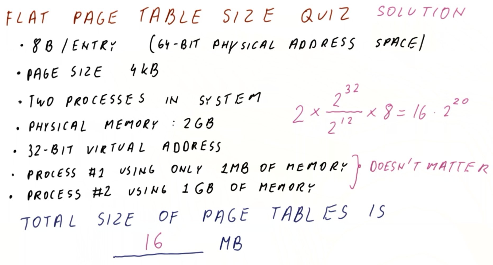
</center>

Consider a flat page table system characterized as follows:
  * `8 bytes` per entry in a `64 bit` physical address space
  * `4 KB` page size
  * two processes running on the system
  * `2 GB` of physical memory
  * `32 bit` virtual addresses created by the programs
  * the first process uses `1 MB` of its available virtual memory address space
  * the second process uses `1 GB` of its available virtual memory address space

What is the total size of the page tables for the two processes in the system?
  * `16 MB`

***Explanation***:

The overall size of the page table per process is `[2^32 virtual addresses / 4*(2^10) page size] × 8 bytes per entry = 8 * 2^20`. Furthermore, there are two processes, and thus the total size of the page tables is `2 * 8 * 2^20 = 16 MB`.

***N.B.*** The respective virtual-memory address space usages of the processes (i.e., `1 MB` and `1 GB`) is inconsequential here, because a flat page table will have an entry for ***every*** possible page irrespectively of a given process's ***actual*** memory usage. Furthermore, the available **physical memory** is similarly inconsequential here (since anything in excess of this will simply be stored on hard disk). Instead, the ***critical factor*** here is the **per-entry size** (i.e., `8 bytes` in this case), as this dictates the size of the physical address which can be accommodated by the system (i.e., up to a `64 bit` physical addresses in this case). Such an arrangement in turn allows to expand its memory as necessary (e.g., by adding additional physical memory modules).

## 13-15. Multi-Level Page Tables

### 13. Introduction

Having seen that flat page tables can be quite large (even for `32 bit` address spaces, let alone for `64 bit` address spaces which are too large to even fit entirely in physical memory at all), now consider **multi-level page tables**, which are used to reduce the size of a page table when dealing with these large address spaces.

<center>
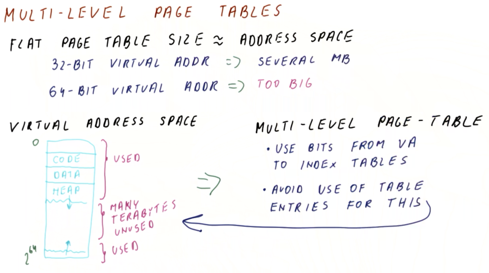
</center>

The fundamental **problem** with flat page tables is that their ***size*** is directly proportional to ***address space*** (i.e., how much memory a given application *can* possibly address, rather than necessarily how much it *actually* uses during run-time).
  * For a `32 bit` virtual address space, this results in a reasonably sized flat page table on the order of several MB.
    * Note that even a relatively small `32 bit` application requiring only a few KB of memory will still require a page table of this size, as the page table size itself is unrelated to the actual run-time memory usage, but rather how much the application in question can potential address in that virtual address space.
  * For a `64 bit` virtual address space, the resulting flat page table is simply too large for practical purposes (i.e., relative to physical storage), e.g., many GB *per page table*.

**Multi-level page tables** are designed to overcome *both* of these issues, i.e.,:
  * The overall size of the page table should be proportional to the amount of memory used at run-time
  * The page table should be amenable to working with `64 bit` virtual addresses, as long as the `64 bit` program in question is not actually using *all* of this virtual address space during run-time (which in practice is virtually impossible/impractical)

The ***premise*** behind the operation of multi-level pages has to do with how the **virtual address space** is actually used by the applications. Recall (cf. Section 5) that from the application's perspective, it "perceives" an addressable (virtual) address memory space of `2^64` addresses (as in the figure shown above).

However, in reality, the running application only allocates a small subset of this address space with corresponding regions (e.g., `code`, `data`, `heap`, `stack`, etc.). What's more is that even if these regions are several GB apiece, in a `64 bit` virtual address space, there will still be many, many TB worth of ***unused*** addresses within the virtual address space itself. In a flat page table, there is still a page table entry for ***each*** of these addresses, including the (many) unused ones.

Conversely, in a multi-level page table, the following two ***ideas*** are combined:
  * Use bits from the virtual address in order to index the table (i.e., similarly to a flat page table), which is readily accomplished using hardware (i.e., indexing into an array)
  * Avoid the use of (excessive) table entries for this corresponding indexing of ***each*** table (i.e., including the vastly unused virtual memory regions)

Next, we will examine how this idea is actually organized/implemented.

### 14. Multi-Level Page Table Structure
