# Virtual Memory

## 1. Lesson Introduction

In this lesson, we will discuss the support that computer architectures provide for **virtual memory**. This is an important topic because this makes modern operating systems *a lot* more efficient.

## 2. Why Virtual Memory?

<center>

</center>

First, consider the purpose of **virtual memory** in the first place. Briefly, the purpose of virtual memory is to reconcile the respective views of **memory** from the perspectives of the (application) programmer vs. the hardware itself.

In the ***hardware view***, the machine is composed of some **memory modules** with some finite amount of memory (e.g., two `2 GB` modules for a total of `4 GB` of main memory, addressed as locations `0 GB` through `4 GB`, as in the figure shown above), that is accessible by the (real) **processor** itself.

Conversely, in the ***programmer's view***, the memory is a ***large array***, addressed from locations `0` to a very large number (e.g., `2^64` in the case of a `64 bit` machine), as in the figure shown above. In general, the size of this memory is much larger than that available on the physical hardware itself (e.g., `2^64 >> 4 GB`). Furthermore, this memory is typically composed of various ***regions***, such as:
  * **system** → reserved for the system itself
  * **code** → the actual program instructions
  * **data** → static data
  * **heap** → data allocated at run-time (e.g., via `malloc()` or equivalent), growing "downwards" (i.e., towards larger addresses)
  * **stack** → data pre-allocated at compile-time, typically "lower" in the address array (i.e., at relatively large addresses), and growing "updwards" (i.e., towards smaller addresses)

However, in general, the programmer does not bother by matters such as the remaining space between the heap and the stack, but rather the programmer simply wants to to perform `malloc()` operations (via the heap), push data onto the stack, etc. on an ad hoc basis, with no concern for "running out of memory" otherwise.
  * Furthermore, in a `64 bit` address space, the likelihood is indeed high that such a "running out of memory" is relatively low in practice.
  * Nevertheless, there is still the ***fundamental issue*** of the actual (i.e., physical) memory (on which the program is running) being substantially smaller than this "large-array" address space (or for a small program, the physical memory may also *exceed* the memory requirements substantially as well).

The matter complicates even more when considering the fact that in general, a given machine does not only run ***one*** program, but rather also runs ***multiple*** programs simultaneously (e.g., browsing files, a media player, a word processing application, etc. all running simultaneously), thereby exacerbating this problem.
  * From the perspective of any given *one* of these running applications/processes, ***each*** sees the address space spanning from `0` to `2^64` (in the case of a `64 bit` architecture).
  * Along these lines, it is ***not*** desirable to necessarily have to run these programs in a specific order (i.e., as opposed to on an ad hoc basis, which is a more typical usage), but rather it is desirable for each given program's own "view" of this large address space to be effectively ***isolated***/***independent*** of any other given program's view. However, this begets the ***problem*** of any one of these programs assuming it alone has ***full*** ownership of the ***entire*** address space (e.g., they all may regard the `code` region as belonging to them, despite having disparate/program-specific instructions for this particular region).

Therefore, **virtual memory** is a way to ***reconcile*** these differences between the programmer's view vs. the physical hardware's view; this topic will be further elaborated upon in this lesson accordingly.

## 3. Virtual Memory Quiz and Answers

<center>

</center>

Consider a computer with `16` active applications, with each application having a `32 bit` address space (i.e., the application generates `32 bit` addresses, giving rise to a potential `2^32 = 4 GB` of memory).

Which of the following actual/physical memory configurations does the system have? (Select all that apply.)
  * Two `2 GB` memory modules
    * `APPLIES`
  * Four `4 GB` memory modules
    * `APPLIES`
  * Eight `8 GB` memory modules
    * `APPLIES`
  * One `16 GB` memory module
    * `APPLIES`

***Explanation***:

All of these options are potential candidates. When using virtual memory, what a given application "perceives" as its memory vs. what the physical hardware itself supports can be completely decoupled.

## 4. Processor's View of Memory

Now, consider how the **processor** views the memory.

<center>

</center>

The processor sees what is called **physical memory**, which is the memory (i.e., address space) contained in the ***actual*** memory modules physically present in the system itself.
  * The amount of this memory is sometimes even less than `4 GB`.
  * It is almost never a full `4 GB` ***per process*** that is dedicated in the system, because there tens or even hundreds of other processes running at any given time in a modern operating system.
  * It is also virtually never `16 exabytes` (i.e., `2^64` address locations via `64 bit` addresses) ***per process***, as this would require an overwhelmingly large amount of physical memory to accommodate.

Therefore, in general, it can be concluded from these observations that the amount of **physical memory** present in the system is generally ***less*** than what a given program(s) can access (i.e., if all of the programs could access *all* of the possible memory intended, then this would far exceed the amount of physical memory available).

Lastly, note that the **addresses** that the processor uses for the physical memory have a **one-to-one mapping** to the bytes/words in the physical memory (i.e., a given processor address always maps to the ***same*** physical-memory location).

## 5. Program's View of Memory

Now, consider how the **program** views the memory.

<center>

</center>

The program sees a large amount of memory (as in the figure shown above), and usually some contiguous regions of this memory are actually used by the program. Furthermore, there is a large region in the middle, between the heap and the stack (as denoted by oppositely directed green arrows in the figure shown above), that the program will generally not access unless the heap incidentally grows in that manner during run-time (however, in practice, the heap is usually small relative to the corresponding `2^64` address space, i.e., the program "thinks" it has a lot of this memory available but ultimately does not access most of it). This large (e.g., `2^64`) address space is what is correspondingly called **virtual memory** (i.e., the program "virtually" has "a lot" of memory available, but in practice only a small fraction of this exists as actual, physical memory).

Correspondingly, a separate smaller program also has its own virtual-memory address space (as depicted on the right side of the figure shown above, with relatively more memory in the heap region, which it similarly "under-utilizes" relative to the "full virtual-memory size"). Similarly, the "idea" that this program has about the corresponding virtual memory is that it "can always use more."

<center>

</center>

With both programs running simultaneously, consider now how this corresponds to the **physical memory** itself, as in the figure shown above.

When the first/larger program generates a memory-access operation that should access a given address in its virtual-memory address space (as denoted by purple in the figure shown above), how is it determined ***where*** exactly this maps in the physical-memory address space? Furthermore, when the second/smaller program correspondingly generates a memory-address operation with the ***same*** address, how is it determined ***where*** exactly this maps in the physical-memory address space as well?

The second/smaller program might go to a ***different*** location in physical memory (e.g., if the two programs are completely independent of each other).

<center>

</center>

Conversely, the second/smaller program might go to the ***same*** location in physical memory (e.g., if the two programs are sharing data), as in the figure shown above.

<center>

</center>

In fact, **data sharing** among programs is ***not*** constrained to strictly placing data in the ***same*** virtual-memory address space; instead, the second/smaller program can place the data in a different address in its virtual-memory address space (as in the figure shown above), while otherwise sharing the ***same*** physical-memory address space (i.e., mapping to the ***same*** location in the physical-memory address space).

So, then, how can such differences be reconciled? This is discussed next.

## 6. Mapping Virtual Memory to Physical Memory

When a program generates a **virtual address** (e.g., performs a load or store operation using this address), the processor must correspondingly ***access*** some **physical address**. The question is: How does the processor **map** what the program is attempting to access (virtual address) to what really should be accessed (physical address)?

Such a mapping would be very difficult if every byte of virtual memory could map to an ***arbitrary*** byte in the physical memory, as this would necessitate a large table of mappings (which in turn would require a lot of memory to maintain it).

<center>

</center>

Rather than using such an "arbitrary mapping" approach, the program's **virtual memory** is divided into equally sized chunks called **pages** (as in the figure shown above). A typical **page size** is `4 KB`, with the pages correspondingly labeled in respective `0`-indexed order/alignment (i.e., `Page 0`, `Page 1`, etc. corresponding to virtual-memory addresses `0 KB` through `4 KB`, `4 KB` through `8 KB`, etc., respectively).

Additionally, the **physical memory** is divided into corresponding `4 KB` slots (called **frames**) that can hold these virtual-memory pages.
  * Recall (cf. Lesson 12) a similar configuration with respect to caches, whereby with respect to memory, the physical memory behaves analogously to a "cache" for the virtual memory, in the sense that it has a certain number of "places" (analogously to cache lines) where it can hold pages (analogously to a main-memory block). The difference here, however, is that the virtual memory is "perceived" to exist (whereas in a cache vs. main memory configuration, the corresponding blocks and cache lines exist "fully" as concrete/physical memory).

<center>

</center>

Given the page-based virtual memory and frame-based physical memory, the **operating system** correspondingly creates a **mapping** (as in the figure shown above), whereby the operating system determines which pages in the program will map to which corresponding frames.

Furthermore, given another running process (as depicted on the right side in the figure shown above), it has its own corresponding pages, which in turn might map to ***different*** frames. Otherwise, if two pages must share physical memory, then they will map to the ***same*** frame (e.g., `Page 1` of the first process and `Page 1` of the second process both mapping to `Frame 2`), in which case both processes when performing access operations (i.e., read and/or writes) will mutually access the ***same*** physical memory addresses.

<center>

</center>

So, then, how is it decided how this virtual-memory-to-physical-memory mapping will occur? This is dictated by the **operating system** itself (as in the figure shown above). The corresponding mechanism for this mapping is called a **page table**, which is a table that indicates where each page in a given process will map to physical memory. Furthermore, ***each process*** has a corresponding page table for this purpose.

## 7. Page Size Quiz and Answers

<center>

</center>

Consider a system with the following specifications:
  * Physical memory size is `2 GB`
  * Virtual memory size is `4 GB`
  * Page size is `4 KB`

How many page frames are available in this system?
  * `2^19`

How many entries are present in each page table? (Recall that a page-table entry maintains the mapping for the virtual-memory page to the corresponding physical-memory frame.)
  * `2^20`

***Explanation***:

To determine the number of page frames, this follows directly from `2 GB physical memory / 4 KB per page = [2*(2^30)] / [4*(2^10)] = 2^19`.

To determine the number of entries present in each table, this follows directly from `4 GB virtual memory / 4 KB per entry = [4*(2^30)] / [4*(2^10)] = 2^20` (i.e., one "mega/M entry").
  * ***N.B.*** Recall (cf. Section 6) that a ***separate*** page table is necessary for ***each*** `4 GB` process. Therefore, ***each*** process running on the system will require a corresponding `2^20` entry page table (i.e., of approximately `1 MB` in size).

## 8. Where Is the "Missing" Memory?

Now that it is understood that each given application "uses" a large amount of (virtual) memory relative to the available physical memory to accommodate all of these running processes, the question is: Where is the "missing" memory (i.e., accounting for this disparity in virtual vs. physical memory) actually located?

<center>

</center>

Consider two applications, each with four pages, along with a corresponding physical memory of four frames (as in the figure shown above). Furthermore, assume that both applications are both using **all** of their four pages.

When mapped, the corresponding pages eventually occupy all of the available physical memory frames; furthermore, there are insufficient physical memory frames to accommodate ***all*** of the apps' respective virtual memory frames. So, then, where are these remaining (un-mapped) pages mapped to?

<center>

</center>

The remaining pages in fact are mapped to the **hard disk** (as in the figure shown above). Thus, rather than being stored in physical memory, they are instead stored on the hard disk in the system.

These hard-drive-stored pages ***cannot*** be accessed directly by the processor, because the processor can only directly access memory via load and store operation on the physical memory itself. Therefore, if the processor must access the hard-drive-stored pages, these pages must first be brought into physical memory from the hard disk prior to being accessed (this will be described shortly). Correspondingly, in general, among the available (virtual) memory a given program "thinks" that it "has," some of this will be located in the hard disk (i.e., rather than in virtual memory) at any given time as the program/process is running.

## 9. Virtual-to-Physical Translation

Now that it is apparent that the program generates virtual addresses while processor actually uses physical addresses to access the memory, consider now how the processor performs this **virtual-to-physical address translation**.

<center>

</center>

When the program generates a **virtual address** (e.g., via load operation), as in the figure shown above, the processor divides this virtual address into two **components** as follows:
  * **page offset** → indicates the the location within the page
  * **virtual page number** → identifies the specific page of the program/process in question

Given a `4 KB` page size, the `12` least significant bits will correspond to the page offset (via `4*(2^10) = 2^12` or equivalently `log_2(4*(2^10)) = log_2(2^12) = 12`), while the remaining bits indicate the virtual page number.

<center>

</center>

For example, given a `32 bit` address `0xFC51908B` (as in the figure shown above), the least-significant `12 bits` (`0x08B`) indicate the page offset, while the remaining most-significant bits (`0x0FC519`) identify the virtual page number.

From there, the virtual page number is used to index into the **page table**, which corresponds to a particular **physical frame number** in the page table (e.g., `00152` in the figure shown above).

<center>

</center>

From there, the **physical frame number** is ***combined*** with the page offset to form a **physical address** (e.g., `0x0015208B`),as in the figure shown above. This physical address in turn is used to actually access the **physical memory** at the corresponding address location.

Note that the page offset is present in ***both*** the virtual ***and*** physical addresses (i.e., the least-significant bits from the virtual address correspondingly occur in the least-significant bits of the physical address as well). Conversely, the virtual page number of the virtual address is effectively "translated" into the physical-page-frame counterpart in the corresponding physical address.

## 10. Address Translation Quiz and Answers

<center>

</center>

Consider a process with a page table having only four frame-number entries, as follows:

Page Table Index/Position (Binary) | Page Table Entry |
|:--:|:--:|
| `00` | `0x1F` |
| `01` | `0x3F` |
| `10` | `0x23` |
| `11` | `0x17` |

Furthermore, suppose that the machine running this process has a `16 bit` virtual address space and a `20 bit` physical address space.

Given the following `16 bit` virtual addresses, what are the corresponding physical addresses?
  * `0xF0F0`
    * `0x05F0F0`
  * `0x001F`
    * `0x07C01F`

***Explanation***:

Relative to the page-table entries, the most-significant two bits of the `16 bit` virtual addresses correspond to the virtual page number, while the remaining least-significant `14 bits` correspond to the page offset.

Examining the binary form of address `0xF0F0` as follows:

```
||
1111 0000 1111 0000
```

this indicates a virtual page number of binary `11`, or equivalently page-table entry `0x17` (binary `0001 0111`).

Similarly, examining the binary form of address `0x001F` as follows:

```
||
0000 0000 0001 1111
```

this indicates a virtual page number of binary `00`, or equivalently page-table entry `0x1F` (binary `0001 1111`).

Therefore, the respective `8 bit` page-table frame entries can be combined with the corresponding least-significant `14 bits` of the virtual addresses to yield the `20 bit` physical addresses as follows (via the least-significant `20 bits`):

```
   |                      | 
00 0101 1111 0000 1111 0000 → 0x5F0F0

   |                      | 
00 0111 1100 0000 0001 1111 → 0x7C01F
```

## 11. Size of Flat Page Table

Up to this point, discussion has revolved around so-called **flat page tables**, wherein for every page number, there is a corresponding entry in the table.

<center>

</center>

 Now, consider the **size** for such a flat page table. A flat page table has `1` entry per page in the entire virtual address space, even for pages in the address space that the program ***never*** actually accesses/uses (e.g., those pages located between the heap and the stack).

 The **entry** in such a page table contains a *combination* of the **frame number** *and* a few bits (e.g., protection bits, present vs. not present bit, etc.) that indicate whether the page is accessible. In such a scenario, the entry in the page table is typically ***similar in size*** to the actual physical address itself.
  * This similarity in size is due to the fact that the entry must contain the frame number (which comprises the majority of the bits in the physical address, excluding the page offset, but otherwise including the additional aforementioned bits).
  * Therefore, for a physical address size of `32 bits`, the corresponding page-table entry will also likely be `32 bits` in size as well. And similar correspondence for a `64 bit` physical address vs. corresponding `64 bit` page-table entry.

Thus, the **overall size** of a page table is defined as:

```
(virtual memory of the process / page size) × size of a single entry
```

Where the factor `(virtual memory of the process / page size)` constitutes the number of entries in the page table.

For example, given a virtual memory of `4 GB`, a page size of `4 KB`, and a single-entry size of `4 bytes`, the corresponding overall size of the page table is `(4 GB / 4 KB) × 4 bytes = 4 MB` per process.
  * ***N.B.*** A given process might actually use ***less*** than `4 MB` of virtual memory (because most of hte pages are unused in such a process), however, the page table must still nevertheless have size `4 MB` in such a flat-page-table configuration.

Therefore, an apparent ***problem*** with flat page tables is that the corresponding page table is considerably large relative to a given process's actual usage of its available virtual memory.

Another ***problem*** with flat page tables is that if the virtual memory is a `64 bit` address space (i.e., the corresponding virtual memory is `2^64 bytes`), then the corresponding page table size now ***explodes*** to `4 MB * 2^32` per process (which is ***much larger*** than the available memory)!
  * Correspondingly, such a page table cannot fit in memory at all to begin with (i.e., for a *single* process, let alone *multiple* processes running simultaneously).

Nevertheless, modern processors *do* in fact operate on such a large virtual address space. To reconcile this problem, the page table must be reorganized to accommodate this accordingly, which will be discussed shortly.

## 12. Flat Page Table Size Quiz and Answers

<center>

</center>

Consider a flat page table system characterized as follows:
  * `8 bytes` per entry in a `64 bit` physical address space
  * `4 KB` page size
  * two processes running on the system
  * `2 GB` of physical memory
  * `32 bit` virtual addresses created by the programs
  * the first process uses `1 MB` of its available virtual memory address space
  * the second process uses `1 GB` of its available virtual memory address space

What is the total size of the page tables for the two processes in the system?
  * `16 MB`

***Explanation***:

The overall size of the page table per process is `[2^32 virtual addresses / 4*(2^10) page size] × 8 bytes per entry = 8 * 2^20`. Furthermore, there are two processes, and thus the total size of the page tables is `2 * 8 * 2^20 = 16 MB`.

***N.B.*** The respective virtual-memory address space usages of the processes (i.e., `1 MB` and `1 GB`) is inconsequential here, because a flat page table will have an entry for ***every*** possible page irrespectively of a given process's ***actual*** memory usage. Furthermore, the available **physical memory** is similarly inconsequential here (since anything in excess of this will simply be stored on hard disk). Instead, the ***critical factor*** here is the **per-entry size** (i.e., `8 bytes` in this case), as this dictates the size of the physical address which can be accommodated by the system (i.e., up to a `64 bit` physical addresses in this case). Such an arrangement in turn allows to expand its memory as necessary (e.g., by adding additional physical memory modules).

## 13-16. Multi-Level Page Tables

### 13. Introduction

Having seen that flat page tables can be quite large (even for `32 bit` address spaces, let alone for `64 bit` address spaces which are too large to even fit entirely in physical memory at all), now consider **multi-level page tables**, which are used to reduce the size of a page table when dealing with these large address spaces.

<center>

</center>

The fundamental **problem** with flat page tables is that their ***size*** is directly proportional to ***address space*** (i.e., how much memory a given application *can* possibly address, rather than necessarily how much it *actually* uses during run-time).
  * For a `32 bit` virtual address space, this results in a reasonably sized flat page table on the order of several MB.
    * Note that even a relatively small `32 bit` application requiring only a few KB of memory will still require a page table of this size, as the page table size itself is unrelated to the actual run-time memory usage, but rather how much the application in question can potential address in that virtual address space.
  * For a `64 bit` virtual address space, the resulting flat page table is simply too large for practical purposes (i.e., relative to physical storage), e.g., many GB *per page table*.

**Multi-level page tables** are designed to overcome *both* of these issues, i.e.,:
  * The overall size of the page table should be proportional to the amount of memory used at run-time
  * The page table should be amenable to working with `64 bit` virtual addresses, as long as the `64 bit` program in question is not actually using *all* of this virtual address space during run-time (which in practice is virtually impossible/impractical)

The ***premise*** behind the operation of multi-level pages has to do with how the **virtual address space** is actually used by the applications. Recall (cf. Section 5) that from the application's perspective, it "perceives" an addressable (virtual) address memory space of `2^64` addresses (as in the figure shown above).

However, in reality, the running application only allocates a small subset of this address space with corresponding regions (e.g., `code`, `data`, `heap`, `stack`, etc.). What's more is that even if these regions are several GB apiece, in a `64 bit` virtual address space, there will still be many, many TB worth of ***unused*** addresses within the virtual address space itself. In a flat page table, there is still a page table entry for ***each*** of these addresses, including the (many) unused ones.

Conversely, in a multi-level page table, the following two ***ideas*** are combined:
  * Use bits from the virtual address in order to index the table (i.e., similarly to a flat page table), which is readily accomplished using hardware (i.e., indexing into an array)
  * Avoid the use of (excessive) table entries for this corresponding indexing of ***each*** table (i.e., including the vastly unused virtual memory regions)

Next, we will examine how this idea is actually organized/implemented.

### 14. Multi-Level Page Table Structure

<center>
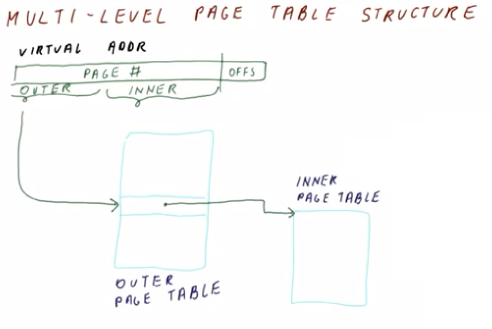
</center>

The multi-level page stable (similarly to previously) views the **virtual address** in distinct ***segments***:
  * **page offset**
  * **page number**

However, a ***key difference*** is that the page number region, rather than representing an *entire* (large) page table entry, instead is partitioned into two ***subsections*** (as in the figure shown above):
 * **outer page table number** → indicates which part of the larger (i.e., flat-page-table-equivalent) page table is used
 * **inner page table number** → which specific entry of the larger page table is used

Effectively, the outer page table number indexes into the **outer page table** (a subset of the larger page table), and then each of these entries in turn indicate where to locate the so called **inner page table**.

<center>
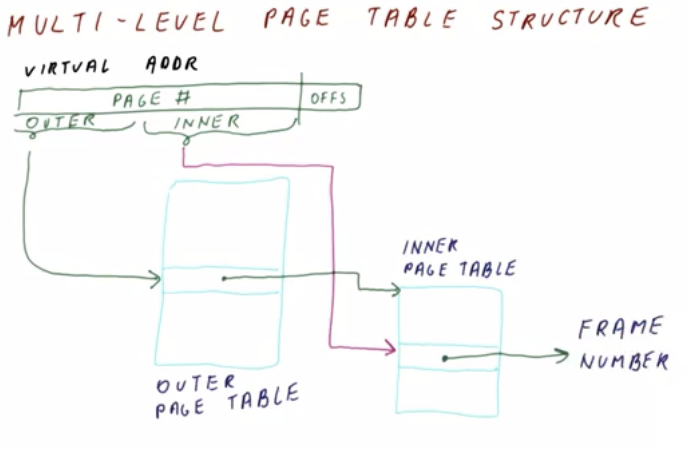
</center>

Once the **inner page table** is located, the **inner page table number** is used to index into the inner page table (as in the figure shown above), in order to identify the corresponding **frame number** in question (i.e., corresponding to the original virtual address).

<center>
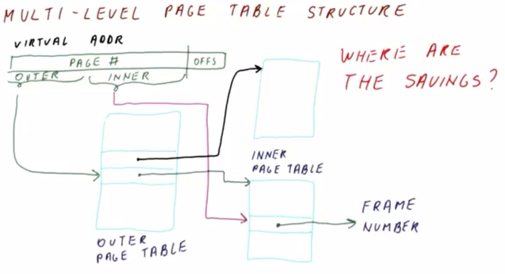
</center>

Similarly, a different outer page table entry will point to a correspondingly different inner page table (as in the figure shown above). Therefore, effectively, the outer page table number identifies the particularly relevant inner page table in question, while the inner page table number itself in turn identifies the location within the inner page table containing the frame number in question.

Nominally, this appears as simply a "more complicated" way to effectively access the same/equivalent (flat) page table, i.e., there is still essentially a 1:1 correspondence between the inner page table number and the frame number, and correspondingly the cumulative size of the inner page tables is equivalent to the resulting "composite" flat page table (with the additional "overhead" of an added intermediate-level outer page table).

This, then, begs the question: What kind of "savings" are resulting here (i.e., using multi-level page tables relative to flat page tables), exactly?

### 15. Two-Level Page Table Example

To understand the net benefit of multi-level page tables with respect to "saving space," consider a **two-level page table**.

<center>
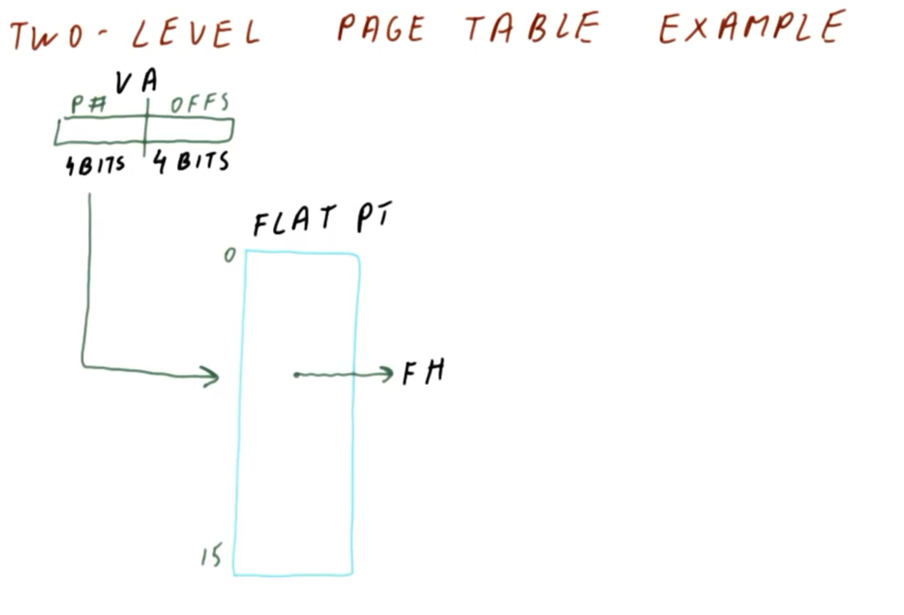
</center>

Consider an example consisting of a small virtual address (as in the figure shown above), comprised of `4 bits` for the page number and `4 bits` for the offset. In a corresponding flat page table, `2^4 = 16` entries (numbered `0` through `15`, inclusive) are required to address the page table. Indexing in this manner will yield a frame number from the flat page table, as before.

<center>
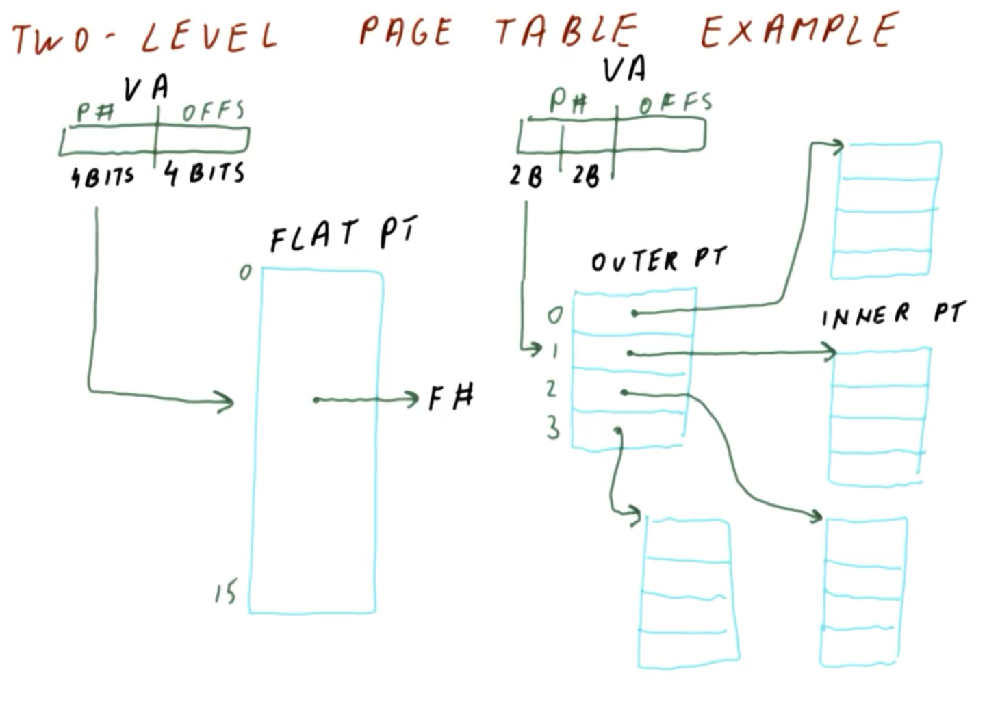
</center>

In a **two-level page table** (as in the figure shown above), the `4 bit` page number is split into two `2 bit` sections. Correspondingly, the same/equivalent virtual address is still comprised of `4 bit` page numbers, however, the `2 bit` outer region of the page number indexes into a `2^2 = 4` entries **outer page table**, with each entry pointing to a `2^2 = 4` entry **inner page table**.

<center>
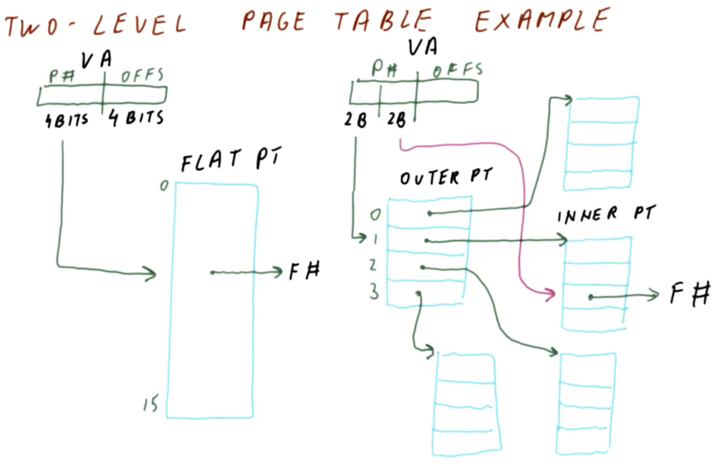
</center>

Once the corresponding inner page table is identified (as in the figure shown above), the `2 bit` inner region of the page number identifies the specific entry for the given inner page table, thereby yielding the target **frame number**.

As seen previously (cf. Section 14), the cumulative size of all of the inner page tables is the same/equivalent to the original flat page table (e.g., `16` total entries in both cases in the example from this section), and what's more is that the outer page table even adds *additional* space/entries (e.g., `4` entries in this example). So, then, where are the ***savings*** in a two-level page table relative to the flat-page-table equivalent (i.e., with respect to entries/memory usage)?

<center>
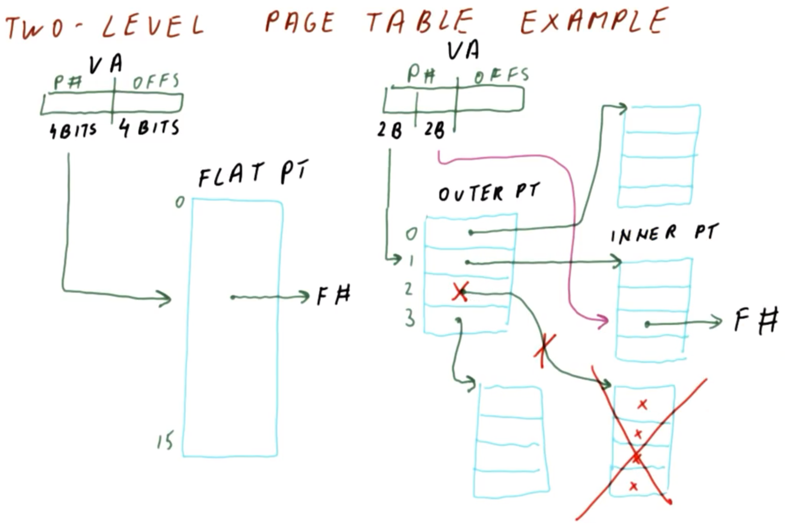
</center>

The savings derive from the fact that if there is an unused entry in the outer page table (i.e., such that none of the constituent inner-page-table entries correspond to actual/in-use physical memory), then the outer page table is simply marked as "unnecessary," thereby eliminating the need to use its constituent inner page table in the first place.

In this manner, in a large virtual address space, the outer page table will contain many such pointers, most of which will point to such "eliminated" inner page tables. This yields ***one*** reasonably sized outer page table (i.e., which ***can*** fit in physical memory), with a correspondingly ***small*** number of constituent inner page tables (each of which in turn are similarly "reasonably" size, i.e., sufficiently within the bounds of physical memory).

### 16. Two-Level Page Table Size

Consider now how large a two-level page table can grow with respect to size.

<center>
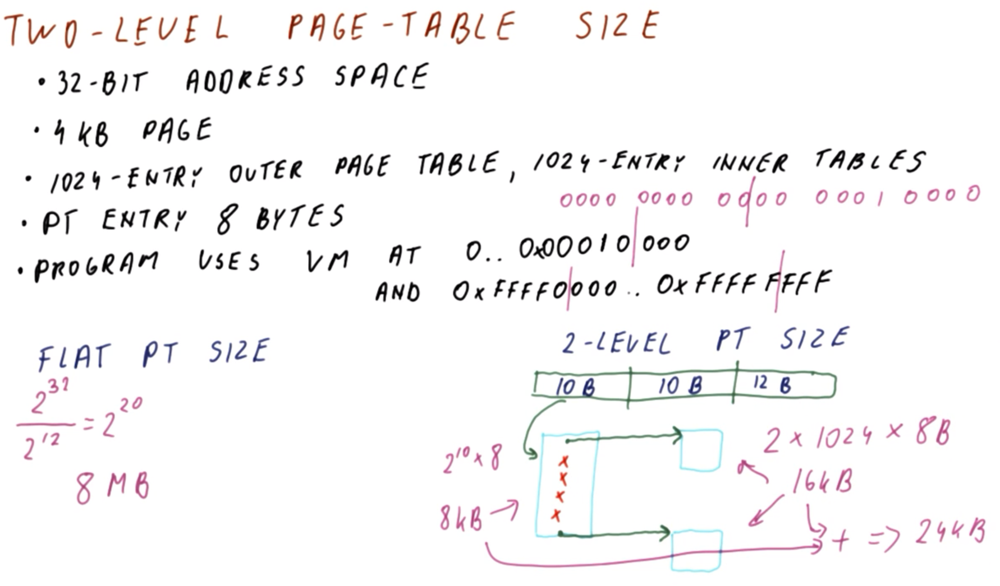
</center>

Consider a two-level page table characterized as follows:
  * `32 bit` virtual address space
  * `4 KB` page size
  * `1024` entry outer page table
  * `1024` entry inner page tables (up to `1024` total inner tables)
  * `8 bytes` per page table entry
  * the program uses virtual memory addressed in address-space regions:
    * `0x00000000` through `0x00010000` (top region of address space)
    * `0xFFFF0000` through `0xFFFFFFFF` (bottom region of address space)

Given these characteristics, let us now compare/contrast the flat page table size versus the corresponding two-level page table size.

In the flat page table, there is one entry for each possible page. Accordingly, this gives:

```
(2^32 pages) / (4 * 2^10 bytes per page table entry) = 2^20 entries
```

Therefore, the ***total size*** of the flat page table is:

```
(2^20 entries) × (8 bytes per page table entry) = 8 MB
```

Conversely, in the two-level page table, first we must determine the total number of inner page tables there are across the two aforementioned address-space regions.

Note that the virtual address is composed of the following regions (as in the figure shown above):
  * `10 bit` outer page number region to index into the `1024` entry outer page table (i.e., `log_2(1024) = 10`)
  * `10 bit` inner page number region to index into the `1024` entry inner page tables (i.e., `log_2(1024) = 10`)
  * `12 bit` offset to index into the `4 KB` page

***N.B.*** This correspondingly comprises a `32 bit` address (i.e., `10 + 10 + 12`), as per the original specification.

Given these virtual address bits regions, the outer page table will be ***sized*** as follows:

```
(2^10 entries) × (8 bytes per page table entry) = 8 KB
```

Now, the question is: Which of these outer page table entries need to point to actual inner page table entries, with the other remaining entries indicating no inner page table?

To answer this, it is necessary to determine which of the inner page table entries are needed to point to actual pages of memory. To do this, the given virtual-address-space address regions' virtual addresses can be decomposed into offset (least significant bits) and page number (most significant bits) components as follows:

(*top region* → `0x00000|000` through `0x00010|000`)
```
                         |
0000 0000 0000 0000 0000   0000 0000 0000
⋮
0000 0000 0000 0001 0000   0000 0000 0000
```

(*bottom region* → `0xFFFF0|000` through `0xFFFFF|FFF`)
```
                         |
1111 1111 1111 1111 0000   0000 0000 0000
⋮
1111 1111 1111 1111 1111   1111 1111 1111
```

For the respective page number regions (i.e., highest `10` least significant bits), observe that these are common across the addresses for each respective region:
  * top region → `0000 0000 00...` (first outer page table entry)
  * bottom region → `1111 1111 11...` (last outer page table entry)

Correspondingly, this will require two distinct entries in the outer page table, representing each respective region (and corresponding inner page table), while the remaining outer page table entries will be empty/unused.
  * ***N.B.*** There are `1024` entries in the outer page table, thus these require only `2` of these outer page table entries to be used (i.e., the remaining `1024 - 2 = 1022` are empty/unused).

With respect to sizing of the inner page tables, this gives:

```
(2 inner page tables) × (2^10 entries) × (8 bytes per page table entry) = 16 KB
```

Combining this with the outer page table size (`8 KB`), this gives a cumulative size of `16 KB + 8 KB = 24 KB` for the two-level page table (cf. `8 MB` for the equivalent flat page table). Given this substantial reduction in size (i.e., relative to the equivalent flat page table), multi-level page tables are almost exclusively used in modern processors, especially when dealing with a `64 bit` virtual address space (for which an equivalent flat page table is much larger than what can actually fit in physical memory).

## 17. Four-Level Page Table Quiz and Answers

<center>
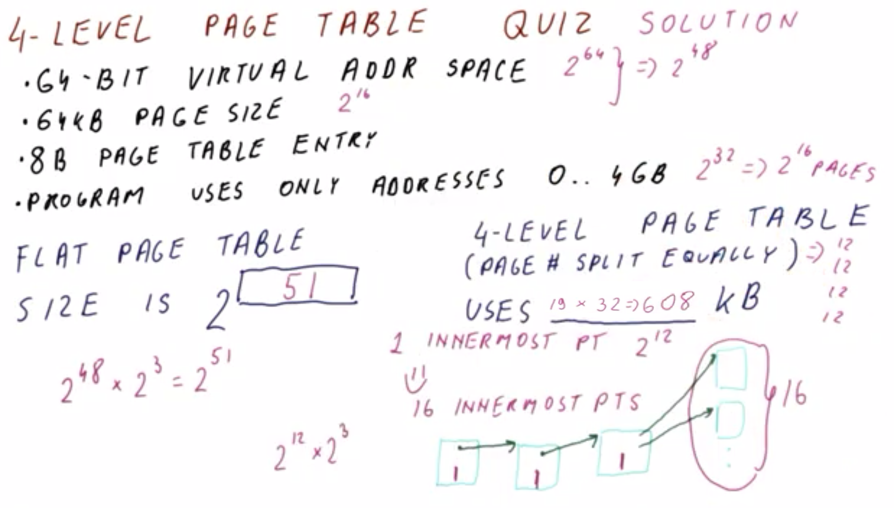
</center>

Consider a four-level page table characterized as follows:
  * `64 bit` virtual address space
  * `64 KB` page size
  * `8 bytes` per page table entry
  * the program uses virtual memory addressed in address-space regions `0` through `4 GB` (`4 * 2^30 = 2^32`) only
  * the page number is split equally (i.e., the bits of the page-number region of the virtual address are divided into four equal groups for accessing the constituent page tables)

What is the equivalent flat page table size?
  * `2^51` entries

What is the size of the four-level page table?
  * `608 KB`

***Answer and Explanation***:

Per the table characteristics, there are:
  * `2^64` addresses/entries in the virtual address space
  * `64 * 2^10 = 2^16 bytes` per page

Therefore, in the virtual address space, there are:

```
(2^64 entries) / (2^16 bytes per page) = 2^48 pages
```

Correspondingly, for the ***flat*** page table, the size is (via `8 = 2^3 bytes` per page table entry):

```
(2^48 pages) × (2^8 bytes per page table entry) = 2^51 bytes
```
* ***N.B.*** This is an enormously sized page table (i.e., `2048 TB = 2 PB`).

As for the ***four-level*** page table, the `64 bit` is split into four equally sized constituent regions of `(48 pages)/4 = 12 bits` apiece, to correspondingly index into the four levels of page tables.

To determine the overall page table size, the easiest way to accomplish this is to first determine the number of innermost page tables required for the program in question. Accordingly, `4 GB = 2^32 bytes` worth of memory is required for the program itself, corresponding to:

```
(2^32 entries) / (2^16 bytes per page) = 2^16 pages
```

One innermost page table comprises `2^12` entries. Consequently, the total number of these innermost page tables is therefore:

```
(2^16 pages) / (2^12 entries per page) = 2^4 = 16 innermost page tables
```

At the next page table level, the corresponding number of page table entries pointing to these `16` innermost page tables is simply `1` by inspection, since the available sizing is up to `2^12` entries (per aforementioned "equally sized" `12 bit` regions of the virtual address), which is plentifully sufficient to address only `16 = 2^4` of these innermost page tables. 

Generalizing in this manner, the page table sizes (from *outermost* to *innermost*, respectively) are as follows (as in the figure shown above):
  * (*outermost*) `1` entry used of `2^12 = 1024` available
  * `1` entry used of `2^12 = 1024` available
  * `16` entries used of `2^12 = 1024` available
  * (*innermost*) `16 * 2^12 = 2^16` entries used of `16 * 2^12 = 2^16` available

Accordingly, the cumulative size of this four-level page table configuration is:

```
[1 + 1 + 1 + 16 page tables] × [(2^12 page table entries) * (2^3 bytes per page table entry)] = [19 page tables] × [2^15 bytes per page table] = 608 KB
```

***N.B.*** This is substantially less than the corresponding flat page table (cf. `2^51 bytes`). Correspondingly, this is why practically all modern processors use multi-level page tables accordingly (typically, at least `3` levels of paging).

## 18. Choosing the Page Size

<center>

</center>

As demonstrated in most examples thus far in this lesson, page sizes typically are on the order of `4 KB` to `64 KB`. This begs the question: How exactly do we choose the page size supported by a given processor?

Consider a comparison of larger vs. smaller page sizes as follows:

| Page Size | Benefits | Drawbacks |
|:--:|:--:|:--:|
| Smaller | Less prone to **internal fragmentation**. | Smaller page sizes result in larger (innermost) page tables. |
| Larger | Larger page sizes result in a smaller (innermost) page table, whereby each non-innermost page table generally requires only one entry (i.e., pointing to the next-non-innermost page table). | Suffers from **internal fragmentation**.  |

In practice, memory can only be allocated to applications on a per-unit basis of pages. Therefore, with a very large page size (and correspondingly very small innermost page tables in a multi-level page table configuration), this will result in **internal fragmentation**, which occurs when the application requests some amount of memory with is a non-integer-multiple of the page size (as in the figure shown above), whereby multiple pages must be allocated, with resulting "deadweight"/unused memory area among the allocated page(s) (denoted by red bracket and blue shading in the figure shown above). 
  * ***N.B.*** Bear in mind that this "deadweight" is physical memory which is allocated to the application, but otherwise unutilized. Furthermore, when the page is on disk, the corresponding memory is also "wasted" (i.e., the entire page is also stored on disk in this manner), though in practice this may be less of an issue on disk, since typically disk space is much larger than main memory (i.e., RAM).

So, then, how do we choose the page size, given these apparent tradeoffs (i.e., optimizing between page table size vs. potential internal fragmentation)? As with block sizing of caches (cf. Lesson 12), there is a ***compromise*** to reach here with respect to optimizing these parameters. As it turns out, a generally "acceptable" compromise in this context is to use page sizes ranging from ***a few kilobytes*** to ***a few megabytes***.
  * Correspondingly, x86 processors typically use a page size of `4 KB`, since contemporaneously to their initial design, bias was more towards smaller pages due to concerns regarding wasted memory.
  * More recently, for `64 bit` processors in the era of `GB` to `TB` sized memories (i.e., 2010s and beyond), a page size on the order of `1 MB` is still relatively small and relatively "not wasteful."

## 19. Memory Access Time with Virtual-to-Physical Address Translation

Having seen how paging and virtual-to-physical address translation work, now consider the **memory access time** with respect to this translation process.

<center>
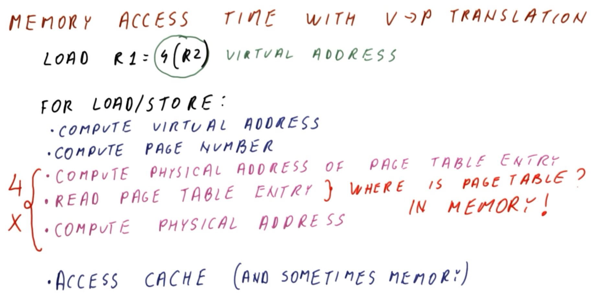
</center>

Typically, a program performs operations such as the following:

```mips
LOAD R1 = 4(R2)
```

where `R1` is loaded from the address computed by adding `4` to the address location stored in `R2`. When `4(R2)` is correspondingly computed, this yields the ***virtual address*** to be accessed in the program.

Therefore, to perform a load/store operation, the processor must perform the following sequential ***operations***:
  * 1 - Compute the virtual address
    * This is typically a ***fast*** operation (i.e., addition of two values which are already known by the processor, comprised of a constant fetch operation for the instruction and reading of the register present in the processor)
  * 2 - Compute the page number
    * This is also a ***fast*** operation (i.e., reading bits regions from the virtual address)
  * 3 - Access the cache (and sometimes main memory, if there is a cache miss)
    * This is also a ***fast*** operation, with the ***exception*** of occasional cache misses

However, note that these are the operations *in the absence of virtual-to-physical address translation*. Conversely, if additionally accounting for **virtual-to-physical address translation**, the corresponding ***operations*** are as follows:
  * 1 - Compute the virtual address
  * 2 - Compute the page number
  * 3 - Compute the physical address of the page table entry
    * This is accomplished by adding the computed page number (i.e., from the previous step) to the beginning address of the page table, which is a ***fast*** operation (i.e., simple addition operation)
  * 4 - Read the page table entry
    * The speed of this operation depends on ***where*** exactly the page table is present
      * If the page table is inside the processor, then access is ***fast***
      * Otherwise, if the page table is in main memory (or disk), then access is ***slow***
    * Furthermore, recall from previously in this section that a page table can be fairly large
      * For a multi-level page table, the page table may be on the order of `1 MB` which is relatively small, however, theoretically, in can be extremely large as well, and therefore in general it cannot be guaranteed that the page table for even *one* process will *always* fit in the processor (i.e., in general, the page table will likely be ***in memory***)
  * 5 - Compute the physical address
    * This is accomplished by combining the physical frame number (i.e., from the page table entry) with the page offset from the virtual address, which is a ***fast*** operation (i.e., simple addition operation)

A key **implication** of these operations (more specifically, the third) is that for ***each*** load/store operation there will be a slow/rate-limiting memory-access operation, which is practically as slow as a cache miss itself (which was precisely what was intended to be avoided by using page tables in the first place).
  * This issue is further exacerbated in a multi-level page table (e.g., in a four-level page table, operations 3-5 would require *four* such operations *per load/store operation*, i.e., one per each paging level!).

As it stands, virtual-to-physical address translation is incurring a cost which is on par with (or perhaps even worse than) a cache miss with respect to memory access...

## 20-21. Virtual-to-Physical Address Translation Quizzes and Answers

To understand the impact of virtual-to-physical address translation on performance, consider the following two quizzes.

### 20. Virtual-to-Physical Address Translation Quiz 1 and Answers

<center>
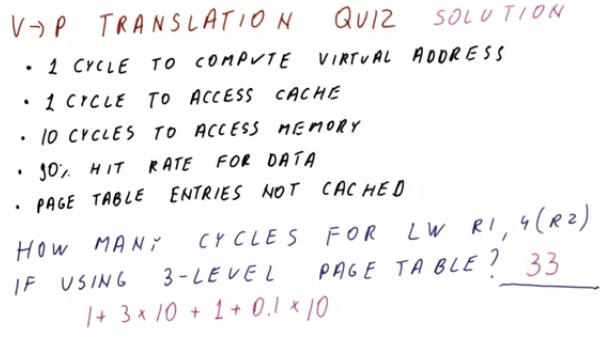
</center>

Consider a processor characterized as follows:
  * `1` cycle is required to compute the virtual address for a load/store instruction
  * `1` cycle is required to access the cache (i.e., on a cache hit)
  * `10` cycles are required to access memory (i.e., on a cache miss)
  * `90%` hit rate on data access attempt
  * Page table entries are ***not*** cached (i.e., ***must*** be exclusively accessed via main memory instead)

How many cycles are required for a load operation (e.g., `LW R1, 4(R2)`) if using a three-level page table?
  * `33` cycles

***Explanation***:

Note that in a three-level page table, the `10` cycles requirement for memory access applies to *each* of these levels. Given this, the overall cycles requirement is as follows:

```
1 + 3×10 + 1 + (1 - 0.90)×10 = 33
```

Of these `33` cycles, `30` are required just to access the page table!

### 21. Virtual-to-Physical Address Translation Quiz 2 and Answers

<center>
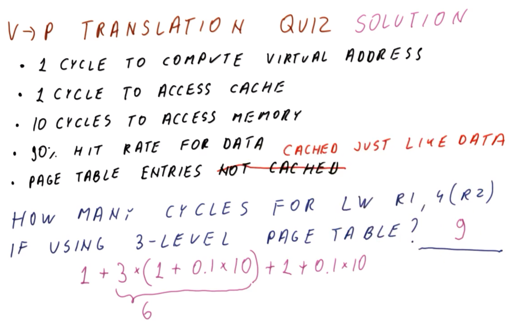
</center>

Now, consider the same processor as in the previous quiz (cf. Section 20), but with the page tables ***cached*** (i.e., rather than exclusively accessed via main memory), similarly to the data.

Given this change, how many cycles are required for a load operation (e.g., `LW R1, 4(R2)`) if using a three-level page table?
  * `9`

***Explanation***:

With cached page tables, the per-level access is reduced, and thus the overall cycles requirement is now updated as follows:

```
1 + 3×[1 + (1 - 0.90)×10] + 1 + (1 - 0.90)×10 = 9
```
  * ***N.B.*** cf. factor `3×[1 + (1 - 0.90)×10] = 6` (cached) vs. `3×10 = 30` (not cached, from previous quiz in Section 20). This factor accounts for the virtual-to-physical address translation.

As this example demonstrates, virtual-to-physical address translation is still relatively expensive with cached page tables.

## 22. Translation Look-Aside Buffer (TLB)

<center>
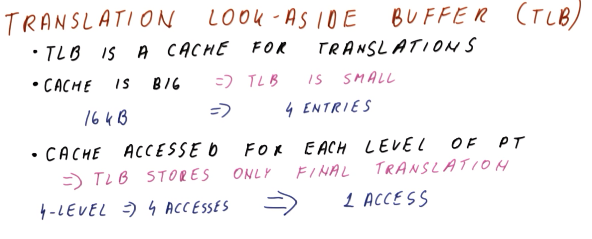
</center>

To speed up the virtual-to-physical address translation, the processor contains a structure called the **translation look-aside buffer (TLB)**. The translation look-aside buffer (TLB) is essentially a ***cache for these translations. This then begs the question: How exactly is the translation look-aside buffer (TLB) better than just using the cache itself directly?

For one thing, the cache is relatively ***large*** in size.
  * It could potentially store a lot of translations, if that were the only thing it stores; however, that is not the case, but rather the majority of the cache content is program data, with one translation in the cache accounting for an *entire page* of such data.

Conversely, the translation look-aside buffer (TLB) is comparatively ***small*** in size.
  * Accordingly, the translation look-aside buffer (TLB) caches these translations *exclusively*, thereby allowing the translation look-aside buffer (TLB) itself to be correspondingly very small but ***very fast***.
    * For example, given a program which accesses `16 KB` of data, in order to operate efficiently with a cache, this would require a `16 KB` cache; however, this corresponds to `4` pages given a page size of `4 KB`. Conversely, the corresponding translation look-aside buffer (TLB) only requires `4` entries to cover the equivalent amount of translation-related program memory, which is a very small size that can be covered extremely quickly (i.e., much less than one cycle per translation).

Additionally, recall (cf. Section 19) that in a multi-level page table, the cache is accessed for *each* level of the page table (i.e., a "drill-down" to the final translation entry in the innermost page table).

Conversely, a translation look-aside buffer (TLB) only stores the ***final*** translation (i.e., the innermost page table, corresponding to the **frame number**), including in the case of a multi-level page table.
  * Accordingly, in a four-level page table, using a cache requires four distinct accesses to perform the full translation, whereas a translation look-aside buffer (TLB) will only require *one* equivalent access to perform this same translation (i.e., irrespectively of the level of paging).

Collectively, when using a translation look-aside buffer (TLB), to perform a load/store operation, the processor simply needs to:
  * 1 - Form the address
  * 2 - Access the translation look-aside buffer (TLB) to locate the translation
  * 3 - Access the cache to retrieve the data

In the event of *both* a ***TLB hit*** *and* a **cache hit**, this sequence can be performed in one or two cycles.

<center>

</center>

However, what about if a ***TLB miss*** occurs (i.e., what if the translation is ***not*** present in the translation look-aside buffer (TLB))? In this case, the corresponding corrective-action sequence is:
  * 1 - Perform translation using a page table(s)
  * 2 - Place the resulting translation into the translation look-aside buffer (TLB) for subsequent use by the processor

## 23. What If We Have a TLB Miss? (Quiz and Answers)

***N.B.*** This section is presented as a "quiz," however, the subject matter herein is strictly "expositional" in nature and hence treated as a "lecture section" for purposes of these notes.

As discussed at the end of the previous section, a ***translation look-aside buffer (TLB) miss*** requires corrective action. However, this begs the question: Which entity/entities should be responsible for this?

<center>

</center>

For this purpose, there are two prospective candidates, both of which are suitable:
  * The **operating system** (i.e., determining the contents of the page tables using a software-based approach or equivalent)
  * The **processor** itself automatically (i.e., without intervention from the operating system or otherwise) reads the page table(s) and consequently updates the translation look-aside buffer (TLB) accordingly

<center>

</center>

The operating-system-based approach is called **software translation look-aside buffer (TLB) mishandling**, and has the ***advantage*** of allowing the operating system to use any type of page table that it want to, since the hardware itself does not require direct access to the page table itself (i.e., the hardware has the translation look-aside buffer (TLB) already for this purpose).
  * Furthermore, the job of the operating system is to place the correct translation into the translation look-aside buffer (TLB) in this arrangement, however, it can do so flexibly via any of its available capabilities. For example, the operating system may not even have the page table in a "table" form, but rather may use an alternative data structure for this purpose (e.g., binary tree, hash table, etc.).
  * This approach effectively performs a "sub-program" to fill the translation look-aside buffer (TLB).

The processor-based approach is called **hardware translation look-aside buffer (TLB) mishandling**.
  * In this case, the page tables must be in a form that is easily accessible by the hardware (i.e., a flat or multi-level page table, as seen previously in this lesson).
  * This approach has the ***disadvantage*** of requiring additional hardware because the hardware must now access the page tables, sequentially access the page-table levels, etc., however, it has the corresponding ***advantage*** of being faster than software-based handling, as it is effectively more akin to hardware-based handling of a cache miss.

Because the latter hardware-based approach is faster, and because modern hardware is relatively cheap, most high-performance processors (e.g., x86) use this approach accordingly.

However, some embedded processors use software-based TLB mishandling, due to concern over the corresponding hardware cost to use the hardware-based approach. Furthermore, in these embedded processors, TLB misses occur less frequently in practice due to the comparatively simpler applications running on them.

## 24. TLB Size Quiz and Answers

<center>
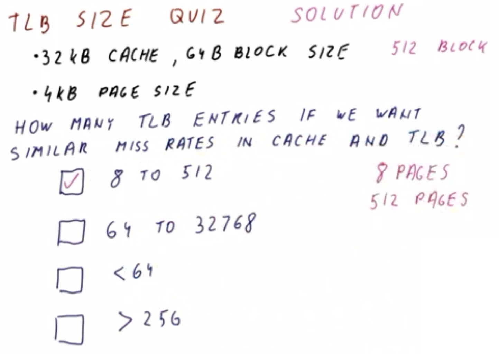
</center>

Consider a processor characterized as follows:
  * `32 KB` cache with a `64 bytes` block size
  * `4 KB` page size for virtual-to-physical address translation

How many translation look-aside buffer (TLB) entries should be used to achieve similar miss rates between the cache and the translation look-aside buffer (TLB)? (Choose the best option.)
  * `8` to `512`
    * `CORRECT`
  * `64` to `32768`
    * `INCORRECT`
  * `< 64`
    * `INCORRECT`
  * `> 256`
    * `INCORRECT`

***Explanation***:

If the processor is only accessing up to `32 KB` of memory via the cache, then the translation look-aside buffer (TLB) must cover this same amount of memory as the cache, i.e., correspondingly `8` pages (via `32 KB cache / 4 KB per page = 8 pages`).

Correspondingly, `< 64` entries seems like the most appropriate choice, however, if the processor is not accessing *all* of the data in *each* of the pages, then this will require *more* pages to otherwise cover the *same* amount of `32 KB` cache memory, because in the cache (with a block size of `64 bytes`) this will fit `512` different blocks (i.e., `32 KB cache / 64 bytes per block = 512 blocks`, via `32 KB = 2^15 bytes = 32768 bytes`), which in turn can be spread across the entire cache memory. Conversely, with `8` entries in the translation look-aside buffer (TLB), only *eight* different pages can be accessed at any given time, while these `512` blocks in question could in principle be located in `512` different/distinct pages.

Therefore, in this case, the translation look-aside buffer (TLB) must have up to `512` different entries in order to ensure a hit rate on par with the cache.
  * In reality, the number of entries required for a parity hit rate with the cache will be somewhere in this range, i.e., between `8` and `512` entries.

## 25. TLB Organization

Since a translation look-aside buffer (TLB) is inherently a cache-like structure, consider now how it is organized in terms of **cache-like properties**.

<center>

</center>

Firstly, consider whether a translation look-aside buffer (TLB) is direct-mapped, fully associative, or somewhere in between.
  * Since the translation look-aside buffer (TLB) is ***small***, it is inherently very ***fast***, and therefore tends to be either ***fully or highly associative***.
  * Conversely, it is unusual for a translation look-aside buffer (TLB) to be direct-mapped, because that would otherwise sacrifice the hit rate for speed, but this is not a relevant requirement here since the translation look-aside buffer (TLB) is already inherently fast due to its small size.

Additionally, with respect to ***size***, it is desirable for the translation look-aside buffer (TLB) to have a hit rate which is *at least* on par with the cache, which in turn requires coverage of *more* memory than that present in the cache.
  * Accordingly, the translation look-aside buffer (TLB) is typically on the order of `64` to `512` entries.
  * However, if *more* entries than this are required to achieve a particular target high hit rate, there is a corresponding ***tradeoff*** to consider with respect to making it too large (thereby degenerating towards slow performance); in this case, a **two-level translation look-aside buffer (TLB)** can be used.
    * The first level, or **level 1 (L1) translation look-aside buffer (TLB)**, is fast, achieving a hit in a single cycle.
    * The second level, or **level 2 (L2) translation look-aside buffer (TLB)**, is activated if a TLB miss occurs in the L1 TLB, and correspondingly achieves a "corrective" hit on the order of several cycles. This in turn is still a considerably faster "correction" than using main memory to perform the corresponding translation. Furthermore, the L2 TLB is relatively large (on the order of several thousand entries), which in turn supports relatively high hit rates (albeit not within a single cycle).

## 26. TLB Performance Quiz and Answers

Having now seen how a translation look-aside buffer (TLB) works, consider a quiz on its performance.

<center>
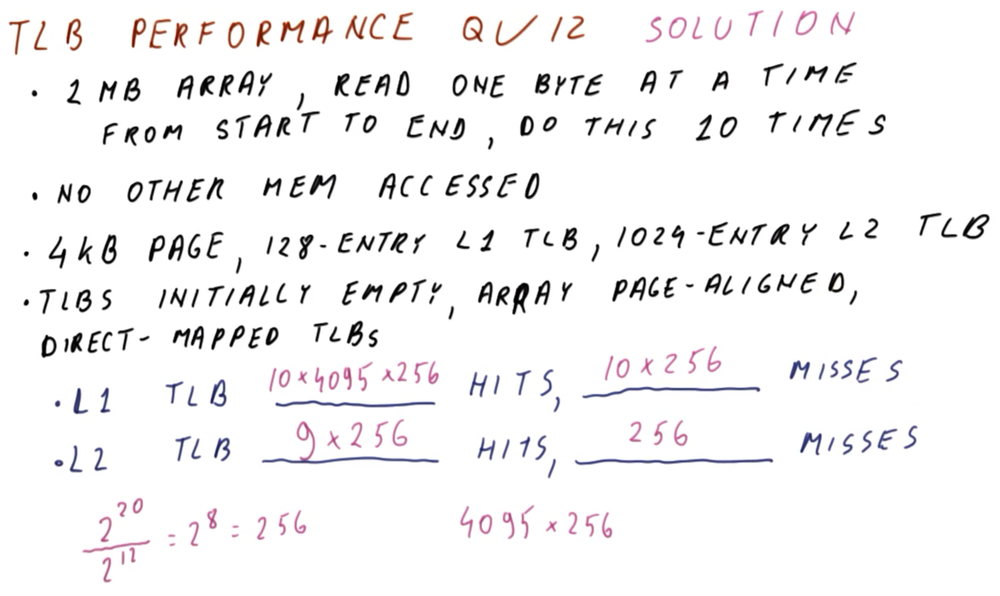
</center>

Consider a program characterized as follows:
  * A `1 MB` array, read `1` byte at a time from start to end, with this full-array read occurring `10` times total
  * No other memory accesses occur (i.e., other than the aforementioned `1 MB` array) during program execution

Furthermore, the processor in question running this program is characterized as follows:
  * `4 KB` page size
  * `128` entries L1 TLB
  * `1024` entries L2 TLB
  * The TLBs are initially empty (i.e., no translations are cached immediately prior to commencing the array-reading operations for the program)
  * The array is page-aligned (i.e., the array begins at the start of a page)
  * The TLBs are direct-mapped

In the L1 TLB, how many TLB hits and misses occur?
  * `10,483,200` hits, `2560` misses

And in the L2 TLB, how many TLB hits and misses occur?
  * `2304` hits, `256` misses

***Explanation***:

Firstly, the amount of pages can be determined as follows (via `1 MB = 2^20 bytes` for the array in question):

```
2^20 bytes / (4 * 2^10 bytes per page) = 2^8 pages = 256 pages
```

Once the first-byte array access occurs, there is both an L1 TLB miss and an L2 TLB miss, since the TLBs are initially empty. Consequently, a translation will be generated and subsequently placed in both TLBs.

Next, when accessing the second byte of the array, there is a TLB hit because that byte is in the *same* page as the previous byte. Therefore, after the initial (i.e., first-byte) TLB miss, there will be subsequent TLB hits for the remainder of the same corresponding `4 KB` page.
  * Correspondingly, in the initial sweep-through of the array, there will be `256` L1 TLB misses (i.e., one per page) and `(4096 - 1)*256 = 1,048,320` L1 TLB hits.

After this initial sweep-through, the L1 TLB contains the entries for the second half of the array, because the full array requires `256` pages, but the L1 TLB only contains `128` entries. However, the L2 TLB contains the mappings for the *entire* array, since it has sufficient size (i.e., `1024` entries) to hold entries for these `256` pages.

Proceeding in this manner, after the initial sweep-through, the L1 TLB will continue performing `256` misses and `1,048,320` hits per array sweep-through, however, the L2 TLB will subsequently hit exclusively.

In summary:

| Array sweep-through iteration | L1 TLB hits | L1 TLB misses | L2 TLB hits* | L2 TLB misses |
|:--:|:--:|:--:|:--:|:--:|
| Initial Iteration | `(4096 - 1)*256 = 1,048,320` | `256` | `0` | `256` |
| Cumulative (Iterations 1-10) | `10*(4096 - 1)*256 = 10,483,200` | `10*256 = 2560` | `(10 - 1)*256 = 2304` | `256 + 9*0 = 256` |

****N.B.*** With respect to the L2 TLB hits, in the initial iteration of array sweep-through, there are no hits because this is covered by the L1 TLB's hits (i.e., in this first iteration, the L2 TLB is simply populated), however, in the subsequent (i.e., `10 - 1 = 9`) iterations, the L2 TLB covers for the corresponding L1 TLB's per-iterative-sweep-through misses.

## 27. Lesson Outro

The knowledge of virtual memory gained in this lesson is important in its own right, and will also be necessary to understand the subject matter of the next lesson, regarding advanced caching optimizations.
