# Advanced Caches

## 1. Lesson Introduction

<center>

</center>

This lesson will examine more-advanced topics in caching (e.g., multi-level caches and various caching optimizations). These are very important to achieve:
  * good overall performance (one thumb up), and
  * energy efficiency (two thumbs up)!

## 2. Improving Cache Performance

<center>
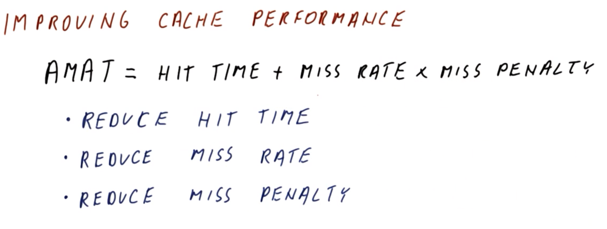
</center>

There are many methods for improving cache performance, however, in general they can be grouped into three **categories**, all three having to do with the aforementioned (cf. Lesson 12) **average memory access time (AMAT)**, defined as:

```
AMAT = Hit Time + Miss Rate × Miss Penalty
```

where:
  * `Hit Time` accounts for a cache hit
  * `Miss Rate × Miss Penalty` accounts for a cache miss
    * `Miss Penalty` is the cost per cache miss
    * `Miss Rate` is the frequency of cache misses

Correspondingly, the three principal **methods** to improve cache performance are as follows:
  * Reduce the `Hit Time`
  * Reduce the `Miss Rate`
  * Reduce the `Miss Penalty`

Any combination of these factors will reduce the average memory access time (AMAT), thereby improving overall performance accordingly when the processor accesses the cache.

## 3. Reduce `Hit Time`

<center>
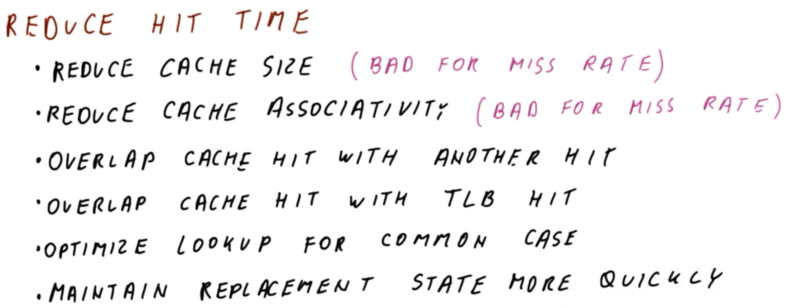
</center>

Let us first examine the methods that attempt to reduce the `Hit Time`.

Some of these methods are fairly obvious:
  * Reducing the cache size
    * However, this has a correspondingly negative impact on `Miss Rate` (i.e., due to the increased penalty paid by cache misses), thereby potentially netting out no improvement (or perhaps even worsening) of the average memory access time (AMAT).
  * Reducing the cache associativity, thereby increasing the cache's speed (i.e., by reducing the search area for a given block on cache hit)
    * However, this similarly can have a potentially negative impact, by similarly adversely affecting `Miss Rate` due to increased cache misses (i.e., due to increased conflicts and consequent ejections among the cache blocks, relative to a "peaceful coexistence" in an otherwise more-associative cache).

Additionally, there are more complex methods for reducing the `Hit Time`:
  * Overlapping the cache hit with another cache hit
  * Overlapping the cache hit with a translation look-aside buffer (TLB) hit
  * Optimizing the lookup for the ***common case*** (without otherwise sacrificing too much for the less common cases)
  * Maintaining the replacement state in the cache more quickly (i.e., on cache hits, if state must be updated for some later replacements, then this can be done more efficiently/optimally accordingly)

***N.B.*** These latter methods will be examined in turn in the subsequent few sections of this lesson.

## 4. Pipelined Caches

<center>
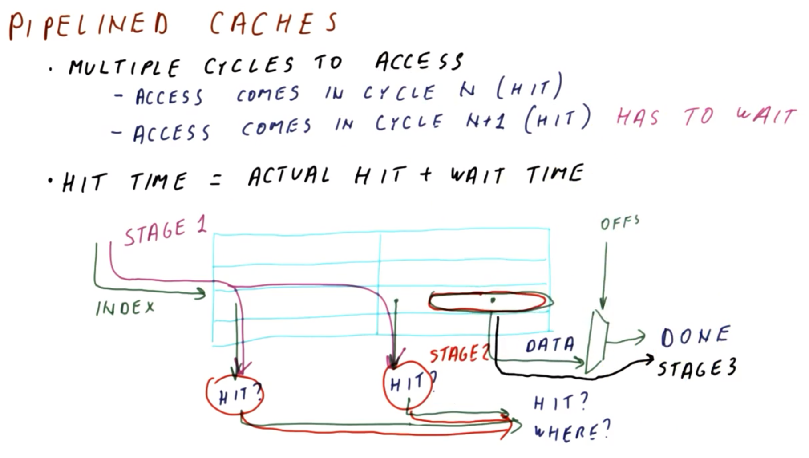
</center>

One way to speed up the `Hit Time` is to overlap one cache hit with another. This can be achieved, for example, by **pipelining** the cache.

If the cache requires multiple cycles to be accessed, then the following ***situations*** can arise:
  * The cache access occurs in cycle `N`, and it is a cache hit
  * A subsequent cache access occurs in cycle `N + 1`, and it is also a cache hit
    * In a ***non-pipelined*** cache, this subsequent access must ***wait*** until the previous cache access finishes using the cache, which itself requires several cycles to complete.

In the scenario described (i.e., a non-pipelined cache), the `Hit Time` is consequently defined as follows:

```
Hit Time = Actual Hit + Wait Time
```

where the `Wait Time` is the overhead incurred due to the inability to access the cache until the previous cache access is completed.

In this situation, pipelining the cache in order to promote immediately-successive cache accesses therefore would improve the overall `Hit Time` (i.e., by correspondingly minimizing the `Wait Time`).

<center>
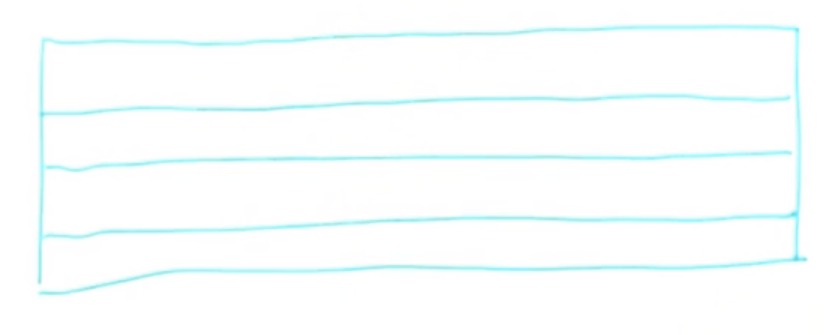
</center>

It may sound straightforward to pipeline a cache, by simply dividing into stages (e.g., 3). However, that begs the question: How to "split" what amounts to effectively a read from a large array (as in the figure shown above), which is essentially what the cache itself inherently is?

<center>
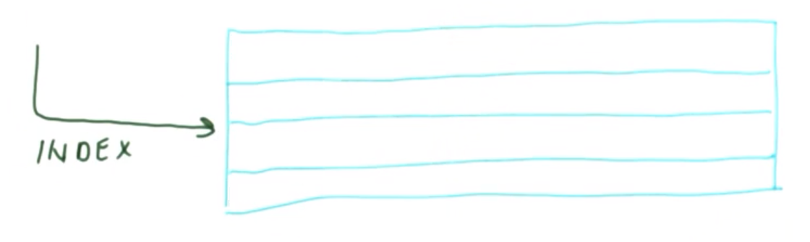
</center>

Recall (cf. Lesson 12) that a **cache access** consists of an **index region** of an address to locate the **cache set** (as in the figure shown above).

<center>
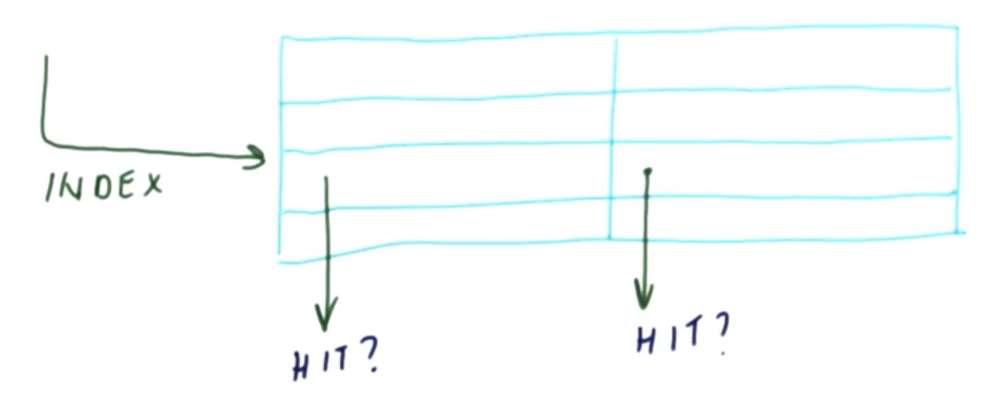
</center>

On reading out of the **tag regions** and **valid bits** corresponding to the **blocks** in the cache set (as in the figure shown above), comparison of the corresponding tag regions and valid bits is performed to identify whether a **cache hit** occurs.

<center>
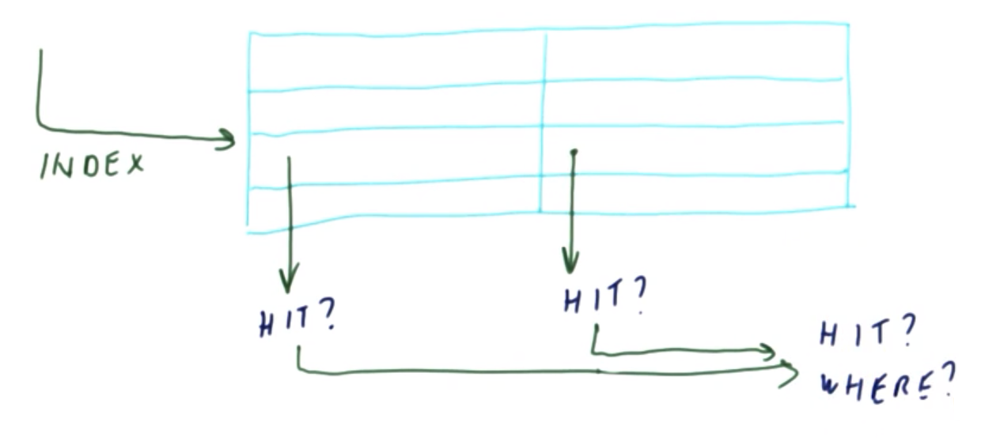
</center>

On comparison/combination, it is determined whether a cache hit occurs, and where it resides within the cache block (as in the figure shown above).

<center>
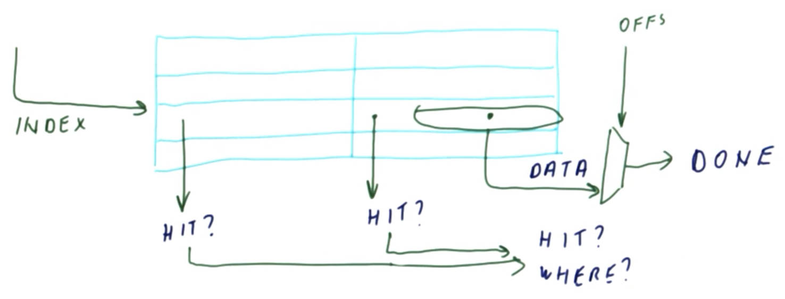
</center>

The corresponding cache-hit data is read out and combined with the **offset** in order to select the corresponding region of the cache block, thereby producing the requested output to send to the processor.

<center>
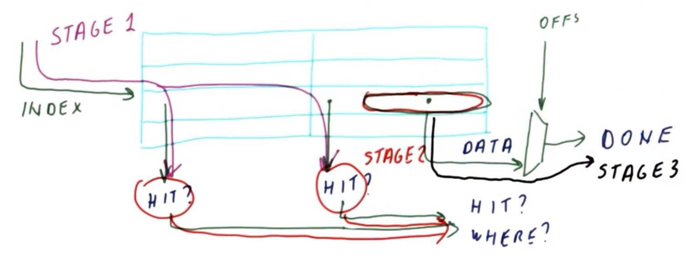
</center>

One example of a pipelined cache access is as in the figure shown above, comprised of the following ***stages***:
  * ***Stage 1*** (magenta in the figure shown above) → Read the tag regions, valid bits, etc. from the cache array
  * ***Stage 2*** (red in the figure shown above) → Perform comparison of the cache hits and correspondingly locate the data
  * ***Stage 3*** (black in the figure shown above) → Perform the data read and provide it to the processor

As is apparent here, the cache access *can* indeed be pipelined, even if the reading operation itself (i.e., from the cache array) is not as amenable to "discretization" into steps. This is particularly true when the comparison of the cache hits (i.e., via tag regions and valid bits) can be decomposed into a separate step from the data access operation itself, as demonstrated here.

Typically, in a **level 1 (L1) cache**, the `Hit Time` is on the order of 1-3 cycles.
  * A 1-cycle cache by definition does not require pipelining in the first place, whereas 2- or 3-cycle caches can relatively easily pipelined into corresponding two- or three-stage caches (respectively).
  * Correspondingly, L1 caches are typically pipelined in this manner.

## 5. Translation Look-Aside Buffer (TLB) and Cache `Hit Time`

Additionally, `Hit Time` is affected by having to access the **translation look-aside buffer (TLB)** prior to accessing the cache itself.

<center>
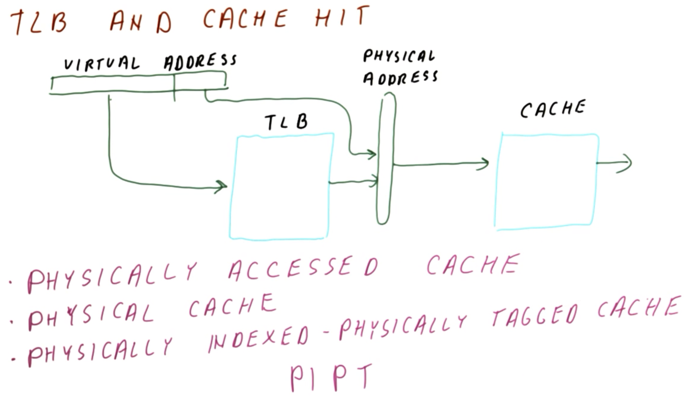
</center>

Recall (cf. Lesson 13) that the processor starts out with the **virtual address**, as in the figure shown above. From there, the following ***sequence*** occurs:
  * A portion of the virtual is used to index into the translation look-aside buffer (TLB) to determine the **frame number**
  * The **page offset** of the virtual address is then combined with the frame number to reconstitute the **physical address**
  * The physical address is used to access the data in the **cache**

Therefore, if the translation look-aside buffer (TLB) requires one cycle and the cache requires an additional cycle, then two cycles are required for the processor to obtain the cache data from the virtual address.

Such a cache that is accessed via a physical address in this manner is called a **physically accessed cache**, **physical cache**, or **physically indexed, physically tagged (PIPT) cache**.
  * The overall **hit latency** of such a cache is effectively comprised of the translation look-aside buffer (TLB) hit latency and the cache hit latency.

## 6. Virtually Accessed Cache

<center>
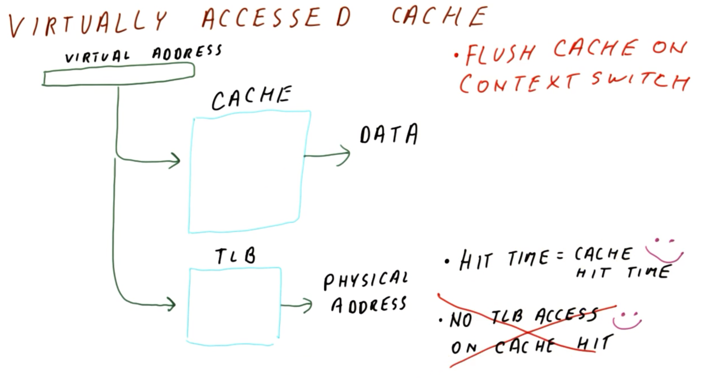
</center>

The overall hit latency of the cache can be improved using a **virtually accessed cache**. In a virtually accessed cache (as in the figure shown above):
  * The virtual address is used to access the data via the cache (cf. Section 5), via corresponding **cache hit**
    * In this case, there is no need to access the translation look-aside buffer (TLB) immediately prior to accessing the data
  * Otherwise, on a **cache miss**, the virtual address is used in tandem with the translation look-aside buffer (TLB) to determine the physical address, in order to bring that corresponding data into the cache

Therefore, the ***advantages*** of using a virtually accessed cache over a corresponding physically accessed cache (cf. Lesson 12) are as follows:
  * `Hit Time = Cache Hit Time`, i.e., the `Hit Time` is comprised solely of the `Cache Hit Time`, with no additional translation look-aside buffer (TLB) latency added
  * There is correspondingly no translation look-aside buffer (TLB) access required on cache hits, thereby reducing energy usage accordingly

With these advantages, why even bother with physically accessed caches at all, then? This is due to the following inherent ***problems*** with (exclusively) virtually accessed caches:
  * In addition to containing the translation for the physical address, the translation look-aside buffer (TLB) also contains the **permissions** required to determine whether it is permissible to read, write, or execute certain pages.
    * Therefore, even though the physical address produced by the translation look-aside buffer is not strictly required in a (fully) virtually accessed cache (i.e., in order to access the corresponding cache data), in practice, it still necessary to access the translation look-aside buffer (TLB) to determine these permissions in a *real* processor (i.e., even on cache hits).
  * A bigger problem arises by virtue of the fact that a given virtual address is ***specific to*** a particular process running on the system. 
    * Correspondingly, if running one process and filling the cache with its data, once another/separate process begins to run, then that other process will have virtual addresses which may potentially overlap with the virtual addresses of teh previous process, thereby creating ambiguity with respect to the intended data for each respective process. To resolve this matter, the translation look-aside buffer (TLB) additionally contains different translations for each corresponding process, mapping unambiguously to the respective physical-memory addresses.
    * Conversely, in a (fully) virtually accessed cache, it would otherwise be necessary to ***flush*** the cache on context switch between the processes (i.e., removing all the cache data for a given process immediately prior to the context switch), thereby introducing bursts of cache misses on each such context switch. For reference, context switches occur among processes on the order of 1 millisecond, which while relatively large with respect to a typical clock (cf. 1-10 nanoseconds per cycle), bear in mind that the cache can be quite large, and correspondingly may nevertheless generate many such cache misses in tandem with such "re-heating" of the cache on context switch.

## 7. Virtually Indexed, Physically Tagged (VIPT) Cache

<center>
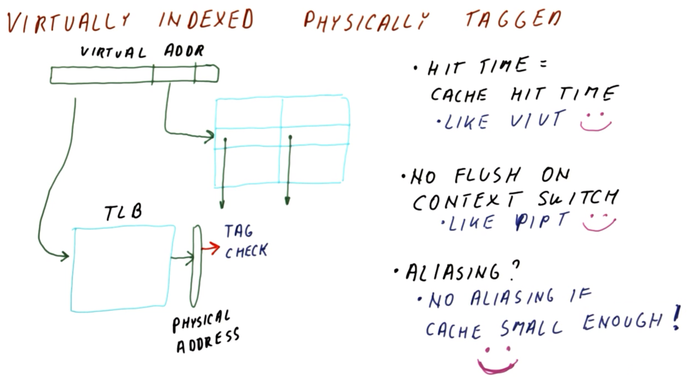
</center>

To resolve the issues which are inherent to the (fully) virtually accessed cache (cf. end of Section 6), the **virtually indexed, physically tagged (VIPT) cache** was devised. The virtually indexed, physically tagged (VIPT) cache combines the advantages of the two types of caches.

<center>

</center>

In a virtually indexed, physically tagged (VIPT) cache, the virtual address is comprised of the **cache offset**, **index bits**, and **tag region** (as in the figure shown above), however, the tag region is not used in the initial lookup. Instead, the index bits from the virtual address are used to locate the corresponding set in the cache. The **valid bits** of this cache set are then read accordingly.

<center>
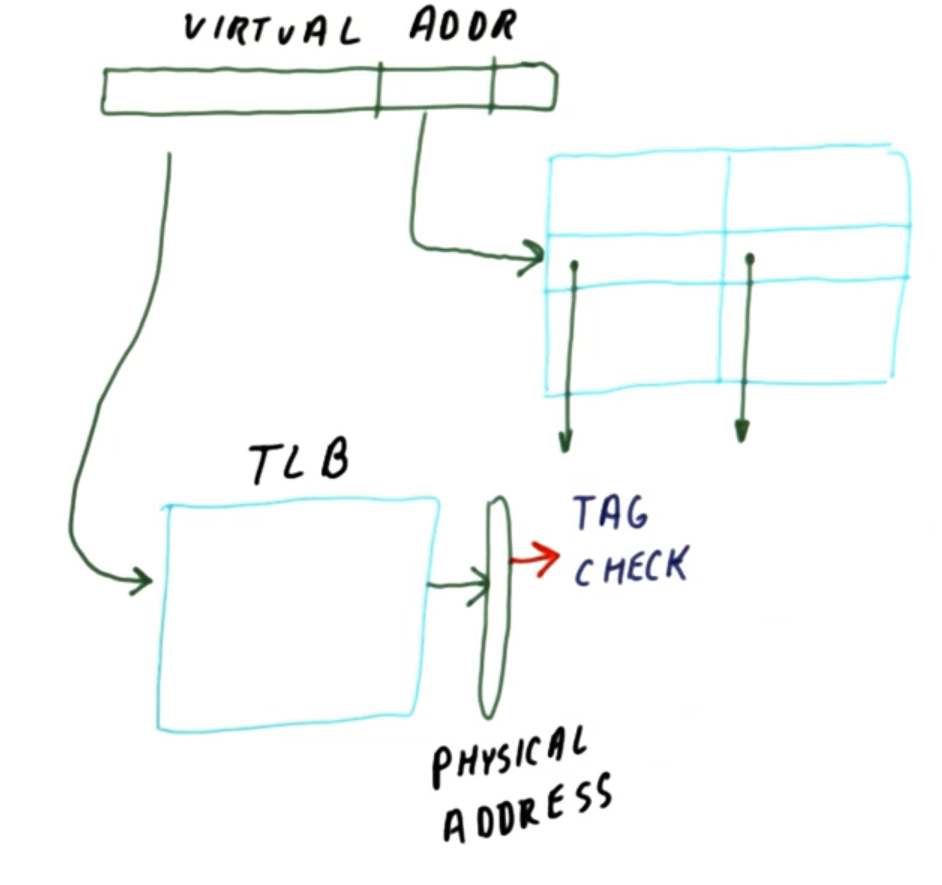
</center>

Meanwhile, the **page number** from the virtual address is used to access the **translation look-aside buffer (TLB)** in order to determine the corresponding physical-address **frame number**. With the **physical address** obtained in this manner, the corresponding **tag check** is performed via this physical address (i.e., *not* via the virtual address).

Correspondingly, the nomenclature "virtually indexed, physically tagged" is now readily apparent:
  * The ***index bits*** derive from the ***virtual address***
  * The ***tag bits*** derive from the ***physical address***

Downstream from these steps, the steps proceed as usual (i.e., a cache hit vs. cache miss is determined, etc.).

So, then, what are the corresponding ***advantages*** of a virtually indexed, physically tagged (VIPT) cache?
  * Since the respective upstream cache array and translation look-aside buffer (TLB) accesses generally proceed ***in parallel*** in this manner, if the translation look-aside buffer (TLB) access is sufficiently fast (which is typically the case, given its small size), then correspondingly `Hit Time = Cache Hit Time` (i.e., the latency component contributed by the translation look-aside buffer [TLB] to the `Hit Time` is negligible relative to the more prominent/bottlenecking cache hit time).
    * This is reminiscent of the **virtually indexed, virtually tagged (VIVT) cache**.
  * Additionally, in a virtually indexed, physically tagged (VIPT) cache, it is ***not*** necessary to flush on context switch, because if the process is switched (i.e., with virtual addressed correspondingly mapping to ***different*** physical addresses), then the cache content is effectively being checked against the actual ***physical*** addresses. Therefore, even if another process maps to the ***same*** cache set (i.e., via virtual address), it will still otherwise map to another set of corresponding physical addresses by virtue of the different/distinct tags.
    * This is reminiscent of the **physically indexed, physically tagged (PIPT) cache**.

Recall (cf. Lesson 13) that **aliasing** can occur when multiple virtual physical addresses in the same address space map to the ***same*** physical address (furthermore, since virtual addressing is performed with respect to cache access, then these addresses may ultimately occur in ***different*** locations within the constituent cache array, with mutually exclusive read/writes to these otherwise disparate/distinct cache locations). So, then, is this a concern with respect to virtually indexed, physically tagged (VIPT) caches?
  * As it turns out, there are ***no*** such aliasing issues with respect to virtually indexed, physically tagged (VIPT) caches, provided that the cache is ***sufficiently small***, a direct consequence of the ***index bits*** themselves. This in turn ensures **correctness** of the cache operation itself.

The concept of aliasing in the context of virtually indexed, physically tagged (VIPT) caches is further examined in the next section.

## 8-9. Aliasing in Virtually Accessed Caches

### 8. Introduction

We have seen (cf. Section 7) that virtually accessed caches can ***overlap*** the latency of the translation look-aside buffer (TLB) lookup and the cache lookup. However, virtually accessed caches have an inherent issue called **aliasing**.

<center>
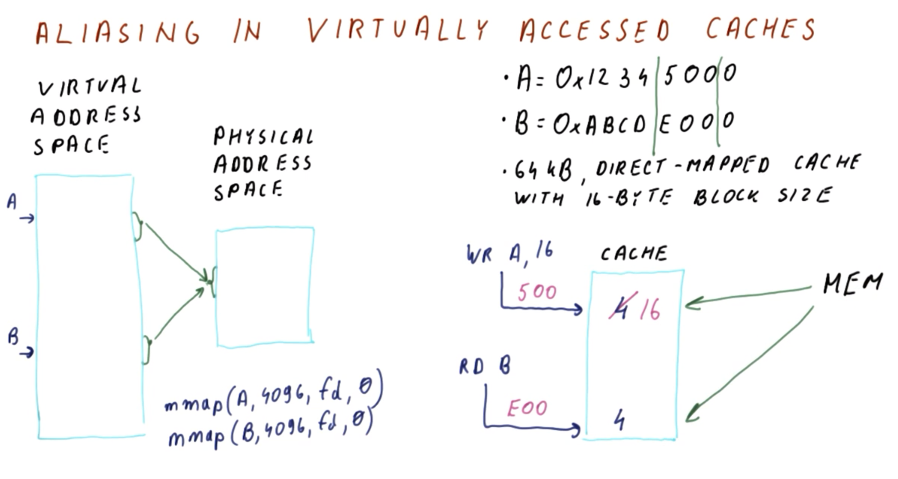
</center>

The issue of aliasing occurs because in the virtual address space of a given application (as in the figure shown above), one page from a given process (e.g., `A`) can map to some part of the physical address space (e.g., via Linux function `mmap()`, or equivalent system call in other operating systems, in order to map part of a file to appear within range of addressable memory, `A`), while another page from a different process (e.g., `B`) can also map to the ***same*** physical address (e.g., via `mmap()` on the same part of the same file to another address, `B`).

The result of this is two (or more) virtual addresses referring to the ***same*** physical-memory location.

To see why this is problematic in a virtually accessed cache, consider the following two addresses:
  * `A = 0x12345000`
  * `B = 0xABCDE000`

Furthermore, let the cache be characterized by the following:
  * `64 KB` in size
  * direct-mapped
  * `16 bytes` block size
  * virtually accessed

For this `16 byte` block size, there is a `4 bit` offset (via least-significant bit), along with the next-twelve-least-significant bits indexing into the cache itself, i.e.,:

```
          index bits
         |   |
              offset bits
             | |
A: 0x1234|500|0
B: 0xABCD|E00|0
```

***N.B.*** `64 KB / 16 bytes = 4 KB` entries in the cache, requiring `log_2(4 KB) = log_2(2^12) = 12 bits` index bits required to identify the index uniquely. Also note that with respect to the offset bits, `0x0` (hex) is equivalent to `0000` (binary).

<center>

</center>

Consider when the processor writes a value of `16` to `A` (as in the figure shown above), i.e., operation `WR A, 16`. It first decomposes the virtual address and indexes into the cache via index bits `0x500`. If a ***cache miss** occurs, then the correspondingly mapped data is first fetched from the physical memory, which in turn returns a value (e.g., `4`).

<center>
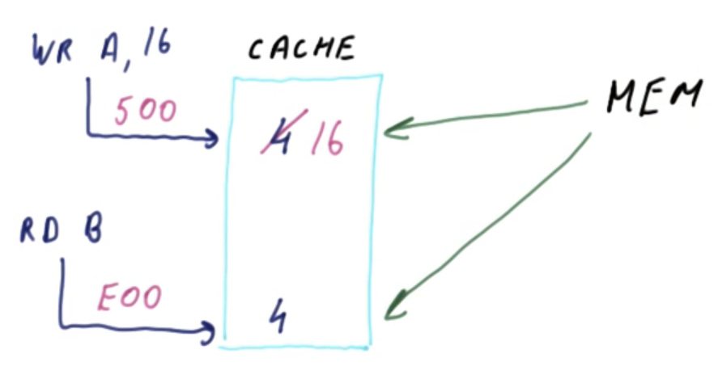
</center>

Once the cache block is fetched, the corresponding value `16` is placed there, and the cache-block content is updated accordingly (as in the figure shown above).
  * ***N.B.*** If we assume that the cache in question is a write-back cache, then this value of `16` simply stays there as written.

Now, consider what occurs when attempting to read `B`, i.e., operation `RD B` (as in the figure shown above). On indexing into the cache via index bits `0xE00`, and assuming a cache miss similarly occurs, then due to the absence of the data in the cache, the data is first fetched from physical memory, which returns the value `4`.

This results in a corresponding ***problem*** that will not be simply a consequence of cache misses: Whenever subsequently writing to `A` and reading from `B`, neither process ends up effectively "sharing" the data as otherwise would be sensible to do.
  * Ideally, since `A` and `B` are actually sharing the ***same*** data, on write to cache by `A`, `B` should subsequently read the same corresponding data.

This problem consequently results in ***incorrect execution*** whenever such a mapping occurs (e.g., via `mmap()`), which is unfortunately a legal operation in most operating systems; therefore, virtually accessed caches require additional support to handle this scenario (e.g., on write to any given virtual-memory location, it is necessary to perform a check for aliases or different versions of the same physical data in the cache, and then either invalidate them, remove them from the cache, or update them accordingly to reflect the new value).
  * Such ancillary operations are correspondingly expensive to implement and to perform, and ultimately defeat the purpose/advantage of virtually accessed caches in the first place, which inherently attempt to minimize latency by reducing (or eliminating) translation steps.

To summarize, virtually accessed caches are desirable because they allow to overlap translation look-aside buffer (TLB) latency with cache latency, however, they introduce this aliasing problem which preclude their practical use otherwise (i.e., due to correspondingly introduced complication in their implementation).

### 9. Virtually Indexed, Physically Tagged (VIPT) Cache Aliasing

Now, consider **aliasing** in the context of **virtually indexed, physically tagged (VIPT) caches** (cf. Section 7).

<center>
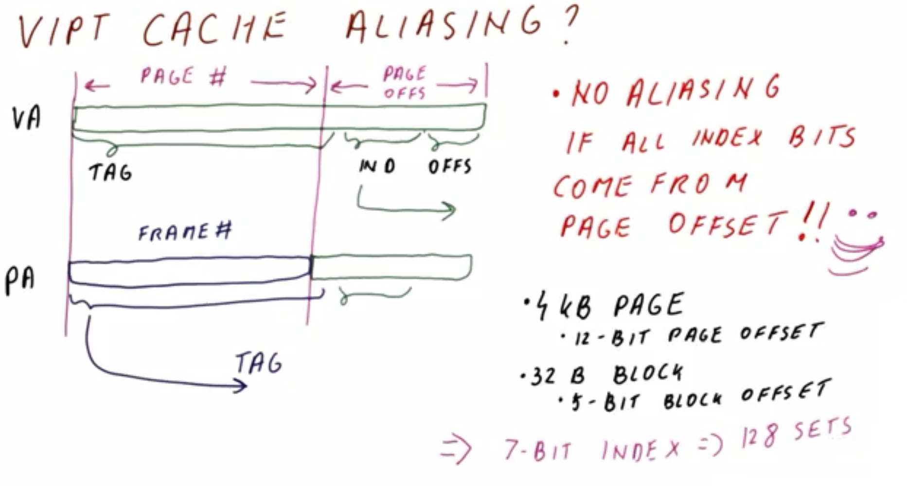
</center>

Given a **virtual address (VA)** (as in the figure shown above), it has the following constituent ***regions*** used for cache access:
  * **offset bits**
  * **index bits**
  * **tag region** (used if the cache is accessed)

In a virtually indexed cache, the index bits of the virtual address are used, while the remainder is derived from the **physical address (PA)**.

To form the corresponding **physical address (PA)**, the least-significant bits of the virtual address comprise the **page offset**, while the remaining tag-region bits comprise the **page number**. The page number of the virtual address is correspondingly translated to the **frame number** of the physical address, while the page offset of the virtual address correspondingly comprises the least-significant bits of the physical address.

Conversely, in a **virtually indexed, physically tagged (VIPT) cache**, the physical-address **tag** originates from the physical address' frame number, while the index derives from the index bits of the virtual-address **offset bits** (to promote fast access).
  * It is additionally noteworthy that the index bits are located closely to the least-significant offset bits of the virtual address, and that the page offset has a fixed number of bits. Consequently, for a small cache, the index bits may ***all*** derive from the virtual address's page offset, which is effectively equivalent to using the least-significant bits of the physical address itself (as demonstrated/delineated visually per corresponding alignment in the figure shown above).
  * Therefore, in this manner, despite indexing via the virtual address, effectively the ***equivalent*** index is being used as if it were being accessed via the physical address itself, which in turn ***resolves*** the aforementioned issue of aliasing. This is because the virtual address's page number (having distinct a page number mapping to corresponding physical address's frame number) only differs with respect to this page number, while still maintaining the ***same*** page offset for the same data; furthermore, since only the index-bits region of the page offset is pertinent (provided that the cache is sufficiently small), it will generally ***always*** map to the ***same*** location in physical memory (i.e., corresponding to the appropriate cache set).

To recap, in a virtually indexed, physically tagged (VIPT) cache, there is ***no aliasing*** if all of the index bits derive from the virtual address's page offset (i.e., these are effectively the same index bits that would otherwise derive from the least-significant bits of the physical address in a corresponding physically indexed cache).
  * This is a very desirable property, with the ***caveat*** that is requires the cache to be sufficiently small to allow this uniqueness property to exist in the first place (i.e., unique addressability via the virtual address's page-offset index bits).

For example, given a cache characterized by a `4 KB` page size, this yields a page offset of `12 bits` (`log_2(4 * 2^10) = log_2(2^12) = 12`). Furthermore, given a `32 bytes` block size for this cache, this correspondingly yields a block offset of `5 bits` (`log_2(32) = log_2(2^5) = 5`). Given these constraints, this yields a `7 bits` index region (i.e., `12 - 5`), thereby limiting the size of the corresponding cache sets to `128` (i.e., `2^7`).
  * If the number of cache sets were to exceed `128`, then the index bits would necessarily "spill over" into the least-significant-bits region of the page number, which correspondingly would impact the unique mapping to the frame number itself (thereby re-introducing potential aliasing, which was intended to be eliminated in the first place).

## 10. Virtually Indexed, Physically Tagged (VIPT) Aliasing Avoidance Quiz and Answers

<center>
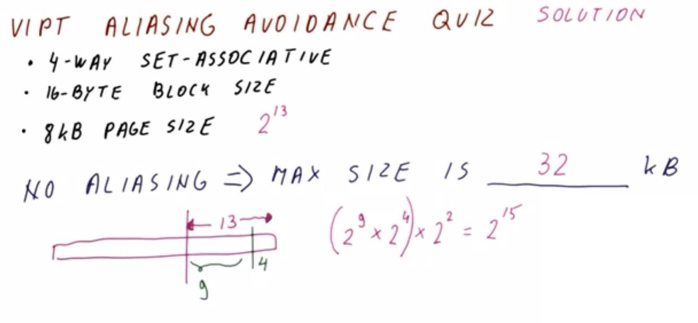
</center>

Consider a virtually indexed, physically tagged (VIPT) cache characterized as follows:
  * 4-way set-associative
  * `16 bytes` block size
  * `8 KB` page size

To avoid aliasing, what is the maximum possible size of the cache?
  * `32 KB`

***Explanation***:

Recall (cf. Section 9) that in order to prevent aliasing, the index bits must derive solely from the page offset. Given a page size of `8 KB = 8 * 2^10 bytes = 2 ^ 13 bytes`, this implies a page offset of `13 bits`. In the decomposition of the virtual address with respect to cache access, this implies that the index and offset bits must fit within these constituent `13 bits`. 

For a block size of `16 bytes`, this implies an offset of `4 bits` (i.e., `log_2(16) = log_2(2^4) = 4`), and correspondingly the index bits are comprised of the remaining `13 - 4 = 9 bits`.

Therefore, the maximum possible size of the cache is determined as follows (note that there are `4 = 2^2` cache blocks in a 4-way set-associative cache):

```
(2^9 cache sets) × (2^4 bytes per cache block) × (2^2 cache blocks per cache set) = 2^15 bytes = 32 KB
```

***N.B.*** The factor `(2^9 cache sets) × (2^4 bytes per cache block)` here must be equal to the page size (i.e., `2^13` via corresponding least-significant `13 bits` of the virtual address's page offset); therefore, effectively, the maximum size of the cache is the page size itself multiplied by the cache associativity. Correspondingly, all else equal, the only way to avoid aliasing in a cache while increasing its size is to increase its set-associativity.

## 11. Real Virtually Indexed, Physically Tagged (VIPT) Caches

Now, consider the sizes of some *actual* virtually indexed, physically tagged (VIPT) caches.

<center>
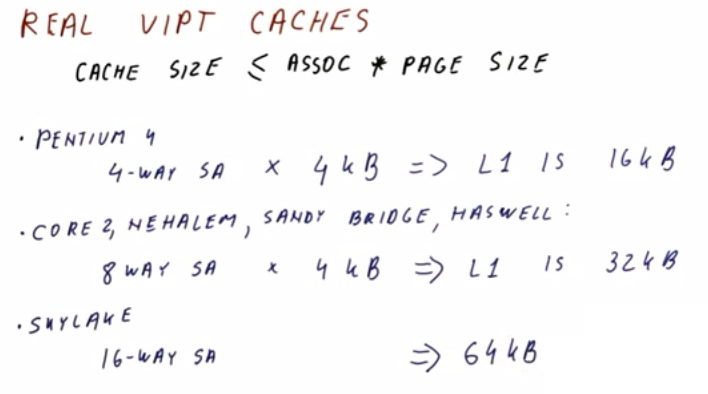
</center>

Recall (cf. Section 10 quiz) that the cache size is effectively limited as follows:

```
cache size ≤ associativity × page size
```

Correspondingly, observe the following characteristics of actual Intel processors series and their respective caches (ordered from oldest to most recent processors series from top to bottom, respectively):

| Processors Series | Set Associativity | Page Size | Level 1 (L1) Cache Size |
|:--:|:--:|:--:|:--:|
| Pentium 4 | 4-way | `4 KB` | `16 KB` |
| Core 2, Nehalem, Sandy Bridge, Haswell | 8-way | `4 KB` | `32 KB` |
| Skylake | 16-way | `4 KB` | `64 KB` |

## 12-14. Associativity and `Hit Time`

### 12. Introduction

As another method for reducing `Hit Time`, let us now revisit the relationship between the associativity and the `Hit Time`.

<center>
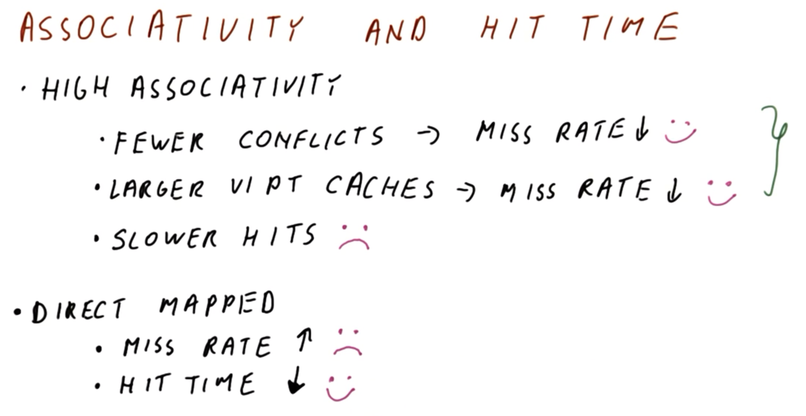
</center>

A ***high associativity*** in the cache gives rise to the following:
  * ***Fewer*** conflicts for a given set in the cache when multiple blocks map to this same set → ***Reduced*** `Miss Rate`
    * This is a desirable property
  * ***Larger sized*** virtually indexed, physically tagged (VIPT) cache (cf. Section 10) → ***Reduced*** `Miss Rate`
    * This is a desirable property
  * Slower hits → ***Increased*** `Hit Time`
    * This is an undesirable property

Conversely, consider the corresponding (complementary) implications of a ***direct-mapped cache***:
  * Increased conflicts and smaller sized virtually indexed, physically tagged (VIPT) caches  → ***Increased*** `Miss Rate`
    * This is an undesirable property
  * Faster hits → ***Decreased*** `Hit Time`
    * This is an desirable property

Therefore, there is a corresponding ***trade-off*** with respect to associativity and `Hit Time` (in particular, it undesirably increases with associativity level as a consequence of otherwise improved/reduced `Miss Rate`). Next, we will examine if this trade-off can be reconciled (i.e., decrease the `Miss Rate` without otherwise increasing the `Hit Time`, by slightly "cheating" with respect to the associativity).

### 13. Way Prediction

<center>
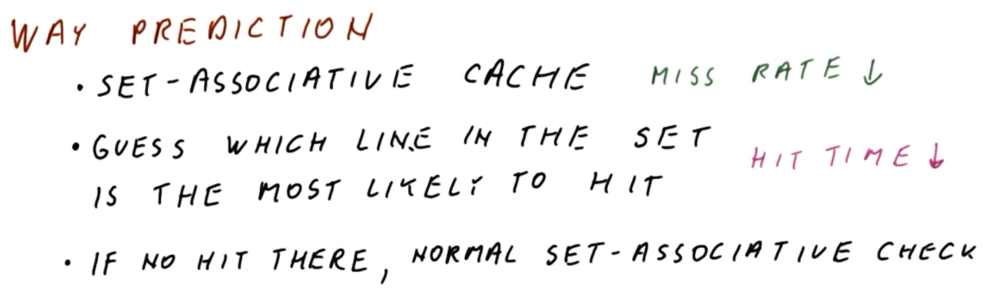
</center>

One way to "cheat" with respect to a cache's set-associativity is via **way prediction**.

Starting with a set-associative cache, which recall (cf. Section 12) is characterized by a relatively low `Miss Rate` but correspondingly relatively high `Hit Time`, it is then ***guessed*** which cache line in the set is most likely to hit.
  * For this purpose, the ***index bits*** can be used to determine which set should be examined accordingly, and then consequently rather than reading out ***all*** of the tags in that line to determine which line hits, instead it is guessed which line is ***most likely*** to hit and then that line is checked accordingly.
  * With this approach, this yields an access time which is more similar to a direct-mapped cache, provided that the guess is ***correct***.

Conversely, if there is ***no*** hit (i.e., the guess is ***incorrect***), then the fallback measure is to perform a normal set-associative check, with the correspondingly higher `Hit Time`.

With this scheme, the ***overall premise*** is that the `Miss Rate` is commensurate with that of a set-associative cache (i.e., relatively low), while the `Hit Time` is commensurate with that of a direct-mapped cache (i.e., relatively low), provided that the guesses are mostly correct to ensure this latter direct-mapped-cache-like behavior.

### 14. Way Prediction Performance

So, then, how often can it be expected to "guess correctly" in a way prediction cache?

<center>

</center>

We can formulate an intuition around this question by examining a relatively small direct-mapped cache, as in the figure shown above. Here, consider a two-way set-associative cache, with each cache set being correspondingly composed of two cache lines. By performing way prediction, we are effectively using only ***one*** of these cache lines initially (and only if the target data is not found there, will the search then proceed onto the other cache line).

Therefore, in way prediction, the (otherwise set-associative) cache is treated effectively as a (smaller) direct-mapped cache (i.e., the initially searched cache line), and only upon unsuccessful search (via corresponding incorrect guess) does the search consequently expand to the entire set-associative cache.

<center>

</center>

Correspondingly, the `Hit Rate`, `Hit Latency`, etc. can be examined in the context of a way prediction cache as a "first-order approximation" with respect to the direct-mapped cache and set-associative cache, as follows:

| Characteristic | `32 KB`, 8-way set-associative | `4 KB` direct-mapped* | `32 KB`, 8-way set-associative with way prediction |
|:--:|:--:|:--:|:--:|
| `Hit Rate` | `90%` | `70%` (lower than set-associative) | `90%`** |
| `Hit Latency` | `2 cycles`| `1 cycle` (faster than set-associative) | `1 cycle` (direct-mapped for correctly guessed) or `2 cycles` (set-associative for incorrectly guessed)  |
| `Miss Penalty` | `20 cycles` | `20 cycles` (same as set-associative) | `20 cycles` |
| `AMAT` (average memory access time) | `4` (`= 2 + (1 - 0.90) × 20`) | `7` (`= 2 + (1 - 0.70) × 20`) | `3.3` (`= [(0.70 × 1) + (0.30 × 2)] + (1 - 0.90) × 20]`) |
  * ****N.B.*** With respect to the `4 KB` direct-mapped cache, this is the equivalent of a way-prediction-like cache (i.e., accessing one of the cache lines, which is effectively a `32 KB / 8 = 4 KB` subset for a corresponding 8-way set-associative cache). Furthermore, with correspondingly added way prediction, there is an attempt to guess *which* particular cache line will contain the block in question.
  * *****N.B.*** With respect to the `Hit Rate` of the `32 KB`, 8-way set-associative with way prediction cache, `70%` of the time the data will be found in the (effectively) direct-mapped cache (i.e., `4 KB` subset) with corresponding `1 cycle` of `Hit Latency`; however, in the remaining `30%` of the time, the rest of the cache will be checked in a set-associative manner, thereby giving an overall (i.e., effective) `Hit Rate` of `90%` (i.e., any incorrect guesses will ultimately be resolved via the full `32 KB` set-associative cache).

Comparing the `32 KB`, 8-way set-associative cache ***without*** way prediction to the `4 KB` direct-mapped cache, overall the `AMAT` is better with respect to the former (i.e., set-associative), however, there is an additional-cycle penalty (i.e., higher `Hit Latency`) in order to achieve the correspondingly lower `Miss Penalty`.

Furthermore, observe that the `32 KB`, 8-way set-associative cache ***with*** way prediction has the lowest overall `AMAT` between the three compared caches, by virtue of the following ***compounded effects***:
  * The `Hit Rate` of the set-associative cache
  * The (amortized) `Hit Latency` of the (correctly guessed) direct-mapped cache

## 15. Way Prediction Quiz and Answers

<center>
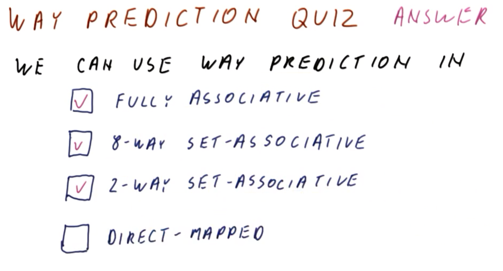
</center>

What kind of cache can way prediction be used for? (Select all that apply.)
  * Fully-associative
    * `APPLIES`
  * 8-way set-associative
    * `APPLIES`
  * 2-way set-associative
    * `APPLIES`
  * Direct-mapped
    * `DOES NOT APPLY`

***Explanation***:

By definition, way prediction can be used in any cache that has more than one block per cache set. Therefore, this precludes a direct-mapped cache, which is comprised of only one block per cache set. A direct-mapped cache already inherently "knows" which block will be accessed a priori (i.e., the only one that is available to it). Otherwise, in set- and fully-associative caches, the benefit conferred on the cache via way prediction is correspondingly (correctly) guessing the particular cache block of interest.

## 16-18. Replacement Policy and `Hit Time`

### 16. Introduction

Next, consider how the **replacement policy** for the cache impacts the `Hit Time`.
  * ***N.B.*** Recall (cf. Lesson 12) that the replacement policy dictates the choice of which block to eject from the cache when more room is needed in the cache.

<center>
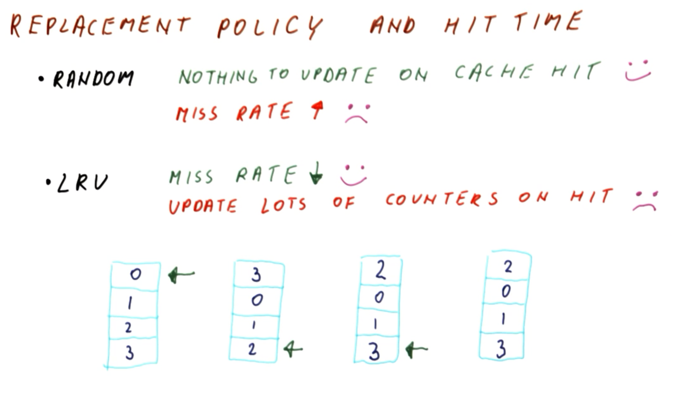
</center>

A simple such replacement policy, such as **random** replacement (i.e., randomly selecting among the blocks in the set to be replaced), has nothing to update on a cache hit (i.e., on cache hit, there is no additional action necessary in order to subsequently perform a random replacement, however, on cache miss, there is a consequent action via random selection of the block to be ejected). This results in ***faster*** hits, due to the relatively low overhead of a cache hit. However, a random replacement policy has a deleterious effect on `Miss Rate` (i.e., generally increases it), because it oftentimes involves ejecting blocks which will otherwise be needed soon.

Conversely, a **least recently used (LRU)** replacement policy yields a lower `Miss Rate` (which is desirable), however, this comes at the expense of higher overhead (i.e., ***more*** power consumption and ***slower*** hits) due to necessitating the update of (potentially many) counters, even on cache hits (even if the resulting action is no update to the counters for a given cache hit).

<center>
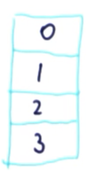
</center>

To further illustrate a cache hit occurring in a least recently used (LRU) replacement policy, consider a four-way set-associative cache whose counters are currently set to `0`, `1`, `2`, and `3` (respectively), as in the figure shown above.

<center>

</center>

If the processor accesses the block initialized to `0` and there is a cache hit (as in the figure shown above), then the counters will update accordingly. Correspondingly, all of these counter updates occur even when such a cache hit occurs, thereby incurring overhead accordingly (whereby a cache hit generally incurs a cost of updating up to `n` counters per cache hit, where `n` is the level of associativity in the cache, e.g., `4` in this particular case).

<center>
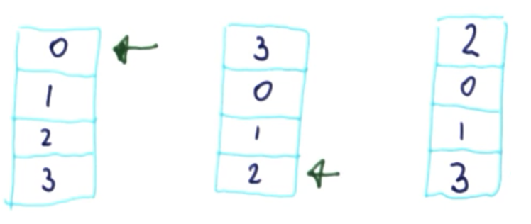
</center>

Now consider an access of one of the relatively more recently used (i.e., next-most recently used) cache blocks (as in the figure shown above), also resulting in a cache hit. As before, the counters update accordingly, in this case with only two of the counters having updated values. Despite this, it is still necessary to check *all* of the counters regardless to update corresponding state accordingly.

<center>
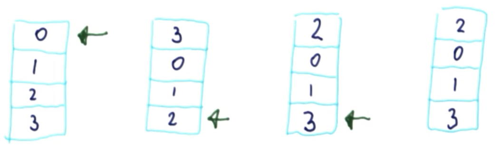
</center>

As expected, accessing the most recently used cache block (as in the figure shown above) similarly incurs a cost of checking/updating *all* of the corresponding cache blocks' counters, despite *none* of the counters changing/updating their constituent values in this case.

Therefore, it is ***desirable*** to have a replacement policy characterized as follows:
  * A low `Miss Rate` akin to a least recently used (LRU) cache (i.e., sensibly replacing the blocks in a manner which only ejects blocks that are unlikely to be used soon)
  * Reduced overhead (e.g., counters updates) on a per-cache-hit basis

### 17. Not Most Recently Used (NMRU) Replacement Policy

<center>
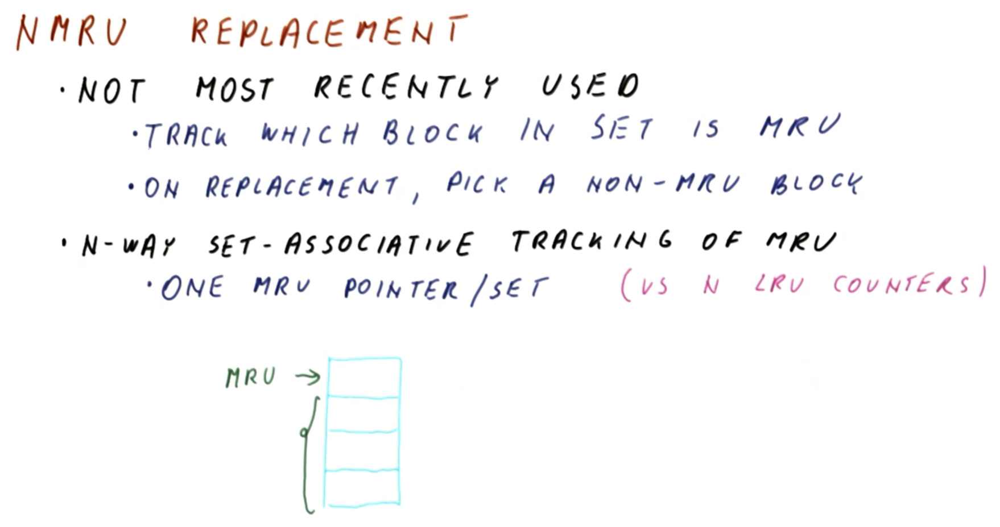
</center>

One so called least recently used (LRU) approximation algorithm is the **not most recently used (NMRU)** replacement policy, intended to provide further optimization of the performance/properties of the replacement policy.

The not most recently used (NMRU) replacement policy attempts to *approximate* the performance of the least recently used (LRU) replacement policy without incurring the full overhead (i.e., per-cache-hit) of the latter. The not most recently used (NMRU) replacement policy works as follows:
  * Track which particular block in the cache set is the most recently used block at any given time
  * Subsequently, when a replacement is necessary, select a block for ejection which is another block (i.e., one which is ***not*** the most recently used block), e.g., via random selection or other policy

In order to track the not most recently used block in this manner, given an ***n*-way set-associative cache**, a corresponding not most recently used (NMRU) replacement policy tracks the most recently used block for each cache set via a ***single*** most recently used **pointer** per cache set (e.g., in a 2-way set-associative cache, only one bit is necessary to uniquely identify which of the two sets is the most recently accessed; in a 4-way set-associative cache, a two-bit pointer is necessary to uniquely identify which of the four sets is the most recently accessed; and so on).
  * cf. In an *n*-way set-associative cache using a "naive" least recently used (LRU) replacement policy, the full ***n***-sized counters per cache set are required to track ***all*** of the cache sets at any given time (cf. Section 16) (e.g., a 4-way set-associative cache requires *four* two-bit counters). Therefore, a not most recently used (NMRU) replacement policy correspondingly reduces the overhead to `log_2(n)` such counters, relative to `n` counters in an equivalent least recently used (LRU) replacement policy.

It turns out that the not most recently used (NMRU) replacement policy works reasonably well.
  * The not most recently used (NMRU) replacement policy has a `Hit Rate` that is slightly lower than an equivalent least recently used (LRU) replacement policy, however, this small concession otherwise provides a reduction in the `Hit Time` (i.e., reduction from `2` cycles to `1` cycle).

A key ***disadvantage*** of the not most recently used (NMRU) replacement policy is that although it prevents the most recently accessed cache line from being evicted, it does not provide any additional discernment with respect to the order of the remaining not-most-recently-used cache blocks (i.e., in particular, which of these would be the next-most-recently-used candidates to avoid otherwise ejecting prematurely).

Correspondingly, a possible alternative to this replacement policy would be characterized as follows:
  * Still simpler than the least recently used (LRU) replacement policy with respect to "blocks accounting" overhead
  * Keeps better track of the not-most-recently-used blocks relative to the not most recently used (NMRU) replacement policy

Such a possible alternative is described next.

### 18. Pseudo Least Recently Used (PLRU) Replacement Policy

<center>
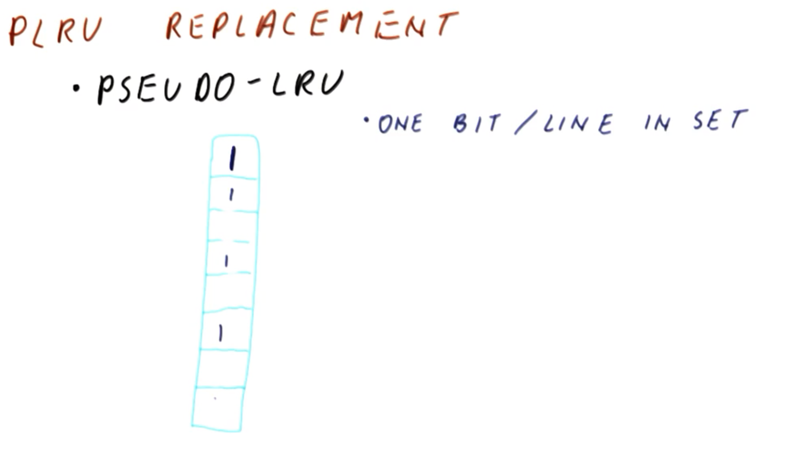
</center>

The **pseudo least recently used (PLRU)** replacement policy is one such replacement policy which attempts to more closely approximate the least recently used (LRU) replacement policy. The pseudo least recently used (PLRU) maintains ***one*** bit per line in the cache set.

<center>
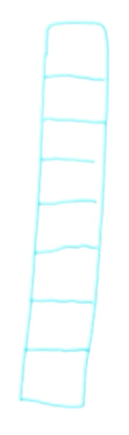
</center>

Consider an 8-way set-associative cache (as in the figure shown above), which has one bit per line (cf. `log_2(8) = log_2(2^3) = 3 bits` required for a comparable least recently used [LRU] replacement policy), with each bit initialized to `0`.

<center>
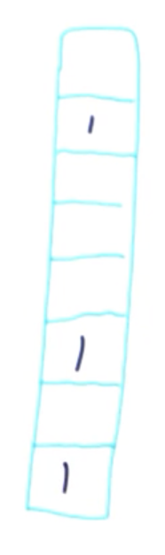
</center>

Subsequently, as a given line(s) is accessed, its corresponding bit is set to `1` (as in the figure shown above). As long as there are remaining `0` bits, this process continues. Furthermore, whenever it is necessary to replace a block, one of those among the `0`s is chosen for this purpose (i.e., ejection). In this manner, the `1` bits correspondingly track the most recently used blocks (i.e., otherwise sparing them from ejection/replacement at any given time).

<center>
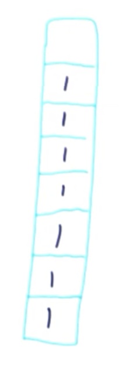
</center>

As cache hits accumulate, correspondingly the `1` bits will accumulate accordingly (as in the figure shown above).

<center>
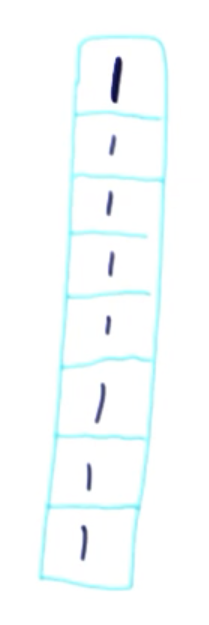
</center>

Eventually, all of the lines will be set to `1` (as in the figure shown above). At this point, there are no `0`s remaining for replacement.

<center>
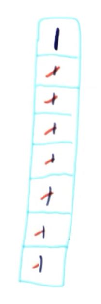
</center>

<center>

</center>

When this state is detected (i.e., the last remaining `0` bit has been changed to `1`), the remaining bits are consequently zeroed out accordingly as (in the figures shown above). This effectively yields a new state reminiscent of that provided by the not most recently used (NMRU) replacement policy (cf. Section 17), i.e., only the most recently used block is current identified with correspondingly set `1` bit, while the remaining blocks are effectively selected randomly on necessary replacement.

<center>
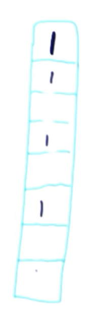
</center>

However, as other blocks are subsequently accessed and correspondingly set to `1` accordingly (as in the figure shown above), a better sense is developed with respect to which particular blocks are more recently vs. less recently used.

Correspondingly, at any given time, the pseudo least recently used (PLRU) replacement policy behaves somewhere ***"in between"*** the not most recently used (NMRU) (one block having its bit set to `1`) and least recently used (LRU) (all blocks having their bit set to `1` except for the last-pending still set to `0`) replacement policies. This is achieved by an intermediate level of tracking bits relative to each of these "extremes" (i.e., more than not most recently used [NMRU], but less than least recently used [LRU]); however, on cache hit, it is only necessary to set *one* corresponding bit for the block in question (which can be achieved relatively quickly and efficiently), thereby still providing relatively low overhead compared to the least recently used (LRU) replacement policy.
  * ***N.B.*** In the special case of all but one block set to `1`, this is a "true least recently used (LRU) replacement policy," in the sense that it is *exactly* deterministic which particular block is least recently used (i.e., that with the remaining `0` bit).

Therefore, on cache hit, both not most recently used (NMRU) and pseudo least recently used (PLRU) replacement policies entail relatively "low activity" on a per-cache-hit basis compared to an equivalent least recently used (LRU) replacement policy.

## 19. Not Most Recently Used (NMRU) Replacement Policy Quiz and Answers

<center>
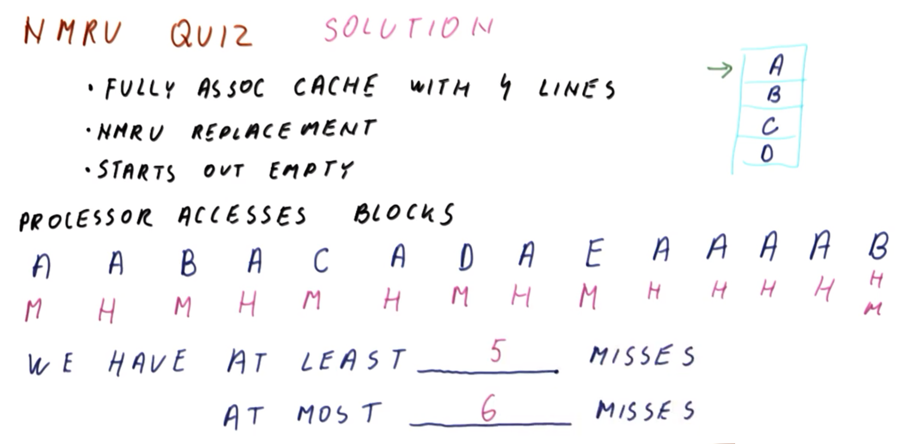
</center>

Consider a cache characterized as follows:
  * Fully-associative with `4` cache lines
  * Not most recently used (NMRU) replacement policy
  * Initialized as "empty" (i.e., none of the `4` cache lines contain blocks)

Furthermore, suppose that the processor accesses the blocks in the following order:

```
A A B A C A D A E A A A A B
```

Given this information, what is the least number of possible cache misses in this sequence of accesses?
  * `5`

And what is the largest number of possible cache misses?
  * `6`

***Explanation***:

The initial access is a miss, because the cache is initialized as empty:

```
A A B A C A D A E A A A A B
M
```
* ***N.B.*** Here `M` denotes a cache *m*iss (and similarly `H` will be used to denote a cache *h*it).

The subsequent access is then correspondingly a hit:

```
A A B A C A D A E A A A A B
M H
```

The subsequent access is a miss:

```
A A B A C A D A E A A A A B
M H M
```

<center>
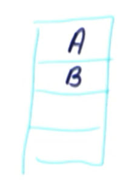
</center>

Here, `B` is placed in a separate line (i.e., among the remaining unused `3`) within the cache from that of `A`, since `A` is the most recently used block immediately prior to placement of `B` into the cache. Furthermore, this implies that `A` still remains in the cache. The corresponding cache configuration in this state is as in the figure shown above.

The subsequent access is a hit:

```
A A B A C A D A E A A A A B
M H M H
```

<center>
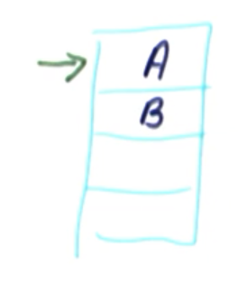
</center>

The corresponding state (as in the figure shown above) is such that `A` is the most recently used block.

The subsequent access is a miss:

```
A A B A C A D A E A A A A B
M H M H M
```

With respect to placement of `C` within the cache, it appears as though `B` may be a candidate for replacement (i.e., due to not being the most recently used). However, note that there are still ***valid bits*** used to track *all* of the blocks. Correspondingly, typically the replacement policy will account for this by first filling all lines in the cache set (i.e., without particular regard to least-recent vs. most-recent usage) prior to commencing with block evictions.

<center>
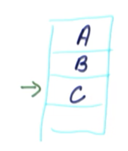
</center>

Therefore, `C` is placed in one of the (immediately prior to placement) empty blocks, with the most-recently-used pointer correspondingly updated accordingly (as in the figure shown above).

The subsequent access is a hit:

```
A A B A C A D A E A A A A B
M H M H M H
```

<center>
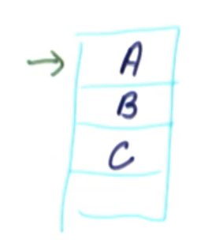
</center>

The correspondingly updated cache state is as in the figure shown above.

The subsequent access is a miss:

```
A A B A C A D A E A A A A B
M H M H M H M
```

<center>
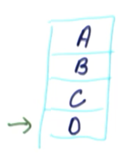
</center>

The correspondingly updated cache state is as in the figure shown above.

The subsequent access is a hit:

```
A A B A C A D A E A A A A B
M H M H M H M H
```

<center>
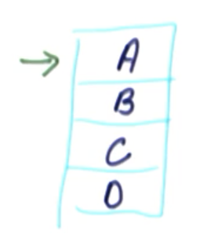
</center>

The correspondingly updated cache state is as in the figure shown above.

The subsequent access is a miss:

```
A A B A C A D A E A A A A B
M H M H M H M H M
```

Now, the question is: Which block will be evicted at this point? Given the most recent state immediately prior to cache miss via `E`, by inspection, `A` (which is the most recently used block up to that point) will *not* be evicted, and therefore the subsequent accesses will all be hits (with corresponding setting of the most recently used pointer to `A` accordingly), i.e.,:

```
A A B A C A D A E A A A A B
M H M H M H M H M H H H H
```

Now with respect to `E` (i.e., immediately prior to the final access of `B`), there are two possibilities per its initial upstream access:
  * It replaces either `C` or `D`, thereby resulting in a *hit* on final access of `B`
  * It replaces `B`, thereby resulting in a *miss* on final access of `B` (i.e., due to its ejection previously in order to replace with `E` accordingly)

Correspondingly, the least possible amount of misses for this sequence would be `5` (i.e., assuming `B` was *not* ejected), otherwise the most possible amount of misses for this sequence would be `6` (i.e., assuming `B` *was* indeed ejected).

## 20. Reducing the Average Memory Access Time (`AMAT`)

Let us now return to consideration of reducing the average memory access time (`AMAT`) (cf. Section 2).

<center>

</center>

As demonstrated thus far in this lesson, the average memory access time (`AMAT`) can be reduced via the following:
  * Reduce the `Hit Time`
    * Discussed in the preceding sections of this lesson
  * Reduce the `Miss Rate`
    * To be discussed presently

<center>
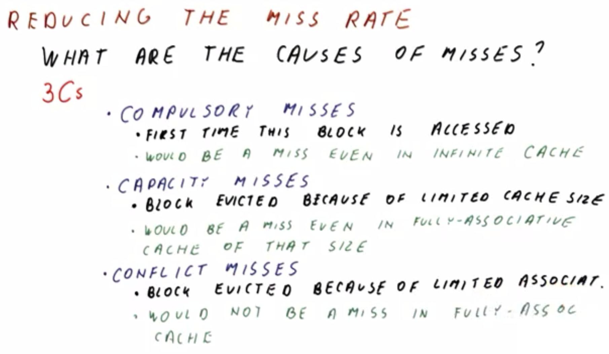
</center>

In order to reduce the `Miss Rate`, it first must be understood what ***causes*** the cache misses. The corresponding causes of cache misses can be summarized as the ***"three Cs (3 Cs)***, as follows:

| Cause | Description | Limiting Condition* |
|:--:|:--:|:--:|
| Compulsory Misses | A cache miss occurring on initial access of the cache block (i.e., this cache miss is "compulsory" because the cache must be "warmed up" first by corresponding placement into the block) | This cache miss ***would*** be incurred even in an ***infinite*** cache which is initialized to empty |
| Capacity Misses | A cache miss resulting from eviction of a block due to limited cache size (i.e., the block in question was otherwise relatively recently used, but nevertheless was necessarily ejected due to cache capacity limits) | This cache miss ***would*** be incurred even in a ***fully-associative*** cache of corresponding (capacity-limited) size (e.g., given an `8 KB` direct-mapped cache, a capacity miss would still occur in a corresponding fully-associative `8 KB` cache if the block is not found in the cache) |
| Conflict Misses | A cache miss resulting from a conflict within a given cache set (i.e., eviction is not due to capacity, but rather due to limited associativity resulting in a corresponding ejection/replacement) | This cache miss ***would not*** be incurred otherwise in an equivalent fully-associative cache (i.e., of the same size/capacity) |
* ****N.B.*** The limiting conditions here are specified in descending order of cache size and associativity.

Correspondingly, some of the obvious techniques for reducing the `Miss Rate` will therefore target these causes, for example:
  * A larger cache will generally help to reduce the number of capacity misses
  * A larger set-associativity will generally help to reduce the number of conflict misses
  * A better replacement policy will generally help to reduce the number of conflict misses

However, note that all of these prospective techniques will also correspondingly impact the `Hit Time`. The following sections will therefore explore techniques which attempt to reduce `Miss Rate` without corresponding (undesirable) increase of `Hit Time`.

## 21. Larger Cache Blocks

<center>

</center>

The first technique for reducing the `Miss Rate` is to simply use ***larger*** cache blocks.

Larger cache blocks facilitate with reducing the `Miss Rate` because generally more words are brought in on cache miss, and therefore subsequent accesses might access these additional words (which otherwise may not have been brought in) thereby yielding subsequent cache hits (i.e., rather than cache misses).
  * While this does ***reduce*** the `Miss Rate`, that is only strictly the case when **spatial locality** is ***good***.
  * Otherwise, when **spatial locality** is ***poor***, then the `Miss Rate` will actually ***increase***.
    * This is because when the target word is brought in along with additional words which are *not* otherwise relevant (i.e., for subsequent accesses), then the cache effectively has a lower capacity due to being populated with "garbage data," resulting in subsequent ***capacity misses***.

Examining the plot of `Miss Rate` vs. `Block Size` (as in the figure shown above), observe the following general ***trends***:
  * A ***small cache*** starts with a relatively high `Miss Rate` and then decreases with increasing `Block Size` down to a minimum. Beyond this minimum, the `Miss Rate` eventually increases as the amount of spatial locality supported by the cache is exhausted.
    * For example, a `4 KB` cache will have an optimal (i.e., minimized) `Miss Rate` at a `Block Size` of `64`.
  * A ***large cache*** starts with a relatively low `Miss Rate` and continues to decrease with increasing `Block Size` (past the minimum `Block Size` of the relatively smaller cache) until eventually reaching a minimum. Eventually, the `Miss Rate` also increases beyond this optimizing (i.e., minimizing) `Block Size`.
    * For example, a `256 KB` cache will have an optimal (i.e., minimized) `Miss Rate` at a `Block Size` of `256`.

The corresponding trends with respect to `Miss Rate` vs. `Block Size` are a direct consequence of the level of "garbage data" present relative to the overall size/capacity of the cache. In particular, certain blocks will inherently have more spatial locality than others, and this effect is amplified by the size of the cache itself (i.e., the amount of "usable spatial locality" will generally be "maxed out sooner" by a relatively smaller cache, all else equal).

Therefore, the overall `Miss Rate` can be reduced in this manner (particularly in a relatively large cache) by increasing the `Block Size` accordingly.

## 22. `Miss Rate` Quiz and Answers

<center>

</center>

Having now seen that increasing `Block Size` can reduce the `Miss Rate` (cf. Section 21), which types of misses are reduced in this manner? (Select all that apply.)
  * Compulsory
    * `APPLIES`
  * Capacity
    * `APPLIES`
  * Conflict
    * `APPLIES`

***Explanation***:

<center>

</center>

With respect to ***compulsory misses***, consider a small-block-size cache memory (as in the figure shown above), into which two blocks are brought in with corresponding (compulsory) misses incurred.

<center>

</center>

Now, consider bringing in another block which also incurs a (compulsory) miss (as in the figure shown above).
  * If the cache line size were twice of what it is currently, then this would *not* have been a cache miss, because it would have already been present within the cache block from the previous fetch of the first one (i.e., via corresponding spatial locality).
  * However, for a small `Block Size`, this spatial locality cannot be exploited, resulting in a(n otherwise unnecessary) compulsory miss.

Therefore, increasing the `Block Size` (assuming there is sufficient spatial locality) will generally reduce compulsory misses, all else equal.
  * ***N.B.*** Another way to understand this is to note that a compulsory miss occurs whenever a given block is accessed for the very first time; therefore, all else equal, a larger `Block Size` generally yields fewer blocks (i.e., for a given-size cache), correspondingly reducing the number of such blocks that will be accessed "for the very first time" in this manner (assuming there is sufficient spatial locality, that is).

<center>

</center>

With respect to ***capacity misses***, consider a program accessing a relatively large array that does not fit in the cache (as in the figure shown above), and that the array is subsequently accessed again. On the second round of accesses, capacity misses will occur.
  * The first round of accesses were compulsory misses incurred while populating the cache with the corresponding array data.
  * Furthermore, because the data does not fit in the cache, by the time the end of the array is accessed, the beginning-array elements are ejected from the cache, resulting in capacity misses on subsequent access(es) of the array.

Therefore, the capacity itself is causing the corresponding misses in this scenario (i.e., an otherwise infinite-capacity cache would ***not*** similarly incur these cache misses, all else equal). Furthermore, the extent of these misses occurring will also on the `Block Size` itself (i.e., with smaller `Block Size`, the same-sized array will occupy more blocks, whereas with a larger `Block Size`, the same-sized array will occupy fewer blocks; correspondingly, the number of cache misses will correspond equally to the number of blocks).
  * Accordingly, increasing the `Block Size` yields a corresponding decrease in `Miss Rate` (assuming better spatial locality is achieved), by direct reduction of capacity misses.

Lastly, with respect to ***conflict misses***, a similar scenario can be considered, whereby two blocks "kick each other out" on subsequent accesses. Similarly, if the `Block Size` is increased (and correspondingly a larger block is fetched on a per-access basis), then this will directly reduce conflict misses accordingly.

In conclusion, increasing `Block Size` can reduce `Miss Rate` with respect to all three types of cache misses, provided that sufficient spatial locality is correspondingly achieved.
  * The compulsory misses will practically always decrease with increasing `Block Size`
  * The capacity misses will typically decrease with increasing `Block Size`, provided there is improved spatial locality with increasing `Block Size`
  * The conflict misses will likely decrease with increasing `Block Size`, or might otherwise yield a comparable `Miss Rate`

## 23-26. Prefetching

### 23. Introduction

<center>
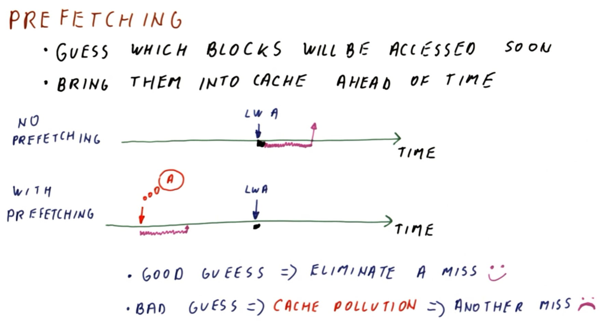
</center>

Another technique, which leverages a similar idea (cf. Section 21) to increasing the `Block Size` in order to reduce the `Miss Rate`, is called **prefetching**. Prefetching involves guessing which blocks will be accessed soon (i.e., before actually being accessed), and consequently fetching those blocks into the cache "ahead of time" (i.e., immediately prior to their actual use in the program).

<center>

</center>

With ***no*** prefetching (as in the figure above), an access operation (e.g., `LW A`) results in a corresponding fast check of the cache.

<center>

</center>

If the data is ***not*** present in the cache (as in the figure shown above), then this incurs an additional cost to retrieve the corresponding data from memory, which eventually returns the data for subsequent use by the processor.

<center>
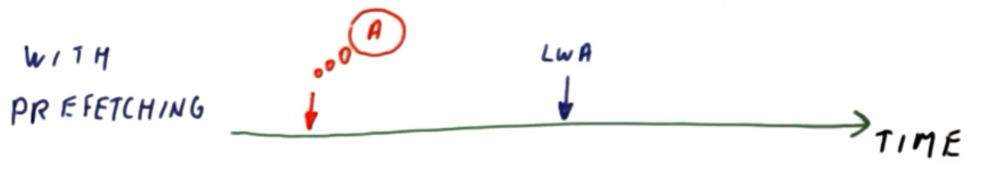
</center>

Conversely, ***with*** prefetching (as in the figure shown above), prior to the operation itself (i.e., `LW A`), it can be guessed that the data in question (i.e., operand `A`) will be accessed imminently.

<center>
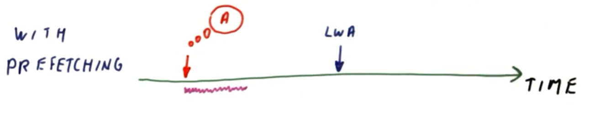
</center>

Correspondingly, the data in question is prefetched into the cache from memory prior to its use (as in the figure shown above).

<center>
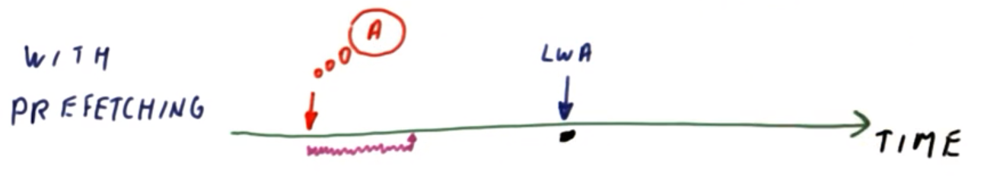
</center>

On execution of the operation (as in the figure shown above), the data is now available in the cache, and consequently there is no additional cost/penalty incurred on execution, which now only involves the rapid access of the cache data (i.e., the memory-access latency is otherwise "hidden" in the upstream access from memory, prior to executing the operation itself).

Therefore:
  * If the guess is ***correct***, then this effectively yields a ***cache hit*** (i.e., at the point of execution)
  * Conversely, if the guess is ***incorrect***, then a corresponding ***cache miss*** will result, along with corresponding **cache pollution** (i.e., retrieving otherwise "garbage data," which is not relevant to near-future program execution, and which may also correspondingly eject data on replacement of otherwise useful data already present in the cache immediately prior to ejection, thereby potentially inducing additional cache misses with respect to the now-ejected but "otherwise useful" data).

Overall, prefetching is effective when ***good guesses*** can be made to eliminate cache misses, but correspondingly requires elimination of ***bad guesses*** to avoid inducing undesirable behavior of the cache (i.e., cache pollution).

### 24. Prefetch Instructions

<center>
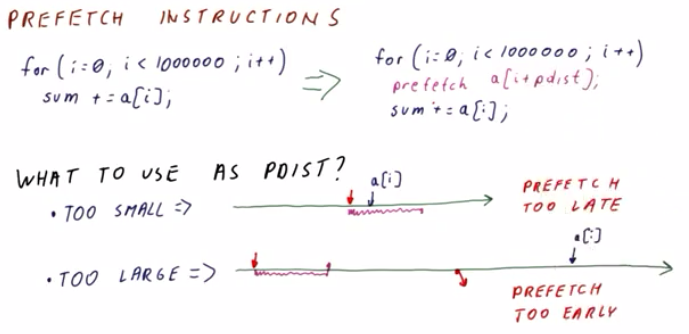
</center>

One way to implement prefetching is to simply add **prefetching instructions** to the instruction set, and thereby allow the compiler/programmer to determine when to request prefetches accordingly.

For example, consider the following C program fragment which adds up the elements of a large array:

```c
for (int i = 0; i < 1000000; i++)
  sum += a[i];
```
* ***N.B.*** This program fragment will access the array elements sequentially, thereby having a lot of spatial locality, however, it will not have much temporal locality; correspondingly, the program will incur a lot of cache misses due to the large size of the array.

With available prefetching instructions, this program fragment can be transformed as follows:

```c
for (int i = 0; i < 1000000; i++)
  prefetch a[i + pdist]; // access a "future" element, where `pdist >= 1`
  sum += a[i];
```

One of the pertinent questions for this transformation is as follows: What value should `pdist` be, in order to optimize prefetching (i.e., how far in advance should prefetching be performed)?

<center>
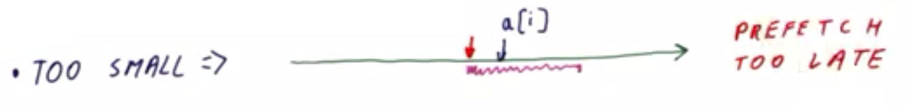
</center>

If `pdist` is ***too small*** (e.g., only `1`, as in the figure shown above), then relative to the the access operation (i.e., `a[i]`), the prefetch occurs in the a "nearby" upstream iteration (e.g., the previous iteration, in the case of `pdist == 1`), and consequently the prefetch's memory latency will "spillover" into the cache access itself, thereby still incurring (a portion) of the latency itself (albeit slightly lower with this "head start," relative to commencing the memory access immediately following the access operation itself). Correspondingly, the prefetch in this case occurs ***"too late"*** relative to the access operation itself.

<center>
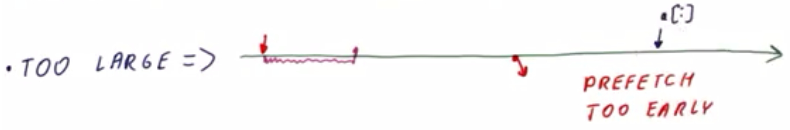
</center>

Conversely, if `pdist` is ***too large*** (e.g., as in the figure shown above), then relative to the the access operation (i.e., `a[i]`), the prefetch occurs in the a "distant" upstream iteration, and consequently the prefetch's memory latency will not "spillover" into the cache access itself, but rather it will populate the cache "prematurely" relative to when the data is actually useful to the operation itself. Furthermore, since subsequent access operations occur, it is likely that this prefetched data will be ejected during this time, before it can be effectively used by the target operation itself. Correspondingly, the prefetch in this case occurs ***"too early"*** relative to the access operation itself.

Therefore, it is not necessarily easy to "guess" how far in advance to prefetch in this manner.

Furthermore, if writing a program and modifying it to incorporate prefetching in this manner, it is possible that the optimal prefetching may vary across hardware generations as well (e.g., if the processor speed is improved, but not that of the memory itself, resulting ina processor which performs more iterations per-unit time with the same memory latency, thereby necessitating an increase in `pdist` accordingly). Consequently, it may additionally be difficult to optimize `pdist` itself in this manner "programmatically," as it is also dictated by the hardware itself.

### 25. Prefetch Instructions Quiz and Answers

<center>
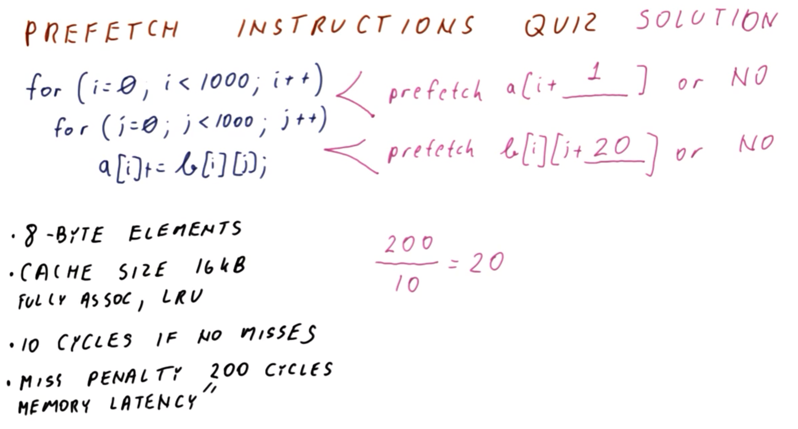
</center>

Consider the following C program fragment, wherein the elements of matrix `b` are summed into the elements of array `a`:

```c
for (int i = 0; i < 1000; i++)
  for (int j = 0; j < 1000; j++)
    a[i] += b[i][j];
```

With respect to both `a` and `b`, assuming that the constituent elements are floating-point elements, each of size `8 bytes`.

Furthermore, assume that the cache is characterized as follows:
  * `16 KB` total size
  * fully associative
  * least recently used (LRU) replacement policy

Lastly, with respect to the inner-loop iterations of the program fragment itself, assume the following:
  * A single iteration of the inner loop requires `10` cycles if there are ***no*** cache misses
  * Otherwise, the `Miss Penalty` is `200 cycles` in the event of a cache miss (i.e., due to memory latency required to fetch the data into the cache)

With respect to the ***outer*** loop, should a prefetch instruction be added here, and if so, for what corresponding size (i.e., what value `<...>` in `prefetch a[i + <...>]`)?
  * yes; `1`

And similarly, with respect to the ***inner*** loop, should a prefetch instruction be added here, and if so, for what corresponding size (i.e., what value `<...>` in `prefetch b[i][j + <...>]`)?
  * yes; `20`

***Explanation***:

Examining the ***inner*** loop first, note that each iteration requires `10` cycles if there are ***no*** cache misses, and furthermore there is a `200` cycles `Miss Penalty` in the event of a cache miss. Therefore, in order to prefetch optimally, the corresponding "upstream offset" should be `200 cycles per penalty / 10 cycles per iteration = 20 cycles`. At this critical point, the prefetch will arrive "just in time" for `b` to receive its value (i.e., immediately prior to its use).

To determine prefetching with respect to the ***outer*** loop (if applicable at all), it should first be noted that prefetching should ***not*** be done if by the time access of `a` is reached, it is already ejected from the cache (i.e., due to prefetching of `b`). Therefore, the pertinent question is: How much data is brought in per outer-loop iteration?
  * The answer to this is `1000` eight-byte elements of `b` and `1` eight-byte element of `a` per outer-loop iteration. Correspondingly, if prefetching with a distance of `1`, then this yields a prefetch which concludes after `200` cycles (cf. `10 cycles per instruction × 1000 instructions = 10000` cycles performed with respect to cache-hit `b` accesses), which is "in time" for the next iteration of the outer loop.
  * Furthermore, in assessing whether this element (i.e., `a[i + 1]`) would be ejected prior to its use, this would ***not*** be the case, because there is `8 bytes per element × 1000 elements = 8000 bytes` worth of data per inner-loop iteration (cf. cache size of `16 KB = 16000 bytes`), and therefore, on subsequent iteration of the outer loop, the prefetched data will still be present in the cache for its subsequent use.

***N.B.*** A prefetch of `a[i + 20]` is ***not*** appropriate for the outer loop. Since this entails `20` loops in between the prefetch and actual usage with respect to the outer loop, relative to the cache data with respect to `b` (i.e., `8000 bytes`), then this prefetch would exceed the size of the cache accordingly (i.e., `20 iterations × 8000 bytes per iteration = 160000 bytes`, relative to `16000 bytes` cache size), and correspondingly would likely result in "premature ejection" of the pertinent data prior to its actual use in the program.

### 26. Hardware Prefetching

<center>
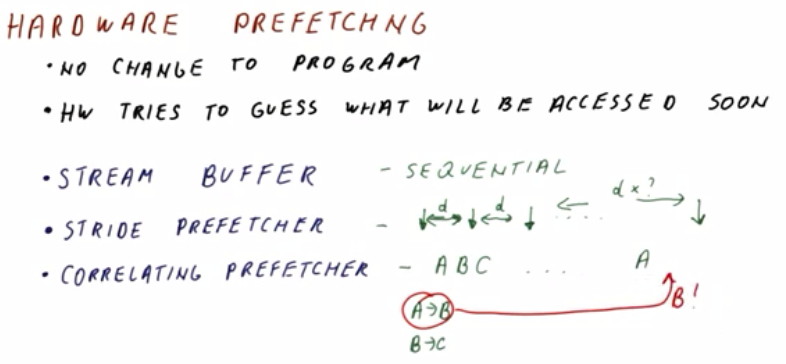
</center>

Another example of prefetching is so called **hardware prefetching**, whereby rather than changing the program, instead the ***hardware*** itself (i.e., the processor or the cache) attempts to guess which data will be accessed soon.

There are several such **hardware prefetchers** which work reasonably well, such as the following:
  * stream buffer
  * stride-based prefetcher
  * correlating prefetcher

All of these hardware prefetchers attempt to guess what data will be accessed next by the program, based on some type of ***locality property***.

A **stream buffer** is ***sequential*** in nature.
  * A stream buffer attempts to determine if once a block is accessed followed by the subsequent block, whether the subsequent block after that is similarly accessed in sequence, and so on.
  * Accordingly, a stream buffer essentially fetches several (sequential) blocks in advance to ensure "timely access" of the data.

<center>
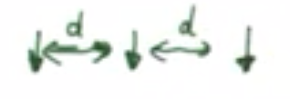
</center>

A **stride-based prefetcher** monitors accesses to determine if they occur at some fixed distance from each other (as in the figure shown above).

<center>
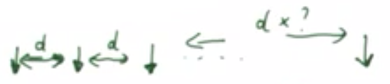
</center>

Correspondingly, if the addresses of the accesses do indeed differ by a fixed amount, then a stride-based prefetcher will simply prefetch "in advance" by some integer multiple of this fixed amount (as in the figure shown above), in order to ensure availability of the cache data "just in time" for use in the program itself.

Lastly, a ***correlating prefetcher*** attempts to predict access patterns which are neither sequential (cf. stream buffer) nor at a fixed-address distance (cf. stride-based prefetcher).

<center>
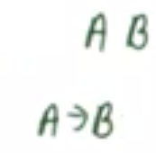
</center>

Given an initial pattern `A B` (as in the figure shown above), a correlating prefetcher notes this pattern accordingly (e.g., in a table or equivalent mechanism).

<center>
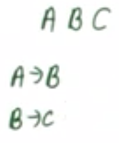
</center>

Subsequently, when `C` is accessed, this pattern is similarly recorded (as in the figure shown above).

<center>
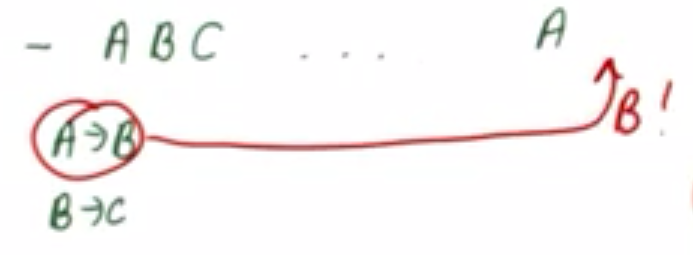
</center>

Proceeding in this manner, when `A` is once again encountered (as in the figure shown above), a correlated prefetcher will consequently prefetch `B`, based on the pattern it detected previously (and similarly, when `B` is subsequently encountered, it will prefetch `C`; and so on).

Correspondingly, a correlated prefetcher can prefetch an arbitrary sequence of accesses, provided that the pattern itself eventually repeats.
  * This is particularly advantageous for a structure such as a linked list, which is not necessarily stored in memory sequentially nor at fixed strides, but nevertheless inherently involves correlated access among the linked-list elements themselves (i.e., via following their constituent pointers, or equivalent linking mechanism).

## 27. Loop Interchange

<center>
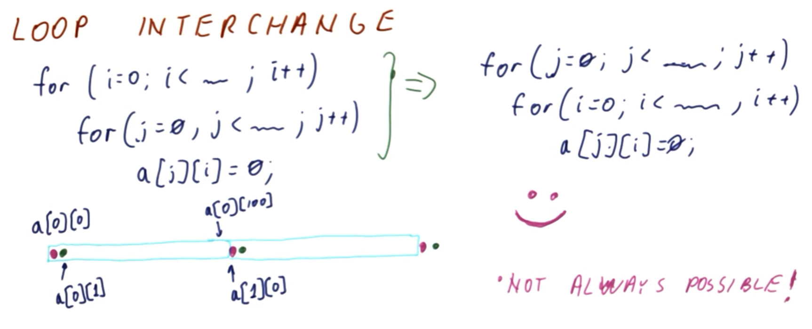
</center>

The final optimization with respect to reducing the `Miss Rate` we will examine in this lesson is the so called **loop interchange**. A loop interchange is one of the compiler optimizations that can be performed in order to transform the code into a form which has better locality.

Consider a C code fragment which initializes a matrix as follows:

```c
for (int i = 0; i < ...; i++)
  for (int j = 0; i < ...; j++)
    a[j][i] = 0;
```

<center>
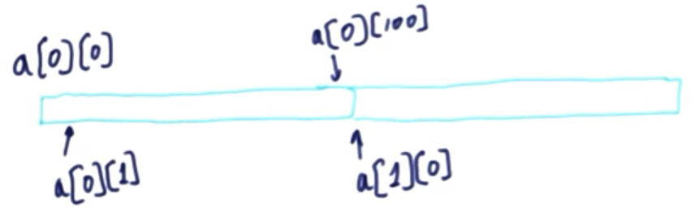
</center>

The layout of the memory for this code is as in the figure shown above.

<center>
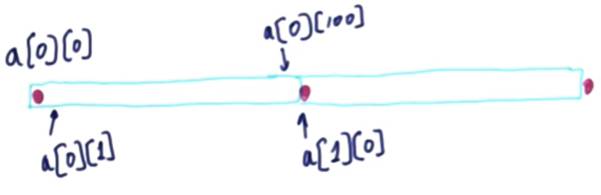
</center>

Initial accesses will proceed as in the figure shown above (i.e., with respect to outer-loop row index `i == 0` iterating from inner-loop column indices `j == 0` through `j == ...`)

<center>

</center>

Subsequent row access (i.e., `i == 1`) will proceed similarly, as in the figure shown above.

A ***problem*** occurs here, such that when accessing the initial-row data, an entire cache block worth of data is fetched pertaining ***only*** to this one row element (and similarly for subsequent column-data accesses for this row). By the time the end of the row is reached (i.e., immediately prior to iterating onto the next row), the cache capacity may already be exceeded; correspondingly, the initial-column data will likely have been ejected already by this point, resulting in one cache miss per column-data access throughout iteration over the rows.

To remedy this problem, a good compiler will detect the sub-optimal ordering of these loop-iterating expressions (i.e., with respect to the underlying memory layout for the corresponding matrix) and reorder them accordingly via **loop interchange**, e.g.,:

```c
for (int j = 0; i < ...; j++)   # previously inner loop, currently outer loop
  for (int i = 0; i < ...; i++) # previously outer loop, currently inner loop
    a[j][i] = 0;
```

Proceeding in this manner, the cache blocks are fetched on a row-major basis (i.e., for consequent column-wise iteration via the inner loop), thereby improving spatial locality accordingly (i.e., minimizing "destructive" cache ejections during inner-loop iteration). Additionally, this also improves sequential access, thereby facilitating the action of hardware prefetchers (cf. Section 26) accordingly.

Collectively, loop interchange provides a very good optimization, which dramatically improves the `Hit Rate`. However, note that it is not always possible to achieve (i.e., it cannot be simply applied "arbitrarily," but rather the compiler must first determine whether the initial code and post-loop-exchange code are semantically equivalent, including resolving any potential underlying dependencies among the loops).

## 28-29. Overlapping Cache Misses

### 28. Introduction

<center>

</center>

Returning to the possible strategies for reducing the **average memory access time (`AMAT`)** (cf. Section 2), we have seen thus far in this lesson techniques for reducing both the `Hit Time` and the `Miss Rate`.

<center>
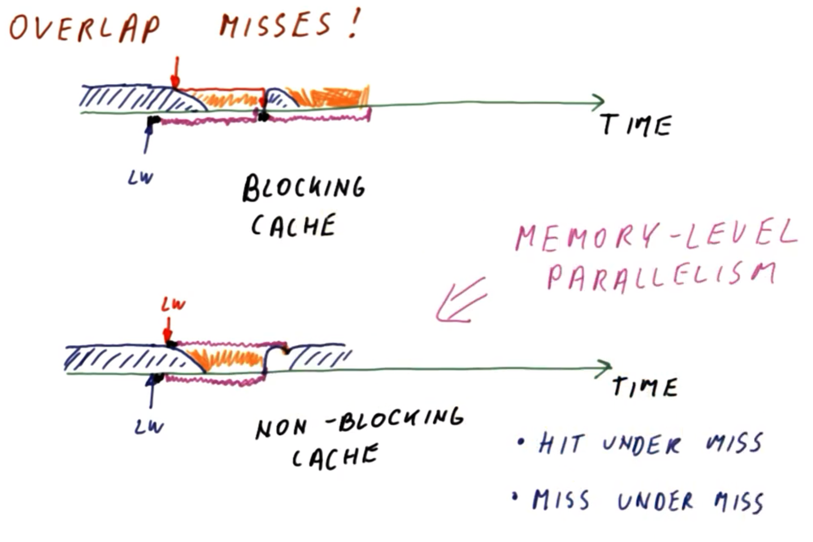
</center>

The final set of available techniques correspondingly focus on reducing the `Miss Penalty` (i.e., when a cache miss *does* occur, minimize the resulting incurred-cycles penalty accordingly).

<center>
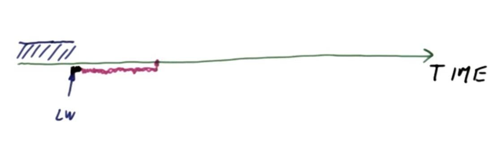
</center>

As time proceeds, the processor performs multiple instructions per cycle (as in the figure shown above), eventually performing a memory-access operation (e.g., `LW`), which in turn initiates a cache-access attempt. On cache miss, there is a corresponding `Miss Penalty` incurred as the data is fetched from memory accordingly.

<center>
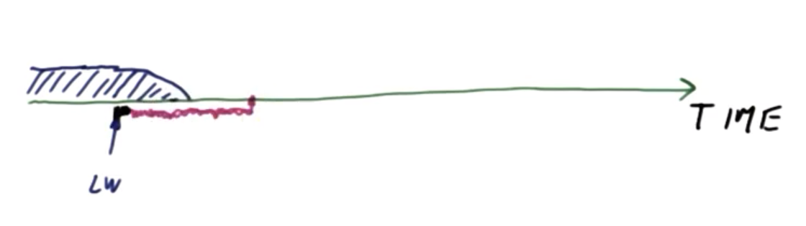
</center>

Given an appropriate out-of-order processor (as in the figure shown above), rather than blocking on this memory-access operation, it will still proceed with additional instructions while the memory access occurs in the background, though eventually it will run out of "useful work" to perform over this same time span (possibly exhausting prior to completed fetching of the data from memory).
  * ***N.B.*** The processor cannot yet commit this operation `LW` at this point, so eventually it will either fill up the reorder buffer (ROB), or run out of reservation stations (i.e., due to upstream dependencies pending the result from this operation `LW`), etc.

Accordingly, some of this `Miss Penalty` latency will be added directly to the execution, while the remaining portion will actually "constructively overlap" with the processor's activity itself.

<center>
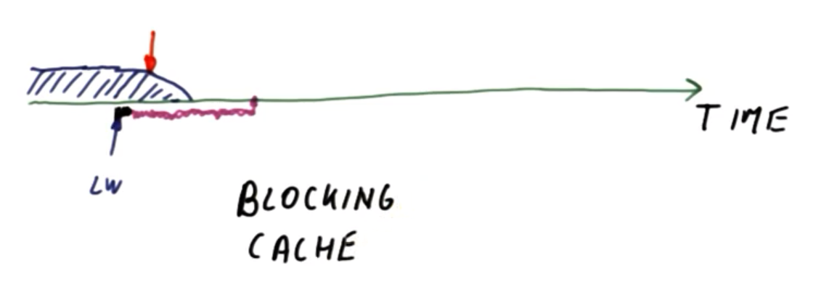
</center>

In the elapsed time between initiating execution of the memory-access operation (i.e., `LW`) and fetching the corresponding data from memory, the processor may also subsequently issue another memory-access operation also resulting in a cache miss (as in the figure shown above).

In a **blocking cache**, this scenario will proceed in such a manner whereby the subsequent memory-access operation will ***not*** commence execution until the first/upstream memory-access operation completes its execution.

<center>
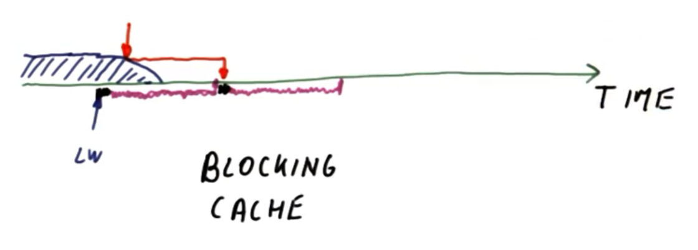
</center>

Only on completion of the first/upstream memory-access operation will the subsequent memory-access operation proceed with execution accordingly (as in the figure shown above).

<center>
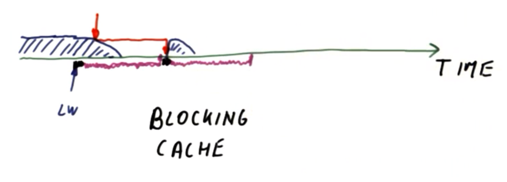
</center>

Furthermore, since the processor can still commit instructions downstream from initiating the execution of the subsequent memory-access operation, these latter instructions can still correspondingly "constructively overlap" with commenced execution of the subsequent memory-access operation accordingly (as in the figure shown above).

Conversely, there is also a **non-blocking cache**, which can further improve such "constructive overlap," by supporting the following:
  * **hit under miss** → hit subsequently when an initial cache-missing operation is encountered
  * **miss under miss** → send a subsequent (miss-inducing) request to memory when an initial cache-missing operation is encountered 

<center>
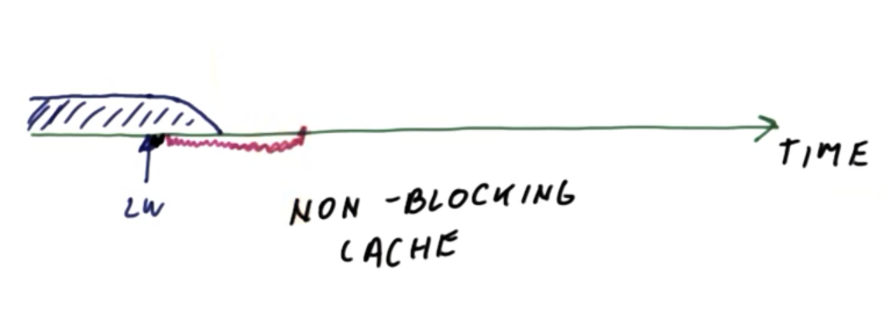
</center>

To demonstrate this, consider a similar processor operation whereby a miss-inducing memory-access operation (e.g., `LW`) occurs (as in the figure shown above).

<center>
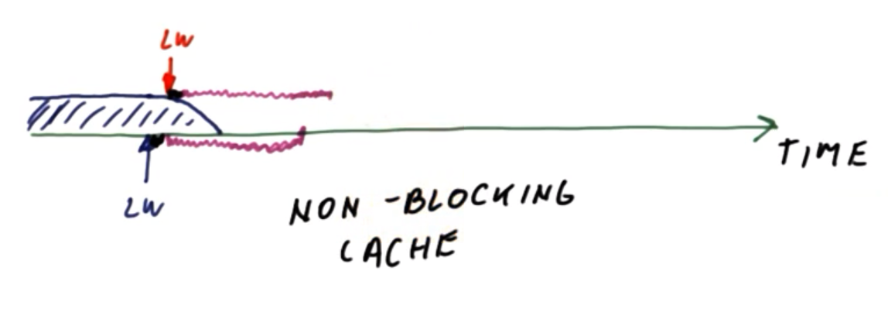
</center>

On subsequent memory-access operation (as in the figure shown above), this subsequent operation performs its fetching from memory ***immediately***, thereby overlapping this memory-fetching operation with that of the initial/upstream memory-access operation.

<center>
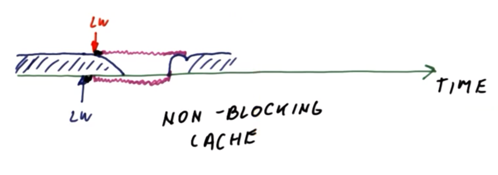
</center>

On completion of the initial/upstream memory-access operation (as in the figure shown above), there is a corresponding "decaying activity burst" which is then "revived" as the subsequent memory-access operation completes.

<center>
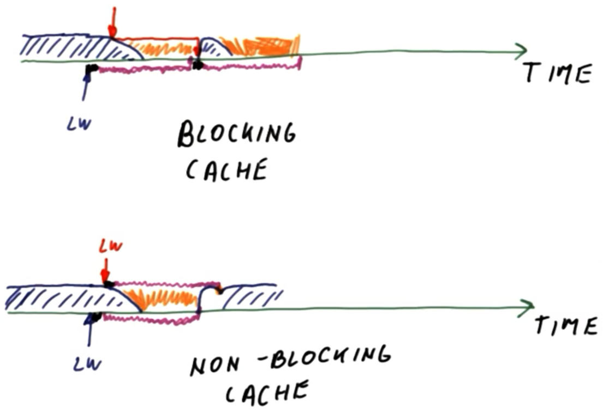
</center>

Reviewing the blocking vs. non-blocking caches comparatively (as in the figure shown above), the effectively "induced inactivity" due to the fetching from memory (as denoted by orange in the figure shown above) is reduced in the latter, by a fairly substantial amount (e.g., effectivley a halving), thereby decreasing the corresponding `Miss Penalty` accordingly.

Accordingly, if three, four, etc. such overlaps can be achieved, there is a corresponding improvement in the `Miss Penalty` reduction in a non-blocking cache relative to an equivalent blocking cache. This property is appropriately called **memory-level parallelism** (i.e., a memory-access operation is effectively "parallelized" relative to a single/blocking operation, with corresponding reduction in `Miss Penalty` latency).

### 29. Miss-Under-Miss Support in Caches

<center>
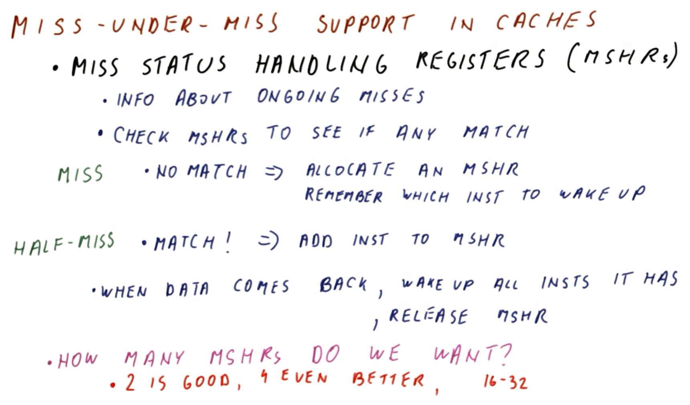
</center>

So, then, what must the cache contain in order to support such a miss-under-miss memory-access operation? (cf. Section 28)
  * ***N.B.*** cf. In a non-blocking cache (i.e., one which does ***not*** support such miss-under-miss operation), the cache simply blocks on memory access once a cache miss is encountered, which is effectively provided "by default" (i.e., there is no additional hardware support necessary to achieve this otherwise). Furthermore, in a hit-under-miss memory-access operation, the subsequent cache accesses are handled "as usual" for the subsequent cache-hitting operation(s). However, the miss-under-miss memory-access scenario is the one in particular which requires additional support/attention to achieve accordingly.

In order to handle miss-under-miss memory-access operations, this requires **miss status handling registers (MSHRs)**, which retain what specifically was requested from memory on initiating execution of the corresponding memory-access operation. This occurs in the following ***sequence***:
  * 1 - Information regarding the in-progress cache misses is retained
  * 2 - When a cache miss occurs, the miss status handling registers (MSHRs) are examined to determine if there is a match (i.e., to determine whether it is a "new" cache miss vs. a "previously encountered" cache miss)
    * 2A - If there is ***no*** match, then this corresponds to a cache miss with respect to a ***different*** cache block, and consequently there is a ***new*** miss status handling register allocated accordingly, along with retaining which instruction in the process to "awaken" on subsequent fetching of the pertinent data from memory
      * This scenario is called a (true) **miss**
    * 2B - Conversely, if there ***is*** a match, then this corresponds to data from a ***previously encountered** cache block whose fetching is already in progress by this point, and therefore this is noted accordingly with respect to the most recent cache-missing memory-access operation via corresponding addition of the instruction as a new miss status handling register entry
      * This scenario is called a **half-miss** (i.e., this would be a "true miss" in an otherwise blocking cache)
  * 3 - When the requested data is finally fetched from memory, locate the corresponding instruction(s) among the miss status handling registers (MSHRs) and "awaken" it/them accordingly, and then consequently release the miss status handling register(s) (MHSRs) in question accordingly for subsequent reuse by another cache miss

***N.B.*** Note that the (true) miss and half-miss with respect to a given cache block need ***not*** necessarily be with respect to the ***same*** word; in fact, it is rather common to access a given word initially, and then subsequently thereafter accessing the second word in the block, in which case the first word will yield a (true) miss while the second word will yield a half-miss.

This begs the question: How many such miss status handling registers (MHSRs) are appropriate for optimal performance?
  * It turns out that there is a massive benefit to having only ***two*** such miss status handling registers (MSHRs) (i.e., to handle two different in-progress cache blocks at any given time), while ***four*** yields even better results. There is also an additional benefit gained by incorporating as many as ***sixteen*** or even ***thirty-two*** (i.e., on the order of `O(10)` is still considered "optimally performant"). The reason for this is that memory latencies are relatively long, and therefore it is desirable to keep sending requests to memory over this time span accordingly to achieve a corresponding level of memory parallelism.

## 30. Miss-Under-Miss Quiz and Answers

<center>

</center>

What kind of application experiences ***no*** benefit from miss-under-miss suport? (Select all that apply.)
  * An application which *always* hits in the cache
    * `APPLIES` - If the application does not experience any cache misses, then by definition there is no benefit gained from miss-under-miss support.
  * An application which experiences a *miss* every `1000` instructions
    * `APPLIES` - When a cache miss does occur, the processor will likely exhaust the reorder buffer (ROB) entries prior to encountering the subsequent cache-miss-inducing instruction, thereby there will not likely be a benefit conferred on the processor by miss-under-miss support accordingly
  * An application which experiences a *miss* every `10` instructions
    * `DOES NOT APPLY` - This application will benefit from miss-under-miss support (i.e., relative to the "overlapping" time span)
  * An application which experiences a *miss* every `2` instructions
    * `DOES NOT APPLY` - This application will also benefit from miss-under-miss support (i.e., relative to the "overlapping" time span)

## 31-32. Cache Hierarchies

### 31. Introduction

<center>
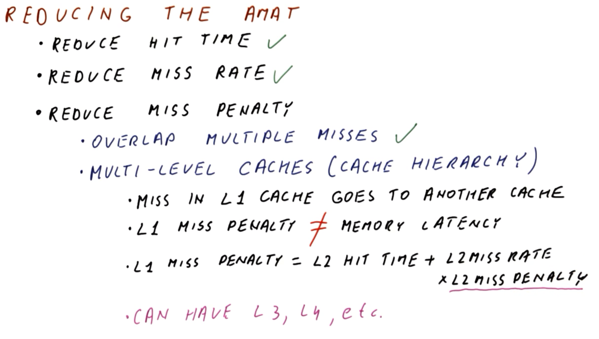
</center>

Returning to the possible strategies for reducing the **average memory access time (`AMAT`)** (cf. Section 2), we have seen thus far in this lesson techniques for reducing both the `Hit Time` and the `Miss Rate`, as well as reducing `Miss Penalty` via overlapping (cf. Section 28).

Additionally, we will now consider another technique for reducing `Miss Penalty`, which involves **multi-level caches** or equivalently a **cache hierarchy**. With this technique, a cache miss in the first cache of the processor (e.g., **level 1 [L1] cache**) subsequently proceeds to another cache level (e.g., **level 2 [L2] cache**), rather than to main memory.

Consequently, the `Miss Penalty` incurred from the level 1 (L1) cache miss is not equal to the *full* main-memory-access latency, but rather the level 1 (L1) cache `Miss Penalty` is defined as follows:

```
L1 Miss Penalty = L2 Hit Time + (L2 Miss Rate × L2 Miss Penalty)
```

In particular, the `L2 Miss Penalty` can correspond to the actual main-memory-access latency ***or*** it can correspond to another cache level (e.g., level 3 [L3], level 4 [L4], etc.).

### 32. The Average Memory Access Time (`AMAT`) with Cache Hierarchies

<center>
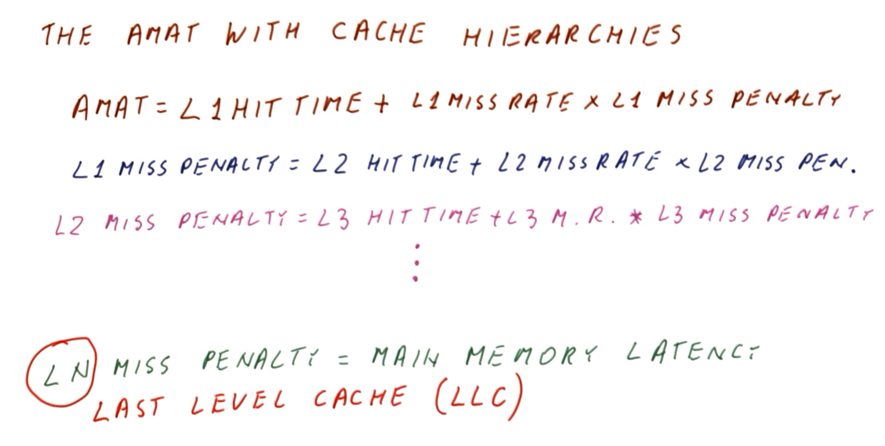
</center>

Now, consider the equation for **average memory access time (`AMAT`)** in the context of a cache hierarchy.

With respect to the level 1 (L1) cache, **average memory access time (`AMAT`)** is defined as follows:

```
AMAT = L1 Hit Time + (L1 Miss Rate × L1 Miss Penalty)
```

When introduced initially (cf. Section 2), this was the "terminal form" of the equation, with the `L1 Miss Penalty` corresponding to the main-memory access time.

However, in a cache hierarchy, `L1 Miss Penalty` is defined as follows:

```
L1 Miss Penalty = L2 Hit Time + (L2 Miss Rate × L2 Miss Penalty)
```

And similarly, `L2 Miss Penalty` is defined as follows:

```
L2 Miss Penalty = L3 Hit Time + (L3 Miss Rate × L3 Miss Penalty)
```

These definitions proceed similarly in this manner, until ultimately reaching the definition of the **last level cache (LLC)** (i.e., level `N` [L`N`] cache), which corresponds directly to the main-memory access time itself (i.e., the hierarchy correspondingly is comprised of `N` cache levels, where the level `N` cache is that which ultimately performs the main-memory access operation).

## 33. Level 1 (L1) vs. Level 2 (L2) Quiz and Answers

<center>
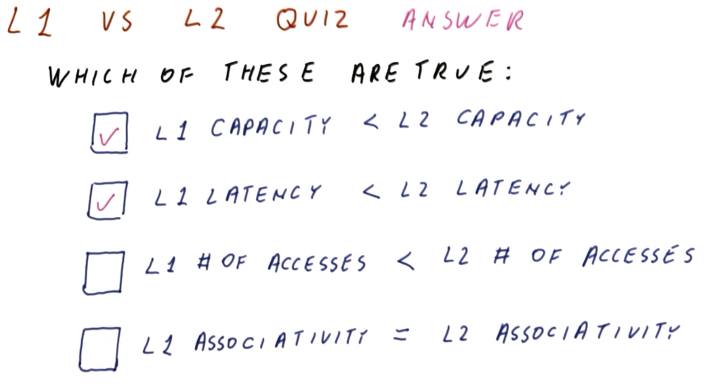
</center>

With respect to level 1 (L1) vs. level 2 (L2) caches, which of the following are true? (Select all that apply.)
  * L1 capacity < L2 capacity
    * `APPLIES` - In general, the level 2 (L2) cache must contain "reserve capacity" to cover cache hits which were correspondingly cache misses in the level 1 (L1) cache (i.e., if proceeding onto the L2 cache, the intended purpose is to cover with cache hits there, rather than to further propagate cache misses).
  * L1 latency < L2 latency
    * `APPLIES` - The level 1 (L1) cache is the first level of caching within the hierarchy not because it has a higher chance of a cache hit, but rather precisely because it has a relatively lower latency in the first place (i.e., all else equal, an L1 cache hit will be faster than an L2 cache hit relative to initiation of a memory-access operation).
  * L1 number of accesses < L2 number of accesses
    * `DOES NOT APPLY` - All of the access operations (i.e., loads and stores) proceed via the level 1 (L1) cache, however, only those which result in cache misses consequently proceed onto the level 2 (L2) cache (i.e., in general, the L1 cache will experience the highest number of accesses for a given program).
  * L1 associativity = L2 associativity
    * `DOES NOT APPLY` - While this may potentially be the case, it is not necessarily true, and typically is not. The reason for this is because the level 1 (L1) cache must have a low latency (i.e., short `Hit Time`), which necessarily comes at the expense of capacity (and corresponding associativity); correspondingly, the level 2 (L2) cache provides increased capacity (and correspondingly higher level of associativity) at the expense of a relatively higher `Hit Time`.

## 34-39. Multi-Level Cache Performance

### 34. Introduction

<center>
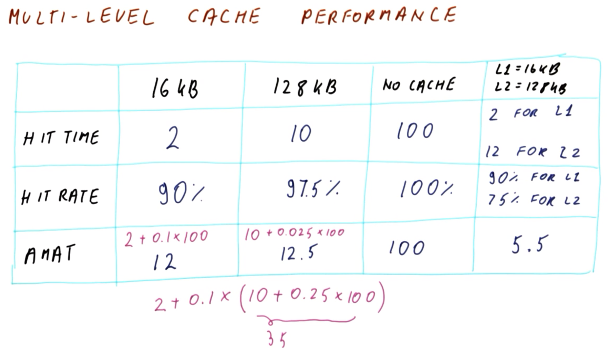
</center>

To assess performance of a multi-level cache, consider the following comparisons:

| Performance Metric | `16 KB` cache | `128 KB` cache | No cache (main memory only) | Multi-level cache (`16KB` L1 + `128 KB` L2)** |
|:--:|:--:|:--:|:--:|:--:|
| `Hit Time` (cycles) | `2` | `10` | `100` | `2` for L1, `12` for `L2` |
| `Hit Rate` (percent) | `90%` | `97.5%` | `100%` | `90%` for L1, `75%` for L2 |
| Average Memory Access Time (`AMAT`) (cycles)* | `12` (`= 2 + (1 - 0.90) × 100`) | `12.5` (`= 10 + (1 - 0.975) × 100`) | `100` (`= 100 + (1 - 1) × 100`) | `5.5` (`= 2 + (1 - 0.90) × [10 + (1 - 0.75) × 100]`) |
* ****N.B.*** Assume a memory latency of `100` cycles for purposes of comparison
* *****N.B.*** With respect to the multi-level cache, the `Hit Time` for the L2 cache is comprised of the `2` cycles `Hit Time` to first check via the L1 cache, followed by the `10` cycles `Hit Time` imposed by the L2 cache itself. Similarly, with respect to the `Hit Rate`, the *cache hits* are generally "mutually shared" between the L1 and L2 caches, however, it is the *cache misses* which are effectively "filtered down" into the L2 cache (i.e., the L2 cache only "sees" the "worst" 10-15% or so of the memory-access operations), for which the L2 itself has a lower `Hit Rate` (`75%`) relative to its intrinsic hit rate (`97.5%`), the latter of which would otherwise apply if it were the *only* cache being used here.

Note the following ***observations***:
  * Comparing the `16 KB` cache to the `128 KB` cache, in the latter, increasing the cache capacity correspondingly increases both the `Hit Time` and the `Hit Rate`, but does not otherwise improve the average memory access time (`AMAT`).
  * Nevertheless, having a cache is still substantially better than not having a cache at all.
  * In the multi-level cache, with respect to the average memory access time (`AMAT`), the factor `[10 + (1 - 0.75) × 100] = 35` cycles is the overall `Miss Penalty` for the L1 cache misses, which is a substantial improvement over the `100` cycles `Miss Penalty` incurred by the L1 cache (i.e., via the main-memory access) working alone. Correspondingly, the overall average memory access time (`AMAT`) of `5.5` cycles in the multi-level cache is substantially better than either of the caches working alone. This is because most of the accesses hit via the `Hit Latency` of the faster (L1) cache, with only the residual cache misses hitting with the relatively higher `Hit Latency` of the slower (L2) cache, and from there even fewer incur the full main-memory-access `Hit Latency`.
    * Correspondingly, it is not sufficient to simply have a large cache, if it is otherwise still relatively slow. Instead, it is more effective to combine the caches in such a manner which exploits their complementary properties (fast `Hit Time` of the L1 with the high `Hit Rate` of the L2) more favorably (i.e., *"the whole is greater than the sum of its parts"*).

### 35. `Hit Rate` in L2, L3, etc.

<center>
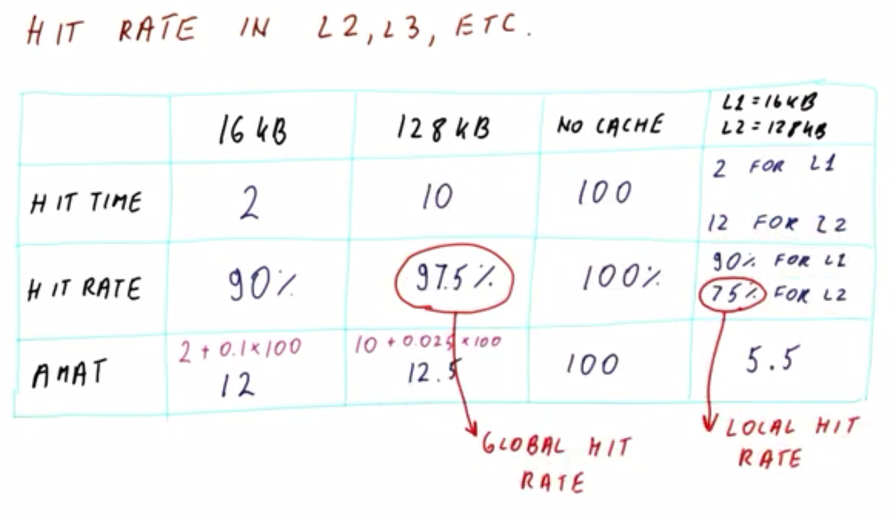
</center>

Recall (cf. Section 34) that when the level 2 (L2) cache is used alone, it has a relatively higher `Hit Rate` (i.e., `97.5%`) compared to a multi-level cache configuration (i.e., `75%`). This suggests that the level 2 (L2) cache has a ***lower*** `Hit Rate` than the level 1 (L1) cache, however, this is misleading.

The effectively "reduced" `Hit Rate` of the level 2 (L2) cache is called the **local hit rate** for the cache, which is the `Hit Rate` actually observed by the cache in its multi-level configuration (i.e., it is the `Hit Rate` observed by the cache with respect to the access-operations it actually interacts with, i.e., "post-filtering" from upstream cache levels). Furthermore, note that accesses to downstream level (L2), level (L3), etc. caches are ***not*** all of the accesses that are ultimately performed by the processor, but rather those accesses which have a lot of locality tend to concentrate more in upstream (i.e., level 1 [L1]) caches, and never even reach the downstream caches to begin with (and accordingly, the downstream cache levels deal with the more cache-miss-prone accesses, rather than benefiting from the relatively "easy-to-access" cache-hit accesses).

Conversely, the intrinsic `Hit Rate` of a given cache level (i.e., in isolation) is called the **global hit rate**. This also characterizes the downstream caches relative to this cache's level in a "black box" manner (i.e., this is the most achievable `Hit Rate` with the particular cache in question handling the predominantly cache-hit accesses).

Therefore, when characterizing a cache with respect to its size/capacity and the general notion of "larger caches behaving better with respect to `Hit Rate`," typically this characterization is with respect to the ***global hit rate***, because the local hit rate is not an intrinsic property of a given cache itself (i.e., it is influenced by the upstream cache levels in the multi-level configuration).

### 36. Global vs. Local `Hit Rate`

<center>
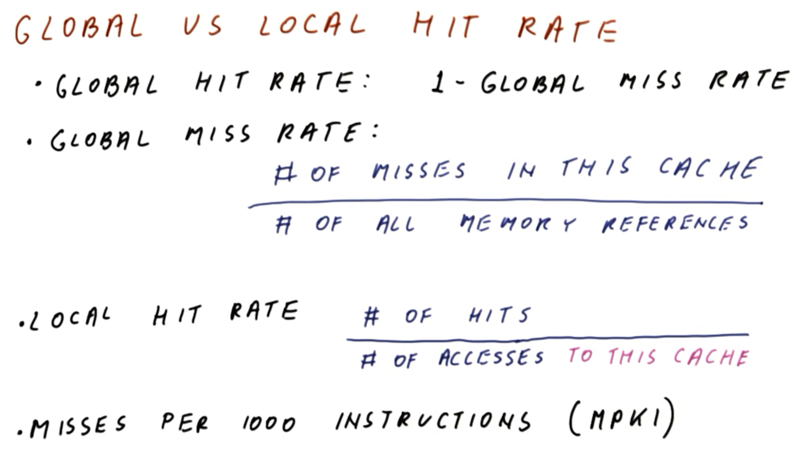
</center>

Let us now define these `Hit Rate`s as follows.

```
Global Hit Rate = 1 - Global Miss Rate
```

```
Global Miss Rate = (# misses in this cache) / (# all memory references)
```
* ***N.B.*** Here, "all" memory references includes all memory references performed by the processor in it entirety, ***not*** just those which reach its cache.

```
Local Hit Rate = (# hits) / (# accesses to this particular cache)
```
* ***N.B.*** Here, ***only*** those memory accesses pertaining to this particular cache are counted, rather than all memory accesses.

Another popular metric for quantifying how often the cache hits in a non-level-1 (non-L1) cache is called **misses per 1000 instructions (MPKI)**. This is reminiscent of the global `Miss Rate` except that rather than normalizing the cache misses with respect to "raw" number of memory-access instructions/operations, but rather with respect to general instructions (including non-memory-access instructions) encountered by the processor during program execution.

### 37. Global and Local `Miss Rate` Quiz and Answers

<center>
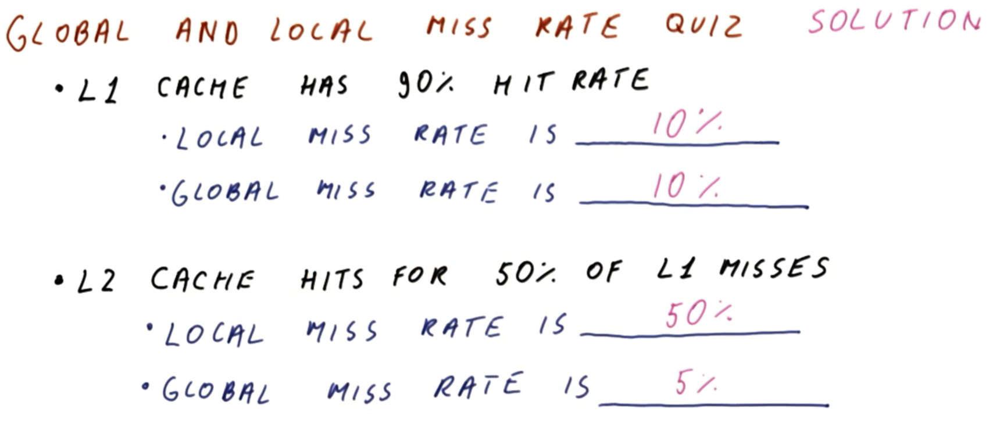
</center>

Given a level 1 (L1) cache with a `90%` `Hit Rate`, what are the local and global `Miss Rate`s?
  * local: `10%`
  * global: `10%`

Similarly, given a level 2 (L2) cache which hits for `50%` of the aforementioned L1 cache's misses, what are the local and global `Miss Rate`s for the L2 cache?
  * local: `50%`
  * global: `5%` 

***Explanation***:

In this particular multi-level cache configuration, with respect to the level 1 (L1) cache, there is no distinction between the local vs. global `Miss Rate`s; in either case, it is simply (by definition) `100% - 90% = 10%`.

Conversely, with respect to the level 2 (L2) cache, since it hits for `50%` of the L1 misses, this correspondingly implies that it also misses for `50%` of these L1 misses (i.e., the only thing reaching the L2 cache are the L1 misses), which characterizes its local `Miss Rate` accordingly. Furthermore, the global `Miss Rate` for the L2 cache is `5%`, because only `10%` of the L1 accesses (i.e., the L1 cache misses) reach the L2 cache, for which the latter has an intrinsic/global `Hit Rate` of `50%`.

### 38. Inclusion Property

<center>
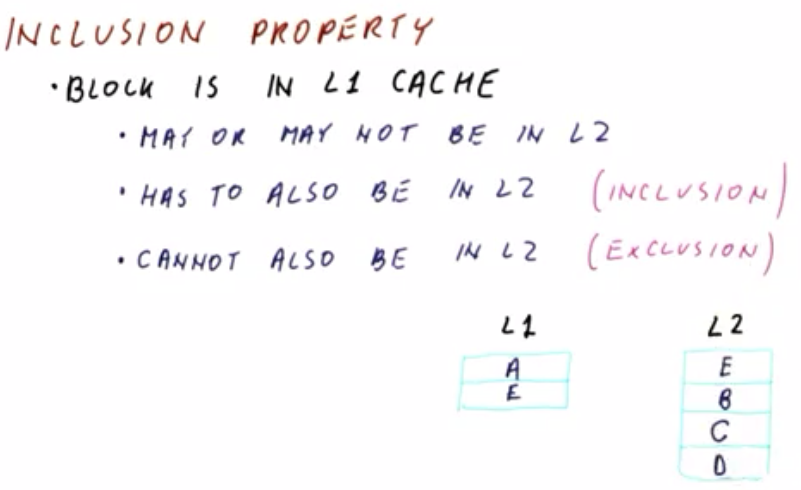
</center>

In addition to variable `Miss Rate`s between local vs. global cache performance in a multi-level cache, there is also a relevant property in such multi-level caches called the **inclusion property**.

<center>
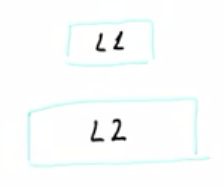
</center>

Given a two-level cache hierarchy (as in the figure shown above) and that a block is in the level 1 (L1) cache, there are the following possible states:
  * The block may or may not also be in the level 2 (L2) cache
  * The block ***must*** also be in the level 2 (L2) cache (***inclusion***)
  * The block ***cannot*** also be in the level 2 (L2) cache (***exclusion***)

So, then, which of these states is correct? It turns out that unless there is an explicit effort to strictly enforce inclusion or exclusion, then either is possible (i.e., the block may or may not also be in the L2 cache at any given time).

<center>

</center>

Consider a simple example characterized as follows (as in the figure shown above):
  * The level 1 (L1) cache is comprised of two blocks
  * The level 2 (L2) cache is comprised of four blocks
  * Both L1 and L2 caches are fully associative and use a least recently used (LRU) replacement policy
  * Assume that the content of both caches is initially empty

<center>
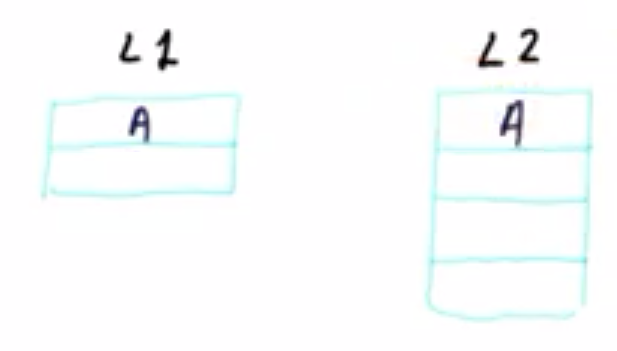
</center>

On access of block `A` (as in the figure shown above), both caches initially miss (i.e., compulsory misses) and fetch from memory accordingly (i.e., the L2 cache performs the main-memory-access operation, and then propagates the value up to the L1 cache). At this point, the inclusion property holds.

<center>
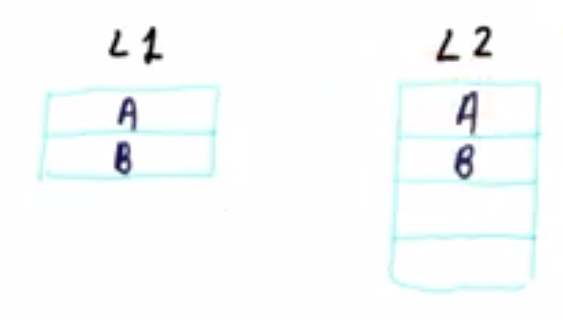
</center>

Similarly, on subsequent access of block `B` (as in the figure shown above), both caches initially miss (i.e., compulsory misses) and fetch from memory accordingly (i.e., the L2 cache performs the main-memory-access operation, and then propagates the value up to the L1 cache). At this point, the inclusion property still holds.

<center>
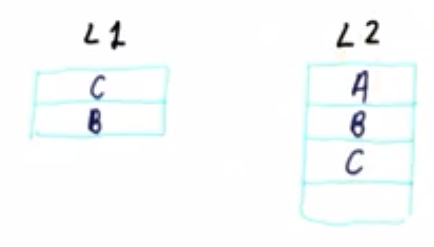
</center>

On subsequent access of block `C` (as in the figure shown above), both caches initially miss (i.e., compulsory misses) and fetch from memory accordingly (i.e., the L2 cache performs the main-memory-access operation, and then propagates the value up to the L1 cache). Furthermore, `A` is ejected from L1. At this point, the inclusion property still holds.

<center>
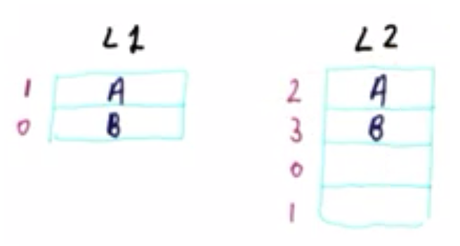
</center>

Conversely, rather than subsequently accessing block `C`, instead block `A` is first re-accessed (as in the figure shown above). Since the re-access is only with respect to the level 1 (L1) cache, the corresponding least-recently-used counters are updated accordingly (in number ordering of highest/most-recently-accessed to lowest/least-recently-accessed). At this point, the inclusion property still holds.

<center>
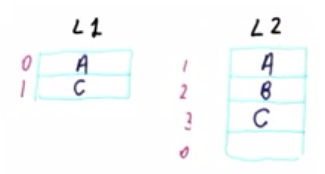
</center>

Now, on subsequent access of block `C` (as in the figure shown above), both caches initially miss (i.e., compulsory misses) and fetch from memory accordingly (i.e., the L2 cache performs the main-memory-access operation, and then propagates the value up to the L1 cache). Furthermore, `A` is ejected from L1, and both caches' least-recently-used counters are updated accordingly. At this point, the inclusion property still holds.

<center>
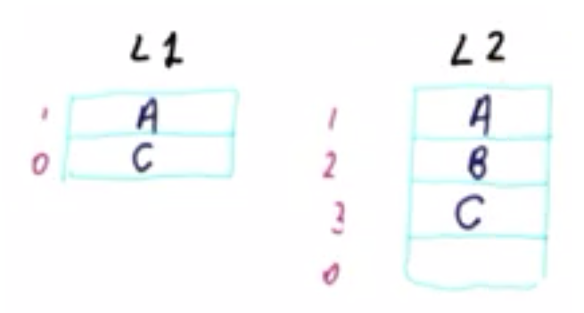
</center>

On subsequent re-access of block `A` (as in the figure shown above), since the re-access is only with respect to the level 1 (L1) cache, the corresponding least-recently-used counters for the L1 cache are updated accordingly. At this point, the inclusion property still holds.

<center>
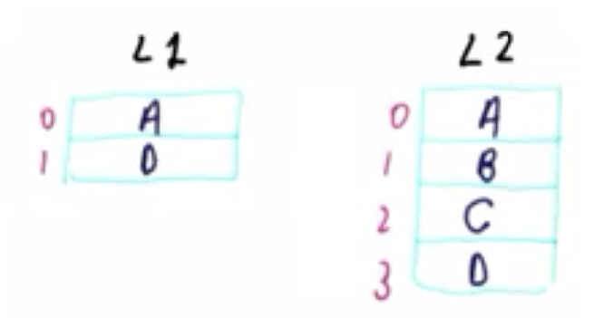
</center>

On subsequent access of block `D` (as in the figure shown above), both caches initially miss (i.e., compulsory misses) and fetch from memory accordingly (i.e., the L2 cache performs the main-memory-access operation, and then propagates the value up to the L1 cache). Furthermore, `C` is ejected from L1, and both caches' least-recently-used counters are updated accordingly. At this point, the inclusion property still holds.

<center>
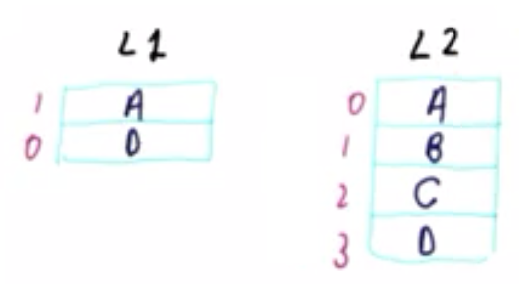
</center>

On subsequent re-access of block `A` (as in the figure shown above), since the re-access is only with respect to the level 1 (L1) cache, the corresponding least-recently-used counters for the L1 cache are updated accordingly. At this point, the inclusion property still holds.

<center>
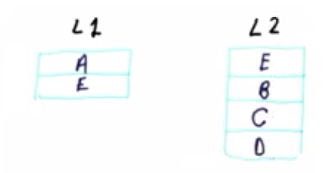
</center>

On subsequent access of block `E` (as in the figure shown above), both caches initially miss (i.e., compulsory misses) and fetch from memory accordingly (i.e., the L2 cache performs the main-memory-access operation, and then propagates the value up to the L1 cache). Furthermore, `D` is ejected from L1 and `A` is ejected from L2. Observe that at this point, the inclusion property no longer holds with respect to block `A`.

Correspondingly, the inclusion property does ***not*** necessarily hold in a multi-level cache, because blocks which are frequently accessed in the level 1 (L1) cache generally will not be accessed as frequently in the level 2 (L2) cache (i.e., the L2 cache only "sees" the cache misses of L1).

Therefore, in order to ***maintain*** the inclusion property, the level 2 (L2) cache must incorporate a corresponding **inclusion bit**. The inclusion bit has the value `1` when the block in question is also present in the level 1 (L1) cache, and on subsequent cache-block replacements in the L2 cache, blocks designated with an inclusion-bit value of `1` are ***prevented*** from otherwise being replaced in the L2 cache.

### 39. Inclusion Property Quiz and Answers

<center>
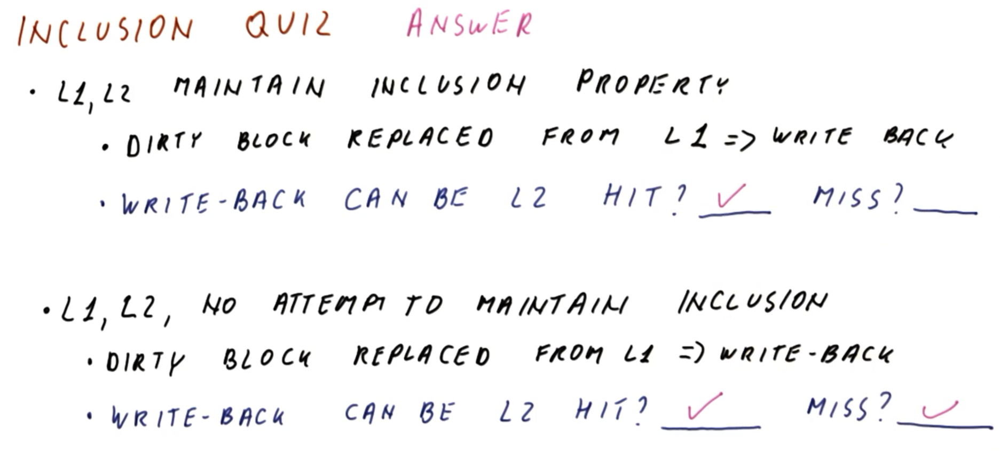
</center>

Consider a multi-level cache comprised of level 1 (L1) and level 2 (L2) caches which ***maintains*** an inclusion property. Furthermore, the dirty block is replaced from the L1 cache with another block, and is consequently written back by the L1 cache. For this write-back access, can it be performed as an L2 hit and/or miss? (Select all that apply.)
  * L2 hit only

Conversely, consider a multi-level cache comprised of level 1 (L1) and level 2 (L2) caches which does ***not*** maintain an inclusion property. Furthermore, the dirty block is replaced from the L1 cache with another block, and is consequently written back by the L1 cache. For this write-back access, can it be performed as an L2 hit and/or miss? (Select all that apply.)
  * L2 hit and L2 miss

***Explanation***:

If the level 1 (L1) and (L2) ***do*** maintain an inclusion property, then the dirty block which is present in the L1 cache immediately prior to ejection is also present in the L2 cache. Therefore, on write-back operation, it will be an L2 hit, however, it cannot be an L2 miss because the inclusion property guarantees that the now-dirty block still exists in the L2 cache. Subsequently to the write-back operation, the new block can be brought into the L1 cache, which in turn may replace the block from both L1 and L2 caches; however, until the block is written back, then the block exists in both the L1 and L2 caches, and correspondingly the write-back operation is necessarily an L2 hit.

Conversely, if the level 1 (L1) and (L2) ***do not*** maintain an inclusion property, then when the dirty block is replaced in the level 1 (L1) cache, this dirty block may or may not correspondingly be present in the level 2 (L2) cache as well. Therefore, the L1 cache's write-back operation may yield both a L2 hit (if the block *is* present) *or* an L2 miss (if the block is *not* present). 

As these contrasting examples demonstrate, write-back handling becomes slightly simpler when an inclusion property is maintained among the caches in a multi-level cache.

## 40. Lesson Outro

In this lesson, we examined how modern processors use multi-level caches and other cache-related techniques to compensate for main-memory access being ***slow***.

But this begs the question: *Why* is main memory inherently so slow in the first place? This question is explored further in the next lesson.
