# Memory

## 1. Lesson Introduction

This lesson will discuss how different types of memory work, as well as why we cannot have memory that is simultaneously large, fast, *and* cheap.

This lesson will also describe how memory chips can pack so many bits in such a relatively small physical space.

## 2. How Memory Works

<center>
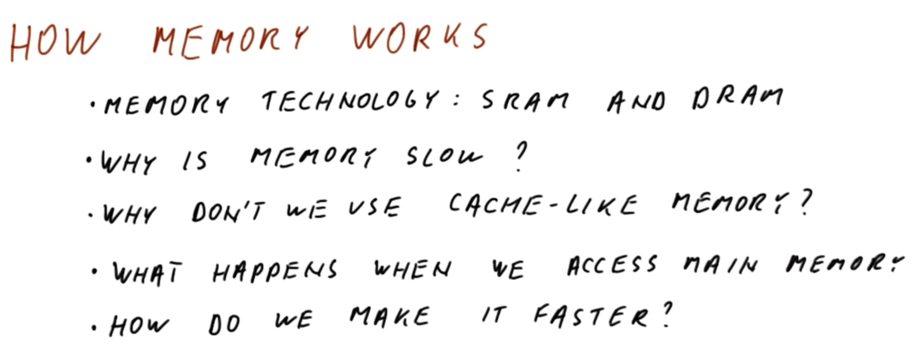
</center>

This lesson will examine how memory works, and with particular focus on the following topics:
  * Memory technology - SRAM and DRAM (i.e., what do these mean, and how do they work)
  * Why is main memory so slow?
  * Why not simply use cache-like memory in place of main memory in order to improve its speed?
  * What occurs on cache miss and consequent main-memory access?
  * How can main memory be made to be faster (i.e., reducing the latency resulting from a cache miss)?

## 3-5. Memory Technology: SRAM and DRAM

### 3. Introduction

<center>
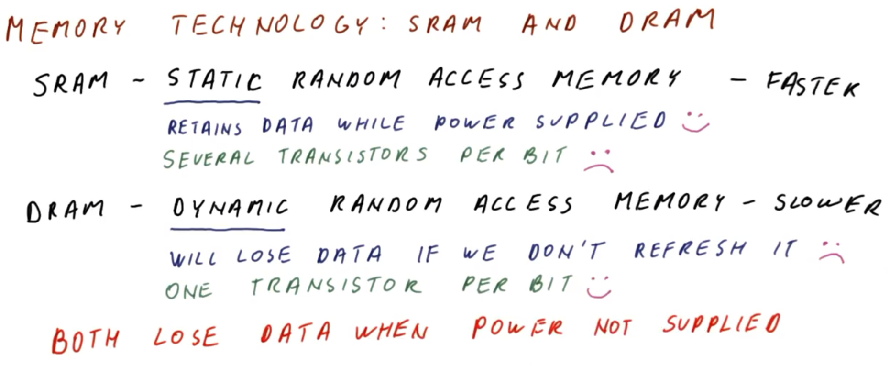
</center>

There are two principal memory technologies, defined as follows:
  * ***static* random access memory (SRAM)**
  * ***dynamic* random access memory (DRAM)**

***N.B.*** In both types of memory, **random** access refers to the fact that any memory location can be accessed arbitrarily/randomly by address, without otherwise requiring full traversal of all memory locations to reach a given address. Conversely, **sequential** access (e.g., tape) requires scanning through the entire memory in order to reach a given address.

The key ***differences*** between static and dynamic random access memories is with respect to this static vs. dynamic behavior, which is characterized as follows:

| Random Access Memory Type | Data Retention* | Transistors per Bit | Overall Speed |
|:--:|:--:|:--:|:--:|
| Static (SRAM) | The data is ***retained*** as long as power is supplied | Requires ***several*** transistors per memory bit | Generally ***faster*** |
| Dynamic (DRAM) | The data is ***lost*** (i.e., even if power is supplied), unless the data is refreshed periodically (i.e., read out and write back in on a regular basis) | Only requires ***one*** transistor per memory bit | Generally ***slower*** |
* ****N.B.*** Both types of random access memory ***lose*** data when power is ***not*** supplied.

Therefore, the corresponding trade-offs are with respect to speed and simplicity vs. cost, i.e.,:
  * SRAM is more expensive and more complex to implement, but provides better speed
  * DRAM is less expensive and simpler to implement, but is slower

Next, we wil consider what ***one*** memory bit looks like in the context of these respective memory types.

### 4. One Memory Bit: SRAM

<center>
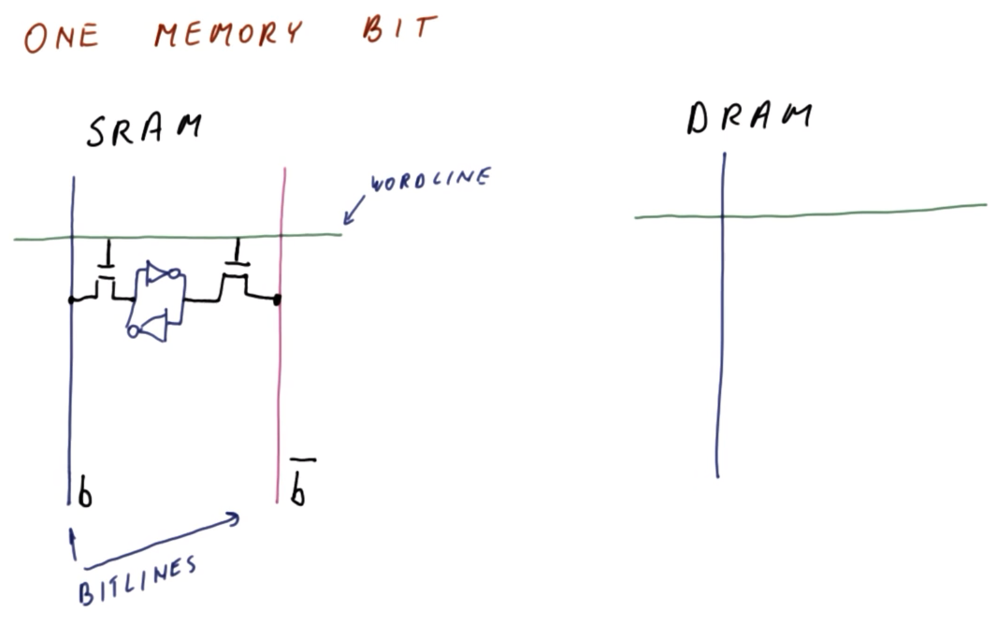
</center>

First, consider one memory bit in **static random access memory (SRAM)** (as in the figure shown above).

The **bit** sits at the intersection of a **wordline** (which traverses many such bits) and the corresponding **bitlines** (which also in turn traverse many such bits); effectively, the memory is a ***matrix*** of such memory cells.
  * ***N.B.*** Dynamic random access memory (DRAM) similarly is comprised of intersecting wordlines and bitlines (as will be discussed shortly, in the next subsection).

<center>
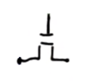
</center>

The **wordline** controls a transistor (as in the figure shown above), which in turn closes or opens to correspondingly connect the bitline to the wordline.

<center>
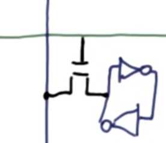
</center>

Therefore, to access the corresponding **memory cell** (as in the figure shown above), the wordline is activated to correspondingly open the transistor, thereby connecting the memory cell to the bitline. Consequently:
  * To ***write*** data to the memory cell, the bitline is set to the appropriate value (e.g., $b$), which in turn is stored in the memory cell
  * To ***read*** data from the memory cell, the bitline is "released," and consequently the memory cell "emits" its data value which in turn is "detected" by the bitline

In static random access memory (SRAM), the memory cell itself consists of two complementary ***inverters***, with each inverter in turn composed of two constituent transistors (which are necessary to create an inverting gate).
  * With respect to ***reading*** data from the memory cell:
    * If a signal `1` is fed into the memory cell from the transistor, then the top inverter flips it and outputs `0`, which in turn is similarly inverted back to `1` in its corresponding output.
    * Once the transistor signal is disconnected (sending corresponding signal `0`), the memory cell consequently will ***retain*** this value (i.e., similarly inverting `0` to `1`, and then inverting back to `0`).
      * This ***feedback loop*** is essentially ***amplified*** by the inverters at any given time.
  * Conversely, with respect to ***writing*** data to the memory cell:
    * If a signal `1` is sent to the memory cell, the bottom inverter effectively works "against" this signal, because it is attempting to invert this signal to `0`.
    * However, by connecting the memory cell to the bitline (i.e., via its other terminal/connector), if a ***stronger*** signal `1` is received via the connected bitline (as compared to the relatively smaller/weaker inverters), this correspondingly "overpowers" the inverters and "forces" the intended state (i.e., signal `1`) on the memory cell accordingly.

<center>
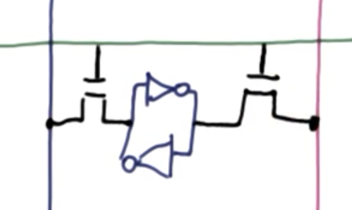
</center>

To further enhance this "reinforcement" effect, typically two such transistors are connected to the ***same*** memory cell (as in the figure shown above), with their bitline-connected terminals connected to respective bitlines having complementary bit values (i.e., $b$ and $\bar b$).
  * For example, with a bitline signals of $b = 1$ and complement $\bar b = 0$, this further "overwhelms"/"coerces" the memory cell into having a value ***written*** to it.
  * Similarly, if connecting both bitlines for ***reading***, the corresponding complementary pair will be read out to the respective bitlines (i.e., $b$ and $\bar b$). Furthermore, the difference between the bitlines can be examined to more quickly detect the target data value being read from the memory cell accordingly.

To reiterate, by virtue of the ***weak*** constituent transistors of the inverters, connection of the bitlines will generally dictate the behavior of the inverters, and correspondingly examination of the ***difference*** between the (complementary) bitlines (i.e., in particular, in which "direction" this difference moves towards) is sufficient for reliable reading and writing operations with respect to a given memory cell (i.e., as opposed to having to examine ***each*** individual bitline's crossing across a threshold).
  * By initializing the bitlines near the midpoint between `1` and `0`, on activation of the wordline, this in turn initiates the action of the memory cell to "push"/"pull" against the bitlines to quickly converge towards a stable, detectable "difference" between the bitlines accordingly.

### 5. One Memory Bit: DRAM

<center>
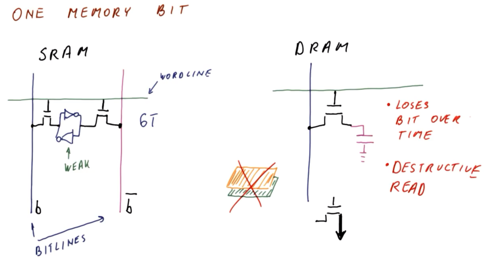
</center>

In **dynamic random access memory (DRAM)** (as in the figure shown above), there is similarly a **transistor** which is activated by the **wordline** and correspondingly connects the **memory cell** to the **bitline**, however, this is the ***only*** transistor. Furthermore, the **memory cell** is comprised of a simple ***capacitor*** (i.e., rather than a pair of inverters).
  * To ***write*** data to the memory cell, the wordline is activated, and then consequently the bitline signal (e.g., `1`) is fed into the memory-cell capacitor, which in turn effectively charges the capacitor. Furthermore, on deactivation of the wordline, this charge is subsequently retained in the capacitor accordingly (analogously, a writing bitline signal of `0` would result in a discharge of the capacitor into the bitline and consequent stored value of `0`, i.e., no charge held by the memory-cell capacitor, which it subsequently retains on disconnection of the wordline).
  * Correspondingly, the data bit is effectively stored by the capacitor (i.e., `1` holds a charge, while `0` holds "no" charge).

However, there is an inherent ***problem*** here: The transistor itself is ***not*** a "perfect" switch, but rather it is slightly "leaky." In contrast, the inverters of the static random access memory (SRAM) are sufficiently strong to retain the charge, and are even tolerant of slightly leaky bitline-connecting transistors (i.e., the memory-cell inverters can still retain the charge/state reliably nevertheless).

Because of this "leakiness," the dynamic random access memory (DRAM) memory cell ***loses*** the stored-bit information over time, which consequently necessitates a period reading out of the bit and writing the bit back in at full voltage to restore the "true" value of the memory cell.

Another ***problem*** with the dynamic random access memory (DRAM) memory cell (which is not otherwise present in the static random access memory [SRAM] memory cell) is that once the wordline is activated, the memory-cell capacitor consequently "drains" into the bitline; while this value can be detected by the bitline, the memory-cell capacitor is no longer fully charged as a result. This is correspondingly called a **destructive read**, i.e., on reading of the memory-cell bit value, it must be immediately written back in, in order to restore the intended data (i.e., the value is lost upon being read).

<center>

</center>

Note that the static random access memory (SRAM) memory cell is called a **6 transistor (6T) cell** (i.e., two bitline-connecting transistors, and a pair of memory-cell inverters which are each comprised of two constituent transistors apiece), and by contrast the dynamic random access memory (DRAM) memory cell is correspondingly called a **1 transistor (1T) cell** (i.e., the single transistor connected to the memory-cell capacitor).
  * Correspondingly, the area occupied by a static random access memory (SRAM) memory cell is that of the six constituent transistors.
  * Conversely, the area occupied by the dynamic random access memory (DRAM) memory cell appears as though it would correspond to the area of its one constituent transistor and associated memory-cell capacitor. Furthermore, the larger the memory-cell capacitor, the longer that it can retain its stored data value (i.e., `1` or `0`) before it is "lost," therefore it is desirable to maximize this area accordingly.
    * ***N.B.***  A capacitor can be viewed as two metal plates which are placed in close proximity to each other (as in the figure shown above). Furthermore, in general, the capacitance (and corresponding ability to retain charge) is directly proportional to the common area of the plates.

<center>
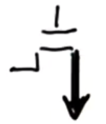
</center>

In fact, rather than increasing the area of the memory-cell capacitor, in a dynamic random access memory (DRAM) memory cell, the transistor and capacitor are built into a single-transistor component via a corresponding technology called a **trench cell** (as in the figure shown above).
  * With a trench cell, one end of the transistor is "buried" deeply into the silicon substrate during manufacture of the transistors-based memory chip. This allows for relative isolation of the transistor subcomponent itself.

As a final note, observe that the dynamic random access memory (DRAM) memory cell can be relatively small compared to the corresponding static random access memory (SRAM) memory cell, because the former does not require an additional bitline to achieve an equivalent memory cell (and correspondingly requires less wiring as well, all else equal).

## 6. Dynamic Random Access Memory (DRAM) Technology Quiz and Answers

<center>

</center>

Why not use a "normal" transistor and a capacitor to construct a dynamic random access memory (DRAM) memory cell? (Select the correct choice.)
  * The trench cell is easier to make
    * `INCORRECT` - Embedding the trench cell into the silicon substrate is generally a more complex manufacturing operation than simply using equivalent discrete subcomponents
  * The trench cell is more reliable
    * `INCORRECT`
  * The trench cell enables manufacturing DRAM chips more cheaply
    * `CORRECT` - While it seems paradoxical that a trench cell is more complex to manufacture (and therefore presumably more expensive to manufacture accordingly), recall (cf. Lesson 1) that the cost of manufacturing a chip grows quickly with the total area of the chip, and correspondingly, since the trench cell occupies a lot less per-unit-area of the chip than an equivalent discrete transistor/capacitor combination, consequently this net reduction in area per-unit-memory-cell offsets the associated added-complexity-of-manufacturing cost 

## 7-10. Memory Chip Organization

### 7. Part 1

<center>
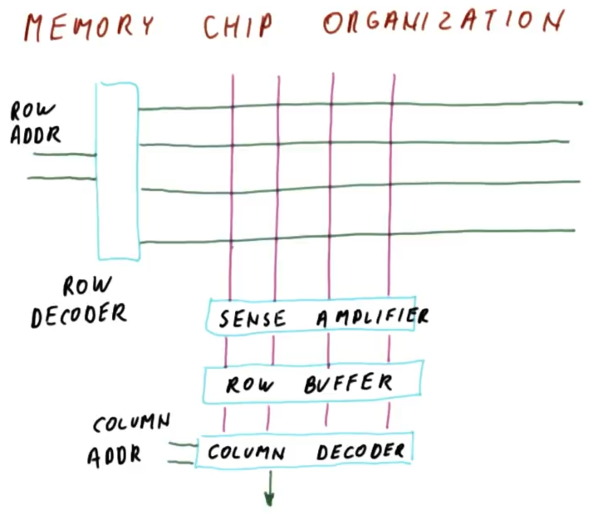
</center>

Having seen what a *single* bit looks like (cf. Sections 3-5), now consider the *entire* chip's organization (as in the figure shown above).

<center>
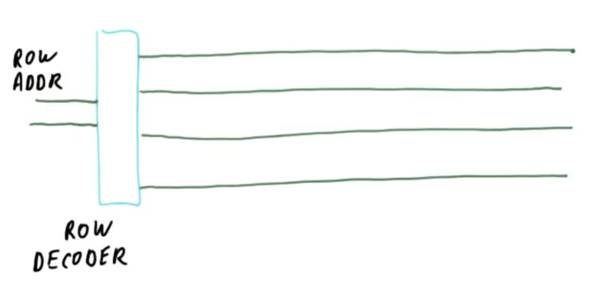
</center>

Recall (cf. Section 4) that there are **wordlines** which activate **memory cells**; there are several such wordlines (as in the figure shown above, denoted by green horizontal lines).

Among these wordlines, the **row decoder** decides which wordline gets activated. Correspondingly, the input fed into the row decoder is a series of bits of the address indicating which wordline to activate (only one wordline can be activated at a time in this manner), as provided by the **row address**.
  * ***N.B.*** The row decoder is therefore a "real decoder," in the sense that it takes a number input and performs a corresponding "output action" (i.e., wordline selection)

<center>
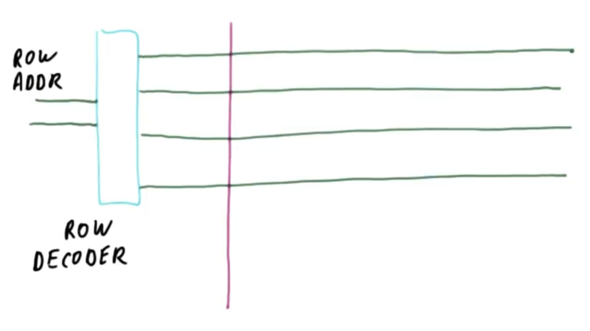
</center>

There is also an intersecting **bitline** (as in the figure shown above, denoted by magenta vertical line), and recall (cf. Section 4) that a memory cell correspondingly exists at ***each*** intersection of the bitline with the respective wordlines; correspondingly, the wordline itself is therefore the ***connection point*** between the memory cell and the bitline (i.e., via corresponding input bits from the row address, which identify the particular bitline intersection in question).

<center>
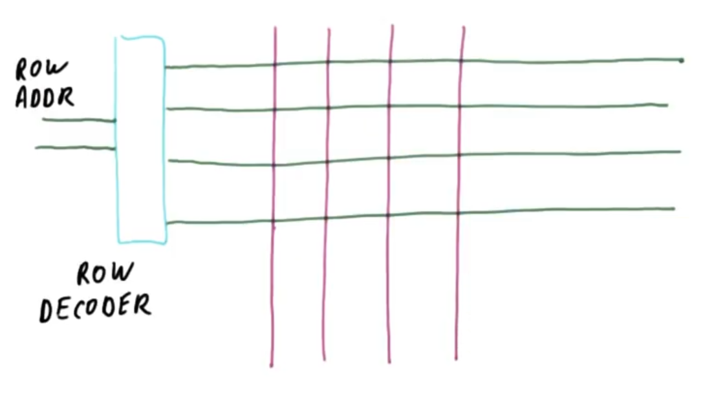
</center>

In general, there are several such bitline-wordlines intersections (as in the figure shown above, which depicts a four-by-four, 16-bit memory). In this example, four bits can output to the ***same*** bitline, and there are four corresponding bits activated by each of the wordlines; therefore, selection of a particular wordline (row) correspondingly outputs four bits from the row address to it.

<center>
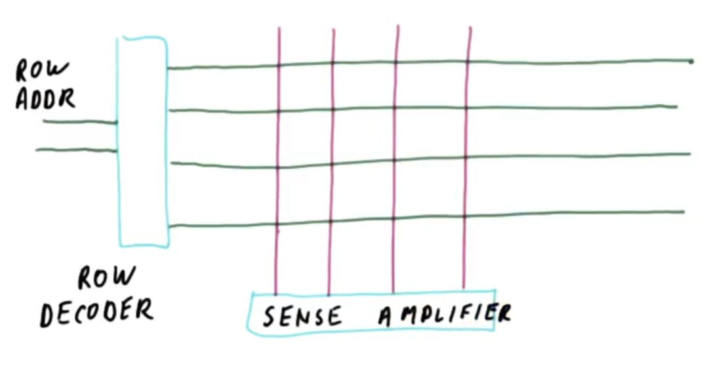
</center>

Generally, bitlines are very long. Recall (cf. Sections 3-5) that the memory cell is either:
  * 1 - A relatively weak static random access memory (SRAM) (in which case it slowly pulls the bitline one way or the other)
    * Given a weak cell, it is undesirable to wait for the particular memory cell to raise the entire bitline one way or the other (i.e., between values `0` and `1`).
  * 2 - A dynamic random access memory (DRM) (in which case it discharges a relatively small capacitor into this relatively long bitline)
    * Discharging a small capacitor into a long bitline causes a change in the voltage on the bitline, however, this change is relatively small (i.e., negligibly so relative to a "full level" switch from/to `0` or `1`).

For these reasons, the bitlines are typically connected to a device called a **sense amplifier** (as in the figure shown above). The purpose of the sense amplifier is to sense ***small*** changes on the bitline and then to consequently amplify these changes, which in turn facilitates the raising or lowering of the memory cell's bitline-wise voltage.
  * The sense amplifier in turn contains relatively powerful circuitry for each bitline, and is therefore significantly larger than a single row of memory cells, however, only one such sense amplifier is necessary for each corresponding set of bitlines (i.e., as opposed to on a per-bitline/wordline-intersection-memory-cell basis).

<center>
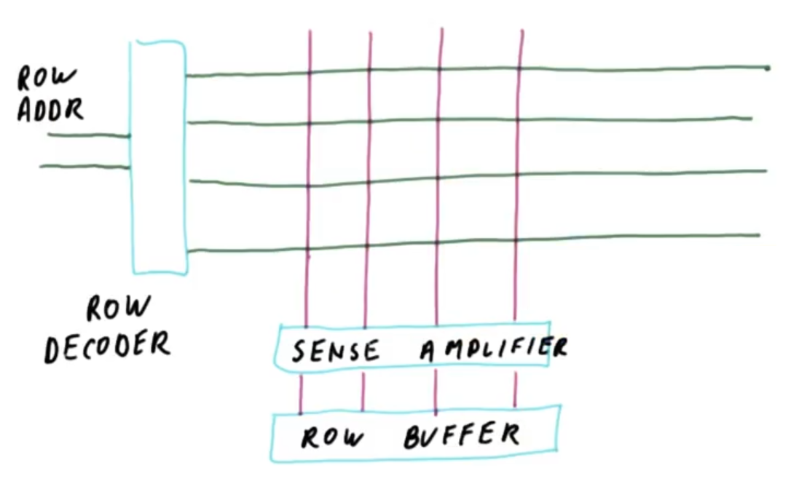
</center>

The signals that are produced by the sense amplifier (i.e., the "corrected" `1` or `0` bit) are subsequently fed into a storage element called the **row buffer** (as in the figure shown above). The row buffer stores the correct values read from the entire row of memory cells (i.e., four bits, in the case of a four-by-four memory).

<center>
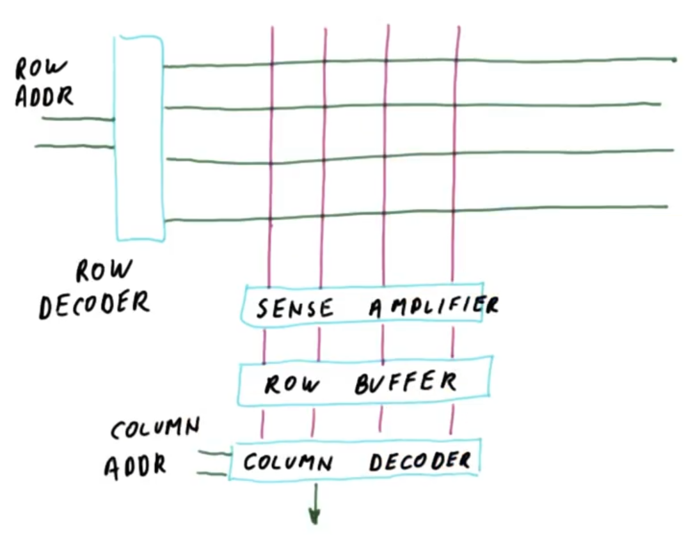
</center>

The row buffer in turn feeds the latched data to the **column decoder** (as in the figure shown above). The column decoder in turn selects the correct bit among the row-buffer bits using the **column address** (which itself is another part of the data address), thereby outputting a ***single bit***.

Therefore, to build a memory component having more than just one bit of data for a given location, this configuration is simply ***replicated*** accordingly (e.g., two sets will correspondingly output two bits of data given an input row address and column address; and so on).

### 8. Part 2

<center>

</center>

Consider now how to ***read*** a row of bits (as in the figure shown above). Assuming a dynamic random access memory (DRAM), consider the sequence of bits `1 0 1 1` drained into the corresponding respective bitlines. These values in turn propagate through the downstream elements (i.e., sense amplifier and row buffer). Finally, assume the column address selects the bit `0` for the output.

<center>
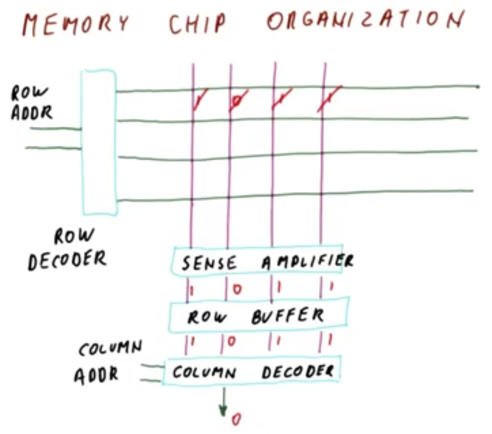
</center>

Recall (cf. Section 3) that dynamic random access memory (DRAM) reads are ***destructive***. Correspondingly, the original bits are ***invalidated*** on read (as in the figure shown above).

<center>
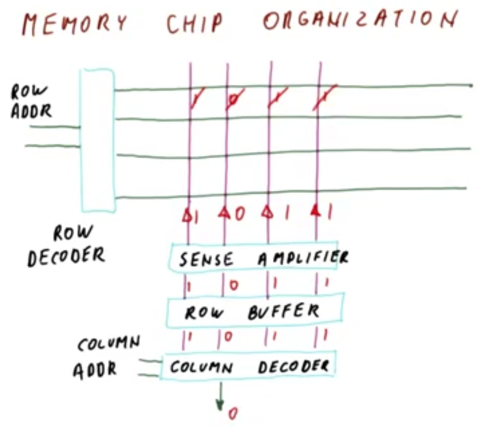
</center>

Consequently, after the sense amplifier determines the correct value of the bits (and correspondingly exhausting the respective memory cells in the process), it correspondingly ***reverses*** the direction and raises each of the bitlines to their respective original/correct values (as in the figure shown above).

<center>
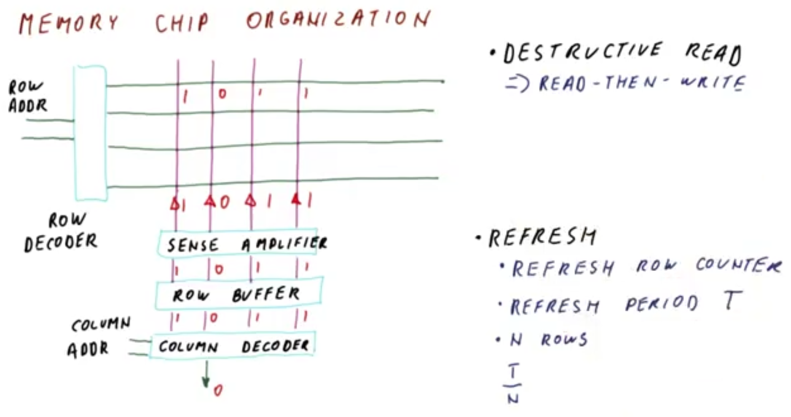
</center>

Therefore, **destructive reads** from dynamic random access memory (DRAM) amounts to ***read-then-write*** on a per-memory-cell basis (i.e., it is insufficient to simply "wait long enough" to retrieve the correct value, but rather it is additionally necessary to "wait long enough" to restore the original/correct value in the memory cell as well).
  * Correspondingly, this is one of the reasons that dynamic random access memory (DRAM) is slower than static random access memory (SRAM). Another reason for this disparity is that the memory cell does not pull the bitline as strongly in dynamic random memory access (DRAM), thereby necessitating a longer time for the sense amplifier to determine the appropriate bit values.

Subsequently to this read-then-write approach, the memory cells contain the original/correct values (i.e., `1 0 1 1`) and have been correspondingly **refreshed** (i.e., even if they have been reduced to 90% or so of their original value, they are subsequently restored to the "full" original value on refresh in this manner, thereby permitting subsequent "leak tolerance" prior to a subsequent read-then-write operation).

In this manner, refresh ensures that each row is read periodically. Given a time `T` (denoting the time for the memory cell to lose the value sufficiently to preclude its subsequent recoverability), then each row must be read-and-written within this time period. Furthermore, we cannot rely on the processor to access ***every*** row of memory in this manner simply for this purpose.
  * In fact, with caches, oftentimes certain rows are accessed more frequently than others by the processor, in which case these particular rows are not refreshed in this manner, but rather they occur as cache hits which are subsequently stored in the cache itself instead (and correspondingly "lapsing" in access time with respect to the memory itself).

To resolve this matter, there is a corresponding **refresh row counter**, which is initialized to `0` and subsequently periodically refreshes the respective rows in turn. Correspondingly, if a given row must be refreshed within some **refresh period** `T`, and given `N` such rows, then this refresh operation will occur at a ***frequency*** of:

```
T / N
```

Modern dynamic random access memory (DRAM) memory cells are composed of many such rows, but nevertheless have a refresh period of well under `1 second` (i.e., many such refreshes occur on a per-second basis). In fact, this significantly interferes with what can actually be read-and-written, as during a given refresh, an effective read operation cannot be performed during this time.

### 9. Memory Refresh Quiz and Answers

<center>
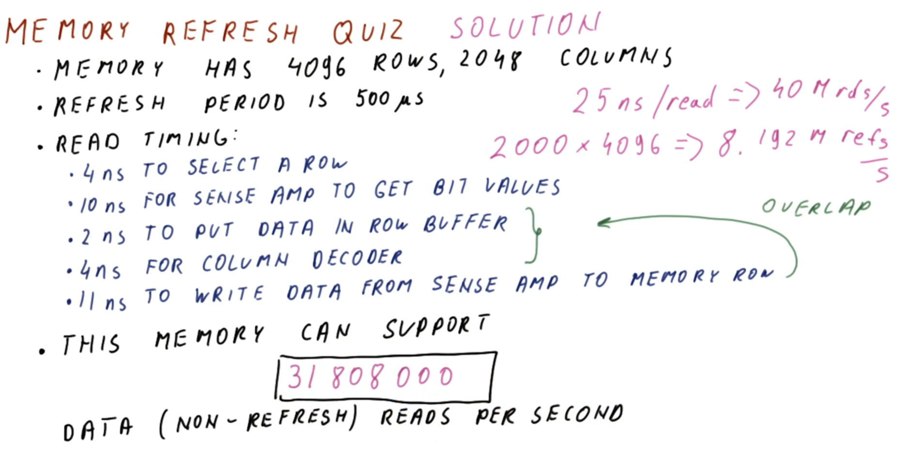
</center>

Consider a memory array comprised of the following:
  * `4096` rows and `2048` columns
  * a refresh period of `500 μs` per memory cell

Furthermore, assume that the timing for read operations is characterized by the following steps:
  * `4 ns` to select a row
  * `10 ns` for the sense amplifier to get the bit values from the row
  * `2 ns` to place the data in the row buffer
  * `4 ns` for the column decoder's operation
  * `11 ns` to write the data back from the sense amplifier to the memory row
    * ***N.B.*** This occurs effectively in parallel/overlapping with the previously indicated steps (i.e., column decoder operation and write back of the data by the sense amplifier)

How many data (non-refresh) reads per second can this memory-array system support?
  * `31,808,000`

***Explanation***:

One read operation effectively requires `(4 + 10 + 11) ns = 25 ns` (where the `11 ns` interval overlaps with the corresponding `(2 + 4) ns = 6 ns`). In principle, this would allow for up to `(1 read / 25 ns) × (10^9 ns / 1 s) = 4 * 10^10 reads/s`, if ***only*** reads were the necessary operation.

However, there is an additional ***complication*** here: Recall (cf. Section 8) that **refreshes** are also a relevant factor here. Correspondingly, this requires `(1 refresh / 500 μs) × (10^6 μs / 1 s) = 2000 refreshes/s`, and each such refresh must be performed on a per-row basis, which in turn requires a corresponding `25 ns` interval (i.e., the same amount for the refresh as for the read operation, since these cannot occur simultaneously). This correspondingly amounts to:

```
(2000 refreshes/s/row) × (4096 rows) = 8.192 * 10^9 refreshes/s
```

Therefore, this leaves effectively:

```
40,000,000 reads/s - 8,192,000 refreshes/s = 31,808,000 non-refresh reads/s
```

### 10. Part 3

<center>
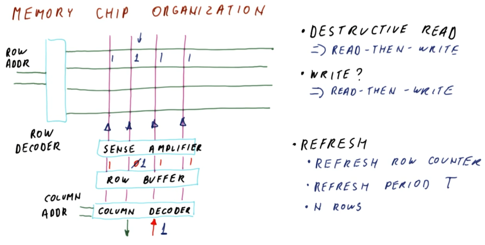
</center>

So, then, how are ***write*** operations to memory performed?

<center>
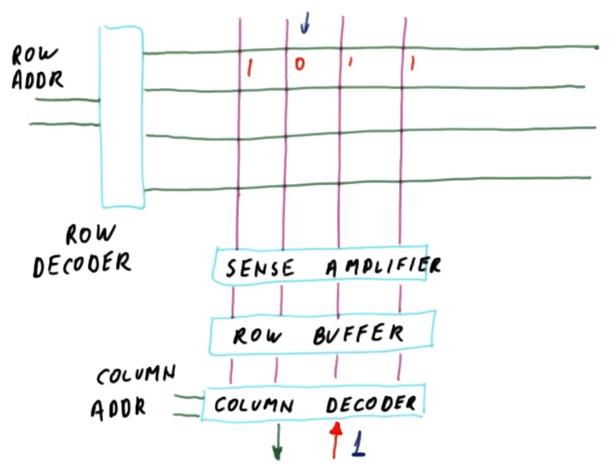
</center>

Consider the case of updating one of the memory cells (as in the figure shown above). The row address selects the corresponding row of the cell (rather than an individual cell); however, an input is supplied to the column decoder (e.g., `1`) targeting the specific memory cell in question.
  * Targeting a specific memory cell in this manner is challenging, as driving the value back into the row can generally impact the *entire* row, not just the particular memory cell in question.

<center>
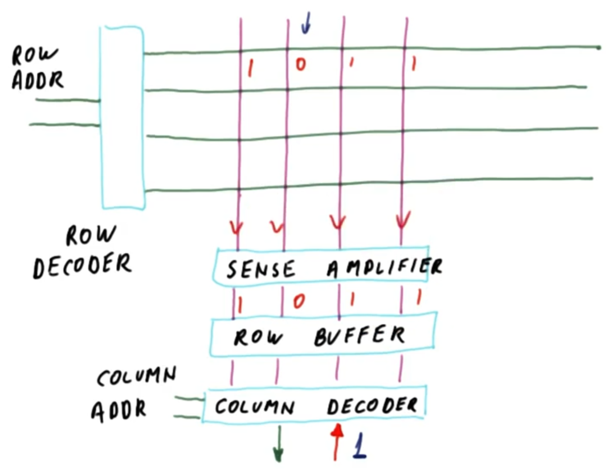
</center>

To achieve writing in this manner, instead, the row address first selects the row, and then the bits are read out into the sense amplifier, which in turn passes them down to the row buffer which latches the values (as in the figure shown above).

<center>
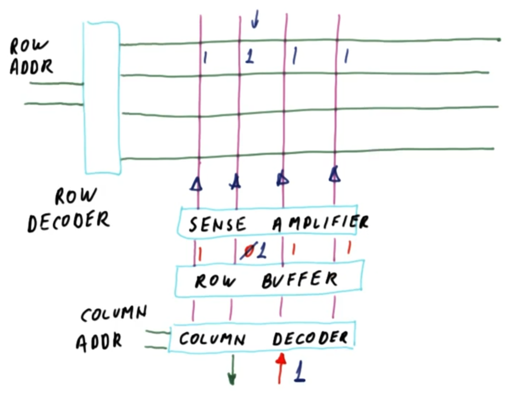
</center>

Subsequently, the write-input value (i.e., `1`) is written into the row buffer, and then the entire set of values is written back into the row (as in the figure shown above).
  * ***N.B.*** The row values have effectively been lost on initial read into the row buffer at this point, so a write back is necessary regardless.

Therefore, as demonstrated here, a ***write*** operation (similarly to a ***read*** operation) entails a ***read-then-write*** operation.

## 11. Fast Page Mode
