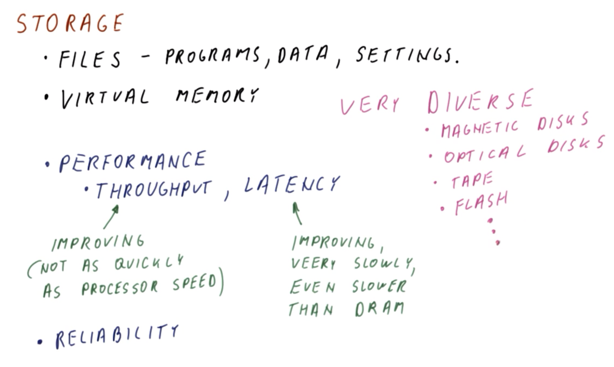

# Storage

## 1. Lesson Introduction

This lesson will discuss **storage systems** (e.g., hard drives) and how they are connected to the rest of the computer. This will facilitate in understanding why they are so much slower than main memory, but can also store comparatively much more data.

## 2. Storage

Consider the role of **storage** in a computer system:
  * 1 - Storage maintains all of the **files** (e.g., programs, data, settings, the operating system, etc.).
  * 2 - **Virtual memory** is also implemented using storage.
    * It is not possible to fit *all* of the data required by *all* applications *simultaneously* in main/physical memory; instead, many of those pages actually reside ***on disk***, and therefore when the program(s) accesses these pages, they are subsequently loaded into main/physical memory.

For both (and other) of these uses of storage, ***performance*** is a critical concern, most notably:
  * Throughput (i.e., bytes per-unit time)
    * With respect to storage performance, increased throughput is improving over time, however, ***not*** as quickly processor speed has improved concomitantly.
  * Latency (i.e., response time to return a page of data upon request)
    * With respect to storage performance, decreased latency is improving, but relatively very slowly (even more slowly than dynamic random access memory [DRAM])

In addition to performance, ***reliability*** is another critical concern.
  * If the processor fails, then the system is temporarily "out of commission" until the processor can be replaced. However, on restoration of the processor, it is expected that the system will reboot and consequently return to its "normal" state.
  * Conversely, if the storage (i.e., disk) fails, then this is a ***catastrophic loss*** with respect to programs, data, settings, etc. Therefore, reliability is an even more critical concern with respect to storage than with respect to most other components of the computer system in this particular regard.

Lastly, the types of storage that can be used in practice are actually quite ***diverse***,e.g.,:
  * magnetic disks (traditional hard drives)
  * optical disks (compact discs [CDs], digital video discs [DVDs], etc.)
  * tape (i.e., for backup)
  * flash drives
  * etc.

## 3-6. Magnetic Disks

### 3. Introduction
