# Storage

## 1. Lesson Introduction

This lesson will discuss **storage systems** (e.g., hard drives) and how they are connected to the rest of the computer. This will facilitate in understanding why they are so much slower than main memory, but can also store comparatively much more data.

## 2. Storage

<center>

</center>

Consider the role of **storage** in a computer system:
  * 1 - Storage maintains all of the **files** (e.g., programs, data, settings, the operating system, etc.).
  * 2 - **Virtual memory** is also implemented using storage.
    * It is not possible to fit *all* of the data required by *all* applications *simultaneously* in main/physical memory; instead, many of those pages actually reside ***on disk***, and therefore when the program(s) accesses these pages, they are subsequently loaded into main/physical memory.

For both (and other) of these uses of storage, ***performance*** is a critical concern, most notably:
  * Throughput (i.e., bytes per-unit time)
    * With respect to storage performance, increased throughput is improving over time, however, ***not*** as quickly processor speed has improved concomitantly.
  * Latency (i.e., response time to return a page of data upon request)
    * With respect to storage performance, decreased latency is improving, but relatively very slowly (even more slowly than dynamic random access memory [DRAM])

In addition to performance, ***reliability*** is another critical concern.
  * If the processor fails, then the system is temporarily "out of commission" until the processor can be replaced. However, on restoration of the processor, it is expected that the system will reboot and consequently return to its "normal" state.
  * Conversely, if the storage (i.e., disk) fails, then this is a ***catastrophic loss*** with respect to programs, data, settings, etc. Therefore, reliability is an even more critical concern with respect to storage than with respect to most other components of the computer system in this particular regard.

Lastly, the types of storage that can be used in practice are actually quite ***diverse***, e.g.,:
  * magnetic disks (traditional hard drives)
  * optical disks (compact discs [CDs], digital video discs [DVDs], etc.)
  * tape (i.e., for backup)
  * flash drives
  * etc.

## 3-6. Magnetic Disks

### 3. Introduction

<center>
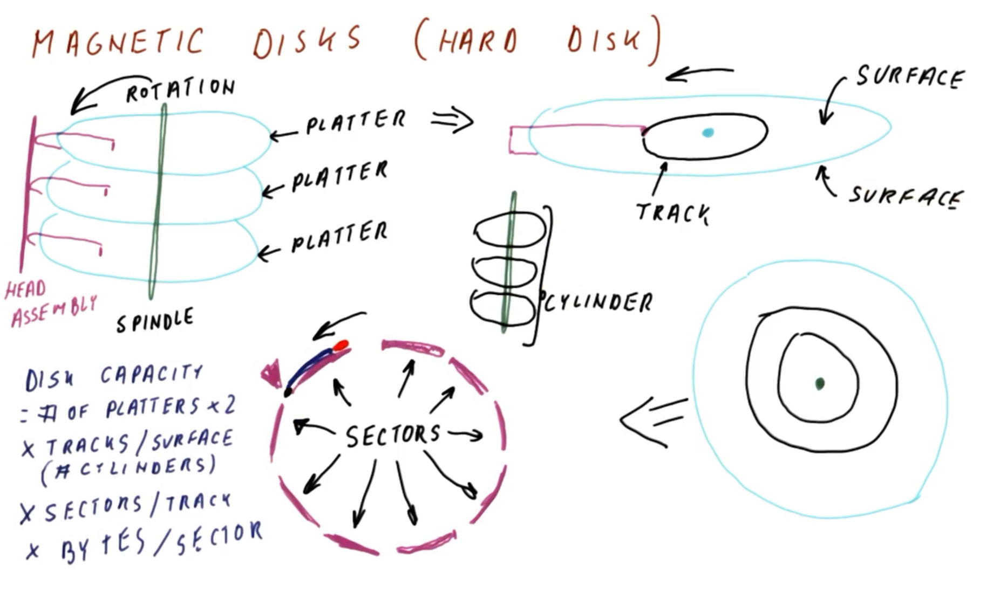
</center>

Consider **magnetic disks** (generally called **hard disks** presently), as in the figure shown above.
  * ***N.B.*** So called (older) "floppy disks" are also magnetic disks, and work along the same lines, however, hard disks are much more ubiquitous in present day.

<center>
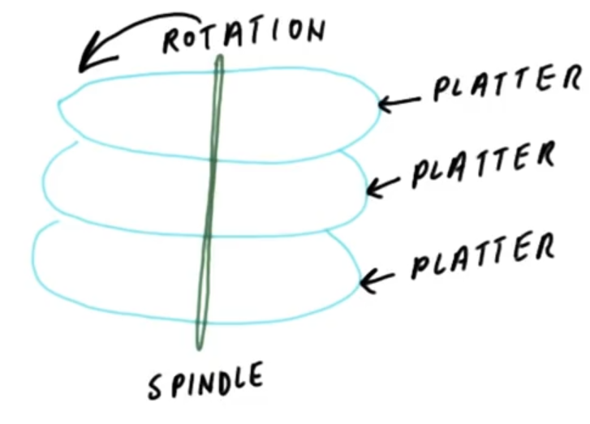
</center>

A magnetic disk (as in the figure shown above) has a **spindle** to which **platters** are attached. These platters are attached to the ***same*** spindle (rotated by a motor), thereby rotating at a ***uniform*** speed accordingly.

<center>
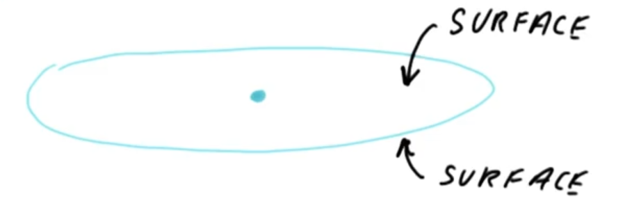
</center>

Examining a single such platter (as in the figure shown above), both sides of the surface are coated in a magnetic material. Each such surface contains the constituent **data bits**.

<center>
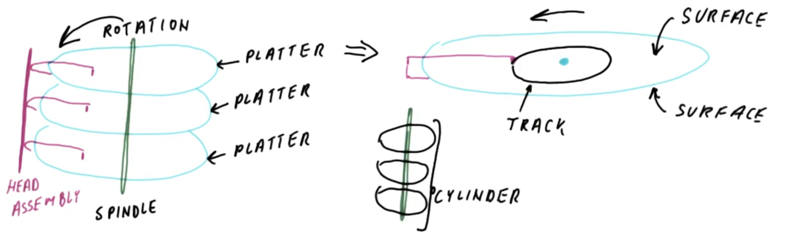
</center>

The data bits are accessed via a **magnetic head** (as in the figure shown above), which is attached to a **head assembly**, which moves all of these magnetic heads in unison.

Since typically the head assembly is ***stationary*** relative to the rotating surfaces, the magnetic head correspondingly accesses the associated surface at a given "concentric circle" distance from the center/spindle, called a **track** (furthermore, this is true for ***all*** of the head/surface pairs). All of the tracks at this given radial distance from the spindle form what is collectively called a **cylinder**, comprised of the set of all tracks from each surface (all of which can be correspondingly accessed simultaneously by their respective magnetic heads at any given time).

<center>
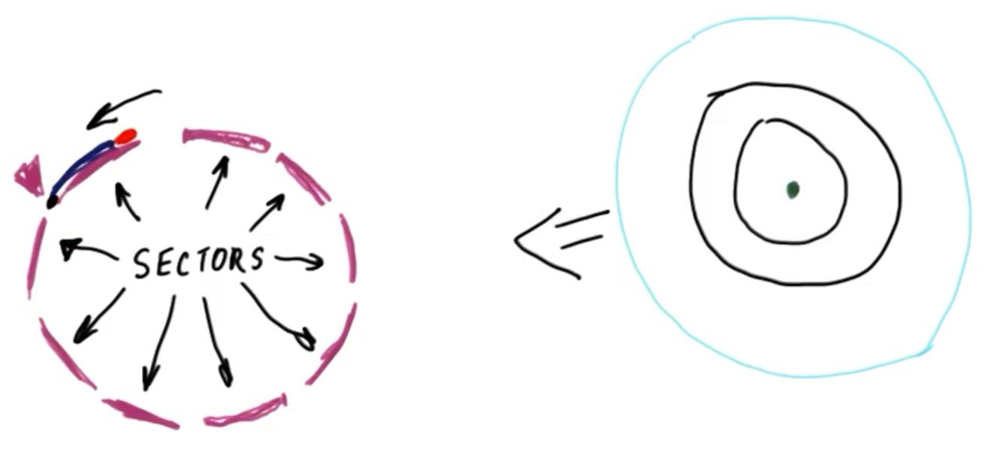
</center>

In order to ***vary*** the track that is accessed on a given surface, the magnetic head simply changes its radial distance relative to the spindle. Based on this geometric configuration, the data bits are therefore naturally ***organized*** on a track-wise basis (as in the figure shown above, from the "top" view of a given platter).

Generally, a given track does not store data continuously (since generally a given track is comprised of ***many*** data bits), but rather a give track is divided into **sectors**, where a sector is the smallest unit that can be read. As the disk rotates (as in the figure shown above), a given sector will pass under the magnetic head and provide the following information:
  * **preamble**  (denoted by black dot in the figure shown above) → a recognizable bit pattern indicating the start of a sector
  * **data bits** (denoted by blue in the figure shown above) → the actual data
  * **checksum** and other error-correction data (denoted by red in the figure shown above) → used to correct possible errors in the read sector

Therefore, when the head assembly reaches a particular cylinder, the corresponding magnetic heads commence searching for the beginning of a sector. Once the preamble is identified, the magnetic heads correspondingly become "oriented" with respect to the location within the track itself.

Given this, the **disk capacity** can therefore be defined as:

```
disk capacity = (# platters) × (2 surfaces per platter) × (# tracks per surface) × (# sectors per track) × (# bytes per sector)
```
  * ***N.B.*** `# tracks per surface` is equivalent to the `# cylinders`

Typical quantity sizes for these factors are as follows:
  * `# platters` → `1` to `4` or so
  * `# tracks per surface` → thousands
  * `# sectors per track` → tens to hundreds
  * `# bytes per sector` →  `0.5` to `1` kilobytes

To accommodate relative large capacities in relatively small physical space:
  * The head assembly and cylinder-spindles collectively must be relatively thin (with the platters correspondingly very spatially close together).
    * A typical feature size is `2.5 inches` in total width, with tracks spaced very closely together.
  * Furthermore, the head assembly must be very precise in its positioning for accurate reading.

### 4. Access Times for Magnetic Disks

<center>
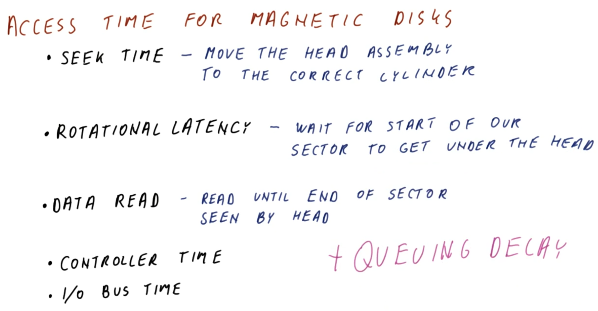
</center>

Consider now how to access data on a magnetic disk, and the corresponding **access time** required to retrieve this data.

Assuming that the disk is already spinning (otherwise, if not, then this adds an additional several-seconds delay to spin up the disks, however, typically if data is accessed frequently, then the disk is persistently spinning), then the access time per disk access is comprised of the following **time components**:
  * **seek time** → the time required to move the head assembly to the corresponding cylinder for the target data
  * **rotational latency** → upon positioning the magnetic head at the correct cylinder, there is an additional time/delay required to position the head within the given track on the preamble of the target sector
  * **data read** → the time required for the magnetic head to read the track through the end of the sector
    * This depends on both the speed of rotation and the number of sectors per track. For example, if the entire track is just *one* sector, then the data read operation will comprise a full rotation of the disk; otherwise, if the track is comprised of *ten* sectors, then the data read operation will comprise one-tenth of a disk rotation; and so on.
  * **controller time** → the time required for the disk controller to check the checksum, verify correctness of the sector, etc.
  * **input/output (I/O) bus time** → once the data is read and verified, this is the time required to send the data to main memory

Note that unlike a cache or a dynamic random access memory (DRAM), wherein multiple accesses can be performed simultaneously, conversely, on a magnetic disk, on a seek is performed with respect to a given track, it is not possible to simultaneously read other tracks; therefore, effectively, disk accesses occur ***one at a time*** in the aforementioned manner (i.e., only on a per-track basis).

Typically the access time for a disk request by the operating system is comprised of the aforementioned disk access time, as well as a **queuing delay**, due to pending completion of a previous access, thereby preventing a subsequent access from occurring until its completion.

### 5. Disk Access Time Quiz and Answers

<center>

</center>

Consider a magnetic disk assembly comprised of the following:
  * `1000` cylinders
  * `10` sectors per track
  * the head assembly is initialized to a position at cylinder `0` (where the cylinders are numbered `0` through `9999`)
  * the speed of head assembly movement is `10 µs` per cylinder (i.e., linear movement in the radial direction)
  * disk rotation of `100` times per second
  * "perfect" controller and bus (i.e., "very fast" relative to the head assembly movement speed)
  * there is no previous request (i.e., no queuing delay)

What is the average time to read a randomly selected byte from the disk (where every byte has the *same* chance of being selected)?
  * `11 ms`

***Explanation***:

The read time will be constituted by the seek time, rotational latency, and data read operations.

With respect to the seek time, since the head assembly is initialized to a position of cylinder `0`, and the distribution of the data locations is random, then on average seeking will occur at a distance of `0.5 × 1000 = 500` cylinders, requiring a corresponding seek time of `(10 µs/cylinder) × 500 cylinders = 5 ms`.

With the magnetic head placed on the correct track, by similar rationale, the average rotational latency for a randomly distributed data set will be half of a rotation (it may land either directly on the correct track, a full rotation away from the correct track, or some intermediate variation of these on any given disk read), i.e., `(1 s / 100 rotations) × 0.5 rotations = 5 ms`.

Finally, to read the data, since there are `10` sectors per track, then a data read operation will require one tenth of a rotation, or `(1 s / 100 rotations) × 0.1 rotations = 1 ms`.

Therefore, the average disk-access read time is:

```
5 + 5 + 1 ms = 11 ms
```

### 6. Trends for Magnetic Disks

<center>
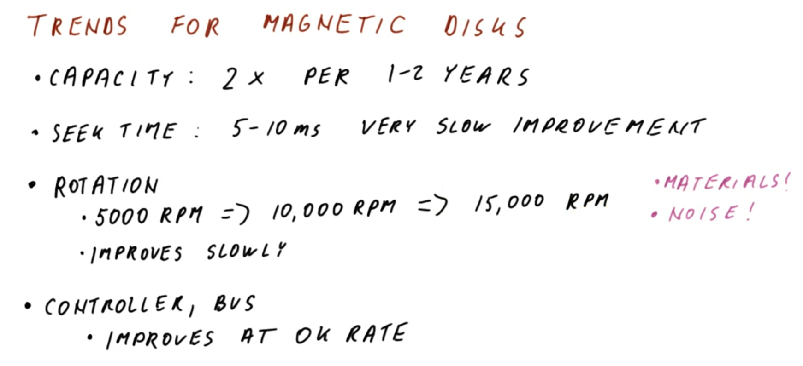
</center>

There are several observed **trends** for magnetic disks over recent years, as follows:
  * The **capacity** (i.e., how much data fits on a single disk) has been improving exponentially at a rate of approximately doubling every 1-2 years for several years
  * The **seek time** has consistently stayed around 5-10 ms for several years, with only very slow/slight improvements over this time frame
    * The only way to improve seek time is to either increase the motor speed while maintaining precise head-assembly operation (which is difficult to achieve) or to make platter smaller in order to decrease the radial traversal distance (in this respect, the platter size has been reduced from 5 in. diameter disks to 3.5 in. diameter and even more recently to 2.5 in. diameter), with the latter constituting the majority factor for more recent improvements.
    * Consequently, improvements to seek time are correspondingly very slow/gradual.
  * The **rotation speed** has improved steadily, from `5000` rotations per minute (RPM) to `10,000` RPM to (most recently) `15,000` RPM
    * This type of improvement requires advancements in the material composition of the platter itself.
    * Additionally, another relevant factor is the resulting noise from the rotation itself. Disks that rotate faster tend to be both noisier and create a higher pitched sound, which are deemed to be unpleasant characteristics for consumers of the disks.
    * Correspondingly, these factors give rise to only relatively slow/incremental improvements on rotation speed.
  * The speed of **disk controllers** and **buses** for data transfer have been improving at a modest rate, primarily by constituting an increasingly smaller fraction of the overall disk access time (whereby the disk access time is increasingly becoming dominated by the seek time, and to a lesser extent the rotational latency)

As these trends demonstrate collectively, improvements in magnetic disks have been lagging relative to improvements in main memory and in processors. This is primarily due to the mechanical and material constraints of magnetic disks, neither of which are readily amenable to improvements on the order of Moore's law.

## 7. Optical Disks

<center>
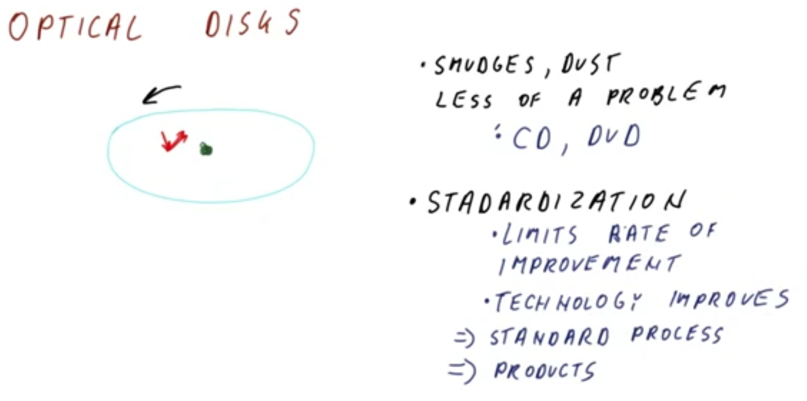
</center>

An **optical disk** is similar to a magnetic disk in the sense that it also has a rotating platter which stores data bits on its surface.

However, a key difference with an optical disk (relative to a magnetic disk) is that instead of using a magnetic head placed closely to the disk's surface, instead an optical disk shoots a **laser** at the surface which is then reflected by the surface material and subsequently detected as a data bit (i.e., `0` or `1`).
  * Otherwise, many of the other properties of optical disks are very similar to hard disks (e.g., tracks, etc.), however.

Furthermore, unlike magnetic-disk hard drives (which tend to be enclosed hardware units that are not otherwise portable on installation into a computer system), since optical disks do not require precise placement of a magnetic head (but rather rely on non-mechanically-contacting lasers/optics), consequently smudges, dust particles, and other surface anomalies are less problematic to the operation of optical disks.
  * Consequently, optical disks in the form of compact discs (CDs) and digital video discs (DVDs) are **portable** and resistant to these surface anomalies.

However, as a consequence of this portability, optical disks must be **standardized** for interoperability with corresponding optical drives (e.g., CD players, DVD players, etc.).
  * This standardization also limits the rate of improvement, because even as the technology itself improves, it must subsequently pass through a standards process before finally being commercialized as a product. Therefore, technological advancements may consequently "lag" behind production/commercialization for this reason.
  * Conversely, with magnetic-disk hard drives, while the physical enclosure size is relatively standardized (along with its connectors to the computer system), the actual "interior" hardware implementation is relatively flexible and thus more congruent with the pace of the technological advancement itself.

## 8. Magnetic Tape

<center>
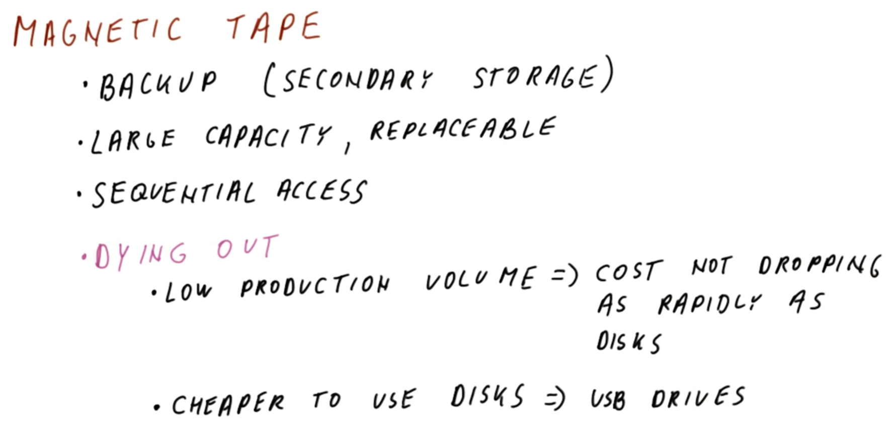
</center>

**Magnetic tape** is typically used for backup purposes (and therefore also called **secondary storage** for this reason), meaning that it is usually *not* the first-in-line occurrence of where the data itself is sought (which instead is typically constituted by a hard drive).

Magnetic tapes can have large capacities and are typically replaceable (i.e., swapped in/out with a like-for-like tape roll attachment into the tape machine).

The access of magnetic tapes is fundamentally **sequential**, meaning that seeking operations are performed along the length of the tape itself until the target data is located.
  * Therefore, tapes are ***advantageous*** for backups, restoring backups, etc., which typically involve writing data sequentially for long time periods, or otherwise reading data sequentially for a long time in a similar manner.
  * Conversely, magnetic tapes are ***not*** well suited for virtual memory (and related) due to this limitation (i.e., sequential rather than random-access).

In the modern landscape, magnetic tapes are slowly dying out, due to several reasons:
  * Low production volume due to relatively low demand, resulting in cost not dropping at a rate on par with that of disks (which conversely have a high activity in mass production, thereby decreasing their per-unit costs over time)
  * It is cheaper to use and operate disks, since the corresponding hardware (i.e., tape machines vs. hard-drive packages and universal serial bus [USB] drives) is much more economical to manufacture and maintain, particularly in the mass consumers market

## 9. Disks and Tape Quiz and Answers

<center>

</center>

With respect to the distinction between disk and tape, consider the following applications and select which is/are appropriate for that particular application in order to optimize performance:

| Application | Disk | Tape |
|:--:|:--:|:--:|
| Read an *entire* 1 GB file from start to end | `√` - Disk is amenable to sequential access in this manner | `√` - Tape is well suited for sequential access in this manner |
| Read *only* the first and last byte of a 1 GB file |`√` - Disk is well suited for random access memory, including specific bytes (i.e., first and last) | `X` - Due to the sequential access constraint of tape, this is a sub-optimal medium as it will require traversing the entire length of tape simply to read these two bytes |
| Make a cat happy | `X` | `√` - Youtube substantiates the claim that cats are more entertained by long, string-like targets |

## 10. Using Random Access Memory (RAM) for Storage?

<center>
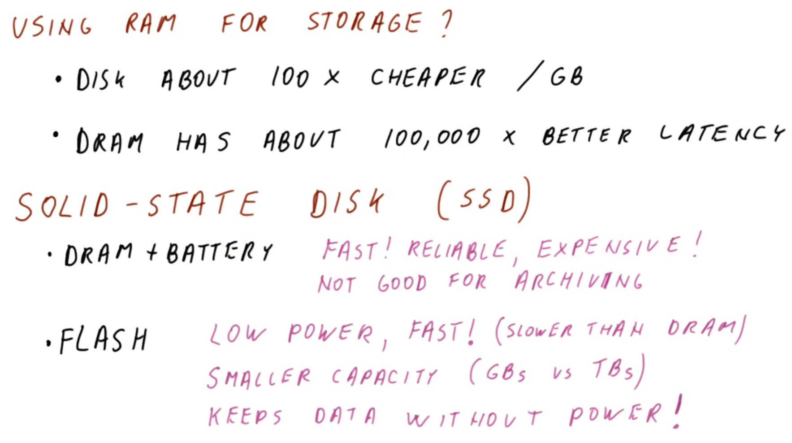
</center>

Having seen that magnetic-disk hard drives do not benefit from Moore's law trends (cf. Section 6), this begs the question: Would random access memory (RAM), and particularly dynamic RAM (DRAM), be useful for storage (i.e., given that they *do* demonstrate Moore's law trends with respect to capacity [cf. Lesson 15])?
  * Recall (cf. Lesson 15) that dynamic random access memory (DRAM) have increasing capacity at a comparable rate to magnetic-disk hard drives, but conversely have much faster access times (cf. approximately `10 ms` for hard drives vs. well under `1 µs` for DRAM).

There are a several ***reasons*** why this has *not* the case in practice (i.e., using memory for storage), notably the fact that magnetic-disk hard drives are on the order of `100×` cheaper to manufacture on a per-gigabyte basis.
  * Conversely, dynamic random access memory (DRAM) has on the order of `100,000×` better (i.e., lower) latency.

More recently, an emerging trend of **solid-state disks (SSDs)** has become more common.
  * ***N.B.*** "Disk" in this context is a misnomer, as such devices are not disks at all, but rather comprised of static eletronic-storage components (i.e., "solid state"). However, since the connotation of "disks" with respect to storage is a de facto "conventional" designation, this nomenclature has persisted in this context as well.

One ***approach*** to manufacture such a solid-state disk (SSD) is to use a dynamic random access memory (DRAM) (along with a controller to refresh it) combined with a battery (which persists the data on the DRAM to prevent losing it).
  * This approach is very ***fast*** and ***reliable*** (more so than even the magnetic-disk hard drive itself), however, it is also very ***expensive*** to implement.
  * Furthermore, this approach is ***not*** well suited for archiving data, because once the battery depletes, then the data is no longer persisted (conversely, a magnetic-disk hard drive can persist data virtually indefinitely, provided that the hardware components do not wear out).

Another ***approach*** is to use so called **flash memory**, which is manufactured using similar technology to that for dynamic random access memory (DRAM) modules and processors, correspondingly using transistors to store the constituent data (and thereby benefitting from Moore's law trends accordingly).
  * This approach consumes very ***little power*** (it does not require a constantly spinning disk and other moving mechanical parts as in the case of a magnetic-disk hard drive, but rather has a lot of "idle" power usage periods), and is also very ***fast*** (much faster than magnetic-disk hard drives, but slower than DRAM).
  * However, this approach has ***smaller capacity*** (gigabytes) compared to magnetic-disk hard drives (terabytes).
  * A key advantage of flash memory (i.e., relative to the DRAM/battery approach) is that it persists data even without power.

## 11. Hybrid Magnetic-Flash

<center>
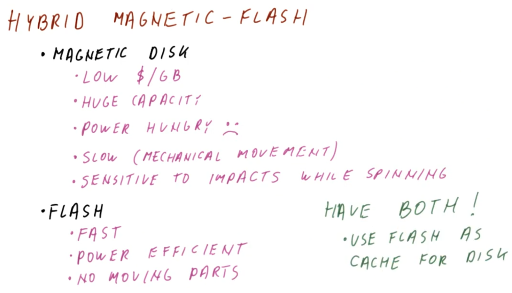
</center>

One popular approach is to combine magnetic disks with flash-drive technology.

Magnetic disks are characterized by the following:
  * benefits:
    * cheap to manufacture (i.e., low cost per-unit gigabyte)
    * can be built to have large capacities (on the order of terabytes in a relatively small physical package)
  * drawbacks:
    * very power-consumptive (it spins constantly, thereby consuming power even when not accessing data)
    * slow due to mechanical movement of its constituent parts
    * sensitive to physical perturbations (e.g., falling to the ground) while spinning, and susceptible to damage in this manner

Conversely, flash drives are characterized by the following benefits:
  * fast
  * power-efficient (due to no moving mechanical parts)
  * more resistant to physical perturbations

Therefore, the idea is to combine these two technologies to optimize for their relative benefits, thereby effectively using the flash drive as a cache for the magnetic disk.
  * In this manner, most of the data is stored on the magnetic disk (therefore benefiting from its capacity advantage), whereas the frequently accessed data is placed on the flash drive (benefiting from its mechanical properties and fast access times).
  * Furthermore, if the flash drive has sufficient capacity, this may even obviate the need to keep the magnetic disk spinning constantly, as it can be spun down and powered down and only otherwise accessed on "flash miss."
  * Lastly, since neither require power to persist the data, powering down the computer system will also not impact the stored data on either medium (i.e., as opposed to "hybridizing" magnetic disks with DRAM, with the latter requiring power to persist the data).

## 12. Flash vs. Disk vs. Both Quiz and Answers

<center>
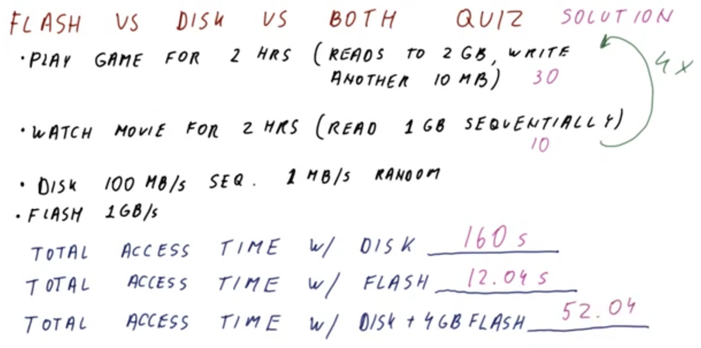
</center>

Consider a user who performs the following sequence of actions on their computer system:
  * 1 - Plays a game for `2` hours (comprised of reading `2 GB`, followed by writing another `10 MB`)
  * 2 - Watches a movie for `2` hours (comprised of reading `1 GB` of sequential data)

Furthermore, this sequence (game followed by movie) is performed `4` times total.

The disk is characterized as follows:
  * `100 MB/s` for sequential reads/writes
  * `1 MB/s` for random reads/writes
  * `1 GB/s` for flash read/writes

What is the total access time using the following hardware configurations?
  * disk only
    * `160 s`
  * flash only
    * `12.04 s`
  * disk with `4 GB` flash (with initially empty "flash cache")
    * `52.04 s`

***Explanation***:

For "disk only" configuration, each (sequential) read requires `2 GB / (100 MB/s) = 20 s` and each (random) write requires `10 MB / (1 MB/s) = 10 s`, for a total of `20 + 10 = 30 s` per game play. Similarly, each movie will require a (sequential) read of `1 GB / (100 MB/s) = 10 s`. Cumulatively, this requires:

```
4 × (20 + 10 + 10) s = 160 s
```

For "flash only" configuration, each (sequential) read requires `2 GB / (1 GB/s) = 2 s` and each (random) write requires `10 MB / (1 GB/s) = 0.1 s`, for a total of `2 + 0.1 = 2.1 s` per game play. Similarly, each movie will require a (sequential) read of `1 GB / (1 GB/s) = 1 s`. Cumulatively, this requires:

```
4 × (2 + 0.1 + 1) s = 12.04 s
```


For "disk with `4 GB` flash" configuration, the first (sequential) read requires `2 GB / (100 MB/s) = 20 s` and the first (random) write requires `10 MB / (1 MB/s) = 10 s`, for a total of `20 + 10 = 30 s` for first game play. Similarly, the first movie will require a (sequential) read of `1 GB / (100 MB/s) = 10 s`. However, the subsequent three re-plays and re-watches will be characterized by the flash drive (i.e., `2.1 s` and `1 s`, respectively), after an additional initial `2 + 0.1 + 1 = 3.01 s` to copy the data over to the flash drive. Cumulatively, this requires:

```
[20 + 10 + 10] + [2 + 0.1 + 1] + [3 × (2 + 0.1 + 1)] s = 52.04 s
```

***N.B.*** While not as fast as the "pure flash drive," this "hybrid" approach has a much faster access time compared to "pure magnetic disk" but at a comparable price to manufacture the former (cf. `4 GB` of flash memory is relatively cheap to manufacture with modern technology).

## 13. Connecting Input/Output (I/O) Devices

<center>
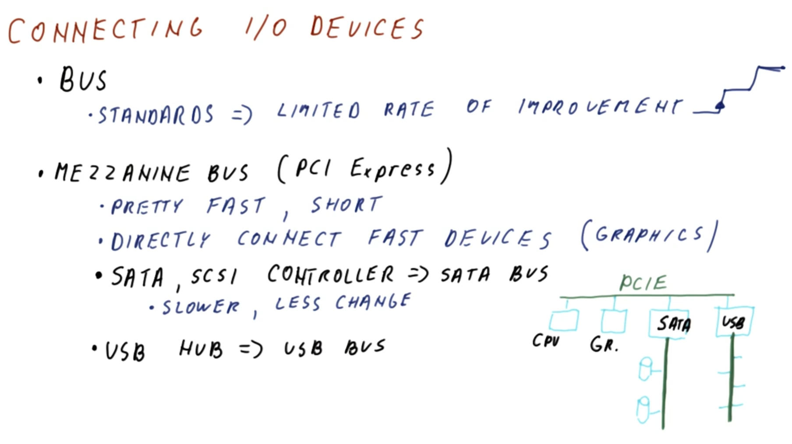
</center>

Having examined various storage devices in this lesson, now consider how they and other **input/output (I/O) devices** can be connected to the computer system.

Typically, **input/output (I/O) devices** are connected using some type of standardized **input/output (I/O) bus**.
  * **Standards** are necessary for this purpose, in order to increase/improve interoperability among these devices (e.g., connecting a hard drive from one manufacturer to a computer built by another).
  * However, due to this necessity for standards, there is a correspondingly ***limited*** rate of improvement, which often occurs incrementally in steps (i.e., while the underlying technology itself may improve in a more "smooth" fashion, adoption of corresponding standards tends to lag and occur more in a "step-wise" manner).

Furthermore, rather than having a *single* type of input/output (I/O) bus which connects to *all* input/output (I/O) devices, instead, there is typically a ***hierarchy*** of buses (as in the figure shown above), as follows:
  * A **mezzanine bus** (e.g., peripheral component interconnect express [PCIe]) at the top level, which is characterized by fast speed (facilitated by short connections), and connecting directly between the fast devices (e.g., graphics) and the processor.
  * The **storage buses** (e.g., serial advanced technology attachment [SATA] and small computer system interface [SCSI, pronounced "scuzzy"]) at the next level for connecting storage devices (e.g., hard drives), which are specialized for storage and are correspondingly slower but experience less frequent changes in their standards (furthermore, due to the comparably slower speed, frequent changes are not required in the first place, when such a faster alternative already exists).
    * ***N.B.*** A serial advanced technology attachment (SATA) controller acts as a peripheral component interconnect express (PCIe) device on the mezzanine bus, though the controller itself actually controls a SATA bus to which such storage devices are connected. Correspondingly, relative changes in the standards do not impact interoperability accordingly.
  * The **universal serial bus (USB) bus** (e.g., universal serial bus [USB] hub) provides a relatively lower level of connection in the hierarchy, which connects to the mezzanine bus but provides the USB connection for even slower USB devices (with correspondingly much longer standing/stable standards) which are ubiquitous and relatively cheap to manufacture.

Per this hierarchy, note that in general the closer that the bus works directly with higher performance components (e.g., the processor, graphics, and bus controllers), the more important it is to keep improving speed and performance. Conversely, lower in the hierarchy (e.g., storage and other peripherals), "sub-busing" in this manner still provides acceptable performance, while being more amenable to standardization (which is correspondingly important for mass production and ubiquitous usage and interchange of such devices).

## 14. Lesson Outro

Having examined how storage devices work and how they are connected to the processor in this lesson, consider now: What happens when these storage devices ***fail***? The next lesson describes these failure modes, and how to avoid them.
