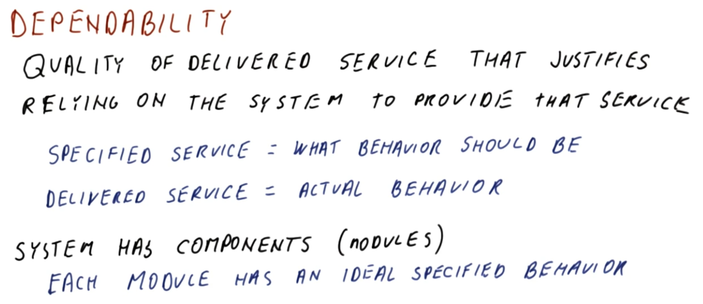
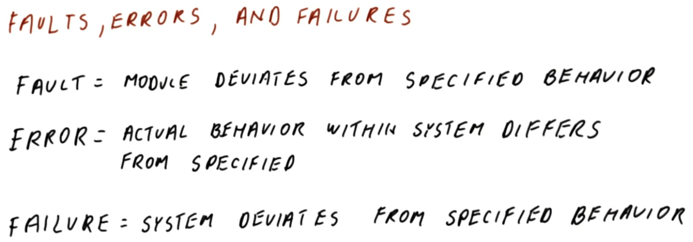
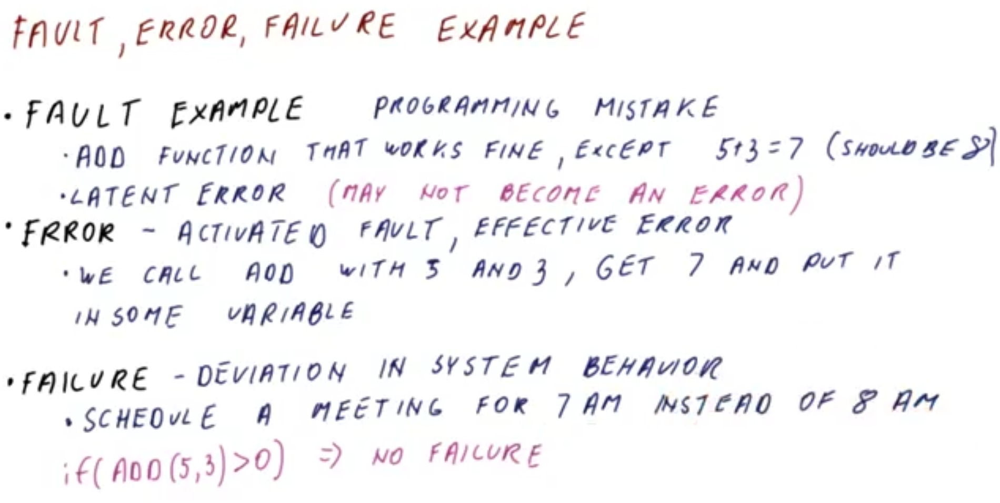
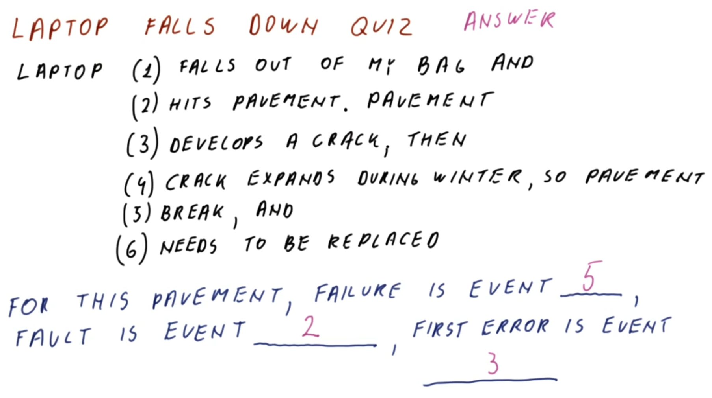
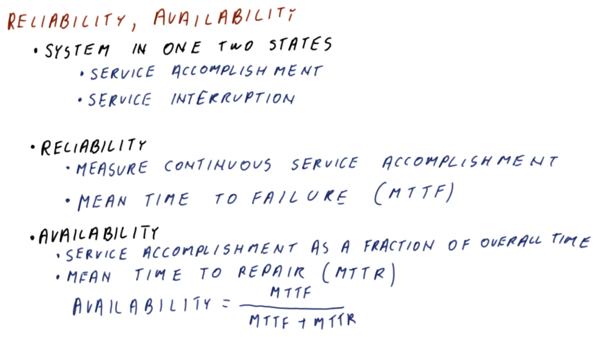

# Fault Tolerance

## 1. Lesson Introduction

This lesson will examine **reliability** and **availability**, how device faults can result in failures, and how to ensure adequate performance of computer devices even in the event of failure.

## 2. Dependability

<center>

</center>

The first concept pertaining to fault tolerance is that of **dependability**, which is a characteristic of the delivered service itself. It is the quality of the delivered service that justifies relying on the system in order to provide that service. A **dependable system** is one which provides the service in a way which is "correct"/"as expected."

The "service" itself is comprised of the following two ***definitions***:
  * The **specified service** is the *expected* behavior of the service
  * The **delivered service** is the *actual*/*observed* behavior of the service

Given these definitions, dependability can therefore be understood as the "matching" between the specified service and the delivered service.

Furthermore, note that the system itself has **components** (called **modules**), with each component/module having a corresponding "ideally" specified behavior, from which a "real" component/module will typically deviate to some degree (i.e., this is descriptive of the level of dependability/undependability in this context).
  * ***N.B.*** In this context, "components" are referring to larger, system-scale components (i.e., at the scale of the computer system itself such as the processor, memory, etc., *not* "sub-components" such as transistors)

## 3-4. Faults, Errors, and Failures

### 3. Introduction

<center>

</center>

When discussing "deviation from specified behavior," this really entails three specific ***concepts***, as follows:
  * A **fault** occurs when a ***module*** in the system deviates from the specified behavior
  * An **error** occurs when the ***actual behavior*** somewhere within the system differs from the specified behavior within the system
  * A **failure** occurs when the ***system*** itself deviates from the specified behavior for the system

### 4. Examples

<center>

</center>

To better understand the concept of fault, error, and failure, consider corresponding illustrative examples.

Generally, a **fault** is the first-occurring event, for example, a programming mistake. Consider a programming mistake comprised of an `add()` function which works correctly, except in the case of `add(5, 3)` (which generates actual output `7` rather than expected `8`).
  * This type of fault is also called a **latent error**, because an error does not occur until such an "error condition" (i.e., `add(5, 3)`) is encountered.

Once a fault has encountered (i.e., the fault is ***activated***), then a subsequent **error** occurs. This state is also described as having an **effective error** (i.e., as distinguished from a latent error).
  * For example, when `add(5, 3)` is called and the result `7` is stored in a variable, this constitutes the effective error in question.

Finally, the **failure** results as a direct consequence of the system's deviation from the specified behavior.
  * For example, if the result in question was used to determine a meeting time, then the meeting will now be scheduled for `7 AM` rather than (intended) `8 AM`.

It is ***important*** to note that a fault is necessary to generate an error, however, not every fault results in an error.
  * In the preceding example, the fault must be activated first in order to become an error (i.e., called in such a manner which yields this underlying fault condition).

Similarly, an error is necessary to generate a failure, however, not every error results in a failure.
  * In the preceding example, if the errant value `7` were never used for scheduling, then no scheduling error would occur in the system.
  * Similarly, a test condition such as `if (add(5, 3) > 0)` will not produce a failure (despite producing an error).

## 5. Laptop Falls Down Quiz and Answers

<center>

</center>

Consider the distinction between a fault, error, and failure in the context of a laptop falling down.

The laptop following down is comprised of the following six steps:
  * 1 - falls out of my bag
  * 2 - hits the pavement
  * 3 - the pavement develops a crack
  * 4 - the crack expands during winter
  * 5 - the pavement breaks
  * 6 - the pavement must be replaced

In this scenario, from the perspective of the pavement as the "system," identify which step corresponds to the following:
  * failure?
    * `5` - This results in the pavement no longer functioning properly
  * fault?
    * `2` - The laptop hitting the pavement results directly in the fault
  * (first) error?
    * `3` - The crack is the appearance of the error, which deviates from the structure of the "intact" pavement

## 6. Reliability

<center>

</center>

In addition to dependability, there are also several key properties pertaining to fault tolerance.

One of these properties is **reliability**. Unlike dependability (which is a property of the system with respect to its ability to perform its function), reliability is a ***measurable*** property.

In order to measure reliability, the system is considered to be in one of the two following **states** at any given time:
  * ***service accomplishment***  → this is the "normal" state, in which the system provides the service in question
  * ***service interruption*** → in this state, the service is not being provided (i.e., the system is not accomplishing the expected service)

Given these two states, reliability can now be ***defined*** by measuring the ***continuous*** service accomplishment state. A typical metric for reliability in this context is the **mean time to failure (MTTF)**, which quantifies how long is the service accomplished state sustained before the service interruption state occurs.
  * For example, a service which has periodic monthly service interruptions during a continuous two-year interval of operation will have a mean time to failure (MTTF) of one month.  

Another popular metric related to this is called **availability**, which measures the service accomplishment state as a fraction of the overall time. In order express this measurement, the **mean time to repair (MTTR)** (i.e., the time required to restore the system from service interruption state back to service accomplishment state) must also be determined accordingly. Given these constituents, availability can therefore be expressed as follows:

```
availability = MTTF / (MTTF + MTTR)
```

## 7. Reliability and Availability Quiz and Answers
