# Fault Tolerance

## 1. Lesson Introduction

This lesson will examine **reliability** and **availability**, how device faults can result in failures, and how to ensure adequate performance of computer devices even in the event of failure.

## 2. Dependability

<center>

</center>

The first concept pertaining to fault tolerance is that of **dependability**, which is a characteristic of the delivered service itself. It is the quality of the delivered service that justifies relying on the system in order to provide that service. A **dependable system** is one which provides the service in a way which is "correct"/"as expected."

The "service" itself is comprised of the following two ***definitions***:
  * The **specified service** is the *expected* behavior of the service
  * The **delivered service** is the *actual*/*observed* behavior of the service

Given these definitions, dependability can therefore be understood as the "matching" between the specified service and the delivered service.

Furthermore, note that the system itself has **components** (called **modules**), with each component/module having a corresponding "ideally" specified behavior, from which a "real" component/module will typically deviate to some degree (i.e., this is descriptive of the level of dependability/undependability in this context).
  * ***N.B.*** In this context, "components" are referring to larger, system-scale components (i.e., at the scale of the computer system itself such as the processor, memory, etc., *not* "sub-components" such as transistors)

## 3-4. Faults, Errors, and Failures

### 3. Introduction

<center>

</center>

When discussing "deviation from specified behavior," this really entails three specific ***concepts***, as follows:
  * A **fault** occurs when a ***module*** in the system deviates from the specified behavior
  * An **error** occurs when the ***actual behavior*** somewhere within the system differs from the specified behavior within the system
  * A **failure** occurs when the ***system*** itself deviates from the specified behavior for the system

### 4. Examples

<center>

</center>

To better understand the concept of fault, error, and failure, consider corresponding illustrative examples.

Generally, a **fault** is the first-occurring event, for example, a programming mistake. Consider a programming mistake comprised of an `add()` function which works correctly, except in the case of `add(5, 3)` (which generates actual output `7` rather than expected `8`).
  * This type of fault is also called a **latent error**, because an error does not occur until such an "error condition" (i.e., `add(5, 3)`) is encountered.

Once a fault has encountered (i.e., the fault is ***activated***), then a subsequent **error** occurs. This state is also described as having an **effective error** (i.e., as distinguished from a latent error).
  * For example, when `add(5, 3)` is called and the result `7` is stored in a variable, this constitutes the effective error in question.

Finally, the **failure** results as a direct consequence of the system's deviation from the specified behavior.
  * For example, if the result in question was used to determine a meeting time, then the meeting will now be scheduled for `7 AM` rather than (intended) `8 AM`.

It is ***important*** to note that a fault is necessary to generate an error, however, not every fault results in an error.
  * In the preceding example, the fault must be activated first in order to become an error (i.e., called in such a manner which yields this underlying fault condition).

Similarly, an error is necessary to generate a failure, however, not every error results in a failure.
  * In the preceding example, if the errant value `7` were never used for scheduling, then no scheduling error would occur in the system.
  * Similarly, a test condition such as `if (add(5, 3) > 0)` will not produce a failure (despite producing an error).

## 5. Laptop Falls Down Quiz and Answers

<center>

</center>

Consider the distinction between a fault, error, and failure in the context of a laptop falling down.

The laptop following down is comprised of the following six steps:
  * 1 - falls out of my bag
  * 2 - hits the pavement
  * 3 - the pavement develops a crack
  * 4 - the crack expands during winter
  * 5 - the pavement breaks
  * 6 - the pavement must be replaced

In this scenario, from the perspective of the pavement as the "system," identify which step corresponds to the following:
  * failure?
    * `5` - This results in the pavement no longer functioning properly
  * fault?
    * `2` - The laptop hitting the pavement results directly in the fault
  * (first) error?
    * `3` - The crack is the appearance of the error, which deviates from the structure of the "intact" pavement

## 6. Reliability

<center>

</center>

In addition to dependability, there are also several key properties pertaining to fault tolerance.

One of these properties is **reliability**. Unlike dependability (which is a property of the system with respect to its ability to perform its function), reliability is a ***measurable*** property.

In order to measure reliability, the system is considered to be in one of the two following **states** at any given time:
  * ***service accomplishment***  → this is the "normal" state, in which the system provides the service in question
  * ***service interruption*** → in this state, the service is not being provided (i.e., the system is not accomplishing the expected service)

Given these two states, reliability can now be ***defined*** by measuring the ***continuous*** service accomplishment state. A typical metric for reliability in this context is the **mean time to failure (MTTF)**, which quantifies how long is the service accomplished state sustained before the service interruption state occurs.
  * For example, a service which has periodic monthly service interruptions during a continuous two-year interval of operation will have a mean time to failure (MTTF) of one month.  

Another popular metric related to this is called **availability**, which measures the service accomplishment state as a fraction of the overall time. In order express this measurement, the **mean time to repair (MTTR)** (i.e., the time required to restore the system from service interruption state back to service accomplishment state) must also be determined accordingly. Given these constituents, availability can therefore be expressed as follows:

```
availability = MTTF / (MTTF + MTTR)
```

## 7. Reliability and Availability Quiz and Answers

<center>
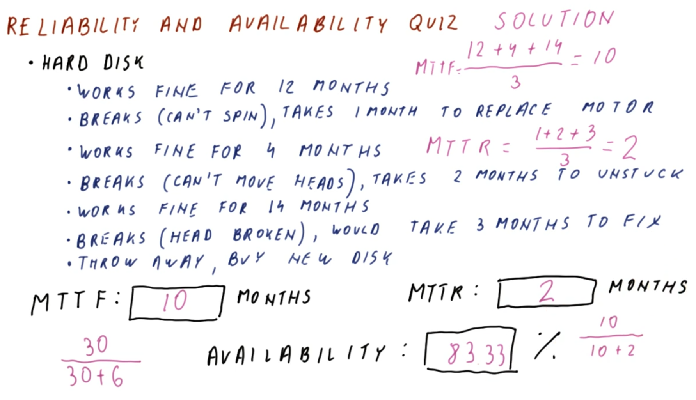
</center>

Consider a system comprised of a hard disk characterized by the following sequence:
  * Works correctly for `12` months
  * Breaks (cannot spin), requiring a consequent `1` month downtime to replace the motor
  * Works correctly for `4` months
  * Breaks (cannot move magnetic heads), requiring a consequent `2` months downtime to diagnose and unstick
  * Works correctly for `14` months
  * Breaks (magnetic head broken), would require a consequent `3` months downtime to fix
  * Throw away and replace with a new hard disk instead of fixing the broken one

For this system, determine the following:
  * mean time to failure (MTTF)?
    * `10` months
  * mean time to repair (MTTR)?
    * `2` months
  * availability?
    * `83.33%`

***Explanation***:

The mean time to failure (MTTF) can be determined as follows:

```
(12 + 4 + 14 months)/(3 failures) = 10 months per failure
```

The mean time to repair (MTTR) can be determined as follows:

```
(1 + 2 + 3 months)/(3 repairs) = 2 months per repair
```

The availability can be determined as follows:

(*via MTTF and MTTR*)
```
10/(10 + 2) = 0.8333
```

(*equivalently via time of service and time of repair*)
```
(3×10 months)/(3×10 + 3×2 months) = 0.8333
```

## 8. Kinds of Faults

<center>
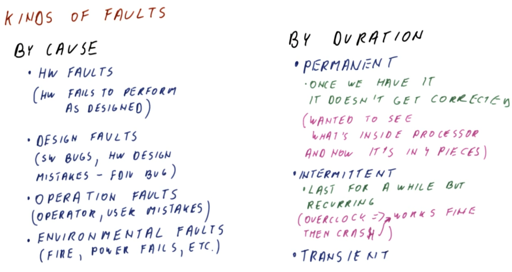
</center>

There are various ways by which faults can be ***classified***.

One such classification is ***by cause***:
  * ***hardware faults*** → the hardware system fails to perform as it was designed to
  * ***design faults*** → software bugs and hardware design mistakes (e.g., the infamous `FDIV` design bug)
  * ***operation faults*** → operator and user mistakes
  * ***environmental faults*** → fire, power failures, sabotage of the system, etc.

***N.B.*** While all of these "faults by cause" are faults, not all result in failures (e.g., the `FDIV` bug only results in a failure if used in such a failure-inducing manner, an operator shutting down the system while it is not otherwise in use does not constitute a consequent failure, a backup battery or generator can mitigate a power failure to prevent a consequent system failure, etc.).

Another classification is ***by duration*** (i.e., how long the fault condition persists):
  * ***permanent*** → once the fault occurs, the fault is not subsequently corrected (e.g., destructively/non-reversibly examining a processor by accessing its internal components)
  * ***intermittent*** → the fault lasts for a certain time frame, and does so in a ***recurring*** manner (e.g., overclocking a system which results in an eventual crash, followed by a reboot to restore the system until the subsequent overclock-induced crash, and so on)
  * ***transient*** → the fault occurs for a certain time frame but then eventually subsides indefinitely (e.g., an alpha particle collides with a chip causing an incidental fault, which subsequently resolves on reboot of the system)

## 9. Fault Classification Quiz and Answers

<center>
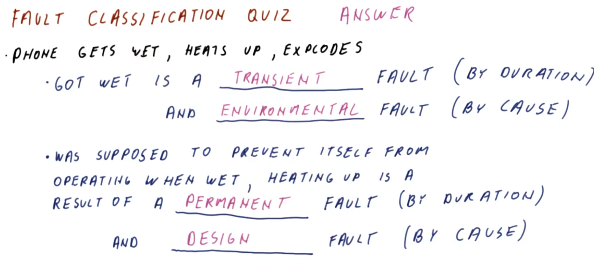
</center>

Consider a scenario where a phone gets wet, heats up during subsequent attempted operation, and then explodes.

Classify the following faults appropriately:
  * the phone got wet? (by duration, by cause)
    * `transient` (by duration), `environmental` (by cause)
  * the phone was supposed to prevent itself from operating when wet, therefore heating up is a result of? (by duration, by cause)
    * `permanent` (by duration), `design` (by cause)

***Explanation***:

The wetting of the phone is an environmental fault, which occurs transiently (i.e., eventually, it dries off).
  * ***N.B.*** The explosion would have been a permanent/unrecoverable fault, however getting wet in itself is only a transient fault.

Furthermore, because the phone was supposed to prevent itself from running when wet, the fact that it did actually heat up otherwise is indicative of a design fault. Such design faults are typically permanent.
  * ***N.B.*** Observe that this is an example of how a fault can occur which does not subsequently lead to an error or failure (i.e., the permanent fault of being poorly designed in such a manner which does not prevent heating up and exploding on getting wet only manifests itself on reaching this wet condition).

## 10. Improving Reliability and Availability

<center>
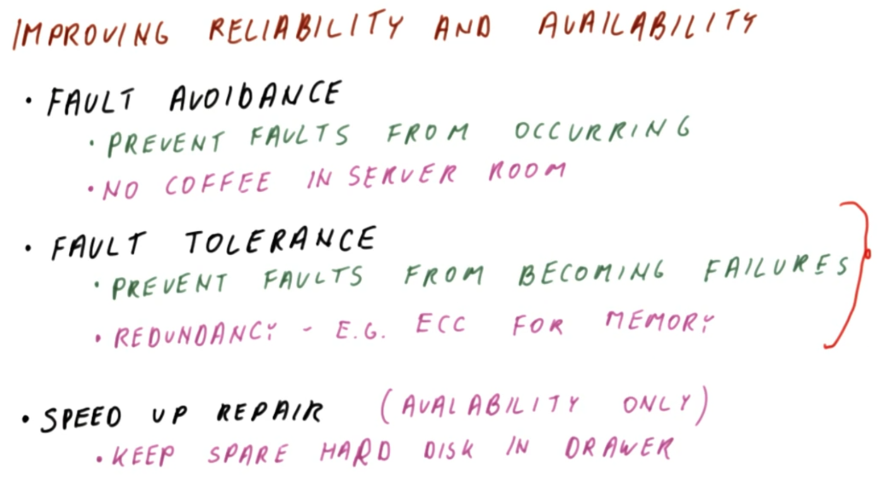
</center>

In order to improve reliability and availability, the following ***techniques*** can be used:
  * **fault avoidance** → prevent faults from occurring in the first place
    * For example, enforce a "no coffee in the server room" policy in order to prevent a potential damage-causing coffee spill.
  * **fault tolerance** → prevent faults from progressing into failures
    * A typical fault tolerance technique involves **redundancy** (e.g., an error correcting code [ECC] to ensure integrity of data in memory on read)
  * **speed up repair** → reduce the mean time to repair (MTTR), which is limited to improving only availability (but not reliability)
    * For example, keeping a spare hard disk in the drawer in the event of a hard drive failure for quick replacement (i.e., the failure still occurs, however, the repair period is comparatively short)

The remainder of this lesson will focus on the **fault tolerance** technique, particularly in the context of memory and storage.

## 11. Fault Tolerance Techniques

<center>
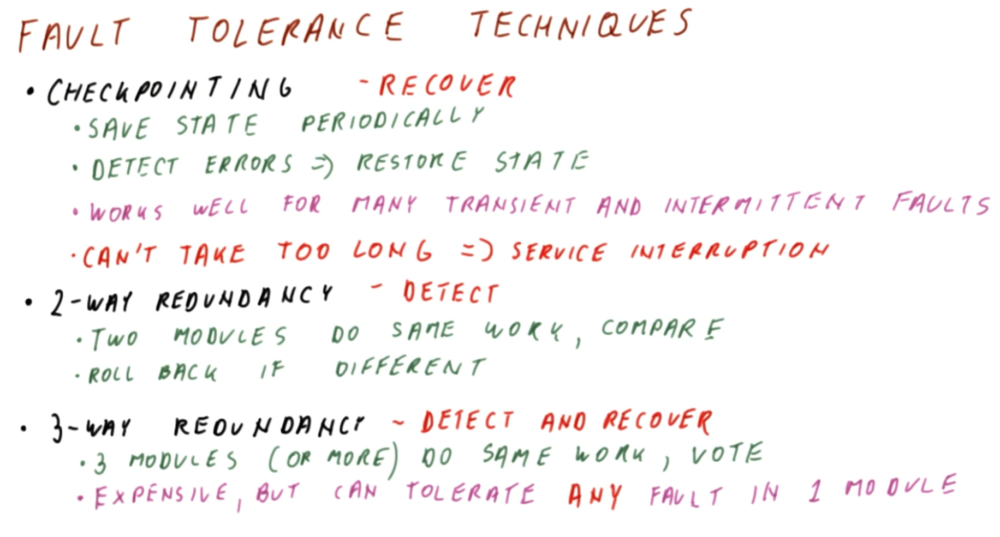
</center>

The available **fault tolerance techniques** for improving reliability and availability are as follows:
  * **checkpointing** → save the state of the system periodically, and then detect errors and consequently restore the state of the system on detection of an error(s)
    * This technique is well suited for a system characterized by many transient and intermittent faults.
      * The idea is to save the system when the system is functioning normally, and then if a fault occurs, perform a restore on the system state upon detection of the corresponding errors. With one or several such restore operations, this is sufficient to resolve both transient and intermittent faults accordingly.
    * However, note that the checkpointing/restoring ***cannot*** take a long duration to perform, otherwise such a recovery will be regarded as a **service interruption**; thus, the relevant timescale is relative to this.
    * Furthermore, note that checkpointing is only a **recovery** technique, which additionally requires a detection technique (e.g., two-way redundancy) in order to actually detect the error.
  * **two-way redundancy** → two modules perform the *same* work, and then on comparison of this work, if there is a discrepancy then a rollback is performed
    * Note that this is only an **error-detection** technique, which additionally requires a recovery technique (e.g., checkpointing) for subsequent resolution.
  * **three-way redundancy** → three (or more modules) perform the *same* work, and then subsequently *vote* for which result is correct (thereby "eliminating by vote" any incorrect result(s))
    * This technique performs *both* **error detection** and **recovery**.
    * This technique is also relatively ***expensive***, since it requires a triplicate (or more) of the hardware and the "voter" mechanism, relative to a non-fault-tolerant system, however, as a result, the system can tolerate ***any*** fault in any ***one*** (but not two or more) of the given modules

## 12. N-Module Redundancy

<center>
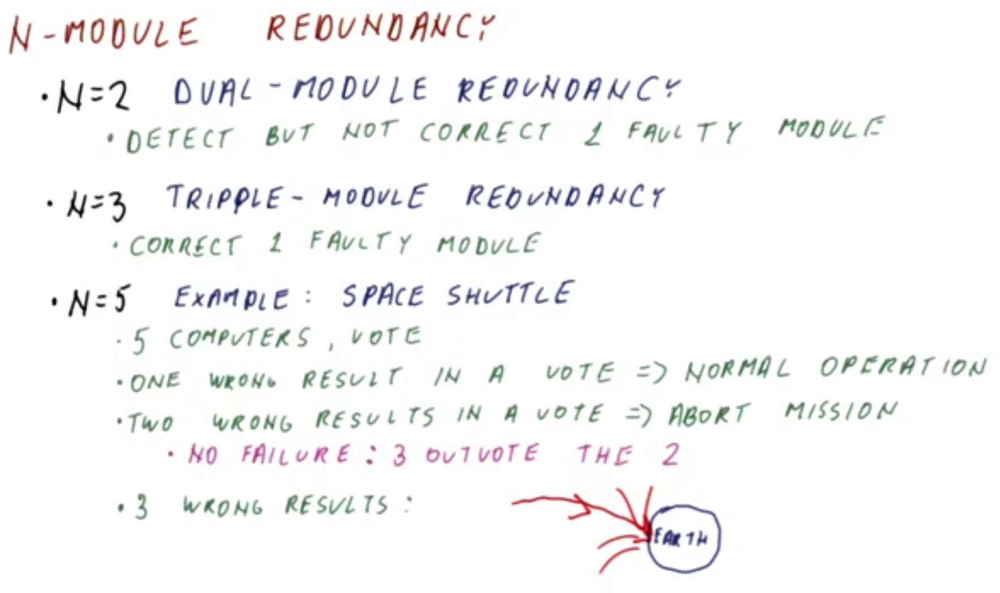
</center>

Consider a more general redundancy-based approach called **N-module redundancy**.
  * `N = 2` (**dual-module redundancy**) → guarantees detection but not correction with respect to `1` faulty module total
    * This technique can be used to detect more than one fault in the *same* module, however not multiple faulty modules.
  * `N = 3` (**triple-module redundancy**) → guarantees correction of `1` faulty module (and correspondingly all faults within that given module)
    * This technique can be used to tolerate more than one faulty module, however, the faults cannot impact the same overall result in order to guarantee correction.
  * `N = 5` → increased level of fault tolerance
    * For example, in the scenario of a space shuttle comprised of `5` computers performing the *same* tasks along with a voting mechanism:
      * `1` incorrect result in a vote yields normal operation
      * `2` incorrect results in a vote yields an aborted mission
        * In this case, there is still no failure, because `3` correct have still outvoted `2` incorrect 
      * `3` incorrect results in a vote yields a catastrophic failure of the space shuttle
        * For this reason, the upstream `2` incorrect results yields an aborted mission, in order to prevent this condition from being reached in the first place

## 13. N-Module Redundancy Quiz and Answers

<center>
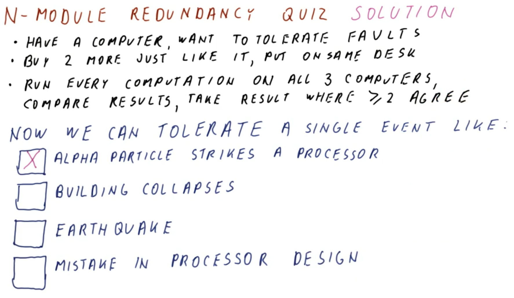
</center>

Consider a system comprised of a computer, for which it is desired to have fault tolerance. To implement this fault tolerance, the following are performed:
  * Two more identical computers are purchased and placed on the same desk
  * The same computation is performed on all three computers, the results are compared, and then the consensus result is taken such that two or more (i.e., all three) agree

With this fault tolerance in place, which single event(s) can be tolerated? (Select all that apply.)
  * Alpha particle strikes a processor
    * `APPLIES`
  * Building collapses
    * `DOES NOT APPLY`
  * Earthquake
    * `DOES NOT APPLY`
  * Mistake in processor design
    * `DOES NOT APPLY`

***Explanation***:

A single alpha particle strike only affects a single processor, thereby leaving the other two computers intact.

Conversely, the remaining events (even if occurring singularly) will impact all three devices uniformly, thereby subverting the consensus mechanism entirely.
  * Therefore, to improve fault tolerance against this situation, one possible resolution measure would be to geographically distribute the three computers. However, with respect to a faulty processor design, this would additionally require replacing the three processors with non-faulty ones.

## 14-15. Fault Tolerance for Memory and Storage

### 14. Introduction

<center>
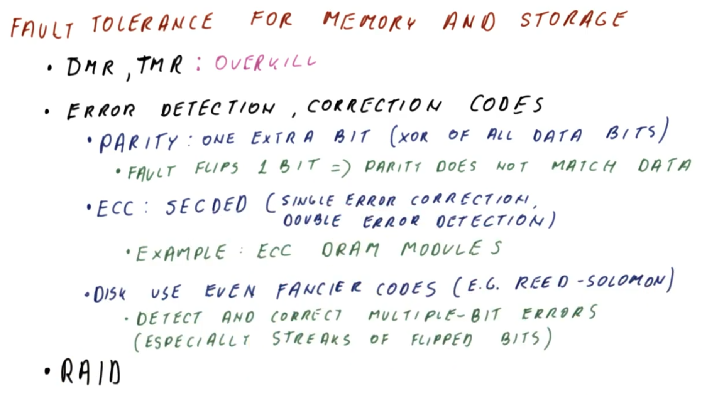
</center>

Having seen relatively general fault tolerance techniques previously in this lesson, consider now the fault tolerance techniques for memory and storage.

While dual-module redundancy and triple-module redundancy could be used for memory and storage, these are considered to be ***overkill*** for this particular use case.
  * These techniques are better suited for hardware that performs the computation, which cannot otherwise be protected using the less expensive techniques which are more suitable for memory and storage.

Instead, the primary technique for fault tolerance in memory and storage is called **error detection** (or **correction codes**). This involves the storing of bits with ***extra information*** which allows to detect and then to consequently correct one or more errant bits, thereby precluding the necessity of storing *all* of the data twice (or more) in order to detect and/or correct a *single* error.
  * The simplest technique for this purpose is using a **parity bit**, which is one additional bit added onto the data bits that is simply computed as the XOR of all of the data bits.
    * When parity occurs, if a fault flips any one of the bits (including the parity bit itself), then the parity bit will no longer match the data, thereby detecting (at least a) single-bit error.
  * The next level of error detection and correction codes is the so called **error correction code (ECC)**, such as the **single error correction, double error detection (SECDED) code**, which can detect any *one* bit flip and correspondingly fix it (or otherwise it can detect *two* bit flips, but not fix either).
    * An example of using such an error code is in dynamic random access memory (DRAM) modules using error-code correction (ECC), utilizing this mechanism to protect the data (i.e., detecting bit flips and rectifying accordingly).
  * Additionally, hard drives use even more sophisticated codes (e.g., **Reed-Solomon**), which can detect and correct *multiple* bit errors, and are particularly specialized for handling streaks of flipped bits (e.g., as a result of an oscillating magnetic head and other related hardware-originating reading anomalies)

Additionally, hard drives use a set of techniques called **redundant array of independent disks (RAID)** to provide additional fault tolerance, as discussed in the remainder of this lesson.

### 15. Redundant Array of Independent Disks (RAID)

<center>

</center>

In the fault tolerance technique known as **redundant array of independent disks (RAID)**, several disks assume the role of a *single* disk (by acting as either a larger disk, a more reliable disk, or perhaps both a larger and more reliable disk).

Each disk still detects errors using **error codes**, thereby ensuring that each disk can individually detect which one has the error(s) in the overall redundant array of independent disks (RAID) scheme.

Ideally, redundant array of independent disks (RAID) is ***characterized*** by:
  * better performance
  * "normal" service accomplishment with respect to read and write operations, even in the events of bad sectors on a certain disk(s), or in the extreme case of an entire disk failing
    * these events exceed even the capabilities of error-code-based detection and correction, but still must be handled accordingly

Note that not all redundant array of independent disks (RAID) techniques will improve all of these characteristics; some may only improve performance, some may only improve reliability, while others may improve both.

The redundant array of independent disks (RAID) techniques are designated numerically (e.g., RAID 0, RAID 1, etc.); these various numerically designated techniques will be discussed in turn through the remainder of this lesson.

## 16-18. RAID 0

### 16. Introduction: Striping to Improve Performance

<center>
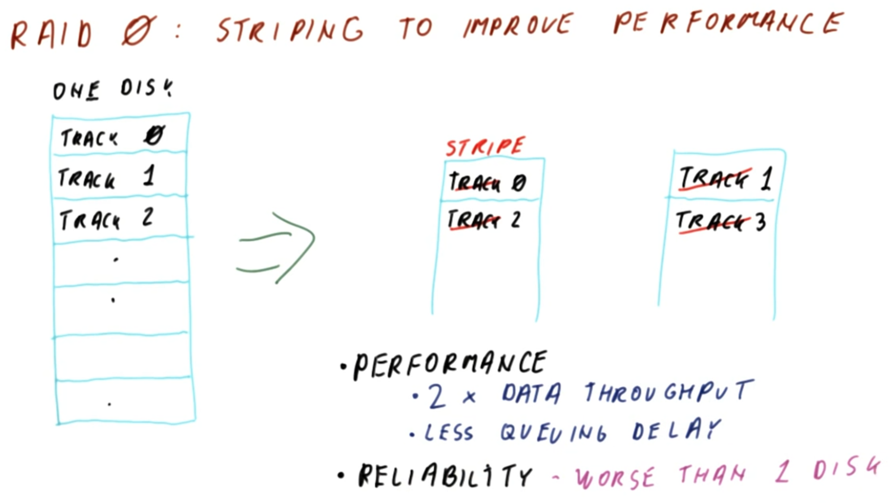
</center>

RAID 0 uses a technique called **striping** in order to improve performance.

Consider a disk comprised of sequentially numbered **tracks** starting from `0` (as in the figure shown above). When the magnetic head is positioned to read track `0`, it cannot simultaneously read track `1`, and furthermore it is also far away from the other tracks. Therefore, access of the tracks must be performed ***serially*** in this manner, thereby limiting the read performance.

To address this issue, RAID 0 uses two disks which "mimic" the original disk, but does so by alternating the tracks across the two disks. These "mimicked tracks" are now called **stripes**.
  * With respect to ***performance***, on average, there is a doubling of the ***data throughput*** (each stripe can be read simultaneously, and furthermore the downstream throughput is not bottlenecked by the relatively faster buses and controllers). There is also a corresponding reduction in ***latency*** (i.e., decreased queuing delay) due to this effective "parallelization" of the throughput.
  * Conversely, with respect to ***reliability***, this is worse than the equivalent single disk (as discussed in the next section)

### 17. Reliability

<center>
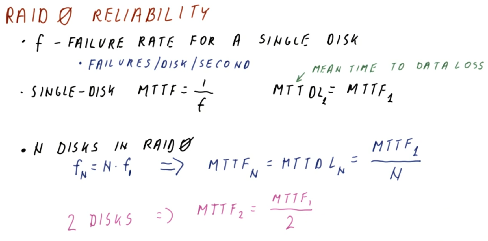
</center>

To further examine the reliability of RAID 0, let `f` represent the failure rate for a *single* disk (i.e., the amount of failures per disk per unit time). Generally, this failure rate `f` can be assumed as constant over time.

For a single disk, the **mean time to failure (MTTF)** is correspondingly defined as follows:

```
MTTF = 1/f
```
  * ***N.B.*** In the context of disks, mean time to failure (MTTF) is also sometimes called the **mean time to data loss (MTTDL)** (i.e., how long until some data is lost on the disk). In this characterization, for a *single* disk, `MTTDL_1` (where subscript `_1` denotes one disk) is simply defined as `MTTDL_1 = MTTF_1`.

Conversely, considering the case where there are `N` disks in RAID 0 configuration, the failure rate in this case (i.e., `f_N`) is defined as `f_N = N × f_1`. Correspondingly, the **mean time to failure (MTTF)** for this case is as follows:

```
MTTF_N = MTTDL_N = MTTF_1 / N
```

Therefore, for example, in the case of two disks (i.e., `MTTF_2`), this yields the following:

```
MTTF_2 = MTTF_1 / 2
```

Typically, a single disk will have `MTTF_1` on the order of 10 to 100 years, therefore in a two-disk configuration, this will still yield a `MTTF_2` on the order of 5 to 10 years or so, however, as the RAID 0 configuration size is increased, this may eventually reach a point where a failure can occur on a relatively small timescale, thereby necessitating a hard drive replacement.

### 18. RAID 0 Quiz and Answers

<center>
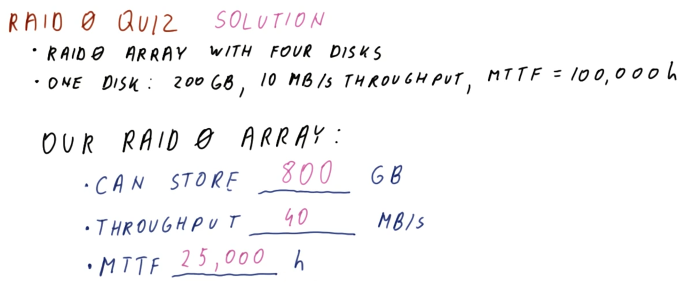
</center>

Consider a RAID 0 array configuration comprised of four disks, with each disk characterized as follows:
  * `200 GB` capacity
  * `10 MB/s` data throughput
  * `MTTF_1 = 100,000 hours`

For this RAID 0 array:
  * What is the total storage?
    * `800 GB` - with striping, the total storage is simply the sum of the four disks' capacities
  * What is the total data throughput?
    * `40 MB/s` - the data throughput is effectively parallelized across the four disks
  * What is the `MTTF_4`?
    * `25,000 hours` - `MTTF_4 = MTTF_1 / 4 = 100,000 hours / 4`, thereby reducing the `MTTF` from approximately 12 years for a single disk down to approximately 3 years for the RAID 0 array

## 19-22. RAID 1

### 19. Introduction: Mirroring

<center>
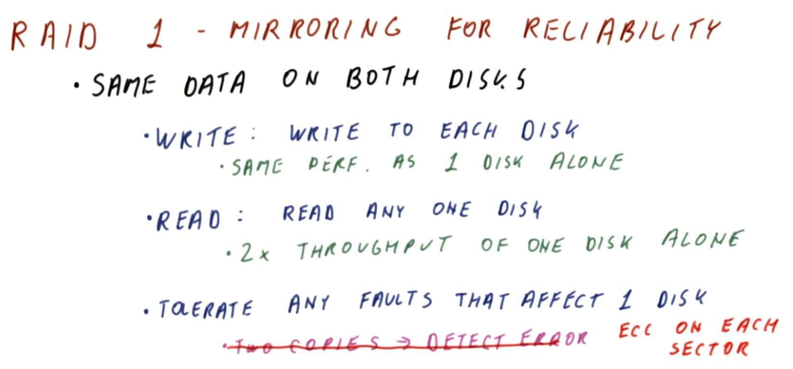
</center>

RAID 1 uses a technique called **mirroring** in order to improve reliability.

In RAID 1, the *same* data exists on *both* disks.
  * For a ***write*** operation, the system writes to *each* disk.
    * This results in the *same* write performance as that of writing to a *single* disk, because the disk-wise writes are performed simultaneously.
  * For a ***read*** operation, only *one* disk is read at a given time.
    * This results in a *doubled* data throughput compared to reading from a *single* disk alone (effectively, a "composite single read" can be "halved" between the two disks, thereby doubling the throughput accordingly).

With this RAID 1 configuration, any faults affecting only *one* of the disks can be tolerated (e.g., a bad sector from one disk can be simply read from the other; or, in the extreme case, in the event of total failure of one of the disks, the other disk can simply be used instead).
  * Correspondingly, while previously (cf. Section 14) it was noted that two copies can detect but not correct the error, this is not the case for the RAID 1 configuration of disks, because the error-correcting code (ECC) on *each* disk sector can detect errors that have already occurred, thereby allowing to use the other disk without the corresponding sector error being present there.

### 20. Reliability

<center>
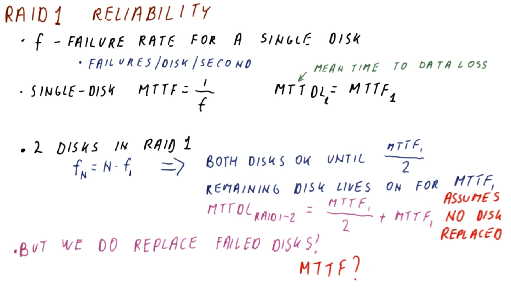
</center>

Consider now the reliability of the RAID 1 configuration. As before (cf. Section 17), let `f` represent the failure rate for a *single* disk (i.e., the amount of failures per disk per unit time), which is assumed to be constant over time. Furthermore, for a single disk, the **mean time to failure (MTTF)** is `MTTF = 1 / f`, and correspondingly the **mean time to data loss (MTTDL)** for a *single* disk is defined as `MTTDL_1 = MTTF_1`.

For two disks in RAID 1 configuration, given that `f_N = N × f_1` as before (cf. Section 17), then both disks operate normally until an expected failure occurs at time `MTTF_1 / 2`.

However, unlike in RAID 0 (at which point data loss would occur here), *both* disks must fail in order to constitute a "full" data loss in the system; therefore, in this case, it is possible that only one disk has failed at this point, while the other is still operational.

The other disks will continue to operate for another `MTTF_1`. Therefore, in this case, with respect to this operational disk, the ***overall*** MTTF for this disk is `MTTF_1`.

Collectively for the system, then, the `MTTDL_RAID1_2` (RAID 1 configuration with `2` disks) is defined as follows:

```
MTTDL_RAID1_2 = (MTTF_1 / 2) + MTTF_1
```
  * ***N.B.*** This formulation assumes ***no*** disk is replaced at the point of failure (i.e., worst case scenario).

Therefore, in RAID 1 configuration, while the capacity is not effectively increased (i.e., both disks store the *same* data), the net improvement is with respect to the reliability itself (i.e., by increased `MTTDL` for the RAID 1 configuration relative to a single disk).

Furthermore, note that if the failed disk *is* replaced (i.e., immediately upon failure), this will correspondingly impact the `MTTDL` accordingly, as discussed in the next section.

### 21. Reliability if Failed Disk(s) Is/Are Replaced

<center>
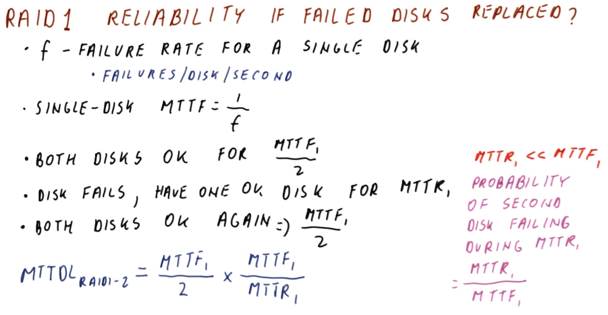
</center>

Consider now the impact on reliability if the failed disk in a RAID 1 configuration is replaced immediately on failure.

In this scenario, the following sequence of events occurs:
  * Initially, both disks are operational for time `MTTF_1 / 2`.
  * One disk subsequently fails, and the other disk is still operational for time `MTTR_1` (the time required to repair the failed disk).
  * Both disks are once again operational for an additional time `MTTF_1 / 2` (i.e., until the other disk fails).

Per this sequence, the corresponding `MTTDL_RAID1_2` (RAID 1 configuration with `2` disks) is defined as follows:

```
MTTDL_RAID1_2 = (MTTF_1 / 2) × (MTTF_1 / MTTR_1)
```
  * ***N.B.*** In order determine the factor for when the second disks' failure can occur during repair period of the first disk (i.e., during `MTTR_1`), this requires a more elaborate analysis of the probability distribution for `f`, `MTTR_1`, etc. However, under the simplifying assumption/condition of `MTTR_1 << MTTF_1` (i.e., "fast repair" [hours to days] relative to failure time [years]), then the probability of the second disk failing during `MTTR_1` can be approximated as `MTTR_1 / MTTF_1`, as in the equation shown above (which uses its reciprocal as the multiplying factor, representing the number of times a repair is performed until the second disk fails).

Since the factor `(MTTF_1 / MTTR_1)` is relatively large (i.e., much larger than `2`), correspondingly `MTTDL_RAID1_2` (RAID 1 configuration) is much larger than `MTTDL_1` (single-disk configuration), and therefore provides a considerable improvement in reliability accordingly.

### 22. RAID 1 Quiz and Answers

<center>
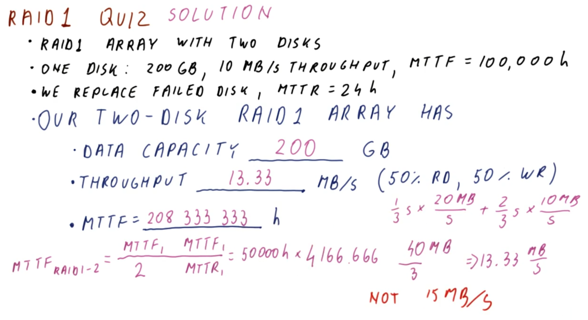
</center>

Consider a RAID 1 array configuration comprised of two disks, with each disk characterized as follows (similarly to previously, cf. Section 18):
  * `200 GB` capacity
  * `10 MB/s` data throughput
  * `MTTF_1 = 100,000 hours`

Furthermore, assume that the failed disk is replaced at `24 hours` (i.e., `MTTR_1 = 24 hours`).

For this RAID 1 array:
  * What is the total storage?
    * `200 GB`
  * What is the total data throughput (assuming 50% read operations and 50% write operations)?
    * `13.33 MB/s`
  * What is the `MTTF_RAID1_2`?
    * `208,333,333 hours`

***Explanation***:

The total storage/capacity is equivalent to a single disk in a RAID 1 configuration (i.e., both disks store the *same* data).

The data throughput for the system is twice that of a single disk while ***reading***, however, it is equivalent to that of a single disk while ***writing*** (i.e., writing to both disks simultaneously). Therefore, cumulatively, the data throughput is `[(1/3)×(2×10) + (2/3)×(1×10)] MB/s = 13.33 MB/s`, where per-unit time of the system's operation (constituted by equal amounts of read and write operations), two-thirds are spent on write operations and one-third are spent on read operations.
  * ***N.B.*** The data throughput for the system is ***not*** simply the average throughput (i.e., `[(1/2)×(2 × 10) + (1/2)×(1×10)] MB/s = 15 MB/s`), as even with equally distributed read and write operations, there is a disparity in the respective time distributions of these operations accordingly (i.e., for the system cumulatively, all else equal, writes occupy a larger fraction of the time in a RAID 1 configuration).

Lastly, with respect to `MTTF_RAID1_2`, this can be determined as follows by definition (cf. Section 21):

```
MTTF_RAID1_2 = (MTTF_1 / 2) × (MTTF_1 / MTTR_1) = (100,000 hours / 2) × (100,000 hours / 24 hours) = (50,000 hours) × (4166.667) = 208,333,333 hours
```
  * ***N.B.*** The second factor `4166.667` is the amount of possible attempted repairs of the second disk while the first disk is still in operation, prior to both disks ultimately failing.

Observe that `MTTF_RAID1_2` (208,333,333 hours, or approximately 24,000 years) is ***much*** larger than `MTTF_1` (100,000 hours, or approximately 11 years), a substantial improvement in the reliability.

## 23-27. RAID 4

### 23. Introduction: Block-Interleaved Parity

<center>
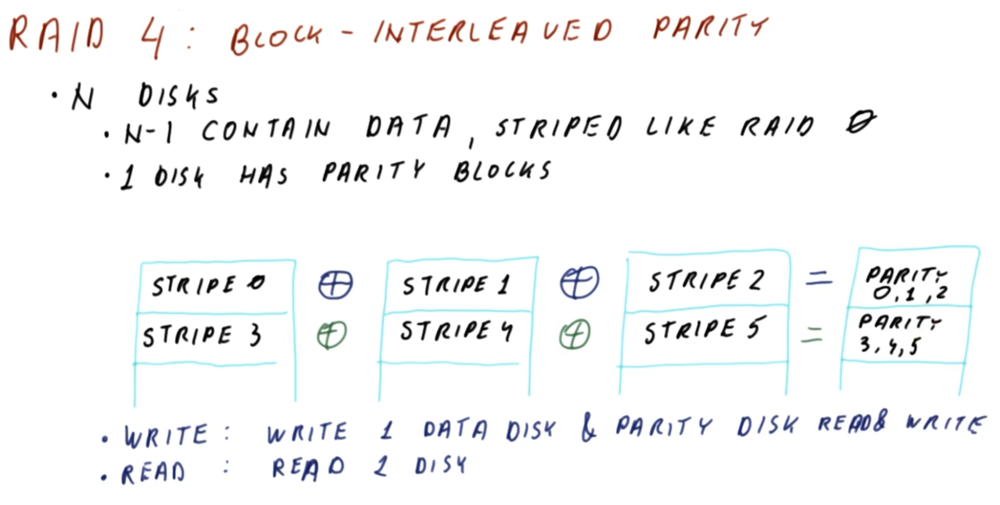
</center>

***N.B.*** RAID 3 will not be discussed in this course, as it is rarely used in practice today. Furthermore, RAID 4 is not used commonly today either, however, understanding its fundamental operation will facilitate with describing RAID 5 subsequently in this lesson.

RAID 4 uses a technique called **block-interleaved parity** in order to improve reliability.

RAID 4 configuration involves the use of `N` disks.
  * `N - 1` of these disks contain the data, and are striped similarly to RAID 0 (cf. Section 16).
  * Conversely, the other remaining disk has **parity blocks**, which protect the other `N - 1` disks.

Consider an example of a four-disk RAID 4 configuration (as in the figure shown above).
  * Three of the disks contain striped data representing the "full/composite" disk.
  * The data is then compared on a per-stripe basis across the three disks using XOR operators (`⊕`), collectively resulting in a single-stripe-length result that is stored in the other disk (the **parity disk**) as the corresponding **parity stripe** for that set of stripes.

In this manner, if any one of the constituent non-parity disks fail, then the data of the failed disk can be reconstituted from the remaining disks (including the parity disk). This effectively allow to tolerate the failure of any one of the disks, without otherwise incurring the cost of a 2× redundancy (cf. mirroring in RAID 1) with respect to storage (e.g., in this four-disk example, only a quarter of the storage is expended on the parity disk itself, while the other three disks' worth of storage is available for data).
  * Therefore, RAID 4 is effectively a "more generalized" form of mirroring (with RAID 1 being the special case of RAID 4 with only two disks, one with data and the other with the parity bits).

With respect to ***write*** operations, each operation must write both to a data disk and to the parity disk (i.e., writing will impact the state of the parity bit accordingly). Conversely, with respect to ***read*** operations, only one read operation is performed (i.e., with respect to the non-parity data disk in question).
  * Furthermore, note that full reconstruction of the data only occurs if the read operation fails under abnormal operating conditions (but otherwise, in general, reading the parity disk is unnecessary under "normal" read operations).

### 24. Performance and Reliability

<center>
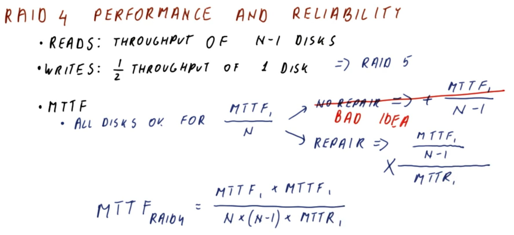
</center>

With respect to RAID 4 configuration, consider the overall system performance and reliability.

For ***read*** operations, there is an average (equivalent) throughput of `N - 1 ` disks (i.e., reading from the data disks), which is a significant improvement over a single-disk equivalent.

For ***write*** operations, the data accesses are distributed among the data disks. Furthermore, recall (cf. Section 23) that every write operation requires the parity disk to update the corresponding parity stripe. Consequently, the throughput is only `1/2` of a single-disk equivalent (i.e., the parity disk requires two accesses for every write, one to read the old value and another to write the new/updated value).
  * ***N.B.*** While this is a significant disadvantage, this lesson will later discuss how RAID 5 configuration is used to overcome this.

With respect to **mean time to failure (MTTF)**, as before in RAID 1 (cf. Sections 20-21), there are essentially two possible sequences:
  * 1 - All disks are operational for time `MTTF_1 / N`
  * 2 - Subsequently, there are two possible resolution measures on failure of one of the disks:
    * 2A - No repair of the failed disk
    * 2B - Repair the failed disk immediately

In sequence 1→2A (no repair), the `MTTF` is as follows:

```
MTTF = (MTTF_1 / N) + [MTTF_1 / (N - 1)]
```
  * ***N.B.*** In this case, `MTTF` is generally ***worse*** than the single-disk equivalent (i.e., `MTTF_1`). Therefore, RAID 4 is not an advisable configuration/strategy if there is no intention to perform repairs (i.e,. the reliability is *decreased* in this case!).

Conversely, in sequence 1→2B (with repair), the `MTTF` is as follows:

```
MTTF = (MTTF_1 / N) × {[MTTF_1 / (N - 1)] / (MTTR_1)} = [MTTF_1 × MTTF_1] / [N × (N - 1) × MTTR_1]
```
 * ***N.B.*** Recall (cf. Section 21) that in general `MTTR_1 << MTTF_1`, thus the corresponding factor `MTTF_1/MTTR_1` gives rise to a very large overall `MTTF` (i.e., much improved reliability) for the system.

### 25. Write Operation

<center>
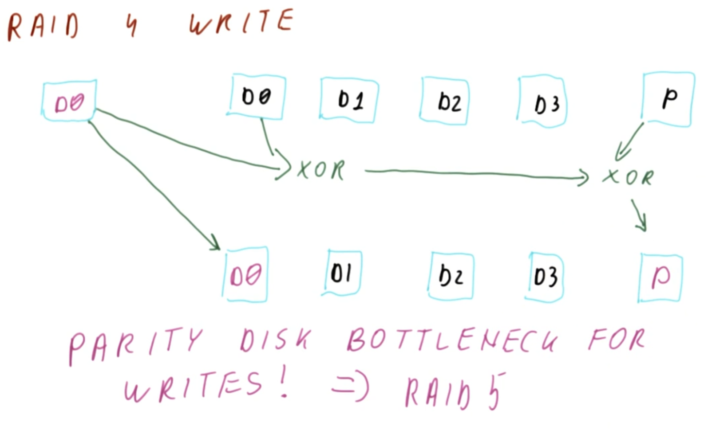
</center>

Consider now a more comprehensive description of ***write*** operations in a RAID 4 configuration (as in the figure shown above), using an example of a five-disk system (i.e., four data disks and a parity disk).

Given an initialized set of stripes, assume that a subsequent write operation is performed on the first disk (disk `D0`). In order to compute the updated parity value, there are several possible ***approaches*** to do this.

One approach would be to read the data from the other three disks and perform an XOR operation to compute the updated parity value. However, this requires three read operations and one write operation (with read operations increasing proportionally with more added data disks accordingly).

Conversely, another approach (as in the figure shown above) would be to read the old data from the disk first, XOR this data with the new/updated data, and then lastly combine this with the old parity value (i.e., via appropriate flip of pertinent updated bits) in order to compute the new parity value.
  * The net result is two read operations (from the old data and from the old parity value) and two write operation (to the new/updated data and to the new/updated parity value), which does not change proportionally to the number of added data disks to the RAID 4 configured system (i.e., it is *always* two reads and two writes if using this approach).
  * Furthermore, observe that the parity disk forms a ***bottleneck*** for write observations, because it *always* requires a read/write pair irrespectively of the number of data disks in the RAID 4 configuration. To address this issue, RAID 5 configuration was devised accordingly (as discussed later in this lesson).

### 26. RAID 4 Quiz and Answers
