# Multi-Processing

## 1. Lesson Introduction

This lesson will describe what occurs when more than one thread (or process) is executed simultaneously.
  * ***N.B.*** This used to only pertain to supercomputers and to high-end servers, however, practically all modern and future computers are and will be comprised of multiple cores, and possibly multiple threads per core. Therefore, it is accurate to state that *all* processing today is essentially tantamount to ***multi-processing***.

## 2. Flynn's Taxonomy of Parallel Machines

<center>

</center>

**Flynn's taxonomy of parallel machines** categorizes parallel machines according to how many **instruction streams** and how many **data streams** are used by the machine in question. The corresponding categorizations are as follows:

| Parallel machine classification | Quantity of instruction streams | Quantity of data streams | Comment |
|:--:|:--:|:--:|:--:|
| single instruction, single data (SISD) | `1` | `1` | This is a conventional **uni-processor** (i.e., single-core machine), as described previously in this course |
| single instruction, multiple data (SIMD) | `1` | `>1` | This involves only a single program counter executing the single instruction stream, however, it operates on multiple data streams. A typical example is so called **vector processors**, which executes on simultaneous vector values (rather than single scalar values) in a single program involving corresponding vector operations (e.g., vector addition). Modern processors also have **multimedia extensions** (e.g., SSE, MMX, etc.) which fall under this classification.  |
| multiple instruction, single data (MISD) | `>1` | `1` | This involves several program executing simultaneously, all operating on the *same* data stream. This is a relatively rare configuration, however, a relevant example is a **stream processor** (which performs step-wise/stage-wise processing of the data stream). |
| multiple instruction, multiple data (MIMD) | `>1` | `>1` | This is a bona fide **multi-processor**, whereby each processor has its own independent program counter, etc., with each independently operating on its own data stream. |

Most processors today are classified as multiple instruction, multiple data (MIMD), corresponding to the commonly used **multi-core processors**. Correspondingly, these multi-core processors are the focus of this lesson accordingly.

## 3. Why Multi-Processors?

<center>

</center>

So, then, why use multi-processors at all, rather than simply using uni-processors?

Firstly, note that modern uni-processors are already approximately 4-wide to 6-wide. By this point, it is advantageous to switch to multi-processors, because beyond this point, there are diminishing returns in making a uni-processor even wider (i.e., executing 6 to 8 instructions per cycle or so will not be as dramatic of a performance improvement as previously increasing from 2 to 4 or so).
  * The diminishing returns are a direct consequence of Amdahl's law (cf. Lesson 2), where there is more improvement in programs which benefit from this increase in width (e.g., those which are inherently parallel) but not otherwise in those which do not (e.g., those which have a lot of dependencies which effectively "serialize" the overall program).

Additionally, another issue with uni-processors is that if they are designed to be faster by increasing the frequency, this requires a corresponding raise in voltage, which in turn increases the power consumption dramatically (proportionally to `f×V^2`, cf. Lesson 1). Beyond a certain level, this increased power consumption will preclude an practical usage of the processor, as it will overheat from this overloaded power consumption.

Nevertheless, despite these drawbacks with uni-processors, Moore's law has persisted into the modern day, with a doubling of transistors every 18 months, for the same cost and area as previously. In order to achieve this continued improvement, the number of cores have been doubled every 18 months accordingly, which allows to have cores which are not individually wider or individually faster, but rather still provide an overall increase in the transistor density (and correspondingly improved computational performance of the processor chip).
  * However, a key **caveat** here is that this assumes that ***all*** of the cores can be used. Conversely, if a program only uses a single thread of a single core, then this doubling is inconsequential. Therefore it is necessary to design programs to exploit this parallelism in order to maximize the potential performance of these multi-core processors.

Put another way, multi-processors exist today not necessarily because a doubling of the cores is inherently "better" than a uni-processor with the equivalent twice-improved per-processor performance, however, as a practical matter, it is no longer feasible to achieve this per-uni-processor improvement as per current physical constraints, and therefore multi-processors have allowed for a more practical alternative route for improvements more recently.

## 4. Multi-Core vs. Single-Core Quiz and Answers

<center>

</center>

Suppose that the following improvement is made in a single processor core:

| Generation | Area (cm<sup>2</sup>) | Instructions per cycle | Power consumption (W, at 2 GHz) |
|:--:|:--:|:--:|:--:|
| Old | `2` | `2.5` | `100` |
| New | `1` | `2.5` | `50` |

Given this newer-generation processor, analyze the following two alternatives for a subsequent processor design.

In the first alternative, create a better *single* core, characterized by `2 cm^2` total area, `3.5` instructions per cycle, and `75 W` power consumption (at 2 GHz). For this alternative:
  * At 100 W power consumption, what speed/frequency can it achieve?
    * `2.2 GHz`
  * And what is the speedup relative to the older-generation processor?
    * `1.54`
  
In the second alternative, assemble the processor chip from two of these newer-generation cores, characterized by `2 cm^2` total area, `2.5` instructions per cycle on each core, and `50 W` power consumption (at 2 GHz) on each core (i.e., `100 W` total).
  * What is the speedup relative to the older-generation processor, assuming that the same/equivalent "old work" can be divided equally among the two constituent "new" cores?
    * `2`

***Explanation***:

With respect to the first alternative, since the dynamic power is proportional to `f×V^2` (cf. Lesson 1), and furthermore the voltage is proportional to `f` (i.e., `f×V^2 = f×(f)^2 = f^3`), then this implies:

```
f_new = (P_new / P_old)^(1/3) × f_old = (100 W / 75 W)^(1/3) × (2 GHz) = (1.1) × (2 GHz) = 2.2 GHz
```

Furthermore, the speedup of the first alternative relative to the older-generation processor is determined as follows:

```
(2.2 GHz / 2.0 GHz) × (3.5 IPC / 2.5 IPC) × (1 # new instructions / 1 # old instructions) = (1.1) × (1.4) × (1) = 1.54
```

Conversely, with respect to the second alternative, the speedup relative to the older-generation processor is determined as follows:

```
(2.0 GHz / 2.0 GHz) × [(2.5 + 2.5 IPC) / 2.5 IPC] × (1 # new instructions / 1 # old instructions) = (1.0) × (2.0) × (1) = 2.0
```

As this demonstrates, two cores are achieving a higher speedup relatively to a single-core "additionally improved" single-core processor.
  * ***N.B.*** A strong ***caveat*** here is that in order to achieve this "enhanced" speedup, the programs running on this dual-core processor must be amenable to parallelization in order to "divide up" this work appropriately to effectively leverage this parallelization.

## 5. Multi-Processors Need Parallel Programs

<center>

</center>

Recall (cf. Section 4) that a multi-processor can generally outperform a comparable uni-processor with today's technology, provided that the program running on the processor in question is amenable to utilizing these multiple cores (i.e., exploiting parallelism accordingly).

Nevertheless, there are indeed ***disadvantages*** to moving from single-core to multi-core processors, including:
  * Code that is **sequential** (also called **single-threaded**) is generally ***a lot*** easier to develop and reason about.
    * By corollary, there is a significant "developer time-cost" involved in converting a given application from a single-threaded to a multi-threaded implementation.
  * **Debugging** parallel applications is ***much*** more difficult relative to the sequential equivalent.
  * Even with a working implementation of a parallelized application, it is still ***very*** difficult to achieve **performance scaling** in practice, where performance scaling is a property of the program such that as the number of cores is increased, the performance correspondingly increases (as in the figure shown above)
    * In ***ideal*** performance scaling, there is a direct, linear relationship between the increasing cores count and corresponding increase in performance (as denoted by blue line in the figure shown above).
    * However, in practice, as programs are parallelized, performance scaling eventually "plateaus" with respect to increasing cores count (as denoted by purple curves in the figure shown above).
      * Even with improvements in the performance scaling, these "plateaus" generally arise and persist; furthermore, it is generally difficult to achieve incremental "curve-shifting" performance improvements on a per-improvement basis in this manner in the first place.
      * Accordingly, few programs achieve sustained high performance with many cores, and those that do require a lot of time, effort, and expertise to develop accordingly.

## 6-8. Central Shared Memory

In the subsequent sections of this lesson, we will consider several ***types*** of multi-processors.

### 6. Introduction

<center>

</center>

The first type of multi-processor uses what is called a **centralized shared memory** (as in the figure shown above).
  * In this configuration, all of the **cores** (i.e., four, in the figure shown above) have their *own* dedicated **caches**, which are interconnected via the *same* **bus**. This common-bus connection in turn allows the cores to access the *same* **input/output (I/O) devices** and the *same* **main memory**.
  * The cores in turn can ***share*** data by simply reading and writing to this common/shared main memory (assuming the corresponding read/write operations go through the caches properly, as will be discussed later in this lesson). Effectively, the main memory acts as the "intermediary" communication point among the cores in this manner (and similarly for the common/shared input/output [I/O] devices).

This type of system resembles modern **multi-core processors**, which are more formally designated as exhibiting **uniform memory access (UMA) time** (with respect to the access time of the main memory).
  * The main memory is effectively at the "same" (relatively long) distance from each core, via the corresponding respective common/shared bus-based connections.

Additionally, this type of multi-processing is designated as a **symmetric multi-processor (SMP)**, due to the "symmetric"/uniform appearance and configuration of a given core-cache pair within the overall system (i.e., any given core-cache component is effectively interchangeable with any other in the system).

### 7. Uniform Memory Access (UMA) / Symmetric Multi-Processor (SMP) / Multi-Core Quiz and Answers

<center>

</center>

Suppose that it is desired to have ***many*** cores, using a centralized shared memory. Which of the following problems will be encountered in this case? (Select all that apply.)
  * Main memory needs to be very large (and consequently slow)
    * `APPLIES` - Having more cores generally implies running of programs which access more data, all else equal. Therefore, to store and manage this data, a large memory is required accordingly.
  * Main memory receives too many accesses per-unit time (i.e., main memory will require a very high throughput to scale appropriately)
    * `APPLIES` - Cache misses from *all* of the cores will be falling through to main memory, which may reach some critical point which "overwhelms" the main memory (relative to its intrinsic throughput).
  * Many small memory modules will be required (i.e., proportionately to the number of cores)
    * `DOES NOT APPLY` - This is not necessarily true, as the *quantity* of memory modules in a centralized shared memory is not as consequential as the *total capacity* of this memory.
  * Caches will have a very small block size
    * `DOES NOT APPLY` - The block size of the caches is independent of the centralized shared memory, and furthermore is not divided up among the cores, but rather specified on a per-core basis.
  * Pages for virtual memory will become too small (i.e., too small for even practical use)
    * `DOES NOT APPLY` - The page size is independent of both the size of the memory and the quantity of cores used.

### 8. Centralized Main Memory Problems

<center>

</center>

Consider now the **problems** of centralized shared memory, which will motivate discussion of alternative approaches (as discussed subsequently in this lesson).

Firstly, ***memory size*** is a significant constraint. Since the shared main memory must be ***large*** to accommodate this configuration, this results in a ***slow*** memory which is relatively far away from each individual core.

Additionally, ***memory bandwidth*** is another significant issue. Because cache misses from all cores fall through to the *single* shared main memory, this results in **memory bandwidth contention** among these core-wise memory requests (which in turn is exacerbated by the aforementioned large, slow nature of this shared main memory). Consequently, additional cores do not effectively benefit from overall performance on a per-core-added basis (i.e., the memory accesses are effectively rendered as "serialized").

Therefore, for these reasons, a centralized shared memory is only particularly effective for relatively small multi-processor machines comprised of only 2, 4, 8, or perhaps 16 cores at most; beyond this point, the memory bandwidth is effectively "saturated" (and additionally requires an excessively large, slow main memory to support additional cores beyond this).

## 9. Distributed Memory

<center>

</center>

Another type of multi-processor is **distributed memory**, which is no longer "shared" (as in the case of centralized shared memory, cf. Section 6), but rather in this configuration, only one core can access a memory slice, while the others cannot access the same memory slice (as in the figure shown above).

In this distributed memory configuration (as in the figure shown above), each **core** (designated by `C` in the figure shown above) has its own cache, along with a corresponding **main memory "slice"** (designated by `M` in the figure shown above) that can only be locally accessed by that specific core.
  * Effectively, each core individually has a complete single-core computer system.

Additionally, a core-wise network interface card (designated by `NIC` in the figure shown above) connects the cores to the centralized **network**.

In this configuration, whenever a core experiences a ***cache miss***, the cache miss falls through to its own local main memory. Furthermore, in order for a given core to access data from another core's memory, rather than "falling through" with a cache miss, instead the requesting core creates a **network message** (via corresponding operating system "send"/"receive" primitives, or equivalent mechanism) in order to retrieve this other-core data.
  * Therefore, in this configuration, communication is now ***explicit***, rather than "passively" managing via a centralized main memory.

As a consequence of this network-based intercommunication, this necessitates writing programs in a particular manner to accommodate this.
  * Symmetric shared memory and distributed shared memory both pass data around using a centralized shared memory (i.e., read and write operations are used to exchange data).
  * Conversely, distributed memory uses a mechanism called **message passing** for communication. To accomplish this, the program is written as if the individual cores were "independent machines" that communicate over a network.
    * For example, a distributed-memory "supercomputer" proceeds in this manner, however, it utilizes network interface cards and Ethernet connections which are much faster than typical consumer-grad e equivalents.

***N.B.*** This type of distributed memory system is also called a **multi-computer**, because each core-wise element is effectively a "complete computer" on its own (i.e., comprised of a processor, memory, and input/output (I/O) devices). Additionally, the designation of **cluster computer** is also used in this context, since these "complete computers" are tightly "clustered" into a single, shared network, which effectively forms a distributed-memory system.

These types of computers tend to scale up to a very ***large*** number of processors.
  * The reason for this is not that they are fundamentally better at communicating as compared to shared-memory-system equivalents, but rather that the programmer is forced to explicitly deal with and consider this network-based communication (and corresponding primitive) when writing programs for these distributed-memory systems. This in turn enforces "good practices" such as awareness of this network "bottleneck" and devising accordingly (i.e., minimize network accesses and maximize optimal use of the local main memory), thereby ensuring more thoughtfulness around the "shared memory" aspect of the program (i.e., as opposed to "over-relying" on a potentially large, slow centralized shared memory).

## 10. Non-Uniform Memory Access (NUMA) Memory Allocation Quiz and Answers

<center>

</center>

How should the operating system allocate memory in a **non-uniform memory access (NUMA)** system (i.e., distributed memory)? (Select all that apply.)
  * Place the stack pages for core `N` in the memory slice `N`.
    * `APPLIES`
  * Place all data pages *ever touched* by core `N` in the memory slice `N`.
    * `DOES NOT APPLY`
  * Place all data pages *mostly accessed* by core `N` in the memory slice `N`.
    * `APPLIES`

***Explanation***:

In general, in order to improve performance for a non-uniform memory access (NUMA) machine, the operating system should place all data pages as closely/locally to the relevant core(s) as possible, thereby ensuring the fastest possible memory access (i.e., by correspondingly minimizing otherwise-necessary network utilization).
  * Along these lines, placing the stack pages for core `N` in memory slice `N` is simply the extreme example of this, effectively "fully localizing" the "data slice" to this core. Furthermore, a stack is a memory entity which the operating system can readily determine with respect to appropriate core-wise localization (i.e., in contrast to pages which are inherently accessed by multiple cores).

However, placing all data pages *ever touched* by core `N` in corresponding memory slice `N` will localize the data to that core, and possibly exceed its local memory capacity as well.

## 11-14. Message Passing vs. Shared Memory

### 11. A Message-Passing Program

<center>
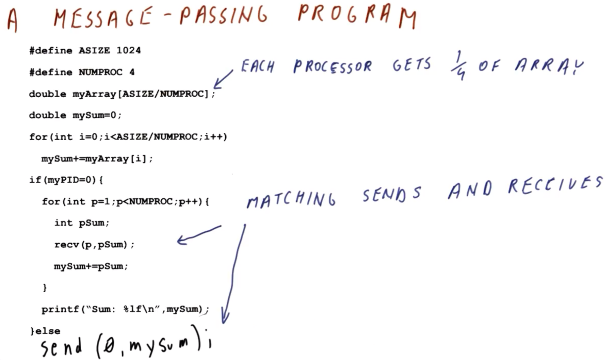
</center>

Consider the following program:

```c
#define ASIZE 1024
#define NUMPROC 4

double myArray[ASIZE/NUMPROC];
double mySum = 0;

// core-wise partial array summation
for (int i = 0; i < ASIZE/NUMPROC; i++)
  mySum += myArray;

// combine results across cores
if (myPID == 0) { // "summing agent" core
  for (int p = 1; p < NUMPROC; p++) {
    int pSum;
    recv(p, pSum);
    mySum += pSum;
  }
  printf("Sum: %lf\n", mySum);
} else {         // non-"summing agent" cores
  send(0, mySum);
}
```

This program computes the sum (`mySum`) of a relatively large (`1024` elements, i.e., `ASIZE`) array (`myArray`) in parallel on `4` cores (i.e., `NUMPROC`).

In this ***message-passing*** version of the program, each processor manages one-quarter of the array (i.e., `ASIZE/NUMPROC`).
  * There is mutually exclusive access of these four quarters (i.e., a given core cannot directly access the array data of another).
  * One of the cores (i.e., `myPID == 0`) acts as the "summing agent," which is responsible for summing the partial sums from the other cores via corresponding `send()`/`recv()` mechanism, which is a necessary ***explicit mechanism*** (i.e., inter-process communication) required in this style of program.

With appropriate program design, it is readily apparent where network-related bottlenecks occur (e.g., `send()`/`recv()` pairs).

### 12. A Shared-Memory Program

<center>
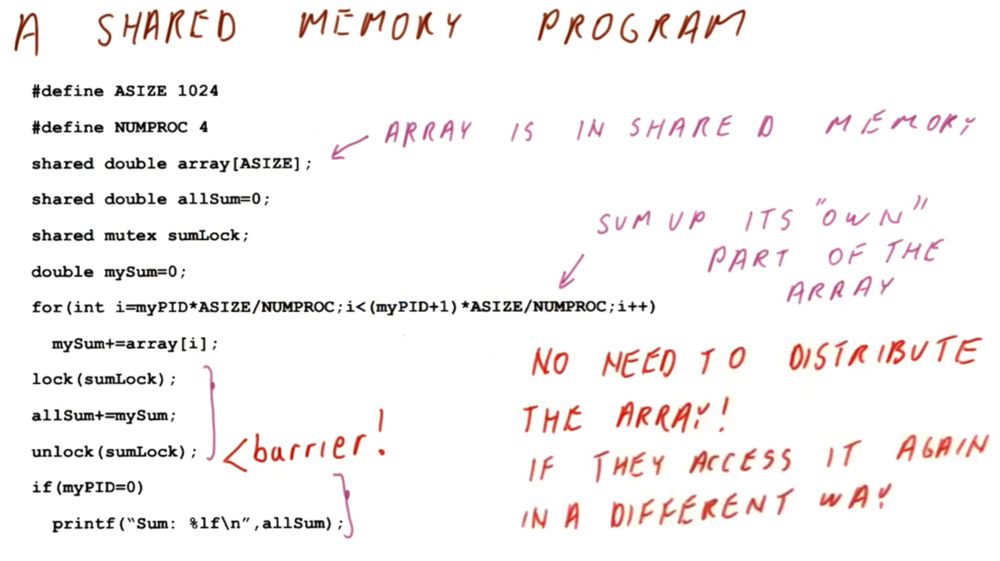
</center>

Now, consider a ***shared-memory*** analog of the same program from the previous section (cf. Section 11):

```c
#define ASIZE 1024
#define NUMPROC 4

shared double myArray[ASIZE]; // array in shared memory
shared double allSum = 0;
shared mutex sumLock;
double mySum = 0;

for (int i = myPID*ASIZE/NUMPROC; i < (myPID+1)*ASIZE/NUMPROC; i++)
  mySum += myArray[i];

// start critical section
lock(sumLock);
allSum += mySum;
unlock(sumLock);
// end critical section (barrier)

if (myPID == 0) {
  printf("Sum: %lf\n", mySum);
}
```

In this version, all cores can share/access the *same* data array (i.e., `myArray`), which is correspondingly placed in the *same* shared/distributed memory accordingly.
  * Each core sums up its "own part" of this shared array (i.e., section `myPID` through `myPID + (ASIZE/NUMPROC - 1)`).
  * However, unlike in the previous shared-memory version (cf. Section 12), here, each core synchronizes the total sum (`allSum`) via corresponding ***critical section*** using a mutex, which allows for summing in this manner "non-deterministically" without otherwise adversely impacting the correctness of the intended program/semantics.
  * Furthermore, the ***barrier*** (exit out of the critical section) ensures that the corresponding summation is performed prior to the final statement to print the result.

A key ***advantageous property*** of this shared-memory implementation is that it is more explicitly clear with respect to the coordination among the cores in the context of the control flow (i.e., as opposed to more "indirect" network calls). Furthermore, there is no need to "distribute" the data array, but rather it is effectively a "monolith" (with controlled access) in the context of this program.

### 13. Message Passing vs. Shared Memory: Summary

<center>

</center>

Now, consider the differences between a message-passing and shared-memory implementation of a(n equivalent) program as follows:

| Feature | Message Passing | Shared Memory |
|:--:|:--:|:--:|
| Communication | The ***programmer*** is responsible for determining sending/receiving of the data | Occurs ***automatically*** via shared variables in (shared/distributed) memory |
| Data distribution | The programmer ***manually*** determines this with explicit sends/receives to and across pertinent cores | The system (i.e., hardware and related software) ***automatic*** manages the distribution of program data to wherever it is needed in the program |
| Hardware support | ***Simple*** (i.e., a network card and a network) | Requires ***extensive*** hardware support in order to manage data flow across shared/distributed memory, caching, etc. (this hardware support is the focus of the remaining lessons in this course) |
| Programming: Correctness | ***Difficult***, as it requires orchestrating the program logic carefully, which is susceptible to deadlock issues, incorrect data distribution, etc. | ***Less difficult*** compared to message passing  |
| Programming: Performance | ***Difficult*** (generally, achieving correctness is more challenging in message passing, but with correspondingly improved performance being the resulting consequence) | ***Very difficult*** to achieve (it is often the case that a shared-memory program may be *correct*, but otherwise challenging to implement in an actually *performant* manner) |

***N.B.*** As this table highlights, with respect to programming there is typically an inherent ***trade-off***: Message passing is generally more challenging to implement correctly (but if done so, usually results in much better performance), whereas shared memory is relatively simpler to implement correctly (but is much more challenging to optimize for better performance).

### 14. Message Passing vs. Shared Memory Quiz and Answers

<center>
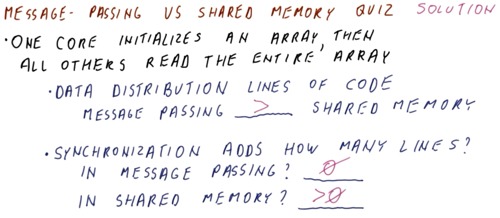
</center>

Consider a program characterized by one core which initializes an array, from which all other cores then subsequently read this *entire* array.

With respect to data distribution (i.e., of the array data on initialization), does a message-passing implementation have more, fewer, or same lines of code relative to shared memory? (Select `MORE`, `FEWER`, or `EQUAL`.)
  * `MORE`

Furthermore, on achievement of a correct data distribution implementation, what is the relative addition of lines with respect to ***synchronization*** (i.e., ensuring that the initialization is completed prior to reading the array data) in the following (equivalent) implementations? (Select `MORE` or `EQUAL`.)
   * In message passing?
     * `EQUAL`
   * In shared memory?
     * `MORE`

***Explanation***:

With respect to data distribution, shared-memory implementation requires virtually *no* net additional lines of code (i.e., once the array is initialized in this shared memory, the other cores can simply read it directly as-is in this manner). Conversely, the equivalent message-passing implementation, explicit constructs (and appropriate ordering/sequencing of operations) are required to perform this initialization, as well as subsequent `send()`/`recv()` operations (i.e., this initialization must be performed "explicitly" with corresponding *additional* program code).

Once data distribution is implemented correctly, message passing requires *no* additional code, as this is already managed by the aforementioned network-based operations. Conversely, in an equivalent shared-memory implementation, explicit constructs (e.g., mutexes) are required to perform this synchronization, which correspondingly requires *additional* program code.

***N.B.*** These observations are typical of shared-memory vs. message-passing implementations. Message passing requires more "programming overhead" to effectively manage distribution of the data (which inherently yields "already implemented" synchronization), whereas shared memory does not require explicit data distribution (but consequently does require additional implementation if/when synchronization is needed to access and manage this distributed data).

## 15-21. Shared-Memory Hardware

### 15. Introduction

<center>
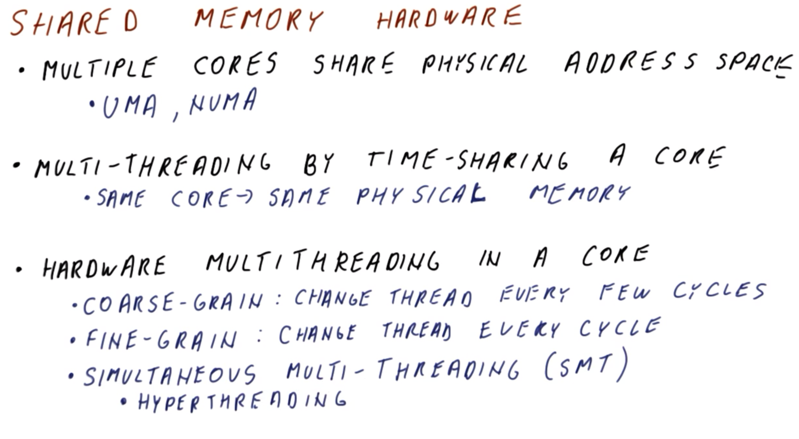
</center>

There are several ***types*** of shared-memory hardware available:
  * `1` - ***Multiple*** (single) cores sharing the ***same*** physical address space
    * All of the cores can issue requests to/from any memory address.
    * Representative ***examples*** include **uniform memory access (UMA)** and **non-uniform memory access (NUMA)**.
  * `2` - At the opposite extreme of `1`, only ***one*** core performs multi-threading via **time-sharing** of this core via its multiple threads
    * Because this involves running on the *same* core, the threads are inherently accessing the ***same*** physical memory (which naturally provides the corresponding shared-memory behavior). In this regard, there is no "true" multi-threading (in the multi-core sense).
  * `3` - An intermediate between `1` and `2`, this involves **hardware multi-threading support** in the core itself, allowing to benefit from "true" multi-threading (i.e., multiple threads per core)
    * This hardware multi-threading support can be provided at a **coarse-grain** level, whereby the thread of execution is simply changed every ***few*** cycles, with corresponding thread-dedicated hardware support (e.g., dedicated registers, etc.) to enabling this switching among the threads (i.e., as opposed to expending additional resources on saving and restoring registers and related state in between thread context switches, etc.).
    * Conversely, this hardware multi-threading support can also be provided at a **fine-grain** level, whereby the thread of execution is changed in ***every*** cycle, which correspondingly requires even more thread-specific hardware support to facilitate performing this cycle-wise rapid switching quickly and efficiently.
    * Furthermore, there is also hardware multi-threading support available via **simultaneous multi-threading (SMT)**, whereby in any given cycle, a combination of these different types of thread operations can occur.
      * ***N.B.*** This is also called **hyper-threading** by some processor manufacturers.

Accordingly, hardware support is required for all of these configurations, which in turn becomes more extensive moving from course-grain to fine-grain to simultaneous multi-threading (SMT). This, then, begs the question: What ***benefit*** is provided by sharing a given core by multiple threads in this manner? This is the topic of the next section.

### 16. Multi-Threading Performance

<center>
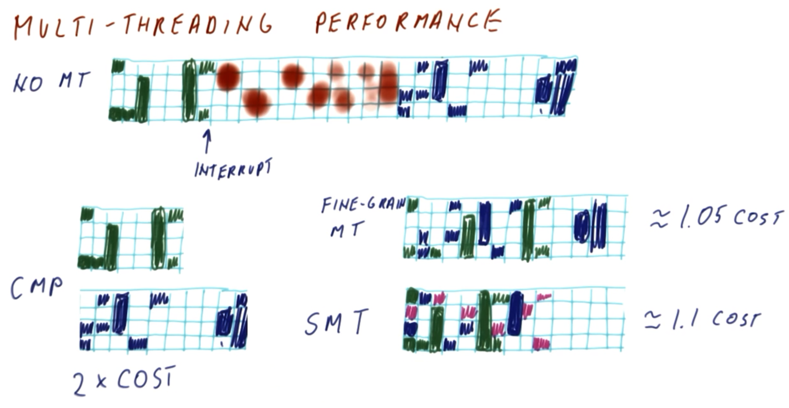
</center>

Consider now the performance of **multi-threading**, and how it can be better than simply running operations "one at a time."

<center>

</center>

With ***no*** multi-threading support, two threads run as in the figure shown above (where "columns" denote successive cycles, and "rows" are four simultaneously executing instructions among the two threads in question).

<center>

</center>

Initially, one thread (denoted by green in the figure shown above) commences execution.
  * In the first cycle, the thread executes two instructions, while the other two available "slots" are unutilized since no instructions are ready to dispatch for execution in this cycle.
  * In the second cycle, there is a data dependency, so one instruction proceeds, while the other waits.
  * In the third cycle, three instructions execute simultaneously.
  * In the fourth and fifth cycles, all "slots" are in an "inactive" state (i.e., either waiting on data dependencies or not receiving dispatched instructions for execution).
  * In the sixth cycle, all four commence execution.
  * In the seventh cycle, a similar pattern follows (i.e., a combination of execution and "inactivity").

***N.B.*** Observe that, in general, there is not a fully utilized processor pipeline at any given time when executing in this manner (i.e., without multi-threading).

<center>

</center>

Suppose now that an ***interrupt*** occurs at the end of the seventh cycle (as in the figure shown above). Because another thread is available for execution, the operating system proceeds with utilizing the pipeline accordingly for several subsequent cycles (denoted by red in the figure shown above), using these cycles to determine which thread to run next.

<center>

</center>

Eventually, the operating system selects another thread (denoted by blue in the figure shown above), which commences execution with a similar pattern as the previous (green) thread (as in the figure shown above).

Therefore, in the case of ***no multi-threading support*** (i.e., performed on a single core without this support), the inherent ***overhead*** derives from performing **context switches** among the threads. Furthermore, this overhead generally ***exceeds*** the benefit provided by running multiple threads (i.e., effectively, the execution pattern is akin to a "less efficient" single-threaded execution performing the equivalent two-thread work in the first place).
  * However, even in this case, this still may be advantageous simply by virtue of allowing to run multiple applications simultaneously (e.g., games and music, without human-perceptible disruption of either), albeit with an added overhead cost.

<center>
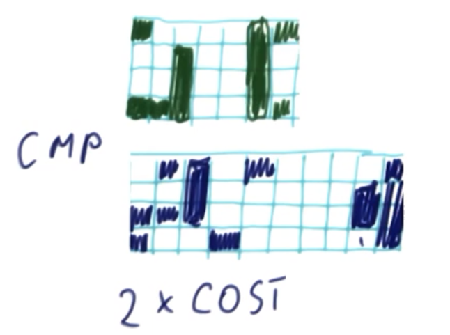
</center>

Conversely, in a **chip multi-core processor (CMP)**, the equivalent work is divided among two separate threads as in the figure shown above.
  * Here, there are two separate/dedicated cores, which execute two independent threads simultaneously.
  * However, this correspondingly ***doubles*** the cost, as it requires an additional dedicated (physical) core for this purpose.

<center>

</center>

Additionally, in **fine-grain multi-threading** (as in the figure shown above), there is only ***one*** (physical) core, however, there are separate/dedicated registers for each thread, as well as additional scheduling logic to support rapid ***per-cycle*** context switching.
  * The correspondingly equivalent work is therefore dramatically improved, as "inactive" cycles can be "interleaved" more effectively in this manner among the two threads, with an overall faster execution of each individual thread's operations.

<center>

</center>

Lastly, in **simultaneous multi-threading (SMT)** (as in the figure shown above), instructions from ***different*** threads can be "mixed" in the ***same*** cycle of execution.
  * The correspondingly equivalent work is therefore even more dramatically improved, with correspondingly additional "interleaving" among the two threads (even more so than in fine-grain multi-threading), with further reduction in "inactive" cycles.
  * Here, one thread (green) is relatively high priority, with the other (blue) "filling in inactivity gaps" accordingly.

<center>

</center>

Additionally, in simultaneous multi-threading (SMT), such utilization can be further enhanced with additional threads (as in the figure shown above, with additional thread denoted by magenta).
  * Therefore, the key advantage of simultaneous multi-threading (SMT) is essentially maximizing utilization of otherwise underutilized issued instruction "slots" in such an out-of-order superscalar processor, which in turn further improves performance to a level approaching that of a chip multi-core processor (CMP).

With respect to ***hardware cost***, this can be summarized as follows (on a relative basis to single-core without multi-threading hardware support):

| Configuration | Cost | Comment |
|:--:|:--:|:--:|
| No multi-threading | `1×` | (N/A) |
| Chip multi-core processor (CMP) | `2×` | Requires a separate dedicated (physical) core |
| Fine-grain multi-threading | `1.05×` | The incremental/additional hardware cost is relatively small, requiring a slightly more complicated fetch stage (for selection among the thread-dedicated program counters) and a slightly more complicated register file (to maintain thread-dedicated architecture register files) |
| Simultaneous multi-threading (SMT) | `1.1×` | The incremental/additional hardware cost is relatively small, as while the processor scheduler is similar to a no-multi-threading equivalent (after register renaming, etc.), but with additional overhead introduced in order to select instructions from among the multiple threads for subsequent scheduling in the per-cycle scheduling window. Additionally, in order to commit, the corresponding instruction must be determined accordingly. |

### 17. Simultaneous Multi-Threading vs. Dual-Core Quiz and Answers

<center>
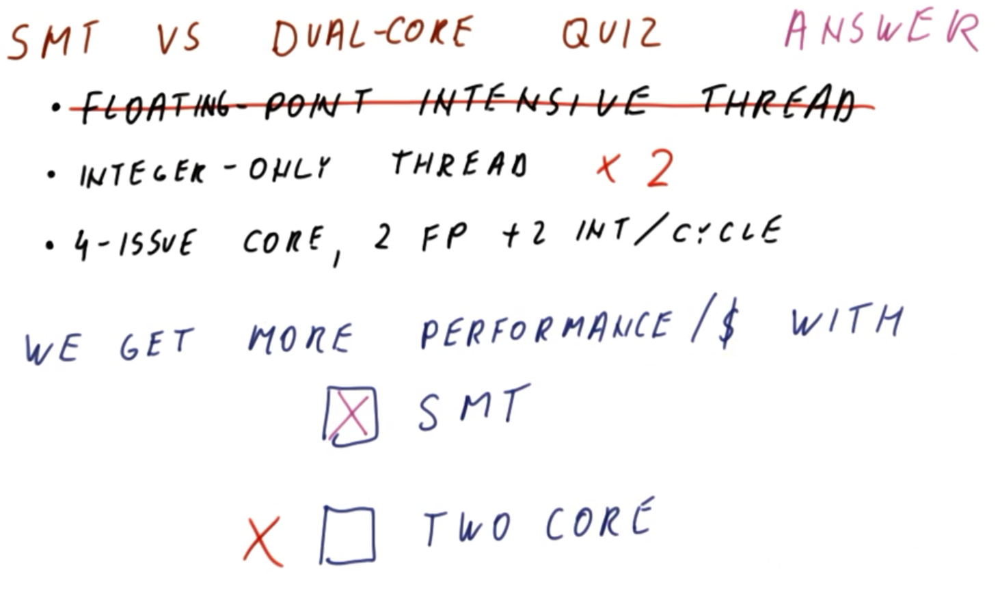
</center>

To further compare simultaneous multi-threading (SMT) with a chip multi-core processor (CMP) (more specifically, a dual-core processor), consider two executing threads characterized as follows:
  * One thread is dedicated primarily to floating-point-intensive instructions (and corresponding execution units)
  * The other thread performs *no* such floating-point operations, but rather is dedicated strictly to integer-only operations

Furthermore, assume that the available core(s) is `4` issue, and capable of issuing `2` floating-point and `2` integer instructions simultaneously per cycle.

In which configuration (simultaneous multi-threading [SMT] vs. dual-core) will there be better performance per-unit hardware cost? (Select one.)
  * Simultaneous multi-threading (SMT)

***Explanation***:

In the dual-core configuration, one processor is effectively `2` issue (i.e., floating-point operations, perhaps with some additional "head room"for integer operations) while the other is strictly `2` issue (i.e., dedicated to integer-only operations).

Conversely, in simultaneous multi-threading (SMT), in any given cycle, `4` instructions can be issued in the best case, thereby approaching similar performance to the dual-core equivalent, however, at a correspondingly much lower relative cost.

However, consider the case where ***no*** floating-point-dedicated thread were available, but rather only two dedicated integer-only threads instead. In this case, the dual-core processor is slightly more cost effective relative to the equivalent simultaneous multi-threading (SMT) single core, because it has the *same* `2` issue performance in *each* core (for the same per-core cost), whereas the simultaneous multi-threading (SMT) single core effectively yields performance of a single core (with both threads sharing the *same* `2`-issue slots) at a slightly higher per-core equivalent cost.
  * Therefore, it is ***not*** a strict generality that simultaneous multi-threading (SMT) is ***always*** more cost-effective (i.e., for comparable performance otherwise) relative to chip multi-core processors (CMPs), but rather the nature of the application(s) in question (and corresponding interaction with the available respective hardware configuration) also dictates this comparison as well. Only in this extreme case of dedicated threads (as in this particular example, i.e., floating-point vs. integer-only threads) is the comparison more "clear-cut."

### 18. Simultaneous Multi-Threading (SMT) Changes

<center>
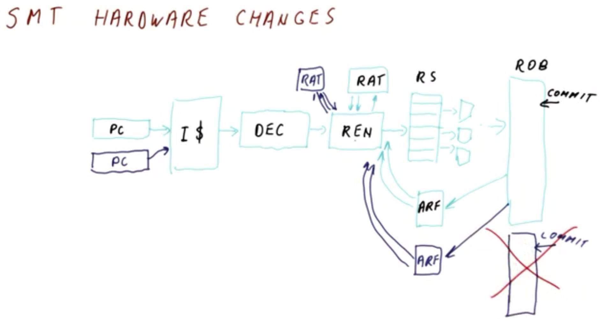
</center>

Given that, in general, a simultaneous multi-threading (SMT) processor is not relatively more expensive than an equivalent single-threaded (i.e., no multi-threading) processor, consider now the corresponding **hardware changes** required to support simultaneous multi-threading in this manner (as in the figure shown above).

In a single-threaded superscalar processor (denoted by light blue in the figure shown above), the following ***components*** are present:
  * A **program counter**
  * The **instruction cache**, which fetches the instructions from the program counter
    * ***N.B.*** In a superscalar processor, multiple instructions are fetched simultaneously from the program counter in this manner.
  * The **decoder**, which is capable of decoding multiple instructions per cycle
  * The **renamer**, which interacts (i.e., reads and updates) with the **register allocation table (RAT)** on a per-thread basis
  * The **reservation stations (RSes)**, which dispatch instructions to the **execution units**
  * The **reorder buffer (ROB)**, which tracks the next ***committed*** instruction on a per-thread basis
  * On instruction ***commit***, the result is deposited into the **architecture register file (ARF)**, which in turn is broadcasted back to the registration stations (RSes)

Correspondingly, to add additional simultaneous multi-threading (SMT) to such a processor, this requires net additions (denoted by dark blue in the figure shown above) as follows:
  * A *separate*/*dedicated* **program counter**, with corresponding additional logic to fetch among the thread-specific program counters
    * This can be done either via fetching of "half-instructions" from both program counters every cycle, or equivalently via fetching of "full instructions" from either program counter per cycle. In this regard, this issuing can be performed in a "fine-grain" manner accordingly, even in such a simultaneous multi-threading (SMT) processor (in fact, this is typical in real processors).
  * Simultaneous multi-threading is characterized by relatively "downstream" hardware elements in the "instruction stream"
    * Decoding is otherwise effectively "oblivious" to the origin of the instructions themselves
    * The **register allocation table (RAT)** is managed on a per-thread basis, without otherwise impacting the renamer itself
    * After renaming, instructions have separate/dedicated (i.e., thread-specific) physical registers, with **reservation stations (RSes)** correspondingly shared among the threads accordingly, and in turn the downstream execution units are also otherwise "oblivious" to the origin of the issued instructions in question
    * With respect to the **reorder buffer (ROB)**, there are two possibilities:
      * There is either a separate/dedicated (i.e., per-thread) ROB, each with its own commit point (in which case each thread commits its respective instructions in-order)
        * Because the Rob is a large, complex hardware component, it is ***not*** typical to follow this approach in practice.
      * Or otherwise all instructions are ***interleaved*** in-order in the same/shared ROB, in which case instructions from one thread cannot be committed until all upstream instructions from the other thread(s) have been committed first
        * This adds a slight performance hit, however, it is comparatively much simpler to implement in hardware.
        * ***N.B.*** If the instructions are sent from the reservation stations (RSes) in-order, then the corresponding "composite" order (i.e., across the threads) is still effectively "in-order," however, the additional inefficiency is introduced if this ordering is out-of-order (i.e., among the threads) in a "blocking" manner (however, while this is slightly sub-optimal, in practice it is not a major issue).
      * As before, on instruction ***commit***, the result is deposited into the **architecture register file (ARF)**, which in turn is broadcasted back to the registration stations (RSes), however, these architecture register files (ARFs) are correspondingly separate/dedicated (i.e., per-thread), along with corresponding **read ports** to update the registration stations (RSes) on broadcast

Therefore, the complexity of simultaneous multi-threading (SMT) is largely introduced by multiple program counters, as well as the (hardware-based) logic immediately preceding the action of the reservation stations (RSes). Otherwise, the more complicated aspects of the processor's hardware (e.g., the reservation stations [RSes] themselves, results broadcasting, etc.) is largely unaffected by this change, and accordingly the cost is only incremental (i.e., rather than an effective doubling for two threads, tripling for three threads, etc.).

### 19. Simultaneous Mult-Threading (SMT), Data Cache, and Translation Look-Aside Buffer (TLB)

Consider now the ***relationship*** between simultaneous multi-threading (SMT), the data cache, and the translation look-aside buffer (TLB).

<center>

</center>

Given a **virtually indexed, virtually tagged (VIVT)** data cache (as in the figure shown above), a virtual address is simply sent to the data cache, and the corresponding data output from the data cache is used accordingly.

However, a ***problem*** in this scenario occurs when the threads have ***separate*** address spaces, which are being sent ***simultaneously*** as inputs to the data cache.
  * From the data cache's perspective, it is "oblivious" to the thread-specific origin of these input virtual addresses, therefore, without corresponding hardware logic to reconcile these discrepancies, there can be corresponding address ***aliasing*** among the inputs from the threads.

***N.B.*** Normally, in a virtually indexed, virtually tagged (VIVT) data cache, in a ***coarse-grain*** configuration, there is a corresponding ***flushing*** of the data cache when switching between the threads. However, now, with the ability to switch among the threads, it is not feasible to flush the data cache in between (thereby adversely impacting the state of the other thread[s] accordingly).

Therefore, in a virtually indexed, virtually tagged (VIVT) data cache, there is a non-trivial ***risk*** of fetching the ***wrong*** data.

<center>
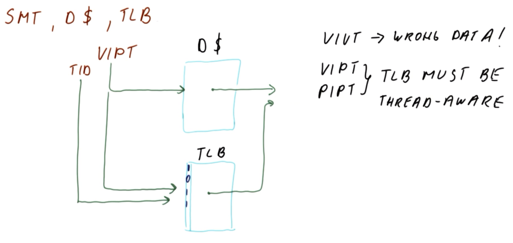
</center>

Conversely, given a **virtually indexed, physically tagged (VIPT)** data cache (as in the figure shown above), an input virtual address is processed more deliberately as follows in order to eliminate any possible aliasing:
  * The input physical address is fetched in the data cache and outputted as the corresponding physical tag
  * These physical tags are correspondingly compared with those originating from the **translation look-aside buffer (TLB)**
  * Furthermore, when using a virtual address to access the translation look-aside buffer (TLB), rather than simply examining the page number of the input virtual address (which may be otherwise ambiguous among the input threads), the translation look-aside buffer (TLB) is additionally designed to be **thread-aware**
    * This "thread awareness" is implemented accordingly by adding an additional bit to each entry in the translation look-aside buffer (TLB) which designates the corresponding thread. This in turn is used along with the input address to match the corresponding **thread ID (TID)** to unambiguously identify the thread in question, yielding a consequent thread look-aside buffer (TLB) hit vs. miss (i.e., for subsequent production of the output physical address).

***N.B.*** Similarly, a **physically indexed, physically tagged (PIPT)** data cache must also be **thread-aware** in this manner.

### 20. Simultaneous Multi-Threading (SMT) and Cache Performance

<center>
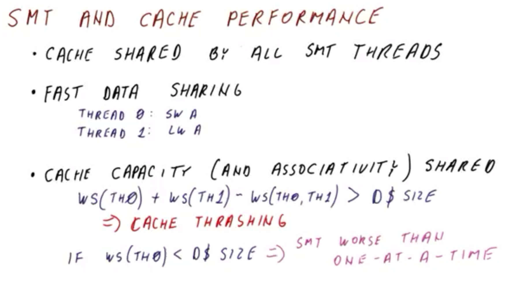
</center>

Consider the relationship between simultaneous multi-threading (SMT) and ***cache performance***.

The cache of the (single) core is ***shared*** among ***all*** constituent threads that are currently active at any given time. This gives rise to both beneficial and adverse properties.

A key ***benefit*** of a shared cache is that there is ***fast*** data sharing among the threads.
  * For example, when thread `0` stores data (i.e., `SW A`) which is subsequently loaded by thread `1` (i.e., `LD A`), this can be performed with respect to the shared cache (i.e., in a direct manner), which is generally conducive to cache hits, etc.

Conversely, a key ***drawback*** of a shared cache is that the cache capacity (and cache associativity) is shared by ***all*** of the threads.
  * Correspondingly, if the relationship between the working sets (`WS`) among the threads is `WS(T0) + WS(T1) - WS(T0, T1) > size(cache)` (i.e., the cache size is exceeded by the respecting working sets' collective usage), then **cache thrashing** can result, whereby this thread-wise data exceeds the capacity of the shared cache, resulting in consequent sustained cache misses.
  * Furthermore, if individually `WS(T0) < size(cache)` (while not otherwise performing multi-threaded operations), then this results in a corresponding ***under-utilization*** of the cache capacity relative to an otherwise non-multi-threaded single-thread equivalent, resulting in comparatively ***significantly worse*** performance accordingly.

Therefore, a ***key assumption*** of using simultaneous multi-threading effectively in the first place is that the resource utilization is maximized across the threads, particularly with respect to the capacity of the cache itself (i.e., the benefit of interleaved/overlapped execution must exceed the risk of potential cache thrashing and under-utilization).

### 21. Simultaneous Multi-Threading (SMT) and Cache Quiz and Answers

<center>
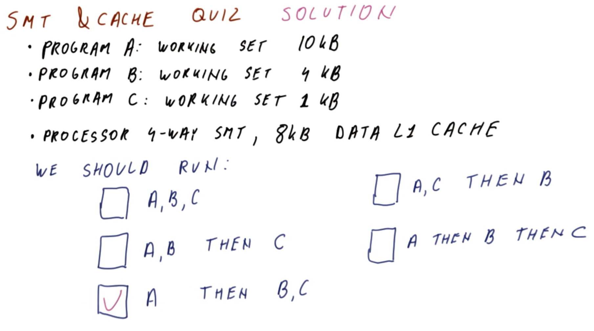
</center>

Consider a series of programs characterized as follows with respect to their respective working-set sizes:

| Program | Working set size (KB) |
|:--:|:--:|
| A | `10` |
| B | `4` |
| C | `1` |

Furthermore, consider a processor core characterized as follows:
  * Supports `4` simultaneous threads
  * Has a `8 KB` level 1 (L1) data cache

Given these characteristics, in what sequence should the programs be run on this processor? (Select the correct option.)
  * Program A, B, and C all run simultaneously
    * `INCORRECT`
  * Programs A and B run simultaneously, followed by program C
    * `INCORRECT`
  * Program A runs alone, followed by programs B and C running simultaneously
    * `CORRECT`
  * Programs A and C run simultaneously, followed by program B
    * `INCORRECT`
  * Program A runs alone, followed by program B, followed by program C (i.e., sequentially)
    * `INCORRECT`

***Explanation***:

Program A has a working set which exceeds the capacity of the cache. Therefore, it will inevitably yield cache misses in all cases. Conversely, programs B and C are both sufficiently small to fit both individually and together in the cache simultaneously, however, the cache capacity exceeds that of running all three programs simultaneously (thereby precluding this possibility, without otherwise incurring poor cache behavior across all three programs).

Conversely, running A by itself first will incur necessary cache misses, however, subsequently running B and C together will yield beneficial simultaneous multi-threading (SMT) performance accordingly, which is otherwise obviated by running all three programs sequentially (i.e., B and C *can* still benefit from SMT accordingly).

## 22. Lesson Outro

This lesson examined two ***approaches*** for writing parallel programs: Message passing, and shared memory.

The next lesson will discuss how to correctly perform caching across multi-cores with shared memory.
