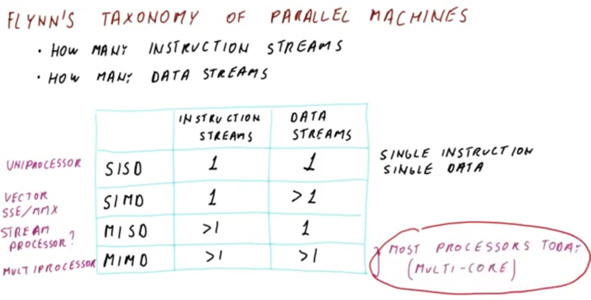
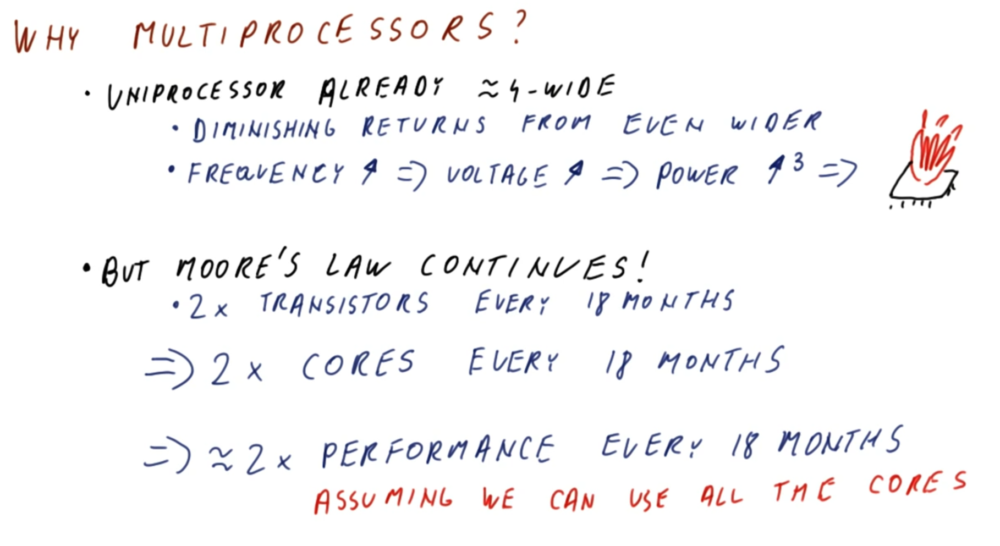
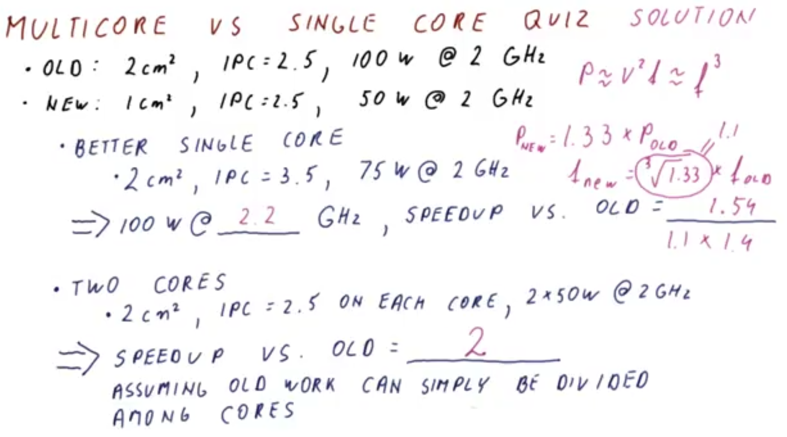
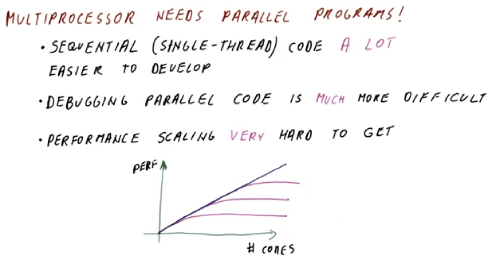
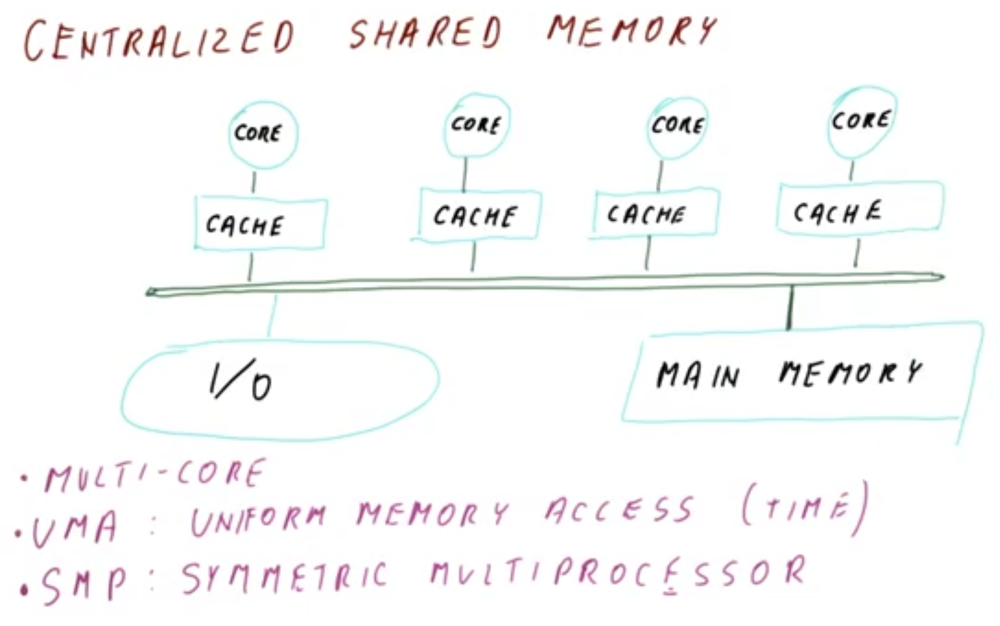
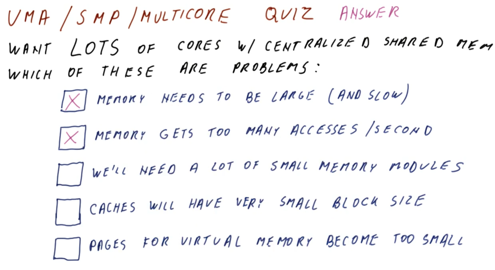
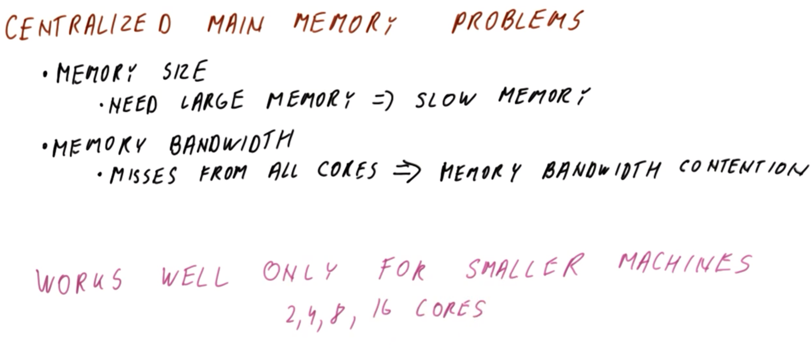
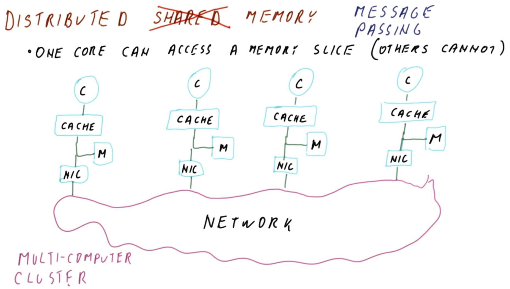
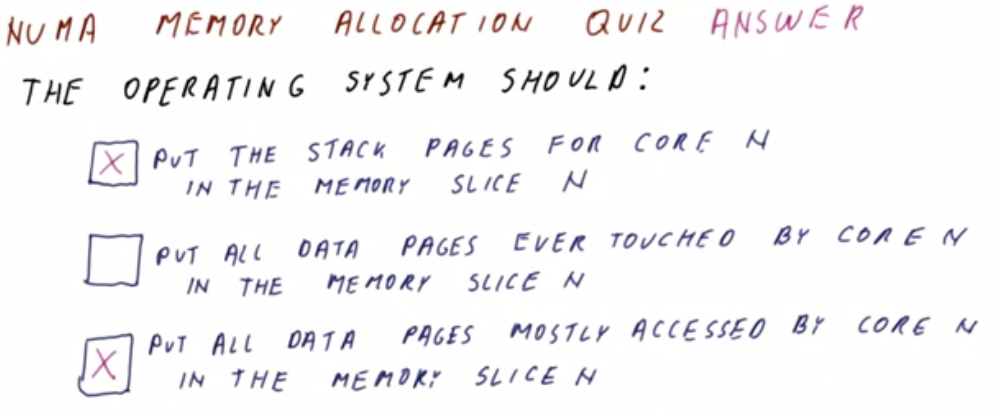

# Multi-Processing

## 1. Lesson Introduction

This lesson will describe what occurs when more than one thread (or process) is executed simultaneously.
  * ***N.B.*** This used to only pertain to supercomputers and to high-end servers, however, practically all modern and future computers are and will be comprised of multiple cores, and possibly multiple threads per core. Therefore, it is accurate to state that *all* processing today is essentially tantamount to ***multi-processing***.

## 2. Flynn's Taxonomy of Parallel Machines

<center>

</center>

**Flynn's taxonomy of parallel machines** categorizes parallel machines according to how many **instruction streams** and how many **data streams** are used by the machine in question. The corresponding categorizations are as follows:

| Parallel machine classification | Quantity of instruction streams | Quantity of data streams | Comment |
|:--:|:--:|:--:|:--:|
| single instruction, single data (SISD) | `1` | `1` | This is a conventional **uni-processor** (i.e., single-core machine), as described previously in this course |
| single instruction, multiple data (SIMD) | `1` | `>1` | This involves only a single program counter executing the single instruction stream, however, it operates on multiple data streams. A typical example is so called **vector processors**, which executes on simultaneous vector values (rather than single scalar values) in a single program involving corresponding vector operations (e.g., vector addition). Modern processors also have **multimedia extensions** (e.g., SSE, MMX, etc.) which fall under this classification.  |
| multiple instruction, single data (MISD) | `>1` | `1` | This involves several program executing simultaneously, all operating on the *same* data stream. This is a relatively rare configuration, however, a relevant example is a **stream processor** (which performs step-wise/stage-wise processing of the data stream). |
| multiple instruction, multiple data (MIMD) | `>1` | `>1` | This is a bona fide **multi-processor**, whereby each processor has its own independent program counter, etc., with each independently operating on its own data stream. |

Most processors today are classified as multiple instruction, multiple data (MIMD), corresponding to the commonly used **multi-core processors**. Correspondingly, these multi-core processors are the focus of this lesson accordingly.

## 3. Why Multi-Processors?

<center>

</center>

So, then, why use multi-processors at all, rather than simply using uni-processors?

Firstly, note that modern uni-processors are already approximately 4-wide to 6-wide. By this point, it is advantageous to switch to multi-processors, because beyond this point, there are diminishing returns in making a uni-processor even wider (i.e., executing 6 to 8 instructions per cycle or so will not be as dramatic of a performance improvement as previously increasing from 2 to 4 or so).
  * The diminishing returns are a direct consequence of Amdahl's law (cf. Lesson 2), where there is more improvement in programs which benefit from this increase in width (e.g., those which are inherently parallel) but not otherwise in those which do not (e.g., those which have a lot of dependencies which effectively "serialize" the overall program).

Additionally, another issue with uni-processors is that if they are designed to be faster by increasing the frequency, this requires a corresponding raise in voltage, which in turn increases the power consumption dramatically (proportionally to `f×V^2`, cf. Lesson 1). Beyond a certain level, this increased power consumption will preclude an practical usage of the processor, as it will overheat from this overloaded power consumption.

Nevertheless, despite these drawbacks with uni-processors, Moore's law has persisted into the modern day, with a doubling of transistors every 18 months, for the same cost and area as previously. In order to achieve this continued improvement, the number of cores have been doubled every 18 months accordingly, which allows to have cores which are not individually wider or individually faster, but rather still provide an overall increase in the transistor density (and correspondingly improved computational performance of the processor chip).
  * However, a key **caveat** here is that this assumes that ***all*** of the cores can be used. Conversely, if a program only uses a single thread of a single core, then this doubling is inconsequential. Therefore it is necessary to design programs to exploit this parallelism in order to maximize the potential performance of these multi-core processors.

Put another way, multi-processors exist today not necessarily because a doubling of the cores is inherently "better" than a uni-processor with the equivalent twice-improved per-processor performance, however, as a practical matter, it is no longer feasible to achieve this per-uni-processor improvement as per current physical constraints, and therefore multi-processors have allowed for a more practical alternative route for improvements more recently.

## 4. Multi-Core vs. Single-Core Quiz and Answers

<center>

</center>

Suppose that the following improvement is made in a single processor core:

| Generation | Area (cm<sup>2</sup>) | Instructions per cycle | Power consumption (W, at 2 GHz) |
|:--:|:--:|:--:|:--:|
| Old | `2` | `2.5` | `100` |
| New | `1` | `2.5` | `50` |

Given this newer-generation processor, analyze the following two alternatives for a subsequent processor design.

In the first alternative, create a better *single* core, characterized by `2 cm^2` total area, `3.5` instructions per cycle, and `75 W` power consumption (at 2 GHz). For this alternative:
  * At 100 W power consumption, what speed/frequency can it achieve?
    * `2.2 GHz`
  * And what is the speedup relative to the older-generation processor?
    * `1.54`
  
In the second alternative, assemble the processor chip from two of these newer-generation cores, characterized by `2 cm^2` total area, `2.5` instructions per cycle on each core, and `50 W` power consumption (at 2 GHz) on each core (i.e., `100 W` total).
  * What is the speedup relative to the older-generation processor, assuming that the same/equivalent "old work" can be divided equally among the two constituent "new" cores?
    * `2`

***Explanation***:

With respect to the first alternative, since the dynamic power is proportional to `f×V^2` (cf. Lesson 1), and furthermore the voltage is proportional to `f` (i.e., `f×V^2 = f×(f)^2 = f^3`), then this implies:

```
f_new = (P_new / P_old)^(1/3) × f_old = (100 W / 75 W)^(1/3) × (2 GHz) = (1.1) × (2 GHz) = 2.2 GHz
```

Furthermore, the speedup of the first alternative relative to the older-generation processor is determined as follows:

```
(2.2 GHz / 2.0 GHz) × (3.5 IPC / 2.5 IPC) × (1 # new instructions / 1 # old instructions) = (1.1) × (1.4) × (1) = 1.54
```

Conversely, with respect to the second alternative, the speedup relative to the older-generation processor is determined as follows:

```
(2.0 GHz / 2.0 GHz) × [(2.5 + 2.5 IPC) / 2.5 IPC] × (1 # new instructions / 1 # old instructions) = (1.0) × (2.0) × (1) = 2.0
```

As this demonstrates, two cores are achieving a higher speedup relatively to a single-core "additionally improved" single-core processor.
  * ***N.B.*** A strong ***caveat*** here is that in order to achieve this "enhanced" speedup, the programs running on this dual-core processor must be amenable to parallelization in order to "divide up" this work appropriately to effectively leverage this parallelization.

## 5. Multi-Processors Need Parallel Programs

<center>

</center>

Recall (cf. Section 4) that a multi-processor can generally outperform a comparable uni-processor with today's technology, provided that the program running on the processor in question is amenable to utilizing these multiple cores (i.e., exploiting parallelism accordingly).

Nevertheless, there are indeed ***disadvantages*** to moving from single-core to multi-core processors, including:
  * Code that is **sequential** (also called **single-threaded**) is generally ***a lot*** easier to develop and reason about.
    * By corollary, there is a significant "developer time-cost" involved in converting a given application from a single-threaded to a multi-threaded implementation.
  * **Debugging** parallel applications is ***much*** more difficult relative to the sequential equivalent.
  * Even with a working implementation of a parallelized application, it is still ***very*** difficult to achieve **performance scaling** in practice, where performance scaling is a property of the program such that as the number of cores is increased, the performance correspondingly increases (as in the figure shown above)
    * In ***ideal*** performance scaling, there is a direct, linear relationship between the increasing cores count and corresponding increase in performance (as denoted by blue line in the figure shown above).
    * However, in practice, as programs are parallelized, performance scaling eventually "plateaus" with respect to increasing cores count (as denoted by purple curves in the figure shown above).
      * Even with improvements in the performance scaling, these "plateaus" generally arise and persist; furthermore, it is generally difficult to achieve incremental "curve-shifting" performance improvements on a per-improvement basis in this manner in the first place.
      * Accordingly, few programs achieve sustained high performance with many cores, and those that do require a lot of time, effort, and expertise to develop accordingly.

## 6-8. Central Shared Memory

In the subsequent sections of this lesson, we will consider several ***types*** of multi-processors.

### 6. Introduction

<center>

</center>

The first type of multi-processor uses what is called a **centralized shared memory** (as in the figure shown above).
  * In this configuration, all of the **cores** (i.e., four, in the figure shown above) have their *own* dedicated **caches**, which are interconnected via the *same* **bus**. This common-bus connection in turn allows the cores to access the *same* **input/output (I/O) devices** and the *same* **main memory**.
  * The cores in turn can ***share*** data by simply reading and writing to this common/shared main memory (assuming the corresponding read/write operations go through the caches properly, as will be discussed later in this lesson). Effectively, the main memory acts as the "intermediary" communication point among the cores in this manner (and similarly for the common/shared input/output [I/O] devices).

This type of system resembles modern **multi-core processors**, which are more formally designated as exhibiting **uniform memory access (UMA) time** (with respect to the access time of the main memory).
  * The main memory is effectively at the "same" (relatively long) distance from each core, via the corresponding respective common/shared bus-based connections.

Additionally, this type of multi-processing is designated as a **symmetric multi-processor (SMP)**, due to the "symmetric"/uniform appearance and configuration of a given core-cache pair within the overall system (i.e., any given core-cache component is effectively interchangeable with any other in the system).

### 7. Uniform Memory Access (UMA) / Symmetric Multi-Processor (SMP) / Multi-Core Quiz and Answers

<center>

</center>

Suppose that it is desired to have ***many*** cores, using a centralized shared memory. Which of the following problems will be encountered in this case? (Select all that apply.)
  * Main memory needs to be very large (and consequently slow)
    * `APPLIES` - Having more cores generally implies running of programs which access more data, all else equal. Therefore, to store and manage this data, a large memory is required accordingly.
  * Main memory receives too many accesses per-unit time (i.e., main memory will require a very high throughput to scale appropriately)
    * `APPLIES` - Cache misses from *all* of the cores will be falling through to main memory, which may reach some critical point which "overwhelms" the main memory (relative to its intrinsic throughput).
  * Many small memory modules will be required (i.e., proportionately to the number of cores)
    * `DOES NOT APPLY` - This is not necessarily true, as the *quantity* of memory modules in a centralized shared memory is not as consequential as the *total capacity* of this memory.
  * Caches will have a very small block size
    * `DOES NOT APPLY` - The block size of the caches is independent of the centralized shared memory, and furthermore is not divided up among the cores, but rather specified on a per-core basis.
  * Pages for virtual memory will become too small (i.e., too small for even practical use)
    * `DOES NOT APPLY` - The page size is independent of both the size of the memory and the quantity of cores used.

### 8. Centralized Main Memory Problems

<center>

</center>

Consider now the **problems** of centralized shared memory, which will motivate discussion of alternative approaches (as discussed subsequently in this lesson).

Firstly, ***memory size*** is a significant constraint. Since the shared main memory must be ***large*** to accommodate this configuration, this results in a ***slow*** memory which is relatively far away from each individual core.

Additionally, ***memory bandwidth*** is another significant issue. Because cache misses from all cores fall through to the *single* shared main memory, this results in **memory bandwidth contention** among these core-wise memory requests (which in turn is exacerbated by the aforementioned large, slow nature of this shared main memory). Consequently, additional cores do not effectively benefit from overall performance on a per-core-added basis (i.e., the memory accesses are effectively rendered as "serialized").

Therefore, for these reasons, a centralized shared memory is only particularly effective for relatively small multi-processor machines comprised of only 2, 4, 8, or perhaps 16 cores at most; beyond this point, the memory bandwidth is effectively "saturated" (and additionally requires an excessively large, slow main memory to support additional cores beyond this).

## 9. Distributed Memory

<center>

</center>

Another type of multi-processor is **distributed memory**, which is no longer "shared" (as in the case of centralized shared memory, cf. Section 6), but rather in this configuration, only one core can access a memory slice, while the others cannot access the same memory slice (as in the figure shown above).

In this distributed memory configuration (as in the figure shown above), each **core** (designated by `C` in the figure shown above) has its own cache, along with a corresponding **main memory "slice"** (designated by `M` in the figure shown above) that can only be locally accessed by that specific core.
  * Effectively, each core individually has a complete single-core computer system.

Additionally, a core-wise network interface card (designated by `NIC` in the figure shown above) connects the cores to the centralized **network**.

In this configuration, whenever a core experiences a ***cache miss***, the cache miss falls through to its own local main memory. Furthermore, in order for a given core to access data from another core's memory, rather than "falling through" with a cache miss, instead the requesting core creates a **network message** (via corresponding operating system "send"/"receive" primitives, or equivalent mechanism) in order to retrieve this other-core data.
  * Therefore, in this configuration, communication is now ***explicit***, rather than "passively" managing via a centralized main memory.

As a consequence of this network-based intercommunication, this necessitates writing programs in a particular manner to accommodate this.
  * Symmetric shared memory and distributed shared memory both pass data around using a centralized shared memory (i.e., read and write operations are used to exchange data).
  * Conversely, distributed memory uses a mechanism called **message passing** for communication. To accomplish this, the program is written as if the individual cores were "independent machines" that communicate over a network.
    * For example, a distributed-memory "supercomputer" proceeds in this manner, however, it utilizes network interface cards and Ethernet connections which are much faster than typical consumer-grad e equivalents.

***N.B.*** This type of distributed memory system is also called a **multi-computer**, because each core-wise element is effectively a "complete computer" on its own (i.e., comprised of a processor, memory, and input/output (I/O) devices). Additionally, the designation of **cluster computer** is also used in this context, since these "complete computers" are tightly "clustered" into a single, shared network, which effectively forms a distributed-memory system.

These types of computers tend to scale up to a very ***large*** number of processors.
  * The reason for this is not that they are fundamentally better at communicating as compared to shared-memory-system equivalents, but rather that the programmer is forced to explicitly deal with and consider this network-based communication (and corresponding primitive) when writing programs for these distributed-memory systems. This in turn enforces "good practices" such as awareness of this network "bottleneck" and devising accordingly (i.e., minimize network accesses and maximize optimal use of the local main memory), thereby ensuring more thoughtfulness around the "shared memory" aspect of the program (i.e., as opposed to "over-relying" on a potentially large, slow centralized shared memory).

## 10. Non-Uniform Memory Access (NUMA) Memory Allocation Quiz and Answers

<center>

</center>

How should the operating system allocate memory in a **non-uniform memory access (NUMA)** system (i.e., distributed memory)? (Select all that apply.)
  * Place the stack pages for core `N` in the memory slice `N`.
    * `APPLIES`
  * Place all data pages *ever touched* by core `N` in the memory slice `N`.
    * `DOES NOT APPLY`
  * Place all data pages *mostly accessed* by core `N` in the memory slice `N`.
    * `APPLIES`

***Explanation***:

In general, in order to improve performance for a non-uniform memory access (NUMA) machine, the operating system should place all data pages as closely/locally to the relevant core(s) as possible, thereby ensuring the fastest possible memory access (i.e., by correspondingly minimizing otherwise-necessary network utilization).
  * Along these lines, placing the stack pages for core `N` in memory slice `N` is simply the extreme example of this, effectively "fully localizing" the "data slice" to this core. Furthermore, a stack is a memory entity which the operating system can readily determine with respect to appropriate core-wise localization (i.e., in contrast to pages which are inherently accessed by multiple cores).

However, placing all data pages *ever touched* by core `N` in corresponding memory slice `N` will localize the data to that core, and possibly exceed its local memory capacity as well.

## 11-13. Message Passing vs. Shared Memory

### 11. A Message-Passing Program

### 12. A Shared-Memory Program

### 13. Message Passing vs. Shared Memory: Summary
