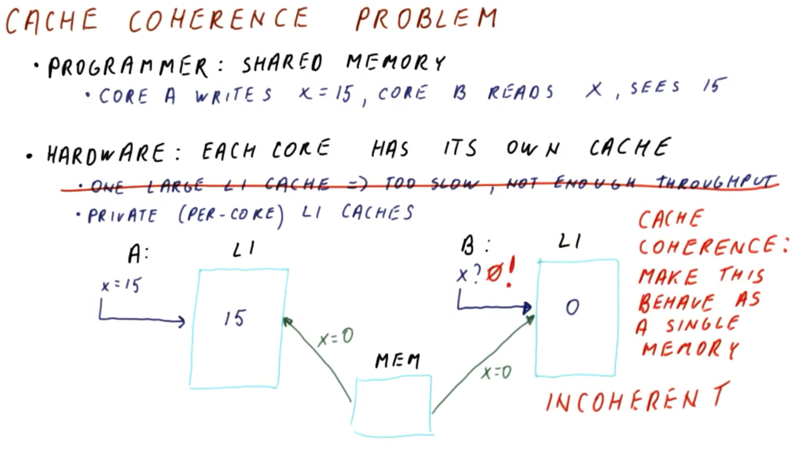
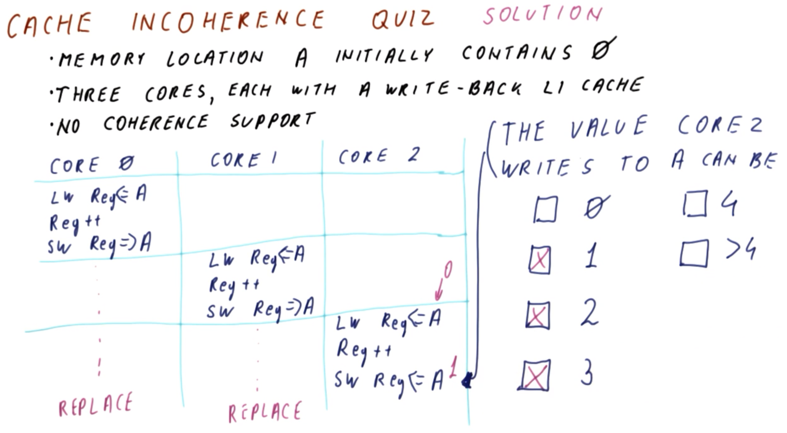
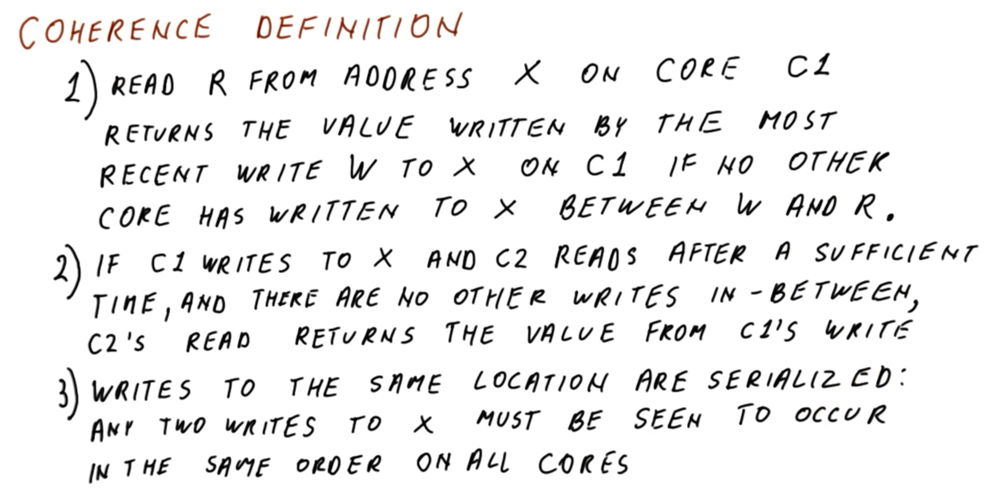
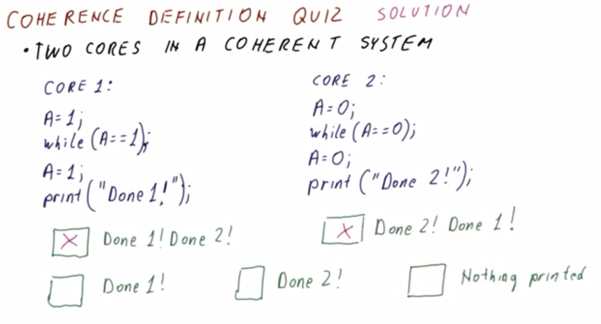

# Cache Coherence

## 1. Lesson Introduction

This lesson will discuss the basics of **cache coherence**. Coherence is needed in order to ensure that when one core writes to its own cache, other cores can also observe these changes when reading out of their own respective caches.

## 2. Cache Coherence Problem

<center>

</center>

Consider whether **cache coherence** is even necessary in the first place.

From the ***programmer's*** perspective, they expect to observe shared-memory behavior as follows:
  * Core `A` first writes `x = 15` (i.e., to shared memory)
  * When core `B` reads `x`, it "observes" the value `15`

Conversely, from the ***hardware's*** perspective, each core has its ***own*** cache. This is necessary, because a *single* level 1 (L1) cache otherwise would be ***too slow*** and of ***insufficient throughput*** in order to effectively support multi-core processing in this manner.

Therefore, rather than using a single level 1 (L1) cache, each core has a dedicated ***private*** (i.e., per-core) level 1 (L1) cache instead. However, this introduces additional ***complications*** (as in the figure shown above).
  * With both cores (i.e., `A` and `B`) having their own level 1 (L1) caches, when core `A` writes `x = 15`, if a cache miss occurs with respect to its own level 1 (L1) cache, it is consequently fetched from main memory. This fetch correspondingly brings in a new value (i.e., `x = 0`) into core `A`'s level 1 (L1) cache, which is subsequently overwritten with value `15` by core `A`.
  * Subsequently, core `B` attempts to read value `x`. Core `B` accesses its own level 1 (L1) cache, resulting in a cache miss and consequent fetch from main memory. However, since the value from Core `A` has not yet been written back to main memory, the original value (i.e., `x = 0`) is fetched into Core `B`'s level 1 (L1) cache instead, which is the incorrect value (i.e., with respect to the semantics of the program itself).
  * Proceeding in this manner, each core can individually update this value independently many times, prior to subsequent writing back to the shared main-memory information.

This "mismatched" behavior in a shared-memory system is called **incoherence**, i.e., the same main-memory location as viewed from multiple different cores can have disparate/mismatched values (which is *not* intended in such a shared-memory system).

Therefore, in order to avoid this incoherence, a corresponding **cache coherence** strategy is required to mitigate this, i.e., devising in such a manner whereby the entire system effectively behaves as a "single-memory" system.

## 3. Cache Incoherence Quiz and Answers

<center>

</center>

Consider a memory location `A` initialized to value `0`.

The system of interest is characterized by three cores, each with a write-back level 1 (L1) cache. These write-back caches do ***not*** provide coherence support (i.e., each level 1 [L1] cache simply behaves as an "independent uni-processor" with respect to its associated core, without otherwise attempting to provide cache coherence for the system at large).

The three cores perform the following sequence of operations (where `←` denotes "read from" and `→` denotes "write to"):

(first, core `0`)
```
LW Reg ← A
Reg++
SW Reg → A
```

(next, core `1`)
```
LW Reg ← A
Reg++
SW Reg → A
```

(last, core `2`)
```
LW Reg ← A
Reg++
SW Reg → A
```

In the final write to memory location `A` (i.e., as performed by core `2`), what is the possible value written? (Select all that apply.)
  * `0`
    * `DOES NOT APPLY`
  * `1`
    * `APPLIES`
  * `2`
    * `APPLIES`
  * `3`
    * `APPLIES`
  * `4`
    * `DOES NOT APPLY`
  * `> 4`
    * `DOES NOT APPLY`

***Explanation***:

The "intended" behavior of the program is such that each subsequent read/write pair performed core-wise will correspondingly update the value in memory location `A` accordingly (i.e., updating from `0` to `3` via corresponding three write operations).

However, a key ambiguity arises in an incoherent system at the "boundaries" (i.e., as one core's write operation occurs, the next core's subsequent read operation occurs).
  * If there is a corresponding "lag" between core `0`'s write and core `1`'s subsequent read, then this will propagate value `1` to core `2` from core `1`, with a consequent update to value `2`.
  * Similarly, if there is a corresponding "lag" in *both* write/read pairs (i.e., across cores `0` to `1`, and `1` to `2`), then core `2` will effectively read initial value `0` and increment this to `1` accordingly immediately prior to writing out.

Furthermore, the value `0` will not "fall through" regardless, as core `2` will still ultimately perform at least one increment operation accordingly. Similarly, the value `4` will be neither reached nor exceeded, as the maximum number of upstream increments (i.e., from initial value `0`) is two additional increments immediately preceding the additional increment performed by core `2`.

## 4. Coherence Definition

<center>

</center>

Consider now a more formal definition of **cache coherence** (i.e., beyond the simple intuition of "a shared-memory system behaving as if there is only one composite cache").

To fulfill the definition of cache coherence, the system must fulfill the following three ***requirements***:
  * 1 - Read operation `R` on address `X` performed on core `C1` must return the value written by the most recent write operation `W` to `X` on `C1` if no other core has written to `X` in the elapsed time between operations `W` and `R`.
    * This part of the definition implies that if one care is operating on a location all by itself, then its reads should be the most recent writes with respect to that same core. Accordingly, cache coherence therefore implies cache-correct uni-processor behavior with respect to any given core in the system.
  * 2 - If core `C1` writes to `X` and core `C2` reads ***after*** a sufficient time has elapsed, and if there are no other writes in between this elapsed time, then `C2`'s read must return the value from `C1`'s preceding write operation.
    * Conversely, if a subsequent write operation(s) were to have occurred in this elapsed time, then this latter write operation(s) would be regarded as correct/canonical.
    * This part of the definition implies that a "slow-reading" core must eventually resolve to correct/updated values, even if an equivalent uni-processor cache would otherwise simply "stall" on this stale value due to otherwise not requiring its replacement (i.e., with respect to its own operation and corresponding program of execution).
  * 3 - If there are simultaneously write operations to the ***same*** location, then these write operations must be ***serialized*** accordingly: Any two writes to `X` must be ***observed*** as occurring in the ***same*** order from the perspective of ***all*** constituent cores
    * This part of the definition implies that there must be a universal consensus on the ordering of these write operations, with no disagreement among any two (or more) cores (including the currently writing cores) with respect to the ordering in question.
    * ***N.B.*** This third part of the definition does not depend on the second part of the definition, but rather the "slow-reading" core must simply "ultimately" read the intended order of the writes (i.e., the most recent write must be coherently ordered accordingly).

## 5. Coherence Definition Quiz and Answers

<center>

</center>

Consider a coherent system comprised of two cores. These two cores simultaneously execute the following programs respectively (where `A` is a shared-memory location):

(core `1`)
```c
A = 1;
while (A == 1):
A = 1;
print("Done 1!");
```

(core `2`)
```c
A = 0;
while (A == 0);
A = 0;
print("Done 2!");
```

***N.B.*** It is not strictly necessary for both cores to execute their respective programs in "lock-step" (i.e., execution of each program is independent of the other).

What is the correspondingly possible output of these programs running on this system? (Select all that apply.)
  * `Done 1! Done 2!`
    * `APPLIES`
  * `Done 2! Done 1!`
    * `APPLIES`
  * `Done 1!`
    * `DOES NOT APPLY`
  * `Done 2!`
    * `DOES NOT APPLY`
  * (no printed output)
    * `DOES NOT APPLY`

***Explanation***:

Each program's blocking condition (i.e., `while` loop) will be "unblocked" by the program running on the other core. However, this will otherwise occur non-deterministically, and thus the order of the printed outputs can occur in either order.
  * Furthermore, note that by the strict (i.e., three-part) definition of cache coherence (cf. Section 4), this will be guaranteed/ensured accordingly, i.e., the sequential writes will ultimately prevent either program individually from never clearing the blocking condition (e.g., one core's program will not "outpace" the other prior to the latter's reaching of this blocking condition, because cache coherence will enforce appropriate state updates, thereby precluding this possibility).

***N.B.*** In an *incoherent* system, all of these would be possible outputs. In particular, there are possible scenarios whereby one or both programs are independently "blocked" on the respective blocking conditions, due to a temporal mismatch in their respective execution, and otherwise independent core-wise cache maintenance/dependence.
  * In this manner, coherence is generally a strict subset of of incoherence, as the "coherent" outputs could also result in the equivalent incoherent system, however, the reverse is not true (i.e., a coherent system will strictly exclude these "incoherent" outputs).

## 6. How to Achieve Coherence?
