# Cache Coherence

## 1. Lesson Introduction

This lesson will discuss the basics of **cache coherence**. Coherence is needed in order to ensure that when one core writes to its own cache, other cores can also observe these changes when reading out of their own respective caches.

## 2. Cache Coherence Problem

<center>

</center>

Consider whether **cache coherence** is even necessary in the first place.

From the ***programmer's*** perspective, they expect to observe shared-memory behavior as follows:
  * Core `A` first writes `x = 15` (i.e., to shared memory)
  * When core `B` reads `x`, it "observes" the value `15`

Conversely, from the ***hardware's*** perspective, each core has its ***own*** cache. This is necessary, because a *single* level 1 (L1) cache otherwise would be ***too slow*** and of ***insufficient throughput*** in order to effectively support multi-core processing in this manner.

Therefore, rather than using a single level 1 (L1) cache, each core has a dedicated ***private*** (i.e., per-core) level 1 (L1) cache instead. However, this introduces additional ***complications*** (as in the figure shown above).
  * With both cores (i.e., `A` and `B`) having their own level 1 (L1) caches, when core `A` writes `x = 15`, if a cache miss occurs with respect to its own level 1 (L1) cache, it is consequently fetched from main memory. This fetch correspondingly brings in a new value (i.e., `x = 0`) into core `A`'s level 1 (L1) cache, which is subsequently overwritten with value `15` by core `A`.
  * Subsequently, core `B` attempts to read value `x`. Core `B` accesses its own level 1 (L1) cache, resulting in a cache miss and consequent fetch from main memory. However, since the value from Core `A` has not yet been written back to main memory, the original value (i.e., `x = 0`) is fetched into Core `B`'s level 1 (L1) cache instead, which is the incorrect value (i.e., with respect to the semantics of the program itself).
  * Proceeding in this manner, each core can individually update this value independently many times, prior to subsequent writing back to the shared main-memory information.

This "mismatched" behavior in a shared-memory system is called **incoherence**, i.e., the same main-memory location as viewed from multiple different cores can have disparate/mismatched values (which is *not* intended in such a shared-memory system).

Therefore, in order to avoid this incoherence, a corresponding **cache coherence** strategy is required to mitigate this, i.e., devising in such a manner whereby the entire system effectively behaves as a "single-memory" system.

## 3. Cache Incoherence Quiz and Answers

<center>

</center>

Consider a memory location `A` initialized to value `0`.

The system of interest is characterized by three cores, each with a write-back level 1 (L1) cache. These write-back caches do ***not*** provide coherence support (i.e., each level 1 [L1] cache simply behaves as an "independent uni-processor" with respect to its associated core, without otherwise attempting to provide cache coherence for the system at large).

The three cores perform the following sequence of operations (where `←` denotes "read from" and `→` denotes "write to"):

(first, core `0`)
```
LW Reg ← A
Reg++
SW Reg → A
```

(next, core `1`)
```
LW Reg ← A
Reg++
SW Reg → A
```

(last, core `2`)
```
LW Reg ← A
Reg++
SW Reg → A
```

In the final write to memory location `A` (i.e., as performed by core `2`), what is the possible value written? (Select all that apply.)
  * `0`
    * `DOES NOT APPLY`
  * `1`
    * `APPLIES`
  * `2`
    * `APPLIES`
  * `3`
    * `APPLIES`
  * `4`
    * `DOES NOT APPLY`
  * `> 4`
    * `DOES NOT APPLY`

***Explanation***:

The "intended" behavior of the program is such that each subsequent read/write pair performed core-wise will correspondingly update the value in memory location `A` accordingly (i.e., updating from `0` to `3` via corresponding three write operations).

However, a key ambiguity arises in an incoherent system at the "boundaries" (i.e., as one core's write operation occurs, the next core's subsequent read operation occurs).
  * If there is a corresponding "lag" between core `0`'s write and core `1`'s subsequent read, then this will propagate value `1` to core `2` from core `1`, with a consequent update to value `2`.
  * Similarly, if there is a corresponding "lag" in *both* write/read pairs (i.e., across cores `0` to `1`, and `1` to `2`), then core `2` will effectively read initial value `0` and increment this to `1` accordingly immediately prior to writing out.

Furthermore, the value `0` will not "fall through" regardless, as core `2` will still ultimately perform at least one increment operation accordingly. Similarly, the value `4` will be neither reached nor exceeded, as the maximum number of upstream increments (i.e., from initial value `0`) is two additional increments immediately preceding the additional increment performed by core `2`.

## 4. Coherence Definition

<center>

</center>

Consider now a more formal definition of **cache coherence** (i.e., beyond the simple intuition of "a shared-memory system behaving as if there is only one composite cache").

To fulfill the definition of cache coherence, the system must fulfill the following three ***requirements***:
  * 1 - Read operation `R` on address `X` performed on core `C1` must return the value written by the most recent write operation `W` to `X` on `C1` if no other core has written to `X` in the elapsed time between operations `W` and `R`.
    * This part of the definition implies that if one core is operating on a location all by itself, then its reads should be the most recent writes with respect to that same core. Accordingly, cache coherence therefore implies cache-correct uni-processor behavior with respect to any given core in the system.
  * 2 - If core `C1` writes to `X` and core `C2` reads ***after*** a sufficient time has elapsed, and if there are no other writes in between this elapsed time, then `C2`'s read must return the value from `C1`'s preceding write operation.
    * Conversely, if a subsequent write operation(s) were to have occurred in this elapsed time, then this latter write operation(s) would be regarded as correct/canonical.
    * This part of the definition implies that a "slow-reading" core must eventually resolve to correct/updated values, even if an equivalent uni-processor cache would otherwise simply "stall" on this stale value due to otherwise not requiring its replacement (i.e., with respect to its own operation and corresponding program of execution).
  * 3 - If there are simultaneously write operations to the ***same*** location, then these write operations must be ***serialized*** accordingly: Any two writes to `X` must be ***observed*** as occurring in the ***same*** order from the perspective of ***all*** constituent cores
    * This part of the definition implies that there must be a universal consensus on the ordering of these write operations, with no disagreement among any two (or more) cores (including the currently writing cores) with respect to the ordering in question.
    * ***N.B.*** This third part of the definition does not depend on the second part of the definition, but rather the "slow-reading" core must simply "ultimately" read the intended order of the writes (i.e., the most recent write must be coherently ordered accordingly).

## 5. Coherence Definition Quiz and Answers

<center>

</center>

Consider a coherent system comprised of two cores. These two cores simultaneously execute the following programs respectively (where `A` is a shared-memory location):

(core `1`)
```c
A = 1;
while (A == 1);
A = 1;
print("Done 1!");
```

(core `2`)
```c
A = 0;
while (A == 0);
A = 0;
print("Done 2!");
```

***N.B.*** It is not strictly necessary for both cores to execute their respective programs in "lock-step" (i.e., execution of each program is independent of the other).

What is the correspondingly possible output of these programs running on this system? (Select all that apply.)
  * `Done 1! Done 2!`
    * `APPLIES`
  * `Done 2! Done 1!`
    * `APPLIES`
  * `Done 1!`
    * `DOES NOT APPLY`
  * `Done 2!`
    * `DOES NOT APPLY`
  * (no printed output)
    * `DOES NOT APPLY`

***Explanation***:

Each program's blocking condition (i.e., `while` loop) will be "unblocked" by the program running on the other core. However, this will otherwise occur non-deterministically, and thus the order of the printed outputs can occur in either order.
  * Furthermore, note that by the strict (i.e., three-part) definition of cache coherence (cf. Section 4), this will be guaranteed/ensured accordingly, i.e., the sequential writes will ultimately prevent either program individually from never clearing the blocking condition (e.g., one core's program will not "outpace" the other prior to the latter's reaching of this blocking condition, because cache coherence will enforce appropriate state updates, thereby precluding this possibility).

***N.B.*** In an *incoherent* system, all of these would be possible outputs. In particular, there are possible scenarios whereby one or both programs are independently "blocked" on the respective blocking conditions, due to a temporal mismatch in their respective execution, and otherwise independent core-wise cache maintenance/dependence.
  * In this manner, coherence is generally a strict subset of of incoherence, as the "coherent" outputs could also result in the equivalent incoherent system, however, the reverse is not true (i.e., a coherent system will strictly exclude these "incoherent" outputs).

## 6. How to Achieve Coherence?

<center>
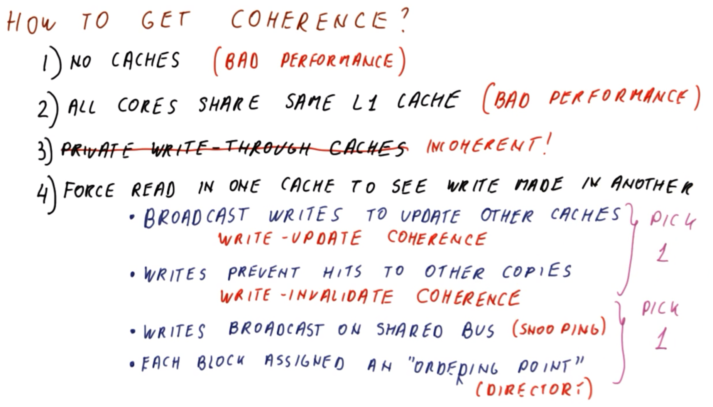
</center>

There are several ***strategies*** for achieving cache coherence, as follows:
  * 1 - Avoid caches altogether
    * This is a trivial solution, as it results in unacceptably poor performance. However, by strict definition, relying solely on main memory as the "shared memory" mechanism is a valid implementation strategy in this context.
  * 2 - All cores share the ***same*** level 1 (L1) cache
    * This is an analogous situation to a shared main memory, albeit with comparatively better performance (relative to relying strictly on main memory). However, this will still result in unacceptably poor performance nevertheless.
  * 3 - Core-wise ***private*** write-through caches
    * In this case, while the main memory does observe all of the writes, it still introduces the ***problem*** of a "lagging" core(s) with respect to long-reading data with respect to this individual cache. In particular, this may eventually outlast subsequent write-through operations to the main memory from the other cores, resulting in an ***incoherent*** system.
  * 4 - Ultimately, the required solution to achieve coherence is to ***force*** read operations in one cache to observe write changes in the other caches (i.e., a given core's private cache cannot simply perpetuate a "local cache hit" indefinitely, without otherwise consulting the shared memory as prompted), which can be accomplished by the following sub-strategies:
    * 4A - **write-update coherence** → ***broadcast*** writes to update other caches (analogously to a write-through cache in a single-core system)
    * 4B - **write-invalidate coherence** → writes ***prevent*** cache hits on other copies of the cache block (i.e., effectively all of these "copies" of the cache block must behave as "cache misses" or otherwise "invalidated" in some such manner)
    * 4C - **snooping** → ***broadcast*** writes on a ***shared bus***, with the corresponding ordering of these writes being observed by the respective cores accordingly
      * ***N.B.*** In this strategy, the shared bus can become ***bottlenecking***.
    * 4D - **directory-based coherence** → each cache block is assigned an ***ordering point*** (called a **directory** in the context of cache coherence), with different ordering points generally being used by different cache blocks (i.e., for a given cache block, all accessed are ordered by the ***same*** entity, but otherwise these entities are different/distinct among the blocks, thereby precluding any possible contention)

Strategies 4A and 4B ensure that subsequent reads receive updated values produced by writes (i.e., the second coherence property, cf. Section 4). Strategies 4C and 4D ensure that all cores observe the same ordering of the writes (i.e., the third coherence property, cf. Section 4).
  * Accordingly, it is necessarily to select one strategy apiece among the pairs 4A/4B and 4C/4D, with all possible combinations being generally useful.

## 7-15. Write-Update and Write-Invalidate Coherence

### 7. Write-Update Snooping Coherence

<center>
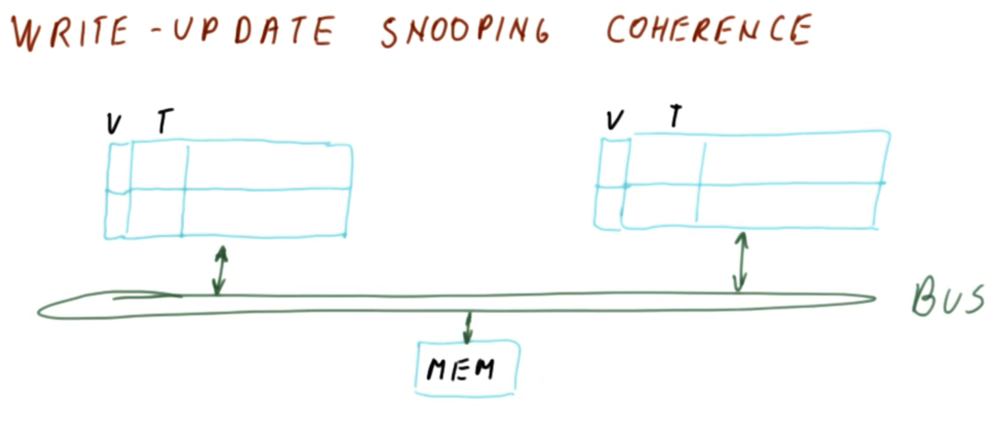
</center>

Consider a two-cache, two-processor system (as in the figure shown above), with each cache comprised of two blocks (with each block comprised of a valid bit [`V`], a tag [`T`], and the cache data). Each cache is connected to the ***same*** shared bus, which in turn is connected to the main memory. Furthermore, assume that both caches are initially empty (with all valid bits correspondingly set to `0`).

<center>
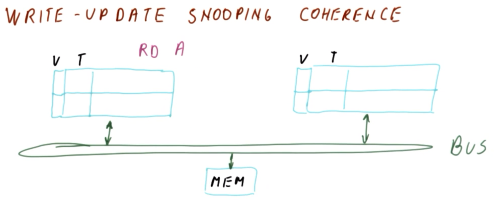
</center>

The left processor initially reads from shared block `A` (i.e., `RD A`, as in the figure shown above), resulting in a cache miss with respect to the left cache block and consequent request to main memory.

The right cache constantly monitors activity on the bus, however, it is only specifically interested in write operations. Consequently, `RD A` is ignored by the right cache.

<center>
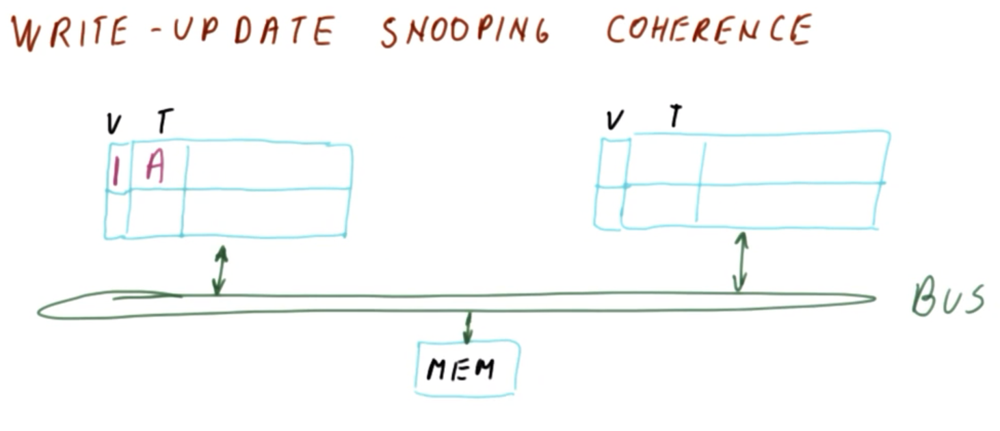
</center>

On retrieval of the data from main memory, the left cache is updated accordingly (as in the figure shown above).

<center>
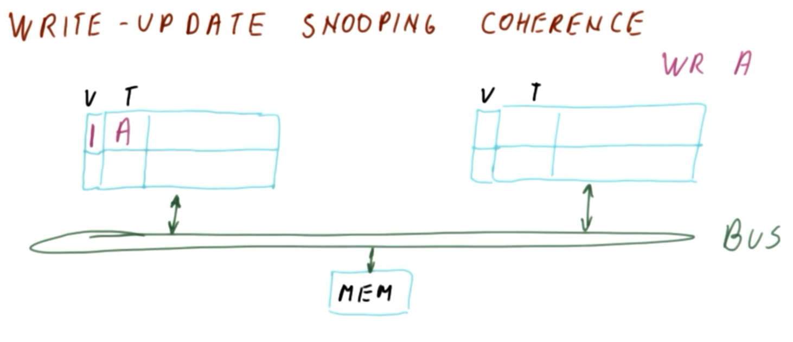
</center>

Next, the right processor performs a write operation on shared block `A` (i.e., `WR A`, as in the figure shown above).

<center>
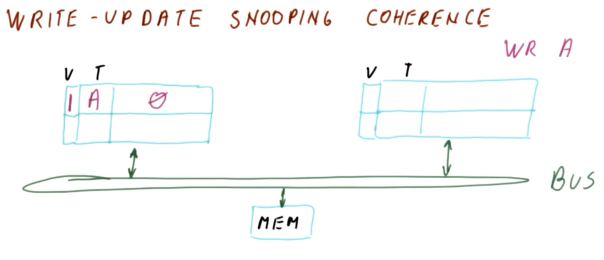
</center>

Even on write-through access to main memory from the right processor, a subsequent read from the left processor will yield a "stale" read of `A` (as in the figure shown above). Assume that the left processor reads value `0` accordingly.

<center>
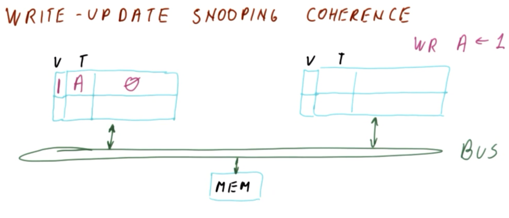
</center>

Next, the right processor writes value `1` to shared block `A` (i.e., `WR A ← 1` as in the figure shown above). Even if this write operation were to write-through to main memory, this alone does not yield coherent behavior from the left cache, as a subsequent cache hit by the left processor will still yield (incorrect) value `0`.

Consequently, this situation is where **write-update** and **snooping** become significant.

<center>
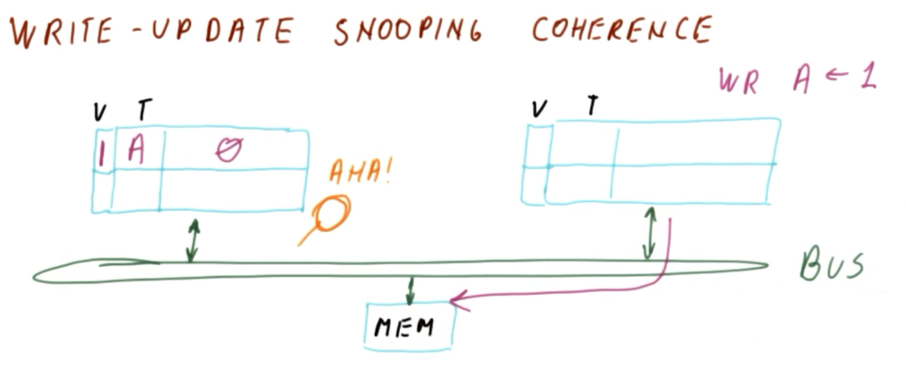
</center>

Since a cache miss occurs here with respect to the right cache (as in the figure shown above), the block is requested from main memory, along with an indication of a write operation (along with the corresponding value and address), with a corresponding update to the main memory's value.

Because the left cache is monitoring (i.e., ***snooping***) the bus, it correspondingly detects this activity, and detects this update relative to its own internal cache state (which is now invalidated accordingly).

<center>
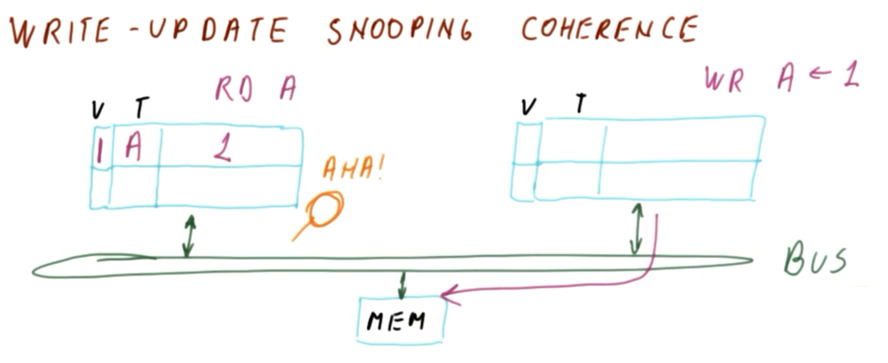
</center>

Correspondingly, a ***write update*** also occurs with respect to the left cache (as in the figure shown above), whereby the corresponding cache-block entry for `A` is updated accordingly to value `1`. Furthermore, subsequent read operations (i.e., `RD A`) in the left cache will read this updated value accordingly.

In this manner, if there are multiple cores, there will not be any disagreement among the ordering of the write operations, as this ordering is enforced by the shared bus (which broadcasts writes sequentially, one at a time).

<center>
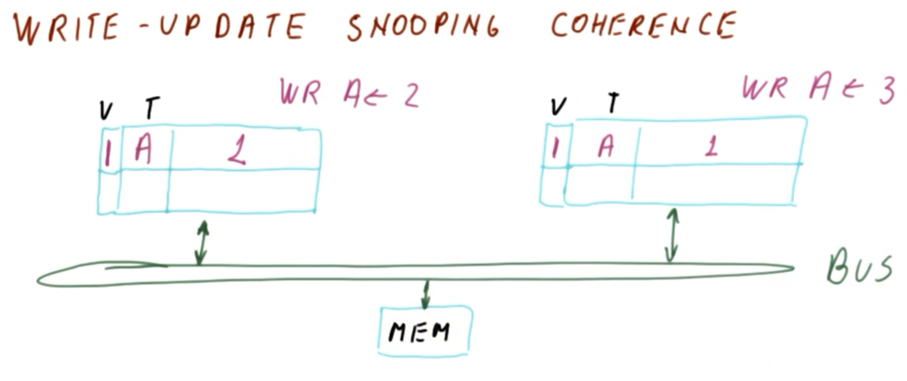
</center>

Now, consider the scenario whereby both caches attempt to write to `A` ***simultaneously*** (as in the figure shown above).

In this situation, the processors must ***arbitrate*** for the shared bus immediately prior to writing to it. This ***arbitration*** process in turn will enforce ordering among these write operations.

<center>
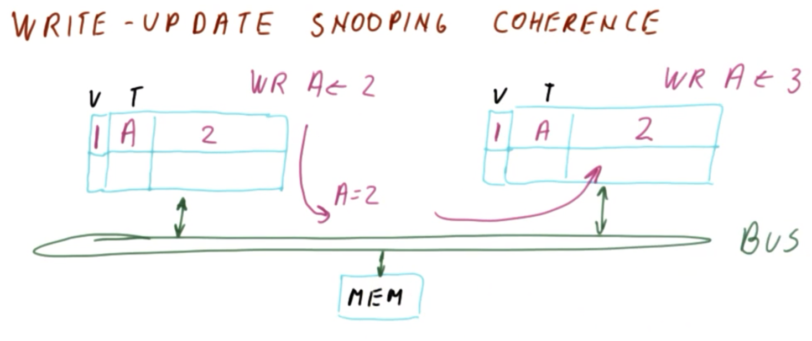
</center>

Assuming the left core "wins" the arbitration process (as in the figure shown above), the corresponding write operation will be performed first, with each core updating its respective cache appropriately.

<center>
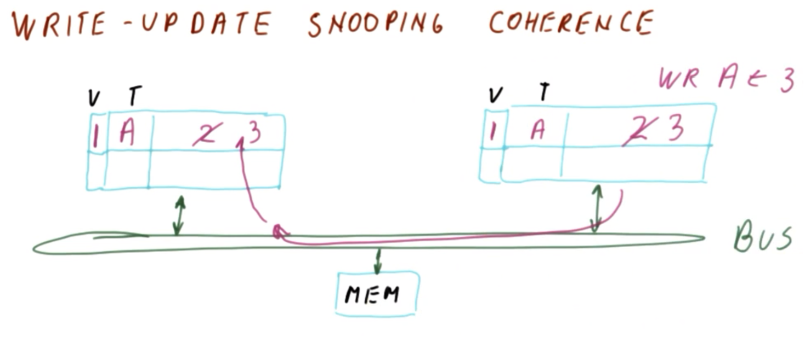
</center>

Next, the subsequent write operation is performed, with corresponding update of each respective cache accordingly.

In this manner, there is consensus among both caches with respect to the "true" value of `A` at any given time, which is accomplished via corresponding snooping of the common bus (i.e., by the non-writing cache[s]) and subsequent write-update.

### 8. Write-Update Coherence Quiz and Answers

<center>
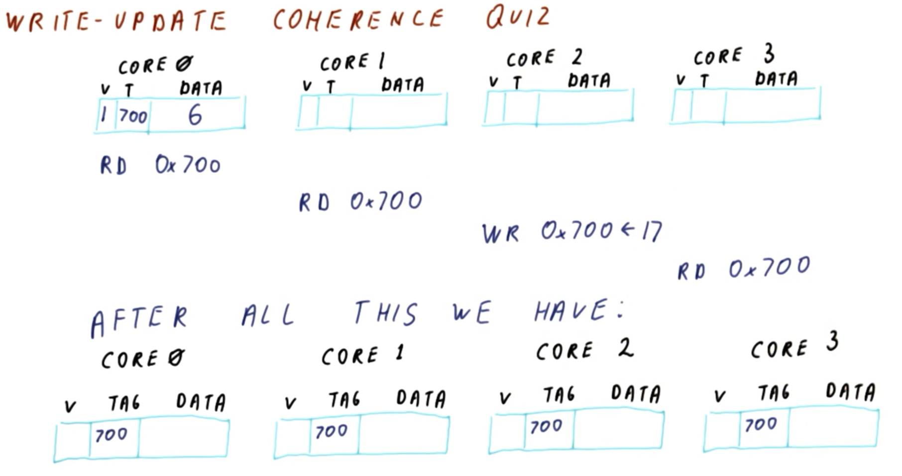
</center>

Consider a four-core system, with each core comprised of a single-block cache (as in the figure shown above). Furthermore, the system exhibits write-update cache coherence.

First, operation `RD 0x700` occurs on core `0`, resulting in the state as in the figure shown above.

Subsequent operations occur as follows (the previous operation is repeated below as sequence `1` for reference):

| Sequence | Core | Operation |
|:--:|:--:|:--:|
| `1` | `0` | `RD 0x700` |
| `2` | `1` | `RD 0x700` |
| `3` | `2` | `WR 0x700 ← 17` |
| `4` | `3` | `RD 0x700` |

What is the resulting respective states of the four cores on completion of these operations?

***Answer and Explanation***:

<center>
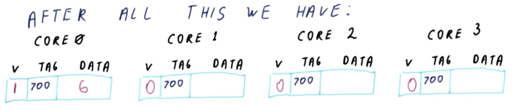
</center>

On completion of sequence `1`, the state of the four cores is as in the figure shown above.

<center>
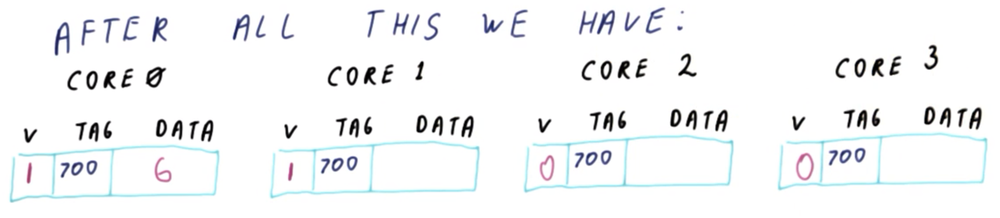
</center>

On completion of sequence `2`, the state of the four cores is as in the figure shown above, with core `1` updating its valid bit to `1` accordingly on read.

<center>
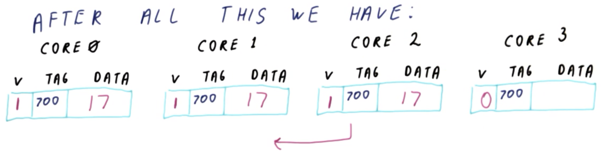
</center>

On completion of sequence `3`, the state of the four cores is as in the figure shown above. When core `2` writes, it broadcasts the write-through data accordingly, which in turn is snooped by the other caches (i.e., those of cores `0` and `1`) for which valid bits are already set to `1` at this point.

<center>
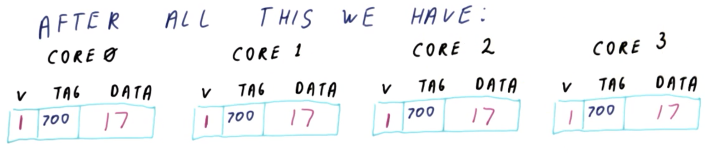
</center>

On completion of sequence `4`, the state of the four cores is as in the figure shown above, wherein all four cores now contain the same block data, which is coherent and consistent with that currently in shared main memory.

### 9. Write-Update Optimization 1: Memory Writes

We will now consider two possible ***optimizations*** of the write-update protocol.

The first optimization involves avoiding memory writes.

<center>
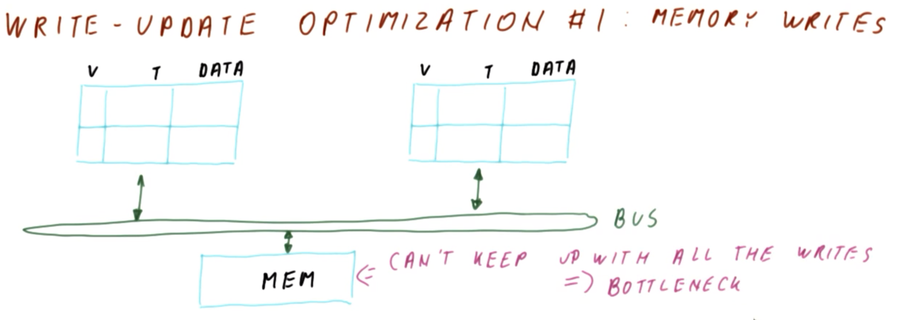
</center>

Recall (cf. Section 4) that in a **write-update protocol**, ***every*** write in any given processor must be broadcasted to the shared bus and correspondingly update the main memory (as in the figure shown above). However, since main memory is large and slow, it cannot keep up with with these write operations, thereby forming a ***bottleneck*** accordingly with respect to system memory throughput. Therefore, it is necessary to ***avoid*** any unnecessary/superfluous writes accordingly.

Up to this point in the lesson, each cache has been individually regarded as a ***write-through*** cache, however, this is generally harmful to performance of memory (in a single-core system, let alone in a multi-core system).

<center>
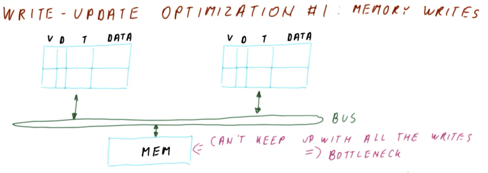
</center>

To resolve this issue (i.e., reduction in memory traffic), a ***dirty bit*** (`D`) is added to each cache block (as in the figure shown above), which in turn "delays" writes to main memory until a dirty block is eventually replaced.

<center>
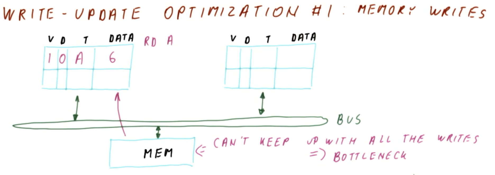
</center>

First, consider a read operation in the left cache (i.e., `RD A`, as in the figure shown above), resulting in a corresponding update of the cache accordingly.

<center>
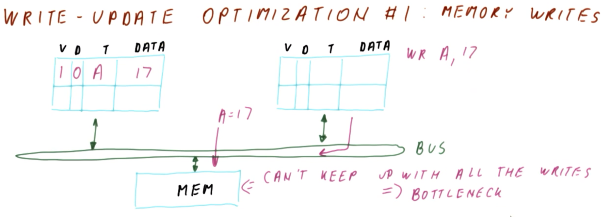
</center>

Next, a write operation is performed by the right cache (i.e., `WR A, 17`, as in the figure shown above). This write operation is broadcasted on the shared bus, and correspondingly updated in the left cache accordingly.

Furthermore, ***without*** a dirty bit, there would be a corresponding "naive" update to main memory with this value as well (as in the figure shown above). However, this is generally undesirable, as the right cache may perform subsequent write operations, prior to ultimately writing through to the main memory.

<center>
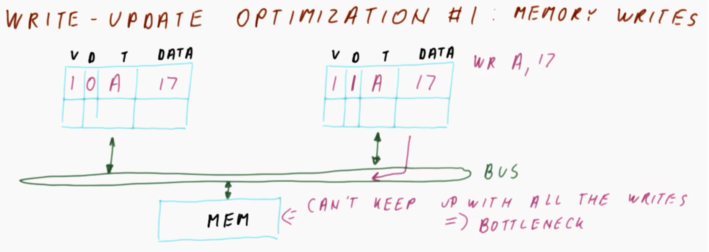
</center>

Conversely, ***with*** a dirty bit (as in the figure shown above), the value is placed in the right cache, with the corresponding dirty bit set to `1`.

In this context, "dirty" has two ***aspects***:
  * 1 - The main memory is no longer up-to-date, and therefore it must be updated accordingly
    * ***N.B.*** This is the same as for a uni-processor with a write-back cache (cf. Lesson 12)
  * 2 - Additionally, in the write-update protocol, "dirty" entails writing only when there is a necessary write-update event (as discussed subsequently in this section)

<center>
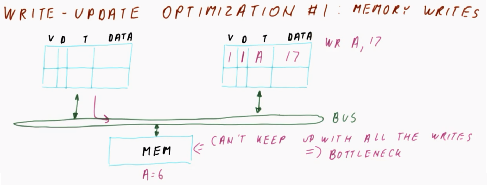
</center>

Suppose that the left cache instead replaces the block by reading again (as in the figure shown above), issuing a corresponding request over the bus accordingly.

Typically, the main memory would simply provide the value in question (i.e., `A`). However, at this point, the main memory still has the old value (i.e., `6`); only the right cache has the most up-to-date value at this point (as designated by its respective dirty bit value of `1`).

<center>
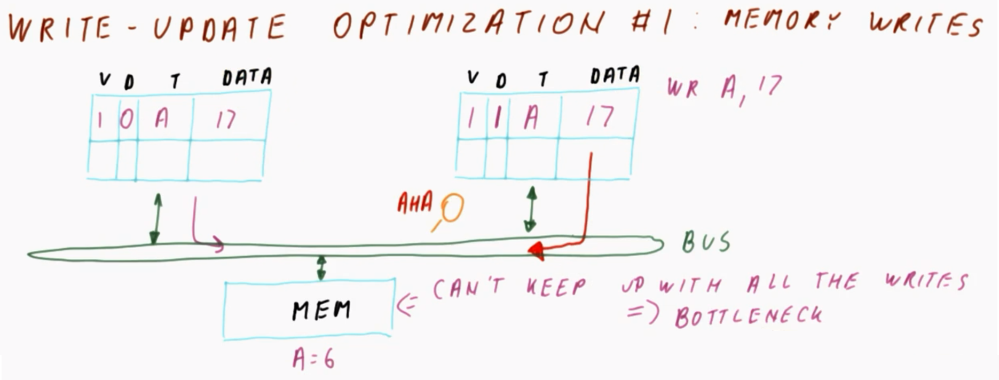
</center>

Since the right cache is the only one with the most up-to-date copy of the value for `A` (as in the figure shown above), as per the dirty bit value `1`, the left cache ***snoops*** this value first, with the corresponding cache write-through operation being significantly faster than a read from main memory. The left cache updates its own value accordingly, with appropriate setting of its dirty bit to `0` (i.e., rather than reading from main memory).

<center>
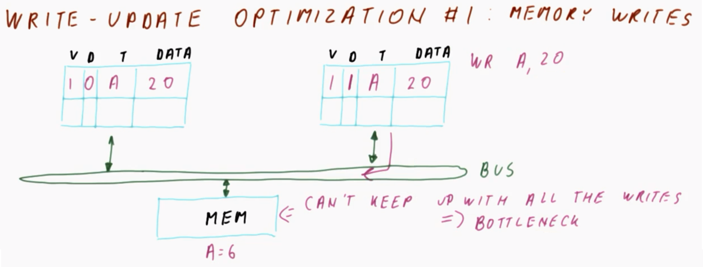
</center>

Consider a subsequent write operation by the right cache (i.e., `WR A, 20`, as in the figure shown above). Similarly, the value is broadcasted over the bus, and consequently snooped by the left cache (and updated accordingly in the left cache), without otherwise updating the main memory at this point.

<center>
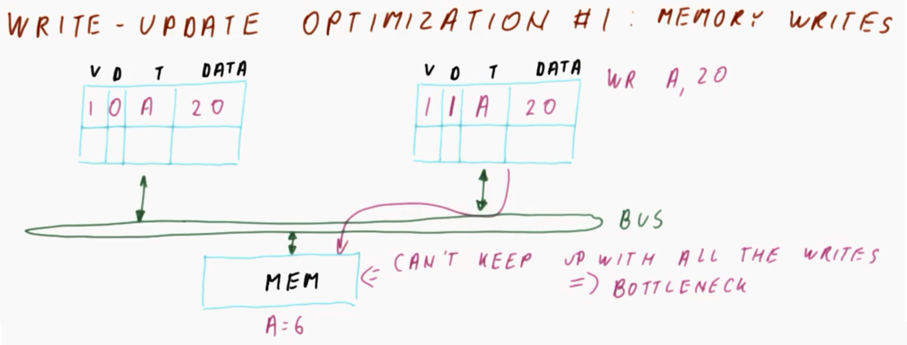
</center>

However, once the block in the right cache is eventually ***replaced***, then this value is consequently written-through to main memory (as in the figure shown above).

<center>
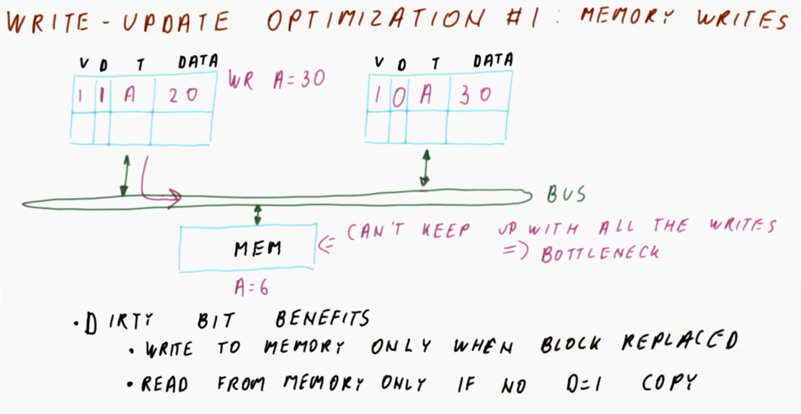
</center>

Another interesting situation arises when, given a dirty block in the right cache, a subsequent write operation is performed by the left cache (i.e., `WR A = 30`, as in the figure shown above).

In this case, the left cache broadcasts this write operation onto the bus, and the right cache consequently snoops this write operation, updating its cache block accordingly (along with setting the appropriate dirty bit value of `0`, indicating that the right cache is no longer responsible for writing-through to main memory). Furthermore, the left cache (the current "writer") sets its own dirty bit to `1`, thereby assuming responsibility for subsequent write-through to main memory.

Therefore, many writes can be performed by the caches prior to updating main memory, and the "writing responsibility" can also shift among the caches/cores prior to updating main memory as well. Only when the "last writer" finally replaces its own cache block, does the write-through to main memory occur.

The ***benefits*** of using a dirty bit in a cache-coherent system are therefore:
  * Write-through to main memory only occurs when the cache block is replaced (with many writes occurring prior to this point)
  * Reads from main memory only occur if ***no*** cache block is in the "dirty" state (i.e., dirty bit set to `0`), otherwise the pending-update value is simply snooped from the bus instead

### 10. Write-Update Optimization 2: Bus Writes

The second optimization to the write-update protocol involves minimizing bus writes.

<center>
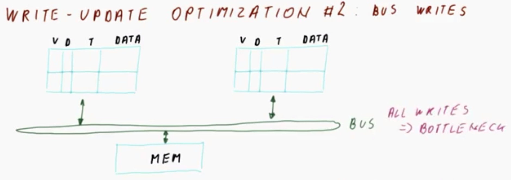
</center>

After adding the dirty bit (cf. Section 9), there is substantially less writing-through to main memory. However, in this configuration, the bus still receives ***all*** of the traffic for ***all*** write operations, thereby similarly adding a ***bottleneck*** to the system accordingly (as in the figure shown above).

These bus-broadcasted write operations are necessary, however, because copies of the data must be state-synchronized among the cores/caches. Nevertheless, there is still a possible optimization involving eliminating unnecessary/superfluous writes when there are no other cores pending an updated value to be read.

<center>
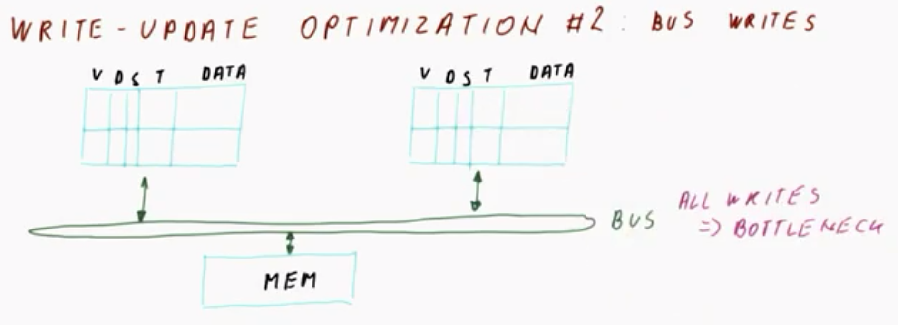
</center>

In order to achieve this additional optimization, a **shared bit** (`S`) is added to each cache block accordingly. This shared bit indicates whether or not the cache block is shared with other cores' cache blocks.

<center>
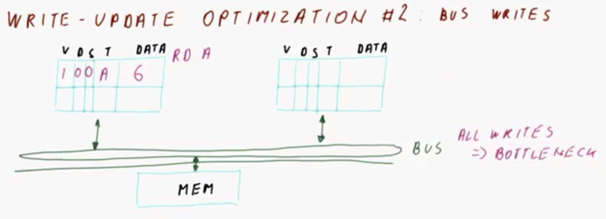
</center>

Suppose that the left cache performs a read operation on shared location `A` (i.e., `RD A`, as in the figure shown above). For this purpose, an additional ***line*** is added to the bus. When the read operation goes to main memory, the other core snoops this read operation, and if the other core also contains this same cache block, then the other core pulls this line to state `1` (and setting its own shared bit to `1` accordingly).

In this initial read, the line is not in a shared state, so the left cache simply writes the value `0` in its shared bit.

<center>
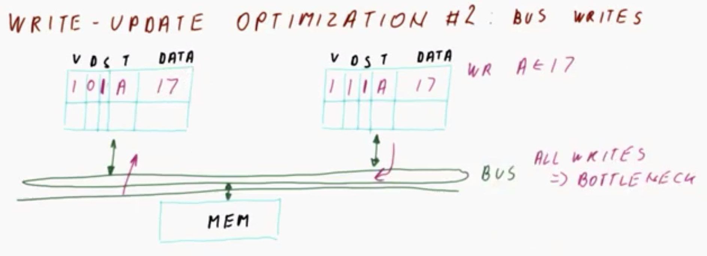
</center>

Next, the right cache performs a write operation on shared location `A` (i.e., `WR A ← 17`, as in the figure shown above). This results in a cache miss and corresponding broadcast of the write operation on the bus. Furthermore, on snooping of the write operation from the right cache, the left cache correspondingly sets its shared bit to `1` in addition to updating its own cache block value accordingly. Additionally, the left cache also pulls the line to state `1`, which is correspondingly recorded as shared bit value `1` in the right cache accordingly as well.

So far, the demonstrated behavior is comparable to that without the additional line and shared bit being present. So, then, what is the benefit of this additional line and shared bit?

<center>
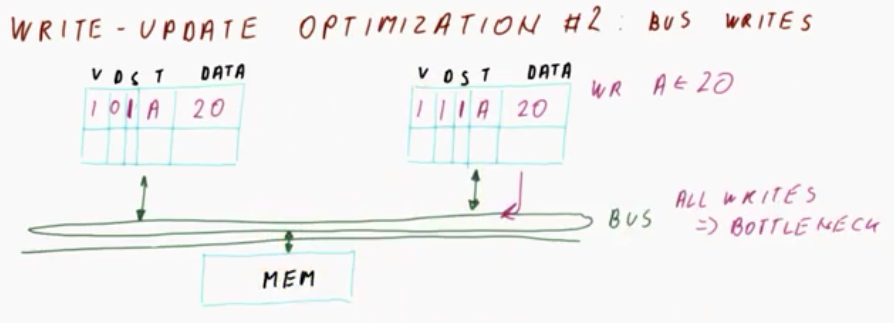
</center>

The benefit is more discernable when a subsequent write operation is performed by the right cache (i.e., `WR A ← 20`, as in the figure shown above).

The right cache detects a shared bit value of `1`, and broadcasts the write operation accordingly (as before), with corresponding updates in the value in both caches (i.e., `20`).

<center>
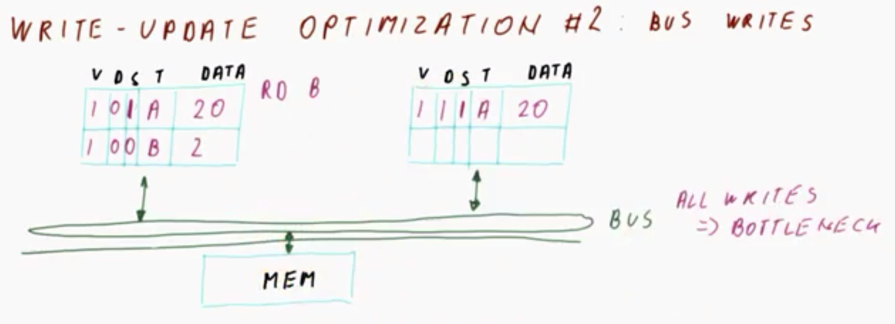
</center>

When the left block performs a subsequent read operation on block `B` (i.e., `RD B`, as in the figure shown above), it adds the new cache block accordingly.

<center>
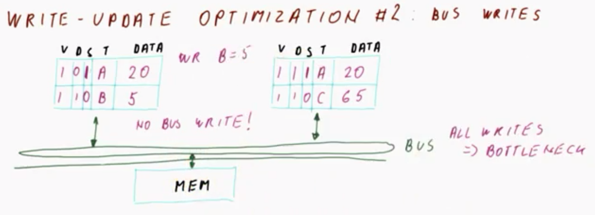
</center>

Now, when the left cache subsequently performs a write operation on block `B` (i.e., `WR B = 5`, as in the figure shown above), setting the dirty bit to `1` accordingly. Furthermore, since the shared bit is set to `0`, it simply writes the value locally only (i.e., `B` is not pertinent to any other caches at this point), ***without*** otherwise broadcasting to the bus.

Similarly, if the right cache retrieves block `C` from main memory, it can write values to this block (i.e., `17`, `65`, etc.) independently of the other cores, as long as the shared bit is set to `0`.

Therefore, only shared/common cache blocks require shared (i.e., coherent) read and write operations accordingly. This is particularly advantageous for program-specific data, which otherwise does not require sharing across the cores (e.g., thread-specific stack data).

### 11. Write-Update Optimization Quiz and Answers

<center>
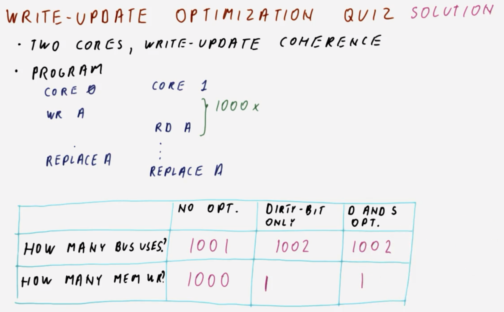
</center>

Consider a system comprised of two cores, which uses the write-update protocol for cache coherence.

Furthermore, the program running on this two-core system is comprised of the following (which occur simultaneously on each core):

| Sequence(s) | Core `0` | Core `1` |
|:--:|:--:|:--:|
| `1` | `WR A` | (N/A) |
| `2` | (N/A) | `RD A` |
| `3` through `2000` | repeat sequences `1` and `2` | repeat sequences `1` and `2` |
| `2001` | `REPLACE A` | `REPLACE A` |

Upon conclusion of this program, what are the following resulting counts with respect to shared memory block `A`?

| System operation | Without optimizations | With dirty bit optimization only | With both dirty bit and shared bit optimizations |
|:--:|:--:|:--:|:--:|
| How many bus uses? | | |
| How many writes to main memory? | | |

***Answer and Explanation***:

| System operation | Without optimizations | With dirty bit optimization only | With both dirty bit and shared bit optimizations |
|:--:|:--:|:--:|:--:|
| How many bus uses? | `1001` | `1002` | `1002` |
| How many writes to main memory? | `1000` | `1` | `1` |

In the case of ***no optimization***:
  * Sequence `1` (i.e., `WR A`) uses the bus, as well as writes-through to main memory
  * Sequence `2` uses the bus (i.e., `RD A`), however, it does not write-through to main memory (it is a read miss only)
  * Generalizing in this manner, in the subsequent `999` write/read pairs (i.e., sequences `3` through `2000`), each core `0` write operation (i.e., `WR A`) will add an additional `999` writes-through to main memory and an additional `999` uses of the bus, however, the core `1` read operations (i.e., `RD A`) will neither use the bus nor write to main memory, as these subsequent read operations will ***not*** be cache misses
  * On subsequent replacement of `A` in the respective caches (i.e., sequence `2001`), the state is already up-to-date (i.e., relative to main memory)

In the case of only ***dirty bit optimization***:
  * The write operations on core `0` (i.e., ` WR A`) will be localized to core `0`'s own cache, with only a ***single*** write to main memory on replacement of the cache block (i.e., sequence `2001`)
  * With respect to bus uses, all `1000` write operations on core `0` (i.e., `WR A`) will be broadcasted on the bus, however, only the initial read operation on core `1` (i.e., `RD A`) requires reading from the bus (with the subsequent `999` occurring as read hits). Furthermore, the replacement of the cache block for `A` in core `0` incurs an additional use of the bus to read from main memory.

Therefore, overall, there is one additional bus use in the dirty bit optimization, however, this reduces writes dramatically (i.e., down from `1000` to `1`).

Lastly, in the case of both ***dirty bit and shared bit optimizations***:
  * By inspection, on initial write operation on core `0` (i.e., `WR A`), core `0` is the sole accessor of this block (correspondingly setting shared bit to `0` accordingly), however, on subsequent read operation on core `1` (i.e., `RD A`), sharing commences between the cores with respect to memory location `A`. Consequently, the resulting counts are identical to those for "only dirty bit optimization" case.

***N.B.*** The additional shared bit optimization is only effective in bypassing bus accesses when cache blocks are ***isolated*** to specific cores (however, if this *is* the case, then there will be a corresponding dramatic reduction in bus accesses as well).

### 12. Write-Invalidate Snooping Coherence

Recall (cf. Section 6) that there are two snooping-based approaches to coherence: Write-updated (discussed in the previous sections) and write-invalidate. This section will discuss the latter.

<center>
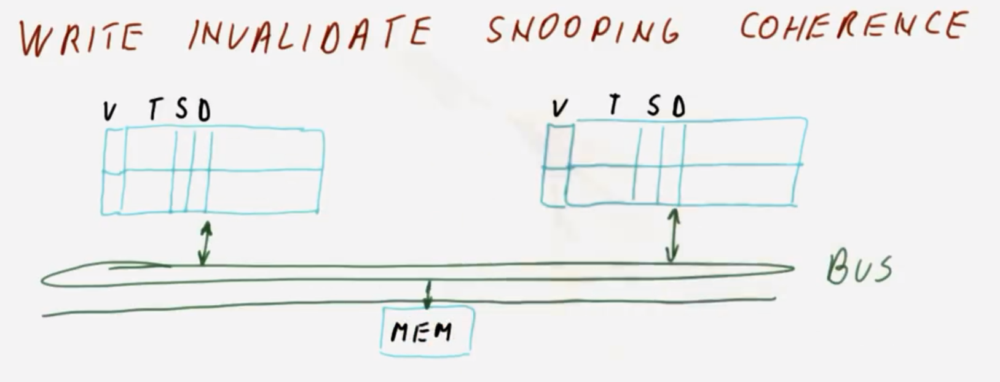
</center>

Recall (cf. Section 10) the optimized write-update cache coherence system (as in the figure shown above), which includes a dirty bit and a shared bit on each cache block.

A **write-invalidate protocol** involves broadcasting write operations over the bus in order to be detected by the other cores, however, rather than ***updating*** their respective copies of the data, they simply ***invalidate*** their respective cache block entries.

<center>
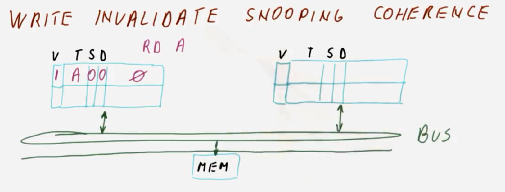
</center>

Initially, the left core performs a read operation on shared location `A` (i.e., `RD A`, as in the figure shown above), with corresponding read from main memory.

<center>
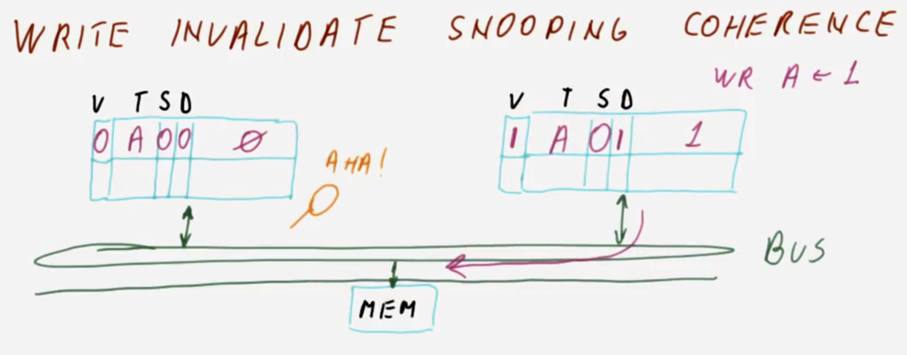
</center>

Next, the right core performs a write operation on shared location `A` (i.e., `WR A ← 1`, as in the figure shown above). This results in a cache miss with respect to the right cache, and consequent broadcast to the bus. However, it is not necessary to write-through to memory with this value (i.e., `1`), but rather the left core snoops the value on broadcast with respect to shared location `A`. Furthermore, in following the write-invalidate protocol, rather than updating the value in the cache block of the left cache, the left cache simply sets the valid bit to `0` for this block, thereby rendering it ***invalidated*** accordingly (i.e., subsequent read attempt will yield a cache miss).
  * ***N.B.*** On each such write-and-broadcast operation, the right cache will have a shared bit value of `0`, because up to this point, all other copies of the value (i.e., in the left cache) will be invalidated in such a manner. Therefore, in general, a write operation will render the writing cache as being in the non-shared state (i.e., shared bit value of `0`) accordingly.

<center>
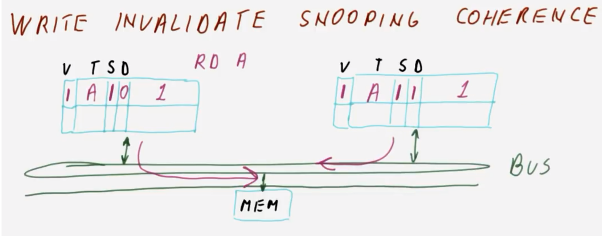
</center>

Next, the left core performs another read operation on shared location `A` (i.e., `RD A`, as in the figure shown above). In a write-update protocol, the read would simply be a cache hit localized to the left core; however, in a write-invalidate protocol, since the previous value is invalidated, there is a corresponding ***broadcast*** on the bus (i.e., resulting from a cache miss), which is correspondingly snooped by the right cache, since the main memory has not been written-through to yet. Furthermore, since the right cache has a dirty bit of `1`, it will also broadcast the updated value (i.e., `1`) to the bus, resulting in an update of the value in the left cache's block, as well as corresponding update in both cache's shared bits to `1`.

Therefore, with respect to the write-invalidate protocol, observe the following:
  * Similarly to the write-update protocol, localized reads can yield successive cache hits.
  * However, unlike in the write-update protocol, a write-update from another core's cache will invalidate the other cache's value, resulting in a cache miss and consequent read from the bus. Therefore, in the write-invalidate protocol, there is a ***disadvantage*** whereby a read miss occurs on all reading cache whenever another cache writes.

However, the write-invalidate protocol also provides a distinct ***advantage*** whenever writing to the ***same*** block multiple times (as demonstrated in the following sequences).

<center>
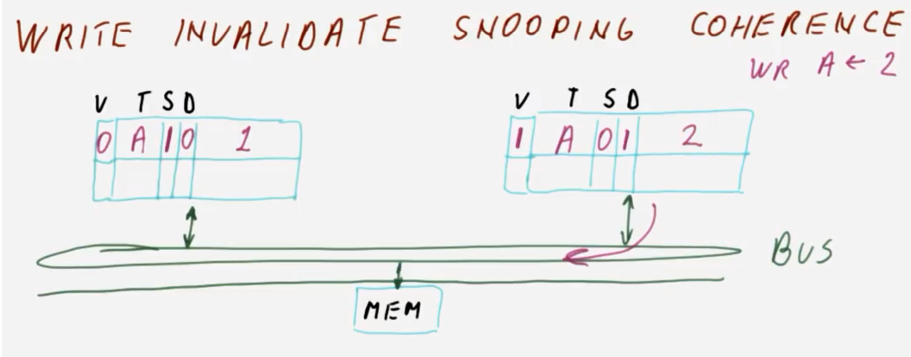
</center>

Next, the right core performs another write operation on shared location `A` (i.e., `WR A ← 2`, as in the figure shown above). The right core broadcasts this value, thereby invalidating the cache block in the left cache (i.e., its valid bit is set to `0`). Furthermore, the shared bit of the right cache is set to `0`.

<center>
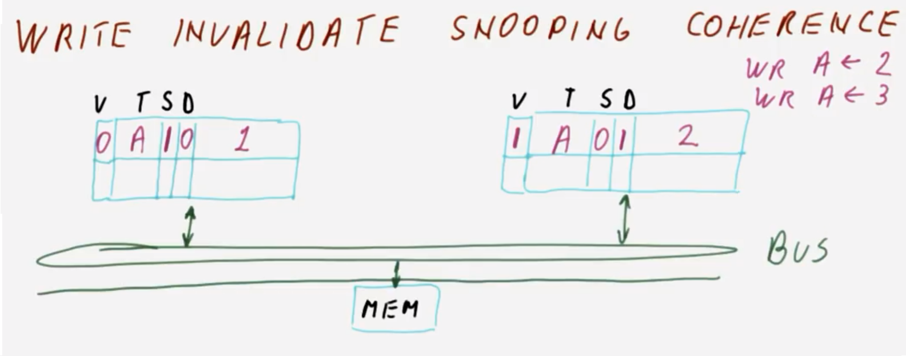
</center>

Next, the right core performs another write operation on shared location `A` (i.e., `WR A ← 3`, as in the figure shown above). Since the previous write operation invalidated the local copy of the data in the left cache, the right cache can simply perform this write operation "locally" with respect to `A` accordingly, without otherwise requiring broadcasting.

Therefore, in such a scenario where the cores alternatively perform successive write operations on a shared memory location, only the ***first*** such write operation must be broadcasted when following the write-invalidate protocol, as subsequent write operations are localized accordingly. Conversely, in the write-update protocol, each such successive write operation requires a corresponding broadcast in order to update the other cache(s) accordingly.

<center>
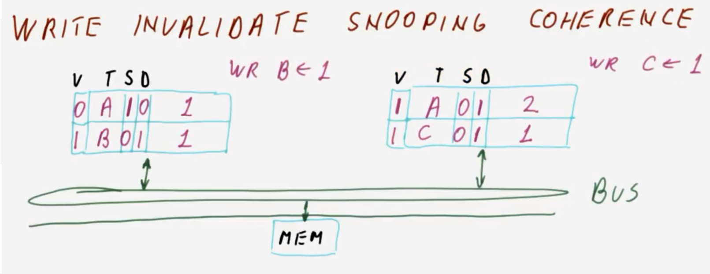
</center>

Furthermore, as with write-invalidate (cf. Section 10), an analogous optimization occurs when writing ***simultaneously*** on both cores with respect to two ***different*** shared locations (as in the figure shown above).
  * The left cache can perform localized reads and writes with respect to shared location `B`, and similarly the right cache can perform localized reads and writes with respect to shared location `C`, with neither caches performing (otherwise unnecessary) broadcasts.
  * In this manner, cache blocks which are isolated to a given core will be "localized," similarly to that which occurs when following the write-invalidate protocol.

Therefore:
  * The write-update protocol generally yields more hits, but results in more broadcasts when repeatedly updating.
  * Conversely, the write-invalidate protocol generally generates misses on all reading caches upon occurrence of an initial write operation, however, it allows to localize writes on subsequent write operations.

Note that in the write-update protocol, the second property of cache coherence (cf. Section 4) is ensured by updating ***all*** of the copies of the data in all caches (and thus on subsequent write operation, all copies are up-to-date, thereby returning the updated value of the most recent write operation). Conversely, the write-invalidate protocol ensures this property by write-invalidating ***all*** other copies of the data, thereby forcing an update of the data to the new version across all other caches.
  * Therefore, in following either protocol, read operations will yield the ***correct*** data in both protocols.

Furthermore, with respect to the third property of cache coherence, in the write-invalidate protocol, this is ensured by snooping on the bus, which orders the write operations according to their successive occurrences on the shared bus.
  * In fact, proceeding in this manner, at any given time, only the ***last*** version of the value effectively "survives" in all of the caches (i.e., a write operation invalidates all other copies otherwise, forcing all of the reading caches to read this last value accordingly).

### 13. Write-Update vs. Write-Invalidate Quiz 1 and Answers

<center>
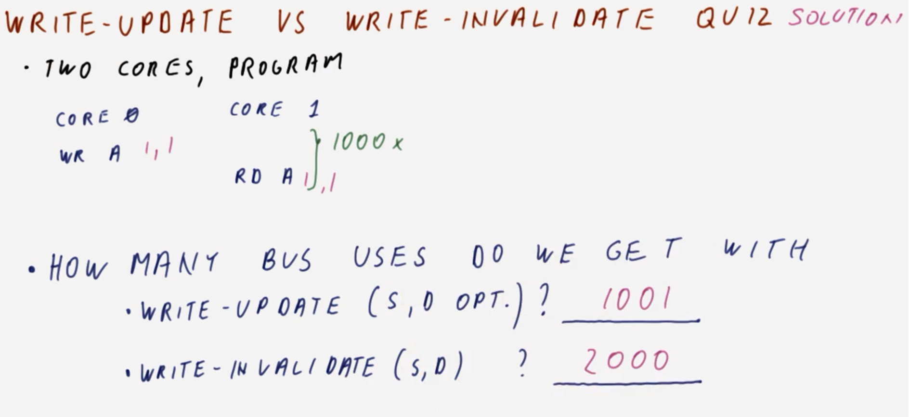
</center>

Similarly to previously (cf. Section 11), consider a system comprised of two cores, with both cores' caches being initially empty.

Furthermore, the program running on this two-core system is comprised of the following (which occur simultaneously on each core):

| Sequence(s) | Core `0` | Core `1` |
|:--:|:--:|:--:|
| `1` | `WR A` | (N/A) |
| `2` | (N/A) | `RD A` |
| `3` through `2000` | repeat sequences `1` and `2` | repeat sequences `1` and `2` |

Upon conclusion of this program, what are the following resulting counts of bus uses with respect to shared memory block `A` in the following configurations:
  * Write-update protocol with shared bit and dirty bit optimizations?
    * `1001`
  * Write-invalidate protocol with shared bit and dirty bit optimizations?
    * `2000`

***Explanation***:

In the optimized write-update protocol, as before (cf. Section 11), there is a broadcast onto the bus on each write operation in core `0` (i.e.,`WR A`), as well as a single bus access on initial read operation in core `1` (i.e., `RD A`) (however, subsequent read operations in core `1` are read hits).

Conversely, in the optimized write-invalidate protocol, the initial write operation in core `0` (i.e., `WR A` via sequence `1`) is a miss, resulting in a bus operation to retrieve the (only) copy of this data from main memory. The subsequent read operation in core `1` (i.e., `RD A` via sequence `2`) yields a miss, which necessitates a read of this data from core `0` via broadcast. Furthermore, on subsequent read/write pairs across the cores with respect to shared location `A` (i.e., sequences `3` through `2000`), the write from core `0` broadcasts an invalidation, and the subsequent read requires a bus access to update the data in core `1`. Therefore, each read/write pair (i.e., `1000` total) will yield two bus uses per pair accordingly.

***N.B.*** With respect to bus usage, write-update is generally more efficient than write-invalidate in the access pattern of one core producing the data continuously while the other core consumes the data continuously. 
  * The write-update protocol involves simply updating the data on write from the writer/producer, while the read can be performed locally with respect to the reader/consumer cache.
  * Conversely, the write-invalidate protocol involves the broadcast of the invalidation on write from the writer/producer, while the reader/consumer incurs successive read misses, thereby necessitating bus access to update the data accordingly.

### 14. Write-Update vs. Write-Invalidate Quiz 2 and Answers

<center>
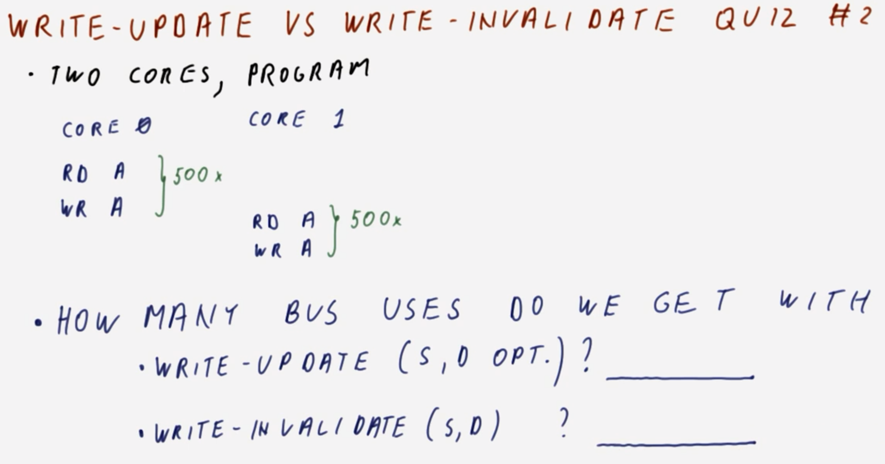
</center>

Consider the same system from the previous section (cf. Section 13), however, the program running on this two-core system is now comprised of the following (which occur simultaneously on each core):

| Sequence(s) | Core `0` | Core `1` |
|:--:|:--:|:--:|
| `1` | `RD A` | (N/A) |
| `2` | `WR A` | (N/A) |
| `3` through `1000` | repeat sequences `1` and `2` | repeat sequences `1` and `2` |
| `1001` | (N/A) | `RD A` |
| `1002` | (N/A) | `WR A` |
| `1003` through `2000` | repeat sequences `1001` and `1002` | repeat sequences `1001` and `1002` |

Upon conclusion of this program, what are the following resulting counts of bus uses with respect to shared memory block `A` in the following configurations:
  * Write-update protocol with shared bit and dirty bit optimizations?
    * `502`
  * Write-invalidate protocol with shared bit and dirty bit optimizations?
    * `3`

***Answer and Explanation***:

<center>
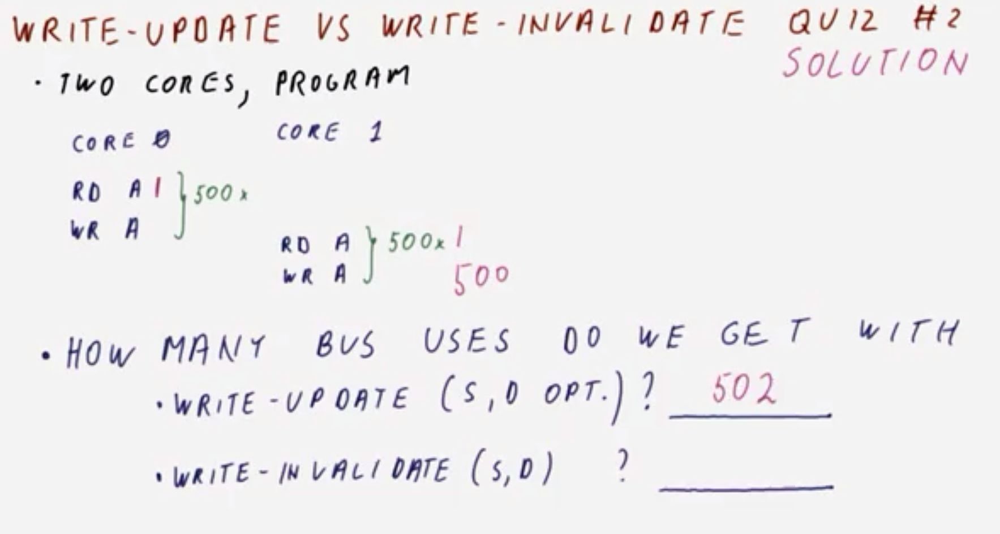
</center>

In the optimized ***write-update protocol*** (as in the figure shown above), there is a single bus access on initial read operation in core `0` (i.e., `RD A` via sequence `1`) due to read miss, however, due to no obligatory sharing, the subsequent write operation in core `0` (i.e., `WR A` via sequence `2`) is localized to core `0` (i.e., no additional bus access necessary). Furthermore, in the subsequent `499` iterations of this read/write pair (i.e., sequences `3` through `1000`), there are subsequent cache hits.

Next, on initial read operation in core `1` (i.e., `RD A` via sequence `1001`), it reads the data from core `0` via the bus; furthermore, the shared bit is correspondingly set to `1` in both cores' respective caches. In the subsequent write operation in core `1` (i.e., `WR A` via sequence `1002`), there is a broadcast on the bus. Furthermore, each subsequent write operation (i.e., `499` total iterations) accesses the bus in order to broadcast the updated value over to core `0`. Note that this is wasteful, as core `0` no longer requires this data.

<center>

</center>

In the optimized ***write-invalidate protocol*** (as in the figure shown above), there is a single bus access on initial read operation in core `0` (i.e., `RD A` via sequence `1`) due to read miss, however, due to no obligatory sharing, the subsequent write operation in core `0` (i.e., `WR A` via sequence `2`) is localized to core `0` (i.e., no additional bus access necessary). Furthermore, in the subsequent `499` iterations of this read/write pair (i.e., sequences `3` through `1000`), there are subsequent cache hits.
  * ***N.B.*** This occurs identically/analogously to the corresponding write-update protocol sequences.

Next, on initial read operation in core `1` (i.e., `RD A` via sequence `1001`), it reads the data from core `0` via the bus; furthermore, the shared bit is correspondingly set to `1` in both cores' respective caches. In the subsequent write operation in core `1` (i.e., `WR A` via sequence `1002`), there is a broadcast on the bus, which invalidates the data in core `0` accordingly. Furthermore, each subsequent write operation (i.e., `499` total iterations) do not access the bus, as the other reader (i.e., core `0`) is now invalidated; at this point, the shared location `A` is effectively "private" with respect to core `1`.

***N.B.*** Observe that the write-invalidate protocol is therefore much more efficient if the data usage is restricted to a given core for successive accesses.

### 15. Update vs. Invalidate Coherence

<center>
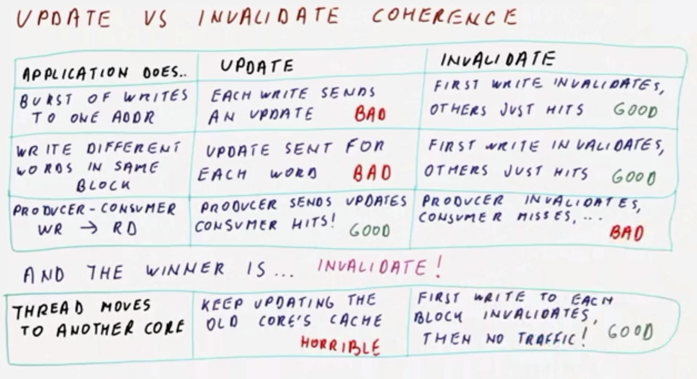
</center>

Consider a comparison of write-update vs. write-invalidate protocols with respect to applications as follows:

| Application behavior | Write-update | Write-invalidate |
|:--:|:--:|:--:|
| Burst of write operations to a single address (e.g., repeated calculations to yield a final result) | Each write operation sends an update. This is ***bad***, because ***each*** update results in competition for the bus, thereby adding bus contention and yielding slower write operations (due to increased energy consumption). | Only the ***first*** write operation invalidates, while the subsequent write operations yield cache hits which are localized. This results in ***good*** performance. |
| Write different words to the same cache block (e.g., initializing the cache block) which is shared across cores | An update is sent for ***each*** word that is written. This is ***bad***, because one cache line worth of write operations can result in multiple corresponding updates per write operation. | Only the ***first*** write operation invalidates, while the subsequent write operations yield cache hits which are localized. This results in ***good*** performance. |
| Producer-consumer pairs (i.e., `WR → RD`) (e.g., a buffer used in successive read/write operations) | The producer sends updates on ***each*** data modification, and then the consumer subsequently yields cache hits. In this scenario, the write-update protocol is well suited and yields ***good*** performance accordingly. | The producer invalidates the data, and the consumer consequently yields cache misses (which in turn require retrieving the data again from the producer, and so on). This results in ***bad*** performance. |

Given the complementary strengths and weaknesses of these two protocols, which one is used in practice? Modern processors in fact generally use the ***write-invalidate protocol***. However, the reason for this is not necessarily due to the factors in the table shown above,but rather its advantages are particularly amplified in the ***scenario*** of when a thread moves to another core (i.e., the operating system moves the thread across cores).
  * In this scenario, following the write-update protocol, the old core's cache will continue to be updated until the cache block is replaced in that (now-former) core, even after the thread has been moved to another core. This results in ***horrible*** performance accordingly.
  * Conversely, following the write-invalidate protocol, the ***first*** write to each of the cache blocks will incur a cost to invalidate the old copy, however, subsequent bus traffic will be eliminated. This results in ***good*** performance, as it effectively eliminates subsequent interaction with the old core on movement of the thread to the new core.
    * ***N.B.*** Since such "thread movement" is common in modern processors, the write-update is practically advantageous for this reason accordingly.

Because write-invalidate protocols are commonly used, this will be the primary focus for the remainder of this lesson accordingly.

## 16-25. Cache Coherence Protocols

### 16. MSI (Modified-Shared-Invalid) Coherence

<center>
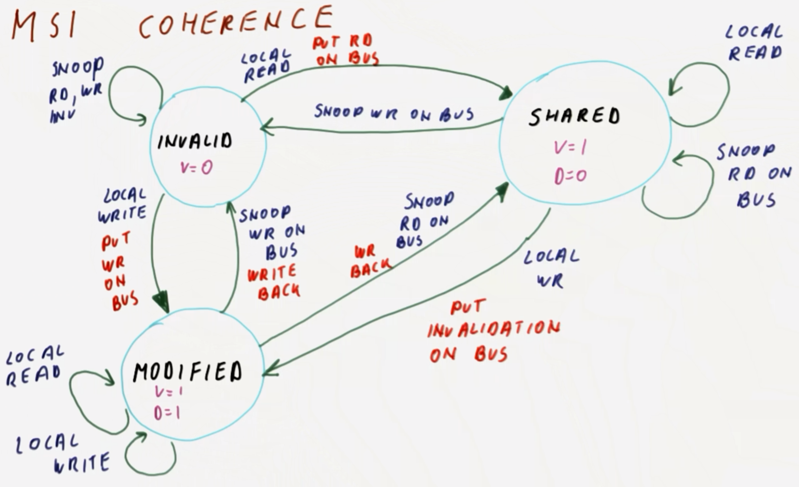
</center>

One of the simpler cache coherence protocols is called **MSI (modified-shared-invalid)** (as in the figure shown above).

In the MSI protocol, a given cache block can be in one of the three following ***states***:
  * **invalid (I)** → the cache block is either present in the cache without a valid bit being set, or the cache block is absent from the cache
  * **shared (S)** → the cache block can be subsequently readily read, however, subsequent write operations require additional actions
    * Furthermore, a ***local read*** to a cache block that is in the shared state maintains the block in the shared state.
  * **modified (M)** → both local reads and local writes are localized to the cache block, without necessitating any additional actions (i.e., broadcasts)

Since MSI is an invalidation-based protocol, in the ***modified (M)*** state, there is certainty that there are ***no*** other existing copies of the data in other caches, thereby allowing writes to be localized.
  * This is equivalent to having a valid bit of `1` and a dirty bit of `1` in an equivalent uni-processor cache.

***N.B.*** While the valid bit and dirty bit tracking here is relatively trivial, subsequent coherence protocols (discussed later in this lesson) will involve additional states, and corresponding bits to track appropriately.

In the ***invalid (I)*** state, this is equivalent to the valid bit being set to `0` (i.e., effectively, the cache block is absent).
  * On ***local write*** operation, the cache block is moved from the invalid (I) state to the modified (M) state. This requires a corresponding write request is broadcasted onto the bus (i.e., a ***write miss*** has occurred).

If a cache block is in the ***modified (M)*** state while another cache is observed to have broadcasted a write operation onto the bus, then this will move the cache block to the ***invalid (I)*** state.
  * This correspondingly occurs when ***snooping*** the write operation on the bus.
  * Furthermore, an obligatory ***write-back*** of the cache block occurs, in order to transition the cache block to the invalid (I) state accordingly.
    * This in turn requires a delay of the data that would otherwise be sent to the write request, until the write-back operation concludes. This delay can be accomplished by one of two ways:
      * 1 - Cancel the request, write-back, move to invalid (I) state, and then repeat the request (i.e., fetch the data from main memory).
      * 2 - On observation of a write request on the bus, suppress the memory response and simply feed the data to the processor.
    * In either case, before moving from modified (M) state to invalid (I) state, it is imperative to write-back the data to main memory and to ensure that the write request (if it is a write miss) fetches the ***new*** data (i.e., rather than the stale data from main memory).

If a cache block is in the ***modified (M)*** state while another cache is observed to have broadcasted a read operation onto the bus, then this will move the cache block to the ***shared (S)*** state (which is equivalent to having a valid bit set to `1` and a dirty bit set to `0`).
  * This correspondingly occurs when ***snooping*** the read operation on the bus.
  * Furthermore, an obligatory ***write-back*** of the cache block occurs, in order to transition the cache block to the shared (S) state accordingly.
    * ***N.B.*** The shared (S) disallows a write-back originating from the shared (S) state (since it only permits read operations).
    * This in turn requires a delay of the data that would otherwise be sent to the read requester, until the write-back operation concludes. This delay can be accomplished by one of two ways:
      * 1 - Cancel the request, write-back, move to shared (S) state, and then repeat the request (i.e., fetch the data from main memory).
      * 2 - On observation of a read request on the bus, suppress the memory response and simply feed the data to the processor during the transition into the shared (S) state.

If a cache block is in the ***invalid (I)*** state while a local read operation occurs, then this will move the cache block to the ***shared (S)*** state.
  * This correspondingly broadcasts a read operation onto the bus.
  * ***N.B.*** The read data may originate either from main memory or from another cache (which was presumably in the modified [M] state at the point of local read of the current cache).
  * On reaching the shared (S) state, subsequent reads can be performed locally.

If a cache block is in the ***shared (S)*** state while another cache is observed to have broadcasted a write operation onto the bus, then this will move the cache block to the ***invalid (I)*** state.
  * This correspondingly occurs when ***snooping*** the write operation on the bus.
  * There is no additional action required, as the block is "clean" for practical purposes, and does not require a corresponding write-back, but rather this is equivalent to effectively "resetting" the valid bit to `0`. However, on subsequent read, it will be placed on the bus again (thereby moving the cache block back to the shared [S] state).

***N.B.*** Snooping a read operation on the bus while in the shared (S) state does not require any additional actions, as the shared (S) state is not otherwise impacted by other "sharers" among the caches, if all such "sharers" are simply reading the data. Furthermore, local reads in the shared (S) state are also localized to the cache block accordingly as well.

If a cache block is in the ***shared (S)*** state while a local write operation occurs, then this will move the cache block to the ***modified (M)*** state.
  * This correspondingly broadcasts an invalidation onto the bus.

***N.B.*** The situation is slightly different when moving the invalid (I) state to the modified (M) state on local write vs. moving from the shared (S) state to the modified (M) state on local write.
  * When starting from the invalid (I) state, the write request is broadcasted on the bus in order to retrieve the cache block for writing to it.
  * Conversely, when starting from the shared (S) state, the cache block is necessarily already "in possession" (i.e., most up-to-date copy), because any subsequent write operation would have precluded the cache block's transition into the shared (S) state in the first place. At this point, writing simply entails broadcasting the invalidation accordingly (but without otherwise requiring an request of the "updated" data).

Lastly, if a cache block is in the ***invalid (I)*** state, any snooping (i.e., of either read or write operations) will not change the state of the cache block.

***N.B.*** With respect to invalidation:
  * While in the ***shared (S)*** state, it does not matter whether a write request or invalidation is snooped on the bus, as in either case, this will simply result in a transition to the ***invalid (I)*** state.
  * Furthermore, while in the ***modified (M)*** state, a write operation will be observed when a write request is snooped on the bus, rather than an invalidation. This is because a cache block in the modified (M) state effectively implies that all other caches are in the invalid (I) state with respect to this cache block; correspondingly, if any other cache attempts to write, this will necessitate broadcasting a write request onto the bus accordingly (rather than simply broadcasting an invalidation).

### 17. Cache-to-Cache Transfers

<center>
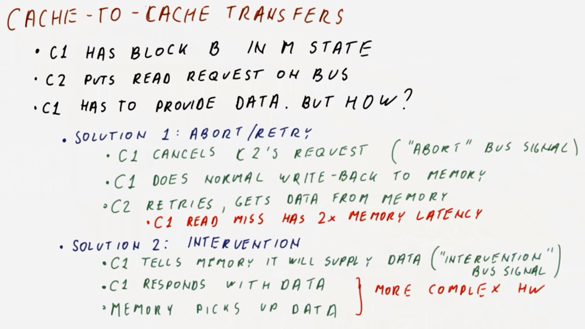
</center>

A **cache-to-cache transfer** occurs when cache `C1` has block `B` in the modified (M) state, while another cache `C2` broadcasts a read request onto the bus (i.e., to fetch this cache block into its own cache). At this point, cache `C1` must react in order to provide this data since it is in the modified (M) state (i.e., the *only* up-to-date copy of the data in the system at this point, even relative to main memory); but how can this be accomplished? There are two solutions for this, described as follows.

The ***first*** solution involves ***aborting*** and ***retrying***.
  * Cache `C1` cancels cache `C2`'s request using a corresponding ***abort bus signal***.
  * On abortion of cache `C2`'s request, cache `C1` performs a normal write-back to main memory, at which point the main memory is now updated with the most up-to-date data.
  * Cache `C2` retries requesting the data, and subsequently retrieves the data from main memory.

A fundamental ***issue*** with this first approach is that from the time that cache `C2` makes the initial request, if the data were otherwise originating from main memory, then a read miss would occur (with correspondingly incurred memory latency). However, if the read miss additionally results from another core having the data, then this incurs an ***additional*** memory latency prior to cache `C2` finally retrieving the data.

The ***second*** solution involves a more direct ***intervention***.
  * Cache `C1` informs main memory that it will supply the data using a corresponding ***intervention bus signal***.
  * Cache `C1` provides the data to cache `C2`.
  * Main memory also retrieves the data supplied by cache `C1`.
    * This additional step is necessary, because on broadcast of the data from cache `C1` to cache `C2`, both caches will now transition to the shared (S) state (i.e., both will regard the cache block as "not dirty," and therefore the main memory must also receive this "clean" data at this critical point, otherwise it will never receive this data). Therefore, by receiving this data, the main memory ensures that this data is retained on this "last write-back" of the corresponding data from the cache.

The main ***disadvantage*** with this second approach is that it requires
additional complex hardware in order to implement it. However, this is nevertheless akin to the approach used by modern processors (which use a ***variant*** of this intervention approach, wherein more sophisticated snooping protocols have eliminated the additional step of having main memory retrieve the data and otherwise eliminating much of the complexity in the cache-to-cache transfer of this data)

### 18. MSI (Modified-Shared-Invalid) Quiz 1 and Answers

<center>
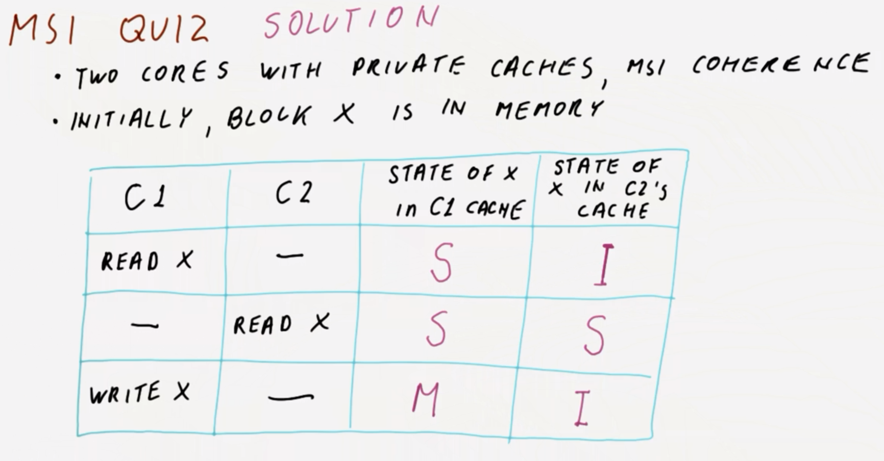
</center>

Consider a system comprised of two cores, each with private caches, which follow the MSI (modified-shared-invalid) coherence protocol.

Initially, cache block `X` is only present in main memory, but not in either private cache.

Designate the appropriate final state (i.e., M, S, or I) in the following sequence of operations:

| Sequence | Cache `C1` | Cache `C2` | State of `X` in cache `C1` | State of `X` in cache `C2` |
|:--:|:--:|:--:|:--:|:--:|
| `S1` | `READ X` | (N/A) | | |
| `S2` | (N/A) | `READ X` | | |
| `S3` | `WRITE X` | (N/A) | | |

***Answer and Explanation***:

| Sequence | Cache `C1` | Cache `C2` | State of `X` in cache `C1` | State of `X` in cache `C2` |
|:--:|:--:|:--:|:--:|:--:|
| `S1` | `READ X` | (N/A) | `S` | `I` |
| `S2` | (N/A) | `READ X` | `S` | `S` |
| `S3` | `WRITE X` | (N/A) | `M` | `I` |

Since the cache block `X` is only present in main memory initially, then both caches are initialized to the invalid (I) state.

After cache `C1` performs operation `READ X` (i.e., sequence `S1`), this will transition the corresponding cache block from invalid (I) state to shared (S) state with respect to cache `C1`.
  * ***N.B.*** Even though cache block `X` is not truly "shared" at this point, the shared (S) state effectively denotes a "clean" block, which is only read at this point.

After cache `C2` performs operation `READ X` (i.e., sequence `S2`), this similarly transitions the corresponding cache block from invalid (I) state to shared (S) state with respect to cache `C2`. Furthermore, snooping of this transition by cache `C1` maintains cache `C1` in its current shared (S) state.

After cache `C1` performs operation `WRITE X` (i.e., sequence `S3`), it broadcasts an invalidation on the bus, which correspondingly transitions cache `C2` to the invalid (I) state (i.e., cache `C2` can no longer be read until an updated copy of the cache block is retrieved from cache `C1`). Furthermore, on writing, cache `C1` transitions to the modified (M) state.

### 19. MSI (Modified-Shared-Invalid) Quiz 2 and Answers

<center>
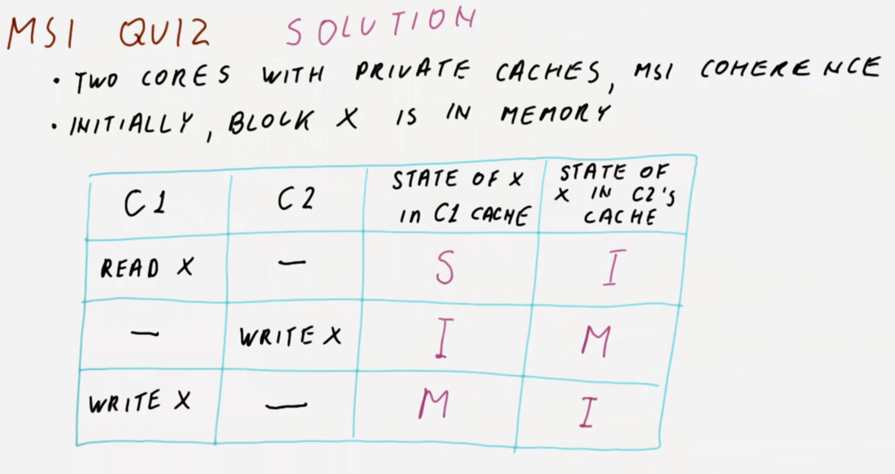
</center>

Consider the same (cf. Section 17) system comprised of two cores, each with private caches, which follow the MSI (modified-shared-invalid) coherence protocol.

Initially, cache block `X` is only present in main memory, but not in either private cache.

Designate the appropriate final state (i.e., M, S, or I) in the following sequence of operations:

| Sequence | Cache `C1` | Cache `C2` | State of `X` in cache `C1` | State of `X` in cache `C2` |
|:--:|:--:|:--:|:--:|:--:|
| `S1` | `READ X` | (N/A) | | |
| `S2` | (N/A) | `WRITE X` | | |
| `S3` | `WRITE X` | (N/A) | | |

***Answer and Explanation***:

| Sequence | Cache `C1` | Cache `C2` | State of `X` in cache `C1` | State of `X` in cache `C2` |
|:--:|:--:|:--:|:--:|:--:|
| `S1` | `READ X` | (N/A) | `S` | `I` |
| `S2` | (N/A) | `WRITE X` | `I` | `M` |
| `S3` | `WRITE X` | (N/A) | `M` | `I` |

Since the cache block `X` is only present in main memory initially, then both caches are initialized to the invalid (I) state.

After cache `C1` performs operation `READ X` (i.e., sequence `S1`), this will transition the corresponding cache block from invalid (I) state to shared (S) state with respect to cache `C1`.
  * ***N.B.*** Even though cache block `X` is not truly "shared" at this point, the shared (S) state effectively denotes a "clean" block, which is only read at this point.

After cache `C2` performs operation `WRITE X` (i.e., sequence `S2`), this  transitions the corresponding cache block from invalid (I) state to modified (M) state with respect to cache `C2` (i.e., a write miss occurs). Furthermore, snooping of this transition by cache `C1` in turn transitions cache `C1` to the invalid (I) state.

After cache `C1` performs operation `WRITE X` (i.e., sequence `S3`), it broadcasts an invalidation on the bus, which correspondingly transitions cache `C2` to the invalid (I) state (i.e., cache `C2` can no longer be read until an updated copy of the cache block is retrieved from cache `C1`). Furthermore, on writing, cache `C1` transitions to the modified (M) state.

***N.B.*** Observe the following ***key state configurations***:
  * If a cache block is in the modified (M) state in any given cache, then all other caches sharing this cache block must be in the invalid (I) state.
  * If a cache block is in the shared (S) state, then all other caches sharing this cache block must be in either the shared (S) state or in the invalid (I) state.
  * Furthermore, the shared (S) and modified (M) states cannot exist simultaneously in the system (i.e., across caches) for a given shared cache block.

### 20. Avoiding Memory Writes on Cache-to-Cache Transfers

<center>
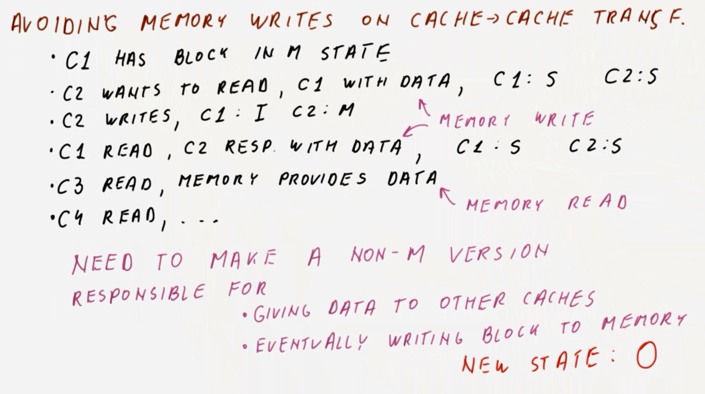
</center>

Recall (cf. Section 17) that in the MSI (modified-shared-invalid) protocol, even with an ***intervention*** mechanism, it is still necessary to write to main memory every time a cache-to-cache transfer occurs.

For example, consider the following sequence:
  * 1 - Cache `C1` has the cache block in the modified (M) state
  * 2 - Cache `C2` attempts to read the data via bus request, and then cache `C1` responds with the data accordingly
    * Rather than writing directly to the cache block, both caches `C1` and `C2` transition to the shared (S) state
    * Furthermore, the main memory also necessarily updated at the point of cache `C1` broadcasting the data.
  * 3 - Cache `C2` writes (correspondingly broadcasting an invalidation, since it already has the data at this point)
    * Cache `C1` transitions to the invalid (I) state
    * Cache `C2` transitions to the modified (M) state

At this point, the data is effectively simply moving around the caches, however, this also necessitates a ***main memory write*** to main memory in the process (furthermore, note that main memory does not have as much bandwidth as the caches do). Note that this is ***problematic***.

The sequence continues as follows:
  * 4 - Cache `C1` reads, and then cache `C2` responds with the data
    * Rather than writing directly to the cache block, both caches `C1` and `C2` transition to the shared (S) state
    * Furthermore, the main memory also necessarily updated at the point of cache `C1` broadcasting the data. As before, this ***main memory write*** is again ***problematic***.
  * 5 - Cache `C3` reads, and then the main memory responds with the data
    * Because both caches `C1` and `C2` are in the shared (S) state at this point, the data is consequently provided via ***main memory read*** (even though the valid/clean data *is* otherwise available in the other two caches), which is ***problematic***.
  * 6 - Cache `C4` reads, and so on...

Therefore:
  * It is desirable to avoid updates to main memory (i.e., ***main memory writes***) as long as there is at least one cache in the system holding the most recent value of the cache block.
  * Similarly, it is desirable to avoid ***main memory reads*** if there is at least one cache in the system holding the most recent value of the cache block.

***N.B.*** Recall that using main memory bandwidth is undesirable, because it is a lot lower than cache bandwidth, and furthermore main memory read/write operations are also correspondingly more expensive with respect to power consumption and higher latency.

In order to resolve this issue, a ***non-modified (non-M)*** version of the cache block must be made available among one of the caches, which is responsible for the following:
  * Providing the most recent cache-block data to the other caches (thereby bypassing excessive main memory reads)
  * Eventually writing the block to main memory (thereby bypassing excessive main memory writes)

To designate such a cache, it is necessary to determine which of the cache blocks in the shared (S) state holding the copy of the data is responsible for these duties; this is handled via additional state **owned (O)** (i.e., owner of this cache block).
  * The owned (O) state resembles that of the shared (S) state, except that whenever there is a request for the cache-block data, the cache block in the owned (O) state is responsible for fulfilling this request. Furthermore, if the cache block in the owned (O) state replaces the cache block from the cache, then it subsequently writes the cache-block data to main memory.

### 21. MOSI (Modified-Owned-Shared-Invalid) Coherence

<center>
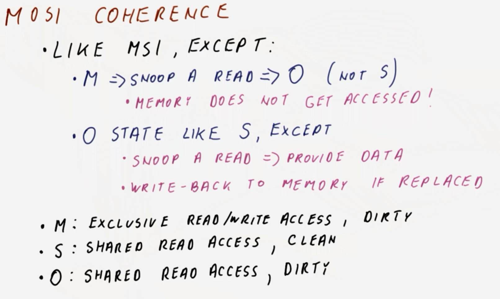
</center>

In the **MOSI (modified-owned-shared-invalid)** coherence protocol, the states **modified (M)**, **shared (S)**, and **invalid (I)** are as before (cf. Section 16), however, there is now the additional state **owned (O)**. 

The corresponding transition from ***modified (M)*** state to ***owned (O)*** state is characterized as follows:
  * A read is snooped from another cache, but the data is otherwise provided as before, resulting in a transition to the ***owned (O)*** state (***rather*** than to the shared [S] state, as done previously in the MSI protocol)
  * Furthermore, when providing the data, the main memory is ***not*** accessed anymore

Furthermore, the ***owned (O)*** state is similar to the shared (S) state, except for the following deviations:
  * If a read is snooped from another cache, then the data continues to be provided by the cache in the owned (O) state (***similarly*** to role of the modified [M] state previously in the MSI protocol)
  * A write-back to main memory is performed if the cache block is replaced by the cache in the owned (O) state
    * At this point, all of the other caches will be in either the invalid (I) or shared (S) states, and will be unaware that the cache block is dirty and pending replacement

By contrast, in the MSI protocol:
  * The ***modified (M)*** state implies ***exclusive*** read and write access to the cache block (i.e., all other caches contain a ***dirty*** versions of the same cache block in question).
  * The ***shared (S)*** state implies ***shared*** read access to the cache block, and correspondingly that this cache block is ***clean*** accordingly (i.e., the main memory has a clean copy of the data at this point).

Now, the ***owned (O)*** state effectively ***combines*** the properties of the modified (M) and shared (S) states from the MSI protocol, whereby read access is ***shared***, however, the cache block is ***dirty*** (i.e., the cache in the owned [O] state is now responsible for handling write-backs to main memory for corresponding updates).

### 22. M(O)SI Inefficiency

<center>
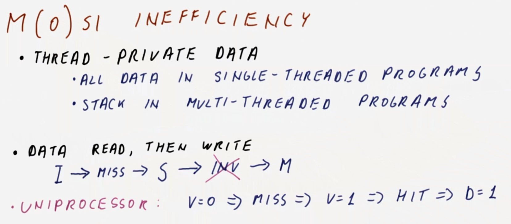
</center>

Recall (cf. Section 20) that the ***owned (O)*** state can be use to avoid inefficiency in the MSI (modified-shared-invalid) protocol pertaining to superfluous main memory access. However, there is ***another*** inefficiency which is common to ***both*** the MSI (modified-shared-invalid) and MOSI (modified-owned-shared-invalid) protocols, pertaining to **thread-private data** (i.e., data which is only exclusively accessed by a ***single*** thread).

The following are characterized by thread-private data:
  * All of the run-time data in a single-threaded program
  * The thread-specific stacks of a multi-threaded (i.e., parallel) program

The corresponding inefficiency in thread-private data arises when ***reading*** the data in a given thread, and then subsequently ***writing*** data to this thread (which otherwise uses this data ***exclusively***).
  * In both MSI and MOSI protocols, the corresponding sequence of the cache's states transitions is as follows: invalid (I) → read miss → shared (S) → broadcast invalidation (in order to write) → modified (M)
    * This is performed for ***every*** block of cache data (i.e., in ***each*** thread)
  * Conversely, in an equivalent uni-processor, the analogous "state transitions" (i.e., bit values via valid/`V` and dirty/`D` bits) are as follows: `V = 0` → read miss → `V = 1` → cache hit on write → `D = 1`
    * ***N.B.*** This does not incur the additional "invalidation" step, which adds additional bus overhead (which in turn is comparatively much slower than a cache hit).

***N.B.*** It is not inherently bad to incur an "invalidation overhead" penalty if the data ***is*** indeed shared, however, when the data is ***not*** shared, then this is simply a superfluous overhead.

In order to avoid unnecessary "invalidation overhead," a new state called ***exclusive (E)*** is additionally introduced, as discussed in the next section.

### 23. The Exclusive (E) State

<center>
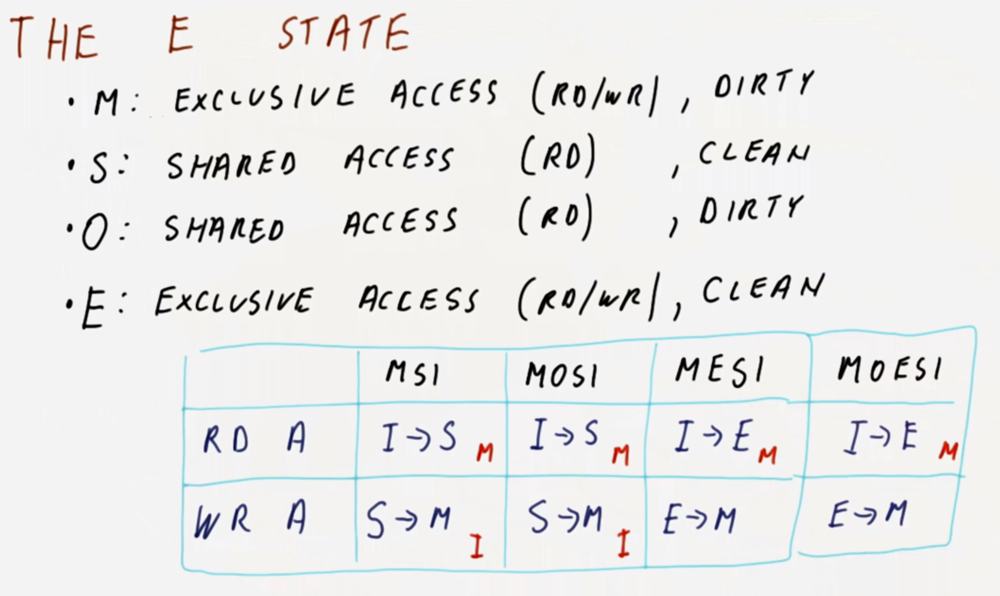
</center>

The **exclusive (E)** state is characterized as follows (in the context of the previously seen states):

| State | Access level of cache-block data | Cache block status | Comment |
|:--:|:--:|:--:|:--:|
| Modified (M) | Exclusive with respect to both read and write | Dirty | The cache is responsible for responding with the data as well as updating main memory |
| Shared (S) | Shared with respect to read | Clean | The cache can only read the data, but is not otherwise responsible for providing the data to other caches or for updating main memory |
| Owned (O) | Shared with respect to read | Dirty | The cache is responsible for updating main memory and for providing the data to other caches (thereby avoiding superfluous main memory writes otherwise) |
| Exclusive (E) | Exclusive with respect to both read and write | Clean | Since the cache-block data is still clean, it is not necessary to update main memory |

Correspondingly, note the state transitions among the various protocols in the following sequence (i.e., read followed by write):

| Sequence | Operation | MSI* | MOSI* | MESI** | MOESI** |
|:--:|:--:|:--:|:--:|:--:|:--:|
| `S1` | `RD A` | I → S (read miss incurred) | I → S (read miss incurred) | I → E (read miss incurred) | I → E (read miss incurred) |
| `S2` | `WR A` | S → M (broadcast invalidation) | S → M (broadcast invalidation) | E → M (write hit) | E → M (write hit) |
  * ****N.B.*** The MOSI protocol yields the same state transitions as the MSI protocol, because the owned (O) state is not particularly advantageous in this sequence. However, the owned (O) state can later prevent superfluous main memory accesses subsequently to the write operation (i.e., `WR A`) if other cores commence reading the data.
  * *****N.B.*** On read, in both the MESI and MOESI protocols, it is detected that the reading of the cache block is exclusively performed by the cache, thereby transitioning to the exclusive (E) state accordingly (i.e., rather than to the shared [S] state). Furthermore, on subsequent write, since this access is now exclusive, there is no need to broadcast to other caches, but rather write-through can be performed ***locally*** instead (however, there is a corresponding transition to the modified [M] state, because the block is now dirty). This effectively creates a sequence of state transitions which is analogous to a uni-processor equivalent (i.e., one which does not otherwise share the data).

Observe that while the MSI and MOSI protocols incur ***two*** bus accesses, MESI and MOESI only incur ***one*** bus access on read.

### 24. MOESI (Modified-Owned-Exclusive-Shared-Invalid) Quiz and Answers

<center>
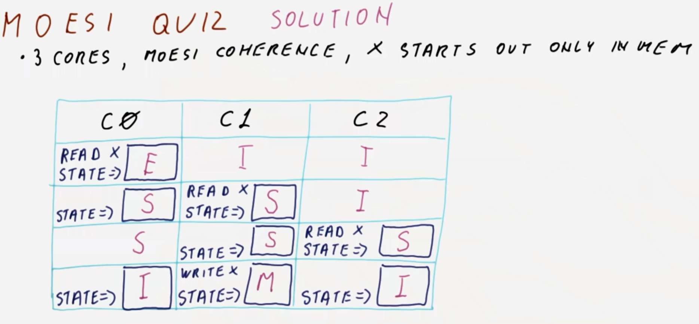
</center>

Consider a system comprised of three cores, each with private caches, which follow the MOESI (modified-owned-exclusive-shared-invalid) coherence protocol.

Initially, cache block `X` is only present in main memory, but not in any private cache.

Designate the appropriate final state (i.e., M, O, E, S, or I) in the following sequence of operations:

| Sequence | Cache `C0` | Cache `C1` | Cache `C2` | State of `X` in cache `C0` | State of `X` in cache `C1` | State of `X` in cache `C2` |
|:--:|:--:|:--:|:--:|:--:|:--:|:--:|
| `S1` | `READ X` | (N/A) | (N/A) | | | |
| `S2` | (N/A) | `READ X` | (N/A) | | | |
| `S3` | (N/A) | (N/A) | `READ X` | | | |
| `S4` | (N/A) | `WRITE X` | (N/A) | | | |

***Answer and Explanation***:

| Sequence | Cache `C0` | Cache `C1` | Cache `C2` | State of `X` in cache `C0` | State of `X` in cache `C1` | State of `X` in cache `C2` |
|:--:|:--:|:--:|:--:|:--:|:--:|:--:|
| `S1` | `READ X` | (N/A) | (N/A) | `E` | `I` | `I` |
| `S2` | (N/A) | `READ X` | (N/A) | `S` | `S` | `I` |
| `S3` | (N/A) | (N/A) | `READ X` | `S` | `S` | `S` |
| `S4` | (N/A) | `WRITE X` | (N/A) | `I` | `M` | `I` |

Since the cache block `X` is only present in main memory initially, then all three caches are initialized to the invalid (I) state.

After cache `C0` performs operation `READ X` (i.e., sequence `S1`), cache `C0` detects that it is the only cache possessing a copy of the cache-block data. Furthermore, since cache `C0` is a read operation, rather than transitioning to the modified (M) state, instead cache `C0` transitions to the exclusive (E) state. Furthermore, the other two caches remain in the invalid (I) state.

After cache `C1` performs operation `READ X` (i.e., sequence `S2`), cache `C1` detects that it does *not* have exclusive access to the cache block, so it proceeds to the shared (S) state as usual. Furthermore, cache `C0` snoops cache `C1` as another "reader" cache, and correspondingly transitions itself to the shared (S) state accordingly (i.e., its access is no longer exclusive). Cache `C2` still remains in the invalid (I) state.

After cache `C2` performs operation `READ X` (i.e., sequence `S3`), cache `C2` detects that it does *not* have exclusive access to the cache block (i.e., the other two cache blocks are also "sharers"), so it proceeds to the shared (S) state as usual. Furthermore, caches `C0` and `C1` snoop cache `C2` as another "reader" cache, and correspondingly remain in the shared (S) state accordingly (i.e., their respective accesses are not exclusive).

After cache `C1` performs operation `WRITE X` (i.e., sequence `S4`), because it was previously in the shared (S) state, it now broadcasts an invalidation onto the bus, and subsequently transitions itself to the modified (M) state. Furthermore, caches `C0` and `C2` both detect this invalidation and correspondingly transition themselves to the invalid (I) state accordingly.
  * ***N.B.*** Generally, after a write operation, the resulting transition is to a modified (M) state by the writing cache, and a corresponding transition to the invalid (I) state among the reading caches accordingly.


### 25. MESI, MOSI, and MOESI Quiz and Answers

<center>
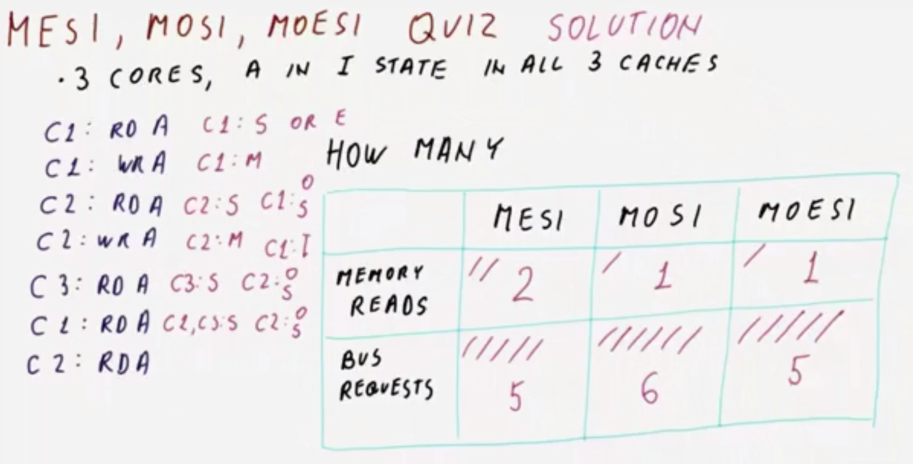
</center>

Consider the same (cf. Section 25) system comprised of three cores, each with private caches.

Initially, cache block `A` is only present in main memory, but not in either private cache. Correspondingly, all caches are initialized to the invalid (I) state accordingly.

Furthermore, the following sequence of operations occurs:

| Sequence | Core | Operation |
|:--:|:--:|:--:|
| `S1` | `C1` | `RD A` |
| `S2` | `C1` | `WR A` |
| `S3` | `C2` | `RD A` |
| `S4` | `C2` | `WR A` |
| `S5` | `C3` | `RD A` |
| `S6` | `C1` | `RD A` |
| `S7` | `C2` | `RD A` |

***N.B.*** Assume that only cache block `A` is accessed (i.e., it is replaced in the context of cohesion, but not otherwise).

Provide the counts of the corresponding operations according to protocol as follows:

| Operation | MESI | MOSI | MOESI |
|:--:|:--:|:--:|:--:|
| Main memory reads | | | |
| Bus requests | | | |

***Answer and Explanation***:

| Operation | MESI | MOSI | MOESI |
|:--:|:--:|:--:|:--:|
| Main memory reads | `2` | `1` | `1` |
| Bus requests | `5` | `6` | `5` |

Consider the per-sequence analysis as follows:

| Sequence | Operation | Main memory read (cumulative counts) | Bus request (cumulative counts) | Cache `C1` state | Cache `C2` state | Cache `C3` state | Comment |
|:--:|:--:|:--:|:--:|:--:|:--:|:--:|:--:|
| `S1` | `C1: RD A` | MESI (1), MOSI (1), MOESI (1) | MESI (1), MOSI (1), MOESI (1) | `S` or `E` | `I` | `I` | A read miss occurs, and consequently cache `C1` transitions to the shared (S) or (if available) exclusive (E) state. Furthermore, a memory read begets an obligatory bus request. |
| `S2` | `C1: WR A` | (N/A) | MOSI (2) | `M` | `I` | `I` | If cache `C1` was previously in the shared (S) state, then an invalidation is broadcasted on the bus (i.e., other outstanding sharers are indeterminate at this point), and cache `C1` subsequently transitions to the modified (M) state. Otherwise, with protocols having the exclusive (E) state available, cache `C1` simply transitions directly to the modified (M) state (without corresponding memory read or bus request). There is no main memory read in either case. |
| `S3` | `C2: RD A` | (N/A)  | MESI (2), MOSI (3), MOESI (2) | `S` or `O` | `S` | `I` | When cache `C2` reads cache block `A`, cache `C1` must supply this data accordingly, which requires a bus request to read in from the other caches. Consequently, cache `C1` is "downgraded" to the shared (S) state or (if available) the owned (O) state, while cache `C2` transitions to the shared (S) state accordingly. Furthermore, assuming there is ***intervention*** (i.e., on supply of the data value from cache `C1` to cache `C2`), then there is no corresponding read from main memory. |
| `S4` | `C2: WR A` | (N/A) | MESI (3), MOSI (4), MOESI (3) | `I` | `M` | `I` | Since cache `C2` was previously in the shared (S) state, on write, there is a corresponding broadcast of invalidation onto the bus accordingly, and cache `C2` subsequently transitions to the modified (M) state. Consequently, cache `C1` transitions to the invalid (I) state. In this case, the availability of the exclusive (E) state is not advantageous, since there is no exclusive access of the cache block (i.e., the cache block was already "owned" by cache `C1` by this point). |
| `S5` | `C3: RD A` | (N/A) | MESI (4), MOSI (5), MOESI (4) | `I` | `S` or `O` | `S` | On read, cache `C3` transitions to the shared (S) state. Furthermore, a read miss occurs, yielding a corresponding bus access. Furthermore, cache `C2` transitions to either the shared (S) state or (if available) the owned (O) state. In this case (similarly to before, cf. sequence `S3`), cache `C2` supplies the data to cache `C3`, so there is no corresponding main memory read. |
| `S6` | `C1: RD A` | MESI (2) |  MESI (5), MOSI (6), MOESI (5) | `S` | `S` or `O` | `S` | On read, cache `C1` reads from main memory if cache `C2` was previously in the shared (S) state. Conversely, if the owned (O) state is available, then if cache `C2` was previously in the owned (O) state, then cache `C2` can provide the data via ***intervention***, thereby bypassing a main memory read access accordingly. Furthermore, since cache `C1` was previously in the invalid (I) state, a bus access is necessary to perform the read accordingly.  |
| `S7` | `C2: RD A` | (N/A) | (N/A) | `S` | `S` or `O` | `S` | On read, cache `C2` is able to read the block directly, regardless of it being in the shared (S) state or owned (O) state previously, without any corresponding main memory read access or bus request. |

## 26-30. Directory-Based Coherence

### 26. Introduction

<center>
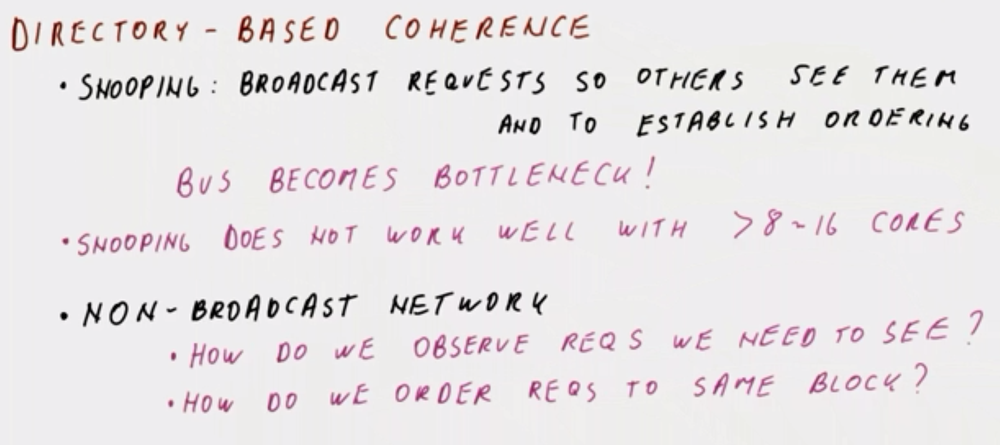
</center>

Recall (cf. Section 6) that in addition to snooping, **directory-based coherence** is another strategy for ensuring write-ordering in a coherent system.

To better contextualize directory-based coherence, first consider the key ***disadvantage*** of **snooping** (i.e., broadcasting of requests on the bus and establishing ordering of write operations): Snooping requires a ***single*** bus (which handles cache misses, coherence requests that broadcast invalidations [including perhaps frivolously], etc.), which eventually becomes a ***bottleneck***.
  * Consequently, snooping does ***not*** perform well once the multi-core system exceeds 8 to 16 cores or so. Beyond this point, most of the cores are idle, pending further broadcasted requests on the bus.

Therefore, in order to resolve this bottleneck, a **non-broadcast network** is needed to manage the requests. However, this begs the following questions:
  * How are these requests observed (i.e., those which require such observation)?
    * For example, if a given cache's block is in the shared (S) state, it *must* observe write requests for other caches for consequent transition to the invalid (I) state (i.e., to avoid incoherence). 
  * How are requests orders to the ***same*** cache block?
    * For example, how to manage write requests originating from different cores, if the request can be made on different parts of the network?

The corresponding structure which handles these requests is called a **directory**, as discussed in the next section.

### 27. Directory

<center>
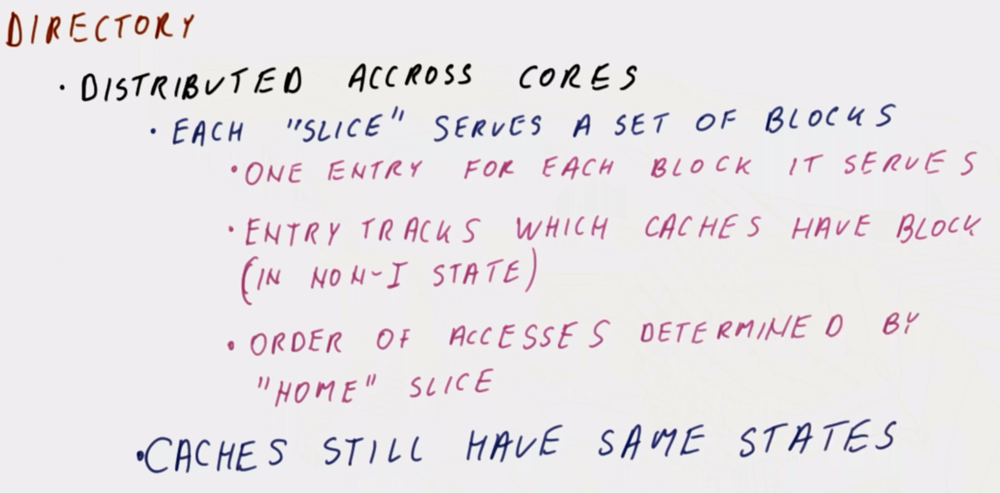
</center>

The **directory** is a distributed structure which spans across the cores, rather than being centralized (i.e., as is the case with the bus). Correspondingly, not all requests *necessarily* must proceed through the *same* part of the directory.

Each (fractional) "***slice***" of the directory serves a set of blocks, whereby each such "slice" is the part of the directory which is adjacent to a particular core (correspondingly, different cache blocks are served by these distributed "slices" accordingly, thereby achieving a relatively higher bandwidth via this pseudo-independent operation of this "disjoint set" of blocks).
  * Each "slice" contains ***one*** **entry** for each cache block that is served from this "slice."
  * Each such **entry** in turn tracks which caches in the system contain the cache block in a non-invalid (non-I) state
    * ***N.B.*** A cache block in the invalid (I) state is effectively absent from the cache otherwise.
  * The ***order*** of accesses for a particular cache block is determined by the "***home slice***" for that cache block
    * The "home slice" contains the entry for the cache block in question, and accessed to the ***same*** cache block are effectively serialized by virtue of how they access this entry.

Note that with a directory-based protocol, the caches still have the ***same*** states as those occurring with snooping (cf. Section 16). However, now, when a request to read or to write is sent, rather than broadcasting this request on a bus, instead the request is transmitted via the network to the directory.
  * In this manner, many requests can travel to their corresponding individual "slices," for subsequent management by the directory.

### 28. Directory Entry

<center>
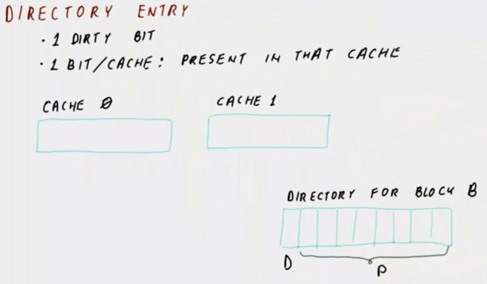
</center>

A **directory entry** is comprised of the following:
  * One ***dirty bit*** (`D`), indicating that the cache block is ***possibly*** dirty in at least one cache within the system
  * One ***presence bit*** (`P`) bit per cache which indicates whether the cache block is ***definitely*** present within the cache in question
    * A bit value of `1` indicates that the cache in question has a copy of the cache block
    * A bit value of `0` indicates that the cache in question does not have a copy of the cache block (in an otherwise non-invalid [non-I] state)

Consider an eight-core system, along with two of its caches `0` and `1` (as in the figure shown above), and with the corresponding directory for block `B`.

<center>

</center>

Initially, the directory is neither dirty nor present among any of its cores' cache block entries (as in the figure shown above).

<center>

</center>

On operation `RD B` from cache `0` (as in the figure shown above), since the cache block is not present, the read request is sent (i.e., `RREQB`).
  * ***N.B.*** In snooping, this read request is broadcasted onto the bus, and since no other cache contains the cache-block data, the main memory would provide the data instead.

The read request is sent to the home slice of the block (whose address is determined by examining the request), and upon locating the directory for block `B`, it is determined that cache block `B` is not currently present in the system.

The data is consequently fetched from main memory and sent back to cache `0`. Furthermore, this transmission also includes the corresponding updated state information, which in this case updates cache `0` to the exclusive (E) state (i.e., there is exclusive access, since there are currently no other "sharers").
  * On receipt of the transmission, cache `0` updates its state to exclusive (E) accordingly, and stores the current cache-block data for `B`.
  * Furthermore, on transmission, the directory updates its present bit for cache `0` to bit value `1`, and also updates its dirty bit to `1` (because it sent the data with exclusive access to cache `0`).
    * ***N.B.*** Setting the dirty bit to `1` does not induce a write-back, but rather it indicates that it will be necessary to later determine if such a subsequent write-back is indeed necessary.

This begs the question: Why does this work better than a bus? The reason is that while cache `0` manages its state and data via the directory in this manner, cache `1` is able to perform analogous ***independent*** operations with respect to another block (and corresponding directory slice), without otherwise violating coherence.

<center>

</center>

Conversely, if cache `1` attempts a write request (i.e., `WREQB`) operation `WR B` temporally closely to the read operation of cache `0` (as in the figure shown above), then the **directory controller** arbitrates the ordering of these requests (in this case, processing the read request from cache `0` first accordingly).

<center>
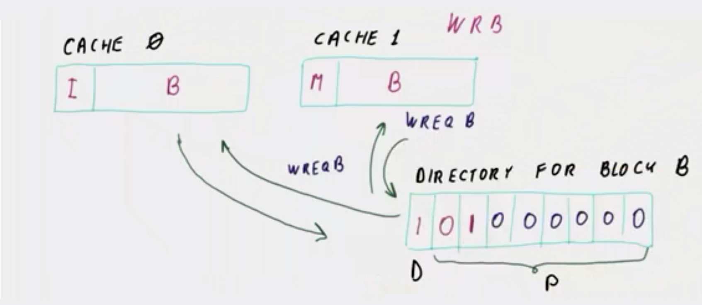
</center>

On completion of the read request from cache `0`, the write request from cache `1` commences subsequently (as in the figure shown above).
  * ***N.B.*** In snooping, this write request is broadcasted onto the bus by cache `1`, and on snooping by cache `0`, cache `0` is transitioned to the invalidated (I) state via corresponding broadcasted invalidation, and cache `1` correspondingly transitions to the modified (M) state (in fact, these are the same state updates which occur in this directory-based scenario, too).

Since the directory detects that cache block `B` is present (i.e., via corresponding presence bit value of `1` for cache `0`) and possibly dirty (i.e., via corresponding dirty bit value of `1`), the directory consequently forwards this write request to the present cache(s) (i.e., cache `0` in this particular case). Correspondingly, cache `0` detects this request (analogously to snooping from the bus), and since cache `0` is in the exclusive (E) state with respect to cache block `B`, it can elect to either respond with the data or to simply "passively" acknowledge the invalidation, back to the directory controller (which in turn records that invalidation of the data copy has been concluded).

On receipt of ***acknowledgement*** by the directory, the directory updates the corresponding present bit(s) to bit value `0`. Furthermore, if the data was not also transmitted, then the dirty bit can be reset to `0` (not indicated in the figure shown above).

The data is subsequently fetched from main memory, and then transmitted to cache `1`, along with corresponding update of the dirty bit to `1` and the present bit for cache `1` to bit value `1`. Correspondingly, cache `1`  transitions to state modified (M), and stores the cache-block data accordingly.

In this manner, coherence is still maintained in a directory-based system. However, rather than broadcasting *all* requests among *all* caches, instead the directory mediates these requests, and correspondingly interacts with the pertinent caches on a "strictly necessary" basis only (i.e., those which may be currently interacting with the cache block in question).
  * In this example, since the cache block `B` is only shared by two cores (`0` and `1`), no other cores are affected by these operations. Correspondingly, this greatly reduces the "traffic" relative to an equivalent snooping-based system-wide-broadcasting cache.

### 29. Directory Example

Now, consider a slightly more detailed directory example, in order to demonstrate how the directory does not become a bottleneck where a bus otherwise would.

<center>
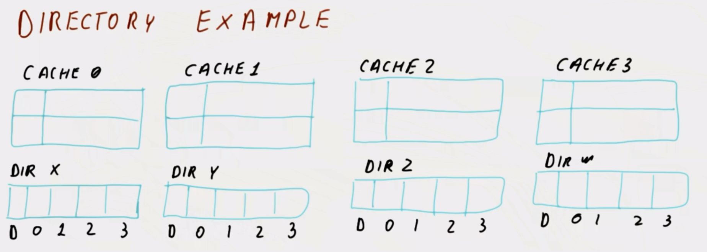
</center>

Consider a system comprised of four cores (i.e., caches `0`, `1`, `2`, and `3`) (as in the figure shown above), each with its own private cache. Furthermore, each cache has an associated slice (i.e., slices `X`, `Y`, `Z`, and `W`, respectively) of the directory (for simplicity, assume that each slice simply tracks its respectively associated cache block).

<center>
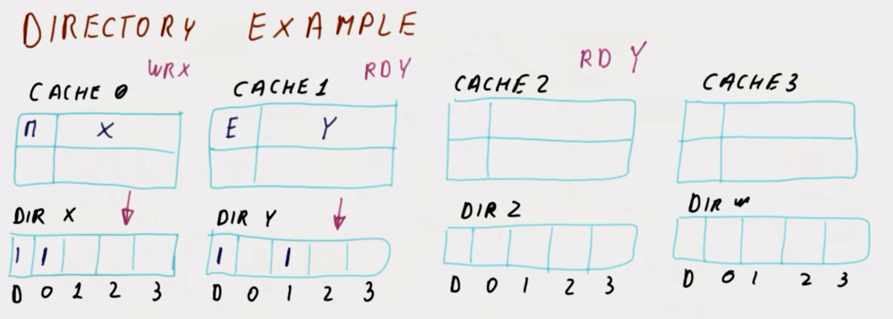
</center>

First, simultaneous operations occur in the system as follows (as in the figure shown above):
  * `WR X` in cache `0` with respect to cache block `X`, which results in a cache miss that is sent to slice `X`
  * `RD Y` in cache `1` with respect to cache block `Y`, which results in a cache miss that is sent to slice `Y`
  * `RD Y` in cache `2` with respect to cache block `Y`, which transmits through the network during this time
    * ***N.B.*** In the case of the other two operations, the cache blocks are co-located with the respective directories and corresponding home slice.

Since neither directory contains the requested block, the cache states are updated as follows:
  * Cache `0` transitions to the modified (M) state on write, with dirty bit set to bit value `1` (and corresponding presence bit for cache `0` set to `1`) accordingly in the directory
  * Cache `1` transitions to the exclusive (E) state on read, with dirty bit set to bit value `1` (and corresponding presence bit for cache `1` set to `1`) accordingly in the directory

<center>
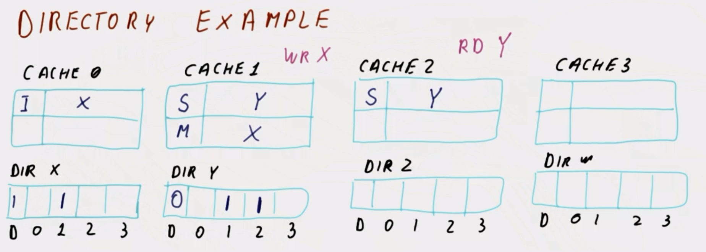
</center>

On arrival of the transmission of operation `RD Y` from cache `2` (as in the figure shown above), simultaneously as cache `1` is still being accessed via operation `WR X`.

Since `RD Y` yields a cache miss, it is sent to the corresponding directory for cache block `Y`. Since the directory for cache block `Y` indicates a presence bit of value `1` for cache `1` (as well as indicating that it may be dirty, per dirty bit value `1`), the request is consequently forwarded to cache `1` as a read request accordingly.

Cache `1` subsequently acknowledges this request and transitions to the shared (S) state accordingly, relaying back the acknowledgement (but without otherwise sending the data, thereby updating the dirty bit to bit value `0` accordingly in the directory for cache block `Y`). The data is then forwarded to cache `2`, with corresponding update of the presence bit to bit value `1` for cache `2` entry in the directory for cache block `Y`.

On receipt of the data, cache `2` transitions to the shared (S) state.

Meanwhile, the operation `WR X` arrives at the directory for cache block `X`. Since this is a write request, an invalidation is sent from cache `1` to the directory for cache block `X`, which in turn forwards the write request to cache `0`.

Cache `0` responds with the data due to the write request, correspondingly transitioning itself to the invalid (I) state accordingly. Correspondingly, the dirty bit is set to bit value `0` in the directory for cache block `X`, and furthermore the presence bit is set to bit value `1` for the cache `1` entry in the directory for cache block `X`. Furthermore, cache `1` received the data and transitions to the modified (M) state with respect to cache block `X`.

***N.B.*** Observe that `WR X` and `RD Y` proceed largely independently of each other (aside from slight network delays). Therefore, provided that the network is reliable and robust (i.e., containing many different paths among these caches and directories), these requests effectively do not "compete" with each other.

<center>
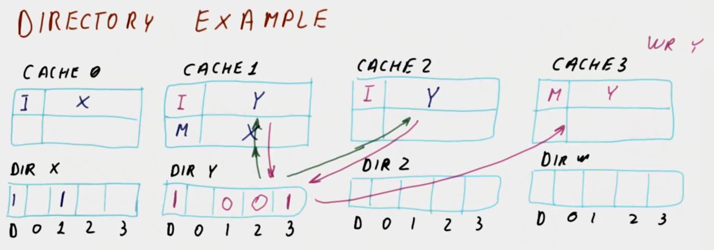
</center>

Lastly, consider a subsequent operation whereby `WR Y` in cache `3` with respect to cache block `Y` occurs, which results in a cache miss that is sent to slice `Y` (as in the figure shown above).

At this point, the directory for cache block `Y` detects that caches `1` and `2` may contain the data, and that none of them are dirty (see the penultimate figure). 

Accordingly, the directory for cache block `Y` sends an invalidation request to caches `1` and `2` (denoted by green arrows in the figure shown above). Consequently, these two respective caches transition to the invalid (I) state accordingly with respect to cache block `Y`. Furthermore, they respond with acknowledgements of these invalidations back to the directory for cache block `Y` accordingly (denoted by magenta arrows in the figure shown above).

On receipt of the acknowledgements, the directory sets the corresponding presence bits to `1` for caches `1` and `2` accordingly.

Now that there are no more "sharers" for cache block `Y`, the data is correspondingly sent to the writer (i.e., cache `3`).
  * The presence bit is set to bit value `1` for cache `3` in the directory for cache block `Y`, and the dirty bit is also set to bit value `1` (indicating that the block may be dirty on subsequent write).
  * Cache `3` transitions to the modified (M) state on receipt of the cache-block data as the now-current writer cache.

***N.B.*** As before, this write operation only involves the "minimally necessary" caches (i.e., caches `1`, `2`, and `3`) and directory (i.e., that of cache block `Y`) to manage the cache block in question (i.e., `Y`), without otherwise impacting any other caches or directories (which are otherwise free to perform separate, independent operations from this).

### 30. Directory MOESI Quiz and Answers

<center>
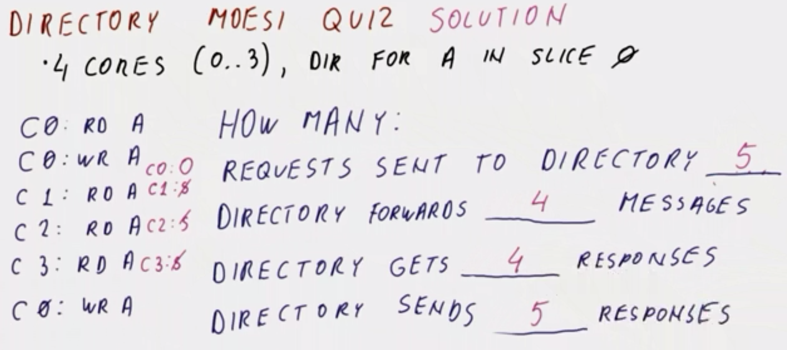
</center>

Consider a system comprised of four cores (numbered `0` through `3`, inclusive), each with private caches.

The directory for cache block `A` is present in slice `0`, and initially none of the caches contains cache-block data for `A`.

Furthermore, the following sequence of operations occurs:

| Sequence | Core | Operation |
|:--:|:--:|:--:|
| `S1` | `C0` | `RD A` |
| `S2` | `C0` | `WR A` |
| `S3` | `C1` | `RD A` |
| `S4` | `C2` | `RD A` |
| `S5` | `C3` | `RD A` |
| `S6` | `C0` | `WR A` |

***N.B.*** Assume that only cache block `A` is accessed (i.e., it is replaced in the context of cohesion, but not otherwise).

Provide the counts of the corresponding operations according to MOESI protocol as follows:
  * Requests sent from the caches to the directory?
    * `5`
  * How many of these requests are subsequently forwarded as messages? (***N.B.*** This count will not necessarily be the same as that of the previous.)
    * `4`
  * How many replies are subsequently received by the directory?
    * `4`
  * How many subsequent responses are then sent by the directory?
    * `5`

***Explanation***:

| Sequence | Operation | States of caches: {`0`,`1`,`2`,`3`} | Requests from caches to directory (cumulative) | Forwarded requests (cumulative) | Replies received by directory (cumulative) | Responses sent from directory (cumulative) | Comment |
|:--:|:--:|:--:|:--:|:--:|:--:|:--:|:--:|
| `S1` | `C0: RD A` | {`I`,`I`,`I`,`I`} | `1` | (N/A) | (N/A) | `1` | When cache `0` initially reads, it sends a request to the directory. The directory neither forwards nor receives any replies, but rather simply sends the response. |
| `S2` | `C0: WR A` | {`E`,`I`,`I`,`I`} | (N/A) | (N/A) | (N/A) | (N/A) | When cache `0` subsequently writes, cache `0` receives cache block `A` in an ***exclusive (E)*** state, and can consequently perform writing without otherwise notifying other caches. |
| `S3` | `C1: RD A` | {`O`,`S`,`I`,`I`} | `2` | `1` | `1` | `2` | When cache `1` subsequently reads, it sends a request to the directory. Consequently, the directory forwards a request to the only cache currently involved in sharing cache block `A`, i.e., cache `0`. Core `0` subsequently replies with the data, acknowledging that the cache block can now be read. On receipt of this reply, the directory sends this response to cache `1` accordingly. At this point, cache `1` transitions to the ***shared (S)*** state with respect to cache block `A`, and cache `0` transitions to the ***owned (O)*** state with respect to cache block `A` (which is a "downgrade" from otherwise transitioning to the modified [M] state). |
| `S4` | `C2: RD A` | {`O`,`S`,`S`,`I`} | `3` | (N/A) | (N/A) | `3` | When cache `2` subsequently reads, it sends a request to the directory. At this point, the directory cannot unambiguously identify the owner of the cache-block data, however, it does not need to forward a request at this point since the cache block is effectively no longer "visible" in the directory in its current "dirty" state. Accordingly, it also does not receive any replies, but rather simply sends a response back to cache `2` via main memory. (***N.B.*** Here, there is no benefit conferred by the owned [0] state of core `0`, because the directory cannot unambiguously identify core `0` as the source of this data at this point; this would otherwise require a more sophisticated directory implementation, which provides further optimizations beyond simply a dirty bit and presence bits.) Cache `2` correspondingly transitions to the shared (S) state. |
| `S5` | `C3: RD A` | {`O`,`S`,`S`,`S`} | `4` | (N/A) | (N/A)| `4` | When cache `3` subsequently reads, it sends a request to the directory; an analogous series of updates occur as for the previous sequence (cf. sequence `S4`). At this point, the directory cannot unambiguously identify the owner of the cache-block data, however, it does not need to forward a request at this point since the cache block is effectively no longer "visible" in the directory in its current "dirty" state. Accordingly, it also does not receive any replies, but rather simply sends a response back to cache `3` via main memory. Cache `3` correspondingly transitions to the shared (S) state.  |
| `S6` | `C0: WR A` | {`E`,`I`,`I`,`I`} | `5` | `4` | `4` | `5` | Finally, when cache `0` subsequently writes, since cache `0` is in the owned (O) state, it cannot write without otherwise notifying the directory. This write is an invalidation request, because cache `0` possesses the data in question; correspondingly, these invalidations are forwarded to the other three caches (which all share the cache block at this point), originating from cache `0`. Furthermore, the directory relays three corresponding responses from these respective caches accordingly; these caches in turn transition to the invalidated (I) state on acknowledgement reply back to the directory. Finally, the directory sends the response back to cache `0`, thereby allowing cache `0` to commence writing; cache `0` correspondingly transitions to the exclusive (E) state as the dedicated "writer" cache at this point. |

***N.B.*** In general, the requests sent to the directory (i.e., `5` total) is equal to the subsequent responses sent from the directory (i.e., `5` total). Similarly, every message (i.e., `4` total) receives a corresponding response (i.e., `4` total), because the directory must enforce consensus (i.e., transition to invalidated among the "sharers") before granting exclusive write access to the "writer" cache.

## 31-32. Cache Misses with Coherence

### 31. Introduction

<center>
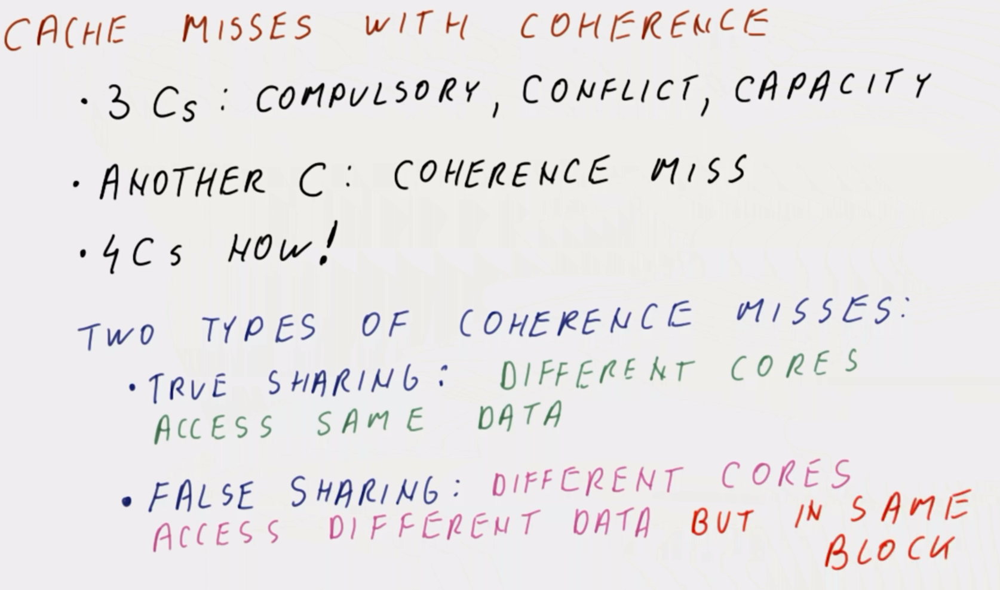
</center>

Consider now a reprise of the topic of **cache misses** (cf. Lesson 14, i.e., the "three Cs"), in the additional context of cache coherence.

Recall that there are three types of cache misses (i.e., "three Cs") as follows:
  * **compulsory** → the cache block is accessed for the first time (i.e., it was not previously in the cache), thereby yielding a cache miss "by default"
  * **capacity** → the cache block does not fit in a cache of the given size
  * **conflict** → the cache has insufficient associativity to accommodate the incoming cache block

Additionally, cache coherence gives rise to a fourth type of cache miss: A **coherence** miss.
  * For example, when reading a cache block, another cache may write to the cache block, and consequently on subsequent read attempt, a "read miss" results due to coherence.

Therefore, be advised that in a multi-core, coherent system there are ***four Cs (4 Cs)*** of concern with respect to cache misses!

Furthermore, within the scope of ***coherence misses***, there are the following two ***sub-types***:
  * 1 - **true sharing** → different cores/caches access the ***same*** data, thereby necessitating coherence-related interventions/protocols (which in turn yield coherence misses)
    * ***N.B.*** This is the type of coherence miss demonstrated thus far in this lesson.
  * 2 - **false sharing** → different cores/caches access ***different*** data in the ***same*** cache block
    * In this case, while there is no "true" data sharing, as far as coherency is concerned, actions are performed at a granularity level of a cache block (i.e., two items being present in the same block makes them behave as the "same" item in this regard).

### 32. False Sharing Quiz and Answers

<center>

</center>

Consider a system comprised of two memory blocks (`0` and `1`), with each containing four words apiece (as in the figure shown above). Assume that all caches are initially empty with respect to these words.

Which of the following sequences of operations yield false-sharing misses? (Select all applicable programs.)

| Sequence | Program 1 | Program 2 | Program 3 |
|:--:|:--:|:--:|:--:|
| `S1` | `C0: RD X` | `C0: RD X` | `C0: RD X` |
| `S2` | `C1: WR X` | `C1: WR X` | `C1: WR X` |
| `S3` | `C2: RD A` | `C2: RD Z` | `C2: WR W` |
| `S4` | `C3: WR B` | `C3: WR Z` | `C0: RD X` |

***Answer and Explanation***:

In program 1:
  * Sequences `S1` and `S2` result in a compulsory miss (`X` is not present in block `1` of either cache `C0` or `C1`).
  * Sequence `S3` is also a compulsory miss (`D` is not present in block `0` of cache `C2`).
  * Sequence `S4` is also a compulsory miss (`B` is not present in block `0` of cache `C3`)

Therefore, ***no*** false-sharing coherence misses occur in program 1. In fact, there are no coherence misses at all in this program.

In program 2:
  * Sequences `S1` and `S2` result in a compulsory miss (`X` is not present in block `1` of either cache `C0` or `C1`).
  * Sequence `S3` is also a compulsory miss (`Z` is not present in block `1` of cache `C2`).
  * Sequence `S4` is also a compulsory miss (`Z` is not present in block `1` of cache `C3`)

Therefore, ***no*** false-sharing coherence misses occur in program 2. In fact, there are no coherence misses at all in this program.

In program 3:
  * When cache `C1` writes to `X` subsequently to cache `C0` reading `X`, this invalidates `X` in cache `C0`.
    * Both of these are compulsory misses.
  * Next, when cache `C2` writes to `W`, this invalidates the data in cache `C1`. (cache `C0`'s data is also invalidated from previously at this point.)
    * This is a compulsory miss.
  * Lastly, when cache `C0` attempts to re-read `X` in sequence `S4`, it no longer has valid data (due to invalidation previously by cache `C1` in sequence `S2`).
    * ***N.B.*** This is an example of a true-sharing coherence miss, whereby invalidation occurs due to another cache writing to the ***same*** word as that which was accessed previously.

Therefore, ***no*** false-sharing coherence misses occur in program 3, however, a true-sharing coherence miss does occur.

## 33. Lesson Outro

This lesson has demonstrated that if cores in a multi-core system have respective private caches, then it is necessary to maintain coherence in such a system in order to ensure correct behavior of shared-memory programs accordingly. Several techniques for maintaining this cache coherence were additionally explored.

The next lesson will examine what is necessary for multiple cores to do in order to coordinate their work in a parallel program.
