# Synchronization

## 1. Lesson Introduction

This lesson will examine how to provide efficient **synchronization** among cores and threads that are working on the ***same*** program.

## 2-3. Synchronization Example

### 2. Example

<center>

</center>

Consider an example (as in the figure shown above) to demonstrate why **synchronization** is necessary.

The system in question is characterized as follows:
  * Two threads count the occurrences of different letters in a document
  * Thread `A` counts the first half of the document
  * Thread `B` counts the second half of the document
  * Lastly, the counting of the threads is combined in the end

The corresponding program code is as follows:

(thread `A`)
```mips
LW  L, 0(R1)    # load a letter into `L`
LW  R, Count[L] # load count for letter `L` into memory
ADD R, R, 1     # increment the count
SW  R, Count[L] # load the new count back into memory
```

(thread `B` - same work as thread `A`)
```mips
LW  L, 0(R1)    # load a letter into `L` -- N.B. `R1` is distinct from that of thread A
LW  R, Count[L] # load count for letter `L` into memory
ADD R, R, 1     # increment the count
SW  R, Count[L] # load the new count back into memory
```

As long as the letters processed are ***different*** between the threads, then this program will work normally.

However, if both threads encounter the ***same*** letter (e.g., `'A'`), then both threads attempt to load the ***same*** counter value (i.e., `Count[L]`, having current value `15`).

On increment (i.e., `ADD R, R, 1`), both threads update the value (i.e., `16`) and store it into memory (i.e., `SW R, Count[L]`). However, since there were ***two*** occurrences of the letter (i.e., `'A'`), this count is incorrect (i.e., `16` rather than `17` is stored in memory).

Therefore, to ensure ***correct*** program behavior, the count-incrementing operations must be performed ***sequentially*** across the two threads when handling the ***same*** data.
  * For example, if thread `A` increments first, then cache coherence ensures that the value `16` is read by thread `B`.
  * Thread `B` then subsequently increments the value to `17`.

***N.B.*** The ordering of these two operations among the threads is not significant (i.e., the equivalent holds if Thread `B` had written first instead).

These thread-coordinated operations are called **atomic (or critical) sections**. Synchronization is therefore necessary to perform such operations accordingly (i.e., additional code which ensures such thread-wise operation accordingly).

### 3. Lock

<center>
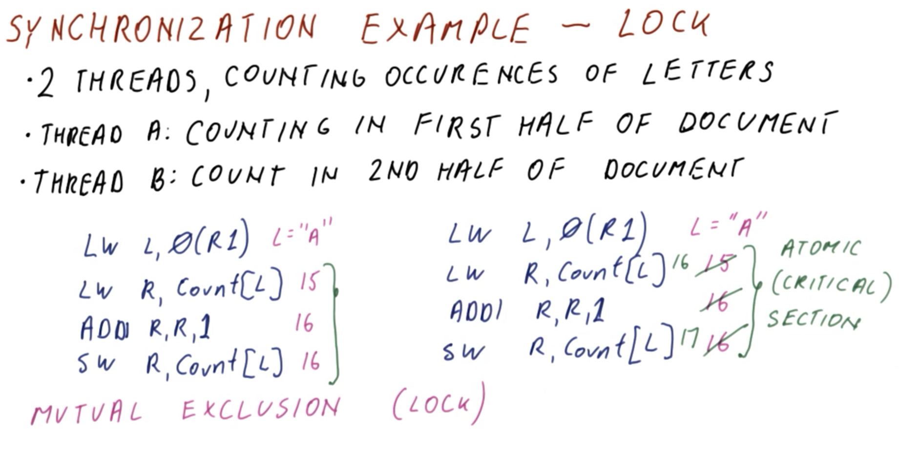
</center>

Continuing from the previous example (cf. Section 2), the type of synchronization used for atomic sections is called **mutual exclusion** (or **lock**). Such a lock is used to "flank" the atomic section in order to coordinate accordingly among the threads.

<center>
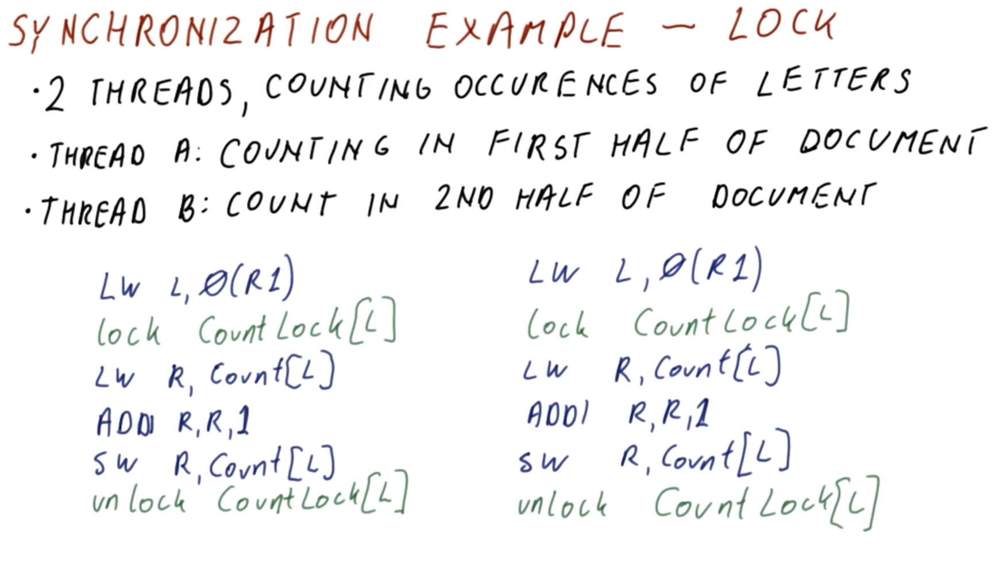
</center>

To perform this locking, an explicit mechanism of `lock` and `unlock` is used (as in the figure shown above).

The lock `CountLock[L]` has a status of open/closed at any given time.
  * When the lock `CountLock[L]` is ***open***, then the atomic section can be entered.
  * Otherwise, when the lock `CountLock[L]` is ***closed***, then **spinning** will occur by the thread, until the lock is once again opened.

On ***acquisition*** of the lock (and consequently closing the lock to other threads), the thread enters the atomic section and performs its operations. On exit of the atomic section, the lock becomes unlocked and subsequently available to another thread.

By having the lock present in this manner, this enforces mutual exclusion of the atomic-section code. However, this does not otherwise impose ***order*** among execution by the respective threads (it simply prevent ***simultaneous*** execution at any given time).

## 4. Lock Variable Quiz and Answers

<center>
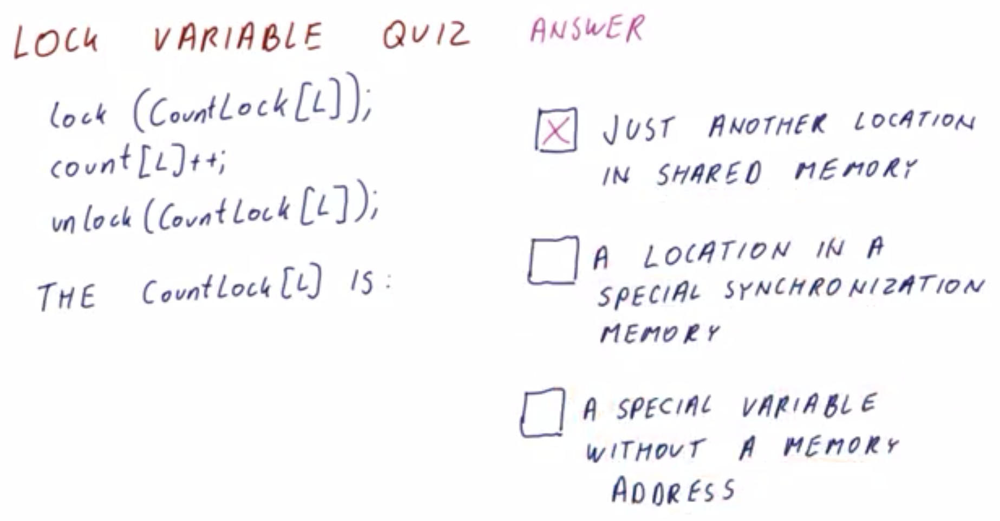
</center>

Consider the following code fragment denoting an atomic section:

```c
lock(CountLock[L]);
count[L]++;
unlock(CountLock[L]);
```

How is `CountLock[L]` described in this context? (Select the correct option.)
  * Just another location in shared memory
    * `CORRECT`
  * A location in a special synchronization memory
    * `INCORRECT`
  * A special variable without a memory address
    * `INCORRECT`

***Explanation***:

A lock is essentially just another "variable" like any other, having a memory address, which in turn can be loaded, modified, etc.

This lesson will subsequently explore the nature of these lock variables and associated functions `lock()` and `unlock()` accordingly.

## 5-7. Lock Synchronization

### 5. Introduction

<center>
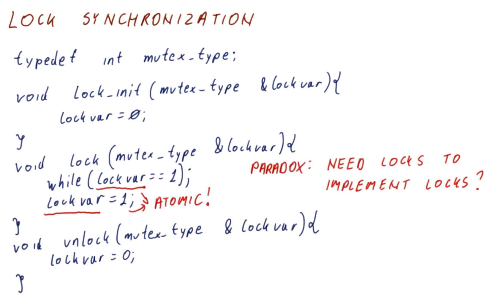
</center>

To further examine lock-based synchronization, consider the following function definitions:

```cpp
typedef int mutex_type;

void lock_init(mutex_type &lock_var) {
  lock_var = 0;
}

void lock(mutex_type &lock_var) {
  while (lock_var == 1);
  lock_var = 1;
}

void unlock(mutex_type &lock_var) {
  lock_var = 0;
}
```

For simplicity, an integer is used here to represent "*a location in (shared) memory*" (cf. Section 4).

The function `lock_init()` initializes the lock variable `lock_var` to `0` (unlocked).

The function `lock()` "spins" on value `1` (locked) via `while` loop until the `lock_var` is set to `0`. On exit of the `while` loop, `lock()` sets `lock_var` to `1` (i.e., the lock is acquired, for subsequent entry into the critical section).

The function `unlock()` sets the lock `lock_var` to `0` on exit from the critical section, thereby opening/freeing the lock for subsequent use.
  * Coherence ensures that the other thread(s) waiting on `lock_var` within function `lock()` at this point observe this update to value `lock_var` accordingly (i.e., for subsequent lock acquisition)

However, note that the function `lock()` does not work in practice as implemented here.
  * Suppose there are two threads (one purple, one green), which both initially encounter the `while` loop with `lock_var` having value `0` and subsequently *both* acquire the lock via setting of `lock_var` to `1`.
  * Now, *both* threads are simultaneously accessing the critical section.

Therefore, in order to ***correctly*** implement the function `lock()`, both the ***checking*** and ***setting*** of the lock value `lock_var` must be ***atomic operations*** (i.e., performed in its own critical section accordingly).

This gives rise to an apparent ***paradox***: A critical section is needed in order to implement a critical-section-based lock.

### 6. Implementing `lock()`

<center>
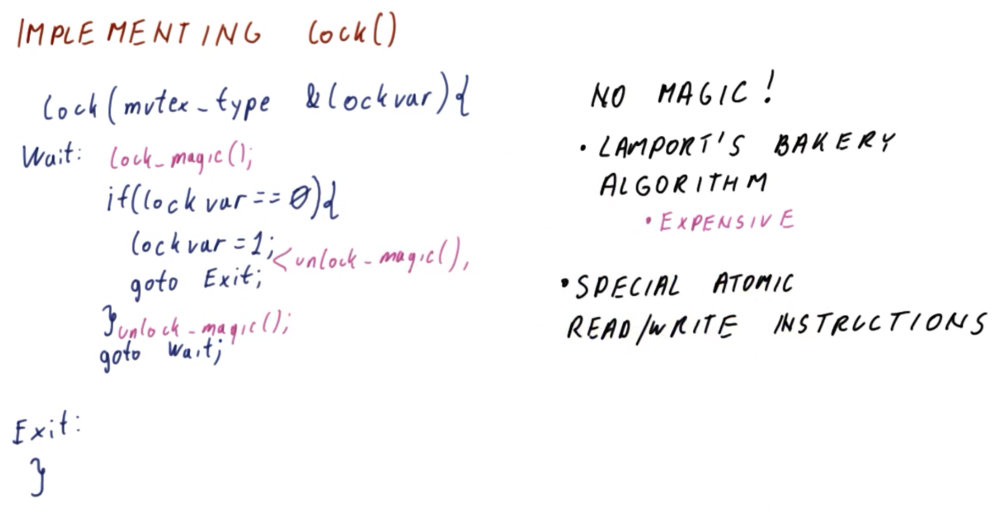
</center>

Per the apparent "paradox" identified in the previous section (cf. Section 6), some sort of "magic locK" modification is necessary, as follows:

```cpp
void lock(mutex_type &lock_var) {
Wait:
  lock_magic();
  if (lock_var == 0) {
    lock_var = 1;
    unlock_magic();
    goto Exit;
  }
  unlock_magic();
  goto Wait;

Exit:
}
```

Of course, there is no such "magic." Instead, the correspondingly available ***resolution measures*** for this issue are as follows:
  * Lamport's **bakery algorithm** (or another comparable algorithm) which is able to use normal load/store instructions in this manner
    * This approach is fairly ***expensive*** and complicated to implement (i.e., tens of instructions), however.
  * Use special ***atomic*** read and write instructions

### 7. Atomic Instruction Quiz and Answer

<center>
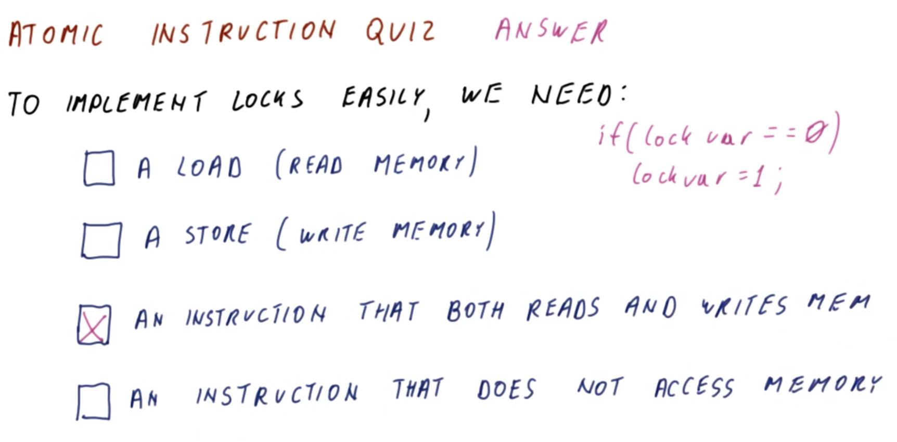
</center>

To implement atomic instructions for locks relatively easily (i.e., without otherwise resorting to complicated algorithms), which of the following properties is necessary? (Select the correct option.)
  * A load instruction (read memory)
    * `INCORRECT`
  * A store instruction (write memory)
    * `INCORRECT`
  * An instruction that *both* reads *and* writes memory
      * `CORRECT`
  * An instruction that does not access memory at all
    * `INCORRECT`

***Explanation***:

Recall (cf. Section 6) that an instruction of the following general form must be performed:

```c
if (lock_var == 0) {
  lock_var = 1;
}
```

This entails both a read (i.e., `lock_var == 0`) and a write (i.e., `lock_var = 1`).

## 8-13. Atomic Instructions

### 8. Introduction: Part 1

<center>
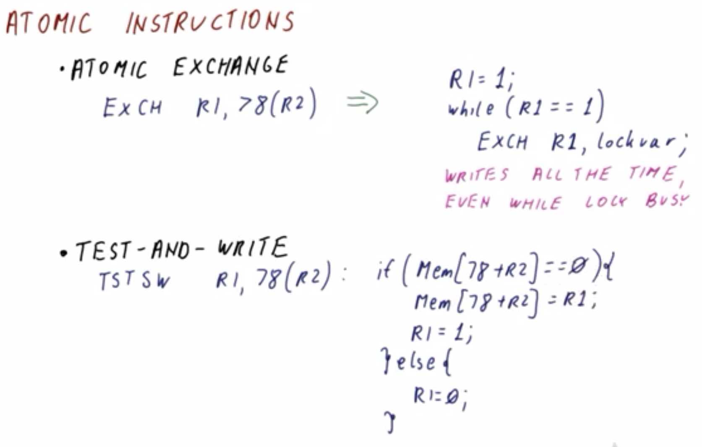
</center>

Recall (cf. Section 7) that in order to implement atomic instructions, *both* read *and* write operations are necessary. There are three main ***types*** of such atomic instructions accordingly.

The first such atomic instruction is an **atomic exchange** instruction, which perform the following transformation:

(*instruction*)
```mips
EXCH R1, 78(R2)
```

(*transformation*)
```c
R1 = 1;
while (R1 == 1)
  EXCH R1, lock_var;
```

The instruction `EXCH` resembles a load (`LW`) or store (`SW`) instruction, however, it essentially performs both simultaneously.

In the transformed version, the value stored in `R1` is managed (i.e., exchanged) via `lock_var`. In this manner, looping persists until `R1` succeeds in obtaining the value `0`, which in turn atomically sets the variable `lock_var` to `1` accordingly (i.e., thereby acquiring the lock and precluding other threads from doing so at this point as well).

A key ***drawback*** of this atomic exchange instruction is that it writes ***persistently*** to the memory location, even while the lock is ***busy*** (i.e., locked by another thread).

The second type of atomic instruction is a ***family*** of instructions which are generally classified as **test-and-write**.
  * First, the location is ***tested***, and then if it satisfies some ***conditions***, then (and only then) ***writing*** occurs.

For example, consider a representative instruction `TSTSW` (i.e., test-and-store word), as follows:

(*instruction*)
```mips
TSTSW R1, 78(R2)
```

(*transformation*)
```c
if (Mem[78 + R2] == 0) {
  Mem[78 + R2] = R1;
  R1 = 1;
} else {
  R1 = 0;
}
```

The idea here is to test whether the lock is free (i.e., via condition `Mem[78 + R2] == 0`), and if so, then write a value `1` to the lock; otherwise, if not, then simply proceed as usual (i.e., without otherwise attempting to access the lock).

### 9. Test-and-Set Quiz and Answers

<center>
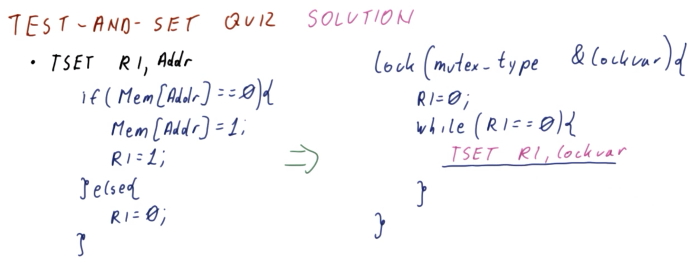
</center>

Consider a test-and-set atomic instruction of the general form `TSET R1, Addr`, defined equivalently as follows:

```c
if (Mem[Addr] == 0) {
  Mem[Addr] = R1;
  R1 = 1;
} else {
  R1 = 0;
}
```

***N.B.*** `Addr` is a memory address (typically in the form of a register and its corresponding offset).

For the corresponding implementation for function `lock()`:

```cpp
lock(mutex_type &lock_var) {
  R1 = 0;
  while (R1 == 0) {
    // TODO: Specify instruction here
  }
}
```

How can this atomic instruction be used here accordingly?

***Answer and Explanation***:

```cpp
lock(mutex_type &lock_var) {
  R1 = 0;
  while (R1 == 0) {
    TSET R1, lock_var; // Answer
  }
}
```

Here, `TSET R1, lock_var` checks the status of `lock_var`, and will only perform action if the value of `lock_var` is currently `0`, otherwise it will simply "fall through" on read of value `1`.

### 10. Atomic Instructions Part 2

<center>
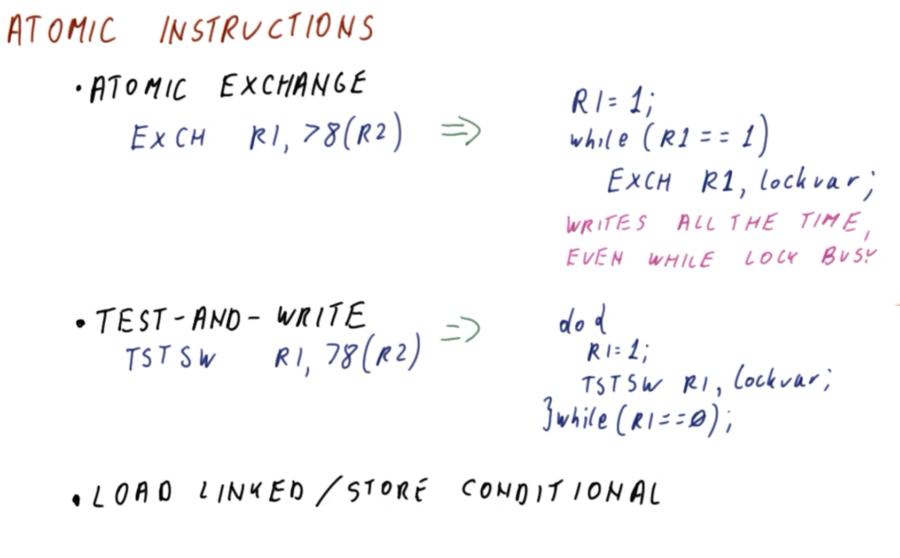
</center>

Returning to the topic of atomic instructions (cf. Section 8), with respect to test-and-store atomic instruction, a representative instruction `TSTSW` (i.e., test-and-store word) can be implemented as follows:

(*instruction*)
```mips
TSTSW R1, 78(R2)
```

(*transformation*)
```c
do {
  R1 = 1;
  TSTSW R1, lock_var;
} while (R1 == 0)
```

***N.B.*** This is an alternate implementation to that shown in Section 8.

Given instruction `TESTSW`, as long as the lock is occupied, then as long as the store "sub-operation" is only ***reading*** the lock variable, then it is not otherwise ***writing*** to it.
  * With respect to coherence (cf. Lesson 19), this is ***desirable***, as this prevents superfluous broadcasts of write invalidations across the respective threads' copies of the data. Instead, the "waiting" threads simply "share" the lock variable, iterating on their respective cached copies of the data at this point.
  * Subsequently on freeing of the lock, these shared copies are consequently ***invalidated*** via write to the lock variable using corresponding `unlock()`, at which point the update is broadcasted to the other threads.
  * Therefore, cross-thread communication with respect to the lock occurs only on acquisition.

This test-and-write approach solves the problem of continuously writing to the lock variable, however, it still involves the otherwise "strange" instruction `TSTSW` (and similar), i.e., an instruction which is neither a "pure load" nor a "pure store."
  * From a processor design standpoint, it would be more ideal to perform an operation that is more similar to correspondingly "pure" load and store operations, but providing the corresponding atomic functionality.

To address this particular issue, there is a third type of atomic instruction, comprising a pair called **load linked / store conditional (LL/SC)** (as discussed in the next section).

### 11. Load Linked (LL) / Store Conditional (SC)

<center>
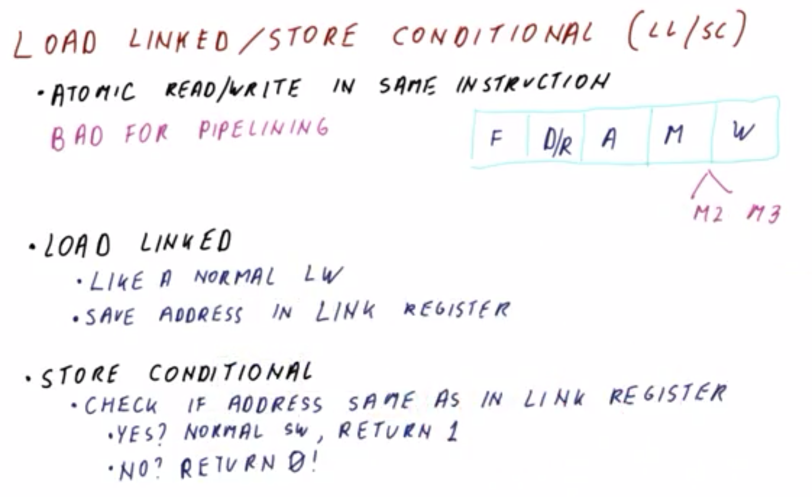
</center>

Atomic read and atomic write operations in the ***same*** instruction (even if the atomic write only occurs on detection of appropriate condition via atomic read) is very ***bad*** for pipelining insofar as processor design is concerned.

Consider a classical five-stage pipeline (as in the figure shown above).
  * A load instruction is fetched (F), decoded/read (D/R), has its address computed (A), is accessed via this computed address from memory (M), and then finally written to the register (W).
  * Given an atomic read/write operation, on reaching stage M, it cannot perform all necessary tasks in only ***one*** memory access operation (i.e., reading or writing are mutually exclusive in any given cycle at this point in the pipeline, without otherwise complicating the stage M). Therefore, just for this special case of an atomic read/write operation, the stage M would have to be expanded to a two- or three-stage (or more) memory stage (and correspondingly increasing the size of the pipeline accordingly) in order to perform appropriate checks immediately prior to writing to memory.
    * ***N.B.*** Such an expanded pipeline would impact ***all*** other instructions, not just these particular atomic read/write operations!

Consequently, the paired atomic instructions **load linked (LL)** and **store conditional (SC)** resolve this issue accordingly by splitting these atomic operations into two distinct instructions.
  * **Load linked (LL)** implements the "read" atomic operation
    * Load linked (LL) behaves as a "normal load" instruction (i.e., `LW`), simply reading from a memory location and placing the corresponding value into the target register
    * However, load linked (LL) additionally ***saves*** the address from which it loaded into a special **link register**
  * **Store conditional (SC)** implements the "write" atomic operation
    * Store conditional (SC) first checks if the address that it computes is present in the link register
      * If the address ***is*** present in the link register, then store conditional (SC) performs a "normal store" instruction (i.e., `SW`) to the memory location in question, and consequently returns the value `1` in its register
      * Conversely, if the address is ***not*** present in the link register, then store conditional (SC) simply returns the value `0` in its register (without otherwise storing a value)

Collectively, these instruction pairs effectively form a "single/composite" atomic operation via the link register.

### 12. How is Load Linked (LL) / Store Conditional (SC) Atomic?

<center>
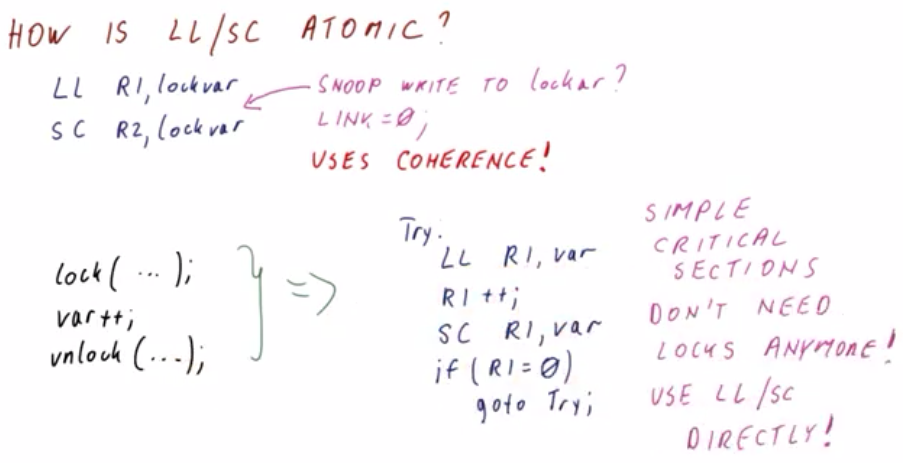
</center>

So, then, how exactly do load linked (LL) and store conditional (SC) behave in an ***atomic*** manner, such that intermediate writes from other processors/cores do not otherwise interfere with this paired operation?

To achieve this atomicity, the instruction pairs are used as follows:

```mips
LL R1, lock_var
SC R2, lock_var
```

If load linked (LL) detects the variable `lock_var` in the appropriate state (i.e., `1`), then the subsequent store conditional (SC) should only succeed if the lock is still available at the point of execution, otherwise, if the lock has already been written to, then store conditional (SC) should fail.

In order to ensure this desired behavior, the key to accomplish this is to ***snoop*** the writes to `lock_var` and to set the link register to value `0` if the lock is already acquired accordingly. Consequently, matching of the addresses by store conditional (i.e., `R2` and `lock_var`) will fail.\
  * Therefore, there is a reliance on ***cache coherence*** (cf. Lesson 19) to accomplish synchronization in this manner.

Note that both load linked (LL) and store conditional (SC) are both individually atomic operations. Therefore, it is not necessary to use a "sub-lock" to further ensure atomicity with respect to either of these instructions.

Correspondingly, observe the following transformation:

(*instruction*)
```c
lock(...);
var++;
unlock(...);
```

(*transformation*)
```c
Try:
  LL R1, var;
  R1++;
  SC R1, var;
  if (R1 == 0)
    goto Try;
```

If multiple threads perform these operations, they will simply "compete" for `R1` in this manner, with the first to reach `R1` "succeeding," and the other threads consequently "failing" the condition `R1 == 0`.
  * ***N.B.*** This specific example increments `var` atomically, however, the same general principle/construct applies for other critical-section instructions performed in this manner as well.

Therefore, load linked / store conditional give rise to relatively ***simple/direct*** implementation of a critical section with corresponding atomic operations accordingly, otherwise ***obviating*** the need for locks in the transformed implementation (but rather using these atomic instructions load linked and stored conditional ***directly*** on the variable in question itself [i.e., `var`]).
  * ***N.B.*** For more complicated critical sections, such as those accessing multiple variables simultaneously, this does not work as well, however.

### 13. Load Linked (LC) / Store Conditional (SC) Quiz and Answers
