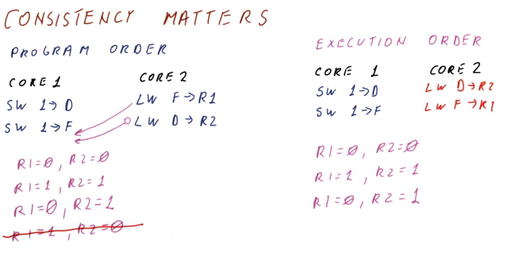
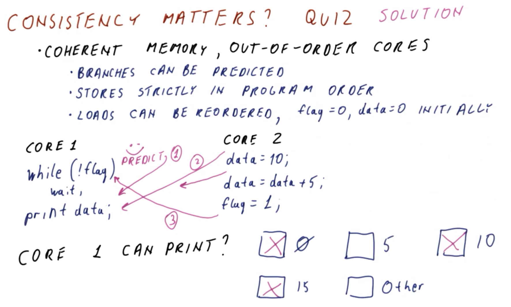
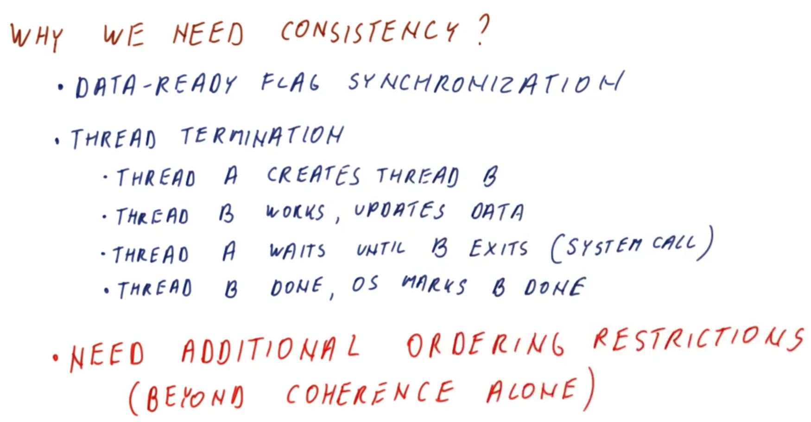
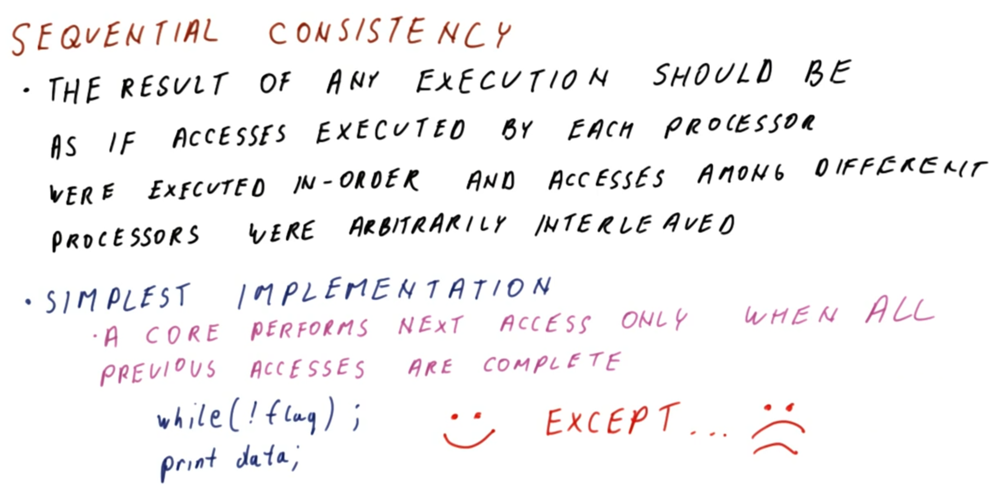
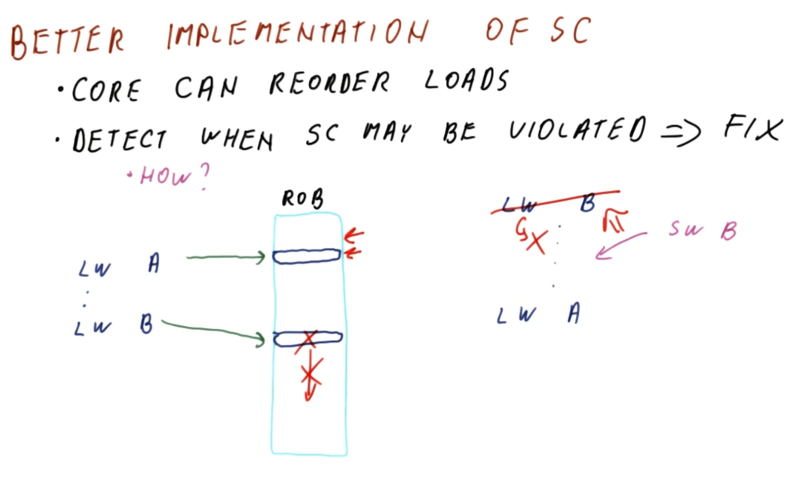
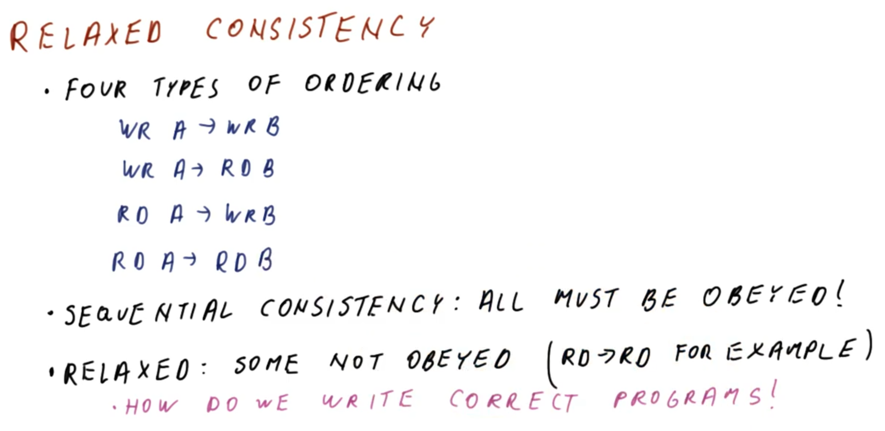
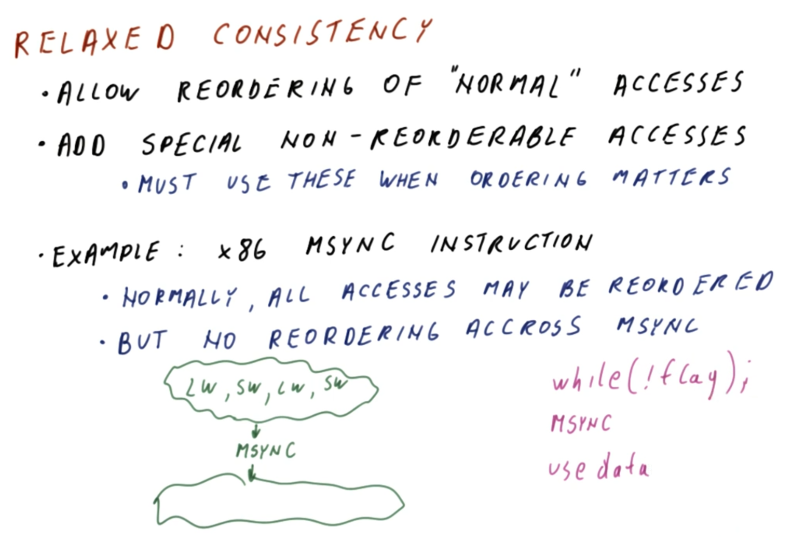

# Consistency

## 1. Lesson Introduction

This lesson will discuss **memory consistency**, which determines how strictly to order among accesses to different memory locations. This is necessary in order to achieve expected behavior from synchronization-based accesses in a shared-memory program.

## 2. Memory Consistency

<center>

</center>

Consider **memory consistency**, and how it differs from cache coherence (cf. Lesson 19).

Recall (cf. Lesson 19) that **coherence** defines the order of accesses (i.e., as observed by different threads) to the ***same*** address.
  * Coherence is needed in order to share this data accordingly; otherwise, a thread is able to modify the memory location without regard for the other threads.
  * Furthermore, an ***important consideration*** regarding coherence is that while it defines ordering with respect to the ***same*** address, it does ***not*** otherwise specify behavior pertaining to accesses to ***different*** memory location/address.

Therefore, **memory consistency** addresses this latter consideration, i.e., defining the order of accesses to ***different*** addresses.

However, this begs the question: Is order of accesses even significant with respect to *different* addresses in the first place? After all, if a given write is broadcasted to the other threads (i.e., via coherence), and this is performed for every address, then is memory consistency *still* necessary?

These questions are explored further in the remainder of this lesson accordingly.

## 3. Consistency Matters

As it turns out, consistency ***is*** indeed important.

<center>

</center>

To understand this, consider two cores performing tasks in ***program order*** (as in the figure shown above), as per the following sequence (where memory locations `D` and `F` are both initialized to `0`):

| Sequence | Core `1` | Core `2` |
|:--:|:--:|:--:|
| `S1` | `SW 1 → D` | `LW F → R1` |
| `S2` | `SW 1 → F` | `LW D → R2` |

***N.B.*** Recall (cf. Lesson 9) that an out-of-order (uni-)processor in general can reorder load and store instructions. In fact, this is also mostly permissible in a multi-core processor as well (however, for simplicity, reordering of one core's instructions will be done here for sake of demonstration, and otherwise without a loss of generality).

Now, consider that in ***execution order***, core `2` can reorder its load operations, as follows:

| Sequence | Core `1` | Core `2` |
|:--:|:--:|:--:|
| `S1′` | `SW 1 → D` | `LW D → R2` |
| `S2′` | `SW 1 → F` | `LW F → R1` |

Consequently to this reordering, consider the possible resulting values upon execution of these instructions in this manner.

In ***program order***, the load instructions in core `2` may occur before the store instructions in core `1`. In this case, the resulting values will be `R1 == 0` and `R2 == 0`.

Similarly, in ***execution order***, the load instructions in core `2` may occur before the store instructions in core `1`. In this case, the resulting values will be `R1 == 0` and `R2 == 0`.

Now consider these and other scenarios as follows (where prime [`′`] distinguishes execution order from non-prime program order):

| Scenario | `R1` | `R2` | `R1′` | `R2′` |
|:--:|:--:|:--:|:--:|:--:|
| Core `2` performs loads before Core `1` performs stores | `0` | `0` | `0` | `0` |
| Core `1` performs stores before Core `1` performs loads | `1` | `1` | `1` | `1` |
| Core `2` performs loads in between Core `1`'s stores | `0` | `1` | `0` | `1` |

Consider now: Is it possible to perform these instructions in such a way to yield `R1 == 1` and `R2 == 0`?

In ***program order***, this outcome is ***not*** possible. This would require the loads in core `2` to occur after the second store in core `1`, however, this would necessarily require both loads to occur at this point, resulting in `R1 == 1` and `R2 == 1`.


<center>

</center>

Conversely, in ***execution order***, this scenario ***can*** occur, if the loads in Core `2` "flank" the stores in Core `1` (as in the figure shown above), giving rise to an "anomalous" execution relative to (expected) program order. Furthermore, note that this does ***not*** violate coherence at all.

However, this is a rather obscure edge case; do we ***really*** care about this ordering "problem"?

## 4. Consistency Matters Quiz and Answers

<center>

</center>

Consider a two-core processor with a coherent memory and out-of-order processing. Furthermore, its constituent operations are characterized as follows:
  * Branches can be predicted correctly (i.e., verified taken vs. not taken on subsequent *actual* execution)
  * Stores are performed ***strictly*** in program order (i.e., no reordering of these operations is performed)
  * Loads can be ***reordered***

Furthermore, the cores simultaneously perform the following programs:

(Core `1`)
```c
while (!flag)
  wait();
print(data);
```

(Core `2`)
```c
data = 10;
data = data + 5;
flag = 1;
```

***N.B.*** For this system, initial values are `flag = 0` and `data = 0` (i.e., immediately prior to access/modification by the cores).

Given this system and corresponding programs, what is/are the subsequent value(s) that can be printed by core `1`? (Select all that apply.)
  * `0`
    * `APPLIES`
  * `5`
    * `DOES NOT APPLY`
  * `10`
    * `APPLIES`
  * `15`
    * `APPLIES`
  * Other
    * `DOES NOT APPLY`

***Explanation***:

From the programmer's perspective, the expected behavior is such that while core `1` waits, core `2` performs the associated data operations, and then finally core `1` prints the net result. From this perspective, the expected output would therefore be `15`; per execution order, this is also indeed ***a*** possible execution path as well (e.g., if core `2` happens to execute its instructions prior to core `1` concluding its check of `flag`, for example).

However, given the out-of-order execution capability of this system, other possible outputs can also result.

Note that in the following section of core `1`'s program:

```c
while (!flag)
  wait();
```

core `1` is waiting while `flag` has value `0`. Furthermore, during this time, core `1` is testing for `0` and branching based on this test; the processor in turn can easily predict this branching in such a manner whereby a "premature exit" of the `while` condition ***can*** occur, prior to actually checking the value of `flag`.

Consequently, if such a "premature exit" occurs, then `data` may have the following values, depending on the particular circumstances of the run-time execution:
  * `data` is read before core `2` commences execution, and consequently core `1` reads the value `0`. Furthermore, due to out-of-order processing, the updated value of `flag` set to `1` by core `2` is subsequently detected by core `1` (i.e., subsequently to exiting the `while` loop), thereby validating a "correct prediction" in core `1` accordingly.
  * Generalizing this, a similar occurrence results if the "premature exit" in core `1` occurs subsequently to execution of statement `data = 10;` by core `2`, resulting in a "detected" value of `10` by core `1` at point of exit from the `while` loop (i.e., due to out-of-order accessing).
  * Similarly, `data` can be detected by core `1` immediately following execution of statement `data = data + 5;` by core `2`, however, in this particular case, this simply yields the aforementioned "expected"/"in-program-order" result `15`.

***N.B.*** Results `5` or "something else" cannot occur in this system, because the writes on core `2` (i.e., stores) will occur ***strictly*** in program order (e.g., `data = data + 5;` will not execute with value `0` for `data` on the right-hand side, as program ordering will enforce execution of statement `data = 10;` prior to this).

Observe that despite using the `flag` to manage accesses, this mechanism was otherwise still "subverted" by out-of-order processing (and furthermore coherence did not manage to prevent this, either). Therefore, consistency ***is*** indeed required to resolve this issue, as discussed next.

## 5. Why Do We Need Consistency?

<center>

</center>

So, then, why do we need consistency?
  * Recall (cf. Section 4) that a mechanism beyond coherence is necessary to perform the equivalent of a "data is ready" flag, in order for the corresponding synchronization to work properly (i.e., in an out-of-order-processing, multi-core system)
  * It is additionally necessary in **thread termination**

With respect to thread termination, consider the following sequence:
  * Thread `A` creates thread `B`
  * Thread `B` performs work, then updates `data`
  * Thread `A` waits until thread `B` exits
    * This occurs via ***system call*** initiated by thread `A`, thereby notifying the system to "wait" for thread `B` to be "completed" accordingly
  * Thread `B` terminates, with the operating system marking thread `B` as "completed"

In this corresponding operating-system-managed coordination among the threads (i.e., via system calls), the constituent system calls (e.g., checks for exiting) might be branch-predicted, however, this may be "improperly synchronized" with respect to the actual run-time behavior of the thread(s) in question.

Therefore, some ***additional ordering restrictions*** are necessary to resolve this, which extend beyond the capabilities of only coherence alone.

## 6-8. Sequential Consistency

### 6. Introduction

<center>

</center>

From the programmer's perspective, the most natural form of consistency is **sequential consistency**, whereby the result of ***any*** execution should be equivalent to as if accesses by each processor were executed ***in-order***, with corresponding accesses among ***different*** processors as if they were ***arbitrarily interleaved***.
  * In this manner, essentially the processors "take turns" with respect to accesses, or otherwise let another processor access "several times" (i.e., sequentially) prior to another processor accessing, and so on.
  * However, the consequent output from the system (i.e., among the various processors) must be ***exactly*** in program order.

The ***simplest implementation*** of sequential consistency comprises the one whereby the clause "should be equivalent to as if..." in the aforementioned definition is simply ***removed***.
  * Essentially, with this relaxed constraint, any execution proceeds by executing accesses from each processor strictly in order.
  * More specifically, a given core performs the next access ***only*** when ***all*** previous accesses have been completed.

Recalling the previous example (cf. Section 4):

```c
while (!flag);
print(data);
```

in the corresponding "simple implementation," `print(data);` cannot commence execution until `while (!flag);` has completed.
  * ***N.B.*** Recall (cf. Section 4) that the fundamental issue introduced here by an ***absence*** of consistency is that branch prediction can otherwise "subvert" the otherwise expected "in-program-order" execution. Therefore, in a simple implementation of sequential consistency, any such "premature exit" from the `while` loop would be deliberately delayed, in order to prevent this possibility.

This "simple implementation" works ***well*** with respect to ***program correctness***, however, it is ***poor*** with respect to ***performance***.

### 7. Simple Implementation of Sequential Consistency Quiz and Answers

<center>

</center>

To better understand the drawbacks of the "simple implementation" of sequential consistency (cf. Section 6), consider the following question.
  * ***N.B.*** Recall (cf. Section 6) that the "simple implementation" consists of issuing the next access from a given core ***strictly after*** all prior accesses (i.e., across all cores) have been completed.

Given a system comprised of multiple, out-of-order-executing cores, what is the multi-level parallelism achieved with respect to each core?
  * `1`

***Explanation***:

Recall (cf. Lesson 14) that multi-level parallelism involves a load operation (i.e., `LW`) generating a cache miss and consequent request to main memory. Subsequently, the processor continues to encounter otherwise independent instructions, and on encountering another load operation (which is also a cache miss), also sends a consequent request to main memory, with the former request hopefully having been serviced/resolved by main memory by the point of the latter cache miss.
  * ***N.B.*** This strict ordering of load operations is necessary in the "simple implementation" of sequential consistency.

However, proceeding in this manner, with a multi-level parallelism of `1`, these successive cache misses (occurring intermediately within the flow of other instructions' execution) effectively yield a net execution of the equivalent program flow without the cache misses, and the corresponding access-time overhead added to this.

Conversely, with a better-optimized multi-level parallelism, these cache misses are ideally parallelized, such that they are relatively "less blocking" to the overall execution of the program (and correspondingly reducing, or ideally eliminating, this added access-time overhead). This correspondingly better amortizes the cost penalty incurred by each sequential cache miss.

### 8. Better Implementation of Sequential Consistency

<center>

</center>

Consider now a ***better*** implementation of sequential consistency (as in the figure shown above).

In this system, a core ***is*** permitted to reorder load operations, however, because this can consequently lead to violations of sequential consistency, the system must also correspondingly ***detect*** scenarios accordingly whereby sequential consistency may be violated (and provide the corresponding ***resolution*** if such scenarios do occur during program execution).

So, then, *how* exactly is this accomplished?

Consider a program (as in the figure shown above), whereby load operation `LW A` occurs, which is subsequently followed by load operation `LW B`. These load operations must occur in program order in order to prevent violation of sequential consistency, however, to improve performance, it is desirable to execute them out-of-order otherwise (i.e., if there is no potential for a sequential consistency violation).

Consider the **reorder buffer (ROB)** in the context of this program.
  * The reorder buffer (ROB) maintains the instructions in program order (i.e., `LW B` is "known" to "strictly follow" `LW A`). Therefore, if the accesses occur in this order (denoted by green and blue in the figure shown above), then there is no potential violation of sequential consistency accordingly.

Conversely, a violation of sequential consistency will occur if this "strict ordering" is not performed (i.e., if execution of `LW B` precedes execution of `LW A` during program execution).
  * Note that this scenario is not ***strictly*** a violation of sequential consistency: If no core writes to `A` or `B` during the execution of these instructions, then the values of `A` and `B` will be the ***same*** as if the program were actually executed in program order.
  * Conversely, if at least one write operation (e.g., `SW B`) occurs in the intervening time between these load operations, then a violation of sequential consistency has occurred (denoted by magenta in the figure shown above). The reason for this is because this will consequently update the value for `B` prior to completion of operation `LW A`.

Therefore, in order to prevent violation of sequential consistency in the latter case, it is simply necessary to ***detect*** such intermediate write operations (i.e., `SW`s) accordingly.
  * When read operations (i.e., `LW`s) are performed "ahead" of program order, then it is necessary to commence ***monitoring*** coherence traffic produced by other cores at this point.
  * Consequently, if such a write operation (i.e., `SW`) is detected (denoted by red in the figure shown above), then any "upstream" read operations (i.e., `LW`s) prior to this point of write operation(s) must be "replayed" (and also fed back to and downstream instructions depending on its value) accordingly.
    * ***N.B.*** Such an "upstream" read operation (e.g., `LW A`) *is* indeed "replayable" in this manner, because it is already present in the reorder buffer (ROB) accordingly, with the subsequent downstream load (i.e., `LW B`) having "not yet occurred" by this point. Correspondingly, the **commit point** (as denoted by red arrow in the figure shown above) is located "relatively upstream" to this, and can be simply "rolled back" accordingly as necessary. In the worst case, the downstream operation (i.e., `LW B`) can be simply "canceled" (denoted by red `X` in the figure shown above) and re-executed (along with its downstream-dependent instructions, denoted by red arrow in the figure shown above) accordingly.

## 9-11. Relaxed Consistency

## 9-10. Introduction

<center>

</center>

As an alternative approach to "improving" sequential consistency (i.e., the "naturally expected" behavior by programmers) is to simply ***relax*** the constraint of consistency itself (i.e., invalidate the assumption of the programmer that the program itself *is* indeed sequentially consistent).

In these corresponding **relaxed consistency** models, they typically differ/vary according to what types of ***orderings*** they enforce. In this regard, there are four distinct ***types*** of ordering, as follows:
  * `WR A` → `WR B`
  * `WR A` → `RD B`
  * `RD A` → `WR B`
  * `RD A` → `RD B`

In ***sequential*** consistency, the implication is that ***all*** four types of orderings shown here are obeyed ***strictly*** at all times (otherwise, any incidental reordering requires corresponding mitigation/intervention accordingly).

Conversely, in ***relaxed*** consistency models, some of these types of ordering need not be obeyed at all times.
  * Typically, `RD A` → `RD B` (i.e., successive read operations) is the most commonly "relaxed" constraint in these types of models.

So, then, how are ***correct*** programs written in such a ***relaxed*** system?

#### `MSYNC`

<center>

</center>

When relaxed consistency is used, it is permissible to reorder "normal" accesses. However, there are additionally ***special non-reorderable accesses** added to the system, which must be used explicitly by the programmer whenever instructions ordering in program orders is significant (i.e., required for an otherwise semantically correct program).

An example of such a non-reorderable access is the x86 instruction `MSYNC` (as in the figure shown above).
  * In normal execution, all accesses are reorderable (i.e., it is not otherwise fair to assume "in-order" behavior of the program insofar as consistency is concerned).
  * Conversely, ***no*** reordering is permissible across an `MSYNC` instruction.

For example, consider a series of memory accesses occurring in an executing program (e.g., `LW`, `SW`, `LW`, `SW`, etc., as in the figure shown above). On reaching the instruction `MSYNC`, the processor now ***guarantees*** that the corresponding upstream memory-access instructions will conclude prior to completing instruction `MSYNC`, which in turn will "bottleneck" subsequent execution until `MSYNC` itself completes execution (at which point, out-of-order instructions, including memory accesses, can commence execution as normally).

So, then, what is the added value of `MSYNC`? In the aforementioned example program (cf. Section 4), this can now be executed correctly as follows:

```c
while (!flag);
MSYNC;
// use `data` here
```

Here, `MSYNC` ensures that condition `!flag` "truly" reaches value `0` before proceeding further in the program. Otherwise, subsequent use of `data` is still amenable to performance optimizations by the processor (e.g., instructions reordering)

## 11. `MSYNC` Quiz and Answers

