# Many Cores

## 1. Lesson Introduction

This final lesson will discuss what occurs when ***a lot*** of cores are placed on the ***same*** chip. This will correspondingly integrate many concepts already discussed in the previous lessons.

## 2-4. Many-Cores Challenges: Part 1

### 2. Introduction

<center>
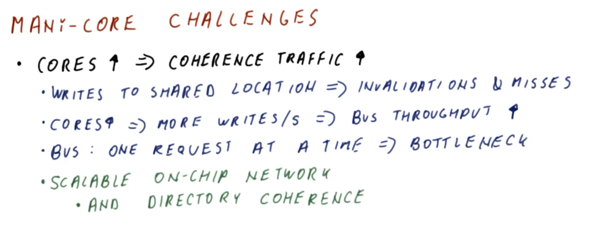
</center>

This lesson will discuss several ***challenges*** which are present in a **many-cores processor**, including:
  * As the number of cores increases, the ***coherence traffic*** increases accordingly
    * This is a direct consequence of that fact (cf. Lesson 19) that writes to shared-memory locations result in invalidations and consequent cache misses with respect to this locations. Consequently, both the invalidations and the cache misses propagate through the shared bus, thereby increasing coherence traffic accordingly.
  * As the number of cores increases, the number of writes per-unit time increases, and consequently the required ***bus throughput*** increases accordingly in order to scale concomitantly with this increased amount of writing activity (until the bus's throughput is eventually exceeded)
    * The bus eventually forms a ***bottleneck*** regardless, because it only allows one request at a time. This is partly necessary because the system relies on the bus to enforce ordering among writes, thereby maintaining coherence accordingly.
    * Therefore, to resolve this issue, a **scalable on-chip network** is required, which allows the traffic to grow proportionally to the number of cores (without otherwise bottlenecking). Furthermore, **directory coherence** (cf. Lesson 19) is also required for this resolution measure, in order to obviate the dependency on the bus itself.

### 3. Network on a Chip

<center>
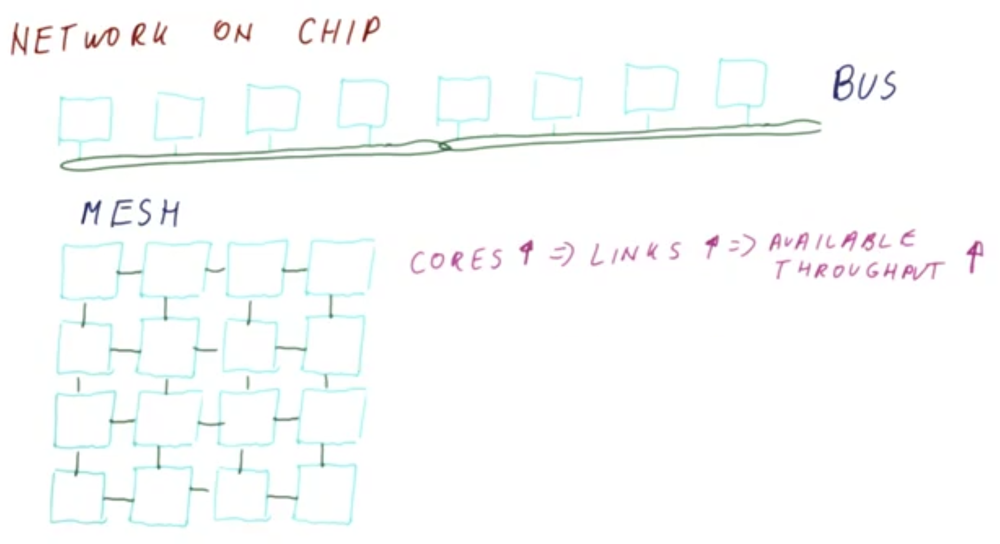
</center>

Consider now what such a "network on a chip" would look like (as in the figure shown above).

Let a "tile" (denoted by teal square in the figure shown above) represent a core and its corresponding level 1 (L1) cache. Conventionally, each such "tile" is connected to a shared bus (denoted by green in the figure shown above).

In such an eight-tile configuration, assume that the first set of four tiles use half of the available throughput of the shared bus (i.e., cache misses and coherence are managed via the bus accordingly), and similarly the other set of four tiles replicates this configuration exactly, using the other half of the available shared-bus throughput accordingly.
  * With this "compositely shared" bus, ***all*** of the corresponding eight-core traffic passes through the bus, resulting in a relatively slower bus with lower throughput (i.e., as compared to each individual four-tile unit) due to the increased traffic.
  * Therefore, the bus quickly becomes ***saturated*** in this manner as the quantity of tiles increases.

Conversely, consider an alternate network topology called a **mesh** (as in the figure shown above), whereby the tiles are individually interconnected.
  * While there is no longer an equivalent "bus-wide broadcast," there is still the capability present whereby tiles can intercommunicate in this manner. Communication can also pass across tiles in this manner, and independently across such "paths."
  * Correspondingly, the ***overall throughput*** is larger than that of any individual link. Furthermore, since these links are relatively short, this further amplifies the overall throughput of the system as a whole.

Correspondingly, in such a mesh comprised of `16` cores (as in the figure shown above), there are many such (independent) links present; furthermore, this scaling increases with the number of cores (i.e., as the number of cores increases, so does the number of links between them), thereby ***increasing*** available throughput accordingly.
  * Consequently, this topology scales much better with increasing cores than an equivalent single shared-bus configuration.

<center>
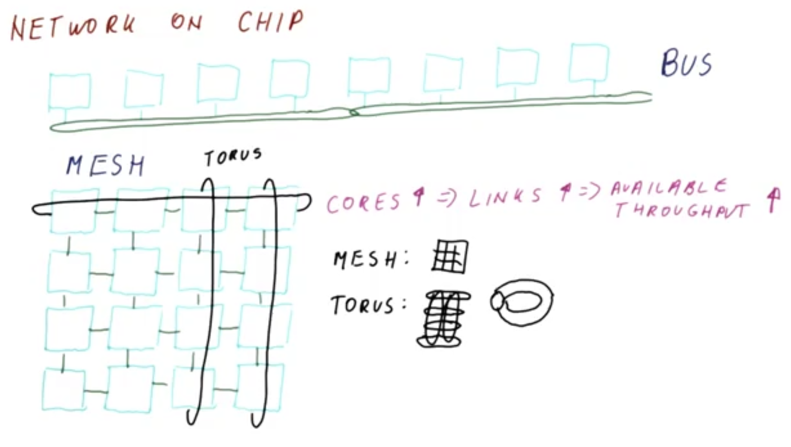
</center>

Note that there are many such **point-to-point networks** available in addition to the aforementioned mesh (as in the figure shown above).
  * The **mesh** is particularly amenable to building chips (i.e., printing on silicon), because none of the links intersect one another.
  * The **torus** uses such "three-dimensional"/"cross-over" linking, whereby "terminal tiles" are also interconnected.
  * The **flattened butterfly** is another more advanced network topology.

 ***N.B.*** Consult an advanced architectures course for more discussion on these point-to-point networks and other related "network on a chip" topologies.

### 4. Mesh vs. Bus Throughput Quiz

<center>
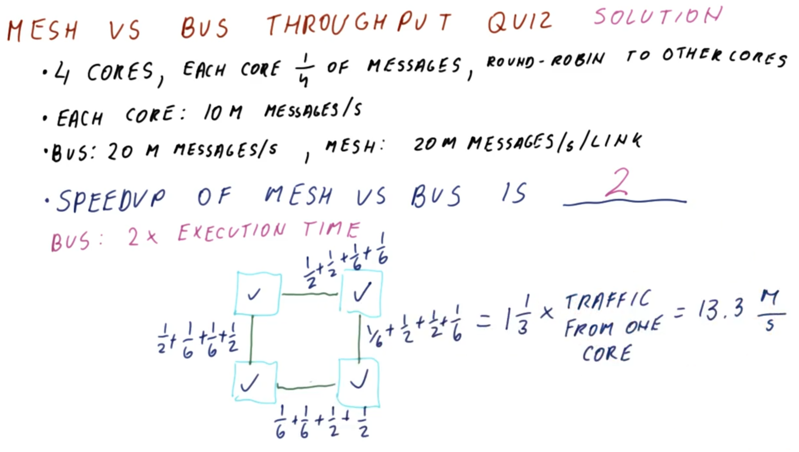
</center>

Consider a four-core system, whereby traffic is uniformly distributed (i.e., each core handles a quarter of the overall messages in the system), with each message from a given core being sent to other three cores in a round-robin manner. Furthermore, assume that this message processing is randomly distributed (i.e., there is no inherent synchronicity among these accesses, but rather the traffic sent from each core propagates to the other three cores "straightforwardly").

Each core sends messages at a rate of `10M (million)` messages per second. Furthermore, the maximum throughput of the bus is `20M` messages per second, whereas the equivalent mesh supports a maximum throughput of `20M` messages per second ***per link***.
  * ***N.B.*** If the bus bandwidth is saturated by the four cores, they simply decreased throughput proportionally accordingly in this case (i.e., to match the bandwidth of the bus).

What is the corresponding speedup of the mesh vs. the bus?
  * `2`

***Explanation***:

Ideally, the four-core system should achieve an overall throughput of `40M` messages per second, with each core processing `10M` messages per second.

By inspection, the overall throughput of the ***bus*** is `20M` messages per second, operating at the saturation limit in this manner.
  * With each core having a maximum throughput of `10M` messages per second, due to the saturation limit, it must halve this to `5M` messages per second due to the saturation-limit constraint.

As for the ***mesh***, to determine the overall throughput, it must first be determined whether the network (as specified) gets saturated. This can be done by examining each individual core in turn, and then aggregating the "overall balance" accordingly (i.e., relative to the saturation limit of `20M` messages per second per link).

<center>
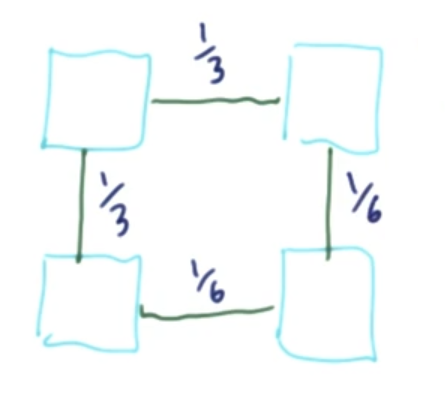
</center>

For a given core (e.g., the top-left, in the figure shown above), the throughput is split such that `1/3` (i.e., `3.33M` messages per second of the per-link total `10M` messages per second) goes to each adjacent core, and among those adjacent cores the remaining `1/3` of the bandwidth is split across the "downstream" links (i.e., `2 × (1/6)`).

<center>
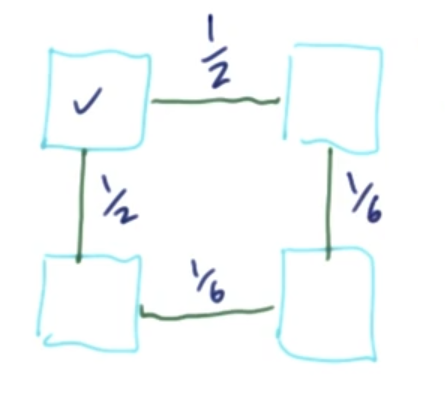
</center>

Therefore, the overall throughput of the top-left core (as in the figure shown above) is `1/3 + 1/6 = 1/2` to each adjacent core, and `1/6` apiece in the "downstream" links from those cores (i.e., the total "fractional throughput" balances out to `1` across the four links accordingly).

<center>
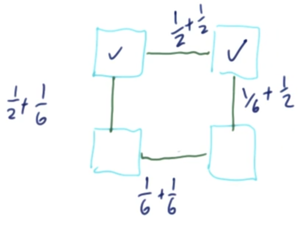
</center>

Examining the top-right core, by similar rationale, this adds `1/2` apiece to adjacent links, and `1/6` apiece to the "downstream" links.

<center>
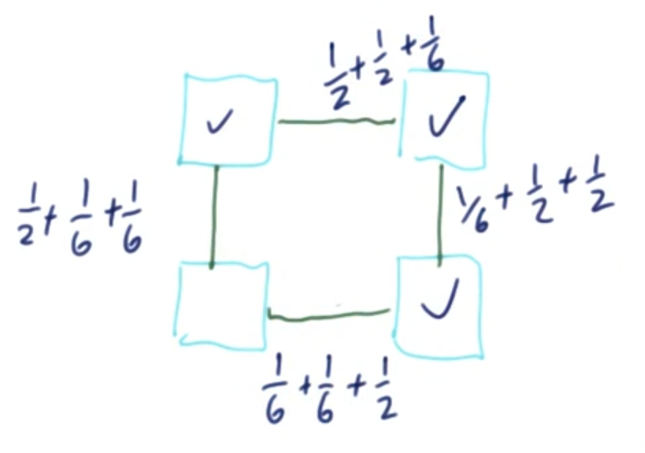
</center>

Examining the bottom-right core, by similar rationale, this adds `1/2` apiece to adjacent links, and `1/6` apiece to the "downstream" links.

<center>
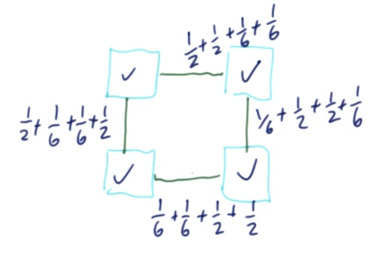
</center>

Finally, examining the bottom-left core, by similar rationale, this adds `1/2` apiece to adjacent links, and `1/6` apiece to the "downstream" links.

In this manner, each link distributes the overall bandwidth evenly, resulting in a total of `4/3` on a per-link basis, or equivalently `(4/3) × 10M = 13.3 M` messages per second per link. Observe that this is still below the saturation limit per link (cf. `20M` messages per second per link).

Therefore, the overall speed up is `2`.
  * The bus-based system effectively throttles the overall throughput by half due reaching to the saturation limit (i.e., requires achieving at least `40M` messages per second to exhibit a "parity" speedup of `1`, but saturates at `20M` messages per second), an effective "speedup" of `0.5`.
  * Conversely, the mesh network does not saturate, and is therefore able to achieve up to the full `20M` messages per second bandwidth across the system (i.e., only uses `13.3M` messages per second per link, as configured here, thereby allowing the individual cores to achieve the max per-core throughput of `10M` messages per second, relative to a "parity" speedup of `1`).

***N.B.*** If a larger network were used (i.e., beyond four cores), then the equivalent bus would further "slow down" relatively to this proportionally to this increase in the cores count, whereas the mesh will add proportionally more links to manage this increased overall bandwidth accordingly. In this manner, saturation is reached at a much larger quantity of cores.

## 5-7. Many-Cores Challenges: Part 2

### 5. Introduction

<center>
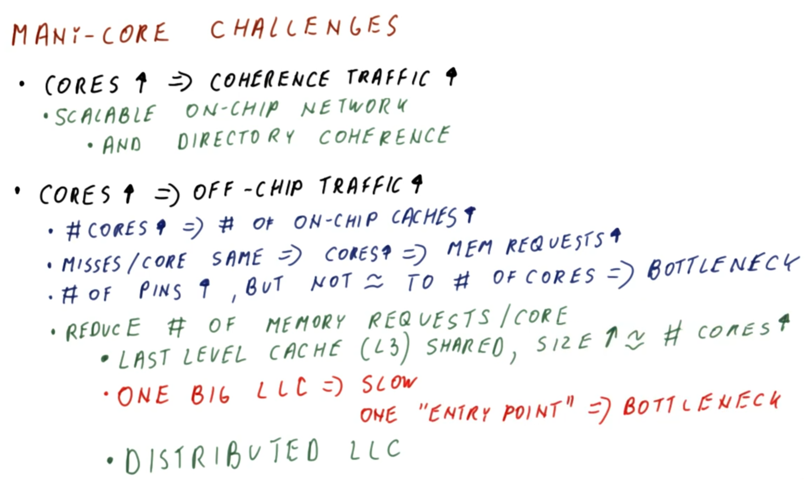
</center>

Returning to the challenges present in many-cores processors (cf. Section 2), recall (cf. Section 2) that as the number of cores increases, the coherence traffic on the chip correspondingly increases. Furthermore, recall (cf. Section 3) that resolving this issue requires a scalable on-chip network (e.g., mesh) supported by directory coherence (cf. Lesson 19).

Furthermore, another issue introduced by adding more cores to the system is that as the number of cores increases, so does the **off-chip traffic**.
  * To maintain adequate performance, as the number of cores increases, the number of **on-chip caches** must increase accordingly (e.g., a four-core processor requires four level 1 [L1] caches, and possibly a level 2 [L2] cache; a 64-core processor requires `64` level 1 [L1] caches and corresponding level 2 [`L2`] caches; and so on).
    * Accordingly, each core individually does not necessarily generate more cache misses, however, the overall number of cache misses is generally the same across the entire system (i.e., on a per-core basis), regardless of how many cores are present. Therefore, as the number of cores increases, so does the number of ***memory requests*** (i.e., resulting from proportionally more cache misses).
  * However, note that the number of **connecting pins** on the chip increases slowly relative to the number of cores as more cores are added (e.g., a doubling of cores may add 10% more pins, but nowhere close to 100%).
    * The pins themselves must be physically large enough to prevent breaking on connecting/reconnecting the chip to the motherboard, etc.
    * Therefore, the slight improvement in off-chip throughput is not proportional to the corresponding increase in demand for this throughput grows directly proportionally to the amount of cores added. Correspondingly, this **off-chip available throughput** therefore becomes ***bottlenecking*** accordingly.

In order to avoid saturating the off-chip available throughput, it is necessary to reduce the number of memory requests per core. This can be accomplished using a **last level cache (LLC)** (which in modern processors is typically a **level 3 [L3] cache**) which is ***shared*** (equally) among the cores, with the size of this last level cache (LLC) scaling roughly proportionally to the number of cores.

However, there are a couple of ***problems*** with having one such last level cache (LLC), as follows:
  * It is very slow
  * As a single cache, it only has ***one*** "entry point" for entering the requested address and receiving the corresponding data (i.e., from main memory)
    * Furthermore, this entry point will be located somewhere on the chip (comprised of a mesh or other advanced network topology) that may also become ***bottlenecking*** (i.e., not all links can achieve the same maximum per-link throughput), since these entry-point links will receive a disproportionate share of the traffic, even as the number of cores increases

To resolve these particular problems, rather than having "one" such last level cache (LLC), instead a **distributed last level cache (LLC)** is used.

### 6. Distributed Last Level Cache (LLC)

<center>
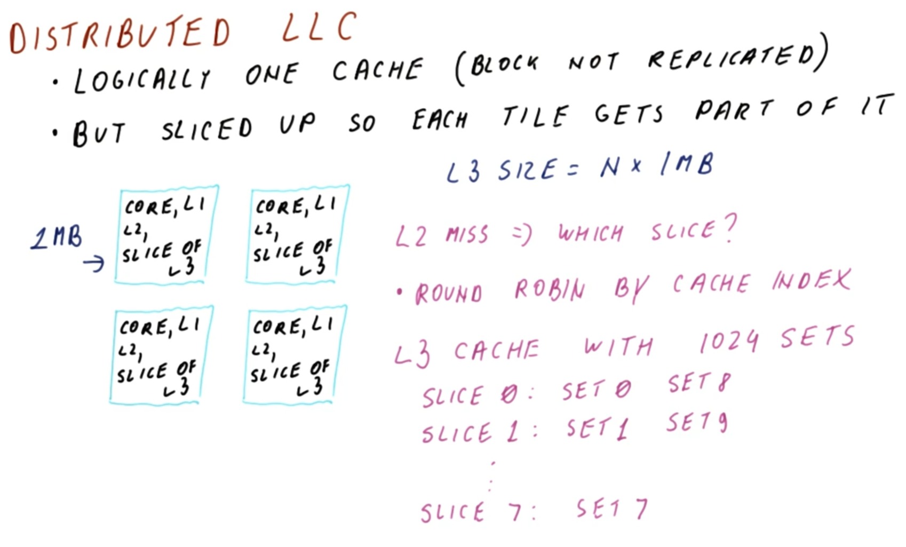
</center>

Logically, a **distributed last level cache (LLC)** is a "single" cache (in the sense that a data block will ***not*** be replicated in a manner akin to private, per-core caches).
  * Therefore, a `4 MB` cache that is "distributed" in this manner effectively uses all of this cache memory, rather than replicating redundant data across the private caches (thereby reducing the effective capacity accordingly.)

However, this distributed last level cache (LLC) is still "sliced up" (i.e., forming a "disjoint set"), such that each tile (i.e., core and associated local cache[s]) receives a fractional part of the overall cache capacity.

Therefore, in such a mesh network (as in the figure shown above), each tile contains the core, local caches (i.e., level 1 [L2] and level 2 [L2] caches), and a "slice" of the last level cache (i.e., level [L3] cache).
  * For example, if each such "slice" is `1 MB` in size, then the corresponding size of the distributed last level cache (LLC) is `N × 1 MB` (where here `N = 4`). Furthermore, note that this scales accordingly as the number of cores (i.e., `N`) increases.

A ***key advantage*** here is that while the overall capacity increases proportionally to the cores, there is ***no*** longer a single entry point, but rather ***each*** slice of the last level cache (LLC) has its ***own*** entry point. This in turn ***distributes*** the traffic among the caches, thereby avoiding strain on any particular link.

However, if a level 2 (L2) cache miss occurs in a particular core, how can it then be determined from which slice of the last level cache (LLC) to request the data?

One simple approach to this is to simply spread the cache in a **round robin** manner among the slices, using a corresponding **cache index**.
  * For example, given an eight-core processor with a level 3 (L3) cache having `1024` sets, the sets are distributed accordingly among the eight slices in question. Now, after the address is decomposed in order to access the cache, then given the appropriate set number and three least-significant bits of the slice, then the set in question can be located unambiguously.
  * Furthermore, note that as the number of cores increases, then the number of sets in the cache will grow proportionally to this, correspondingly using additional bits to uniquely identify/index these cache sets accordingly.

***N.B.*** If the data is accessed sequentially, then the sets are traversed in order in a given slice. However, given the distribution of the sets among the slices, this round-robin based "spreading" of the memory load is amenable to such a memory-access pattern.

<center>
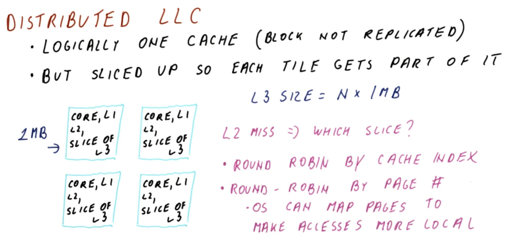
</center>

However, note that the spreading of the blocks in a round-robin manner across the chip may potentially disrupt ***locality***, because a given core is just as likely to access something in a core located at "opposite corner" of the chip as something in itself or in an adjacent core.

To mitigate this issue, another approach is to distribute the data in a round-robin manner with respect to ***page number*** instead. This way, all of the blocks belonging to the same page generally end up in the ***same*** slice of the last level cache (LLC) accordingly.
  * This in turn facilitates efficient program execution, because the operating system is otherwise capable of mapping pages in such a manner so as to make these last level cache (LLC) accesses more local (e.g., placing the pages pertaining to a given stack in the same core's slice).

### 7. Distributed Last Level Cache (LLC) Quiz and Answers

<center>
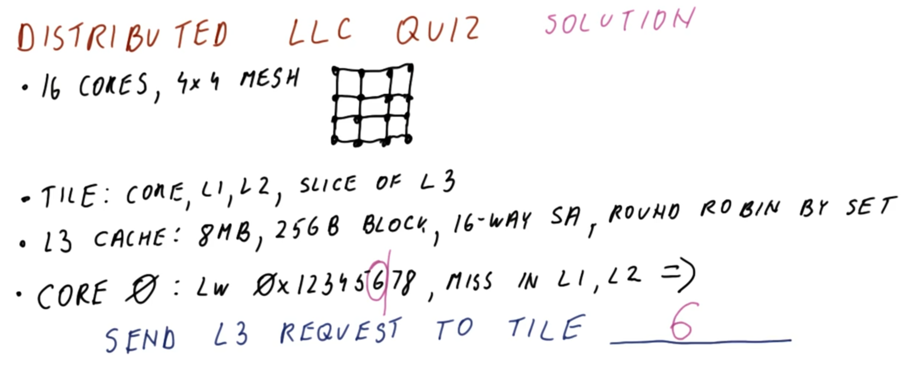
</center>

Consider a system comprised of `16` cores, organized as a `4×4` mesh (as in the figure shown above).
  * A single ***tile*** in this mesh is comprised of a core, level 1 (L1) and level 2 (L2) caches, and a slice of the level 3 (L3) cache

Furthermore, the level 3 (L3) cache is characterized as follows:
  * `8 MB` capacity
  * `256 bytes` block size
  * `16` way set-associative
  * distributed among the slices in a round-robin manner with respect to its constituent slices (i.e., set `0` goes to slice `0`, set `1` goes to slice `1`, etc., with corresponding "wraparound")

If the core in tile `0` issues a memory request `LW 0x1234567` (where `0x1234567`is the target address) which yields a cache miss in both level 1 (L2) and level (L2) caches, then to which level 3 (L3) tile will this request subsequently forward to?
 * Tile `6`

***Explanation***:

Given a `256 bytes` block size, the least-significant `8` bits (i.e., `log_2(256) = 8`) indicate the block offset, whereas the remaining bits comprise the index. Furthermore, the next-least-significant bits in this index portion specify the tile.

Therefore, since there are `16` tiles, the corresponding `16` least-significant bits (equivalent to a single hex digit) of the index portion identify the tile, i.e., `0x6`, or tile `6`.

Diagramatically, this corresponds to the following:

```
        |          index bits            |
                                           |offset |
binary: 0000 0001 0010 0011 0100 0101 0111 1110 1111
hex:    0    1    2    3    4    5    6    7    8
```

***N.B.*** In this case, it is not necessary to determine the index exactly, since the least-significant bits of the index region already identify the tile in question.

## 8-11. Many-Cores Challenges: Part 3

### 8. Introduction

<center>
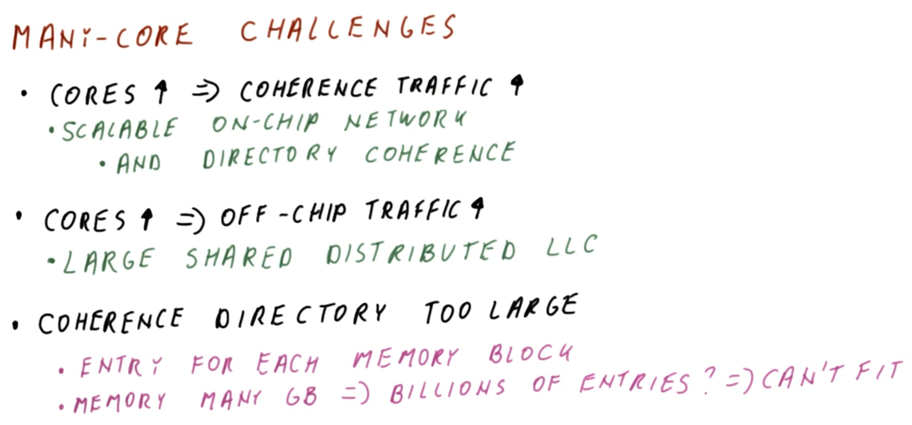
</center>

Returning to the challenges present in many-cores processors (cf. Section 2), recall (cf. Section 3) that there are indeed solutions to managing the increased on-chip coherence traffic as the number of cores grows via corresponding scalable on-chip networks supported by directory coherence.

Furthermore, recall (cf. Section 6) that there are also solutions to managing the increased off-chip traffic as the number of cores grows via a corresponding large, shared distributed last level cache (LLC).

However, there is still another problem: The **coherence directory** required in order to manage the scalable on-chip network ***too large*** to fit on a chip.
  * A traditional directory has ***one*** entry for ***each*** possible memory block.
  * However, in practice, the memory can reach a size of many gigabytes, which would correspondingly require *billions* of such directory entries, well beyond the physical capacity of a chip.

So, then, how to solve this problem? This is discussed in the next section.

### 9. On-Chip Directory: Part 1

<center>

</center>

The directory must fit on the chip, otherwise maintaining coherence between the caches (which are very fast) will require searching through a directory in very slow memory, which essentially negates the purpose of having these fast caches in the first place.

Some of the questions regarding this directory are relatively straightforward to answer, namely: Where should the home node (which contains the directory information regarding the cache block in question) be placed? → It is simply placed in the ***same*** tile that contains the corresponding distributed last-level cache (LLC) slice
    * If the directory entry for this cache block indicates that none private caches contain the block, then the last level cache (LLC) is consequently used to locate that block; therefore, it is sensible to do so in the same node containing the directory in question, otherwise there would be a lot of (otherwise superfluous) traffic between the location of the directory and that of the last level cache (LLC) containing the block in question, so they naturally should co-exist in the same node.

However, this does not address another fundamental question: How to manage the scaling issue of having a directory entry for ***every*** memory block?
  * Recall (cf. Section 6) that the last level cache (LLC) slice only contains the cache-blocks data for those blocks which are actually present in the last level cache (LLC).
  * However, without any other changes, the directory would need to contain *every* possible memory block that might ever be placed in that particular slice (but there are ***many*** such prospective memory blocks).

To resolve this matter, a key ***insight*** is that the entries which are ***not*** present in the last level cache (LLC) (or otherwise not in any of the other caches on the chip) are also correspondingly ***not*** shared by any of the tiles, therefore it is unnecessary to maintain this information anywhere in the chip in the first place.

Therefore, a **partial directory** is used accordingly.
  * Rather than maintaining an entry for ***every*** memory block, instead the partial directory has a ***limited*** number of entries.
  * Furthermore, entries are only allocated in this limited directory for those cache blocks which have at least ***one*** presence bit (cf. Lesson 19) set to value `1` (i.e., only those blocks which may be present in at least ***one*** of the private caches in that particular tile).
    * Therefore, for a cache block which is known to be ***absent*** in both the level 1 (L1) and level (L2) caches, but rather the cache block is only present in either the last level cache (LLC) or in main memory, it is otherwise unnecessary to maintain a directory entry for such a cache block (i.e., implicitly, the corresponding "entry" for such a block would be the trivial case of all `0` presence-bit values).

However, even with such a partial directory, upon many such allocations, eventually the directory entries will be "exhausted"; so, then, how to resolve this issue?

### 10. On-Chip Directory Quiz and Answers
