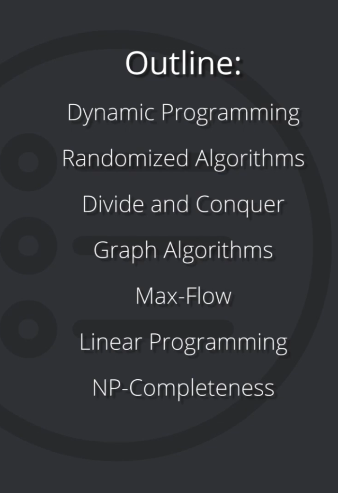

# Course Introduction

This course, **Graduate Algorithms**, is a theory course. As such, it is heavily mathematical in nature.

The course begins with **dynamic programming**.

Next, the course quickly reviews **randomized algorithms**, including cryptography and hashing.

Next, the course will examine some more sophisticated **divide and conquer** algorithms, including the fast Fourier transform (FFT) algorithm.

Next, the course will examine **graph algorithms**, using depth-first search (DFS) for connectivity problems on directed graphs. We will also look at some applications, including the 2-SAT problem and the PageRank algorithm (which is at the heart of the Google search engine).

Next, the course will examine specific graph algorithms dealing with the **max-flow** problem.

Next, the course will examine **linear programming**, a powerful and widely used tool for optimization problems.

Finally, in the last section of the course, we will examine computational complexity via the theory of **NP-completeness**.
